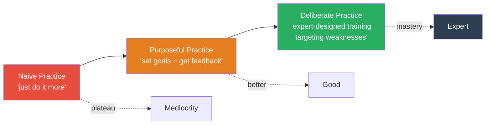
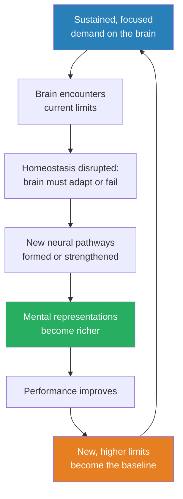
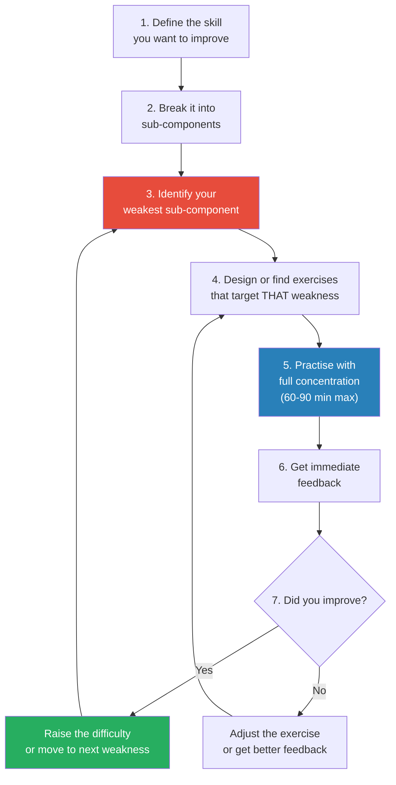
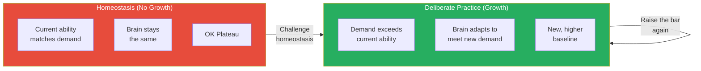
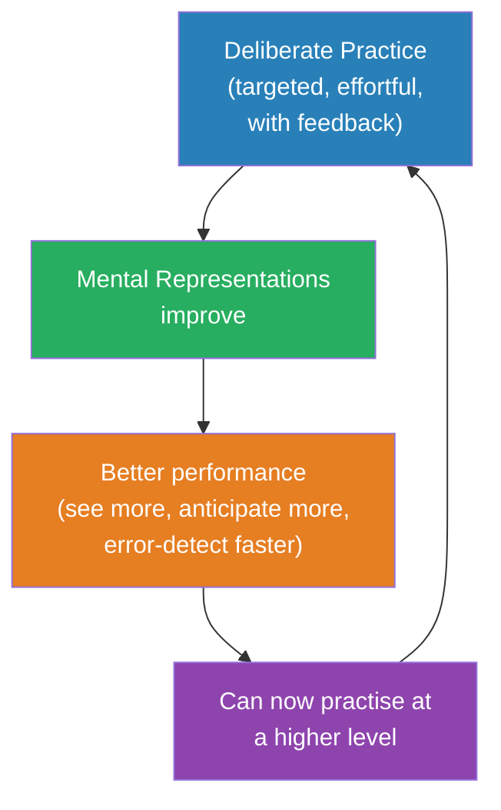
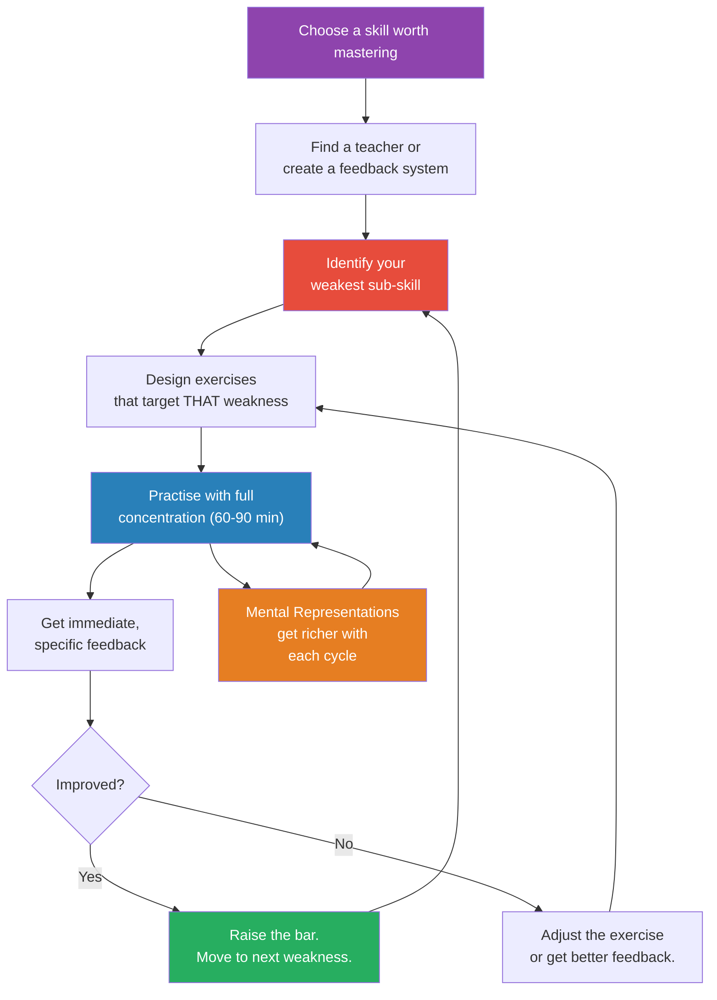

# Peak — Anders Ericsson

> Malcolm Gladwell told the world it takes 10,000 hours to become an expert. He got it from Anders Ericsson's research. Ericsson says Gladwell got it wrong.
> It's not about hours. It's about what you do during those hours. Naive practice — just doing something repeatedly — produces a plateau, not mastery.
> Deliberate practice — targeted, feedback-rich, uncomfortable effort designed by a teacher to address specific weaknesses — is what produces world-class performance.
> And the mechanism is not mysterious: experts build increasingly sophisticated mental representations — internal models that let them see what novices cannot.

---

## About the Author

Anders Ericsson (1947–2020) was a Swedish psychologist and Conradi Eminent Scholar at Florida State University.
He spent three decades studying expert performers across domains — chess, music, sports, medicine, memory — and became the world's foremost researcher on the science of expertise.
His landmark 1993 paper, "The Role of Deliberate Practice in the Acquisition of Expert Performance," fundamentally changed how researchers think about talent, skill, and human potential.

Ericsson's research showed, consistently and across dozens of domains, that what separates experts from everyone else is not innate talent but the quantity and quality of their practice. This finding was both liberating (anyone can improve) and uncomfortable (there are no shortcuts).

Malcolm Gladwell popularised Ericsson's work in *Outliers* (2008), reducing the nuanced research to a catchy soundbite: "It takes 10,000 hours to become an expert." Ericsson was deeply frustrated by this simplification. The 10,000-hour figure was an average across a specific study of violinists — not a universal rule. And more importantly, it ignored the most critical variable: what you do during those hours. *Peak* was written, in part, as a correction.

Co-author Robert Pool is a science writer who helped translate Ericsson's academic work into accessible prose. The collaboration was essential — Ericsson's academic writing, while rigorous, was dense and not designed for popular audiences. Pool brought the storytelling that makes the research come alive.

> [!example] The Frustration That Became a Book
> Imagine spending 30 years conducting careful research on expertise, only to have a journalist reduce your life's work to a soundbite that gets the central message wrong. That is what happened when Gladwell published *Outliers*. The "10,000 hours" rule became one of the most famous ideas in popular psychology — and Ericsson spent the rest of his career correcting it. *Peak* is that correction: the complete, nuanced account of what the research actually shows, written by the researcher himself.

> [!warning] The 10,000-Hour Misunderstanding
> Gladwell's "10,000 hours" rule implies that time alone produces expertise. Ericsson's actual research shows the opposite: <b style="color: #e74c3c">it is not the hours that matter — it is the type of practice within those hours.</b> A guitarist who plays the same songs for 10,000 hours will remain mediocre. A guitarist who spends 10,000 hours on targeted exercises addressing specific weaknesses, with expert feedback, will become exceptional. Same hours. Completely different outcomes.

---

## The 30-Second Version

If you have 30 seconds:

1. **Talent is overrated.** Expert performance in virtually every field is the result of practice, not innate ability.
2. **Not all practice is equal.** Naive practice (just doing it) produces plateaus. Deliberate practice (structured, effortful, targeting weaknesses) produces mastery.
3. **The mechanism is mental representations.** Experts build rich internal models that let them see patterns, anticipate outcomes, and make decisions invisible to novices.
4. **You need feedback.** Without knowing what you're doing wrong, you can't improve — no matter how many hours you put in.
5. **The brain adapts to demands.** London taxi drivers grow larger hippocampi. Musicians develop greater cortical representation of their fingers. The brain physically changes in response to sustained, focused challenge.
6. **There is no "natural talent" ceiling** for most people in most domains. The ceiling is how much deliberate practice you're willing to do.

> [!tip] The Diagnostic Question
> If you've been doing something for years without improving, ask: "Am I practising deliberately?" If the answer is no — if you're just doing the activity without targeting weaknesses, without feedback, without pushing beyond your comfort zone — then you're on the OK Plateau. You haven't reached your limit. You've reached the limit of your practice METHOD. Change the method and the improvement will follow.

---

## Key Concepts at a Glance

| Concept | Definition | Why It Matters |
|---------|-----------|----------------|
| **Naive Practice** | Doing an activity repeatedly without specific goals or feedback | Produces a plateau — most people never go beyond this |
| **Purposeful Practice** | Practice with specific goals, focused attention, and feedback | Better than naive, but limited without expert guidance |
| **Deliberate Practice** | Purposeful practice + expert-designed training methods targeting specific weaknesses | The gold standard — produces genuine expertise |
| **Mental Representations** | Rich internal models that experts build through practice | The cognitive mechanism that separates experts from novices |
| **The OK Plateau** | The point where you stop improving because the skill became automatic | Breaking through requires making the automatic conscious again |
| **Homeostasis** | The brain's tendency to resist change and seek equilibrium | Deliberate practice is a sustained challenge to homeostasis |
| **The Comfort Zone Model** | Learning happens only at the edge of current ability | Too easy = no adaptation. Too hard = breakdown. Just beyond = growth. |
| **Chunking** | Grouping information into meaningful units for easier processing | How experts compress complex patterns into manageable chunks |
| **The 10,000 Hour Myth** | Gladwell's oversimplification of Ericsson's research | Hours are meaningless without the right TYPE of practice |
| **Neuroplasticity** | The brain physically changes in response to sustained demand | Your current ability is not your permanent potential |

---

## The Big Idea

- <b style="color: #2980b9">Expertise is not born — it is built through deliberate practice: structured, effortful training designed to improve specific aspects of performance</b>
- The "10,000 hours" rule is misleading because it ignores the type of practice. 10,000 hours of naive practice produces mediocrity, not mastery.
- <b style="color: #27ae60">The key cognitive mechanism is mental representations — rich internal models that experts build through years of deliberate practice, allowing them to perceive patterns, anticipate outcomes, and make decisions that are invisible to novices</b>
- The brain is not a fixed machine — it physically changes in response to sustained, focused demand (neuroplasticity)
- There is no evidence of a "talent ceiling" for most skills — the limit is practice quality, not genetic endowment

### The Three Claims That Change Everything

1. **Practice type matters more than practice time.** This destroys the "10,000 hours" myth and replaces it with something more useful: if you're not improving, the problem is not insufficient hours — it's insufficient quality.

2. **The brain is plastic.** It literally grows new neural structures in response to sustained demand. Your current ability level is a description of your CURRENT brain — not your permanent potential.

3. **Expert performance is not mysterious.** Experts have built rich mental representations through years of deliberate practice. These representations are the product of work, not of genes. They are available to anyone willing to do the work.

> [!danger] The Uncomfortable Corollary
> If expertise is built rather than born, then your current mediocrity (at whatever you're mediocre at) is not a fixed condition. It is a choice. You are choosing — every day you don't practise deliberately — to remain at your current level. That is both empowering and uncomfortable. Empowering because it means improvement is available. Uncomfortable because it means you can no longer blame your genes.

---

## The Practice Spectrum

| Level | Name | Description | Result |
|-------|------|-------------|--------|
| 1 | **Naive Practice** | Just doing the activity repeatedly with no specific goals | Plateau after initial improvement |
| 2 | **Purposeful Practice** | Specific goals, concentrated effort, feedback, pushing beyond comfort zone | Significant improvement, but eventually hits limits |
| 3 | **Deliberate Practice** | All of purposeful practice PLUS: established training methods, expert coaching, exercises targeting weaknesses, practice at the edge of ability | Expert performance |

---

## Chapter-by-Chapter Deep Dive

### Chapter 1: The Power of Purposeful Practice

The book opens with the Steve Faloon experiment — one of the most famous studies in the science of expertise.

Steve Faloon was an ordinary Carnegie Mellon undergraduate with an ordinary memory span of about 7 digits — the same as most people. Ericsson challenged him to memorise increasingly longer sequences of random digits, with immediate feedback after each attempt.

In the first few sessions, Faloon hit a wall at 8 or 9 digits. But instead of quitting, he began developing strategies — chunking the digits into meaningful groups (running times, since he was a runner), creating retrieval structures, and building hierarchical memory systems.

After 200+ hours of practice across two years, Faloon could remember 82 random digits.

> [!example] What Steve Faloon's Story Proves
> Faloon didn't have a special brain. Tests before and after confirmed his working memory was normal. What changed was his mental representations — the internal structures he built for encoding, storing, and retrieving information. The same brain, working with better software, produced performance that would seem impossible without context. This is the entire thesis of the book in one case study.

Faloon's story contains two additional insights that Ericsson emphasises:

1. **The strategies evolved.** Faloon's initial approach (rote repetition) hit a ceiling quickly. He had to develop new strategies — chunking digits into meaningful groups, creating hierarchical structures, building retrieval cues — each of which expanded his capacity. When one approach plateaued, he invented a new one. This is the pattern of expertise development in every field.

2. **The methods were transferable.** After Faloon's success was published, other researchers trained new subjects using similar methods. They achieved similar results — confirming that the improvement was a product of the practice method, not of Faloon's individual characteristics. The method, not the person, was the cause.

The chapter introduces the distinction between **naive practice** (just doing the activity) and **purposeful practice** (doing it with goals, focus, and feedback). Ericsson identifies four requirements for purposeful practice:

1. **Specific goals** — "Memorise one more digit than yesterday" not "get better at memorising"
2. **Full concentration** — No distractions, no autopilot
3. **Immediate feedback** — Know right away whether you succeeded or failed
4. **Getting out of your comfort zone** — If it's easy, you're not improving

> [!tip] The Purposeful Practice Test
> Ask yourself about any activity you're trying to improve:
> - Do I have a specific goal for this session? (Not "get better" but "improve X by Y amount")
> - Am I giving it my full attention?
> - Am I getting feedback on each attempt?
> - Am I working on something I can't currently do?
> If any answer is no, you're doing naive practice — and your improvement has probably plateaued.

### Chapter 2: Harnessing Adaptability

This chapter presents the neurological evidence that the brain physically changes in response to sustained practice.

**London Taxi Drivers:** To earn their licence, London cabbies must pass "The Knowledge" — a gruelling exam requiring memorisation of 25,000 streets, thousands of landmarks, and hundreds of optimised routes. The training takes 3–4 years. Neuroscientist Eleanor Maguire used MRI scans to compare taxi drivers' brains with those of bus drivers (who follow fixed routes). The taxi drivers had significantly larger posterior hippocampi — the brain region responsible for spatial navigation. The longer they'd been driving, the larger the growth.

- <b style="color: #2980b9">The brain grew in response to the demand. This is not metaphorical — it is anatomical.</b>

**Other examples of brain adaptation:**
- Professional musicians have enlarged cortical representations of the fingers they use most
- Juggling practice increases grey matter density in areas related to visual-motor coordination
- Braille readers develop expanded somatosensory cortex for their reading fingers

> [!success] The Hopeful Implication
> If the brain can physically grow and rewire in response to practice, then "I'm not naturally talented at this" is not a permanent condition — it is a description of your current brain state, which is changeable. The brain you have today is not the brain you'll have after 1,000 hours of deliberate practice.

### Chapter 3: Mental Representations

This is the theoretical heart of the book. Mental representations are the cognitive mechanism that explains expert performance.

A mental representation is an internal model that corresponds to some pattern in the external world. But expert mental representations are qualitatively different from novice ones — they are richer, more detailed, more hierarchical, and more action-oriented.

**Chess grandmasters** don't see 32 individual pieces on a board. They see configurations — attack patterns, defensive structures, strategic opportunities. When shown a chess position from a real game for 5 seconds, grandmasters can reconstruct it almost perfectly. When shown randomly placed pieces, their memory is no better than a beginner's. They don't have better memory — they have better pattern recognition.

**Expert firefighters** don't analyse a burning building variable by variable. They walk in and immediately sense what's wrong — "the fire is in the basement," "the floor is about to collapse" — because their mental representations compress thousands of fire experiences into instant pattern recognition.

**Expert radiologists** can spot tumours in X-rays that are invisible to residents — not because their eyes are sharper, but because their mental representations tell them what to look for and where.

> [!danger] The Expert Illusion
> Because experts' mental representations operate largely below conscious awareness, experts often can't explain how they do what they do. A chess grandmaster "just sees" the right move. A master chef "just knows" the dish needs more acid. This creates the illusion of innate talent — it looks like magic because the underlying representations are invisible. But they were built, rep by rep, over years of deliberate practice.

| Novice Mental Representation | Expert Mental Representation |
|-----------------------------|----------------------------|
| Sees individual elements | Sees patterns and relationships |
| Processes sequentially | Processes in parallel |
| Relies on conscious analysis | Relies on pattern recognition |
| Slow, effortful, error-prone | Fast, automatic, accurate |
| Cannot anticipate what comes next | Anticipates multiple steps ahead |
| Needs to think about each step | Chunks steps into fluid sequences |

### Chapter 4: The Gold Standard — What Makes Practice "Deliberate"

This chapter defines the criteria that separate deliberate practice from all other forms of practice.

Deliberate practice requires:

1. **An established field with well-defined performance metrics** — You can measure improvement objectively
2. **Expert teachers who know what good training looks like** — Someone who has trained other experts and knows the pedagogy
3. **Training exercises specifically designed to improve targeted aspects of performance** — Not generic practice, but exercises that address your specific weaknesses
4. **Practice at the edge of current ability** — Always working on what you cannot yet do
5. **Full concentration and conscious effort** — This is NOT "flow." Deliberate practice is uncomfortable.
6. **Immediate, informative feedback** — Not just "right/wrong" but "why" and "how to fix it"

> [!warning] Deliberate Practice Is Not Flow
> A common misconception: people think "deliberate practice" means "being in the zone" or "flow state." It is the opposite. Flow feels effortless because you're operating within your current ability. Deliberate practice feels effortful because you're operating beyond it. The violinist in flow is performing. The violinist doing deliberate practice is struggling with a passage they can't yet play. Both are valuable — but only one produces improvement.

| Practice Type | Feels Like | Produces |
|--------------|-----------|----------|
| Naive | Comfortable, automatic | Plateau |
| Purposeful | Challenging, focused | Improvement (with limits) |
| Deliberate | Uncomfortable, frustrating, effortful | Expert performance |
| Flow/Performance | Effortless, joyful | Execution of existing skill (no new learning) |

### Chapter 5: Deliberate Practice on the Job

This is one of the most practically valuable chapters. How do you apply deliberate practice in professional contexts where there are no coaches, no established training methods, and no clear performance metrics?

Ericsson's answer: create your own deliberate practice system.

**The Top Gun Model:** In the early days of the Vietnam War, the US Navy's kill ratio dropped dramatically. Pilots were trained well enough to fly, but not well enough to fight. The Navy created Top Gun — an intensive training programme where pilots practised dogfighting against instructors flying enemy tactics. Every engagement was followed by detailed debriefing. The kill ratio tripled.

- <b style="color: #27ae60">The Top Gun approach: create realistic simulations, practise under pressure, get immediate expert feedback, focus on weaknesses, repeat.</b>

**Applying this to knowledge work:**
- A doctor who wants to improve diagnostic accuracy can review cases where they were wrong, analyse why, and study the correct diagnosis
- A manager who wants to improve feedback conversations can role-play difficult scenarios with a coach
- A writer who wants to improve can study exemplary writing, identify specific techniques, and practise them in isolation

> [!tip] The Deliberate Practice Audit for Your Job
> 1. What specific skills does your job require?
> 2. Which of those skills are you weakest at?
> 3. How can you practise that specific skill in isolation?
> 4. How can you get feedback on your practice?
> 5. Who in your field can serve as a coach or model?
> Most professionals never ask these questions. They do their job, get experience, and assume experience equals improvement. It doesn't — unless the experience is structured as deliberate practice.

### Chapter 6: Deliberate Practice in Everyday Life

This chapter addresses the individual learner who doesn't have a coach or established training methods.

**Benjamin Franklin's Writing Method** — Franklin found essays he admired in *The Spectator*, made brief notes on each sentence's argument, waited several days, then tried to reconstruct the essays from his notes. He compared his versions to the originals, identified gaps, and repeated. He then tried writing the same arguments in verse (to expand his vocabulary), then converted back to prose. This is textbook deliberate practice — two centuries before the term existed.

Key principles for self-directed deliberate practice:
- **Find models of expert performance** — Study the best in your field. What do they do differently? How do they practise?
- **Break the skill into components** — Don't try to improve "writing." Improve sentence structure, then argumentation, then transitions, then opening hooks. Each component gets its own targeted practice.
- **Create feedback loops** — Record yourself, compare to models, use objective metrics, ask for honest assessment from people whose judgment you trust
- <b style="color: #2980b9">**Maintain motivation through structure** — Deliberate practice is hard. Schedule it. Limit sessions to 60–90 minutes. Build in rewards. Track progress visibly. When you can see the improvement on a chart, the discomfort becomes more tolerable.</b>
- **Be patient with the process** — Expertise is measured in years, not weeks. The compound returns of deliberate practice become visible around month 6 and become dramatic around year 3. Most people quit before they see the returns.

### Chapter 7: The Road to Extraordinary

This chapter tells the stories of child prodigies and extraordinary performers — and shows that in every case, the "extraordinary" part was built through practice.

**The Polgár Sisters:** László Polgár, a Hungarian educational psychologist, set out to prove that geniuses are made, not born. Before having children, he published a book arguing this thesis. He then trained his three daughters — Susan, Sofia, and Judit — in chess from early childhood using deliberate practice methods. All three became world-class. Judit became the strongest female chess player in history, once ranked 8th in the world overall.

> [!example] The Polgár Experiment
> The Polgár story is the closest thing we have to a controlled experiment in expertise development. László had a thesis, designed a training programme, and tested it on three subjects. All three achieved extraordinary results. Critics note that the sisters may have had genetic advantages — but the deliberate, systematic nature of their training makes it impossible to attribute their success to genetics alone. At minimum, the story proves that practice is necessary. At maximum, it suggests practice is sufficient.

**The Mozart Myth:** Mozart is the poster child for innate genius. But the facts tell a different story:
- His father Leopold was one of Europe's most accomplished music teachers
- Mozart began intensive, expert-guided training at age 3
- His early compositions were heavily arranged and edited by his father
- His first truly original masterwork didn't appear until he was 21 — after 18 years of intensive practice
- <b style="color: #e74c3c">Mozart was not born a genius. He was raised by one of the best music educators in Europe and trained from near-infancy. His "natural talent" was actually the world's most intensive early music education.</b>

### Chapter 8: But What About Natural Talent?

The most provocative chapter. Ericsson makes the strongest possible case against innate talent.

His argument:
1. In every field studied, the top performers practised significantly more than lesser performers
2. No one has ever been found who achieved expert performance without extensive practice
3. The "talent" that people observe in experts is actually the product of their mental representations — which were built through practice
4. Genetic factors may influence things like body size and basic temperament, but they do not determine the ceiling of skill development

> [!warning] The Nuanced Position
> Ericsson does NOT say genetics don't matter at all. He acknowledges that body size matters in basketball, that lung capacity matters in swimming, and that basic personality traits influence which activities people are drawn to. What he DOES say is: within the normal range of human variation, practice is the dominant factor in performance. The person who practises deliberately for 10,000 hours will almost always outperform the "naturally talented" person who practises naively for the same period.

### The Talent Myth in Detail

Ericsson devotes considerable attention to debunking specific talent myths:

**"Perfect pitch is innate."** Studies show that children who undergo musical training before age 6 can develop perfect pitch. Japanese children trained in Suzuki method develop it at high rates. It appears to be a product of early training, not genetic endowment.

**"Savants prove that talent is genetic."** Ericsson examines several "savant" cases and finds that, upon investigation, each involved extensive hidden practice. The child who draws photorealistic portraits at age 10 has typically been drawing obsessively since age 3 — accumulating thousands of hours of practice that adults don't notice because it happens during "play."

**"Some people just pick things up faster."** Ericsson concedes that initial learning speed varies. But he argues that initial speed is a poor predictor of ultimate skill level. The tortoise often beats the hare because the hare relies on "natural talent" and never develops a deliberate practice habit. The tortoise, aware of their limitations, builds a practice system that compounds over time.

| The Talent Story | The Practice Story |
|-----------------|-------------------|
| "She's a natural" | She started training at age 4 with an expert coach |
| "He has a gift for music" | He practised 4 hours a day for 15 years |
| "She just sees things others don't" | She built mental representations through thousands of cases |
| "He was born to do this" | He was trained to do this, starting earlier than anyone realised |
| "She has perfect pitch" | She was trained in tonal recognition before age 6 |
| "He's a prodigy" | He accumulated thousands of hours before anyone noticed him |

> [!example] The Deliberate Myth-Busting of Mozart
> The Mozart story is the gold standard of the talent myth, so Ericsson takes it apart piece by piece:
> - Mozart's father Leopold was one of Europe's best music teachers and wrote the definitive textbook on violin instruction
> - Mozart began intensive, expert-guided training at age 3 — earlier than virtually any other musician of his era
> - His early compositions were heavily arranged and edited by his father — they were not independent creations
> - His first truly original masterwork (*Piano Concerto No. 9*) did not appear until he was 21 — after 18 years of intensive, expert-guided practice
> - By the time Mozart produced work that we now consider "genius," he had accumulated more deliberate practice than almost any musician alive
>
> <b style="color: #e74c3c">Mozart was not born a genius. He was raised by one of the best music educators in Europe and trained from near-infancy. His "natural talent" was actually the world's most intensive early music education — starting earlier, guided more expertly, and sustained more consistently than anyone else's.</b>

### Chapter 9: Where Do We Go From Here?

The final chapter looks at the implications of deliberate practice for education, parenting, and society.

- **Education is broken** because it focuses on knowledge transfer (lectures, reading) rather than skill building (practice, feedback, iteration)
- **The factory model of education** assumes students are passive recipients of information. Deliberate practice shows they should be active builders of mental representations.
- <b style="color: #27ae60">The most effective teaching looks like coaching: identifying where the student is, designing exercises that target their specific weaknesses, providing immediate feedback, and gradually increasing difficulty.</b>

> [!success] The Hopeful Message
> If expertise is built rather than born, then the potential of every person is much greater than the talent model suggests. The question is not "do I have talent?" but "am I willing to practise deliberately?" The answer to the first question is irrelevant. The answer to the second question determines everything.

---

## Apply Deliberate Practice to Your Life: A Practical Roadmap

### Step 1: Choose Your Skill (Week 1)

Pick ONE skill to develop deliberately. Not five. Not three. One. The power law applies: one exceptional skill is worth more than ten mediocre ones.

Questions to help you choose:
- What skill, if I developed it to an expert level, would transform my career?
- What skill do I enjoy enough to sustain years of uncomfortable practice?
- What skill is valuable in my industry but rare? (Supply and demand: rare and valuable skills command the highest returns)

### Step 2: Find Your Teacher (Week 2-4)

Deliberate practice without a teacher is possible but dramatically less efficient. A good teacher:
- Has trained other people to expert level (not just performed at that level themselves)
- Knows the field's established training methods
- Can diagnose YOUR specific weaknesses and design exercises that target them
- Provides immediate, specific feedback

> [!tip] If You Can't Find a Teacher
> For some skills, formal coaches don't exist. In that case:
> - Study models of expert performance (books, recordings, examples)
> - Design your own exercises by reverse-engineering what experts do
> - Create feedback loops: record yourself, compare to models, track metrics
> - Join a community of practitioners for peer feedback
> - Use AI tools for feedback where applicable (language learning, writing, coding)

### Step 3: Design Your Practice (Month 1-3)

| Element | Your Version |
|---------|-------------|
| **Specific goal for this month** | (e.g., "Improve my public speaking transitions from rated 3/10 to 6/10") |
| **Your weakest sub-skill** | (e.g., "Transitions between slides — I lose the audience's attention") |
| **Practice exercise** | (e.g., "Practise transitions only — 10 per session, recorded, reviewed with coach") |
| **Feedback method** | (e.g., "Coach reviews recordings and rates each transition") |
| **Practice schedule** | (e.g., "3 sessions per week, 45 minutes each, Tuesday/Thursday/Saturday") |
| **Metric for improvement** | (e.g., "Transition ratings from coach improve from 3 to 6 within 8 weeks") |

### Step 4: Sustain the Practice (Month 3+)

This is where most people fail. The excitement of starting fades. The discomfort of working on weaknesses is relentless. The improvement is slow and invisible.

Ericsson's advice for sustaining deliberate practice:
- **Limit sessions to 60-90 minutes.** Longer is not better — it's just more exhausting with diminishing returns.
- **Schedule practice like a meeting.** If it's not on the calendar, it won't happen.
- **Track progress visibly.** A chart showing your improvement over weeks is powerful motivation.
- **Build in rewards.** After each session, give yourself something enjoyable. The reward comes AFTER the practice.
- **Remember why.** Connect the practice to a goal that matters deeply to you — not just "get better at X" but "become the person who can do X."

> [!danger] The 3-Month Test
> Most people quit deliberate practice within 3 months. If you can sustain it past month 3, the habit has a good chance of sticking. The compound returns typically become visible around month 6 — and once you see them, motivation shifts from external (discipline) to internal (momentum). The hardest part is months 1-3. Plan for that.

---

## Deliberate Practice: A Practical Implementation Guide

### For Any Skill

### The OK Plateau: The Most Common Trap in Skill Development

This is one of the most practically useful concepts in the book. The OK Plateau explains why most people stop improving after their initial learning phase.

**The pattern:**
1. You start learning a new skill — typing, cooking, driving, managing
2. You improve rapidly at first (everything is new; the brain is building fresh neural pathways)
3. You reach a functional level — "good enough" to get the job done
4. The skill becomes automatic — you stop paying conscious attention to it
5. You plateau. Years pass. You don't get better. You get more experienced — but not more skilled.

- <b style="color: #e74c3c">Most people mistake experience for expertise. Ten years of experience is NOT ten years of improvement — it is one year of improvement followed by nine years of repetition.</b>

> [!example] The Typing Plateau
> Almost everyone learns to type. Almost no one gets faster after the first year. You learned enough to be functional, then stopped paying attention to your technique. Your speed plateaued — not because of a physical limit, but because you stopped practising deliberately. Studies show that typists who deliberately practise — identifying their slowest finger transitions, designing drills to target them, using typing software that tracks errors — can dramatically increase their speed after years on the plateau. The limit was never physical. It was attentional.

### Breaking Through the Plateau

Ericsson identifies three strategies for breaking through:

1. **Make the automatic conscious again.** Film yourself. Track your errors. Measure your performance objectively. You can't improve what you can't see.

2. **Design exercises that target your weakest component.** Don't practise what you're already good at (that's comfortable but useless). Practise what you're worst at (that's uncomfortable but transformative).

3. **Get expert feedback.** A teacher or coach can see things you can't. They know the field's training methods. They can design the right exercises for your specific weaknesses.

| Plateau Behaviour | Breakthrough Behaviour |
|-------------------|----------------------|
| Practise the same way every time | Vary your practice deliberately |
| Focus on what you're already good at | Focus on your weakest skill |
| Practise on autopilot | Practise with full, conscious attention |
| No feedback or only general feedback | Seek specific, immediate feedback |
| Avoid discomfort | Seek productive discomfort |
| Measure time spent ("I practised for an hour") | Measure improvement ("I improved X by Y%") |

> [!tip] The Plateau Diagnostic
> Ask yourself about any skill you've been practising for more than a year:
> 1. Am I measurably better than I was a year ago?
> 2. Can I identify specific weaknesses in my performance?
> 3. Am I practising those weaknesses deliberately?
> 4. Am I getting feedback from someone who can see what I can't?
> If any answer is no, you are on the OK Plateau. You are accumulating experience, not building expertise.

### Deliberate Practice in Common Domains

| Domain | What Naive Practice Looks Like | What Deliberate Practice Looks Like |
|--------|-------------------------------|-----------------------------------|
| **Writing** | Writing a lot and hoping it improves | Studying great writers, identifying specific techniques, practising one technique per session, comparing your output to models |
| **Public Speaking** | Giving presentations and getting general feedback | Recording yourself, watching with a coach, identifying specific weaknesses (pacing, pauses, structure), practising those in isolation |
| **Programming** | Writing code all day at work | Solving algorithmic challenges targeting weak areas, studying others' code reviews, time-boxing problems to build speed |
| **Management** | Running meetings and hoping to get better | Role-playing difficult conversations, getting 360-degree feedback on specific behaviours, working with an executive coach |
| **Music** | Playing through your favourite songs | Isolating difficult passages, practising at slow tempo with metronome, recording and comparing to reference performances |
| **Chess** | Playing lots of games | Studying annotated grandmaster games, solving tactical puzzles targeting specific weaknesses, analysing your own games for patterns of error |
| **Sales** | Making calls and hoping to improve | Recording calls, analysing with a coach, identifying specific objection-handling weaknesses, role-playing those scenarios |
| **Negotiation** | Negotiating and learning from outcomes | Studying specific tactics, role-playing with feedback, reviewing recordings, analysing where you lost value |

### Deliberate Practice for Knowledge Workers

This is the hardest domain to apply deliberate practice — because knowledge work has few established training methods, unclear performance metrics, and almost no coaching infrastructure. But Ericsson offers a framework:

1. **Identify the specific sub-skills of your job.** A product manager needs: stakeholder communication, data analysis, strategic thinking, prioritisation, presentation. These are separate skills with different practice methods.

2. **Find your weakest sub-skill.** Ask your colleagues and manager: "What is the one thing I could improve that would make the biggest difference?" Their answer identifies your target.

3. **Design practice exercises.** For communication: rehearse difficult conversations with a colleague. For data analysis: take a known dataset and try to derive conclusions, then compare with an expert's analysis. For prioritisation: practise frameworks on past decisions and evaluate outcomes.

4. **Create feedback loops.** Record your presentations and review them. Write post-mortems after projects. Ask for specific, actionable feedback — not "how am I doing?" but "what specifically could I improve about how I ran that meeting?"

> [!warning] The Deliberate Practice Paradox for Knowledge Workers
> The paradox: knowledge workers spend their entire day working but almost no time practising. A professional musician might spend 4 hours performing and 4 hours practising. A professional knowledge worker spends 8-10 hours performing and 0 hours practising. <b style="color: #e74c3c">This means most knowledge workers stop improving after their first year or two — they reach the OK Plateau and stay there for the rest of their careers.</b> The ones who break through are the ones who carve out time for deliberate practice: reviewing their performance, targeting weaknesses, and seeking specific feedback.

### The 1-Hour Deliberate Practice Session

> [!tip] How to Structure a Practice Session
> 1. **Warm-up** (5 min): Review what you worked on last time. What was the specific weakness you targeted?
> 2. **Define today's goal** (2 min): What specific micro-skill will you work on? Be precise.
> 3. **Practice** (40 min): Work on that specific skill with full concentration. Expect frustration. Expect failure. That is the point.
> 4. **Feedback** (10 min): Review your practice. Record yourself if possible. Compare to a model. What worked? What didn't?
> 5. **Reflect** (3 min): Write down what you learned and what you'll target next time.

---

## The Ericsson vs Gladwell Debate

The tension between Ericsson and Gladwell is more than academic — it shapes how millions of people think about talent and effort.

| | Gladwell's Claim (*Outliers*) | Ericsson's Actual Research (*Peak*) |
|--|-------------------------------|-------------------------------------|
| **The rule** | 10,000 hours of practice = expertise | There IS no universal hour number |
| **What matters** | Time spent | Type of practice done during that time |
| **Talent's role** | Barely mentioned | Acknowledged but subordinate to practice |
| **The message** | "Anyone can become great with enough practice" | "Anyone can improve dramatically with the RIGHT practice" |
| **The risk** | People practise naively for 10,000 hours and expect mastery | People may underestimate the effort required |
| **Accessibility** | Extremely catchy and memorable | More accurate but less viral |

> [!example] Where Gladwell Helped and Where He Hurt
> **Where he helped:** Gladwell made the idea of "practice over talent" mainstream. Before *Outliers*, most people assumed expertise was primarily genetic. Gladwell shifted the conversation toward effort. That was valuable.
>
> **Where he hurt:** By reducing the message to "10,000 hours," Gladwell implied that all hours are equal. This led millions of people to practise naively — logging hours without targeting weaknesses, without feedback, without expert guidance — and wondering why they weren't improving. <b style="color: #e74c3c">The 10,000 hours myth is Gladwell's most dangerous simplification: it tells people that time alone produces expertise, when in fact time without structure produces only the OK Plateau.</b>

---

## The Adaptability of the Human Brain

Ericsson devotes significant attention to the brain's remarkable ability to change in response to sustained demand. This is not metaphorical — it is anatomical.

### The Evidence for Brain Plasticity

| Study | What Changed | How Long |
|-------|-------------|---------|
| **London taxi drivers** | Larger posterior hippocampi (spatial navigation) | 3-4 years of "The Knowledge" training |
| **Professional musicians** | Enlarged motor cortex for playing hand | Years of practice from childhood |
| **Jugglers** | Increased grey matter in visual-motor areas | 3 months of practice |
| **Braille readers** | Expanded somatosensory cortex for reading finger | Years of daily reading |
| **Mathematicians** | Increased grey matter in parietal lobes | Years of advanced study |

- <b style="color: #27ae60">The brain is not a fixed organ. It is a dynamic, adaptive system that physically rewires itself in response to sustained demand.</b>
- This means "I'm not naturally talented at X" is a statement about your CURRENT brain — not about your brain's permanent potential
- With sustained deliberate practice, the brain literally grows new structures to meet the demand

> [!success] The Hopeful Message
> If London taxi drivers can grow larger hippocampi by memorising streets, and musicians can grow larger motor cortices by practising scales, then your brain can develop the structures needed for whatever skill you choose to build. The only requirements are: sustained demand (deliberate practice), adequate time (months to years), and appropriate rest (including sleep, which is when consolidation happens).

### Homeostasis: Why the Brain Resists Change

The brain actively resists change. It seeks equilibrium — the state where current demands can be met without adaptation. This is efficient but limiting.

- If you do the same job the same way every day, your brain never needs to adapt
- <b style="color: #e74c3c">Deliberate practice is a sustained disruption of homeostasis — it creates a demand the brain cannot meet with its current structures, forcing it to build new ones</b>
- This is why deliberate practice feels uncomfortable: discomfort is the sensation of homeostasis being challenged. If practice feels easy, the brain is NOT adapting.

---

## The Violinists Study: The Research That Started Everything

Ericsson's most famous study — the one Gladwell popularised — deserves detailed treatment because it's often misunderstood.

In 1993, Ericsson studied violin students at Berlin's Music Academy, dividing them into three groups:
- **"Best" violinists** — students nominated by professors as future international soloists
- **"Good" violinists** — strong students expected to play in professional orchestras
- **"Music teachers"** — students who would become teachers, not performers

He tracked their accumulated practice hours from childhood to age 20:

| Group | Practice Hours by Age 20 |
|-------|:------------------------:|
| Best violinists | ~10,000 hours |
| Good violinists | ~8,000 hours |
| Music teachers | ~4,000 hours |

The critical finding was NOT just the hours. It was the type of practice:
- <b style="color: #2980b9">The best violinists spent more time in deliberate practice (working on difficult passages, with a teacher, targeting weaknesses) and less time in performance and enjoyable playing</b>
- They also structured their days differently: practising in focused morning sessions, napping in the afternoon (to recover), and practising again in the evening
- They rated practice as the most important activity AND the least enjoyable — because deliberate practice is not fun

> [!danger] What Gladwell Got Wrong
> Gladwell took the 10,000-hour finding and turned it into a rule: "10,000 hours = expertise." But Ericsson's actual finding was: "The best violinists practised more AND differently." The hours were a proxy for deliberate practice — and without the "deliberate" part, the hours are meaningless. A violinist who plays easy pieces for 10,000 hours will not become a soloist.

### The Daily Schedules of Elite Performers

One of the most interesting findings from the violinists study was HOW the best performers structured their days:

| Time | Best Violinists | Average Violinists |
|------|----------------|-------------------|
| **Morning** | Deliberate practice session #1 (focused, difficult, teacher-guided) | Mixed activities |
| **Late morning** | Break | Continue practising |
| **After lunch** | Nap (recovery and consolidation) | No nap |
| **Afternoon** | Deliberate practice session #2 | Leisure or light playing |
| **Evening** | Rest, recovery, sleep | Variable |

- <b style="color: #27ae60">The best performers practised LESS total time per day than average performers — but the time they did practise was of dramatically higher quality</b>
- They also slept more (including naps), recognising that rest is not the absence of practice but a critical component of it
- The takeaway: it is better to practise with full intensity for 3 focused hours than to practise with half attention for 6 hours

> [!tip] The Recovery Principle
> Deliberate practice depletes mental resources. You cannot do it all day. Ericsson found that even elite performers rarely sustain more than 4 hours of true deliberate practice per day. Beyond that, the quality drops and the risk of burnout or injury increases. The implication: if you're practising for 8 hours a day, you're not doing deliberate practice. You're doing something else and calling it practice.

---

## Mental Representations: The Deeper Theory

Mental representations are the most important concept in the book — and the least understood. They are the cognitive mechanism that explains WHY deliberate practice produces expertise.

### What Makes Expert Representations Different

| Feature | Novice Representation | Expert Representation |
|---------|---------------------|---------------------|
| **Content** | Surface features (what it looks like) | Deep structure (how it works) |
| **Organisation** | Flat list of facts | Hierarchical network of principles |
| **Scope** | One context | Multiple contexts |
| **Speed** | Slow, conscious processing | Fast, automatic pattern recognition |
| **Anticipation** | Cannot predict what comes next | Can anticipate multiple steps ahead |
| **Error detection** | Cannot tell when something is wrong | Immediately notices deviations from expected patterns |

> [!example] Medical Diagnosis: Expert vs Novice Representations
> A medical student examines a patient and sees symptoms: fever, cough, chest pain, elevated white blood cell count. They think through a differential diagnosis list sequentially, checking each possibility.
>
> An experienced physician examines the same patient and immediately recognises a pattern: "This looks like pneumonia." They don't think through a list — they PERCEIVE the diagnosis, because their mental representation of "pneumonia" includes the cluster of symptoms as a single recognisable unit.
>
> The expert is not smarter. They have richer mental representations — built through thousands of patient encounters — that compress complex information into recognisable patterns.

### How Mental Representations and Deliberate Practice Reinforce Each Other

This is a virtuous cycle: practice builds representations, better representations enable more effective practice, which builds even better representations. The cycle accelerates over time — which is why experts improve faster than intermediate performers, not slower. They have better representations to guide their practice.

### The "Seeing What Others Can't See" Effect

The most dramatic manifestation of expert mental representations is the ability to perceive things that are invisible to non-experts:

- A wine sommelier tastes 30+ distinct flavour components in a single sip — a novice tastes "red wine"
- A football coach watches a play and sees 11 players' positions, speed, and likely next moves — a casual viewer sees chaos
- A venture capitalist reads a pitch deck and sees five fatal flaws in 30 seconds — a novice sees an exciting business idea
- <b style="color: #2980b9">This is not superior sensory equipment. It is superior mental software. The experts' senses receive the same input. Their representations extract more information from it.</b>

> [!success] The Implication for Your Career
> In any field, the people who rise to the top are the ones who develop the richest mental representations of their domain. The best product managers don't just see features — they see user problems, market dynamics, and competitive positioning simultaneously. The best leaders don't just see people — they see motivations, capabilities, and team dynamics. Building these representations is not automatic. It requires deliberate practice: targeted effort, feedback, and years of accumulated experience PROCESSED into patterns.

---

## The Stages of Expertise Development

Ericsson identifies a common progression that experts follow across domains:

### Stage 1: Starting Out (Naive Practice)
- Learning basic skills through instruction and repetition
- Quick improvement (everything is new)
- Practice is mostly fun (novelty keeps motivation high)
- Duration: weeks to months

### Stage 2: The Purposeful Phase
- Setting specific goals, seeking feedback, pushing beyond comfort zone
- Improvement continues but slows
- Practice becomes harder (you're working on weaknesses, not strengths)
- Duration: months to years

### Stage 3: The Deliberate Phase
- Working with expert coaches using established training methods
- Improvement is slower but deeper — building expert-level mental representations
- Practice is uncomfortable much of the time
- Duration: years to decades

### Stage 4: Expert Performance
- Rich, automatic mental representations guide performance
- Continued improvement through increasingly sophisticated practice
- The paradox: experts practise MORE deliberately than anyone else, even though they're already the best
- Duration: ongoing (experts never stop practising)

> [!warning] The Dangerous Middle
> Most people quit in Stage 2. They've moved past the novelty of Stage 1, hit the OK Plateau, and concluded that they've reached their natural limit. They haven't. They've reached the limit of naive practice. Deliberate practice (Stage 3) can break through this barrier — but it requires accepting discomfort, seeking coaching, and targeting weaknesses instead of performing strengths. This is where the motivation gap is widest and where most aspiring experts are lost.

---

## Implications for Education and Society

Ericsson's final chapter extends his findings beyond individual skill development to education and societal structures.

### The Education System Is Backwards

Traditional education operates on a fixed-talent model: some students are "smart" and some are "not smart." The system sorts them accordingly: gifted programmes for the talented, remedial classes for the rest.

Ericsson's research demolishes this model:
- <b style="color: #e74c3c">There is no evidence of a fixed "talent ceiling" for most skills in most people. The ceiling is practice quality, not genetic potential.</b>
- Education should focus on building expertise through structured practice, not on sorting students by perceived ability
- The most effective teaching looks like coaching: identify the student's current level, design exercises that target their specific weaknesses, provide immediate feedback, and gradually increase difficulty

### The Teacher as Coach

| Traditional Teaching | Coaching-Based Teaching |
|---------------------|----------------------|
| Lecture → homework → test | Assessment → targeted exercises → feedback → reassessment |
| Same pace for all students | Individualised based on each student's weaknesses |
| Measures knowledge (what you know) | Measures skill (what you can do) |
| Feedback comes days or weeks later (graded tests) | Feedback is immediate (during practice) |
| Student role: passive absorber | Student role: active practiser |
| Teacher role: information deliverer | Teacher role: practice designer |

### The 10,000 Hours of Education We Already Have

Ericsson points out something striking: by the time a student graduates from high school, they've spent approximately 10,000 hours in a classroom. If those hours were structured as deliberate practice — with individual feedback, targeted exercises, and progressive difficulty — every student would be expert-level at something.

Instead, most of those hours are spent in passive lectures with minimal feedback. The 10,000 hours are wasted — not because the time isn't available, but because the practice structure is wrong.

<b style="color: #27ae60">This is Ericsson's most radical claim: the difference between expert performance and ordinary performance is not primarily genetic. It is structural. The experts had better practice systems. Give everyone better practice systems, and the gap shrinks dramatically.</b>

---

## Before and After: Learning With and Without Deliberate Practice

### Without Deliberate Practice

You decide to learn guitar. You buy a guitar, learn some chords from YouTube, and start playing songs you like. After six months, you can play 20 songs reasonably well. After a year, you can play 40 songs. After two years — you can play 40 songs. You've hit the OK Plateau. You're "pretty good" but not improving. You assume you've reached your natural ceiling. You tell people: "I'm just not talented enough to be really good."

### With Deliberate Practice

You decide to learn guitar. You find a teacher who has trained other skilled guitarists. You tell them your goal: "I want to play fingerstyle arrangements at an intermediate-advanced level within two years." Your teacher designs a training programme: scales at specific tempos (increasing weekly), sight-reading exercises, chord transition drills targeting your weakest changes, and weekly recording sessions where you compare your playing to reference recordings. After six months, you're worse at "playing songs" but better at every fundamental skill. After a year, you can play pieces you couldn't have imagined at month six. After two years, you're better than 90% of people who've played for a decade — because they practised naively and you practised deliberately.

> [!success] The Key Difference
> Both learners spent the same amount of time. Both cared about getting better. The only difference was the TYPE of practice: targeted vs untargeted, coached vs uncoached, weakness-focused vs comfort-focused. That structural difference — how you practise, not how long — is the entire message of *Peak*.

---

## Anders Ericsson's Legacy

Ericsson died on June 17, 2020, at the age of 72. He spent his entire academic career on a single research programme: understanding what separates expert performers from everyone else. His conclusions were:

1. Expert performance is primarily the product of deliberate practice, not innate talent
2. The brain is remarkably plastic and can develop extraordinary capabilities in response to sustained, focused demand
3. Mental representations — rich internal models built through practice — are the cognitive mechanism that explains expert performance
4. The methods of practice matter more than the hours spent practising

These findings have influenced fields ranging from sports science to medical education to military training to corporate development. The concept of "deliberate practice" has entered the mainstream vocabulary — even if its precise meaning is often diluted.

<b style="color: #2980b9">Ericsson's most important legacy is not a technique but a mindset shift: from "some people are talented and some are not" to "some people have practised deliberately and some have not."</b> That shift — from fatalism to agency — changes everything.

---

## The Verdict

*Peak* is the corrective the "10,000 hours" meme desperately needed. Ericsson's message is both more demanding and more hopeful than Gladwell's: expertise requires not just time but the right kind of time — and that kind of time is available to anyone willing to structure their practice deliberately.

The book is most powerful as a diagnostic tool: if you've been practising something for years without improving, you're almost certainly doing naive practice. Ericsson shows you exactly what to change.

The writing is clear but academic — Pool helps, but the book occasionally reads like a research paper with anecdotes rather than a narrative. Some readers will wish for more practical "how-to" and less "what we found in our study." But the stories — Faloon, the Polgárs, Franklin, the London cabbies, Mozart — are compelling and memorable.

The book's single most important insight: <b style="color: #27ae60">when you see extraordinary performance and think "they must be naturally talented," you are almost certainly wrong. What you're seeing is the visible tip of an invisible iceberg of structured, deliberate practice. The iceberg is available to anyone. Building it is the hard part.</b>

The legacy of this book extends far beyond its pages. Ericsson's research has influenced how sports teams train, how medical schools teach, how musicians practise, and how educators design curricula. The concept of deliberate practice has entered the mainstream vocabulary — and even its distortion (the 10,000-hour rule) has shifted the global conversation away from talent and toward effort.

Ericsson died in 2020, having spent his entire career on a single question: what separates the best from the rest? His answer — practice quality, not practice quantity; mental representations, not innate gifts — is one of the most important findings in the history of psychology.

---

## The Peak Framework in One Diagram

---

## The Core Message in Five Sentences

1. **Expertise is not born — it is built** through years of deliberate practice targeting specific weaknesses.
2. **The mechanism is mental representations** — rich internal models that let experts see what novices cannot.
3. **The brain physically changes** in response to sustained, focused demand. Your current abilities are not your permanent limits.
4. **Not all practice is equal.** Naive practice produces the OK Plateau. Deliberate practice produces mastery.
5. **The question is not "Am I talented enough?"** The question is "Am I willing to practise deliberately?" One question is about genetics. The other is about choice. Only the second one matters.

---

## Who Should Read This Book

| Reader | Why |
|--------|-----|
| **Anyone stuck on a plateau** | Ericsson will show you why you're stuck and what to change |
| **Parents** | Understanding deliberate practice transforms how you think about developing your children's abilities |
| **Teachers and coaches** | The book provides a scientific foundation for effective instruction |
| **Managers** | Team development should be structured as deliberate practice, not just experience accumulation |
| **Anyone who believes "I'm not talented enough"** | Ericsson's evidence may change that belief permanently |
| **Athletes looking for an edge** | The science behind what separates good from great |
| **Knowledge workers** | The framework for moving beyond the OK Plateau in professional skills |
| **Musicians** | The original research was on musicians — the applications are direct and specific |

---

## The Limitations

1. **The definition is restrictive.** Ericsson defines "deliberate practice" so narrowly that it only fully applies in domains with established training methods and expert coaches — music, chess, sports, certain medical procedures. For creative fields, entrepreneurship, or interpersonal skills, the framework is less directly applicable.

2. **The talent debate is oversimplified.** Ericsson makes the strongest possible case against innate talent, but the truth is likely more nuanced. Genetic factors clearly influence things like height, reaction time, and possibly working memory capacity. The question isn't whether genes matter — it's how much they matter relative to practice.

3. **The motivation problem.** The book explains what to practise but not how to sustain the motivation to do it. Deliberate practice is inherently unpleasant — it requires working on things you're bad at, experiencing constant failure, and resisting the temptation to do what's comfortable. Many readers will nod along and then continue practising naively.

4. **The privilege of access.** Expert coaching, structured training programmes, and hours of daily practice require resources — time, money, access to teachers. Ericsson acknowledges this briefly but doesn't grapple with it deeply.

5. **The recovery problem.** Ericsson discusses recovery (naps, sleep, rest days) but doesn't give it the emphasis it deserves. Modern sports science has shown that recovery is as important as practice — and that chronic overtraining produces burnout and injury, not expertise.

6. **The enjoyment gap.** Deliberate practice is, by definition, not enjoyable in the moment. Ericsson acknowledges this but doesn't offer much guidance on how to sustain a practice that feels unpleasant for years. The psychological challenge of maintaining motivation through years of uncomfortable practice is the book's biggest unaddressed problem.

7. **The team dimension.** Ericsson focuses on individual skill development. But many of the most important skills in modern work — collaboration, communication, collective problem-solving — are team skills that don't fit neatly into the individual deliberate practice framework.

8. **Measurement challenges.** In fields with clear metrics (chess rating, running speed, musical competitions), deliberate practice produces measurable improvement. In fields with ambiguous metrics (leadership, creativity, emotional intelligence), it's much harder to design exercises, measure progress, and know if you're improving. The book doesn't adequately address this measurement problem for "soft" skills.

> [!success] Despite the Limitations
> These limitations are real — but they do not diminish the book's core contribution. Ericsson's research is the most comprehensive investigation of human expertise ever conducted. The finding that practice quality matters more than practice quantity — and that the brain physically changes in response to the right kind of demand — is one of the most important findings in the history of psychology. The limitations tell you where the framework needs supplementation, not where it's wrong.

> [!warning] The Motivation Gap
> Knowing about deliberate practice and doing deliberate practice are separated by an enormous gap. The book gives you the map but not the engine. For the motivational component, pair this with [[Mindset - Carol S. Dweck|Mindset]] (believing you can improve), [[Deep Work - Cal Newport|Deep Work]] (creating the focused environment), and [[The Subtle Art of Not Giving a F-ck - Mark Manson|The Subtle Art]] (choosing which skills are worth the pain).

---

## Frequently Asked Questions

### "How many hours a day should I practise?"

Ericsson found that even elite performers rarely sustain more than 4 hours of TRUE deliberate practice per day. For beginners, 30-60 minutes is plenty. Quality matters infinitely more than quantity. One focused hour beats five distracted hours every time.

### "Can I start deliberate practice as an adult?"

Absolutely. Ericsson's research on adult learners shows that adults can develop expert-level skills in new domains — it just takes longer than starting in childhood. The brain remains plastic throughout life. The London taxi drivers didn't start learning "The Knowledge" until adulthood.

### "What if there's no established training method in my field?"

Create your own. Study the best performers. Identify what they do differently. Design exercises that target specific sub-skills. Create feedback loops. It won't be as efficient as a field with 200 years of pedagogical tradition — but it will be dramatically better than naive practice.

### "Is deliberate practice the same as 'deep work'?"

Related but different. Deep work (Cal Newport) is about distraction-free, focused concentration. Deliberate practice is about specifically targeting weaknesses with expert-designed exercises. You need deep work to DO deliberate practice — but not all deep work is deliberate practice. Writing a report is deep work. Practising your weakest presentation skill with a coach is deliberate practice.

### "What about 'flow'? Isn't that peak performance?"

Flow feels great and produces excellent execution of EXISTING skills. Deliberate practice feels uncomfortable and builds NEW skills. You perform in flow. You improve through deliberate practice. Both are valuable — but only one makes you better.

| Flow | Deliberate Practice |
|------|-------------------|
| Operating within current ability | Operating beyond current ability |
| Feels effortless | Feels effortful |
| Produces peak performance | Produces peak improvement |
| Automatic processing | Conscious, controlled processing |
| Enjoyable | Uncomfortable |
| Maintains current skill level | Raises skill level |

---

## Related Reading

- [[Deep Work - Cal Newport|Deep Work]] — Deep work is the environment in which deliberate practice happens; without distraction-free focus, no practice is truly deliberate
- [[A Mind for Numbers - Barbara Oakley|A Mind for Numbers]] — Oakley's "chunking" is the learning mechanism; Ericsson's "mental representations" are the expert-level result. Read both for the complete picture of how skill is built.
- [[Range - David Epstein|Range]] — Epstein's direct counterargument: early specialisation vs late sampling; both cite overlapping research with opposite conclusions. Read both to form your own view. The truth is likely a synthesis: deliberate practice within a domain, sampling across domains.
- [[So Good They Can't Ignore You - Cal Newport|So Good They Can't Ignore You]] — Newport's "career capital" is built through deliberate practice applied to professional skills. This is the career application of Ericsson's research.
- [[Mindset - Carol S. Dweck|Mindset]] — Growth mindset is the belief system that makes deliberate practice psychologically possible. Without believing you can improve, you won't sustain the effort.
- [[The Effective Executive - Peter Drucker|The Effective Executive]] — Drucker's focus on systematic self-improvement is deliberate practice applied to management
- [[How to Take Smart Notes - Sonke Ahrens|How to Take Smart Notes]] — Ahrens's Zettelkasten system is deliberate practice for thinking — building mental representations through structured note-taking
- [[Essentialism - Greg McKeown|Essentialism]] — McKeown's "less but better" philosophy provides the focus necessary to sustain deliberate practice: you can only practise deliberately in a few domains, so choose wisely
- [[The Almanack of Naval Ravikant - Eric Jorgenson|The Almanack of Naval Ravikant]] — Naval's concept of "specific knowledge" — knowledge that cannot be trained for — is the contrarian counterpoint to Ericsson. Both are worth considering.
- [[12 Rules for Life - Jordan Peterson|12 Rules for Life]] — Peterson's emphasis on accepting responsibility and pursuing meaning connects to the discipline required for sustained deliberate practice.
- [[Gravitas - Caroline Goyder|Gravitas]] — Goyder's techniques for building presence and authority are themselves skills that benefit from deliberate practice: targeted exercises, feedback, and progressive challenge.
- [[What Got You Here Won't Get You There - Marshall Goldsmith|What Got You Here Won't Get You There]] — Goldsmith's executive coaching model IS deliberate practice applied to leadership behaviour: identify specific weaknesses, design targeted exercises, get feedback, iterate.
- [[The Culture Code - Daniel Coyle|The Culture Code]] — Coyle's research on high-performing groups shows that team excellence is built through the same mechanisms as individual excellence: targeted practice, feedback, and continuous improvement.
- [[The Checklist Manifesto - Atul Gawande|The Checklist Manifesto]] — Gawande's checklists are tools for maintaining expert-level performance under pressure — they prevent the degradation of mental representations when cognitive load is high.
- [[Noise - Cass R. Sunstein|Noise]] — Kahneman and Sunstein's work on inconsistent judgment shows why expert mental representations matter: without them, even trained professionals make wildly inconsistent decisions. Deliberate practice is the antidote to noise.
- [[Thinking in Bets - Annie Duke|Thinking in Bets]] — Duke's framework for separating decision quality from outcome quality connects to Ericsson's process focus: judge your practice by its quality, not by any single outcome.
