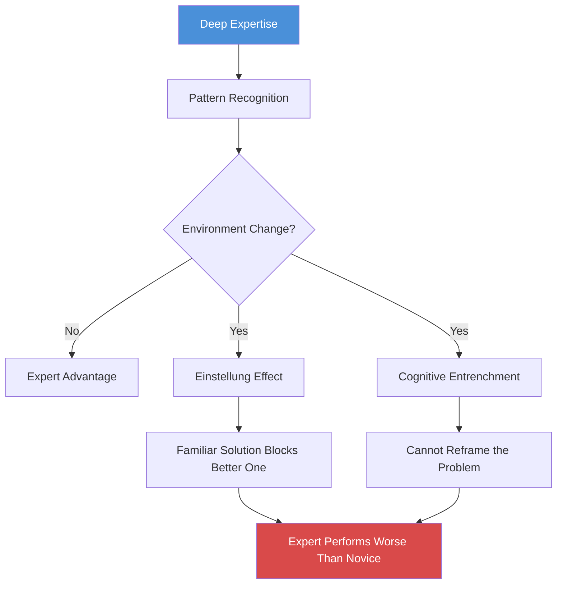
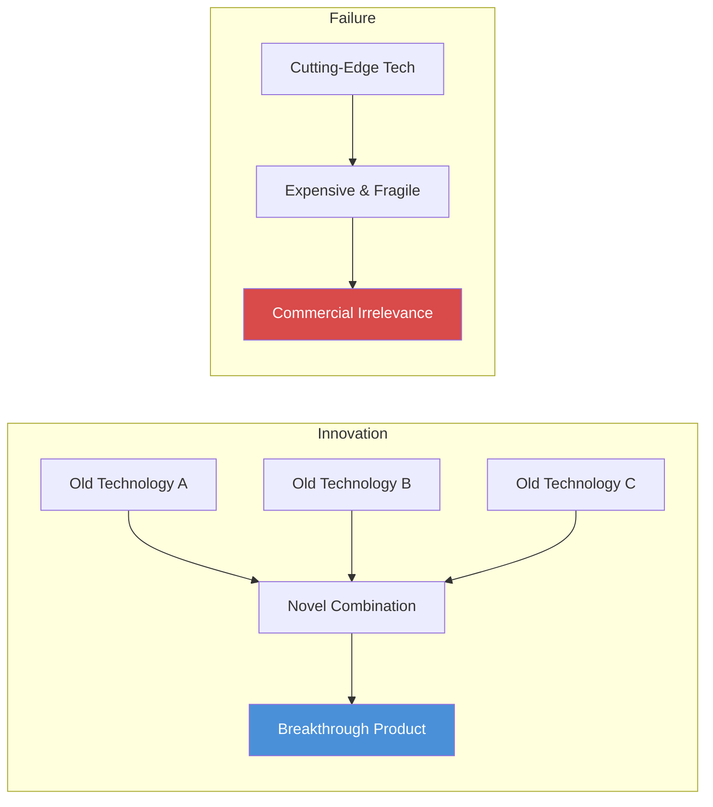
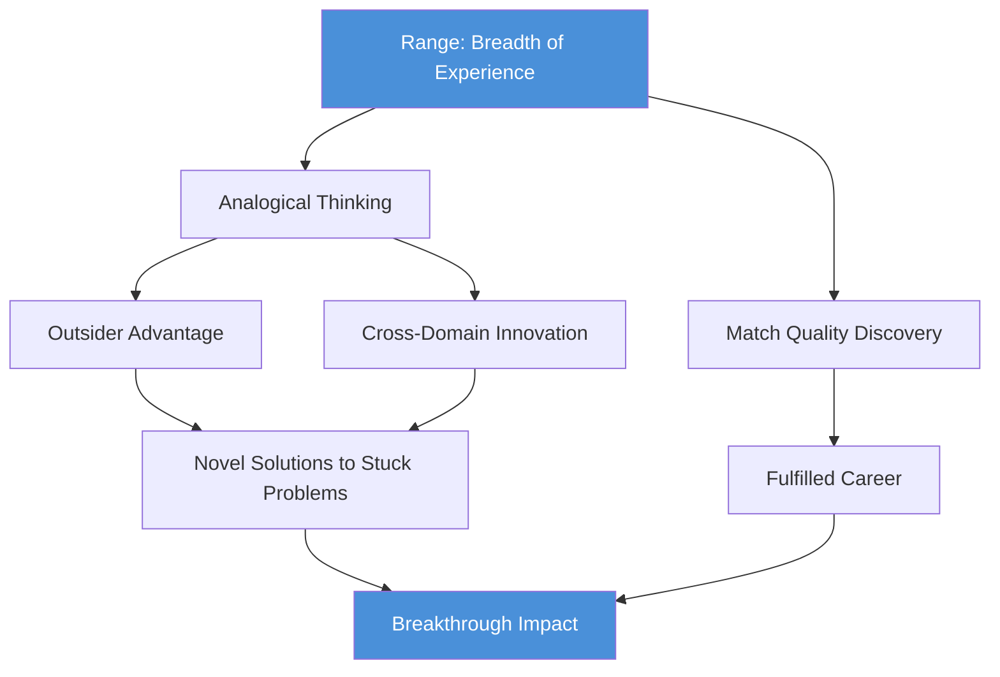
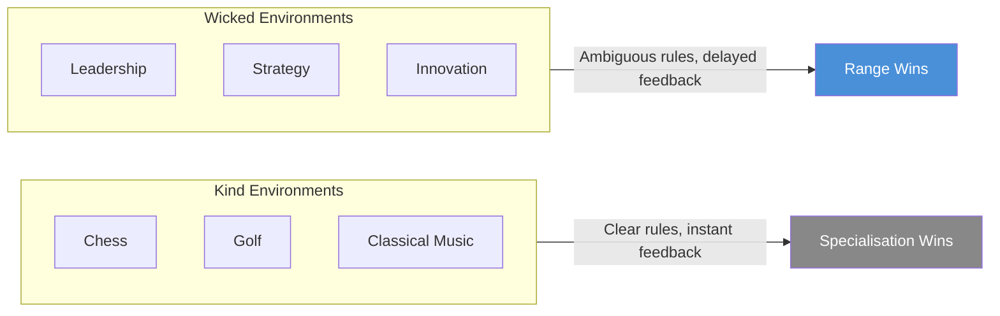

# Range: Why Generalists Triumph in a Specialized World — David Epstein

> David Epstein marshals research from sports, education, cognitive science, and innovation to argue that breadth beats depth in a complex world. His thesis: the domains that matter most — leadership, strategy, creative problem-solving — are "wicked" environments where rules are unclear, feedback is delayed, and patterns do not repeat. In these environments, the generalist who draws on diverse experience, thinks by analogy across fields, and experiments before committing consistently outperforms the narrow specialist. Epstein builds his case through biographical narratives (Roger Federer, Van Gogh, Nintendo's Gunpei Yokoi), rigorous research (Tetlock's forecasting study, Bjork's desirable difficulties, Kahneman and Klein's expert-performance collaboration), and a structural argument that our institutions systematically overvalue early specialisation and undervalue range. The book is a manifesto for the late bloomer, the career-switcher, and anyone who has ever felt behind for not picking a lane sooner.

---

## About the Author

David Epstein is a science journalist and author whose own biography is an advertisement for his thesis.
He studied environmental science at Columbia University, where he conducted Arctic ecology research, before pivoting to tabloid crime reporting, then becoming a senior writer at Sports Illustrated.
His first book, *The Sports Gene* (2013), explored genetic and developmental influences on athletic performance and led him to the research on late specialisation that inspired *Range*.
Epstein is a synthesiser by temperament: he draws connections across disciplines rather than drilling into one, and his background in both hard science and narrative journalism gives him the tools to translate dense research into accessible argument.
The winding path from Arctic ice cores to bestselling author is itself a case study in the match-quality thesis he advances.

---

## The Big Idea

- The modern world is increasingly <b style="color: #2980b9">wicked</b> — its most important problems have unclear rules, delayed feedback, and few repeating patterns
- In wicked environments, the strategies that work in <b style="color: #2980b9">kind</b> environments (chess, golf, classical music performance) — early specialisation, deliberate practice, pattern repetition — do not just fail
  - <b style="color: #e74c3c">They can actively harm</b>, producing cognitive entrenchment where deep expertise becomes a prison that blinds people to novel solutions
- The alternative is <b style="color: #2980b9">range</b>: broad experience across domains, the habit of thinking by analogy rather than by rote, a willingness to experiment and switch paths, and the patience to endure a sampling period that looks inefficient but builds a cross-domain pattern library no specialist can match
- <b style="color: #27ae60">The people who change the world are almost never the narrowest specialists</b>
  - From Kepler to Darwin to the superforecasters who beat intelligence analysts — they are the ones who can see connections that the specialists, trapped in their trenches, cannot

---

- The book's deepest provocation: the apparent "waste" of a winding career path is not waste at all
  - It is the optimal strategy for finding <b style="color: #2980b9">match quality</b> — the fit between who you are and what you do
  - It builds the cognitive flexibility that wicked domains demand
- <b style="color: #e74c3c">Our institutions are systematically misaligned</b> with the demands of a complex, changing world:
  - Education systems funnel children into specialities too early
  - Corporations reward narrow depth over adaptive breadth
  - Culture celebrates the prodigy and the 10,000-hour grinder
- <b style="color: #27ae60">The generalist who looks like they are falling behind is often the person best prepared for what is coming next</b>

---

## Key Concepts at a Glance

| Concept | One-line summary |
|---------|-----------------|
| **Kind vs wicked learning environments** | Kind = clear rules and instant feedback; wicked = ambiguous rules, delayed feedback, novel problems |
| **The sampling period** | Broad exploration before commitment builds cross-domain pattern recognition that specialists lack |
| **Desirable difficulties** | Learning that feels slow and frustrating produces deeper, more transferable knowledge |
| **Analogical thinking** | Solving problems by mapping structural similarities from distant domains, not applying familiar templates |
| **Match quality** | The fit between your abilities and your work, discoverable only through experimentation |
| **The outsider advantage** | Distance from a problem domain can matter more than proximity, because outsiders bypass domain assumptions |
| **Fox vs hedgehog thinking** | Integrating multiple perspectives beats viewing everything through one powerful lens |
| **Cognitive entrenchment** | Deep expertise can make people worse when conditions change, not better |
| **The inside view vs the outside view** | Comparing to a reference class of similar cases beats immersing yourself in unique internal details |
| **Lateral thinking with withered technology** | Combining old, well-understood components in novel ways beats chasing the cutting edge |
| **Deliberate amateurism** | Maintaining breadth of interests is a conscious innovation strategy, not a hobby |
| **Dropping familiar tools** | Under pressure, people cling to practised methods even when those methods are killing them |

---

## Chapter 1: Roger Federer and Tiger Woods — The Cult of the Head Start

*The world worships the Tiger Woods story — start early, specialise relentlessly, dominate. But the research says Roger Federer's winding path through multiple sports is the far more reliable route to excellence.*

The book opens with a tale of two origin stories.

> [!example] **Tiger Woods — The Early-Specialisation Archetype**
> His father, Earl, placed a putter in his hands at seven months old.
> - At two, Tiger appeared on national television demonstrating his swing.
> - At three, he shot 48 over nine holes.
> - By age eight, he had beaten his father.
> - Every hour was golf, from the crib.
> - Malcolm Gladwell used Tiger as the poster child for the 10,000-hours thesis: greatness comes from starting early and never doing anything else.

> [!example] **Roger Federer — The Sampling Archetype (Basel, Switzerland)**
> As a child, Federer played badminton, basketball, handball, tennis, table tennis, and football with his mother's local club.
> - His parents refused to pressure him toward any single sport.
> - When coaches urged them to move Roger into a tennis academy, they declined — he was having too much fun playing everything.
> - He did not commit fully to tennis until his mid-teens, well after many of his future rivals had been training exclusively for years.
> - He went on to become, by most accounts, the greatest tennis player in history.
> **The lesson:** The head start is less important than the breadth of the foundation.

<b style="color: #27ae60">Federer is the norm and Tiger is the outlier</b> — the research confirms this across multiple domains:
- A study of German top-division footballers found that players who eventually made the national team had spent **more** time playing other sports as children than those who specialised early
- Research across Olympic sports found that elite athletes specialised **later** on average than near-elite athletes
- A study by John Sloboda found that exceptional young musicians did not practise more than good ones — they distributed their practice across **three instruments** rather than concentrating on one

> [!tip] Core Insight
> The culture worships Tiger because his story is simpler and more dramatic. But the research points toward Federer: sample broadly, play freely, and let specialisation come later, naturally, from a wider base.

This is the development path Epstein champions: breadth first builds the pattern library from which deep, flexible expertise later emerges.

---

## Chapter 2: How the Wicked World Was Made — The Flynn Effect and Abstract Thinking

*The modern mind is fundamentally different from the premodern mind — and that difference is what makes range both possible and necessary.*

- IQ scores have risen dramatically and consistently throughout the twentieth century — a phenomenon known as the <b style="color: #2980b9">Flynn Effect</b>, after the political scientist James Flynn who first documented it
- The gains are not in raw processing power
- They are in **abstract, classificatory thinking**: the ability to detach from concrete experience and reason about categories, hypotheticals, and relationships between concepts

> [!example] **Luria's Uzbek Villagers (1930s Central Asia)**
> Soviet psychologist Alexander Luria showed remote Uzbek villagers a drawing of a saw, a hatchet, a log, and a hammer, and asked which did not belong.
> - A modern respondent instantly says "the log" — it is the only non-tool.
> - But the villagers refused to remove any item.
> - A log without a saw is useless, they said. You need all four together to do actual work.
> - They reasoned entirely from concrete, lived experience and could not — or would not — think in abstract categories.
> - When Luria pressed, one man said he had never been to a cold region and would not conclude its bears were white — he would only reason from direct observation.
> **The lesson:** Abstract, classificatory thinking is not innate intelligence — it is a cognitive tool trained by education and modern life.

Flynn's insight was that formal education teaches people what he called <b style="color: #2980b9">"scientific spectacles"</b>:
- The ability to classify, abstract, and transfer knowledge from one context to another
- This is not a sign of superior intelligence — it is a cognitive tool, trained by schooling and modern life
- Without it, every problem is a unique, concrete situation
- With it, problems have structural features that connect them to other problems

---

The implication for range is direct:
- The modern world demands exactly the kind of <b style="color: #27ae60">far transfer</b> — applying knowledge from one domain to a structurally similar but superficially different domain — that abstract thinking enables
- Generalists are not just people who know a little about a lot
- <b style="color: #27ae60">They are people who can recognise deep structural patterns across domains</b>
- That ability is what the Flynn Effect has equipped the modern mind to do

> [!tip] Core Insight
> The modern mind's greatest gain is not processing speed but abstract classification — the ability to see structural patterns across domains. This is precisely what range exploits.

---

## Chapter 3: When Less of the Same Is More — The Venetian Music Experiment

*In seventeenth-century Venice, orphan girls who rotated across multiple instruments produced more extraordinary music than narrow specialists — centuries before the research confirmed why.*

> [!example] **The Venetian Ospedali (17th-18th Century Venice)**
> Four charitable institutions for orphaned, abandoned, and illegitimate girls produced some of the finest musicians in Europe.
> - Visitors came from across the continent to hear their orchestras.
> - Vivaldi taught at one of them, the Ospedale della Pieta.
> - What made these orphan musicians extraordinary was not intense drilling on a single instrument — it was the opposite.
> - The figlie del coro rotated across multiple instruments: a girl might study violin, then switch to oboe, then learn the organ.
> - They sang, they composed, they conducted.
> - The breadth of their musical experience produced virtuosity that stunned audiences accustomed to narrow specialists.
> **The lesson:** The Venetian orphans became extraordinary precisely because no one designed a rigid development pathway for them.

Epstein contrasts this with the <b style="color: #2980b9">Suzuki method</b>, which dominates modern music education:
- Suzuki emphasises starting early on one instrument, following a rigidly sequenced curriculum, and accumulating hours
- It is modelled on kind-environment logic: repetition, feedback, gradual progression
- It produces competent young performers
- <b style="color: #e74c3c">What it does not reliably produce is creative, flexible musicians</b> who can adapt to novel musical situations

---

The research bears this out:
- A study of music students found that the ones who became the highest achievers were **not** those who practised the most hours on their primary instrument
- They were the ones who had **sampled across instruments** before settling
- Their early breadth gave them a richer understanding of music as a system, not just a set of motor skills on one device

> [!tip] Core Insight
> The sampling period that looks like wasted time or unfocused dabbling is actually building a foundation of flexible knowledge that narrow early training cannot match.

<b style="color: #27ae60">Exploration produced mastery</b> — the chapter reinforces a pattern that runs through the entire book: the Venetian orphans became extraordinary precisely because no one designed a rigid development pathway for them.

---

## Chapter 4: Learning, Fast and Slow — Desirable Difficulties

*The conditions that produce the fastest visible progress often produce the shallowest learning — and the teachers who feel most helpful are often the ones whose students learn the least.*

- Robert Bjork's research programme at UCLA demonstrates that <b style="color: #e74c3c">the conditions which produce the fastest visible progress often produce the shallowest learning</b>
- This is one of the most counterintuitive findings in all of cognitive science, and Epstein gives it a full chapter

> [!abstract] The Four Desirable Difficulties (Robert Bjork, UCLA)
> 1. **Generation** — struggling to produce an answer, even incorrectly, builds stronger memory traces than being given the answer
> 2. **Spacing** — distributing practice over time forces repeated reconstruction; forgetting and re-retrieving is itself a form of learning
> 3. **Interleaving** — mixing different problem types forces learners to identify which strategy applies before applying it
> 4. **Testing** — retrieval practice, even without feedback, strengthens learning more than re-reading or re-studying

<b style="color: #2980b9">The generation effect</b>:
- Struggling to produce an answer, even incorrectly, builds stronger memory traces than being given the answer
- In experiments, students forced to guess the meaning of a foreign vocabulary word before seeing the correct answer — even though their guesses were almost always wrong — retained the correct meaning significantly better
- The act of generating a wrong answer created a mental hook that the correct answer attached to

<b style="color: #2980b9">Spacing</b>:
- Distributing practice over time, rather than massing it, forces repeated reconstruction of knowledge
- Massed practice (cramming) produces rapid short-term gains
- Spaced practice produces slower visible progress but far superior long-term retention
- The reason: forgetting and re-retrieving is itself a form of learning — each retrieval strengthens the pathway

---

<b style="color: #2980b9">Interleaving</b>:
- Mixing different problem types in training, rather than blocking them by category, forces learners to identify which strategy applies before applying it

> [!example] **Interleaved Baseball Batting Practice**
> In a study of baseball batters, those who faced a random mix of fastballs, curveballs, and changeups in practice performed worse during practice but dramatically better in games compared to those who practised each pitch type in blocks.
> - The blocked group could recognise a curveball when they knew a curveball was coming.
> - The interleaved group could recognise one when they did not know what was coming — which is, of course, the actual condition in a real game.

<b style="color: #2980b9">Testing</b>:
- Retrieval practice, even without feedback, strengthens learning more than re-reading or re-studying
- The act of trying to remember something is more powerful than reviewing it

> [!example] **The Air Force Academy Calculus Study**
> Researchers examined thousands of cadets across hundreds of sections.
> - Instructors who made students struggle the most — who used interleaving, testing, and generation — produced the worst short-term exam scores in their own courses.
> - But their students performed best in subsequent, more advanced courses.
> - The instructors who produced the best short-term scores (through clear explanations and blocked practice) produced students who fell apart when the material got harder or took unfamiliar forms.
> - Students punished the best teachers in course evaluations, rating the struggle-inducing teachers lower because the experience felt worse, even though it produced better outcomes.
> **The lesson:** The feeling of learning and the fact of learning are, in many cases, inversely related.

---

A parallel finding emerged at Italy's Bocconi University, where the same pattern repeated in economics courses:
- And in a study with rhesus macaques, animals trained with hints learned to perform the task quickly but retained nothing
- Animals that had to struggle through without hints learned slowly but retained the skill for life

> "Learning that is easy is like writing in sand, here today and gone tomorrow." — Elizabeth Bjork

> [!tip] Core Insight
> The feeling of learning and the fact of learning are inversely related. The struggle IS the learning. The cult of visible, immediate progress is antithetical to deep development.

<b style="color: #27ae60">The struggle IS the learning</b> — the lesson is unsettling for anyone who equates progress with smooth mastery.

---

## Chapter 5: Thinking Outside Experience — Analogical Reasoning

*The generalist's most powerful cognitive weapon is the distant analogy — and the further the analogy reaches, the more likely it is to produce a genuine breakthrough.*

- This chapter makes the case that <b style="color: #2980b9">cross-domain analogical thinking</b> is the primary engine of creative breakthroughs — and the generalist's most powerful cognitive tool
- Epstein distinguishes between two types of analogy:
  - <b style="color: #e74c3c">Surface analogies</b> — problems that look similar — come to mind easily but often mislead
  - <b style="color: #27ae60">Deep structural analogies</b> — problems that work the same way but look entirely different — require conscious effort but produce genuine insight

> [!example] **Johannes Kepler and Planetary Motion**
> Kepler did not crack the problem of planetary motion by staring harder at astronomical data.
> - He did it by systematically importing analogies from entirely unrelated domains.
> - He compared the sun's influence on planets to light radiating from a source — both weaken with distance.
> - He compared it to magnets attracting iron — force acting at a distance without physical contact.
> - He imagined boats being pushed by river currents and brooms sweeping surfaces.
> - Each analogy captured one aspect of the gravitational relationship; none captured it perfectly; together, they built the conceptual scaffolding for a new physics.
> **The lesson:** Kepler was not a better astronomer than his peers. He was a better analogiser.

---

> [!example] **Karl Duncker's Radiation Problem**
> Subjects must figure out how to destroy a tumour with radiation without damaging the surrounding tissue.
> - The solution is to use multiple weak beams converging from different directions so that only the tumour receives a lethal dose.
> - When given one prior story with a parallel structure — a general who divides his army to converge on a fortress from multiple roads — about 30% of subjects solve the problem.
> - When given two analogous stories and told to use them, the success rate jumps to approximately 80%.
> **The lesson:** Multiple distant analogies are more powerful than a single close one. Each highlights a different structural feature, and together they make the deep structure visible.

Epstein also covers the <b style="color: #2980b9">inside view versus outside view</b> distinction, drawn from Kahneman and Lovallo:

| Dimension | Inside View | Outside View |
|-----------|------------|-------------|
| **Focus** | Unique internal details of this specific case | Reference class of structurally similar past cases |
| **Method** | Deep immersion in specifics | Analogy to base rates |
| **Confidence** | Increases with more detail | Stays calibrated to evidence |
| **Accuracy** | Degrades with more detail | Improves with broader comparison |
| **Typical error** | Overestimates uniqueness, extreme predictions | May miss genuinely unique factors |

---

<b style="color: #e74c3c">The inside view produces systematically worse predictions</b>:
- Private equity investors overestimated their own projects' returns by approximately 50% until forced to compare their project to analogous external projects
- The more internal details people considered, the more extreme and inaccurate their judgments became
- A study of major infrastructure projects found that 90% went over budget — largely because managers took the inside view, focusing on the unique features of their project rather than asking, "What usually happens with projects like this?"
- <b style="color: #27ae60">The outside view is, structurally, an analogy</b>: this situation is like those situations, so expect similar outcomes

> "The more information experts had, the more extreme their predictions." — David Epstein

> [!tip] Core Insight
> When facing a novel problem, generate analogies from as many distant domains as possible before committing to a solution. When predicting outcomes, always compare to a reference class rather than immersing yourself in unique details.

---

## Chapter 6: The Trouble with Too Much Grit — Match Quality and When to Quit

*Grit without match quality is misdirected persistence — the stubborn continuation of a path that does not suit you, justified by sunk costs.*

- This chapter mounts a careful, evidence-based challenge to one of the most popular ideas in modern self-improvement: Angela Duckworth's concept of **grit**
- <b style="color: #2980b9">Match quality</b> — the fit between who you are and what you do — is one of the strongest predictors of both performance and satisfaction
  - But it can only be discovered through action, not introspection
  - You cannot know whether a path suits you until you walk it for a while
- <b style="color: #27ae60">The optimal career strategy involves a period of deliberate experimentation</b> — testing different paths, extracting information about fit, and pivoting when the information warrants it

> [!example] **Scottish vs English University Systems (Ofer Malamud)**
> In Scotland, students sampled broadly across disciplines before declaring a major.
> - In England, students committed to a single field at the point of entry.
> - The Scottish students started their specialisation later and with fewer domain-specific skills.
> - But they ended up with better career outcomes, higher earnings, and — critically — fewer costly career switches later in life.
> - Early commitment did not eliminate the need to switch; it just delayed the switch and made it more expensive.

---

> [!example] **The Dark Horse Project (Harvard, Todd Rose and Ogi Ogas)**
> Researchers studied people who were both fulfilled and successful across an enormous range of fields — from a dog-show judge to a NASA astronaut to a celebrity sommelier.
> - They expected to find common traits.
> - What they found instead was a near-universal pattern: virtually all of these people had followed winding, non-linear paths that they themselves considered abnormal at the time.
> - They had experimented, quit things, changed direction, and eventually stumbled into the work that suited them.
> **The lesson:** The straight-line career that looks impressive on a CV turned out to be the exception, not the rule.

Epstein then turns his attention to **grit** and its limitations:
- Duckworth's research shows that grit — defined as perseverance and passion for long-term goals — predicts success in specific, measurable contexts
- At West Point's notorious Beast Barracks, grittier cadets were more likely to survive the brutal initial training period
- But there is a twist:
  - The West Point graduates who were **most** "invested" in the Army — those with the highest sunk costs, the most prestigious preparatory programmes — left the military soonest after their mandatory service period ended
  - Not because they lacked grit, but because they discovered better-fitting options
  - Their investment in the path made them better at enduring it — <b style="color: #e74c3c">it did not make the path better for them</b>

---

The <b style="color: #2980b9">Grit Scale</b> conflates two very different things:
- **Work ethic** — the willingness to persist through difficulty, which is valuable everywhere
- **Consistency of interests** — sticking with the same pursuit over time, which is only valuable if match quality has been established
- A person who works extremely hard across multiple domains — switching paths when the evidence warrants it — scores low on grit but may be making the strategically optimal career decisions

> [!example] **Levitt's Coin-Flip Experiment (Freakonomics)**
> Steven Levitt ran a study through the Freakonomics website where people struggling with a major life decision — should I quit my job, end my relationship, move to a new city — were instructed to flip a coin.
> - Heads meant make the change; tails meant stay.
> - Six months later, those who had been told by the coin to make the change were happier than those told to stay.
> **The lesson:** People are, on average, too slow to quit.

> "Compare yourself to yourself yesterday, not to younger people who aren't you." — David Epstein

> [!tip] Core Insight
> Grit without match quality is misdirected persistence. The hardest and most important career skill is learning when to quit one path and try another.

<b style="color: #27ae60">The hardest and most important career skill is learning when to quit one path and try another</b> — the chapter's conclusion is not that grit is worthless, but that grit without match quality is the stubborn continuation of a path that does not suit you, justified by the emotional weight of how much you have already invested.

---

## Chapter 7: Flirting with Your Possible Selves — Short-Range Planning

*The conventional wisdom — set a long-term goal and work backward — is exactly wrong for most people. Self-knowledge does not precede experience; it follows from it.*

- Epstein argues that the conventional wisdom about career planning — set a long-term goal and work backward — is exactly wrong for most people
- The better strategy is <b style="color: #2980b9">short-range planning</b>: test, learn, and adjust in rapid cycles, keeping maximum optionality for as long as the information warrants

> [!example] **Frances Hesselbein and the Girl Scouts**
> Frances Hesselbein became CEO of the Girl Scouts of the USA — the largest organisation for women and girls in the world — without ever planning to have a career at all.
> - In her twenties, she was asked to lead a troop of ten Girl Scouts in her small Pennsylvania town.
> - She said she would do it temporarily.
> - One thing led to another: more troops, then a regional role, then a national committee.
> - At 54, she was asked to lead the entire organisation.
> - She transformed it, making it diverse and modern, and later founded a leadership institute that bore her name.
> - Peter Drucker called her the best CEO in America.
> **The lesson:** Her path was a series of short-term experiments, each one revealing the next step. She never had a five-year plan.

---

> [!example] **Herminia Ibarra's Career Changers (INSEAD)**
> Ibarra, an organisational behaviour professor, studied mid-career professionals going through career transitions.
> - She found that the conventional advice — "figure out who you are, then find a matching career" — fails because self-knowledge does not precede experience.
> - It follows from it.
> - You cannot discover who you are through introspection.
> - You discover it through action — by testing different possible selves and seeing which ones feel right.
> - The successful career-changers in her research did not plan their transition. They experimented their way into it.

Epstein also invokes the <b style="color: #2980b9">end of history illusion</b>, identified by psychologist Dan Gilbert:
- In studies, people of all ages readily acknowledged that they had changed enormously over the previous ten years — their tastes, values, friendships, and goals had all shifted
- But those same people consistently predicted that they would change very little over the **next** ten years
- Every age group believes it has arrived at the person it will be forever — this is demonstrably wrong
- Personality traits, especially openness and conscientiousness, continue to shift well into middle age

---

The implication:
- <b style="color: #e74c3c">Early career commitments are predictions about a person who does not yet exist</b>
- The 22-year-old who commits to a lifetime in accounting is making a bet about the preferences and abilities of a 35-year-old stranger
- The more important the decision, the more reason to delay it until you have better information about who you will become

Paul Graham, the Y Combinator founder, captures the principle:
- <b style="color: #27ae60">Hard work WITHOUT premature commitment</b> — the combination that conventional career advice cannot accommodate because it demands both hard work AND early commitment as a single package

> [!tip] Core Insight
> Self-knowledge follows from experience, not introspection. The optimal career strategy is short-range planning: test, learn, and adjust in rapid cycles.

---

## Chapter 8: The Outsider Advantage — Solving Problems with Distance

*For problems that have resisted insider expertise, the further a solver's background is from the problem domain, the more likely they are to crack it.*

<b style="color: #27ae60">Distance from the problem domain can be the decisive advantage</b> — for problems that have resisted insider expertise.

> [!example] **InnoCentive's Outsider Solvers**
> InnoCentive is an open-innovation platform where companies post problems that their internal teams have been unable to solve, offering cash prizes.
> - Karim Lakhani, a Harvard professor, studied the results and found a startling pattern: the further a solver's expertise was from the problem domain, the MORE likely they were to produce a winning solution.
> - A chemist solved an oil-spill cleanup problem by adapting an idea from the concrete industry — a vibrating device that keeps concrete from hardening was structurally the same solution needed to keep oil from congealing in Arctic water.
> - A retired telecom engineer solved a NASA problem about predicting solar particle storms using methods from his entirely unrelated field.
> **The lesson:** The pattern held across hundreds of challenges. Distance from the problem was an asset, not a liability.

> [!example] **Jill Viles and the Muscular Dystrophy Insight**
> Jill Viles had Emery-Dreifuss muscular dystrophy, a rare condition that wasted her muscles.
> - She was not a scientist, but she was an obsessive observer of her own body.
> - One day she noticed that an Olympic sprinter had a physique strikingly similar to her own — an unusual musculature she recognised from the mirror.
> - She wrote to scientists suggesting that her dystrophy and the sprinter's exceptional muscle development might share a genetic basis — specifically, a connection involving the protein myostatin.
> - The scientists dismissed her; she was a layperson with no credentials.
> - Years later, the molecular connection she had intuited was confirmed: both conditions involved myostatin mutations, one causing deficiency and one causing overexpression.
> **The lesson:** An outsider with zero domain expertise saw what specialists could not because she was not constrained by their framing.

---

Specialists suffer from two related cognitive traps that explain why insiders get stuck:

<b style="color: #2980b9">The Einstellung effect</b>:
- Defaulting to a familiar solution even when a better one exists, because the familiar solution springs to mind first and blocks consideration of alternatives
- Chess experts, shown positions where a familiar but suboptimal move exists alongside an unfamiliar but superior one, tend to choose the familiar move
- <b style="color: #e74c3c">Their expertise actively prevents them from seeing the better option</b>
- Eye-tracking studies confirmed it: their gaze was literally drawn to the familiar pattern and away from the novel solution

<b style="color: #2980b9">Cognitive entrenchment</b>:
- Deep expertise making people unable to frame a problem in any way other than the one their training dictates
- When accountants deeply trained in one set of tax rules were given problems using new rules, they performed **worse** than novices
- Their deep practice had not made them flexible experts — it had made them rigid ones
- Bridge players with decades of experience, given a game with slightly altered rules, were outperformed by intermediates
- <b style="color: #e74c3c">The deep grooves of expertise had become trenches they could not climb out of</b>

This diagram shows how deep expertise, normally an advantage, becomes a trap the moment the environment changes. The same pattern recognition that enables mastery becomes the cage that prevents adaptation.

> "Having one foot outside your world gives you the ability to make connections." — David Epstein

---

> [!example] **Don Swanson's Undiscovered Public Knowledge (University of Chicago)**
> Information scientist Don Swanson demonstrated "undiscovered public knowledge" — important connections between published findings in different scientific fields that no one has made because specialists do not read outside their silo.
> - Swanson found that the published literature on fish oil and the published literature on Raynaud's disease each contained information that, if combined, would suggest fish oil as a treatment for Raynaud's.
> - The connection existed in the published record for years.
> - No one saw it because the fish oil researchers did not read the Raynaud's journals, and vice versa.
> - It took a librarian — someone whose profession is connecting disparate bodies of knowledge — to see it.
> **The lesson:** As knowledge specialises, the interfaces between silos become the most fertile ground for discovery.

> [!tip] Core Insight
> The person who can see across disciplinary boundaries is rare by definition — because the system trains everyone to look within them. Distance from a problem is often the decisive advantage.

---

## Chapter 9: Lateral Thinking with Withered Technology — Recombination over Invention

*Innovation comes less from inventing entirely new things than from combining old, well-understood things in new ways — and the quality of recombination depends on the breadth of the recombiner.*

<b style="color: #27ae60">Innovation comes less from inventing entirely new things than from combining old, well-understood things in new ways</b> — the chapter's hero is Gunpei Yokoi of Nintendo.

> [!example] **Gunpei Yokoi and the Game Boy (Nintendo, 1989)**
> Yokoi was an electronics engineer at Nintendo when it was still a playing-card company.
> - He was a mediocre engineer by his own admission — he could never compete with the brilliant specialists at Sony or Toshiba.
> - But he had a gift for seeing old technology with fresh eyes.
> - The Game Boy used a processor that was already outdated and a greenish monochrome display when competitors offered colour.
> - But it was cheap, durable, portable, and — most importantly — it had Tetris.
> - The Game Boy dominated the portable gaming market for over a decade.
> - Competitors who chased the cutting edge produced technically superior devices that were expensive, fragile, battery-hungry, and commercially irrelevant.
> **The lesson:** Cross-domain creativity mattered more than raw technical specs.

> [!abstract] Lateral Thinking with Withered Technology (Yokoi's Method)
> 1. Identify mature, cheap, well-understood technology components that are no longer cutting-edge
> 2. Study them for properties and capabilities that their original domain does not exploit
> 3. Combine components from different technology generations and domains
> 4. Optimise for user experience and reliability rather than technical specifications
> 5. Let competitors chase the cutting edge while you recombine the proven

---

> [!example] **Andy Ouderkirk and 3M's Cross-Division Inventions**
> Andy Ouderkirk, a prolific inventor at 3M with dozens of patents, studied the company's most successful products and found that the most impactful ones combined technologies from DIFFERENT divisions.
> - Reflective road signs combined 3M's knowledge of adhesives with their knowledge of abrasives with their knowledge of light-management films — three separate internal specialities that no single specialist would have brought together.
> - Ouderkirk found that the most prolific inventors at 3M were not the deepest specialists.
> - They were people with breadth across multiple technology platforms, who could see opportunities at the intersections.

The analysis of **18 million scientific papers** reinforces this finding at scale:
- Researchers at Northwestern and the University of Chicago examined what predicted whether a paper would become a "hit" — a highly cited, field-shaping contribution
- The answer was not novelty per se
- It was the combination of a large body of conventional knowledge with an atypical knowledge source — a surprising import from an unexpected field
- <b style="color: #e74c3c">Papers that drew only from expected sources made incremental contributions</b>
- Papers that were entirely novel were often incomprehensible and ignored
- <b style="color: #27ae60">The sweet spot was 90% conventional, 10% surprise</b> — papers that combined the familiar with the unexpected

---

<b style="color: #2980b9">Serial innovators</b> — people who produce multiple significant innovations across their careers — share a distinctive profile:
- They tend to be **"pi-shaped"**: deep expertise in at least two domains, plus broad knowledge across many
- They are not dilettantes — they are disciplined generalists who have invested significantly in more than one area
- They actively maintain breadth as a strategic resource:
  - Read widely outside their field
  - Attend conferences in unrelated disciplines
  - Cultivate hobbies that have nothing obvious to do with their work

Yokoi's approach — recombining mature, understood components — consistently beats the strategy of chasing the cutting edge. Innovation is a recombination problem, and breadth determines the quality of the recombination.

> [!tip] Core Insight
> Innovation is a recombination problem. You cannot combine what you do not know. The generalist who has sampled widely has a richer combinatorial library — and it is from that library that breakthroughs emerge.

---

## Chapter 10: Fooled by Expertise — Why Foxes Beat Hedgehogs

*The most famous and confident experts are the worst at predicting the future — and more information makes them worse, not better.*

- Philip Tetlock's <b style="color: #2980b9">20-year forecasting study</b> is one of the most important bodies of evidence in the book, and Epstein gives it the extended treatment it deserves
- In the early 1980s, Tetlock began collecting predictions from 284 experts — political scientists, economists, intelligence analysts, journalists — about geopolitical events
- He tracked **82,361 predictions** over two decades
- The results were devastating for the expert class:
  - The average expert was roughly as accurate as a dart-throwing chimpanzee
  - <b style="color: #e74c3c">The most famous, most confident, most frequently consulted experts were the WORST of all</b>

Tetlock borrowed Isaiah Berlin's fox-and-hedgehog distinction to explain the pattern:

| Dimension | Hedgehog | Fox |
|-----------|----------|-----|
| **Knowledge style** | One big framework applied to everything | Many small frameworks, flexibly deployed |
| **Narrative** | Compelling, single-cause explanations | Nuanced, multi-cause, qualified |
| **Confidence** | High and unwavering | Moderate and calibrated |
| **When wrong** | Explains away the miss, never updates model | Updates beliefs incrementally with new evidence |
| **Media appeal** | High — dramatic and quotable | Low — hedging is boring on television |
| **Prediction accuracy** | Worst among all experts | Best among all experts |

---

<b style="color: #e74c3c">Hedgehogs</b> know one big thing:
- View every problem through a single powerful framework — Marxism, free-market economics, game theory
- Excellent at constructing compelling narratives that explain everything
- Exude the confidence that television producers and newspaper editors reward
- When predictions fail, they deploy self-protective explanations:
  - The timing was off
  - An unprecedented event intervened
  - They were "almost right"
- **Never update their model** — just explain away the miss

<b style="color: #27ae60">Foxes</b> know many small things:
- Draw on multiple frameworks, tolerate ambiguity, hedge their predictions
- Crucially — update their beliefs when new evidence arrives
- Less dramatic on television, far more accurate
- The difference is not intelligence or access to information — it is a style of thinking:
  - Hedgehogs start with a theory and bend the evidence to fit
  - Foxes start with the evidence and let multiple theories compete

> [!example] **Tetlock's Good Judgment Project — Superforecasters**
> Tetlock recruited thousands of ordinary people — not experts, not intelligence analysts — to forecast geopolitical events.
> - The best of them, the superforecasters, were spectacularly good.
> - They beat intelligence analysts who had access to classified information.
> - They beat prediction markets.
> - The superforecasters had no special credentials and no security clearances.
> - What they had was broad curiosity, the habit of seeking disconfirming evidence, granular probability thinking (not "probably" but "73%"), and active open-mindedness — treating their own beliefs as hypotheses to be tested rather than positions to be defended.

> "The most impactful inventors cross domains rather than deepen them." — David Epstein

---

One of Tetlock's most counterintuitive findings:
- <b style="color: #e74c3c">More information and more experience made hedgehogs WORSE, not better</b>
- Additional data gave hedgehogs more material to fold into their existing narrative, making them more confident without making them more accurate
- For foxes, more information was genuinely useful because they had the cognitive flexibility to let it change their minds

> [!tip] Core Insight
> The quality of a prediction depends more on HOW you think than on WHAT you know. Breadth of perspective, not depth of expertise, predicts judgment quality in uncertain environments.

<b style="color: #27ae60">Breadth of perspective, not depth of expertise, predicts judgment quality in uncertain environments</b> — the most dangerous expert is the one who knows the most about the least, because their confidence is real, their model is powerful within its narrow domain, and they cannot see the boundaries of that domain.

---

## Chapter 11: Learning to Drop Your Familiar Tools — When Expertise Kills

*Under pressure, people and organisations default to their most practised methods — even when those methods are clearly wrong for the situation. The tools become identity, and identity is something people will die rather than abandon.*

<b style="color: #e74c3c">Under pressure, people and organisations default to their most practised methods</b> — even when those methods are clearly wrong for the situation at hand. This chapter is about the lethal consequences of tool attachment.

> [!example] **The Challenger Disaster (NASA, January 28, 1986)**
> The temperature at Cape Canaveral was 36 degrees Fahrenheit — far colder than any previous launch.
> - Engineers at Morton Thiokol had strong qualitative evidence that the O-ring seals in the boosters became dangerously rigid in cold weather.
> - They had observed blow-by on previous flights, and the worst cases correlated with cold launch temperatures.
> - But NASA's culture was quantitative: if you could not express a concern as a number, it did not count as engineering judgment.
> - The engineers tried to translate their qualitative alarm into the quantitative format NASA demanded, but the charts were unconvincing because the data was limited.
> - Their bosses overruled them. The shuttle launched. Seventy-three seconds later, the O-ring failed. Seven people died.
> **The lesson:** NASA did not fail to see the danger. It failed to see the danger in its own methodology.

---

> [!example] **The Mann Gulch Fire (Montana, 1949)**
> Thirteen smokejumpers parachuted into a Montana canyon to fight what they thought was a routine fire.
> - The fire blew up, and within minutes a wall of flame was racing uphill toward them.
> - Their foreman, Wagner Dodge, did something no one had ever done before: he stopped running, bent down, and lit a small fire in the grass at his feet.
> - As his own fire consumed the fuel around him, he lay down in the ashes and the main fire burned over him.
> - He had invented what is now called an "escape fire."
> - Dodge shouted to his men to join him. They ignored him. They kept running, carrying their heavy tools.
> - Twelve of the thirteen died.

> [!example] **The South Canyon / Storm King Mountain Fire (1994)**
> Fourteen firefighters died in nearly identical circumstances to Mann Gulch.
> - Investigators found that many of them had not dropped their tools even as they were being overrun.
> - The tools weighed between twenty and forty pounds.
> - Dropping them would have increased running speed by 15-20% — the difference between life and death.
> - But the firefighters would not let go.
> **The lesson:** The tools were not just tools. They were identity. A firefighter without a chainsaw is not a firefighter.

Karl Weick, the organisational theorist, studied these cases and identified the mechanism:
- The tools were not just tools — they were <b style="color: #2980b9">identity</b>
- A firefighter without a chainsaw is not a firefighter
- A NASA engineer without quantitative evidence is not an engineer
- <b style="color: #e74c3c">When your tools are part of who you are, setting them aside is an act of self-erasure</b> — and that is something people will die rather than do

---

Weick generalised the principle beyond physical tools:
- Organisations cling to familiar processes
- Experts cling to familiar frameworks
- Professionals cling to familiar identities
- The more deeply a tool is embedded in identity, the harder it is to set aside — and the more dangerous it becomes when the situation changes

> "The challenge we all face is how to maintain the benefits of breadth... while still being able to focus." — David Epstein

Epstein uses these cases to argue for <b style="color: #2980b9">organisational incongruence</b> — the deliberate introduction of conflicting cultural signals:
- Tetlock's experimental work showed that organisations with cross-pressures (formal process + encouragement to dissent) learned faster and made better decisions than those with perfectly congruent cultures
- Wernher von Braun's NASA — the Apollo-era NASA, before the institutional rigidity set in — used **"Monday Notes"**:
  - An informal weekly communication system where any engineer could write directly to von Braun about concerns, bypassing the formal chain of command
  - The formal hierarchy provided structure; the informal channel provided flexibility
  - The combination produced an organisation that could handle novel problems

> [!example] **Himalayan Expedition Teams Study (5,104 teams)**
> Teams from cultures with strong hierarchical values reached the summit more often — but they also had MORE deaths.
> - The hierarchy drove performance but suppressed dissent.
> - When conditions changed unexpectedly — as they do on high-altitude mountains — the teams that could not challenge the leader's plan were the teams that died.
> **The lesson:** The discipline is not in mastering your tools but in recognising when you are outside the domain where they apply.

> [!tip] Core Insight
> The most dangerous moment is not when you have no tools. It is when you have tools you trust, in a situation they cannot solve.

---

## Chapter 12: Deliberate Amateurs — Unstructured Exploration as Innovation Strategy

*Breakthrough innovation depends on maintaining space for inefficiency and breadth within systems that demand specialisation — and the "wasteful" exploration is what makes the "efficient" application possible.*

<b style="color: #27ae60">Breakthrough innovation depends on maintaining space for inefficiency and breadth</b> within systems that demand specialisation.

> [!example] **Oliver Smithies and Saturday Morning Experiments (Nobel Prize, Chemistry)**
> Oliver Smithies won the Nobel Prize for developing gel electrophoresis — one of the foundational techniques of modern molecular biology.
> - He developed it during his "Saturday Morning Experiments" — a weekly block of unstructured lab time that he protected for decades.
> - On Saturday mornings, Smithies would pursue whatever curiosity had struck him during the week, with no pressure to produce publishable results.
> - Most of these experiments led nowhere.
> - But over a career, the ones that did lead somewhere changed biology.
> **The lesson:** His Nobel-winning work was not the product of a targeted research programme. It emerged from decades of disciplined, deliberate play.

---

> [!example] **Andre Geim and Friday Night Experiments (Nobel Prize, Physics)**
> Geim won the Nobel Prize for isolating graphene — a single-atom-thick sheet of carbon with extraordinary properties.
> - He discovered it during his self-imposed "Friday Night Experiments," a practice he maintained explicitly to counteract the hyper-specialisation of modern academic science.
> - Geim would invite colleagues and students to explore random curiosities using whatever equipment was available.
> - The most famous Friday Night Experiment involved levitating a live frog using the diamagnetic properties of water in a powerful magnetic field — this won him the Ig Nobel Prize.
> - He is the only person in history to have won both an Ig Nobel and a real Nobel.
> **The lesson:** The levitating frog and graphene share a common origin: unstructured time, broad curiosity, and the willingness to pursue ideas that look foolish.

> [!example] **Arturo Casadevall's HIV Argument (Johns Hopkins)**
> When HIV emerged in the 1980s, it was identifiable and eventually treatable only because society had previously invested in studying retroviruses — a class of virus with no known practical relevance at the time.
> - Retrovirologists were studying their subject out of pure curiosity.
> - Had someone demanded to know the "application" of retrovirus research in 1975, there would have been no answer.
> - Yet without that prior investment, HIV would have been an invisible, incomprehensible plague.
> **The lesson:** Hyper-focused, application-driven science is parasitic on the broad, curiosity-driven science that came before it. Without the "wasteful" breadth, the "efficient" application has nothing to apply.

---

Nobel laureates and <b style="color: #2980b9">deliberate amateurism</b>:
- Nobel laureates are **22 times more likely** than other scientists to have serious artistic hobbies — acting, painting, music, creative writing
- This is not a coincidence and not just a lifestyle preference
- The artistic engagement provides a different mode of thinking — pattern recognition through aesthetic and narrative rather than analytical frameworks — that cross-pollinates with scientific reasoning
- <b style="color: #27ae60">The deliberate amateur is not wasting time</b> — they are building the combinatorial library from which breakthroughs are assembled

The chapter closes with a structural argument about research funding:
- <b style="color: #e74c3c">Modern grant agencies overwhelmingly fund narrow, incremental, "safe" projects</b> with clear applications
- High-risk, high-reward exploratory research — the kind that produced both graphene and the retroviral knowledge that made HIV treatable — is systematically defunded
- The system optimises for efficiency and predictability
- But breakthroughs are, by definition, neither efficient nor predictable
- A system with zero exploration is one that will never produce anything truly new

> [!tip] Core Insight
> A system that eliminates all "wasteful" exploration in favour of targeted efficiency will never produce anything truly new. The deliberate amateur is building the combinatorial library from which breakthroughs are assembled.

---

## Conclusion: Expanding Your Range

*The book's emotional core: the anxiety of feeling behind is both wrong and dangerous, because the evidence overwhelmingly favours the broad explorer over the early committer.*

The final pages return to the book's emotional core: the anxiety of feeling behind.

- In a world that celebrates prodigies and early achievers, anyone who is still exploring at 30, 35, or 40 feels like a failure
- Epstein argues that this feeling is both wrong and dangerous:
  - Wrong because the evidence overwhelmingly favours the broad explorer over the early committer
  - Dangerous because it pushes people into premature specialisation out of social pressure rather than genuine fit

> [!example] **Van Gogh's Late Start**
> Van Gogh tried and failed at being an art dealer, a schoolmaster, a bookseller, a university student, a minister, and a missionary before beginning to paint at 27.
> - He produced his entire artistic output in roughly ten years.
> - Every previous "failure" had been a match-quality experiment that narrowed the search.
> **The lesson:** His late start was not a handicap. It was the precondition for finding the work that suited him.

---

He invokes **Michelangelo**, who famously said — in a letter written when he was 87 — "I am still learning":
- Michelangelo's late work was his best
- His style evolved continuously throughout his life
- He never stopped experimenting, never settled into a fixed approach, never decided that he had found the optimal method and should simply repeat it
- <b style="color: #27ae60">The willingness to remain a beginner, even after decades of mastery, was inseparable from his genius</b>

> "I am still learning." — attributed to Michelangelo

This diagram traces the book's central argument: range enables both analogical thinking and match quality, which together produce the outsider advantage, cross-domain innovation, and ultimately breakthrough impact in a wicked world.

---

Epstein's closing advice is simple:
- Compare yourself to yourself yesterday, not to younger people who have taken a different path
- Explore
- Experiment
- Do not feel behind
- <b style="color: #27ae60">The world is wicked, and the people best suited to navigate it are the ones who have seen the most of it</b>

---

The foundational distinction of the entire book: the nature of the environment determines whether specialisation or range is the optimal strategy. Most of the modern world falls on the wicked side of the spectrum.

---

## Key Quotes

- "Compare yourself to yourself yesterday, not to younger people who aren't you." — David Epstein
- "The challenge we all face is how to maintain the benefits of breadth... while still being able to focus." — David Epstein
- "The more information experts had, the more extreme their predictions." — David Epstein, on inside-view bias
- "The most impactful inventors cross domains rather than deepen them." — David Epstein, on serial innovators
- "Learning that is easy is like writing in sand, here today and gone tomorrow." — Elizabeth Bjork, as cited by Epstein
- "Having one foot outside your world gives you the ability to make connections." — David Epstein
- "I am still learning." — attributed to Michelangelo, as cited by Epstein
- "Lateral thinking with withered technology." — Gunpei Yokoi, as cited by Epstein

---

## The Verdict

*Range* is the most important book written in the last decade about why generalists matter, and its strength lies not in any single argument but in the convergence of evidence from radically different fields.

- The kind/wicked distinction, drawn from Kahneman and Klein's landmark collaboration, provides the theoretical foundation
- Tetlock's forecasting data, based on 82,361 predictions over twenty years, is among the most rigorous studies of expert judgment ever conducted and delivers a devastating verdict on narrow specialisation
- Bjork's desirable-difficulties research, replicated across decades and domains, upends the common-sense assumption that smooth learning is good learning
- The InnoCentive outsider-advantage findings are compelling precisely because they are large-scale and field-based rather than laboratory-constructed
- Together, these strands form a powerful argument that breadth is not the consolation prize for people who failed to specialise early — it is a cognitive strategy that matches the demands of a complex, rapidly changing world

The book's weaknesses are real but bounded.

- Epstein relies heavily on biographical narratives — Van Gogh, Hesselbein, Django Reinhardt, the Venetian orphans — that suffer from classic survivorship bias
- We see the late bloomers who bloomed — we do not see the vast majority who sampled broadly and never found their calling
- Epstein acknowledges this once and then proceeds to cherry-pick for the remainder of the book
- The transition from sampling to commitment is underspecified:
  - The book is excellent on why you should explore
  - It is nearly silent on how to know when you have explored enough — when the marginal value of another experiment has fallen below the cost of delayed commitment
  - This is a significant gap, because for many readers, the actionable question is not "should I explore?" but "when should I stop?"

The concept of "range" itself is slippery:
- It bundles together several distinct phenomena that have different mechanisms, different evidence bases, and different practical implications:
  - **Cognitive flexibility** — the ability to think analogically (well-evidenced)
  - **Career experimentation** — the willingness to switch paths (anecdotally supported through biography)
  - **Diverse professional experience** — having worked across domains
  - **Learning strategy** — interleaving, spacing, desirable difficulties (rigorously studied)
- Treating them as manifestations of a single concept called "range" obscures the differences and makes the argument harder to evaluate critically

Still, the core insight holds and has only grown more relevant since publication.

- In a world that is becoming more wicked — where AI automates the kind-environment tasks and leaves humans with the novel, ambiguous, cross-domain challenges — the person who can draw connections across fields will consistently outperform the person who can only go deeper into what they already know
- The book is essential reading for anyone who has ever felt behind for not specialising sooner, and a useful corrective for anyone who designs education, hiring, or development systems that reward narrow depth at the expense of useful breadth
- It does not tell you everything you need to know about building a generalist career — the political and structural barriers to being valued as a generalist in specialist institutions are completely absent from Epstein's analysis — but it provides the intellectual foundation that makes the case irrefutable at the level of evidence

---

## Related Reading

- [[So Good They Can't Ignore You - Cal Newport|So Good They Can't Ignore You]] — Cal Newport argues for building rare and valuable skills ("career capital") through deliberate practice, offering a complementary and sometimes competing perspective on depth vs breadth
- [[Interviews with the Masters - Robert Greene|Mastery]] — Robert Greene profiles masters across disciplines, many of whom followed the winding paths Epstein describes, though Greene emphasises eventual deep commitment
- [[The First 90 Days - Michael D. Watkins|The First 90 Days]] — Michael Watkins on navigating transitions, relevant to Epstein's match-quality thesis about how to enter new domains effectively
- [[Power - Jeffrey Pfeffer|Power]] — Jeffrey Pfeffer on how organisations actually allocate influence, a useful companion for understanding the structural barriers generalists face in specialist institutions
- [[Thinking in Systems - Donella H. Meadows|Thinking in Systems]] — Donella Meadows on systems thinking, a complementary framework for the kind of cross-domain structural reasoning Epstein champions
- [[Mindset - Carol S. Dweck|Mindset]] — Carol Dweck on growth vs fixed mindset, relevant to Epstein's argument that the willingness to be a beginner repeatedly is a strategic advantage
