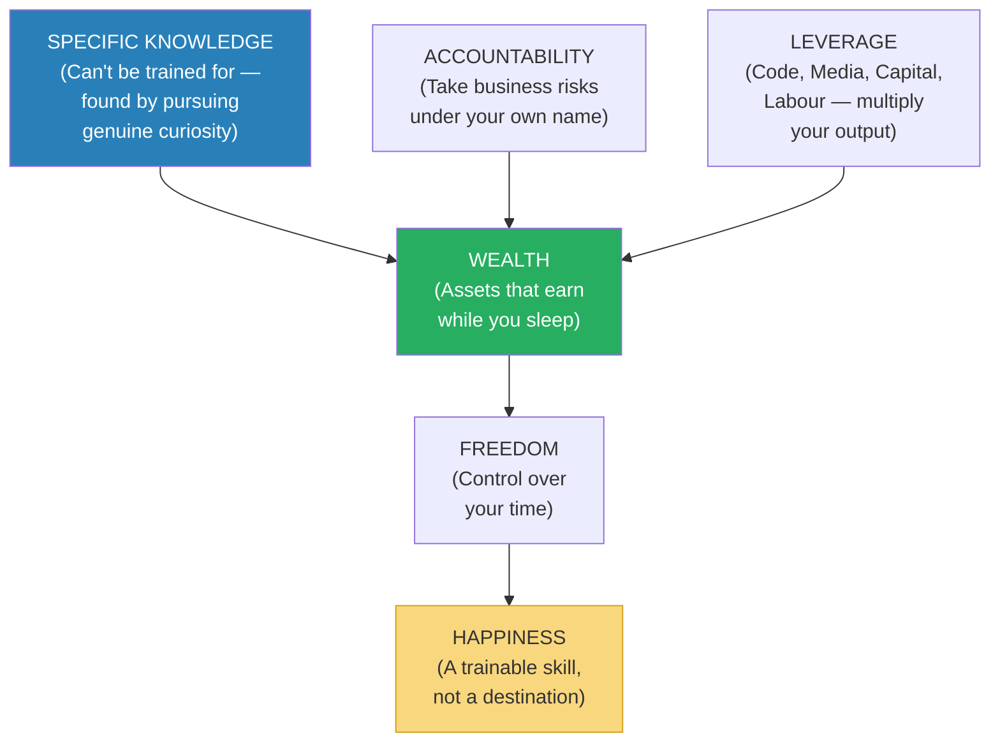
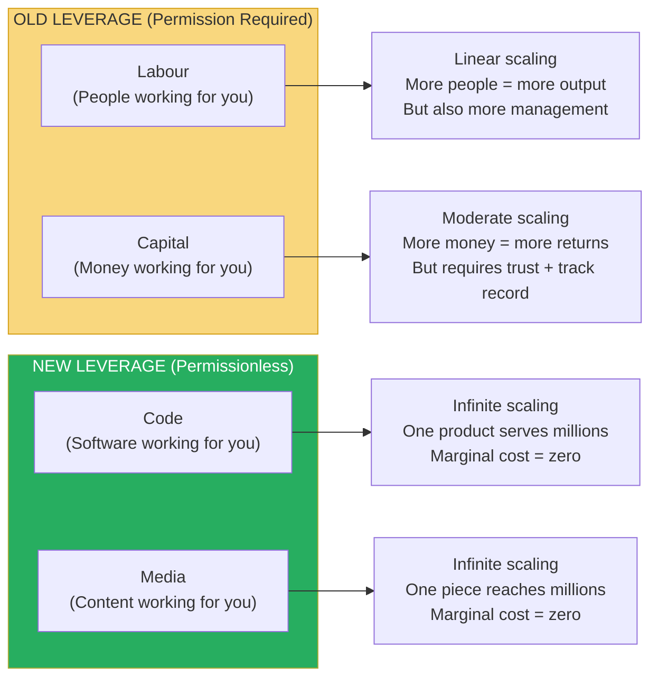
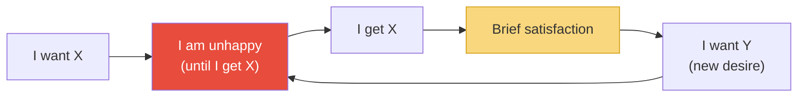
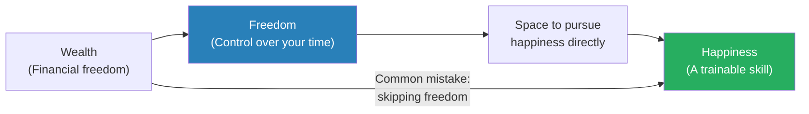

# The Almanack of Naval Ravikant — Eric Jorgenson

> Naval Ravikant is an angel investor, philosopher-entrepreneur, and one of the most quotable thinkers in Silicon Valley — a man whose tweets, podcast appearances, and tweetstorms have made him a modern-day oracle for a generation of founders, investors, and seekers.
> Eric Jorgenson curated Naval's best thinking into this book, which covers two subjects that Naval considers inseparable: how to get rich (without getting lucky) and how to be happy (without external conditions).
> Naval's core insight on wealth: it is built through leverage (code, media, capital, labour), specific knowledge (unique to you, impossible to train for), and accountability (taking risks under your own name) — not through trading time for money.
> Naval's core insight on happiness: it is a skill that can be trained through present-moment awareness, desire reduction, and the deliberate choice to interpret reality in a way that produces peace rather than suffering.
> The book reads like a modern *Meditations* — compressed, aphoristic, and designed to be re-read slowly rather than consumed quickly.
> It is the most potent distillation of practical wisdom about wealth and happiness published in the last decade.

---

## About the Author

Eric Jorgenson is an author and product strategist who compiled this book from Naval Ravikant's public output — tweets, podcast interviews, blog posts, and tweetstorms — with Naval's cooperation but minimal editorial intervention.

Naval Ravikant is the co-founder and former CEO of AngelList, the platform that transformed startup fundraising.
He is an early investor in over 200 companies including Uber, Twitter, Postmates, and Wish.
He is known not for his investing record alone but for the philosophical framework behind it — a synthesis of economics, evolutionary psychology, game theory, and Eastern philosophy that he communicates in compressed, memorable form.
Naval did not write this book. He spoke it — through years of conversations, tweets, and interviews. Jorgenson collected, organised, and presented it. The result reads less like a book and more like a transmission.

---

## The Big Idea

- Naval's framework rests on a single distinction: <b style="color: #2980b9">seek wealth, not money or status</b>
- **Wealth** = assets that earn while you sleep. Businesses, investments, intellectual property, equity.
- **Money** = how we transfer time and wealth. A medium of exchange.
- **Status** = your rank in a social hierarchy. A zero-sum game.
- <b style="color: #e74c3c">People who pursue status play zero-sum games: for them to win, someone must lose. People who pursue wealth play positive-sum games: they create value that didn't exist before.</b>
- <b style="color: #27ae60">Wealth creation is fundamentally about giving society what it wants but doesn't yet know how to get — at scale</b>

---

- The book is divided into two halves:
  1. **Building Wealth** — the mechanics of creating economic freedom
  2. **Building Happiness** — the practice of creating internal freedom
- Naval considers both equally important and deeply connected: <b style="color: #2980b9">"A calm mind, a fit body, and a house full of love. These things cannot be bought. They must be earned."</b>

---

## Key Concepts at a Glance

| Concept | One-line summary |
|---------|-----------------|
| **Seek Wealth, Not Money or Status** | Wealth = assets that earn while you sleep. Status = your rank in a zero-sum hierarchy. Don't confuse them. |
| **Specific Knowledge** | Knowledge that can't be trained for — it's found by pursuing your genuine curiosity and passion |
| **Accountability** | Take business risks under your own name. Society rewards those who bear risk with equity, not wages. |
| **Leverage** | The multiplier that turns your output from 1x to 1000x. Four types: labour, capital, code, media. |
| **Judgment** | The most important skill — leverage applied wisely. "Leverage is a force multiplier for your judgment." |
| **Permissionless Leverage** | Code and media are the new leverage — available to everyone, requiring no one's permission to deploy |
| **Play Long-Term Games with Long-Term People** | Compound interest applies to relationships and reputation, not just money |
| **Happiness Is a Default State** | Happiness is what's there when you remove the sense that something is missing |
| **Desire Is a Contract with Yourself to Be Unhappy** | Every desire is a statement: "I will be unhappy until I get this thing" |
| **The Monkey Mind** | The mind is a prediction and pattern-matching machine that creates suffering by never being satisfied |
| **Retirement Is When You Stop Sacrificing Today for Tomorrow** | You can "retire" at any income level by aligning your spending with your values |

---

## Part 1: Building Wealth

### The Three Ingredients of Wealth

- Naval's wealth formula: <b style="color: #2980b9">Specific Knowledge + Accountability + Leverage = Wealth</b>
- Each ingredient is necessary. None is sufficient alone.

---

### Specific Knowledge: What You Can't Be Trained For

- <b style="color: #2980b9">Specific knowledge</b> is knowledge that cannot be taught in a classroom or learned from a textbook
- It is unique to you — built from your peculiar combination of skills, interests, personality, and life experience
- <b style="color: #27ae60">"If you can be trained for it, eventually a computer or a cheaper worker will replace you"</b>
- Examples of specific knowledge: a natural ability to sell, deep expertise in a niche domain acquired through obsession, the ability to see patterns others miss, unusual combinations of skills (e.g., biology + programming + persuasion)
- <b style="color: #2980b9">Specific knowledge is often found by pursuing your genuine curiosity</b> — not by following a prescribed career path
- "If you're not 100% sure what your specific knowledge is, it's probably the thing you do that doesn't feel like work to you but looks like magic to others"

> [!example] Scott Adams and Specific Knowledge
> Naval cites Scott Adams (creator of Dilbert) as a case study:
> Adams was not the best artist, not the best writer, not the best business thinker, and not the funniest comedian.
> But he was in the <b style="color: #27ae60">top 25% of all four — and the combination was unique</b>.
> A decent artist + decent writer + decent business understanding + decent humour = a monopoly on business-relevant cartoon comedy that made him one of the most successful cartoonists in history.
> <b style="color: #2980b9">Specific knowledge often lives at the intersection of skills, not at the peak of any one skill.</b>

> [!tip] Finding Your Specific Knowledge
> Naval's questions to identify it:
> 1. "What did you love doing as a child, before anyone told you what to do?"
> 2. "What do you find easy that others find hard?"
> 3. "What can you do that doesn't feel like work to you?"
> 4. "What topics would you read about for fun on a Saturday morning?"
> 5. "What do people consistently come to you for help with?"
> 
> The overlap of these answers IS your specific knowledge. It feels like play to you and looks like talent to others.

---

### Accountability: Betting on Yourself

- <b style="color: #2980b9">Accountability</b> means taking business risks under your own name and bearing the consequences
- Society rewards risk-bearing with equity, not wages
- The person who takes credit (and blame) for outcomes builds a reputation — which attracts both resources and opportunities
- <b style="color: #e74c3c">"The people who are rewarded in society are the ones who bear risk — specifically, the risk of being wrong in public"</b>
- This is why equity beats salary in the long run: equity is compensation for accountability. Salary is compensation for time.
- Naval's blunt framing: <b style="color: #27ae60">"If you're not willing to be publicly accountable for the outcome of your work, you will never be truly wealthy. You will be paid for your time, not for your judgment."</b>

> [!danger] Before: Trading time for money
> You work for someone else's company, executing their vision, bearing none of the risk, receiving none of the upside.
> You are paid for your TIME, not your JUDGMENT.
> Your income is linear: work more hours = earn more money. Stop working = stop earning.

> [!success] After: Bearing risk for equity
> You build (or co-build) something under your own name, bearing the risk of failure and the reward of success.
> You are paid for your JUDGMENT, not your TIME.
> Your income is nonlinear: the right decision can produce 10x, 100x, or 1000x returns. And the asset earns while you sleep.

---

### Leverage: The Multiplier

- Leverage is what turns specific knowledge + accountability into wealth
- <b style="color: #2980b9">There are four types of leverage:</b>

| Type | Description | Permission Required? | Example |
|------|-------------|:--------------------:|---------|
| **Labour** | Other people working for you | Yes (you need to recruit and manage) | A CEO with 10,000 employees |
| **Capital** | Other people's money working for you | Yes (you need investors or lenders) | A hedge fund manager investing $1B |
| **Code** | Software working for you | <b style="color: #27ae60">No — permissionless</b> | A developer who writes an app used by millions |
| **Media** | Content working for you | <b style="color: #27ae60">No — permissionless</b> | A creator who builds an audience of millions |

- <b style="color: #27ae60">Code and media are the new leverage — they are available to anyone, require no one's permission, and scale infinitely</b>
- <b style="color: #e74c3c">Labour and capital are the old leverage — they require permission (hiring, fundraising) and have diminishing returns</b>
- Naval: "The most interesting and important form of leverage is the idea of products that have no marginal cost of replication. This includes books, media, movies, and code. Code is probably the most powerful form of permissionless leverage. All you need is a computer."
- <b style="color: #2980b9">The new rich are not people who manage large labour forces or large capital pools — they are people who have built systems (code, media, products) that work while they sleep</b>

---

### Judgment: The Meta-Skill

- <b style="color: #2980b9">"Leverage is a force multiplier for your judgment"</b>
- Good judgment + high leverage = massive wealth creation
- Bad judgment + high leverage = massive wealth destruction
- Judgment is <b style="color: #27ae60">the ability to make decisions with long-term positive expected value</b> — even when the short-term outcome is uncertain
- It comes from: accumulated specific knowledge, pattern recognition from experience, clear thinking (avoiding cognitive biases), and the ability to tolerate uncertainty
- Naval: "The direction you pick matters more than how fast you move. Pick the right thing to work on."

> [!tip] Naval's Decision-Making Heuristics
> - "If you can't decide between two options, the answer is neither. When you're overwhelmed with choices, the decision is clear."
> - "Easy decisions, hard life. Hard decisions, easy life."
> - "Short-term pain, long-term gain. That's the formula for everything worthwhile."
> - "If the decision is between doing something you'll be proud of and something you'll be embarrassed by in ten years, the answer is always the proud one."

---

### Play Long-Term Games with Long-Term People

- <b style="color: #2980b9">"All the returns in life, whether in wealth, relationships, or knowledge, come from compound interest"</b>
- Compound interest doesn't just apply to money — it applies to reputation, relationships, and skill
- If you build a business relationship over 10 years, the trust you've accumulated compounds: each interaction is easier, more productive, and more valuable than the last
- <b style="color: #e74c3c">Short-term players extract value. Long-term players create value.</b>
- <b style="color: #27ae60">"Play long-term games with long-term people. All the benefits in life come from compound interest."</b>

> [!example] The Long-Term Game in Action
> Naval points to Warren Buffett as the ultimate long-term player:
> - Buffett has been investing since age 10. He is now in his 90s.
> - 99.7% of his net worth was accumulated after his 50th birthday.
> - His skill is investing. His secret is TIME.
> - "Good investing isn't about earning the highest returns — it's about earning pretty good returns consistently for the longest period of time." (Echoes [[The Psychology of Money - Morgan Housel|The Psychology of Money]])
> - <b style="color: #27ae60">Buffett didn't get rich by being the best investor. He got rich by being a good investor for the longest time.</b>

---

### Arm Yourself with Specific Knowledge, Accountability, and Leverage

- Naval's most famous tweetstorm, "How to Get Rich (without getting lucky)," condenses his wealth philosophy into a sequence of principles:

> [!quote] Naval's Tweetstorm (Selected)
> - "Seek wealth, not money or status."
> - "Understand that ethical wealth creation is possible."
> - "You're not going to get rich renting out your time. You must own equity to gain your financial freedom."
> - "You will get rich by giving society what it wants but does not yet know how to get. At scale."
> - "Arm yourself with specific knowledge, accountability, and leverage."
> - "Specific knowledge is knowledge you cannot be trained for."
> - "When specific knowledge is taught, it's through apprenticeships, not schools."
> - "Specific knowledge is often highly technical or creative. It cannot be outsourced or automated."
> - "Apply specific knowledge, with leverage, and eventually you will get what you deserve."
> - "Code and media are permissionless leverage. They're the leverage behind the newly rich."
> - "An army of robots is freely available — it's just packed in data centres for heat. Use it."
> - "There is no skill called 'business.' Avoid business magazines and business classes."
> - "Study microeconomics, game theory, psychology, persuasion, ethics, mathematics, and computers."
> - "Reading is faster than listening. Doing is faster than watching."
> - "Set and enforce an aspirational personal hourly rate. If fixing a problem will save less than your hourly rate, ignore it."
> - "Work as hard as you can. Even though who you work with and what you work on are more important."
> - "Become the best in the world at what you do. Keep redefining what you do until this is true."

---

### The Hourly Rate Heuristic

- Naval recommends setting an <b style="color: #2980b9">aspirational personal hourly rate</b> — even if you're not currently earning that amount
- If your rate is $1,000/hour, then:
  - Spending an hour arguing with your landlord over a $100 charge is irrational (it costs you $1,000 of your time to recover $100)
  - Spending an hour on a $50 task that you could delegate is irrational
  - Spending an hour on busywork that produces no long-term value is irrational
- <b style="color: #27ae60">The hourly rate forces you to constantly evaluate: "Is this the best use of my time right now?"</b>
- Naval's personal rule: if a task can be done by someone else at a lower hourly rate, delegate it. No exceptions. Even if you can do it better.

> [!tip] Setting Your Aspirational Rate
> Naval's advice:
> 1. Pick a number that feels uncomfortably high — $500, $1000, $5000/hour
> 2. Use it as a filter for every activity: "Would someone earning $X/hour spend time on this?"
> 3. If not, find a way to eliminate or delegate it
> 4. Focus your time exclusively on activities that COULD produce $X/hour in long-term value — even if they don't produce immediate income
> 
> The point is not that you currently earn that rate. The point is that you BEHAVE as if you do — which forces you to shed low-value activities and focus on high-leverage ones.

---

## Part 2: Building Happiness

### Happiness Is a Skill, Not a Destination

- <b style="color: #2980b9">"Happiness is there when you remove the sense that something is missing"</b>
- Naval's definition is explicitly Buddhist: happiness is not the PRESENCE of pleasure but the ABSENCE of desire
- <b style="color: #e74c3c">Every desire is a contract with yourself to be unhappy until you get the thing you desire</b>
- "I'll be happy when I get the promotion" means "I am choosing to be unhappy until the promotion arrives"
- <b style="color: #27ae60">The fewer desires you have, the more baseline happiness you have</b>
- This is NOT the same as apathy or laziness — Naval is one of the most productive and driven people in Silicon Valley. The distinction is between NEEDING something to be happy and WANTING something while already being happy.

---

### The Desire Trap

- Most people organise their lives around desire: "I want X. I will work toward X. When I get X, I will be happy."
- <b style="color: #e74c3c">The problem: the moment you get X, a new desire immediately replaces it</b>
- Got the promotion? Now you want the next one. Got the house? Now you want a bigger one. Got the relationship? Now you want it to be different.
- This is what Naval calls the <b style="color: #2980b9">"desire treadmill"</b> — running perpetually toward a horizon that recedes at exactly your running speed
- <b style="color: #27ae60">"Desire is a contract with yourself to be unhappy until you get what you want. And the moment you get it, the contract renews."</b>

- Naval's alternative: <b style="color: #27ae60">"Happiness is a choice you make and a skill you develop. You choose it by dropping expectations and desires that don't serve you."</b>

---

### The Monkey Mind

- Naval draws on Buddhist psychology to describe the <b style="color: #2980b9">"monkey mind"</b> — the restless, chattering, never-satisfied stream of consciousness that most people experience as their normal mental state
- The monkey mind is a <b style="color: #e74c3c">prediction and pattern-matching machine</b> — it evolved to anticipate threats and opportunities on the savanna
- But in the modern world, where physical threats are rare, the monkey mind doesn't stop scanning — it just shifts to social threats, status competitions, imagined futures, and ruminations about the past
- <b style="color: #2980b9">"A busy mind accelerates the passage of time. A calm mind slows it."</b>
- Naval's practice: meditation (not for spiritual reasons but for practical ones — "A calm mind is a productive mind. An anxious mind is a wasted mind.")

> [!example] Naval on Meditation
> "I don't meditate to become a better person. I meditate because it's the most rational thing I can do. Twenty minutes of meditation produces ten hours of better decision-making. That's an insane return on investment."
> Naval's approach to meditation is characteristically unsentimental: he treats it as a cognitive tool, not a spiritual practice.
> His preferred method: simply sitting quietly and observing his thoughts without engaging with them — "watching the thoughts go by like cars on a highway, without getting in any of them."

---

### Happiness Habits

- Naval describes specific practices for training happiness:

| Practice | Description | Mechanism |
|----------|-------------|-----------|
| **Meditation** | 20-60 min daily, observing thoughts without engaging | Breaks identification with the monkey mind; creates the "observer" perspective |
| **Gratitude** | Deliberately noticing what you have rather than what you lack | Shifts attention from desire (what's missing) to appreciation (what's present) |
| **Presence** | Practising being fully HERE — in the body, in the moment | Most unhappiness comes from living in the past (regret) or future (anxiety); presence eliminates both |
| **Acceptance** | Accepting reality as it is, not as you wish it were | Resistance to reality IS suffering; acceptance eliminates it |
| **Low information diet** | Reducing news, social media, and inputs that trigger anxiety | The monkey mind feeds on inputs; fewer inputs = calmer mind |
| **Physical health** | Exercise, sleep, nutrition | "A fit body helps a fit mind. You can't think clearly if you feel terrible." |

---

### Naval's Happiness Principles (Selected Quotes)

> [!quote] On Happiness
> - "Happiness is the absence of suffering. And suffering is the result of desire. Therefore, to be happy, learn to reduce your desires."
> - "If you're so smart, why aren't you happy?"
> - "The three big ones in life are wealth, health, and happiness. We pursue them in that order, but their importance is reverse."
> - "A peaceful mind is a clear mind. A clear mind makes better decisions. Better decisions create better outcomes. Better outcomes create more peace. It's a virtuous cycle."
> - "The most important skill for getting rich is becoming a perpetual learner. The most important skill for happiness is becoming a perpetual let-goer."

> [!quote] On Peace
> - "Peace is happiness at rest. Happiness is peace in motion."
> - "You can have everything you want in life — if you're willing to give up everything you don't want."
> - "Retirement is when you stop sacrificing today for an imaginary tomorrow. It's not about money. It's about alignment."

---

### The Wealth-Happiness Connection

- Naval doesn't dismiss wealth — he explicitly says <b style="color: #27ae60">"Money can buy you freedom, and freedom is the foundation of happiness"</b>
- But money beyond the point of freedom has diminishing returns for happiness
- <b style="color: #2980b9">The mistake most people make: they pursue money as if it will make them happy. It won't. It will make them FREE — which gives them the space to pursue happiness directly.</b>
- Once you have enough money to cover basic needs and remove financial stress, additional money doesn't increase happiness — it only increases options
- <b style="color: #27ae60">"The purpose of wealth is freedom. The purpose of freedom is happiness. Most people skip directly from wealth to happiness and miss freedom entirely."</b>

## Deep Dive: Naval on Learning

### Becoming a Perpetual Learner

- <b style="color: #2980b9">"The most important skill for getting rich is becoming a perpetual learner"</b>
- Naval reads voraciously — but not in the way most people think of reading
- He reads multiple books simultaneously, abandoning any that don't hold his interest
- He re-reads foundational texts (science, philosophy, economics) rather than reading the latest bestseller
- <b style="color: #27ae60">"Read what you love until you love to read"</b> — forced reading kills the love of learning; genuine curiosity sustains it
- His reading philosophy: <b style="color: #2980b9">the foundations matter more than the frontiers</b>
  - He reads more science and mathematics than business books
  - He reads more philosophy than self-help
  - He reads the original thinkers (Darwin, Smith, Feynman, Seneca) rather than their popularisers
  - "If you understand the basics deeply, you can re-derive the advanced conclusions yourself"

> [!tip] Naval's Reading Rules
> 1. "Read what you love until you love to read"
> 2. "It's not about how many books you finish. It's about how many ideas stick."
> 3. "Read the great books, not the new books. A book that has been in print for 100 years will likely be in print for 100 more." (This is Taleb's Lindy Effect — see [[Antifragile - Nassim Nicholas Taleb|Antifragile]])
> 4. "Don't be afraid to abandon a book. Life is too short to finish books you don't enjoy."
> 5. "Re-read the best books. You get more from a second reading of a great book than a first reading of a good one."
> 6. "Read across disciplines. The best ideas come from the intersection of fields."

---

### The Foundations vs The Frontiers

| Foundation Subjects | Why Naval Reads Them | Frontier Subjects | Why Naval Avoids Them |
|--------------------|-----------------------|------------------|-----------------------|
| Mathematics | The language of nature — all models are built on it | Business books | "There is no skill called 'business'" |
| Science (physics, biology, evolution) | The ground truth about how the world actually works | Self-help | "Read the original philosophers, not their popularisers" |
| Philosophy (Stoicism, Buddhism, epistemology) | Frameworks for thinking about thinking | News | "The news is designed to alarm you, not inform you" |
| Economics (microeconomics, game theory) | How incentives shape human behaviour | Social media | "The monkey mind's junk food" |
| Psychology (cognitive biases, decision-making) | Understanding your own irrational tendencies | Trendy non-fiction | "If it won't matter in 10 years, it doesn't matter now" |
| Computer science | The language of the new leverage (code) | Industry reports | "By the time it's in a report, the opportunity is gone" |

- <b style="color: #27ae60">"I don't want to read the latest book on productivity. I want to understand thermodynamics, game theory, and probability — because those are the operating systems that everything else runs on."</b>

---

### Mental Models

- Naval is a strong advocate for <b style="color: #2980b9">mental model thinking</b> — building a diverse toolkit of conceptual frameworks from different disciplines and applying them to whatever problem you face
- His most-used mental models:
  - <b style="color: #2980b9">Compound interest</b> (from mathematics) — applies to money, relationships, knowledge, and reputation
  - <b style="color: #2980b9">Incentives</b> (from economics) — "Show me the incentive and I'll show you the outcome" (Charlie Munger)
  - <b style="color: #2980b9">Evolution / natural selection</b> (from biology) — markets, ideas, and companies evolve through variation and selection
  - <b style="color: #2980b9">Inversion</b> (from mathematics) — instead of asking "how do I succeed?" ask "what would guarantee failure?" and avoid those things
  - <b style="color: #2980b9">Margin of safety</b> (from engineering / Taleb) — always build in room for error
  - <b style="color: #2980b9">Opportunity cost</b> (from economics) — the cost of anything is what you give up to get it
  - <b style="color: #2980b9">Skin in the game</b> (from Taleb) — don't trust anyone who doesn't bear the consequences of their advice

> [!example] Inversion Applied
> Instead of asking "How do I build a successful company?" Naval inverts:
> "What would guarantee failure?"
> - Partnering with people I don't trust
> - Building something nobody wants
> - Scaling before finding product-market fit
> - Spending more than I earn
> - Working in a field that bores me
> 
> <b style="color: #27ae60">"Avoid the guaranteed failure modes and success becomes much more likely."</b>
> This is Charlie Munger's "All I want to know is where I'm going to die, so I never go there" — applied to business and life.

---

## Deep Dive: Naval on Relationships and Ethics

### Play Iterated Games

- <b style="color: #2980b9">"Play iterated games. All the returns in life — whether in wealth, relationships, or knowledge — come from compound interest."</b>
- An iterated game is one you play repeatedly with the same people
- In a one-shot game (you'll never see this person again), defection and exploitation can "win"
- In an iterated game (you'll interact with this person for years), <b style="color: #27ae60">cooperation always wins</b> — because reputation compounds
- <b style="color: #e74c3c">"If you're going to screw someone, you'd better make sure you never see them again. In a connected world, you always see them again."</b>
- This is game theory applied to life: the strategy that produces the best long-term outcomes is <b style="color: #27ae60">generous tit-for-tat</b> — cooperate first, reciprocate what others do, forgive quickly, and never initiate defection

---

### Ethics as Long-Term Strategy

- Naval doesn't frame ethics as a moral obligation but as a <b style="color: #2980b9">strategic imperative</b>
- In iterated games with information flowing freely (which is increasingly the case in a connected world), ethical behaviour is the optimal strategy because:
  1. Your reputation is your most valuable asset — and unethical behaviour destroys it
  2. Trustworthy people attract other trustworthy people — creating compounding networks of value
  3. Untrustworthly people attract untrustworthy people — creating compounding networks of extraction
- <b style="color: #27ae60">"Be too good to be taken advantage of, and too valuable to be ignored"</b>
- Naval: "Ethics is not just doing what's right. It's doing what's smart. In the long run, they're the same thing."

---

### On Identity

- <b style="color: #e74c3c">"The more labels you have for yourself, the dumber they make you"</b>
- When you identify as a "Democrat" or "Republican," a "manager" or "engineer," a "winner" or a "victim," you constrain your thinking
- The label becomes a tribe, and tribal loyalty overrides rational analysis
- <b style="color: #2980b9">Naval deliberately avoids identity labels</b> — he refuses to call himself a "libertarian," "investor," or "entrepreneur" because each label comes with a package of beliefs he hasn't individually evaluated
- "I want to be free to think about every question independently, without a label telling me what I should believe"
- This aligns with his happiness philosophy: <b style="color: #27ae60">identity creates expectations, expectations create desires, desires create suffering</b>

> [!warning] The Identity Trap
> Naval: "When you assign yourself a label, you stop thinking for yourself. The label thinks for you."
> - "I'm a conservative" → "I must oppose this policy" (without evaluating it)
> - "I'm a startup founder" → "I must keep grinding" (without questioning if the startup is worth grinding for)
> - "I'm not a math person" → "I can't learn this" (without trying)
> 
> <b style="color: #e74c3c">Every identity you adopt narrows the range of things you're willing to think and do. The fewer identities you carry, the freer you are.</b>

---

## Deep Dive: Naval's Life Philosophy

### On Meaning

- Unlike Frankl (see [[Man's Search for Meaning - Viktor Frankl|Man's Search for Meaning]]), Naval doesn't believe life has inherent meaning
- <b style="color: #2980b9">"Life has no meaning. But that's OK — because we get to create our own."</b>
- He finds this liberating, not depressing: if there's no predetermined purpose, you are free to choose ANY purpose
- His chosen purpose: "To create and to share what I've learned"
- <b style="color: #27ae60">The absence of externally imposed meaning is the ultimate freedom — it means the meaning of YOUR life is entirely up to you</b>

---

### On Death

- <b style="color: #2980b9">"The most important thing to understand is that you're going to die. This is the great equaliser. It strips away status, money, and ego."</b>
- Like the Stoics (see [[Meditations - Marcus Aurelius|Meditations]]), Naval uses the awareness of death as a tool for clarity:
  - If you're going to die, most of what you're worrying about doesn't matter
  - If you're going to die, the time you're wasting on low-value activities is irrecoverable
  - If you're going to die, the relationships you've neglected deserve your attention NOW
- <b style="color: #27ae60">"Live as if you were going to die tomorrow. Learn as if you were going to live forever."</b> (Attributed to Gandhi, but Naval uses it sincerely)

---

### On Simplicity

- Naval's recurring theme: <b style="color: #2980b9">complexity is a sign of confusion; simplicity is a sign of understanding</b>
- If you can't explain your business in one sentence, you don't understand it
- If you can't explain your investment thesis in one paragraph, you don't understand it
- If you can't explain your life philosophy in three principles, you haven't thought hard enough
- <b style="color: #27ae60">Naval's own life philosophy in three principles:</b>
  1. Seek wealth through specific knowledge, accountability, and leverage
  2. Seek happiness through reducing desires and living in the present
  3. Seek truth through first-principles thinking and reading broadly

> [!quote] Naval's Most Compressed Wisdom
> - "A calm mind, a fit body, and a house full of love. These things cannot be bought. They must be earned."
> - "If you can't see yourself working with someone for life, don't work with them for a day."
> - "Free people make free choices. Free choices mean you get unequal outcomes."
> - "The secret to happiness is not having more. It's wanting less."
> - "You're never going to get rich renting out your time."
> - "Retirement is when you stop sacrificing today for an imaginary tomorrow."
> - "Escape competition through authenticity."
> - "You make your own luck if you stay at it long enough."

## Deep Dive: Naval on Specific Knowledge — Extended Examples

### What Specific Knowledge Looks Like in Practice

- Naval emphasises that specific knowledge is NOT about being the world's foremost expert in a narrow field
- It is about <b style="color: #2980b9">the unique combination of skills, interests, personality traits, and experiences that only YOU possess</b>
- Some examples Naval gives or implies:

| Person | Their Specific Knowledge | Why It's Unmatchable |
|--------|------------------------|---------------------|
| **Elon Musk** | Physics + engineering + business + risk tolerance + first-principles thinking | No business school teaches this combination; it emerged from his unique obsessions |
| **Oprah Winfrey** | Empathy + interviewing + media production + mass-market storytelling + personal vulnerability | She didn't learn this in school; she developed it through decades of live broadcast experience |
| **Naval himself** | Technology + investing + philosophy + communication + game theory | The intersection of Silicon Valley investing with Buddhist/Stoic philosophy is uniquely his |
| **A great surgeon** | Fine motor skills + spatial reasoning + calm under pressure + deep anatomical knowledge | Built through 10,000+ hours of deliberate practice that most people couldn't endure |
| **A successful podcaster** | Curiosity + interviewing skill + audio production + consistency + audience intuition | "Trained" through years of public conversations, failures, and refinement — not through a degree |

- <b style="color: #27ae60">In each case, the specific knowledge emerged from genuine curiosity and obsession — not from a career plan</b>
- These people didn't sit down and say "I will develop specific knowledge in X." They followed their curiosity until it became unique.
- <b style="color: #2980b9">"Specific knowledge is at the edge of knowledge. It's found by pursuing your genuine curiosity and passion, rather than whatever is hot right now."</b>

> [!warning] The Specific Knowledge Trap
> The worst thing you can do is try to "pick" a specific knowledge based on market demand.
> If you choose a field because it's hot (AI, crypto, whatever the current trend is), you'll be competing with thousands of others who made the same calculated choice — none of whom have genuine passion for it.
> <b style="color: #e74c3c">Calculated career moves produce average outcomes. Genuine obsession produces outlier outcomes.</b>
> Naval: "If it feels like work, you'll be outworked by someone for whom it feels like play."

---

### Specific Knowledge and Education

- Naval is deliberately provocative about formal education:
- <b style="color: #e74c3c">"There is no skill called 'business.' Avoid business magazines and business classes."</b>
- His argument: business schools teach general frameworks that everyone learns, which means they produce GENERIC knowledge, not SPECIFIC knowledge
- Generic knowledge = commodity = low value
- Specific knowledge = unique = high value
- <b style="color: #27ae60">"When specific knowledge is taught, it's through apprenticeships, not schools"</b> — because specific knowledge is too contextual, too experiential, and too personal to be captured in a curriculum
- The exception: foundational subjects (mathematics, science, programming) that give you the tools to DEVELOP specific knowledge. These are worth studying formally.

> [!danger] Before: The generic career path
> 1. Get a degree in business/finance/marketing
> 2. Get a job at a good company
> 3. Climb the ladder through a combination of competence and politics
> 4. Retire at 65 with a pension
> Result: You traded 40 years of time for money. You built no equity. You developed no specific knowledge. You are replaceable.

> [!success] After: The Naval career path
> 1. Study foundations (science, math, programming, philosophy)
> 2. Follow your genuine curiosity into increasingly specific domains
> 3. Build at the intersection of your unique interests and skills
> 4. Take accountability — put your name on it, bear the risk
> 5. Apply leverage (code, media) to scale your specific knowledge infinitely
> Result: You created assets that earn while you sleep. You are irreplaceable because no one else has your specific combination. You are free.

---

## Deep Dive: Naval on Health

### The Hierarchy of Wealth

- <b style="color: #2980b9">Naval's hierarchy: health > wealth > relationships > everything else</b>
- "A healthy man has a thousand wishes. A sick man has one."
- He considers physical health the foundation on which everything else rests — including cognitive performance, emotional regulation, and the energy to pursue wealth and happiness
- His health protocol is characteristically simple and rooted in first principles:
  - <b style="color: #27ae60">Exercise</b>: strength training + walking. "Lift weights to look good. Walk to feel good. The rest is optional."
  - <b style="color: #27ae60">Sleep</b>: 7-8 hours, no negotiation. "Sleep is the best performance-enhancing drug. It's also the only one that's free."
  - <b style="color: #27ae60">Nutrition</b>: eat mostly whole foods, avoid sugar and processed food. "If your grandmother wouldn't recognise it as food, don't eat it."
  - <b style="color: #27ae60">Fasting</b>: intermittent fasting (16-hour window). "Humans evolved to handle periods without food. Your body works better when it's not constantly digesting."
  - <b style="color: #27ae60">Meditation</b>: 20-60 minutes daily. "The most productive thing you can do for your mind."

> [!tip] Naval's Health Stack
> 1. Sleep 7-8 hours (non-negotiable — the foundation of everything)
> 2. Exercise daily (strength + walking — doesn't need to be fancy)
> 3. Eat mostly whole foods (avoid sugar, processed food, and anything your grandmother wouldn't recognise)
> 4. Fast intermittently (16/8 — eat within an 8-hour window)
> 5. Meditate daily (20+ minutes — sit, observe thoughts, don't engage)
> 6. Spend time in nature (sunlight, fresh air, green space)
> 7. Minimise alcohol, caffeine, and drugs (clear mind > stimulated mind)
> 
> "The body and mind are one system. You can't optimise the mind while neglecting the body."

---

## Deep Dive: Naval on Decision-Making

### The Art of Clear Thinking

- <b style="color: #2980b9">"Clear thinking is the ultimate edge. Almost everything else can be automated or delegated."</b>
- Naval identifies several enemies of clear thinking:
  - <b style="color: #e74c3c">Social pressure</b> — doing what others expect instead of what you think is right
  - <b style="color: #e74c3c">Ego</b> — needing to be right rather than needing to find the truth
  - <b style="color: #e74c3c">Emotion</b> — making decisions while angry, afraid, or excited
  - <b style="color: #e74c3c">Complexity</b> — overcomplicating decisions that should be simple
  - <b style="color: #e74c3c">Sunk costs</b> — continuing a losing strategy because you've already invested
  - <b style="color: #e74c3c">Information overload</b> — consuming so much input that you can't process any of it

### Naval's Decision Heuristics

| Heuristic | Description |
|-----------|-------------|
| **"If you can't decide, the answer is no"** | Indecision signals that neither option is compelling. Wait for a clear "yes." |
| **"The best way to make money is to be worth $X/hour and then find work that pays $X/hour"** | Align your activities with your aspirational value |
| **"Run uphill"** | When choosing between two paths, pick the harder one — it's usually the more rewarding one |
| **"The smarter you are, the less you should read the news"** | News is optimised for attention, not understanding |
| **"The more you know, the less you diversify"** | Diversification is a hedge against ignorance. Deep knowledge allows concentration. |
| **"Easy choices, hard life. Hard choices, easy life."** | Short-term comfort produces long-term suffering. Short-term discomfort produces long-term ease. |
| **"The direction matters more than the speed"** | Doing the wrong thing fast is worse than doing the right thing slowly |
| **"99% of effort is wasted if it's in the wrong direction"** | Most people optimise efficiency (doing things right) when they should optimise effectiveness (doing the right things) — echoes [[The Effective Executive - Peter Drucker|Drucker]] |

> [!example] "Run Uphill" Applied
> Naval faced a choice early in his career: take a high-paying job at a prestigious firm (easy, comfortable, status-conferring) or co-found a startup with uncertain prospects (hard, risky, status-undermining).
> He chose the startup. It was the harder path — less money, more risk, no prestige.
> That startup became AngelList, which transformed venture capital and made Naval one of the most influential people in Silicon Valley.
> <b style="color: #27ae60">"If you have two choices and one is easy and one is hard, pick the hard one. The hard choice is usually the right choice — because everyone else is picking the easy one, which means there's less competition on the hard path."</b>

---

## Deep Dive: Naval's Contrarian Views

### Why Naval Disagrees with Common Wisdom

| Common Wisdom | Naval's Contrarian View |
|--------------|----------------------|
| "Follow your passion" | <b style="color: #2980b9">"Don't follow your passion. Develop your skills until you're passionate about what you're good at."</b> (Echoes [[So Good They Can't Ignore You - Cal Newport|Cal Newport]]) |
| "Work-life balance" | "Work-life balance is a negotiation between your employer's needs and yours. Seek work-life INTEGRATION — do work you'd do for free." |
| "Networking is key" | "Networking with intent is sleazy. Just be genuinely helpful and interesting, and the right people will find you." |
| "Save 10% of your income" | "Don't save — invest. Savings are eroded by inflation. Investments compound." |
| "Get a mentor" | "You can learn more from books and the internet than from most mentors. The best mentors are dead people whose books survived." |
| "Diversify your portfolio" | "Diversification is for people who don't know what they're doing. Concentration is for people who do." |
| "Failure is not an option" | "Failure is the BEST option — if you learn from it. The only real failure is not learning." |
| "Money can't buy happiness" | "Money CAN buy freedom. Freedom CAN create the conditions for happiness. The saying is true only if you skip freedom." |

---

### The Retirement Redefinition

- <b style="color: #2980b9">"Retirement is when you stop sacrificing today for an imaginary tomorrow"</b>
- This is Naval's most radical redefinition
- Most people think retirement means: stop working when you're old and have enough money
- Naval means: stop doing things you don't want to do, at any age
- You can "retire" at 30 if your expenses are low and your income is passive
- You can never "retire" at 70 if you're still trading time for money doing work you hate
- <b style="color: #27ae60">True retirement is not about money — it's about ALIGNMENT: doing only what you would do even if you weren't being paid</b>
- Most people who reach financial retirement discover they're bored — because they never found work they loved
- Naval's approach: find the work you love FIRST (specific knowledge + genuine curiosity), then figure out how to make it pay (accountability + leverage)
- <b style="color: #2980b9">"I retired at 40 — not because I stopped working, but because I started working only on things I'd do for free"</b>

---

## The Verdict

*The Almanack of Naval Ravikant* is the most potent distillation of practical wisdom about wealth and happiness published in the last decade.
Its power lies in compression: Naval says in one sentence what other authors take a chapter to say, and every sentence has been road-tested through years of public sharing, debate, and refinement.

The wealth section is genuinely original. The specific knowledge / accountability / leverage framework is the clearest explanation of how wealth is actually created in the modern economy — and the distinction between permissionless leverage (code, media) and permission-required leverage (labour, capital) is essential for anyone building a career or business in the 21st century.

The happiness section is less original but no less valuable. Naval is essentially translating Buddhism and Stoicism into Silicon Valley language — and for an audience that might never read the *Dhammapada* or *Meditations*, his translation may be the most accessible entry point.

The book's weakness is its format: because it's curated from tweets, podcasts, and interviews rather than written as a continuous argument, it lacks narrative flow. Some sections feel repetitive. And Naval's extreme confidence in his own views can occasionally shade into guru territory.

But as a compression of two of life's most important questions — how to be rich and how to be happy — into a single short book, it is unmatched.

---

## Related Reading

- [[The Psychology of Money - Morgan Housel|The Psychology of Money]] — Housel's "wealth is what you don't see" is Naval's "seek wealth, not status" with data
- [[Meditations - Marcus Aurelius|Meditations]] — The Stoic foundation Naval builds his happiness philosophy on
- [[Zero to One - Peter Thiel|Zero to One]] — Thiel's contrarian monopoly thinking aligns with Naval's "become the best in the world at what you do"
- [[Antifragile - Nassim Nicholas Taleb|Antifragile]] — Taleb's optionality concept is Naval's "permissionless leverage" in a different frame
- [[Deep Work - Cal Newport|Deep Work]] — Newport's focused concentration is the practice of Naval's "apply specific knowledge with leverage"
- [[Man's Search for Meaning - Viktor Frankl|Man's Search for Meaning]] — Frankl's "choose your attitude" echoes Naval's "happiness is a choice"
- [[The Subtle Art of Not Giving a F*ck - Mark Manson|The Subtle Art]] — Manson's "choose your suffering" is Naval's "desire is a contract with yourself to be unhappy"
- [[Essentialism - Greg McKeown|Essentialism]] — McKeown's "less but better" applied to life, not just productivity
