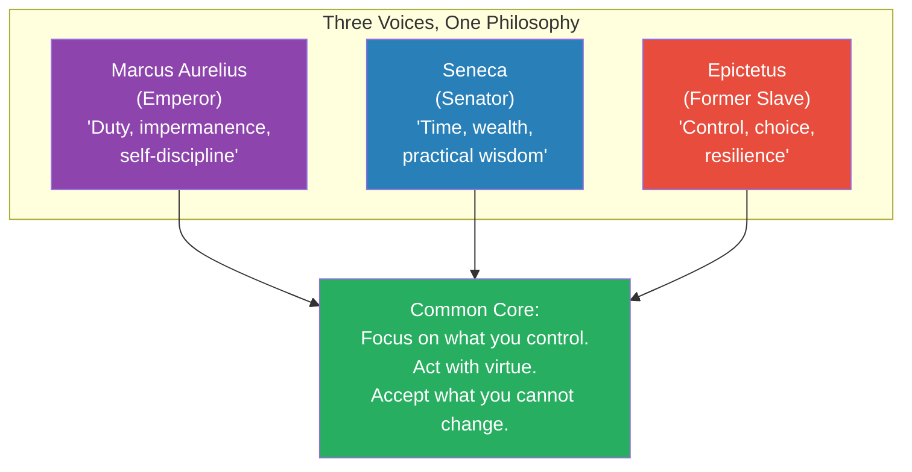
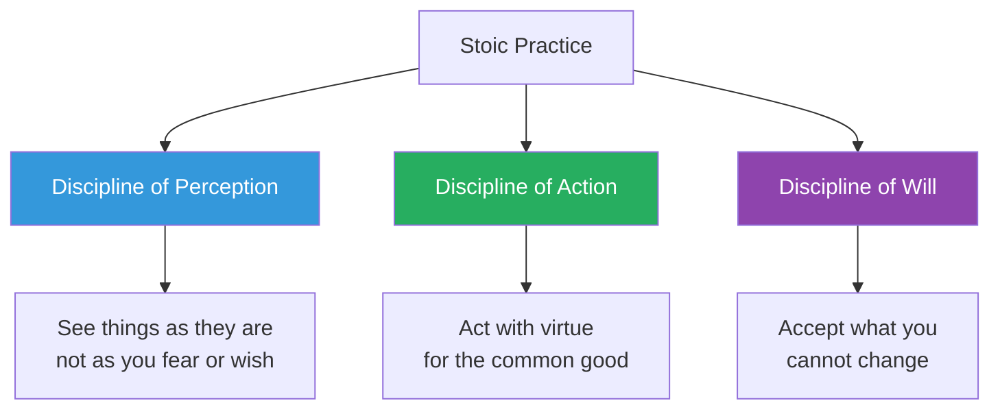
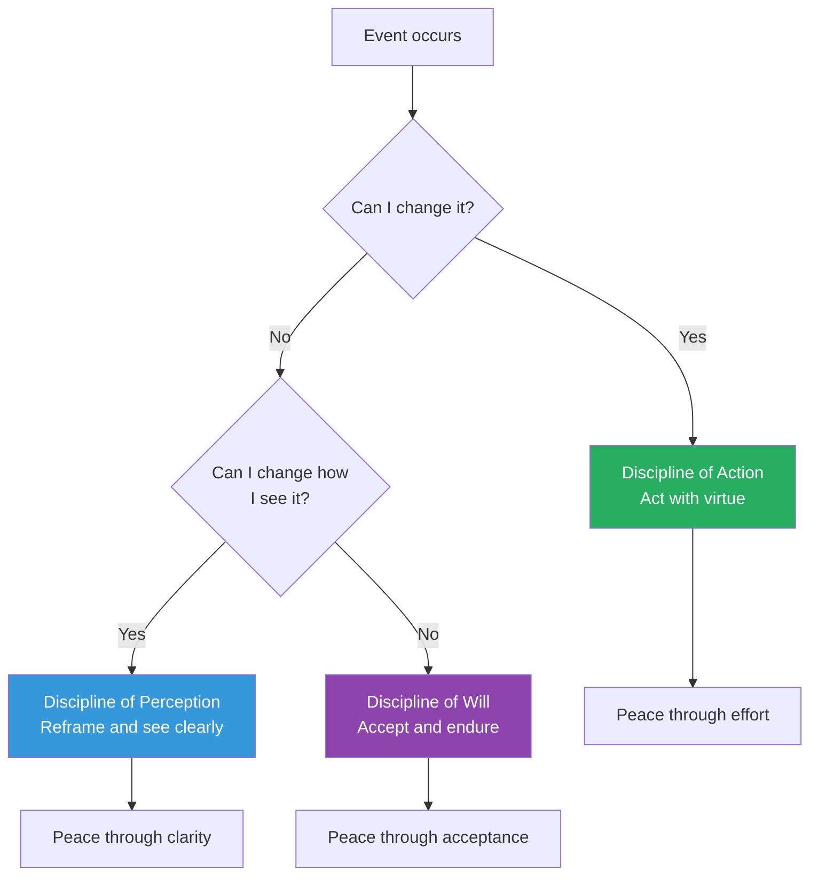
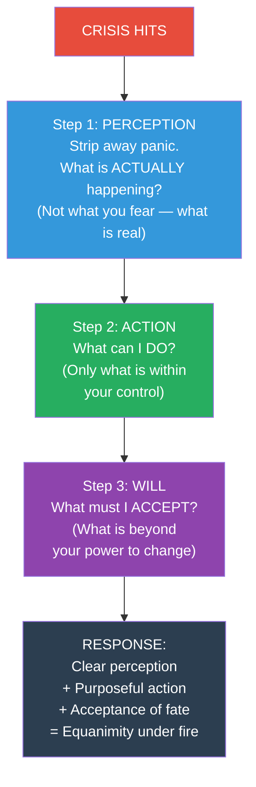
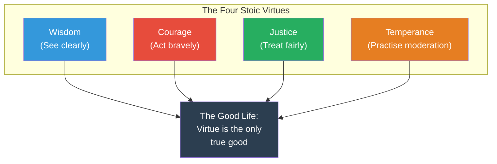

# The Daily Stoic — Ryan Holiday

> Ryan Holiday took the three pillars of Stoic philosophy — Marcus Aurelius, Seneca, and Epictetus — and distilled them into 366 daily meditations, one for every day of the year.
> Each entry pairs an original translation of a Stoic passage with a short, modern interpretation designed to be read in under two minutes.
> The book is organised into twelve monthly themes that map the Stoic path from clarity of perception through disciplined action to acceptance of fate.
> It is not a book you read cover to cover. It is a book you live with — one page each morning, every morning, for a year and then again.

---

## About the Author

Ryan Holiday is a former marketing strategist turned author and modern Stoicism's most effective populariser.
After dropping out of college at 19, he became the Director of Marketing at American Apparel and a media strategist for bestselling authors. His first book, *Trust Me, I'm Lying*, was a confessional about media manipulation. His subsequent pivot to Stoic philosophy — beginning with *The Obstacle Is the Way* (2014) — transformed both his career and his public identity.

His Stoicism series includes:
- *The Obstacle Is the Way* (2014) — Perception, action, and will applied to obstacles
- *Ego Is the Enemy* (2016) — How ego undermines success at every stage
- *Stillness Is the Key* (2019) — The power of quiet in a noisy world
- *The Daily Stoic* (2016) — The daily practice book that ties them all together
- *Discipline Is Destiny* (2022) — Temperance as the foundational virtue
- *Right Thing, Right Now* (2024) — Justice as the most important Stoic virtue

Holiday runs the Daily Stoic website and email, which reaches over two million subscribers. He has also built a physical bookstore (The Painted Porch) in Bastrop, Texas — named after the Stoa Poikile, the painted porch in Athens where Stoicism was originally taught.

> [!tip] Why Holiday Matters for Stoicism
> Holiday's contribution is not philosophical originality — he would be the first to say so. His contribution is accessibility and application. He takes 2,000-year-old texts written in Greek and Latin, translates them into clear modern English, and shows you exactly how to use them in a meeting, during a crisis, or when facing a difficult decision. He is Stoicism's best translator from theory to practice.

---

## The 30-Second Version

1. **Stoic philosophy has three disciplines:** Perception (see clearly), Action (act rightly), Will (accept what you cannot change)
2. **These are not ideas to think about — they are exercises to practise daily**
3. **This book gives you one meditation per day for a year** — a source passage + a modern interpretation
4. **Each morning, spend 2 minutes with the day's entry.** Ask: how does this apply to what I face today?
5. **Each evening, review:** What did I resist? Where did I improve? Where did I fail?
6. **The power is cumulative.** No single entry changes your life. Doing it every day for a year might.

---

## The Big Idea

- <b style="color: #2980b9">Philosophy is not something you study — it is something you practise, daily, like exercise</b>
- The Stoics built their philosophy around three disciplines: the Discipline of Perception (how you see the world), the Discipline of Action (how you act in it), and the Discipline of Will (how you accept what you cannot change)
- <b style="color: #27ae60">One meditation per day, drawn from the source texts, designed to be immediately applicable to modern life</b>
- The book is structured as a year-long curriculum: January through April covers Perception, May through August covers Action, September through December covers Will
- Each daily entry contains two elements: an original translation of a passage from Marcus Aurelius, Seneca, or Epictetus, followed by Holiday's modern interpretation showing how the idea applies to everyday challenges

> [!warning] This Is Not a Book to Read Once
> The single biggest mistake people make with *The Daily Stoic* is reading it cover to cover in a weekend. That defeats the entire purpose. The book is designed as a daily practice — one entry per day, every day, for a year. The ideas are not complex. They don't need to be. What they need is repetition, application, and time. A gym routine done once is useless. A gym routine done daily for a year transforms your body. This book works the same way, for your mind.

### Why Daily Practice Matters

The Stoics compared philosophy to athletics. An athlete who trains once a month is not an athlete. A philosopher who reflects once a month is not a philosopher. The daily practice is not a supplement to the philosophy — it IS the philosophy.

- <b style="color: #e74c3c">Marcus Aurelius wrote in his journal almost every day — not because he enjoyed writing, but because his Stoic composure would erode if he didn't constantly reinforce it</b>
- Seneca wrote letters to Lucilius as a daily practice of philosophical self-examination
- Epictetus required his students to practise the dichotomy of control every morning before they did anything else

The brain defaults to reactivity, anxiety, and self-centredness. Stoic practice is the daily counterweight that keeps those defaults in check.

---

## The Year at a Glance

| Month | Theme | Core Question | Discipline |
|-------|-------|---------------|-----------|
| January | **Clarity** | What is within my control? | Perception |
| February | **Passions & Desires** | What am I chasing that I don't need? | Perception |
| March | **Awareness** | Am I paying attention to my own mind? | Perception |
| April | **Unbiased Thought** | Am I seeing clearly or through bias? | Perception |
| May | **Right Action** | Am I doing what I should, not just what I want? | Action |
| June | **Problem Solving** | Can I turn this obstacle into an advantage? | Action |
| July | **Duty** | Am I fulfilling my obligations? | Action |
| August | **Pragmatism** | Am I focused on what works, not what's ideal? | Action |
| September | **Fortitude** | Can I endure this? | Will |
| October | **Virtue & Kindness** | Am I treating others justly? | Will |
| November | **Acceptance** | Can I accept what I cannot change? | Will |
| December | **Meditation on Mortality** | Am I living as if this could be my last day? | Will |

---

## The Three Source Philosophers

Holiday draws from three Stoic masters. Understanding who they are transforms how you read the daily entries — because each speaks from a radically different life experience, proving that Stoic philosophy works for everyone, not just the privileged.

### Marcus Aurelius (121–180 CE) — The Emperor

The most powerful man in the ancient world: Emperor of Rome at the height of its territorial extent. Marcus wrote *Meditations* as a private journal during military campaigns, plagues, and political betrayals. His entries are self-critical, repetitive, and honest — he returns to the same themes (impermanence, duty, controlling reactions) because he kept forgetting them under pressure.

- <b style="color: #2980b9">Marcus proves that Stoicism works at the top: power, wealth, and fame did not corrupt him because he had a daily practice of philosophical self-examination.</b>
- His most quoted line in the book: "You have power over your mind — not outside events."
- Marcus is the Stoic you turn to when you are in a position of responsibility and feel the weight of it.

### Seneca (4 BCE–65 CE) — The Advisor

Seneca was a Roman senator, playwright, tutor to Emperor Nero, and one of the wealthiest men in Rome. His letters to his friend Lucilius are masterclasses in practical philosophy — warm, humane, self-deprecating, and full of specific advice. He wrote about time management, dealing with anger, preparing for adversity, and the proper attitude toward wealth.

- <b style="color: #27ae60">Seneca proves that Stoicism works in the real world: he navigated Roman politics, survived exile, accumulated and lost a fortune, and ultimately faced execution with composure.</b>
- His most quoted line in the book: "It is not that we have a short time to live, but that we waste a great deal of it."
- Seneca is the Stoic you turn to when you need practical advice delivered with literary elegance.

> [!example] Seneca on Voluntary Discomfort
> Seneca practised what he called "rehearsing poverty." Every few weeks, he would eat the cheapest food, wear rough clothing, and sleep on a hard surface — not because he was poor, but because he was preparing for the possibility. His reasoning: "Set aside a certain number of days during which you shall be content with the scantiest and cheapest fare, with coarse and rough dress, saying to yourself: is this the condition I feared?" By deliberately practising discomfort, he removed the power of fear. He could face loss because he had already rehearsed it.

### Epictetus (50–135 CE) — The Slave

Born a slave in the Roman Empire, Epictetus gained his freedom and became one of the most influential teachers in ancient philosophy. His *Discourses* and *Enchiridion* (Handbook) are the most direct, practical, and confrontational Stoic texts — because Epictetus had no patience for theory without application.

- <b style="color: #e74c3c">Epictetus proves that Stoicism works at the bottom: as a slave, the only thing he controlled was his mind. His philosophy was not an intellectual luxury — it was survival.</b>
- His most quoted line in the book: "It's not what happens to you, but how you react to it that matters."
- Epictetus is the Stoic you turn to when you need blunt, no-nonsense instruction.

> [!warning] The Master's Broken Leg
> Epictetus walked with a limp — tradition says his master deliberately broke his leg. When asked about it, Epictetus reportedly said (paraphrased): "You can break my leg, but you cannot break my will." This is not inspirational poster material. It is the testimony of a man who developed the dichotomy of control not as an abstract principle but as the only way to maintain his dignity under conditions of absolute powerlessness.

| Philosopher | Life Station | Writing Style | When to Read Him |
|------------|-------------|---------------|-----------------|
| **Marcus Aurelius** | Emperor | Self-critical journal, repetitive reminders | When you carry responsibility and need perspective |
| **Seneca** | Senator/Advisor | Warm letters, literary elegance, practical advice | When you need specific guidance on a real-world problem |
| **Epictetus** | Former slave | Blunt lectures, confrontational challenges | When you need someone to tell you the hard truth |

---

## The Three Disciplines

---

## Key Meditations by Theme

### Part 1: Perception — Seeing Clearly (January–April)

The first four months of *The Daily Stoic* address how you see the world. The Stoic claim is that most of your suffering comes not from events but from your interpretation of events. Perception is where you take control.

- "You have power over your mind — not outside events. Realise this, and you will find strength." — Marcus Aurelius
- <b style="color: #2980b9">The first task each morning: separate what is in your control from what is not. Then direct all energy toward the first category.</b>
- Seneca's practice of voluntary discomfort — sleeping on a hard floor, eating simple food — was designed to sharpen perception: most of what we fear losing is not necessary.

> [!example] January 1: Control and Choice
> The very first entry in the book quotes Epictetus: "The chief task in life is simply this: to identify and separate matters so that I can say clearly to myself which are externals not under my control, and which have to do with the choices I actually control." Holiday's commentary: this single distinction — what is up to me and what is not — is the most important mental move you will ever learn. Practice it every morning.

> [!tip] The Perception Toolkit
> Holiday draws out several specific perception exercises from the Stoics:
> - **The View from Above** — Imagine looking down on your situation from a great height. How important is it really?
> - **Voluntary Discomfort** — Practise being cold, hungry, or uncomfortable. You'll realise how little you actually need.
> - **Strip Away the Narrative** — Describe what happened without judgment: "She said X" not "She insulted me"
> - **The Premortem** — Before a decision, imagine it going terribly wrong. What would that teach you about the decision?

### Part 2: Passions & Desires — Mastering Yourself (February–March)

- "It is not that we have a short time to live, but that we waste a great deal of it." — Seneca
- Holiday emphasises that Stoicism does not mean suppressing emotion — it means not being enslaved by it
- <b style="color: #e74c3c">The Stoic test: before pursuing any desire, ask — is this in my control? Will it make me a better person? Or is it just appetite?</b>

| Desire | Stoic Question | Possible Conclusion |
|--------|---------------|-------------------|
| "I want that promotion" | Is this in my control? | The work is. The decision isn't. Focus on the work. |
| "I want them to respect me" | Is this in my control? | My behaviour is. Their opinion isn't. Behave with integrity. |
| "I want to be rich" | Will this make me better? | Only if wealth enables virtue. Wealth as an end in itself is empty. |
| "I want revenge" | Is this in my control? | My response is. Their punishment isn't. Let go. |
| "I want to be famous" | Will this last? | No. Alexander the Great is dust. Focus on character. |
| "I want them to apologise" | Is this in my control? | Their behaviour isn't. Your healing doesn't require their participation. |

> [!example] February 13: Pleasure Can Become Punishment
> Holiday cites Seneca's observation that excessive pursuit of pleasure inevitably becomes its own punishment. The person who must have the finest wine at every meal eventually cannot enjoy ordinary wine — and since most meals serve ordinary wine, they have condemned themselves to perpetual dissatisfaction. The person who needs luxury to feel comfortable has made themselves fragile. Seneca's practice of voluntary discomfort was designed to prevent this: by deliberately practising simplicity, you keep your baseline for happiness low, making ordinary life feel abundant.

> [!tip] The Desire Audit
> When you feel a strong desire pulling you, run it through the Stoic filter:
> 1. Is this within my control? (If not, redirect energy to what IS)
> 2. Will this make me a better person? (If not, it's appetite, not purpose)
> 3. Would I still want this if nobody knew about it? (Tests whether it's genuine or performative)
> 4. Will this matter in 10 years? (Perspective check)
> 5. Am I running toward something or away from something? (Running away from discomfort is not the same as moving toward virtue)

### The Stoic Relationship to Pleasure and Pain

The Stoics were not ascetics — they did not reject pleasure. They rejected dependence on pleasure. The distinction matters:

| Unhealthy Relationship | Healthy Relationship |
|----------------------|---------------------|
| "I need this to be happy" | "I enjoy this, but I don't need it" |
| "I can't function without my morning routine" | "My routine helps, but I can adapt if I must" |
| "If I lose this, I'll be devastated" | "If I lose this, I'll grieve and then rebuild" |
| "I deserve comfort" | "I prefer comfort, but I can endure discomfort" |

<b style="color: #27ae60">The Stoic is not the person who feels nothing. The Stoic is the person who feels everything but is not controlled by what they feel.</b>

### Part 3: Action — Doing What Is Right (May–August)

The middle section of the book — covering four months — is about translating clear perception into purposeful action. This is where Stoicism proves it is not a passive philosophy.

- "First say to yourself what you would be; and then do what you have to do." — Epictetus
- The Stoics were not passive. Marcus governed an empire. Seneca managed Rome's finances. Epictetus ran a school.
- <b style="color: #27ae60">Right action means acting according to reason and virtue even when it is difficult, unpopular, or unrewarded.</b>

> [!warning] Stoicism Is Not Passivity
> The most common misconception about Stoicism is that it promotes resignation — "accept everything and do nothing." The Daily Stoic demolishes this myth. The middle four months of the book are entirely about action: doing your duty, solving problems, acting with courage, showing up when it's hard. The Stoic accepts outcomes but NOT inaction. You do your best — then accept whatever follows.

**Key entries in the Action section:**
- "How long are you going to wait before you demand the best for yourself?" — Epictetus
- The story of Cato walking bareheaded through Rome in heat and rain to harden himself
- Marcus's morning reluctance passage — even the Emperor didn't want to get up, but he got up because he had work to do

#### May: Right Action

May's theme is about aligning your actions with your values — not doing what is easy, popular, or comfortable, but doing what is right.

> [!example] May 8: Good and Evil Come from Within
> Holiday writes: "Think about the last time you were burned by someone — the dishonest business partner, the scheming colleague, the two-faced friend. What hurt most? Was it what they did, or was it that you had trusted them and they violated that trust? The Stoics would say: you control your own integrity, not theirs. Be honest even when others aren't. Be generous even when others aren't. Not because you're naive — because you've decided what kind of person you will be, regardless of what others choose."

#### June: Problem Solving and The Obstacle Is the Way

June draws heavily on the concept that became Holiday's bestselling book: the obstacle is the way. Every impediment contains within it an opportunity.

- When you lose your job, you gain the opportunity to redirect your career
- When a project fails, you learn what doesn't work — and can now avoid repeating it
- When someone treats you unfairly, you gain the opportunity to practise patience and resilience
- <b style="color: #2980b9">The obstacle is not something that happens before the real work begins. The obstacle IS the real work.</b>

> [!tip] The Obstacle Reframe
> When you face a difficulty, use this three-step Stoic reframe:
> 1. **Perception:** "What is actually happening?" (Strip away the narrative. Describe it neutrally.)
> 2. **Action:** "What can I do about it?" (Focus only on what is within your control.)
> 3. **Will:** "Can I accept what I cannot change?" (Release attachment to outcomes beyond your influence.)
> This three-step process — borrowed directly from the three disciplines — converts almost any obstacle into a manageable challenge.

#### July: Duty

July addresses obligation. The Stoics believed that human beings are social creatures with duties to their families, communities, and species. Withdrawing from the world is not an option.

- Marcus wrote: "At dawn, when you have trouble getting out of bed, tell yourself: I have to go to work — as a human being."
- Seneca argued that even in retirement, you have a duty to serve through writing, teaching, and example
- <b style="color: #e74c3c">Duty is not about doing what you're told. It's about doing what is right — even when no one is watching, even when there is no reward.</b>

#### August: Pragmatism

August is about getting things done in the real world — not in the ideal world the philosopher imagines.

- "If it's endurable, then endure it. Stop complaining." — Marcus Aurelius
- The pragmatic Stoic doesn't wait for perfect conditions. They work with what they have.
- Seneca was a millionaire philosopher who got his hands dirty in Roman politics — he was the ultimate pragmatist

| Idealist Approach | Pragmatic Stoic Approach |
|-------------------|------------------------|
| "I'll wait for the right moment" | "This moment is what I have. I'll start now." |
| "If only I had better resources" | "What can I do with the resources I have?" |
| "This system is broken — I can't work within it" | "I'll improve what I can while working within it" |
| "I need more training before I'm ready" | "I'll learn by doing and correct as I go" |
| "I'll speak up when conditions are safer" | "If it needs to be said, I'll say it now" |

### Part 4: The Will — Accepting Fate (September–December)

The final four months address the hardest Stoic discipline: accepting what you cannot change. Not passively. Not resignedly. With love.

- "The art of living is more like wrestling than dancing." — Marcus Aurelius
- Amor Fati: love your fate. Not merely tolerate it — embrace it as if you chose it.
- The final discipline: when you have perceived clearly and acted rightly, accept the outcome — whatever it is.

#### September: Fortitude and Resilience

September's entries are about endurance — the ability to keep going when everything in you wants to stop.

- "The impediment to action advances action. What stands in the way becomes the way." — Marcus Aurelius
- Holiday draws on military leaders, athletes, and entrepreneurs who faced devastating setbacks and kept going
- <b style="color: #27ae60">Fortitude is not about being unaffected by pain. It is about being affected by pain and continuing anyway.</b>

> [!danger] The Difference Between Pain and Suffering
> The Stoics make a critical distinction: pain is the raw sensation of difficulty. Suffering is the narrative you add to the pain. "This hurts" is pain. "This hurts and it shouldn't be happening and it's unfair and I can't take it" is suffering. The will handles pain by refusing to add the narrative.

#### October: Virtue and Kindness

October shifts from self-directed practice to other-directed action. The Stoic virtues include justice — treating others fairly, generously, and with compassion.

- Marcus wrote: "When you wake in the morning, tell yourself: the people I deal with today will be meddling, ungrateful, arrogant"
- This is not cynicism — it is preparation. By expecting difficulty, you are better equipped to respond with kindness rather than reactivity.
- <b style="color: #2980b9">The Stoic treats others well not because they deserve it, but because that is who the Stoic has decided to be.</b>

#### November: Acceptance

November addresses the ultimate Stoic challenge: accepting what is. Not what should be. Not what you wish for. What IS.

- "Do not seek for things to happen the way you want them to; rather, wish that what happens happens the way it happens: then you will be happy." — Epictetus
- Acceptance is not resignation. Resignation says "nothing matters." Acceptance says "this matters, and I cannot change it, so I will work with it."

> [!example] November 11: Amor Fati
> Holiday's entry on "amor fati" — love of fate — is one of the most powerful in the book. He cites Nietzsche (who borrowed the concept from the Stoics): "My formula for greatness in a human being is amor fati: that one wants nothing to be different, not forward, not backward, not in all eternity." The radical claim: don't just accept what happens. Love it. Use it as fuel. A blazing fire turns everything thrown into it into more fire. Be the fire.

#### December: Meditation on Mortality

The final month of the year brings the Stoic practice full circle: memento mori — remember you will die.

- This is not morbid. It is the most powerful perspective tool available.
- <b style="color: #e74c3c">If you knew you had six months to live, would you spend today worrying about that email? Would you hold that grudge? Would you postpone that conversation?</b>
- December's entries are designed to create urgency — not the frantic urgency of panic, but the clear urgency of someone who knows their time is finite and wants to use it well.

> [!tip] The Memento Mori Practice
> Holiday recommends a specific practice for December (and any time you need perspective):
> 1. Imagine your own funeral. Who is there? What do they say about you? Is that what you want them to say?
> 2. Imagine this is your last day. What would you do differently? Do that.
> 3. Imagine you will live to 90. Are you building a life you want to live for that long? Or are you drifting?
> The awareness of death is not depressing. It is clarifying. It burns away everything trivial and leaves only what matters.

```mermaid
flowchart LR
    J["January\nClarity"] --> F["February\nDesires"] --> MA["March\nAwareness"] --> AP["April\nBias"]
    AP --> MY["May\nRight Action"] --> JU["June\nObstacles"] --> JL["July\nDuty"] --> AU["August\nPragmatism"]
    AU --> S["September\nFortitude"] --> O["October\nVirtue"] --> N["November\nAcceptance"] --> D["December\nMortality"]
    
    subgraph PERC ["Discipline of Perception"]
        J
        F
        MA
        AP
    end
    subgraph ACT ["Discipline of Action"]
        MY
        JU
        JL
        AU
    end
    subgraph WILL ["Discipline of Will"]
        S
        O
        N
        D
    end
    style PERC fill:#3498db,color:#fff
    style ACT fill:#27ae60,color:#fff
    style WILL fill:#8e44ad,color:#fff
```

---

## 10 Best Entries (Selected Highlights)

These are not the only good entries — but they represent the range and depth of the book.

| Date | Source | Key Idea |
|------|--------|---------|
| **Jan 1** | Epictetus | Separate what is in your control from what is not. This is the master skill. |
| **Feb 20** | Seneca | "We suffer more often in imagination than in reality." Most fear is fictional. |
| **Mar 16** | Marcus | "Today I escaped anxiety. Or no, I discarded it, because it was within me." |
| **Apr 7** | Epictetus | "Don't explain your philosophy. Embody it." Less talk, more practice. |
| **Jun 3** | Marcus | "The impediment to action advances action." The obstacle IS the way. |
| **Jul 14** | Seneca | "It is not because things are difficult that we do not dare; it is because we do not dare that things are difficult." |
| **Aug 29** | Marcus | "Think of yourself as dead. You have lived your life. Now take what's left and live it properly." |
| **Oct 5** | Marcus | "The best revenge is not to be like your enemy." Refuse to be corrupted by those who wrong you. |
| **Nov 22** | Epictetus | "Make the best use of what is in your power, and take the rest as it happens." |
| **Dec 31** | Marcus | "Reflect on the last time you postponed something — how many of those people are now dead." Act now. |

> [!success] The Three Disciplines as a Complete System
> Perception tells you what to pay attention to. Action tells you what to do about it. Will tells you how to respond to what you can't change. Together, they cover every possible situation: you either change what you can (action), accept what you can't (will), or adjust how you see it (perception). There is no situation that escapes this framework.

---

## The Daily Practice — In Detail

Holiday recommends a simple routine, but the simplicity is deceptive. Done consistently, this routine restructures how you process every event in your day.

### The Morning Ritual (5 minutes)

1. **Read the day's entry** (2 min) — Read the Stoic passage and Holiday's interpretation
2. **Sit with it** (1 min) — Don't rush. Let the idea settle. What does it actually mean?
3. **Apply it** (2 min) — Ask: "What is one specific situation today where this principle applies?" Name it. Visualise using it.

### The Throughout-the-Day Practice

- When triggered by frustration, desire, or fear, recall the morning's principle
- The trigger is the practice opportunity. You don't become Stoic by reading about Stoicism. You become Stoic by applying it in the moment of difficulty.
- <b style="color: #2980b9">Holiday recommends a physical anchor: a memento mori coin, a bracelet, or a rubber band on the wrist — something that reminds you to pause and choose your response rather than react.</b>

### The Evening Review (5 minutes)

This is Seneca's practice, described in his letters to Lucilius. Every evening, before sleep:

1. **What weakness did I resist today?** (Where did I practise self-control?)
2. **Where did I improve?** (Where was I better than yesterday?)
3. **Where did I fail?** (Where did I react instead of respond? Where did I violate my own principles?)

> [!tip] The Evening Journal Template
> | Question | Today's Answer |
> |----------|---------------|
> | What went well today? | |
> | What did I struggle with? | |
> | What was within my control that I handled well? | |
> | What was NOT within my control that I tried to control anyway? | |
> | Where did I react instead of respond? | |
> | What will I do differently tomorrow? | |

---

## Stoicism at Work: A Practical Application Guide

### In Meetings

| Situation | Reactive Response | Stoic Response |
|-----------|------------------|---------------|
| Someone takes credit for your idea | Anger, public confrontation | Note it. Raise it privately if needed. Your work will speak over time. |
| Boss makes a bad decision | Resentment, passive-aggressive compliance | Offer your perspective clearly. Then execute whatever is decided. |
| Colleague criticises your work in front of others | Defensiveness, counter-attack | Evaluate the criticism for useful content. Ignore the delivery. |
| The meeting is pointless | Visible impatience, disengagement | You're here. Engage fully. Or excuse yourself respectfully. |
| Someone is hostile or aggressive | Mirror their aggression | "The best revenge is not to be like your enemy." Stay calm. |

### During Career Setbacks

- <b style="color: #e74c3c">The Stoic does not ask "Why did this happen to me?" The Stoic asks "What can I make of this?"</b>
- Passed over for promotion → "What can I learn from this? What is within my power to change? And — honestly — was the work good enough?"
- Fired → "This is an obstacle. What does this make possible that wasn't possible before?"
- Project failure → "What did I learn that I couldn't have learned any other way?"

### Dealing with Difficult Colleagues

Epictetus provides the clearest framework for dealing with difficult people:

1. **Remember:** They are acting according to their understanding, not yours
2. **Ask:** "Does their behaviour actually harm my character?" (Usually, no)
3. **Check:** "Am I taking this personally?" (If so, that is my problem, not theirs)
4. **Act:** Respond with integrity regardless of how they behave
5. **Release:** Their behaviour is not within your control. Your response is.

---

## Stoicism in Relationships

### With a Partner

- <b style="color: #27ae60">Don't try to change them. Focus on being the best version of yourself. Model what you want to see.</b>
- When they frustrate you, Marcus would say: "Begin each morning by telling yourself: today I will meet irritability, ingratitude, and selfishness — even from the person I love most."
- This is not cynicism. It is compassionate preparation. By expecting imperfection, you can respond with patience instead of disappointment.

### With Children

- Epictetus: "First say to yourself what you would be; and then do what you have to do." Model self-control before you demand it from your children.
- Seneca on time with family: "It is not that we have a short time to live..." — Don't postpone presence. The years will pass faster than you think.

### During Conflict

> [!warning] The Stoic Response to Conflict
> The Stoic does not avoid conflict. The Stoic engages in conflict without losing composure. The key phrase is Marcus's: "How much more grievous are the consequences of anger than the causes of it." Before you react in anger, ask: will my reaction cause more damage than the thing I'm reacting to? Almost always, the answer is yes.

---

## Stoicism During Crisis

This is where *The Daily Stoic* proves its worth. In calm times, the daily practice feels like a pleasant morning routine. In crisis, it becomes a survival tool.

### The Crisis Protocol (From the Three Disciplines)

| Crisis | Perception (What's really happening?) | Action (What can I do?) | Will (What must I accept?) |
|--------|--------------------------------------|------------------------|---------------------------|
| Job loss | "I no longer have this job." (Not: "My life is over.") | Update CV, reach out to network, evaluate options | The decision was not mine. The response is. |
| Health diagnosis | "The doctor said X." (Not: "I'm going to die.") | Research, get second opinions, follow treatment | Some things are not within my power. My attitude is. |
| Relationship ending | "This relationship has ended." (Not: "I'm unlovable.") | Process grief, learn lessons, maintain dignity | I cannot control another person's feelings. |
| Financial loss | "I have lost X amount." (Not: "I'll never recover.") | Assess, adjust, rebuild | The past cannot be undone. The future is still open. |

> [!success] Why Daily Practice Matters in Crisis
> You cannot summon Stoic composure in a crisis if you haven't been practising it daily in calm times. The morning meditation is not about the morning — it is about building the mental muscles you will need when everything falls apart. A firefighter doesn't learn to stay calm during a fire. They learn during training. The Daily Stoic is your training.

---

## What Makes This Book Different

Most philosophy books are read once and shelved. *The Daily Stoic* is designed to be read 366 times.
Its power is not in any single entry — most are straightforward — but in the cumulative effect of daily practice.
Stoicism is not a set of ideas to understand. It is a set of exercises to perform.
Holiday's contribution is making those exercises accessible, brief, and tied to the rhythms of ordinary modern life.

---

## Common Misconceptions About Stoicism (That This Book Corrects)

| Misconception | What *The Daily Stoic* Actually Teaches |
|--------------|---------------------------------------|
| "Stoics suppress their emotions" | Stoics examine their emotions before acting on them. Feel everything — but don't be controlled by what you feel. |
| "Stoicism means accepting injustice" | Marcus fought wars. Seneca managed an empire's finances. Epictetus ran a school. Acceptance applies to outcomes, not to inaction. |
| "Stoics don't care about anything" | Marcus cared deeply about Rome, justice, and duty. The Stoic cares intensely — but cares about what is in their power, not what isn't. |
| "Stoicism is only for privileged people" | Epictetus was born a slave. He had nothing except his mind. His philosophy was a survival tool, not a luxury. |
| "Stoicism is cold and rational" | Read Book 1 of Meditations — it's a love letter to the people who shaped Marcus. Stoicism is warm, compassionate, and deeply human. |
| "Stoicism is about individual self-help" | The Stoic virtues include justice — the obligation to treat others fairly and to serve the common good. It is a social philosophy. |
| "Stoicism is outdated" | The technology changes; human nature doesn't. Anger, fear, desire, and death are the same problems today as in 180 CE. |

---

## Before and After: A Day With and Without The Daily Stoic

### Monday Without The Daily Stoic

You wake up and immediately check your phone. Email from your boss — terse, unclear. Your stomach drops. You spend the commute constructing worst-case scenarios. At work, a colleague makes a snide comment in a meeting. You replay it for two hours, composing devastating comebacks you'll never use. Afternoon: a project deadline gets moved up. You feel overwhelmed and resentful. Evening: you vent to your partner about how unfair everything is, then scroll social media until you're too numb to think. You go to bed agitated, replaying the day's grievances.

### Monday With The Daily Stoic

You wake up. Before touching your phone, you read the day's entry — February 20: "We suffer more often in imagination than in reality." You sit with it for a minute. You check your email. Boss's tone is terse — but is it about you? (Agreement with yourself: don't assume. Ask if needed.) At work, a colleague makes a snide comment. You notice the urge to react, remember the morning's theme: suffering in imagination. You let it pass. It takes 10 seconds. Afternoon: deadline moves up. You ask yourself: "What is within my control? What is not?" You focus on the former. Evening: you do Seneca's review. What went well? You didn't take the comment personally. What could improve? You could have asked the boss to clarify instead of assuming. You go to bed calm. The day was not perfect. But you chose your response to it.

---

## The Limitations

1. **Brevity sacrifices depth.** Each entry is one page. This is a feature for daily practice but a limitation for serious study. Some of the most profound Stoic ideas are reduced to a paragraph that doesn't do them justice.

2. **Holiday's interpretations are sometimes thin.** When the source passage is rich, Holiday's commentary occasionally adds little beyond restating the obvious. The best entries are the ones where he provides a modern story or application; the weakest are the ones where he simply paraphrases.

3. **The selection is biased toward Marcus.** Marcus Aurelius features most prominently, with Seneca second and Epictetus third. This is understandable — Marcus is the most quotable — but it means the more systematic and confrontational voice of Epictetus is underrepresented.

4. **No engagement with Stoicism's critics.** Holiday presents Stoicism as universally applicable, but there are legitimate criticisms: Can you really choose your response to trauma? Is "accepting what you cannot change" sometimes an excuse for not fighting hard enough? Is the dichotomy of control too neat for a messy world? The book doesn't address these questions.

5. **The repetition.** Because the book covers 366 days on overlapping themes, there is inevitable repetition. Some entries in the same month feel like minor variations on the same idea. This is arguably by design — Stoic practice IS repetition — but it can feel thin on a first read-through.

> [!warning] The Important Caveat
> The Daily Stoic is a practice book, not a philosophy book. It tells you what to do, not why the Stoics believed it worked at a deep level. For the philosophical depth — cosmology, ethics, the nature of virtue — you need the original sources: [[Meditations - Marcus Aurelius|Meditations]], [[Discourses - Epictetus|Discourses]], and Seneca's *Letters from a Stoic*. Think of *The Daily Stoic* as the warm-up that prepares you for the real workout.

---

## The Four Stoic Virtues

Holiday weaves the four cardinal Stoic virtues throughout the year's entries. Understanding them gives you the framework for interpreting every daily meditation.

### 1. Wisdom (Sophia)

The ability to see clearly — to distinguish what is true from what is false, what is within your control from what is not, what matters from what doesn't.

- Wisdom is the foundation. Without clear perception, right action is impossible.
- <b style="color: #2980b9">Wisdom is not intelligence. You can be intelligent and unwise. Wisdom is the application of intelligence to the question of how to live.</b>
- In practice: pausing before reacting, examining your impressions, questioning your assumptions

### 2. Courage (Andreia)

The willingness to do what is right even when it is difficult, dangerous, or costly.

- Courage is not the absence of fear. It is action in the presence of fear.
- The Stoics recognised physical courage but emphasised moral courage: speaking truth, standing by principles, accepting consequences
- <b style="color: #e74c3c">Seneca: "It is not because things are difficult that we do not dare; it is because we do not dare that things are difficult."</b>

### 3. Justice (Dikaiosyne)

Treating others fairly — the most social of the virtues and, according to Marcus, the most important.

- Justice extends beyond the legal sense. It means: giving others their due, acting with integrity, serving the common good
- <b style="color: #27ae60">Marcus Aurelius considered justice the highest virtue because it is impossible to practise alone. Wisdom, courage, and temperance can be practised in solitude. Justice requires other people.</b>
- In practice: being honest, being generous, not exploiting power, standing up for those who cannot stand up for themselves

### 4. Temperance (Sophrosyne)

Moderation, self-control, and the ability to do nothing when nothing should be done.

- Temperance is not about denying yourself pleasure. It is about not being enslaved by pleasure.
- It applies to everything: food, money, ambition, anger, even the pursuit of virtue itself (fanaticism is a failure of temperance)
- In practice: knowing when to stop, when to hold back, when to let something go

| Virtue | What It Looks Like at Work | What Its Absence Looks Like |
|--------|---------------------------|---------------------------|
| **Wisdom** | Pausing to think before reacting to bad news | Sending the angry email immediately |
| **Courage** | Raising a concern in a meeting when everyone else stays silent | Going along with a bad decision to avoid conflict |
| **Justice** | Giving credit where it's due, even when no one would notice | Taking credit for someone else's work |
| **Temperance** | Knowing when to stop working, stop arguing, stop pushing | Burning out, overreacting, pushing until you break something |

---

## The Daily Stoic vs Other Daily Practice Books

| Book | Philosophy | Format | Best For |
|------|-----------|--------|---------|
| **The Daily Stoic** (Holiday) | Stoicism | 366 entries, one per day, source + commentary | Building a daily Stoic practice from scratch |
| **Meditations** (Marcus Aurelius) | Stoicism | Private journal, 12 books, no daily structure | Deep Stoic self-examination (less structured) |
| **The Daily Laws** (Robert Greene) | Power & strategy | 366 entries from Greene's books | Strategy and human nature, not philosophy |
| **The Daily Drucker** (Peter Drucker) | Management | 366 management insights | Leaders and executives |
| **Tao Te Ching** (Lao Tzu) | Taoism | 81 short poems | Those drawn to Eastern philosophy and paradox |
| **The Four Agreements** (Ruiz) | Toltec wisdom | 4 principles, not daily | Those who want fewer rules, not 366 entries |

---

## A 30-Day Starter Plan (If You Don't Have the Book Yet)

You don't need the book to start practising Stoicism today. Here is a 30-day plan using free source material:

### Week 1: The Dichotomy of Control
Each morning, ask: "What is within my control today? What is not?" Write two lists. Focus all energy on list one. Release list two.

### Week 2: The Evening Review
Each evening, answer three questions (Seneca's practice):
1. What went well today?
2. Where did I fail?
3. What will I do better tomorrow?

### Week 3: Voluntary Discomfort
Choose one small discomfort each day and embrace it deliberately: cold shower, skipping a snack, taking the stairs, sitting in silence for 10 minutes. Notice how little you actually need.

### Week 4: Memento Mori
Each morning, remind yourself: this could be your last day. Then ask: given that, what is worth doing? What is not worth worrying about? Let the answers guide your day.

> [!success] The Compound Effect of Daily Practice
> After 30 days, you will not be a Stoic philosopher. But you will notice a difference: fewer automatic reactions, less time spent on things outside your control, more equanimity in the face of difficulty, and a clearer sense of what actually matters. After a year, the difference will be profound. The daily practice is small. The compound effect is not.

---

## The 12 Most Powerful Stoic Exercises (Drawn from The Daily Stoic)

### 1. The Dichotomy of Control (Daily)
Before reacting to anything, ask: "Is this within my control?" If yes, act. If no, release.

### 2. Premeditatio Malorum (Morning)
Imagine the worst that could happen today. Not to create anxiety — to remove the power of surprise. Marcus: "Begin each morning by telling yourself: today I will meet with meddling, ingratitude, arrogance."

### 3. The Evening Review (Nightly)
Seneca's three questions: What did I resist? Where did I improve? Where did I fail?

### 4. Voluntary Discomfort (Weekly)
Deliberately practise being cold, hungry, or deprived. Seneca: "Is this the condition I feared?" You'll find it's bearable.

### 5. The View from Above (When overwhelmed)
Imagine rising above the earth until your problem is invisible. Return with corrected proportions.

### 6. Memento Mori (When procrastinating)
Remember you will die. This is not morbid — it is the most effective priority-setting tool ever invented.

### 7. Amor Fati (When something bad happens)
Don't just accept it. Love it. Use it. Be the fire that turns fuel into flame.

### 8. Stripping Away the Narrative (When upset)
Describe what happened without judgment. "He raised his voice" not "He attacked me." The suffering is in the story, not the event.

### 9. The Sage Test (Before speaking or acting)
Ask: "What would the wisest person I know do in this situation?" Then do that.

### 10. The Last Time Meditation (When annoyed by routine)
Imagine this is the last time you will do this. The last commute. The last meeting. The last time you'll see this person. Does it change how you experience it?

### 11. Negative Visualisation for Gratitude (When taking things for granted)
Imagine losing what you have: your home, your health, your partner, your children. Feel the loss. Then open your eyes. Everything is still here. You are rich beyond measure.

### 12. The Waiting Game (When tempted to react in anger)
When angry, do nothing. Wait. The anger will pass. It always does. If you act during anger, you will regret it. If you wait, you will respond with clarity.

---

## Stoicism for Specific Life Situations

### For Parents

| Challenge | Stoic Principle | Application |
|-----------|----------------|------------|
| Your child misbehaves publicly | "They are doing their best according to their development" | Respond with patience. They are learning, not attacking you. |
| Teen pushes back on rules | "First say to yourself what you would be" — Epictetus | Model the behaviour you want. Lecture less, demonstrate more. |
| You lose your temper | "How grievous are the consequences of anger" — Marcus | Apologise. Show them that adults make mistakes and repair them. |
| Worry about their future | Dichotomy of control | You control your parenting. You do not control their life. |

### For Leaders

- <b style="color: #2980b9">A leader's composure in crisis is the most powerful communication available. When you don't panic, your team doesn't panic.</b>
- Marcus governed an empire while practising Stoic self-examination every night. The daily practice made him a better ruler, not a detached one.
- Epictetus: "No man is free who is not master of himself." A leader who cannot master their own reactions cannot lead anyone else.

### For Anyone Going Through Grief

The Stoics did not deny grief. Marcus wept when his children died. Seneca wrote agonised letters after losing his father and his son. What the Stoics denied was the usefulness of prolonged, self-destructive grief.

- <b style="color: #27ae60">Grieve fully. Then ask: "What would the person I lost want me to do with the rest of my life?" Honour them by living well, not by suffering endlessly.</b>
- Epictetus: "Remind yourself that what you love is mortal. Allow yourself the moment of grief. Then return to your duties."
- The Stoic practice of memento mori — remembering that everyone dies — is actually a practice of gratitude: if you remember your loved ones will die, you cherish them more while they are alive.

### For Anyone Dealing with Injustice

> [!danger] When Acceptance Is Not Enough
> The Stoic framework is powerful, but it has a limit. "Accept what you cannot change" is wise advice for weather, aging, and other people's opinions. It is NOT adequate advice for systemic injustice. If the system is broken, the Stoic duty — DUTY, not resignation — is to work to change it. Marcus did not accept the Germanic invasions. He fought them. Seneca did not accept Nero's tyranny silently — he tried to moderate it. The Stoic fights injustice while maintaining inner composure. Both matter.

---

## The Holiday Stoicism Ecosystem

*The Daily Stoic* is the centre of a larger ecosystem Holiday has built around modern Stoicism:

| Resource | Format | Best For |
|----------|--------|---------|
| **The Daily Stoic** (book) | 366 daily entries | Building the daily practice |
| **The Obstacle Is the Way** (book) | Narrative, 3-part structure | Applying Stoicism to specific obstacles |
| **Ego Is the Enemy** (book) | Narrative, 3-part structure | Recognising how ego undermines you |
| **Stillness Is the Key** (book) | Narrative, 3-part structure | Finding calm in a chaotic world |
| **Discipline Is Destiny** (book) | Narrative on temperance | Building self-discipline as a virtue |
| **Right Thing, Right Now** (book) | Narrative on justice | Doing the right thing under pressure |
| **Daily Stoic email** | Free daily newsletter | Ongoing daily practice after the book |
| **Daily Stoic podcast** | Interview and commentary | Deeper dives into specific principles |
| **Memento Mori medallion** | Physical object | Tangible daily reminder of mortality |

> [!tip] The Recommended Reading Order
> If you're new to Stoicism:
> 1. Start with *The Daily Stoic* — build the habit
> 2. Read *The Obstacle Is the Way* — apply it to a specific challenge
> 3. Read [[Meditations - Marcus Aurelius|Meditations]] — go to the source
> 4. Read [[Discourses - Epictetus|Discourses]] — get the full philosophical system
> 5. Continue *The Daily Stoic* for a second year — you'll read the same entries with completely different eyes

---

## How to Use This Book for a Full Year (and Beyond)

### Year 1: Build the Habit

- Read each entry on its assigned day
- Don't skip ahead or read multiple entries at once — the single-entry format is the practice
- Keep a simple journal: write one sentence about how the day's entry applied (or didn't)
- By month 6, you'll notice you're reacting less and responding more
- By month 12, the Stoic framework will be embedded in how you think

### Year 2: Go Deeper

The second reading is always richer than the first. On the second pass:

- You'll catch nuances you missed the first time
- Your life circumstances will have changed — the same entry hits differently when you're facing a new challenge
- <b style="color: #2980b9">Start reading the original source texts alongside the daily entries. When Holiday quotes Marcus, open Meditations. When he quotes Epictetus, open the Discourses.</b>
- Keep your year-1 journal next to you. Compare how you responded to the same entry 12 months ago. That gap is your growth.

### Year 3 and Beyond: Teach It

- The deepest learning comes from teaching. Start sharing Stoic ideas with others.
- When a friend faces a crisis, you'll find yourself naturally offering Stoic frameworks — not because you memorised them, but because you've practised them.
- <b style="color: #27ae60">The ultimate test of The Daily Stoic is not whether you can quote Marcus Aurelius. It is whether your life — your composure, your integrity, your response to difficulty — reflects what the Stoics taught.</b>

> [!success] The Promise of Daily Practice
> There is no single entry in The Daily Stoic that will change your life. But there is a practice — two minutes, every morning, for years — that will change how you respond to everything that happens in your life. The Stoics believed that philosophy was not about acquiring knowledge. It was about acquiring character. Character is built daily. This book gives you the daily blueprint.

---

## A Note on Translations

Holiday worked with Stephen Hanselman to produce fresh translations of the source texts. This matters because many existing translations are stiff, archaic, or obscure. Holiday's translations prioritise clarity and modern applicability over literal accuracy. If a passage can be rendered in clearer English while preserving the Stoic insight, he does so.

For readers who want the most faithful translations:
- **Marcus Aurelius:** Gregory Hays (Modern Library, 2002) — the most accessible
- **Epictetus:** Robert Dobbin (Penguin Classics) or Robin Hard (Oxford World's Classics)
- **Seneca:** Robin Campbell (*Letters from a Stoic*, Penguin) or James Romm (*How to Die*, Princeton)

---

## Key Stoic Concepts Glossary

| Term | Origin | Meaning | Daily Application |
|------|--------|---------|-----------------|
| **Apatheia** | Greek | Freedom from destructive passions (NOT apathy) | Not being controlled by anger, fear, or desire |
| **Ataraxia** | Greek | Tranquillity of mind | The calm that comes from right practice |
| **Amor Fati** | Latin | Love of fate | Embracing whatever happens as fuel |
| **Dichotomy of Control** | Epictetus | Only your judgments and actions are "up to you" | The daily sorting: my business vs. not my business |
| **Eudaimonia** | Greek | Human flourishing through virtue | The goal: not pleasure, but a life well-lived |
| **Hegemonikon** | Greek | The ruling faculty of the mind | Your capacity to choose your response |
| **Logos** | Greek | The rational order of the universe | Everything that happens is part of a rational whole |
| **Memento Mori** | Latin | Remember you will die | Use death as a perspective and urgency tool |
| **Oikeiosis** | Greek | Natural affinity expanding outward (self → family → humanity) | You are connected to all people — act accordingly |
| **Premeditatio Malorum** | Latin | Pre-meditation of evils | Imagine the worst in advance to remove surprise |
| **Prosoche** | Greek | Attention, mindfulness | The practice of watching your own thoughts |
| **Sympatheia** | Greek | The interconnectedness of all things | Your actions ripple outward; everything is connected |
| **Virtue (Arete)** | Greek | Excellence of character | Wisdom, courage, justice, temperance — the only true goods |

---

## The Science Behind Stoic Practice

Modern psychology has validated many Stoic techniques, often under different names:

| Stoic Practice | Modern Psychological Equivalent | Research Finding |
|---------------|-------------------------------|-----------------|
| Dichotomy of control | Locus of control (Rotter, 1966) | Internal locus of control correlates with lower anxiety, better performance |
| Premeditatio malorum | Defensive pessimism | Imagining worst-case scenarios reduces anxiety in anxious individuals |
| Evening review | Reflective journaling | Daily journaling reduces stress and improves emotional processing |
| Stripping away narrative | Cognitive defusion (ACT therapy) | Separating self from thoughts reduces emotional impact |
| Voluntary discomfort | Exposure therapy | Graduated exposure to feared stimuli reduces anxiety |
| Memento mori | Terror Management Theory | Death awareness increases prosocial behaviour and meaning-seeking |
| Amor fati | Post-traumatic growth | People who find meaning in adversity show greater resilience |

> [!example] The CBT Connection
> Cognitive Behavioural Therapy — the most evidence-based psychotherapy — was explicitly inspired by Stoic philosophy. Aaron Beck, one of CBT's founders, acknowledged that his approach was built on the Stoic principle that disturbance comes not from events but from our judgments about events. When Holiday asks you to "strip away the narrative" from an event, he is prescribing the same technique that millions of therapy patients learn in CBT sessions. The Stoics were practising cognitive therapy 2,000 years before it had a name.

---

## The Verdict

*The Daily Stoic* is the most practical entry point into Stoic philosophy available. It requires no prior knowledge of ancient texts. It demands only two minutes a day. And it works — not because the individual meditations are profound (some are, some aren't) — but because the habit of daily philosophical reflection changes how you process everything else.

If you read [[Meditations - Marcus Aurelius|Meditations]] and wished someone would tell you exactly how to apply it, this is that book.

The book's strength is also its limitation: each entry is deliberately brief (one page). This means you get breadth but not depth. For deeper treatment of any single theme, you'll want the original sources: [[Meditations - Marcus Aurelius|Meditations]] for Marcus, [[Discourses - Epictetus|Discourses]] for Epictetus, or Seneca's letters.

Holiday's modern interpretations are generally excellent — clear, practical, and grounded. Occasionally they lean toward self-help platitudes rather than philosophical rigour, but for a book designed to be read in 120 seconds per day, the calibration is appropriate.

The real test of *The Daily Stoic* is not whether you like reading it. It's whether you're still reading it six months from now. The book is a habit, not a book. Judge it by the habit, not by any single page.

---

## Who Should Read This Book

| Reader | What They'll Get |
|--------|-----------------|
| **Stoic beginners** | The gentlest possible introduction — 2 minutes a day, no Greek required |
| **Regular Meditations readers** | A structured daily companion that connects ancient texts to modern life |
| **People who struggle with reactivity** | Daily practice in pausing before reacting |
| **Leaders and managers** | A morning calibration routine that builds equanimity and composure |
| **Anyone in a difficult season** | Daily reminders that difficulty is temporary and your response is what matters |
| **Parents** | A framework for modelling self-control and emotional regulation |
| **Recovering perfectionists** | The Stoic emphasis on effort over outcomes is profoundly liberating |
| **Anyone who has tried meditation but couldn't stick with it** | A 2-minute philosophical practice with more structure than silent meditation |

> [!tip] The Book as a Gift
> *The Daily Stoic* is one of the best books to give someone who is going through a difficult time — not because any single entry will fix their problem, but because the daily practice of Stoic reflection provides a scaffold for processing difficulty. It says: you are not powerless. You control your response. That message, delivered daily, accumulates into genuine resilience.

---

## Related Reading

- [[Meditations - Marcus Aurelius|Meditations]] — The primary source for many of the daily entries; Marcus's private journal. Read *The Daily Stoic* first for accessibility, then *Meditations* for depth.
- [[Discourses - Epictetus|Discourses]] — The most systematic and direct Stoic source Holiday draws from. Epictetus is more practical and confrontational than Marcus.
- [[Man's Search for Meaning - Viktor Frankl|Man's Search for Meaning]] — Frankl's logotherapy is Stoicism tested in the 20th century's darkest moment. The Stoic claim that you can choose your response to anything is proven in Auschwitz.
- [[Deep Work - Cal Newport|Deep Work]] — The focused morning routine that pairs naturally with daily Stoic practice.
- [[Essentialism - Greg McKeown|Essentialism]] — Focus on what matters, let go of everything else — the Stoic message in productivity language.
- [[The Four Agreements - Don Miguel Ruiz|The Four Agreements]] — Ruiz's "don't take anything personally" is the Stoic dichotomy of control in Toltec language.
- [[12 Rules for Life - Jordan Peterson|12 Rules for Life]] — Peterson draws on Stoic themes, particularly accepting responsibility for your own suffering.
- [[The Almanack of Naval Ravikant - Eric Jorgenson|The Almanack of Naval Ravikant]] — Naval's philosophy echoes Stoic principles: desire is suffering, internal freedom trumps external achievement.
- [[Thinking in Bets - Annie Duke|Thinking in Bets]] — Duke's separation of decision quality from outcome quality is the Stoic dichotomy of control applied to probabilistic thinking.
- [[Antifragile - Nassim Nicholas Taleb|Antifragile]] — Taleb's "gain from disorder" is the aggressive cousin of Stoic acceptance: where Marcus says "accept the obstacle," Taleb says "use it to get stronger."
- [[The Subtle Art of Not Giving a F-ck - Mark Manson|The Subtle Art of Not Giving a F*ck]] — Manson's irreverent approach to choosing your values is modern Stoicism dressed in profanity.
