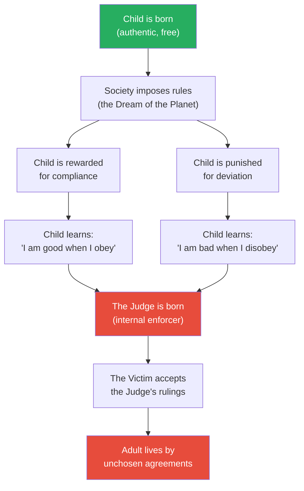
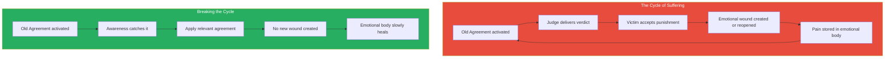
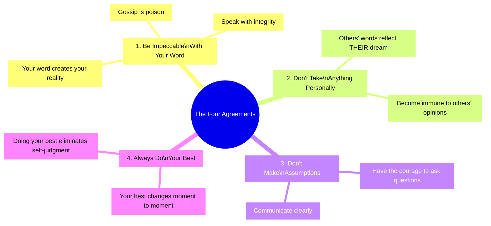
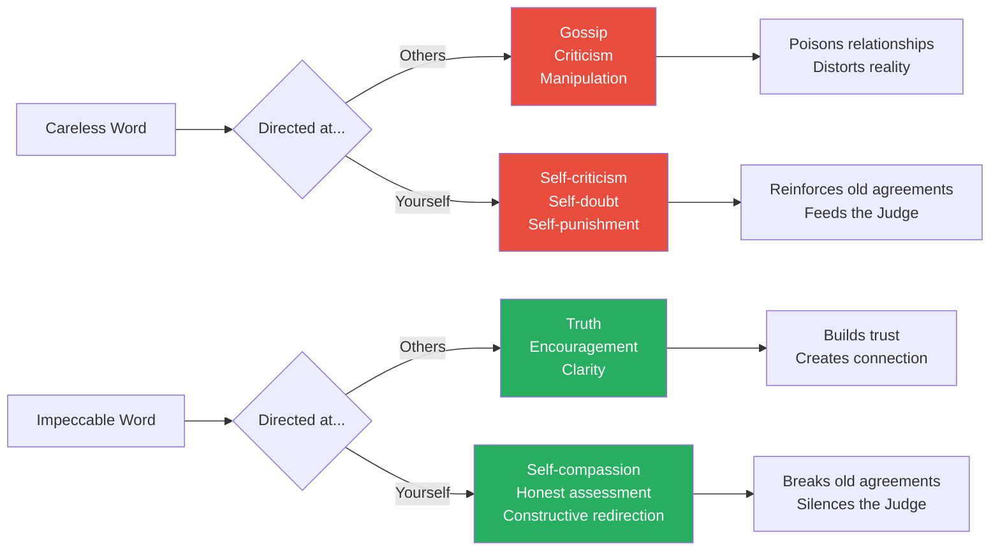
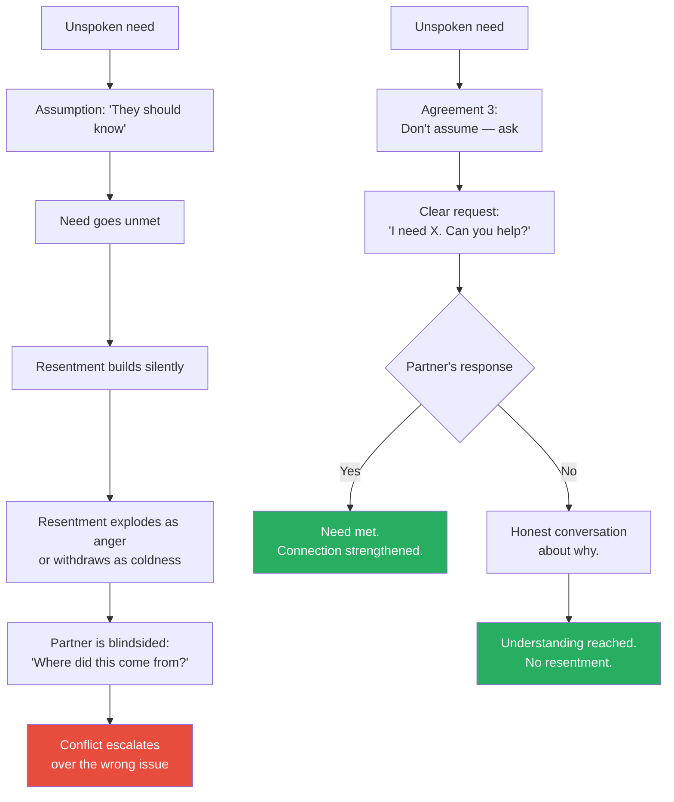
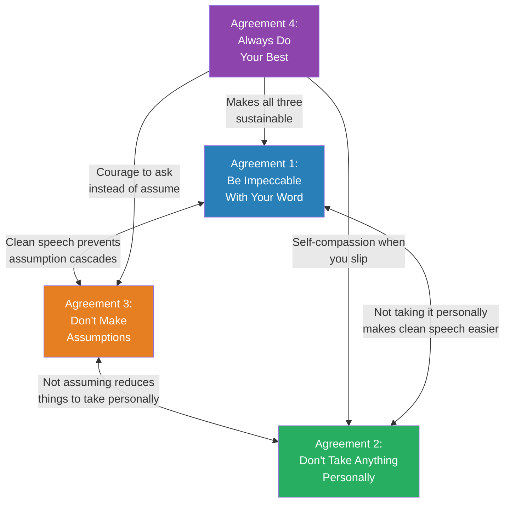
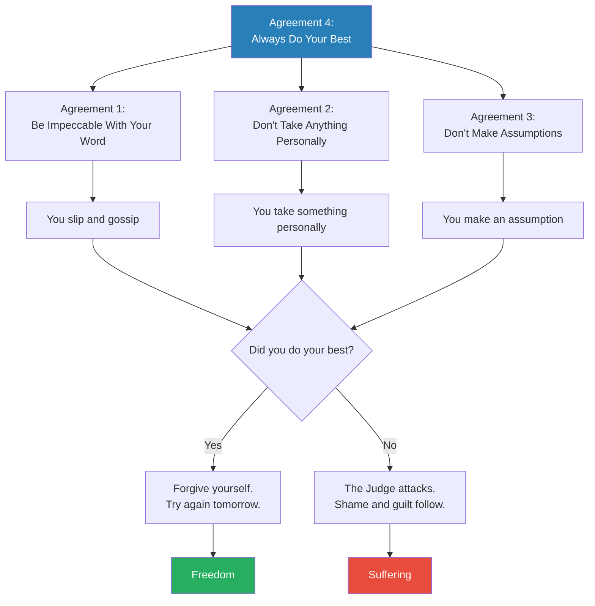

# The Four Agreements — Don Miguel Ruiz

> Don Miguel Ruiz distils Toltec wisdom into four deceptively simple rules that, if practised consistently, eliminate the vast majority of unnecessary suffering from your life.
> The agreements are: Be impeccable with your word. Don't take anything personally. Don't make assumptions. Always do your best.
> They sound like refrigerator magnets. They are not. Each one, when genuinely understood and practised, dismantles a deeply ingrained pattern of self-inflicted pain that most people carry from childhood to the grave without ever questioning.
> The book is short, spiritual, and repetitive — and it has sold over 10 million copies because the ideas, once absorbed, are impossible to forget.

---

## About the Author

Don Miguel Ruiz is a Mexican author and teacher of Toltec spirituality.
He was born into a family of healers in rural Mexico — his mother was a curandera (healer) and his grandfather was a nagual (shaman).
Ruiz trained as a surgeon and practised medicine for years before a near-fatal car accident in the early 1970s changed the course of his life.
During his recovery, he began studying his family's ancestral Toltec traditions — a pre-Columbian knowledge system he describes not as a religion but as a way of life centred on personal freedom.
He spent years apprenticing with his mother and completing spiritual exercises in the Mexican desert before he began teaching.
His writing career began late — *The Four Agreements* was published when he was 52 — but the book became a slow-burn phenomenon, spending over a decade on the New York Times bestseller list and selling more than 12 million copies worldwide.
Oprah Winfrey championed it publicly, which accelerated its reach into mainstream culture.

> [!tip] Why This Book Endures
> Most self-help books are read once and forgotten. *The Four Agreements* is the kind of book people buy five copies of — one for themselves and four to give away. Its power lies not in novelty but in compression: four rules that address the root causes of most human suffering. The ideas are ancient. The packaging is unforgettable.

---

## The 30-Second Version

If you have 30 seconds, here is the entire book:

1. **Be impeccable with your word** — Speak with integrity. Don't use words against yourself or others. Don't gossip.
2. **Don't take anything personally** — Nothing others do is because of you. Their actions reflect their own dream, not yours.
3. **Don't make assumptions** — Ask questions. Communicate clearly. Don't invent stories about what others think or feel.
4. **Always do your best** — Your best changes day to day. Do it anyway. This eliminates regret and self-judgment.

That's it. The rest of the book explains why these four rules are so hard to follow and what happens inside you when you finally do.

---

## Key Concepts at a Glance

| Concept | Definition | Why It Matters |
|---------|-----------|----------------|
| **The Dream of the Planet** | The collective belief system society imposes on every child | It is the invisible operating system running your life |
| **Domestication** | The process by which children are trained to conform to society's dream | You were punished into compliance before you could choose |
| **Agreements** | The beliefs you accepted as truth during domestication | They become the rules you live by — mostly unconsciously |
| **The Parasite / The Judge** | The inner voice that enforces your old agreements through self-criticism | It is the voice that says "you're not good enough" |
| **The Victim** | The part of you that believes the Judge and accepts punishment | Together, the Judge and Victim create a cycle of suffering |
| **Personal Importance** | Taking everything personally — the belief that the world revolves around you | It is the root of nearly all interpersonal pain |
| **Mitote** | The thousand voices in your head, all talking at once | The mental fog that keeps you from seeing clearly |
| **The Toltec Path** | The practice of awareness, transformation, and freedom from old agreements | The process of waking up from the collective dream |

---

## The Big Idea

- As children, we made thousands of <b style="color: #2980b9">agreements</b> with ourselves and the world — beliefs we absorbed from parents, teachers, religion, and culture
- Most of these agreements are not chosen — they are imposed. "You're not smart enough." "Men don't cry." "You have to work hard to deserve love."
- These agreements become the architecture of our inner world — <b style="color: #e74c3c">they run on autopilot and create most of our suffering</b>
- The path to freedom is to break the old agreements and replace them with four new ones
- Ruiz's framework is not about adding new beliefs — it is about <b style="color: #27ae60">subtracting the false ones you've been carrying since childhood</b>

> [!warning] The Uncomfortable Truth
> You did not choose most of the beliefs that govern your life. They were installed in you before you were old enough to question them. Every time you feel "not good enough," that is not your voice — it is an agreement you made with someone else's opinion decades ago.

---

## Chapter 1: Domestication and the Dream of the Planet

This opening chapter is the philosophical foundation for everything that follows. Ruiz argues that before you can adopt the four agreements, you need to understand why you need them — and that requires seeing the invisible prison most people live in without realising it.

### The Dream of the Planet

Ruiz uses the metaphor of a "dream" to describe the collective belief system of human society. Every culture, family, religion, and school has a dream — a set of rules about how to behave, what to value, what is acceptable, and what is not. This dream existed before you were born. You were born into it and had no say in its construction.

- The dream includes rules about everything: what is beautiful, what is successful, what is masculine, what is feminine, what is sinful, what is honourable
- <b style="color: #2980b9">The dream is not reality — it is a shared hallucination that humans collectively maintain and enforce</b>
- Different cultures have different dreams, which is why behaviour that is noble in one culture is shameful in another

> [!example] The Dream in Action
> In one culture, a woman who speaks her mind is "strong." In another, she is "disrespectful." Neither judgment is about the woman. Both are about the dream of the culture she is in. The dream defines what is "normal" — and anything outside the dream is punished.

### Domestication

Children are not born with the dream — they are trained into it through a process Ruiz calls "domestication." This is not a metaphor. It is the same process used to train animals: reward desired behaviour, punish undesired behaviour, repeat until the subject complies automatically.

- Parents say "good boy" when you behave as they want and withdraw love when you don't
- Teachers reward compliance and punish individuality
- Religion offers heaven for obedience and hell for disobedience
- <b style="color: #e74c3c">The punishment doesn't have to be physical — the withdrawal of approval is enough to reshape a child's entire personality</b>

The critical insight: at some point during childhood, you no longer needed external punishment. You internalised the rules and began punishing yourself. The Judge was born.

### The Judge and the Victim

Once domestication is complete, two internal characters run your psychological life:

**The Judge** is the voice that constantly evaluates you — and finds you lacking. It says: "You should have done better." "You're too fat." "You're not as smart as your sister." "People are judging you." The Judge enforces every agreement you ever made, especially the ones that cause pain.

**The Victim** is the part of you that receives the Judge's verdict and believes it. The Victim feels guilty, ashamed, and unworthy. It accepts punishment as deserved.

> [!danger] The Cycle of Self-Abuse
> Most people punish themselves far more harshly than anyone else ever would. You might make one mistake at work and replay it in your mind for weeks, beating yourself up over and over. No court of law would sentence someone to be punished a thousand times for the same crime — but the Judge does this every day.

> [!success] The Way Out
> The four agreements are designed to replace the Judge's rulebook. Each agreement dismantles a different mechanism of self-punishment. Together, they create a new internal operating system — one you actually chose.

| Without Awareness | With Awareness |
|-------------------|----------------|
| You believe the Judge's voice is "just being realistic" | You recognise the Judge as an inherited program |
| You feel guilty for not meeting standards you never chose | You question whose standards you are living by |
| You punish yourself repeatedly for the same mistakes | You forgive yourself and redirect your energy |
| You assume your beliefs about yourself are facts | You see beliefs as agreements that can be renegotiated |

### The Mitote

Ruiz introduces the concept of the "mitote" — a Toltec word for the chaotic marketplace of a thousand voices in your head. The mitote is what happens when all your conflicting agreements try to operate simultaneously.

- One voice says "take the risk," another says "play it safe"
- One agreement says "you deserve love," another says "you have to earn it"
- <b style="color: #2980b9">The mitote is not thinking — it is noise. It is the sound of a mind at war with itself.</b>

The four agreements cut through the mitote by replacing thousands of conflicting rules with four clear ones.

### The Book of Law

Ruiz introduces one more concept before presenting the agreements: the "Book of Law" — his metaphor for the complete set of agreements that governs your life. Every person carries an internal Book of Law that dictates what they believe about themselves, about others, and about the world.

- The Book of Law was written during domestication — mostly by other people
- It contains rules you never chose: "I must be thin to be loved," "I must earn more than my peers to be worthy," "I must never show weakness"
- <b style="color: #e74c3c">The Book of Law is enforced by the Judge and obeyed by the Victim — and most people never realise it exists</b>
- The four agreements are a new Book of Law — one you write yourself, consciously, with full awareness of what you are choosing

> [!danger] Your Book of Law
> Consider the rules you live by. Where did they come from? When someone says "I have to work 60 hours a week or I'm not a real professional," that is an agreement from their Book of Law. When someone says "If I express anger, people will abandon me," that is another agreement. These rules feel like facts. They are not. They are sentences in a book that was written by someone else before you were old enough to hold a pen.

> [!success] Rewriting the Book
> The four agreements are not additions to your existing Book of Law — they are replacements. They do not ask you to add new rules to an already overwhelming system. They ask you to throw out the old book and start with four pages. Everything else is negotiable.

### The Emotional Body

Ruiz also discusses the "emotional body" — the accumulated weight of unexpressed emotions, old wounds, and suppressed pain that most people carry. The emotional body is dense with stored suffering: every time you were shamed as a child, every time you swallowed your anger to keep the peace, every time you pretended to be fine when you were not.

- The four agreements gradually dissolve the emotional body by stopping the cycle of new wounds
- When you stop taking things personally, you stop adding new injuries to the pile
- When you stop making assumptions, you stop generating false conflicts
- When you are impeccable with your word, you stop poisoning yourself with self-criticism
- <b style="color: #27ae60">Over time, the old wounds begin to heal — not because you process them one by one, but because you stop reopening them</b>

---

## The Four Agreements — Detailed Deep Dive

---

## Chapter 2: Agreement 1 — Be Impeccable With Your Word

Ruiz calls this the most important agreement — and the most difficult. If you could master only one, he says, this is the one to choose.

### Why the Word Matters

The word is not just communication — it is creation. Every belief you hold began as a word someone spoke to you. "You're smart." "You're lazy." "You'll never amount to anything." Those words became agreements, and those agreements became your reality.

- <b style="color: #2980b9">"Impeccable" comes from the Latin "sin peccatus" — without sin</b>
- To be impeccable with your word means to use it only in the direction of truth and love
- This applies to what you say to others AND what you say to yourself
- <b style="color: #e74c3c">The most damaging misuse of the word is not lying to others — it is the constant stream of self-criticism most people direct at themselves</b>

> [!example] The Power of a Single Word
> Ruiz tells the story of a mother who came home after a terrible day at work. Her young daughter was singing happily — just singing for the joy of it. The mother, overwhelmed and irritable, snapped: "Shut up! You have an ugly voice." The girl never sang again — not as a teenager, not as an adult. One sentence, spoken in a moment of frustration, created an agreement that lasted decades. The daughter didn't decide her voice was ugly through careful analysis. She absorbed it as fact because the word came from someone she trusted.

### The Spell of Black Magic

Ruiz uses the provocative term "black magic" to describe what happens when words are used to manipulate, hurt, or control. He doesn't mean literal sorcery — he means the power of words to cast spells on people's minds.

- A teacher who tells a child "you're not good at maths" casts a spell that may last a lifetime
- A partner who says "nobody else would want you" uses words to create a prison
- <b style="color: #27ae60">The antidote is white magic — using your word to build, heal, and liberate</b>

### Gossip: The Worst Poison

Ruiz devotes significant attention to gossip, calling it the most common and destructive misuse of the word.

- Gossip is emotional poison transmitted through language
- When you gossip about someone, you are feeding others a distorted version of reality — your interpretation, your judgment, your dream
- <b style="color: #e74c3c">The person who receives gossip absorbs it as information, and it changes how they see the person being discussed — without that person ever being present to defend themselves</b>
- Gossip is how the Dream of the Planet enforces its rules: through social pressure, reputation destruction, and tribal exclusion

> [!warning] The Gossip Test
> Before you speak about someone who is not present, ask three questions: Is it true? Is it necessary? Is it kind? If it fails any of these tests, you are not being impeccable with your word. Ruiz would say you are casting black magic — using your creative power to harm rather than heal.

### Being Impeccable With Yourself

The most overlooked part of this agreement is the inner dimension. Most people would never say to a friend what they routinely say to themselves.

| What You Say to Yourself | What It Actually Is |
|--------------------------|-------------------|
| "I'm so stupid" | A spell you're casting on your own mind |
| "I always mess things up" | An agreement you're reinforcing with repetition |
| "I don't deserve this" | The Judge's verdict, accepted by the Victim |
| "Nobody likes me" | A gossip campaign against yourself |

> [!tip] Practising Agreement 1
> Start by monitoring your self-talk for one day. Every time you catch yourself using your word against yourself — "I'm an idiot," "I can't believe I did that," "I'm so fat" — pause and ask: would I say this to someone I love? If not, you are not being impeccable with your word. Replace the judgment with something true and constructive.

---

## Chapter 3: Agreement 2 — Don't Take Anything Personally

This agreement sounds simple. It is revolutionary. If you could truly stop taking things personally, you would become virtually immune to the emotional damage that other people's words and actions can inflict.

### The Core Insight

Nothing others do is because of you. What others say and do is a projection of their own dream — their own beliefs, wounds, fears, and desires. When someone insults you, they are not describing you. They are describing their own internal world and projecting it onto you.

- <b style="color: #2980b9">If someone says "you're stupid," that statement tells you nothing about your intelligence — it tells you everything about their emotional state</b>
- This applies equally to praise: when someone says "you're amazing," that is also their projection, not objective truth
- <b style="color: #e74c3c">Taking things personally is an act of supreme selfishness — it assumes that everything is about you</b>

> [!example] The Stranger's Anger
> Imagine you're walking down the street and a stranger screams an insult at you. You feel hurt. But then you learn the stranger is mentally ill and screams at everyone. Suddenly the hurt vanishes. Nothing changed about the words — what changed is that you stopped taking them personally. Ruiz's point: the stranger's mental state is always the explanation for their words, whether they are mentally ill or not. Everyone is living in their own dream.

### Why We Take Things Personally

The root cause is what Ruiz calls "personal importance" — the belief that the world revolves around you. Personal importance is the maximum expression of selfishness, because it assumes that everything people say and do is a personal statement about you.

- Your boss is short with you → "She doesn't like me" (rather than: she had a bad morning)
- A friend cancels plans → "He doesn't value our friendship" (rather than: something came up)
- Your partner is quiet → "She's angry at me" (rather than: she's processing something unrelated)
- <b style="color: #27ae60">In each case, you've made yourself the centre of someone else's universe — which is both inaccurate and exhausting</b>

### The Immunity

When you stop taking things personally, you gain a kind of emotional immunity. Other people's opinions, judgments, and actions pass through you like wind through an open window. They cannot hook you because you are no longer offering a hook.

> [!success] What Emotional Immunity Looks Like
> - Someone criticises your work → You evaluate whether the feedback is useful, without feeling attacked
> - Someone praises you lavishly → You appreciate the kindness without needing it to feel good about yourself
> - Someone is angry at you → You can respond calmly because you know their anger is about their inner world, not yours
> - Someone ignores you → You don't create a story about why, because you know it's not about you

> [!danger] What Taking It Personally Looks Like
> - Someone criticises your work → You feel devastated, replay the conversation 50 times, and doubt your competence
> - Someone praises you → You feel elated, then anxious about maintaining their approval
> - Someone is angry → You become defensive, counterattack, or collapse into guilt
> - Someone ignores you → You spiral into insecurity: "What did I do wrong? Do they hate me?"

| With Personal Importance | Without Personal Importance |
|--------------------------|---------------------------|
| Other people's moods control your emotions | Your emotional state is internally generated |
| You need approval to feel safe | You approve of yourself regardless |
| Criticism is an attack to be defended against | Criticism is data to be evaluated |
| Praise is a drug you need more of | Praise is a gift you can appreciate without attachment |
| You constantly read between the lines | You take people at face value and ask when unclear |

### The Connection to Agreement 1

Agreements 1 and 2 work together. If you are impeccable with your word (Agreement 1), you will not use your word to take things personally — you won't gossip about the person who offended you, you won't tell yourself a victim story, you won't use your inner dialogue to amplify the perceived slight. And if you don't take things personally (Agreement 2), it becomes much easier to be impeccable with your word, because you are no longer reacting from a place of hurt.

### Agreement 2 at Work

The workplace is where most people violate this agreement most frequently. A boss's curt tone, a peer's criticism in a meeting, being passed over for a project, an email that reads as dismissive — every one of these triggers the same pattern: you take it personally, create a story about what it means, and suffer.

> [!example] The Performance Review
> You receive a performance review with three positives and one area for improvement. You fixate on the one criticism. You replay it for days. You tell yourself the reviewer doesn't like you, doesn't see your value, or is out to get you. In reality, the reviewer spent five minutes writing the feedback and hasn't thought about it since. The story you've constructed — days of suffering — exists only in your mind. Agreement 2 dissolves it in an instant: the feedback is about the reviewer's perception, filtered through their own dream. Evaluate it for useful information. Discard the rest.

> [!tip] The 24-Hour Rule for Emotional Reactions
> When something at work triggers a strong emotional reaction — an email that makes you angry, a comment in a meeting that stings — apply the 24-hour rule. Wait 24 hours before responding. During those 24 hours, notice how many stories your mind invents. Notice how many of those stories are assumptions disguised as facts. After 24 hours, most of the emotional charge will have dissipated, and you can respond from clarity rather than reactivity.

### The Scale of Personal Importance

Ruiz's concept of "personal importance" exists on a spectrum. The more important you believe you are — the more you believe everything is about you — the more you suffer.

| Level | Personal Importance | Example | Suffering Level |
|-------|-------------------|---------|----------------|
| **5 — Narcissistic** | Everything is about me | "She didn't smile at me — she must be plotting against me" | Extreme |
| **4 — High** | Most things are about me | "They didn't invite me to the meeting — I'm being excluded" | High |
| **3 — Normal** | Some things are about me | "His criticism was harsh — maybe he has a point, but it stings" | Moderate |
| **2 — Aware** | Few things are about me | "She's in a bad mood — probably nothing to do with me" | Low |
| **1 — Free** | Almost nothing is about me | "He yelled at me. That's his internal weather. What's useful here?" | Minimal |

---

## Chapter 4: Agreement 3 — Don't Make Assumptions

This agreement addresses the source of most relationship conflicts: the stories we invent about what other people think, feel, and intend — and then treat as facts.

### The Assumption Machine

The human mind hates uncertainty. When it encounters a gap in information, it fills the gap with a story — and then forgets that the story is fiction. This happens constantly, automatically, and below the level of awareness.

- Your partner doesn't text back for three hours → Your mind generates a story: "They're ignoring me" / "They're with someone else" / "They don't care"
- Your boss schedules an unexpected meeting → Your mind generates a story: "I'm in trouble" / "I'm being fired" / "They found out about my mistake"
- <b style="color: #2980b9">The assumption feels like knowledge, but it is imagination — and you react to the imagination as if it were real</b>

> [!example] The Silent Treatment Spiral
> A husband comes home quiet after a long day. His wife assumes he's angry at her. She becomes cold and withdrawn to protect herself. He notices her distance and assumes she's upset about something he did. He becomes defensive. She interprets his defensiveness as confirmation that he was angry all along. By the end of the evening, they're in a full argument — and neither one has actually said what they're thinking. The entire conflict was constructed from assumptions.

### The Courage to Ask

Ruiz says the cure for assumptions is devastatingly simple: ask questions. Communicate what you actually want. Say what you actually mean.

- Instead of assuming your boss is unhappy with your work, ask: "How do you feel about my progress on this project?"
- Instead of assuming your partner knows what you need, say: "I need X. Can you help me with that?"
- <b style="color: #27ae60">This requires courage because asking reveals vulnerability — and the Dream of the Planet teaches us that vulnerability is weakness</b>

> [!tip] The Assumption Audit
> When you notice yourself feeling hurt, anxious, or angry about something someone else did (or didn't do), ask yourself: "Am I responding to something that actually happened, or to a story I invented about what happened?" If the answer is a story, you have two choices: ask the person directly, or let the story go.

### Assumptions About Yourself

The most dangerous assumptions are the ones you make about yourself:
- "I can't do that"
- "I'm not the kind of person who..."
- "I'll never be good at..."

These are not observations — they are agreements masquerading as facts. And because you never question them, they function as invisible ceilings on your life.

### Assumptions About Relationships

Ruiz argues that one of the most destructive assumptions people make is: "If you love me, you should know what I want without me having to say it." This assumption has probably ended more relationships than infidelity. It places an impossible burden on the other person — telepathy — and creates resentment when they inevitably fail.

| The Assumption | The Reality | The Agreement 3 Response |
|----------------|-------------|------------------------|
| "They should know what I need" | Nobody is a mind reader | State your needs clearly |
| "They're ignoring me on purpose" | They may not have noticed | Ask: "Hey, is everything okay?" |
| "They're angry at me" | They might be tired, stressed, or distracted | Ask: "You seem quiet — is something on your mind?" |
| "This will never work out" | You're predicting a future that hasn't happened | Stay present. Evaluate evidence, not stories. |

### The Assumption Cascade

Assumptions rarely come alone. They cascade — one assumption triggers another, which triggers another, until you've constructed an entire narrative from nothing.

> [!example] The Promotion Assumption Cascade
> 1. Your manager schedules a meeting with HR → You assume: "I'm in trouble"
> 2. Based on that assumption → You assume: "It must be about the project deadline I missed"
> 3. Based on that → You assume: "They're going to put me on a performance plan"
> 4. Based on that → You assume: "I'll probably get fired within six months"
> 5. Based on that → You start rehearsing what you'll tell your spouse
>
> The meeting turns out to be about a promotion. But you spent 48 hours living in a fictional nightmare. The assumption cascade is your mind's most efficient suffering generator — it can take a single ambiguous data point and construct an entire tragedy in minutes.

### Agreement 3 and Communication Styles

Different communication styles create different assumption traps:

| Communication Style | The Assumption Trap | The Agreement 3 Response |
|--------------------|-------------------|------------------------|
| **Direct communicators** | "They're being rude" | Recognise that directness is a style, not an attack |
| **Indirect communicators** | "They're hiding something" | Ask for clarification rather than interpreting silence |
| **Conflict-avoidant people** | "Everything is fine" (when it isn't) | Gently create safe space for honest conversation |
| **Expressive communicators** | "They're overreacting" | Recognise that emotional expression is their processing style |

> [!warning] Cultural Assumption Traps
> Cross-cultural communication is an assumption minefield. A colleague from a high-context culture (Japan, China, Korea) may say "that's an interesting idea" and mean "I disagree completely." A colleague from a low-context culture (Germany, Netherlands, Israel) may say "this is wrong" and mean nothing personal — just factual correction. Without Agreement 3, you'll map your own cultural assumptions onto their words and create phantom conflicts.

### Agreement 3 in Intimate Relationships

The most devastating assumptions are the ones we make about the people closest to us. Ruiz is particularly forceful on this point: the assumption "if you love me, you should know what I need" has destroyed more relationships than any external threat.

- <b style="color: #e74c3c">Love does not grant telepathy. Loving someone does not give you the ability to read their mind, and expecting them to read yours is setting a trap they cannot avoid.</b>
- The antidote is radical clarity: state your needs, ask about theirs, and never punish someone for failing to guess what you never communicated
- This requires vulnerability — and vulnerability is what the Dream of the Planet trained you to avoid

---

## Chapter 5: Agreement 4 — Always Do Your Best

The fourth agreement is the engine that makes the other three sustainable. Without it, the first three agreements become sources of self-punishment rather than liberation.

### The Variable Best

The key insight of this agreement is that your best is not a fixed standard — it changes from moment to moment. Your best when you're well-rested is different from your best when you're sick. Your best on a good day is different from your best during a crisis.

- <b style="color: #2980b9">The instruction is not "always be perfect" — it is "always give what you have to give in this moment"</b>
- If you did your best and it wasn't enough, there is nothing to regret
- If you did less than your best, the Judge will punish you — not because you failed, but because you know you held back

> [!warning] The Trap of Under-Doing and Over-Doing
> Doing less than your best creates guilt and regret. But doing MORE than your best — pushing past your limits, ignoring your body's signals, working yourself to exhaustion — is equally destructive. It depletes you and creates a different kind of suffering. The fourth agreement is about calibration: doing exactly what you are capable of in this moment, no more and no less.

### Why This Agreement Matters for the Other Three

- You will not be impeccable with your word every time. You will gossip. You will criticise yourself. But if you were doing your best, you can forgive yourself and try again tomorrow.
- You will take things personally sometimes. The old habits are deep. But if you were doing your best to practise detachment, you can release the slip without self-punishment.
- You will make assumptions. The habit is automatic. But if you were doing your best to catch them and ask instead, you can acknowledge the lapse without spiralling into shame.

> [!success] The Freedom of "Good Enough"
> The fourth agreement is permission to be human. It eliminates the impossible standard of perfection and replaces it with something achievable: genuine effort. When you always do your best, the Judge has nothing to say — because the Judge's power comes from the gap between what you did and what you "should" have done. Close that gap, and the Judge falls silent.

### Action as the Antidote

Ruiz emphasises that the agreements are not beliefs to be held — they are practices to be lived. You don't "believe in" being impeccable with your word. You do it. You practise it. You fail and you practise again.

- <b style="color: #27ae60">The fourth agreement transforms the other three from ideals into a daily practice — imperfect, messy, human, and ongoing</b>
- It is the bridge between understanding the agreements (which takes an hour) and living them (which takes a lifetime)

### Agreement 4 at Different Life Stages

Your best at 25 is different from your best at 45 or 65. Your best as a new parent running on three hours of sleep is different from your best as a rested person with no dependents. The fourth agreement has a built-in compassion mechanism: it adjusts to your circumstances.

| Situation | What "Your Best" Looks Like | What Perfectionism Would Demand |
|-----------|---------------------------|-------------------------------|
| First week at a new job | Showing up prepared, asking good questions, learning names | Already performing like a ten-year veteran |
| Recovering from illness | Getting through the day, doing essential tasks | Full output as if nothing happened |
| Going through a divorce | Managing your emotions, showing up for your children | Maintaining peak professional performance |
| Learning a new skill | Making mistakes, improving slowly, staying curious | Being good at it immediately |
| Grieving a loss | Getting out of bed, eating, being gentle with yourself | "Moving on" on someone else's timeline |

> [!example] The Surgeon's Variable Best
> A surgeon who performs three operations in a day will not perform the third with the same freshness as the first. But if she brings her full attention, her accumulated skill, and her genuine care to each operation — she is doing her best. The fourth agreement does not demand that your third operation be as sharp as your first. It demands that you give everything you have left, honestly and without holding back.

### The Anti-Burnout Agreement

There is a subtle and important point hidden in Agreement 4 that most readers miss: <b style="color: #e74c3c">doing your best also means not doing MORE than your best.</b> Over-giving, over-working, and over-performing are not signs of virtue — they are violations of this agreement. If you push past your genuine capacity day after day, you are not "doing your best" — you are abusing yourself in the name of productivity.

> [!warning] The Over-Achiever's Trap
> Many high-performing people read "always do your best" and hear "always give 110%." That is NOT what Ruiz means. He means: give what you genuinely have to give, calibrated to this moment. Some days that is 100%. Some days it is 40%. The agreement is with reality, not with the Judge's impossible standards.

### How the Four Agreements Work as a System

The four agreements are not independent rules — they are an interconnected system where each one supports and reinforces the others.

**The reinforcement loops:**
- If you don't make assumptions (A3), you have less to take personally (A2)
- If you don't take things personally (A2), your speech becomes cleaner (A1)
- If your speech is clean (A1), you create fewer situations that trigger assumptions (A3)
- If you always do your best (A4), you can forgive yourself when you violate any of the other three

> [!tip] Start with Agreement 2
> If you're overwhelmed and don't know where to begin, Ruiz suggests starting with Agreement 2 — don't take anything personally. It is the quickest to produce results because it immediately reduces the number of situations that cause you suffering. Once you stop taking things personally, the other three agreements become much easier to practise.

---

| Agreement | What It Cures | The Suffering It Eliminates |
|-----------|--------------|---------------------------|
| **Be impeccable with your word** | Gossip, self-criticism, careless speech | Self-inflicted emotional wounds |
| **Don't take anything personally** | Sensitivity to others' opinions | Needless offence, hurt feelings, people-pleasing |
| **Don't make assumptions** | Misunderstanding, projection, silent resentment | Relationship conflict from unspoken expectations |
| **Always do your best** | Perfectionism, regret, self-judgment | The inner critic that says "you should have done more" |

---

## Common Objections and Ruiz's Responses

### "Don't take anything personally? What about legitimate criticism?"

This is the most common objection. Ruiz is not saying to ignore feedback or refuse to learn from others. He is saying: <b style="color: #2980b9">evaluate the content of criticism without absorbing the emotional charge.</b> If your boss says your report has errors, the useful information is "check the report for errors." The useless addition — "and this means I'm incompetent" — is you taking it personally. Separate the data from the drama.

### "Don't make assumptions? But we HAVE to assume things to function."

Ruiz acknowledges that practical assumptions are necessary — you assume the floor will hold you when you step on it, you assume traffic lights mean what they're supposed to mean. The agreement targets interpersonal assumptions: the stories you invent about what other people think, feel, and intend. Those assumptions are almost always wrong and almost always cause suffering.

### "Always do your best? That sounds like toxic productivity."

Only if you misread it. Ruiz explicitly says your best changes from moment to moment. On a day when you're ill, your best might be getting out of bed. The agreement is not about productivity — it is about self-compassion. It says: whatever you genuinely gave today is enough. Stop punishing yourself for not giving more.

### "This is too simple. Real life is more complicated."

Ruiz would agree. Real life IS complicated. That is precisely why you need simple rules. Complex systems — a human life, a relationship, a career — are not navigated with complex rules. They are navigated with clear principles applied consistently. The four agreements are simple to understand. They are endlessly complex to practise.

---

## The Four Agreements at Work: A Practical Guide

### In Meetings

| Situation | Old Pattern | Agreement Response |
|-----------|-------------|-------------------|
| Someone dismisses your idea | Take it personally, shut down | A2: Their reaction reflects their perspective, not your idea's value |
| You don't understand something | Assume you should know, stay silent | A3: Ask. "Can you explain that? I want to make sure I understand." |
| A colleague gossips about the boss | Join in to bond | A1: Change the subject or excuse yourself |
| You made a mistake in your presentation | Beat yourself up for days | A4: You did your best with what you knew. Learn and move on. |

### In Difficult Conversations

> [!tip] The Agreement 3 Script for Difficult Conversations
> When you need to address a problem with someone, use this structure:
> 1. **State what you observed** (not what you assumed): "I noticed you didn't include me in the last two project emails."
> 2. **State how it affected you** (without blame): "I felt out of the loop and wasn't sure what was happening."
> 3. **Ask, don't assume**: "Was that intentional, or did it just slip through the cracks?"
> 4. **Listen**: Their answer will almost always be different from the story you invented.

### In Email Communication

Email is an assumption factory. The absence of tone, facial expression, and body language means your mind fills in the gaps — and it usually fills them with the worst possible interpretation.

- A short email → "They're angry at me" (A3 violation: they might just be busy)
- No response for 24 hours → "They're ignoring me" (A2 violation: their inbox has 200 unread messages)
- CC'ing your boss → "They're trying to get me in trouble" (A3 violation: it might be standard procedure)

> [!warning] The Email Rule
> Never attribute to malice what can be explained by a full inbox. Before you react to an email emotionally, apply Agreement 3: is your reaction based on what the email actually says, or on a story you're telling yourself about what it means?

---

## Chapter 6: The Toltec Path to Freedom

The final chapters of the book move from the four agreements themselves to the process of actually breaking free from old agreements. Ruiz calls this "the Toltec path to freedom" and outlines three practices: awareness, transformation, and the intent to change.

### Step 1: Awareness — The Art of Seeing

Before you can break old agreements, you have to see them. Most people don't know they are living by unchosen rules. The first step is simply becoming aware of the agreements that run your life.

- Notice when the Judge speaks: "You should have done better." "You're not enough."
- Notice when you take something personally: feel the hook, feel the emotional reaction, and trace it back to the agreement underneath
- <b style="color: #2980b9">Notice when you make assumptions: catch the moment when your mind invents a story and presents it as fact</b>

> [!tip] The Awareness Practice
> For one week, carry a small notebook (or use your phone). Every time you catch yourself in a moment of suffering — irritation, shame, anxiety, anger — write down what agreement is being violated. "I feel hurt because I assumed she was criticising me." "I feel ashamed because my inner Judge says I should be further along by now." You will start to see patterns — the same few agreements triggering most of your pain.

### Step 2: Transformation — The Art of Dying

Ruiz uses dramatic language for this step. He calls it "the art of dying" — not physical death, but the death of the old self. Every old agreement you break is a small death. The person who believed "I'm not smart enough" has to die so that a new person — one who is free from that belief — can be born.

- This process is uncomfortable because identity is built on agreements
- When you stop believing "I'm the kind of person who can't speak up in meetings," you lose a piece of your identity — even if it was a piece that caused suffering
- <b style="color: #e74c3c">People resist freedom because the familiar prison feels safer than the unknown</b>

> [!warning] Why Change Is Hard
> The Dream of the Planet has an immune system. When you start breaking agreements, the people around you will resist. They will say "you've changed" — and they won't mean it as a compliment. Your freedom threatens their dream, because it implies that the rules they follow are optional. Expect pushback. It is a sign that you are on the right path.

### Step 3: Intent — The Art of Creating

The final step is not passive — it is the active choice to create new agreements. You replace "I'm not good enough" with "I am doing my best and that is enough." You replace "I need others to approve of me" with "I approve of myself." You replace "I must be perfect" with "I must be honest."

- Intent is not willpower — it is the sustained direction of your attention toward the life you want
- <b style="color: #27ae60">Every time you practise one of the four agreements, you weaken an old agreement and strengthen a new one</b>
- Over time, the new agreements become automatic — just as the old ones once were

```mermaid
flowchart LR
    subgraph OLD ["Old Operating System"]
        A1["Unchosen agreements"]
        A2["The Judge enforces them"]
        A3["The Victim obeys"]
        A4["Suffering on autopilot"]
    end
    subgraph PATH ["The Toltec Path"]
        B1["1. Awareness\n(see the agreements)"]
        B2["2. Transformation\n(let old self die)"]
        B3["3. Intent\n(create new agreements)"]
    end
    subgraph NEW ["New Operating System"]
        C1["Four chosen agreements"]
        C2["The Judge is silenced"]
        C3["Freedom replaces suffering"]
    end
    OLD --> B1
    B1 --> B2
    B2 --> B3
    B3 --> NEW
    style OLD fill:#e74c3c,color:#fff
    style NEW fill:#27ae60,color:#fff
    style PATH fill:#2980b9,color:#fff
```

---

## Chapter 7: The New Dream

The book's final chapter describes what life looks like when you have broken the old agreements and replaced them with the four new ones. Ruiz calls this "the new dream" — a life of personal freedom where your happiness is internally generated rather than dependent on external validation.

### What Freedom Looks Like

| Life Under Old Agreements | Life Under the Four Agreements |
|---------------------------|-------------------------------|
| You need others to approve of you to feel safe | You approve of yourself regardless of what others think |
| You constantly monitor what people think about you | Other people's opinions pass through you without sticking |
| Conflict sends you into anxiety or defensiveness | Conflict is an opportunity to practise clarity and courage |
| Your mood depends on what happened to you today | Your mood depends on how you choose to respond |
| You carry old wounds from things people said years ago | Old wounds have been released because you stopped feeding them |
| You gossip about others and criticise yourself | You speak with integrity — to others and to yourself |
| You spend energy on resentment, worry, and regret | That energy is redirected toward creation, connection, and joy |

> [!success] The Promise of the Book
> Ruiz does not promise that life will become easy. He promises that it will become clear. The four agreements do not eliminate difficulty — they eliminate unnecessary suffering. The distinction is critical. Pain is inevitable. Suffering is optional. Suffering is what happens when you take pain personally, make assumptions about it, use your word to amplify it, and then fail to do your best in responding to it.

### The Practice Is the Point

The book ends where it begins: with the recognition that the four agreements are not beliefs to be adopted but practices to be lived. You will forget them. You will violate them. You will take things personally, make assumptions, gossip, and judge yourself. The question is not whether you will fail but whether you will return to the practice after failing.

> [!tip] The Daily Practice
> Each morning, remind yourself of the four agreements. Each evening, review your day:
> 1. Was I impeccable with my word today? Where did I slip?
> 2. Did I take anything personally? What hooked me?
> 3. Did I make assumptions? Where did I invent stories?
> 4. Did I do my best? Not perfectly — but genuinely?
> The goal is not perfection. The goal is awareness. And awareness, practised daily, is freedom.

### Forgiveness as Fuel

Ruiz devotes significant attention to forgiveness — not as a moral obligation but as a practical necessity. The emotional body is full of stored resentment, old wounds, and unexpressed pain. Forgiveness is the process of releasing that stored poison.

- Forgiveness is not saying "what you did was okay"
- <b style="color: #2980b9">Forgiveness is saying "I am no longer willing to carry the weight of what you did"</b>
- The first person you need to forgive is yourself — for all the times you violated your own integrity, for all the agreements you made that hurt you, for all the years you spent living someone else's dream

> [!example] The Weight of Unforgiveness
> Imagine carrying a heavy backpack everywhere you go. Each rock in the backpack is a resentment — something someone said ten years ago, a betrayal you never processed, an insult you're still replaying. The rocks don't hurt the people who put them there. They only hurt you. Forgiveness is not about the people who wronged you. It is about putting down the backpack.

### The Toltec Concept of "Personal Freedom"

For Ruiz, personal freedom means something specific: <b style="color: #27ae60">the freedom to be who you really are, without fear, without guilt, and without shame.</b> This is not freedom from external constraints (though it can lead to that). It is freedom from internal constraints — the agreements, beliefs, and self-judgments that imprison your authentic self.

- Most people are not free — they are prisoners of their own beliefs
- They do not choose how they feel — their emotions are triggered automatically by old agreements
- They do not choose what they think — their thoughts are generated by the mitote
- Personal freedom means reclaiming authorship of your inner life

| Prison | Freedom |
|--------|---------|
| You feel what old agreements tell you to feel | You choose your emotional response |
| You think what the mitote generates | You direct your attention deliberately |
| Your identity is built on other people's opinions | Your identity is built on self-knowledge |
| You live in a dream you didn't create | You create your own dream consciously |
| Happiness depends on external conditions | Happiness is generated internally |
| Love is conditional — earned through performance | Love is unconditional — given freely, starting with yourself |

---

## The Fifth Agreement

In 2010, Ruiz and his son Don Jose Ruiz published a sequel: *The Fifth Agreement*. The fifth agreement is: **Be sceptical, but learn to listen.**

- Be sceptical of every message you receive — including your own thoughts
- But don't dismiss everything — learn to listen for the truth behind the words
- <b style="color: #2980b9">The fifth agreement adds a meta-layer to the other four: it teaches you to question everything — including the four agreements themselves</b>
- It is the agreement that prevents dogma — because even good rules can become prisons if followed without awareness

> [!tip] Applying the Fifth Agreement
> The next time someone tells you something — a news story, a colleague's opinion, a self-help book's advice, your own inner voice — ask: "Is this actually true? Or is it just one perspective among many?" Don't accept it. Don't reject it. Listen to it. Evaluate it. Then decide.

---

## The Agreements Applied: Seven Common Life Scenarios

### Scenario 1: You Get Negative Feedback at Work

**Old pattern:** Feel crushed → assume you're about to be fired → go home and vent to your partner → replay the conversation for days → perform worse because you're anxious

**Four Agreements response:**
- A2: The feedback reflects your boss's standards and perspective, not your fundamental worth
- A3: Don't assume the worst — ask clarifying questions about what specifically needs to change
- A1: Don't poison yourself with self-talk like "I'm terrible at this"
- A4: Take the useful information and apply it. That's doing your best.

### Scenario 2: Your Partner Is Distant

**Old pattern:** Assume they're angry at you → become cold in response → they notice your coldness and withdraw further → you interpret their withdrawal as confirmation → three days of silent suffering

**Four Agreements response:**
- A3: Don't assume — ask: "You seem quiet. Is something going on?"
- A2: If they are upset, it may have nothing to do with you
- A1: Don't gossip about it to friends before you've talked to your partner
- A4: Give your partner the benefit of the doubt — that's doing your best in a relationship

### Scenario 3: A Friend Cancels Plans Again

**Old pattern:** Assume they don't value the friendship → feel hurt → start pulling away → they notice your distance and do the same → the friendship slowly dies from mutual assumptions

**Four Agreements response:**
- A3: Don't assume — they might be overwhelmed, ill, or overcommitted
- A2: Their scheduling isn't a statement about your worth
- A1: Be honest: "I've noticed we've cancelled a few times. I miss hanging out. Can we find a time that works?"
- A4: Express your feelings clearly — that's doing your best as a friend

### Scenario 4: You Make a Mistake in Front of Others

**Old pattern:** Shame spiral → assume everyone noticed → assume everyone is judging you → avoid those people for weeks → overcompensate with perfectionism

**Four Agreements response:**
- A2: Other people are thinking about their own lives, not about your mistake from two weeks ago
- A1: Don't repeat the story of the mistake to yourself 500 times — that's using your word against yourself
- A3: Don't assume people are judging you — most of them forgot before you finished your sentence
- A4: You did your best in that moment. Correct and move on.

### Scenario 5: Someone Gossips About You

**Old pattern:** Feel betrayed → gossip about THEM in retaliation → create a tribal conflict → spend enormous energy managing the fallout

**Four Agreements response:**
- A2: What they said reflects their inner world, not who you are
- A1: Don't retaliate with counter-gossip — that's using your word as a weapon
- A3: Don't assume you know why they did it or what their motivations were
- A4: Respond with dignity. If necessary, address it directly with the person. That's doing your best.

### Scenario 6: You're Stuck in a Job You Hate

**Old pattern:** Assume you can't leave → tell yourself stories about why change is impossible → use your word against yourself ("I'm trapped," "I have no options") → take your frustration personally when colleagues seem happier

**Four Agreements response:**
- A3: Don't assume you're trapped — investigate options with curiosity, not despair
- A1: Be honest with yourself about what you want. "I am choosing to stay for now because of X" is very different from "I'm trapped"
- A2: Other people's career satisfaction is not a commentary on yours
- A4: Do your best where you are while actively creating alternatives

### Scenario 7: You're Triggered by Social Media

**Old pattern:** See someone's highlight reel → assume their life is perfect → compare yourself unfavourably → feel inadequate → scroll more to numb the feeling

**Four Agreements response:**
- A3: Don't assume their curated posts represent their actual life
- A2: Their success is not a statement about your failure
- A1: Don't use your inner word to attack yourself: "Why can't I be like that?" is black magic aimed at yourself
- A4: Do your best with YOUR life. Close the app. Go do something real.

---

## The Four Agreements in Other Frameworks

Ruiz's ideas are not unique to Toltec tradition. The same principles appear across philosophy, psychology, and spiritual traditions — which is evidence of their universality.

| The Four Agreements | Stoic Equivalent | CBT Equivalent | Buddhist Equivalent |
|--------------------|-----------------|----------------|-------------------|
| Be impeccable with your word | "Speak only what is true and necessary" | Cognitive restructuring — changing self-talk | Right Speech |
| Don't take anything personally | "Others' opinions are not within your control" | De-personalisation — separating self from events | Non-attachment |
| Don't make assumptions | "Test your impressions before reacting" | Cognitive distortions — identifying mind-reading | Beginner's Mind |
| Always do your best | "Virtue is its own reward" | Behavioural activation — focus on effort, not outcome | Right Effort |

> [!example] The Stoic Connection
> Marcus Aurelius wrote in his private journal: "When you wake in the morning, tell yourself: the people I deal with today will be meddling, ungrateful, arrogant, dishonest." This is Ruiz's Agreement 2 in Roman armour. Both authors are saying the same thing: other people's behaviour is about them, not about you. Prepare for it. Don't let it destabilise you.

---

## Before and After: A Day With and Without the Agreements

### Without the Four Agreements

You wake up and check your phone. A colleague sent a terse email. You assume she's angry at you (violation of Agreement 3). You spend the morning worrying about it. You tell your partner "I think she hates me" — a story you've invented (violation of Agreement 1). At work, she's short with everyone — it has nothing to do with you — but you take it personally anyway (violation of Agreement 2). You spend the afternoon replaying the interaction, beating yourself up for not responding better (violation of Agreement 4). By evening, you're exhausted from a conflict that existed entirely in your imagination.

### With the Four Agreements

You wake up and check your phone. A colleague sent a terse email. You notice the urge to assume she's angry (Agreement 3: don't make assumptions). You decide to ask her directly when you see her. At work, you ask: "Hey, your email seemed brief — is everything okay?" She laughs: "Sorry, I was rushing between meetings." The entire imaginary conflict dissolves in ten seconds. You didn't gossip about it (Agreement 1), you didn't take it personally (Agreement 2), you didn't make assumptions (Agreement 3), and you did your best to respond with clarity and courage (Agreement 4). You have a normal, productive day.

---

## The Verdict

*The Four Agreements* is either profound or simplistic, depending on how seriously you take its deceptive simplicity.
The ideas are not new — Stoics, Buddhists, and cognitive therapists have said similar things for centuries.
What Ruiz adds is compression: four rules that, between them, cover an extraordinary range of human suffering.

The book's spiritual language will put off some readers — references to "the dream of the planet" and Toltec metaphysics feel vague.
The writing is repetitive.
But the agreements themselves are razor-sharp, and their value lies not in understanding them (which takes minutes) but in practising them (which takes a lifetime).

The real test is not whether you agree with the agreements — almost everyone does on first reading. The real test is whether you can catch yourself in the moment of violation. Can you notice when you gossip? When you take something personally? When you assume? When you phone it in? That noticing — that moment of awareness — is the entire practice. And it is harder than any intellectual exercise the book contains.

If you read one book about reducing unnecessary suffering, this is a strong candidate. Not because it teaches you something you don't already know, but because it gives you four clear handles to grab when the old habits take over.

---

## Related Reading

- [[Meditations - Marcus Aurelius|Meditations]] — Stoic philosophy that parallels "don't take anything personally" and "focus on what you control." Marcus's private journal is the ancient equivalent of the four agreements — rules for living that the author wrote for himself.
- [[Man's Search for Meaning - Viktor Frankl|Man's Search for Meaning]] — Frankl's insight that you can choose your response to suffering is Agreement 2 and Agreement 4 tested in the most extreme circumstances imaginable.
- [[The Subtle Art of Not Giving a F-ck - Mark Manson|The Subtle Art of Not Giving a F*ck]] — Modern, profane cousin of the same ideas. Manson's "choose your values" maps directly to "choose your agreements."
- [[Essentialism - Greg McKeown|Essentialism]] — The disciplined pursuit of less. If the four agreements are about subtracting false beliefs, essentialism is about subtracting false priorities.
- [[12 Rules for Life - Jordan Peterson|12 Rules for Life]] — Peterson's rules are longer and more culturally specific, but the project is the same: compress practical wisdom into memorable principles.
- [[Discourses - Epictetus|Discourses]] — Epictetus taught that suffering comes not from events but from our judgments about events. Ruiz says the same thing in Toltec language.
- [[Emotional Intelligence - Daniel Goleman|Emotional Intelligence]] — Goleman provides the neuroscience behind why Agreements 2 and 3 are so hard: the amygdala hijack makes us react before we think.
- [[The Almanack of Naval Ravikant - Eric Jorgenson|The Almanack of Naval Ravikant]] — Naval's "desire is suffering" echoes Ruiz's insight that most suffering is self-created through attachment to outcomes and opinions.
- [[Crucial Conversations - Kerry Patterson|Crucial Conversations]] — The practical communication skills that make Agreement 3 possible in high-stakes situations.
- [[Games People Play - Eric Berne|Games People Play]] — Berne's transactional analysis maps directly to Ruiz's concept of the Dream: the psychological games people play are agreements acting out in real time.
- [[How to Win Friends and Influence People - Dale Carnegie|How to Win Friends and Influence People]] — Carnegie's principles are the social application of Agreement 1: use your word to build, not to tear down.
- [[Deep Work - Cal Newport|Deep Work]] — Newport's focus practice is what Agreement 4 looks like applied to professional output: undistracted, genuine, full-effort engagement.

---

## Implementation Roadmap: 30 Days to Practising the Four Agreements

### Week 1: Awareness Only (No Change Required)

The first week is purely observational. Do not try to change anything. Simply notice.

- **Day 1-2:** Notice every time you use your word against yourself. Don't stop it — just count it.
- **Day 3-4:** Notice every time you take something personally. Feel the hook go in. Don't remove it — just notice it.
- **Day 5-7:** Notice every time you make an assumption. Catch the moment your mind invents a story and presents it as fact. Write down the three most common ones.

> [!tip] The Awareness Journal
> Keep a simple log. Three columns: Situation | Which Agreement Was Violated | What Was the Agreement Underneath. After seven days, you will see patterns. Most people discover that 80% of their suffering comes from violating the same 2-3 agreements in the same 2-3 contexts.

### Week 2: One Agreement at a Time

- **Day 8-10:** Focus only on Agreement 1. Before you speak, ask: "Is this impeccable? Am I using my word in the direction of truth and love?"
- **Day 11-14:** Focus only on Agreement 2. When you feel hurt, pause and ask: "Is this about me? Or is this about the other person's dream?"

### Week 3: Deepen the Practice

- **Day 15-17:** Focus on Agreement 3. Every time you catch yourself assuming, stop and ask instead. Literally say: "I'm making an assumption. Let me check."
- **Day 18-21:** Focus on Agreement 4. At the end of each day, ask: "Did I do my best today?" If yes, release everything else. If no, ask: "What held me back?" without judgment.

### Week 4: Integration

- **Day 22-30:** Apply all four agreements simultaneously. This is where the practice becomes a way of life rather than an exercise. You won't be perfect. You'll catch yourself gossiping, taking things personally, assuming, and judging yourself. But you'll catch yourself faster. And each time you catch yourself, the old agreement weakens and the new one strengthens.

```mermaid
gantt
    title 30-Day Implementation Roadmap
    dateFormat  X
    axisFormat %s

    section Week 1
    Awareness Only (observe patterns)     :a1, 0, 7
    section Week 2
    Agreement 1 (impeccable word)         :a2, 7, 3
    Agreement 2 (don't take personally)   :a3, 10, 4
    section Week 3
    Agreement 3 (don't assume)            :a4, 14, 3
    Agreement 4 (do your best)            :a5, 17, 4
    section Week 4
    Full Integration (all four)           :a6, 21, 9
```

---

## Who Should Read This Book

| Reader Type | Why It's Valuable | Start With |
|-------------|------------------|------------|
| **People-pleasers** | Agreement 2 will liberate you from the prison of others' approval | Chapter 3 |
| **Over-thinkers** | Agreement 3 will show you how much of your thinking is assumption, not analysis | Chapter 4 |
| **Self-critics** | Agreement 1 will reveal how you use your inner word as a weapon against yourself | Chapter 2 |
| **Perfectionists** | Agreement 4 will give you permission to be human | Chapter 5 |
| **Anyone in a relationship** | All four agreements transform how you communicate and connect | Chapter 1 (foundation), then all four |
| **Leaders and managers** | Clean communication (A1), emotional resilience (A2), and assumption-checking (A3) are leadership superpowers | Chapters 2-4 |
| **Anyone feeling stuck** | The domestication chapter will show you that most of what's holding you back was never your choice | Chapter 1 |

---

## The Limitations

No book is perfect, and intellectual honesty requires naming this book's weaknesses:

1. **The spiritual language alienates some readers.** References to "the dream of the planet," "the parasite," and Toltec metaphysics can feel vague and new-agey. Readers who prefer evidence-based frameworks may find the delivery frustrating, even when the underlying ideas are sound.

2. **The book is repetitive.** The same points are made multiple ways, which is either meditative reinforcement or annoying redundancy depending on your temperament.

3. **It oversimplifies in places.** "Don't take anything personally" is profound advice, but trauma survivors, people in abusive relationships, and those dealing with systemic discrimination may find it insufficient. When someone IS targeting you — not projecting, but genuinely attacking — "don't take it personally" needs to be supplemented with "protect yourself and establish boundaries."

4. **There's no neuroscience.** Ruiz writes from a spiritual tradition, not from research. For readers who want the scientific backing for why these ideas work, pair this book with [[Emotional Intelligence - Daniel Goleman|Emotional Intelligence]] or [[Thinking in Bets - Annie Duke|Thinking in Bets]].

5. **It doesn't address structural problems.** The four agreements are powerful for internal suffering, but they don't address external injustice. If your workplace is genuinely toxic, "don't take it personally" is not enough — you also need to leave.

> [!warning] The Important Caveat
> The four agreements are tools for managing your internal world. They are not substitutes for action in the external world. If someone is abusing you, the answer is not "don't take it personally" — the answer is to leave. If a system is unjust, the answer is not "don't make assumptions" — the answer is to change the system. Internal freedom and external action are complementary, not competing.
