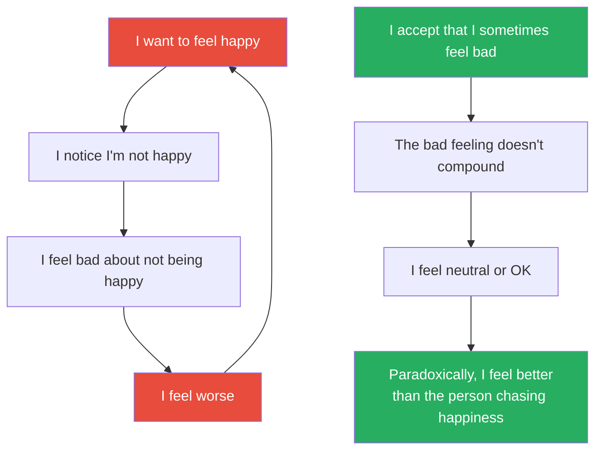

# The Subtle Art of Not Giving a F*ck — Mark Manson

> Mark Manson's counterintuitive self-help book argues that the key to a good life is not giving a f*ck about MORE — it's giving a f*ck about LESS. About only what is true, immediate, and important.
> The conventional self-help message — "think positive, visualise success, you deserve everything, you are special" — actually makes people feel worse by setting impossible standards and creating a toxic feedback loop of inadequacy.
> Manson's alternative: accept that life involves suffering, choose your suffering wisely, embrace your limitations, take responsibility for your problems even when they're not your fault, and stop pretending that happiness means the absence of pain.
> It is self-help for people who hate self-help — profane, irreverent, occasionally crude, and underneath all of that, surprisingly philosophical.
> The book has sold over 12 million copies and been translated into 60+ languages, making it one of the bestselling non-fiction books of the 2010s.
> Its lasting contribution is the reframe: the question is not "how do I feel good?" but "what am I willing to feel BAD for?"

---

## About the Author

Mark Manson is a blogger turned bestselling author.
He built his audience on markmanson.net, where his profanity-laden, no-BS writing about relationships, values, and personal growth attracted millions of readers.
Before becoming a writer, he was a dating coach — an experience that taught him how much human suffering comes from pursuing the wrong values and from the belief that you're entitled to feel good all the time.
He holds no advanced degrees in psychology or philosophy, but draws extensively on both — particularly on the Stoics (Marcus Aurelius, Epictetus), the Buddhists (suffering as the default condition), and the existentialists (Sartre, Camus, Kierkegaard).
His follow-up book, *Everything Is F*cked: A Book About Hope*, extended the philosophical argument.

---

## The Big Idea

- <b style="color: #2980b9">Not giving a f*ck does not mean being indifferent</b> — it means being comfortable with being different
- It means choosing what you give a f*ck ABOUT — and giving zero f*cks about everything else
- <b style="color: #e74c3c">The conventional self-help message creates a toxic loop</b>:
  - "You should feel happy" → You notice you're not happy → You feel bad about not being happy → You feel worse → "You should feel happy" → repeat
- Manson calls this the <b style="color: #2980b9">Feedback Loop from Hell</b>: feeling bad about feeling bad, being anxious about being anxious, being angry about being angry
- <b style="color: #27ae60">The fix: accept the negative emotion. Don't layer a second emotion on top of it.</b>
- "You're going to die one day. I know that's kind of obvious, but I just wanted to remind you in case you'd forgotten. You and everyone you know are going to be dead soon. And in the short amount of time between here and there, you have a limited amount of f*cks to give."

---

### The Backwards Law

- <b style="color: #2980b9">The desire for a more positive experience is itself a negative experience. The acceptance of a negative experience is itself a positive experience.</b>
- This is the book's most philosophically interesting idea — drawn from Alan Watts and Buddhist philosophy
- Pursuing happiness makes you hyper-aware of all the ways you're NOT happy
- Accepting unhappiness paradoxically makes you more content
- <b style="color: #27ae60">"Not giving a f*ck doesn't mean not caring. It means being comfortable with being different."</b>
- The person who doesn't care about social approval IS socially approved — because people respect authenticity
- The person who doesn't need to feel good all the time DOES feel good more often — because they're not fighting their own emotions

---

## Key Concepts at a Glance

| Concept | One-line summary |
|---------|-----------------|
| **Not Giving a F*ck** | Choosing what matters to you and ignoring everything else — not apathy but selectivity |
| **The Backwards Law** | Pursuing happiness makes you unhappy; accepting unhappiness makes you happier |
| **The Feedback Loop from Hell** | Feeling bad about feeling bad — the meta-emotion trap |
| **You Are Not Special** | The self-esteem movement lied: you are not extraordinary, and accepting that is liberating |
| **The Value of Suffering** | All life involves suffering; the question is not how to avoid it but what is WORTH suffering for |
| **Good Values vs Bad Values** | Good values: reality-based, socially constructive, controllable. Bad values: superstitious, destructive, uncontrollable. |
| **Responsibility ≠ Fault** | You are responsible for your problems even when they're not your fault |
| **The Certainty Trap** | Being wrong is productive; being certain is dangerous |
| **Failure Is the Way Forward** | Improvement is impossible without failure — the willingness to fail is the willingness to succeed |
| **The Importance of Saying No** | Commitment means saying no to everything that isn't the thing you've committed to |
| **Death** | Contemplating death is not morbid — it is the ultimate clarifier of values |

---

## Chapter 1: Don't Try

- <b style="color: #2980b9">Charles Bukowski's</b> tombstone reads: "Don't try"
- Bukowski was a drunk, a womaniser, a terrible employee, and one of the greatest American poets of the 20th century
- He didn't succeed because he tried to succeed — he succeeded because he accepted his failures and kept writing anyway
- <b style="color: #27ae60">The lesson: stop trying to be something you're not. Accept who you are — including the ugly parts — and work from there.</b>
- This is not an excuse for laziness. It's a reframe: effort directed at becoming someone else is wasted. Effort directed at becoming more of who you already are is productive.

---

## Chapter 2: Happiness Is a Problem

- <b style="color: #e74c3c">Happiness is not a solvable equation</b> — it's an ongoing process
- Manson tells the story of the Buddha: born into extreme wealth and pleasure, then exposed to extreme suffering, then seeking extreme asceticism — and finding that NONE of these extremes produced happiness
- The Buddha's conclusion (and Manson's): <b style="color: #2980b9">suffering is not a bug — it's a feature. It's the background condition of life.</b>
- The question is not "How do I eliminate suffering?" (you can't) but <b style="color: #27ae60">"What suffering am I willing to endure?"</b>
- "Who you are is defined by what you're willing to struggle for"
- The person who wants to be a rock star but isn't willing to endure the years of practice, rejection, and poverty doesn't actually want to be a rock star — they want the RESULT without the PROCESS

> [!danger] Before: The happiness myth
> "I will be happy when I get the promotion / the house / the relationship / the body / the freedom."
> Reality: you get the thing, you're happy for 2 weeks, then you want the next thing.
> The goalpost never stops moving.

> [!success] After: Choosing your suffering
> "What problem am I willing to have? What struggle am I willing to endure?"
> The entrepreneur is willing to struggle with uncertainty and risk.
> The artist is willing to struggle with rejection and poverty.
> The parent is willing to struggle with sleeplessness and sacrifice.
> <b style="color: #27ae60">Happiness comes not from avoiding struggle but from choosing the RIGHT struggle — the one that aligns with your values.</b>

---

## Chapter 3: You Are Not Special

- <b style="color: #e74c3c">The self-esteem movement of the 1980s-90s told an entire generation that they were special, unique, and destined for greatness</b>
- Manson argues this was catastrophically wrong — not because people don't have value, but because the MESSAGE created entitlement
- If you believe you're special, then ordinary outcomes feel like failures
- If you believe you deserve success, then not having it feels like injustice
- <b style="color: #2980b9">The truth: you are not special. You are average at almost everything. And that's OK.</b>
- The average human life — with its ordinary problems, ordinary relationships, and ordinary achievements — is still a meaningful life
- <b style="color: #27ae60">"The rare people who do become truly exceptional at something do so not because they believe they're exceptional. On the contrary, they become exceptional because they're obsessed with improvement. And that obsession is possible only because they acknowledge they are not yet where they want to be."</b>

> [!example] The Entitlement Trap
> Manson describes two forms of entitlement:
> 1. **"I'm awesome and the rest of you all suck"** — narcissistic entitlement
> 2. **"I suck and the rest of you are all awesome"** — victim-based entitlement
> Both are self-absorbed. Both place yourself at the centre of the universe. Both prevent genuine engagement with reality.
> <b style="color: #27ae60">The cure for both: accept that you are ordinary. Accept that your problems are not unique. Accept that your suffering is not special. Then get to work on the problems anyway.</b>

---

## Chapter 4: The Value of Suffering

- All suffering is not created equal — <b style="color: #2980b9">the meaning of your suffering depends on the VALUES driving it</b>
- Manson introduces the distinction between good values and bad values:

| | Good Values | Bad Values |
|--|------------|-----------|
| **Reality-based** | Honesty, creativity, humility, curiosity | Popularity, wealth as an end in itself, always being right |
| **Socially constructive** | Vulnerability, standing up for beliefs | Dominating others, feeling superior, material status |
| **Controllable** | I can choose to be honest TODAY | I cannot control whether people like me |

- <b style="color: #e74c3c">Bad values are: superstitious (based on magical thinking), socially destructive (require someone to lose for you to win), and uncontrollable (depend on external circumstances)</b>
- <b style="color: #27ae60">Good values are: reality-based (grounded in evidence), socially constructive (benefit others as well as yourself), and controllable (within your power to act on)</b>
- When your values are good, your suffering has meaning: "I'm struggling because I chose to pursue honesty" or "I'm suffering because I'm pushing myself to create something difficult"
- When your values are bad, your suffering is empty: "I'm miserable because I'm not as popular as I want to be" or "I'm suffering because I can't control what others think of me"

> [!tip] The Values Audit
> Manson recommends examining every source of suffering in your life and asking:
> 1. What value is driving this suffering?
> 2. Is this a good value (reality-based, constructive, controllable) or a bad value (superstitious, destructive, uncontrollable)?
> 3. If it's a bad value, can I replace it with a good one?
> 
> Example: "I'm unhappy because my Instagram post didn't get enough likes" → value = popularity (bad: uncontrollable). Replace with: "I'm going to post what's genuinely meaningful to me and not check the metrics" → value = creative expression (good: controllable).

---

## Chapter 5: You Are Always Choosing

### Responsibility vs Fault

- <b style="color: #2980b9">Responsibility and fault are not the same thing</b>
- You are not at fault for everything that happens to you — bad luck, other people's actions, systemic injustice are real
- But you ARE responsible for how you respond — because you are always choosing your response, even if the choices are limited
- <b style="color: #27ae60">"We don't always control what happens to us. But we always control how we interpret what happens to us, and how we respond."</b>
- This echoes Frankl: "Between stimulus and response there is a space. In that space lies our freedom" (see [[Man's Search for Meaning - Viktor Frankl|Man's Search for Meaning]])
- And Marcus Aurelius: "You have power over your mind — not outside events. Realise this, and you will find strength." (see [[Meditations - Marcus Aurelius|Meditations]])

> [!example] The Poker Player's Perspective
> Manson (channelling Annie Duke — see [[Thinking in Bets - Annie Duke|Thinking in Bets]]):
> You can't control the cards you're dealt. But you CAN control how you play them.
> Blaming the cards (fault) is useless. Playing them well (responsibility) is everything.
> <b style="color: #27ae60">"Fault is past tense. Responsibility is present tense."</b>
> It doesn't matter whose fault the problem is. What matters is: what are YOU going to do about it NOW?

---

## Chapters 6-7: The Certainty Trap and Failure

### Being Wrong Is Productive

- <b style="color: #e74c3c">Certainty is the enemy of growth</b>
- If you're certain you're right, you can't learn anything new
- If you're certain your beliefs are correct, contradictory evidence becomes a threat rather than an opportunity
- Manson: <b style="color: #2980b9">"Being wrong opens us up to the possibility of change. Being wrong brings the opportunity for growth."</b>
- The willingness to be wrong about your values, your beliefs, your identity, and your worldview is what makes change possible
- <b style="color: #27ae60">This is why dogmatic people are stuck and curious people grow — curiosity requires the humility to admit you might be wrong</b>

### Failure Is the Way Forward

- <b style="color: #2980b9">"Improvement at anything is based on thousands of tiny failures, and the magnitude of your success is based on how many times you've failed at something"</b>
- Manson argues that our culture's fear of failure is what produces mediocrity — because the only way to avoid failure is to avoid trying
- The person who has failed 100 times and kept going has learned 100 things the person who never tried doesn't know
- <b style="color: #27ae60">"If someone is better than you at something, it's likely because she has failed at it more than you have"</b>

> [!danger] Before: Fear of failure
> You don't start the business / write the book / ask for the promotion / have the difficult conversation because you might fail.
> Result: You never fail. You also never succeed. You remain exactly where you are.

> [!success] After: Embracing failure
> You start the business. It fails. You learn why. You start another one. It fails differently. You learn more. The third one works.
> Or: you write the book. It's terrible. You rewrite it. It's less terrible. You rewrite it again. It's good.
> <b style="color: #27ae60">"Action isn't just the effect of motivation; it is also the cause of it."</b>
> You don't need to feel motivated to act. Act first, and motivation follows from the momentum.

---

## Chapters 8-9: The Importance of Saying No and Death

### Commitment Requires Rejection

- <b style="color: #2980b9">Saying yes to everything is the same as saying yes to nothing</b>
- Commitment to a value, a relationship, a career, or a path means REJECTING all the alternatives
- "The desire to avoid rejection at all costs, to avoid confrontation and conflict, the desire to attempt to accept everything equally and to make everything coexist and harmonize — this is a deep and subtle form of entitlement"
- <b style="color: #27ae60">"Freedom grants the opportunity for greater meaning, but by itself there is nothing necessarily meaningful about it"</b> — you have to CHOOSE what to commit to

### Death: The Ultimate Clarifier

- Manson closes with a chapter on death — and argues that <b style="color: #2980b9">contemplating your own death is the most powerful tool for clarifying your values</b>
- If you knew you had one year to live, what would you give a f*ck about?
- The answer to that question reveals your true values — stripped of social pressure, ego, and status games
- <b style="color: #e74c3c">"The fear of death follows from the fear of life. A man who lives fully is prepared to die at any time."</b> (Mark Twain, cited by Manson)
- <b style="color: #27ae60">Death is not the enemy. A life spent giving f*cks about the wrong things IS the enemy.</b>

> [!tip] The Deathbed Test
> Before any major decision, ask: "On my deathbed, will I regret NOT doing this?"
> If yes → do it, regardless of fear, discomfort, or social judgement.
> If no → don't do it, regardless of how much pressure you feel.
> This is the ultimate values filter.

---

## Deep Dive: The F*ck Budget

### You Have a Limited Number of F*cks to Give

- Manson's central metaphor: <b style="color: #2980b9">imagine you have a finite budget of f*cks</b> — and every day, you're spending them on things
- Some expenditures are worthwhile: your health, your relationships, your meaningful work, your values
- Most expenditures are wasteful: what strangers think of you, whether someone cut you off in traffic, whether your Instagram post got enough likes, whether your colleague's email was slightly rude
- <b style="color: #27ae60">The art of not giving a f*ck is BUDGETING — deciding in advance what deserves your limited emotional energy and ruthlessly cutting everything else</b>
- This is not apathy. It is strategic emotional investment.

> [!tip] The F*ck Budget Exercise
> Write down everything you gave a f*ck about in the last week. Be honest. Include the small things.
> Now sort them into two columns:
> - **Column A: Worth it** — things that align with your actual values
> - **Column B: Wasted** — things that consumed emotional energy but produced nothing of lasting value
> 
> Most people discover that 80% of their f*cks went to Column B.
> <b style="color: #27ae60">The goal: reduce Column B to as close to zero as possible, and redirect all that freed energy to Column A.</b>
> This is Essentialism (see [[Essentialism - Greg McKeown|Essentialism]]) applied to your emotional life, not just your schedule.

---

### The Three Levels of Not Giving a F*ck

- Manson identifies a developmental progression in how people allocate their f*cks:

| Level | Age Range | What You Give a F*ck About | The Problem |
|-------|:---------:|--------------------------|-------------|
| **Level 1: F*cks about everything** | Teenagers / early twenties | Everything. What everyone thinks. Every slight. Every comparison. Every social media post. | Emotionally exhausted, anxious, people-pleasing, identity-less |
| **Level 2: F*cks about the right things** | Late twenties / thirties | Your craft, your close relationships, your values, your health | Still capable of being derailed by external judgment, but recovering faster |
| **Level 3: Comfortable not giving a f*ck** | Forties+ (if you've done the work) | Only what genuinely matters to you. Everything else gets a shrug. | You care deeply about a few things and are genuinely unbothered by the rest |

- <b style="color: #27ae60">Level 3 is the goal — but most people get stuck at Level 1 for life</b>
- The transition from Level 1 to Level 2 requires honest self-examination: "What do I ACTUALLY value?"
- The transition from Level 2 to Level 3 requires experience: enough life lived to know what matters and what doesn't
- <b style="color: #2980b9">This is why older people are often happier than younger people — not because their lives are better, but because they've learned what not to give a f*ck about</b>
- (This aligns with Laura Carstensen's research on aging and emotional positivity, as cited in [[Pre-Suasion - Robert Cialdini|Pre-Suasion]])

---

## Deep Dive: Manson's Philosophical Sources

### Buddhism: Suffering as the Default

- Manson draws heavily on the Four Noble Truths:
  1. Life involves suffering (dukkha)
  2. Suffering arises from desire/attachment
  3. Suffering can end when desire/attachment ends
  4. The path to ending suffering involves right action, right thought, right intention
- His translation: <b style="color: #2980b9">"Life is essentially an endless series of problems. The solution to one problem is merely the creation of another."</b>
- This is not pessimism — it's realism. And once you accept it, the pressure to achieve a problem-free state evaporates.
- <b style="color: #27ae60">The Buddhist insight: happiness is not the absence of problems. It is the presence of problems worth solving.</b>

---

### Stoicism: What You Can and Can't Control

- Manson channels Epictetus (see [[Discourses - Epictetus|Discourses]]): <b style="color: #2980b9">"Some things are within our power, while others are not"</b>
- Things within your power: your judgments, your actions, your values, your effort
- Things NOT within your power: other people's opinions, external events, your reputation, outcomes
- <b style="color: #27ae60">Give a f*ck ONLY about things within your power. Everything else is noise.</b>
- This maps directly onto Manson's good values / bad values framework:
  - Good values are controllable (within your power) = things worth giving a f*ck about
  - Bad values are uncontrollable (outside your power) = things NOT worth giving a f*ck about

---

### Existentialism: Meaning Through Choice

- Manson draws on Sartre and Camus: <b style="color: #2980b9">life has no inherent meaning — you must create it through your choices</b>
- "In the face of the inevitable mortality of existence, the only meaningful value is the one you choose for yourself"
- This is why the book ends with death: <b style="color: #27ae60">contemplating death forces you to choose what matters — because you can't take everything with you</b>
- Camus: "The absurd does not liberate; it binds." Manson's translation: the fact that life is ultimately meaningless doesn't free you from responsibility — it INCREASES your responsibility, because you can't blame anyone else for your choices.

---

## Deep Dive: Common Misreadings of the Book

### What Manson Is NOT Saying

| What People Think He's Saying | What He's Actually Saying |
|------------------------------|--------------------------|
| "Don't care about anything" | "Care intensely about a few things and stop caring about everything else" |
| "Be selfish and rude" | "Be honest and boundaried — which sometimes LOOKS selfish to people used to your people-pleasing" |
| "Suffering is bad" | "Suffering is inevitable — the question is whether you're suffering for the RIGHT things" |
| "You shouldn't try to improve" | "Improve by ACCEPTING where you are, not by hating yourself into change" |
| "Positive thinking is wrong" | "Forced positive thinking is wrong. Genuine optimism that acknowledges reality is fine." |
| "Self-help is useless" | "Most self-help creates dependency on the next book. THIS self-help tries to make you self-sufficient." |
| "Life is meaningless" | "Life has no externally imposed meaning — which means you get to choose your own" |

> [!warning] The Biggest Misreading
> Many readers take the book as permission to be an asshole — to stop caring about others, to blow off responsibilities, to justify selfishness with "I just don't give a f*ck."
> <b style="color: #e74c3c">This is the opposite of what Manson means.</b>
> Not giving a f*ck about trivial things FREES your emotional energy to give a f*ck about important things — your values, your relationships, your integrity, your contribution.
> The person who gives zero f*cks about everything is not enlightened. They are depressed.
> The person who gives carefully chosen f*cks about the RIGHT things is free.

---

## Deep Dive: Practical Application

### The Values Test

- For any source of suffering in your life, Manson recommends running it through the values test:

| Question | Good Value Answer | Bad Value Answer |
|----------|------------------|-----------------|
| "Is this within my control?" | Yes — I can act on it | No — it depends on external factors or other people |
| "Is this reality-based?" | Yes — grounded in evidence and experience | No — based on fantasy, magical thinking, or comparison |
| "Is this socially constructive?" | Yes — pursuing this makes the world (or my relationships) better | No — pursuing this requires others to lose or suffer |

- If all three answers are "good value" → this is worth giving a f*ck about. Pursue it.
- If any answer is "bad value" → <b style="color: #e74c3c">this is consuming your emotional energy without producing anything worthwhile. Drop it or replace the value driving it.</b>

---

### The Responsibility Reframe

- When something goes wrong, Manson's protocol:
  1. <b style="color: #2980b9">Acknowledge reality</b> — "This happened. It sucks. I'm allowed to feel bad about it."
  2. <b style="color: #2980b9">Separate fault from responsibility</b> — "This may not be my fault. But it IS my problem to deal with."
  3. <b style="color: #2980b9">Identify the response within your control</b> — "I can't change what happened. I CAN change what I do next."
  4. <b style="color: #2980b9">Act on the response</b> — "Here is what I'm going to do."

> [!danger] Before: The blame loop
> "My boss is terrible. My relationship failed because of my partner. The economy destroyed my business. My parents messed me up."
> Result: You're right about all of it — AND you're stuck. Because blame changes nothing.

> [!success] After: The responsibility reframe
> "My boss may be terrible. What am I going to do about it? Stay and influence, leave, or accept?"
> "My relationship may have failed because of my partner. What am I going to learn from it for the next one?"
> "The economy may have destroyed my business. What am I going to build next?"
> <b style="color: #27ae60">Responsibility is not about deserving the problem. It's about OWNING the response.</b>

---

### Manson's Daily Practices

| Practice | Description | Purpose |
|----------|-------------|---------|
| **The values check** | "What did I give a f*ck about today? Was it worth it?" | Prevents f*ck inflation — the tendency to give more f*cks over time |
| **The certainty challenge** | "What am I certain about that might be wrong?" | Prevents dogmatic thinking and keeps you open to growth |
| **The suffering question** | "What am I suffering for right now? Is it worth it?" | Ensures your suffering is driving toward values you've chosen, not values imposed on you |
| **The deathbed test** | "If I died tomorrow, would this matter?" | The ultimate f*ck filter |
| **The action bias** | "What am I avoiding? What would I do if I weren't afraid?" | Prevents analysis paralysis and fear-based inaction |

---

## The Verdict

*The Subtle Art of Not Giving a F*ck* is self-help for people who hate self-help — and that's precisely what makes it effective.
Manson's profane, irreverent voice makes uncomfortable truths surprisingly palatable: you're not special, your problems aren't unique, you're going to die, and most of what you're giving a f*ck about doesn't matter.

The "Backwards Law" — that trying to feel good makes you feel bad, and accepting bad feelings makes you feel better — is a genuinely profound philosophical insight, rooted in Buddhism and Stoicism but translated into language that a twenty-five-year-old who would never read Marcus Aurelius can absorb.

The values framework (good values are reality-based, constructive, and controllable; bad values are the opposite) is immediately actionable.
And the responsibility/fault distinction ("it's not your fault, but it IS your responsibility") is one of the most useful reframes in the self-help literature.

The book's weakness: Manson sometimes mistakes vulgarity for depth, and the philosophy (borrowed from Buddhism, Stoicism, and existentialism) is not as original as his confident voice implies. The later chapters on commitment and death feel rushed compared to the earlier ones. And his anecdotes occasionally feel manufactured rather than lived.

But as a gateway drug to genuine philosophical thinking about values, suffering, and what makes a life meaningful — wrapped in a package that people who would NEVER read Seneca or the Dhammapada will actually pick up and read — it works brilliantly.

---

## Related Reading

- [[Man's Search for Meaning - Viktor Frankl|Man's Search for Meaning]] — The serious, tested version of Manson's suffering thesis
- [[Meditations - Marcus Aurelius|Meditations]] — The Stoic source Manson draws from (especially on accepting what you can't control)
- [[The Four Agreements - Don Miguel Ruiz|The Four Agreements]] — A gentler, more spiritual version of the same "choose your battles" message
- [[The Almanack of Naval Ravikant - Eric Jorgenson|The Almanack of Naval Ravikant]] — Naval's "desire is a contract with yourself to be unhappy" is the Buddhist root of Manson's Backwards Law
- [[Essentialism - Greg McKeown|Essentialism]] — McKeown's "less but better" applied to life, not just productivity
- [[Antifragile - Nassim Nicholas Taleb|Antifragile]] — Taleb's embrace of volatility mirrors Manson's embrace of suffering
- [[Thinking in Bets - Annie Duke|Thinking in Bets]] — Duke's "resulting" trap maps onto Manson's certainty trap
- [[12 Rules for Life - Jordan Peterson|12 Rules for Life]] — Peterson's more structured, more conservative version of the same "take responsibility" message

## The Big Idea

- <b style="color: #2980b9">Not giving a f*ck does not mean being indifferent</b> — it means being comfortable with being different
- It means choosing what you give a f*ck ABOUT — and giving zero f*cks about everything else
- <b style="color: #e74c3c">The conventional self-help message creates a toxic loop</b>:
  - "You should feel happy" → You notice you're not happy → You feel bad about not being happy → You feel worse → "You should feel happy" → repeat
- Manson calls this the <b style="color: #2980b9">Feedback Loop from Hell</b>: feeling bad about feeling bad, being anxious about being anxious, being angry about being angry
- <b style="color: #27ae60">The fix: accept the negative emotion. Don't layer a second emotion on top of it.</b>
- "You're going to die one day. I know that's kind of obvious, but I just wanted to remind you in case you'd forgotten. You and everyone you know are going to be dead soon. And in the short amount of time between here and there, you have a limited amount of f*cks to give."

---

### The Backwards Law

- <b style="color: #2980b9">The desire for a more positive experience is itself a negative experience. The acceptance of a negative experience is itself a positive experience.</b>
- This is the book's most philosophically interesting idea — drawn from Alan Watts and Buddhist philosophy
- Pursuing happiness makes you hyper-aware of all the ways you're NOT happy
- Accepting unhappiness paradoxically makes you more content
- <b style="color: #27ae60">"Not giving a f*ck doesn't mean not caring. It means being comfortable with being different."</b>
- The person who doesn't care about social approval IS socially approved — because people respect authenticity
- The person who doesn't need to feel good all the time DOES feel good more often — because they're not fighting their own emotions

---

## Key Concepts at a Glance

| Concept | One-line summary |
|---------|-----------------|
| **Not Giving a F*ck** | Choosing what matters to you and ignoring everything else — not apathy but selectivity |
| **The Backwards Law** | Pursuing happiness makes you unhappy; accepting unhappiness makes you happier |
| **The Feedback Loop from Hell** | Feeling bad about feeling bad — the meta-emotion trap |
| **You Are Not Special** | The self-esteem movement lied: you are not extraordinary, and accepting that is liberating |
| **The Value of Suffering** | All life involves suffering; the question is not how to avoid it but what is WORTH suffering for |
| **Good Values vs Bad Values** | Good values: reality-based, socially constructive, controllable. Bad values: superstitious, destructive, uncontrollable. |
| **Responsibility ≠ Fault** | You are responsible for your problems even when they're not your fault |
| **The Certainty Trap** | Being wrong is productive; being certain is dangerous |
| **Failure Is the Way Forward** | Improvement is impossible without failure — the willingness to fail is the willingness to succeed |
| **The Importance of Saying No** | Commitment means saying no to everything that isn't the thing you've committed to |
| **Death** | Contemplating death is not morbid — it is the ultimate clarifier of values |

---

## Chapter 1: Don't Try

- <b style="color: #2980b9">Charles Bukowski's</b> tombstone reads: "Don't try"
- Bukowski was a drunk, a womaniser, a terrible employee, and one of the greatest American poets of the 20th century
- He didn't succeed because he tried to succeed — he succeeded because he accepted his failures and kept writing anyway
- <b style="color: #27ae60">The lesson: stop trying to be something you're not. Accept who you are — including the ugly parts — and work from there.</b>
- This is not an excuse for laziness. It's a reframe: effort directed at becoming someone else is wasted. Effort directed at becoming more of who you already are is productive.

---

## Chapter 2: Happiness Is a Problem

- <b style="color: #e74c3c">Happiness is not a solvable equation</b> — it's an ongoing process
- Manson tells the story of the Buddha: born into extreme wealth and pleasure, then exposed to extreme suffering, then seeking extreme asceticism — and finding that NONE of these extremes produced happiness
- The Buddha's conclusion (and Manson's): <b style="color: #2980b9">suffering is not a bug — it's a feature. It's the background condition of life.</b>
- The question is not "How do I eliminate suffering?" (you can't) but <b style="color: #27ae60">"What suffering am I willing to endure?"</b>
- "Who you are is defined by what you're willing to struggle for"
- The person who wants to be a rock star but isn't willing to endure the years of practice, rejection, and poverty doesn't actually want to be a rock star — they want the RESULT without the PROCESS

> [!danger] Before: The happiness myth
> "I will be happy when I get the promotion / the house / the relationship / the body / the freedom."
> Reality: you get the thing, you're happy for 2 weeks, then you want the next thing.
> The goalpost never stops moving.

> [!success] After: Choosing your suffering
> "What problem am I willing to have? What struggle am I willing to endure?"
> The entrepreneur is willing to struggle with uncertainty and risk.
> The artist is willing to struggle with rejection and poverty.
> The parent is willing to struggle with sleeplessness and sacrifice.
> <b style="color: #27ae60">Happiness comes not from avoiding struggle but from choosing the RIGHT struggle — the one that aligns with your values.</b>

---

## Chapter 3: You Are Not Special

- <b style="color: #e74c3c">The self-esteem movement of the 1980s-90s told an entire generation that they were special, unique, and destined for greatness</b>
- Manson argues this was catastrophically wrong — not because people don't have value, but because the MESSAGE created entitlement
- If you believe you're special, then ordinary outcomes feel like failures
- If you believe you deserve success, then not having it feels like injustice
- <b style="color: #2980b9">The truth: you are not special. You are average at almost everything. And that's OK.</b>
- The average human life — with its ordinary problems, ordinary relationships, and ordinary achievements — is still a meaningful life
- <b style="color: #27ae60">"The rare people who do become truly exceptional at something do so not because they believe they're exceptional. On the contrary, they become exceptional because they're obsessed with improvement. And that obsession is possible only because they acknowledge they are not yet where they want to be."</b>

> [!example] The Entitlement Trap
> Manson describes two forms of entitlement:
> 1. **"I'm awesome and the rest of you all suck"** — narcissistic entitlement
> 2. **"I suck and the rest of you are all awesome"** — victim-based entitlement
> Both are self-absorbed. Both place yourself at the centre of the universe. Both prevent genuine engagement with reality.
> <b style="color: #27ae60">The cure for both: accept that you are ordinary. Accept that your problems are not unique. Accept that your suffering is not special. Then get to work on the problems anyway.</b>

---

## Chapter 4: The Value of Suffering

- All suffering is not created equal — <b style="color: #2980b9">the meaning of your suffering depends on the VALUES driving it</b>
- Manson introduces the distinction between good values and bad values:

| | Good Values | Bad Values |
|--|------------|-----------|
| **Reality-based** | Honesty, creativity, humility, curiosity | Popularity, wealth as an end in itself, always being right |
| **Socially constructive** | Vulnerability, standing up for beliefs | Dominating others, feeling superior, material status |
| **Controllable** | I can choose to be honest TODAY | I cannot control whether people like me |

- <b style="color: #e74c3c">Bad values are: superstitious (based on magical thinking), socially destructive (require someone to lose for you to win), and uncontrollable (depend on external circumstances)</b>
- <b style="color: #27ae60">Good values are: reality-based (grounded in evidence), socially constructive (benefit others as well as yourself), and controllable (within your power to act on)</b>
- When your values are good, your suffering has meaning: "I'm struggling because I chose to pursue honesty" or "I'm suffering because I'm pushing myself to create something difficult"
- When your values are bad, your suffering is empty: "I'm miserable because I'm not as popular as I want to be" or "I'm suffering because I can't control what others think of me"

> [!tip] The Values Audit
> Manson recommends examining every source of suffering in your life and asking:
> 1. What value is driving this suffering?
> 2. Is this a good value (reality-based, constructive, controllable) or a bad value (superstitious, destructive, uncontrollable)?
> 3. If it's a bad value, can I replace it with a good one?
> 
> Example: "I'm unhappy because my Instagram post didn't get enough likes" → value = popularity (bad: uncontrollable). Replace with: "I'm going to post what's genuinely meaningful to me and not check the metrics" → value = creative expression (good: controllable).

---

## Chapter 5: You Are Always Choosing

### Responsibility vs Fault

- <b style="color: #2980b9">Responsibility and fault are not the same thing</b>
- You are not at fault for everything that happens to you — bad luck, other people's actions, systemic injustice are real
- But you ARE responsible for how you respond — because you are always choosing your response, even if the choices are limited
- <b style="color: #27ae60">"We don't always control what happens to us. But we always control how we interpret what happens to us, and how we respond."</b>
- This echoes Frankl: "Between stimulus and response there is a space. In that space lies our freedom" (see [[Man's Search for Meaning - Viktor Frankl|Man's Search for Meaning]])
- And Marcus Aurelius: "You have power over your mind — not outside events. Realise this, and you will find strength." (see [[Meditations - Marcus Aurelius|Meditations]])

> [!example] The Poker Player's Perspective
> Manson (channelling Annie Duke — see [[Thinking in Bets - Annie Duke|Thinking in Bets]]):
> You can't control the cards you're dealt. But you CAN control how you play them.
> Blaming the cards (fault) is useless. Playing them well (responsibility) is everything.
> <b style="color: #27ae60">"Fault is past tense. Responsibility is present tense."</b>
> It doesn't matter whose fault the problem is. What matters is: what are YOU going to do about it NOW?

---

## Chapters 6-7: The Certainty Trap and Failure

### Being Wrong Is Productive

- <b style="color: #e74c3c">Certainty is the enemy of growth</b>
- If you're certain you're right, you can't learn anything new
- If you're certain your beliefs are correct, contradictory evidence becomes a threat rather than an opportunity
- Manson: <b style="color: #2980b9">"Being wrong opens us up to the possibility of change. Being wrong brings the opportunity for growth."</b>
- The willingness to be wrong about your values, your beliefs, your identity, and your worldview is what makes change possible
- <b style="color: #27ae60">This is why dogmatic people are stuck and curious people grow — curiosity requires the humility to admit you might be wrong</b>

### Failure Is the Way Forward

- <b style="color: #2980b9">"Improvement at anything is based on thousands of tiny failures, and the magnitude of your success is based on how many times you've failed at something"</b>
- Manson argues that our culture's fear of failure is what produces mediocrity — because the only way to avoid failure is to avoid trying
- The person who has failed 100 times and kept going has learned 100 things the person who never tried doesn't know
- <b style="color: #27ae60">"If someone is better than you at something, it's likely because she has failed at it more than you have"</b>

> [!danger] Before: Fear of failure
> You don't start the business / write the book / ask for the promotion / have the difficult conversation because you might fail.
> Result: You never fail. You also never succeed. You remain exactly where you are.

> [!success] After: Embracing failure
> You start the business. It fails. You learn why. You start another one. It fails differently. You learn more. The third one works.
> Or: you write the book. It's terrible. You rewrite it. It's less terrible. You rewrite it again. It's good.
> <b style="color: #27ae60">"Action isn't just the effect of motivation; it is also the cause of it."</b>
> You don't need to feel motivated to act. Act first, and motivation follows from the momentum.

---

## Chapters 8-9: The Importance of Saying No and Death

### Commitment Requires Rejection

- <b style="color: #2980b9">Saying yes to everything is the same as saying yes to nothing</b>
- Commitment to a value, a relationship, a career, or a path means REJECTING all the alternatives
- "The desire to avoid rejection at all costs, to avoid confrontation and conflict, the desire to attempt to accept everything equally and to make everything coexist and harmonize — this is a deep and subtle form of entitlement"
- <b style="color: #27ae60">"Freedom grants the opportunity for greater meaning, but by itself there is nothing necessarily meaningful about it"</b> — you have to CHOOSE what to commit to

### Death: The Ultimate Clarifier

- Manson closes with a chapter on death — and argues that <b style="color: #2980b9">contemplating your own death is the most powerful tool for clarifying your values</b>
- If you knew you had one year to live, what would you give a f*ck about?
- The answer to that question reveals your true values — stripped of social pressure, ego, and status games
- <b style="color: #e74c3c">"The fear of death follows from the fear of life. A man who lives fully is prepared to die at any time."</b> (Mark Twain, cited by Manson)
- <b style="color: #27ae60">Death is not the enemy. A life spent giving f*cks about the wrong things IS the enemy.</b>

> [!tip] The Deathbed Test
> Before any major decision, ask: "On my deathbed, will I regret NOT doing this?"
> If yes → do it, regardless of fear, discomfort, or social judgement.
> If no → don't do it, regardless of how much pressure you feel.
> This is the ultimate values filter.

---

## Deep Dive: The F*ck Budget

### You Have a Limited Number of F*cks to Give

- Manson's central metaphor: <b style="color: #2980b9">imagine you have a finite budget of f*cks</b> — and every day, you're spending them on things
- Some expenditures are worthwhile: your health, your relationships, your meaningful work, your values
- Most expenditures are wasteful: what strangers think of you, whether someone cut you off in traffic, whether your Instagram post got enough likes, whether your colleague's email was slightly rude
- <b style="color: #27ae60">The art of not giving a f*ck is BUDGETING — deciding in advance what deserves your limited emotional energy and ruthlessly cutting everything else</b>
- This is not apathy. It is strategic emotional investment.

> [!tip] The F*ck Budget Exercise
> Write down everything you gave a f*ck about in the last week. Be honest. Include the small things.
> Now sort them into two columns:
> - **Column A: Worth it** — things that align with your actual values
> - **Column B: Wasted** — things that consumed emotional energy but produced nothing of lasting value
> 
> Most people discover that 80% of their f*cks went to Column B.
> <b style="color: #27ae60">The goal: reduce Column B to as close to zero as possible, and redirect all that freed energy to Column A.</b>
> This is Essentialism (see [[Essentialism - Greg McKeown|Essentialism]]) applied to your emotional life, not just your schedule.

---

### The Three Levels of Not Giving a F*ck

- Manson identifies a developmental progression in how people allocate their f*cks:

| Level | Age Range | What You Give a F*ck About | The Problem |
|-------|:---------:|--------------------------|-------------|
| **Level 1: F*cks about everything** | Teenagers / early twenties | Everything. What everyone thinks. Every slight. Every comparison. Every social media post. | Emotionally exhausted, anxious, people-pleasing, identity-less |
| **Level 2: F*cks about the right things** | Late twenties / thirties | Your craft, your close relationships, your values, your health | Still capable of being derailed by external judgment, but recovering faster |
| **Level 3: Comfortable not giving a f*ck** | Forties+ (if you've done the work) | Only what genuinely matters to you. Everything else gets a shrug. | You care deeply about a few things and are genuinely unbothered by the rest |

- <b style="color: #27ae60">Level 3 is the goal — but most people get stuck at Level 1 for life</b>
- The transition from Level 1 to Level 2 requires honest self-examination: "What do I ACTUALLY value?"
- The transition from Level 2 to Level 3 requires experience: enough life lived to know what matters and what doesn't
- <b style="color: #2980b9">This is why older people are often happier than younger people — not because their lives are better, but because they've learned what not to give a f*ck about</b>
- (This aligns with Laura Carstensen's research on aging and emotional positivity, as cited in [[Pre-Suasion - Robert Cialdini|Pre-Suasion]])

---

## Deep Dive: Manson's Philosophical Sources

### Buddhism: Suffering as the Default

- Manson draws heavily on the Four Noble Truths:
  1. Life involves suffering (dukkha)
  2. Suffering arises from desire/attachment
  3. Suffering can end when desire/attachment ends
  4. The path to ending suffering involves right action, right thought, right intention
- His translation: <b style="color: #2980b9">"Life is essentially an endless series of problems. The solution to one problem is merely the creation of another."</b>
- This is not pessimism — it's realism. And once you accept it, the pressure to achieve a problem-free state evaporates.
- <b style="color: #27ae60">The Buddhist insight: happiness is not the absence of problems. It is the presence of problems worth solving.</b>

---

### Stoicism: What You Can and Can't Control

- Manson channels Epictetus (see [[Discourses - Epictetus|Discourses]]): <b style="color: #2980b9">"Some things are within our power, while others are not"</b>
- Things within your power: your judgments, your actions, your values, your effort
- Things NOT within your power: other people's opinions, external events, your reputation, outcomes
- <b style="color: #27ae60">Give a f*ck ONLY about things within your power. Everything else is noise.</b>
- This maps directly onto Manson's good values / bad values framework:
  - Good values are controllable (within your power) = things worth giving a f*ck about
  - Bad values are uncontrollable (outside your power) = things NOT worth giving a f*ck about

---

### Existentialism: Meaning Through Choice

- Manson draws on Sartre and Camus: <b style="color: #2980b9">life has no inherent meaning — you must create it through your choices</b>
- "In the face of the inevitable mortality of existence, the only meaningful value is the one you choose for yourself"
- This is why the book ends with death: <b style="color: #27ae60">contemplating death forces you to choose what matters — because you can't take everything with you</b>
- Camus: "The absurd does not liberate; it binds." Manson's translation: the fact that life is ultimately meaningless doesn't free you from responsibility — it INCREASES your responsibility, because you can't blame anyone else for your choices.

---

## Deep Dive: Common Misreadings of the Book

### What Manson Is NOT Saying

| What People Think He's Saying | What He's Actually Saying |
|------------------------------|--------------------------|
| "Don't care about anything" | "Care intensely about a few things and stop caring about everything else" |
| "Be selfish and rude" | "Be honest and boundaried — which sometimes LOOKS selfish to people used to your people-pleasing" |
| "Suffering is bad" | "Suffering is inevitable — the question is whether you're suffering for the RIGHT things" |
| "You shouldn't try to improve" | "Improve by ACCEPTING where you are, not by hating yourself into change" |
| "Positive thinking is wrong" | "Forced positive thinking is wrong. Genuine optimism that acknowledges reality is fine." |
| "Self-help is useless" | "Most self-help creates dependency on the next book. THIS self-help tries to make you self-sufficient." |
| "Life is meaningless" | "Life has no externally imposed meaning — which means you get to choose your own" |

> [!warning] The Biggest Misreading
> Many readers take the book as permission to be an asshole — to stop caring about others, to blow off responsibilities, to justify selfishness with "I just don't give a f*ck."
> <b style="color: #e74c3c">This is the opposite of what Manson means.</b>
> Not giving a f*ck about trivial things FREES your emotional energy to give a f*ck about important things — your values, your relationships, your integrity, your contribution.
> The person who gives zero f*cks about everything is not enlightened. They are depressed.
> The person who gives carefully chosen f*cks about the RIGHT things is free.

---

## Deep Dive: Practical Application

### The Values Test

- For any source of suffering in your life, Manson recommends running it through the values test:

| Question | Good Value Answer | Bad Value Answer |
|----------|------------------|-----------------|
| "Is this within my control?" | Yes — I can act on it | No — it depends on external factors or other people |
| "Is this reality-based?" | Yes — grounded in evidence and experience | No — based on fantasy, magical thinking, or comparison |
| "Is this socially constructive?" | Yes — pursuing this makes the world (or my relationships) better | No — pursuing this requires others to lose or suffer |

- If all three answers are "good value" → this is worth giving a f*ck about. Pursue it.
- If any answer is "bad value" → <b style="color: #e74c3c">this is consuming your emotional energy without producing anything worthwhile. Drop it or replace the value driving it.</b>

---

### The Responsibility Reframe

- When something goes wrong, Manson's protocol:
  1. <b style="color: #2980b9">Acknowledge reality</b> — "This happened. It sucks. I'm allowed to feel bad about it."
  2. <b style="color: #2980b9">Separate fault from responsibility</b> — "This may not be my fault. But it IS my problem to deal with."
  3. <b style="color: #2980b9">Identify the response within your control</b> — "I can't change what happened. I CAN change what I do next."
  4. <b style="color: #2980b9">Act on the response</b> — "Here is what I'm going to do."

> [!danger] Before: The blame loop
> "My boss is terrible. My relationship failed because of my partner. The economy destroyed my business. My parents messed me up."
> Result: You're right about all of it — AND you're stuck. Because blame changes nothing.

> [!success] After: The responsibility reframe
> "My boss may be terrible. What am I going to do about it? Stay and influence, leave, or accept?"
> "My relationship may have failed because of my partner. What am I going to learn from it for the next one?"
> "The economy may have destroyed my business. What am I going to build next?"
> <b style="color: #27ae60">Responsibility is not about deserving the problem. It's about OWNING the response.</b>

---

### Manson's Daily Practices

| Practice | Description | Purpose |
|----------|-------------|---------|
| **The values check** | "What did I give a f*ck about today? Was it worth it?" | Prevents f*ck inflation — the tendency to give more f*cks over time |
| **The certainty challenge** | "What am I certain about that might be wrong?" | Prevents dogmatic thinking and keeps you open to growth |
| **The suffering question** | "What am I suffering for right now? Is it worth it?" | Ensures your suffering is driving toward values you've chosen, not values imposed on you |
| **The deathbed test** | "If I died tomorrow, would this matter?" | The ultimate f*ck filter |
| **The action bias** | "What am I avoiding? What would I do if I weren't afraid?" | Prevents analysis paralysis and fear-based inaction |

---

## The Verdict

*The Subtle Art of Not Giving a F*ck* is self-help for people who hate self-help — and that's precisely what makes it effective.
Manson's profane, irreverent voice makes uncomfortable truths surprisingly palatable: you're not special, your problems aren't unique, you're going to die, and most of what you're giving a f*ck about doesn't matter.

The "Backwards Law" — that trying to feel good makes you feel bad, and accepting bad feelings makes you feel better — is a genuinely profound philosophical insight, rooted in Buddhism and Stoicism but translated into language that a twenty-five-year-old who would never read Marcus Aurelius can absorb.

The values framework (good values are reality-based, constructive, and controllable; bad values are the opposite) is immediately actionable.
And the responsibility/fault distinction ("it's not your fault, but it IS your responsibility") is one of the most useful reframes in the self-help literature.

The book's weakness: Manson sometimes mistakes vulgarity for depth, and the philosophy (borrowed from Buddhism, Stoicism, and existentialism) is not as original as his confident voice implies. The later chapters on commitment and death feel rushed compared to the earlier ones. And his anecdotes occasionally feel manufactured rather than lived.

But as a gateway drug to genuine philosophical thinking about values, suffering, and what makes a life meaningful — wrapped in a package that people who would NEVER read Seneca or the Dhammapada will actually pick up and read — it works brilliantly.

---

## Related Reading

- [[Man's Search for Meaning - Viktor Frankl|Man's Search for Meaning]] — The serious, tested version of Manson's suffering thesis
- [[Meditations - Marcus Aurelius|Meditations]] — The Stoic source Manson draws from (especially on accepting what you can't control)
- [[The Four Agreements - Don Miguel Ruiz|The Four Agreements]] — A gentler, more spiritual version of the same "choose your battles" message
- [[The Almanack of Naval Ravikant - Eric Jorgenson|The Almanack of Naval Ravikant]] — Naval's "desire is a contract with yourself to be unhappy" is the Buddhist root of Manson's Backwards Law
- [[Essentialism - Greg McKeown|Essentialism]] — McKeown's "less but better" applied to life, not just productivity
- [[Antifragile - Nassim Nicholas Taleb|Antifragile]] — Taleb's embrace of volatility mirrors Manson's embrace of suffering
- [[Thinking in Bets - Annie Duke|Thinking in Bets]] — Duke's "resulting" trap maps onto Manson's certainty trap
- [[12 Rules for Life - Jordan Peterson|12 Rules for Life]] — Peterson's more structured, more conservative version of the same "take responsibility" message
