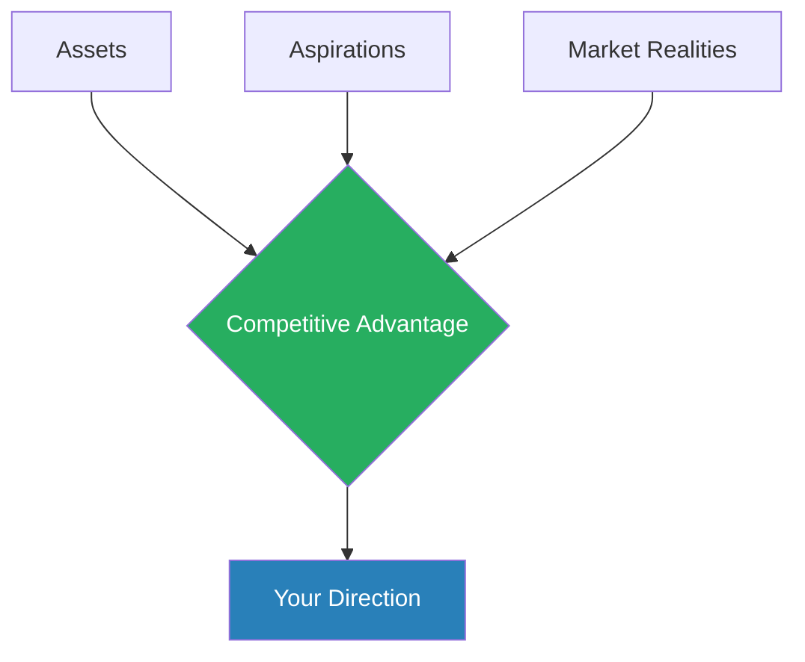
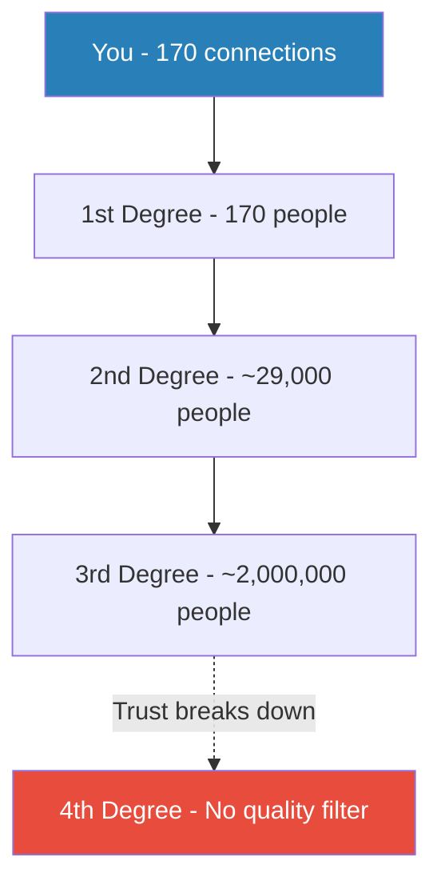
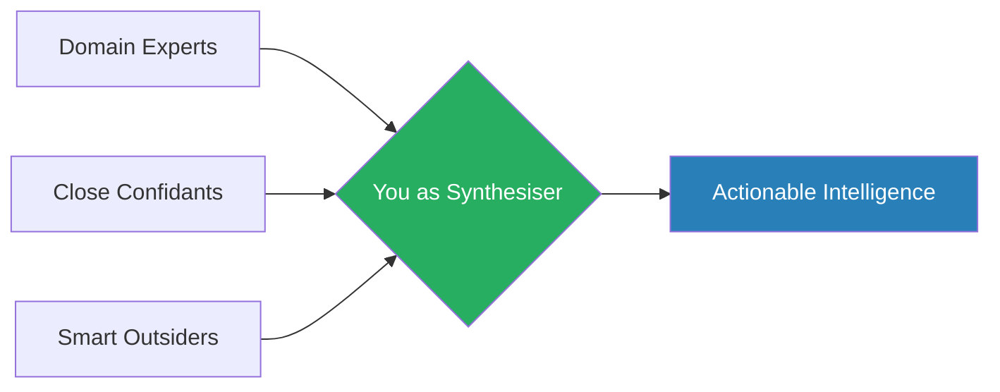
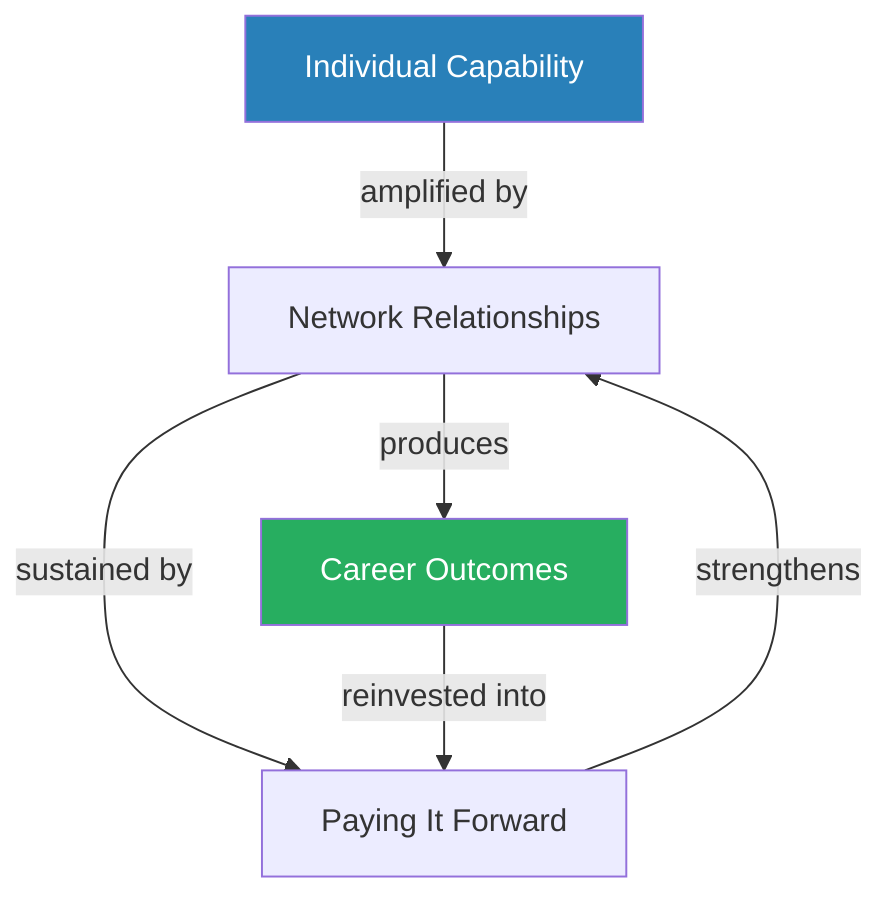

# The Start-Up of You — Reid Hoffman & Ben Casnocha

> The traditional career escalator -- join a company, ascend steadily, retire with a pension -- is permanently broken. Reid Hoffman, the co-founder of LinkedIn, argues that your career is a start-up venture: it demands continuous adaptation, intelligent risk-taking, networked intelligence, and the entrepreneurial refusal to ever consider yourself a finished product. The replacement for escalator thinking is **permanent beta** -- treat yourself as software that is always being updated, never shipped as a final release. The book is organised around six entrepreneurial disciplines translated from company strategy into personal strategy: competitive advantage, adaptive planning, network power, opportunity pursuit, intelligent risk-taking, and network intelligence. Taken together, they form a coherent operating system for navigating a labour market that now resembles the start-up ecosystem more than the corporate one. This is not a motivational book disguised as strategy; it is a genuine operating framework, strongest on networking and adaptive planning, with a significant blind spot around organisational politics.

---

## About the Author

**Reid Hoffman** co-founded LinkedIn in 2002, served as Executive Vice President of PayPal during its rise and sale to eBay, and became a partner at the elite venture capital firm Greylock Partners. He has invested in hundreds of companies -- including Facebook, Airbnb, and Zynga -- and sits at the centre of Silicon Valley's most powerful professional networks. **Ben Casnocha** is an entrepreneur, writer, and Hoffman's long-time collaborator who co-authored this book and later became Hoffman's chief of staff. Their perspective is shaped by two decades inside Silicon Valley's start-up ecosystem, which gives them unmatched pattern recognition across company-building and career-building alike -- and an admitted blind spot toward environments where meritocracy breaks down and political dynamics determine outcomes. The book was published in 2012, in the aftermath of the Great Recession, when the permanent-employment social contract had visibly shattered.

---

## The Big Idea

- Hoffman's central thesis is that the strategies which build great companies are the same ones that build great careers
- The labour market is now information-poor, time-compressed, and structurally unstable -- exactly like the start-up world
- The winners are not the most credentialled or the most experienced
- They are the most <b style="color: #27ae60">adaptive</b>: the ones who combine unique assets, plan with built-in pivots, invest relentlessly in networks, and treat risk as a resource rather than a threat

The book is built around a simple but powerful analogy:

- A start-up does not begin with a perfect product and a guaranteed market
- It begins with a hypothesis, tests that hypothesis through action, iterates based on what it learns, builds alliances to extend its reach, and takes intelligent risks because the cost of standing still is greater than the cost of moving
- Professionals who adopt this same posture -- who treat their working lives as ventures to be built rather than paths to be followed -- dramatically outperform those who wait for stability, credentials, or permission

---

The <b style="color: #2980b9">escalator metaphor</b> is the book's organising device:

- For most of the twentieth century, the implicit deal was clear: be loyal, work hard, and the organisation will take care of you
- That deal is dead -- pensions are vanishing, lifetime employment is a relic, and entire industries can be disrupted in a decade
- The replacement is not chaos -- it is entrepreneurial strategy applied to individual lives
- The book maps six specific disciplines from the start-up world onto personal strategy: developing competitive advantage, planning adaptively, building networks, pursuing breakout opportunities, taking intelligent risks, and gathering network intelligence

What makes the book distinctive is Hoffman's insider authority:

- He is not theorising about networks from the outside; he built the world's largest professional network
- He is not speculating about start-up strategy; he co-founded PayPal and LinkedIn and invested in hundreds of ventures
- The pattern recognition that comes from this experience gives the book a practical density that most career books lack, even as it creates a Silicon Valley bias that the reader must consciously adjust for

---

## Key Concepts at a Glance

| Concept | One-line summary |
|---------|-----------------|
| **Permanent Beta** | Never consider yourself a finished product -- continuous adaptation beats static expertise |
| **The Three Puzzle Pieces** | Competitive advantage sits at the intersection of assets, aspirations, and market realities |
| **ABZ Planning** | Maintain a current strategy (A), an adjacent pivot (B), and a reliable lifeboat (Z) |
| **IWe** | Individual capability raised to the power of a network -- I^We |
| **Professional Allies** | A small number of deep, reciprocal relationships defined by behaviour under stress |
| **Strength of Weak Ties** | Casual acquaintances expose you to opportunities your close friends never could |
| **Three-Degree Network Power** | Your actionable network extends to friend-of-friend-of-friend -- roughly two million people |
| **The Volatility Paradox** | Short-term risk increases long-term stability; suppressing small shocks creates catastrophic fragility |
| **Network Intelligence** | Pull knowledge dynamically from domain experts, close confidants, and smart outsiders |
| **Hustle** | Resourcefulness under constraint separates survivors from casualties |

---

## Chapter 1: All Humans Are Entrepreneurs — Permanent Beta

*Hoffman opens with a city that refused to evolve and a software philosophy that refuses to ship -- and argues that your career must choose the latter.*

The book opens with <b style="color: #e74c3c">Detroit</b> as a cautionary tale:

- For decades, the American auto industry assumed its dominance was permanent
- General Motors, Ford, and Chrysler controlled the market, suppressed internal innovation, and treated the future as an extension of the present
- When Japanese manufacturers arrived with cheaper, more reliable cars in the 1970s and 1980s, the Big Three were catastrophically unprepared
- The failure was not a lack of resources -- it was that decades of complacency had destroyed their capacity to adapt
- Detroit's population collapsed from 1.8 million to under 700,000
- Entire neighbourhoods were abandoned
- The city became a monument to what happens when an entity -- whether a company, an industry, or a person -- stops evolving

---

Hoffman contrasts this with Silicon Valley's culture of <b style="color: #2980b9">permanent beta</b>:

- In software development, a product in "beta" is one that is still being tested, still being improved, still being iterated upon
- Gmail famously stayed in beta for five years -- not because it was broken, but because the label signalled a commitment to continuous improvement
- Amazon's Jeff Bezos ends every shareholder letter with the words "it's still Day 1," a deliberate refusal to treat the company as a finished product
- Netflix reinvented itself from DVD-by-mail to streaming to original content production, each pivot a response to changing technology and consumer behaviour

> "Finished is an F-word."

> [!tip] Core Insight
> The professional who decides they have "arrived" -- who stops learning, stops building new skills, stops expanding their network -- is Detroit. Comfort and growth rarely coexist for long.

---

The chapter also invokes <b style="color: #2980b9">Muhammad Yunus</b>, the Nobel Prize-winning economist:

> "All humans are entrepreneurs."

- Yunus's point was that before the industrial revolution created factory jobs and the organisational structures that followed, every human being was essentially self-employed -- trading, farming, building, improvising
- The career escalator of the twentieth century was the historical anomaly, not the norm
- Hoffman suggests that we are returning to something closer to the pre-industrial default: a world where everyone must think like an entrepreneur, even if they work inside large organisations

Hoffman argues we have come full circle -- the permanent-employment era was the anomaly, and permanent beta is the return to humanity's entrepreneurial default.

---

The risk of the permanent beta mindset, which Hoffman acknowledges but does not dwell on:

- <b style="color: #e74c3c">It can become an excuse for lack of commitment</b>
- Some expertise requires sustained focus in one area for years
- A surgeon who is perpetually in "beta" is not reassuring
- The principle works best in environments undergoing technological or structural disruption -- which, the book argues, is now almost everywhere

---

## Chapter 2: Develop a Competitive Advantage

### The Three Puzzle Pieces

*Your direction in life is not a single strength or a single passion -- it is the dynamic interplay of three forces that must be evaluated together and reassembled as the world shifts.*

Your direction in life, Hoffman argues, emerges from the interplay of three dynamic forces that he visualises as puzzle pieces:

| Puzzle Piece | Definition | Example |
|-------------|-----------|---------|
| **Assets** | Soft (skills, knowledge, connections, reputation) and hard (cash, savings, resources) | What you have to work with right now |
| **Aspirations & Values** | What you care about, what energises you, what you will sacrifice for | Your pole star -- changes over time, and that is fine |
| **Market Realities** | What the world actually needs and will pay for | No matter how brilliant your assets, someone must want what you offer |

<b style="color: #27ae60">No single piece is sufficient</b>:

- Assets without market demand is a hobby
- Passion without competence is a fantasy
- Market demand without aspiration is a soul-crushing grind that will eventually burn you out
- All three must be evaluated together -- and re-evaluated regularly, because all three change as you grow, as industries shift, and as your values mature

Competitive advantage lives at the intersection of all three puzzle pieces -- remove any one and the whole structure collapses.

---

### Competitive Advantage as Combination

*The labour market is flooded with people who share similar credentials. Differentiation comes from unique intersections -- two or three domains where your particular mix of assets gives you an edge that is hard to replicate.*

The book's most distinctive argument in this chapter is that <b style="color: #27ae60">competitive advantage is a combination, not a single strength</b>:

- A finance degree, ten years of experience, and strong communication skills describe a million professionals
- Differentiation comes from unique intersections -- two or three domains where your particular mix gives you an edge that is hard to replicate

> [!example] Joi Ito's Transpacific Edge
> - Ito grew up between Japan and the United States, becoming fluent in both languages and cultures
> - He developed deep expertise in technology investing, straddling two very different markets
> - That transpacific, bilingual, tech-investing combination gave him advantages no monolingual American venture capitalist could match
> - He could see opportunities in both markets simultaneously, broker deals across cultural lines, and operate in spaces where most investors could not follow
> - Eventually, he became the director of the MIT Media Lab -- a position that rewarded exactly that kind of boundary-spanning capability
> **The lesson:** Combination beats singular excellence. The rarer the intersection, the less competition you face.

> [!example] Matt Cohler's Consigliere Strategy
> - Cohler recognised early that Silicon Valley was full of would-be founders but short of people who excelled as the number-two operator
> - Rather than competing for the crowded founder slot, he positioned himself as the indispensable lieutenant -- the consigliere who could translate a founder's vision into execution
> - He joined LinkedIn as one of its first employees, then moved to Facebook as an early executive, before becoming a partner at the venture capital firm Benchmark
> - Each move built on the previous one, and the "consigliere + tech + VC" combination became something no one else could offer
> **The lesson:** You do not have to compete where everyone else is competing. Find the underserved slot.

---

### All Advantages Are Local

*You do not need to be the best in the world. You need to be the best in a well-chosen niche where your assets shine brightest.*

- <b style="color: #27ae60">All advantages are local</b> -- you do not need global dominance, just dominance in a well-chosen niche
- The key is changing the competitive landscape rather than trying to outperform everyone on every dimension

> [!example] Basketball Players in European Leagues
> - American college basketball players who are not good enough for the NBA face a choice
> - Rather than grinding away in the minor leagues of American basketball, some move to European leagues where the competition is less intense
> - They are not changing their skills -- they are changing the competitive landscape
> - Suddenly, their particular combination of size, speed, and skill makes them standouts rather than also-rans
> **The lesson:** If you cannot win the game, change the game.

- <b style="color: #2980b9">LinkedIn itself</b> succeeded not by competing head-to-head with Facebook or MySpace for social networking dominance
- It defined a specific niche -- professional networking -- where its particular strengths (Hoffman's network, business-oriented features, a culture of professionalism) gave it a decisive advantage
- The niche was large enough to build a massive business, but specific enough that the social media giants did not compete seriously for years

> [!tip] Core Insight
> Competitive advantage is not something you are born with or achieve once. It is something you build consciously by assembling a combination of assets that serves a real market need -- and then reassembling it as the market shifts.

---

## Chapter 3: Plan to Adapt — ABZ Planning

### The Problem with Traditional Planning

*Hoffman dismantles the standard career advice -- discover your passion, make a ten-year plan, execute faithfully -- and replaces it with a framework that embraces uncertainty while still providing direction.*

- The standard career advice -- discover your passion, make a ten-year plan, execute faithfully -- fails for the same reason that detailed business plans fail in the start-up world
- <b style="color: #e74c3c">The world changes, you change, and static plans cannot absorb new information</b>
- A ten-year career plan created at age twenty-five is almost certainly obsolete by age twenty-seven
- But the alternative is not planlessness -- it is <b style="color: #2980b9">adaptive planning</b>

### The Framework

> [!abstract] ABZ Planning Framework
> - **Plan A** — Your current strategy, actively pursued. Unlike a traditional plan, you iterate on it continuously through small bets and real-world feedback. You are not married to Plan A; you are dating it.
> - **Plan B** — Your pivot: an adjacent move triggered by new learning, shifting opportunities, or market change. Not random; builds on what you learned from Plan A. A pivot is not quitting; it is evolving.
> - **Plan Z** — Your lifeboat: a reliable backstop that keeps you in the game if everything else fails. The worst-case scenario you can tolerate. Its certainty is what enables aggressive pursuit of A and B.

- The framework dissolves the false choice between commitment and flexibility
- You can be what Hoffman calls <b style="color: #2980b9">flexibly persistent</b> -- loyal to a direction while remaining adaptive about the path

---

### Stories of Adaptive Planning

> [!example] PayPal's Pivot from Palm Pilots to eBay
> - PayPal did not begin as the online payments giant it became
> - It started as a way to beam payments between Palm Pilot handheld devices -- a product nobody wanted
> - Plan A failed -- but instead of shutting down, the team pivoted
> - They noticed that a small number of users were using PayPal to make payments on eBay
> - The company followed the data, rebuilt the product around eBay payments, and the rest is history
> **The lesson:** The pivot was not a retreat; it was an evolution driven by learning. Usage data revealed what planning never could.

> [!example] Sheryl Sandberg's Career-Long ABZ
> - Sandberg started at the World Bank (Plan A)
> - She pivoted to the US Treasury Department under Larry Summers (Plan B, triggered by a new opportunity)
> - She pivoted again to Google when the political climate changed, and finally to Facebook
> - Each move built on the assets and relationships accumulated in the previous one
> - None of them were planned from the start; each was a response to new information and new circumstances
> **The lesson:** ABZ Planning is not a one-time exercise. It is a career-long operating system.

> [!example] Flickr's Accidental Discovery
> - The company began as an online multiplayer game called Game Neverending
> - The game included a photo-sharing feature that players used to share screenshots
> - The team noticed that the photo-sharing feature was far more popular than the game itself
> - They pivoted entirely, shutting down the game and building what became one of the internet's first major photo-sharing platforms
> **The lesson:** Usage data revealed what planning never could.

---

### The Power of Plan Z

*The lifeboat is not pessimism -- it is the structural foundation that makes courage possible.*

- Hoffman makes a critical point about Plan Z that is often missed: <b style="color: #27ae60">it is not about pessimism</b>
- A strong lifeboat is what gives you the courage to take intelligent risks
- People who have no fallback play conservatively -- not because they are cautious by nature, but because the cost of failure feels existential
- When failure means losing your home or being unable to feed your family, even modest risks feel terrifying

> "If you're not growing, you're contracting."

- A well-defined Plan Z transforms that calculus:
  - When you know that even the worst-case scenario is survivable -- you can move back in with family, you have six months of savings, you have a standing offer in a different field
  - You can pursue ambitious goals without the paralysing fear of total collapse
  - <b style="color: #27ae60">The lifeboat enables the voyage</b>

---

### Learning Through Action

- <b style="color: #2980b9">Practical knowledge is best developed through action, not introspection</b>
- Hoffman uses his own early career as an example:
  - He worked at Apple and learned that he cared more about product strategy than user interface design
  - Something he could not have known from self-reflection alone
  - The experience taught him something about himself that no personality test or career counsellor could have revealed
- The broader insight is that career environments are complex adaptive systems:
  - Outcomes are emergent, not predictable
  - Only interaction with the system reveals its dynamics
  - The correct response to uncertainty is not more planning -- it is more doing, with a bias toward small, reversible experiments that generate information

> [!tip] Core Insight
> The correct response to uncertainty is not more planning -- it is more doing. Small, reversible experiments generate information that introspection never could.

---

## Chapter 4: It Takes a Network

*This is the book's longest and richest chapter, drawing on Hoffman's unique authority as the founder of the world's largest professional network. He divides it into several interconnected arguments about how relationships create professional power.*

### The IWe Model

- Hoffman introduces <b style="color: #2980b9">IWe</b> (pronounced "I to the We") -- the idea that individual capability is raised exponentially with the help of a network
- The formula is simple: **I^We**
- Your individual power, amplified by the people around you, produces something far greater than either alone
- But the formula has a catch: <b style="color: #e74c3c">zero raised to any power is still zero</b>
  - Without individual capability -- skills, knowledge, something to offer -- no network in the world can help you
  - You cannot outsource competence to your contacts
- The "you" in *The Start-Up of You* is both singular and plural: you the individual with your skills and assets, and you the node in a network of relationships that extends your reach

---

### Professional Allies

*Not all relationships are equal. Hoffman draws a sharp line between friendly acquaintances and genuine alliances -- and the distinction lies not in warmth but in what happens under pressure.*

- A true <b style="color: #2980b9">professional alliance</b> is defined not by affection or frequency of contact but by its behaviour under stress:
  - Would this person defend you when you are not in the room?
  - Would they share an opportunity with you before it becomes public?
  - Would they go out of their way to help you in a crisis?
- If the answer is yes, you have an ally; if no, you have a friendly acquaintance -- valuable, but different
- Hoffman recommends maintaining a small number -- roughly eight to ten -- of deep alliances where trust has been built through repeated reciprocal investment
- The relationship is not transactional in the narrow sense; it is what he calls <b style="color: #2980b9">intermingled</b> -- your professional fates are so interwoven that helping the other person is indistinguishable from helping yourself

> [!example] Hoffman and Mark Pincus — A Cascade of Shared Ventures
> - Hoffman and Pincus met in the early days of Silicon Valley's social networking boom
> - Their alliance was not based on a single favour or a single project
> - Over years, it produced a cascade of shared ventures:
>   - They co-founded Friendster's predecessor
>   - Shared a patent that became the basis for Six Degrees
>   - Invested in Facebook together
>   - Pincus went on to found Zynga with Hoffman's backing and counsel
> - Each collaboration built on the trust accumulated in the previous one
> - The relationship was never "I'll do something for you if you do something for me" -- it was a continuous flow of mutual investment where keeping score would have been pointless
> **The lesson:** True alliances are not transactional. They are continuous flows of mutual investment.

> [!example] Susan Milliken and Mary Sue Feniger — Complementary Strengths
> - The two chefs met in a kitchen in the early 1980s and recognised complementary strengths
> - Milliken's business acumen paired with Feniger's creative flair
> - Their alliance lasted over thirty years and produced multiple restaurants, television shows, and cookbooks
> - Neither could have built what they built alone
> **The lesson:** The best alliances are genuinely reciprocal -- each partner contributes something the other lacks.

---

### The Strength of Weak Ties

*The people you barely know are often more valuable for discovering new opportunities than your closest friends -- and the reason is structural, not emotional.*

- Drawing on sociologist <b style="color: #2980b9">Mark Granovetter's</b> classic 1973 study, Hoffman makes the case that weak ties outperform strong ties for opportunity discovery
- Granovetter surveyed professionals in the Boston area who had recently found new jobs through personal contacts
- The results were striking: **83% found their jobs through people they saw only occasionally or rarely** -- not through close friends or daily colleagues

The reason is structural:

- Strong ties tend to mirror you -- your best friends are likely in the same industry, exposed to the same information, connected to the same people
- They are wonderful for support but poor for novelty
- <b style="color: #27ae60">Weak ties sit in entirely different social circles</b> -- they are exposed to different information ecosystems, different job postings, different ideas
- The value is not in weakness itself but in **breadth and diversity**
- A weak tie in your same field, doing the same work, offers no more reach than a strong tie
- The power comes from connections that bridge different worlds -- that link your information ecosystem to one you would never encounter on your own

---

### Three-Degree Network Power

- Hoffman quantifies the reach of a professional network using <b style="color: #2980b9">three-degree network power</b>:
  - **First-degree** connections: the people you know directly
  - **Second-degree** connections: the people they know
  - **Third-degree** connections: friend of a friend of a friend
- Beyond three degrees, trust breaks down:
  - At four degrees of separation, no one in the introduction chain has a personal relationship with both endpoints
  - There is no skin in the game, no social cost to a bad introduction, and therefore no quality filter
- Within three degrees, the numbers are staggering:
  - A person with 170 first-degree LinkedIn connections sits at the centre of a network of roughly <b style="color: #27ae60">two million people</b>
  - All reachable through at most two intermediaries, each of whom has a reputation to protect
- The practical implication: the right introduction is almost always available -- the question is not "do I know someone?" but "how do I navigate the chain?"

Within three degrees, you can reach roughly two million people through trusted intermediaries. Beyond that threshold, the chain loses its quality filter.

---

### Status Dynamics in Relationships

- Hoffman includes a pointed section on <b style="color: #2980b9">status dynamics</b> that most networking books ignore
- Status differences -- real and perceived -- govern how people are expected to behave
- These dynamics operate whether you are conscious of them or not, and violating them inadvertently can damage relationships before they begin
- <b style="color: #e74c3c">Examples of inadvertent status violations:</b>
  - Arriving late to a meeting with a senior person
  - Offering unsolicited feedback to a peer who did not ask for it
  - Choosing a meeting location that is inconvenient for the higher-status party
  - Interrupting
- Each of these signals dominance -- whether you intend it to or not
- Hoffman is careful to distinguish status awareness from sycophancy -- the point is not to grovel but to be <b style="color: #2980b9">finesse-conscious</b>

> [!example] Robert Greene and the Threatened Boss
> - Robert Greene (the author of *The 48 Laws of Power*) earlier in his career worked in a role where his exceptional performance inadvertently made his boss feel diminished
> - Despite doing excellent work, Greene was effectively forced out
> - The problem was not competence -- it was that he failed to navigate the status dynamics of a relationship where his talent threatened a superior
> **The lesson:** Skill alone is not enough. How you manage the perception of that skill matters as much as the skill itself.

> [!tip] Core Insight
> Your power is I^We -- individual capability amplified by network. But zero raised to any power is still zero. Without something to offer, no network can save you.

---

## Chapter 5: Pursue Breakout Opportunities

### Serendipity Is Not Luck

*Great opportunities are not found by planning. They are generated by being in motion -- and then paying attention when something valuable collides with you.*

- Hoffman's central argument in this chapter is that <b style="color: #2980b9">serendipity</b> -- the happy accident that changes your trajectory -- is not pure luck
- It is the intersection of motion and alertness:
  - The more you put yourself in unfamiliar situations, the more likely you are to collide with something valuable
  - But you also have to be paying attention when it happens
- <b style="color: #27ae60">Motion creates collisions; alertness converts them into opportunities</b>

> "The fastest way to change yourself is to hang out with people who are already the way you want to be."

> [!example] D'Agostino at the Waldorf-Astoria
> - D'Agostino was attending an event at the Waldorf-Astoria hotel in New York
> - A chance conversation led to an introduction that launched his career at NYMEX, the New York Mercantile Exchange
> - He was not there looking for a job and was not networking strategically
> - He was simply present, open, and alert -- and the opportunity found him because he was in motion
> **The lesson:** Show up. Be present. Opportunities are attached to rooms you walk into.

> [!example] George Clooney's Twelve-Year Audition
> - Clooney auditioned relentlessly for twelve years before landing the role of Doug Ross on the television series *ER*
> - Every audition was a chance for a breakout -- most of them led nowhere
> - But Clooney kept showing up, kept putting himself in front of casting directors, and kept being in motion
> - When the right opportunity finally appeared, he was ready for it -- not because he had planned for *ER* specifically, but because he had been practising for something like it for over a decade
> **The lesson:** Persistence is not stubbornness. It is the deliberate generation of collisions until one of them connects.

> [!example] Joseph Priestley and Benjamin Franklin's Coffeehouses
> - Priestley, the eighteenth-century scientist who discovered oxygen, was not a professional scientist
> - He was a minister and teacher who happened to attend the coffeehouse gatherings hosted by Benjamin Franklin in London
> - Those gatherings exposed him to scientific ideas he would never have encountered in his day job
> - The conversations sparked an interest that led to his groundbreaking experiments
> - Priestley did not plan to discover oxygen -- he put himself in the right room, stayed alert, and let the collision of ideas do the rest
> **The lesson:** The right room matters more than the right plan.

---

### Hustle as a Competitive Edge

*When resources are constrained, resourcefulness separates winners from the pack. The willingness to create something from nothing is an underappreciated competitive edge.*

- Hoffman celebrates <b style="color: #2980b9">hustle</b> -- resourcefulness under constraint -- as a competitive advantage that most people underestimate
- When the playbook runs out and the resources are gone, the people who improvise are the ones who survive

> [!example] Airbnb's Obama O's and Cap'n McCain's (2008)
> - In 2008, Airbnb was running out of money
> - The founders could not raise venture capital; the economy was in freefall and no one was investing
> - Rather than shutting down, they came up with a creative fundraiser: novelty cereal boxes themed around the 2008 presidential election -- "Obama O's" and "Cap'n McCain's"
> - The cereal sold well enough to keep the company alive until they found product-market fit
> - Selling breakfast cereal to fund a technology company is absurd on its face -- but it demonstrated exactly the kind of resourcefulness that separates survivors from casualties
> **The lesson:** When the front door is locked, hustle finds the side entrance.

> [!example]- Pandora's Decade of Near-Death Experiences
> - Pandora, the internet radio company, endured a decade of near-death experiences
> - The company ran out of money repeatedly
> - At one point, 50 employees worked without pay for two years because they believed in the product
> - When legislation threatened to impose royalty rates that would have shut the service down entirely, the company lobbied Congress -- successfully -- to reverse the rules
> - Pandora's survival was not a story of a great product finding its market
> - It was a story of relentless resourcefulness in the face of obstacles that would have killed a less determined team
> **The lesson:** Survival is not glamorous. It is the compound interest of refusing to quit.

> [!example] Eric Barker's Facebook Ads Job Application
> - Barker applied for a job at a company through the conventional HR channel and heard nothing back
> - Rather than accepting the silence, he ran targeted Facebook ads aimed at the company's employees and recruiters
> - He essentially marketed himself directly to the people who could hire him
> - The ads generated conversations that the traditional application never would have
> **The lesson:** When the front door is closed, resourceful people find side entrances.

---

### Timing and Opportunity Windows

- A crucial corollary to the serendipity argument is that <b style="color: #e74c3c">opportunities almost never fit your schedule</b>
- They arrive when they arrive, not when you are ready for them
- The temptation to wait for the perfect moment is itself a risky strategy, because indecision forecloses options as surely as bad decisions do

> [!example] Hoffman Cutting His Sabbatical Short to Found LinkedIn
> - After PayPal was sold to eBay, Hoffman had planned to take a year off
> - But the post-PayPal window -- the moment when the team was dispersing, when the networks were active, when the idea was fresh -- was closing fast
> - If he waited a year, the opportunity would be gone
> - He cut his sabbatical short and founded LinkedIn
> - The timing was inconvenient; the decision was correct
> **The lesson:** Opportunity windows do not wait for your schedule. Move when the window is open.

The broader lesson is about the difference between commitment and optionality:

- Many people believe that keeping their options open is the safest strategy
- <b style="color: #27ae60">Hoffman argues the opposite</b>: a decision that reduces options in the short run often increases them in the long run
  - Action generates information, relationships, and momentum that standing still does not
  - Indecision is not neutral -- it has its own costs: missed windows, stale networks, opportunities that go to someone who moved faster

> [!tip] Core Insight
> Serendipity is not luck. It is the intersection of motion and alertness. The more rooms you walk into, the more collisions you create -- and the more likely one of them changes everything.

---

## Chapter 6: Take Intelligent Risks

### The Volatility Paradox

*The risk chapter contains the book's most counterintuitive and intellectually ambitious argument: the claim that seeking safety is itself the most dangerous strategy.*

- The <b style="color: #2980b9">Volatility Paradox</b>, drawn from Nassim Taleb's work on antifragility and from ecological resilience theory, makes a startling claim:
  - <b style="color: #27ae60">Short-term volatility increases long-term stability</b>
  - Systems that suppress small shocks -- that smooth out every ripple, eliminate every disruption, insulate themselves from every form of turbulence -- become catastrophically fragile when a major disruption arrives
  - They have no adaptive capacity, no muscle memory for surviving uncertainty, no experience of recovery

> [!example] Italy vs. Syria — The Paradox in Action
> - **Italy** has experienced dozens of governments since World War II -- constant small-scale political upheaval
> - But Italian society has never collapsed -- the frequent disruptions kept the system flexible, adaptive, and capable of absorbing shocks
> - **Syria**, by contrast, had decades of apparent stability under authoritarian rule
> - When disruption finally came, the system had no capacity to absorb it
> - The result was not a political transition but a catastrophic civil war
> **The lesson:** Suppressing all volatility does not create safety. It creates catastrophic fragility.

The career parallel is direct:

| Profile | Experience | Resilience |
|---------|-----------|------------|
| Government worker (30 years, one department) | Steady pay, automatic promotions, no disruption | Catastrophically fragile when restructured at 55 |
| Freelancer (lumpy income, unpredictable clients) | Fired, rehired, reinvented, rebuilt repeatedly | Any single disruption is just another Tuesday |

- The "safe" path may be the riskiest one
- Hoffman points to waves of layoffs at companies like HP and GM, where lifetime employees who had never experienced career volatility were devastated -- not because the layoffs were unusually severe, but because these professionals had <b style="color: #e74c3c">never built the adaptive capacity to survive them</b>

---

### Why People Overestimate Risk

- Most people dramatically overestimate career risks because of <b style="color: #2980b9">negativity bias</b>:
  - An evolutionary inheritance that causes threats to register more strongly than opportunities
  - Our ancestors survived by overweighting the rustle in the grass (predator) and underweighting the berry bush on the horizon (food)
  - One warning signal registers more powerfully than one opening
- This wiring translates directly into career contexts:
  - People avoid reasonable risks -- a lateral move to a more dynamic company, a pay cut for faster learning, a pivot into a new field
  - They imagine vivid scenarios of failure and vague scenarios of success

The correction Hoffman proposes is a specific question: <b style="color: #27ae60">Is the worst-case scenario survivable?</b>

- Not whether it is pleasant, not whether it is optimal -- survivable
- If your Plan Z remains intact even in the worst case, the risk is usually worth taking
- He cites a 1991 study by Zur Shapira on how executives actually assess risk in practice:
  - Experienced executives do not calculate expected values or run probability trees
  - They ask a simpler question: "Can I survive the downside?"
  - If yes, they act; if no, they do not
  - This is not sophisticated decision theory -- but it is how real decisions get made under genuine uncertainty

---

### Contrarian Risk-Taking

*The best opportunities are those where others misperceive the danger. When a career move is widely seen as risky, competition drops and the reward-to-risk ratio improves for those who can see clearly.*

- <b style="color: #27ae60">The best opportunities are those where others misperceive the danger</b>
- When a career move is widely seen as risky, competition drops and the reward-to-risk ratio improves for those who can assess the true danger

| Company | Founded During | What Others Saw | What Founders Saw |
|---------|---------------|----------------|-------------------|
| **Microsoft** | Recession of 1975 | Economic danger | Computing opportunity |
| **FedEx** | Oil crisis of 1973 | Rising costs | Logistics gap |
| **LinkedIn** | Post-dot-com crash, 2003 | Investor retreat | Professional networking vacuum |

- In each case, the founders were not ignoring risk -- they were seeing it more clearly than the crowd
- They recognised that the perceived danger was greater than the actual danger, and acted while others hesitated

> "All humans are entrepreneurs."

- Hoffman connects this to Warren Buffett's famous advice about being greedy when others are fearful:
  - When risk is highly publicised -- when everyone is talking about how dangerous something is -- it is probably overestimated by the market
  - The contrarian who can see through the noise has an edge
  - <b style="color: #e74c3c">But contrarianism is only valuable when you are also right</b>
  - Being contrarian and wrong is not brave; it is foolish
  - The discipline is in the assessment, not the boldness

> [!tip] Core Insight
> The Volatility Paradox: short-term risk increases long-term stability. The "safe" path of avoiding all disruption builds catastrophic fragility. Embrace small shocks to build resilience.

---

## Chapter 7: Who You Know Is What You Know — Network Intelligence

### The NOAA Analogy

*The final major chapter introduces network intelligence -- the idea that the knowledge you need for important decisions cannot be memorised or stored. It must be pulled dynamically from your network.*

- Hoffman introduces <b style="color: #2980b9">network intelligence</b> -- the idea that the knowledge you need for important decisions cannot be memorised, stored, or figured out alone
- It must be pulled dynamically from your network
- He uses the analogy of <b style="color: #2980b9">NOAA tsunami sensors</b>:
  - The National Oceanic and Atmospheric Administration maintains a network of sensors across the Pacific Ocean
  - Each sensor provides a single data point -- wave height, water pressure, seismic activity
  - No single sensor can predict a tsunami
  - But when multiple readings from diverse locations are synthesised by analysts, the system produces actionable intelligence that no individual reading could
- Career decisions work the same way:
  - No single person -- not your mentor, not your best friend, not the smartest person you know -- has complete information about a complex professional situation
  - The answer emerges from synthesis: combining perspectives that would never meet without you as the connecting point

---

### The Three Sources

> [!abstract] Network Intelligence — Three Source Categories
> For any significant decision, consult at least three categories:
> 1. **Domain experts** — People who understand the specific field, industry, or problem. They know the terrain, what is normal, what is unusual, and what the pitfalls look like.
> 2. **People who know you well** — Close confidants who understand your strengths, weaknesses, motivations, and blind spots. They can assess fit and motivation in ways that strangers cannot.
> 3. **Smart outsiders** — People with no stake in the outcome and no expertise in the specific domain. They bring fresh eyes, different mental models, and the ability to spot biases that insiders take for granted.

- <b style="color: #27ae60">The combination matters more than any individual source</b>:
  - Domain experts know the field but may be too close to it
  - Close friends know you but may share your biases
  - Outsiders see clearly but lack context
  - The synthesis of all three produces intelligence that is genuinely actionable

You are the connecting point -- the analyst who synthesises diverse readings into a picture richer than any single source could provide.

---

### Stories of Network Intelligence in Action

> [!example] Iris Wong's Corporate Restructuring Navigation
> - Wong was navigating a corporate restructuring and systematically gathered intelligence from her network
> - She consulted a friend in the music industry who had survived a similar restructuring (domain parallel)
> - Her father, who worked on Wall Street, had seen plenty of corporate upheavals (pattern recognition from a different industry)
> - Former colleagues connected to decision-makers at her company provided insider intelligence (opportunity generation)
> - By synthesising these three streams, she developed a picture of her situation richer and more accurate than anything she could have constructed alone
> - She made a successful move while colleagues who relied on their own analysis were blindsided
> **The lesson:** No single perspective is complete. Synthesis from diverse sources produces genuine intelligence.

> [!example] Catherine Markwell's Due Diligence on a Boss
> - Before accepting a new role, Markwell reached out to diverse contacts who had worked with or around the hiring manager
> - The picture that emerged from these conversations was more nuanced than any interview could have produced
> - It included information about management style, political dynamics, and cultural fit that the hiring manager would never have volunteered
> - Markwell made her decision with open eyes
> **The lesson:** Reference-check the people you are about to work for, not just the role.

> [!example] Hoffman's Venture Capital Reference Checks
> - Hoffman never invests based on cold solicitations or pitch decks alone
> - Every investment decision is informed by reference checks through his network
> - People who have worked with the founders, people who know the market, people who can assess the technology
> - The parallel to career decisions is direct: the most consequential professional choices should never be made in isolation
> **The lesson:** If Hoffman does not invest without network intelligence, you should not make career moves without it either.

---

### The Limits of Network Intelligence

- The chapter acknowledges that network intelligence has real limitations:
  - <b style="color: #e74c3c">Too much input can lead to analysis paralysis</b> -- the endless gathering of perspectives as a way to avoid making a decision
  - If your network is homogeneous -- if everyone you consult comes from the same background, works in the same industry, and shares the same assumptions -- synthesis just amplifies shared biases rather than correcting them
- The final decision is always yours
- Network intelligence informs but does not decide
- The point is not to crowdsource your choices but to ensure that the information feeding your choices is as rich and diverse as possible

> [!tip] Core Insight
> No single person has complete information about a complex professional situation. The answer emerges from synthesis -- combining domain experts, close confidants, and smart outsiders into a picture richer than any single source.

---

## Conclusion: The IWe Imperative

*The book closes by zooming out from individual strategy to the broader social implications of entrepreneurial careers.*

- Hoffman argues that the "start-up of you" is not a purely individualistic concept
- The <b style="color: #2980b9">IWe</b> framework is not just a metaphor -- it is a statement about interdependence:
  - Your success depends on your network
  - Your network's health depends on your contributions to it
- He advocates for a posture of <b style="color: #27ae60">paying it forward</b>:
  - Helping people in your network without keeping score
  - Making introductions without expecting reciprocity
  - Investing in the ecosystem that supports you
- This is not altruism dressed up as strategy (though Hoffman acknowledges it is also strategically sound)
- It is a recognition that no one builds a career in isolation, and that the strongest networks are those where generosity flows freely

> "The fastest way to change yourself is to hang out with people who are already the way you want to be."

The IWe flywheel: individual capability feeds network relationships, which are sustained by generosity, which strengthens the network, which produces better outcomes -- and the cycle continues.

---

The conclusion also addresses what happens when the start-up metaphor breaks down:

- <b style="color: #e74c3c">Not everyone has the resources to take risks</b>
- Not everyone has access to high-quality networks
- Not everyone operates in an environment where merit and hustle reliably translate into advancement
- Hoffman acknowledges these constraints without fully grappling with them -- a limitation he shares with most Silicon Valley thinkers, and one that the reader must compensate for

---

## Key Quotes

> "Finished is an F-word."
> -- Reid Hoffman

> "All humans are entrepreneurs."
> -- Muhammad Yunus (quoted by Hoffman)

> "If you're not growing, you're contracting."
> -- Reid Hoffman

> "The fastest way to change yourself is to hang out with people who are already the way you want to be."
> -- Reid Hoffman

> "Keeping your options open is frequently more of a risk than committing to a plan of action."
> -- Reid Hoffman

> "A goal without a Plan B is just a wish."
> -- Reid Hoffman (paraphrasing the ABZ framework)

> "Opportunities do not float like clouds in the sky. They're attached to people."
> -- Reid Hoffman

---

## The Verdict

*The Start-Up of You* is a genuine strategic framework disguised as a career book, and its strongest contributions are ideas that outlast their Silicon Valley origins. The ABZ Planning model is the clearest answer in the career literature to the false choice between "have a rigid plan" and "stay aimlessly flexible." By introducing Plan Z as the foundation that enables aggressive pursuit of Plans A and B, Hoffman solves a problem that most career advisors do not even acknowledge -- that risk tolerance is not a personality trait but a structural condition determined by the quality of your fallback position. The Volatility Paradox is the book's most counterintuitive and valuable insight, and it holds up under scrutiny: the claim that short-term risk increases long-term stability is well-supported by Taleb's work, by ecological research, and by the observable patterns of career resilience. The network chapters carry unusual authority because Hoffman built the world's largest professional network and can write from the inside rather than theorising from the outside.

The book's main weakness is its **Silicon Valley survivorship bias**. Every case study is a massive winner -- PayPal, Netflix, LinkedIn, Airbnb, Zynga. The thousands of professionals and companies who followed identical strategies into failure are invisible. This is not a minor flaw; it distorts the reader's sense of how likely these strategies are to work. The book also treats agency as nearly unconstrained, giving insufficient weight to the structural factors -- class, geography, industry, immigration status, caregiving responsibilities -- that limit how freely someone can "run their life like a start-up." The risk chapter, while intellectually sound, underplays the asymmetry of risk-taking by economic position: telling someone with a trust fund to "embrace volatility" is very different from telling someone with student debt and a family to support.

For readers in **stable, hierarchical organisations** where advancement depends on political sponsorship as much as performance, the book's apolitical framework will feel incomplete. Hoffman assumes that helpfulness and competence naturally convert into advancement, which is true in some ecosystems and dangerously naive in others. There is no chapter on organisational politics -- no discussion of how to navigate managers who feel threatened by talented reports, how to secure sponsorship from people with institutional capital, or how favouritism distorts promotion outcomes. This is a real gap, and readers in large corporate environments will need to supplement Hoffman's framework with harder-edged thinking about power dynamics.

Still, as a strategic orientation -- a way of thinking about professional life as a dynamic, adaptive venture rather than a fixed trajectory -- *The Start-Up of You* is one of the best in its category. The mental models it provides (permanent beta, ABZ Planning, the three puzzle pieces, the volatility paradox, IWe) are genuinely useful thinking tools that can be applied across industries and career stages. Readers who combine these frameworks with a more politically aware understanding of how organisations actually work will have a powerful toolkit. Those who take Hoffman's advice at face value without adjusting for context may find that the world is less meritocratic and more political than this book acknowledges.

---

## Related Reading

- [[So Good They Can't Ignore You - Cal Newport|So Good They Can't Ignore You]] -- Cal Newport's counter-argument: passion is the *result* of mastery, not the starting point; skill development trumps start-up thinking
- [[The First 90 Days - Michael D. Watkins|The First 90 Days]] -- Michael Watkins on how to execute transitions once you have made the adaptive move Hoffman advocates
- [[Power - Jeffrey Pfeffer|Power: Why Some People Have It and Others Don't]] -- Jeffrey Pfeffer fills the political gap this book leaves open, with a hard-edged look at what actually drives advancement in organisations
- [[Stealing the Corner Office - Brendan Reid|Stealing the Corner Office]] -- Brendan Reid on the political and perception games that Hoffman's framework ignores
- [[Strategize to Win - Carla A. Harris|Strategize to Win]] -- Carla Harris on building career strategy from the inside of large institutions, where the rules differ from Silicon Valley
