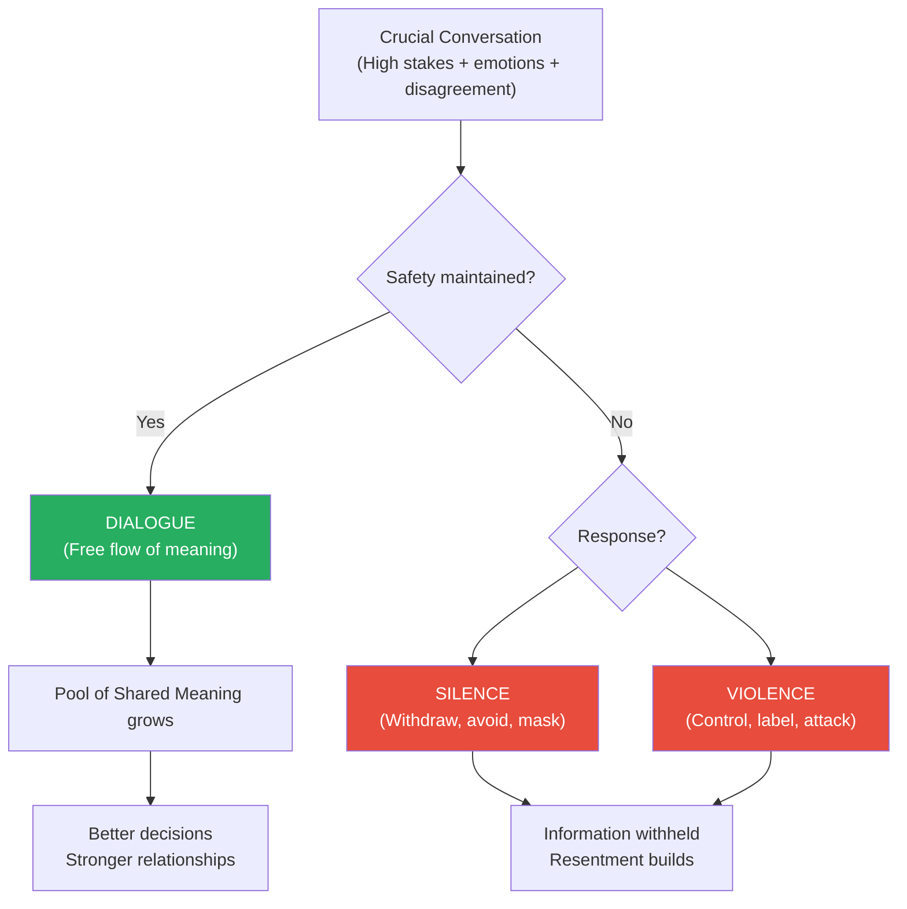
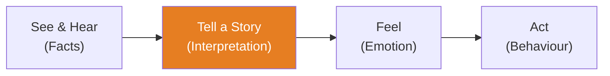

# Crucial Conversations — Kerry Patterson, Joseph Grenny, Ron McMillan & Al Switzler

> A crucial conversation is any discussion where three conditions collide: the stakes are high, opinions differ, and emotions run strong. These moments — asking for a raise, confronting a spouse's behaviour, challenging a boss's decision, addressing a team member's poor performance — define the trajectory of our careers and relationships.
> Most people handle them terribly: either avoiding them entirely (silence) or handling them with aggression (violence). Both destroy dialogue — the free flow of meaning between people — which is the only thing that produces good decisions and healthy relationships.
> This book teaches you how to hold these conversations effectively: how to stay in dialogue when every instinct screams at you to fight or flee.

---

## About the Authors
Kerry Patterson, Joseph Grenny, Ron McMillan, and Al Switzler are the founders of VitalSmarts (now Crucial Learning), a corporate training company. Their research involved observing thousands of people in crucial moments to identify what the most effective communicators do differently.

---

## The Big Idea

- <b style="color: #2980b9">Dialogue</b> = the free flow of meaning between two or more people
- When dialogue breaks down, decision quality collapses — because not all relevant information makes it into the <b style="color: #2980b9">Pool of Shared Meaning</b>
- Dialogue breaks down in two ways: <b style="color: #e74c3c">Silence</b> (withdrawing, avoiding, masking) or <b style="color: #e74c3c">Violence</b> (controlling, labelling, attacking)
- The best communicators keep dialogue open even under extreme pressure

---

## The Framework: How to Hold Crucial Conversations

### 1. Start with Heart

Before opening your mouth, clarify: <b style="color: #2980b9">What do I really want?</b> For myself? For the other person? For the relationship?

Most crucial conversations fail because people shift from wanting a good outcome to wanting to win, punish, or keep the peace. The authors call these **Sucker's Choices** — false dilemmas like "I can either be honest or keep a friend." The skilled communicator refuses the Sucker's Choice and asks: "How can I be both honest *and* respectful?"

### 2. Learn to Look

Watch for signs that safety is breaking down — in yourself and in others.

| Signal Type | Silence Forms | Violence Forms |
|-------------|---------------|----------------|
| **Mild** | Changing the subject, understating concerns | Sarcasm, subtle put-downs |
| **Moderate** | Withdrawing from conversation, going quiet | Raising voice, making accusations |
| **Severe** | Leaving the room, refusing to discuss | Personal attacks, ultimatums, absolute language ("you always," "you never") |

Also watch for your own **Stories Under Stress** — the narratives you construct that justify silence or violence:
- **Victim Story** — "It's not my fault"
- **Villain Story** — "It's entirely their fault"
- **Helpless Story** — "There's nothing I can do"

### 3. Make It Safe

When safety breaks down, <b style="color: #27ae60">step out of the content and restore safety</b>. This is the book's most counterintuitive insight: when a conversation is going badly, the fix is not to push harder on the content — it's to fix the conditions for dialogue.

Two conditions create safety:
- **Mutual Purpose** — "Do we both want the same outcome from this conversation?"
- **Mutual Respect** — "Do I value this person even when I disagree with them?"

If Mutual Purpose is at risk, use **CRIB**:
- **C**ommit to seek a mutual purpose
- **R**ecognise the purpose behind the strategy
- **I**nvent a mutual purpose
- **B**rainstorm new strategies

If Mutual Respect is at risk, look for what you genuinely respect about the other person before continuing.

### 4. Master My Stories

Between what happens and how we feel, there is a story we tell ourselves. The path:

We often skip straight from observation to emotion, unaware we've inserted a story. To master your stories:
1. Notice your behaviour — am I in silence or violence?
2. Identify your feelings — what emotions are driving this?
3. Analyse your stories — what story is creating these emotions?
4. Get back to facts — what did I actually see and hear, separated from my interpretation?

### 5. STATE Your Path

| Step | Action | Example |
|------|--------|---------|
| **S**hare your facts | Start with the least controversial, most objective information | "I've noticed you've been late to the last three meetings" |
| **T**ell your story | Explain the conclusion you've drawn from the facts | "I'm starting to wonder if these meetings aren't a priority for you" |
| **A**sk for others' paths | Invite the other person's facts and story | "I'd like to hear how you see it" |
| **T**alk tentatively | Present your story as a story, not as fact | "I'm starting to wonder if..." not "Obviously you don't care" |
| **E**ncourage testing | Make it safe for others to disagree | "I could be wrong. What am I missing?" |

The order matters. Facts first — they're the least likely to trigger defensiveness. Stories second — framed as stories, not accusations. Then invite the other person's perspective.

### 6. Explore Others' Paths

When the other person moves to silence or violence, use **AMPP**:
- **A**sk to get things rolling — "I'd really like to hear your concerns"
- **M**irror to confirm feelings — "You seem upset about this"
- **P**araphrase to acknowledge the story — "So you feel like the deadline was unrealistic from the start?"
- **P**rime when they won't open up — offer your best guess at what they're thinking

### 7. Move to Action

Dialogue without decisions is just therapy. End every crucial conversation with:
- <b style="color: #2980b9">Who does what by when?</b>
- <b style="color: #2980b9">How will we follow up?</b>

Four methods of decision-making:

| Method | When to Use | Speed | Buy-in |
|--------|-------------|-------|--------|
| **Command** | Low-stakes, expertise clear | Fastest | Lowest |
| **Consult** | Need input, one person decides | Fast | Moderate |
| **Vote** | Many options, efficiency matters | Moderate | Moderate |
| **Consensus** | High-stakes, full commitment needed | Slowest | Highest |

---

## The Pool of Shared Meaning — Why This All Matters

The central metaphor: every conversation has a **Pool of Shared Meaning** — the total information available to participants. The larger the pool, the better the decisions. Silence shrinks the pool (information is withheld). Violence poisons it (people stop contributing honestly). Dialogue expands it.

Organizations where crucial conversations are handled well make better decisions, implement faster, and have stronger cultures — not because they avoid conflict, but because they move *through* conflict productively.

---

## When Crucial Conversations Meet Games

The authors don't reference Berne, but the overlap is striking. Berne's "games" are what happens when crucial conversations are *avoided*. "Why Don't You—Yes But" is a failed crucial conversation where the player uses Silence (rejecting every suggestion) to avoid the real issue. "Now I've Got You" is Violence dressed up as justified anger. The STATE framework is essentially a method for staying in Berne's Adult ego state when every instinct pushes you toward Parent or Child.

---

## Strengths and Weaknesses

**Strengths:**
- The STATE framework is immediately actionable — you can use it in your next difficult conversation
- The silence/violence diagnostic is simple and accurate
- The insight about safety as a prerequisite for dialogue is profound
- The "Master My Stories" chapter is worth the price of the book alone

**Weaknesses:**
- Corporate-training prose can feel formulaic and sanitised
- Examples are heavily workplace-focused; personal relationships get less depth
- The CRIB acronym feels forced
- Doesn't adequately address power imbalances — it's much harder to "Make It Safe" when your boss holds your career in their hands

---

## The Verdict

*Crucial Conversations* is the most practical book on difficult communication available. The STATE framework alone transforms how you handle disagreements. The distinction between silence and violence gives you a real-time diagnostic for every conversation. Its weakness is corporate-training prose that can feel formulaic. But the underlying insight — that safety is the prerequisite for dialogue, and dialogue is the prerequisite for good decisions — is profound and universally applicable.

**Read this if:** You avoid hard conversations, or you have them but they always seem to go badly. If you're a manager, this is required reading.

**Skip this if:** You're looking for negotiation tactics rather than relationship-preserving dialogue skills. For that, read Chris Voss.

---

## Related Reading
- [[Games People Play - Eric Berne|Games People Play]] — What happens when dialogue fails and games take over
- [[Never Split the Difference - Chris Voss|Never Split the Difference]] — High-stakes negotiation with tactical empathy
- [[How to Win Friends and Influence People - Dale Carnegie|How to Win Friends]] — The warmth and respect that create safety
- [[Fierce Conversations - Susan Scott|Fierce Conversations]] — Conversations that confront reality while building relationships
