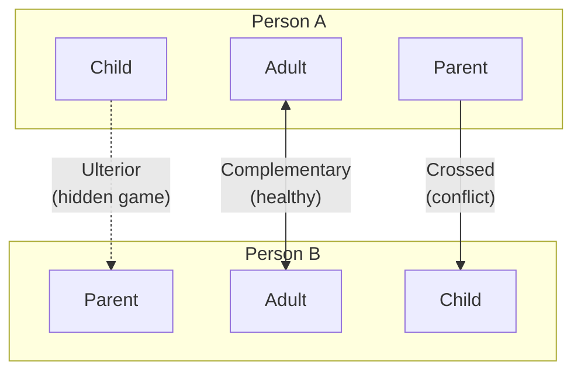
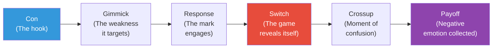

# Games People Play — Eric Berne

> Eric Berne's groundbreaking book reveals that most human social interaction is not what it appears to be on the surface. Beneath the polite exchanges of everyday life, people are engaged in repetitive psychological "games" — hidden transactions with concealed motives and predictable (usually negative) payoffs.
> The framework is Transactional Analysis: every person operates from three ego states (Parent, Adult, Child), and games occur when the visible transaction masks a hidden one operating at a different ego-state level.
> Published in 1964, it spent two years on the New York Times bestseller list and introduced terms like "strokes" and "life scripts" into popular vocabulary. It remains the most accessible introduction to the hidden dynamics of human communication.

---

## About the Author
Eric Berne (1910-1970) was a Canadian-born psychiatrist who developed Transactional Analysis as an alternative to traditional psychoanalysis. He wanted a framework simple enough for patients to use themselves.

---

## The Big Idea

- Every person has three <b style="color: #2980b9">ego states</b> active at all times:

| Ego State | Behaviour | Voice | Origin |
|-----------|-----------|-------|--------|
| **Parent** | Judgmental, nurturing, rule-setting | "You should," "Don't," "Let me help" | Absorbed from parents/authority figures |
| **Adult** | Rational, data-processing, objective | "The data suggests," "Let's analyse" | Developed through experience and reasoning |
| **Child** | Emotional, creative, rebellious, compliant | "I want," "I won't," "Wow!" | Preserved from childhood experiences |

- <b style="color: #27ae60">Complementary transactions</b> (Adult↔Adult, Parent↔Child) run smoothly
- <b style="color: #e74c3c">Crossed transactions</b> cause conflict and communication breakdowns
- <b style="color: #e74c3c">Ulterior transactions</b> are the basis of games — the visible message operates at one level while the real message operates at another

---

## The Game Formula

Every psychological game follows a predictable sequence:

Berne's insight: the payoff is always a familiar negative feeling — the player's favourite bad emotion. Games are played *precisely to collect this payoff*, not despite it.

---

## Common Games — A Field Guide

| Game | Surface Message | Hidden Message | Payoff |
|------|----------------|----------------|--------|
| **"Why Don't You—Yes But"** | "Please help me solve this problem" | "No solution will work — I want sympathy, not advice" | Confirming that no one can help (helplessness validated) |
| **"If It Weren't For You"** | "You're preventing me from doing X" | "I'm afraid to do X and need someone to blame" | Avoiding risk while blaming partner |
| **"Now I've Got You, You SOB"** | Waiting for the other person to make a mistake | "I need justification for my anger" | Righteous rage |
| **"Ain't It Awful"** | Discussing how terrible things are | "Let's bond over shared victimhood" | Avoiding responsibility to change |
| **"Wooden Leg"** | "What do you expect from someone with my handicap?" | "My limitation excuses everything" | Freedom from accountability |
| **"See What You Made Me Do"** | Blaming someone else for your mistake | "I can't be held responsible" | Deflected guilt |
| **"Schlemiel"** | Making messes and apologising profusely | "You have to forgive me — I said sorry" | Permission to be destructive |
| **"Rapo"** | Offering then withdrawing attention | "I can attract and reject at will" | Power and indignation |

---

## Games in Context — Where You See Them

### Marriage Games
Berne found that couples often select partners who will play complementary games. "If It Weren't For You" requires a domineering partner; "Frigid Woman/Man" requires a partner who can be blamed for emotional distance. Marriages often stabilise around interlocking game patterns — and destabilise when one partner stops playing.

### Workplace Games
"Why Don't You—Yes But" dominates meetings. "Now I've Got You" is the favourite game of certain managers who wait for subordinates to err. "Ain't It Awful" fills break rooms. "Harried" — the game of the perpetually overworked person who uses busyness to avoid other obligations — runs entire corporate cultures.

### Therapy Games
Berne was bracingly honest: patients play games in therapy too. "Psychiatry" is the game of collecting insights without changing. "Stupid" is the game of appearing incompetent to avoid responsibility. Therapists play "I'm Only Trying to Help You."

---

## Strokes — The Currency of Social Life

Berne proposed that humans have a fundamental need for recognition — he called units of recognition **strokes**. A stroke can be:
- **Positive** — a compliment, a smile, attention
- **Negative** — criticism, a sneer, an insult
- **Conditional** — given for what you do
- **Unconditional** — given for who you are

The critical insight: **negative strokes are better than no strokes at all.** People who cannot get positive attention will provoke negative attention rather than be ignored. This explains why games persist — they are reliable stroke-generating machines, even though the strokes are negative.

---

## Life Scripts

Beyond individual games, Berne proposed that people live out **life scripts** — unconscious life plans adopted in childhood based on parental messages. Scripts answer questions like:
- Am I a winner or a loser?
- Do I deserve love?
- How will my story end?

Games serve the script. Someone with a "loser" script plays games that confirm losing. Someone with a "helper" script plays games that confirm they're needed. The script provides the plot; games provide the scenes.

---

## The Path to Autonomy

Berne's endgame was not analysis but **autonomy** — the capacity for genuine, game-free living. Autonomy has three components:

- <b style="color: #27ae60">Awareness</b> — recognising which ego state you're in and which games you're playing
- <b style="color: #27ae60">Spontaneity</b> — choosing your response rather than running on automatic patterns
- <b style="color: #27ae60">Intimacy</b> — genuine, game-free exchange between people

Most people never reach autonomy because games, despite their negative payoffs, provide three things people crave:
1. **Structure** — they fill time with predictable patterns
2. **Strokes** — they guarantee attention
3. **Avoidance of intimacy** — they keep people at a safe emotional distance

---

## How to Stop Playing

1. **Name the game** — once you can see the pattern, it loses power
2. **Refuse the hook** — don't take the bait (the "Con" in the formula)
3. **Stay in Adult** — respond with facts and genuine questions rather than from Parent or Child
4. **Offer genuine strokes** — give and seek positive recognition so games become unnecessary
5. **Accept the discomfort of intimacy** — real connection feels risky precisely because there's no script

---

## Strengths and Weaknesses

**Strengths:**
- The taxonomy of games is permanently useful — you will recognise them everywhere
- The three ego states are intuitive and immediately applicable
- The stroke economy concept explains enormous amounts of human behaviour
- The game formula provides a diagnostic tool for any dysfunctional interaction

**Weaknesses:**
- Berne's clinical prose can be dry and detached
- Some of the specific game descriptions feel dated (gendered assumptions, 1960s cultural norms)
- The life scripts concept is underdeveloped compared to the game taxonomy
- Berne occasionally seems to enjoy cataloguing dysfunction more than offering solutions

---

## The Verdict

*Games People Play* is dated in style but timeless in insight. Once you learn to spot the games, you see them everywhere — in marriages, offices, friendships, and your own behaviour. The taxonomy of games is the book's permanent contribution. Its weakness is Berne's clinical prose, which can feel dry. But the framework — three ego states, three types of transactions, and games as the hidden currency of social life — is one of the most powerful lenses for understanding human behaviour ever developed.

**Read this if:** You want to understand why conversations keep going wrong in the same ways, why certain people always seem to end up in the same conflicts, or why you keep collecting the same bad feelings.

**Skip this if:** You want a warm, encouraging self-help book. Berne is a clinician, not a cheerleader.

---

## Related Reading
- [[Crucial Conversations - Kerry Patterson|Crucial Conversations]] — How to move from game-based to Adult↔Adult communication
- [[Emotional Blackmail - Susan Forward|Emotional Blackmail]] — Games as manipulation patterns
- [[Influence - Robert Cialdini|Influence]] — The compliance patterns that games exploit
- [[The Laws of Human Nature - Robert Greene|The Laws of Human Nature]] — Greene's character analysis through a different lens
