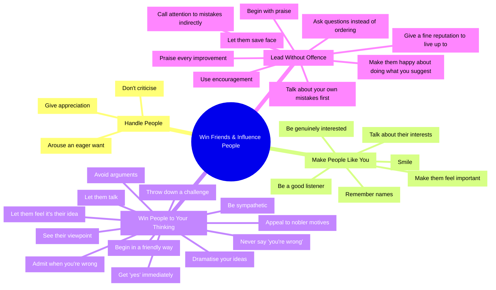
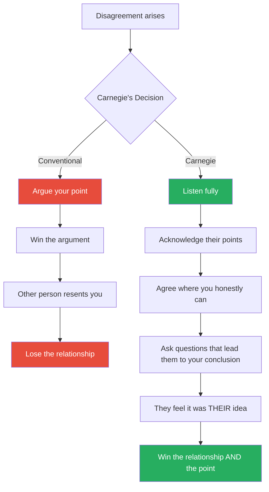

# How to Win Friends and Influence People — Dale Carnegie

> Published in 1936 and still in print ninety years later, Carnegie's masterwork is the original social skills manual — the book that taught the twentieth century how to get along with other people.
> Its thesis is disarmingly simple: you can get more of what you want by becoming genuinely interested in what other people want. Every person you meet is fighting for significance, approval, and the feeling of being important. Address that need sincerely, and they will like you, trust you, and cooperate with you. Criticise, condemn, or complain, and you will lose them.
> The thirty principles that follow are not tricks or techniques but habits of thought: habits of curiosity, of generosity, of listening, and of letting other people keep their dignity.
> It is the most widely read self-help book in history for a reason — it works, and it works because it is not about manipulation but about genuine human connection.

---

## About the Author

Dale Carnegie (1888-1955) was a Missouri farm boy who became America's most influential teacher of interpersonal skills.
After failing at cattle trading and acting, he began teaching public speaking classes at a YMCA in New York City — and discovered that what his students needed was not rhetorical technique but confidence and social skill.
He developed this book from fifteen years of research and real-world testing in those classes.
It has sold over 30 million copies and been translated into almost every language on earth.

---

## The Big Idea

- Carnegie's operating principle: <b style="color: #2980b9">every human being you meet is starving for appreciation and significance</b>
- This is not a minor social preference — it is one of the deepest drives in human nature
- William James: "The deepest principle in human nature is the craving to be appreciated"
- <b style="color: #e74c3c">Criticism destroys this need. Appreciation fulfils it.</b> Everything else in the book follows from this insight
- The thirty principles are thirty variations on a single theme: <b style="color: #27ae60">make the other person feel important — sincerely</b>

---

## Part 1: Fundamental Techniques in Handling People

### Principle 1: Don't Criticise, Condemn, or Complain

- Criticism is futile because it puts a person on the defensive and makes them strive to justify themselves
- <b style="color: #e74c3c">Al Capone</b> saw himself as a public benefactor, not a criminal. "Two Gun" Crowley said "Under my coat is a weary heart, but a kind one — one that would do nobody any harm." Even the worst among us justify their actions to themselves
- <b style="color: #2980b9">Abraham Lincoln</b> learned this the hard way: early in his career, his mocking public letter to a political rival nearly led to a sword duel. After that, he almost never criticised anyone — and his most famous act of restraint was a furious letter to General Meade after Gettysburg that he never sent
- "Any fool can criticise, condemn, and complain — and most fools do. But it takes character and self-control to be understanding and forgiving"

> [!danger] Before: Criticism
> "You always leave the kitchen a mess. I'm sick of cleaning up after you."
> Result: Defensiveness, resentment, and a dirtier kitchen.

> [!success] After: Carnegie's Approach
> Say nothing about the mess. Wait for a time the kitchen IS clean and praise it: "The kitchen looks fantastic — I love walking in to this."
> Result: The behaviour you praised gets repeated.

---

### Principle 2: Give Honest, Sincere Appreciation

- The difference between appreciation and flattery: appreciation is sincere, flattery is insincere
- <b style="color: #2980b9">Charles Schwab</b> was paid over a million dollars a year by Andrew Carnegie — not because he knew more about steel than anyone else, but because he knew how to deal with people
- Schwab: "I consider my ability to arouse enthusiasm among my people the greatest asset I possess, and the way to develop the best that is in a person is by appreciation and encouragement"
- <b style="color: #27ae60">The key word is "honest" — Carnegie despises empty flattery as much as he despises criticism</b>

---

### Principle 3: Arouse in the Other Person an Eager Want

- The only way to influence people is to talk about what THEY want and show them how to get it
- "Every act you have ever performed since the day you were born was performed because you wanted something"
- Carnegie quotes Henry Ford: "If there is any one secret of success, it lies in the ability to get the other person's point of view and see things from that angle as well as from your own"

---

## Part 2: Six Ways to Make People Like You

| # | Principle | The Core Behaviour |
|---|-----------|-------------------|
| 1 | Become genuinely interested in other people | Ask about their lives, their work, their passions — and actually care |
| 2 | Smile | A genuine smile says "I like you. You make me happy. I am glad to see you" |
| 3 | Remember names | A person's name is, to that person, the sweetest and most important sound |
| 4 | Be a good listener | Encourage others to talk about themselves — it's their favourite subject |
| 5 | Talk about the other person's interests | Find out what they care about and talk about THAT |
| 6 | Make the other person feel important — sincerely | This is the golden rule applied to every interaction |

> [!example] Teddy Roosevelt's Secret
> Roosevelt astonished his servants by knowing all their names and their personal circumstances. Before visiting his estate, he would ask his staff to brief him on what each servant had been doing.
> "It was easy to be fond of him," one valet recalled. He made everyone feel important — because he genuinely found them interesting.

> [!example] The $50 Steak Dinner
> Carnegie once sat next to a botanist at a dinner party and listened to him talk about exotic plants for hours, asking fascinated questions. The botanist later told the host that Carnegie was "most stimulating" and "a most interesting conversationalist."
> Carnegie had barely spoken a word all evening. He had simply listened.

---

## Part 3: How to Win People to Your Way of Thinking

### The Master Principle: You Cannot Win an Argument

- "You can't win an argument. If you lose it, you lose it; and if you win it, you lose it"
- Even if you prove the other person wrong with devastating logic, you have made them feel inferior — and they will resent you for it
- <b style="color: #27ae60">Carnegie's alternative: avoid the argument entirely. Let the other person save face. Agree with everything you honestly can. Promise to think over their points carefully. Thank them for the conversation.</b>

### The Socratic Method (Principle 5)

- Get the other person saying "yes, yes" from the start
- Begin with questions they must agree with, and build toward your conclusion
- By the time you arrive at the controversial point, they are already in a pattern of agreement

### Let Them Feel the Idea Is Theirs (Principle 7)

- No one likes to feel they are being sold or told
- People have much more faith in ideas they discover for themselves
- Instead of pushing your idea, ask questions that lead the other person to arrive at YOUR conclusion independently
- <b style="color: #2980b9">This is influence at its most effective — the other person does not feel influenced at all</b>

---

## Part 4: Be a Leader — How to Change People Without Giving Offence

*This section is Carnegie's leadership manual — how to correct, redirect, and improve people without making them hate you.*

### The Feedback Sandwich (Reinvented)

Carnegie's leadership sequence is more nuanced than the crude "praise-criticise-praise" sandwich:

1. **Begin with genuine praise** — find something honestly good about their work
2. **Mention your OWN mistakes** — "I made the exact same error when I started"
3. **Ask questions instead of giving orders** — "What do you think would happen if we tried it this way?"
4. **Let them save face** — never criticise in front of others
5. **Praise every improvement**, however slight — "That's much better than last time"
6. **Give them a reputation to live up to** — "You're one of our most reliable people; I know this was an off day"

> [!tip] The Carnegie Leadership Test
> Before correcting someone, ask: "Will this correction make them want to improve, or will it make them want to defend themselves?"
> If the answer is the latter, restructure your approach until the answer is the former.

---

## The Verdict

Ninety years after publication, Carnegie's book remains the most influential manual on interpersonal skills ever written.
Its staying power comes not from novelty but from the opposite — from articulating truths about human nature so fundamental that they were true in Lincoln's time, are true now, and will be true in a hundred years.

The principles are deceptively simple, which is both the book's strength and its limitation.
Critics dismiss it as obvious, as if "be interested in other people" and "don't criticise" required no instruction.
But the gap between knowing these principles and practising them is vast — and that gap is where most interpersonal failures live.

The book's weakness is its relentless positivity.
Carnegie sometimes glosses over situations where directness, confrontation, or honest disagreement are necessary and healthy.
The principles work beautifully for influence and leadership, but they can become a trap for people who avoid all conflict.

Pair it with [[Influence - Robert Cialdini|Influence]] for the science behind why these principles work, and with [[Never Split the Difference - Chris Voss|Never Split the Difference]] for a harder-edged toolkit that builds on Carnegie's foundation.

---

## Related Reading

- [[Influence - Robert Cialdini|Influence]] — The science behind Carnegie's liking, reciprocity, and commitment principles
- [[Pre-Suasion - Robert Cialdini|Pre-Suasion]] — Building receptivity before the message, as Carnegie builds rapport before the ask
- [[Never Split the Difference - Chris Voss|Never Split the Difference]] — Modern tactical empathy rooted in Carnegie's "see the other person's viewpoint"
- [[Power - Jeffrey Pfeffer|Power]] — A harder-edged view of influence that challenges Carnegie's optimism about sincerity
- [[What Every Body Is Saying - Joe Navarro|What Every Body Is Saying]] — The nonverbal signals that reveal whether Carnegie's principles are working
- [[The Charisma Myth - Olivia Fox Cabane|The Charisma Myth]] — Modern research supporting Carnegie's insights about presence and warmth
