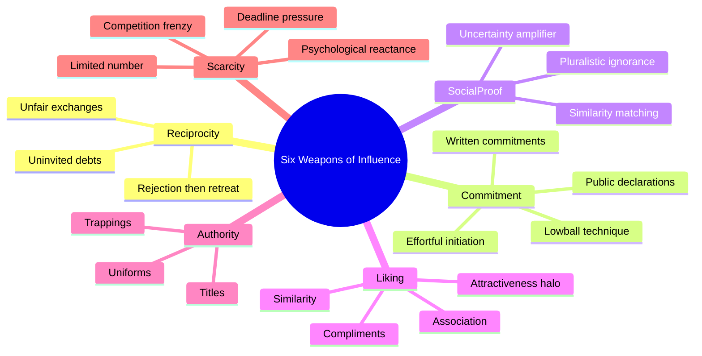
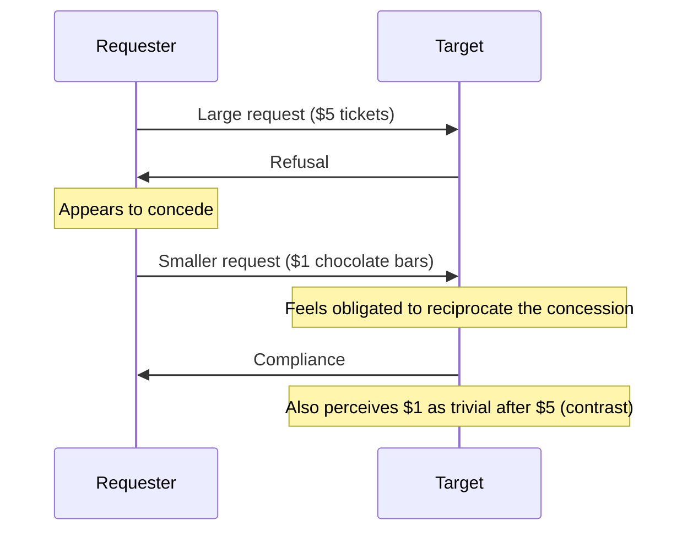
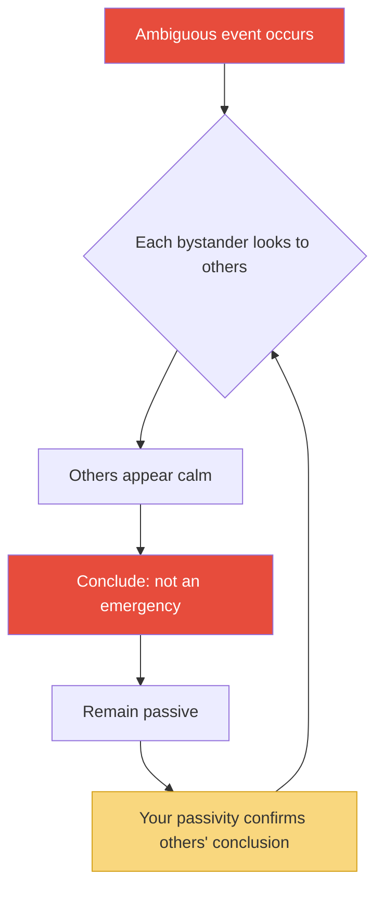
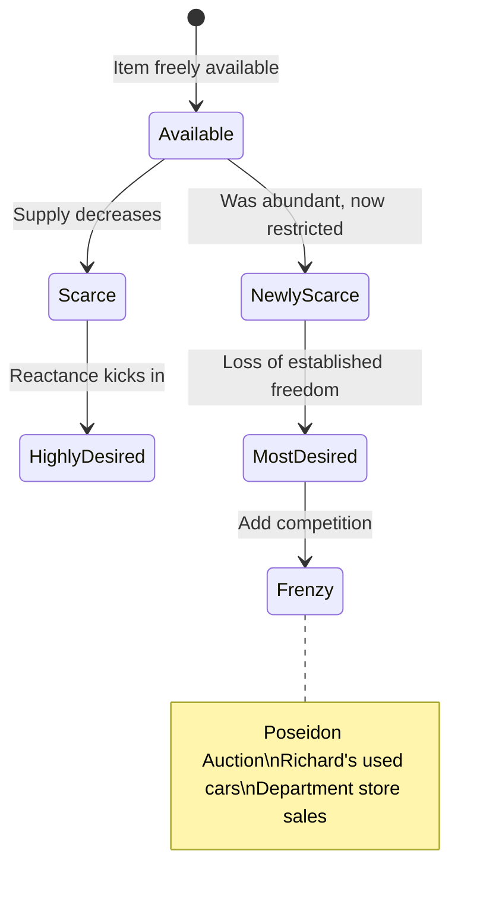

# Influence: The Psychology of Persuasion — Robert B. Cialdini

> Robert Cialdini spent three years undercover — posing as a sales trainee, a fundraiser, an advertising recruit — to answer a deceptively simple question: why do people say yes?
> What he found was that the thousands of tactics compliance professionals use to get their way nearly all reduce to six fundamental psychological principles, each exploiting the same basic human tendency: we rely on mental shortcuts to navigate an overwhelming world, and anyone who knows which shortcuts to trigger can make us comply without thinking.
> The result is the most important book on persuasion ever written — not because it teaches manipulation, but because it anatomises the automatic patterns that govern our decisions and shows exactly where we are vulnerable.
> Cialdini draws on ethology, social psychology, and his own fieldwork to build a framework that is simultaneously rigorous and readable, academic and street-smart.
> Every salesperson, negotiator, marketer, and self-aware human being should read it — and then read it again as a defence manual.

---

## About the Author

Robert B. Cialdini is Regents' Professor Emeritus of Psychology and Marketing at Arizona State University, where he spent his career studying the science of influence.
What makes him unusual among academics is his methodology: before writing this book, he spent three years infiltrating the world of compliance professionals through participant observation — answering newspaper ads for sales trainees, posing as an aspiring fundraiser, embedding himself in advertising and public-relations agencies.
The result is a book that combines the rigour of controlled experiments with the texture of firsthand field experience, a combination almost no one else in the persuasion literature has achieved.

---

## The Big Idea

- Cialdini's central insight is that human beings are <b style="color: #2980b9">shortcut machines</b>
- We live in an environment so complex and fast-moving that we cannot possibly analyse every decision fully
- Instead, we rely on automatic responses triggered by specific cues — what Cialdini calls <b style="color: #2980b9">click, whirr</b> patterns
- These patterns are usually adaptive: they save cognitive energy and produce correct decisions most of the time

---

- The problem is that these same shortcuts can be <b style="color: #e74c3c">exploited by anyone who knows which trigger to pull</b>
- Compliance professionals — salespeople, fundraisers, con artists, negotiators, advertisers — have discovered through trial and error which triggers produce automatic "yes" responses
- They structure their requests to engage these triggers, producing compliance that feels voluntary but is largely mechanical
- <b style="color: #27ae60">Understanding these six triggers is the single most important defensive skill a person can develop against unwanted influence</b>

---

- Cialdini draws an ethological parallel that runs through the entire book
- Just as a mother turkey responds to the "cheep-cheep" sound of her chicks rather than to the chicks themselves — and will mother a stuffed polecat that plays the sound while attacking her own silent chick — humans respond to <b style="color: #2980b9">trigger features</b> rather than to full situational analysis
- The six weapons of influence are the human equivalents of "cheep-cheep": they activate automatic compliance programs in our brains

The six principles are not independent — they combine and amplify each other in real compliance situations — but each is powerful enough on its own to produce compliance that the target would not otherwise give.

---

## Key Concepts at a Glance

| Principle | Trigger | Core Mechanism | Classic Example |
|-----------|---------|---------------|-----------------|
| **Reciprocity** | Receiving a gift or concession | Obligation to repay | Hare Krishna flowers |
| **Commitment & Consistency** | Making a small commitment | Internal pressure to stay consistent | Chinese POW essay contests |
| **Social Proof** | Seeing others do something | Assuming it must be correct | Canned laughter on sitcoms |
| **Liking** | Feeling affinity for the requester | Compliance follows liking | Tupperware party hostess |
| **Authority** | Perceiving expertise or rank | Automatic deference | Milgram shock experiments |
| **Scarcity** | Learning something is limited | Fear of losing out | "Only 2 left in stock" |

| Sub-Concept | One-line summary |
|-------------|-----------------|
| **Click, Whirr** | Automatic behaviour triggered by a single cue, without conscious deliberation |
| **Trigger Features** | The specific environmental cue that activates an automatic response |
| **Contrast Principle** | Presenting two things sequentially changes how we perceive the second |
| **Rejection-then-Retreat** | Large request → refusal → smaller request appears as a concession |
| **Foot-in-the-Door** | Small commitment → larger commitment via consistency pressure |
| **Lowball** | Secure commitment first, change terms later — the commitment holds |
| **Pluralistic Ignorance** | Everyone looks to everyone else for cues, and everyone concludes nothing is wrong |
| **Psychological Reactance** | When a freedom is threatened, we want it more than before |

---

## The Foundation: Weapons of Influence

*Before diving into the six principles, Cialdini establishes the operating system on which they all run: the human tendency toward automatic, shortcut-based responding.*

- The book opens with a story that captures the entire thesis in miniature
- A friend of Cialdini's owned an Indian jewelry store in Arizona and could not sell a batch of turquoise pieces despite prime tourist season, good quality, and reasonable prices
- In frustration, before leaving on a trip, she scrawled a note to her saleswoman: "Everything in this display case, price x ½"
- The saleswoman misread the scrawl and <b style="color: #2980b9">doubled the price instead</b>
- Every piece sold out — at twice the original price
- The tourists were using the shortcut <b style="color: #e74c3c">"expensive = good"</b> and the accidentally inflated price triggered a buying frenzy

> [!tip] Core Insight
> We navigate an overwhelmingly complex world using rules of thumb — mental shortcuts that usually serve us well. But these same shortcuts make us predictable and exploitable.

---

### The Contrast Principle

- Cialdini introduces a secondary weapon that amplifies several of the main six: the <b style="color: #2980b9">contrast principle</b>
- If we experience two things in sequence, the second is perceived as more different from the first than it actually is
- A $95 sweater seems cheap after a $495 suit
- A mediocre house seems wonderful after two deliberately terrible "setup" houses
- Car dealers add options one at a time after the big purchase — each $200 addition seems trivial against a $15,000 car

> [!example] Sharon's Letter
> A college student writes her parents about a skull fracture, pregnancy, and elopement — then reveals none of it is true. She just has a D and an F. "I want you to see those marks in their proper perspective."
> Cialdini's verdict: "Sharon may be failing chemistry, but she gets an A in psychology."

---

## 1. Reciprocation: The Old Give and Take

*The first and perhaps most powerful of the six weapons. When someone gives us something, we feel an overwhelming obligation to give back — even if we didn't ask for it, didn't want it, and don't like the giver.*

- The rule of reciprocity is universal across human cultures
- Anthropologist Richard Leakey: "We are human because our ancestors learned to share their food and their skills in an honoured network of obligation"
- The rule enabled the development of division of labour, trade, and cooperative systems that gave human societies their competitive advantage
- <b style="color: #27ae60">Because the rule is so socially valuable, we are trained from childhood to comply with it and to despise those who violate it</b> — "moocher" and "ingrate" are loaded terms in every culture

---

### Reciprocity Overpowers Liking

- In Dennis Regan's study at Cornell, a researcher's assistant ("Joe") either bought the subject a Coke or didn't, then asked them to buy raffle tickets
- Subjects who received the Coke bought <b style="color: #2980b9">twice as many tickets</b> — and this was true whether they liked Joe or not
- <b style="color: #e74c3c">The reciprocity rule completely wiped out the liking effect</b>
- People who disliked Joe but received his Coke bought just as many tickets as people who liked him

> [!warning] Key Implication
> People you dislike — unsavoury salespeople, disagreeable acquaintances, representatives of organisations you'd rather avoid — can dramatically increase your compliance simply by doing you a small favour first.

---

### Uninvited Debts: The Hare Krishna Strategy

- The Hare Krishnas discovered that their chanting, robes, and shaved heads repelled potential donors
- Their solution was brilliant: before asking for a donation, they pressed a "gift" — a flower or a book — into the target's hands
- The target was not allowed to return it: "No, it is our gift to you"
- The unsuspecting passerby was now caught by the reciprocity rule
- <b style="color: #2980b9">The flowers were so unwanted that people threw them in the trash within steps</b> — and one Krishna member's job was to walk the garbage route, retrieve the discarded flowers, and recycle them back to the solicitors
- Yet the donations kept coming, because the obligation had already been triggered

> [!example] The German Soldier and the Bread
> A WWI German soldier whose job was to capture enemy soldiers for interrogation surprised a lone enemy in his trench. The terrified captive, who had been eating, gave the German some of his bread. So affected was the German by this gift that he could not complete his mission and returned empty-handed to face his superiors' wrath.

---

### Rejection-then-Retreat: The Boy Scout Technique

- Cialdini was walking down the street when an eleven-year-old Boy Scout asked him to buy $5 circus tickets
- He declined
- The boy then said: "Well, if you don't want to buy any tickets, how about buying some of our big chocolate bars? They're only a dollar each"
- Cialdini bought two — and immediately realised what had happened
- He didn't like chocolate bars, he did like dollars, yet he was standing there with two chocolate bars and the boy was walking away with two dollars

- The <b style="color: #2980b9">rejection-then-retreat</b> technique combines two weapons:
  1. **Reciprocity of concessions** — the retreat from a large to a small request looks like a concession, triggering an obligation to concede in return
  2. **Contrast principle** — the smaller request looks even smaller by comparison to the larger one

---

### The Watergate Connection

- Cialdini argues that the rejection-then-retreat technique explains one of the most baffling political decisions in American history: the Watergate break-in
- G. Gordon Liddy's first proposal to the Committee to Re-elect the President was a <b style="color: #e74c3c">$1 million program</b> including a communications chase plane, kidnapping squads, a yacht with call girls for blackmail, and bugging
- Rejected. His second proposal: $500,000. Rejected again
- His third "bare-bones" plan: $250,000 for the Watergate break-in
- It was approved — even though it was still stupid, risky, and unnecessary
- Jeb Magruder's testimony: "After starting at the grandiose sum of $1 million, we thought that probably $250,000 would be an acceptable figure"
- <b style="color: #27ae60">Only Frederick LaRue, who had NOT been present for the first two proposals, objected</b> — he was the only one not under the spell of reciprocal concessions

> [!tip] How to Say No to Reciprocity
> Redefine the trigger. When you receive a favour, ask: was this a genuine favour or a compliance device? If the latter, you owe nothing. Accept the Coke. Enjoy it. But recognise the raffle tickets as a separate transaction. "Favours" from compliance professionals are not favours — they are investments. You are not obligated to return a profit on someone else's investment.

---

## 2. Commitment & Consistency: The Hobgoblin of the Mind

*Once we make a choice or take a stand, we encounter personal and interpersonal pressures to behave consistently with that commitment. Those pressures cause us to respond in ways that justify our earlier decision.*

- The drive for consistency is a central motivator of behaviour
- It provides a shortcut through complexity: once you've decided, you don't have to think about the issue again
- <b style="color: #e74c3c">But this same drive can be exploited by anyone who can get you to make a small initial commitment</b>

---

### The Chinese POW Camps: Commitment as Weapon

- During the Korean War, the Chinese took a radically different approach to managing American prisoners of war
- Instead of torture, they used a systematic program of small commitments designed to shift prisoners' self-image
- It began with trivially true statements: "America is not perfect, is it?" — no one could disagree
- Prisoners were then asked to write down ways in which America was not perfect
- These written statements were read aloud, broadcast on camp radio, and used in essay competitions
- <b style="color: #2980b9">The genius was that the prisoners were not coerced into saying anything untrue</b> — each step was a tiny, seemingly harmless escalation
- But the cumulative effect was devastating: the written, public commitments changed how the prisoners saw themselves
- A man who has written "America is not perfect" and heard his own voice say it on the radio has trouble maintaining a firm identity as an unshakeable patriot

> [!tip] Why Written Commitments Are More Powerful
> Writing creates a physical record that is hard to deny. It creates social proof of your position. And it requires more effort than speaking, which increases the commitment. The Chinese understood all three.

---

### The Foot-in-the-Door Technique

- Freedman and Fraser's landmark study: researchers posing as volunteers asked homeowners to install a huge, ugly "DRIVE CAREFULLY" billboard in their front yard
- Only 17% of homeowners agreed — unless they had first agreed to a tiny request two weeks earlier (displaying a small 3-inch sign)
- Those who had made the small commitment first agreed to the billboard at a rate of <b style="color: #2980b9">76%</b>
- The small sign had changed their self-image: they now saw themselves as the kind of people who support public-service causes

> [!danger] Before: No prior commitment
> Stranger asks you to put an ugly billboard in your yard. You say no (83% refusal rate).

> [!success] After: Small commitment made first
> You agreed to a tiny sign two weeks ago. Now the billboard request aligns with who you've become. You say yes (76% acceptance).

---

### The Lowball Technique

- Car dealers secure a commitment to buy at an attractive price, then "discover" an error — the price goes up
- By the time the real price emerges, the buyer has already mentally committed: they've filled out paperwork, imagined driving the car, told their spouse
- <b style="color: #e74c3c">The commitment survives the removal of the reason that created it</b>
- The buyer finds new reasons to justify the purchase — reasons that were not part of the original decision

> [!tip] How to Say No to Commitment Traps
> Ask yourself: "Knowing what I know now, if I could go back in time, would I make the same commitment?" If the answer is no, the commitment was manufactured, not genuine. Walk away.

---

## 3. Social Proof: Truth Is What Others Do

*When we are unsure what to do, we look to what other people are doing. The more people doing it, the more correct it seems. This principle is most powerful when we are uncertain and when the others are similar to us.*

- Canned laughter on television comedies works — even though everyone says they hate it
- Research shows that laugh tracks cause audiences to laugh longer, more often, and rate the material as funnier
- <b style="color: #2980b9">The effect is strongest for the weakest jokes</b> — precisely where the audience is most uncertain about whether something is funny
- This is social proof in its purest form: when we're not sure, we let others decide for us

---

### Pluralistic Ignorance: When Everyone Waits for Everyone Else

- The bystander effect is not caused by apathy — it's caused by social proof gone wrong
- In an ambiguous emergency, each bystander looks to the others for cues
- Everyone is trying to appear calm (because appearing panicked is socially costly)
- <b style="color: #e74c3c">The result: everyone concludes from everyone else's calm demeanour that there is no emergency</b>
- This is why Kitty Genovese was murdered in front of 38 witnesses who did nothing

> [!tip] How to Break Pluralistic Ignorance
> If you are the victim: single out ONE person, point directly at them, and give a specific instruction: "You in the blue jacket — call 911 now." This breaks the diffusion of responsibility and the social proof loop simultaneously.

---

### The Werther Effect: Copycat Behaviour

- After a front-page suicide story, the number of people who die in plane and car crashes increases dramatically — and the increase is proportional to the publicity the story receives
- Sociologist David Phillips showed this was not coincidence: the crashes involve people whose demographic profile matches the original suicide victim
- <b style="color: #2980b9">Social proof doesn't just guide trivial decisions — it can guide the decision to die</b>
- When uncertain, troubled people see someone like themselves choose death, a small but measurable number follow

---

## 4. Liking: The Friendly Thief

*We prefer to say yes to people we know and like. Compliance professionals exploit this by making themselves likable — or by harnessing existing bonds of friendship.*

- The Tupperware party is the quintessential American compliance setting
- It deploys nearly every weapon: reciprocity (gifts and prizes), commitment (public praise of products), social proof (others buying)
- But the real power comes from <b style="color: #2980b9">liking</b>: the purchase request comes not from a stranger but from a friend — the party hostess
- Research confirms: the strength of the social bond between hostess and guest is <b style="color: #27ae60">twice as likely to determine purchase as preference for the product itself</b>

---

### What Produces Liking

| Factor | Mechanism | Exploitation |
|--------|-----------|-------------|
| **Physical attractiveness** | Halo effect: good-looking = good | Sales staff selected for looks; con artists are handsome |
| **Similarity** | We like people who are like us | Salespeople mirror dress, interests, background |
| **Compliments** | We are "phenomenal suckers for flattery" | Joe Girard's 13,000 monthly "I like you" cards |
| **Familiarity** | Repeated contact breeds preference | Mere exposure effect; campaign advertising |
| **Association** | We connect messengers with their messages | Weathermen blamed for bad weather; celebrities endorse products |

---

### Joe Girard: The World's Greatest Car Salesman

- Joe Girard sold more than five cars and trucks every working day for twelve consecutive years
- The Guinness Book of World Records named him the world's greatest car salesman
- His formula: "A fair price and someone they liked to buy from. That's it."
- Every month, each of his 13,000+ former customers received a greeting card with a personal message
- The message never varied: <b style="color: #27ae60">"I like you"</b>
- It came twelve times a year, on a printed card that went to thirteen thousand other people too
- Yet it worked — because we are, in Cialdini's words, "phenomenal suckers for flattery," even when we know it's manufactured

---

### Good Cop/Bad Cop: Liking Through Contrast

- The technique works not primarily through fear (Bad Cop's threats) or reciprocity (Good Cop's favours) but through <b style="color: #2980b9">manufactured liking</b>
- Bad Cop creates a hostile environment; Good Cop appears as a saviour by comparison
- The suspect comes to see Good Cop as someone on his side, working together with him
- From saviour to trusted confessor is a short step
- This is liking + contrast + reciprocity combined in a single tactical sequence

> [!tip] How to Say No to Liking
> Separate the requester from the request. Ask: "Do I like this product/proposal on its merits, or do I like the person selling it?" If you find yourself liking a salesperson unusually quickly, that's not a sign they're wonderful — it's a sign they're skilled. The liking IS the technique.

---

## 5. Authority: Directed Deference

*We are trained from birth that obedience to legitimate authority is right. This deep conditioning makes us vulnerable to anyone who wears the symbols of authority — even when the authority is fake and the orders are dangerous.*

- Stanley Milgram's experiments at Yale are the centrepiece of this chapter
- Ordinary people were asked to deliver increasingly severe electric shocks to a "learner" (actually an actor) whenever he answered a question wrong
- The shocks escalated to 450 volts — well past the point where the "learner" was screaming, begging, and eventually falling silent
- <b style="color: #e74c3c">65% of subjects went all the way to the maximum shock</b>
- Not one person stopped before 300 volts
- Psychiatrists had predicted that only 1 in 1,000 would go to the end
- The subjects were not sadists — they trembled, sweated, bit their lips, dug their nails into their flesh
- But when the lab-coated researcher said "The experiment requires that you continue," they continued

---

### It's the Authority, Not the Person

- When the researcher and the "learner" switched roles — the researcher in the chair, the fellow subject giving orders — <b style="color: #2980b9">100% of subjects refused to continue</b>
- When two researchers gave contradictory orders, subjects were paralysed and begged them to agree
- The obedience was entirely directed at the authority figure, not at any personal desire to harm

---

### The Nurse Compliance Study

- Researchers called twenty-two hospital nurses' stations, identifying themselves as a physician the nurse had never met
- They ordered the nurse to administer <b style="color: #e74c3c">double the maximum daily dose</b> of an unauthorised drug (Astrogen) to a specific patient
- Four reasons existed for refusal: phone orders violated policy, the drug was unauthorised, the dose was dangerous, and the "doctor" was unknown
- <b style="color: #e74c3c">95% of nurses went immediately to the medicine cabinet to comply</b>
- They were stopped by a hidden observer before reaching the patient

> [!warning] The Researchers' Conclusion
> "In theory, there would be two professional intelligences working to ensure a procedure is beneficial to the patient. The experiment strongly suggests that one of these intelligences is, for all practical purposes, nonfunctioning."

---

### Symbols Over Substance

- Authority works through <b style="color: #2980b9">three symbols</b>: titles, clothes, and trappings

| Symbol | Evidence |
|--------|----------|
| **Titles** | A man introduced as a "professor" was perceived as 2.5 inches taller than when introduced as a "student" |
| **Clothes** | A man in a security guard's uniform got 92% compliance with odd requests; in street clothes, only 42% |
| **Trappings** | Motorists waited significantly longer before honking at a luxury car stopped at a green light than at an economy model |

- Robert Young (the actor who played Marcus Welby, M.D.) sold vast quantities of Sanka coffee by recommending it on TV — even though he was an actor, not a doctor
- The "bank examiner" con combines a business suit (authority clothes) with a guard's uniform (authority role) to steal elderly people's life savings

> [!tip] How to Say No to Authority
> Ask two questions: (1) "Is this authority truly an expert?" — focus on credentials, not symbols. (2) "How truthful can we expect this expert to be?" — consider their interests. A waiter who recommends a slightly cheaper dish is establishing trustworthiness so you'll trust his expensive wine recommendation.

---

## 6. Scarcity: The Rule of the Few

*Opportunities seem more valuable when their availability is limited. We are more motivated by the thought of losing something than by the thought of gaining something of equal value.*

- Cialdini opens with his own experience: he read that the inner sanctum of the Mesa, Arizona, Mormon temple — normally off-limits to non-Mormons — would be briefly open for tours after renovation
- He immediately resolved to visit — despite having zero prior interest in Mormon temples, architecture, or religion
- The sole cause of his desire was that the opportunity was about to disappear
- When a friend pointed this out, Cialdini laughed at himself and cancelled

---

### The Cookie Study: Scarcity's Core Truth

- Worchel's experiment: participants rated chocolate-chip cookies from a jar
- Cookies from a jar of 2 were rated significantly more desirable than cookies from a jar of 10
- Cookies that <b style="color: #2980b9">went from 10 to 2</b> (newly scarce) were rated highest of all
- Cookies made scarce because of <b style="color: #2980b9">social demand</b> ("we need to give some to other raters") were rated highest of all conditions
- <b style="color: #e74c3c">But the scarce cookies did NOT taste any better</b>

> [!warning] The Critical Distinction
> The joy is not in experiencing a scarce commodity but in possessing it. Scarce things do not taste or feel or sound or ride or work any better because of their limited availability. We must not confuse wanting to have something with wanting to use it.

---

### Psychological Reactance: Forbidden = Desired

- Psychologist Jack Brehm's theory: whenever a freedom is limited or threatened, we desire it more
- The "terrible twos" — children first developing a sense of autonomy fight against every restriction
- The <b style="color: #2980b9">Romeo and Juliet effect</b>: Colorado couples whose parents interfered in their relationship reported stronger love and greater desire for marriage; when interference weakened, romantic feelings cooled
- Banned information is believed more, even when the audience never receives it
- University of North Carolina students who learned a speech would be censored became more sympathetic to its argument — without ever hearing it
- Jurors told to disregard evidence of insurance used it MORE (awarding $46K vs $37K when told the same information without the ban)

---

### Revolution Theory: The Danger of Giving Then Taking

- James C. Davies' theory of revolution: revolts do not come from the perpetually oppressed
- They come from people whose <b style="color: #e74c3c">improving conditions suddenly reverse</b>
- The French, Russian, and Egyptian revolutions all followed periods of rising prosperity that were sharply curtailed
- American black riots of the 1960s occurred after two decades of dramatic economic and political gains — then a sudden reversal
- The Soviet coup of 1991 failed because Gorbachev had given freedoms through glasnost; when the junta tried to take them back, the people erupted
- <b style="color: #27ae60">Lesson for rulers: it is more dangerous to have given for a while than never to have given at all</b>
- Lesson for parents: inconsistent enforcement of rules creates established freedoms that become explosive when revoked

---

### Richard's Used Cars: Scarcity + Competition = Maximum Compliance

- Cialdini's brother Richard bought used cars cheaply and resold them at profit using pure scarcity psychology
- He placed a newspaper ad, received multiple calls, and <b style="color: #2980b9">scheduled every interested buyer for the same time</b>
- When the first buyer was examining the car leisurely, the second buyer arrived
- The first buyer's casual assessment suddenly became a now-or-never decision
- Richard would say to the second buyer: "Can I ask you to wait on the other side of the driveway until he's finished?"
- When the third buyer arrived, the first buyer either paid asking price or fled — and the second buyer pounced
- <b style="color: #e74c3c">The increased desire had nothing to do with the merits of the car</b>

> [!tip] How to Say No to Scarcity
> Use the arousal as your alarm. When you feel the rush of "I might lose this," stop. Ask: "Do I want this to own it or to use it?" If to use it, remember: scarce cookies don't taste any better. The function of the item is identical whether one exists or one million exist.

---

## The Verdict

Cialdini's *Influence* is one of those rare books that genuinely changes how you see the world — and once you see it, you cannot unsee it.
The six-principle framework is clean enough to remember and rich enough to apply to virtually every compliance situation you will ever encounter: sales pitches, negotiations, political messaging, charity appeals, romantic pursuit, parenting, advertising, and the daily social manoeuvring of office life.

The book's deepest contribution is not any single principle but the meta-insight that ties them together: we are shortcut machines operating in a world that increasingly demands shortcuts, and this makes us both efficient and exploitable.
The ethological framing — mother turkeys, trigger features, click-whirr — is not just a metaphor but a genuine theoretical lens that illuminates why these principles work at such a deep level.

Where the book falls short is in the defence department.
The "How to Say No" sections at the end of each chapter are useful but thin relative to the offence.
Cialdini tells you to "be alert" and "redefine the trigger" — good advice, but not as systematised as the attack side.
The book also does not explore the ethics of using these principles, treating them as neutral tools rather than engaging with the moral complexity of deploying them deliberately.

For anyone in business, negotiation, marketing, or leadership — or anyone who simply wants to understand why they keep saying yes when they mean no — this is required reading.
It pairs naturally with [[Pre-Suasion - Robert Cialdini|Pre-Suasion]] (Cialdini's sequel on setting up influence before the ask), [[Never Split the Difference - Chris Voss|Never Split the Difference]] (which applies many of these principles in negotiation), and [[Power - Jeffrey Pfeffer|Power]] (which examines how influence operates inside organisations).

---

## Related Reading

- [[Pre-Suasion - Robert Cialdini|Pre-Suasion]] — Cialdini's sequel on the moment before the message
- [[Power - Jeffrey Pfeffer|Power]] — How influence and reputation operate inside organisations
- [[Never Split the Difference - Chris Voss|Never Split the Difference]] — Tactical negotiation using reciprocity, liking, and commitment
- [[The 48 Laws of Power - Robert Greene|The 48 Laws of Power]] — Many laws are Cialdini's principles embedded in historical narrative
- [[Words That Change Minds - Shelle Rose Charvet|Words That Change Minds]] — Language patterns as trigger features for compliance
- [[Your Brain at Work - David Rock|Your Brain at Work]] — Why the brain needs shortcuts (the cognitive bandwidth argument)
