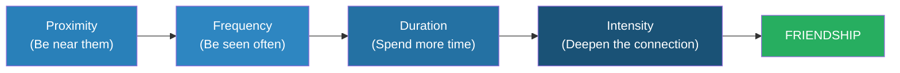

# The Like Switch — Jack Schafer

> Jack Schafer spent his FBI career building rapport with foreign spies, terrorists, and reluctant witnesses — people who had every reason not to trust him. The techniques he developed to flip enemies into allies are the same ones anyone can use to make friends, build relationships, and influence people in everyday life.
> The core framework is the Friendship Formula: Friendship = Proximity + Frequency + Duration + Intensity. Combined with specific "friend signals" that the brain reads unconsciously, you can systematically create liking in anyone.
> This is Carnegie's *How to Win Friends* filtered through FBI field experience and behavioural science.

---

## About the Author

Jack Schafer, PhD, is a former FBI Special Agent and current professor at Western Illinois University. He spent 15 years as a behavioural analyst for the FBI's National Security Division, where he developed rapport-building techniques for recruiting spies and extracting information from hostile subjects.

---

## The Big Idea

Rapport is not magic — it is a formula with four variables you can control.

**The Friendship Formula:** Friendship = Proximity + Frequency + Duration + Intensity

You build rapport by systematically increasing each variable, in order. Before any words are exchanged, your body sends **friend signals** or **foe signals** that determine whether the other person's brain classifies you as safe or threatening.

Schafer's most powerful demonstration: when tasked with recruiting a foreign spy, he spent **weeks** simply walking past the man's regular coffee shop — establishing proximity without threat. Then he started appearing more often (frequency). Then he lingered nearby (duration). Only when the man's brain had thoroughly classified him as non-threatening did Schafer make contact. The man eventually became an informant.

---

## Friend vs Foe Signals

Your brain sorts every person it encounters into one of three categories — friend, foe, or neutral — usually within seconds, based on nonverbal cues. These are survival responses, not conscious decisions.

| Signal | Friend | Foe |
|--------|--------|-----|
| **Eyebrows** | Quick flash (raise and lower) | Furrowed, compressed |
| **Head** | Tilted (exposes carotid artery = trust) | Straight or turned away |
| **Smile** | Genuine (eyes crinkle — Duchenne smile) | Absent or fake |
| **Torso** | Open, facing toward | Turned away, closed |
| **Touch** | Brief, appropriate | Absent or aggressive |
| **Eye contact** | Mutual, comfortable (1–2 sec) | Staring (>3 sec = threat) or avoiding |

The eyebrow flash is the most important. It is a universal, cross-cultural signal that says "I recognise you and I'm not a threat." It lasts about a quarter of a second. People who suppress it — or who don't return yours — are signalling caution or hostility.

---

## The Golden Rule of Friendship

**Make the other person feel good about themselves** — not about you.

This is the single most powerful rapport-building principle in the book. Every technique Schafer teaches serves this rule. People don't remember what you said. They remember how you made them feel. If they feel good about themselves when they're around you, they will want to be around you more.

How to apply it:

- **Empathic statements** — "So you must have felt really proud of that." (validates without interrogating)
- **Active listening** — Paraphrase what they said to show you were paying attention
- **Allow others to talk about themselves** — People's brains light up with dopamine when they talk about themselves
- **Genuine compliments** — Focus on effort and choices, not fixed traits

---

## The Laws of Attraction

Schafer identifies five laws that govern who we like and why:

| Law | Mechanism | How to Use It |
|-----|-----------|---------------|
| **Similarity** | We like people who are like us | Mirror their language, posture, pace, values |
| **Reciprocity** | We like people who like us | Show genuine interest and approval first |
| **Misattribution** | We credit arousal to the nearest person | Meet people during exciting or novel activities |
| **Curiosity** | We're drawn to what intrigues us | Be slightly unpredictable — break small patterns |
| **Scarcity** | We value what's rare | Don't be always available — create natural gaps |

The similarity principle is the most consistently powerful. Schafer recommends finding common ground quickly — shared experiences, mutual acquaintances, similar backgrounds — and making it explicit: "You're from Chicago too? I grew up on the South Side."

---

## Empathic Statements: The FBI's Conversational Weapon

Instead of asking questions (which trigger defensiveness and feel like interrogation), make statements that reflect the other person's observed emotional state:

- "It sounds like that was really difficult for you."
- "You seem really excited about this project."
- "That must have been a tough decision."

These accomplish three things simultaneously: they prove you're listening, they validate the person's experience, and they invite further disclosure without the pressure of a direct question. Schafer calls them the most powerful verbal tool in the FBI's rapport-building arsenal.

---

## Detecting Deception and Hostility

Schafer devotes a chapter to reading foe signals — the same skills in reverse:

- **Lip compression** — The lips disappear. Indicates withheld disagreement or hostility.
- **Jaw clench** — Tension. The person is restraining themselves.
- **Asymmetric expressions** — One side of the face shows an emotion the other doesn't. Indicates faking.
- **Eye-blocking** — Prolonged eye closure, looking away, or hand over eyes. The brain is trying to "block out" something unpleasant.
- **Distancing language** — "That woman" instead of a name. "It happened" instead of "I did it."

---

## The Seagull Principle

Schafer's favourite metaphor for the entire book:

Imagine feeding seagulls at the beach. At first they keep their distance — you're a potential threat. You toss bread far away from you. They eat it. You toss it a little closer. They come a little closer. Gradually, over many tosses, they eat from your hand.

Human rapport works exactly the same way. You start with non-threatening proximity, gradually increase frequency and duration, and only attempt intensity (deep conversation, personal disclosure) when the other person's brain has thoroughly classified you as safe.

Rushing this process triggers foe signals. Patience is the core skill.

---

## The Verdict

*The Like Switch* is a field-tested manual for building rapport. The Friendship Formula gives structure to what most people do intuitively but inconsistently. The FBI stories make the techniques memorable and lend them credibility that pure self-help books lack. It is lighter than Carnegie and more practical than most social skills books.

Weakness: some techniques feel manipulative when described clinically, the writing is occasionally repetitive, and the online relationships chapter has aged poorly.

**Start with:** The eyebrow flash (friend signal), empathic statements (conversational tool), and the Golden Rule (make them feel good about themselves). These three alone will improve every interaction you have.

---

## Related Reading

- [[How to Win Friends and Influence People - Dale Carnegie|How to Win Friends]] — The classic rapport-building manual that Schafer modernises
- [[What Every Body Is Saying - Joe Navarro|What Every Body Is Saying]] — Navarro's FBI body-language companion
- [[The Charisma Myth - Olivia Fox Cabane|The Charisma Myth]] — Warmth and presence as the internal state behind friend signals
- [[Influence - Robert Cialdini|Influence]] — The liking principle that the Like Switch exploits
- [[Never Split the Difference - Chris Voss|Never Split the Difference]] — Another FBI agent's communication playbook (negotiation focus)
