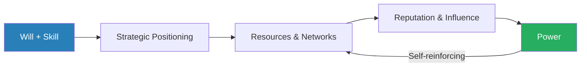
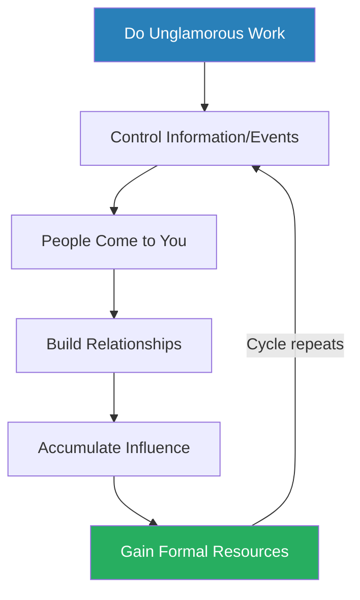
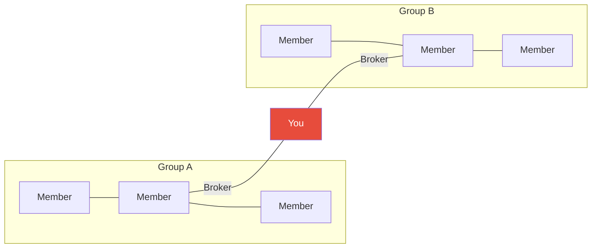
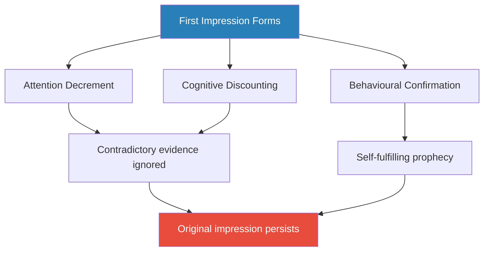
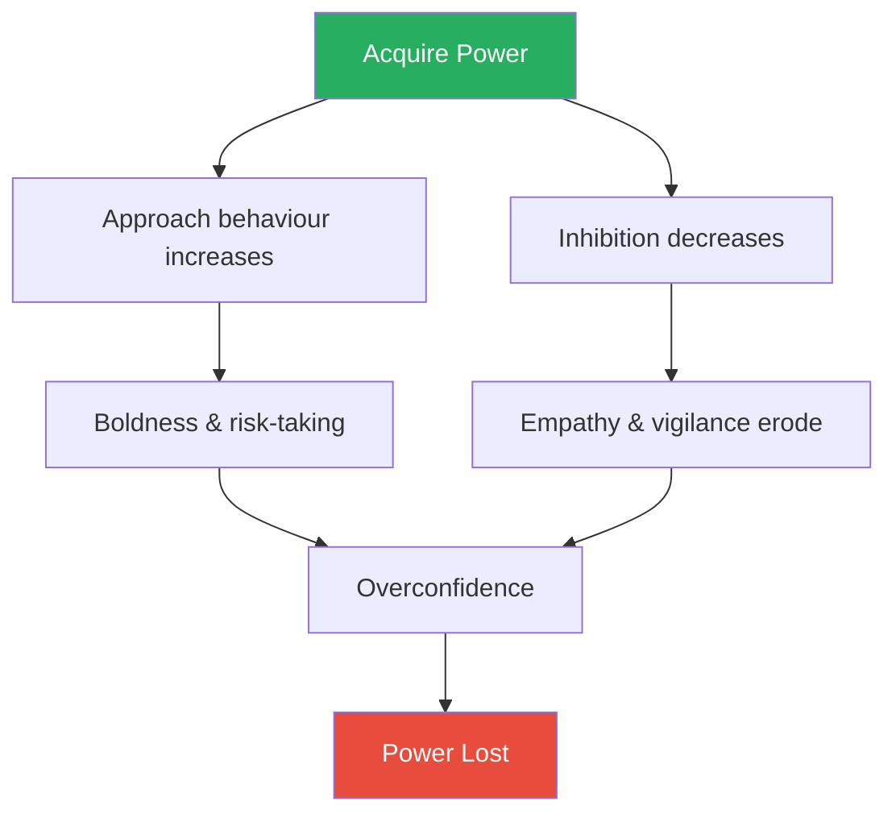

# Power: Why Some People Have It and Others Don't — Jeffrey Pfeffer

> Jeffrey Pfeffer's *Power* is a Stanford professor's uncomfortable empirical case that the world does not reward the best performers — it rewards those who understand how power works.
> Drawing on decades of organisational behaviour research, Pfeffer dismantles the myth that talent and hard work are sufficient for advancement, then builds a practical framework for acquiring, wielding, and keeping power.
> Where Robert Greene draws on 3,000 years of history, Pfeffer draws on peer-reviewed studies: the result is a book that feels less like a treatise on cunning and more like a diagnosis you cannot argue with.
> His central claim is blunt — job performance is weakly correlated with career outcomes, and those who treat organisations as meritocracies are systematically disadvantaged.
> The book is part argument, part manual, and entirely unsentimental.
> It is one of the rare books that treats power as an empirical phenomenon rather than a moral one, which makes it both more honest and more useful than most of its genre.

---

## About the Author

Jeffrey Pfeffer is the Thomas D. Dee II Professor of Organizational Behavior at the Stanford Graduate School of Business, where he has taught since 1979.
He has authored or co-authored fifteen books on organisational power, evidence-based management, and what he calls the "knowing-doing gap" — the persistent failure of organisations and individuals to act on what they already know.
His career has been spent in the empirical trenches of why smart, talented people get stuck while less capable but more politically astute colleagues advance past them.
*Power* is his most direct confrontation with the gap between what people believe about merit and what the evidence actually shows.
His work is grounded in research rather than historical narrative, which gives the book a distinctive flavour — less theatrical than Greene, less anecdotal than Carnegie, but more empirically rigorous than either.

---

## The Big Idea

- Pfeffer's central argument is that there is a <b style="color: #2980b9">performance-power disconnect</b> at the heart of organisational life
- Job performance explains surprisingly little of who gets promoted, who gets fired, and who accumulates influence
- The qualities that predict advancement — political skill, network position, willingness to self-promote, strategic positioning, and the ability to project confidence — are systematically different from the qualities that predict doing good work

---

- The reason most people fail to act on this is what Pfeffer calls the <b style="color: #2980b9">just-world fallacy</b>: the deeply held belief that the world is fundamentally fair, that good work will be noticed, and that merit will be rewarded
- This belief is psychologically comforting but empirically false
- It keeps people passive precisely when they should be building a power base
- <b style="color: #e74c3c">As long as you believe the system will recognise your excellence, you have no reason to take the uncomfortable steps required to make sure it does</b>

---

- Pfeffer's prescription is not cynicism but realism
- Power is a learnable skill set — a combination of <b style="color: #2980b9">will</b> (ambition, energy, focus) and <b style="color: #2980b9">skill</b> (self-knowledge, confidence, empathy, tolerance for conflict)
- The book systematically lays out the personal qualities, structural positions, behavioural tactics, and network strategies that produce power, then confronts the reader with the costs of wielding it
- <b style="color: #27ae60">The honest message is not "play politics and you will succeed" but "understand politics or you will certainly be passed over by those who do"</b>

Pfeffer's model is circular rather than linear — once you have power, it generates the resources and reputation that sustain it, creating a self-reinforcing cycle that is hard to break into from outside and hard to fall out of from inside.

---

## Key Concepts at a Glance

| Concept | One-line summary |
|---------|-----------------|
| **The Just-World Fallacy** | The belief that organisations are meritocracies, which keeps talented people passive |
| **Performance-Power Disconnect** | Job performance is weakly correlated with career advancement |
| **Will and Skill Model** | Two dimensions that distinguish power-builders: drive and political capacities |
| **Strategic Contingencies Theory** | Departments gain power by controlling critical resources and solving pressing problems |
| **The Resource-Power Cycle** | Resources beget power and power begets resources in a self-reinforcing loop |
| **Structural Holes** | The most powerful network position is bridging disconnected groups, not having the most connections |
| **Emotional Projection** | Anger signals competence and high status; sadness and guilt signal low status |
| **Reputation Persistence** | First impressions form in milliseconds and resist change through three reinforcing mechanisms |
| **The Price of Power** | Visibility, lost autonomy, damaged relationships, eroded trust, and addiction |

---

## It Starts with You: The Just-World Fallacy

*Pfeffer opens not with tactics but with a demolition of the assumption most professionals carry into working life — that the world is fair.*

- Pfeffer draws on the <b style="color: #2980b9">just-world hypothesis</b> from social psychology — the tendency, first described by psychologist Melvin Lerner, for people to believe that outcomes are deserved
- When someone succeeds, we assume they earned it
- When someone fails, we assume they had it coming
- This cognitive bias is not a minor quirk — it is the foundational barrier that prevents otherwise talented people from doing what is necessary to advance

The just-world belief produces two damaging effects:

- <b style="color: #e74c3c">It prevents you from learning from people you dislike or disapprove of</b>
  - If you believe a politically savvy colleague succeeded "unfairly," you dismiss their methods rather than studying them
  - You tell yourself their approach was beneath you, and in doing so you forfeit the chance to understand what actually worked
- <b style="color: #e74c3c">It makes you passive</b>
  - If you believe the system rewards merit, you wait for recognition rather than building the conditions that produce it

> [!tip] Core Insight
> The just-world fallacy is the foundational barrier to acquiring power. As long as you believe talent is sufficient, you will never take the steps required to make sure your talent is noticed.

> [!example] Beth — Credentials Without Strategy
> - Beth had White House experience, exceptional academic credentials, and a resume that should have produced a stellar career
> - She had everything except the willingness to engage in the political dimensions of organisational life
> - She believed that her work should speak for itself
> - It did not speak loudly enough, because no one was listening
> - Her career stalled not from lack of talent but from an operating assumption that talent was sufficient
> **The lesson:** Outstanding credentials are necessary but not sufficient — without political engagement, they go unnoticed.

> [!example] Jack Valenti — Thirty-Eight Years of Attentiveness
> - Valenti held his position as president of the Motion Picture Association of America for thirty-eight years
> - He succeeded not because he was the most brilliant policy mind in Washington, but because he was relentlessly attentive to the egos and interests of the studio heads who employed him
> - He flattered without shame, cultivated loyalty without reservation
> - He understood that his job was not merely to do good work but to make the people above him feel good about themselves and about having him in the role
> **The lesson:** Long-term power requires sustained attention to the people who grant it.

"Being good at your job is not enough," Pfeffer writes — a sentence that functions as the thesis statement for the entire book.

---

## Chapter 1: Performance Is Not Enough

*This chapter delivers the book's most provocative empirical claim — that performance explains far less about career outcomes than most people believe — and supports it with considerable evidence from organisational research.*

### The Commitment Bias

- A study by Schoorman demonstrated that supervisors rate employees higher when they were involved in hiring them — a <b style="color: #2980b9">behavioural commitment effect</b> that has nothing to do with actual performance
- Having invested their reputation in a hiring decision, managers are psychologically motivated to see that decision validated
- The person they chose must be good, because otherwise their judgement was poor
- This is not conscious deception — it is a cognitive bias that distorts evaluation at the source

### The Mere Exposure Effect

- Pfeffer draws on Robert Zajonc's <b style="color: #2980b9">mere exposure effect</b> — the robust cognitive finding that familiarity breeds preference — to argue that being visible to the right people is a separate, independent variable from being good at the work
- People do not evaluate what they have not seen
- Decision-makers cannot promote someone they do not recall
- <b style="color: #27ae60">Selection requires recall, and recall requires exposure</b>

The practical implication is stark: if you do excellent work that senior people never hear about, it counts for almost nothing in promotion decisions. "What is unseen counts for nothing," Pfeffer observes, and the phrasing is deliberately blunt.

---

### The "Foundation Guy" Trap

- Pfeffer describes a pattern he calls the <b style="color: #2980b9">"foundation guy" problem</b>
- In any building, the foundation is essential — without it, nothing stands
- But no one admires a foundation — no one photographs it, writes about it, or awards prizes for it
- <b style="color: #e74c3c">The person who does essential but invisible work is structurally critical but strategically invisible</b>
- He illustrates this with several examples of people who delivered outstanding operational results but were passed over for promotion because decision-makers simply did not associate them with high-profile achievements
- The work was done, the results were real, but the credit flowed elsewhere — to people who were visible in the right moments

> [!tip] Core Insight
> Performance is necessary but not sufficient. Visibility, framing, and strategic positioning determine which dimensions of your performance are noticed and valued.

### Defining the Dimensions of Performance

- Performance is multidimensional, and nobody excels on every dimension
- <b style="color: #27ae60">The strategic move is to foreground the dimensions where you are strongest and ensure those are the ones decision-makers associate with your name</b>

> [!example] Tina Brown at The New Yorker
> - Brown, as editor of The New Yorker, never made the magazine profitable
> - By any financial metric, her tenure was a failure
> - But Brown defined her success by circulation growth and media buzz — dimensions where she excelled — and the narrative stuck
> - She left The New Yorker with her reputation not merely intact but enhanced
> **The lesson:** You can control which criteria define your performance by framing the conversation around your strengths.

> [!example] Chris the Software Executive — Reframing Metrics
> - Chris was a software executive losing on market share but winning on deferred revenue growth
> - He shifted internal reporting to emphasise the metric where he was strongest
> - The board's perception of his performance changed — not because the underlying reality changed, but because the frame through which it was viewed changed
> **The lesson:** The metric you choose to highlight determines whether you look like a winner or a loser.

---

## Chapter 2: Will and Skill — The Personal Qualities That Produce Power

*Pfeffer identifies two meta-qualities that separate those who build power from those who do not — the drive to pursue it and the capacities to build it.*

### Will

- <b style="color: #2980b9">Will</b> encompasses ambition, energy, and the willingness to focus on a single goal with sustained intensity
- Without the drive to acquire power, no amount of technique matters
- Pfeffer is unromantic about this: some people want power and are willing to pay the costs; others want comfort, balance, or creative fulfilment
- Neither choice is wrong, but the book is addressed to the first group

Energy matters more than most people acknowledge:

- The people who build power tend to work longer, travel more, take more meetings, and show up at more events than their peers
- This is not a matter of intelligence — it is a matter of stamina and willingness to invest time in relationship-building rather than task execution alone

---

### Skill

<b style="color: #2980b9">Skill</b> encompasses four capacities:

| Capacity | What it means | Why it matters |
|----------|--------------|----------------|
| **Self-knowledge** | Honest assessment of strengths, weaknesses, and emotional triggers | Self-deception is one of the most common barriers to acquiring power |
| **Confidence** | Willingness to project authority before you fully feel it | Attitudes follow behaviour — act confident and you become confident |
| **Empathy** | Reading what others want and need | Intelligence about others' motivations lets you offer what they want in exchange for what you need |
| **Conflict tolerance** | Enduring interpersonal friction without withdrawing | Many talented people forfeit power because they cannot stomach disagreement |

- <b style="color: #e74c3c">Many talented people forfeit power not because they lack ideas but because they cannot stomach the discomfort of disagreement</b>
- They accommodate when they should hold firm, and they withdraw when they should advance
- Confidence draws on <b style="color: #2980b9">self-perception theory</b>: if you act confident, you begin to feel confident, and others respond to you as though you are confident, which reinforces the cycle

> [!tip] Core Insight
> Power requires both the drive to pursue it (will) and the capacities to build it (skill). Neither alone is sufficient — ambition without political intelligence is reckless, and intelligence without ambition is wasted.

### The Intelligence Trap

- Pfeffer notes that raw intelligence is overrated beyond a threshold
- High intelligence often produces arrogance, insensitivity, and overconfidence — qualities that alienate the very people whose support you need
- <b style="color: #27ae60">The most effective power-builders are not the smartest people in the room; they are the most politically intelligent</b>
- They read situations, not just data
- They understand people, not just problems

---

## Chapter 3: Choosing Where to Stand — Strategic Positioning

*Where you position yourself matters as much as what you do once you are there — and the counterintuitive move is often to join the rising department, not the dominant one.*

### Strategic Contingencies Theory

- Pfeffer draws on the <b style="color: #2980b9">strategic contingencies theory of departmental power</b> to argue that structural position shapes individual outcomes

Departments gain power through three mechanisms:

1. **Controlling critical resources** — budgets, headcount, information, access
2. **Solving the organisation's most pressing problems** — whoever fixes what keeps the CEO up at night gains disproportionate influence
3. **Unit cohesion** — departments that present a unified front wield more power than those fractured by internal competition

The counterintuitive insight:

- <b style="color: #e74c3c">The already-dominant department is often the worst platform for advancement</b>
- Established hierarchies have crowded talent pipelines and entrenched power structures
- The competition for each rung of the ladder is fierce, and the incumbents have every advantage

### The Rising Department Play

- A <b style="color: #2980b9">rising department</b> — one whose importance is growing but whose talent pipeline is thin — offers more visibility, less competition, and the exponential advantage of being a pioneer
- You get credit for building something, not just maintaining something

> [!example] Zia Yusuf at SAP — The Non-Technologist Who Rose to the Top
> - Yusuf was not a technologist — in a software company, that should have been a fatal disadvantage
> - Instead of competing in the crowded engineering hierarchy, he positioned himself in strategy and ecosystems
> - These were functions the company was beginning to need but had not yet filled with established leaders
> - He rose to near the top of SAP by occupying territory nobody else wanted until it became territory everyone needed
> **The lesson:** Pioneer an emerging function before the competition arrives.

> [!example] The Whiz Kids at Ford (Post-WWII)
> - After World War II, a group of young military planners joined Ford Motor Company
> - They were placed in finance and planning — areas the manufacturing-dominated company had undervalued
> - As Ford modernised, these functions became central
> - The Whiz Kids rode the wave to the top, including Robert McNamara, who became president before leaving for the Pentagon
> **The lesson:** Departments that are undervalued today may become central tomorrow — and being there early is a massive advantage.

> [!example] Ann Moore at Time Inc. — The Dead-End That Wasn't
> - Moore took on Sports Illustrated's circulation department — a role others considered a career dead end at a "dying" print property
> - She turned it into a platform for demonstrating business acumen
> - She eventually became CEO of Time Inc.
> - The move worked because she was the best person in an ignored space, not the fifteenth-best person in a prestigious one
> **The lesson:** Being the standout performer in a neglected area beats being average in a crowded one.

> [!tip] Core Insight
> The strategic move is to join a rising department — one growing in importance but thin on talent. You get pioneer credit, less competition, and compounding visibility.

But Pfeffer acknowledges the risk:

- SAP Markets, a division some employees joined hoping for pioneer advantage, was shut down entirely
- <b style="color: #e74c3c">Pioneers in departments that never actually rise gain nothing</b>
- The strategy requires accurate forecasting of where organisational importance is shifting — and that forecast can be wrong

---

## Chapter 4: Getting In — Standing Out and Getting Noticed

*Once you have chosen where to stand, you must be noticed by the people who matter — and the most effective way to do that is simply to ask.*

### Asking for What You Want

- One of the book's most practical points: <b style="color: #27ae60">people systematically underestimate how willing others are to help when asked directly</b>
- Research by Flynn and Lake showed that people overestimate the number of strangers they need to approach to get help by roughly two times

Asking works for several reinforcing reasons:

- **Flattery** — being consulted for help implies that you are important, knowledgeable, or generous
- **Norm of benevolence** — most people want to think of themselves as helpful, and saying no threatens that self-image
- **Reciprocity** — a favour granted creates a sense that a favour is owed, even if the granter does not consciously track the ledger
- **Social awkwardness of refusal** — saying no to a direct, sincere request is uncomfortable for most people, so they default to yes

> [!example] Keith Ferrazzi — Dinner with the Managing Partner
> - Ferrazzi, still a junior employee at Deloitte, demanded an annual dinner with the managing partner
> - The request was audacious, but it was granted
> - The partner was partly flattered, partly reluctant to refuse something so direct
> - Ferrazzi's directness signalled confidence and ambition — the very qualities senior leaders look for
> **The lesson:** Boldness in asking is often rewarded because refusal feels petty.

> [!example] Reginald Lewis and Harvard Law School
> - Lewis asked Harvard Law School for admission before formally applying
> - He called the admissions office and made his case directly
> - He was admitted
> - The request itself demonstrated the qualities — confidence, initiative, willingness to act — that the school was looking for
> **The lesson:** The act of asking can demonstrate the qualities the gatekeeper is looking for.

> [!example] Barack Obama — Senate Mentoring Requests
> - As a newly elected senator, Obama approached roughly a third of his Senate colleagues to ask for mentoring and advice
> - The requests were individually small but collectively powerful
> - They created relationships, generated goodwill, and positioned Obama as someone worth investing in
> **The lesson:** Many small requests build a broad network of goodwill more effectively than a few large ones.

"The worst they can say is no," Pfeffer writes — and even that outcome is far less common than most people expect.

---

### Standing Out

- In competitive environments, <b style="color: #e74c3c">blending in is a form of invisibility</b>
- Pfeffer argues that differentiation — doing something memorable, unexpected, or distinctive — is more important than doing something incrementally better than everyone else
- Marginal improvements are hard to notice
- <b style="color: #27ae60">Distinctiveness is impossible to miss</b>

> [!tip] Core Insight
> People systematically underestimate others' willingness to help. Ask directly, ask often, and ask the people who matter — the social cost of refusal works in your favour.

---

## Chapter 5: Creating Resources from Nothing

*You do not need to start with power to enter the resource-power cycle — resources can be created from initiative, consistency, and a willingness to do what others will not.*

### The Resource-Power Cycle

- <b style="color: #2980b9">Resources beget power, and power begets resources</b>
- Those who control budgets attract better talent, get better assignments, access better information, and compound their advantage
- The cycle is self-reinforcing and, once established, extremely difficult to break into from the outside

But Pfeffer insists you do not need to start with power to enter the cycle:

- Resources can be **created from almost nothing**: time, attention, small favours, unglamorous tasks, event organisation, information compilation
- <b style="color: #27ae60">Most people are lazy about the unglamorous work of organisational life</b>
- They skip the committee meetings, avoid the administrative tasks, and ignore the operational details
- This creates opportunities for those willing to do what others will not

The resource-power cycle can be entered from the bottom — small acts of initiative compound into formal authority over time.

### Small Favours and Reciprocity

- Helping others engages the <b style="color: #2980b9">norm of reciprocity</b>, and people do not precisely calculate the value received
- A small favour — answering a question, making an introduction, covering for someone — can produce disproportionate returns because the recipient remembers the act without accurately weighing its cost
- The helper who does many small things builds a reservoir of goodwill that can be drawn on when needed

> [!example] Willie Brown — Speaker Through Small Acts
> - Brown, the longest-serving Speaker of the California Assembly, built his power base partly through an accumulation of small acts of fairness and consideration
> - He listened to people and treated colleagues with respect regardless of party affiliation
> - He found safe seats for potential rivals, removing threats while creating debts
> - When Brown needed votes, he had a vast network of people who owed him
> - Not because he had done anything dramatic, but because he had been consistently helpful in minor ways over many years
> **The lesson:** Consistent small favours build a reservoir of goodwill that compounds into real power over time.

---

### Building from the Bottom

> [!example] Frank Stanton at CBS — Data Nobody Else Gathered
> - Stanton rose from a two-person research team to the vice presidency of CBS
> - His method was deceptively simple: he compiled audience data that no one else bothered to gather
> - The data itself was not revolutionary, but Stanton's willingness to do the work — and his control over the resulting information — made him indispensable
> - When executives needed numbers, they came to Stanton
> - When they came to Stanton, they built a relationship with him
> - When they had relationships with him, they thought of him for promotions
> **The lesson:** Controlling unglamorous but essential information makes you the person everyone needs.

> [!example] Klaus Schwab and the World Economic Forum
> - Schwab built the World Economic Forum from a single academic conference in Davos, Switzerland
> - He had no institutional backing, no budget, and no mandate
> - What he had was the initiative to organise a meeting, the discipline to make it excellent, and the patience to let it grow year by year
> - The Forum became powerful because Schwab was at its centre — and Schwab became powerful because the Forum was important
> **The lesson:** Initiative and consistency can substitute for formal authority — you do not need permission to create resources.

> [!tip] Core Insight
> You do not need to wait for someone to give you resources. Create them through initiative — gather data nobody else gathers, organise events nobody else organises, do work nobody else will do.

---

## Chapter 6: Networks and Structural Position

*The most powerful network position is not having the most connections but bridging groups that do not otherwise interact — controlling the flow of information between disconnected worlds.*

### Structural Holes and Brokerage

- Drawing on Ronald Burt's research in network theory, Pfeffer argues that the most powerful network position is <b style="color: #2980b9">bridging structural holes</b> — linking groups that do not otherwise interact
- A **structural hole** exists wherever two groups are disconnected
- The person who bridges that hole captures information from both sides, controls the flow of knowledge between them, and earns what Burt calls "brokerage fees" — the social capital that comes from being indispensable to communication

This is fundamentally different from conventional networking advice:

- Conventional advice emphasises the **quantity** of connections
- Pfeffer argues that <b style="color: #27ae60">a small number of connections spanning diverse, disconnected groups is far more valuable than a large number of connections within a single group</b>

The broker who bridges two disconnected groups controls the information flow between them — this structural position, not the number of connections, is the true source of network power.

> [!example] Henry Kissinger — Grand-Scale Brokerage
> - As National Security Advisor and then Secretary of State, Kissinger structured all foreign policy communication to flow through him
> - He was the only person who spoke to all parties in complex negotiations — the Soviets, the Chinese, the Vietnamese, the Israelis, the Arabs
> - Each side knew Kissinger; no side knew what the other sides were telling him
> - This information asymmetry was the foundation of his power — he could frame, filter, and sequence information to produce outcomes that suited his agenda
> **The lesson:** Controlling information flow between disconnected parties is one of the most potent forms of power.

> [!example] Kenji — Bridging Engineering and Business Development
> - Kenji, a manager at a Japanese utility company, bridged the gap between the company's engineering division and its international business development unit
> - The two groups rarely interacted
> - Kenji was the only person with deep relationships in both
> - When cross-functional decisions needed to be made, they went through Kenji — not because of his formal authority, but because of his structural position
> **The lesson:** You do not need a title to be powerful — you need a position that makes you indispensable to communication.

---

### Weak Ties

- Mark Granovetter's <b style="color: #2980b9">strength of weak ties</b> research underlies much of Pfeffer's networking advice
- Your close friends tend to know what you know and interact with the people you already interact with
- Your casual acquaintances — people you see at conferences, meet at events, or know through a friend of a friend — are far more likely to connect you to new information, new opportunities, and new networks

A critical finding:

- <b style="color: #e74c3c">Being one step removed from a broker confers almost no benefit</b>
- You must do the brokerage yourself
- The value lies in the position, not in proximity to it
- Knowing someone who bridges two worlds does not give you the information — it gives them the information, and you only receive whatever they choose to share

> [!tip] Core Insight
> Bridge disconnected groups rather than accumulating connections within a single group. The value of a network position lies in brokerage, not popularity.

---

## Chapter 7: Acting and Speaking with Power

*Behaviour and its perception form a self-reinforcing cycle — act confident and others attribute competence to you, which makes you more confident, which deepens the attribution.*

### Behaviour Creates Reality

- This chapter is built around a single, powerful mechanism: <b style="color: #2980b9">behaviour and its perception form a self-reinforcing cycle</b>
- Act confident, and others attribute competence to you
- When others attribute competence to you, they defer to you
- When they defer to you, you feel more confident
- The cycle escalates

Andy Grove's formulation captures the mechanism precisely: "Deception becomes reality."

- The word "deception" sounds cynical, but the psychology is straightforward
- Attitudes follow behaviour — a finding from <b style="color: #2980b9">self-perception theory</b>
- <b style="color: #27ae60">If you act as though you are powerful, you begin to believe it, and so does everyone around you</b>

### Anger Signals Status

- Pfeffer draws on research by Larissa Tiedens showing that <b style="color: #2980b9">anger signals high status</b> while sadness and guilt signal low status
- In experimental settings, people attributed more competence, more leadership potential, and higher salary expectations to individuals who expressed anger rather than remorse — even when the underlying situation was identical

This is not a recommendation to throw tantrums:

- The person who apologises profusely is read as submissive
- <b style="color: #27ae60">The person who expresses controlled displeasure is read as powerful</b>
- "Hierarchy is ubiquitous and power struggles are a fact of life," Pfeffer writes — and emotional display is one of the arenas in which those struggles play out

---

### Two Presentations, Two Outcomes

> [!example] Oliver North's Congressional Testimony (Iran-Contra)
> - North was testifying about the Iran-Contra scandal — he had participated in illegal arms sales and had shredded documents to cover his tracks
> - His situation was, objectively, catastrophic
> - But North appeared in full military uniform, spoke with conviction, and showed no remorse
> - He framed himself as a patriot who had done what was necessary
> - The public responded with admiration — he was convicted of felonies, but polls showed Americans wanted to hire him
> **The lesson:** Defiant behaviour is read as confidence in your own position, even when your position is weak.

> [!example] Donald Kennedy's Press Conference (Stanford Overbilling)
> - Kennedy, the president of Stanford University, held a press conference about the university's overbilling of federal research grants
> - His situation was objectively far less serious than North's — an administrative error, not a crime
> - But Kennedy was apologetic, contrite, and self-deprecating
> - He took full responsibility and expressed genuine remorse
> - The press destroyed him, and he resigned
> **The lesson:** Apologetic behaviour is read as an admission of serious wrongdoing, even when the wrongdoing is minor.

Same type of crisis. Opposite presentations. Opposite outcomes.

- <b style="color: #e74c3c">The mode of your response shapes how others interpret the severity of the situation</b>
- Apologetic behaviour amplifies perceived seriousness
- Defiant behaviour diminishes it

> [!tip] Core Insight
> Behaviour creates its own reality. Act powerful and you become powerful — not through deception, but through the self-reinforcing cycle of confidence, deference, and attribution.

---

### Speaking Techniques

- Pfeffer cites Max Atkinson's research on the specific techniques that make speakers compelling:

> [!abstract] Atkinson's Persuasive Speaking Techniques
> - **Us-vs-them framing** — creating a shared identity with the audience
> - **Strategic pauses** — silence commands attention and implies authority
> - **Lists of three** — the human brain finds triads satisfying and memorable
> - **Contrastive pairs** — "not X but Y" structures that clarify through opposition
> - **Speaking without notes** — the appearance of spontaneous command signals mastery

- These are not tricks — they are the empirical patterns of how persuasive communication actually works, distilled from analysis of speeches, presentations, and public performances

---

## Chapter 8: Reputation — The Self-Reinforcing Asset

*First impressions form in milliseconds and are maintained by three reinforcing mechanisms that make them extraordinarily resistant to change — understanding this is essential to both building and protecting your reputation.*

### The Speed of Impression Formation

- First impressions form in milliseconds
- Pfeffer cites Nalini Ambady and Robert Rosenthal's <b style="color: #2980b9">thin-slice research</b> showing that people watching a few seconds of silent video of a teacher could predict that teacher's end-of-semester evaluations with surprising accuracy
- The judgement is fast, automatic, and remarkably durable

### Why Reputations Persist

Once formed, reputations are maintained by three mechanisms that work together:

- <b style="color: #2980b9">Attention decrement</b> — once people have categorised you, they stop watching closely
  - New information is not processed with the same attention as first-impression information
  - You could improve dramatically, but if no one is paying close attention, the improvement goes unnoticed
- <b style="color: #2980b9">Cognitive discounting</b> — when information inconsistent with the existing impression does arrive, it is dismissed as noise
  - "That is not like them," people say, and the contradictory data point is explained away rather than incorporated
  - The existing mental model is protected rather than updated
- <b style="color: #2980b9">Behavioural confirmation</b> — perhaps the most insidious mechanism
  - People create conditions that make their initial impression come true
  - A manager who expects poor performance from an employee gives that employee harder assignments, less support, and fewer opportunities to succeed
  - This produces the poor performance the manager expected — the prophecy fulfils itself

These three mechanisms create a near-impenetrable shield around initial impressions, making reputation change in place extremely difficult.

> [!tip] Core Insight
> If you have an image problem in a particular context, it may be more efficient to leave and start fresh than to try to repair the reputation in place. A new environment gives you a new first impression — and first impressions are what persist.

---

### Institutional Reputation

- The <b style="color: #2980b9">GE executive pipeline</b> illustrates reputation at the institutional level
- A study found that former GE executives hired as CEOs at other companies generated an average of $1.1 billion in market capitalisation gain on the day of the announcement alone — before they had done a single day of work
- That gain was not a reflection of their individual competence
- It was the market pricing in the reputation of the GE management system
- <b style="color: #27ae60">The executives benefited from a halo that had nothing to do with their personal track record and everything to do with where they had been trained</b>

### Strategic Reputation-Building

> [!example] Bill Walsh — "The Genius" (San Francisco 49ers)
> - Walsh was known as "The Genius" — a label he cultivated through media relationships and a willingness to be quoted
> - His actual win-loss record was lower than that of John Madden, who coached the Raiders
> - But Walsh controlled his narrative, and the narrative stuck
> - He was never fired despite stretches of poor performance, because his reputation insulated him
> **The lesson:** Reputation is not a reflection of performance — it is a separate asset that must be deliberately constructed and maintained.

> [!example] Marcelo — The Twenty-Three-Year-Old CFO-in-Waiting
> - A young Brazilian executive named Marcelo built a CFO reputation through strategic media cultivation beginning at age twenty-three
> - He wrote articles, gave interviews, and positioned himself as an expert long before he had the grey hair traditionally associated with financial authority
> - By the time he reached senior roles, the reputation had preceded him
> **The lesson:** You can build a reputation before you have the credentials to "deserve" it — and the reputation itself accelerates the credentials.

---

## Chapter 9: Overcoming Opposition

*When facing resistance, the winning strategy is not a single decisive battle but persistence across multiple fronts — draining opponents' finite energy while your power base grows.*

### Persistence Across Multiple Fronts

- When facing resistance, Pfeffer counsels persistence, strategic patience, and <b style="color: #2980b9">advancing on multiple fronts simultaneously</b>
- The logic is straightforward:
  - Opponents have finite energy and attention
  - If you advance on three fronts, they must choose where to resist
  - Wherever they do not resist, you gain ground
- Time and persistence change the landscape:
  - Opponents leave
  - Priorities shift
  - Your power base grows

> [!example] Laura Esserman — Transforming Breast Cancer Care at UCSF
> - Esserman, a surgeon at UCSF, spent a decade transforming how breast cancer patients are treated
> - When she encountered resistance from the surgical establishment — turf wars, entrenched protocols, colleagues who saw her reforms as threats — she did not fight head-on
> - She built a national reputation through research and advocacy
> - She created a patient community that gave her a constituency independent of hospital politics
> - She worked on systemic change — clinical trials, federal guidelines, insurance reimbursement — that made her local opponents' resistance irrelevant
> - Power from one domain (research reputation) was leveraged in another (hospital politics)
> - When opponents tried to marginalise her within UCSF, she had an external power base they could not touch
> **The lesson:** Build power in a domain your opponents cannot reach, then use it to make their resistance irrelevant.

---

### Coopting Rather Than Conquering

- <b style="color: #27ae60">Opposition is often not ideological but positional — people oppose you not because they disagree with your agenda but because your success blocks their advancement</b>
- Give them an alternative path to success, and the opposition evaporates

> [!example] Willie Brown — Sixteen Years as Speaker
> - Brown maintained his position as Speaker of the California Assembly for sixteen years — an extraordinary run in a legislature full of ambitious politicians
> - One of his key tactics was **cooption**: rather than fighting rivals, he found them safe seats in other districts or appointed them to committee chairs that kept them busy
> - He transformed potential enemies into grateful allies by giving them something worth more than the fight
> **The lesson:** Convert opponents into allies by giving them an alternative path to what they want.

### Lalit Modi and the IPL

> [!example] Lalit Modi — The Fait Accompli (Indian Premier League)
> - Modi moved fast — launching the IPL before the established Board of Control for Cricket in India could organise resistance
> - By the time the old guard understood what was happening, the new league had its own momentum, its own sponsors, and its own audience
> - The fait accompli changed the terms of the debate from "should this happen?" to "how do we manage what has already happened?"
> **The lesson:** Acting before opponents can react shifts the debate from permission to management.

### Gary Loveman at Caesars

> [!example] Gary Loveman — Investing in Uncomfortable Relationships
> - Loveman, the Harvard Business School professor who became CEO of Caesars Entertainment, had strained relationships with certain board members
> - He invested disproportionate energy in managing those specific relationships — not because he liked the people, but because losing them would have cost him his position
> - The willingness to invest in uncomfortable relationships, rather than retreating to comfortable ones, is a distinguishing feature of people who hold power
> **The lesson:** Power requires investing most heavily in your most difficult relationships, not your most comfortable ones.

> [!tip] Core Insight
> Persistence across multiple fronts drains opponents' finite energy. Time changes the landscape — opponents leave, priorities shift, and your power base grows while theirs shrinks.

---

## Chapter 10: The Price of Power

*Pfeffer is unusually candid about the costs of power — and this honesty distinguishes his book from more breathless treatments of the subject.*

### Five Costs

| Cost | What happens | Why it matters |
|------|-------------|----------------|
| **Visibility** | Everything from your schedule to your lunch choices gets watched | The higher you rise, the less privacy you have — any misstep is amplified |
| **Loss of autonomy** | Your time belongs to your obligations, not to you | The freedom that power supposedly provides is one of the first things it destroys |
| **Relationships suffer** | Power-building competes directly with personal life | This cost falls disproportionately on women but is real for everyone |
| **Trust erodes** | Subordinates flatter, peers undermine, superiors replace | The isolation of power is not metaphorical — it is structural |
| **Addiction** | Power produces physiological and psychological dependence | Losing power produces something resembling withdrawal — devastating, not merely disappointing |

- <b style="color: #e74c3c">The powerful person's calendar is not their own — it is a political document</b>, filled with meetings they must take and events they must attend
- The rush of status, control, and deference is literally addictive — which means that losing power produces something resembling withdrawal
- <b style="color: #e74c3c">People who have held power and lost it often describe the experience as devastating, not merely disappointing</b>

> [!tip] Core Insight
> Most people pursue power without understanding what it will take from them, and then feel surprised when the bill arrives. Decide whether the benefits are worth the costs before you pay them.

### Should You Pay the Price?

- Pfeffer does not answer this question for the reader
- He presents the costs honestly and lets each person decide whether the benefits are worth what must be given up
- <b style="color: #27ae60">His point is that most people do not think about the costs in advance</b> — they pursue power without understanding what it will take from them, and then feel surprised or resentful when the bill arrives

---

## Chapter 11: How Power Is Lost

*The very qualities that help you acquire power — vigilance, empathy, attention to the political landscape — are systematically eroded by holding it, creating the conditions for your own downfall.*

### Keltner's Approach-Inhibition Theory

- Drawing on Dacher Keltner's research, Pfeffer describes how power systematically changes the psychology of those who hold it
- Power increases <b style="color: #2980b9">approach behaviour</b> — boldness, risk-taking, action, willingness to speak first and act decisively
- Simultaneously, it decreases <b style="color: #2980b9">inhibition</b> — caution, empathy, self-monitoring, attention to others' reactions
- <b style="color: #e74c3c">The result is that the very qualities that help you acquire and sustain power are systematically eroded by holding it</b>
- The powerful person becomes overconfident, insensitive, and blind to shifting dynamics precisely when those qualities are most dangerous

Power creates a psychological trap: the qualities that helped you gain it are the first casualties of holding it.

### The Berkeley Cookie Study

> [!example] The Berkeley Cookie Study — Trivial Power, Real Effects
> - Researchers randomly assigned participants to three-person groups and designated one person as the "leader"
> - The groups were given a plate of cookies
> - The randomly assigned leaders ate more cookies, chewed with their mouths open, and left more crumbs than the other participants
> - The effect was produced by nothing more than a random assignment and a label
> - The leaders had done nothing to earn their position and had no real authority
> - But the mere experience of being told they were in charge changed their behaviour — making them less considerate, less self-monitoring, and more entitled
> **The lesson:** If trivial, random power does this, imagine what years of real, earned power does.

---

### Robert Moses and the Parking Lot

> [!example] Robert Moses — The Parking Lot That Ended an Era
> - Moses dominated New York City and State politics for decades — building bridges, highways, parks, and housing projects with an iron hand
> - His power seemed unassailable
> - But he lost his aura of invincibility over a dispute about a single acre of parkland in Manhattan that he wanted to use for a parking lot
> - The issue was objectively trivial
> - But Moses had failed to recognise that social norms had changed beneath him:
>   - A generation of New Yorkers who had once been grateful for his parks were now protective of them
>   - Environmentalism had shifted the political landscape
>   - Community groups had gained organisational sophistication
> - Moses fought the parking lot battle with the same imperious tactics that had worked for thirty years — and lost
> **The lesson:** Power holders who stop paying attention to shifting dynamics become vulnerable to defeats on issues they consider trivial.

### Robert Nardelli at Home Depot

> [!example] Robert Nardelli — Contempt for Constituencies
> - Nardelli, the CEO of Home Depot, held a shareholder meeting at which he limited questions, imposed strict time limits on speakers, and surrounded himself with security
> - The message was unmistakable: he did not consider shareholders worth engaging with
> - The resulting public backlash cost him his position
> - Home Depot's financial performance under his leadership was respectable — his error was not incompetence
> - His error was that he had become so accustomed to wielding power that he forgot the basic requirement of maintaining legitimacy
> **The lesson:** Power that is visibly contemptuous of its constituencies destroys the consent on which it depends.

> [!tip] Core Insight
> Power systematically erodes the vigilance, empathy, and self-awareness that helped you acquire it — creating the conditions for its own destruction. The only defence is conscious, sustained effort to maintain those qualities.

### How to Hold On

- Pfeffer identifies people who held power for extended periods without falling victim to these dynamics:
  - **Jack Valenti** lasted thirty-eight years at the MPAA
  - **Willie Brown** served sixteen years as Speaker
  - **Safra Catz** at Oracle maintained her position for years despite working under the notoriously ego-driven Larry Ellison — by never upstaging him, never claiming credit that could have been his, and consistently demonstrating loyalty

The common pattern among those who keep power:

- <b style="color: #27ae60">They remain vigilant, they maintain empathy, they continue to pay attention to the people and dynamics that could unseat them</b>
- They never allow themselves to believe that their position is secure

---

## Chapter 12: Power and Your Life

*Organisations do not care about you — they are systems designed to serve their own purposes, and the sooner you understand this structural reality, the better your decisions will be.*

- Pfeffer's position is characteristically unsentimental: organisations do not care about you
- They are systems designed to serve their own purposes, and individuals within them are, in the final analysis, replaceable
- This is not cynicism — it is a structural observation

The person who understands this can make clear-eyed decisions:

- How much of themselves to invest in any particular organisation
- Under what terms that investment makes sense
- <b style="color: #e74c3c">The person who does not understand it invests emotionally in an institution that will not reciprocate, and then feels betrayed when the inevitable rebalancing occurs</b>

---

- <b style="color: #27ae60">The healthiest approach is to treat your relationship with your organisation the way the organisation treats its relationship with you</b>: as a mutually beneficial arrangement that persists as long as both parties are getting what they need, and no longer
- This is not disloyalty — it is honesty about the nature of the relationship

### The Loneliness of Power

- Power is isolating
- The more authority you accumulate, the less honest feedback you receive:
  - People tell you what they think you want to hear
  - They agree with your ideas because disagreement feels risky
  - They laugh at your jokes because they feel they must

- Pfeffer cites several executives who described the experience of power as lonely — not in the romantic sense, but in the informational sense
- <b style="color: #e74c3c">The powerful person is surrounded by people but starved of truth</b>
- This informational isolation is itself a source of vulnerability, because it degrades the quality of the decisions the powerful person makes

> [!tip] Core Insight
> Organisations do not reciprocate loyalty. Treat your relationship with your employer as a mutually beneficial arrangement — invest wisely, but never confuse institutional convenience for institutional care.

---

## Chapter 13: It's Easier Than You Think — and the Choice Is Yours

*Pfeffer closes with an argument against passivity — most people overestimate the difficulty of building power and underestimate their own capacity to do it.*

- Pfeffer's observation from decades of teaching is that most people overestimate the difficulty of building power and underestimate their own capacity to do it
- The obstacles are real but surmountable:
  - The just-world fallacy can be recognised and overcome
  - The will to pursue power can be cultivated
  - The skills of political engagement can be learned
  - The network positions that confer advantage can be deliberately constructed

"The biggest obstacle to acquiring power is often yourself," Pfeffer writes — specifically, the stories you tell yourself about why you cannot or should not engage in political behaviour:

- Those stories are comfortable
- They protect your self-image
- <b style="color: #e74c3c">But they also guarantee that you will be surpassed by people who are willing to do what you will not</b>

Pfeffer's final message is not "be ruthless." It is <b style="color: #27ae60">"be realistic"</b>:

- Understand the system you are operating in
- Recognise that it is not a meritocracy
- Build the skills and relationships that the system actually rewards
- Do so with full awareness of the costs, so that the choice is deliberate rather than naive

> [!tip] Core Insight
> The biggest barrier to power is the stories you tell yourself about why you cannot or should not pursue it. Those stories feel noble — but they guarantee you will be surpassed by those who are willing to act.

---

## Key Quotes

- "Being good at your job is not enough."
- "What is unseen counts for nothing."
- "The biggest obstacle to acquiring power is often yourself."
- "Hierarchy is ubiquitous and power struggles are a fact of life."
- "Flattery works because believing it is sincere feels better."
- "Deception becomes reality." (Andy Grove, quoted by Pfeffer)
- "Refusing to engage in power dynamics does not exempt you from them."

---

## The Verdict

*Power* is one of the most empirically grounded books on organisational politics available, and its greatest contribution is bringing the tools of social science to a subject that is usually treated through anecdote and aphorism. Pfeffer cites specific studies — Schoorman on commitment bias, Tiedens on anger and status attribution, Flynn and Lake on the underestimation of compliance, Burt on structural holes, Ambady and Rosenthal on thin-slice judgement — and this gives the book a credibility that purely anecdotal power literature lacks. The result is a book that does not ask you to take its prescriptions on faith. It shows you the evidence, explains the mechanism, and lets you draw your own conclusions. For a subject as emotionally charged as organisational politics, that empirical discipline is a genuine contribution.

The book's primary weakness is **survivorship bias**. Pfeffer profiles those who played the power game and won — Oliver North, Willie Brown, Laura Esserman, Zia Yusuf — but does not systematically examine those who deployed the same strategies and failed. For every Keith Ferrazzi who boldly asked for dinner with the managing partner and got it, there are presumably others whose boldness was read as presumption and whose careers suffered accordingly. The implicit message is "do these things and you will succeed" when the honest message is "do these things and your odds improve." Additionally, the book's predominantly American organisational context means that its advice on self-promotion, confidence projection, and direct asking requires calibration for cultures with different modesty norms and hierarchical expectations. What reads as confidence in a San Francisco startup may read as arrogance in a London bank.

The reader who benefits most from this book is the one who already does good work but has been waiting for the system to notice. If you have ever watched a less capable colleague advance while you stayed in place, *Power* will tell you exactly why — and give you a research-backed framework for understanding what happened. The book does not promise that understanding power will make you comfortable. It promises that understanding power will make you effective — and it delivers on that promise with more rigour and less romanticism than almost any other book in the genre.

Among books on power, Pfeffer occupies a distinctive niche. Greene's *48 Laws of Power* is more theatrical and historically sweeping. Carnegie's *How to Win Friends and Influence People* is warmer and more relationship-focused. Cialdini's *Influence* is more precise about specific psychological mechanisms. Pfeffer's contribution is the organisational lens — the systematic analysis of how power actually works inside the institutions where most people spend their working lives. If Greene is the philosopher of power and Cialdini is the psychologist, Pfeffer is the diagnostician: the one who tells you what the X-ray shows, even when you would rather not see it.

---

## Related Reading

- [[The 48 Laws of Power - Robert Greene|The 48 Laws of Power]] — Greene's historical-narrative approach to the same subject; where Pfeffer cites studies, Greene tells stories, and together they cover the full terrain
- [[cialdini_influence|Influence]] — Cialdini's foundational work on the psychology of persuasion, which underpins many of Pfeffer's mechanisms (reciprocity, commitment, social proof)
- [[ferris_never-eat-alone|Never Eat Alone]] — Keith Ferrazzi's networking manual, which Pfeffer cites as an example of strategic relationship-building in action
- [[burt_brokerage-and-closure|Brokerage and Closure]] — Ronald Burt's academic treatment of structural holes, the network theory Pfeffer draws on most heavily
