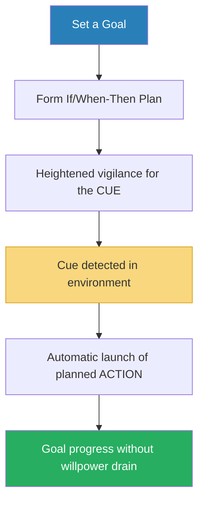

# Pre-Suasion — Robert B. Cialdini

> Cialdini's sequel to *Influence* answers a question the first book never asked: what should you do in the moment *before* you deliver your message?
> His answer — drawn from three decades of additional research — is that the highest-performing persuaders don't spend more time perfecting what they say; they spend more time crafting what happens immediately before they say it.
> They operate as skilled gardeners who know that even the finest seeds will not take root in stony soil.
> The book introduces the concept of "privileged moments" — brief windows of receptivity that a communicator can open through strategic attention-channeling — and builds a comprehensive framework for creating those moments using associations, environments, and the principles from *Influence* deployed as pre-suasive openers rather than direct appeals.
> Where *Influence* was a defence manual against manipulation, *Pre-Suasion* is an offence manual for ethical persuaders — and a masterclass in the psychology of timing.

---

## About the Author

Robert B. Cialdini is Regents' Professor Emeritus of Psychology and Marketing at Arizona State University and the author of *Influence*, one of the most cited books in social psychology.
*Pre-Suasion* represents thirty additional years of research beyond the original, incorporating the explosion of behavioural science, behavioural economics, and neuroscience findings that have accumulated since 1984.
He remains the rare academic who combines controlled experiments with extensive fieldwork among compliance professionals.

---

## The Big Idea

- Cialdini's central claim is that <b style="color: #2980b9">the moment before the message matters more than the message itself</b>
- The best persuaders don't tinker with the merits of what they offer — they arrange for the psychological frame around it to be favourable
- This process is called <b style="color: #2980b9">pre-suasion</b>: arranging for recipients to be receptive to a message before they encounter it

---

- The mechanism is <b style="color: #2980b9">channeled attention</b>
- Whatever we focus on gains two automatic upgrades in our minds:
  1. It seems more **important** than it did before we focused on it
  2. It seems more **causal** — we assume it is a driver of outcomes
- This is Daniel Kahneman's <b style="color: #2980b9">focusing illusion</b>: "Nothing in life is as important as you think it is while you are thinking about it"

---

- Pre-suasion doesn't require changing anyone's beliefs, attitudes, or experiences
- <b style="color: #27ae60">It only requires changing what is prominent in their mind at the moment of decision</b>
- A consultant who jokes "I'm not going to charge you a million dollars" before stating his $75,000 fee virtually eliminates price resistance — not by arguing for the fee's fairness, but by anchoring the number that precedes it
- A fire alarm salesman who "forgets" his materials and asks to let himself in and out of the house becomes associated with trust — because only trusted people are given that freedom

---

## Key Concepts at a Glance

| Concept | One-line summary |
|---------|-----------------|
| **Pre-Suasion** | Arranging for receptivity before the message arrives |
| **Privileged Moments** | Brief windows of heightened receptivity after a pre-suasive opener |
| **Focusing Illusion** | Whatever we attend to seems more important than it is |
| **Focal = Causal** | Whatever we attend to seems to be causing outcomes |
| **Single-Chute Questions** | Questions that bias memory search in one direction ("Are you helpful?") |
| **Commanders of Attention** | Natural attractors (sex, threat, novelty) and magnetizers (self-relevance, mystery, the unfinished) |
| **Associative Coherence** | Mental elements fire when readied by connected concepts, not randomly |
| **Persuasive Geography** | Physical environments pre-load associations that shape thinking |
| **If/When-Then Plans** | Self-manufactured pre-suasive triggers for personal goals |
| **Unity (7th Principle)** | Shared identity ("We" relationships) drives compliance beyond liking |

---

## Part 1: The Frontloading of Attention

### Privileged Moments

- A privileged moment is a <b style="color: #2980b9">time-limited window</b> when a person is particularly receptive to a message
- The word "moment" carries a dual meaning: a brief period of time AND a leveraging force (from physics) that creates unprecedented movement
- <b style="color: #e74c3c">These windows close quickly</b> — they are not permanent attitude changes but temporary states of receptivity that must be exploited immediately

> [!example] The Associate Dean's Perfect Timing
> Cialdini was on leave to write this book. An associate dean called to say he'd secured everything Cialdini asked for — office, computer, parking, library access. Cialdini expressed sincere thanks. The dean paused, then asked Cialdini to teach an MBA class — a request that would torpedo the book.
> Cialdini agreed. He couldn't say no in the instant after expressing gratitude for everything the dean had just provided.
> "If he had asked the day before or the day after, I would have been able to say no." The book was delayed by years.

---

### The Focusing Illusion: Attention = Importance

- Whatever receives our attention gains an automatic boost in perceived importance — even when the attention was directed there by an irrelevant factor
- After a pipe bomb in Düsseldorf injured immigrants, media coverage of right-wing extremism spiked — and the percentage of Germans who rated it as the nation's most important issue jumped from near zero to 35%
- When coverage died down, the number dropped back to near zero
- <b style="color: #2980b9">The press doesn't tell people what to think — it tells them what to think about</b> (Bernard Cohen)

> [!tip] The Embedded Reporter Program
> During the Iraq War, 600-700 reporters were embedded with combat units. Their dispatches — 71% of front-page coverage — focused almost entirely on soldiers' daily activities, bravery, and tactics.
> Only 2% of all embedded stories mentioned the absence of weapons of mass destruction.
> The effect: the public was directed to evaluate the *conduct* of the war (a strength) rather than the *wisdom* of it (a weakness).
> This was not a deliberate PR strategy — it was a side effect of making reporters' task molecular rather than molar.

---

### What's Focal Is Causal

- Attention doesn't just make things seem important — it makes them seem <b style="color: #2980b9">responsible for outcomes</b>
- In interrogations, suspects who are more visually prominent (better lit, more centred in camera frame) are judged more responsible for the conversation by observers
- False confessions average 16 hours of questioning — at which point the mentally exhausted suspect, focused entirely on ending the ordeal, confesses to stop the pain
- <b style="color: #e74c3c">The focal thing gets credit (or blame) regardless of whether it actually caused anything</b>

---

### Commanders of Attention

Certain types of information naturally command attention without any effort from the communicator:

| Type | Why It Works | Example |
|------|-------------|---------|
| **The Sexual** | Evolutionary priority; grabs attention instantly | Ads with sexual imagery get noticed but can distract from the product |
| **The Threatening** | Survival priority; the brain flags danger first | Fear-based health campaigns are highly attention-grabbing |
| **The Different** | Novelty detection; the brain ignores the familiar | A single unexpected element in a presentation captures focus |
| **The Self-Relevant** | Nothing holds attention like information about ourselves | Coca-Cola's "Share a Coke" campaign with personal names on bottles — first sales increase in a decade |
| **The Unfinished** | Zeigarnik effect: incomplete tasks nag at us until resolved | Cliffhangers; mystery stories; the reason we can't stop thinking about unresolved arguments |
| **The Mysterious** | Combines novelty + incompleteness; creates a need-to-know pull | The most engaging scientific writing opens with a mystery and resolves it gradually |

---

## Part 2: The Role of Association

### All Mental Activity Is Associative

- Cialdini's core mechanistic claim: <b style="color: #2980b9">mental elements don't fire when ready — they fire when readied</b>
- When one concept receives attention, closely linked concepts gain a privileged position in consciousness
- At the same time, unlinked concepts are suppressed
- This is why pre-suasion works: the opener activates a network of associations that then colour everything that follows

---

### The Power of Metaphor

- When Stanford researchers described a city's crime surge as a <b style="color: #2980b9">ravaging beast</b>, readers preferred catch-and-cage solutions (more police, longer sentences)
- When the same crime statistics were framed as a <b style="color: #2980b9">spreading virus</b>, readers preferred treat-the-causes solutions (education, poverty reduction)
- The effect of changing ONE word was 22% — more than double the effect of gender (9%) or political party affiliation (8%)
- <b style="color: #27ae60">Metaphor doesn't just describe reality — it redirects people to a sector of reality pre-loaded with the associations you want</b>

> [!example] Ben Feldman: The Greatest Insurance Salesman
> Ben Feldman, a high school dropout from East Liverpool, Ohio, sold more life insurance by himself than 1,500 of the 1,800 insurance agencies in the United States.
> His secret was metaphor. People didn't "die" — they "walked out" of life. This reframed death as an abdication of responsibility.
> "When you walk out, your insurance money walks in." Many a customer straightened up and walked right into a policy.
> At age 80, calling from his hospital bed after a cerebral hemorrhage, Feldman closed $15 million in new contracts in 28 days.

---

### Persuasive Geographies

- <b style="color: #2980b9">There is a geography of influence</b> — physical environments pre-load the associations that shape our thinking
- Cialdini discovered this personally: writing at his university desk (facing academic buildings, surrounded by journals), he wrote like an academic — technical, jargon-heavy, unsuitable for a general audience
- Writing at his home desk (facing a window onto pedestrians doing ordinary things), he wrote for real people
- The opening line changed from "My academic subdiscipline, experimental social psychology, has as a principal domain the study of the social influence process" to "I can admit it freely now: all my life I've been a patsy"

> [!tip] The Glass-Walled Conference Room
> A consultancy firm noticed their best employee incentive programs were designed in rooms with glass walls — where they could see the employees the programs were for.
> When they couldn't get glass rooms, they started downloading photos of client employees and leaning them against the walls.
> Clients loved "the personalised touch." The consultants got better outcomes. The real cause: continuous visual exposure to the people they were designing for.

---

### If/When-Then Plans: Pre-Suading Yourself

- We translate good intentions into action only about half the time
- <b style="color: #2980b9">If/when-then plans</b> overcome this by manufacturing pre-suasive moments for ourselves
- Format: "If/when [situation + cue], then I will [specific action]"
- They work because they put us on high alert for a particular opportunity AND automatically link that opportunity to the desired behaviour

> [!example] Opiate Addicts in Withdrawal
> Hospitalised opiate drug addicts were asked to prepare an employment history by end of day to help them get a job after release.
> Control group: 0% completed the task (unsurprising — they were in withdrawal)
> If/when-then group ("If/when lunch is over and the table is free, then I will start writing there"): **80% turned in a completed resume**

---

## Part 3: Best Practices

### The Six Principles as Pre-Suasive Openers

- Cialdini revisits his six principles from *Influence* but reframes them: they work not just as direct appeals but as <b style="color: #2980b9">pre-suasive openers</b> that prime the audience before the main message

| Principle | As Direct Appeal | As Pre-Suasive Opener |
|-----------|-----------------|----------------------|
| **Reciprocity** | Give a gift, then ask | Do a favour just before the request to activate obligation |
| **Liking** | Build rapport during the pitch | Establish similarity or warmth before the conversation begins |
| **Social Proof** | Show popularity data in the pitch | Mention how many others chose this option before presenting it |
| **Authority** | Display credentials during the pitch | Arrange to be introduced as an expert before speaking |
| **Scarcity** | Announce limited supply during the pitch | Mention upcoming unavailability before describing the offer |
| **Consistency** | Get a commitment, then escalate | Ask "Do you consider yourself helpful?" before requesting help |

> [!example] The "Are You Helpful?" Study
> Researchers stopped people and asked them to take a survey. Only 29% agreed.
> A second group was first asked: "Do you consider yourself a helpful person?" Nearly everyone said yes.
> In that privileged moment, 77.3% agreed to take the survey — without any payment or incentive.
> The single-chute question didn't change who they were. It changed what was prominent in their minds at the moment of decision.

---

### Unity: The Seventh Principle

- Pre-Suasion introduces a principle that Cialdini did not include in *Influence*: <b style="color: #2980b9">Unity</b>
- Unity is not the same as liking — it's deeper
- Liking says "this person is pleasant and similar to me"
- Unity says <b style="color: #27ae60">"this person is one of us"</b> — part of the same identity, the same We
- The distinction matters because We relationships produce not just compliance but sacrifice, trust, and loyalty

---

### Being Together: Genetic and Geographic Commonality

- Shared family, place of origin, ethnicity, or nationality creates a sense of We
- People who discover they share a birthday, birthplace, or first name become significantly more cooperative
- <b style="color: #2980b9">The Coca-Cola "Share a Coke" campaign</b> replaced its branding with 150 common first names on 100 million packs — a play on implicit egoism (we overvalue things connected to ourselves)
- The result: the first increase in Coke sales in a decade

---

### Acting Together: Synchrony and Collaboration

- Beyond genetic and geographic commonality, unity can be *created* through synchronised action
- People who move, sing, tap, or march in unison feel more connected and behave more cooperatively afterward
- Even 18-month-old infants become more helpful after being bounced in synchrony with an adult
- <b style="color: #27ae60">Lesson: if you want to build We, don't just talk together — do something together</b>

> [!example] South Korean Hostage Negotiation
> In 2007, the Afghan Taliban kidnapped 21 South Korean aid workers and killed two.
> Negotiations were failing. The head of South Korean intelligence flew in with a plan: replace the translator with a negotiator who spoke fluent Pashtun.
> "When our counterparts saw that our negotiator was speaking their language, Pashtun, they developed a kind of strong intimacy with us, and so the talks went well."
> The hostages were swiftly released. The key wasn't what was said — it was the pre-suasive signal of shared identity.

---

### Ethics: Why Cheating Backfires

- Cialdini devotes an entire chapter to arguing that unethical pre-suasion is not just wrong but unprofitable
- Organisations that use deceptive practices <b style="color: #e74c3c">attract employees who find cheating acceptable</b>
- Those employees then cheat the organisation itself — through expense fraud, time theft, and internal dishonesty
- The cost of employee turnover and internal fraud far exceeds any short-term gains from unethical persuasion
- <b style="color: #27ae60">The strongest argument for ethical influence is not moral — it's economic</b>

---

## The Verdict

*Pre-Suasion* is the rare sequel that expands the original rather than merely repeating it.
Where *Influence* identified the six levers of compliance, *Pre-Suasion* reveals that the real art lies not in pulling those levers but in positioning the audience's attention so the levers pull themselves.

The book's strongest contribution is the focusing illusion framework — the idea that attention confers both importance and causality — which ties together dozens of otherwise disconnected research findings into a single, actionable insight.
The stories are vivid (the embedded reporters analysis is genuinely revelatory), the research is rigorous, and the practical applications are immediate.

Where it falls short is in occasional repetition and a tendency to over-prove points that the reader has already accepted.
The Unity chapters (11-12), while introducing a genuinely new principle, feel somewhat underdeveloped compared to the rich treatment the original six received in *Influence*.
And the ethics chapter, while welcome, reads more as a bolted-on obligation than an integrated part of the argument.

For anyone who read *Influence* and wants to move from understanding persuasion to practising it, this is the essential next step.
For those who haven't read *Influence*, start there — *Pre-Suasion* builds on its foundation at every turn.

---

## Related Reading

- [[Influence - Robert Cialdini|Influence]] — The six principles that Pre-Suasion builds upon and deploys as openers
- [[Your Brain at Work - David Rock|Your Brain at Work]] — Rock's "Stage" metaphor explains why attention is the scarce resource Pre-Suasion exploits
- [[Thinking Strategically - Avinash K. Dixit & Barry J. Nalebuff|Thinking Strategically]] — Strategic timing and sequencing in competitive contexts
- [[Never Split the Difference - Chris Voss|Never Split the Difference]] — Tactical empathy as a form of pre-suasive attention management
- [[Words That Change Minds - Shelle Rose Charvet|Words That Change Minds]] — Language patterns that channel attention toward compliance
