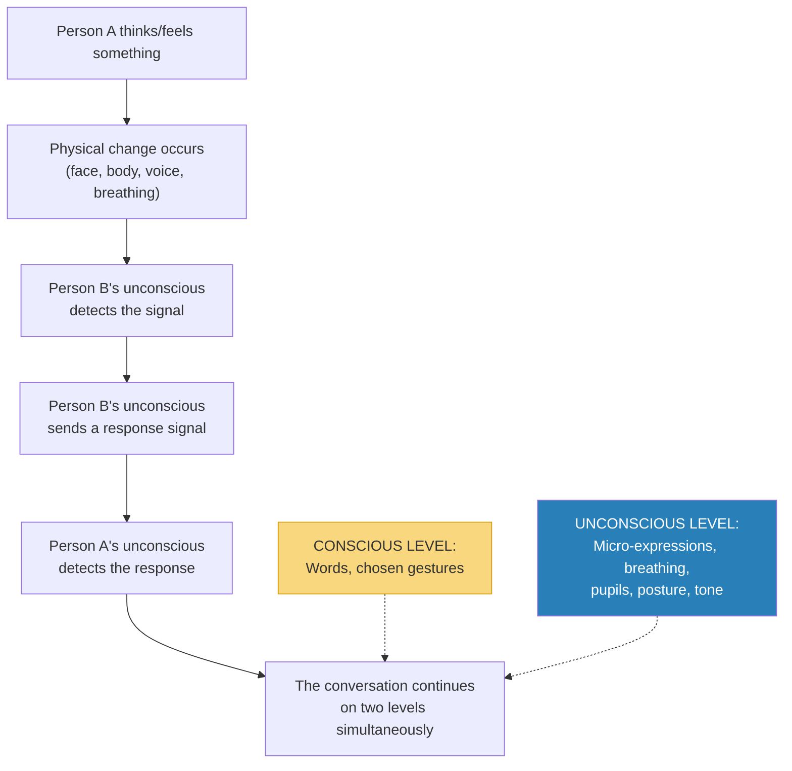
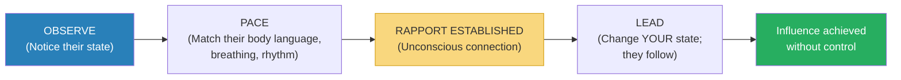

# The Art of Reading Minds — Henrik Fexeus

> Henrik Fexeus is Sweden's most famous mentalist, and his thesis is disarmingly simple: mind reading is not supernatural — it is the systematic observation of what people are already telling you without words.
> Every thought produces a physical reaction. Every emotion surfaces on the face, in the body, in the voice. Every person broadcasts a constant stream of information about their internal state through channels they neither control nor notice.
> The problem is not that this information is hidden — it is that we have never been taught to look for it.
> This book is the instruction manual. It teaches you to build deep rapport through matching and mirroring, to read emotional states through micro-expressions and body language, to identify people's preferred sensory channels, to detect deception through contradictory signals, and to use suggestion and anchoring to influence others ethically.
> It is structured like an IKEA manual — Fexeus's deliberate metaphor — with practical exercises at every stage, designed not to explain theory but to build skill.
> Where Navarro's *What Every Body Is Saying* gives you the science of nonverbal communication and Cialdini's *Influence* gives you the psychology of compliance, Fexeus gives you the mentalist's toolkit: how to read the room, build instant connection, and understand what people are really thinking — all without a single word being spoken.

---

## About the Author

Henrik Fexeus is a Swedish author, mentalist, and lecturer on nonverbal communication and influence.
He is Sweden's most well-known expert on body language and has appeared regularly on Swedish television demonstrating mind-reading techniques.
His books have been translated into over 25 languages and have sold millions of copies worldwide.

Unlike many authors in the body language space, Fexeus is a practitioner first — a performing mentalist who has spent decades reading audiences in real time.
His approach draws on NLP (Neuro-Linguistic Programming), the work of Paul Ekman on facial expressions, Milton Erickson's hypnotherapy techniques, the research of Antonio Damasio on the mind-body connection, and Desmond Morris's studies of human behaviour.
He is not an academic psychologist but a synthesiser who translates research into immediately usable techniques.

His stated goal: to make the book "as clear and straightforward as an IKEA instruction sheet" — so that after reading it, you know exactly what to do, not just what to think about.

---

## The Big Idea

- Fexeus's foundational claim: <b style="color: #2980b9">you cannot think a single thought without something physical happening to your body</b>
- This is not metaphor — it is neuroscience
- When you think a thought, an electrochemical process occurs in your brain that affects your autonomous nervous system: breathing, pupil size, blood flow, sweating, blushing, muscle tension, posture, and facial expression
- <b style="color: #27ae60">Every thought produces a physical trace. Every emotion surfaces on the body. Nothing stays hidden.</b>
- The reverse is also true: what happens to your body affects your thoughts
  - Clench your jaw, lower your eyebrows, stare at a fixed point, clench your fists — and within ten seconds you will start to feel angry
  - Your pulse will increase by 10-15 beats per minute and blood flow to your hands will increase
  - You activated the muscle pattern for anger, and your nervous system responded as if you WERE angry

---

- Fexeus calls this the "Descartes demolition" — the 17th-century philosopher's claim that body and mind are separate is <b style="color: #e74c3c">the most damaging error in Western intellectual history</b>
- Antonio Damasio's neuroscience has now proven the opposite: body and mind are one system
- <b style="color: #2980b9">Mind reading, as Fexeus defines it, is simply observing the physical traces of thoughts and emotions as they surface on the body</b>
- We all do this unconsciously already — we "sense" that someone is angry, or nervous, or attracted to us
- The problem is that our unconscious mind is imprecise: it misses nuances, makes errors, and misinterprets signals
- The book's promise: train the skills you already have so they become conscious, precise, and reliable

---

- The majority of all communication between two people occurs without words
- Nonverbal communication constitutes approximately <b style="color: #2980b9">60-65% of all interpersonal communication</b>
- Yet we pay almost all our conscious attention to words — and miss most of the real message
- Our unconscious mind picks up the nonverbal signals, processes them, and sends out responses — also nonverbally, also unconsciously
- <b style="color: #e74c3c">This means we are constantly sending and receiving messages we are not aware of — and sometimes our unconscious signals contradict our conscious words</b>
- This is why you sometimes "feel" that someone who seemed very nice in conversation didn't actually like you — your unconscious detected hostile signals that your conscious mind missed

The entire book is built on this dual-channel model: every conversation operates simultaneously on a conscious (verbal) level and an unconscious (nonverbal) level, and the nonverbal level carries more information, is more honest, and is more influential.

---

## Key Concepts at a Glance

| Chapter | Concept | One-Line Summary |
|---------|---------|-----------------|
| 1 | **Mind Reading Defined** | Observing physical traces of thoughts and emotions — not telepathy but trained perception |
| 2 | **Rapport** | The unconscious sense of connection and trust between two people — foundation of all influence |
| 3 | **Matching & Mirroring** | Building rapport by subtly adopting the other person's body language, breathing, speech patterns |
| 4 | **Representational Systems** | People process the world primarily through visual, auditory, or kinesthetic channels — match their language |
| 5 | **Emotions** | Seven universal facial expressions (surprise, sadness, anger, fear, disgust, contempt, joy) reveal internal states |
| 6 | **Moral Tale** | A story about why this matters — the consequences of failing to read the room |
| 7 | **Lie Detection** | Contradictory signals reveal when words and body disagree — but spotting lies is harder than you think |
| 8 | **Unconscious Flirting** | We signal romantic interest through eye contact, proximity, touch, and preening — usually without realising it |
| 9 | **Suggestion** | Methods of undetectable influence — pacing, leading, embedded commands, presuppositions |
| 10 | **Anchoring** | Planting and triggering emotional states through associated stimuli (touch, gesture, word) |
| 11 | **Party Tricks** | Demonstrations that look like magic but use the principles from earlier chapters |
| 12 | **Integration** | Putting it all together — becoming a natural mind reader through practice |

| Sub-Concept | One-line summary |
|-------------|-----------------|
| **Descartes's Error** | Body and mind are one system, not two — every thought has a physical trace |
| **Unconscious Communication** | 60-65% of communication is nonverbal and largely unconscious |
| **The Basic Rule of Rapport** | Adapt to how the other person prefers to communicate |
| **Pacing and Leading** | First match (pace), then change your state and they follow (lead) |
| **Sensory Acuity** | Training yourself to notice micro-changes in others' faces, breathing, skin colour, muscle tension |
| **The Seven Universal Emotions** | Surprise, sadness, anger, fear, disgust, contempt, joy — same in every culture |
| **Micro-expressions** | Fleeting facial expressions (1/25th of a second) that reveal concealed emotions |
| **Othello's Mistake** | Strong emotions distort perception — you only see what confirms the emotion |
| **The Four Learning Stages** | Unconscious ignorance → conscious ignorance → conscious competence → unconscious competence |
| **Anchoring** | Associating a touch/gesture/word with a specific emotional state, then triggering it later |

---

> [!tip] How This Book Is Structured
> Unlike most body language books that organise by body part (feet → face), Fexeus organises by SKILL: first rapport (chapters 2-3), then perception (chapters 4-5), then application (chapters 7-10), then demonstration (chapter 11). Each chapter builds on the previous one, and each includes practical exercises to do immediately. Think of it as a progressive training programme, not a reference manual.

---

## Chapter 2: Rapport — The Foundation of All Mind Reading

*Rapport is Fexeus's starting point because without it, nothing else in the book works. You cannot read someone who is closed to you, and you cannot influence someone who doesn't trust you.*

### What Rapport Is

- Rapport comes from the French *le rapport* — to have a relationship or connection with someone
- It is the <b style="color: #2980b9">unconscious sense of mutual trust, consent, cooperativeness, and openness</b> between two people
- Without rapport, the person you're talking to won't listen to you — no matter how good your argument is
- <b style="color: #e74c3c">Without rapport, you might as well not bother</b>
- With rapport, the other person is naturally inclined to understand your point of view and agree with you — not because you've tricked them, but because they feel safe enough to genuinely consider your ideas

> [!tip] The Basic Rule of Rapport
> Adapt to how the other person prefers to communicate. By becoming similar — in body language, speech rhythm, breathing, and energy level — you send an unconscious message: "I'm like you. You're safe with me. You can trust me."

---

### Why Rapport Works: The Similarity Principle

- We like people who are like us — this is one of the most robust findings in social psychology
- We choose friends, partners, and colleagues based on who makes us feel comfortable being who we are
- <b style="color: #2980b9">And who makes us most comfortable? People who are already like us.</b>
- A study by the Gallup organisation found that one of the most important factors for new employees is "good rapport and trust between the immediate supervisor and the employee"
- By adapting to someone else's communication style, you achieve two things simultaneously:
  1. <b style="color: #27ae60">You make it easier for them to understand you</b> — they no longer have to "translate" your nonverbal communication into their preferred style
  2. <b style="color: #27ae60">You make them like you more</b> — because your expressions resemble their own, and people like people who remind them of themselves

---

### The Two Phases of Rapport

- <b style="color: #2980b9">Phase 1: Pacing</b> — you adapt to the other person's style (matching their body language, rhythm, energy)
- <b style="color: #2980b9">Phase 2: Leading</b> — once rapport is established, you change YOUR state and the other person unconsciously follows

- Fexeus is careful to distinguish this from manipulation: <b style="color: #27ae60">"We don't 'control' or deceive other people to give them opinions they don't really hold. We just make sure that they are in an optimal state to understand the actual advantages of whatever we are presenting."</b>
- If your idea isn't actually good, rapport won't save it — people in rapport are more receptive, not more gullible

> [!warning] Important Caveat
> Adapting to someone doesn't mean erasing your personality. It's something you do initially — like speaking a few words of someone's native language to show respect. Once rapport is established, the adaptation becomes mutual and natural. You're not pretending to be someone else. You're being a more attentive version of yourself.

---

## Chapter 3: Rapport in Practice — Matching and Mirroring

*This is the most technique-dense chapter in the book — a systematic guide to building rapport through body language, voice, and breathing.*

### Matching Body Language

- <b style="color: #2980b9">Mirroring</b>: subtly adopting the other person's posture, gestures, and movements
- If they lean forward, you lean forward. If they cross their legs, you cross yours. If they gesture with their right hand, you gesture with your left (mirror image)
- The key word is <b style="color: #27ae60">subtly</b> — if they scratch their nose and you immediately scratch your nose, they'll notice and it will feel creepy
- The delay should be 10-30 seconds — enough that it registers unconsciously but not consciously
- You can also use <b style="color: #2980b9">cross-matching</b>: they tap their foot, you tap your finger. Same rhythm, different body part. This is even less detectable.

> [!example] The Cycling Analogy
> Fexeus compares rapport-building to cycling alongside someone. If you're both cycling at the same speed and rhythm, it feels natural and comfortable. If one person suddenly speeds up or changes direction, the other feels jarred.
> Matching someone's body language is like adjusting your cycling speed to match theirs. Once you're riding together, you can gradually change direction — and they'll follow naturally.

---

### Matching Voice

- Match the other person's <b style="color: #2980b9">tempo</b> (speed of speech), <b style="color: #2980b9">volume</b>, <b style="color: #2980b9">pitch</b>, and <b style="color: #2980b9">rhythm</b>
- A fast talker feels frustrated with a slow talker — not because of the content but because of the mismatch in communication rhythm
- A quiet person feels overwhelmed by a loud one
- <b style="color: #27ae60">Match first, then gradually lead them toward the pace and volume you want</b>
- If you want to calm someone down, don't start by speaking slowly — they'll just feel you're not taking their urgency seriously. Start at their speed, then gradually slow down. They'll follow.

---

### Matching Breathing

- This is Fexeus's most distinctive rapport technique — and the one most people have never heard of
- <b style="color: #2980b9">Synchronise your breathing with the other person's</b>
- Watch the rise and fall of their chest or shoulders to detect their breathing rhythm
- Breathe at the same rate and depth
- This creates an extraordinarily deep sense of connection because breathing is one of the most unconscious, intimate bodily rhythms
- <b style="color: #27ae60">If you can match someone's breathing, you are virtually guaranteed rapport</b> — it's like the master key

> [!example] Rapport by Breathing in Practice
> Fexeus describes sitting across from someone in a meeting, watching their chest rise and fall, and synchronising his own breathing to match. Within minutes, the other person relaxes visibly, leans forward, becomes more open.
> The person has no idea why they suddenly feel so comfortable. Their conscious mind attributes it to the conversation going well. Their unconscious mind knows: "This person is breathing with me. We are in sync. I am safe."

---

### Rapport by Email and Phone

- On the phone: match tempo, pitch, and energy level (you can't match body language)
- By email: match the other person's <b style="color: #2980b9">communication style</b> — length of messages, formality level, use of emoji, punctuation style
- If they write three-word replies, don't send paragraphs. If they write formally, don't use slang.
- <b style="color: #27ae60">The principle is the same: adapt to how the other person communicates to send the unconscious signal "I am like you"</b>

---

### When Rapport Goes Wrong

- <b style="color: #e74c3c">If someone is in bad rapport with you, adapting to them may feel like agreeing with their negativity</b>
- In this case, Fexeus recommends a modified approach: pace their energy level (not their negativity) and then gradually lead them toward a more positive state
- Start matching their intensity (they're frustrated, you acknowledge the frustration at their energy level) then slowly bring the energy down
- <b style="color: #2980b9">You can't calm someone down by being calm AT them. You have to meet them where they are first, then lead them where you want them to go.</b>

> [!danger] Before: Mismatched rapport attempt
> Your colleague is furious about a failed project. You respond in a calm, measured tone: "Let's look at this rationally."
> Result: They feel dismissed. Their frustration increases. "You don't understand!"

> [!success] After: Pace-then-lead
> You match their energy: "I know — this is really frustrating. We put a lot of work into this and it didn't land." (Pace)
> Once they feel heard, you gradually lower your energy: "OK. So what can we salvage from this?" (Lead)
> Result: They feel understood, their emotional intensity drops naturally, and they become receptive to problem-solving.

---

### Rapport with Groups

- You can't mirror everyone in a group simultaneously
- Instead, identify the <b style="color: #2980b9">group leader</b> — the person whose body language the others unconsciously follow — and mirror THEM
- If you can get into rapport with the leader, the group's unconscious rapport with that leader transfers partially to you
- Alternatively, use <b style="color: #2980b9">general energy matching</b>: if the group's energy is high and animated, match that energy. If it's subdued and focused, match that.
- <b style="color: #27ae60">Never be the odd one out in a group's energy level — it signals "I am not one of you"</b>

---

## Chapter 4: Senses and Thinking — Representational Systems

- Everyone has a <b style="color: #2980b9">dominant representational system</b> — a preferred sensory channel

| System | Language Cues | Behaviour |
|--------|--------------|-----------|
| **Visual** | "I see," "Looks good," "Picture this" | Talks fast, gestures up, breathes shallow/high |
| **Auditory** | "Sounds right," "I hear you," "Rings a bell" | Moderate pace, rhythmic, tilts head, looks sideways |
| **Kinesthetic** | "I feel that," "Solid," "Get a grip" | Talks slowly, breathes deep/low, looks down |

- <b style="color: #27ae60">Match their sensory language to deepen rapport instantly</b>
- If they say "I see what you mean," respond with "Let me show you" — not "Let me tell you"
- Eye direction reveals which system they're using: up = visual, sideways = auditory, down = kinesthetic/internal dialogue

> [!example] The Visual Manager vs Kinesthetic Employee
> Manager: "Can you SEE the big picture? LOOK at these numbers."
> Employee feels disconnected, confused. Not because they're slow — because the manager is speaking the wrong sensory language.
> Fix: "How does this FEEL to you? Does this SIT well with what you know?"
> Same information, different channel, dramatically better reception.

---

## Chapter 5: Emotions — The Seven Universal Expressions

- Paul Ekman identified seven emotions expressed identically in every culture:
- <b style="color: #2980b9">Surprise, Sadness, Anger, Fear, Disgust, Contempt, Joy</b>

| Emotion | Key Facial Markers |
|---------|-------------------|
| **Surprise** | Raised eyebrows, wide eyes, dropped jaw |
| **Sadness** | Inner brow corners raised, lip corners down |
| **Anger** | Lowered brow, compressed lips, flared nostrils |
| **Fear** | Raised eyebrows pulled together, wide eyes, tense open mouth |
| **Disgust** | Wrinkled nose, raised upper lip |
| **Contempt** | One-sided mouth raise (asymmetric smirk) |
| **Joy** | Raised cheeks, crinkled eyes (Duchenne), full smile |

- <b style="color: #e74c3c">Real smiles involve the orbicularis oculi (eye crinkle). Fake smiles use only the mouth.</b>

### Micro-Expressions

- Even when people try to hide emotions, the truth leaks through as <b style="color: #2980b9">micro-expressions</b> — lasting approximately 1/25th of a second
- Three types: slight (whole face, low intensity), partial (only part of face), micro (full intensity but vanishes instantly)
- Muscles react faster than conscious suppression can work — the leak cannot be plugged

> [!example] The Botox Problem
> A New York store manager told Fexeus that Botox was ruining his negotiations: "I can't read my clients' reactions since they have no capacity for nuanced facial expressions. They feel artificial, inhuman."
> Fexeus's advice: "If you want to be understood, try not to inject nerve toxins in your face."

### Othello's Mistake

- <b style="color: #e74c3c">Once in a strong emotional state, your perception distorts</b> — you only see evidence that confirms the emotion
- Shakespeare's Othello interpreted Desdemona's fear as evidence of guilt because his jealous rage blocked all other interpretations
- <b style="color: #27ae60">If you see someone heading into a negative state, intervene BEFORE it fully activates</b> — use pace-then-lead from the rapport chapter

---

## Chapter 7: Be a Human Lie Detector

*Fexeus's most important warning: detecting lies is far harder than you think.*

- There is <b style="color: #e74c3c">no single reliable indicator of deception</b> — no "Pinocchio effect"
- What you CAN detect is <b style="color: #2980b9">incongruence</b> — when verbal and nonverbal channels contradict each other
- Someone says "I'm fine" while their jaw clenches and they look away — the words and body disagree
- Signs of incongruence: timing mismatches (gesture comes after words instead of simultaneously), asymmetric expressions, micro-expressions that flash the opposite emotion

> [!warning] The Lie Detection Trap
> Research consistently shows that even trained professionals (police, judges, psychologists) detect lies only slightly better than chance (~54% vs 50%).
> Fexeus is honest about this: "The best you can do is detect discomfort and incongruence. Whether that incongruence is caused by deception or by nervousness or by indigestion — you can't know from body language alone."
> This aligns with Navarro's identical warning in *What Every Body Is Saying*.

| Signal | What It Might Mean | What It Does NOT Necessarily Mean |
|--------|-------------------|----------------------------------|
| Avoiding eye contact | Discomfort, shame, thinking | Lying (many liars INCREASE eye contact) |
| Touching nose/face | Self-soothing (pacifying) | Lying (it's a stress response, not a lie response) |
| Crossed arms | Discomfort, cold, defensive | Disagreement (sometimes it's just comfortable) |
| Incongruent expression | Words and body don't match | Deception (could be mixed emotions or social masking) |

> [!tip] The Correct Approach to "Lie Detection"
> 1. Establish a baseline of normal behaviour
> 2. Ask questions and watch for deviations from baseline
> 3. Note clusters of incongruent signals
> 4. Link specific questions to specific behavioural changes
> 5. Investigate further — the signals tell you WHERE to dig, not WHAT to conclude

---

## Chapter 8: The Unconscious Pickup Artist

- We signal romantic interest through a predictable sequence of nonverbal behaviours — usually without realising it
- <b style="color: #2980b9">The flirting sequence</b> (observed cross-culturally):
  1. Eye contact (brief, then look away)
  2. Repeated eye contact (longer duration, with smile)
  3. Preening behaviours (adjusting hair, clothing, posture)
  4. Proximity reduction (moving closer)
  5. Touch (brief, "accidental," escalating)
  6. Synchronisation (matching posture, drinking at same time)

- Most people are terrible at recognising when someone is flirting with them — because the signals operate below conscious awareness
- <b style="color: #27ae60">Knowing the sequence lets you both recognise when interest is being signalled AND signal interest more effectively yourself</b>

---

## Chapters 9-10: Suggestion and Anchoring

### Suggestion: Undetectable Influence

- <b style="color: #2980b9">Embedded commands</b>: hiding a directive inside a longer sentence so the conscious mind doesn't register it as a command
- Example: "I don't know if you'll FEEL COMPLETELY COMFORTABLE with this idea right away" — the embedded command is "feel completely comfortable"
- <b style="color: #2980b9">Presuppositions</b>: statements that assume something is true without stating it directly
- "When you decide to go ahead with this, which option will you choose?" presupposes they WILL go ahead
- These techniques come from Milton Erickson's hypnotherapy — Fexeus adapts them for everyday conversation

### Anchoring: Planting and Triggering Emotional States

- An <b style="color: #2980b9">anchor</b> is an association between a stimulus (touch, gesture, word, location) and an emotional state
- You create an anchor by delivering the stimulus at the peak of the emotional state
- Later, you trigger the anchor by repeating the stimulus — and the emotional state returns

> [!example] The Handshake Anchor
> Fexeus describes anchoring a positive emotional state to a specific handshake. When someone is laughing, engaged, and feeling great, you shake their hand in a distinctive way (e.g., with a slight extra squeeze or a specific placement). Later, when you want to recreate that positive feeling — perhaps at the start of a negotiation — you repeat the exact same handshake. The positive state resurfaces unconsciously.

> [!warning] Ethical Note
> Fexeus is clear: these techniques are powerful but not magic. They work on willing, receptive people in normal social situations. They don't override free will or work on hostile audiences. And they should be used to create genuinely positive outcomes for both parties, not to manipulate people into doing things against their interest.

---

## The Verdict

*The Art of Reading Minds* is the most entertaining and accessible book on interpersonal influence in this collection.
Fexeus writes with a mentalist's showmanship and a teacher's patience, combining the NLP-influenced techniques of Bandler and Grinder, the micro-expression science of Ekman, the hypnotherapy wisdom of Erickson, and the mind-body neuroscience of Damasio into a single, practical programme.

The rapport chapters (2-3) are the book's strongest contribution — the breathing-matching technique alone is worth the price of the book, as it is rarely taught elsewhere and produces almost magically fast connection.
The emotions chapter draws heavily on Ekman and is scientifically well-grounded.
The suggestion and anchoring chapters are the most controversial — rooted in NLP, which has a mixed scientific track record — but Fexeus presents them as practical tools rather than scientific certainties.

The book's weaknesses are typical of NLP-adjacent material: some claims are presented with more confidence than the evidence warrants (eye accessing cues, for example), and the "party tricks" chapter feels like padding.
The writing occasionally veers into self-help exuberance.
But the core skill the book teaches — paying deep, systematic attention to the nonverbal channel that carries most of human communication — is both real and valuable.

For practitioners who want to read people in real-time social situations — rather than in controlled research environments — this is the most practical toolkit available.

---

## Related Reading

- [[What Every Body Is Saying - Joe Navarro|What Every Body Is Saying]] — More scientifically rigorous nonverbal reading from another practitioner (FBI vs mentalist)
- [[Like Switch - Jack Schafer|Like Switch]] — FBI rapport-building techniques that complement Fexeus's matching/mirroring
- [[The Charisma Myth - Olivia Fox Cabane|The Charisma Myth]] — Managing the internal state (presence, power, warmth) that rapport requires
- [[Influence - Robert Cialdini|Influence]] — The psychological principles (especially liking) that explain why rapport produces compliance
- [[Pre-Suasion - Robert Cialdini|Pre-Suasion]] — Attention management and privileged moments — the timing dimension of Fexeus's techniques
- [[Emotional Intelligence - Daniel Goleman|Emotional Intelligence]] — The neuroscience of emotions that Fexeus's micro-expression reading builds on
- [[Games People Play - Eric Berne|Games People Play]] — What happens beneath the surface of conversations when rapport fails
- [[Crucial Conversations - Kerry Patterson|Crucial Conversations]] — How to maintain dialogue when emotional reading reveals trouble
