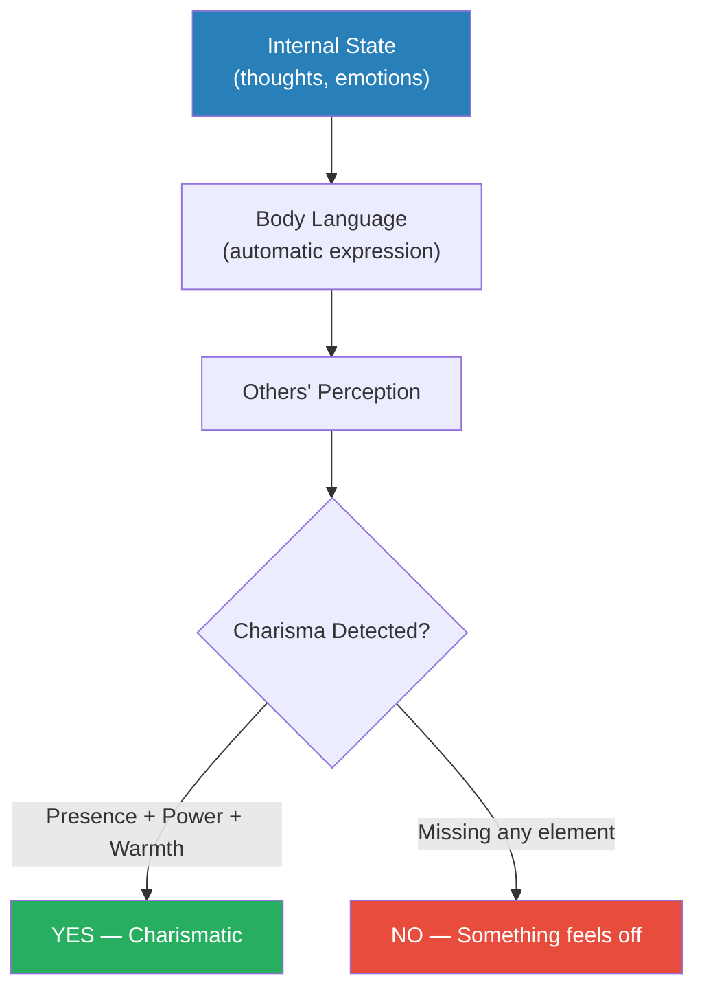

# The Charisma Myth — Olivia Fox Cabane

> The myth is that charisma is something you're born with — a magical quality that some people have and others don't.
> Olivia Fox Cabane demolishes this myth with research and practical exercises, showing that charisma is a learnable skill built from three components: Presence (full engagement in the moment), Power (the perception you can affect the world), and Warmth (the perception you genuinely care).
> Different combinations of these produce different charisma styles — from Bill Clinton's laser-like Focus charisma to Steve Jobs's electrifying Visionary charisma to the Dalai Lama's gentle Kindness charisma.
> This is not theory — it is a manual with specific exercises you can practise today.

---

## About the Author

Olivia Fox Cabane is an executive coach who lectures at Stanford, Yale, Harvard, and MIT on charisma and leadership. She coaches C-suite executives at Fortune 500 companies.

---

## The Big Idea

Charisma is not a fixed personality trait. It is a set of **behaviours** driven by your **internal state**, expressed through your **body language**, and read by others **unconsciously**.

The formula is simple:

- **Presence** — Are you fully here, right now, with this person?
- **Power** — Do you seem capable of affecting the world around you?
- **Warmth** — Do you seem to genuinely care about the people around you?

All three must be present *and perceived by others* through your body language. Your internal state drives your body language, which others read instantly and unconsciously. Therefore, managing your internal state IS managing your charisma.

---

## The Four Charisma Styles

| Style | Emphasis | Feels Like | Example |
|-------|----------|-----------|---------|
| **Focus** | Presence + Warmth | "This person is completely absorbed in me" | Bill Clinton |
| **Visionary** | Power + Warmth (projected outward) | "This person can see a future I want to be part of" | Steve Jobs |
| **Kindness** | Warmth (dominant) | "This person genuinely cares about me" | Dalai Lama |
| **Authority** | Power (dominant) | "This person is in charge and knows it" | Colin Powell |

No style is universally best — each suits different situations. **Focus charisma is the most universally applicable and easiest to learn** because it simply requires being fully present.

> [!example] Marilyn Monroe's Subway
> Marilyn Monroe once demonstrated her charisma control by walking through a New York subway without being recognised. Then she asked her companion: "Do you want to see her?" She adjusted her posture, gait, and expression — and was immediately mobbed. Charisma is a switch, not a trait.

---

## The Three Obstacles to Charisma

The biggest enemies of charisma are not skill gaps — they are **internal discomfort, self-doubt, and self-criticism**. These leak through your body language no matter how hard you try to hide them. Your face makes micro-expressions lasting 17–50 milliseconds that others read unconsciously.

### The Three-Step Solution

1. **Destigmatise** — Recognise that the discomfort is normal. Everyone experiences imposter syndrome, anxiety, self-doubt. You are not uniquely broken.
2. **Neutralise** — Reframe negative thoughts. "I'm going to fail" becomes "I'm experiencing a thought about failing, which is normal before high-stakes moments."
3. **Rewrite** — Visualise an alternative reality. Imagine the scenario going perfectly. Your brain cannot fully distinguish between vivid imagination and reality, so the body language shifts.

---

## The Responsibility Transfer

Cabane's single most powerful exercise. Mentally hand your problems to a higher power — God, the universe, fate, whatever you're comfortable with — for ten minutes.

This isn't about religious belief. It's about temporarily relieving the cognitive load of worry. When you stop carrying the weight of "I must solve everything," your shoulders literally drop, your face relaxes, your breathing deepens. Others immediately perceive you as more present and confident.

---

## Practical Charisma Toolkit

| Technique | When to Use | How |
|-----------|-------------|-----|
| **Responsibility Transfer** | Before any high-anxiety situation | Mentally hand over your worries for 10 min |
| **Gratitude Focus** | Before conversations | Think of 3 things you appreciate about this person |
| **Visualization** | Before presentations, meetings | See it going perfectly in vivid detail |
| **Body Language Reset** | When you notice tension | Drop shoulders, widen stance, slow breathing |
| **Goodwill Focus** | During difficult conversations | Silently wish the other person well |

---

## Charisma in Difficult Moments

Cabane addresses situations where charisma is hardest to maintain:

- **Delivering bad news** — Lead with warmth, maintain presence, don't rush to fill silence
- **Handling criticism** — Destigmatise your reaction, stay present, don't get defensive
- **First impressions** — The first few seconds set a frame that is hard to break. Arrive in the right internal state.
- **Presentations** — Visionary charisma is most effective. Pause before starting. Make eye contact with individuals, not the crowd.

---

## The Dark Side of Charisma

Cabane is honest about the risks:

- Charismatic people can **intimidate** without intending to
- Others may feel **inadequate** by comparison
- High charisma creates **unrealistic expectations** — people assume you'll always be "on"
- Authority charisma in particular can **suppress dissent** and create echo chambers

The antidote is self-awareness and deliberately choosing when to dial charisma up or down.

---

## The Verdict

*The Charisma Myth* is the most practical book on personal magnetism available. The three-pillar framework (Presence, Power, Warmth) is simple enough to remember in any conversation, and the exercises are immediately usable. The book's weakness is occasional repetition and a self-help tone that may put off sceptics. But the core insight — that charisma is an internal state that leaks through body language, and that managing the state manages the charisma — is both true and actionable.

**Start with:** Focus charisma (just be present) and the Responsibility Transfer exercise. These two alone will change how people respond to you.

---

## Related Reading

- [[How to Win Friends and Influence People - Dale Carnegie|How to Win Friends]] — Carnegie's warmth principles as the foundation of Focus charisma
- [[What Every Body Is Saying - Joe Navarro|What Every Body Is Saying]] — The body language signals that charisma produces
- [[Influence - Robert Cialdini|Influence]] — The liking principle that charisma activates
- [[Executive Presence - Sylvia Ann Hewlett|Executive Presence]] — Authority charisma in the corporate world
- [[Pre-Suasion - Robert Cialdini|Pre-Suasion]] — Priming your internal state before interactions
