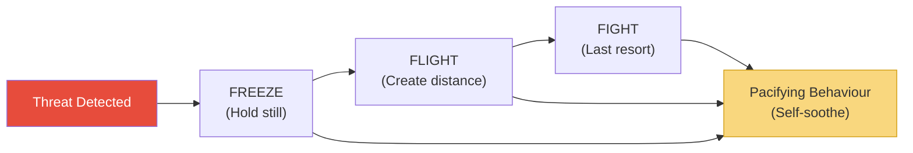
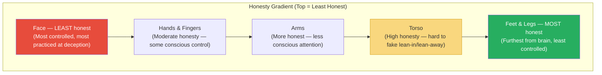

# What Every Body Is Saying — Joe Navarro

> Joe Navarro spent twenty-five years as an FBI Special Agent reading the nonverbal behaviour of spies, terrorists, and criminals — and before that, he spent his childhood as a Cuban refugee learning to read the body language of American classmates because he couldn't speak their language.
> This book distils both experiences into a systematic, body-part-by-body-part guide to decoding what people are really thinking, feeling, and intending — starting with the feet (the most honest part of the body) and working upward to the face (the least honest).
> The framework is built on one scientific insight: the limbic brain — the ancient, emotional brain — reacts reflexively and cannot be consciously controlled. Its freeze, flight, and fight responses, and the pacifying behaviours that follow them, are the true language of the body.
> Where most body language books focus on the face, Navarro argues that the face is the biggest liar on the body, and that real tells live in the feet, legs, torso, and hands — places most people never think to look.

---

## About the Author

Joe Navarro served twenty-five years in the FBI, specialising in counterintelligence, behavioural assessment, and interviewing.
He is one of the Bureau's original members of the elite Behavioural Analysis Program.
His interest in nonverbal communication began at age eight, when he arrived in the United States from Cuba unable to speak English and had to rely entirely on reading people's body language to navigate his new world.
He now teaches nonverbal communication for the FBI, CIA, and at medical schools throughout the United States.

---

## The Big Idea

- Navarro's central claim is that <b style="color: #2980b9">the body is more honest than the mouth</b>
- All behaviour is governed by the brain, but different parts of the brain have different levels of honesty
- The <b style="color: #2980b9">limbic brain</b> (the ancient mammalian brain) reacts reflexively and cannot be consciously controlled — it is the "honest brain"
- The <b style="color: #e74c3c">neocortex</b> (the thinking brain) is capable of complex reasoning but also of deception — it is the "lying brain"
- Nonverbal behaviour generated by the limbic system is therefore more reliable than words generated by the neocortex

---

- When the limbic brain detects a threat, it triggers three responses in a specific order:
  1. <b style="color: #2980b9">Freeze</b> — hold still to avoid detection (NOT fight, as commonly believed)
  2. <b style="color: #2980b9">Flight</b> — create distance from the threat
  3. <b style="color: #2980b9">Fight</b> — confront the threat as a last resort

- After any limbic stress response, the brain recruits the body to perform <b style="color: #2980b9">pacifying behaviours</b> — self-soothing actions that calm the nervous system
- These pacifiers (neck touching, face rubbing, hair playing, leg cleansing) are involuntary and observable
- <b style="color: #27ae60">The master skill is reading the binary of comfort vs discomfort across the entire body, then looking for pacifiers that confirm what you've seen</b>

---

## Key Concepts at a Glance

| Concept | One-line summary |
|---------|-----------------|
| **Limbic Brain** | The ancient, reflexive brain that produces honest nonverbal behaviour |
| **Freeze/Flight/Fight** | The three survival responses, in that order — freeze first, fight last |
| **Pacifying Behaviours** | Self-soothing actions (neck touch, face rub, leg cleanse) that follow stress |
| **Comfort vs Discomfort** | The master binary: every nonverbal signal falls into one of these two categories |
| **Gravity-Defying Behaviours** | Upward movements (bouncy walk, raised arms, arched brows) = positive emotions |
| **Ventral Fronting/Denial** | Exposing your torso to someone = comfort; turning it away = discomfort |
| **Steepling** | Fingertip-to-fingertip hand position = the highest confidence display |
| **Lip Compression** | Lips pressed together until they disappear = distress or disagreement |
| **Baseline** | A person's normal behaviour — deviations from baseline are what matter |
| **Clusters** | Multiple tells occurring together are far more reliable than any single signal |

---

## The Body's Honesty Gradient

*Navarro's most counterintuitive insight: the further a body part is from the brain, the more honest it is.*

- Most people focus on the face when trying to read others — but <b style="color: #e74c3c">the face is the least reliable part of the body</b>
- We learn from childhood to control our facial expressions (fake smiles, poker faces, polite interest)
- The feet, by contrast, receive almost no conscious attention and are therefore the most honest broadcasters

---

## The Feet and Legs: The Most Honest Body Part

- <b style="color: #2980b9">Happy feet</b> — bouncing, wiggling, or jiggling feet signal genuine excitement or happiness
- When a person is about to leave a conversation, their feet will point toward the exit before anything else changes
- If you're talking to someone and their feet point away from you, they want to be elsewhere — no matter what their face is doing
- <b style="color: #2980b9">Foot freeze</b> — sudden stillness in previously moving feet signals a limbic freeze response to a threat or stressor

> [!example] The Direction of Desire
> Navarro teaches that feet always point toward what we want. In a group conversation, if a person's feet point toward one particular individual, that's who they're most interested in. If their feet point toward the door, they want to leave. This is one of the most reliable nonverbal indicators because it operates almost entirely below conscious awareness.

---

## The Torso: Ventral Fronting and Denial

- <b style="color: #2980b9">Ventral fronting</b> — exposing the front of your body (chest, stomach) to someone signals comfort and openness
- <b style="color: #e74c3c">Ventral denial</b> — turning your torso away, crossing arms over it, or leaning back signals discomfort or disagreement
- The torso lean is highly reliable: people lean toward things they like and away from things they don't
- The <b style="color: #2980b9">shoulder shrug</b> — a full, symmetrical shrug means "I truly don't know." A partial or one-sided shrug often signals uncertainty or deception
- The <b style="color: #2980b9">turtle effect</b> — raising shoulders toward the ears while lowering the head signals loss of confidence or humiliation

---

## The Arms and Hands: Confidence and Distress

### Arms
- <b style="color: #27ae60">Gravity-defying arm movements</b> (raised arms, thumbs up, arms spread wide) signal positive emotions and confidence
- Arms pressed tight against the body or withdrawn signal discomfort, insecurity, or submission
- Arm crossing is not always defensive — context and baseline matter — but sudden arm crossing during a conversation is a reliable discomfort indicator

### Hands
- <b style="color: #2980b9">Steepling</b> (pressing fingertips together in a church-steeple shape) is the single most powerful confidence display
- It is used by people who are certain of their position — lawyers who know they'll win, executives about to announce good news
- <b style="color: #e74c3c">Hand wringing</b> and interlaced fingers with tightly pressed palms signal low confidence or high stress
- <b style="color: #2980b9">Thumb displays</b> — visible thumbs (sticking out of pockets, resting on belt) signal confidence; hidden thumbs signal insecurity

> [!tip] The Steepling Rule
> If you see someone shift from steepling (high confidence) to interlaced fingers or hand wringing (low confidence), something has just changed their assessment of their position. In a negotiation, this is the moment to press.

---

## The Face: The Biggest Liar

- Despite being where most people look first, the face is the <b style="color: #e74c3c">least reliable</b> body part for reading others
- We have been trained since childhood to manage our facial expressions — to smile when unhappy, look interested when bored, appear calm when terrified
- Nevertheless, certain facial signals are reliable because they are difficult to fake:

| Signal | Meaning | Reliability |
|--------|---------|-------------|
| **Eyebrow flash** (quick raise on greeting) | Genuine recognition and positive feeling | High — hard to fake |
| **Eye blocking** (eyelids close or narrow) | Dislike, disagreement, or threat detected | Very high — limbic response |
| **Lip compression** (lips pressed together until they disappear) | Distress, disagreement, or something being withheld | Very high — universal |
| **Real smile** (Duchenne: eyes crinkle, cheeks rise) | Genuine happiness | High — the orbicularis oculi muscle is hard to activate voluntarily |
| **Fake smile** (mouth only, no eye involvement) | Social politeness or deception | Easy to spot once you know what to look for |
| **Nose flare** (nasal wing dilation) | Oxygenating before action — intention cue | High — signals imminent physical action |
| **Chin drop** | Discomfort or insecurity | Moderate |

> [!example] The Ice-Pick Murder
> An FBI agent asked a suspect about the murder weapon, listing several options. When "ice pick" was mentioned — the actual weapon, known only to the killer — the suspect's eyelids slammed shut and stayed shut until the next weapon was named. This eye-blocking behaviour was the tell that made him the primary suspect. He later confessed.

---

## Detecting Deception: Proceed with Caution

*Navarro's most important warning: detecting lies is far harder than people believe, and there is no single reliable indicator of deception.*

> [!danger] The Pinocchio Effect Does Not Exist
> There is no single behaviour — no nose touch, no eye shift, no specific gesture — that reliably indicates someone is lying.
> People who claim they can detect lies with 90%+ accuracy are almost certainly wrong.
> Research shows that even trained professionals (police, judges, psychologists) perform only slightly above chance at detecting deception.

- What nonverbal analysis CAN do is detect <b style="color: #2980b9">discomfort</b> — and discomfort may or may not be caused by deception
- The correct approach: look for clusters of discomfort behaviours + pacifiers in response to specific questions
- Then investigate further — don't conclude deception

> [!success] The Right Approach
> 1. Establish a baseline of the person's normal behaviour
> 2. Ask questions and watch for deviations from baseline
> 3. Note clusters of discomfort + pacifying behaviours
> 4. Link specific questions to specific behavioural changes
> 5. Investigate further — the behaviours tell you WHERE to dig, not WHAT to conclude

---

## The Verdict

*What Every Body Is Saying* is the most practical body language book available — not because it teaches magic tricks, but because it teaches observation.
The body-part-by-body-part structure makes it immediately usable: after reading the feet chapter, you start watching feet; after the hands chapter, you notice steepling everywhere.

Navarro's most valuable contribution is the limbic framework.
By grounding everything in the freeze/flight/fight response and the comfort/discomfort binary, he gives readers a reliable way to interpret any behaviour — even ones not specifically covered in the book.
If it looks like comfort, it probably is. If it looks like discomfort, something is wrong. Then look for pacifiers to confirm.

The deception chapter is the book's most important — precisely because it argues against the book's own marketing.
Most people buy body language books hoping to become human lie detectors.
Navarro's honest admission that deception detection is unreliable — and his reframing toward discomfort detection instead — is what separates this book from the charlatans.

The writing is accessible but occasionally repetitive.
Some of the FBI stories feel embellished.
The face chapter is weaker than the feet and hands chapters, which may be intentional — Navarro wants you looking at feet, not faces.

---

## Related Reading

- [[Influence - Robert Cialdini|Influence]] — The psychological triggers that Navarro's nonverbal signals reveal in action
- [[Pre-Suasion - Robert Cialdini|Pre-Suasion]] — Channeled attention and what to look for before the message arrives
- [[The Laws of Human Nature - Robert Greene|The Laws of Human Nature]] — Greene's character-reading framework, less scientific but more strategic
- [[Never Split the Difference - Chris Voss|Never Split the Difference]] — Voss's "tactical empathy" relies heavily on reading nonverbal cues
- [[Power - Jeffrey Pfeffer|Power]] — The nonverbal projection of confidence and authority that Navarro's steepling and ventral fronting describe
