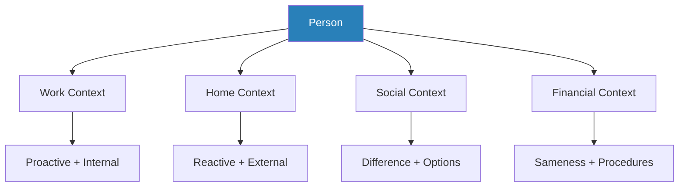
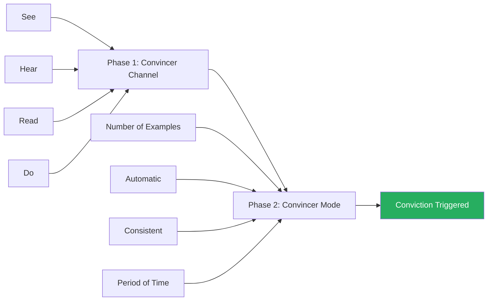
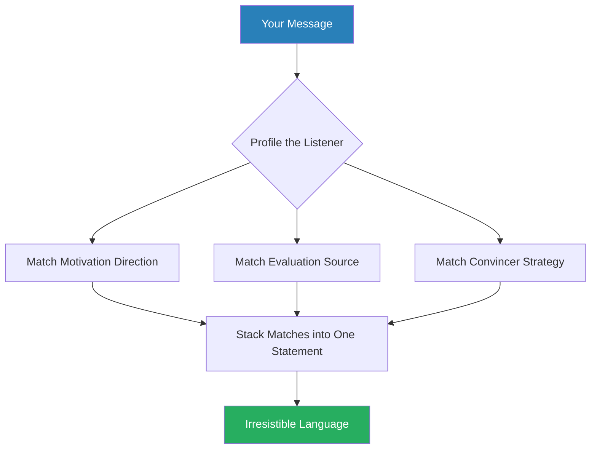
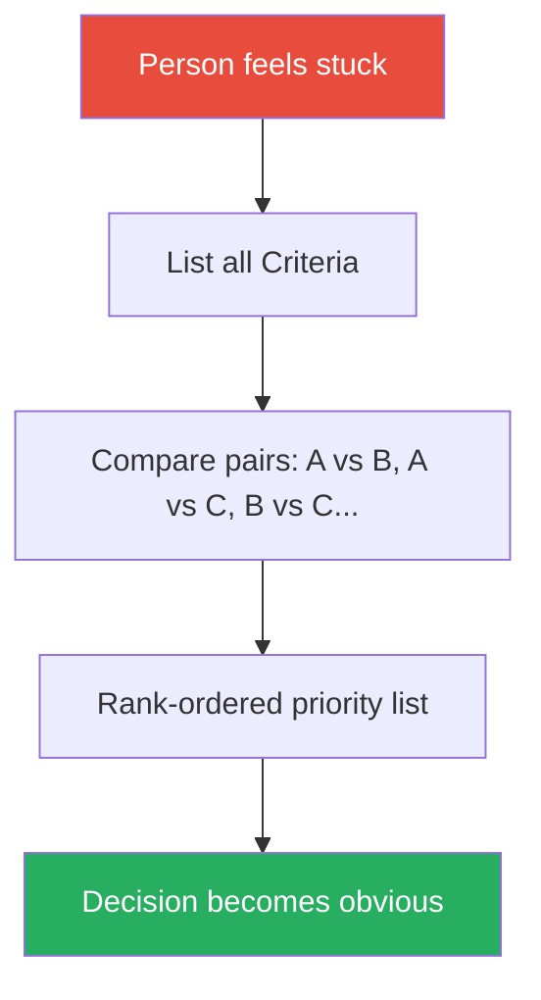

# Words That Change Minds — Shelle Rose Charvet

> Shelle Rose Charvet's contribution to the influence literature is a deceptively simple claim with far-reaching consequences: people reveal their unconscious motivational patterns through the *structure* of their language, not the content. By asking a small set of diagnostic questions and listening to how someone answers — not what they say — you can identify 14 behavioural patterns that govern how they get motivated and how they make decisions. Once you know someone's patterns, you speak directly into their cognitive operating system, bypassing resistance because your message arrives pre-formatted for their mind. The model is called the **LAB Profile** (Language and Behaviour Profile), and its most radical feature is that patterns are context-dependent: the same person can operate completely differently at work, at home, and in a negotiation. This is not a personality-typing book. It is a field manual for reading people in real time and adjusting your language to match.

---

## About the Author

Shelle Rose Charvet is an NLP practitioner and international business consultant who adapted Rodger Bailey's LAB Profile for corporate and professional contexts. She has trained clients across five continents in sales, management, HR, and negotiation. Her intellectual lineage runs through Noam Chomsky (Transformational Grammar), Richard Bandler and John Grinder (NLP), Leslie Cameron-Bandler (who identified approximately 60 Meta Programs), and Rodger Bailey (who reduced these to 14 actionable patterns and created the diagnostic questions that became the LAB Profile). Charvet's contribution is making Bailey's research accessible, commercial, and applicable to everyday professional influence. She brings a practitioner's sensibility to the work — the book reads like a training manual seasoned with consulting war stories rather than an academic treatment.

---

## The Big Idea

*Most influence books tell you what to say — Charvet tells you how to say it, calibrated to the specific person you are speaking to.*

- Communication failures are not about content disagreement — they are about <b style="color: #2980b9">structural mismatch</b> between how people process, decide, and get motivated
- The mechanism is elegantly simple: when your message arrives in someone's native cognitive format, no translation is required, no energy is lost, and resistance drops to near zero
- When it arrives in the wrong format, the listener spends mental effort converting your words into terms they understand — and most of the persuasive impact evaporates in translation

---

- The book's deepest insight is that these patterns are <b style="color: #27ae60">context-dependent, not personality traits</b>
  - A person who is fiercely independent at work may defer entirely to their partner at home
  - Someone who craves novelty when choosing restaurants may want absolute stability in their career
- This makes the LAB Profile more nuanced than personality-type systems like MBTI or DISC, which assign fixed labels and call it a day
- The same individual may need completely different influencing approaches depending on whether you are discussing their budget, their team, or their weekend plans

---

- The practical implication is that <b style="color: #27ae60">influence becomes a craft of observation and calibration, not a set of universal scripts</b>
- You cannot memorise one "power phrase" and deploy it everywhere
- You must learn to listen for structure, diagnose the pattern, and match your language in real time
- The diagnostic questions Charvet provides are the entry point — deceptively casual questions that reveal which of the 14 patterns are active:
  - "What do you want in your work?"
  - "Why did you choose your current job?"
  - "How do you know you've done a good job?"

---

## Key Concepts at a Glance

| Concept | One-line summary |
|---------|-----------------|
| **LAB Profile** | A taxonomy of 14 behavioural patterns with diagnostic questions and matching Influencing Language |
| **Context-dependency** | Patterns shift across situations — never assume one context transfers to another |
| **Influencing Language** | Specific vocabulary and sentence structures that match each pattern for frictionless communication |
| **Criteria** | A person's emotionally charged hot-button words, which must be used back verbatim |
| **Convincer Strategy** | A two-phase conviction process (Channel + Mode) explaining why some commit instantly and others need months |
| **Irresistible Language** | Stacking multiple pattern matches into a single statement for maximum influence |
| **Default Profile** | A risk-based assumption set for unknown audiences (Internal + Away From + Consistent) |
| **Proactive vs Reactive** | The pattern governing initiative and timing, revealed through sentence structure |
| **Toward vs Away From** | Motivational direction — energised by goals or galvanised by problems |
| **Internal vs External** | Source of evaluation — trusts own judgment or needs outside validation |
| **Options vs Procedures** | Motivated by possibilities or by following the right steps in the right order |
| **Sameness vs Difference** | Appetite for change — from decades of stability to revolution every year |
| **Rule Structure** | Determines who can manage, based on rules for self and others |
| **Person vs Thing** | Focus on feelings and relationships, or on tasks, systems, and efficiency |

---

## Part One: The Foundations

### How the LAB Profile Works

*Charvet opens by establishing the book's central diagnostic premise — people do not know their own patterns, so you must observe their language structure rather than ask them directly.*

- <b style="color: #e74c3c">Self-report is unreliable</b> — if you ask someone "Are you motivated by goals or by avoiding problems?" they give a socially desirable answer, not an accurate one
- The LAB Profile sidesteps self-report entirely by using questions that force people to *demonstrate* their patterns rather than *describe* them

---

- The mechanism traces back to Noam Chomsky's observation that when we speak, we delete, distort, and generalise from our full internal experience
- The specific *way* someone deletes, distorts, and generalises reveals their cognitive filters:
  - A Procedures person asked "Why did you choose your current job?" unconsciously distorts the question from "Why?" into "How did it come about?"
  - They tell a chronological story instead of listing reasons
  - They are not being evasive — they genuinely heard a different question, because their filter converts "why" questions into "how" questions automatically
- <b style="color: #27ae60">The diagnostic questions must be asked conversationally, not as a formal interview</b>
  - The moment someone feels assessed, they shift into self-presentation mode that distorts the results
  - The best profiling happens when the other person thinks they are simply having a conversation

> "The structure of language reveals what content conceals."

> [!tip] Core Insight
> People reveal their unconscious cognitive patterns through the *structure* of their language — not through what they say, but through *how* they say it. Match that structure, and resistance dissolves.

> [!example] The Consultant Who Worked Less and Earned the Same
> - A consultant Charvet trained reported that after learning the LAB Profile, she worked two-thirds of her usual year
> - Her income remained the same — she was not closing bigger deals or working harder
> - She had simply eliminated the wasted effort of speaking to clients in the wrong cognitive format
> - Every conversation landed faster because every word arrived pre-formatted for the listener's mind
> **The lesson:** Matching language patterns does not add effort — it removes friction.

> [!example] The Engineering Firm's Job Advertisement
> - An engineering firm had been running job ads that attracted one good candidate out of every 300 applicants
> - After rewriting the advertisement using LAB Profile Influencing Language — matching the patterns of the ideal candidate rather than the patterns of the HR department — the firm received eight good candidates out of the next 100 applications
> - The job did not change
> - The requirements did not change
> - The language changed, and the right people suddenly heard the message
> **The lesson:** The same role attracts completely different applicants depending on the language used to describe it.

---

### Context-Dependency: The Book's Most Important Insight

*Before introducing any specific pattern, Charvet establishes the principle that will distinguish her model from every personality-typing system on the market.*

- <b style="color: #2980b9">Patterns are not personality traits</b> — a person's LAB Profile shifts depending on the context
- The same individual who is fiercely independent and internally motivated at work may defer completely to their spouse on household decisions
- Someone who is Proactive in sales meetings may be deeply Reactive when it comes to their own health
- A person who craves novelty in their social life may want absolute predictability in their financial planning

> [!example] The Man with Opposite Holiday Patterns
> - Charvet was profiling a man at a workshop
> - At work, he showed a clear Sameness with Exception pattern — gradual evolution, building on what already works
> - When she asked him the same diagnostic question about his holidays, he could not even understand the word "relationship" in the question
> - He was so strongly Difference in that context — wanting completely new experiences every time — that the concept of comparing this year's holiday to last year's was literally incomprehensible to him
> **The lesson:** Same person, different context, opposite pattern.

- This context-dependency has a profound practical consequence: <b style="color: #e74c3c">you cannot profile someone once and file the result</b>
  - You must profile them *for the specific context* of the conversation you are about to have
  - Your colleague's pattern in a budget meeting may differ from their pattern in a career development conversation
  - Which may differ again from their pattern when discussing team structure
- Research by Sirois (1997) found that LAB patterns could differentiate decisive from indecisive people across eight categories of career decision-making, supporting the claim that patterns operate at a contextual level rather than a fixed personality level

> "You cannot not communicate a pattern."

The same individual can show completely different LAB Profile patterns across different life contexts — making context-specific profiling essential.

---

## Part Two: Motivation Traits

*The first domain of the LAB Profile covers what triggers and sustains motivation — six patterns, each on a continuum, not binary categories.*

### Proactive vs Reactive

*This pattern governs initiative and timing, and it reveals itself through sentence structure before anything else.*

- <b style="color: #2980b9">Proactive</b> people act first and think later:
  - Speak in short, active sentences
  - Body language is impatient — leaning forward, tapping, ready to move
  - Get frustrated by deliberation, by committees, by anything that delays action
  - They are the "Ready, fire, aim" people
- <b style="color: #2980b9">Reactive</b> people analyse first and act later:
  - Speak in longer sentences with passive constructions and conditional clauses
  - Body language is still, watchful, considered
  - Get frustrated by pressure to decide before they have thought things through
  - They are the "Let me think about that" people

---

- The distinction shows up in sentence structure:
  - "I'll get it done" — Proactive
  - "It will get done once we've considered the options" — Reactive
  - The content may be identical — both people intend to finish the task — but the structure reveals which pattern is driving them
- Nike's "Just do it" is pure Proactive language — it lands with visceral force for Proactive people and leaves Reactive people cold

| Characteristic | Proactive | Reactive |
|---------------|-----------|----------|
| **Sentence style** | Short, active verbs | Long, passive constructions |
| **Body language** | Leaning forward, restless | Still, watchful |
| **Frustration trigger** | Deliberation and delay | Pressure to decide |
| **Strength** | Speed of action | Thoroughness of analysis |
| **Weakness** | Acts before thinking | Delays past the window |

> [!example] The Client Who Needed Three Meetings
> - Charvet had a client who needed three meetings before he could act on a straightforward decision
> - She had initially pushed for a faster resolution, creating friction
> - When she matched his Reactive pattern — "When is this likely to happen?" rather than "Let's decide now" — he relaxed, completed his analysis, and acted with full commitment
> - The Reactive person often arrives at the same decision the Proactive person would have made instantly
> - But they need the *process* of deliberation to feel confident in the outcome
> **The lesson:** Matching the pace of someone's decision process matters as much as matching the content.

- Roughly 15-20% of people are strongly Proactive, 15-20% are strongly Reactive, and 60-65% are a blend that leans one way
- For blended people: "Think it through and then go for it"
- <b style="color: #27ae60">To influence a Proactive person:</b> "Let's do this now"
- <b style="color: #27ae60">To influence a Reactive person:</b> "Once you've had a chance to consider this, you'll be ready to move"
- <b style="color: #e74c3c">The trap:</b> using Reactive language with a Proactive person (they hear hesitation and lose interest) or Proactive language with a Reactive person (they feel pressured and shut down)

---

### Criteria: The Hot-Button Words

*Criteria are not generic values — they are emotionally charged labels connected to deep memories and associations that are unique to each individual.*

- <b style="color: #2980b9">Criteria</b> are the specific words a person uses to describe what matters to them in a given context
- The diagnostic question is simple: "What do you want in your work?" (or any other context)
- The person answers with a list of words — "challenge," "recognition," "flexibility," "impact"
- These words *sound* like ordinary vocabulary, but each one is a key that unlocks a specific emotional cluster in that person's mind:
  - The word "challenge" means something different to every person who uses it
  - For one person, it triggers memories of overcoming obstacles, adrenaline, the thrill of being tested
  - For another, it triggers associations with intellectual complexity, puzzles, novelty
  - The emotional clusters are different even though the word is the same

> [!tip] Core Insight
> Use their exact words back to them. Never paraphrase. Never substitute your synonym. Your synonym activates *your* emotional cluster, not theirs.

- <b style="color: #27ae60">The critical rule — use their exact words back to them</b>
  - If they say "challenge" and you say "difficulty," you have switched channels
  - The word that resonates in your head has no particular resonance in theirs
  - Synonyms activate your emotional associations, not theirs

> [!example] The Workshop Job Demonstration
> - Charvet was demonstrating the technique at a workshop and asked a woman what she wanted in her work
> - The woman listed her Criteria
> - Charvet then described a completely fictional job opportunity using only those exact Criteria words — without mentioning the job title, the company, the salary, or any concrete details
> - The woman said she wanted the job
> - She was ready to accept a position she knew nothing about, purely because the description activated every one of her emotional hot buttons
> - The emotional resonance was so powerful that it bypassed the rational evaluation process entirely
> **The lesson:** Criteria words bypass rational evaluation — the right words create instant desire, regardless of substance.

- The difference between traditional active listening and Criteria playback:
  - Active listening — a counsellor paraphrases the client's words into their own vocabulary — creates the feeling of being understood at a surface level
  - Criteria playback creates the feeling of being understood at a visceral, almost eerie level, because the exact words trigger the exact emotional associations
  - The listener feels that you are speaking their private language, even though you are simply using the words they gave you
- The technique extends to marketing and advertising:
  - A job advertisement that uses the Criteria of the ideal candidate will attract that candidate far more effectively than one written in the HR department's vocabulary
  - A sales pitch that uses the buyer's own words will close faster than one that uses the seller's preferred terminology

---

### Toward vs Away From

*This is perhaps the most immediately useful pattern in the entire book, because it governs how every proposal, pitch, and argument should be framed.*

- <b style="color: #2980b9">Toward</b> people are energised by goals, gains, and achievements:
  - Filter for benefits
  - Talk about what they want to attain, achieve, and accomplish
  - Motivated by the carrot and literally do not perceive the stick until it hits them
  - Excellent at setting priorities and pursuing goals
  - Poor at identifying problems, troubleshooting, and anticipating what could go wrong
- <b style="color: #2980b9">Away From</b> people are energised by threats, risks, and problems:
  - Filter for danger
  - Talk about what they want to avoid, prevent, and eliminate
  - Galvanised by crisis and demotivated by positive visions
  - Excellent at spotting problems, managing risk, and quality control
  - Struggle to stay motivated when things are going well and can have difficulty prioritising because they are busy fighting fires on all fronts

---

- <b style="color: #27ae60">The same proposal framed differently lands completely differently</b>:
  - "This will enable innovation" — Toward framing
  - "This will prevent a six-month capability gap" — Away From framing
  - The content is identical; the motivational direction determines whether anyone cares

> "People do not resist change — they resist being changed."

> [!example] The Automobile Association's Marketing Mismatch
> - The AA had been marketing with positive imagery — sunny days, open roads, the joy of motoring
> - When they surveyed their members, they discovered that roughly 90% had joined to *avoid* breakdown problems
> - The members were Away From; the marketing was Toward
> - The entire communication strategy was structurally mismatched with the actual customer base
> - When the AA redesigned their marketing around Away From language — emphasising protection, rescue, prevention of roadside emergencies — their conversion improved dramatically
> **The lesson:** Match the language to the market's motivation, not the advertiser's.

> [!example] The Incontinence Product Advertisement
> - Charvet analyses an advertisement for a urinary incontinence product featuring a golfer with the tagline "18 holes and no accidents"
> - The ad worked because it matched the Away From motivation of the target market — people buying the product to *avoid* embarrassment, not to *achieve* something
> - A Toward-framed ad ("Enjoy the freedom to play golf!") would have missed the emotional trigger entirely
> **The lesson:** Products bought to avoid problems need Away From language — positive framing misses the trigger.

- Insurance is an inherently Away From product — people buy it to avoid catastrophic loss
- Investment products are inherently Toward — people buy them to achieve financial growth
- <b style="color: #e74c3c">Insurance salespeople who are personally Away From struggle when cross-selling investment products</b>, because they instinctively use Away From language for everything — the product needs Toward language, but the salesperson's own pattern keeps pulling them back to threats and risks
- At work, roughly 40% of people are mainly Toward, 40% are mainly Away From, and 20% are equally both
- For the blended 20%, the most effective communication uses both directions: "Here's what you'll gain, and here's what you'll avoid"

---

### Internal vs External

*This pattern governs where someone's evaluation standards live — inside themselves or in the judgments of others — and it shapes how they respond to praise, criticism, and direction.*

- <b style="color: #2980b9">Internal</b> people have their own standards and judge their own performance:
  - Carry the evaluation criteria inside themselves
  - Know when they have done well because they feel it — do not need anyone else to confirm it
  - Resist being told what to do, treat instructions as information to be evaluated against their own standards
  - Become adversarial when they feel someone is deciding for them
  - Difficult to manage through praise and nearly impossible to manage through criticism — neither external signal overrides their internal compass
- <b style="color: #2980b9">External</b> people need outside feedback, validation, and direction:
  - Motivated by praise, demotivated by ambiguity
  - Genuinely uncertain about their own performance until someone else confirms it
  - Seek data, benchmarks, endorsements, and approval
  - Excellent at reading social signals and adapting to expectations
  - Can be paralysed without external input
- The diagnostic question — "How do you know you've done a good job?" — separates them instantly:
  - Internal: "I just know"
  - External: "My boss tells me" or "The numbers show it" or "When the client is happy"

> [!example] Margaret Thatcher — Textbook Internal
> - At a meeting of 50 leaders discussing sanctions, Thatcher was outvoted 49 to 1
> - Her response: she "felt sorry for the other forty-nine"
> - She processed the vote as information confirming that 49 people had poor judgment
> - The external data (49 people disagreeing with her) did not create a flicker of doubt — it confirmed her conviction
> **The lesson:** For a truly Internal person, being outnumbered is evidence that everyone else is wrong.

> [!example] The Career Counselling Firm's Intake Process
> - A career counselling firm changed their approach from "We're the best — you should sign up" to "Here's what we do. You might want to take some time to think about whether this is right for you. Go away and decide"
> - Their retention of Internal clients jumped dramatically
> - The old approach — pushing for a commitment — had been triggering resistance in every Internal prospect
> - The new approach — presenting information and stepping back — let Internal people feel they were making their own decision, which is the only way an Internal person will commit
> **The lesson:** Internal people commit only when they feel the decision is theirs.

- The Canada Trust mortgage advertisement illustrates the same principle:
  - Slogan: "The best mortgage package in Canada? You be the judge"
  - The question mark honours the Internal customer's need to evaluate independently
  - "You be the judge" explicitly hands the decision back to the listener
  - A directive version ("We have the best mortgage package — come get it") would have worked for External customers but triggered resistance in Internal ones
- <b style="color: #27ae60">To influence an Internal person:</b> present information and let them reach the conclusion — "Here is some data you might want to consider"
- <b style="color: #27ae60">To influence an External person:</b> provide clear recommendations and social proof — "Experts agree this is the best approach, and here is the evidence"
- <b style="color: #e74c3c">"You should do X" is the single most reliable way to make an Internal person do the opposite</b>

---

### Options vs Procedures

*The diagnostic question for this pattern contains one of the cleverest structural tricks in the LAB Profile — Options people and Procedures people literally hear a different question.*

- <b style="color: #2980b9">Options</b> people are motivated by possibilities, alternatives, and the thrill of breaking rules:
  - Excellent at creating systems, developing strategies, and envisioning new approaches
  - Terrible at following through, completing established processes, and doing anything repetitive
  - Light up when they hear about choices, opportunities, and alternatives
  - Deflate when they hear about steps, sequences, and obligations
- <b style="color: #2980b9">Procedures</b> people are motivated by completing established processes in the right order:
  - Excellent at execution, follow-through, and consistent delivery
  - Struggle to innovate, deviate from the plan, or handle ambiguity
  - Feel comfortable when they know the steps
  - Feel anxious when asked to improvise

> [!tip] Core Insight
> The diagnostic question "Why did you choose your present job?" works because Options people hear "Why?" and give reasons, while Procedures people unconsciously convert it to "How did it come about?" and tell a chronological story. The cognitive filter itself is the data.

- The diagnostic question — "Why did you choose your present job?" — reveals the pattern through structural listening:
  - Options people hear "Why?" as a genuine request for reasons: "I chose it because it offered challenge, variety, and the chance to build something new"
  - Procedures people hear the same question as "How did it come to be?": "Well, I was working at my previous company, and then a friend told me about this opening, and I sent in my CV, and they called me..."
  - This is not evasion — the Procedures person genuinely heard a different question, because their cognitive filter converts reasons into sequences automatically

> [!example] Procedures Telemarketers Outsell Options Telemarketers 3:1
> - Charvet cites a striking finding from the telemarketing industry
> - Procedures telemarketers sell three times as much as Options telemarketers
> - Selling is fundamentally a procedure — a sequence of steps executed in order: greet the prospect, ask qualifying questions, present the product, handle objections, close
> - Options telemarketers keep improvising, trying new approaches, skipping steps — and their close rate suffers because they are constantly reinventing a process that works best when followed consistently
> **The lesson:** When the work is procedural, Procedures people outperform — regardless of talent or enthusiasm.

> [!example] The MLM Recruitment Trap
> - MLM companies attract recruits with pure Options language — "unlimited possibilities," "be your own boss," "no limits on your income"
> - The people who respond to this language are Options people
> - But the actual work of MLM — making the same pitch to the same kinds of prospects day after day — is Procedures work
> - Only about 1 in 10 MLM recruits succeeds
> - Charvet argues this is partly because the recruitment language attracts exactly the wrong pattern for the work required
> **The lesson:** When recruitment language mismatches the work, high attrition is inevitable.

- <b style="color: #e74c3c">The mismatch between pattern and task is a reliable predictor of both poor performance and low job satisfaction</b>:
  - Airlines need Procedures pilots who will follow checklists without improvising
  - Architecture firms need Options designers who will envision novel solutions
- To influence an Options person: "Here are the possibilities this creates — think about what you could do with it"
- To influence a Procedures person: "Here's the proven process — step one, step two, step three"

---

### Decision Factors: Sameness vs Difference

*This pattern governs appetite for change and sits on a more complex spectrum than most of the other patterns — four positions, not two.*

| Pattern | Change appetite | Cycle length | Population % |
|---------|----------------|--------------|-------------|
| **Sameness** | Stability, status quo | 15-25 years | ~5% |
| **Sameness with Exception** | Gradual evolution | 5-7 years | ~65% |
| **Difference** | Revolution, radical change | 1-2 years | ~20% |
| **Sameness with Exception + Difference** | Evolution with occasional breaks | Mixed | ~10% |

- <b style="color: #2980b9">Sameness</b> people notice what is the same between this year and last year, between this product and the one they already use
- <b style="color: #2980b9">Sameness with Exception</b> people notice what is the same *and* what has improved — they are the largest group at work
- <b style="color: #2980b9">Difference</b> people notice what is different, what is new, what has been transformed — they are bored by continuity and energised by disruption

> [!example] The Typing Pool Panic (1980s)
> - When typing pools in the 1980s were told they would be getting "revolutionary new machines," many workers resigned rather than face the upheaval
> - The machines in question were word processors — essentially the same keyboard they already used, with some extra keys and a screen
> - The actual change was minor, but the *language* of the change — "revolutionary," "new" — triggered a panic response in the Sameness and Sameness with Exception workers who made up the majority of the pool
> - Framing the same change as "exactly like a typewriter with a few improvements" would have eliminated the resistance entirely
> **The lesson:** The language of change matters more than the substance of the change.

> [!example] New Coke — A Failure of Language Matching
> - In blind taste tests, New Coke consistently beat the original formula — the product was objectively better
> - But Coca-Cola framed it as a *replacement*, a *new* product, a break from the past
> - The majority of their customer base — Sameness and Sameness with Exception people — experienced the change as an attack on something they valued precisely because it was familiar and unchanging
> - Coca-Cola Classic succeeded because it honoured the existing relationship
> **The lesson:** The failure of New Coke was not a failure of product quality — it was a failure of language matching.

- <b style="color: #27ae60">Labatt Blue ran a brilliantly calibrated campaign</b>: "Tired of the same old thing? Neither are we"
  - It appears to ask about Difference ("Tired of the same old thing?") but then pivots to honour Sameness ("Neither are we" — we are not tired of it, and neither should you be)
  - It reassured the majority Sameness with Exception market while winking at the Difference minority

> "Communication is not what you say — it is what they hear."

---

## Part Three: Working Traits

*The second domain covers how people process information, interact with others, and make decisions — eight patterns, some of which are observed rather than diagnosed with questions.*

### Scope: Specific vs General

*This pattern has no diagnostic question — you observe it in how someone speaks, and mismatching it is one of the fastest ways to lose an audience.*

- <b style="color: #2980b9">Specific</b> people think in sequences and details:
  - Need the step-by-step breakdown
  - Process information in small chunks, where each chunk must connect logically to the next
  - Can handle large volumes of detail without becoming overwhelmed — in fact, become uncomfortable when detail is missing
  - Sometimes struggle to see the overall picture because they are immersed in the parts
  - Answer questions with extensive detail, qualifications, and sequential logic
- <b style="color: #2980b9">General</b> people think in overviews and concepts:
  - Need the big picture first
  - Process information in large chunks and become overwhelmed by too much granularity
  - Comfortable with abstractions, summaries, and high-level patterns
  - Sometimes struggle with implementation because they have not thought through the specifics
  - Answer with summaries, overviews, and occasional random jumps between topics (because in their mind, the topics are connected at the big-picture level)
- <b style="color: #e74c3c">Giving a General person too much detail overwhelms and irritates them</b> — they feel bogged down when they want to soar
- <b style="color: #e74c3c">Giving a Specific person too little detail leaves them unmoored</b> — they feel lost when they need anchoring
- The practical rule — start with the level your audience needs:
  - For a General audience: give the overview, then offer detail for those who want it
  - For a Specific audience: give the detail, then summarise at the end
  - For mixed audiences: "Here's the big picture — and let me walk you through the specifics"

---

### Attention Direction: Self vs Other

*Approximately 1 in 14 people are primarily Self — and for them, nonverbal cues are as invisible as radio waves.*

- <b style="color: #2980b9">Self</b> people do not pick up nonverbal cues:
  - Tone, body language, facial expressions, and hints are invisible to them
  - They process the words — and only the words
  - A raised voice means the speaker is speaking louder, not that the speaker is angry
  - Sarcasm is taken literally; subtle cues are missed entirely
- <b style="color: #2980b9">Other</b> people respond automatically to nonverbal behaviour:
  - Read body language, tone, and facial expressions as fluently as they read words
  - Need rapport before they can process content — if the relationship does not feel right, the argument does not register, no matter how logical it is

> [!example] The CERN Engineer Who Could Not Read Body Language
> - At CERN, the European nuclear research facility, Charvet asked participants to observe the nonverbal behaviour of a partner
> - One engineer could not do it — he was not being uncooperative
> - The task was structurally outside his processing capability
> - He could see his partner's face and body, but the idea of reading emotional information from physical cues was as foreign to him as reading Chinese characters would be to someone who had never encountered the language
> **The lesson:** Self is not a choice or a deficiency — it is a structural processing difference.

- <b style="color: #27ae60">The practical implication is direct</b>:
  - Investing in rapport with a Self person wastes time
  - Skipping rapport with an Other person wastes your argument
  - For Self people: lead with logical content and clear, explicit communication — hints will not land
  - For Other people: invest in the relationship first — ask about their weekend, make eye contact, match their energy, only then move to substance

---

### Stress Response: Feeling vs Choice vs Thinking

*This three-way pattern governs emotional reactivity under pressure and has significant implications for team dynamics and leadership.*

| Pattern | Under pressure | Appearance | Drawn to |
|---------|---------------|------------|----------|
| **Feeling** | Strong emotional responses, visibly displayed | Expressive, intense | Counselling, creative arts, empathic roles |
| **Thinking** | Emotionally flat, processes internally | Neutral face, even voice | Analytical roles, crisis management |
| **Choice** | Feels emotion, recovers quickly, redirects to action | Versatile, balanced | Leadership, most common pattern |

- **Feeling** people cry when moved, raise their voices when frustrated, and display their inner state openly
- **Thinking** people remain emotionally flat — they can appear cold or disengaged when actually deeply invested
- **Choice** people feel the emotion, acknowledge it briefly, and channel the energy into problem-solving
- Leadership implications:
  - A Feeling leader can inspire intense loyalty but also create emotional volatility
  - A Thinking leader can provide stability but may be perceived as uncaring
  - A Choice leader can navigate both emotional and analytical demands but may sometimes seem to dismiss others' emotions by moving too quickly to solutions

---

### Style: Independent vs Proximity vs Co-operative

*This pattern determines the optimal work arrangement — matching it reduces friction, mismatching it drains motivation.*

- <b style="color: #2980b9">Independent</b> — works best alone with sole responsibility:
  - Needs their own space, tasks, and authority
  - Uncomfortable sharing responsibility
  - Well-suited to researcher, writer, or sole-practitioner consultant roles
- <b style="color: #2980b9">Proximity</b> — needs others around but wants their own territory:
  - Wants to be part of a team but needs a defined area of responsibility that is clearly theirs
  - Most common pattern in office environments
  - Natural fit for roles requiring collaboration with individual accountability
- <b style="color: #2980b9">Co-operative</b> — wants shared responsibility and joint work:
  - Energised by collective effort, team decision-making, and mutual ownership of outcomes
  - Uncomfortable working alone and frustrated by individual accountability when they feel the work was a group effort
- <b style="color: #e74c3c">Putting an Independent person in a co-operative team structure frustrates everyone</b>
- <b style="color: #e74c3c">Isolating a Co-operative person in a solo role drains their motivation</b>
- The Proximity pattern is the default assumption for most office roles, but it is worth checking — some people who *appear* comfortable in proximity arrangements would actually prefer more independence or more collaboration

---

### Organisation: Person vs Thing

*This pattern determines whether someone focuses on feelings and relationships or on tasks, systems, and efficiency — and 55% of people at work are mainly Thing-oriented.*

- <b style="color: #2980b9">Person-oriented</b> people focus on feelings, relationships, and human experience:
  - When they describe an achievement, they talk about how people felt, who was involved, what the interpersonal dynamics were
  - Drawn to coaching, teaching, customer relations, HR
- <b style="color: #2980b9">Thing-oriented</b> people focus on tasks, systems, results, and efficiency:
  - When they describe an achievement, they talk about what was built, what metrics improved, what problems were solved
  - Drawn to engineering, finance, operations, project management
- The same achievement framed differently:
  - Person: "The team felt great about the result and it really brought everyone together"
  - Thing: "It delivered a 20% efficiency gain and eliminated two bottlenecks"
  - Neither framing is wrong — but only one will resonate with a given listener

---

- Person-oriented managers sometimes let meetings drift into personal storytelling at the expense of decisions
- Thing-oriented managers sometimes hurt people by dismissing feelings as irrelevant
- Politicians often reveal a Thing orientation when they refer to "the electorate" — a Thing label for millions of individual people with feelings and concerns
- In sales:
  - Person-oriented salespeople can struggle to close because they prioritise the relationship over the sale — they do not want to pressure the buyer, even when the buyer is ready
  - Thing-oriented salespeople can struggle to build trust because they prioritise the transaction over the relationship — they push for the close before the buyer feels comfortable

---

### Rule Structure: Who Can Manage

*This pattern determines whether someone has the psychological architecture for management, and it comes in four configurations that explain many puzzling management failures.*

| Rule Structure | Rules for self? | Rules for others? | Natural role |
|---------------|----------------|-------------------|-------------|
| **My/My** | Yes | Yes — will tell others what to do | Manager |
| **My/Your** | Yes | No — will not impose on others | Coach, mediator |
| **No/My** | No | Yes — "do as I say, not as I do" | Middle management relay |
| **My/.** | Yes | Does not care about anyone else | Independent contributor |

- <b style="color: #2980b9">My/My</b> is the natural manager pattern — they know what they expect of themselves, and they are comfortable communicating those expectations to others
- <b style="color: #2980b9">My/Your</b> is the natural coach or mediator — "I know how I work, but I do not want to tell you how you should work"
  - As managers, they create anxiety because they never communicate expectations clearly
  - Their reports are left guessing about what is required
- <b style="color: #2980b9">No/My</b> is the classic middle-management pattern — relays directives from above without modelling the behaviour themselves
  - Charvet notes that No/My managers were disproportionately eliminated in 1990s corporate restructuring
  - They were perceived as relay mechanisms for rules rather than actual standard-setters
  - When organisations flattened their hierarchies, the first layer to go was the one that added no original standards
- <b style="color: #2980b9">My/.</b> is the natural independent contributor — does their work to their own standards with no interest in directing, coaching, or evaluating others
  - They make excellent specialists and terrible managers

> [!tip] Core Insight
> Understanding Rule Structure explains many puzzling management failures. A brilliant individual contributor (My/.) promoted to management has no psychological architecture for directing others. A My/Your manager will be perceived as weak. A No/My manager will be perceived as hypocritical.

---

### The Convincer Strategy: Channel and Mode

*This is the most immediately actionable sub-framework in the book, and it answers one of the most frustrating questions in professional life: "Why won't this person commit?"*

- Every person has a <b style="color: #2980b9">two-phase conviction process</b> — both phases must be satisfied before the person will commit to a decision
- Understanding someone's Convincer Strategy tells you exactly what kind of evidence to present and how many times to present it

The two phases must align sequentially — delivering the right channel with the wrong mode (or vice versa) leaves the person unconvinced.

**Phase 1 — Convincer Channel:** What sensory mode does the person need information in?

- **See** — needs to see it: visual evidence, demos, charts, diagrams, physical prototypes
  - Telling them about the results is insufficient; they need to see the data on a screen or the product in action
- **Hear** — needs to hear about it: verbal testimony, discussions, phone conversations
  - Written reports are insufficient; they need someone to talk them through it
- **Read** — needs to read it: written proposals, reports, emails with data
  - Verbal presentations are insufficient; they need a document they can study at their own pace
- **Do** — needs to experience it: hands-on trial, working together, physical interaction
  - No amount of telling, showing, or documenting will substitute for personal experience

---

**Phase 2 — Convincer Mode:** How many times or how long must that information be presented?

- **Number of Examples** — needs a specific count of demonstrations before convinced
  - The average number is 3, and 52% of people fall into this category
  - If someone needs three examples and you give them two, they will say "I need to see more"
  - If you give them four, the fourth is redundant — they were already convinced at three
- **Automatic** — decides on minimal data and rarely changes their mind
  - First impressions are everything
  - If the first interaction is positive, you are in; if negative, recovery is nearly impossible
- <b style="color: #e74c3c">Consistent</b> — is never completely convinced
  - Credibility resets at every interaction
  - They liked your proposal last week, but that does not mean they like it this week
  - Each meeting is a new audition — you can never "bank" your credibility
  - Charvet notes this is the hardest mode to deal with
- **Period of Time** — needs a specific duration to pass before committing
  - "I need to sit with this for two weeks"
  - No amount of additional evidence will accelerate the timeline — the conviction is about elapsed time, not data

> [!example] The Executive Who Needed to Do, Not See
> - A manager could never get commitment from a particular executive
> - The manager presented beautiful slide decks (See channel), articulate verbal arguments (Hear channel), and detailed written proposals (Read channel)
> - The executive nodded politely at each one but never committed
> - Finally, the manager learned that the executive's Convincer Channel was Do — he needed to experience the proposal in action
> - The manager arranged a small pilot project that let the executive work with the concept directly
> - After a single hands-on experience, the executive was fully committed
> - All the previous presentations had been noise — not because they were bad, but because they were in the wrong channel
> **The lesson:** Delivering evidence in the wrong Convincer Channel is like broadcasting on a frequency no one is tuned to.

- Advertising theory suggests roughly six repetitions of a message are needed to capture most people's attention
  - This aligns with the Number of Examples mode: if the average person needs three demonstrations, and advertising also targets people who are not actively paying attention, six repetitions provides enough redundancy to reach the majority

> "How you present something determines whether it is received."

---

## Part Four: Applications

### Irresistible Language

*Maximum influence occurs when you stack multiple pattern matches into a single statement — each match removes one layer of cognitive friction.*

- A single match reduces friction somewhat — the person feels you are speaking their language on one dimension
- Two matches create a sense of real rapport
- <b style="color: #27ae60">Three or four simultaneous matches eliminate virtually all resistance</b>, because the message arrives perfectly formatted across the person's entire cognitive architecture

> [!abstract] Stacking Pattern Matches — Worked Example
> **Scenario:** Internal + Away From boss; you want them to approve a proposal.
>
> **Wrong approach:** "Here's the proposal. I think it's really good. You should approve it."
> - Triggers Internal resistance ("don't tell me what to do")
> - Misses the Away From trigger (no problems being solved)
> - Comes across as presumptuous
>
> **Right approach:** "I've drafted the proposal to deal with the issues. It's not perfect. Would you take a look at it?"
> - **Internal match:** "Would you take a look at it?" — *you* decide, I am just presenting information
> - **Away From match:** "Deal with the issues" and "It's not perfect" — problems are being solved
> - **Correction instinct:** By admitting imperfection, you trigger the Internal person's desire to fix things — they grab the paper, make corrections, and hand it back approved

- The technique is powerful precisely because it does not feel like a technique
  - The message arrives so naturally in the listener's cognitive format that there is nothing to resist
  - There is no moment where the listener thinks "I am being manipulated" because the language matches their expectations for how communication *should* sound
- Charvet emphasises that Irresistible Language is not about manipulation — it is about <b style="color: #27ae60">translation</b>:
  - You are not changing the substance of your message
  - You are delivering the same substance in a format the listener can receive without friction
  - The ethical line is between translating a genuine proposal into language the listener can process (legitimate) and manufacturing a false impression using pattern-matched language (manipulative)

---

- For group communication, where multiple patterns are present simultaneously, Charvet recommends stacking Toward *and* Away From language, Internal *and* External framing, Options *and* Procedures descriptions
- The result is a message that has something for everyone — each person hears the elements that match their pattern and filters out the rest
- Political speeches often do this instinctively: "We will build a better future" (Toward + Options) "and protect what we have earned" (Away From + Sameness)

Irresistible Language is the result of profiling first, then stacking multiple pattern matches into a single statement so the message arrives pre-formatted for the listener's mind.

---

### Default Profiles for Unknown Audiences

*When you cannot profile someone in advance — a first meeting, a cold call, a presentation to strangers — Charvet recommends assuming the pattern set that is most costly to get wrong.*

> [!abstract] Default Profile for Unknown Audiences
> 1. **Internal** — assume they are sceptical of your authority, so present information, not directives
> 2. **Away From** — assume they will notice your mistakes, so anticipate objections and address risks
> 3. **Consistent** — assume prior rapport does not carry forward, so re-establish credibility at every interaction

- The asymmetry of consequences drives the choice:
  - If they turn out to be External and you assumed Internal, the worst that happens is you were overly respectful of their autonomy
  - If they turn out to be Internal and you had been directive, you would have triggered resistance immediately
  - If they turn out to be Toward and you assumed Away From, you will seem thorough but slightly cautious
  - If they turn out to be Away From and you had been all-positive, you would have missed their primary concern
  - If they turn out to be Automatic and you assumed Consistent, the extra effort is wasted but not harmful
  - If they turn out to be Consistent and you had assumed prior rapport was banked, you would have seemed presumptuous
- <b style="color: #27ae60">These defaults are a starting point, not a conclusion</b>
  - Once you observe actual patterns in conversation — typically within the first five minutes — update immediately
  - The defaults exist for the opening moments, before your ears have had time to do the diagnostic work

> "Assume Internal until proven External."

- Charvet likens the default profile to a risk-management strategy:
  - Under-preparing for resistance is far more costly than over-preparing
  - <b style="color: #e74c3c">If you assume a room is friendly and it is hostile, recovery is extremely difficult</b>
  - If you assume a room is hostile and it turns out to be friendly, you simply relax and enjoy the warmth

---

### Hiring and Recruitment

*Charvet devotes considerable attention to using the LAB Profile in hiring — the core insight is that most job advertisements are written in the patterns of the person writing the ad, not the patterns of the person who would be ideal for the role.*

- An HR department staffed with Options people will write ads emphasising "opportunities," "possibilities," and "variety"
  - If the role actually requires Procedures execution — following established processes, completing sequences, meeting compliance requirements — the ad will attract the wrong candidates
  - The Options people who respond will be frustrated by the work
  - The Procedures people who would thrive in the role will not respond because the ad does not speak their language

> [!abstract] LAB Profile Hiring Process
> 1. Profile the role first — what patterns does the work itself demand?
> 2. Write the ad in the Influencing Language that matches those patterns
> 3. In interviews, use diagnostic questions as part of the structured conversation:
>    - "What do you want in your work?" — elicits Criteria
>    - "Why did you choose your current job?" — reveals Options vs Procedures
>    - "How do you know you've done a good job?" — reveals Internal vs External
> 4. Match the candidate's patterns to the role's requirements

- The engineering firm example is the proof point: from 1 in 300 good applicants to 8 in 100, purely by matching the ad language to the role's requirements
- These diagnostic questions are natural enough to fit any interview format and diagnostic enough to produce actionable information

---

### Negotiation and Sales

*In negotiation, the LAB Profile provides a layer of tactical precision that sits on top of whatever negotiation framework you use.*

- <b style="color: #27ae60">The key principle: profile before you pitch</b>
  - Before framing any proposal, determine the other party's Toward/Away From direction, Internal/External source, and Convincer Strategy
  - The same proposal — identical in substance — will produce dramatically different results depending on how it is framed
- A buyer whose Direction is Away From and whose Source is Internal needs:
  - "Here is the data on how this prevents three specific risks. You can evaluate whether those risks are worth addressing"
- The same product pitched to a buyer whose Direction is Toward and whose Source is External needs:
  - "Industry experts agree this delivers three specific benefits. Here are the endorsements"

---

- For sales specifically, Charvet's most actionable insight is about the Convincer Strategy:
  - The reason a prospect will not close is usually not that they dislike the product — it is that their Convincer Channel or Mode has not been satisfied
  - They need to *see* it but you have only *told* them about it
  - They need three demonstrations but you have given them one
  - They need two weeks to sit with it but you are pushing for a decision today
- <b style="color: #27ae60">Matching the Convincer Strategy does not guarantee the sale</b> — the product still needs to be good and the price still needs to be right
- But <b style="color: #e74c3c">not matching the Convincer Strategy almost guarantees the sale will stall</b>, because the prospect's conviction mechanism has not been triggered

---

### Marketing and Advertising

*Charvet's analysis of marketing through the LAB Profile lens reveals why so many campaigns fail despite excellent creative work.*

- The fundamental error is creating advertising that matches the *advertiser's* patterns rather than the *audience's* patterns:
  - A Toward creative director will produce Toward advertisements — aspirational imagery, goal-oriented language, the promise of achievement
  - If the product's target market is Away From — as with insurance, security systems, health products, and many financial services — the entire campaign is structurally mismatched
- The Automobile Association case is the flagship example, but Charvet provides others:
  - A pharmaceutical company running positive imagery for a product that people buy to *avoid* problems
  - A car company emphasising innovation and disruption to a customer base that chose the brand for its reliability and continuity
- <b style="color: #27ae60">The correction is not complex: match the language to the market's patterns, not the advertiser's</b>
- But implementing it requires the advertiser to step outside their own cognitive patterns, which is harder than it sounds
  - A strongly Toward person finds it genuinely difficult to write compelling Away From copy, because their own brain does not process threats as motivating

---

### Education and Parenting

*Charvet extends the LAB Profile to education and parenting contexts, arguing that many learning difficulties are actually pattern mismatches between teacher and student.*

- A Specific teacher delivering detailed, sequential instruction frustrates a General student who needs the overview first
- A General teacher painting broad conceptual pictures frustrates a Specific student who needs concrete steps
- A Proactive student told to "think carefully before you start" feels constrained
- A Reactive student told to "just dive in" feels panicked
- <b style="color: #27ae60">The application is straightforward</b>: teachers and parents who learn to diagnose their children's patterns and adjust their communication style see immediate improvements in engagement and comprehension
  - The child has not changed
  - The content has not changed
  - The language has changed, and the child can suddenly hear the lesson

---

### The Hierarchy of Criteria

*One of the book's most practical tools for decision-making — it reveals the true priority structure that people often cannot articulate directly.*

- <b style="color: #2980b9">The Hierarchy of Criteria</b> technique resolves stuck decisions by surfacing which values actually rank highest
- When someone cannot decide between options, it is usually because they have multiple Criteria competing for priority and they cannot sort them

> [!abstract] The Hierarchy of Criteria Technique
> 1. Present two Criteria in separate hands — literally, one in each hand
> 2. Ask: "If you could have this [left hand] but not this [right hand], or this [right hand] but not this [left hand], which would you choose?"
> 3. Repeat with all possible pairs
> 4. The result is a rank-ordered list of the person's true priorities

- The prioritisation is emotionally encoded rather than logically structured, which is why people often cannot articulate it directly
- Charvet describes using this technique with coaching clients who felt stuck in career decisions:
  - When forced to choose between pairs of Criteria, the true priority structure emerged quickly
  - The "right" decision became obvious once the priorities were clear
  - The feeling of being stuck was not caused by the complexity of the decision — it was caused by the absence of a clear priority structure

By forcing pairwise comparisons between competing values, the Hierarchy of Criteria technique surfaces the emotional priority structure that logical analysis cannot reach.

---

## Key Quotes

- "The structure of language reveals what content conceals."
- "People do not resist change — they resist being changed."
- "You cannot not communicate a pattern."
- "Communication is not what you say — it is what they hear."
- "How you present something determines whether it is received."
- "Assume Internal until proven External."
- "Each pattern has a language — speak it, and resistance dissolves."
- "The map is not the territory — but the right map gets you there faster."

---

## The Verdict

*Words That Change Minds* is a strong practical framework built on a weak theoretical foundation, and understanding both its power and its limits is essential to using it well. The NLP lineage and thin academic grounding — two Master's theses from one Canadian university, with sample sizes of 34 and 84 — mean you should treat the specific population distributions (65% Sameness with Exception, 55% Thing-oriented, etc.) as rough heuristics rather than precise measurements. Inter-judge reliability was not achieved for three of the 13 LAB categories tested (Stress Response, Scope, and Level), and these happen to be the categories without specific diagnostic questions, which raises the question of whether the diagnostic method itself is doing the heavy lifting and the observational categories are less reliable. The NLP provenance is a liability the book never addresses — NLP has been widely criticised in academic psychology for its lack of empirical validation, and Charvet simply ignores this critique rather than confronting it.

That said, the core insight is genuinely valuable and stands independent of its theoretical scaffolding. The observation that people have different motivational and processing patterns, that those patterns are revealed in language structure, and that matching your communication to those patterns dramatically reduces friction — this is practically demonstrable and intuitively correct, whatever you think of the NLP framework behind it. The **Convincer Strategy** alone is worth the read. It answers "why won't this person commit?" with a concrete, testable framework (Channel + Mode) that no other influence book provides with this level of specificity. The **context-dependency** principle is the book's most important intellectual contribution, and it is genuinely more nuanced than any personality-typing system on the market — MBTI, DISC, Enneagram, and others all assign fixed labels; Charvet's model insists that labels shift with context, which is both more realistic and more useful.

The book's greatest weakness is what it does not address. It treats communication as if it operates in a vacuum — as if matching someone's cognitive patterns is sufficient for influence. In reality, influence is a product of communication quality, relationship capital, and institutional position. You can match someone's patterns perfectly and still fail because you are outside their trust network, because you lack positional authority, or because the substance of your proposal is wrong. Charvet conflates communication effectiveness with influence effectiveness, and they are not the same thing. The book also does not address how to handle sophisticated audiences who may recognise the technique — senior executives, trained negotiators, and fellow NLP practitioners may perceive deliberate pattern-matching as manipulative, which creates a credibility risk that the book never acknowledges. Similarly, the population distributions are drawn from 1980s and 1990s North American work contexts and may not transfer cleanly to other cultures, industries, or eras.

Read this book for the diagnostic toolkit and the Influencing Language vocabulary. It provides a practical system for reading people in real time and adjusting your communication to match — a skill that is useful in every professional context, from presentations to negotiations to one-on-one conversations. Read it sceptically on the science. And remember that communication quality is only one variable in the influence equation. For readers who want the theoretical depth that Charvet lacks, pair this book with [[cialdini_influence|Cialdini's Influence]] for the psychology and [[kahneman_thinking-fast-and-slow|Kahneman's Thinking, Fast and Slow]] for the cognitive science. For readers who want the tactical intensity that Charvet provides in a different domain, pair it with [[Never Split the Difference - Chris Voss|Voss's Never Split the Difference]] for negotiation-specific language calibration.

---

## Related Reading

- [[Never Split the Difference - Chris Voss|Never Split the Difference]] — Chris Voss's tactical negotiation framework, which shares the emphasis on calibrated language but focuses specifically on high-stakes conversations
- [[cialdini_influence|Influence]] — Robert Cialdini's six principles of persuasion operate at the psychological level that Charvet's linguistic patterns sit on top of
- [[Fierce Conversations - Susan Scott|Fierce Conversations]] — Susan Scott's approach to transformative dialogue, which prioritises emotional honesty over pattern-matching
- [[The 48 Laws of Power - Robert Greene|The 48 Laws of Power]] — Robert Greene's power framework provides the political context that Charvet's communication toolkit lacks
- [[kahneman_thinking-fast-and-slow|Thinking, Fast and Slow]] — Daniel Kahneman's dual-process theory provides the cognitive science beneath the LAB Profile's claims about unconscious processing
