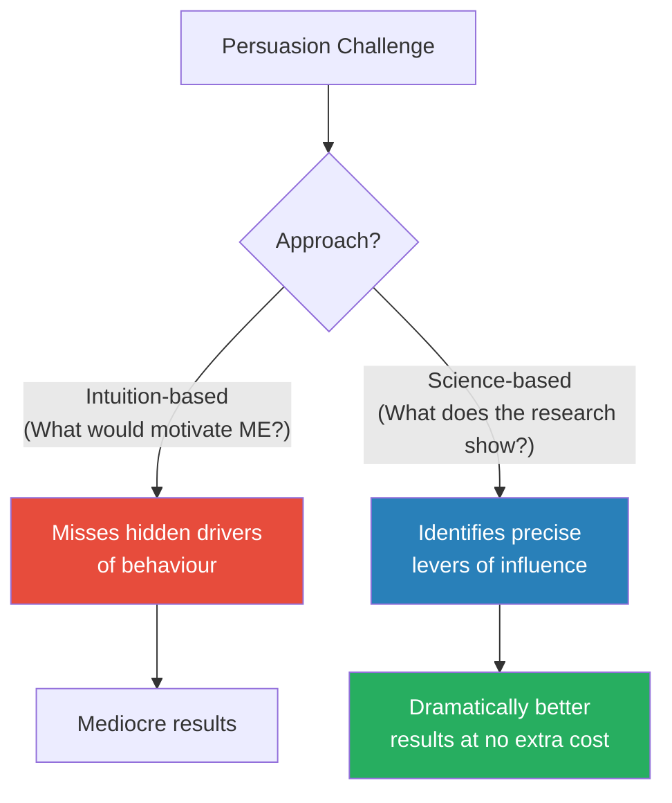
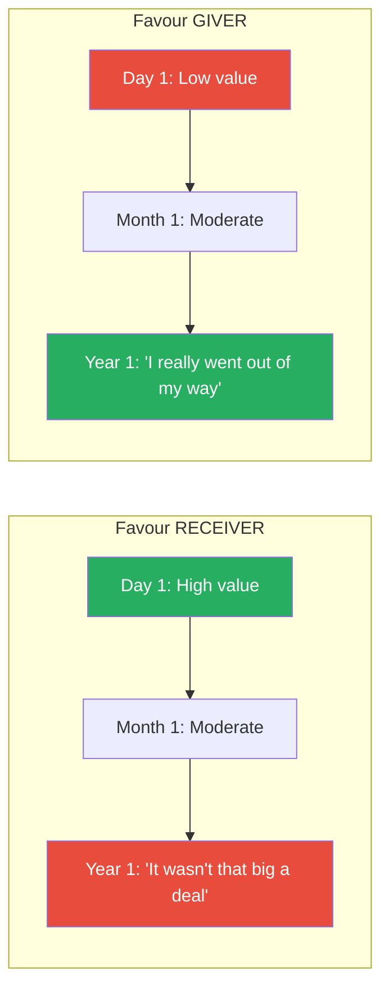
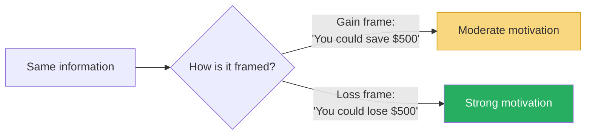
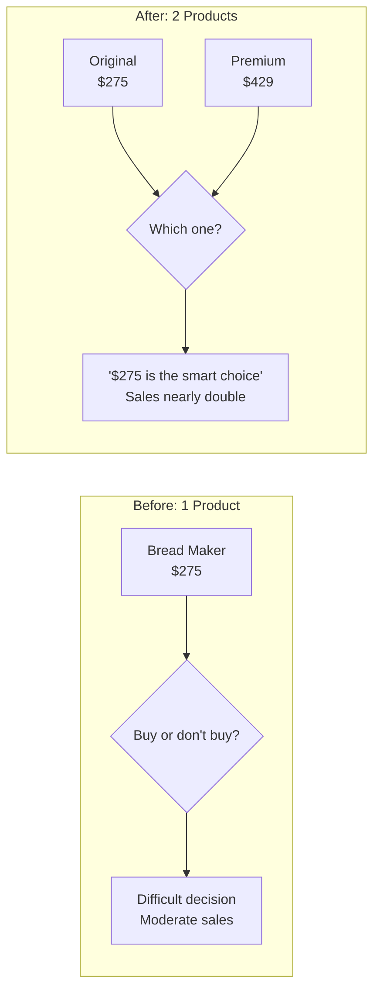
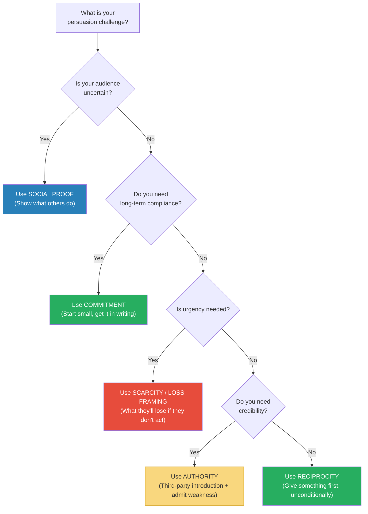

# Yes! 50 Scientifically Proven Ways to Be Persuasive — Goldstein, Martin & Cialdini

> Where *Influence* explains the six principles of persuasion and *Pre-Suasion* reveals the art of timing, *Yes!* is the recipe book — fifty short, research-backed chapters, each describing one specific technique that has been scientifically proven to increase the likelihood of hearing "yes."
> Co-authored by Robert Cialdini himself with two of his research collaborators, Noah Goldstein and Steve Martin, the book translates decades of social psychology experiments into immediately actionable tactics for business, marketing, negotiation, management, and daily life.
> Each chapter follows the same elegant format: a surprising research finding, the psychological principle behind it, and a concrete suggestion for how to apply it.
> The genius is in the specificity — this is not "be more persuasive" advice but "change these three words in your hotel bathroom sign and towel reuse will jump 33 percent" advice.
> It is the most immediately applicable persuasion book in existence — you can read a chapter in five minutes and deploy the technique the same afternoon.
> And because every technique is grounded in peer-reviewed research rather than anecdote, you can trust the advice in a way that most influence books do not earn.

---

## About the Author

Noah J. Goldstein is a professor of management and organisations at the UCLA Anderson School of Management, where his research focuses on the science of social influence and persuasion.
He has published extensively in top academic journals including the *Journal of Personality and Social Psychology* and the *Journal of Consumer Research*.

Steve J. Martin is a behavioural science author, speaker, and consultant based in the UK.
He is the co-author of several books with Cialdini and regularly advises organisations including the UK government's Behavioural Insights Team on applying persuasion science to policy and business.

Robert B. Cialdini is Regents' Professor Emeritus of Psychology and Marketing at Arizona State University and the author of *Influence: The Psychology of Persuasion*, one of the most cited books in social psychology.
His involvement in *Yes!* ensures that the fifty techniques are grounded in the same empirical rigour that made *Influence* the foundational text of the field.

Together, the three authors bridge academic research and real-world application in a way that neither pure academics nor pure practitioners can match alone.

---

## The Big Idea

- The book's central insight is both obvious and underappreciated: <b style="color: #2980b9">small changes in how a message is framed can produce enormous differences in compliance</b>
- These are not vague "be more confident" tips — they are precise, tested modifications: change three words, rearrange the sequence, add one piece of information, remove another
- The fifty techniques are organised loosely around Cialdini's six principles of influence — reciprocity, commitment/consistency, social proof, authority, liking, and scarcity — but many chapters reveal additional mechanisms that operate independently
- <b style="color: #27ae60">The persuasion process is governed by psychological laws, which means that similar procedures produce similar results across a wide range of situations</b>
- This means persuasion is learnable, teachable, and systematically improvable
- The authors draw a sharp distinction between persuasion as an art (relying on talent and intuition) and persuasion as a science (relying on tested principles and replicable methods)
- <b style="color: #e74c3c">The most common mistake in persuasion is relying on introspection — asking "what would motivate me?" rather than consulting the evidence</b>

---

- The research consistently shows that people are poor judges of what influences their own behaviour
- When asked whether other people's behaviour influences their choices, subjects insist it does not — yet experiments show it does, dramatically
- This means that the most effective persuasion strategies are often counterintuitive — they work not because they feel like they should work, but because the science proves they do
- <b style="color: #2980b9">The book's promise: by making small, evidence-based adjustments to your messages, you can achieve dramatically better outcomes at virtually no additional cost</b>

---

## Key Concepts at a Glance

| # | Technique | Principle | One-Line Finding |
|---|-----------|-----------|-----------------|
| 1 | "If operators are busy, please call again" | Social proof | Implying high demand increased sales more than "operators are waiting" |
| 2 | Hotel towel signs — "Most guests reuse" | Social proof + similarity | Social proof outperformed environmental appeals by 26%; same-room social proof by 33% |
| 3 | Negative social proof backfire | Social proof | "Many people litter" almost TRIPLED theft at Petrified Forest vs control |
| 4 | The smiley face effect | Social proof + approval | A simple smiley face prevented low-energy users from increasing consumption |
| 5 | Too many choices paralyse | Choice overload | 24 jam options = 3% purchased; 6 options = 30% purchased |
| 6 | Free gifts that backfire | Reciprocity + value perception | Adding a cheap bonus REDUCED perceived value of a premium product |
| 7 | The decoy effect | Contrast | Adding an inferior option made the target option more attractive |
| 8 | Fear without action plan | Fear appeals | Fear messages paralyse without a specific, concrete action step |
| 9 | Post-it notes on surveys | Reciprocity + personalisation | A handwritten post-it note on a survey doubled return rates |
| 10 | Mints and tips | Reciprocity + personalisation | Personalised mints increased waiter tips by 23% |
| 11 | "No strings attached" gifts | Reciprocity | Unconditional gifts create stronger obligation than conditional ones |
| 12 | Favours are like wine | Reciprocity + time | The perceived value of a favour GROWS over time for the giver but SHRINKS for the recipient |
| 13 | Foot-in-the-door | Commitment | Small initial commitment dramatically increases later compliance |
| 14 | Active commitments | Commitment | Written and public commitments are far more durable than verbal/private ones |
| 15 | Labelling people positively | Commitment + identity | Telling voters they are "above-average citizens" increased turnout |
| 16 | "Do you consider yourself helpful?" | Commitment + consistency | This single question doubled survey compliance from 29% to 77% |
| 17 | Benjamin Franklin effect | Cognitive dissonance | Asking a RIVAL for a favour makes them like you MORE |
| 18 | Low-ball then reveal | Anchoring + commitment | Even-a-penny-will-help dramatically increases donation rates |
| 19 | Start high on eBay? | Anchoring | Lower starting prices attracted more bidders and produced HIGHER final prices |
| 20 | Admit a weakness first | Authority + trust | "We're #2, so we try harder" (Avis) builds credibility for all subsequent claims |
| 21 | Name similarity | Liking | People named Dennis are disproportionately likely to become dentists |
| 22 | Mirroring language | Liking + rapport | Waiters who repeated orders verbatim got 70% higher tips |
| 23 | Genuine smile detection | Liking | People can detect fake smiles; authentic warmth persuades, performance does not |
| 24 | Loss framing | Scarcity + loss aversion | "What you'll lose" outperforms "what you'll gain" by 30-40% |
| 25 | The word "because" | Click-whirr | Adding ANY reason after "because" raised compliance from 60% to 93% |
| 26 | Rhyming = believable | Fluency | "Caution and measure win you treasure" rated MORE TRUE than the non-rhyming version |
| 27 | Easy-to-pronounce names | Fluency | Stocks with easy-to-pronounce ticker symbols outperformed in early trading |
| 28 | Head start loyalty cards | Goal gradient | A 12-stamp card with 2 pre-filled stamps got completed faster than a 10-stamp blank card |

---

> [!tip] How to Use This Summary
> The fifty techniques are grouped below into thematic clusters rather than listed 1-50. Each cluster covers techniques that share a common psychological principle, with the research details and practical applications for each. Think of this as a persuasion reference manual — dip in when you need a specific technique, not necessarily read front to back.

---

## Social Proof: The Power of What Others Do

*The largest cluster of techniques in the book revolves around social proof — our tendency to look at what others are doing to determine what we should do. The research shows this tendency is both more powerful and more specific than most people realise.*

### Chapter 1: "If Operators Are Busy, Please Call Again"

- Infomercial writer Colleen Szot changed three words in a standard call-to-action and shattered a nearly twenty-year sales record
- The old line: "Operators are waiting, please call now"
- The new line: <b style="color: #2980b9">"If operators are busy, please call again"</b>
- On the surface, this seems foolish — telling customers they might have to wait should reduce sales, not increase them
- But the old line conjured an image of bored operators filing their nails by silent phones — signalling low demand
- The new line conjured an image of operators going from call to call without a break — signalling <b style="color: #27ae60">massive demand</b>
- Viewers unconsciously reasoned: "If the lines are busy, other people like me are calling too — this must be worth buying"

> [!tip] Core Principle
> Social proof operates most powerfully when it is implied rather than stated. Don't say "Our product is popular." Create conditions where the audience infers popularity from environmental cues — busy phone lines, waitlists, sold-out signs, "limited stock" labels.

---

### Chapters 2-3: The Hotel Towel Experiments

*The book opens with the research that started it all — a series of hotel towel reuse experiments that demonstrate the precision of social proof.*

- Hotels typically encourage guests to reuse towels with environmental messages: "Help save the environment by reusing your towels"
- The authors tested an alternative: <b style="color: #2980b9">"The majority of guests at this hotel reuse their towels at least once during their stay"</b>
- Result: the social proof message increased towel reuse by <b style="color: #27ae60">26%</b> compared to the environmental message

> [!example] The Same-Room Effect
> In a follow-up study, the authors tested an even more specific social proof message: "The majority of guests who stayed IN THIS ROOM reused their towels."
> This same-room message outperformed both the environmental message AND the general hotel social proof message — a **33% increase** over the industry standard.
> There is no rational reason why the behaviour of previous occupants of your specific room should matter more than the behaviour of all hotel guests. But it does, because <b style="color: #2980b9">the more similar the reference group, the more powerful the social proof</b>.

- The practical implication is precise: when using testimonials or social proof, <b style="color: #27ae60">match the reference group to the target audience as closely as possible</b>
- A salon owner is more persuaded by what other salon owners did than by what GM executives did
- A student is more persuaded by a similar student's experience than by a star pupil's

---

### Chapter 3: The Petrified Forest Disaster — When Social Proof Backfires

*One of the book's most striking findings: a well-intentioned anti-theft sign almost TRIPLED theft.*

- Arizona's Petrified Forest National Park loses 14 tons of petrified wood to theft every year
- The park posted signs reading: <b style="color: #e74c3c">"Your heritage is being vandalized every day by theft losses of petrified wood of 14 tons a year, mostly a small piece at a time"</b>
- The sign was accompanied by images of several visitors taking wood
- The authors conducted an experiment: they placed marked pieces of wood along pathways and varied the signage

| Sign Type | Theft Rate |
|-----------|:----------:|
| No sign (control) | 2.92% |
| "Please don't remove wood" (with image of one thief + red "No" symbol) | 1.67% |
| "Many visitors have removed wood" (negative social proof) | **7.92%** |

- <b style="color: #e74c3c">The negative social proof sign almost tripled theft compared to no sign at all</b>
- It was not a crime prevention strategy — it was a crime promotion strategy

> [!warning] The Negative Social Proof Trap
> Whenever you communicate that a problem is widespread, you are simultaneously communicating that the behaviour is normal. "Most people don't recycle" makes not-recycling seem acceptable. "Voter turnout is at an all-time low" makes not-voting seem normal. "4 years ago, 22 million single women did not vote" tells single women that not voting is what people like them do.
> **The fix:** Reframe the statistic to highlight the positive majority. "The vast majority of visitors leave the petrified wood untouched" turns the same data into a persuasion tool rather than a sabotage tool.

> [!example] A Former Graduate Student's Fiancée
> One of the authors learned about the Petrified Forest problem from a former graduate student who visited the park with his fiancée — "the most honest person he'd ever known, someone who had never borrowed a paper clip without returning it."
> Upon reading the sign about how much wood was being stolen, she nudged him and whispered: <b style="color: #e74c3c">"We'd better get ours now."</b>
> The sign had converted the most honest person the student knew into a would-be thief — through the sheer power of negative social proof.

---

### Chapter 4: The Smiley Face That Saved Energy

- In a California study, 300 households received feedback on their energy consumption relative to the neighbourhood average
- Those who used more than average reduced consumption by 5.7% — encouraging
- <b style="color: #e74c3c">But those who used less than average INCREASED consumption by 8.6%</b> — the norm acted as a "magnetic middle," pulling both groups toward the average
- The fix was remarkably simple: researchers added a <b style="color: #27ae60">smiley face</b> to the feedback for low-consumption households
- The smiley face completely eliminated the boomerang effect — low users maintained their good behaviour
- <b style="color: #27ae60">A tiny symbol of social approval was enough to counteract the pull of the descriptive norm</b>

> [!danger] Before: Descriptive norm only
> "Your energy use is 20% below average." 
> Result: Household INCREASES usage toward the average.

> [!success] After: Descriptive norm + approval
> "Your energy use is 20% below average. 😊"
> Result: Household MAINTAINS low usage.

- The lesson extends far beyond energy: <b style="color: #2980b9">whenever you praise someone for being above average, pair it with a signal of approval</b> — otherwise the norm pulls them backward

---

### Chapter 5: When Too Many Choices Paralyse

- Sheena Iyengar's famous jam study: a supermarket displayed either 6 or 24 flavours of jam
- <b style="color: #2980b9">6 flavours: 30% of samplers purchased. 24 flavours: only 3% purchased.</b>
- A tenfold difference in sales from reducing options
- The same pattern appeared in retirement plans: for every 10 additional fund choices offered, participation dropped nearly 2%
- When Procter & Gamble reduced Head & Shoulders from 26 varieties to 15, sales jumped 10%
- <b style="color: #27ae60">The fix: reduce unnecessary options. Help customers make decisions rather than forcing them to choose among overwhelming alternatives.</b>

> [!tip] The Paradox of Choice in Practice
> If you sell multiple products or services, review your portfolio for redundancy. Where customers are uncertain about what they want, fewer options produce MORE sales, not fewer. This is counterintuitive but replicable across domains — from jam to retirement plans to shampoo.

---

## Reciprocity: The Power of Giving First

*The second major cluster applies the reciprocity principle — our deep-seated obligation to return favours, gifts, and concessions. The research reveals that small, personalised, unexpected gifts produce disproportionate returns.*

### Chapter 10: The Post-It Note That Doubled Compliance

- Social scientist Randy Garner sent out surveys with one of three conditions:
  - (a) A handwritten Post-it note requesting completion, attached to a cover letter
  - (b) A similar handwritten message on the cover letter itself
  - (c) The cover letter and survey alone

| Condition | Response Rate |
|-----------|:------------:|
| Handwritten Post-it note | **75%** |
| Handwritten message on cover letter | 48% |
| Cover letter alone | 36% |

- A follow-up test: blank Post-it note (43%) vs handwritten Post-it note (69%) vs no Post-it (34%)
- <b style="color: #2980b9">The Post-it note worked not because it grabbed attention but because it signalled personal effort</b>
- Recipients recognised the extra touch — finding a note, writing on it, sticking it on — and felt obligated to reciprocate
- When Garner added initials and "Thank You!" to the note, response rates climbed even higher
- Those who received the personalised note also returned surveys <b style="color: #27ae60">faster, with more detailed answers and greater care</b>

> [!tip] The Personalisation Principle
> An ounce of personalised effort is worth a pound of persuasion. The more a request feels like it was crafted for you specifically — not mass-produced — the more you feel obligated to respond. In business: handwrite notes on proposals, personalise email subject lines, reference specific details from previous conversations.

---

### Chapter 11: The Mint Experiment — How Waiters Increased Tips by 23%

- Behavioural scientist David Strohmetz tested the effect of giving diners candy with the bill
- <b style="color: #2980b9">One candy per diner:</b> tips increased 3.3% — modest, predictable
- <b style="color: #2980b9">Two candies per diner:</b> tips increased 14.1% — proportional to the gift
- <b style="color: #2980b9">The genius condition:</b> the waiter gave one candy, turned to leave, then turned back and said "Oh, for you nice people, here's an extra candy each" — tips increased <b style="color: #27ae60">23%</b>

- The third condition used the same number of candies as the second — but the tips were 64% higher
- The difference: the second candy was <b style="color: #27ae60">unexpected</b> (the waiter had already turned away) and <b style="color: #27ae60">personalised</b> ("for you nice people")

> [!example] The Three Factors of a Persuasive Gift
> The research reveals that gifts are most powerful when they are:
> 1. **Significant** — two candies felt meaningful where one felt pro forma (even though both cost pennies)
> 2. **Unexpected** — the waiter turning back after appearing to leave created surprise
> 3. **Personalised** — "for you nice people" made it feel like a special gesture, not a routine
> Any gift or favour you give can be enhanced by maximising these three factors.

---

### Chapter 12: No Strings Attached — Why Unconditional Gifts Outperform Incentives

- Many hotels try incentive-based towel reuse: "If you reuse your towels, we'll donate to an environmental charity"
- The authors tested this against a reciprocity-based message: "We've already donated to an environmental charity on your behalf — please reuse your towels"
- <b style="color: #27ae60">The reciprocity-based message produced 45% more towel reuse than the incentive-based message</b>
- Both messages mentioned the same donation — but the sequence was reversed
- The incentive says: "Do something for us and we'll give you something" — an economic transaction
- The reciprocity message says: "We've already given you something — now it's your turn" — a social obligation
- <b style="color: #2980b9">Unconditional gifts create social obligations. Conditional incentives create economic transactions. Social obligations are far more powerful.</b>

> [!danger] Before: Incentive approach
> "If you complete this survey, you'll be entered into a prize draw."
> Result: Economic calculation — "Is the prize worth my time?" Usually, no.

> [!success] After: Reciprocity approach
> "Here's a $1 bill enclosed with this survey. We appreciate your time in advance."
> Result: Social obligation — "They already gave me something. I should reciprocate."

---

### Chapter 13: Favours Are Like Wine, Not Bread

- Francis Flynn's research on how the perceived value of favours changes over time:
- <b style="color: #2980b9">For the RECEIVER:</b> a favour's perceived value is highest right after it's performed, then fades over time (like bread going stale)
- <b style="color: #e74c3c">For the GIVER:</b> a favour's perceived value is lowest right after it's performed, then grows over time (like wine improving with age)
- This asymmetry creates a dangerous gap: the giver remembers the favour as increasingly significant while the receiver remembers it as increasingly trivial
- If you've done someone a favour, <b style="color: #27ae60">cash in the reciprocity soon — don't wait</b>
- If someone has done you a favour, <b style="color: #27ae60">be aware that you're probably undervaluing it over time</b>

> [!tip] Practical Application
> When doing a favour for a colleague, gently establish the reciprocity frame at the time of the favour: "Happy to help — I know you'd do the same for me if the situation were reversed." This anchors the value of the favour while it's still fresh in the receiver's mind.

---

### Chapter 9: Bobby Fischer and the Power of Long-Term Reciprocity

- In 1972, Bobby Fischer played Boris Spassky in Iceland in the Chess Match of the Century — putting Iceland on the international map for the first time
- Over thirty years later, when Fischer was a fugitive from US law enforcement, Iceland's parliament voted overwhelmingly to grant him citizenship — despite strong pressure from the United States
- An Icelandic foreign affairs representative explained: "He contributed to a rather special event here, over thirty years ago but that people remember very well"
- <b style="color: #2980b9">The norm of reciprocity transcended three decades, international politics, and Fischer's widely disliked personality</b>
- Dennis Regan's classic study confirmed this: people who received a small unsolicited gift (a Coke) bought twice as many raffle tickets from the giver — regardless of whether they liked the giver or not
- <b style="color: #27ae60">You don't have to be liked to benefit from reciprocity. You just have to be generous.</b>

> [!example] The Customer Service Hack
> Before making your toughest request to a customer service agent, tell them you'd like to speak to their supervisor afterward — to pay them a compliment about their excellent service so far.
> This creates an immediate reciprocity obligation: you've offered to do something nice for them, so they feel obligated to do something nice for you.
> It costs you nothing but a two-minute phone call to the supervisor. It may save you hours of frustration.

---

## Commitment & Consistency: The Stickiness of Small Steps

*Once we commit to something — especially publicly, in writing, or through effort — we feel internal pressure to behave consistently with that commitment. The book's commitment techniques exploit this with surgical precision.*

### Chapter 14: The Foot-in-the-Door Technique

- Freedman and Fraser's landmark study: homeowners asked to place a huge, ugly "DRIVE CAREFULLY" billboard on their lawn
- <b style="color: #2980b9">Without prior commitment: 17% agreed</b>
- <b style="color: #27ae60">With a tiny prior commitment (displaying a small window sign two weeks earlier): 76% agreed</b>
- The small sign changed their self-image — they now saw themselves as the kind of people who support public safety causes
- When the large request came, agreeing was consistent with who they had become

> [!example] The "Even-a-Penny-Will-Help" Technique (Chapter 20)
> Researchers went door to door asking for donations to the American Cancer Society.
> Half used the standard request. The other half added: "Even a penny will help."
> The even-a-penny group received donations from <b style="color: #27ae60">nearly twice as many people</b> — and the average donation was NOT smaller.
> By legitimising the smallest possible contribution, they removed the excuse for not giving at all. And once people committed to giving (even a penny), they gave generously to stay consistent with their self-image as charitable people.

---

### Chapter 16: "Do You Consider Yourself a Helpful Person?"

- Researchers stopped people and asked them to take a survey
- Standard request: <b style="color: #e74c3c">29% agreed</b>
- Pre-question "Do you consider yourself a helpful person?" followed by the survey request: <b style="color: #27ae60">77.3% agreed</b>
- 97% of people answered "yes" to the helpful question — because saying "no" would feel like a negative self-assessment
- In that privileged moment after publicly affirming their helpful identity, they were trapped by consistency: refusing the survey would contradict who they had just declared themselves to be
- <b style="color: #2980b9">This is Cialdini's Pre-Suasion in miniature — a single question that reshapes the decision context before the real request arrives</b>

---

### Chapter 17: The Active Ingredient in Lasting Commitments

- <b style="color: #2980b9">Written commitments are more durable than verbal ones</b>
- <b style="color: #2980b9">Public commitments are more durable than private ones</b>
- <b style="color: #2980b9">Effortful commitments are more durable than easy ones</b>
- Chinese POW camp commanders in the Korean War understood this perfectly — they had prisoners write essays, sign petitions, and read statements on camp radio, each small step reinforcing a shift in self-image (as described in [[Influence - Robert Cialdini|Influence]])
- The practical application: whenever you need someone to follow through on a commitment, get it in writing, make it public, and ensure they invested effort in creating it

> [!tip] The Commitment Checklist
> Before assuming someone will follow through on an agreement, check how many of these the commitment includes:
> - [ ] Written down (not just spoken)
> - [ ] Made publicly (others know about it)
> - [ ] Required effort to create (not just a checkbox)
> - [ ] Voluntary (not coerced)
> - [ ] Linked to identity ("I'm the kind of person who...")
> The more boxes checked, the more likely the commitment will stick.

---

## Authority & Trust: The Paradox of Admitting Weakness

*Several of the book's most counterintuitive findings involve the authority principle — and the surprising discovery that admitting weakness INCREASES perceived authority.*

### Chapter 22: How to Show Off Without Being a Show-Off

- If you tell people you're an expert, they'll think you're arrogant
- If someone ELSE tells people you're an expert, they'll believe it — even if that person is obviously paid to say it
- <b style="color: #2980b9">The fundamental attribution error</b>: we underestimate how much situational factors (like being paid) influence behaviour, so we take the agent's praise at face value
- A study showed that an author was rated more favourably on nearly every dimension — especially likability — when praised by his agent than when praising himself, despite identical words

> [!example] The Real Estate Receptionist
> The authors worked with a real estate agency where the receptionist simply said "Let me put you through to Judy" or "Let me transfer you to Sheldon."
> After the intervention, the receptionist said: "Rentals? You need Judy — she has over fifteen years' experience renting properties in this neighbourhood. Let me put you through."
> And: "I'm going to put you through to Sheldon, our head of sales. Sheldon has twenty years of experience and recently sold a property very similar to yours."
> Four things to note: (1) everything said was true, (2) it didn't matter that the receptionist was obviously connected to Judy and Sheldon, (3) appointments increased significantly, and (4) it cost nothing to implement.

- <b style="color: #27ae60">The lesson: arrange for someone else to introduce your expertise. If that's not possible, display your credentials visibly.</b>
- A group of physicians' assistants who were struggling with patient non-compliance simply put their diplomas and certificates on the wall of the examining room — patient compliance increased dramatically

---

### Chapters 26-27: The Power of Admitting Weakness

- Volkswagen Beetle's legendary campaign: "Ugly is only skin deep" and "It will stay uglier longer"
- Rather than hiding the car's aesthetic weakness, they led with it — and sales exploded
- The mechanism: <b style="color: #2980b9">arguing against your own interest creates the perception of honesty and trustworthiness</b>
- Once you're perceived as honest, your genuine strengths become far more persuasive

| Brand | Admitted Weakness | Hidden Strength Amplified |
|-------|------------------|--------------------------|
| **Volkswagen** | "Ugly" | Durability, fuel economy, price |
| **Avis** | "We're #2" | "But we try harder" |
| **Listerine** | "The taste you hate" | "Three times a day" (implied effectiveness) |
| **L'Oreal** | "We're more expensive" | "But you're worth it" |
| **Motel 6** | "Our rooms aren't fancy" | "But our prices aren't fancy" |

> [!warning] Critical Rule
> The weakness you admit must be genuinely minor AND the strength that follows must be RELATED to the weakness. Research by Gerd Bohner showed that a restaurant described as "small but cosy" was rated higher than one described as "small but great parking." The positive must neutralise the specific negative, not just exist alongside it.

> [!example] Ronald Reagan's Age
> During the 1984 presidential debate, Reagan (73) addressed concerns about his age head-on: "I will not make age an issue of this campaign. I am not going to exploit for political purposes my opponent's youth and inexperience."
> The audience — and his opponent Walter Mondale — laughed. Reagan won in one of the biggest landslides in presidential history.
> He didn't hide the weakness. He transformed it into a strength.

---

### Chapter 28: When to Admit You Were Wrong

- After JetBlue stranded thousands of passengers in a 2007 winter storm, they had a choice: blame the weather or blame themselves
- They chose to blame themselves — admitting internal failures in preparation and decision-making
- Fiona Lee's research: companies that attribute failures to internal causes are perceived as having MORE control over their future
- <b style="color: #27ae60">Blaming external factors makes you look powerless. Blaming yourself makes you look capable of fixing the problem.</b>
- A study of annual reports over 21 years found that companies attributing poor performance to internal factors had <b style="color: #27ae60">higher stock prices one year later</b> than those blaming external factors
- <b style="color: #2980b9">Admit the mistake, then immediately present the action plan to fix it</b>

> [!danger] Before: External blame
> "The drop in earnings is attributable to unexpected market conditions and increased international competition. These conditions are completely outside our control."
> Result: Investors see a company that is helpless and at the mercy of external forces.

> [!success] After: Internal accountability
> "The drop in earnings is primarily attributable to strategic decisions we made last year. We were not fully prepared for the conditions that emerged. Here is our plan to address this."
> Result: Investors see a company that understands what went wrong and has the power to fix it.

---

## Liking & Similarity: The Hidden Drivers of Preference

### Chapter 29: When Your Name Is Your Game

- People named Dennis are disproportionately likely to become dentists
- People named Louis are disproportionately likely to live in St. Louis
- People named Georgia are disproportionately likely to live in Georgia
- <b style="color: #2980b9">This is "implicit egoism" — we unconsciously gravitate toward things that resemble ourselves, including our own names</b>
- Coca-Cola's "Share a Coke" campaign replaced its branding with 150 common first names — producing the first sales increase in a decade
- Microfinance loans are more likely to be funded when the lender's initials match the borrower's

> [!tip] Practical Application
> When possible, highlight any genuine similarity between yourself and your audience — shared birthplace, shared experience, shared challenge. Even trivial similarities (same birthday, same initials) measurably increase cooperation and compliance.

---

### Chapter 31: What Waiters Can Teach About Rapport

- Dutch researcher Rick van Baaren studied restaurant servers and found that <b style="color: #2980b9">waiters who repeated customers' orders verbatim received 70% higher tips</b> than those who paraphrased
- Simply mirroring language — without adding anything — created a sense of rapport and liking
- This is the behavioural mechanism behind "mirroring and matching" in sales and negotiation
- <b style="color: #27ae60">You don't need to add value to what someone says to build rapport — sometimes you just need to reflect it back accurately</b>

---

## Scarcity & Loss: The Urgency Drivers

### Chapter 34: Loss Framing — What You Stand to Lose

- People are <b style="color: #e74c3c">more motivated by the thought of losing something than by the thought of gaining something of equal value</b>
- Homeowners told how much money they could LOSE from inadequate insulation were more likely to insulate than those told how much they could SAVE
- Health pamphlets urging breast self-examination were more successful when framed as "what you stand to lose by NOT examining" than "what you stand to gain by examining"
- <b style="color: #2980b9">When crafting any persuasive message, ask: can I frame this in terms of what the audience will lose if they DON'T act?</b>

---

## Cognitive Fluency: When Easy = True

### Chapter 35: The Word "Because"

- Ellen Langer's famous Xerox study (also covered in *Influence*): adding ANY reason after "because" raised compliance from 60% to 93%
- "May I use the Xerox machine because I need to make copies?" — a non-reason — was nearly as effective as a real reason
- <b style="color: #2980b9">The word "because" triggers automatic compliance, even when the reason is meaningless</b>

### Chapter 38: How Rhyme Makes Influence Climb

- "Caution and measure win you treasure" was rated as <b style="color: #27ae60">MORE TRUE</b> than "Caution and measure will win you riches" — despite identical meaning
- Rhyming statements feel more fluent to process — and <b style="color: #2980b9">fluency is mistaken for truth</b>
- "If the glove don't fit, you must acquit" — Johnnie Cochran's famous defence of O.J. Simpson — leveraged this exact effect
- <b style="color: #27ae60">When you want a message to be believed, make it rhyme. When you want a name to be liked, make it easy to pronounce.</b>

### Chapter 37: Easy Names Win

- An analysis of 500 attorneys at 10 US law firms: <b style="color: #e74c3c">the harder an attorney's name was to pronounce, the lower they stayed in the firm's hierarchy</b>
- Stocks with easy-to-pronounce ticker symbols outperformed those with hard-to-pronounce ones in early trading
- This held independent of the foreignness of the name — a hard-to-pronounce foreign name performed worse than an easy-to-pronounce foreign name
- <b style="color: #2980b9">Cognitive fluency — the ease of processing — is mistaken for quality, truth, and value</b>

---

### Chapter 40: The Head Start Effect

- A coffee shop loyalty card experiment: customers got either a 10-stamp card (blank) or a 12-stamp card with 2 stamps pre-filled
- Both required 10 purchases to complete
- <b style="color: #27ae60">The 12-stamp card (with head start) was completed by 34% of customers vs only 19% for the 10-stamp card</b>
- The illusion of progress motivates continued effort — even when the "progress" was given for free
- <b style="color: #2980b9">This is the "goal gradient effect" — the closer we perceive ourselves to a goal, the harder we work to reach it</b>

> [!tip] Business Application
> When designing loyalty programmes, give customers a head start. A "Buy 12, get 1 free" card with 2 stamps pre-filled outperforms a "Buy 10, get 1 free" blank card — even though both require exactly 10 purchases. The perception of progress matters more than the reality.

---

## Fear Appeals: When Fear Paralyses Instead of Motivates

### Chapter 8: Fear Without an Action Plan Is Useless

- Franklin Roosevelt: "The only thing we have to fear is fear itself — which paralyses needed efforts to convert retreat into advance"
- Research confirms Roosevelt was right — but with a critical qualification
- <b style="color: #2980b9">Fear-arousing messages DO motivate action — but ONLY when accompanied by clear, specific, achievable steps to reduce the danger</b>
- Without those steps, fear causes denial, avoidance, and paralysis

> [!example] The Tetanus Study
> Howard Leventhal gave students a pamphlet about the dangers of tetanus.
> - High-fear pamphlet WITHOUT specific action plan: students were scared but took no action
> - High-fear pamphlet WITH a specific plan (where to get a tetanus shot, when the clinic was open): students got the shot
> - Low-fear pamphlet WITH action plan: students also got the shot, but less urgently
> <b style="color: #27ae60">The action plan was the decisive factor, not the fear level.</b>

- The practical implication is stark: if you're trying to motivate behaviour change through fear (health warnings, security briefings, environmental campaigns), you MUST pair the scary message with a concrete, easy-to-follow action step
- <b style="color: #e74c3c">A physician who tells a patient "You'll get diabetes if you don't lose weight" without providing a specific diet and exercise plan is likely creating denial, not motivation</b>
- The amended version of Roosevelt's quote: "The only thing we have to fear is fear BY ITSELF"

> [!danger] Before: Fear alone
> "If you don't upgrade your cybersecurity, you WILL be hacked."
> Result: IT managers feel anxious, overwhelmed, and do nothing.

> [!success] After: Fear + specific action plan
> "If you don't upgrade your cybersecurity, you will be hacked. Here are the three steps to take this week: [1] Enable two-factor authentication, [2] Update all software to latest versions, [3] Schedule a security audit for next month."
> Result: IT managers take action because the fear is channelled into a clear path.

---

## The Decoy Effect: How Adding Options Changes Choices

### Chapter 7: The Bread Maker That Doubled Sales of Its Rival

- Williams-Sonoma introduced a premium bread maker that was far superior to their existing best-seller
- <b style="color: #27ae60">Sales of the EXISTING best-seller nearly doubled</b>
- Why? Itamar Simonson's <b style="color: #2980b9">compromise effect</b>: when choosing between two options, people favour the compromise — the middle option
- With only one bread maker, it was either "buy or don't buy" — a difficult decision
- With two bread makers (moderate and premium), the moderate one became the safe "compromise choice"
- The premium option made the original look like a wise, economical purchase by comparison

> [!tip] The Decoy in Practice
> If you want to sell your mid-range product, introduce a premium option above it. The premium doesn't need to sell well — its job is to make the mid-range look like a smart compromise.
> Wine lists should put expensive bottles at the TOP, not hidden at the bottom. This makes the second-most-expensive bottle look like excellent value.
> If you're pitching three options to a client and want them to choose the middle one, make sure the most expensive option is presented first.

---

### Chapter 6: When a Bonus Becomes an Onus

- Priya Raghubir's study: a pearl bracelet bundled FREE with a bottle of liquor was valued at <b style="color: #e74c3c">35% less</b> than the identical bracelet presented alone
- <b style="color: #2980b9">Offering something for free signals that it has no value</b> — "If it were good, why would they give it away?"
- The fix: always state the true value of the free item
- Don't say "Free security software included" — say <b style="color: #27ae60">"$250 security software included at no cost to you"</b>
- Numerically, "free" = $0.00 — not the message you want to send about your product

> [!warning] The Free Trap
> Anytime you offer something for free — a bonus product, a service add-on, your personal time — you risk devaluing it in the recipient's eyes. Always communicate the true value of what you're giving. "I was happy to stay an extra hour to help with the proposal — I know how important this deal is to you" is infinitely more influential than just staying late and saying nothing.

---

## The Benjamin Franklin Effect: Turn Enemies into Allies

### Chapter 19: Ask a Rival for a Favour

- Benjamin Franklin once dealt with a hostile political rival by asking to borrow a rare book from the man's library
- The rival was flattered, lent the book, and — counterintuitively — <b style="color: #27ae60">became friendlier toward Franklin afterward</b>
- Franklin wrote: "He that has once done you a kindness will be more ready to do you another, than he whom you yourself have obliged"
- The mechanism: <b style="color: #2980b9">cognitive dissonance</b> — "I did a favour for this person, so I must like them. Why else would I have helped?"
- The favour-doer adjusts their attitude to match their behaviour
- This is the REVERSE of the expected direction — normally we do favours for people we like, but the Franklin effect shows that doing a favour CREATES liking

> [!example] Jecker and Landy's Study
> Students who won money in a contest were either (a) asked by the researcher to return the money because the department was short on funds, (b) asked by a secretary to return it, or (c) not asked at all.
> Those asked by the researcher — and who returned the money — rated the researcher as MORE likeable than either of the other groups.
> <b style="color: #27ae60">Doing the researcher a favour (returning the money) made them like him more.</b>

- Practical application: if you have a difficult colleague or client, don't try to win them over by doing favours FOR them — ask them to do a small favour for YOU
- This creates cognitive dissonance that resolves in your favour

---

## Error-Based Learning: Learning More from Failure

### Chapter 25: When the Right Way Is the Wrong Way

- Researcher Wendy Joung tested two types of training for firefighters:
  1. Case studies of firefighters who made GOOD decisions → moderate improvement
  2. Case studies of firefighters who made BAD decisions → <b style="color: #27ae60">significantly greater improvement in judgment and adaptive thinking</b>
- <b style="color: #2980b9">We learn more from studying errors than from studying successes</b>
- This runs counter to how most organisations train: they focus on "best practices" and success stories
- The evidence says they should dedicate significant training time to studying past errors — what went wrong and how it could have been avoided

> [!tip] Training Redesign
> If you run any training programme — corporate, educational, medical, military — review the balance between success-based and error-based content. The research suggests that a substantial portion should cover: (1) real or realistic errors, (2) the context in which they occurred, (3) why they seemed like reasonable decisions at the time, and (4) what should have been done instead.

---

## Dissent and Collaboration: Getting Better Decisions from Groups

### Chapter 23: The Danger of Being the Smartest Person in the Room

- James Watson, co-discoverer of DNA's double helix, said their success came partly because they were NOT the most intelligent scientists working on the problem
- The most intelligent was Rosalind Franklin: <b style="color: #e74c3c">"Rosalind was so intelligent that she rarely sought advice. And if you're the brightest person in the room, then you're in trouble."</b>
- Patrick Laughlin's research: groups that cooperate outperform not just the average member but even the BEST member working alone
- Two reasons: (1) diversity of perspectives sparks insights the lone thinker misses, (2) parallel processing — a group can distribute subtasks

> [!warning] The Leader's Trap
> Leaders who are the most experienced, most skilled, or most knowledgeable in the group are the most likely to make this error — they skip the step of seeking input because they believe they already know the answer. The research is clear: even the best individual decision-maker is beaten by a cooperating group that includes them.

---

### Chapter 24: Devil's Advocate vs True Dissenter

- The Roman Catholic Church used a <b style="color: #2980b9">Devil's Advocate</b> for nearly four centuries to argue against candidates for sainthood
- But Charlan Nemeth's research found that <b style="color: #e74c3c">appointed devil's advocates are much less effective than authentic dissenters</b>
- Why? The group perceives the devil's advocate as disagreeing for the sake of disagreement — it feels like a performance
- A true dissenter, on the other hand, is perceived as principled, which forces the group to genuinely engage with the opposing view
- Pope John Paul II eliminated the devil's advocate position in the 1980s — perhaps recognising its limitations
- <b style="color: #27ae60">The lesson for leaders: don't appoint someone to play devil's advocate. Instead, create an environment where genuine dissent is welcomed and expected.</b>
- Both NASA shuttle disasters (Challenger 1986, Columbia 2003) have been traced partly to a culture where subordinates were afraid to voice dissent

> [!example] The Columbia Investigation
> An investigator asked the chairwoman of the mission management team: "As a manager, how do you seek out dissenting opinions?"
> Her answer: "Well, when I hear about them..."
> The investigator: "By their very nature, you may not have heard about them. What techniques do you use to GET them?"
> She had no answer. Seven astronauts died.

---

## Cross-Cultural Considerations

### Chapters 48-50: Persuasion Across Cultures

- The six principles of influence are universal but their relative power varies by culture
- In <b style="color: #2980b9">individualist cultures</b> (US, UK, Australia): commitment/consistency and personal choice are dominant drivers
- In <b style="color: #2980b9">collectivist cultures</b> (China, Japan, South Korea): social proof and authority carry more weight
- In a cross-cultural study, American managers were most influenced by consistency ("I've committed to this approach"), while Chinese managers were most influenced by authority ("My superior endorsed this approach")
- <b style="color: #27ae60">Before deploying any persuasion technique internationally, consider which principles are most culturally resonant for your audience</b>

| Culture Type | Strongest Principle | Why |
|-------------|-------------------|-----|
| **Individualist** (US, UK, Australia) | Commitment/Consistency | Personal choice and identity drive behaviour |
| **Collectivist** (China, Japan, Korea) | Social Proof / Authority | Group harmony and hierarchical respect dominate |
| **Relationship-oriented** (Latin America, Middle East) | Liking / Reciprocity | Trust and personal bonds precede business |

---

## Anchoring & eBay: The Science of Starting Prices

### Chapter 21: Start Low or Start High? Which Will Make People Buy?

- Conventional wisdom says: start high and negotiate down
- But eBay data tells a different story: <b style="color: #2980b9">lower starting prices often produce HIGHER final prices</b>
- Why? Lower starting prices attract more bidders. More bidders create more competition. More competition drives the price up.
- Additionally, bidders who have invested time and effort in the auction process experience the <b style="color: #2980b9">sunk cost effect</b> — they've committed to winning and don't want to "waste" their earlier bids
- The caveat: this works best when there are many potential bidders and the product's value is somewhat ambiguous
- For unique, high-value items with few potential buyers, starting high may still be better

> [!example] The Two Auction Strategies
> Researcher Gillian Ku studied eBay auctions and found that items starting at $0.01 often ended at higher prices than identical items starting at a "reasonable" reserve price.
> The low starting price attracted a crowd. The crowd created social proof (many bids = popular item). Social proof attracted more bidders. Competition kicked in. The final price exceeded what a high starting price would have produced.

- <b style="color: #27ae60">In negotiations: if you have confidence that your product will be evaluated by many parties, starting with a lower anchor can produce better outcomes than starting high</b>
- In job salary negotiations (one-on-one, not an auction): starting HIGH is better because there's no crowd effect to drive the price up

---

## Emotional States: How Feelings Shape Decisions

### Chapter 44: Does Being Sad Make Your Negotiations Bad?

- Jennifer Lerner's research: <b style="color: #e74c3c">sadness makes people willing to pay MORE and accept LESS</b>
- Sad buyers offered 30% more for the same product than neutral buyers
- Sad sellers accepted 33% less than neutral sellers
- The mechanism: sadness triggers a desire to CHANGE your circumstances — which makes you more willing to make trades, even bad ones
- <b style="color: #2980b9">The practical implication: never negotiate when you're sad</b> — reschedule if possible
- And if you detect sadness in a negotiating partner, recognise that any deal you make may not hold — they may experience "buyer's remorse" when the emotion passes

> [!warning] The Sadness Tax
> If you've just received bad news — a family illness, a professional setback, even a sad movie — you are measurably worse at evaluating offers. Your brain is in "change mode," which makes you more likely to accept unfavourable terms just to feel like something is different.
> **The fix:** Build a 24-hour cooling-off period into any major decision. If you can't postpone, at minimum recognise that your judgment is compromised and compensate accordingly.

---

### Chapter 45: What Can Make People Believe Everything They Read?

- When people are cognitively depleted (tired, distracted, overloaded), they lose the ability to critically evaluate claims
- <b style="color: #2980b9">Daniel Gilbert's research shows that the human brain's default is to BELIEVE</b> — disbelief requires a separate, effortful cognitive step
- When that second step is compromised (by fatigue, time pressure, multitasking), people believe whatever they encounter
- This is why infomercials air late at night — tired viewers can't muster the cognitive resources to resist

> [!example] The Infomercial Late-Night Strategy
> One of the authors attended a conference of infomercial producers. He initially assumed ads aired late at night solely because of lower broadcast costs.
> He was wrong. The producers explained that <b style="color: #e74c3c">ads perform BETTER at night because exhausted viewers cannot resist the emotional triggers</b> — likable hosts, enthusiastic audiences, dwindling supplies.
> The late-hour time slot is not a budget decision. It's a cognitive exploitation strategy.

- <b style="color: #27ae60">Defensive application: never make important decisions when you're tired, rushed, or distracted. That is precisely when your "disbelief muscle" is weakest.</b>

---

## The Science of Persuasion in Practice: Synthesis

### The Master Comparison Table

| Principle | Key Technique | Core Finding | When to Use |
|-----------|--------------|-------------|-------------|
| **Social Proof** | "Most people do X" | People follow the crowd, especially similar others | When your audience is uncertain or the behaviour is already common |
| **Reciprocity** | Give first, unconditionally | Gifts create social obligations stronger than incentives | When you need future compliance and can invest upfront |
| **Commitment** | Start small, get it in writing | Small commitments shift identity, producing larger compliance later | When you need sustained behaviour change over time |
| **Authority** | Have someone ELSE cite your credentials | Third-party introductions bypass the arrogance penalty | When you need credibility without self-promotion |
| **Liking** | Mirror language, highlight similarities | Even trivial similarities increase cooperation | In any interpersonal influence situation |
| **Scarcity** | Frame as loss, not gain | Loss aversion is 2x stronger than gain motivation | When the audience needs urgency to act |
| **Fluency** | Make it rhyme, make it easy to say | Easy-to-process = perceived as true and valuable | In naming, slogans, messaging |
| **Fear** | ALWAYS pair with specific action plan | Fear without a clear action produces paralysis, not motivation | Health, safety, and risk communications |
| **Decoy** | Add a premium option | Makes the mid-range option look like a smart compromise | Pricing, proposals, menu design |
| **Admission** | Lead with a minor weakness | Creates trust that amplifies subsequent strengths | Sales, negotiations, PR crises |

---

### The Decision Tree: Which Technique Should I Use?

---

### The Before/After Framework: Applying the Research to Your Next Persuasion Challenge

> [!danger] Before: The untrained persuader
> - Relies on intuition and personal experience
> - Asks "What would motivate ME?" (introspection trap)
> - Uses gain-framed messages ("Think of what you'll gain")
> - Hides weaknesses, promotes only strengths
> - Offers too many choices to appear comprehensive
> - Scares people into action without providing a clear path
> - Uses generic social proof ("Lots of people do this")
> - Promotes own credentials directly ("I'm an expert because...")
> - Gives conditional incentives ("If you do X, we'll do Y")

> [!success] After: The science-informed persuader
> - Consults evidence-based techniques matched to the specific situation
> - Asks "What does the research show works?" (empirical approach)
> - Uses loss-framed messages ("Think of what you'll lose if you DON'T act")
> - Leads with a minor weakness, then pivots to related strengths
> - Reduces options to prevent paralysis
> - Pairs fear with specific, achievable action steps
> - Uses matched social proof ("People who stayed in THIS ROOM reused towels")
> - Arranges for third parties to cite credentials
> - Gives unconditional first — creating social obligation, not economic transaction

---

## Additional Techniques Worth Knowing

### Chapter 15: The Jedi Master of Persuasion — Luke Skywalker and Labelling

- In *Star Wars*, Darth Vader tells Luke "You don't know the power of the Dark Side" — but Luke responds by labelling Vader with his better self: "I know there is still good in you"
- <b style="color: #2980b9">Labelling</b> is the technique of assigning a positive trait to someone and watching them live up to it
- Alice Tybout and Richard Yalch's research: voters told they were "above-average citizens who are more likely to vote" were <b style="color: #27ae60">significantly more likely to vote</b> than those who were simply told it was important to vote
- The label creates a self-image that the person then works to maintain — a commitment/consistency mechanism
- <b style="color: #27ae60">When you want someone to behave a certain way, label them as the kind of person who already behaves that way</b>

> [!example] The Helpful Label
> "Do you consider yourself a helpful person?" → 97% say yes → 77% then agree to help with a survey (vs 29% without the label).
> The label doesn't describe reality. It creates it. Once someone accepts the label, refusing to act consistently with it creates cognitive dissonance they want to avoid.

---

### Chapter 18: How to Fight Consistency with Consistency

- What do you do when a person's existing commitment is working AGAINST you? (e.g., they've already committed to a competitor)
- You can't simply argue against their commitment — that triggers the consistency drive to defend it
- <b style="color: #2980b9">Instead, acknowledge the wisdom of their original decision given what they knew THEN, and show how new circumstances call for a new, equally consistent decision NOW</b>
- "You made a great decision when you chose X — that was the right call at the time. But the situation has changed since then, and the same careful analysis that led you to choose X now points toward Y"
- This respects the person's self-image as a good decision-maker while redirecting their consistency drive

> [!tip] The Consistency Pivot
> Never tell someone their past decision was wrong. Instead:
> 1. Validate the past decision ("That was smart given what you knew")
> 2. Introduce new information ("Since then, X has changed")
> 3. Show that the SAME reasoning now leads to your preferred option ("The same logic now points to...")
> This maintains their self-image while redirecting their behaviour.

---

### Chapter 39: What Batting Practice Teaches About Persuasion

- In baseball, batters don't face the same pitch over and over in practice — they face varied pitches in random order
- This is <b style="color: #2980b9">interleaving</b> — mixing up practice rather than doing the same thing repeatedly (blocked practice)
- Research shows that interleaved practice produces better long-term retention and performance than blocked practice, even though it FEELS harder
- For persuasion: if you're training salespeople, don't have them practise the same pitch 20 times. Have them practise different scenarios in random order — objection handling, cold calls, upselling, relationship building — mixed together
- <b style="color: #27ae60">Difficulty during practice produces fluency during performance</b>

---

### Chapter 42: How to Package Your Message for Maximum Stickiness

- Chip and Dan Heath's "Made to Stick" framework aligns with the research in this book:
- Messages that stick are <b style="color: #2980b9">Simple, Unexpected, Concrete, Credible, Emotional, and Story-driven</b> (SUCCESs)
- The authors find that <b style="color: #27ae60">concrete, vivid information is remembered and acted on far more than abstract statistics</b>
- "Every day, 10,000 people die of starvation" produces less charitable giving than "This is Rokia, a 7-year-old girl from Mali, who is facing starvation"
- When crafting persuasive messages, always prefer the specific story over the general statistic

---

### Chapter 43: The Mirror That Changed Behaviour

- Researchers placed a mirror behind a bowl of Halloween candy with a sign saying "Take one"
- Without the mirror, most children took more than one candy
- <b style="color: #2980b9">With the mirror, 71% of children took only one</b>
- Seeing their own reflection triggered self-awareness, which activated their internal standards of honesty
- <b style="color: #27ae60">Self-awareness makes people behave more consistently with their values</b>
- Business application: placing mirrors in environments where you want honest behaviour (surveys, voting booths, self-reporting forms) measurably increases compliance with norms

---

### Chapter 46: Caffeine — The Legal Persuasion Drug

- 1,3,7-trimethylxanthine is the scientific name for caffeine
- Research by Pablo Briñol and colleagues found that people who had consumed caffeine were <b style="color: #27ae60">significantly more persuaded by strong arguments</b> than those who had not
- Caffeine didn't make people gullible — it made them <b style="color: #2980b9">better at processing</b> the quality of the argument
- <b style="color: #27ae60">If your argument is genuinely strong, presenting it with coffee rather than without can measurably improve its reception</b>
- If your argument is weak, however, caffeine will make your audience MORE critical, not less
- The practical implication: serve coffee before your strongest presentations. Avoid it when your case is thin.

---

### Chapter 47: Email vs Face-to-Face — When Technology Backfires

- Researchers found that negotiators who communicated by email were <b style="color: #e74c3c">significantly more likely to reach impasse</b> than those who communicated face-to-face or by phone
- Email strips away nonverbal cues — tone, expression, body language — that build rapport and convey intent
- Without these cues, people assume the worst about ambiguous messages
- <b style="color: #2980b9">The more important or contentious the communication, the richer the medium should be</b>
- For routine information: email is fine
- For persuasion, negotiation, or conflict resolution: face-to-face or video call, never email

| Communication Type | Best Medium | Why |
|-------------------|-------------|-----|
| Routine information sharing | Email | Speed and record-keeping |
| Persuasive pitch | Face-to-face | Full access to nonverbal influence tools |
| Negotiation | Face-to-face or video | Need to read and send nonverbal signals |
| Conflict resolution | Face-to-face | Email escalates conflict through misread tone |
| Sensitive feedback | Face-to-face or phone | Written criticism feels harsher than spoken |

---

## The Verdict

*Yes! 50 Scientifically Proven Ways to Be Persuasive* is the most actionable persuasion book ever written — and it earns that title not through bold claims but through relentless specificity.
Where *Influence* gives you the six principles and *Pre-Suasion* gives you the timing, *Yes!* gives you the recipe for each dish.
Every chapter delivers a single, testable, immediately deployable technique: change three words and sales double, add a sticky note and response rates jump from 36% to 75%, put a smiley face on a utility report and energy waste stops.

The research base is impeccable — these are not anecdotes or opinions but controlled experiments published in peer-reviewed journals, conducted by the authors themselves or by their academic colleagues.
The practical applications are spelled out in each chapter's final paragraphs, which read like consulting recommendations rather than academic hedging.
And because Cialdini himself is a co-author, the techniques are firmly anchored in the theoretical framework that made *Influence* the foundational text of the field.

The book's weakness is structural: fifty two-to-four-page chapters with no overarching narrative means it reads as a collection of research briefs rather than a cohesive argument.
There is no character development, no story arc, no through-line beyond "here is another technique."
For readers who want narrative, this format can feel fragmented.
But that same structure is also the book's greatest practical strength — you can open to any chapter, learn one technique in five minutes, and use it the same day.

For anyone who already understands the principles of persuasion from *Influence* and wants to move from understanding to deployment, this is the essential next step.
Keep it on your desk.
Open it before any meeting where you need a "yes."

---

## Related Reading

- [[Influence - Robert Cialdini|Influence]] — The theoretical foundation for all fifty techniques — the six principles explained in depth
- [[Pre-Suasion - Robert Cialdini|Pre-Suasion]] — The timing dimension: what to do in the moment BEFORE you deploy these techniques
- [[How to Win Friends and Influence People - Dale Carnegie|How to Win Friends and Influence People]] — The warmth, curiosity, and genuine interest that make these scientific techniques feel human rather than mechanical
- [[The Charisma Myth - Olivia Fox Cabane|The Charisma Myth]] — Managing the internal state (presence, power, warmth) that makes the external techniques land
- [[Never Split the Difference - Chris Voss|Never Split the Difference]] — Tactical negotiation that deploys many of these same principles under high-stakes pressure
- [[Thinking in Bets - Annie Duke|Thinking in Bets]] — Why we misjudge the effectiveness of our own persuasion attempts (resulting)
- [[What Every Body Is Saying - Joe Navarro|What Every Body Is Saying]] — Reading the nonverbal signals that tell you whether your persuasion is working
- [[Crucial Conversations - Kerry Patterson|Crucial Conversations]] — How to maintain dialogue when persuasion meets resistance
- [[Games People Play - Eric Berne|Games People Play]] — The hidden psychological games that undermine straightforward persuasion
- [[Noise - Cass R. Sunstein|Noise]] — Why professional judgments vary so wildly — and how structured decision-making (one of the fifty techniques) reduces that variance
