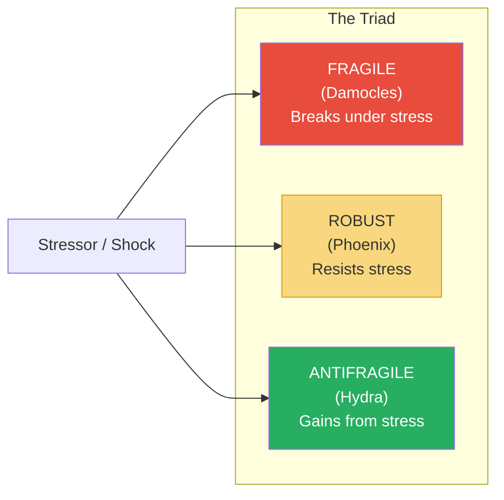

# Antifragile — Nassim Nicholas Taleb

> Nassim Taleb's central insight is that we have no word for the opposite of fragile — and that this linguistic gap has blinded us to one of the most important properties a system can possess.
> "Robust" is not the opposite of fragile. Robust things merely resist shocks. The true opposite is *antifragile*: things that actually get stronger from disorder, volatility, stress, and uncertainty.
> Muscles are antifragile (they grow from stress). Immune systems are antifragile (they need exposure to pathogens). Evolution is antifragile (it needs random mutation and death). But the modern world — with its obsession with prediction, control, planning, and smoothing — systematically eliminates the very volatility that these systems need to thrive.
> The result: we create artificial calm that makes catastrophic blowups inevitable. The solution: structure your life, investments, career, and institutions to be antifragile.
> This is not a self-help book. It is a philosophical treatise disguised as a rant — brilliant, combative, repetitive, and indispensable.

---

## About the Author

Nassim Nicholas Taleb is a former options trader turned risk philosopher.
He is Distinguished Professor of Risk Engineering at NYU Tandon School of Engineering and the author of the *Incerto* series: *Fooled by Randomness*, *The Black Swan*, *Antifragile*, *Skin in the Game*, and *The Bed of Procrustes*.
His career as a derivatives trader gave him firsthand experience with extreme events and fat tails, which became the empirical foundation for his philosophical work.

---

## The Big Idea

- There are three categories of things in the world, not two:

| | Fragile | Robust | Antifragile |
|--|---------|--------|-------------|
| **Responds to shock** | Breaks | Resists | Gets stronger |
| **Needs** | Calm, stability, prediction | Nothing changes | Stress, volatility, disorder |
| **Mythology** | Damocles (sword above head) | Phoenix (survives fire) | Hydra (cut a head, two grow back) |
| **Example** | A glass | A rock | Your immune system |

- <b style="color: #2980b9">The modern world is obsessed with eliminating volatility</b> — smoothing out fluctuations, predicting the future, controlling outcomes
- But <b style="color: #e74c3c">suppressing volatility doesn't eliminate risk — it hides it, concentrates it, and makes the eventual blowup catastrophic</b>
- Small forest fires prevent big ones. Small business failures prevent systemic collapses. Small stressors build resilience.
- <b style="color: #27ae60">The solution is not to predict the future but to build systems that benefit from whatever the future throws at them</b>

---

## Key Concepts at a Glance

| Concept | One-line summary |
|---------|-----------------|
| **The Triad** | Fragile/Robust/Antifragile — the three responses to volatility |
| **Via Negativa** | Improve by removing, not adding — what you don't do matters more than what you do |
| **Barbell Strategy** | Extreme safety + extreme risk; avoid the middle |
| **Skin in the Game** | Those who take risks must bear the consequences |
| **Iatrogenics** | Harm done by the healer — intervention that makes things worse |
| **Lindy Effect** | Non-perishable things that have survived long will survive longer |
| **Optionality** | Having options is antifragile; being locked in is fragile |
| **Green Lumber Fallacy** | You don't need to understand theory to profit from practice |
| **Turkey Problem** | The turkey is fed for 1,000 days and concludes it's safe — then Thanksgiving arrives |
| **Hormesis** | Small doses of poison strengthen; what doesn't kill you makes you stronger (literally) |

---

## The Barbell Strategy

- Taleb's most actionable framework: <b style="color: #2980b9">combine extreme safety with extreme risk, and avoid the moderate middle</b>
- In investing: 90% in ultra-safe assets (T-bills) + 10% in highly speculative bets. Never the "balanced" portfolio in the middle.
- In career: keep a stable day job + take wild moonshot risks on the side. Never the "safe but ambitious" middle path.
- In health: alternate between intense exercise and complete rest. Avoid chronic moderate stress.
- <b style="color: #27ae60">The barbell ensures you can survive any downside while capturing unlimited upside</b>

> [!danger] Before: The Moderate Middle
> A "balanced" portfolio of medium-risk investments. You avoid extreme losses — but also extreme gains. And when the Black Swan arrives, your "moderate" risk turns out to be catastrophic.

> [!success] After: The Barbell
> 90% in assets that cannot lose value + 10% in moonshots. Maximum downside is 10%. Maximum upside is unlimited. You survive every crisis and participate in every boom.

---

## Via Negativa: Subtraction Over Addition

- The most powerful way to improve anything is by removing what's harmful, not adding what might help
- <b style="color: #2980b9">Doctors do more good by stopping harmful interventions than by starting new ones</b> (iatrogenics)
- Diets work better by eliminating bad foods than by adding superfoods
- Organisations improve more by firing toxic employees than by hiring new talent
- "The learning is in the removal"
- Grandmother's wisdom: "Don't eat what's new" is better advice than any nutritionist's recommendation

---

## The Lindy Effect

- For non-perishable things (books, ideas, technologies, religions), <b style="color: #2980b9">expected future life span is proportional to current age</b>
- A book that has been in print for 100 years will likely be in print for another 100
- A restaurant that has survived 50 years will likely survive another 50
- A new fad diet is fragile; a diet that humans have eaten for 10,000 years is Lindy-approved
- <b style="color: #27ae60">Time is the ultimate filter. If something has survived, it has proven its antifragility.</b>

---

## Skin in the Game

- Systems become fragile when decision-makers are insulated from the consequences of their decisions
- Bankers who take risks with other people's money, then get bailed out, have no skin in the game
- <b style="color: #e74c3c">No skin in the game = fragile system</b>
- Taleb's rule: never trust anyone who doesn't bear the downside of their advice
- "Don't tell me what you think. Tell me what's in your portfolio."

---

## The Verdict

*Antifragile* is Taleb at his most ambitious — attempting nothing less than a new philosophical framework for understanding risk, uncertainty, and resilience across every domain of human life.
The concept is genuinely original: once you grasp the triad of fragile/robust/antifragile, you see the world differently. You notice how institutions suppress volatility to their eventual doom. You notice how small stressors build strength. You start asking of everything: is this fragile, robust, or antifragile?

The barbell strategy is immediately actionable. Via negativa is profound. The Lindy Effect is a permanent addition to your mental toolkit.

The book's weakness is Taleb himself. He is repetitive, combative, self-congratulatory, and contemptuous of anyone he deems a "fragilista" (his term for those who create fragility). The book is at least 150 pages longer than it needs to be. But the ideas inside are worth enduring the personality.

For anyone navigating uncertainty — in finance, career, health, or life — this is one of the most important books of the twenty-first century.

---

## Related Reading

- [[Thinking in Bets - Annie Duke|Thinking in Bets]] — Decision-making under uncertainty from a practitioner's perspective
- [[The Psychology of Money - Morgan Housel|The Psychology of Money]] — Housel's "room for error" is applied antifragility
- [[Thinking in Systems - Donella H. Meadows|Thinking in Systems]] — Systems dynamics and feedback loops that produce fragility or antifragility
- [[Zero to One - Peter Thiel|Zero to One]] — Thiel's contrarian thinking maps onto Taleb's critique of consensus fragility
