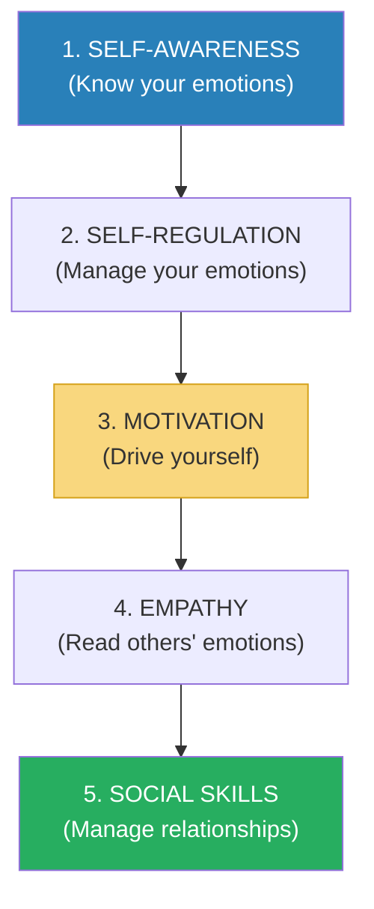
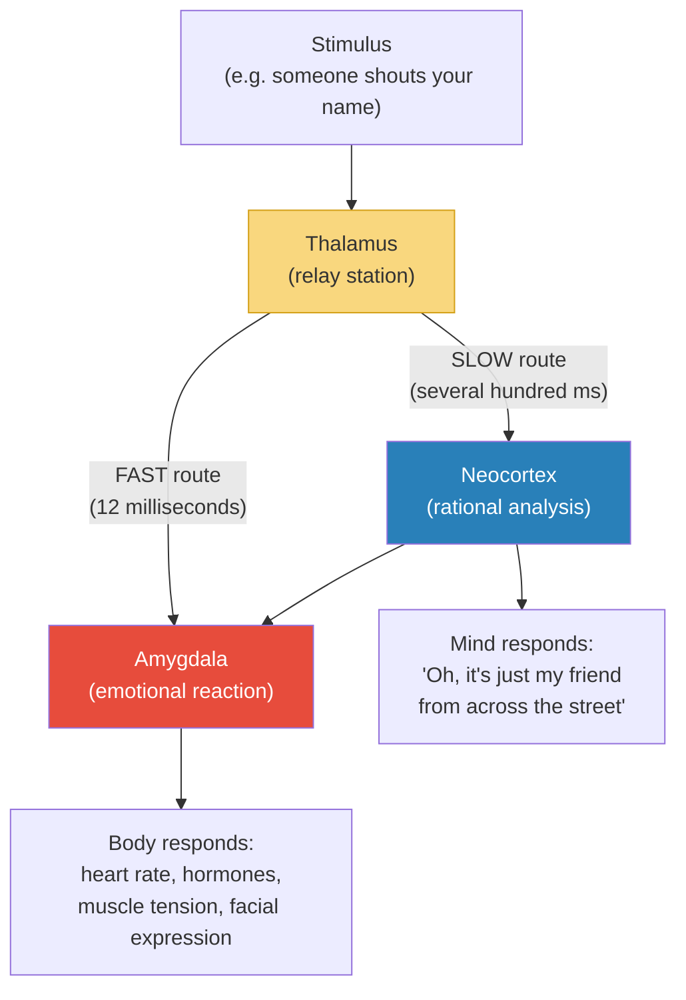
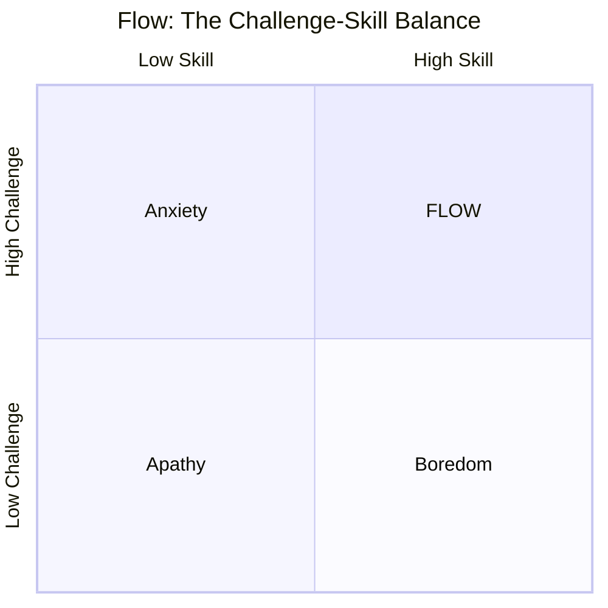
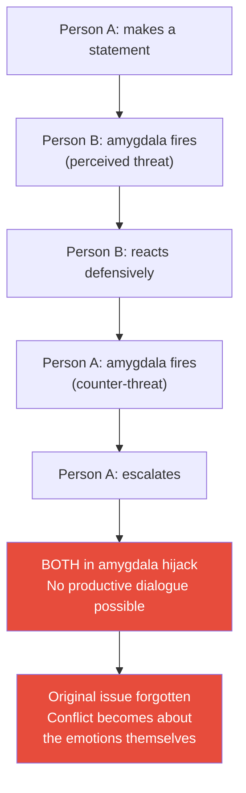
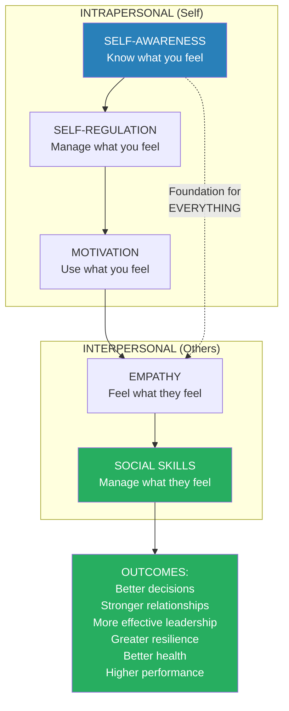

# Emotional Intelligence — Daniel Goleman

> Daniel Goleman's thesis shook the business and education worlds: IQ is not destiny.
> The abilities that matter most for success in life — self-awareness, impulse control, persistence, empathy, and social skill — are not measured by any intelligence test, yet they determine outcomes in career, relationships, and health far more powerfully than cognitive ability alone.
> He called these abilities "emotional intelligence" and built a five-domain framework — Self-Awareness, Self-Regulation, Motivation, Empathy, and Social Skills — that has since become one of the most widely used models in leadership development, education, and psychotherapy.
> Drawing on neuroscience (the amygdala hijack), developmental psychology (the Marshmallow Test), and hundreds of studies on workplace and life success, Goleman makes an empirical case that EQ matters more than IQ — and, crucially, that unlike IQ, EQ can be developed at any age.
> The book spent 18 months on the New York Times bestseller list, has been translated into 40 languages, and launched an entire field of research and practice.
> It is the book that made "emotional intelligence" a household phrase — and the book that every leader, teacher, parent, and human being should read.

---

## About the Author

Daniel Goleman is a psychologist, science journalist, and former New York Times reporter on the brain and behavioural sciences.
He holds a PhD from Harvard, where he studied under David McClelland, a pioneer in competence-based assessment who first argued that traditional IQ tests were poor predictors of real-world success.
Before writing this book, Goleman spent twelve years covering psychology and neuroscience for the New York Times, which gave him unusual access to cutting-edge research and the narrative skill to make it accessible.

His subsequent books — *Working with Emotional Intelligence*, *Social Intelligence*, and *Focus* — extended the framework into workplace leadership, social neuroscience, and attention management.
But it is this first book that remains the most important, because it established the foundational argument: <b style="color: #2980b9">what you feel and how you manage those feelings matters at least as much as what you think</b>.

---

## The Big Idea

- <b style="color: #2980b9">IQ accounts for approximately 20% of the factors that determine life success</b>
- The remaining 80% is largely attributable to what Goleman calls <b style="color: #2980b9">emotional intelligence (EQ)</b>
- EQ is the ability to recognise, understand, manage, and effectively use emotions — in yourself and in others
- <b style="color: #27ae60">Unlike IQ, which is largely fixed by late adolescence, EQ can be developed throughout life</b>
- This is the book's most hopeful message: emotional intelligence is not a gift you're born with or without — it is a set of learnable skills

---

- Goleman's framework identifies five domains, arranged in a progression from internal to external:

- The first three domains are <b style="color: #2980b9">intrapersonal</b> — they concern your relationship with yourself
- The last two are <b style="color: #2980b9">interpersonal</b> — they concern your relationship with others
- <b style="color: #27ae60">The progression matters: you cannot regulate what you cannot recognise (Self-Awareness must precede Self-Regulation), you cannot read others if you cannot read yourself (intrapersonal skills must precede interpersonal ones)</b>

---

## Key Concepts at a Glance

| Domain | Definition | Key Skill | When It Fails |
|--------|-----------|-----------|---------------|
| **Self-Awareness** | Recognising your own emotions as they happen | Knowing what you feel and why — in real time | You're blindsided by your own reactions; you make decisions "in the heat of the moment" without realising you're emotional |
| **Self-Regulation** | Managing emotions so they don't hijack your behaviour | Impulse control, adaptability, emotional recovery | You send the angry email; you make the impulsive decision; you can't let go of a slight |
| **Motivation** | Using emotions to drive toward goals | Persistence, optimism, delayed gratification, resilience after setbacks | You give up when things get hard; you procrastinate; you need external rewards to stay motivated |
| **Empathy** | Sensing what others feel | Reading nonverbal cues, perspective-taking, emotional attunement | You miss others' distress; you misjudge reactions; you're surprised when people are upset |
| **Social Skills** | Managing relationships effectively | Influence, conflict resolution, collaboration, leadership | You can't build a team; you alienate allies; you fail to persuade or negotiate effectively |

| Sub-Concept | One-line summary |
|-------------|-----------------|
| **Amygdala Hijack** | The emotional brain overriding the rational brain before you can think |
| **The Marshmallow Test** | Children who delayed gratification at age 4 outperformed their peers on virtually every life measure decades later |
| **Emotional Self-Awareness** | The foundation of ALL other EQ skills — if you can't identify what you feel, you can't manage it |
| **Flow** | The state of total absorption in an activity where emotions are channelled productively |
| **Emotional Contagion** | Emotions spread between people — a leader's mood infects the entire team |
| **The Rational-Emotional Partnership** | Good decisions require BOTH reason and emotion — pure reason without emotional input produces poor choices |
| **Alexithymia** | The clinical inability to identify or describe one's own emotions — the extreme end of low self-awareness |
| **The Gut Feeling** | Somatic markers (body signals) that encode emotional learning and guide rapid decision-making |

---

## Part 1: The Emotional Brain — The Neuroscience of EQ

*Goleman's opening chapters establish the biological foundation for his argument: emotions are not irrational noise to be suppressed but an ancient, sophisticated guidance system that works ALONGSIDE reason.*

### The Architecture of Emotion

- The human brain has two processing systems for emotional information:
  1. <b style="color: #2980b9">The thalamus-amygdala expressway</b> — a fast, rough route that triggers an emotional reaction BEFORE the thinking brain has even registered what happened
  2. <b style="color: #2980b9">The thalamus-cortex-amygdala scenic route</b> — a slower, more accurate route that processes the stimulus through the thinking brain first

- The fast route exists because evolution prioritised speed over accuracy — <b style="color: #e74c3c">it's better to jump at a shadow (false positive) than to deliberate while a predator eats you (false negative)</b>
- But in modern life, the fast route creates problems: you snap at a colleague, send an angry email, make a fear-based decision — all before your rational brain has had time to weigh in
- <b style="color: #2980b9">This is the "amygdala hijack" — Goleman's most famous concept</b>

---

### The Amygdala Hijack

- The <b style="color: #e74c3c">amygdala hijack</b> occurs when the emotional brain takes over before the rational brain can intervene
- Characteristics of a hijack:
  - It happens fast — before you've had time to think
  - It produces a disproportionate response — the reaction is out of scale with the trigger
  - You only realise what happened afterward — "Why did I say that? That wasn't like me."
  - It is accompanied by physical symptoms: racing heart, flushed face, muscle tension, dry mouth

> [!example] The Road Rage Hijack
> You're driving to work. Someone cuts you off. In a flash, you're honking, shouting, and tailgating — your heart pounding, face flushed, hands gripping the wheel.
> Thirty seconds later, you think: "What am I doing? I'm going to be late for a meeting over someone I'll never see again."
> Your amygdala reacted to the lane intrusion as a THREAT (fast route). Your neocortex, arriving late (slow route), recognised it as a minor inconvenience. But by then, you were already honking.
> <b style="color: #e74c3c">The hijack was over before the thinking brain even arrived at the scene.</b>

> [!example] The Email Hijack
> You open an email from a colleague that feels dismissive. Your amygdala fires: this is a STATUS THREAT. Within 30 seconds you've composed a scathing reply.
> Your finger hovers over "Send." Your neocortex finally catches up: "Wait. Is this really dismissive, or am I reading it wrong? Is this reply going to help the situation or make it worse?"
> <b style="color: #27ae60">The gap between finger-on-Send and actually-Sending is where emotional intelligence lives.</b> EQ is not about not FEELING the anger. It's about creating enough space between the feeling and the action to CHOOSE your response.

---

### Why Emotions Are Not the Enemy of Reason

- The traditional Western view: emotions are irrational impulses that cloud clear thinking — the goal is to suppress them
- <b style="color: #2980b9">Goleman argues the opposite: emotions are ESSENTIAL to good decision-making</b>
- He draws on Antonio Damasio's research with brain-damaged patients who had lost the ability to feel emotions but whose rational faculties were intact
- <b style="color: #e74c3c">These patients could not make decisions</b> — even trivial ones like what to eat for lunch or where to sit
- Without emotional input (what Damasio calls "somatic markers" — gut feelings encoded in the body), the rational brain has no way to assign VALUE to options
- You need emotions to tell you what MATTERS — then you use reason to figure out what to DO about it
- <b style="color: #27ae60">The goal of emotional intelligence is not to suppress emotions but to use them wisely — to harness them as information, not be enslaved by them as compulsion</b>

> [!tip] The Damasio Lesson
> If you ever think emotions are "getting in the way" of good decisions, consider Damasio's patients: people who CAN'T feel emotions CAN'T decide anything.
> Your emotions are not the problem. Your RELATIONSHIP with your emotions is the problem.
> The emotionally intelligent person doesn't feel less. They feel just as much — but they CREATE SPACE between the feeling and the response, so the response is chosen rather than automatic.

---

### The Two Minds

- Goleman describes the human psyche as having <b style="color: #2980b9">"two minds"</b> — the rational mind and the emotional mind
- In most situations, these two work in harmony: the emotional mind provides the motivation and the values; the rational mind provides the plan and the execution
- <b style="color: #e74c3c">Problems arise when the emotional mind overwhelms the rational mind (hijack) or when the rational mind ignores the emotional mind (cold, disconnected decisions)</b>
- The emotionally intelligent person maintains a <b style="color: #27ae60">partnership between the two</b> — neither suppressing emotions nor being controlled by them

| State | Emotional Mind | Rational Mind | Result |
|-------|---------------|---------------|--------|
| **Hijack** | Dominant | Suppressed | Impulsive, disproportionate reactions |
| **Suppression** | Suppressed | Dominant | Cold, disconnected, unable to connect with others or identify values |
| **Partnership** | Active, informing | Active, directing | Wise decisions that account for both logic and feeling |

- <b style="color: #27ae60">EQ is the skill of maintaining the partnership — keeping both minds online and working together</b>

---

## Part 2: The Five Domains of Emotional Intelligence

### Domain 1: Self-Awareness — The Foundation of Everything

*Self-awareness is the keystone of emotional intelligence. Without it, every other domain collapses — you cannot regulate emotions you don't recognise, empathise with feelings you can't name in yourself, or manage relationships when you're blind to your own impact.*

- <b style="color: #2980b9">Self-awareness</b> is the ability to recognise your own emotions as they happen — not after the fact, not through reflection the next day, but in real time
- Goleman calls this "attention to one's own internal states" — a kind of neutral, non-judgmental observation of what you're feeling at any given moment
- It is NOT the same as being overwhelmed by emotions (that's the opposite — the emotion controls you instead of you observing it)
- <b style="color: #27ae60">The self-aware person can say: "I'm feeling angry right now. The anger is rising. I notice my jaw is clenching and my heart rate is increasing. I'm going to take a breath before I respond."</b>
- The non-self-aware person simply IS angry — they ARE the anger, with no observer between the emotion and the action

---

### Three Levels of Emotional Self-Awareness

| Level | Description | Example | Impact on Behaviour |
|-------|-------------|---------|-------------------|
| **Engulfed** | Completely captured by the emotion; no awareness that you're emotional | Shouting at someone before you even realise you're angry | Reactive, impulsive, unpredictable |
| **Accepting** | Aware that you're emotional but choosing to go with the feeling | "I know I'm angry, and right now I want to be angry" | Conscious but not managed — the emotion still dictates behaviour |
| **Self-aware** | Observing the emotion as it happens, with enough distance to choose a response | "I notice I'm angry. This isn't the right moment to act on it. I'll revisit this when I'm calmer." | Responsive rather than reactive — the emotion informs but doesn't control |

- <b style="color: #27ae60">The goal of EQ is not to eliminate emotions but to move from Level 1 (engulfed) to Level 3 (self-aware) as often as possible</b>
- This shift doesn't require years of meditation (though meditation helps) — it starts with the simple practice of PAUSING before responding and asking: "What am I feeling right now?"

> [!example] The Executive Who Didn't Know He Was Afraid
> Goleman describes an executive who consistently avoided strategic risk-taking, always choosing the safe option even when the opportunity was clear.
> He described himself as "cautious" and "analytical" — positive frames for his risk aversion.
> Only through coaching did he recognise that his "caution" was actually <b style="color: #e74c3c">fear</b> — fear of failure, fear of looking foolish, fear of losing what he'd built.
> The moment he named the emotion — "I'm afraid" — he could begin to manage it. As long as it was disguised as "caution," it was invisible to him and therefore unmanageable.
> <b style="color: #27ae60">Self-awareness is the act of seeing through your own PR. The stories you tell yourself about your emotions are often not the emotions themselves.</b>

---

### Alexithymia: The Extreme of Low Self-Awareness

- <b style="color: #e74c3c">Alexithymia</b> (from the Greek: "without words for emotions") is the clinical inability to identify or describe one's own emotional states
- People with alexithymia FEEL emotions — their bodies respond (racing heart, tense muscles, tears) — but they cannot NAME what they're feeling
- They might say "I feel bad" but cannot distinguish between anger, sadness, fear, shame, or frustration
- <b style="color: #2980b9">This is not a rare condition — it exists on a spectrum, and many otherwise functional adults operate with significant emotional vocabulary deficits</b>
- Goleman argues that emotional vocabulary IS emotional intelligence: the more precisely you can name what you feel, the more effectively you can manage it

> [!tip] The Emotional Vocabulary Exercise
> Goleman recommends expanding your emotional vocabulary as a core self-awareness practice:
> Instead of "I feel bad," try:
> - "I feel disappointed" (expectation unmet)
> - "I feel frustrated" (blocked from a goal)
> - "I feel anxious" (uncertain about an outcome)
> - "I feel resentful" (treated unfairly)
> - "I feel ashamed" (violated my own standards)
> - "I feel overwhelmed" (too much to process)
> 
> Each of these has a different cause, a different trajectory, and a different solution.
> "I feel bad" gives you nothing to work with. "I feel resentful because I wasn't credited for my work" gives you a specific problem to address.
> <b style="color: #27ae60">Naming is the first step to managing. What you can name, you can examine. What you can examine, you can change.</b>

---

### Domain 2: Self-Regulation — Managing the Inner Storm

*If self-awareness is knowing what you feel, self-regulation is choosing what to DO with that feeling.*

- <b style="color: #2980b9">Self-regulation</b> is the ability to manage disruptive emotions and impulses — not by suppressing them but by channelling them productively
- It includes: impulse control, emotional recovery, adaptability, comfort with ambiguity, and trustworthiness (acting consistently with your values even under pressure)
- <b style="color: #e74c3c">Self-regulation is NOT the same as emotional suppression</b>
- Suppression means pushing emotions down, pretending they don't exist — which research shows actually INCREASES physiological stress and impairs cognitive function
- Self-regulation means acknowledging the emotion AND choosing not to act on it impulsively

---

### The Six-Second Gap

- Neuroscience research suggests that the intense phase of an emotional reaction lasts approximately <b style="color: #2980b9">six seconds</b>
- After six seconds, the initial neurochemical cascade (the amygdala hijack) begins to subside, and the prefrontal cortex starts to regain control
- <b style="color: #27ae60">The most powerful self-regulation technique is simply: wait six seconds before responding</b>
- In those six seconds, the rational brain comes back online and you regain the ability to choose rather than react
- This is the neurological basis for every "count to ten" piece of advice ever given — the number isn't arbitrary, it's physiological

> [!danger] Before: Reacting within the hijack window (0-6 seconds)
> Boss makes a critical comment in a meeting. Your amygdala fires: STATUS THREAT. Within 2 seconds, you're defending yourself aggressively, voice raised, body tense.
> The room goes silent. The boss's expression hardens. You've just confirmed your reputation for being "defensive."
> Three hours later, you realise the boss's comment was reasonable and your reaction was disproportionate. But the damage is done.

> [!success] After: Waiting past the hijack window (6+ seconds)
> Same comment. Same amygdala firing. Same surge of defensive anger.
> But this time you take a breath. You count silently to six. The surge begins to subside.
> You say: "That's a fair point. Can you give me a specific example so I can address it properly?"
> The room relaxes. The boss appreciates the professionalism. You've demonstrated self-regulation in real time.
> <b style="color: #27ae60">The difference between the two scenarios: six seconds.</b>

---

### Emotional Flooding: When Self-Regulation Fails

- <b style="color: #e74c3c">Emotional flooding</b> occurs when the amygdala overwhelms the prefrontal cortex so completely that rational thought becomes temporarily impossible
- The person is no longer capable of listening, empathising, or problem-solving — they are in pure survival mode
- Physical signs: heart rate above 100 bpm at rest, sweating, tunnel vision, inability to hear what others are saying
- <b style="color: #2980b9">Gottman's research on marriages</b> (cited by Goleman) found that when either partner's heart rate exceeds 100 bpm during a conflict, productive dialogue is physiologically impossible
- The only effective intervention is <b style="color: #27ae60">physical removal + time</b>: "I need to take a 20-minute break. I'll come back when I'm calmer."
- This is NOT avoidance — it is the intelligent recognition that continuing the conversation while flooded will produce destruction, not resolution
- <b style="color: #27ae60">The 20-minute minimum is physiological</b>: it takes approximately 20 minutes for the stress hormones (cortisol, adrenaline) to clear enough for rational processing to resume

> [!tip] The Flooding Protocol
> If you feel yourself becoming emotionally flooded (racing heart, tunnel vision, inability to hear the other person):
> 1. Say: "I need to step away for 20 minutes. I want to continue this conversation, but I can't do it well right now."
> 2. LEAVE. Go for a walk, do breathing exercises, splash cold water on your face (the "dive reflex" activates the parasympathetic nervous system).
> 3. Do NOT use the 20 minutes to rehearse your argument or stew in resentment — that re-triggers the flooding.
> 4. Use the time for genuine physiological calming: deep breathing, physical movement, distraction.
> 5. Return after 20 minutes and resume the conversation from a regulated state.
> 
> This technique saves relationships. It saves careers. It is the most important self-regulation tool in the book.

---

### The Marshmallow Test: Self-Regulation Predicts Life Success

- Walter Mischel's famous study at Stanford: four-year-olds were given a choice — eat one marshmallow now, or wait 15 minutes and get two
- The children who waited showed remarkable self-regulation strategies: covering their eyes, singing to themselves, inventing games, deliberately looking away from the marshmallow
- <b style="color: #2980b9">The children who couldn't wait were not less intelligent — they simply lacked the self-regulation techniques to manage the impulse</b>
- The follow-up was the stunning part: the researchers tracked these children for decades

| Outcome | Waited (high self-regulation) | Didn't wait (low self-regulation) |
|---------|------------------------------|----------------------------------|
| **SAT scores** | 210 points higher on average | 210 points lower |
| **Social competence** | Rated significantly more socially skilled by peers and teachers | More likely to be described as "stubborn," "prone to frustration," and "still unable to delay gratification" |
| **Stress management** | Handled stress better; less likely to fall apart under pressure | More likely to be overwhelmed; more likely to use avoidance coping |
| **Career success** | Higher incomes, higher job satisfaction | More job instability, lower career achievement |
| **Relationships** | More stable, longer-lasting relationships | More relationship conflict, higher divorce rates |
| **Health** | Lower BMI, lower rates of addiction | Higher BMI, higher rates of substance abuse |

- <b style="color: #e74c3c">The ability to manage impulses at age four predicted life outcomes better than IQ.</b>
- Goleman uses this study as the centrepiece of his argument that EQ is not a "nice to have" — it is a primary determinant of life success

> [!example] The Marshmallow Strategies
> What's remarkable is HOW the successful four-year-olds managed the wait:
> - One girl sang "Row, Row, Row Your Boat" to herself repeatedly
> - One boy deliberately turned his chair away from the marshmallow and stared at the wall
> - One girl pretended the marshmallow was a cloud, not food
> - One boy fell asleep (the ultimate self-regulation move)
> 
> <b style="color: #27ae60">None of these children were born with more willpower. They had discovered TECHNIQUES for managing their impulses — and those techniques proved more predictive of future success than raw intelligence.</b>
> This is Goleman's most hopeful finding: self-regulation is a skill, not a trait. It can be taught, learned, and practised.

---

### Domain 3: Motivation — The Emotional Engine

*Motivation in EQ terms is not about external rewards (bonuses, promotions, praise) but about the internal emotional states that drive sustained effort.*

- <b style="color: #2980b9">Goleman identifies four components of emotionally intelligent motivation:</b>
  1. **Achievement drive** — the desire to meet a standard of excellence
  2. **Commitment** — aligning with the goals of a group or organisation
  3. **Initiative** — readiness to act on opportunities without being told
  4. **Optimism** — persistence in pursuing goals despite setbacks

- The critical distinction: <b style="color: #27ae60">intrinsic motivation</b> (doing something because you find it meaningful) vs <b style="color: #e74c3c">extrinsic motivation</b> (doing something for external reward)
- Research shows that intrinsic motivation produces higher quality work, greater persistence, more creativity, and deeper satisfaction
- Extrinsic motivation can actually UNDERMINE performance on complex tasks — a finding known as the <b style="color: #2980b9">overjustification effect</b>

---

### Flow: The Optimal Motivational State

- <b style="color: #2980b9">Flow</b> (a concept from psychologist Mihaly Csikszentmihalyi, extensively cited by Goleman) is the state of total absorption in an activity where:
  - The challenge matches your skill level (too easy = boredom; too hard = anxiety)
  - You have clear goals and immediate feedback
  - Self-consciousness disappears — you lose track of time
  - Emotions are channelled productively — they fuel the activity rather than disrupting it

- <b style="color: #27ae60">Flow is the emotional state where motivation is effortless — you don't need willpower because you're fully absorbed</b>
- Goleman argues that emotionally intelligent people are better at creating flow states because they can manage the anxiety that prevents entry (self-regulation) and sustain the focus that maintains it (attention management)

> [!example] The Surgeon in Flow
> Goleman describes a surgeon who reported entering flow during complex operations: "Time disappears. I'm not thinking about my problems, my schedule, my life. There is only the procedure. My hands move before I think about what they should do. I am completely HERE."
> The surgeon also reported that when emotions intruded (anxiety about the outcome, frustration with equipment), he lost flow immediately — and his performance measurably declined.
> <b style="color: #27ae60">Flow requires emotional management: the ability to set aside intrusive emotions and channel all emotional energy into the task.</b>

---

### The Optimism Advantage

- <b style="color: #2980b9">Optimism</b>, in Goleman's framework, is not naive positivity but a specific cognitive-emotional pattern: <b style="color: #27ae60">the tendency to attribute setbacks to temporary, specific, and changeable causes rather than permanent, global, and fixed ones</b>
- This comes from Martin Seligman's research on "explanatory styles"

| Event | Pessimistic Explanation | Optimistic Explanation |
|-------|------------------------|----------------------|
| Failed to get the promotion | "I'm not good enough" (permanent, global, internal) | "I need to develop my presentation skills" (temporary, specific, changeable) |
| Lost a major client | "I'm terrible at sales" | "This client wasn't a good fit; the next one will be different" |
| Made an error in a report | "I always make mistakes" | "I rushed this one; next time I'll build in more review time" |

- <b style="color: #27ae60">Optimists outperform pessimists in virtually every domain</b> — not because they deny reality but because they maintain the motivation to keep trying after setbacks
- Seligman's study of MetLife insurance salespeople: <b style="color: #2980b9">optimistic salespeople sold 37% more insurance in their first two years than pessimistic ones</b>
- Even more striking: salespeople hired specifically for their optimism (despite lower scores on the standard aptitude test) outperformed pessimistic high-aptitude salespeople

> [!tip] The Explanatory Style Check
> When something goes wrong, notice how you explain it to yourself:
> - **Permanent vs temporary:** "I always..." vs "This time..."
> - **Global vs specific:** "Everything is..." vs "This particular thing..."
> - **Internal vs external:** "I'm..." vs "The situation was..."
> 
> Optimistic people default to temporary, specific, and changeable explanations.
> Pessimistic people default to permanent, global, and fixed explanations.
> Neither is automatically "right" — but the optimistic pattern sustains motivation, while the pessimistic one kills it.

---

### Domain 4: Empathy — Reading the Room

*Empathy is the first interpersonal domain — the bridge between understanding yourself and understanding others.*

- <b style="color: #2980b9">Empathy</b> is the ability to sense what others feel — to read the emotional signal beneath the words
- It is NOT the same as sympathy (feeling sorry for someone) or agreement (sharing their view)
- Empathy is a <b style="color: #27ae60">perceptual skill</b>: the ability to detect and interpret emotional cues — facial expressions, tone of voice, body language, word choice, silences
- Goleman identifies three types:

| Type | Description | Example |
|------|-------------|---------|
| **Cognitive empathy** | Understanding another person's perspective intellectually | "I can see why you'd think that, given your situation" |
| **Emotional empathy** | Feeling what another person feels — emotional resonance | You feel sad when they cry, anxious when they're stressed |
| **Empathic concern** | Being moved to help because you understand AND feel their distress | You not only understand and feel their pain — you want to do something about it |

- <b style="color: #2980b9">Leaders need primarily cognitive empathy + empathic concern</b>
- Pure emotional empathy without cognitive empathy leads to emotional contagion — you get swept up in others' feelings and lose your ability to help
- Cognitive empathy without emotional empathy can become manipulative — you understand what they feel but use that understanding instrumentally rather than compassionately

---

### Empathy Is Built on Self-Awareness

- <b style="color: #27ae60">You can only read emotions in others that you can recognise in yourself</b>
- This is why self-awareness is the foundation of the entire EQ framework
- A person who cannot identify their own anger will miss anger in others
- A person who suppresses sadness in themselves will be blind to sadness in those around them
- <b style="color: #2980b9">Goleman's core claim: emotional vocabulary for yourself → emotional perception of others</b>
- The person who can distinguish between "frustrated," "disappointed," "resentful," and "hurt" in themselves can see those same distinctions in others — and respond appropriately to each

> [!example] The Doctor Who Couldn't Read the Room
> Goleman describes a brilliant oncologist whose diagnostic skills were unmatched but whose patient interactions were consistently rated "cold" and "insensitive."
> The problem wasn't that he didn't care — he did. The problem was that he had spent decades suppressing his own emotional responses to death and suffering (a common coping mechanism in medicine).
> Having suppressed his own emotional register, he could no longer detect the same emotions in his patients. He would deliver devastating diagnoses with clinical precision but completely miss the patient's fear, confusion, or grief.
> After EQ training that focused on RECONNECTING with his own emotional responses (not suppressing them), his ability to read patients improved dramatically — and his patient satisfaction scores followed.
> <b style="color: #27ae60">He didn't need to learn empathy. He needed to recover it — by first recovering access to his own emotional life.</b>

---

### Domain 5: Social Skills — Managing Relationships

*The fifth domain integrates all the others: self-awareness + self-regulation + motivation + empathy → the ability to manage relationships effectively.*

- <b style="color: #2980b9">Social skills</b> in Goleman's framework include:
  - **Influence** — persuading others effectively
  - **Communication** — sending clear, convincing messages
  - **Conflict management** — negotiating and resolving disagreements
  - **Leadership** — inspiring and guiding groups
  - **Change catalyst** — initiating and managing change
  - **Collaboration** — working with others toward shared goals
  - **Team capabilities** — building group synergy

- <b style="color: #27ae60">Social skills are the OUTPUT of the EQ system — the visible, measurable behaviours that emerge when the four internal domains are functioning well</b>
- A person with high self-awareness, strong self-regulation, intrinsic motivation, and good empathy will NATURALLY exhibit effective social skills — because they understand both themselves and others, can manage their own impulses, and are driven by purpose rather than ego

---

### Emotional Contagion: The Leader's Superpower (and Weapon)

- <b style="color: #2980b9">Emotions are contagious</b> — they spread from person to person through nonverbal channels (facial expression, tone, body language)
- This happens automatically and unconsciously — you "catch" the emotions of the people around you, especially high-status people (leaders)
- <b style="color: #e74c3c">A leader's mood infects the entire team</b>
- Research shows that:
  - When the leader is in a positive mood, the team is more creative, more collaborative, and more productive
  - When the leader is in a negative mood, the team becomes defensive, competitive, and risk-averse
  - The leader's mood accounts for up to 70% of the emotional climate of the group

> [!warning] The Mood Tax
> If you're a leader and you walk into a meeting anxious, frustrated, or angry, your mood will spread to the entire team within minutes — regardless of what you say.
> You might think you're hiding it. You're not. Your face, voice, posture, and energy are all broadcasting your emotional state to every person in the room.
> <b style="color: #e74c3c">As a leader, managing your emotional state is not optional — it is a core part of your job.</b>
> If you can't regulate your own emotions before the meeting, you shouldn't be in the meeting.

> [!tip] The Pre-Meeting Emotional Check
> Before entering any meeting, ask yourself:
> 1. What emotion am I carrying right now?
> 2. Is this the emotion I want to spread to the room?
> 3. If not, what do I need to do to shift my state before I walk in?
> 
> This takes 30 seconds. It can change the outcome of the entire meeting — because the leader's emotional state IS the meeting's emotional climate.

---

## Part 3: EQ in the Real World

### EQ at Work

- Goleman argues that <b style="color: #2980b9">EQ becomes MORE important, not less, as you rise in an organisation</b>
- At entry level, technical competence is the primary differentiator
- At mid-level, the mix shifts toward interpersonal skill
- At the C-suite, <b style="color: #27ae60">EQ accounts for 80-90% of the competencies that distinguish star performers from average ones</b>
- This pattern holds across industries: Goleman cites studies from engineering, banking, healthcare, education, and the military

> [!example] The Bell Labs Study
> Researchers at Bell Labs (AT&T's legendary research facility) studied what differentiated star engineers from average engineers.
> The star performers and average performers had virtually identical IQs and technical skills.
> The difference: <b style="color: #2980b9">the stars had built informal networks of relationships</b> — they knew who to call when they were stuck, who had the information they needed, and how to frame requests to get fast responses.
> In other words, the differentiator was social skill and empathy — not technical ability.
> The average engineers would send an email and wait. The stars would pick up the phone, use rapport to engage the expert, and get their answer in hours instead of days.
> <b style="color: #27ae60">At the frontier of technical excellence, where everyone is brilliant, EQ is the only remaining differentiator.</b>

---

### EQ in Education

- Goleman devotes substantial chapters to the role of EQ in education — and the consequences of ignoring it
- <b style="color: #e74c3c">Children are not taught emotional skills in school</b> — they learn reading, writing, mathematics, and science, but not how to identify their feelings, manage their impulses, resolve conflicts, or empathise with others
- This is despite research showing that emotional competence is a stronger predictor of academic success than IQ
- Goleman advocates for <b style="color: #27ae60">"Social and Emotional Learning" (SEL) programmes</b> — structured curricula that teach emotional skills alongside academic skills
- Studies of SEL programmes show: improved academic performance, reduced behavioural problems, better attendance, fewer suspensions, improved mental health, and better social relationships

> [!example] The PATHS Programme
> One of the most studied SEL programmes is PATHS (Promoting Alternative Thinking Strategies), designed for elementary school children.
> Children learn to: identify emotions in themselves and others, label them with specific vocabulary, express them appropriately, manage them when they're disruptive, and resolve conflicts without violence.
> Results from randomised controlled trials: <b style="color: #27ae60">children in PATHS programmes showed 50% reduction in aggressive behaviour, 30% improvement in ability to handle conflicts, and significant improvement in academic test scores — compared to control groups</b>.
> The improvement in academic performance was not because PATHS taught academic content. It's because <b style="color: #2980b9">children who can manage their emotions can focus better, persist longer, and collaborate more effectively</b> — all of which drive learning.

---

### EQ in Relationships

- Goleman draws extensively on John Gottman's research on marriages
- Gottman can predict divorce with <b style="color: #2980b9">94% accuracy</b> by observing a couple interact for just 15 minutes
- The predictors are ALL emotional intelligence skills (or their absence):
  - <b style="color: #e74c3c">Criticism</b> (attacking the person, not the behaviour): "You never clean up. You're so lazy."
  - <b style="color: #e74c3c">Contempt</b> (treating the partner as inferior): eye-rolling, sneering, name-calling
  - <b style="color: #e74c3c">Defensiveness</b> (refusing to accept responsibility): "It's not my fault, you're the one who..."
  - <b style="color: #e74c3c">Stonewalling</b> (withdrawing from interaction): shutting down, refusing to engage

- Gottman calls these the <b style="color: #e74c3c">"Four Horsemen of the Apocalypse"</b> of relationships
- Their opposites are the four EQ skills:
  - <b style="color: #27ae60">Specific complaint</b> (instead of criticism): "When you left the dishes, I felt frustrated"
  - <b style="color: #27ae60">Appreciation</b> (instead of contempt): regularly expressing gratitude and admiration
  - <b style="color: #27ae60">Accountability</b> (instead of defensiveness): "You're right, I should have done that"
  - <b style="color: #27ae60">Self-soothing</b> (instead of stonewalling): "I'm getting flooded. Can we take a break?"

| Four Horsemen (Low EQ) | Four Antidotes (High EQ) |
|------------------------|------------------------|
| Criticism: "You always..." | Specific complaint: "When you [behaviour], I felt [emotion]" |
| Contempt: Eye-rolling, sneering | Appreciation: "I value [specific thing] about you" |
| Defensiveness: "It's not my fault" | Accountability: "You're right. I'll do better." |
| Stonewalling: Shutting down | Self-soothing: "I need a 20-minute break, then let's continue" |

---

### EQ and Health

- <b style="color: #e74c3c">Chronic negative emotions (anger, anxiety, depression) measurably impair physical health</b>
- The mechanism: chronic emotional distress → sustained activation of the sympathetic nervous system → elevated cortisol → weakened immune function, cardiovascular damage, impaired sleep, chronic inflammation
- People with chronic hostility are <b style="color: #2980b9">4-7 times more likely to die of heart disease</b> than those without
- People with chronic anxiety are significantly more likely to develop autoimmune disorders
- People with depression have weakened immune responses and slower recovery from illness and surgery
- <b style="color: #27ae60">Emotional regulation is therefore not just a psychological skill — it is a health skill</b>
- Goleman argues that EQ should be considered a component of preventive medicine: teaching people to manage their emotions reduces disease burden at the population level

---

## Part 4: Developing Emotional Intelligence

### Can EQ Be Taught?

- <b style="color: #27ae60">Yes — and this is the book's most important claim</b>
- Unlike IQ, which is approximately 50% heritable and largely fixed by late adolescence, EQ is highly malleable throughout life
- The brain's emotional circuitry is shaped by experience — every time you practise self-awareness, regulate an impulse, or read an emotion in someone else, you strengthen the neural pathways involved
- <b style="color: #2980b9">EQ development is essentially habit formation</b> — replacing automatic emotional reactions with chosen emotional responses, through repetition and practice
- This is why Goleman's framework aligns so closely with Goldsmith's habit-change methodology (see [[What Got You Here Won't Get You There - Marshall Goldsmith|What Got You Here]]) and Duke's deliberate practice of decision-making (see [[Thinking in Bets - Annie Duke|Thinking in Bets]])

### The Three Conditions for EQ Growth

| Condition | Description | Without It |
|-----------|-------------|-----------|
| **Motivation** | The person must WANT to change — external pressure alone isn't enough | Compliance without internalisation; the old habit returns as soon as the pressure lifts |
| **Practice** | Repeated application of the new behaviour in real situations — not just classroom learning | Knowledge without skill; "I know I should listen better, but I still don't" |
| **Feedback** | External input on whether the new behaviour is actually improving (stakeholder perception) | Self-deception; "I think I've improved" when others see no change |

- <b style="color: #27ae60">These are the same three conditions that Goldsmith identifies for habit change</b> — which is not coincidental. EQ development IS habit change, applied to the domain of emotional behaviour.

---

### A Practical EQ Development Programme

*Consolidating Goleman's recommendations into an actionable plan.*

| Week | Focus | Daily Practice | Weekly Exercise |
|------|-------|---------------|----------------|
| 1-2 | Self-Awareness | Three times daily, pause and ask: "What am I feeling right now? Can I name it specifically?" | Journal: write down three emotional moments from each day, with specific labels |
| 3-4 | Self-Regulation | When you notice a strong emotion, count to 6 before responding. Note what you did differently. | Identify your top 3 emotional triggers. For each, design a specific alternative response. |
| 5-6 | Motivation | Begin each day with: "What matters most today, and why?" End each day with: "What did I persist at despite difficulty?" | Map your "flow" activities — what absorbs you completely? Schedule more of them. |
| 7-8 | Empathy | In every conversation, listen for the EMOTION beneath the words. Ask: "What are they really feeling?" | Pick one person you interact with regularly. Predict their emotional state before each interaction. Check afterward. |
| 9-10 | Social Skills | Before each important interaction, set an emotional intention: "I want this person to feel [heard/valued/supported]" | Ask three people: "What's one thing I could do to be a better [colleague/partner/friend]?" Listen. Say thank you. |

> [!tip] The EQ Journal
> Goleman recommends keeping a brief daily journal — not of events but of EMOTIONS:
> 1. What was the strongest emotion I felt today?
> 2. What triggered it?
> 3. How did I respond?
> 4. Would I respond differently if I could replay the moment?
> 5. What emotion did I notice in someone else today? Was I right?
> 
> This takes 5 minutes per day and builds self-awareness faster than any other single practice.

## Deep Dive: EQ and Leadership Styles

### Goleman's Six Leadership Styles

*In his subsequent work (cited in the book's later editions), Goleman identified six leadership styles, each rooted in different EQ competencies:*

| Style | EQ Foundation | When It Works | When It Fails | Impact on Climate |
|-------|-------------|---------------|--------------|------------------|
| **Visionary** | Self-confidence, empathy, change catalyst | When a new direction is needed; when the team is lost | When the leader lacks credibility or the team is more expert | Strongly positive |
| **Coaching** | Empathy, self-awareness, developing others | When developing long-term capabilities; when people are willing to learn | When the leader lacks expertise or the person resists coaching | Positive |
| **Affiliative** | Empathy, relationship management, conflict resolution | When healing rifts; when building trust; during stressful periods | When poor performance needs to be addressed directly | Positive |
| **Democratic** | Collaboration, empathy, communication | When buy-in is needed; when the leader is uncertain about direction | When the team lacks expertise or when time is short | Positive |
| **Pacesetting** | Conscientiousness, achievement drive, initiative | When the team is already motivated and competent and needs a high bar | When the team needs development, not demands; used chronically it burns people out | Negative (when overused) |
| **Commanding** | Self-confidence, achievement drive, initiative | In genuine crises; when immediate compliance is required for safety | In any other situation — it destroys motivation, creativity, and engagement | Negative (except in crisis) |

- <b style="color: #27ae60">The most effective leaders don't use one style — they switch between them based on the situation</b>
- The ability to switch requires ALL five EQ domains: self-awareness (knowing which style you default to), self-regulation (not falling back on your comfort zone), empathy (reading what the situation requires), and social skill (executing the chosen style effectively)
- <b style="color: #e74c3c">The two negative-impact styles (Pacesetting and Commanding) are the ones most commonly used by technically brilliant leaders who lack EQ</b>
- They default to "set a high bar and demand people meet it" (Pacesetting) or "tell people what to do" (Commanding) because these styles don't require empathy or relationship skill — they only require competence and willpower
- <b style="color: #2980b9">The four positive-impact styles ALL require significant EQ — which is why EQ development is fundamentally leadership development</b>

> [!example] The New CEO Who Used All Six
> Goleman describes a CEO who took over a struggling division and used all six styles in sequence:
> 1. **Commanding** (week 1): stopped the bleeding — cancelled failing projects, ended unproductive meetings, set clear non-negotiable priorities
> 2. **Visionary** (month 1): painted a compelling picture of where the division was headed and why it mattered
> 3. **Affiliative** (month 2): rebuilt trust — spent time with each team, listened to grievances, acknowledged past failures
> 4. **Democratic** (month 3): involved the team in designing the new strategy — "What do YOU think we should prioritise?"
> 5. **Coaching** (months 4-8): worked individually with each direct report on their development
> 6. **Pacesetting** (month 9+): once the team was motivated, skilled, and aligned, raised the performance bar
> <b style="color: #27ae60">The sequence mattered: Commanding first (to stop chaos), then Visionary (to create hope), then Affiliative (to rebuild trust), then Democratic (to build ownership), then Coaching (to build capability), then Pacesetting (to drive performance).</b>
> Any style used out of sequence would have failed.

---

### The EQ of Teams, Not Just Individuals

- Goleman extends the EQ framework from individuals to teams
- <b style="color: #2980b9">Team emotional intelligence</b> is the group's collective ability to recognise, understand, and manage emotions — both within the team and in interactions with external stakeholders
- A team can have high-EQ individuals who, together, form a low-EQ team — if the team norms (how the group communicates, handles conflict, makes decisions) are emotionally unintelligent
- Conversely, a team with average-EQ individuals can become a high-EQ team if the norms support emotional awareness and constructive expression
- <b style="color: #27ae60">Team EQ depends more on NORMS than on individual competencies</b>

> [!tip] Signs of High-EQ Teams vs Low-EQ Teams

**High-EQ Team:**
- Members check in on each other's emotional state ("You seem tense today — everything OK?")
- Conflict is addressed directly and respectfully, not avoided or escalated
- The team can give and receive feedback without defensiveness
- When someone makes a mistake, the response is "How do we fix this?" not "Whose fault is this?"
- The team regularly discusses how they WORK TOGETHER, not just what they work on

**Low-EQ Team:**
- Emotional states are ignored or treated as irrelevant
- Conflict simmers underground, surfacing as passive aggression or sudden explosions
- Feedback is avoided (too risky) or weaponised (used to attack)
- Mistakes are hidden or blamed on others
- Process is never discussed — only outcomes

---

### The EQ Gap: Why Smart People Fail

- Goleman devotes significant attention to the puzzle of <b style="color: #e74c3c">highly intelligent people who fail at leadership, relationships, or life</b>
- The common pattern:
  1. High IQ → academic success → entry to elite institutions/organisations
  2. Technical excellence → early promotions based on individual contribution
  3. Promotion to leadership role → sudden failure
  4. The person cannot understand why: "I'm smarter than everyone here. Why can't I lead them?"
- <b style="color: #2980b9">The answer: they were promoted for technical skill but the job requires emotional skill — and they have none</b>
- This is not a rare pattern. It is the DOMINANT pattern in technical professions (engineering, medicine, finance, law, technology)
- Peter Drucker anticipated this: "The most important thing in communication is hearing what isn't said"
- Goleman makes it empirical: <b style="color: #27ae60">what isn't said (the emotional subtext) is often more important than what is said (the logical content)</b>

> [!warning] The IQ Trap
> IQ gets you in the door. EQ determines what happens once you're inside.
> The person with the highest IQ in the room is not necessarily the most effective person in the room. In fact, at extreme levels of IQ, social effectiveness often DECREASES — because the brilliant person has learned to rely entirely on their intellect and has never developed the emotional skills to complement it.
> <b style="color: #e74c3c">The most dangerous combination in organisations: very high IQ + very low EQ + positional authority.</b>
> This person is smart enough to be right most of the time — and emotionally incompetent enough to make everyone around them miserable in the process.

---

## Deep Dive: The Neuroscience of EQ Development

### Neuroplasticity and Emotional Learning

- <b style="color: #2980b9">The brain's emotional circuitry is plastic — it changes in response to experience throughout life</b>
- This is the neurological basis for Goleman's claim that EQ can be developed at any age
- Every time you:
  - Pause before reacting → you strengthen the prefrontal cortex's ability to inhibit the amygdala
  - Name an emotion accurately → you activate the left prefrontal cortex, which reduces amygdala activation (the "affect labelling" effect)
  - Practise empathy → you strengthen the mirror neuron system and the insula (the brain region that maps others' emotional states onto your own body)
  - Manage a difficult conversation without losing your temper → you build new neural pathways for emotional regulation

- <b style="color: #27ae60">EQ development is literally brain development</b> — you are building and strengthening neural circuits through practice
- This is why one-off training programmes don't work: reading about EQ doesn't change the brain. PRACTISING EQ changes the brain.
- <b style="color: #2980b9">The minimum effective dose for lasting neural change: 3-6 months of daily practice</b>

### The Affect Labelling Effect

- One of the most powerful findings in emotional neuroscience: <b style="color: #27ae60">simply NAMING an emotion reduces its intensity</b>
- When you say (or think) "I'm angry," the left prefrontal cortex activates and partially inhibits the amygdala
- This is not suppression — it's regulation. The emotion is still there, but it's been "downgraded" from a hijack to an input.
- <b style="color: #2980b9">This is why self-awareness (Domain 1) is the foundation: the act of noticing and naming an emotion is itself a regulatory act</b>
- Goleman's recommendation: when you feel a strong emotion, LABEL IT. "I notice I'm feeling frustrated." "I'm anxious about this meeting." "I feel hurt by what she said."
- The labelling doesn't make the feeling go away. It gives you SPACE — the same space that the six-second gap creates through timing.

> [!example] The Brain Scan Evidence
> Lieberman's fMRI research at UCLA showed that when subjects were shown frightening images and asked to label the emotion they felt ("fear," "disgust"), <b style="color: #27ae60">amygdala activation decreased by approximately 50%</b> compared to subjects who simply viewed the images without labelling.
> The labelling activated the right ventrolateral prefrontal cortex — a region associated with emotional regulation — which then inhibited the amygdala.
> In other words: the simple act of putting a name on your feeling literally turns down the volume on the brain's alarm system.
> This is not meditation. It's not therapy. It's neuroscience. And it works in seconds.

---

## Deep Dive: EQ in Parenting

### The Emotionally Intelligent Parent

- Goleman argues that <b style="color: #2980b9">parents are a child's first EQ teachers</b> — and most are teaching terrible lessons without realising it
- The way parents respond to their children's emotions shapes the child's emotional circuitry for life
- Three common parental responses to a child's distress:

| Response Style | What the Parent Does | What the Child Learns |
|---------------|---------------------|----------------------|
| **Dismissing** | "Stop crying, it's nothing." "You're fine." "Big boys don't cry." | My emotions are wrong. I should suppress them. Feeling things is weakness. |
| **Disapproving** | "If you don't stop crying, I'll give you something to cry about." | My emotions are dangerous. Expressing them leads to punishment. I should hide what I feel. |
| **Emotion-coaching** | "I can see you're upset. Tell me what happened. That must have felt really frustrating." | My emotions are valid. I can name them. Someone understands. I can learn to manage them. |

- <b style="color: #27ae60">Children of emotion-coaching parents develop higher EQ, better self-regulation, stronger friendships, better academic performance, and better physical health</b>
- Children of dismissing or disapproving parents develop lower EQ, more behavioural problems, and — critically — they learn to suppress emotions rather than manage them, which leads to emotional flooding later in life

> [!example] The Angry Child
> A five-year-old is furious because his sister took his toy.
>
> **Dismissing parent:** "It's just a toy. Stop making a fuss."
> Child learns: my anger isn't valid. I shouldn't feel this way.
>
> **Disapproving parent:** "Stop screaming or you're going to your room!"
> Child learns: if I show anger, I'll be punished. I need to hide it.
>
> **Emotion-coaching parent:** "You look really angry. I can see your sister took your toy and that upset you. It's OK to feel angry — but it's not OK to hit. Let's figure out how to handle this together."
> Child learns: I can name this feeling (angry). The feeling is acceptable. The behaviour (hitting) is not. There are better ways to handle it.
>
> <b style="color: #27ae60">The emotion-coaching parent validates the emotion while redirecting the behaviour. This is the same skill Goleman teaches adults — but applied at the formative stage where it has the greatest impact.</b>

---

### The Attachment Foundation

- Goleman draws on John Bowlby's <b style="color: #2980b9">attachment theory</b> to argue that the parent-child relationship is the original EQ classroom
- Securely attached children — those whose parents are consistently responsive to their emotional needs — develop:
  - Greater emotional vocabulary
  - Better self-regulation
  - Stronger empathy
  - More resilience under stress
  - Better social skills
- <b style="color: #e74c3c">Insecurely attached children develop the opposite pattern</b> — and carry these deficits into adulthood, where they manifest as difficulty in relationships, emotional volatility, and poor impulse control
- The good news: attachment patterns, like EQ itself, are malleable. Adults can develop "earned secure attachment" through therapy, healthy relationships, and deliberate emotional skill-building

---

## Deep Dive: EQ and Conflict Resolution

### Why Most Conflicts Escalate

- <b style="color: #e74c3c">Most conflicts escalate not because of the issue at stake but because of the emotional dynamics between the parties</b>
- The pattern:
  1. Person A says something that Person B's amygdala interprets as a threat
  2. Person B reacts defensively (raised voice, accusation, withdrawal)
  3. Person B's reaction triggers Person A's amygdala
  4. Now both parties are in amygdala hijack — and productive dialogue is impossible
  5. The original issue is forgotten; the conflict becomes about the emotions themselves

- <b style="color: #27ae60">The person who breaks this cycle first — by regulating their OWN emotional reaction — determines whether the conflict resolves or escalates</b>
- This is why self-regulation (Domain 2) is so crucial for leadership: the leader who can stay regulated while others are flooding is the leader who can de-escalate any situation

---

### The Emotionally Intelligent Approach to Conflict

| Step | Action | EQ Domain Used |
|------|--------|---------------|
| 1 | **Pause** — recognise your own emotional state before responding | Self-Awareness |
| 2 | **Regulate** — if you're flooding, take a break. If you're reactive, breathe. | Self-Regulation |
| 3 | **Listen** — hear the OTHER person's emotional state, not just their words | Empathy |
| 4 | **Acknowledge** — "I can see this is really frustrating for you" (validate without agreeing) | Empathy + Social Skill |
| 5 | **Reframe** — shift from adversarial ("you vs me") to collaborative ("us vs the problem") | Social Skill |
| 6 | **Problem-solve** — only AFTER emotions are managed, address the substantive issue | All five domains |

- <b style="color: #2980b9">Steps 1-4 are emotional. Step 6 is rational. The mistake most people make is jumping straight to step 6 while steps 1-4 are unresolved.</b>
- You cannot problem-solve while either party is emotionally flooded. The prefrontal cortex is offline.
- <b style="color: #27ae60">The sequence is: manage the emotions FIRST, solve the problem SECOND. Always.</b>

> [!tip] The Acknowledgment That Changes Everything
> The single most powerful conflict de-escalation technique: ACKNOWLEDGE the other person's emotion before doing anything else.
> "I can see you're really frustrated right now." (NOT: "You shouldn't be frustrated.")
> "This clearly matters a lot to you." (NOT: "You're overreacting.")
> "I hear you." (NOT: "But here's what I think.")
> 
> Acknowledgment doesn't mean agreement. It means: "Your emotion is real and I'm not dismissing it."
> Once the other person feels heard, their amygdala begins to calm — and productive dialogue becomes possible.
> This aligns directly with [[Crucial Conversations - Kerry Patterson|Crucial Conversations]]' concept of "making it safe" — safety is the emotional precondition for dialogue.

---

## Deep Dive: EQ and Creativity

### The Emotional Prerequisites of Innovation

- <b style="color: #2980b9">Creativity is not a purely cognitive process — it requires specific emotional conditions</b>
- Research shows that positive emotions broaden attention and cognitive flexibility (Barbara Fredrickson's "broaden-and-build" theory)
- People in positive emotional states:
  - See more possibilities
  - Make more unusual associations (the basis of creative thinking)
  - Are more willing to take risks
  - Collaborate more effectively
- <b style="color: #e74c3c">People in negative emotional states show the opposite: narrowed attention, rigid thinking, risk aversion, and social withdrawal</b>
- This is why Goleman's emotional contagion finding has such significant implications for innovation:
  - <b style="color: #27ae60">A leader who walks into a brainstorming session in a positive mood enables creativity. A leader in a negative mood kills it — before anyone has said a word.</b>
  - The team's creative output is partially determined by the leader's emotional state, which infects the room through nonverbal contagion

> [!example] The IDEO Story
> IDEO, the legendary design firm, deliberately manages the emotional climate of its creative process:
> - Offices are playful, colourful, and filled with prototyping materials (positive environmental cues)
> - "Wild ideas" are explicitly encouraged in brainstorming — judgment is deferred (removing the fear that kills creativity)
> - Failure is celebrated as learning — teams share their "best failures" at regular meetings
> - Leaders model curiosity and openness rather than expertise and judgment
> 
> This is emotional intelligence applied at the organisational level — creating the emotional conditions (safety, positivity, curiosity) that enable the cognitive process (creativity) to function optimally.
> See [[The Culture Code - Daniel Coyle|The Culture Code]] for more on how organisations like IDEO build these environments.

---

## The EQ Master Framework

| Domain | Key Question | Daily Practice | Warning Sign That It's Missing |
|--------|-------------|---------------|------------------------------|
| **Self-Awareness** | "What am I feeling right now?" | Pause 3x daily and name your emotion | You're surprised by your own reactions: "I don't know why I said that" |
| **Self-Regulation** | "Is this the response I want to give?" | Count to 6 before responding to any trigger | You regularly regret what you said or did in emotional moments |
| **Motivation** | "Why does this matter to me?" | Start each day by connecting your work to your purpose | You need external rewards to stay motivated; you give up after setbacks |
| **Empathy** | "What is the other person really feeling?" | In every conversation, listen for the emotion beneath the words | People tell you "You don't understand" or "You're not listening" |
| **Social Skills** | "What emotional outcome do I want from this interaction?" | Set an emotional intention before every important conversation | You struggle to build teams, resolve conflicts, or persuade others |

---

## The Verdict

*Emotional Intelligence* is one of those books that permanently alters how you see the world — and yourself.
Before reading it, most people believe that intelligence is the primary determinant of success and that emotions are noise to be managed or suppressed.
After reading it, that view is impossible to maintain.
The evidence is overwhelming: emotional competencies — self-awareness, impulse control, persistence, empathy, social skill — matter at least as much as cognitive ability, and in many domains, considerably more.

Goleman's greatest contribution is the five-domain framework, which is both intuitively clear and empirically grounded.
The progression from Self-Awareness → Self-Regulation → Motivation → Empathy → Social Skills is not arbitrary — it reflects a genuine developmental sequence in which each domain builds on the previous one.
The neuroscience (amygdala hijack, the two routes of emotional processing) gives the framework a hard-science foundation that elevates it above mere self-help.
And the Marshmallow Test remains one of the most powerful illustrations in all of psychology: the four-year-old who can wait for two marshmallows is more likely to succeed at everything than the four-year-old who cannot.

The book's weaknesses are age-related: published in 1995, the neuroscience has advanced significantly (the amygdala's role is now understood to be more nuanced than Goleman presented), and some claims about the percentage of life success attributable to EQ have been challenged as overstated.
The writing, while accessible, can be repetitive — the same point is sometimes made three or four times with different examples.
And Goleman's later commercial ventures (the EQ certification industry) have attracted criticism from researchers who feel the construct has been oversimplified for mass consumption.

But as the foundational text that introduced emotional intelligence to the world — and that argued, with data, that how you handle your emotions is at least as important as how you handle your spreadsheets — it remains essential reading.
If you read only one book on the psychology of human effectiveness, this should be it.

---

## Related Reading

- [[Your Brain at Work - David Rock|Your Brain at Work]] — Rock's SCARF model builds directly on Goleman's amygdala hijack and emotional threat concepts
- [[The Culture Code - Daniel Coyle|The Culture Code]] — Psychological safety (Coyle) requires collective emotional intelligence (Goleman)
- [[Crucial Conversations - Kerry Patterson|Crucial Conversations]] — Managing emotions during high-stakes dialogue — applied self-regulation
- [[The Charisma Myth - Olivia Fox Cabane|The Charisma Myth]] — Presence and warmth as emotional intelligence in action
- [[What Got You Here Won't Get You There - Marshall Goldsmith|What Got You Here]] — Goldsmith's twenty habits are largely failures of emotional intelligence
- [[What Every Body Is Saying - Joe Navarro|What Every Body Is Saying]] — The nonverbal signals that empathy reads
- [[Influence - Robert Cialdini|Influence]] — The liking principle is the compliance consequence of social skill
- [[Thinking in Bets - Annie Duke|Thinking in Bets]] — Self-regulation applied to decision-making under uncertainty
- [[Man's Search for Meaning - Viktor Frankl|Man's Search for Meaning]] — "Between stimulus and response there is a space" — the same insight as the six-second gap
- [[Gravitas - Caroline Goyder|Gravitas]] — The physical expression of emotional self-regulation under pressure
