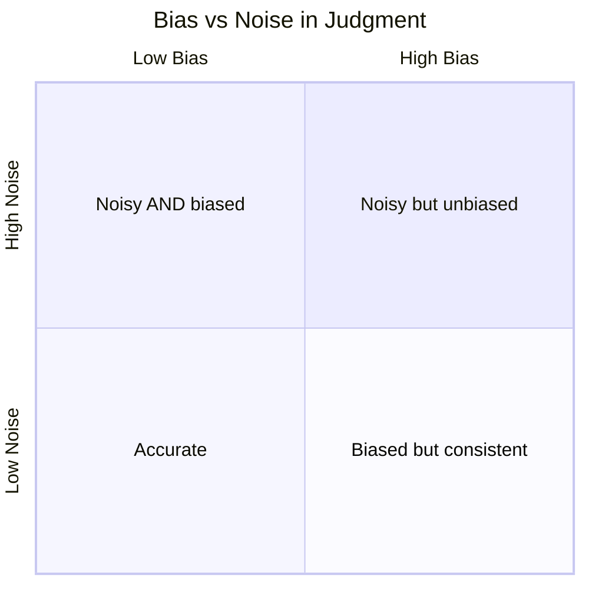
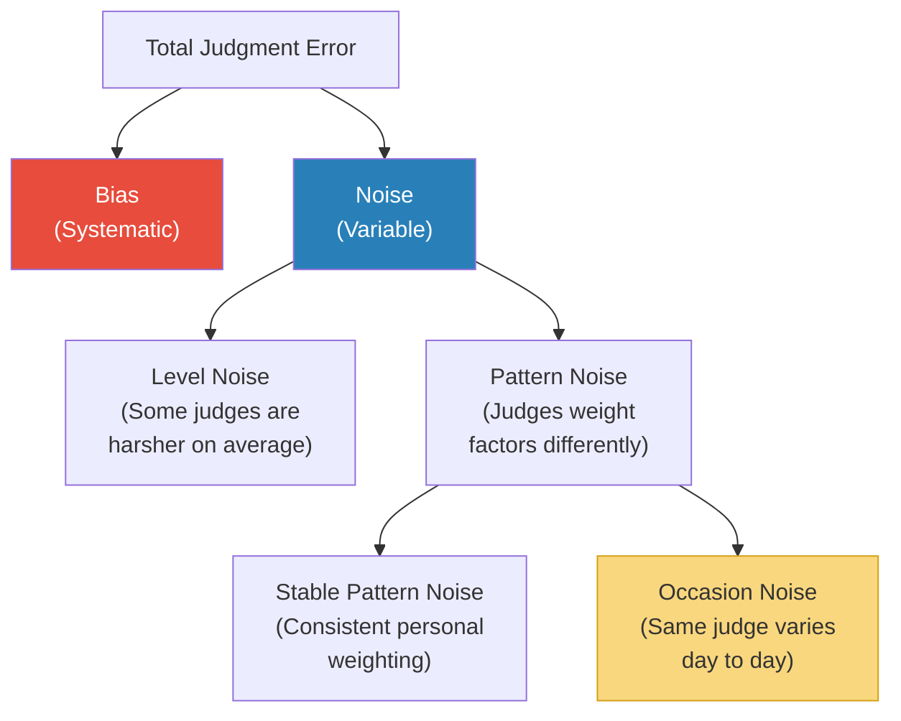

# Noise — Daniel Kahneman, Olivier Sibony & Cass R. Sunstein

> Daniel Kahneman spent decades teaching the world about bias — the systematic errors in human judgment that push our thinking in one predictable direction.
> In this book, his final major work, he and his co-authors reveal an equally damaging but almost entirely ignored source of error: noise — the unwanted variability in judgments that should be identical.
> When two judges sentence the same offender differently, when two doctors diagnose the same patient differently, when two underwriters price the same risk differently, that's noise. And it's everywhere.
> The book's devastating finding: wherever professionals make judgments, the variability between their judgments is far greater than anyone expects or accepts — and it causes as much harm as bias, sometimes more.
> This is the most important book on decision-making since *Thinking, Fast and Slow* — and its implications for organisations are profound.

---

## About the Authors

Daniel Kahneman (1934-2024) was a Nobel Prize-winning psychologist and the author of *Thinking, Fast and Slow*. He spent his career studying the systematic errors in human judgment.
Olivier Sibony is a former senior partner at McKinsey and a professor of strategy at HEC Paris, specialising in strategic decision-making and organisational judgment.
Cass R. Sunstein is a Harvard Law professor and former Administrator of the White House Office of Information and Regulatory Affairs, with expertise in behavioural economics and regulation.

---

## The Big Idea

- Everyone knows about <b style="color: #2980b9">bias</b> — systematic errors that push judgments in one direction (always too high, always too harsh)
- Almost no one thinks about <b style="color: #e74c3c">noise</b> — the random scatter in judgments that should be consistent
- <b style="color: #2980b9">Noise is unwanted variability</b>
- When multiple judges sentence the same case differently, that's noise
- When the same doctor disagrees with herself on the same X-ray viewed weeks apart, that's noise
- When performance reviews tell you more about the reviewer than the employee, that's noise

---

- The relationship between bias and noise is captured in a simple equation:
- <b style="color: #2980b9">Total Error = Bias² + Noise²</b>
- Reducing either one reduces total error
- But while bias gets all the attention, <b style="color: #e74c3c">noise is often the bigger problem — and it's almost completely invisible</b>

---

## Key Concepts at a Glance

| Concept | One-line summary |
|---------|-----------------|
| **Noise** | Unwanted variability in judgments that should be identical |
| **Bias** | Systematic error in one direction (predictably too high or too low) |
| **System Noise** | Variability across different judges in the same system |
| **Occasion Noise** | The same person gives different judgments on different occasions |
| **Pattern Noise** | Different judges weight the same factors differently |
| **Noise Audit** | Have multiple people judge the same cases independently — then compare |
| **Decision Hygiene** | Structured protocols that reduce noise without knowing its specific causes |

---

## The Noise Audit: How Bad Is It?

> [!example] The Insurance Underwriters
> A large insurance company asked 48 underwriters to set premiums for five cases. Executives predicted the underwriters would vary by about 10%.
> The actual median variation: **55%**.
> For identical risks, one underwriter might charge $9,500 while another charged $16,700.
> This is a noise problem — and the company had no idea it existed until they ran the audit.

> [!example] Criminal Sentencing
> In one study, 208 federal judges were given the same set of cases. The sentences they handed down varied enormously.
> For one case involving heroin possession, sentences ranged from 1 year to 10 years.
> A separate study of asylum judges found that one judge granted asylum in 5% of cases while another granted it in 88%.
> <b style="color: #e74c3c">The single most important factor in many legal outcomes is not the facts of the case but which judge you draw.</b>

> [!example] Medical Diagnosis
> When doctors are shown the same X-ray, biopsy, or patient description twice (weeks apart), they disagree with *themselves* 20-40% of the time.
> This is occasion noise — variability within the same individual on different occasions.

---

## Types of Noise

- **Level noise:** Some judges are simply harsher than others, some doctors more conservative
- **Pattern noise:** Different judges weight the same factors differently — one thinks drug history matters most, another focuses on employment
- **Occasion noise:** The same person gives a different answer on Monday than Friday — influenced by weather, mood, hunger, what case they saw before this one

---

## Why We Don't See Noise

- Noise is invisible because we almost never run the experiment of having multiple people judge the same case
- <b style="color: #2980b9">Bias is visible: if everyone's estimate is too high, you can see the error. Noise scatters in all directions and averages out — hiding itself.</b>
- Organisations assume their professionals are interchangeable — that any qualified judge, doctor, or underwriter would reach roughly the same conclusion
- They are wrong, and they don't know they're wrong because they never check

---

## Decision Hygiene: The Solution

- The authors propose <b style="color: #2980b9">decision hygiene</b> — structured protocols that reduce noise without needing to identify its specific causes
- This is analogous to hand-washing in surgery: you don't need to know which specific germs are present to benefit from the protocol

| Practice | How It Reduces Noise |
|----------|---------------------|
| **Structure judgments** | Break complex assessments into independent components |
| **Use independent assessments** | Have multiple people judge before discussing (prevent anchoring) |
| **Aggregate judgments** | Average or use structured deliberation rather than letting the loudest voice win |
| **Use reference classes** | Compare the current case to a statistical base rate, not just gut feeling |
| **Use algorithms where possible** | Simple rules consistently outperform expert judgment for routine decisions |
| **Conduct noise audits** | Regularly test whether your professionals agree with each other (and with themselves) |

> [!danger] Before: Unstructured judgment
> A hiring panel discusses candidates freely. The first person to speak anchors the group. Charismatic candidates get rated higher. The panel reaches "consensus" that is really just conformity to the loudest voice.

> [!success] After: Decision hygiene
> Each interviewer scores the candidate independently on predefined criteria before any group discussion. Scores are aggregated. Discussion focuses on resolving specific disagreements, not general impressions.

---

## The Case for (and Against) Algorithms

- For many routine decisions, <b style="color: #2980b9">simple algorithms (even crude ones) outperform expert human judgment</b>
- This is not because the algorithms are brilliant — it's because they are consistent. They have zero noise.
- A simple regression model that predicts wine quality from weather data outperforms expert sommeliers
- But algorithms can encode bias, lack transparency, and can't handle truly novel situations
- <b style="color: #27ae60">The book's recommendation: use algorithms as a starting point, then allow structured human override for exceptional cases</b>

---

## The Verdict

*Noise* is one of those rare books that makes you see a problem you never knew existed — and then makes you realise it's everywhere.
The core insight is profound: bias has received decades of attention, but noise — the other half of the error equation — has been almost completely ignored, even though it causes equal or greater damage.

The noise audit is the book's most practically explosive idea.
Any organisation that employs professionals to make judgments (which is nearly all of them) should run one.
The results will be disturbing — and that disturbance is the first step toward improvement.

The book's weakness is length.
At over 400 pages, it belabours points that could be made more concisely.
The academic rigour is admirable but sometimes slows the pace.
Some chapters feel like journal articles that wandered into a popular book.

But the core message — that noise is as important as bias, and that decision hygiene can fix it — is one of the most important ideas in the decision sciences in decades.

---

## Related Reading

- [[Thinking in Bets - Annie Duke|Thinking in Bets]] — How to separate decision quality from outcome quality
- [[You Are Not So Smart - David McRaney|You Are Not So Smart]] — The cognitive biases that contribute to noisy judgments
- [[Your Brain at Work - David Rock|Your Brain at Work]] — The cognitive bandwidth limits that produce occasion noise
- [[Influence - Robert Cialdini|Influence]] — Anchoring and social proof as sources of both bias and noise
- [[The Checklist Manifesto - Atul Gawande|The Checklist Manifesto]] — Checklists as a practical noise-reduction tool
