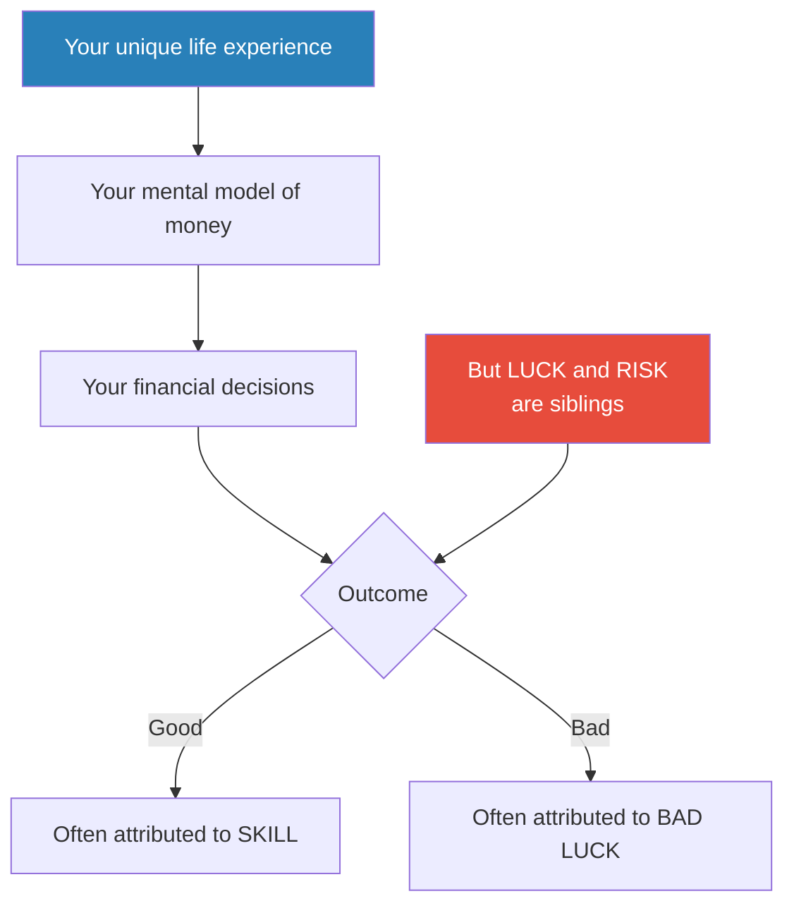

# The Psychology of Money — Morgan Housel

> Morgan Housel's thesis is devastatingly simple: doing well with money has little to do with how smart you are and everything to do with how you behave.
> Through twenty short, story-driven chapters, he demonstrates that the decisions people make about money are not driven by spreadsheets or financial literacy but by personal history, ego, pride, envy, fear, and the narratives they've absorbed about what money means.
> A janitor with no financial education can outperform a Harvard-trained investment banker — and regularly does — because wealth is built by behaviour, not intellect.
> The book is part financial history, part behavioural psychology, and entirely free of jargon, formulas, or condescension.
> It is the best book on money for people who don't want to read a book about money.

---

## About the Author

Morgan Housel is a partner at the Collaborative Fund and a former columnist for the Motley Fool and the Wall Street Journal.
He has won multiple Society of American Business Editors and Writers awards.
His writing is distinguished by its brevity, clarity, and reliance on historical narrative rather than financial theory.

---

## The Big Idea

- <b style="color: #2980b9">Financial success is a soft skill, not a hard science</b>
- How you behave with money matters more than what you know about it
- People don't make financial decisions in a spreadsheet — they make them at the dinner table, late at night, in moments of fear, greed, envy, and ego
- <b style="color: #27ae60">No one is crazy</b> — everyone's financial behaviour makes perfect sense to them given the unique set of experiences they've had
- A person who grew up during hyperinflation will behave completely differently from one who grew up during a boom — and both are acting rationally given their data

---

## Key Concepts at a Glance

| Concept | One-line summary |
|---------|-----------------|
| **No One's Crazy** | Everyone's financial behaviour is rational given their personal experience |
| **Luck & Risk** | They are siblings — you cannot have one without the other |
| **Never Enough** | There is no amount of money that satisfies without the ability to say "enough" |
| **Confounding Compounding** | 99.7% of Buffett's wealth came after age 50 — time is the variable |
| **Getting vs Staying Wealthy** | Getting rich requires risk-taking; staying rich requires humility and paranoia |
| **Tails, You Win** | A tiny number of events drive the vast majority of outcomes |
| **Freedom** | The highest dividend money pays is control over your time |
| **Man in the Car Paradox** | No one admires the driver; they imagine themselves in the car |
| **Wealth Is What You Don't See** | Spending is the enemy of wealth — rich is current income, wealth is hidden |
| **Room for Error** | The single most important concept in finance |
| **Nothing's Free** | Market volatility is the price of admission, not a fine to be avoided |
| **The Seduction of Pessimism** | Pessimism sounds smarter than optimism but is almost always wrong over time |

---

## No One's Crazy

- Your personal experience with money makes up maybe 0.00000001% of what has happened in the world but maybe 80% of how you think the world works
- A person born in the US in 1970 saw the S&P 500 increase almost tenfold, adjusted for inflation, during their teens and twenties — they learned that stocks are a money machine
- A person born in 1950 saw the market go essentially nowhere during their teens and twenties — they learned that stocks are a pointless gamble
- <b style="color: #27ae60">Both are right, given their data. Neither is crazy.</b>

---

## Luck & Risk

> [!example] Bill Gates and the Lakeside Computer
> Bill Gates went to one of the only high schools in the world that had a computer in 1968. The odds of a high school student having access to a computer at that time were roughly one in a million.
> Gates is brilliant and a legendary hard worker — but so was his equally talented classmate Kent Evans, who died in a mountaineering accident before graduating.
> Gates got the luck of access AND the luck of survival. Evans got the risk.

- Luck and risk are <b style="color: #2980b9">the same thing</b>: the acknowledgment that outcomes are influenced by forces beyond individual effort
- When judging others' financial success or failure, remember that nothing is as good or as bad as it seems
- <b style="color: #e74c3c">Be careful who you praise and who you look down upon</b>

---

## Never Enough

> [!example] Rajat Gupta
> Rajat Gupta was CEO of McKinsey and worth an estimated $100 million. He wanted to be a billionaire. He committed insider trading, was caught, convicted, and lost everything.
> He had enough. He didn't know it.

- The hardest financial skill is getting the goalpost to stop moving
- <b style="color: #e74c3c">Social comparison is the problem</b> — when you look at someone with more, your "enough" keeps shifting
- "There is no reason to risk what you have and need for what you don't have and don't need"

---

## Confounding Compounding

- Warren Buffett's net worth is approximately $84 billion. Of that, $84.2 billion was accumulated after his 50th birthday. $81.5 billion came after he qualified for Social Security in his mid-60s
- Buffett's skill is investing. His secret is time. He has been investing since age 10.
- <b style="color: #2980b9">$81.5 billion of his ~$84 billion came after he was a senior citizen</b>
- Good investing isn't about earning the highest returns — it's about earning pretty good returns consistently for the longest period of time

---

## Getting Wealthy vs Staying Wealthy

| | Getting Wealthy | Staying Wealthy |
|--|----------------|-----------------|
| **Requires** | Optimism, risk-taking, boldness | Humility, fear, paranoia |
| **Mindset** | "This will work" | "I need to survive to keep playing" |
| **Key skill** | Offence | Defence |
| **Hero** | Entrepreneurs who bet big | Those who endure through every crisis |

- <b style="color: #27ae60">Survival is the cornerstone of financial strategy</b>
- You have to give compounding the time it needs — and the only way to do that is to not get wiped out along the way
- A plan is only useful if it can survive contact with the real world — and real-world plans need room for error

---

## Tails, You Win

- At the Cannes Film Festival, most movies flop. A few are massive hits. The hits pay for everything.
- In venture capital, half of all investments lose money. The top 1% of deals produce the bulk of returns.
- In the stock market, a small handful of stocks drive nearly all long-term gains — most individual stocks underperform cash
- <b style="color: #2980b9">You can be wrong half the time and still make a fortune — if your winners are big enough</b>

---

## Freedom

- The highest form of wealth is the ability to wake up every morning and say "I can do whatever I want today"
- <b style="color: #27ae60">Controlling your time is the highest dividend money pays</b>
- This matters more than house size, car model, or vacation frequency
- Research consistently shows that the single most reliable predictor of happiness is having control over your daily schedule

---

## The Man in the Car Paradox

> [!example] Housel as a Parking Valet
> As a valet at a luxury hotel, Housel watched rich people pull up in Ferraris, Lamborghinis, and Rolls-Royces.
> Not once did he look at the driver and think "That person is cool." Every time, he thought "If I had that car, people would think *I'm* cool."
> The drivers bought the car to signal status. But no one was looking at them — everyone was imagining themselves in the car.

- <b style="color: #e74c3c">People don't admire you for your possessions — they use your possessions as a benchmark for their own fantasies</b>

---

## Room for Error

- The most important concept in finance is not returns or diversification — it is <b style="color: #2980b9">margin of safety</b>
- Room for error lets you endure the range of potential outcomes and stay in the game long enough for the odds to work in your favour
- It acknowledges that the future is uncertain and plans will be wrong — the question is whether you can survive being wrong
- "The purpose of the margin of safety is to render the forecast unnecessary" — Benjamin Graham

---

## The Seduction of Pessimism

- Pessimism sounds smarter and more intellectually credible than optimism
- Optimists sound naive; pessimists sound like they've thought things through
- But optimism is almost always the correct long-term bet — the world has gotten dramatically better on nearly every measurable dimension over any meaningful time horizon
- <b style="color: #27ae60">Optimism is not naivete — it's the recognition that most people, most of the time, are trying to solve problems and improve their situation</b>

---

## The Verdict

*The Psychology of Money* is the rare finance book that contains no charts, no formulas, and almost no numbers — and it's the most useful one you'll read.
Housel's genius is in reframing money not as a math problem but as a behaviour problem, and then showing — through vivid stories like Ronald Read the janitor millionaire and Rajat Gupta the insider-trading billionaire — that the behaviours that build wealth are stubbornly simple: spend less than you earn, don't try to time the market, give compounding the decades it needs, and leave room for error.

The book's structure (twenty short, self-contained chapters) makes it easy to dip in and out.
Its weakness is that the short-chapter format sometimes means ideas aren't developed as deeply as they could be — a few chapters feel like blog posts promoted to book-chapter status.
But the ideas that land — room for error, tails drive outcomes, wealth is what you don't see, nothing's free — will permanently alter how you think about money.

---

## Related Reading

- [[Thinking in Bets - Annie Duke|Thinking in Bets]] — Separating luck from skill in decision-making
- [[Antifragile - Nassim Nicholas Taleb|Antifragile]] — Room for error as a survival strategy under uncertainty
- [[Influence - Robert Cialdini|Influence]] — The psychological shortcuts that drive financial behaviour
- [[The Richest Man in Babylon - George C. Clason|The Richest Man in Babylon]] — Timeless financial principles in parable form
