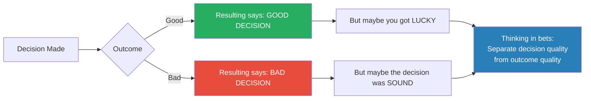

# Thinking in Bets — Annie Duke

> Annie Duke spent twenty years as a professional poker player, winning over $4 million in tournaments and a World Series of Poker gold bracelet — and in the process, she discovered something that most people never learn: the quality of a decision and the quality of its outcome are two completely different things.
> *Thinking in Bets* is her argument that treating every decision as a bet on an uncertain future — rather than as a choice that should produce a guaranteed result — is the single most powerful shift you can make in how you think, learn, and live.
> Drawing on poker, cognitive psychology, and behavioural economics, Duke shows how "resulting" (judging decisions by outcomes), self-serving bias, and black-and-white thinking systematically corrupt our ability to learn from experience — and what we can do about it.
> The book is part memoir, part decision science, and entirely practical.

---

## About the Author

Annie Duke was a professional poker player for twenty years, earning over $4 million in tournament prizes including a World Series of Poker gold bracelet and the NBC National Heads-Up Championship.
Before poker, she completed doctoral coursework in cognitive psychology at the University of Pennsylvania on an NSF fellowship.
She now consults with executives and organisations on decision-making under uncertainty.

---

## The Big Idea

- Two things determine how our lives turn out: <b style="color: #2980b9">the quality of our decisions</b> and <b style="color: #2980b9">luck</b>
- Most people are terrible at separating the two
- We judge decisions by their outcomes — a habit Duke calls <b style="color: #e74c3c">resulting</b>
- Good outcome? Must have been a good decision. Bad outcome? Must have been a bad decision.
- This is wrong, and it corrupts everything: our learning, our self-image, our ability to improve

---

- <b style="color: #2980b9">Life is poker, not chess</b>
- Chess has no hidden information and almost no luck — if you lose, you played worse
- Poker has hidden cards, incomplete information, and a huge luck element — you can play perfectly and still lose
- Real life is like poker: you make decisions with incomplete information, luck shapes your outcomes, and you rarely get to see the counterfactual
- <b style="color: #27ae60">The best decision-makers don't try to eliminate uncertainty — they embrace it and learn to work within it</b>

---

## Key Concepts at a Glance

| Concept | One-line summary |
|---------|-----------------|
| **Resulting** | Judging decision quality by outcome quality — the fundamental error |
| **Life is poker, not chess** | Decisions involve hidden information and luck; outcomes are probabilistic |
| **Self-serving bias** | We take credit for wins (skill) and blame losses on luck |
| **Outcome fielding** | Sorting results into "luck" or "skill" buckets — and getting it systematically wrong |
| **Belief calibration** | Expressing confidence as percentages rather than certainties |
| **"I'm not sure"** | Embracing uncertainty is strength, not weakness |
| **Truthseeking groups** | Pods of people committed to accuracy over ego (CUDOS framework) |
| **Mental time travel** | Backcasting, premortems, 10-10-10, and Ulysses contracts |

---

## Resulting: The Core Error

> [!example] Pete Carroll's Super Bowl Pass
> With 26 seconds left in Super Bowl XLIX, trailing by 4, the Seahawks had the ball on the 1-yard line. Everyone expected a run. Carroll called a pass. It was intercepted.
> Headlines: "Worst play-call in Super Bowl history."
> But analysis showed: out of 66 passes from the 1-yard line that season, zero had been intercepted. The interception rate over 15 seasons was about 2%. Carroll made a defensible decision that got a 2% bad result.
> "The call would have been a great one if we catch it," Carroll said. "Nobody would have thought twice about it."

- We result because our brains evolved to create certainty and order
- <b style="color: #e74c3c">A false positive (hearing rustling and assuming a lion when it's wind) was much less costly than a false negative (assuming wind when it's a lion)</b>
- So we evolved to find patterns and assign causes — even when the relationship between decision and outcome is loose
- In chess, resulting works: outcomes correlate tightly with decision quality
- <b style="color: #2980b9">In poker — and in life — resulting is catastrophic</b>

---

## Outcome Fielding: The Self-Serving Bias

- When we experience an outcome, we must sort it: was this due to my skill (I can learn from it) or luck (I can't)?
- We get this systematically wrong in a predictable pattern:

| Outcome | For Ourselves | For Others |
|---------|--------------|------------|
| **Good result** | My skill (I deserve credit) | Their luck (they got lucky) |
| **Bad result** | Bad luck (not my fault) | Their fault (they screwed up) |

- This is <b style="color: #e74c3c">self-serving bias</b> — and it's universal
- Phil Hellmuth after being eliminated: "If it weren't for luck, I'd win every one"
- Car insurance forms: "An invisible car came out of nowhere, struck my car, and vanished"
- In single-vehicle accidents, 37% of drivers still blamed someone else

> [!example] Nick the Greek at the Crystal Lounge
> Nick believed the element of surprise was so important in poker that the mathematically worst hand (7-2 offsuit) was actually the best hand, because "they never expect it."
> When he won with 7-2 (occasionally, by luck), he took credit for his brilliant strategy.
> When he lost (frequently), he blamed bad luck.
> He never updated his beliefs. He eventually went broke and was deported.

---

## Phil Ivey: The Antidote

- Phil Ivey is one of the world's best poker players (10+ WSOP bracelets)
- After winning a major tournament, he spent the celebration dinner analysing every potential mistake he made on the way to victory
- <b style="color: #27ae60">For Ivey, the opportunity to learn from mistakes was more important than basking in the win</b>
- This is the habit change Duke advocates: get your positive self-image from accuracy and truthseeking, not from taking credit

> [!danger] Before: Standard habit loop
> Win → take credit (feels good) → reinforce current strategy
> Lose → blame luck (protects ego) → miss learning opportunity

> [!success] After: Ivey's habit loop
> Win → analyse what could have gone better (truthseeking feels good) → improve strategy
> Lose → examine what was in your control (accurate fielding feels good) → improve strategy

---

## Belief Calibration: "I'm Not Sure" as Strength

- We are trained that "I don't know" is a failure — write it on a test and you get zero marks
- But <b style="color: #2980b9">"I'm not sure" is almost always a more accurate representation of reality than certainty</b>
- Saying "I'm 80% confident" is more credible than "I'm absolutely certain" — it signals thoughtfulness
- It also invites collaboration: others feel safe sharing information that might refine your belief
- Physicist James Clerk Maxwell: "Thoroughly conscious ignorance is the prelude to every real advance in science"

---

## Truthseeking Groups: The CUDOS Framework

- Individual truthseeking is hard because self-serving bias operates automatically
- The solution: form a group committed to helping each other field outcomes accurately
- Duke borrows the CUDOS norms from sociologist Robert Merton's ideals for scientific communities:

| Norm | Meaning | In Practice |
|------|---------|-------------|
| **Communism** | Share information openly | Don't hoard knowledge; the group benefits from what everyone knows |
| **Universalism** | Evaluate ideas on merit, not source | Don't dismiss an idea because of who said it |
| **Disinterestedness** | Acknowledge your own biases | Everyone has conflicts of interest; name yours openly |
| **Organized Skepticism** | Challenge ideas with evidence, not hostility | "Wanna bet?" as a tool for calibrating confidence |

- <b style="color: #27ae60">The group rewards accuracy over agreement</b> — unlike most social groups which reward conformity

---

## Mental Time Travel: Recruiting Past and Future Selves

### Backcasting
- Imagine a positive future, then work backward: what decisions led there?
- Forces you to identify the specific steps that produced success

### Premortems
- Imagine the project has failed spectacularly, then work backward: what went wrong?
- Invented by psychologist Gary Klein
- <b style="color: #2980b9">Much more effective than asking "what could go wrong?" because it treats the failure as a certainty and demands specific causes</b>

### The 10-10-10 Rule
- Before making an emotionally charged decision, ask: How will I feel about this in 10 minutes? 10 months? 10 years?
- Forces temporal perspective that counteracts the heat of the moment

### Ulysses Contracts
- Pre-commit to a decision before you're in the emotional state that would derail it
- Ulysses had himself tied to the mast so he could hear the Sirens without steering toward them
- Modern examples: automatic savings deductions, designated drivers, putting your phone in another room while working

---

## The Verdict

*Thinking in Bets* is a deceptively simple book that rewires how you think about decisions.
The poker framing is not a gimmick — it is precisely because poker compresses thousands of decisions into high-stakes, incomplete-information environments that it reveals patterns invisible in slower, lower-stakes domains.

Duke's strongest contribution is the concept of resulting — once you see it, you see it everywhere: in sports commentary, in performance reviews, in your own self-talk after a bad day.
The self-serving bias analysis is thorough and uncomfortably accurate.
The Phil Ivey anecdote is the book's emotional centre: the image of the world's best player spending his victory dinner hunting for mistakes is unforgettable.

The book's weakness is occasional repetition and a tendency to over-explain concepts that the poker examples have already made clear.
The CUDOS framework feels somewhat academic compared to the vivid poker stories.
And Duke doesn't fully address the difficulty of applying these ideas when emotional stakes are highest — in relationships, health crises, or grief.

For anyone who makes decisions under uncertainty — which is everyone — this is essential reading.

---

## Related Reading

- [[Noise - Cass R. Sunstein|Noise]] — Why human judgments vary so much, even among experts
- [[Antifragile - Nassim Nicholas Taleb|Antifragile]] — How to thrive under uncertainty rather than merely surviving it
- [[Influence - Robert Cialdini|Influence]] — The mental shortcuts that create the errors Duke describes
- [[Your Brain at Work - David Rock|Your Brain at Work]] — The cognitive bandwidth limits that force us to rely on shortcuts
- [[The Psychology of Money - Morgan Housel|The Psychology of Money]] — How emotional biases shape financial decisions specifically
