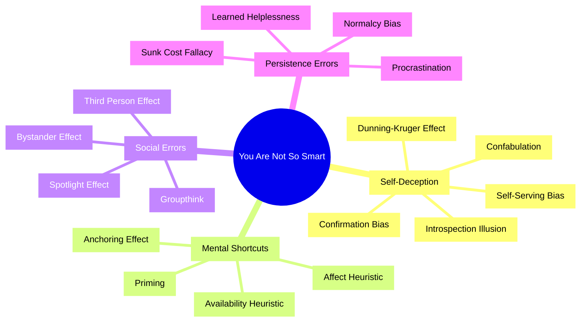

# You Are Not So Smart — David McRaney

> David McRaney's book is a catalogue of the ways your brain lies to you — forty-eight short, punchy chapters, each dismantling one cherished illusion about your own rationality.
> The format is elegant: each chapter opens with "The Misconception" (what you believe about yourself) and "The Truth" (what the research actually shows). The misconception is always flattering. The truth never is.
> This is not an academic text — it's a greatest-hits album of cognitive biases, logical fallacies, and psychological quirks, written with wit and accessible examples that make you laugh while realising how reliably your brain deceives you.
> It is the essential self-awareness tool: you cannot fix thinking errors you don't know you're making.

---

## About the Author

David McRaney is a journalist who became fascinated by the gap between how rational we think we are and how rational we actually are.
He started the blog "You Are Not So Smart," which grew into this book and its sequel, *You Are Now Less Dumb*.
He is not an academic psychologist but a skilled populariser who translates research into engaging, memorable prose.

---

## The Big Idea

- <b style="color: #2980b9">You are not so smart</b> — your brain is a deeply flawed machine that runs on shortcuts, self-deception, and motivated reasoning
- You believe you are a rational agent making deliberate choices based on evidence. You are not.
- Your brain confabulates reasons for decisions it has already made unconsciously, filters information to confirm what you already believe, and systematically overestimates your own abilities
- <b style="color: #e74c3c">The first step to thinking clearly is accepting that you don't</b>

---

## Selected Biases (The Most Impactful)

### Confirmation Bias

> **Misconception:** Your opinions are the result of years of rational, objective analysis.
> **Truth:** Your opinions are the result of years of paying attention to information that confirmed what you already believed, while ignoring information that challenged it.

- We don't seek truth — we seek validation
- When presented with mixed evidence on a controversial topic, both sides come away MORE convinced they were right
- <b style="color: #e74c3c">The internet has made this infinitely worse</b> — you can always find a source that agrees with you

---

### The Dunning-Kruger Effect

> **Misconception:** You can predict how well you would perform in any situation.
> **Truth:** You are generally terrible at estimating your own competence, and the less competent you are, the more confident you feel.

- Unskilled people overestimate their ability because they lack the skill to recognise their own incompetence
- Highly skilled people underestimate their ability because they assume everyone finds it equally easy
- <b style="color: #2980b9">The first rule of Dunning-Kruger: you don't know you're subject to Dunning-Kruger</b>

---

### The Sunk Cost Fallacy

> **Misconception:** You make rational decisions based on the future value of objects, investments, and experiences.
> **Truth:** Your decisions are tainted by the emotional investments you've accumulated, and the more you invest in something, the harder it becomes to abandon it.

- You sit through a terrible movie because you paid for the ticket
- Companies pour money into failing projects because they've already spent so much
- Governments continue wars because of the lives already lost
- <b style="color: #27ae60">The rational question is never "how much have I already invested?" but "what is the best use of my resources from this point forward?"</b>

---

### The Anchoring Effect

> **Misconception:** You rationally analyse all factors before making a choice or determining value.
> **Truth:** Your first perception lingers in your mind, affecting later perceptions and decisions.

- When subjects were asked whether Gandhi died before or after age 9, they guessed much lower ages than those asked if he died before or after age 140
- Asking prices, salary negotiations, and sentencing recommendations are all powerfully shaped by the first number introduced
- <b style="color: #2980b9">Whoever sets the anchor controls the negotiation</b>

---

### The Bystander Effect

> **Misconception:** When someone is hurt, people rush to their aid.
> **Truth:** The more people present, the less likely it is that anyone will help.

- Diffusion of responsibility: each person assumes someone else will act
- Pluralistic ignorance: each person looks at others' calm faces and concludes nothing is wrong
- <b style="color: #27ae60">The fix: single out one person and give a specific instruction — "You in the red shirt, call 911"</b>

---

### Procrastination

> **Misconception:** You procrastinate because you are lazy.
> **Truth:** You procrastinate because you are unable to manage your emotions about a task.

- Procrastination is not a time management problem — it's an emotion management problem
- The present self always wins against the future self because present emotions are vivid and future consequences are abstract
- <b style="color: #2980b9">This is why deadlines work: they make the future consequence emotionally real NOW</b>

---

### Normalcy Bias

> **Misconception:** Your fight-or-flight instincts kick in when disaster strikes and you act quickly.
> **Truth:** You often freeze and pretend everything is normal when facing a deadly situation.

- In the Beverly Hills Supper Club fire of 1977, survivors reported that many people simply sat in their chairs and waited to be told what to do — even as smoke filled the room
- <b style="color: #e74c3c">The most common response to danger is not panic but denial</b>
- People in hurricane zones often refuse to evacuate because "it's never been that bad before"

---

### The Spotlight Effect

> **Misconception:** Everyone notices when you trip, stammer, or have a bad hair day.
> **Truth:** No one is paying as much attention to you as you think.

- Students who wore an embarrassing T-shirt estimated that 50% of others noticed. The actual number: 25%.
- <b style="color: #27ae60">Everyone else is too busy worrying about their own spotlight to notice yours</b>

---

## Key Format: Misconception vs Truth

| Bias | The Misconception | The Truth |
|------|-------------------|-----------|
| **Confirmation Bias** | Your opinions come from rational analysis | You seek validation, not truth |
| **Dunning-Kruger** | You can judge your own competence | The less skilled you are, the more confident you feel |
| **Sunk Cost** | You make decisions based on future value | Past investment irrationally drives continued investment |
| **Anchoring** | You evaluate things objectively | The first number you hear dominates your judgment |
| **Bystander Effect** | People rush to help in emergencies | More witnesses = less help |
| **Procrastination** | You're lazy | You can't manage the emotions around the task |
| **Normalcy Bias** | You'd act heroically in a crisis | You'd probably freeze and wait for instructions |
| **Spotlight Effect** | Everyone is watching you | Almost no one is paying attention |
| **Self-Serving Bias** | You evaluate success and failure objectively | You take credit for wins and blame luck for losses |

---

## The Verdict

*You Are Not So Smart* is the most accessible introduction to cognitive biases available.
It won't make you an expert in any one bias, but it will inoculate you against all of them — because the first and most important step is simply knowing they exist.

The Misconception/Truth format is brilliant — it makes every chapter a miniature revelation.
The writing is witty without being smug, and the examples are drawn from everyday life rather than academic abstractions.

The book's limitation is depth.
At 48 biases in under 300 pages, each gets only a few pages.
If you want deep treatment of any single bias, you'll need to go to the primary sources (Kahneman, Ariely, Cialdini).
But as a field guide to your own irrationality — the kind of book you keep on your desk and flip through when you catch yourself being too certain — it is unmatched.

---

## Related Reading

- [[Thinking in Bets - Annie Duke|Thinking in Bets]] — How resulting and self-serving bias corrupt learning from experience
- [[Noise - Cass R. Sunstein|Noise]] — The variability in human judgment that these biases produce
- [[Influence - Robert Cialdini|Influence]] — The six weapons that exploit these cognitive shortcuts
- [[Your Brain at Work - David Rock|Your Brain at Work]] — The neurological constraints that force us to rely on these shortcuts
- [[Antifragile - Nassim Nicholas Taleb|Antifragile]] — How to build systems that survive despite these biases
