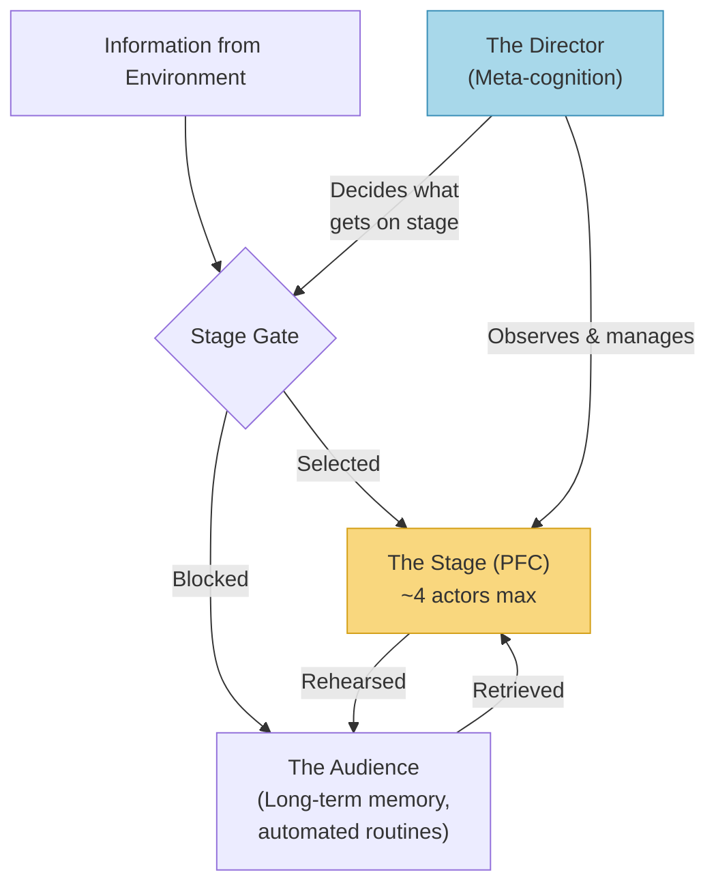
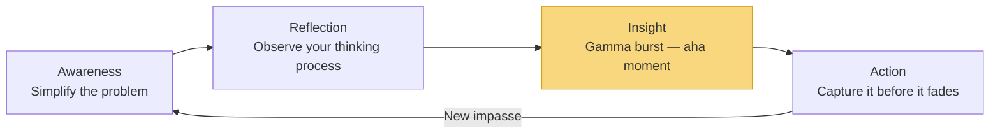
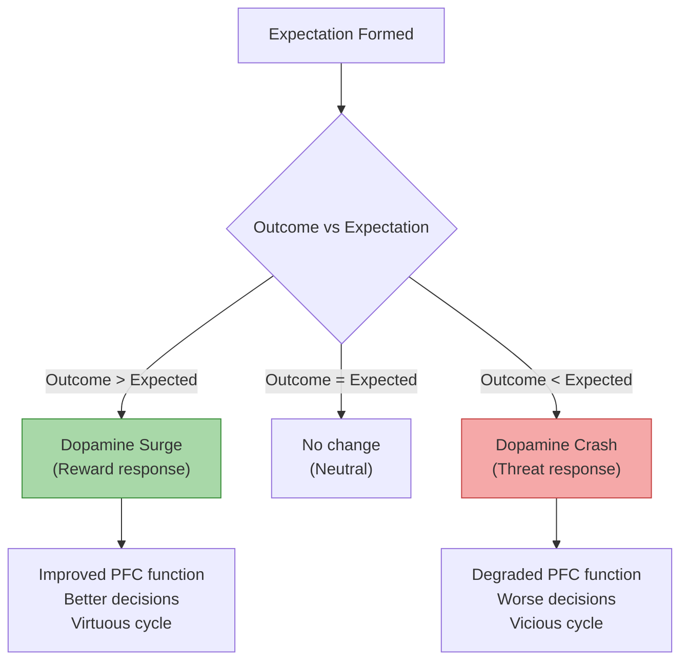
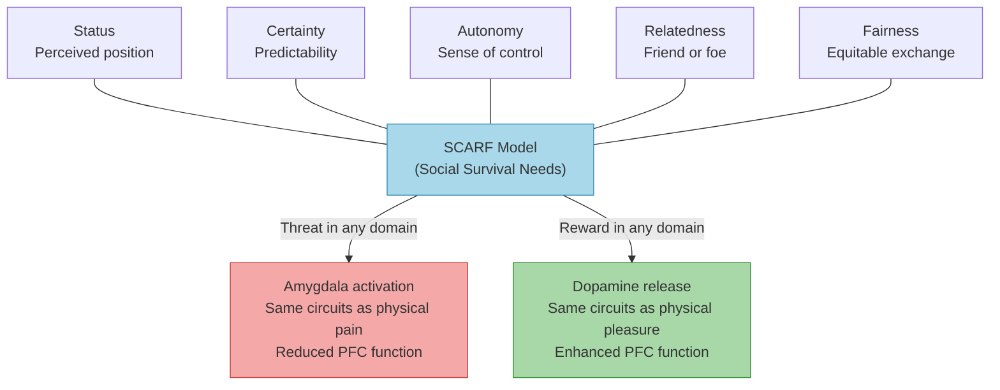
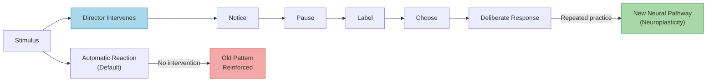

# Your Brain at Work — David Rock

> David Rock synthesises over three hundred neuroscience papers into a single, practical argument: the prefrontal cortex — where all your conscious thinking, planning, and deciding happens — is tiny, energy-hungry, and embarrassingly easy to disrupt. Most knowledge workers spend their days doing exactly what degrades it: multitasking, reacting to notifications, suppressing emotions, and forcing insight instead of allowing it. Rock introduces a "director" metaphor for meta-cognition (the ability to watch your own brain at work) and the **SCARF model** (Status, Certainty, Autonomy, Relatedness, Fairness) as a framework for understanding why social situations feel as threatening as physical danger. The book is structured as a play in four acts, following two fictional characters — Emily, a marketing VP at a software firm, and Paul, a freelance IT consultant — through a single workday, replaying each scene twice: first the way the brain naturally handles it, then the way it could handle it with neuroscience-informed awareness. The result is both a neurological operating manual for anyone who thinks for a living and a surprisingly rigorous argument that social needs are as biologically primary as physical ones.

---

## About the Author

David Rock is the founder of the **NeuroLeadership Institute**, an organisation dedicated to applying neuroscience research to leadership and management practice.
He is not a neuroscientist himself but a synthesiser and populariser who interviewed over thirty neuroscientists and drew from more than three hundred research papers to write this book.
His background is in executive coaching and organisational consulting, which gives the book a practical, application-first tone rather than an academic one.
Key scientists he draws on include Amy Arnsten (Yale, prefrontal cortex function), Mark Beeman (Northwestern, insight and the "aha moment"), Matthew Lieberman (UCLA, social cognition and affect labeling), Kevin Ochsner (Columbia, emotional reappraisal), Naomi Eisenberger (UCLA, social pain), Roy Baumeister (ego depletion and self-control), and Wolfram Schultz (Cambridge, dopamine and reward prediction).
Rock's particular talent is translation: he takes dense neuroimaging studies and repackages them as stories, metaphors, and practical rules of thumb that non-scientists can immediately use.

---

## The Big Idea

- Your brain's conscious thinking machinery is far more limited than you believe
- Most of modern work is designed to burn through it as fast as possible
- Rock's central metaphor is <b style="color: #2980b9">The Stage</b>:
  - The prefrontal cortex is a small theatre where conscious thought takes place
  - "Actors" on stage = information held in active attention
  - "Audience" = the vast storehouse of memories, knowledge, and automated routines sitting below conscious awareness
- The stage requires enormous energy to keep lit — glucose, oxygen, and a precise cocktail of neurochemicals
- It can hold only about four actors at once, and its lighting dims rapidly with use
- Every act of understanding, deciding, recalling, memorising, or inhibiting draws from the same limited metabolic pool
- <b style="color: #e74c3c">Use the stage for email triage at 8am and you have less of it available for strategic thinking at 9am</b>

The stage metaphor captures Rock's core argument: conscious thought is a scarce resource managed by a meta-cognitive director, not an unlimited engine you can run all day.

---

- The breakthrough insight is that you have a <b style="color: #2980b9">Director</b> — a meta-cognitive capacity to step back and observe your own mental processes
- The director can:
  - Catch automatic reactions before they take hold
  - Choose which tasks deserve the stage
  - Notice when the stage lights are dimming
  - Regulate emotional states that would otherwise hijack your thinking
- The director is itself a prefrontal cortex function — and therefore also limited and energy-hungry
- But it can be strengthened through practice
- <b style="color: #27ae60">The director is the single most valuable cognitive skill a person can develop</b> — the skill of noticing what your brain is doing and intervening before it runs on autopilot
- Rock draws on mindfulness research to support this claim

---

*The book then extends from individual cognition to social dynamics — and this is where it becomes genuinely surprising.*

- Rock argues that the brain processes social threats and rewards using the same neural circuits as physical survival needs
- A drop in perceived status triggers the same pain circuits as a physical injury
- Ambiguity about the future activates the amygdala as if you were facing a predator
- Feeling excluded from a group produces measurable pain in the same brain region that lights up when you stub your toe
- <b style="color: #2980b9">The SCARF Model</b> organises these social needs into five domains:
  - **Status** — your perceived position relative to others
  - **Certainty** — your ability to predict what happens next
  - **Autonomy** — your sense of control over events
  - **Relatedness** — your sense of safety with others (friend vs foe)
  - **Fairness** — your perception of equitable exchange
- <b style="color: #27ae60">Managing social dynamics is not a "soft skill" — it is a biological imperative that affects cognitive performance, health, and decision-making quality</b>

---

## Key Concepts at a Glance

| Concept | One-line summary |
|---------|-----------------|
| **The Stage Metaphor** | Conscious thought uses a tiny, energy-limited mental stage that holds roughly four items at once |
| **The Director** | Meta-cognition lets you observe and intervene in your own thinking — the master lever for cognitive performance |
| **Prioritisation as the Most Expensive Operation** | Ordering priorities requires all five prefrontal functions at once, so do it first while the stage is fresh |
| **The Dual-Task Bottleneck** | The brain can only consciously process one task at a time; multitasking is rapid task-switching that degrades accuracy |
| **Inhibition as the Engine of Focus** | Focus is achieved by suppressing distractions, and each act of suppression draws from a depleting resource pool |
| **The Inverted U (Yerkes-Dodson)** | Peak performance requires intermediate arousal — norepinephrine for alertness and dopamine for interest, precisely balanced |
| **The ARIA Model** | Four phases of insight: Awareness, Reflection, Insight, Action — thinking harder when stuck makes it worse |
| **Emotion Regulation Hierarchy** | Strategies ranked from least to most powerful, with suppression at the bottom as actively counterproductive |
| **Expectations and the Dopamine Economy** | Unmet expectations produce a dopamine crash felt as threat; exceeded expectations produce a surge |
| **The SCARF Model** | Five social domains (Status, Certainty, Autonomy, Relatedness, Fairness) treated by the brain as survival needs |
| **Ego Depletion** | Each act of self-control draws from a shared resource pool, making the next act harder |
| **Self-Directed Neuroplasticity** | Voluntary, repeated attention to new patterns physically rewires neural circuits over time |

---

## Act I: Problems and Decisions — The Stage Under Siege

*Your prefrontal cortex is far smaller and more fragile than you think — and your morning routine is probably destroying it before the real work begins.*

### Scene 1: The Morning Email Trap

*The most precious cognitive resource you have is the fresh prefrontal cortex you wake up with — and most people burn through it on trivia before the real work begins.*

- The book opens with Emily, a recently promoted marketing VP, arriving at her desk with a plan to spend the morning on strategy
- Within minutes she is pulled into email — a supplier complaint, a colleague's request, a scheduling conflict
- By the time she looks up, ninety minutes have passed and the strategic work remains untouched
- Her prefrontal cortex, which was fresh and fully lit at 8am, has been spent on low-value reactive tasks

> [!example] Emily's Morning Email Trap
> Emily arrives at work intending to tackle high-level strategy for her new role.
> - Instead, she opens her inbox and is immediately pulled into a supplier complaint, a scheduling conflict, and a colleague's urgent request.
> - Ninety minutes later the strategic work remains untouched.
> - Her prefrontal cortex — fresh and fully lit at 8am — has been spent entirely on low-value reactive tasks.
> **The lesson:** The brain's best cognitive resources are burned first-come, first-served unless you consciously intervene.

- Rock uses Emily's experience to introduce the core constraint:
  - The prefrontal cortex is metabolically expensive and depletable
  - It represents roughly 4-5% of brain volume but consumes a disproportionate share of the brain's metabolic fuel
  - <b style="color: #e74c3c">One act of self-control measurably depletes the resources available for the next</b>
- Research by Roy Baumeister demonstrated this with an elegantly simple experiment

> [!example] Baumeister's Cookie/Radish Experiment
> Two groups of participants sat in a room with freshly baked chocolate chip cookies and a bowl of radishes.
> - One group was told they could eat the cookies; the other was told to eat only the radishes while resisting the cookies.
> - Both groups were then given an unsolvable geometry puzzle.
> - The radish group — whose prefrontal cortex had already been taxed by resisting chocolate — gave up after an average of eight minutes.
> - The cookie group persisted for an average of nineteen.
> - A follow-up by Gailliot found the glucose link was direct: participants given lemonade with real sugar recovered self-control; those given sugar-free lemonade did not.
> **The lesson:** One act of self-control measurably depletes the resources available for the next — the prefrontal cortex runs on a shared metabolic pool.

- Even older research by Welsh in 1898 had shown the same pattern:
  - Participants who performed mentally demanding tasks showed a roughly fifty percent reduction in physical grip strength, measured by a dynamometer
  - The mental effort had drained a shared energy pool
- Rock's practical rule emerges from this: <b style="color: #27ae60">treat conscious thinking as a non-renewable resource</b>
  - The highest-stakes cognitive work should happen at peak freshness
  - Not squeezed between email triage and status meetings
  - The stage has a finite number of good performances per day

> [!tip] Core Insight — Act I, Scene 1
> Your prefrontal cortex is a depletable resource, not a muscle you can run all day. Schedule your most demanding thinking first, before anything else touches the stage.

---

### Scene 2: Prioritise Before You Do Anything Else

*Prioritisation is the most draining cognitive operation of all — which is exactly why it must come first.*

- Rock argues that <b style="color: #2980b9">prioritisation</b> is among the most metabolically expensive cognitive operations of all
- The reason: it requires the prefrontal cortex to perform all five of its core functions simultaneously

| Prefrontal Function | What it does | Role in prioritisation |
|---------------------|-------------|----------------------|
| **Understanding** | Processing new information | Grasping the current situation |
| **Deciding** | Comparing options and choosing | Selecting between competing priorities |
| **Recalling** | Retrieving from long-term memory | Pulling in relevant context and past outcomes |
| **Memorising** | Holding items in working memory | Keeping multiple options on stage simultaneously |
| **Inhibiting** | Suppressing distractions and impulses | Resisting the pull of urgent-but-unimportant tasks |

All five functions drawing from the same metabolic pool at once makes prioritisation the single most draining cognitive act — and explains why people avoid it in favour of reactive busywork.

---

- Daniel Gilbert's research on <b style="color: #2980b9">affective forecasting</b> is relevant here:
  - Humans are remarkably bad at predicting how they will feel about future events
  - The reason is that imagining the future is itself an energy-intensive act
  - The brain must construct a mental simulation of something that does not exist yet
  - This requires the same prefrontal machinery used for everything else
  - <b style="color: #e74c3c">When that machinery is already depleted — say, by thirty minutes of email — the quality of your future-simulation degrades</b>
  - You make worse priority decisions because you literally cannot see the future as clearly

> [!example] Paul's Prioritisation Routine
> Paul, the IT consultant, begins each morning by jumping straight into client work — whatever landed in his inbox first.
> - He spends three hours on a low-value task that happened to arrive overnight while a critical proposal sits untouched.
> - In the replayed scene, Paul takes ten minutes before opening any digital communication to write his three highest priorities on paper.
> - The difference is not heroic willpower; it is simply putting the most demanding operation first, while the stage lights are brightest.
> **The lesson:** Ten minutes of prioritisation at peak freshness is worth more than three hours of reactive work on a depleted brain.

- The advice is deceptively simple but neurologically grounded: <b style="color: #27ae60">do the hard thinking before the easy reacting</b>
- Even ten minutes of email can exhaust the resources needed for good prioritisation

---

### Scene 3: The Myth of Multitasking

*What feels like doing two things at once is actually rapid switching between them — and each switch exacts a hidden tax on accuracy and energy.*

- Rock devotes an entire scene to demolishing the idea that humans can effectively do two conscious tasks at once
- Research by Harold Pashler demonstrated that the prefrontal cortex creates a <b style="color: #2980b9">dual-task bottleneck</b> — like a one-lane bridge — when processing conscious tasks:
  - You can only cross one direction at a time
  - What feels like multitasking is actually rapid **task-switching**
  - Each switch involves: deactivating one neural network, activating another, reloading the new context, losing some of the old context in the process
  - Each switch costs time, energy, and accuracy

> [!example] Pashler's Dual-Task Bottleneck Research
> Harold Pashler's experiments demonstrated that the prefrontal cortex can only consciously process one task at a time.
> - When participants were asked to respond to two stimuli simultaneously, their response to the second was always delayed.
> - The delay increased with the complexity of both tasks, confirming a single bottleneck rather than parallel processing.
> - Habitual multitaskers in subsequent studies showed IQ reductions equivalent to a lost night of sleep — roughly ten points.
> **The lesson:** The brain has one lane for conscious processing, not two. What feels like multitasking is rapid switching with a hidden cost.

- The research findings are damning:
  - Habitual multitaskers showed IQ reductions equivalent to a lost night of sleep — roughly ten points
  - People who tried to do two things at once made three to five times more errors than those who did them sequentially
  - <b style="color: #e74c3c">Multitasking is rapid task-switching that degrades everything</b>

> [!example] Emily's Multitasking Disaster
> Emily tries to write a proposal while monitoring email and taking a phone call about a vendor issue.
> - The proposal that emerges is thin, the email responses are careless, and the vendor issue is half-resolved.
> - In the replayed scene, she closes email and works on the proposal in a single thirty-minute block.
> - The output is measurably better — not because she tried harder, but because the prefrontal cortex was processing one thing instead of juggling three.

- The important qualifier: multitasking works fine when one task uses **embedded routines**:
  - Patterns so well-practised that they are handled by the basal ganglia rather than the prefrontal cortex
  - Walking while talking is easy because walking is automated
  - Driving a familiar route while listening to a podcast works because the driving is handled by habit circuits
- <b style="color: #27ae60">Two tasks that both require conscious attention will always compete for the same bottleneck</b>

---

### Scene 4: The Braking System — Inhibition and Focus

*Focus is not about concentrating harder — it is about successfully suppressing everything else, using a braking system that wears out with each use.*

- Staying focused is primarily achieved not by increasing concentration but by successfully **inhibiting distractions**
- Rock introduces the brain's braking system — the <b style="color: #2980b9">ventrolateral prefrontal cortex (VLPFC)</b> — as the neural equivalent of a car's brakes:
  - Every time you resist the urge to check your phone, suppress an irrelevant thought, or refrain from responding to a notification, you are using this braking system
  - The braking system is itself part of the energy-hungry prefrontal cortex
  - Each application of the brakes makes the next application slightly weaker

> [!example] Libet's Free-Will Experiments (1980s)
> Benjamin Libet asked participants to flex their wrist whenever they felt the urge, while noting the precise moment they became aware of the urge.
> - EEG recordings showed that the brain initiated the action roughly 300 milliseconds before the person became consciously aware of wanting to act.
> - However, the conscious mind had a brief window — about 200 milliseconds — in which it could veto the action.
> - Rock, following Jeffrey Schwartz, calls this "free won't" rather than free will.
> **The lesson:** You cannot control which impulses arise, but you have a brief veto window to catch them — and the director's job is to exploit that window.

- The director's job is to extend and exploit this veto window:
  - Having explicit language for brain processes increases the probability of catching the impulse before it becomes an action
  - Knowing that "I'm experiencing an impulse to check email, and resisting it will cost me braking energy" helps you intervene

---

- One particularly striking research finding Rock cites:
  - A smartphone sitting on the desk reduces cognitive performance even when it is turned off, face down, and untouched
  - The mere presence of the device activates the braking system, because the brain knows there is something to resist
  - <b style="color: #e74c3c">The energy cost of continuous low-level inhibition is real and measurable</b>
- The practical implication is clear: <b style="color: #27ae60">remove distractions before they arise</b> rather than relying on willpower to resist them in the moment
  - Environmental design beats willpower every time
  - Environmental design does not deplete the braking system

> [!tip] Core Insight — Act I
> Treat your prefrontal cortex like a battery with a fixed daily charge. Prioritise first, do one thing at a time, and remove distractions physically rather than relying on willpower to resist them.

---

## Act II: Stay Cool Under Pressure

*The enemy of good thinking is not stupidity — it is arousal gone wrong. Too little and you drift; too much and you freeze. The trick is calibration, not effort.*

### Scene 5: The Inverted U — Finding the Sweet Spot

*Peak performance is not about trying harder — it is about tuning two neurochemical dials to a precise sweet spot that most people overshoot or undershoot.*

- Peak cognitive performance requires intermediate levels of two neurochemicals:
  - **Norepinephrine** — alertness, driven by perceived threat or urgency
  - **Dopamine** — interest, driven by novelty or desire
- Amy Arnsten's research at Yale showed that the prefrontal cortex requires these chemicals in precise balance — like the temperature setting on a shower
- This is the <b style="color: #2980b9">Yerkes-Dodson</b> inverted U curve applied to neurochemistry

| Level | Norepinephrine Effect | Dopamine Effect | Cognitive State |
|-------|----------------------|----------------|-----------------|
| **Too low** | Attention wanders, careless errors | Nothing feels interesting, procrastination | Bored, disengaged, autopilot |
| **Optimal** | Alert, focused, responsive | Engaged, curious, motivated | Flow state — peak performance |
| **Too high** | Panic, PFC disconnects entirely | Manic novelty-chasing, nothing completed | Overwhelmed, scattered, anxious |

The sweet spot requires both chemicals at intermediate levels simultaneously — too much or too little of either one degrades prefrontal cortex function.

---

- What happens at each extreme:
  - Too little norepinephrine → attention wanders, careless errors on autopilot
  - <b style="color: #e74c3c">Too much norepinephrine → the prefrontal cortex disconnects entirely — the experience of panic, where you literally cannot think</b>
  - Too little dopamine → nothing feels interesting enough to engage with; procrastination and drift
  - Too much dopamine → manic novelty-chasing without completing anything

> [!example] Paul and the Dull Financial Report
> Paul needs to work on a dull financial report but cannot focus — his dopamine levels are too low because the task lacks novelty and personal significance.
> - The first version shows Paul grinding through it by force of will, producing mediocre work over three hours.
> - The replay shows him deliberately introducing novelty: he challenges himself to find three patterns in the data he has never noticed before, sets a twenty-minute timer to create urgency, and promises himself a specific reward on completion.
> - The same report takes ninety minutes and the quality is higher.
> **The lesson:** You can consciously manipulate your neurochemistry by adding novelty (dopamine) and mild urgency (norepinephrine) to any task.

- The sweet spot is what Mihaly Csikszentmihalyi called **flow**:
  - Using well-practised routines to tackle challenges slightly above your current skill level
  - <b style="color: #27ae60">Flow is not about effort — it is about calibration</b>
  - The person in flow is not trying harder; they are matched precisely to the difficulty of the task
- Rock notes that the sweet spot is individually variable:
  - Estrogen promotes an earlier stress response, meaning hormonal differences can shift where the peak of the inverted U falls
  - What produces productive challenge for one person may produce panic in another
  - The skill is not maximising effort — it is **calibrating state**
- You can consciously shift arousal:
  - **Upward:** visualise mild consequences to increase norepinephrine; introduce novelty or competition to boost dopamine
  - **Downward:** physical activity, sensory focus, getting ideas out of your head and onto paper or a whiteboard

---

### Scene 6: When You Are Stuck — The Neuroscience of Insight

*The instinct when stuck is to think harder. The neuroscience says the opposite: quiet the stage, let the spotlight dim, and the answer arrives on its own.*

- This is one of the book's most counterintuitive and best-researched chapters
- When you are stuck on a problem, the instinct is to think harder — to bear down, focus more intensely, and grind through the impasse
- <b style="color: #e74c3c">Rock argues this is precisely wrong</b>

> [!example] Beeman's Insight Research (Northwestern, fMRI studies)
> Mark Beeman asked participants to solve word-association puzzles while inside an fMRI scanner.
> - In the moments just before insight, the brain showed a burst of alpha wave activity — the signature of a quiet, inwardly focused mind.
> - The insight itself was accompanied by a gamma band burst — a high-frequency wave indicating distant neural regions connecting for the first time.
> - And insight correlated with positive mood and broad attention — the opposite of the anxious, narrow focus most people adopt when stuck.
> **The lesson:** Insight requires a quiet stage and a relaxed mind, not more effort and concentration.

- Stellan Ohlsson's research on **impasses** explains why:
  - Prior experience creates neural <b style="color: #2980b9">priming</b> — the brain preferentially activates solution paths that have worked before
  - When the right answer requires a genuinely novel connection, the primed (wrong) path actively blocks it
  - The more you think about the problem using your existing framework, the more you reinforce the wrong path
  - <b style="color: #27ae60">The solution is to stop thinking about the problem entirely</b> — to let the priming fade — so that weaker, more distant neural connections have a chance to surface

> [!abstract] The ARIA Model (Awareness → Reflection → Insight → Action)
> 1. **Awareness** — hold the problem lightly on the stage; simplify it to the fewest possible words; get the essence of the impasse without drowning in details
> 2. **Reflection** — reflect on your thinking *process*, not the problem details; ask "how am I approaching this?" rather than "what is the answer?"; activate the right hemisphere by looking inward
> 3. **Insight** — the gamma burst arrives with energy, certainty, and a dopamine rush; it feels qualitatively different from a logical deduction — a flash of recognition and confidence
> 4. **Action** — harness the short-lived energy from insight to commit to specific next steps before it fades; insights not captured quickly tend to dissolve

The <b style="color: #2980b9">ARIA model</b> is a cycle, not a one-shot sequence — complex problems may require several loops through all four phases before a full solution emerges.

---

- Jonathan Schooler's research adds a critical nuance:
  - <b style="color: #e74c3c">Verbalising a problem can actually block insight</b>
  - Participants asked to explain their reasoning out loud performed worse on insight tasks than those who worked in silence
  - The act of putting things into words activates the left hemisphere's analytical machinery
  - This is precisely what needs to quiet down for insight to occur

> [!example] Archimedes and the Bathtub
> The most famous insight story in Western history follows the ARIA pattern precisely.
> - Archimedes was asked by King Hiero II to determine whether a crown was pure gold without destroying it — a problem he could not solve through direct analysis.
> - He stopped working on it and went to the public baths.
> - While lowering himself into the water, he noticed the water level rising — and the connection between displacement and volume hit him in a flash.
> - He reportedly leapt from the bath shouting "Eureka!" — capturing the insight's energy in immediate action.
> **The lesson:** The solution arrived precisely when he stopped forcing it and let his mind wander in a low-arousal, unfocused state.

- The practical rule: when stuck on a problem for more than fifteen minutes, switch to something completely unrelated
  - Walk, have an unrelated conversation, do a routine task
  - The insight often arrives precisely when you stop forcing it
  - Rock cites Archimedes in the bath, Newton under the apple tree, and countless everyday examples of solutions appearing in the shower or on the commute
  - All moments of low prefrontal activation and broad, unfocused attention

> [!tip] Core Insight — Act II, Scene 6
> When stuck, stop thinking harder. Switch to something unrelated, let the priming fade, and give distant neural connections a chance to surface. Insight needs a quiet stage.

---

### Scene 7: The Surprising Power of Labeling Emotions

*The most underrated tool in the entire book: putting a single word on an emotion measurably calms the brain — and most people avoid it because they predict the opposite.*

- Rock presents a hierarchy of emotion regulation strategies, drawing on James Gross's research at Stanford
- The hierarchy runs from easiest to hardest to deploy, but also — crucially — from least to most powerful

> [!abstract] The Emotion Regulation Hierarchy (Gross, Stanford)
> Ranked from least effective to most effective:
> 1. **Suppression** — push the feeling down (most common and the worst — increases limbic activation)
> 2. **Situation selection** — avoid threatening situations entirely
> 3. **Situation modification** — change the physical or social environment
> 4. **Attention shifting** — redirect focus to something else entirely
> 5. **Labeling** — put a symbolic word on the emotion (the surprising sleeper)
> 6. **Reappraisal** — change your interpretation of the event (most powerful but most resource-intensive)

| Strategy | Effectiveness | PFC Cost | When to use |
|----------|-------------|----------|-------------|
| **Suppression** | Counterproductive — increases limbic activation | High (constant effort) | Almost never — avoid this |
| **Situation selection** | Low — avoidance limits options | Low | When you can genuinely avoid a toxic situation |
| **Situation modification** | Low-moderate | Low | When the environment can be physically changed |
| **Attention shifting** | Moderate | Moderate | When the emotion is mild and you can redirect focus |
| **Labeling** | High — reduces amygdala activation | Low (1-2 words) | First line of defence for any emotional spike |
| **Reappraisal** | Highest — fundamentally changes the signal | High (requires fresh PFC) | When emotions are strong and labeling is not enough |

<b style="color: #e74c3c">Suppression is the worst emotion regulation strategy</b> — the most common one and the most counterproductive. <b style="color: #27ae60">Labeling is the best ratio of effectiveness to cognitive cost.</b>

---

- <b style="color: #2980b9">Affect labeling</b> is the surprising sleeper on this list:
  - Matthew Lieberman's fMRI research at UCLA showed that putting a single symbolic word on an emotional state — "anxiety," "frustration," "anger" — activates the ventrolateral prefrontal cortex
  - This measurably reduces activation in the amygdala
  - The label acts as a kind of neurological circuit-breaker: naming the emotion creates enough cognitive distance to reduce its intensity
- The label needs to be brief — one or two words, not an elaborate narrative:
  - People who told long stories about why they felt upset showed *increased* limbic activation compared to people who simply said "I feel anxious"
  - The narrative recruits more emotional processing, not less
  - A short label creates distance; a long story creates immersion

---

- Lieberman also found that people consistently predict the opposite of what actually happens:
  - When asked whether naming an emotion would make them feel better or worse, most people predicted it would make them feel worse
  - They expected that drawing attention to the feeling would intensify it
  - The fMRI data showed the opposite
  - <b style="color: #e74c3c">This gap between prediction and reality means many people avoid the very strategy that would help them most</b>

> [!example] Emily and the Threatening Supplier
> Emily has a tense interaction with a difficult supplier who threatens to pull out of a contract.
> - In the first version, Emily floods with anxiety, struggles to think clearly, and makes a rash concession to end the discomfort.
> - In the replayed scene, she notices the flood, internally names it — "threat response" — and feels the intensity drop enough to think strategically.
> - With the amygdala quietened by the label, she responds with a calm counter-proposal instead of a panicked concession.
> **The lesson:** A single symbolic label — two words — was enough to shift Emily from reactive to strategic.

---

### Scenes 8-9: Reappraisal — Changing What the Event Means

*When labeling is not enough — when the emotional flood is too strong for a single word to contain — reappraisal lets you change the meaning of the event itself.*

- When emotions are too strong for labeling to manage — when you are not just mildly anxious but genuinely threatened — <b style="color: #2980b9">reappraisal</b> is the most powerful strategy available
- Kevin Ochsner's fMRI research at Columbia showed that consciously changing your interpretation of an event reduces limbic activation more powerfully than any other cognitive strategy
- Rock identifies four types of reappraisal:
  - **Reinterpreting** — deciding the event is not actually a threat
    - A colleague's sharp comment was not a personal attack but the result of their own stress
    - The rejection email was not a judgment on your worth but a budgetary decision
  - **Normalising** — deciding the event is expected and ordinary
    - Everyone gets nervous before big presentations
    - Most first drafts are terrible
    - This kind of pushback is a normal part of the process
  - **Reordering** — shifting your values hierarchy so that the threatened value matters less
    - If status is the threatened domain, you might remind yourself that learning matters more to you than looking impressive in this particular meeting
  - **Repositioning** — seeing the situation from another person's perspective
    - What pressures are they under?
    - What information do they have that you do not?
    - What constraints are shaping their behaviour?

---

- James Gross's longitudinal research showed the long-term effects:
  - People who habitually reappraise score higher on optimism, relationship quality, and life satisfaction than people who habitually suppress
  - The difference is not just emotional — it is cognitive
  - <b style="color: #27ae60">Reappraisers make better decisions because their prefrontal cortex is not constantly battling unprocessed emotional signals</b>

> [!example] Paul Receives Harsh Client Criticism
> Paul receives harsh criticism from a client who questions his competence.
> - The first version shows Paul suppressing his anger, maintaining a polite exterior, but stewing internally for hours — replaying the conversation, constructing rebuttals, losing sleep.
> - The replay shows Paul recognising the status threat, briefly labeling it ("status hit"), then reappraising: the client is under pressure from their own board, this feedback is about their anxiety not Paul's competence, and the situation is actually an opportunity to demonstrate calm professionalism.
> - Paul's emotional temperature drops from boiling to merely warm, and he responds constructively.
> **The lesson:** Labeling identified the threat; reappraisal changed its meaning. The combination is more powerful than either alone.

- The critical caveat: reappraisal requires prefrontal cortex resources
  - You cannot reappraise when you are already cognitively depleted
  - This is why Rock insists on the earlier principles about conserving mental energy
  - <b style="color: #e74c3c">The person who has spent their prefrontal resources on email and multitasking has nothing left for reappraisal when the emotional moment arrives</b>

---

### Scene 9 (continued): The Dopamine Economy of Expectations

*Your brain does not respond to what happens — it responds to the gap between what it expected and what happened. Manage expectations and you manage your neurochemistry.*

- Wolfram Schultz's research at Cambridge revealed something extraordinary about how the brain processes rewards:
  - Dopamine cells do not fire primarily when you receive a reward — they fire in **anticipation** of reward
  - When the reward arrives as expected, there is no additional dopamine burst
  - When the reward exceeds expectations, there is a surge
  - When an expected reward fails to materialise, there is a sharp dopamine **crash** — a neurochemical event that the brain registers as a threat

The <b style="color: #2980b9">dopamine economy</b> explains why identical outcomes feel completely different depending on what was expected — and why managing expectations is a direct lever on mood and cognitive performance.

---

- The implications are profound:
  - It explains the **placebo effect**: if you expect a sugar pill to reduce your pain, the expectation itself changes your neurochemistry
  - Research by Coghill showed that manipulating expectations about an upcoming pain stimulus could rival morphine in its effectiveness
  - Participants told "this will not hurt much" reported significantly less pain than those told "this will be intense" — from the exact same stimulus
- It explains why <b style="color: #e74c3c">over-promising and under-delivering feels so devastating</b>:
  - The person who promises "this will be transformative" and delivers something merely good creates a dopamine crash
  - The person who promises "this will be useful" and delivers something good creates a dopamine surge
  - The objective outcome is identical; the subjective experience is opposite

> [!example] Emily's Board Presentation
> Emily prepares for a board presentation, building up enormous expectations — this will be the presentation that changes everything.
> - When the board gives a lukewarm response, she spirals into disappointment and self-doubt.
> - The replay shows her deliberately calibrating expectations downward: "I'll present the data clearly and see what questions come up."
> - When the board is mildly positive, she experiences it as a win rather than a disappointment.
> **The lesson:** The objective outcome was similar in both versions. The subjective experience was opposite — entirely because of the expectation she set.

- The practical principle is not pessimism — chronically low expectations reduce motivation and ambition
- <b style="color: #27ae60">The goal is realistic calibration</b>, so that outcomes are more likely to exceed expectations than fall short, keeping the dopamine economy in surplus rather than deficit
- Rock also notes the upward and downward spiral effects:
  - A dopamine crash from unmet expectations degrades prefrontal function → worse decisions → worse outcomes → more unmet expectations (vicious cycle)
  - A dopamine surge from exceeded expectations improves prefrontal function → better decisions → better outcomes (virtuous cycle)

> [!tip] Core Insight — Act II
> Emotion regulation is not about suppressing feelings — it is about intercepting them early (labeling), reinterpreting them when strong (reappraisal), and keeping expectations realistic so dopamine works for you rather than against you.

---

## Act III: Collaborating with Others — The Social Brain

*The book's most surprising turn: social threats and rewards run on the same neural circuits as physical survival. Being excluded from a meeting hurts in the same brain region as a broken arm.*

### Scene 10: The Friend-or-Foe Default

*Every stranger defaults to "foe" in your brain — not because you are suspicious, but because for most of evolutionary history, an unknown face was a potential threat.*

- Rock's transition from individual cognition to social neuroscience begins with a deceptively simple observation:
  - The brain automatically classifies every person it encounters as either **friend or foe**
  - Unknown people default to "foe"
- This is not a personality flaw or a sign of suspicion — it is a deeply wired survival mechanism:
  - For most of human evolutionary history, an unfamiliar face was potentially dangerous
  - The brain's default is to treat strangers with caution
  - This triggers a mild threat response that reduces cognitive performance and the quality of collaboration
- Rock draws on Giacomo Rizzolatti's discovery of <b style="color: #2980b9">mirror neurons</b>:
  - Brain cells that fire both when you perform an action and when you observe someone else performing the same action
  - They allow you to directly experience another person's intent through body language, facial expressions, and tone of voice
  - They are the neural basis of empathy — the reason you flinch when you see someone get hurt, or feel tension when someone near you is angry

---

- But mirror neurons depend on rich social cues:
  - When those cues are stripped away — in email, text messages, phone calls without video — the brain loses its primary channel for reading intent
  - <b style="color: #e74c3c">The result is a dramatic increase in misunderstanding</b>
  - Rock cites research showing that people overestimate the accuracy of their email communications by up to 50%
  - They believe their tone and intent are clear; the recipient, lacking facial cues and vocal tone, fills in the gaps with their default assumption — which, for strangers, is threat

> [!example] Paul's First Meeting with a New Client
> Paul walks into a first meeting with a new client and launches directly into his proposal.
> - He senses resistance he cannot explain — the client seems guarded and sceptical.
> - In the replayed scene, Paul spends the first five minutes on personal connection — asking about the client's background, finding shared experiences, making eye contact.
> - The shared-experience effect shifts the client's brain from foe classification to friend classification.
> - The same proposal, presented after the shift, meets with interest rather than suspicion.
> **The lesson:** Rapport-building is not small talk — it is neurological infrastructure. Without it, every subsequent interaction happens against the friction of the threat response.

- <b style="color: #27ae60">Rapport-building is not small talk — it is neurological infrastructure</b>
- Without it, every subsequent interaction happens against the friction of the threat response

---

### Scene 11: Fairness — The Taste of Injustice

*The brain processes unfairness with the same disgust circuits it uses for rotten food — and people will accept personal cost to punish it.*

- Research by Golnaz Tabibnia and Matthew Lieberman produced one of the more striking findings in social neuroscience:
  - When participants received a fair offer in an economic game, reward circuits activated — **independent of the monetary amount**
  - A fair split of two dollars produced more reward-circuit activation than an unfair split of ten dollars
  - <b style="color: #27ae60">The brain cares about equity, not just outcome</b>
- When participants received an unfair offer:
  - The **insula** activated — the same brain region that processes the disgust response to rotten food
  - <b style="color: #e74c3c">Unfairness triggers the same neural response as rotten food</b>

> [!example] The Ultimatum Game Research
> In the classic ultimatum game, one participant proposes how to split a sum of money and the other can accept or reject.
> - If rejected, neither player gets anything.
> - Rationally, the responder should accept any offer above zero — free money is free money.
> - But participants routinely reject offers they perceive as unfair (typically below 30% of the total), even when acceptance would leave them financially better off.
> - Brain scans show the insula — the disgust centre — lighting up in response to unfair offers.
> **The lesson:** Fairness is not a preference or a luxury — it is a primary biological drive that overrides rational self-interest.

- This explains reactions that seem irrational on the surface:
  - An employee who quits a well-paying job because they feel the promotion process is rigged
  - A customer who takes their business elsewhere after a policy they consider unfair, even though switching costs them more
  - A team member who sabotages a project because they believe credit was distributed inequitably
  - In each case, the fairness violation produces a visceral disgust response that overrides rational self-interest

> [!example] Emily and the Unfair Budget Allocation
> Emily discovers that a colleague in a comparable role received a larger budget allocation.
> - The first version shows Emily consumed by resentment, unable to focus on her own work, mentally litigating the injustice for hours.
> - The replay shows her recognising the reaction — "fairness threat" — and choosing to address it directly by requesting a meeting with her manager to understand the allocation criteria.
> - The labeling reduces the emotional intensity enough for her to act strategically rather than react emotionally.

- The broader point: fairness is not a luxury or a preference — it is a **primary social reward**
  - Systems that feel fair generate engagement
  - Systems that feel unfair generate disgust, disengagement, and active resistance, regardless of other incentives

---

### Scene 12: Status — The Brain's Most Sensitive Trigger

*Status — your perceived position relative to others — is the most volatile SCARF domain. A trivial exclusion activates the same brain region as a physical injury.*

- <b style="color: #2980b9">Status</b> — your perceived position relative to others — is the most volatile of the five SCARF domains
- Rock builds this argument across several lines of evidence

> [!example] Eisenberger's Cyberball Experiments (UCLA)
> Participants played a virtual ball-tossing game with what they believed were two other players.
> - At a predetermined point, the other "players" (actually a computer programme) stopped throwing the ball to the participant — a mild social exclusion.
> - Brain scans showed that this trivial exclusion activated the dorsal anterior cingulate cortex — the same region that processes physical pain.
> - The participants did not just feel bad about being excluded; their brains processed the exclusion as if they had been physically hurt.

> [!example] Marmot's Whitehall Studies (British Civil Servants)
> Michael Marmot's long-running study of British civil servants found that perceived status predicted health outcomes — including heart disease, cancer, and mortality.
> - This held even after controlling for income, education, diet, smoking, and access to healthcare.
> - Lower-status civil servants did not just feel worse; they got sicker and died younger.
> - The stress of low status was, quite literally, toxic.
> **The lesson:** Status is not just a feeling — it has measurable physiological consequences that accumulate over years.

- Status operates on any scale the individual values:
  - You might not care about your place in the corporate hierarchy
  - But you care intensely about being the best chess player in your club, or the most knowledgeable cook in your friend group, or the funniest person at the dinner table
  - Status threats feel the same regardless of the domain

---

- This explains several common workplace phenomena:
  - Why receiving feedback — even well-intentioned feedback — makes people defensive: it implies their current performance is inadequate, which is a status drop
  - Why being wrong in a meeting feels disproportionately terrible: public error is a public status loss
  - Why people avoid learning new skills: novice status feels threatening
  - Why open-plan offices increase stress: they create constant, low-level status competition

---

- Rock introduces the concept of <b style="color: #27ae60">playing against yourself</b> as a status hack:
  - Rather than measuring your position against others (which is zero-sum and produces constant anxiety)
  - Measure your position against your own past performance (which is infinite-sum and produces a sense of growth)
  - Learning a new skill threatens status if you compare yourself to experts
  - It rewards status if you compare yourself to where you were last month

> [!example] Paul's Conversation with His Wife About Finances
> Paul becomes defensive when his wife questions his business strategy — interpreting her concern as a status attack on his competence.
> - The first version shows an argument that escalates because Paul is defending his status rather than listening.
> - The replay shows him recognising the status threat, choosing not to defend, and redirecting the conversation to their shared goal of financial security.
> - The shift from defending status to pursuing a shared objective transforms the conversation from combat into collaboration.

---

*Now that all five SCARF domains have been introduced through the preceding scenes, here is the complete model as a structured framework.*

> [!abstract] The SCARF Model (Rock, 2008)
> Five social domains the brain treats as survival needs — each capable of generating intense threat or reward responses through the same circuits as physical pain and pleasure:
> - **Status** — your perceived position relative to others
> - **Certainty** — your ability to predict what happens next
> - **Autonomy** — your sense of control over events
> - **Relatedness** — your sense of safety with others (friend vs foe)
> - **Fairness** — your perception of equitable exchange

| SCARF Domain | Core need | Threat example | Reward example |
|-------------|-----------|----------------|----------------|
| **Status** | Perceived position relative to others | Public criticism in a meeting | Recognition of expertise or growth |
| **Certainty** | Ability to predict what happens next | Unannounced reorganisation | Clear timeline and transparent rationale |
| **Autonomy** | Sense of control over events | Micromanagement, no input on decisions | Choosing your own methods and schedule |
| **Relatedness** | Feeling safe with others (friend vs foe) | Working with strangers, no personal connection | Shared experiences, finding common ground |
| **Fairness** | Perception of equitable exchange | Colleague gets a larger budget for equal work | Transparent criteria applied consistently |

Each SCARF domain can independently trigger a full threat or reward response. A single violation — say, an autonomy threat from micromanagement — can override reward signals from the other four domains.

The SCARF model explains why social dynamics feel as intense as physical survival — because the brain processes them through the same neural circuits.

> [!tip] Core Insight — Act III
> Social threats are not "soft" problems — they are biological events processed by the same pain circuits as physical injury. The SCARF model gives you a vocabulary for threats most people can only feel, not name.

---

## Act IV: Facilitating Change

*The final act reveals why traditional feedback fails, why carrots and sticks do not produce lasting change, and why the only durable engine of transformation is self-directed attention.*

### Scene 13: Why Feedback Fails — and What to Do Instead

*The feedback sandwich is neurologically bankrupt. The brain processes critique as a status attack, and no amount of praise-padding changes the neural response.*

- Traditional feedback — including the popular "feedback sandwich" (praise-critique-praise) — triggers status threats that make people defensive and reduce their capacity to learn
- The instinct to tell someone what they did wrong and how to fix it sounds rational, but:
  - The brain processes it as an attack on status, certainty, and often autonomy simultaneously
  - <b style="color: #e74c3c">This is a multi-domain SCARF threat</b>
- Rock draws on Ohlsson's impasse research to explain why even well-crafted feedback often does not work:
  - Telling someone what to think about (providing a clue) helped problem-solvers only 8% of the time
  - Telling them what *not* to think about helped only 5% of the time
  - The external input, no matter how accurate, simply does not engage the neural circuits that produce durable change
- What does work?
  - Lieberman's research found that students who were graded on the quality of their **self-criticism** performed dramatically better than students who received external feedback
  - The act of examining their own performance — directed by their own attention, using their own vocabulary — engaged the prefrontal cortex in a way that external input did not

---

- Rock proposes replacing "constructive performance feedback" with what he calls <b style="color: #27ae60">facilitating positive change</b>:
  - Asking questions that guide people to examine their own thinking processes
  - Activating their own director
  - Arriving at their own insights
  - The facilitator does not provide answers; they create the conditions for the other person to find their own
- The kinds of questions that work:
  - "What's your goal here?"
  - "What strategies have you tried?"
  - "What other directions might be worth exploring?"
  - "What does your gut tell you?"
- These questions respect both status (the person is the expert on their own situation) and autonomy (the person chooses their own path), while engaging the meta-cognitive director that produces lasting change

> [!example] Emily Giving Feedback to a Team Member
> Emily has a team member who has missed a deadline.
> - The first version shows Emily giving a clear, specific, well-structured critique — and watching the team member shut down, nod politely, and change nothing.
> - The replay shows Emily asking questions: "How do you think that project went?" "What would you do differently?" "What got in the way?"
> - The team member, freed from the status threat of external judgment, identifies the same issues Emily was going to raise — and proposes solutions Emily had not considered.
> **The lesson:** Self-directed insight produces ownership. External critique produces compliance at best and defensiveness at worst.

---

- Rock also addresses the beloved <b style="color: #e74c3c">feedback sandwich</b> — opening with praise, delivering the critique, closing with more praise:
  - This format has become so widely known that most people immediately detect the structure
  - The opening praise is discounted ("they're just buttering me up")
  - The critique lands with full force as a status threat
  - The closing praise is dismissed as performative
  - The net effect is often worse than simply delivering the critique directly
  - The person now feels manipulated on top of feeling criticised
  - The sandwich does not reduce the threat; it adds a layer of inauthenticity that damages trust

> [!example] The Self-Evaluation Writing Experiment
> Participants were given feedback on creative writing.
> - One group received traditional critical feedback identifying weaknesses.
> - Another group was asked to evaluate their own work and identify areas for improvement.
> - The self-evaluation group not only identified most of the same issues as the external critics — they also proposed more creative solutions and showed more motivation to revise.
> - The external-feedback group showed defensive responses: minimising the issues, attributing problems to unclear instructions, or simply disengaging.

- The qualifier matters:
  - This approach requires time and cognitive investment from the facilitator
  - For immediate corrections, safety issues, or factual errors, direct feedback is still appropriate
  - You do not ask a surgeon to "reflect on their approach" while the patient is bleeding
  - But for the kinds of performance improvements that matter in knowledge work — better judgment, better prioritisation, better stakeholder management — facilitated insight outperforms prescribed correction

---

### Scene 14: Attention as the Engine of Change — and the SCARF Model as a Change Framework

*The final revelation: behaviour change is not about willpower or incentives — it is about voluntarily directing attention to new patterns until the brain physically rewires itself.*

- Rock's final major argument draws on Jeffrey Schwartz's neuroplasticity research at UCLA:
  - Schwartz worked with patients suffering from obsessive-compulsive disorder (OCD)
  - He demonstrated something remarkable: patients who learned to redirect their own attention — to notice the obsessive thought, label it as "a brain glitch, not reality," and consciously focus on something else — showed measurable changes in brain structure
  - The circuits that drove the obsessive behaviour physically weakened
  - New circuits, supporting the redirected attention, physically strengthened
- This is <b style="color: #2980b9">self-directed neuroplasticity</b> — the principle that voluntary, repeated attention to a new pattern physically rewires neural circuits
  - It draws on Hebb's Law: neurons that fire together wire together
  - Norman Doidge's research extended this, showing that significant brain changes can occur in minutes with sufficient focused attention
  - Though persistence over weeks is needed for the changes to become permanent

---

- The concept of <b style="color: #2980b9">attention density</b> — the frequency, duration, and intensity of focused attention on a new pattern — determines whether new circuits persist or fade:
  - A single resolution or insight is not enough
  - The new neural pathway needs repeated activation to compete with the deeply grooved old one
  - <b style="color: #e74c3c">This is why New Year's resolutions fail: a single moment of motivation, however intense, cannot overcome years of habitual neural pathways without sustained repetition</b>
- Rock argues that traditional **carrot-and-stick** approaches to behaviour change work poorly for adults:
  - They do not engage self-directed attention
  - External incentives can produce compliance, but they do not produce the internal attention focus that rewires circuits
  - The moment the incentive is removed, the behaviour reverts

> [!abstract] The Director Technique (Meta-Cognition Steps)
> Rock's unifying method for applying all the book's principles in real time:
> 1. **Notice** — catch the automatic reaction as it begins (the veto window)
> 2. **Pause** — create a gap between stimulus and response
> 3. **Label** — name what the brain is doing ("status threat," "dopamine crash," "stage overload")
> 4. **Choose** — select a deliberate response rather than following the automatic one
> 5. **Practise** — repeat in low-stakes moments to strengthen the circuit for high-stakes ones

The director technique is the practical application of self-directed neuroplasticity — each time you notice, pause, label, and choose, you physically strengthen the new circuit and weaken the old one.

---

- Rock then connects this to the SCARF model, arguing that creating change in others requires understanding that any change initiative will be filtered through the five SCARF domains:
  - Change that threatens status, certainty, autonomy, relatedness, or fairness will trigger a threat response
  - This makes people resistant, defensive, and cognitively impaired
  - Change that enhances one or more SCARF domains will be embraced
- <b style="color: #27ae60">The leader's job is not to overcome resistance through force or incentives, but to design change in ways that activate reward responses rather than threat responses</b>:
  - Give people choices (autonomy)
  - Share the timeline and rationale (certainty)
  - Frame the change as growth (status)
  - Build shared identity (relatedness)
  - Ensure the process feels equitable (fairness)

> [!tip] Core Insight — Act IV
> Lasting change is not produced by external pressure — it is produced by voluntary, repeated attention to a new pattern. The director is the engine; SCARF awareness is the fuel; neuroplasticity is the mechanism.

---

## The Encore: Bringing It All Together

*The final scene steps back to reveal that every technique in the book — prioritisation, single-tasking, labeling, reappraisal, SCARF awareness — is an expression of one underlying skill: the director.*

- Rock's final section revisits Emily and Paul at the end of their day, reflecting on what they have learned
- He emphasises that <b style="color: #2980b9">the director</b> — the meta-cognitive observer — is the unifying thread across every scene
- Whether the challenge is prioritisation, multitasking, emotional regulation, insight generation, or social dynamics, the intervention is always the same:
  - Notice what your brain is doing
  - Choose a different response
- The director does not make you smarter:
  - It does not give you more willpower or a better memory
  - What it does is create a gap between stimulus and response
  - A moment of awareness in which you can choose whether to follow the automatic path or redirect
- Over time, with practice, the director becomes faster and more reliable:
  - The veto window widens
  - The labeling becomes reflexive
  - The reappraisal becomes habitual
  - The brain physically changes to support the new patterns

---

- The director is not only an internal tool — it is the foundation for every social skill the book describes:
  - You cannot manage someone else's SCARF needs if you are not aware of your own emotional state
  - You cannot facilitate insight in others if you are running on autopilot yourself
  - You cannot calibrate expectations if you are not watching your own prediction machinery at work
  - <b style="color: #27ae60">Meta-cognition is the prerequisite for social intelligence, not a separate skill</b>
- He also acknowledges the bootstrapping problem:
  - Using the director requires prefrontal cortex resources
  - But the director is most needed precisely when those resources are depleted — during stress, fatigue, conflict, and overload
  - The solution: practice during low-stakes moments
  - If you train the director when things are calm — noticing small emotional reactions, labeling minor frustrations, catching the impulse to check your phone — it becomes strong enough to operate during high-stakes moments when you need it most
  - It is like building physical fitness: you train when conditions are easy so you can perform when conditions are hard
- Rock closes with the observation that the neuroscience of the brain at work is still young — much of what he presents is provisional and subject to revision
- But the direction of the evidence is clear: <b style="color: #27ae60">the more you understand about how your brain works, the more effectively you can deploy it</b>
  - Not by working harder
  - But by working with the grain of your neurology rather than against it

---

## Key Quotes

- "The brain is a machine for making predictions" — David Rock
- "Attention changes the brain" — Jeffrey Schwartz, cited by Rock
- "Social pain is as real as physical pain" — Naomi Eisenberger, cited by Rock
- "The act of labeling reduces the intensity of affect" — Matthew Lieberman, cited by Rock
- "Unfairness triggers the same response as rotten food" — paraphrasing Tabibnia and Lieberman's insula findings
- "Prioritising is one of the brain's most energy-hungry processes" — David Rock
- "If you can observe a process, you can change it" — David Rock, on the director
- "The toward response is about engaging; the away response is about disengaging" — David Rock, on SCARF

---

## The Verdict

- *Your Brain at Work* is the best single-volume translation of cognitive neuroscience into practical daily advice for knowledge workers
- The <b style="color: #2980b9">SCARF model</b> alone is worth the price of admission:
  - It provides a simple, memorable vocabulary for dynamics that most people feel but cannot articulate
  - Why feedback stings, why ambiguity is so stressful, why being excluded from a meeting feels disproportionately terrible, why a colleague's unfair advantage produces a visceral disgust response
  - Before SCARF, these reactions felt irrational and embarrassing
  - After SCARF, they are predictable, explicable, and — to some degree — manageable
- The stage metaphor makes the abstract concept of cognitive load tangible and actionable
- The emotion regulation hierarchy provides a clear ranking of strategies with the crucial warning that the most common strategy (suppression) is the worst
- The insight research is particularly valuable: the counterintuitive finding that thinking harder makes you more stuck is both well-supported by Beeman's fMRI work and genuinely useful in daily practice

---

- The book's weaknesses are real but bounded:
  - Rock over-extrapolates from laboratory studies — word puzzles, chocolate resistance, virtual ball-tossing — to the messy complexity of real life
  - Lab experiments with clean variables and controlled conditions are useful analogies but imperfect models for the kind of ambiguous, multi-stakeholder situations that characterise actual work
  - The <b style="color: #2980b9">ego depletion</b> model he relies on heavily (Baumeister's work) has faced significant replication challenges since publication
  - Large-scale attempts to reproduce the effect have yielded inconsistent results, and the specific glucose mechanism (lemonade restoring willpower) has been questioned
  - Rock presents these findings as settled science; they are not
  - He also says almost nothing about sleep, exercise, nutrition, or medication — a striking gap in a book about brain performance
  - Caffeine gets a passing mention, exercise gets a sentence, and sleep — arguably the single most important variable in prefrontal cortex function — gets essentially no coverage

---

- The social neuroscience chapters, while valuable, assume a world of roughly equal power between the people involved:
  - Rock writes as if managing SCARF is always possible — as if you can always choose to raise someone's status, increase their certainty, or enhance their autonomy
  - In reality, many work situations involve structural power asymmetries where the person on the weaker side has limited ability to manage the other person's SCARF domains
  - They must instead manage their own reactions to SCARF threats they cannot eliminate
  - The book would be stronger if it acknowledged that some SCARF threats are structural, not cognitive, and require structural solutions rather than better self-management
- Despite these gaps, the core framework holds up remarkably well for a popular science book published in 2009:
  - Conscious thinking is limited and depletable
  - Social needs are neurologically real and primary
  - The person who understands these constraints and designs their work around them — who treats attention as a scarce resource, schedules demanding work before reactive work, removes distractions before they arise, labels emotions before they escalate, and approaches other people with awareness of their status, certainty, autonomy, relatedness, and fairness needs — will consistently outperform someone who brute-forces through each day on willpower alone
  - For anyone who thinks for a living, this book is essential reading, with the caveat that it should be supplemented by current sleep science and a healthy scepticism about ego depletion

---

## Related Reading

- [[So Good They Can't Ignore You - Cal Newport|So Good They Can't Ignore You]] — Cal Newport's argument for deep work and deliberate practice, which complements Rock's case for protecting cognitive resources
- [[Measure What Matters - John Doerr|Measure What Matters]] — objective-setting frameworks that operationalise Rock's principle of externalising priorities
- [[Never Split the Difference - Chris Voss|Never Split the Difference]] — Chris Voss's tactical empathy maps directly onto SCARF dynamics in negotiation contexts
- [[An Elegant Puzzle - Will Larson|An Elegant Puzzle]] — Will Larson on engineering management, where SCARF awareness transforms how you lead teams
- [[The Laws of Human Nature - Robert Greene|The Laws of Human Nature]] — Robert Greene's deep dive into human psychology, which provides the power-dynamics layer that Rock largely omits
