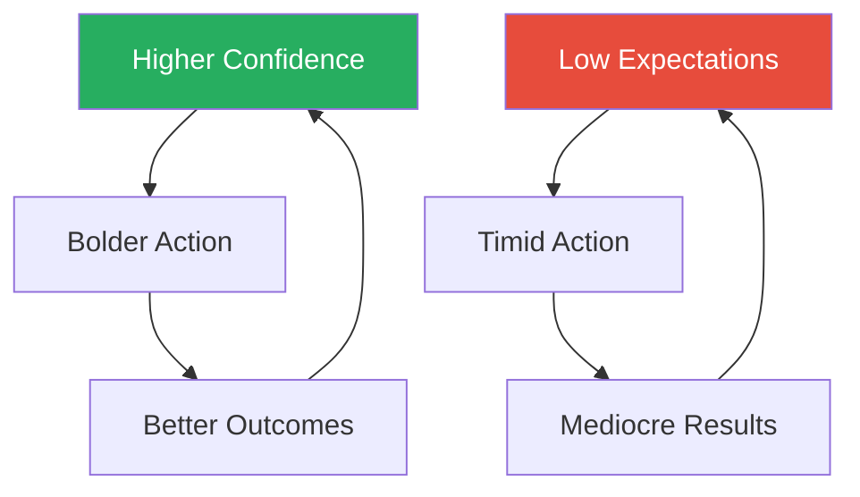
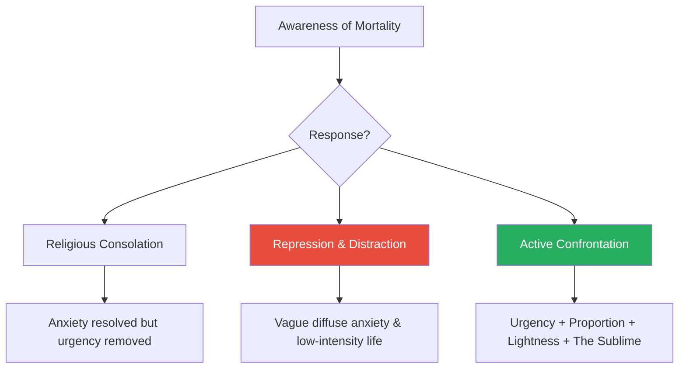

# The 50th Law — 50 Cent & Robert Greene

> Robert Greene teams up with Curtis "50 Cent" Jackson to argue that fear is the single greatest obstacle to power. Using 50 Cent's trajectory from orphaned street hustler to business mogul as the narrative spine — layered with Napoleon, Lincoln, Frederick Douglass, Malcolm X, Seneca, and dozens more — they map ten specific fears to ten specific powers. The thesis is deceptively simple: each fear you confront converts into its opposite. Fear of reality becomes intense realism. Fear of adversity becomes opportunism. Fear of death becomes urgency. This is not a self-help book about positive thinking. It is a philosophical argument that fearlessness is the root operating system beneath every other form of power, and that the street hustler who has nothing left to lose understands this more clearly than any boardroom executive or tenured professor. Greene's usual historical grandeur is grounded by 50 Cent's biography — a man who was orphaned at eight, hustling by eleven, and shot nine times at twenty-four, then built an empire worth hundreds of millions. The result is Greene's most personal and visceral book.

---

## About the Authors

**Robert Greene** is the author of *The 48 Laws of Power*, *The 33 Strategies of War*, *The Art of Seduction*, *The Laws of Human Nature*, and *Mastery*. He studied classical literature at Berkeley and held over fifty jobs — including stints as a translator, Hollywood screenwriter, and hotel manager — before writing his first book at age 36. His work draws on 3,000 years of history to identify recurring patterns in how power, strategy, and human nature operate. For *The 50th Law*, Greene embedded himself in 50 Cent's world for over a year, shadowing him through business meetings, recording sessions, and deal negotiations to understand how the rapper's street-forged philosophy operated in real time.

**Curtis "50 Cent" Jackson** grew up in Southside Queens, New York, raised by a grandmother after his mother — a drug dealer — was murdered when he was eight. He was hustling crack by eleven, surviving by his wits in one of America's most dangerous neighbourhoods. In his early twenties he pivoted to rap music, landing a deal with Columbia Records that was terminated after he was shot nine times outside his grandmother's house in 2000. The shooting transformed him: he channelled the fearlessness of having survived death into a relentless work ethic, launching a mix-tape campaign that flooded New York's underground market, caught Eminem's attention, and led to a deal with Interscope Records. His debut album *Get Rich or Die Tryin'* sold over 12 million copies worldwide. He then built a business empire spanning Vitamin Water (a stake that netted him over $100 million when Coca-Cola acquired the parent company), G-Unit clothing, film production, video games, and publishing.

The collaboration is deliberate: Greene provides the historical depth and philosophical architecture; 50 Cent provides the lived proof. Where most of Greene's historical exemplars are long dead, 50 Cent is a walking case study — someone whose biography can be verified, challenged, and questioned in the present tense.

---

## The Big Idea

*Greene and 50 Cent make the case that fear is not merely an emotion — it is the invisible operating system governing most human behaviour, and dismantling it unlocks every other form of power.*

- Fear is not just a feeling — it is an <b style="color: #2980b9">operating system</b> that governs how most people make decisions, avoid risks, and settle for less than they want
- For our distant ancestors, fear served a clear biological purpose:
  - It triggered fight-or-flight when a predator appeared or a rival tribe attacked
  - The signal was acute, specific, and temporary
  - Once the danger passed, the fear subsided

---

- In the modern world, we are rarely in physical danger — instead, fear has **generalised**:
  - We fear offending people, standing out, losing what we have
  - We fear confrontation, boredom, being judged, failure
  - We ultimately fear death — not as an immediate threat but as background radiation colouring everything
- This generalised anxiety creates a <b style="color: #e74c3c">self-fulfilling prison</b>:
  - The more you avoid what you fear, the smaller your world becomes
  - Each avoidance reinforces the neural pathway that says "this is dangerous"
  - The next avoidance becomes even more automatic

> [!tip] Core Insight
> The 50th Law is the antidote: **fear nothing**. Not through denial or recklessness, but through active confrontation. When you stop organising your life around the avoidance of discomfort, you unlock boldness, creativity, and an urgency that timid people cannot match.

- Enter the arenas you shy away from
- Make the decisions you have been postponing
- Think for yourself instead of deferring to others

---

The book's structural insight is the <b style="color: #2980b9">Fear-to-Power Reversal Model</b>: every specific fear, when confronted directly, converts into a specific power:

- Fear of reality becomes **intense realism**
- Fear of independence becomes **self-reliance**
- Fear of adversity becomes **opportunism**
- Fear of change becomes **calculated momentum**
- Fear of confrontation becomes **strategic aggression**
- Fear of responsibility becomes **authority**
- Fear of criticism becomes **deep connection**
- Fear of boredom becomes **mastery**
- Fear of failure becomes **self-belief**
- Fear of death becomes **the Sublime**

The fear-to-power reversal is cyclical: each fear confronted builds the courage to confront the next, creating an upward spiral of increasing boldness and capability.

---

- The deeper philosophical claim — drawn from Seneca, the Stoics, and the street — is that <b style="color: #27ae60">the fear of death is the root of all lesser fears</b>:
  - Fear of failure is fear of a kind of death (of reputation, of identity)
  - Fear of confrontation is fear of social death
  - Fear of change is fear of the death of the familiar
- Confront mortality honestly and every other fear loses its grip
- 50 Cent's near-death experience is the book's proof of concept:
  - After surviving nine bullets, he stopped caring about what he might lose
  - That liberation became the engine of everything he built

---

## Key Concepts at a Glance

### The Fear-to-Power Map

| Ch | Fear | Power | Core Idea |
|----|------|-------|-----------|
| Intro | All fear | Fearless attitude | The 50th Law: fear nothing |
| 1 | Reality | Intense realism | See the world as it is, not as you wish it were |
| 2 | Independence | Self-reliance | Own your time, energy, and creative freedom |
| 3 | Adversity | Opportunism | Convert setbacks into raw material |
| 4 | Change | Calculated momentum | Stay fluid; rigidity is death |
| 5 | Confrontation | Strategic aggression | Know when to fight and how to fight dirty |
| 6 | Responsibility | Authority | Lead by example from the front line |
| 7 | Criticism | Deep connection | Stay close to your environment; absorb feedback |
| 8 | Boredom | Mastery | Endure the apprenticeship; respect the process |
| 9 | Failure | Self-belief | Push past the identity others assign you |
| 10 | Death | The Sublime | Mortality awareness as the ultimate liberation |

### Other Key Concepts

| Concept | One-line summary |
|---------|-----------------|
| **The Hustler's Eye** | Six-part framework for maintaining strategic clarity through curiosity, terrain knowledge, root-cause thinking, long-term vision, behavioural observation, and self-assessment (Ch. 1) |
| **The Empire Model** | Four-step progression toward ownership: reclaim dead time, create little empires, move up the food chain, make it fully yours (Ch. 2) |
| **The Mortality-as-Fuel Framework** | Three responses to death awareness — religious consolation, repression, or active confrontation — with only the third producing genuine power (Ch. 10) |
| **The Walk-Away Principle** | Willingness to leave any situation (deal, relationship, position) as the ultimate source of leverage (recurring theme) |
| **Reversal of Perspective** | Seeing obstacles not as things that happen TO you but as things that happen FOR you, converting each setback into an asset (Ch. 3) |

---

## The Foundation: Fearlessness as Operating System

### The 50th Law (Introduction)

*Greene opens with the question that structures the entire book: what did Napoleon, Frederick Douglass, FDR, and a kid from Southside Queens all share — and why did that single quality matter more than intelligence, connections, or luck?*

- The book opens with a question: what quality did Napoleon, Frederick Douglass, FDR, and a kid from Southside Queens all share?
  - Not intelligence — plenty of brilliant people live small, cautious lives
  - Not connections — Douglass was born into slavery and Napoleon was a Corsican outsider in the French aristocracy
  - Not luck — 50 Cent was orphaned and shot and left for dead
- The answer: <b style="color: #27ae60">fearlessness</b>
  - Each operated in a world that should have crushed them
  - Each responded by refusing to let fear dictate their choices

---

- Greene's argument is structural, not motivational:
  - Fear is not a feeling to be overcome through willpower or a pep talk
  - It is a **pattern of behaviour** — avoidance, hedging, over-caution, deference to authority, reflexive people-pleasing — that can be systematically identified and reversed
- The <b style="color: #2980b9">50th Law</b> is the meta-principle:
  - When you organise your life around what you **want** rather than what you are **afraid of**, the entire calculus of action changes
  - You stop avoiding confrontation and start seeking it
  - You stop clinging to safety and start creating opportunity
  - You stop deferring to others and start thinking for yourself

> [!example] 50 Cent — Forged by the Streets (1975–2000)
> - Orphaned at eight when his mother — a drug dealer named Sabrina — was murdered
> - Raised by his grandmother in a dangerous neighbourhood with no safety net, no institutional support, no reason to believe the world would treat him fairly
> - By eleven he was selling crack on the streets, learning the hustler's code: trust no one, keep your eyes open, never show weakness
> - That absence of security became, paradoxically, his greatest asset
> - With nothing to protect, he had nothing to fear losing
> - The streets gave him what a sheltered upbringing never could: a total comfort with risk
> **The lesson:** When you have nothing to lose, fear loses its grip — and that liberation becomes an engine.

---

> [!example] FDR — Fearlessness Through Polio (1921–1945)
> - Born into privilege but forged his fearlessness through polio
> - The disease destroyed his legs but created something harder to break — a willingness to lead from a wheelchair in an era that considered disability disqualifying
> - He took on the Great Depression and the Second World War with a boldness that bewildered his cautious advisors
> - His famous line — "the only thing we have to fear is fear itself" — is not a platitude in Greene's reading
> - It is a precise strategic observation: fear causes more damage than the things we fear
> **The lesson:** Confronting personal catastrophe can produce a fearlessness that privilege alone never generates.

> "Your fears are a kind of prison that confines you."

- The introduction establishes the book's crucial nuance: <b style="color: #e74c3c">fearlessness without judgement is recklessness</b>
  - The entire book pairs fearlessness with a specific cognitive discipline — realism, mastery, environmental awareness, strategic thinking
  - The point is not to be blind to danger but to refuse to let danger paralyse you
- The hustler who charges into a gunfight without reading the situation is not fearless — he is dead
- The hustler who reads the situation clearly, understands the odds, and still acts boldly — that is the 50th Law in action

---

## Seeing and Thinking Clearly

### Chapter 1: See Things for What They Are — Intense Realism

*Greene argues that the fear of reality — the tendency to see what you want to see — is the most fundamental weakness, because every other power in the book depends on accurate perception.*

- <b style="color: #e74c3c">The fear of reality</b> is the tendency to see what you want to see rather than what is actually there:
  - People construct comforting narratives, ignore disconfirming evidence, and surround themselves with those who validate their illusions
  - Greene calls this "going soft" — the mind retreating from uncomfortable truths into fantasy
  - It happens to individuals, organisations, and entire civilisations
  - The mind naturally drifts toward comfort, and comfort means filtering out the painful, the ugly, and the threatening

---

- When you confront the fear of reality — when you train yourself to look at the world without flinching — you gain <b style="color: #27ae60">intense realism</b>:
  - A relentless commitment to seeing people's true motives, environmental trends, and your own limitations with unflinching clarity
  - This is the most fundamental power in the book, because every other chapter depends on it
  - You cannot convert adversity into opportunity if you cannot accurately see what you are facing
  - You cannot lead from the front if you are operating on false assumptions
  - Realism is the bedrock

> [!tip] Core Insight
> Most people's perception is distorted by three forces: their emotions (which colour everything), their ego (which protects them from self-knowledge), and their social environment (which rewards conformity over truth-telling). The result is a "bubble of perception" — a small, comfortable world where everything confirms what you already believe.

- Breaking out of this bubble requires deliberate, uncomfortable work:
  - Seeking out disconfirming evidence
  - Listening to critics rather than sycophants
  - Periodically reassessing your own assumptions about yourself

---

> [!abstract] The Hustler's Eye — Six Practices for Strategic Clarity
> 1. **Curiosity** (openness) — approach every situation with Socratic not-knowing, as if you have never seen it before
> 2. **Terrain knowledge** (expansion) — map the complete environment, not just the corner you occupy
> 3. **Root-cause thinking** (depth) — dig beneath symptoms to structural causes, asking "why" repeatedly
> 4. **Long-term vision** (proportion) — let the big picture override short-term anxiety
> 5. **Behavioural observation** (sharpness) — read people's deeds, not their words; actions reveal motives, words conceal them
> 6. **Self-assessment** (detachment) — periodically step outside your own ego and evaluate yourself as a stranger would

The <b style="color: #2980b9">Hustler's Eye</b> is Greene's framework for the discipline that makes realism operational — not just seeing clearly once, but maintaining clarity as a continuous practice.

---

> [!example] 50 Cent Reads the Music Industry's Decline (Early 2000s)
> - While other rappers clung to the old model — record deals, label support, album sales as the primary revenue stream — 50 Cent saw that the internet was destroying the traditional business
> - File-sharing was decimating album revenues; labels were haemorrhaging money
> - The artists who depended entirely on their record deals were watching their income evaporate
> - Rather than complaining or clinging to the old model, 50 Cent pivoted
> - He invested his money and attention in business ventures outside of music — Vitamin Water, G-Unit clothing, film production, video games — years before his peers understood what was happening
> - When the album-sales model finally collapsed, he had already built a diversified empire
> **The lesson:** Realism is not cynicism — it is accurate perception that enables decisive action while others are still in denial.

> [!example] Lincoln's Superhuman Realism (1861–1865)
> - Lincoln's capacity to assess situations without ideological distortion was nearly superhuman
> - He was willing to work with former enemies — appointing his political rivals to his Cabinet, as Doris Kearns Goodwin documented in *Team of Rivals*
> - He changed his position on slavery as circumstances evolved — not out of weakness, but because his commitment to reality outweighed his commitment to consistency
> - He tolerated incompetent generals longer than his advisors wanted because he saw the full picture: there were no better replacements available, and premature action would make things worse
> - His almost painful commitment to seeing reality as it was — including the reality of his own limitations — was the foundation of the judgement that held the Union together
> **The lesson:** Realism means subordinating consistency, ego, and ideology to the facts on the ground.

---

> [!example] Socrates and Radical Honesty (5th Century BC)
> - Socrates made himself the most hated man in Athens by asking questions that exposed comfortable illusions
> - He did not claim to have answers; he claimed only to know what he did not know
> - This radical honesty about the limits of his own understanding was itself a form of realism
> - The recognition that the first step to seeing clearly is admitting how much you currently do not see
> **The lesson:** The deepest realism begins with acknowledging the boundaries of your own knowledge.

> "The greatest danger you face is your mind going soft."

- **The nuance:** Realism without ambition becomes passive observation
  - The <b style="color: #2980b9">Hustler's Eye</b> is a tool for seeing; it must be paired with the willingness to act on what you see
  - The person who sees reality clearly but does nothing about it is no better off than the person who never looked
  - Lincoln did not merely observe the deteriorating situation — he acted on what he saw, often against the advice of everyone around him
  - <b style="color: #27ae60">The complete principle is not just "see clearly" but "see clearly and then move"</b>

---

### Chapter 8: Respect the Process — Mastery

*Greene dismantles the myth of overnight success and shows why the slow, boring grind of apprenticeship is the only path to competence that cannot be faked, stolen, or undermined.*

- <b style="color: #e74c3c">The fear of boredom</b> is the impatience that makes people seek shortcuts, skip foundational work, and chase quick wins over deep competence:
  - In a culture that celebrates overnight success and viral fame, the slow grind of genuine skill-building feels like wasted time
  - Greene argues that this impatience is one of the most destructive forms of fear
  - It leads people to build on sand — constructing impressive-looking careers and businesses that collapse the moment conditions change

---

- When you confront the fear of boredom and submit to the apprenticeship process, you gain <b style="color: #27ae60">mastery</b>:
  - Deep competence that cannot be faked, stolen, or undermined
  - The master can improvise because they have internalised the fundamentals so thoroughly that they can recombine them in novel ways
  - The amateur who skipped the foundations can only follow scripts — and when the script does not apply, they are lost

- The mechanism — why apprenticeship cannot be bypassed:
  - The brain requires thousands of hours of practice to develop the neural pathways that constitute genuine skill
  - There are no shortcuts to this process
  - You can accelerate it through intensity and focus, but you cannot eliminate it
  - The apprenticeship phase — hours of practice, drudgery of foundational exercises, tedium of learning someone else's system before building your own — is where real capability is forged
  - What makes it painful is precisely what makes it valuable: the boredom and frustration signal that the brain is doing the hard work of rewiring itself

> [!tip] Core Insight
> Greene distinguishes between **surface knowledge** (the kind from reading summaries, attending seminars, watching tutorials — fragile, breaks when conditions change) and **deep knowledge** (the kind that comes from years of doing the work — adaptive, handles novel situations because you understand the underlying principles). The master owns deep knowledge. The dilettante owns surface knowledge and does not know the difference.

---

| Knowledge Type | How Acquired | Strength | Weakness |
|---------------|-------------|----------|----------|
| **Surface knowledge** | Summaries, seminars, tutorials | Quick to acquire; lets you talk about a subject | Fragile — breaks the moment conditions change |
| **Deep knowledge** | Years of hands-on practice | Adaptive — handles novel situations via underlying principles | Slow; requires tolerating boredom and frustration |

Deep knowledge is what separates the master who improvises under pressure from the amateur who freezes when the script runs out.

---

> [!example] 50 Cent at Interscope — Treating a Label Deal as School (2002–2005)
> - Most new artists treat a major label deal as the finish line — they have arrived, and now the machine will make them famous
> - 50 Cent treated it as a school
> - He studied every aspect of the music business with obsessive thoroughness: production techniques, marketing strategy, distribution logistics, contract law, branding psychology
> - He sat in on meetings he was not required to attend
> - He asked questions that executives found surprising from an artist
> - He learned how the money actually flowed, where the profit margins were, and how artists systematically got exploited by not understanding the business side
> - When he eventually built his own empire, he could make informed decisions in every domain because he had done the unglamorous work of learning each one from the inside
> **The lesson:** Treat every position — even a successful one — as an apprenticeship for the next level.

> [!example] 50 Cent's Mix-Tape Grind (Late 1990s)
> - While more talented rappers waited for their "big break," 50 Cent was releasing mix-tape after mix-tape
> - He honed his craft, learned what audiences responded to, tested different styles and delivery methods
> - The volume was staggering: dozens of tracks, distributed by hand, sold on street corners
> - Each one was a repetition in the apprenticeship
> - By the time *Get Rich or Die Tryin'* launched, he had already put in the hours that his "overnight success" story obscured
> **The lesson:** Volume is the hidden ingredient behind every "overnight success."

---

> [!example] Mozart — The Prodigy Myth Dismantled
> - Popular culture treats Mozart as a child prodigy — pure natural genius
> - Greene argues this misses the crucial context: Mozart's father was one of Europe's leading music educators
> - He subjected young Wolfgang to an apprenticeship regime that would be considered extreme by any era's standards
> - By the time Mozart was composing his early masterpieces, he had already accumulated more hours of focused practice than most professional musicians achieve in a lifetime
> - His "genius" was built on a foundation of relentless process
> **The lesson:** What the world calls genius is usually the invisible residue of an extreme apprenticeship.

> "It is not about what you achieve but who you become."

- **The nuance:** <b style="color: #e74c3c">Apprenticeship must be time-bounded and strategic</b>
  - There is a difference between respecting the process and hiding inside it
  - Some people use the language of apprenticeship — "I'm still learning," "I'm not ready yet," "I need more preparation" — as a shield against the risk of independence
  - At some point, you must graduate from learning to owning
  - The question is always: am I still building genuine capability, or am I using "apprenticeship" as an excuse to avoid the risk of stepping out on my own?
  - Greene acknowledges that the timing of this transition is one of the hardest judgements a person must make

---

## Action and Adversity

### Chapter 3: Turn Shit into Sugar — Opportunism

*Greene introduces his most counterintuitive argument: that adversity is not an interruption to the plan but the raw material for a better one, and that the most powerful people in history were built by the very obstacles that should have destroyed them.*

- <b style="color: #e74c3c">The fear of adversity</b> is the belief that setbacks are purely destructive:
  - Most people treat negative events as interruptions to their plans — obstacles that must be endured before normal life can resume
  - Greene argues this is exactly backwards
  - Adversity is not an interruption to the plan; it is the raw material for a better one

- When you confront the fear of adversity and learn to see obstacles as ingredients, you gain <b style="color: #27ae60">opportunism</b>:
  - The ability to convert negatives into raw material for advancement
  - The opportunist does not merely survive setbacks — they emerge from them in a stronger position than they held before

---

- The mechanism is structural, not psychological — the <b style="color: #2980b9">Reversal of Perspective</b>:
  - Constraints force creativity because they eliminate easy paths and demand novel solutions
  - When all your comfortable options disappear, the only remaining options are the creative ones — the ones you would never have considered if the comfortable paths were still available
  - This is why some of history's greatest innovations emerged from crisis conditions
  - It is not that crisis makes people more creative in the abstract; it is that crisis physically removes the uncreative options, leaving only the inventive ones standing
- There is a second mechanism at work — the **narrative advantage**:
  - Losing a battle lets you reframe yourself as the underdog, and the underdog enjoys disproportionate public sympathy and attention
  - Being denied resources forces you to build something leaner and more original than the well-funded alternative
  - Being attacked creates a martyr narrative that attracts allies
  - The adversity itself becomes a strategic asset — not despite being painful but because it is painful

> [!tip] Core Insight
> Before you mourn a setback, examine whether it contains material you can use. The obstacle is not blocking the path — it may BE the path.

---

> [!example]- 50 Cent — The Shooting That Built an Empire (2000)
> - In 2000, Curtis Jackson was ambushed outside his grandmother's house in Queens
> - The assailant fired nine rounds into him at close range — hitting his hand, arm, hip, legs, chest, and face
> - A bullet lodged in his cheek
> - He was rushed to hospital and spent thirteen days recovering
> - Columbia Records, his label at the time, dropped him immediately
> - No major label would touch him — the industry considered him a liability, a target who would bring violence and lawsuits
> - His career was, by any rational assessment, finished
> - Instead of retreating, 50 Cent converted the assassination attempt into the most valuable asset in hip-hop:
>   - The name "50 Cent" became synonymous with indestructible toughness
>   - He walked with a limp and talked with a slur and wore both as badges of authenticity
>   - The Columbia rejection forced him into the mix-tape underground, where he had complete creative control and direct access to the streets
>   - He flooded New York with mix-tapes — dozens of them, sold on street corners and passed hand-to-hand
>   - The grassroots following he built was so large that when Eminem eventually signed him to Interscope, the audience was already waiting
> **The lesson:** Being dropped was the best thing that happened to his career — it forced him into a channel that the major-label system could never have provided.

> [!example] 50 Cent — Turning Attacks into Brand Fuel
> - When the music industry attacked him — other rappers dissing him, labels trying to freeze him out, media painting him as violent and dangerous — he converted every attack into publicity
> - The feuds with Ja Rule and other rappers were not merely ego conflicts; they were marketing opportunities
> - Every diss track generated headlines; every public beef drove album sales
> - 50 Cent understood that in the attention economy, even negative attention has value
> - He became a master at converting attacks into brand fuel
> **The lesson:** In an attention economy, your enemies' attacks can be repurposed as your marketing budget.

---

> [!example] Malcolm X — Prison as University (1946–1952)
> - Imprisoned as a young man for burglary, Malcolm Little could have emerged as just another ex-con — angry, uneducated, and unemployable
> - Instead, he converted the experience into an education
> - He read voraciously — dictionaries, encyclopedias, history, philosophy — teaching himself the intellectual foundations he had been denied by poverty and racism
> - He joined the Nation of Islam and began developing the oratorical skills that would make him one of the most formidable public intellectuals of the twentieth century
> - The prison that was supposed to destroy him became his university
> **The lesson:** Malcolm X's response to prison was the decisive variable — not the prison itself.

- Greene also references the broader pattern in African-American history:
  - Slavery, Jim Crow, and systemic oppression created the conditions for some of America's most powerful cultural innovations — jazz, blues, gospel, hip-hop
  - These art forms did not emerge despite adversity but because of it
  - The constraint of having almost no institutional resources forced creative solutions that well-funded artists would never have attempted

---

- **The nuance:** <b style="color: #e74c3c">Not all adversity is equally convertible</b>
  - Some situations are genuinely destructive and require retreat, recovery, or simply survival
  - The principle is not that everything bad is secretly good — that is toxic positivity
  - The principle is that before you mourn a setback, examine whether it contains material you can use
  - Often it does — but sometimes the appropriate response to a catastrophe is to grieve, heal, and rebuild rather than to immediately hunt for a silver lining

---

### Chapter 4: Keep Moving — Calculated Momentum

*Greene draws on military strategy and 50 Cent's serial reinventions to show why rigidity — clinging to what worked yesterday — is the most dangerous posture in a world of constant change.*

- <b style="color: #e74c3c">The fear of change</b> is the impulse to cling to what has worked before:
  - The successful formula, the familiar territory, the identity that brought past victories
  - In a world of constant change, rigidity is the most dangerous posture of all
  - The person who successfully defended a fixed position yesterday is the person most likely to be outflanked tomorrow
  - They are now psychologically invested in a strategy that the world has already moved past

- When you confront the fear of change and embrace fluidity, you gain <b style="color: #27ae60">calculated momentum</b>:
  - The ability to let go, adapt, and channel chaos toward your objectives
  - Fixed positions create predictability, and predictability is a form of vulnerability
  - When your opponents know what you will do next, they can prepare
  - When you are fluid — willing to abandon yesterday's strategy, pivot to new opportunities, and reinvent yourself — you become impossible to pin down

---

- Greene draws on military strategy to explain why momentum trumps position:
  - In warfare, the army that stays in one place — defending a fortress, holding a line — eventually gets flanked, starved, or simply bypassed
  - The army that moves — striking unpredictably, retreating when necessary, attacking from unexpected directions — maintains the initiative
  - The same logic applies to careers, businesses, and creative endeavours
  - The person who clings to a single identity, a single skill set, or a single market is eventually overtaken by someone who moves faster
- There is a deeper psychological mechanism at work — <b style="color: #2980b9">attachment</b>:
  - Success creates attachment to the thing that produced the success
  - You identify with it — "I am a rapper," "I am a hustler," "I am an expert in X"
  - That identification becomes a cage because it limits your willingness to try anything outside the identity
  - Greene argues that the fearless person holds identities lightly, treating them as costumes to be worn and discarded rather than as permanent selves

> [!tip] Core Insight
> The fearless person holds identities lightly — treating them as costumes to be worn and discarded rather than permanent selves. The moment you say "I am X" and mean it as a permanent statement, you have built a cage.

---

> [!example] 50 Cent — The Serial Reinventor
> - 50 Cent's entire career is a study in calculated momentum
> - Hustler became rapper, and he did not look back
> - Rapper became businessman, and he did not mourn the transition
> - Businessman became investor, and he did not cling to the previous model
> - Each transformation required letting go of the previous success and its associated comfort
> - The most striking example: at the height of his fame, with albums still selling and the label willing to throw money at him, 50 Cent walked away from Interscope Records
>   - He saw that the album-sales model was dying and that staying at the label would tie him to a sinking ship
>   - Rather than milking the relationship for a few more years of diminishing returns, he moved on — into business ventures, film, television, and independent music distribution
> - His willingness to cannibalise his own past — to risk the known for the unknown — kept him ahead of competitors who were still defending territories he had already abandoned
> **The lesson:** The willingness to abandon a winning position before it becomes a losing one is the essence of calculated momentum.

> [!example]- Napoleon — Master and Victim of Momentum
> - Napoleon's greatest victories — Austerlitz, Jena, Marengo — were won not through superior firepower but through speed, surprise, and the ability to concentrate force at unexpected points
> - His opponents, the coalitions of European monarchies, were ponderous and predictable
> - They held fixed positions, followed established doctrines, and expected Napoleon to do the same — he never did
> - He moved faster than they thought possible, appeared where they did not expect him, and struck before they had finished preparing
> - His speed was not reckless — every move was calculated — but his willingness to abandon a position the moment it no longer served him was what made him terrifying
> - **The cautionary reversal:**
>   - After years of victory, Napoleon himself fell prey to the very rigidity he had exploited in his enemies
>   - He began to believe in his own invincibility, refused to adapt to changing conditions (particularly the brutal reality of Russian winter)
>   - He clung to his empire long past the point where strategic retreat would have preserved what mattered
>   - His fall was caused by the same attachment to fixed positions that he had punished in others
> **The lesson:** Even the master of momentum can become its victim when attachment to past glory replaces strategic flexibility.

> "In a world of constant change, what is dangerous is standing still."

---

- **The nuance:** <b style="color: #e74c3c">Momentum without direction is chaos</b>
  - The "calculated" part matters as much as the "momentum" part
  - Every move must serve a long-term vision, even if that vision itself evolves over time
  - The person who changes direction constantly without strategic intent is not fluid — they are lost
  - There is also a timing dimension that Greene somewhat underplays: sometimes the wisest move is to stay put and let the world come to you
  - Patience can be its own form of calculated momentum — the coiled spring is motionless but full of potential energy

---

### Chapter 5: Know When to Be Bad — Strategic Aggression

*Greene tackles the most uncomfortable power in the book: the necessity of being willing to fight, deceive, and retaliate when the situation demands it — and the price of being too "nice" to protect your own interests.*

- <b style="color: #e74c3c">The fear of confrontation</b> is the desire to be liked, to avoid conflict, to maintain harmony at all costs:
  - Greene argues that this fear is one of the most common sources of powerlessness
  - People who cannot bring themselves to fight — to say no, to make demands, to punish betrayal, to compete ferociously — are perpetually exploited by those who have no such compunction
  - The person who is always "nice" becomes the person others take for granted
  - <b style="color: #e74c3c">Niceness without the capacity for aggression is weakness disguised as virtue</b>

- When you confront the fear of confrontation, you gain <b style="color: #27ae60">strategic aggression</b>:
  - The ability to deploy force, deception, or hardball tactics when the situation demands it
  - The emphasis is on "strategic" — not aggression for its own sake, but the willingness to be ruthless when the stakes require it

---

- Greene draws on evolutionary psychology:
  - Every human being has an aggressive side — a capacity for competition, domination, and even cruelty that civilisation has taught us to suppress
  - The suppression itself is not the problem — no functional society can tolerate unrestrained aggression
  - The problem is when the suppression becomes so complete that a person loses access to their own capacity for force:
    - Unable to negotiate hard
    - Unable to fire underperformers
    - Unable to confront people who are taking advantage of them
    - Unable to compete when competition is necessary
- Greene's key insight on <b style="color: #2980b9">flexible morality</b>:
  - Everyone — including the most ostensibly ethical people — operates with flexible morality around their self-interest
  - The CEO who gives inspiring speeches about fairness will fight like a cornered animal when her position is threatened
  - The colleague who is always warm and collaborative will take credit for your work if the incentive is strong enough
  - The question is not whether people play power games — they do, universally — but whether you do so consciously or allow others to do it to you unconsciously

> [!tip] Core Insight
> The ideal position is to be known as someone who CAN fight viciously — so that you rarely have to. The person who is feared for their willingness to fight is, paradoxically, the person least often challenged.

---

> [!example] 50 Cent — The Ja Rule War
> - The feud with Ja Rule is the most famous example of 50 Cent's strategic aggression
> - What started as a relatively minor personal conflict escalated into a full-scale war of diss tracks, public humiliation, and commercial competition
> - 50 Cent turned the rivalry into a marketing campaign — his attacks on Ja Rule generated enormous publicity
> - He framed every conflict as a test of authenticity (the real street rapper versus the manufactured one)
> - Ja Rule's career never recovered
> - Greene's argument is not that 50 Cent was "right" in any moral sense — it is that his willingness to be aggressive, combined with his ability to channel that aggression strategically, was a form of power that his more cautious peers could not match
> **The lesson:** Strategic aggression is not about being angry — it is about being willing to fight and knowing how to make each fight serve your larger objectives.

> [!example] 50 Cent — Business Wars and Deterrence
> - When business partners tried to renegotiate deals after the terms were set, 50 Cent responded with overwhelming force — not rage, but surgical counter-strikes
> - He would publicly expose the betrayal, use his media platform to damage the other party's reputation
> - He ensured that future potential partners heard the message: honouring deals with 50 Cent is wise; breaking them is catastrophic
> **The lesson:** Visible retaliation against betrayal creates a deterrence structure that protects future deals.

---

> [!example] Cesare Borgia — The Price of Going Soft (1502–1507)
> - Borgia, the Renaissance prince whose ruthlessness Machiavelli admired, understood that being feared was more reliable than being loved
> - Not because fear is inherently superior, but because in a world where everyone is pursuing their own interests, the person who demonstrates the capacity to punish betrayal creates a more stable structure of loyalty than the person who relies on affection alone
> - Borgia's mistake was not his ruthlessness but his failure to maintain it after his father (Pope Alexander VI) died
> - He went soft at the worst possible moment, and his enemies destroyed him
> **The lesson:** Ruthlessness maintained is power; ruthlessness abandoned at the critical moment is death.

- **The nuance:** Aggression has a cost
  - Every confrontation burns social capital
  - The art is knowing when the stakes justify the expenditure and when the smarter move is to absorb a small loss in silence
  - <b style="color: #e74c3c">Gratuitous aggression creates enemies and destroys the very alliances you need for long-term success</b>
  - Strategic aggression creates respect and deterrence

---

## Leadership and Connection

### Chapter 6: Lead from the Front — Authority

*Greene distinguishes between the borrowed power of a title and the earned power of visible, front-line leadership — and argues that only the latter produces the kind of loyalty that survives real pressure.*

- <b style="color: #e74c3c">The fear of responsibility</b> is the temptation to delegate, to hide behind process, to let others take the risks while you manage from a safe distance:
  - Greene argues that this fear is endemic in modern institutions
  - Layers of bureaucracy exist partly to diffuse responsibility so that no single person can be blamed when things go wrong
  - Real authority — the kind that inspires genuine loyalty — comes only from visible, front-line leadership

- When you confront the fear of responsibility and step to the front, you gain <b style="color: #27ae60">authority</b>:
  - Not the positional kind granted by a title, but the earned kind that comes from demonstrating skin in the game
  - People follow those who share their dangers

---

| Authority Type | Source | Durability | Mechanism |
|---------------|--------|------------|-----------|
| **Positional authority** | Title, rank, formal role | Fragile — evaporates when the position is lost | Borrowed from the institution |
| **Earned authority** | Demonstrated competence, courage, commitment | Durable — travels with you | Built through visible front-line action |

<b style="color: #2980b9">Earned authority</b> is what Greene argues you must build: leaders who work harder than their teams, hold themselves to higher standards, and take personal risks alongside their people create a bond that no motivational speech can replicate.

- The psychology is primitive and deep:
  - Humans are wired to follow those who demonstrate that they will put themselves on the line
  - The leader who says "I would never ask you to do something I wouldn't do myself" and means it — who has been seen doing it — commands a loyalty that the distant manager can never access

> [!tip] Core Insight
> The principle is not "do all the work yourself" — it is "never ask others to do what you would not do, and make sure they see you doing it." There is a crucial difference between leading from the front and being unable to delegate.

---

> [!example] 50 Cent — Front-Line Distribution (2002–2003)
> - 50 Cent did not hire others to build his brand while he collected royalties
> - During the mix-tape era, he personally led the distribution effort
> - He was on the streets, in the clubs, at the bootleg stands, handing out CDs and talking to fans
> - He personally oversaw product development for his business ventures — visiting the Vitamin Water production facilities, testing flavours, approving designs
> - He personally engaged with his audience on early social media platforms
> - When he later built G-Unit and assembled a team, his team members had seen him in the trenches
> - They followed him because they knew he would never ask them to do something he had not already done himself
> **The lesson:** Authority is not claimed through titles — it is earned through visible effort, and the team that has seen you in the trenches will follow you anywhere.

> [!example]- Napoleon — The Bridge at Arcole (1796)
> - At the Battle of Arcole, Napoleon personally grabbed a flag and led a charge across a bridge under heavy fire
> - He was knocked from the bridge into the mud below, bullets flying around him
> - His soldiers, who moments before had been retreating, surged forward
> - They did not do this because they were ordered to; they did it because they saw their commander literally risking his life alongside them
> - Napoleon also slept in the same conditions as his troops, ate the same food, and made decisions at the front line rather than from a distant headquarters
> - When he crossed the Alps on the way to Marengo, he rode a mule alongside his soldiers rather than taking a comfortable carriage through a safer route
> - These were not symbolic gestures — they were the foundation of the fanatical loyalty that allowed Napoleon to attempt campaigns that any rational assessment would have deemed impossible
> - Greene contrasts Napoleon with the later European monarchs who opposed him:
>   - Men who led from palaces, surrounded by courtiers, making decisions based on reports from the field
>   - Their soldiers fought because they were paid or compelled to; Napoleon's soldiers fought because they loved him
>   - The difference in motivation produced a difference in performance that no amount of strategic planning could overcome
> **The lesson:** Soldiers — and teams of any kind — fight differently for a leader they have seen risk everything alongside them.

---

- **The nuance:** <b style="color: #e74c3c">Front-line leadership must be balanced with strategic delegation</b>
  - The leader who does everything personally becomes a bottleneck
  - Napoleon himself fell prey to this: as his empire grew, he tried to maintain personal control over too many fronts simultaneously, and the quality of his decisions deteriorated because he was exhausted and overwhelmed

---

### Chapter 7: Know Your Environment from the Inside Out — Deep Connection

*Greene argues that the most dangerous form of ignorance is not stupidity but insulation — when layers of reporting, comfort, and status separate you from the raw signals of your environment.*

- <b style="color: #e74c3c">The fear of criticism</b> is the impulse to insulate yourself from negative feedback:
  - To surround yourself with agreeable people and operate from assumptions rather than direct observation
  - This isolation is fatal — not immediately, but gradually
  - The gap between your mental model of the world and the actual world widens until a crisis exposes the disconnect

- When you confront the fear of criticism and open yourself to your environment, you gain <b style="color: #27ae60">deep connection</b>:
  - An intimate, ground-level understanding of your audience, your market, or your community
  - This enables faster adaptation than any competitor who is operating from reports and assumptions

---

- The mechanism is <b style="color: #2980b9">information quality</b>:
  - Formal reporting structures filter reality
  - By the time information reaches you through official channels, it has been sanitised, summarised, and distorted by every intermediary's incentives:
    - The salesperson softens the customer complaint because she does not want to look bad
    - The middle manager frames the project delay as a minor setback because he does not want to alarm leadership
    - The consultant tells you what you want to hear because his contract renewal depends on your satisfaction
  - The result is a world-picture that is comforting but inaccurate
- Direct environmental connection provides intelligence that no report can match:
  - Talking to customers, walking the floor, reading the raw signals, seeking out the harshest critics
  - The person who maintains this connection can detect shifts weeks or months before those shifts show up in official metrics
  - They are reading the **leading indicators** (individual conversations, shifts in tone, emerging dissatisfaction) rather than the **lagging ones** (quarterly numbers, survey results, NPS scores)

> [!tip] Core Insight
> The best practitioners absorb environmental intelligence and then filter it through an original perspective — using the raw data of what people say they want to inform, but not dictate, what they actually create.

---

> [!example] 50 Cent — Digital Pioneer (Early 2000s)
> - 50 Cent was one of the first major artists to recognise the power of the internet and social media for maintaining direct connection with his audience
> - While other rappers treated the internet as a threat (because it enabled file-sharing), 50 Cent treated it as the most powerful feedback mechanism ever invented
> - He used his website to post unreleased tracks and gauge fan reaction before committing to them for albums
> - He monitored online discussions about his music to understand what resonated and what did not
> - He engaged directly with fans on message boards and early social platforms, cutting out the intermediaries (record labels, radio stations, music journalists)
> - This gave him an information advantage his competitors could not match:
>   - While other artists waited months for album-sales data, 50 Cent had real-time feedback
>   - He could test ideas, iterate rapidly, and adapt his output to actual demand rather than executive assumptions
> **The lesson:** Cut out the intermediaries between you and your audience — raw, direct feedback beats filtered reports every time.

> [!example] The Disconnected Corporation — A Recurring Pattern
> - Greene tells the cautionary story of several corporations that lost touch with their customers and paid catastrophic prices
> - The common pattern:
>   - A company achieves success
>   - Its leaders move into comfortable offices far from the factory floor or sales counter
>   - Layers of management accumulate between decision-makers and customers
>   - Eventually the organisation is operating on a mental model of its market that is years out of date
> - When a competitor arrives — one that is closer to the ground, faster to adapt, more attuned to what customers actually want — the incumbent is blindsided
> - This is not a failure of strategy or intelligence; it is a failure of connection
> **The lesson:** The leaders stopped feeling their environment and started reading about it — and by the time the reports caught up to reality, it was too late.

---

- Greene also references the anthropological tradition of **fieldwork**:
  - The practice of living inside a community to understand it, rather than studying it from the outside
  - The best anthropologists do not survey their subjects; they become part of the community, participating in its rhythms, absorbing its unspoken rules
  - The same principle applies to any domain: the person who is embedded in their environment will always out-perceive the person who is observing it from a distance

- **The nuance:** Environmental sensitivity must be balanced with independent vision
  - Pure market-following produces mediocrity — you become a mirror of what already exists rather than a creator of what could exist
  - Steve Jobs famously refused to rely on focus groups, arguing that customers do not know what they want until you show it to them

---

## Identity and Transcendence

### Chapter 2: Make Everything Your Own — Self-Reliance

*Greene argues that the most comfortable prison is dependency — on institutions, bosses, or relationships that provide security at the cost of autonomy — and that the only reliable alignment of incentives is with yourself.*

- <b style="color: #e74c3c">The fear of independence</b> is the comfort of dependency:
  - On institutions, on bosses, on relationships that provide security at the cost of autonomy
  - Dependency is the most dangerous prison because it is the most comfortable one
  - The person chained to a wall knows they are imprisoned
  - The person who depends on a comfortable salary, a stable institution, or a powerful patron may not realise they are imprisoned until:
    - The salary is cut
    - The institution collapses
    - The patron's interests shift

- When you confront the fear of independence and take ownership of your life, you gain <b style="color: #27ae60">self-reliance</b>:
  - The progressive ownership of your time, energy, creative output, and freedom of movement
  - Self-reliance is not isolation; it is the condition of not needing any single external source so completely that its withdrawal would destroy you

---

- The argument is rooted in the **alignment of incentives**:
  - Everyone — employers, partners, patrons, even friends — is governed by their own priorities
  - Those priorities will inevitably diverge from yours, often at the worst possible moment:
    - The boss who promises a promotion will retract it when budgets tighten
    - The partner who supports your ambitions will resent them when they require sacrifice
    - The institution that values your contribution will restructure you out of a job when the market shifts
  - The only reliable alignment is with yourself

> [!abstract] The Empire Model — Four Steps to Ownership
> 1. **Reclaim dead time** — stop wasting the hours you control; treat every moment as capital to be invested
> 2. **Create little empires** — build projects, skills, and domains of excellence within your current situation, so you are not merely executing someone else's vision but creating something of your own
> 3. **Move up the food chain** — transition from executing others' visions to shaping your own; from employee to entrepreneur, from subordinate to leader
> 4. **Make it yours** — build something that reflects your individuality, not someone else's template

The <b style="color: #2980b9">Empire Model</b> is Greene's roadmap for progressive independence — not a sudden leap but a strategic escalation from dependency to ownership.

---

> [!example] 50 Cent — From Bagger to Owner
> - In the drug trade, there is a hierarchy:
>   - At the bottom are the "baggers" — people who package the product for sale, interchangeable, expendable, paid poorly
>   - Above them are the dealers who control territory
>   - Above them are the suppliers
>   - At the top are the people who own the operation
> - 50 Cent started at the bottom, bagging product for older dealers
> - He quickly recognised that the bagger's position was a trap: you did the dangerous work, took the legal risk, and kept almost none of the profit
> - He resolved to move up the chain — not through violence but through hustle, reliability, and the systematic study of how the business worked
> - By his mid-teens he was running his own operation
> - Greene draws the explicit parallel to the music industry:
>   - Most artists are "baggers" — they produce the creative product but own none of the business
>   - 50 Cent refused to remain a bagger; he negotiated ownership stakes rather than accepting flat fees
>   - His Vitamin Water deal was not a celebrity endorsement — it was an equity position
>   - When Coca-Cola acquired Glaceau in 2007, 50 Cent's stake was worth over $100 million
> **The lesson:** Understand the hierarchy you are in, identify where the real ownership sits, and build toward it systematically.

---

> [!example] Cornelius Vanderbilt — "Never Be a Minion" (1810s–1870s)
> - Vanderbilt's motto — "never be a minion, always be an owner" — guided a progression from ferryman on the Staten Island ferry to steamship owner to railroad baron
> - At every stage, he refused comfortable dependency in favour of the risk and reward of ownership
> - When he worked for Thomas Gibbons as a steamship captain, he studied every aspect of the business — not just navigation but finance, logistics, legal strategy, competitive tactics
> - He was using the position as an apprenticeship (Chapter 8's principle), but with a specific end goal: to own his own fleet
> - When he launched his own steamship line, he knew every aspect of the operation because he had built the knowledge systematically
> **The lesson:** Use every position of dependency as a covert apprenticeship for eventual ownership.

> [!example] Rubin "Hurricane" Carter — Psychological Sovereignty in Prison (1966–1985)
> - Carter, the middleweight boxer, was wrongfully convicted of triple murder in 1966
> - Imprisoned for nearly twenty years, he refused to let the prison system define him
> - He would not wear a prison uniform, would not eat prison food, would not participate in the prison's institutional rituals
> - He maintained an internal empire — his mind, his dignity, his sense of self — that no external authority could touch
> - When he was finally exonerated and released, he had not been broken by two decades of incarceration because he had never surrendered the one thing that was truly his — his mind
> **The lesson:** Self-reliance is not physical freedom but psychological sovereignty — the refusal to let anyone else's definition of you become your own.

> "When it is yours to lose, you are more motivated, creative, and alive."

---

- **The nuance:** Pure self-reliance can become isolation
  - Strategic dependencies — mentors, temporary alliances, collaborative relationships — are not weaknesses when you plan for eventual independence
  - Vanderbilt worked for Gibbons for years; the dependency was real but temporary, and he used it strategically
  - <b style="color: #27ae60">The danger is not in accepting help; it is in needing it so fundamentally that you cannot function without it</b>
  - The self-reliant person may have partners, allies, and mentors — but if any one of them disappeared tomorrow, they would adapt and survive rather than collapse

---

### Chapter 9: Push Beyond Your Limits — Self-Belief

*Greene makes a crucial distinction between delusional self-belief (disconnected from reality) and architectural self-belief (connected to reality but not limited by it) — and shows how the second kind rewrites what is possible.*

- <b style="color: #e74c3c">The fear of failure</b> is the tendency to set low expectations, conform to others' assessments of your potential, and play it safe:
  - Greene argues that your sense of who you are determines what you get
  - If you see your reach as limited, you receive the little you expect — not because the universe is mystically responding to your vibrations, but because:
    - Low expectations produce timid action
    - Timid action produces mediocre results
    - Mediocre results confirm the low expectations
    - The cycle spirals downward

- When you confront the fear of failure and cultivate radical self-belief, you gain <b style="color: #27ae60">freedom from imposed identities</b>:
  - The ability to define yourself rather than accepting the definitions others assign to you
  - This is not mere confidence; it is the architectural capacity to envision a future self and then build toward it with specificity and certainty

---

The self-belief mechanism operates as two opposing cycles: the positive spiral (confidence → bold action → results → more confidence) and the negative spiral (low expectations → timid action → mediocrity → confirmed low expectations). The difference between them is often just the initial input.

---

| Self-Belief Type | Connection to Reality | Outcome | Example |
|-----------------|----------------------|---------|---------|
| **Delusional self-belief** | Disconnected — no practice, no evidence | Embarrassment (Dunning-Kruger effect) | Believing you are a great singer without ever having practised |
| **Architectural self-belief** | Connected but not limited — accurate assessment PLUS conviction you can exceed it | Blueprint for achievement | Douglass knew he was a slave; he also knew he was not merely a slave |

<b style="color: #2980b9">Architectural self-belief</b> is the kind Greene advocates: see yourself clearly AND believe you can exceed what you currently are, provided you put in the work.

> [!tip] Core Insight
> Self-belief without self-assessment becomes delusion. This chapter must be read alongside Chapter 1 (Intense Realism). The combination is what matters: see yourself clearly AND believe you can exceed what you currently are. Douglass knew he was a slave; he also knew he was not merely a slave. The realism and the ambition coexisted, and neither weakened the other.

---

> [!example]- Frederick Douglass — Radical Self-Definition Against an Entire System (1830s–1850s)
> - Born into slavery — a system designed at every level to convince him that he was property, not a person
> - Douglass taught himself to read by persuading white children in the neighbourhood to give him lessons, trading bread for literacy
> - In a world where the entire institutional apparatus insisted that he was subhuman, he maintained an inner identity that was incompatible with his external circumstances
> - He did not merely learn to read; he used literacy to develop the rhetorical and intellectual skills that would make him one of the most powerful orators in American history
> - When Douglass escaped slavery and began speaking publicly, audiences could not believe that a former slave could speak with such power and sophistication
> - Some accused him of being a fraud — surely no slave could be this articulate
> - His response was not to dim his light but to intensify it:
>   - He wrote his autobiography, naming names and places
>   - He provided evidence that would allow his former owner to attempt recapture
>   - In doing so, he demonstrated a fearlessness that was itself the most persuasive argument for his humanity
> - His self-belief was not delusional — he knew exactly what he was risking — but it was radical, in the sense that it went to the root of what it meant to define yourself against the world's definition
> **The lesson:** The most powerful form of self-belief is not ignoring reality but refusing to let reality's current configuration become the ceiling of your identity.

> [!example] 50 Cent — The Vision Shared with the Wolves
> - Long before he had a record deal, long before anyone outside of Queens knew his name, 50 Cent described the empire he intended to build to his closest associates — the small group he called his "wolves"
> - He did not speak in vague terms
> - He described specific revenue streams, specific business ventures, specific milestones
> - He talked about clothing lines, film deals, and brand extensions as if they were inevitable — not fantasies but architectural plans waiting for execution
> - This specificity was the crucial difference between self-belief and daydreaming
> - He was not imagining success; he was planning it, and the confidence of his planning made his wolves believe too
> - Their belief became a resource — a team that worked with intensity driven by shared conviction rather than mere employment
> **The lesson:** Architectural self-belief is contagious — when you plan with enough specificity and certainty, other people's belief becomes a resource you can deploy.

---

> [!example] Joan of Arc — Contagious Certainty (1429)
> - A teenage peasant girl, Joan convinced the French court that she had been chosen by God to lead the army
> - She then actually won battles — not through military genius but through the sheer force of certainty that inspired soldiers who had been losing for years to fight as if they could not be defeated
> - Her self-belief was so total that it became contagious
> **The lesson:** Self-belief at sufficient intensity does not merely motivate the believer — it transforms everyone around them.

> [!example] Amelia Earhart — Self-Belief Made Visible
> - Earhart pushed against every definition that her era assigned to women — not through argument but through action
> - She did not debate whether women could fly; she flew
> - Each record she broke was an act of radical self-belief made visible
> - The visibility itself expanded what other women believed was possible for them
> **The lesson:** Action is the most persuasive form of self-belief — it rewrites the limits that argument alone cannot touch.

---

### Chapter 10: Confront Your Mortality — The Sublime

*In the book's philosophical climax, Greene reveals the root fear beneath all the others — the fear of death — and shows how confronting it produces not despair but the most intense aliveness a person can experience.*

- <b style="color: #e74c3c">The fear of death</b> is the root fear — the one that generates all the others:
  - Fear of failure is fear of a kind of death (of reputation, of identity)
  - Fear of confrontation is fear of social death
  - Fear of change is fear of the death of the familiar
  - Fear of independence is fear of dying alone, unsupported
- Greene argues that all ten chapters ultimately trace back to this one:
  - Confront mortality directly and every other fear loses its grip

- When you confront the fear of death — fully, without flinching — you gain what Greene calls <b style="color: #27ae60">the Sublime</b>:
  - A heightened state of awareness, urgency, and aliveness that comes from accepting the finitude of your time
  - This is not depression or nihilism — it is the opposite
  - The recognition that because life ends, every moment matters
  - The recognition itself produces a kind of joy that the person who avoids thinking about death can never access

---

Greene's <b style="color: #2980b9">Mortality-as-Fuel Framework</b> identifies three possible responses to the awareness of death, with only the third — active confrontation — producing genuine power and aliveness.

---

| Response | Mechanism | Result |
|----------|-----------|--------|
| **Religious consolation** | Believe in an afterlife; defer the problem | Anxiety resolved but urgency removed — if you have eternity, what is the rush? |
| **Repression & distraction** | Bury the awareness under entertainment, consumption, busyness | Vague, diffuse anxiety; life lived at low intensity, without urgency or meaning |
| **Active confrontation** | Accept death fully; let the acceptance transform how you live | Urgency, proportion, lightness, and the Sublime |

Active confrontation produces four specific effects:

- **Urgency** — every day matters because there are a finite number of them; procrastination becomes absurd when measured against a deadline that is both absolute and unknown
- **Proportion** — petty concerns fall away when measured against the ultimate deadline; the grudge, the status competition, the minor humiliation all shrink to their true size
- **Lightness** — when you have accepted the worst that can happen, nothing lesser can weigh you down; the fear of embarrassment, rejection, financial loss all feel trivially small by comparison
- **The Sublime** — a sense of awe and connection that comes from seeing life as evanescent and therefore precious; the tree, the conversation, the afternoon light all become more vivid when you understand that you will not always be here to see them

> [!tip] Core Insight
> You do not need to be shot nine times to gain the clarity that mortality awareness provides. You need only to stop pretending that you are immortal.

---

> [!example]- 50 Cent — The Transformation After the Shooting (2000)
> - Before being shot, Curtis Jackson was talented but unfocused
> - He had ability and ambition, but he also had the young hustler's illusion of unlimited time — the sense that there would always be another opportunity, another day, another chance to get serious
> - The shooting destroyed that illusion
> - Lying in hospital with bullets in his body, unable to speak properly because of the slug in his cheek, he confronted his own mortality with an intimacy that most people never experience
> - He was twenty-four years old; he had nearly died
> - The central fact that emerged from that confrontation: he had been wasting time
> - The transformation was immediate and total:
>   - He eliminated every distraction from his life
>   - He stopped hanging out with people who did not serve his vision
>   - He stopped pursuing relationships that drained his energy
>   - He developed an almost monastic work ethic, spending every available hour on music, business, or self-education
>   - He developed the willingness to walk away from anything — deals, friendships, entire business lines — because he had already walked away from death and nothing else could compare
> **The lesson:** The nearness of death burned away everything inessential and left only what mattered — and that clarity became the engine behind everything he built.

> "Think of it as a kind of deadline."

---

> [!example] Seneca — The Stoic Practice of Mortality (1st Century AD)
> - Seneca practiced what he called **premeditatio malorum** — the daily exercise of imagining the worst that could happen:
>   - Loss of fortune, exile, the death of loved ones, his own death
> - This was not morbid wallowing; it was a disciplined mental exercise designed to strip catastrophe of its power to surprise and paralyse
> - By mentally rehearsing disaster, Seneca made himself immune to the shock of disaster
> - When bad things actually happened, he had already lived through them in his imagination and found they were survivable
> - Seneca also practiced **memento mori** — the deliberate, daily reminder that death is coming
> - He wrote: "Let us prepare our minds as if we had come to the very end of life"
> - The purpose was not to create despair but clarity — when you know your time is limited, you stop wasting it on things that do not matter
> **The lesson:** You can approximate the liberating effect of a near-death experience through deliberate, daily contemplation of your own finitude.

> [!example] Hemingway — Near-Death and Artistic Clarity (1918)
> - Hemingway was badly wounded by mortar fire on the Italian front at age eighteen
> - The experience — the flash of light, the sensation of being lifted out of his body, the absolute certainty that he was dying — haunted and enriched his work for the rest of his life
> - His spare, precise prose style was itself a kind of mortality awareness: every word earned its place because there was no time for waste
> **The lesson:** Proximity to death can sharpen artistic vision to an almost unbearable clarity.

---

- Greene references the Japanese concept of <b style="color: #2980b9">mono no aware</b> — the bittersweet awareness of the transience of all things:
  - The medieval Japanese writer Kenko, in his *Essays in Idleness*, argued that beauty is inseparable from impermanence
  - The cherry blossom is beautiful precisely because it falls
  - A life is precious precisely because it ends

- **The nuance:** Trauma responses vary
  - Some people emerge from near-death experiences more fearful, not less
  - PTSD is a real condition, and Greene's framework implicitly assumes that confronting mortality produces liberation — an assumption that is not universal
  - What is more broadly applicable is the Stoic practice — the deliberate, meditative contemplation of finitude — which can approximate the effect of a near-death experience without requiring an actual brush with death

---

## The Walk-Away Principle (Recurring Theme)

*One principle recurs across multiple chapters with enough force that it deserves its own section: the willingness to walk away — from any deal, relationship, position, or identity — as the ultimate source of leverage.*

- Greene argues that <b style="color: #27ae60">the willingness to walk away from any situation is the ultimate source of power</b>:
  - In any negotiation or relationship, the party who needs the arrangement less has more power
  - When you demonstrate — genuinely, not as a bluff — that you are willing to leave, the other party must suddenly reckon with what they stand to lose
  - The dynamic shifts

The walk-away principle only works when the willingness is authentic — backed by concrete alternatives rather than empty threats.

---

- 50 Cent demonstrated this principle repeatedly:
  - Walked away from Interscope Records at the height of his commercial success
  - Walked away from business partnerships when partners tried to renegotiate terms
  - Walked away from longtime friends and associates who made demands that did not align with his vision
  - Each departure was painful — walking away always costs something — but each one also strengthened his position
  - People learned that 50 Cent could not be taken for granted

> "Whenever he felt he had too much to lose and held on out of fear of the alternative, he ended up losing a lot more."

- The principle's power depends entirely on its authenticity:
  - A bluff — the threat to walk away without the genuine willingness to follow through — is worse than no threat at all
  - <b style="color: #e74c3c">If you walk away and immediately come back, you have revealed that your threat was empty, and your negotiating position is permanently weakened</b>
  - The walk-away must be real: you must have genuine alternatives, and you must be genuinely prepared to exercise them
  - This is why 50 Cent's business strategy always involved multiple ventures: if any single deal fell through, he had others to fall back on
  - The alternative was not hypothetical; it was concrete — and that concreteness is what gave the walk-away its force

---

## The Verdict

*The 50th Law* is Greene's most personal and most philosophical book. Where *The 48 Laws of Power* is a tactical encyclopaedia and *The 33 Strategies of War* is a competitive playbook, this is something closer to a philosophy of life — an attempt to identify the single quality that underlies all other forms of power and to show how it can be cultivated. Its central contribution is the <b style="color: #2980b9">Fear-to-Power Reversal Model</b>: the structural insight that every fear, when confronted, converts into its opposite. This gives the reader a diagnostic tool for any situation where they feel stuck: identify the fear that is governing your behaviour, then walk directly into it. The power is on the other side.

The collaboration between Greene and 50 Cent is surprisingly effective. In lesser hands, the pairing of a bookish intellectual and a streetwise rapper could have felt gimmicky — a celebrity co-authorship designed to sell copies. Instead, the two voices complement each other genuinely. Greene provides the historical depth, the philosophical framework, the 3,000-year perspective. 50 Cent provides the visceral reality check — the proof that these principles are not merely theoretical but operational, tested in the most unforgiving environments. His biography gives the book a rawness and immediacy that Greene's other works, for all their brilliance, sometimes lack.

The book's greatest weakness is **survivorship bias**. Greene builds his case on winners — 50 Cent, Napoleon, Douglass, Lincoln, FDR, Joan of Arc. But for every fearless hustler who built an empire, thousands ended up dead or imprisoned. For every Napoleon, there is a Marshal Ney who was equally bold and equally doomed. For every Frederick Douglass, there were millions of enslaved people who maintained radical self-belief and were killed for it. The book systematically ignores the fearless types who crashed, which means its principles are necessary but not sufficient conditions for success. Fearlessness without judgement, timing, and luck is just recklessness with better branding. Greene implicitly acknowledges this by pairing fearlessness with realism (Chapter 1) and mastery (Chapter 8), but he never confronts the survivorship problem directly.

The second weakness is the translation gap between street and institution. Greene draws a direct line from Southside Queens to any competitive environment, and the metaphor is powerful but the translation is lossy. On the streets, the feedback loop is immediate — someone threatens you, you respond, and you know within hours whether your response worked. In most professional, creative, and institutional settings, the feedback loop is delayed and obscured. You might execute a "fearless" move and not feel the consequences for months or years. The book could do more to address this temporal difference and its implications for how the principles are applied in slower-moving environments.

The reader who benefits most from this book is the one who recognises that their own caution has become a cage. If you find yourself consistently avoiding confrontation, deferring to authority, clinging to the familiar, or settling for less than you want because the alternative feels dangerous — this book is a direct challenge to that pattern. It will not give you a twelve-step plan for becoming fearless. What it will give you is a philosophical framework for understanding that your fears are not protecting you. They are confining you. And the walls are thinner than you think.

How does it compare to Greene's other works? *[[The 48 Laws of Power - Robert Greene|The 48 Laws of Power]]* gives you the moves; *The 50th Law* gives you the mindset that makes the moves possible. *[[greene_mastery|Mastery]]* expands on Chapter 8's apprenticeship theme across an entire book. *[[The Laws of Human Nature - Robert Greene|The Laws of Human Nature]]* provides a deeper, more nuanced understanding of the psychological forces that *The 50th Law* treats as obstacles to be overcome. Read together, they form a coherent intellectual project: understand human nature (Laws of Human Nature), develop deep skill (Mastery), cultivate fearlessness as your operating system (The 50th Law), and deploy tactical brilliance in the pursuit of power (48 Laws, 33 Strategies).

---

## Related Reading

- [[The 48 Laws of Power - Robert Greene|The 48 Laws of Power]] — Greene's debut tactical encyclopaedia of power, providing the law-by-law mechanics that *The 50th Law* treats as a unified philosophy
- [[The 33 Strategies of War - Robert Greene|The 33 Strategies of War]] — extends the power framework into competitive strategy, with focus on offensive and defensive campaigns
- [[The Laws of Human Nature - Robert Greene|The Laws of Human Nature]] — Greene's deepest work, focusing on understanding character and motivation rather than tactical manoeuvring
- [[greene_mastery|Mastery]] — a full-length exploration of the apprenticeship-to-mastery arc that *The 50th Law* covers in Chapter 8
- [[The Daily Laws - Robert Greene|The Daily Laws]] — curated highlights from all Greene's works plus previously unpublished material
