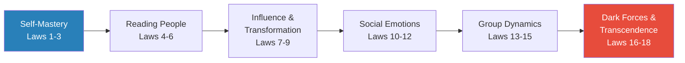
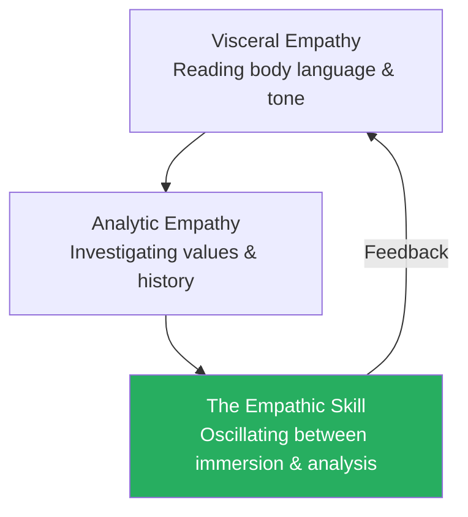
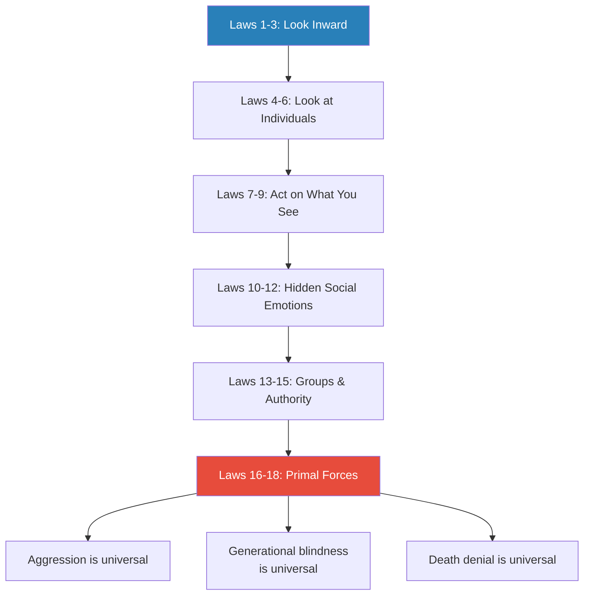
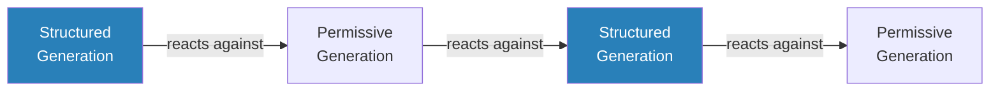

# The Laws of Human Nature — Robert Greene

> Robert Greene's most ambitious and mature work is a 600-page taxonomy of the forces that govern human behaviour. His thesis: we are not the rational creatures we believe ourselves to be. We are driven by narcissism, envy, irrationality, aggression, conformism, and childhood wounds — forces evolved over millions of years that we largely fail to recognise in ourselves. Greene maps 18 laws across six domains — from self-mastery to mortality — drawing on evolutionary psychology, Jungian theory, neuroscience, and his trademark deep-cut historical narratives. Where *The 48 Laws of Power* was a tactical manual for navigating courts, this is a diagnostic manual for understanding the human beings who populate them. The person who understands human nature most deeply, Greene argues, gains the decisive advantage — not through manipulation, but through clarity. See what others cannot see, including about yourself, and you win by default.

---

## About the Author

Robert Greene studied classical literature at the University of California, Berkeley, and the University of Wisconsin at Madison.
He worked over fifty jobs — including stints as a translator, screenwriter, and Hollywood production assistant — before publishing *The 48 Laws of Power* at age 36, a book that made power a subject you could discuss openly rather than in whispered euphemisms.
His years of grinding through dead-end positions were not wasted; they gave him an unusually wide observation deck from which to study human behaviour across every level of hierarchy, from mailrooms to executive suites.
*The Laws of Human Nature* arrived twenty years later, in 2018, and represents the fullest expression of his intellectual project: synthesising 3,000 years of history, psychology, and philosophy into a unified field theory of why people do what they do.

Greene's method is distinctive and often criticised. He is not a psychologist, a historian, or a neuroscientist — he is a synthesiser, drawing on all three disciplines (and more) to construct frameworks that are narratively compelling and practically useful, even if they lack the rigour of any single discipline taken alone. His primary sources in this book include Heinz Kohut (the clinical psychology of narcissism), Carl Jung (the shadow, the anima/animus, psychological types), Paul Ekman (micro-expressions and the science of emotion detection), Antonio Damasio and Joseph LeDoux (the neuroscience of emotion and decision-making), John Bowlby and Donald Winnicott (attachment theory and childhood development), Simon Baron-Cohen (the empathy spectrum), Wilfred Bion and Elliot Aronson (group dynamics), and the philosophical tradition running from Schopenhauer and Nietzsche through Machiavelli. The result is a book that functions simultaneously as psychology text, historical anthology, and strategic field manual — a synthesis that no academic specialist would attempt and no pure generalist could pull off.

## The Big Idea

- Greene's central argument is that <b style="color: #27ae60">the gap between how we think we operate and how we actually operate is the source of most human failure</b>
- We project rationality onto our decisions while being driven by emotional undercurrents rooted in childhood wounds, status anxiety, and primate social wiring
- Every person you meet is performing a version of themselves — wearing a mask shaped by social pressure — while deeper forces (envy, narcissism, aggression, the need to conform) pull the strings from below

---

- The 18 laws are Greene's map of this hidden terrain
- Each law isolates a specific force — irrationality, narcissism, compulsive behaviour, envy, grandiosity, conformity, aggression, death denial — and provides both a diagnostic framework for recognising it in others and a prescriptive framework for managing it in yourself
- The book is organised in six parts, moving from self-mastery (understanding your own distortions) through reading people, influencing others, navigating social emotions, operating within groups, and finally confronting the darkest forces — aggression, generational blindness, and mortality itself

The meta-principle is simple and uncomfortable: <b style="color: #27ae60">self-awareness is the master skill</b>.

- Technical expertise, political savvy, and tactical brilliance all depend on it
- The person who cannot see their own biases, who cannot read the true character beneath another's mask, who cannot resist the pull of group conformity — that person is playing the game blindfolded
- Greene's prescription is not suppression but awareness — you do not eliminate these forces; you see them clearly enough to direct them

---

- Greene positions this as a fundamentally optimistic message, despite the dark material
- The forces he describes — narcissism, envy, aggression, conformity — are not diseases to be cured but features of human psychology that evolved for specific reasons:
  - Narcissism, in moderate form, provides the self-confidence needed to take risks
  - Envy, when redirected, becomes motivation
  - Aggression, when channelled, becomes assertiveness and drive
  - Conformity, when conscious, enables productive cooperation
  - Even death denial, when confronted, becomes the urgency that gives life its intensity
- <b style="color: #e74c3c">The problem is never the force itself — it is the lack of awareness that allows the force to operate unconsciously</b>
- Make it conscious, and it becomes a tool; leave it unconscious, and it becomes a destructive compulsion

---

- What distinguishes this book from Greene's earlier works is its inward turn
- *The 48 Laws of Power* was a manual for reading courts and making moves; *The Art of Seduction* catalogued archetypal patterns of attraction; *The 33 Strategies of War* applied military logic to competitive situations
- But *The Laws of Human Nature* starts with a different premise: before you can read others, you must learn to read yourself
- The first three laws — irrationality, narcissism, role-playing — are all directed inward
- Until you understand your own emotional distortions, your narcissistic blind spots, your unconscious social performances, your reading of others is just projection

The historical figures who appear as exemplars — Pericles, Elizabeth I, Lincoln, Chekhov — all share one quality: a rigorous, honest relationship with their own psychology. The figures who appear as cautionary tales — Nixon, Eisner, Philip II, Cleon — all share the opposite: a catastrophic lack of self-knowledge.

The book moves from internal (cleaning your own lens) through interpersonal (reading and influencing others) to existential (confronting the permanent conditions of being human).

## Key Concepts at a Glance

### Quick Lookup Table

| # | Law | Thematic Group |
|---|-----|----------------|
| 1 | The Law of Irrationality | [Self-Mastery Foundations](#self-mastery-foundations-laws-13) |
| 2 | The Law of Narcissism | [Self-Mastery Foundations](#self-mastery-foundations-laws-13) |
| 3 | The Law of Role-Playing | [Self-Mastery Foundations](#self-mastery-foundations-laws-13) |
| 4 | The Law of Compulsive Behaviour | [Reading People](#reading-people-laws-46) |
| 5 | The Law of Covetousness | [Reading People](#reading-people-laws-46) |
| 6 | The Law of Shortsightedness | [Reading People](#reading-people-laws-46) |
| 7 | The Law of Defensiveness | [Influence & Self-Transformation](#influence--self-transformation-laws-79) |
| 8 | The Law of Self-Sabotage | [Influence & Self-Transformation](#influence--self-transformation-laws-79) |
| 9 | The Law of Repression (The Shadow) | [Influence & Self-Transformation](#influence--self-transformation-laws-79) |
| 10 | The Law of Envy | [Social Emotions](#social-emotions-laws-1012) |
| 11 | The Law of Grandiosity | [Social Emotions](#social-emotions-laws-1012) |
| 12 | The Law of Gender Rigidity | [Social Emotions](#social-emotions-laws-1012) |
| 13 | The Law of Aimlessness | [Group Dynamics](#group-dynamics-laws-1315) |
| 14 | The Law of Conformity | [Group Dynamics](#group-dynamics-laws-1315) |
| 15 | The Law of Fickleness (Authority) | [Group Dynamics](#group-dynamics-laws-1315) |
| 16 | The Law of Aggression | [Dark Forces & Transcendence](#dark-forces--transcendence-laws-1618) |
| 17 | The Law of Generational Myopia | [Dark Forces & Transcendence](#dark-forces--transcendence-laws-1618) |
| 18 | The Law of Death Denial | [Dark Forces & Transcendence](#dark-forces--transcendence-laws-1618) |

### Key Frameworks

| Concept | One-line summary |
|---------|-----------------|
| **The Narcissism Spectrum** | All humans sit on a continuum from deep narcissism (others as mirrors) to healthy narcissism (self-worth channelled into empathy) |
| **The Shadow** | Every cultivated public quality generates an equal and opposite repressed quality in the unconscious |
| **Character as Fate** | Character forms early and repeats compulsively — past behaviour is the best predictor of future behaviour |
| **The Attitude Lens** | Your default emotional filter (hostile, anxious, expansive) shapes reality through self-fulfilling feedback loops |
| **The Influence Hierarchy** | Ranked from least to most effective: direct argument → emotional appeal → validation → co-creation |
| **The Envy Triangle** | Envy requires proximity + similarity + asymmetry, and always disguises itself as moral judgment |
| **Authority Archetypes** | True authority lives in followers' perception, not the leader's title — authenticity, competence, and mixed signals sustain it |
| **Generational Patterns** | Each generation (~22 years) defines itself against the previous one, creating a predictable oscillation of values |

---

## Self-Mastery Foundations (Laws 1-3)

*Before you can read the world, you must account for the distortions in your own lens — the emotional, narcissistic, and performative filters that turn every observation into a projection.*

- The book opens with the prerequisite: you cannot read others until you understand your own distortions
- These three laws address the emotional, narcissistic, and performative filters through which you see the world
- Until you account for these, your perception of others is just projection — you see your own fears, desires, and biases reflected back and mistake them for reality

---

- Greene's decision to begin with self-mastery rather than social strategy is itself a statement
- Most books on influence rush to teach you how to read and persuade others
- Greene insists on a different sequence: the instrument must be calibrated before it can take measurements
- You are the lens through which you perceive everyone else — if the lens is warped by unexamined emotion, unrecognised narcissism, and unconscious performance, then every reading you take of another person is distorted from the start

The three laws establish the book's core intellectual scaffolding:

- **Law 1 (Irrationality)** addresses the cognitive dimension — how our thinking goes wrong
- **Law 2 (Narcissism)** addresses the relational dimension — how our need for validation distorts our ability to see others
- **Law 3 (Role-Playing)** addresses the performative dimension — how the masks we wear (and that others wear) create a gap between appearance and reality
- Together, these three dimensions define the complete set of filters that stand between you and clear perception
- Master all three and you have a fighting chance of seeing the world as it is; fail to master any one and your perception is compromised in a specific, predictable way

---

### Law 1: The Law of Irrationality

*You are not as rational as you believe — and the feeling of being rational is itself a feeling, not a fact.*

- <b style="color: #27ae60">Emotions infect every decision through biases you cannot see</b>
- These biases do not operate occasionally or only in moments of stress; they operate constantly, shaping perception below the threshold of awareness
- Greene identifies six core biases:
  - <b style="color: #2980b9">Confirmation bias</b> — seeking evidence that supports what you already believe
  - <b style="color: #2980b9">Conviction bias</b> — mistaking emotional intensity for truth
  - <b style="color: #2980b9">Appearance bias</b> — judging by surface presentation
  - <b style="color: #2980b9">Group bias</b> — adopting group opinions unconsciously
  - <b style="color: #2980b9">Blame bias</b> — attributing failures to external causes
  - <b style="color: #2980b9">Superiority bias</b> — believing you are more rational than you are

> [!example] Pericles and the Athenian Assembly (5th century BC)
> - Pericles governed Athens through disciplined rationality for over thirty years
> - When political enemies attacked his friends and family, when plague devastated the city, when public opinion turned violently against him, he did not react
> - He waited, let the emotional wave crest, and responded only when clarity returned
> - His calm was not passivity — it was the most powerful form of action available
> - He understood that the Athenian Assembly was driven by waves of collective emotion, and that any leader who rode those waves would eventually be drowned by them
> - Instead, he stood apart, offered measured counsel, and let the emotional storm pass before making decisions
> **The lesson:** Rational thinking is not cold logic but "the ability to consider more deeply the ramifications of events."

> [!example] Cleon and the Destruction of Athens
> - Cleon, Pericles' successor, rode every emotional current, feeding the mob's anger
> - He led Athens into catastrophic decisions — the massacre at Mytilene, the Sicilian expedition — driven by collective rage and grandiose ambition
> - Cleon was not stupid; he was simply reactive — responding to the mood of the moment rather than to the strategic reality
> - The decisions ultimately destroyed the empire Pericles had built
> **The lesson:** The difference between rational and irrational behaviour is not intelligence but the relationship between emotion and decision.

---

**The neurological mechanism:**

- The brain evolved emotions before cognition — they operate in different brain regions, and the translation between them is lossy
- "Rationality is not a power you are born with," Greene writes, "but one you acquire through practice"
- We feel first, rationalise second — and then, crucially, we believe our rationalisation was the original cause of our decision
- Greene draws on <b style="color: #2980b9">Antonio Damasio's somatic marker hypothesis</b> — emotions are not separate from reasoning but entangled with it at every stage
- He also cites <b style="color: #2980b9">Joseph LeDoux's work on the amygdala</b> — the brain's threat-detection system fires faster than conscious thought, producing emotional reactions that shape decisions before we are aware they are happening
- The implication is humbling: the feeling of being rational is itself a feeling, not a fact

> [!tip] Core Insight
> The prescription is not to suppress emotion but to create a delay between stimulus and response. Name the emotion before acting on it. Over time, this practice builds what Greene calls **rational thinking** — not the absence of emotion, but the ability to observe your emotions as data rather than commands.

**The practice of rational thinking:**

- Impose a cooling period before high-stakes decisions
- Write the angry response but do not send it
- Keep a journal of decisions and their emotional context, so patterns of irrational behaviour become visible over time
- The goal is not emotionlessness but <b style="color: #27ae60">emotional literacy — knowing what you feel, why you feel it, and whether acting on it serves your interests</b>

---

**On gut instinct:**

- Greene does not dismiss intuition entirely, but draws a sharp distinction between untrained intuition and expertise-based intuition
- The gut feeling of a thirty-year veteran reflects pattern recognition refined over decades of feedback — genuinely valuable
- The gut feeling of someone who has never examined their biases is just emotion wearing the mask of wisdom
- Most people mistake the second for the first
- <b style="color: #e74c3c">A particularly insidious form of irrationality: the belief that you have already mastered your emotions and are therefore immune</b> — the person who has read one book on cognitive bias and now believes they are free of bias is, in a sense, more irrational than the person who has never examined the subject at all
- True rational thinking is a lifelong practice — not a state you achieve but a discipline you maintain, like physical fitness
- The Law of Irrationality is the entry point to everything that follows: until you accept that your own rationality is unreliable, you cannot begin the work of seeing clearly

---

### Law 2: The Law of Narcissism

*Everyone exists on a narcissism spectrum — and stress pushes all of us toward the deep end, where empathy collapses and others become mirrors for our own validation.*

- Everyone exists on a <b style="color: #2980b9">narcissism spectrum</b>
- At the deep end, people lack functional empathy and use others as mirrors for their own validation
- At the healthy end, people channel self-regard into genuine curiosity about others and productive work
- The spectrum is not fixed — stress pushes everyone toward the deep end, and conscious effort can pull you back
- Greene draws primarily on the work of <b style="color: #2980b9">Heinz Kohut</b>, whose clinical research demonstrated that narcissism is not a binary but a continuum that all humans occupy

> [!example]- Joseph Stalin — The Complete Control Narcissist
> - Stalin grew up in poverty, beaten regularly by his father, doted on by a mother who projected all her frustrated ambitions onto him
> - These early experiences forged a personality that needed control the way others need oxygen
> - Stalin's paranoia was not a personality quirk — it was the logical endpoint of deep narcissism
> - Unable to conceive of others as autonomous beings with their own motives, he could only interpret independence as betrayal
> - The purges, the show trials, the systematic destruction of anyone who exhibited initiative — all flowed from this single psychological root
> - Even his closest allies — Kirov, Bukharin, men who had served him loyally for decades — were eventually consumed
> - In Stalin's internal world no one could be trusted, because trust requires the ability to see another person as a separate being, and that was the one capacity he lacked
> **The lesson:** The Complete Control Narcissist's paranoia is structural, not situational — it cannot be appeased because it originates in an inability to see others as separate beings.

> [!example] Jeanne des Anges — The Theatrical Narcissist (17th century)
> - Jeanne, a French nun, orchestrated elaborate "demonic possessions" in her convent
> - The performances escalated as attention grew, convincing the local community she was inhabited by devils
> - Eventually the spectacle led to the trial and execution of the local priest Urbain Grandier
> - Where the Control Narcissist demands submission, the Theatrical Narcissist demands an audience
> - Both types are fundamentally incapable of seeing others as anything other than instruments of their own needs
> **The lesson:** Theatrical narcissists manufacture drama, crisis, and victimhood to secure attention — and escalate when the audience stops watching.

---

**Empathy as a learnable skill:**

- Greene presents <b style="color: #2980b9">empathy as a skill</b> — not a sentiment, not an innate trait, but a learnable capacity at the healthy end of the narcissism spectrum
- He identifies three levels:
  - **Visceral empathy** — reading body language, tone, and micro-expressions in real time; the immediate, pre-cognitive sense of another person's emotional state
  - **Analytic empathy** — gathering background information about someone's values, upbringing, incentive structure, and history; the deliberate, cognitive work of understanding where they are coming from
  - **The empathic skill** — the ability to cycle between feeling and analysis, immersing yourself in the other person's perspective and then stepping back to evaluate what you have learned
- Most people never develop beyond rudimentary visceral empathy
- <b style="color: #27ae60">The full empathic skill — the oscillation between immersion and analysis — is the master skill for navigating human relationships</b>
- The reason most people fail at empathy is not lack of feeling but lack of method:
  - They rely on emotional response alone (visceral empathy) without deliberate investigation (analytic empathy)
  - They lack the disciplined practice of perspective-taking (the empathic skill)
  - The result is empathy easily fooled by charm, blocked by cultural difference, and overwhelmed by strong personality types

The three levels of empathy build on each other — the full empathic skill requires cycling between feeling (visceral) and investigation (analytic) in a continuous loop.

---

**Practical application:**

- Before attempting to influence anyone, first map their narcissistic needs — what validation do they crave? what self-image are they protecting?
- "People are locked in their own worlds," Greene writes
- The person who can briefly enter another's world, see through their eyes, and speak to what they actually care about — that person wields influence that feels like being truly understood rather than being manipulated
- The key distinction is between flattery and genuine recognition:
  - Flattery is transparent and breeds suspicion
  - Genuine recognition — the kind that can only come from real empathy — creates connection and trust

**Dangers of empathy:**

- <b style="color: #e74c3c">Over-identification with toxic people can become paralysis</b> — you understand them so well that you lose the ability to act against them
- The skill is maintaining observer distance: understanding without absorbing
- Confusing strategic empathy with genuine care is also a risk — the person who deploys empathy purely as a tool, without ever allowing themselves to genuinely care, risks reinforcing their own narcissistic patterns

---

### Law 3: The Law of Role-Playing

*Everyone wears masks in social life — but the gap between mask and reality is where the most valuable intelligence lives, if you know how to read it.*

- People present a version of themselves tailored to the situation — friendly in meetings, authoritative in presentations, vulnerable with allies
- The mask is not dishonesty; it is the basic mechanism of social survival
- But the gap between mask and reality is where the most valuable intelligence lives
- Everyone performs a social self; the question is whether you can see through the performance — both others' and your own

**Reading the second language:**

- Greene's prescription is to learn to read the <b style="color: #2980b9">second language</b> — the nonverbal cues, micro-expressions, and tonal shifts that reveal what the mask conceals
- Drawing on <b style="color: #2980b9">Paul Ekman's</b> decades of research, he identifies specific signals:
  - Fleeting expressions of contempt or disgust lasting a fraction of a second — micro-expressions are extraordinarily difficult to fake because they originate in brain regions below conscious control
  - Shifts in body orientation — toward you when genuinely engaged, away when performing interest
  - Changes in vocal register — higher pitch signals anxiety or deception, lower pitch signals comfort and confidence
  - The critical tell of **incongruence** — when someone's words say one thing and their body says another
- A person who says "I'm delighted" while their jaw tightens and their body pulls back is telling you two things simultaneously — <b style="color: #27ae60">believe the body</b>

> [!example]- Milton Erickson — The Master Observer (Early 20th century)
> - Erickson, the legendary hypnotherapist, overcame childhood polio and near-total physical disability
> - Confined to a bed for months during his illness, he had nothing to do but observe his family's nonverbal behaviour
> - He watched how his sisters' words contradicted their body language
> - He noticed the tiny shifts in posture that preceded emotional changes
> - Over months and years of forced observation, he developed an almost preternatural ability to read nonverbal behaviour
> - This was not intuition in the mystical sense; it was skill, built through thousands of hours of deliberate observation
> - When Erickson later became a practising therapist, his ability to read patients' unspoken states made him legendarily effective
> - Patients felt that he understood them in a way no other therapist had — because he was reading the full bandwidth of their communication, not just the verbal channel
> **The lesson:** The ability to read nonverbal behaviour is a trainable skill, not a mystical gift — built through deliberate, sustained observation.

---

**The science of deception detection:**

- Most people are shockingly bad at detecting lies — research consistently shows untrained observers detect deception at rates barely above chance (~54%, essentially a coin flip)
- This holds across professions that should be expert: police officers, judges, psychologists — none perform significantly better without specific training
- Our confidence in our ability to detect deception far outstrips our actual ability — itself a form of the superiority bias from Law 1
- <b style="color: #e74c3c">We attend to the wrong signals</b>:
  - We listen to words, which are the most controlled and therefore the most deceptive channel
  - We should be watching bodies, which are the least controlled and therefore the most honest
- The trained observer performs dramatically better — not because of a special gift but because they attend to the right data

> [!tip] Core Insight
> The mask is not a lie; it is a social tool. The goal is not to eliminate masks but to wear yours consciously — knowing what you are presenting, why, and how it differs from your inner reality.

**Managing your own impression:**

- You must also master your own <b style="color: #2980b9">impression management</b> — not becoming fake, but becoming conscious of what you project
- The person unaware of their own nonverbal signals broadcasts information they may not want to share — anxiety, insecurity, contempt, boredom
- The person with self-awareness of their own signals can choose what to project: confidence, interest, warmth, authority
- The problem arises from two specific failures:
  - Wearing a mask unconsciously — driven by anxiety, habit, or the need for approval rather than choice
  - Confusing your mask with your identity — losing touch with who you are beneath the performance

**Limitations:**

- Cultural differences in nonverbal expression are significant — a gesture that signals respect in one culture may signal submission in another
- <b style="color: #e74c3c">Do not over-index on single cues</b>; look for clusters and patterns rather than individual signals
- Expert liars can control some nonverbal channels — the most reliable tell is sustained incongruence across multiple interactions, not a single moment of misalignment

---

## Reading People (Laws 4-6)

*With your own distortions accounted for, these three laws provide the diagnostic tools for predicting behaviour — by reading deep character, hidden desires, and the relationship with time.*

- The next three laws provide diagnostic tools for assessing others — their true character, their hidden desires, and their relationship with time
- These laws are fundamentally about prediction:
  - If you can read a person's deep character, you can predict their behaviour under stress
  - If you understand what they truly want (not what they say they want), you can anticipate their moves
  - If you assess whether they think in terms of immediate reactions or long-term consequences, you know how they will respond to pressure

---

- Greene's premise is that people are remarkably consistent — they change circumstances (new jobs, cities, relationships) but their fundamental patterns persist
- The character forged in childhood reasserts itself under pressure
- The desires shaped by early experience continue to drive behaviour long after the original context has vanished
- The orientation toward time — whether someone is a short-term reactor or a long-term strategist — is one of the most stable and consequential traits a person possesses

**The diagnostic challenge:**

- People are skilled at presenting themselves as they wish to be seen rather than as they are
- First impressions are carefully managed; job interviews are performances; early relationships are optimised for attraction
- <b style="color: #27ae60">The only reliable way to read someone's true nature is to look at their behaviour over time and across multiple situations</b> — particularly situations of stress, where the performance breaks down
- A single encounter tells you what mask someone has chosen; a pattern of encounters tells you who they actually are

---

### Law 4: The Law of Compulsive Behaviour

*Character is destiny — people's behaviour follows deep-rooted patterns established in childhood that repeat compulsively, even against self-interest.*

- <b style="color: #27ae60">Character is destiny</b> — behaviour follows deep-rooted patterns established in childhood that repeat compulsively, even against self-interest
- Neural pathways formed early are the strongest
- Character bends under pressure but returns to its original shape
- "People never do something just once," Greene writes

> [!example]- Howard Hughes — The Compulsive Pattern (20th century)
> - Hughes, the brilliant industrialist, followed a recurring pattern across every domain: visionary ambition → obsessive control → paranoid isolation → self-destructive excess
> - In aviation, he built the world's fastest plane and then nearly killed himself flying it, driven by a need to prove himself that no amount of success could satisfy
> - In Hollywood, he produced innovative films and then destroyed relationships with every director, writer, and actor through micromanagement and paranoid interference
> - In his personal life, he pursued women with obsessive intensity and then confined them — sometimes literally — once he possessed them
> - Each time, the circumstances were different; each time, the character produced the same arc
> - Hughes was not unlucky; he was compulsive — the pattern was the man
> **The lesson:** When you see the same pattern repeat across different domains and different circumstances, you are seeing character, not coincidence.

> [!example] Cassius Severus — The Compulsive Attacker (Ancient Rome)
> - Severus, the Roman orator, was exiled for his vicious public attacks on prominent citizens
> - Even in exile, he continued his attacks — despite each new insult only deepening his punishment
> - His friends pleaded with him to stop — he could not
> - The compulsion to attack was not a choice but a character structure, as fixed as his bone structure
> **The lesson:** What appears to outsiders as self-destructive stubbornness is, from the inside, simply the only way the person knows how to be.

---

**Toxic character types:**

| Type | Core Pattern | How It Repeats |
|------|-------------|----------------|
| **Hyperperfectionist** | Sets impossible standards | Destroys one team's morale, moves to another, destroys that one too |
| **Drama Magnet** | Creates crises for emotional intensity | Creates crisis in one relationship, escapes, creates crisis in the next |
| **Sexualiser** | Brings seduction into every relationship | Converts professional and friendly interactions into sexual dynamics |
| **Pampered Prince/Princess** | Expects special treatment | Punishes its absence with passive aggression or outright hostility |
| **Pleaser** | Accommodates until resentment explodes | Smiles for months, then detonates at the worst moment |
| **Saviour** | Needs to rescue others to feel powerful | Seeks damaged people and creates dependency rather than independence |
| **Easy Moraliser** | Judges others harshly | Avoids examining their own behaviour by focusing on everyone else's |

Each type has a distinctive pattern that repeats across different contexts — the crises feel different from the inside but are structurally identical from the outside.

> [!tip] Core Insight
> Before trusting, hiring, or allying with anyone, examine their track record across multiple situations. Look for patterns, not single data points. The best predictor of future behaviour is not what someone says they will do, but what they have consistently done in the past.

---

> [!abstract] Diagnostic Method: Reading Character
> 1. **What do they do when they have power over others?** — Power reveals character because it removes the need for performance
> 2. **What do they do under stress?** — Stress strips away the social persona and exposes underlying character structure
> 3. **What do they do when they believe they are unobserved?** — Behaviour in private is the closest you can get to unfiltered character
> 4. **Check for consistency** — When behaviour under all three conditions matches their public persona, you are probably seeing the real person; significant discrepancies reveal the gap between character and mask

**Nuance:**

- Younger people's characters are still forming, and extraordinary circumstances can genuinely change people
- Greene acknowledges that character is not absolutely fixed — but he insists that the burden of proof falls on the claim of change, not on the assumption of continuity
- <b style="color: #e74c3c">The most dangerous error is taking someone's stated intention to change as evidence that they have changed</b>
- Use this law as a first-pass heuristic, not a final sentence — but respect its predictive power

---

### Law 5: The Law of Covetousness

*People desire what they do not have — and the brain's dopamine system is activated more by anticipation than by possession.*

- People desire what they do not have — absence and mystery stimulate desire more powerfully than presence and availability
- The mechanism is neurological: the brain's dopamine system is activated more by <b style="color: #2980b9">anticipation</b> than by possession
- Scarcity triggers wanting
- The object that is fully possessed, fully understood, and perpetually available gradually loses its allure — not because it has changed, but because the dopamine system habituates to the familiar and craves the novel

---

- Greene's core insight is that <b style="color: #27ae60">desire operates by the logic of absence</b>
- The object that is too available, too transparent, too eager to be possessed — it loses its power
- The object that withdraws, that maintains an air of mystery, that suggests hidden depths — it becomes irresistible
- This applies to people as much as to things:
  - The person who is always available, who over-explains their value, who chases rather than attracts — diminishes their own desirability
  - The person who maintains a degree of reserve, who has an inner life not fully disclosed, who does not need the approval they seek — becomes magnetic

> [!example] Coco Chanel — The Art of Strategic Restraint (Early 20th century)
> - Chanel understood that desire is created by what you withhold, not what you display
> - Her designs were exercises in strategic restraint — removing one accessory, simplifying one element, leaving just enough undefined to provoke curiosity
> - In an era of ornate, overdecorated fashion, her simplicity was revolutionary — not because it was plain, but because it suggested more than it revealed
> - She applied the same principle to her public persona, cultivating an enigmatic personal mythology
> - Chanel understood instinctively what neuroscience would later confirm: the brain is more excited by the gap between what it knows and what it suspects than by complete information
> **The lesson:** The suggestion of depth is more compelling than the demonstration of it.

> [!example] Jacqueline Kennedy Onassis — The Power of Withdrawal
> - After President Kennedy's assassination, Jackie became the most famous woman in the world
> - Rather than capitalising on that fame through interviews, memoirs, or public appearances, she withdrew
> - She granted almost no interviews, refused to discuss her experiences, and maintained a silence that made every rare public appearance an event
> - The less she said, the more the world wanted to hear; the less she appeared, the more powerful each appearance became
> - Her mystique was not accidental but strategic: she understood that availability destroys desire
> **The lesson:** Sometimes the most powerful move is withdrawal — letting the potential loss do the persuading.

---

**The broader psychology of scarcity:**

- When objects are made scarce — limited editions, exclusive access, restricted availability — their perceived value increases, often dramatically
- This is not rational; the object itself has not changed
- The perception of scarcity activates the dopamine system's wanting circuit, which is distinct from the liking circuit
- You can want something intensely without particularly liking it, simply because it is scarce
- This principle operates in human relationships as powerfully as in consumer behaviour

**The principle of strategic absence:**

- <b style="color: #27ae60">Do not make yourself too available; do not over-explain your value; let the potential loss do the persuading</b>
- In any dynamic where you are being evaluated, the fact that you might not be available is more compelling than any pitch you could make
- The person who has alternatives — and who is known to have alternatives — is valued more highly than the person who has none

**Limitations:**

- <b style="color: #e74c3c">Too much absence creates disconnection</b> — there is a threshold beyond which mystery becomes alienation
- In close working relationships and genuine friendships, trust requires consistent presence
- The covetousness principle suits negotiations, positioning, and first impressions — not daily collaboration or deep intimacy
- Strategic absence must be backed by real substance — mystery without capability is just empty theatre
- The Chanel principle only works because Chanel's designs were genuinely brilliant; the mystery drew people in, the quality kept them

---

### Law 6: The Law of Shortsightedness

*Humans are wired for immediate reactions, not long-term strategy — and precisely when long-term thinking matters most, the brain is least equipped to do it.*

- Humans are wired for immediate reactions, not long-term strategy
- Under pressure, we become <b style="color: #2980b9">tacticians</b> rather than strategists, losing sight of second- and third-order consequences
- Evolution optimised for immediate threat response
- Strategic thinking requires the prefrontal cortex, which is slow and energy-hungry
- When stress activates the amygdala, the prefrontal cortex gets pushed offline — precisely when long-term thinking matters most, the brain is least equipped to do it

**Four failure modes of shortsightedness:**

| Mode | What Happens | The Trap |
|------|-------------|----------|
| **Reactive mode** | Responding to stimuli rather than pursuing goals | Losing sight of strategy under pressure, dealing with whatever is in front of you |
| **Ticker tape fever** | Addiction to real-time information | Compulsive checking creates the illusion of engagement while fragmenting attention |
| **Tactical hell** | Winning individual battles while losing the war | Every local victory consumes resources that should have been conserved for larger goals |
| **Lost in trivia** | Drowning in detail while missing patterns | Mistaking busyness for progress, managing the trees while the forest burns |

> [!example]- Philip II of Spain — Drowning in Detail (16th century)
> - Philip obsessed over administrative minutiae — famously micromanaging the placement of toilets in the Escorial palace — while losing sight of the strategic weather patterns that would determine the fate of his empire
> - He personally reviewed thousands of documents and insisted on controlling every detail of governance
> - Meanwhile, his opponents — the English, the Dutch — who saw the bigger picture, outmanoeuvred him
> - The Spanish Armada was not just a military defeat; it was the consequence of a strategic culture that had substituted control for vision
> - Philip drowned in detail; Elizabeth I, who delegated detail and focused on strategy, won an empire
> **The lesson:** Micromanagement is not diligence — it is a failure of strategic vision that trades long-term advantage for the illusion of control.

> [!example]- Abraham Lincoln — Farsighted Leadership (1861-1865)
> - Lincoln maintained long-term strategic vision throughout the Civil War despite catastrophic short-term setbacks
> - When generals lost battles, when public opinion turned against him, when his own cabinet plotted against him, when newspapers declared the war lost, Lincoln held to the strategic objective
> - His generals often won individual battles only to fail to press the strategic advantage
> - Lincoln, who had never commanded troops, saw more clearly than his military professionals because he was thinking at a higher level of abstraction
> - He understood the war would be won not through brilliant individual engagements but through relentless application of the North's structural advantages — industrial capacity, population, and logistics
> - While his generals focused on the next battle, Lincoln focused on the next year
> - His ability to absorb short-term criticism for long-term gain — to endure newspaper editorials calling him incompetent while pursuing a strategy invisible to everyone who lacked his time horizon — is, for Greene, the purest example of farsighted leadership in modern history
> **The lesson:** Lincoln's genius was not tactical but temporal — he saw further into the future than anyone around him.

---

> [!abstract] The Farsightedness Practice
> 1. Before any significant action, map the second-order consequences
> 2. Ask "If I do X, then Y will likely happen, which means Z becomes possible or impossible"
> 3. Develop the habit of asking "and then what?" at least three times for every planned action
> 4. Distinguish **flexible farsightedness** (clear direction + willingness to adapt) from rigid planning that breaks on first contact with reality

- <b style="color: #27ae60">The ability to think beyond the immediate moment is the rarest and most valuable cognitive skill</b>
- Most people do not lack intelligence; they lack time horizon — they see what is in front of them clearly enough but cannot see what is behind it
- The strategic thinker does not have a detailed plan for every contingency; they have a clear understanding of where they want to end up and the flexibility to navigate around obstacles

**Limitations:**

- Long-term planning can become rigidity
- Some windows of opportunity genuinely close — analysis paralysis is its own form of shortsightedness
- The art is knowing when to wait and when to move — and that judgment itself requires the long-term perspective Greene is advocating

---

## Influence & Self-Transformation (Laws 7-9)

*Understanding human nature is only half the work — these three laws teach you to act on what you see, working with human nature rather than against it.*

- These are the action laws — how to change others' minds and transform yourself
- Each addresses a specific barrier to influence and growth:
  - The defensiveness that makes people resist even good ideas
  - The self-sabotaging attitudes that create their own negative reality
  - The repressed shadow that undermines authenticity and leaks out in destructive ways

---

- Greene positions these three laws as the bridge between understanding (Laws 1-6) and action
- People are defensive, so you must lower their defences before you can reach them
- People are trapped in attitudes that sabotage them, so you must understand the mechanism before you can change your own
- People have shadows that distort their behaviour, so you must integrate your own shadow before it undermines your integrity
- Each law is simultaneously a tool for influencing others and a prescription for self-transformation

This dual nature — outward influence and inward transformation — is what makes this section the core of the book.

- The first six laws were primarily observational: see yourself clearly, see others clearly
- The next three are active: change yourself, change the dynamic
- Greene is adamant that the two cannot be separated:
  - You cannot effectively lower another person's defences if your own attitude is hostile or anxious (Law 8 undermines Law 7)
  - You cannot authentically influence others if your shadow is leaking out in contradictory behaviour (Law 9 undermines Laws 7 and 8)
  - The three laws form a system: attitude shapes the platform, shadow integration ensures stability, and influence techniques work only on that foundation

---

### Law 7: The Law of Defensiveness

*The harder you push, the harder people resist — because the need to feel autonomous is primal, and direct persuasion triggers the opposite of what you intend.*

- People are naturally resistant to influence
- The need to feel <b style="color: #2980b9">autonomous</b> is primal
- Direct persuasion triggers <b style="color: #2980b9">reactance</b> — the harder you push, the harder they resist
- Arguments, however logical, engage ego defences
- Even when you win the debate, the loser's wounded pride becomes your enemy
- "People must feel the change they are going through is something they chose," Greene writes

> [!example]- LBJ's Transformation — From Brash Failure to Master Persuader
> - As a young congressman, Johnson tried to influence through direct argument and force of will — and failed spectacularly
> - He was brash, pushy, and transparent in his ambition; his mentor Sam Rayburn rejected his attempts to gain favour through blunt aggression
> - The turning point came when Johnson attached himself to Richard Russell, the most powerful senator of the era
> - Rather than competing with Russell or trying to impress him, Johnson studied him — his values, his insecurities, his communication style, his unspoken needs
> - He discovered that Russell, a lifelong bachelor, was deeply lonely and craved intellectual companionship
> - Johnson provided it — not as a transparent ploy but through genuine interest in Russell's ideas and genuine deference to his experience
> - Over months, Russell came to see Johnson not as a supplicant but as a protege, and eventually as a partner
> - The relationship unlocked Russell's entire network — and Johnson became the youngest Senate Majority Leader in history
> **The lesson:** Influence flows not through the door of argument but through the door of the other person's needs.

---

**Why argument fails:**

- Most people try to influence others by presenting arguments — marshalling facts, building logical cases, appealing to reason
- This approach assumes that people are persuaded by evidence — they are not
- <b style="color: #27ae60">People are persuaded by feeling understood, respected, and autonomous</b>
- The most brilliant argument will fail if the person receiving it feels attacked, diminished, or manipulated
- Conversely, a mediocre idea presented in a way that makes the recipient feel like a co-creator will succeed where a brilliant idea presented as a lecture will fail
- The quality of the argument matters far less than the quality of the relationship through which it is delivered

> [!abstract] The Influence Hierarchy (Least to Most Effective)
> 1. **Validate the other person's self-opinion** — make them feel seen, respected, and intelligent before introducing your ideas
> 2. **Create warmth through mirroring** — match their communication style, energy level, and values to create kinship
> 3. **Lower their guard with genuine interest** — ask questions, listen deeply, resist steering the conversation toward your agenda too quickly
> 4. **Make them co-creators of the idea** — seed the concept and let them develop it, so they feel ownership rather than compliance
> 5. **Appeal to their self-interest** — frame every proposal in terms of what it does for them, not what it does for you

The master persuader operates at levels three and four, where influence feels to the recipient like their own choice rather than external pressure.

---

**Limitations:**

- Over-accommodation becomes sycophancy, which sophisticated people detect instantly
- The art is genuine interest combined with strategic framing — caring enough to understand what someone values, and skilled enough to package your ideas in those terms
- <b style="color: #e74c3c">The difference between influence and manipulation is not the technique but the relationship</b> — if you genuinely understand and respect the other person's perspective, your influence enriches both parties; if you are merely performing interest to get what you want, the performance will eventually be detected
- The Law of Defensiveness works best with emotionally healthy people; deep narcissists may be impervious to any influence that does not directly serve their validation needs
- There is a genuine risk of over-applying this principle — the person who never makes direct arguments may lose their own voice
- The ideal is strategic calibration: knowing when to lower defences (high-stakes, new relationships, fragile egos) and when to speak directly (established trust, urgent situations, genuine disagreements)

---

### Law 8: The Law of Self-Sabotage

*Your attitude — the default emotional lens through which you see the world — shapes your reality more than external circumstances, because attitudes create self-fulfilling feedback loops.*

- Your <b style="color: #2980b9">attitude</b> — the default emotional lens through which you see the world — shapes your reality more than external circumstances
- Attitudes are self-fulfilling: hostile people create hostile environments; anxious people create anxiety-producing situations; expansive people create opportunities
- Two people in identical circumstances produce opposite outcomes based on attitude alone
- The mechanism is a feedback loop: your attitude shapes perception → perception shapes response → response shapes how others respond to you → their response confirms the original attitude

---

**Five constricted attitude types:**

| Attitude | Default Lens | Self-Fulfilling Mechanism |
|----------|-------------|--------------------------|
| **Hostile** | Sees enemies everywhere | Defensive posture provokes aggression, confirming the world is hostile |
| **Anxious** | Anticipates disaster | Nervous energy makes others uncomfortable, creating the awkward interactions they dread |
| **Avoidant** | Withdraws from difficulty | Passivity ensures being overlooked, confirming the world is indifferent |
| **Depressive** | Interprets neutral events as worthlessness | Withdrawn energy pushes people away, creating the bleak life they perceive |
| **Resentful** | Accumulates slights silently | Withholds direct expression until resentment explodes destructively, destroying relationships |

Greene draws on <b style="color: #2980b9">Jung's definition of attitude</b> as "a readiness of the psyche to act in a certain way."

Against these constricted types stands the <b style="color: #27ae60">expansive attitude</b> — characterised by curiosity, openness to experience, and the assumption that obstacles contain information rather than verdicts.

> [!example]- Anton Chekhov — The Expansive Attitude in Action (19th century)
> - Chekhov grew up in circumstances of almost unimaginable brutality
> - His father was a violent alcoholic who beat his children regularly; the family had recently emerged from serfdom — his grandfather had literally bought the family's freedom
> - Poverty was grinding and constant — by any reasonable prediction, Chekhov should have become bitter, withdrawn, or destructive
> - Instead, he transformed his suffering into one of the most empathetic and psychologically perceptive bodies of literature ever produced
> - His genius was not despite his suffering but shaped by his response to it: an attitude of relentless curiosity about human nature that converted pain into understanding
> - He observed his father not with hatred but with the eye of a writer — what produces a man like this? What drives the cruelty?
> - His short stories and plays are populated by characters drawn from this childhood observation, rendered with a compassion that could only come from someone who had chosen understanding over resentment
> **The lesson:** The expansive attitude does not deny suffering — it transforms it from a source of bitterness into a source of insight.

---

> [!tip] Core Insight
> The shift from a constricted to an expansive attitude is the highest-leverage personal change you can make, because attitude creates self-reinforcing feedback loops with the social environment. Change the attitude and the environment responds differently, which reinforces the new attitude.

**Auditing your attitude:**

- When setbacks occur, notice whether you default to resentment, withdrawal, or blame
- Greene suggests keeping a log of emotional reactions — not the events themselves, but your default interpretation:
  - A meeting is cancelled: do you interpret it as a slight (hostile), as evidence of your low priority (depressive), or as a free hour to work on something else (expansive)?
  - The same event, filtered through different attitudes, produces completely different emotional responses and subsequent actions
- Over time, the log reveals your default attitude, operating below conscious awareness, shaping your experience of the world

---

- <b style="color: #e74c3c">Constricted attitudes feel true because they are self-confirming</b>
  - The hostile person genuinely does encounter more hostility — because they provoke it — so their hostility feels justified
  - The depressive person genuinely does experience more rejection — because their withdrawn energy pushes people away — so their depression feels rational
- Breaking the cycle requires the uncomfortable recognition that your attitude is a cause, not a consequence, of your circumstances

**Limitations:**

- Genuine structural oppression cannot be overcome by attitude alone
- Toxic positivity — the insistence that everything is fine, that negative emotions are always wrong — is its own trap
- Greene advocates realistic optimism: seeing the situation clearly, including its genuine difficulties, while choosing the interpretation that opens the most doors
- Genuine clinical depression requires professional treatment, not just philosophical reframing
- The attitude lens is powerful, but it is not omnipotent

---

### Law 9: The Law of Repression (The Shadow)

*Every quality you cultivate in your public persona generates an equal and opposite quality in the unconscious — and repressed content does not disappear; it finds indirect expression.*

- Everyone has a <b style="color: #2980b9">shadow</b> — a repository of repressed desires, aggression, selfishness, and socially unacceptable impulses
- Social norms require repression, but repressed content does not disappear
- It finds indirect expression through projection, passive aggression, and "out of character" moments that are actually more of the person's true character, not less
- The shadow is the price of civilisation: in order to function socially, we must suppress parts of ourselves, and those parts do not go quietly

**The mechanism of psychic compensation:**

- Greene draws heavily on <b style="color: #2980b9">Jung</b>: every quality we cultivate in our public persona generates an equal and opposite quality in the shadow
- The person who is excessively moral in public harbours secret vices
- The person who appears supremely controlled has a volatile interior
- The person who insists on their rationality is hiding deep irrationality
- "The more moralistic the persona, the darker the shadow," Greene observes
- This is not a coincidence but a psychological law: the energy required to maintain an extreme public position generates an equal and opposite force in the unconscious
- <b style="color: #e74c3c">The further you push the persona in one direction, the further the shadow stretches in the other</b>

> [!example]- Richard Nixon — The Shadow Breaks Through (1972-1974)
> - Nixon spent decades constructing his public persona — the pragmatic centrist, the experienced diplomat, the sober administrator
> - But beneath this mask, a very different Nixon operated: the man who kept an enemies list, who ordered illegal wiretaps, who obsessively recorded every conversation in the Oval Office
> - The compulsion to record ultimately provided the evidence for his own destruction
> - The Watergate scandal was not an aberration — it was the shadow breaking through
> - Every element of the cover-up reflected qualities Nixon had spent a lifetime denying in himself:
>   - The vindictiveness he projected as firmness
>   - The paranoia he excused as caution
>   - The need for total control he justified as diligence
> - The persona and the shadow were two halves of the same man, and when the shadow finally broke free, it destroyed the persona entirely
> **The lesson:** The intensity of the public performance is proportional to the intensity of the repression — people genuinely at peace with their darker qualities do not need to constantly prove their virtue.

---

**Reading the shadow in others:**

- When someone's behaviour seems contradictory, treat the contradiction as data rather than noise
- The "out of character" moment reveals more character, not less
- Watch for the shadow to leak under stress — sudden cruelty from the kind person, sudden recklessness from the cautious person, sudden neediness from the self-sufficient person
- These are not anomalies; they are glimpses of the complete person
- The shadow emerges most powerfully in three situations:
  - **Stress** — when conscious controls are weakened
  - **Intoxication** — when inhibitions are chemically lowered
  - **When unobserved** — when the performance for others is relaxed

**For self-knowledge — integrate your shadow:**

- Acknowledge the qualities you deny — your aggression, your selfishness, your capacity for manipulation, your need for approval
- Not to indulge them, but to prevent them from operating unconsciously
- "The shadow is the other side of our conscious personality," Greene writes, paraphrasing Jung
- <b style="color: #27ae60">The person who knows their shadow can direct it; the person who denies it is directed by it</b>
- Shadow integration does not mean becoming your worst self; it means achieving honest self-knowledge that includes the dark qualities alongside the light ones
- The integrated person has access to a wider range of responses — aggressive when aggression is appropriate, selfish when self-preservation requires it — because these qualities are under conscious control rather than erupting unpredictably

---

**Limitations:**

- Not every contradiction is shadow — people do genuinely change, and sometimes "out of character" behaviour reflects genuine growth
- The diagnostic question is whether the contradictory behaviour recurs in a pattern:
  - An isolated anomaly might be growth
  - A recurring pattern of contradictions is almost certainly the shadow
- Shadow work can become self-indulgent navel-gazing if disconnected from practical action
- Greene keeps it anchored: the shadow is a diagnostic tool for reading people and a path to personal integration, not an invitation to psychoanalyse everyone you meet or to excuse your own bad behaviour as "shadow expression"

---

## Social Emotions (Laws 10-12)

*The emotional forces that operate between people — envy, grandiosity, and gender rigidity — are the most destructive precisely because they are the most concealed.*

- Envy, grandiosity, and the rigidity of gender roles are among the most destructive forces in human life precisely because they are the most concealed
- Nobody admits to envy; nobody recognises their own grandiosity in real time; nobody sees the ways in which gender rigidity constrains their range
- These forces operate in the blind spot of self-awareness, which is precisely what makes them so dangerous

---

- Social emotions are qualitatively different from the individual emotions addressed in earlier chapters:
  - Irrationality, narcissism, and the shadow are forces within the individual psyche
  - Envy, grandiosity, and gender rigidity are forces that emerge from the comparison between self and others
  - They cannot exist in isolation; they require an audience, a rival, a standard of comparison
- This makes them both more powerful (constantly activated by social contact) and more hidden (the person experiencing them rarely sees the social comparison mechanism operating)
- <b style="color: #27ae60">Social emotions are the most common source of unexplained conflict</b> — when a relationship sours for no apparent reason, the cause is often one of these three forces

Because these forces are invisible to the person experiencing them, they are experienced as external problems — "he changed," "she became difficult," "they are being unfair" — rather than as internal dynamics that could be understood and managed.

---

### Law 10: The Law of Envy

*Envy is the most concealed and most destructive of human emotions — it targets those closest to us in status, and we almost never admit it because admitting envy means admitting inferiority.*

- <b style="color: #2980b9">Envy</b> is the most concealed and most destructive of human emotions
- It targets those closest to us in status and ability — we do not envy distant celebrities; we envy peers who have slightly more than we do
- We almost never admit it, because admitting envy means admitting inferiority
- Instead, we rationalise it as moral judgment, righteous anger, or "constructive criticism"
- The envious person does not say "I envy your success"; they say "I have concerns about how that success was achieved"

**Five envy triggers:**

- Sudden success of someone nearby
- Natural gifts displayed too openly
- Superiority that is too visible
- A change in status that disrupts an established hierarchy (when someone who was your equal suddenly rises above you)
- Perceived unfairness in how rewards are distributed
- The geometry is always the same: <b style="color: #27ae60">proximity in status + difference in fortune = envy</b>
- Strangers can be admired; peers who succeed provoke something more primal

> [!example]- Mary Shelley and Jane Williams — The Fatal Friend
> - After the death of Percy Bysshe Shelley, Mary and Jane were drawn together by shared grief — companions in loss, equals in suffering
> - But Mary was also the author of *Frankenstein* — a literary celebrity whose name carried cultural weight; Jane was not
> - Over time, as Mary's reputation grew while Jane's remained obscure, the asymmetry became unbearable
> - Jane's attacks came not as open hostility but as subtle undermining:
>   - Backhanded compliments praising Mary's courage in the face of her "limited talent"
>   - Whispered gossip positioning Mary as pitiable rather than admirable
>   - Strategic sympathy reframing Mary's achievements as consolation prizes for a tragic life
> - Mary, who valued the friendship and could not conceive of her friend as envious, was blindsided
> - She spent years confused by Jane's behaviour before finally recognising its source
> **The lesson:** The most dangerous enviers are those close enough to know your vulnerabilities who turn that knowledge against you through subtle, deniable undermining.

---

**Signs of envious attack:**

- Someone who was previously warm begins cooling without explanation
- Backhanded compliments that praise while subtly diminishing
- "Helpful" criticism that arrives at the worst possible moment
- Gossip that reaches you through third parties
- A pattern of subtle undermining that is individually deniable but cumulatively devastating

The most dangerous enviers are the <b style="color: #e74c3c">fatal friends</b>:

- People close enough to know your vulnerabilities who turn that knowledge against you
- More dangerous than open enemies because their attacks are disguised as friendship, concern, and helpfulness
- The fatal friend knows exactly where you are insecure, exactly what criticism will wound most deeply, and exactly how to deliver it in a way that sounds caring rather than hostile
- They weaponise intimacy — the very closeness that should create trust becomes the means of destruction
- When a friend's behaviour begins to feel slightly off — when their compliments carry a sting, when their advice seems designed to undermine — pay attention

---

**Managing envy in others — strategic humility:**

- <b style="color: #27ae60">Attribute success to luck and effort rather than talent; share credit generously; occasionally display small defects or setbacks; never flaunt advantages in front of peers</b>
- Greene calls this "dulling your brilliance" — not hiding your competence, but reducing its provocative effect on those closest to you in status
- The person who wins while appearing humble generates far less envy than the person who wins while appearing to celebrate

**Managing envy in yourself:**

- Recognise it as a signal about your own desires and redirect the energy into productive action
- "Envy is a wasted emotion," Greene writes, "unless you transform it into motivation"
- Greene makes a subtle but important distinction:
  - Admiration says "they did something great and I am inspired by it"
  - Envy says "they have something I should have and I resent them for it"
- Learning to catch the moment when admiration curdles into envy — and redirecting the energy before it becomes destructive — is one of the most valuable forms of emotional intelligence

**Limitations:**

- Not all competition is envy-driven — some critique is genuine
- <b style="color: #e74c3c">The danger is becoming paranoid about envy and seeing enemies everywhere</b> — which is its own form of the irrationality Greene warns about in Law 1
- The test is the pattern: isolated criticism is feedback; sustained, concealed undermining from a peer who has reason to feel status threat is envy

---

### Law 11: The Law of Grandiosity

*Success inflates our self-image beyond reality — and without reality checks, the dopamine-fuelled cycle escalates until catastrophic failure.*

- Success inflates our self-image beyond reality
- <b style="color: #2980b9">Grandiose</b> people lose touch with their actual capabilities, take ever-larger risks, and eventually crash
- The mechanism is neurological: success triggers dopamine that reinforces the feeling of invulnerability
- Without reality checks, the cycle escalates until catastrophic failure — and the person, unable to recognise their own grandiosity caused the crash, attributes the failure to everyone else and begins the cycle again

**Two forms of grandiosity:**

- <b style="color: #e74c3c">Fantastical grandiosity</b> detaches from reality entirely:
  - The person believes they can do anything, ignores feedback, takes wild risks
  - Attributes failure to jealousy, sabotage, or bad luck — never to their own misjudgment
  - Energised by their own self-image rather than by engagement with the actual work
- <b style="color: #27ae60">Practical grandiosity</b> channels ambition into concrete work with reality feedback loops:
  - Aims high but stays tethered to results
  - Seeks honest criticism, adjusts course based on evidence
  - Distinguishes between what they wish were true and what is actually true
- The distinction is not about the size of the ambition but about the relationship to reality
- Grandiosity is progressive: each success inflates the self-image further → admitting failure becomes more threatening → denial becomes more necessary → larger and more reckless bets → catastrophic failure

> [!example]- Michael Eisner at Disney — From Visionary to Grandiose Wreck
> - In his early years, Eisner was brilliant — revitalised the studio, launched blockbuster animated films, opened new theme parks, built Disney into a media empire
> - His instincts were sharp, his energy extraordinary, and his early results justified confidence
> - But success inflated his self-image — he began acquiring companies recklessly, clashing with every creative partner who challenged him
> - Jeffrey Katzenberg, instrumental in Disney's animation renaissance, was pushed out in a bitter dispute
> - Michael Ovitz, brought in as president, lasted only fourteen months before being fired with a $140 million severance
> - The pattern was consistent: Eisner's grandiosity made collaboration impossible because every partner eventually became a threat to his self-image
> - The board eventually removed him — but not before years of value destruction
> - His early success had been real; but his interpretation — that he was a unique genius whose instincts could not be wrong — was fantasy
> **The lesson:** The arc from visionary to grandiose wreck is predictable when the feedback loop to reality is lost.

---

> [!abstract] Five Principles of Practical Grandiosity
> 1. **Admit your grandiose needs honestly** — everyone has them; denial just drives them underground
> 2. **Concentrate energy on one project** rather than scattering it across many
> 3. **Maintain a dialogue with reality** through feedback and honest criticism
> 4. **Seek calibrated challenges** — challenges matched to actual capability, not fantasised capability
> 5. **Occasionally let loose** — controlled ambition needs release valves; the person who never allows moments of boldness becomes rigid and timid

**Limitations:**

- Excessive humility can prevent you from seising legitimate opportunities
- Moments of bold grandiosity are sometimes necessary — to inspire others, to take the risk that opens a new chapter, to commit to a vision that rationality alone would not support
- The test is the feedback loop: the practically grandiose person adjusts when reality pushes back; the fantastically grandiose person doubles down

---

### Law 12: The Law of Gender Rigidity

*Every person contains both masculine and feminine qualities — and rigid identification with one at the expense of the other produces an incomplete, less effective personality.*

- We over-identify with culturally prescribed gender roles, repressing the masculine or feminine qualities within us
- Greene draws on Jung's concepts of the <b style="color: #2980b9">anima</b> (the feminine element in men) and <b style="color: #2980b9">animus</b> (the masculine element in women) to argue that every person contains both qualities
- The qualities coded as masculine — assertiveness, strategic thinking, boundary-setting, decisiveness — and those coded as feminine — empathy, receptivity, collaboration, emotional attunement — are both essential for full human functioning
- The person locked into one register has access to only half their potential range

---

- Leaders who integrate both masculine and feminine qualities project a completeness that is deeply attractive and authoritative
- The person who can be both decisive and compassionate, both analytical and intuitive, both competitive and nurturing has a wider range of responses available
- They are also less predictable, which is itself a form of power
- The leader who can only be tough is limited by that toughness; the leader who can be tough and then suddenly empathic catches people off guard and earns a deeper kind of respect

> [!example]- Caterina Sforza — Integration in Action (Renaissance Italy)
> - Sforza, the Renaissance ruler of Forli and Imli, combined strategic ruthlessness with deep emotional intelligence
> - She could lead armies, negotiate with Cesare Borgia under threat of death, and inspire fierce loyalty among her subjects
> - When Borgia's forces took her children hostage and demanded she surrender her fortress, Sforza appeared on the battlements and refused — daring Borgia to do his worst
> - But her ruthlessness was matched by the emotional intelligence that built the loyalty of her subjects in the first place: she knew their names, understood their concerns, and governed with a personal touch
> - Her effectiveness came precisely from her refusal to limit herself to a single mode
> - She moved fluidly between the stereotypically masculine (military command, political calculation) and the stereotypically feminine (emotional connection, nurturing leadership)
> **The lesson:** The combination of qualities that her culture coded as contradictory was precisely what made her formidable.

---

- Greene also explores the inverse — men who integrated feminine qualities to extraordinary effect
- The most charismatic men in history — those who inspired not just obedience but devotion — tended to combine decisiveness with emotional sensitivity, commanding and consoling in the same interaction
- The rigidly masculine leader who can only command is limited in the same way as the rigidly feminine leader who can only nurture: each has access to only half the available range

**In the arts:**

- The greatest creative minds — from Leonardo da Vinci to Virginia Woolf — tended to possess an unusual fluidity of gender expression
- This was not incidental to their creativity; it was central to it:
  - Creativity requires the assertive drive to pursue a vision (coded masculine)
  - And the receptive openness to experience and influence (coded feminine)
  - The artist locked into one mode produces work that is either all force and no subtlety or all sensitivity and no structure

> [!tip] Core Insight
> The goal is not androgyny but an expanded repertoire — more tools available for more situations. The most effective people have integrated the broadest range of qualities, because they can match their response to the situation rather than forcing every situation into their default mode.

**Limitations:**

- Integration must be gradual and authentic — forced performance of qualities that feel foreign backfires; others sense the inauthenticity
- Greene acknowledges that gender categories are partly socially constructed, and what counts as "masculine" or "feminine" varies across cultures and historical periods
- But the psychological patterns — the tendency to repress qualities coded as belonging to the other gender, and the costs of that repression — are real enough to warrant conscious integration
- The point is not to become someone you are not, but to recover parts of yourself that social conditioning has forced you to suppress

---

## Group Dynamics (Laws 13-15)

*A person who understands themselves and can read others is still only halfway equipped — because groups have dynamics that cannot be reduced to individual psychology.*

- Individuals are one thing; groups are another
- These three laws address the forces that operate when people come together — the search for purpose, the pull of conformity, and the paradox of authority
- The world is not made up of isolated individuals but of groups — teams, organisations, movements, nations — and groups have dynamics that cannot be reduced to individual psychology

---

- Greene's central insight is that groups exert a force on their members that is qualitatively different from individual psychology
- In a group, your identity partially dissolves into the collective:
  - You become more emotional, more reactive, more susceptible to contagion
  - You adopt opinions without examining them and conform to norms without choosing them
- This is not weakness; it is the evolutionary legacy of millions of years of social living:
  - The lone human on the savanna was prey; the human embedded in a cooperative group survived
  - Rejection from a group activates the same neural circuits as physical pain — social exclusion literally hurts
  - This is why conformity is so powerful: the cost of non-conformity is pain, and the brain will do almost anything to avoid pain

But in modern organisations, where group dynamics can distort judgment, suppress dissent, and concentrate power in destructive ways, the same capacity becomes a liability — unless it is understood and consciously managed.

- The person who understands group dynamics can participate in groups without being consumed by them
- They can belong — which is necessary — while maintaining the inner independence that allows them to see what the group cannot see about itself
- This combination of belonging and independence is rare, and Greene argues it is the defining quality of the most effective people in any organisational context

---

### Law 13: The Law of Aimlessness

*Most people lack a clear sense of purpose — they drift, following trends, chasing whatever seems prestigious, reacting to others' expectations rather than pursuing their own.*

- Most people lack a clear sense of <b style="color: #2980b9">purpose</b>
- They drift, following trends, chasing whatever seems prestigious, reacting to others' expectations
- Those who possess a high sense of purpose — connected to their unique inclinations, what Greene calls their "voice" — develop a force that is almost irresistible

**Why purpose matters:**

- Purpose provides a decision filter that cuts through noise — when you know what you are building toward, the question of whether to accept an opportunity becomes simple: does it serve the purpose?
- Without that filter, every decision becomes agonising, because there is no criterion for evaluating options
- People with purpose radiate a conviction that others find magnetic — it resolves the ambient anxiety that most people carry about whether they are on the right path
- The purposeful person does not seem anxious, because they are not — they know where they are going

> [!example] Martin Luther King Jr. — Purpose as Endurance
> - King's sense of moral mission gave him the endurance to withstand decades of opposition, imprisonment, and threats to his life
> - Not because he was braver than others, but because his purpose was so clear that the costs of pursuing it felt meaningful rather than merely painful
> - When you are living your purpose, sacrifice does not feel like sacrifice; it feels like investment
> - King did not endure suffering despite his purpose but because of it — the purpose transformed suffering from meaningless pain into meaningful progress
> **The lesson:** Purpose transforms the calculus of sacrifice — costs that would break an aimless person feel like investment to a purposeful one.

---

**The "voice":**

- Greene also discusses the concept of the <b style="color: #2980b9">voice</b> — the particular way in which your unique inclinations, talents, and interests combine into something only you can offer
- The voice is not the same as talent — many talented people never find their voice because they follow someone else's path
- The voice emerges through a process of experimentation, failure, and gradual refinement:
  - Try many things, notice what energises you most deeply, follow that energy
  - Over time the voice becomes clearer and more distinctive
- The person who has found their voice has a quality of authenticity that is almost impossible to fake — the alignment between inner drive and outer expression is visible to everyone

<b style="color: #27ae60">Purpose creates a self-reinforcing loop</b>: clarity attracts opportunity → opportunity deepens skill → deeper skill confirms purpose → the cycle accelerates.

---

**False purposes that collapse under stress:**

| False Purpose | Why It Fails |
|--------------|-------------|
| **Money for its own sake** | No satisfaction once basic security is achieved — the goalpost moves endlessly |
| **Fame disconnected from substance** | Hollow public image and private emptiness — the famous person with nothing to say |
| **Rebellion for its own sake** | Defines itself by opposition with no positive content — eventually runs out of energy |
| **Pleasing others** | Responsive to external expectations rather than internal conviction — produces pervasive inauthenticity |

True purpose, by contrast, emerges from the intersection of natural inclination, accumulated skill, and genuine interest. It does not feel like obligation; it feels like alignment.

- Greene notes that true purpose often emerges not through a single revelation but through a gradual process of elimination — you discover what you are meant to do partly by discovering what you are not meant to do
- Failed attempts, wrong turns, and periods of confusion are not obstacles to finding purpose; they are the method by which purpose is found

**Limitations:**

- Purpose evolves — it is not a fixed destination discovered once and followed forever
- Over-attachment to a single definition of purpose can become rigidity — the person who decided at twenty that they would be a doctor and clings to that identity at forty despite having changed fundamentally is not purposeful but trapped
- Generalists should not despair — breadth has value, but it must be organised around a unifying thread rather than scattered randomly
- The question is not "what is my one thing?" but "what connects the things I care about?"
- Purpose is about how you engage, not just what you engage with

---

### Law 14: The Law of Conformity

*In groups, we become different people — more emotional, more tribal, less rational — and the person who believes they are immune to conformity is usually the most deeply conformist of all.*

- In groups, we become different people — more emotional, more status-conscious, more tribal, less rational
- The <b style="color: #2980b9">social force</b> is neither positive nor negative, but unconscious conformity is always dangerous
- We adopt group opinions thinking they are our own; we mirror group behaviour without realising it; we suppress dissent to maintain belonging
- <b style="color: #e74c3c">The person who believes they are immune to conformity is usually the most deeply conformist of all</b> — they have simply conformed so completely that the group's opinions feel like personal convictions

> [!example]- Mao Zedong's Cultural Revolution — The Power Vacuum
> - When Mao deliberately destroyed institutional authority — encouraging students to attack teachers, workers to denounce managers, children to report parents — the result was not liberation but tribal warfare
> - Factions formed spontaneously, each claiming greater ideological purity
> - The violence escalated because there was no institutional mechanism to contain it:
>   - Students attacked teachers with makeshift weapons
>   - Neighbours denounced neighbours for offences real and imagined
>   - Faction fought faction in an escalating spiral of ideological one-upmanship
> - The social force, uncontained by institutional structure, turned catastrophically destructive
> - Mao's experiment demonstrated that human beings, left without authority structures, do not default to cooperation but to tribalism
> **The lesson:** The removal of authority does not create egalitarianism — it creates a power vacuum that the most aggressive fill.

---

**Greene's prescription — group intelligence:**

- <b style="color: #27ae60">Group intelligence is the ability to understand group dynamics while maintaining inner independence</b>
- Outwardly, fit in — adopt the group's language, respect its norms, participate in its rituals
- But inwardly, maintain critical distance — monitor the tribal impulse; notice when you are adopting an opinion because the group holds it rather than because you have evaluated it independently
- The person who can do both — belong outwardly while thinking independently inwardly — has the greatest advantage in any group setting
- They benefit from group membership (resources, relationships, belonging) without paying the cognitive cost (loss of independent judgment)

**Specific group dynamics to watch for:**

- <b style="color: #2980b9">Tribal split</b> — when a group divides into in-group and out-group and demonises the other side; produces loyalty within each camp but irrationality toward the other
- <b style="color: #2980b9">Groupthink</b> — when the desire for consensus suppresses dissent and produces decisions no individual member would endorse
- <b style="color: #2980b9">Contagion effect</b> — when emotional states (panic, euphoria, outrage) spread through a group faster than rational thought can contain them
- Each dynamic is amplified by modern communication technology, which allows emotional contagion to spread at unprecedented speed and scale

---

**Reality group vs. performance group:**

- In a **reality group**, members are oriented toward solving actual problems — disagreement is tolerated because the goal is truth
- In a **performance group**, members are oriented toward maintaining the group's self-image — disagreement is suppressed because the goal is cohesion
- Most groups drift from reality to performance over time, as social dynamics of belonging gradually override the original mission
- The leader's task is to notice this drift and resist it, keeping the group anchored to reality
- Greene connects this to <b style="color: #2980b9">Wilfred Bion's research</b>, which demonstrated that groups left to their own devices tend to regress to more primitive emotional states rather than progressing toward rational problem-solving

**Limitations:**

- Pure non-conformism marginalises you — the person who reflexively opposes every group norm is as unfree as the person who reflexively conforms; both are defined by the group
- The true non-conformist evaluates each group norm independently — accepting those that are genuinely useful, rejecting those that are merely conventional, and doing both quietly enough that the group does not perceive them as a threat
- The most effective way to influence a group is not to confront its norms directly but to model alternative behaviour — the person who quietly acts on independent judgment gradually shifts the group's norms through example
- Healthy groups with good leadership can produce outcomes no individual could achieve
- <b style="color: #27ae60">The social force is not the enemy; unconscious submission to it is</b>

---

### Law 15: The Law of Fickleness (Authority)

*People are ambivalent about authority — they need it but resent it — which means authority must be continuously earned and renewed through action, never merely claimed.*

- People are ambivalent about <b style="color: #2980b9">authority</b> — they need it but resent it
- They want direction and security but bristle at being told what to do
- This ambivalence means authority must be continuously earned and renewed through action
- The moment a leader rests on positional power alone, the resentment builds — the title may remain, but the willingness to follow evaporates

> [!example]- Elizabeth I — Forty-Five Years of Masterful Authority (1558-1603)
> - Elizabeth maintained authority over a fractious court for forty-five years through a masterful combination of signals
> - Warm enough to inspire devotion but distant enough to command respect
> - Displayed vulnerability (as a woman in a male-dominated world) while projecting iron resolve
> - Never married — keeping suitors perpetually hopeful, nations perpetually uncertain, and herself perpetually independent
> - Gave generously to those who served her but punished disloyalty without mercy
> - Her court lived in productive uncertainty: they knew they were valued but could never be entirely sure of their standing — this created engagement rather than anxiety
> - Used elaborate public ceremonies, dramatic speeches, and carefully staged appearances to create an aura of majesty that transcended her physical person
> - Her famous speech at Tilbury: "I know I have the body of a weak and feeble woman, but I have the heart and stomach of a king" — a masterpiece of authority management
> **The lesson:** Authority is a relationship, not a possession — it exists in the perception of followers, not in the title of the leader.

---

- Elizabeth's genius was understanding that she could not command obedience through force — she had no standing army, and her position as a female monarch in a patriarchal society was inherently precarious
- So she commanded through the management of perception: spectacle, strategic generosity, carefully calibrated emotional displays, and demonstrated competence
- Her subjects followed her because they believed she was worthy of following — and she maintained that belief through four decades of skilful performance

**Principles of authentic authority:**

- <b style="color: #27ae60">Find your authentic style</b> — authority cannot be borrowed from someone else's playbook; a quiet leader who tries to be charismatic will seem fake, and a naturally charismatic leader who tries to be cerebral will seem pretentious
- **Set high standards early** — authority flows from competence, and competence must be demonstrated before it is claimed
- **Stir conflicting emotions** — the leader who is only warm is taken for granted; the leader who is only tough is resented; the leader who is both keeps people engaged and slightly off-balance
- **Never appear to take from the group** — the moment followers believe you are serving yourself, authority evaporates
- **Adapt continuously** — authority styles that worked at one stage may fail at the next; the founding leader's intensity must eventually give way to the consolidator's patience

---

**Three false authority types:**

| Type | Short-Term Strength | Why It Fails |
|------|-------------------|-------------|
| <b style="color: #e74c3c">The Strongman</b> | Rules through fear, commands compliance | Overthrown the moment weakness appears — fear produces compliance, not commitment |
| <b style="color: #e74c3c">The Panderer</b> | Seeks popularity, gives people what they want | Loses respect — followers like them but will not follow through difficulty |
| <b style="color: #e74c3c">The Chummy Leader</b> | Erases distance, becomes "one of the gang" | Nobody follows — when the leader becomes a friend, the group loses its sense of direction |

People need leaders who are slightly above and apart — close enough to understand, distant enough to command.

**Limitations:**

- Some situations require positional power to be exercised directly — in a genuine crisis, there is no time for subtle management of perception
- Starting too soft signals weakness; it is easier to relax standards than to impose them after the fact
- Modern flat-hierarchy advocates dismiss authority as outdated, but Greene argues this creates dangerous power vacuums
- Someone always leads; the question is whether they do so consciously and competently or unconsciously and badly
- The absence of formal authority does not eliminate hierarchy; it merely drives it underground, where it becomes invisible and therefore unaccountable

---

## Dark Forces & Transcendence (Laws 16-18)

*The final three laws address the deepest forces in human nature — aggression, generational blindness, and the denial of death — forces that operate below even the social and emotional dynamics of the earlier chapters.*

- These are not forces to be eliminated but to be understood and, where possible, channelled
- They represent the bedrock of human psychology — the forces that operate below even the social and emotional dynamics of the earlier chapters

---

- Greene's tone shifts in this final section
- The earlier laws were diagnostic and practical — tools for reading people and influencing situations
- These final laws are more philosophical, more existential:
  - They address not just how to navigate the world but how to relate to the deepest facts of human existence
  - We are aggressive animals living in civilised structures
  - We are creatures of our historical moment more than we know
  - We are mortal beings living in denial of mortality
- The person who integrates these final three laws achieves something more than tactical advantage — they achieve a kind of philosophical clarity that transforms their relationship with time, conflict, and meaning

The book's arc moves from the personal to the universal — from cleaning your own lens to confronting the permanent conditions of being human.

---

### Law 16: The Law of Aggression

*Humans harbour deep aggression that civilisation forces underground — it does not disappear; it disguises itself, and the most damaging form is passive aggression precisely because it is deniable.*

- Humans harbour deep <b style="color: #2980b9">aggression</b> that civilisation forces underground
- It does not disappear; it disguises itself
- The most common and most damaging form is <b style="color: #e74c3c">passive aggression</b> — chronic lateness, "forgotten" commitments, backhanded compliments, selective incompetence, information withholding
- Passive aggression is so effective precisely because it is deniable:
  - The perpetrator can always claim innocence — "I forgot," "I didn't mean it that way," "You're reading too much into this"
  - The victim, unable to point to a single unambiguous act of hostility, is left frustrated, confused, and unable to respond without appearing paranoid

**Varieties of sophisticated aggressor:**

| Type | Disguise | Method |
|------|---------|--------|
| **Subtle aggressor** | Charm, helpfulness, moral authority | Volunteers to help and then subtly sabotages; offers "constructive criticism" designed to wound |
| **Chronic critic** | Honesty and directness | "I'm just being direct" while systematically undermining confidence and reputation |
| **Passive-aggressive** | Innocence and surprise | Creates chaos through inaction — "forgets" the deadline, "misunderstands" the instructions |
| **Moral crusader** | Righteous causes, virtue | Channels aggression through political causes and ethical crusades; aggression wrapped in moral language becomes unassailable |

> [!example]- The French Revolution and Danton — Aggression Unleashed (1789-1794)
> - Danton had been one of the Revolution's most effective leaders, a man of enormous charisma and genuine conviction
> - But he had also been instrumental in unleashing the popular aggression that drove the Revolution's escalation
> - When he attempted to moderate the Terror — to pull back from the escalating violence — he discovered that the forces he had helped release could not be controlled
> - Robespierre, who had fewer scruples about the direction of the Revolution's aggression, had Danton arrested, tried, and guillotined
> - The Terror was not an aberration — it was the logical endpoint of aggression freed from all institutional restraint
> - The Revolution did not eliminate human nature; it removed the structures that channelled it
> - The result was not liberty but a more raw and destructive form of the same power dynamics that had existed under the monarchy
> **The lesson:** Aggression that is denied, uncontrolled, or unleashed without structure devours its creators.

---

**Everyday aggression:**

- The person who consistently takes credit for others' work while maintaining plausible deniability
- The colleague who "helpfully" points out your mistakes in front of senior people
- The friend who offers advice actually designed to undermine your confidence
- These all operate through the mask of helpfulness, concern, or honesty — extraordinarily difficult to confront
- <b style="color: #e74c3c">The genius of passive aggression: it shifts the burden of proof from the aggressor to the victim</b> — the victim who tries to name the aggression is accused of being oversensitive, paranoid, or ungrateful

**Prescription — for others:**

- When someone is chronically late, "forgets" commitments, or gives backhanded compliments, read it as passive aggression
- <b style="color: #27ae60">Name the pattern calmly rather than escalating</b> — escalation is exactly what the passive aggressor wants, because it validates their behaviour by making you look aggressive while they remain innocent
- The most effective response is quiet naming: describing the pattern without accusation, which forces the aggression into the open

---

**Prescription — for yourself:**

- Acknowledge your aggression and channel it into productive assertiveness — the energy of aggression, directed consciously, becomes drive, ambition, and the willingness to compete
- Denied aggression becomes passive aggression, which poisons relationships from the inside
- "The aggressive energy is there," Greene argues — the only question is whether it is directed by conscious intention or leaked through unconscious channels
- The person who can own their aggression — who can say "I am angry" rather than acting it out through sabotage — retains both their integrity and their relationships
- Greene draws a connection to the Shadow (Law 9): aggression is one of the primary contents of the shadow
  - It is the quality most thoroughly repressed by civilised society
  - Therefore the quality most likely to leak out in destructive, indirect forms
  - The person who has integrated their aggression is far less likely to engage in passive-aggressive behaviour than the person who denies it entirely
- <b style="color: #27ae60">Direct anger, cleanly expressed, is far less destructive than suppressed anger that leaks out sideways over months and years</b>

**Limitations:**

- Not all conflict is aggression — some people are genuinely forgetful or disorganised without hostile intent
- The diagnostic question is whether the pattern is consistent and whether it correlates with situations where the person's interests are threatened
- Isolated incidents are noise; sustained patterns are signal
- Legitimate disagreement, direct confrontation, and honest conflict are not aggression — they are the healthy alternative to it
- Aggression becomes destructive specifically when it is denied and forced underground

---

### Law 17: The Law of Generational Myopia

*The values, anxieties, and aspirations we absorb during childhood feel like personal choices but are largely generational — we are swimming in a current we cannot see.*

- Each generation (~22 years) develops a collective personality shaped by the conditions of its childhood and defines itself in reaction to the previous generation
- The values, anxieties, and aspirations we absorb during childhood feel like personal choices but are largely <b style="color: #2980b9">generational</b>
- We are swimming in a current we cannot see
- The spirit of an era — its assumptions about what matters, what is possible, and what is acceptable — enters us during childhood and shapes our worldview so thoroughly that we mistake generational conditioning for personal conviction

---

- Greene draws on the concept of a "spirit of the times" — the collective mood and set of assumptions that pervade an era
- When a new generation enters the adult world, they bring different expectations that established generations misread as deficiency rather than difference:
  - The older generation sees decline where the younger sees liberation
  - The younger generation sees stagnation where the older sees stability
  - Both are partially right and partially blind
- This mutual blindness is the source of generational conflict — not about values in the abstract but about the collision of two sets of unconscious assumptions, each of which feels self-evidently correct to those who hold it

> [!example]- Louis XVI — Destroyed by Generational Blindness (1789)
> - Louis inherited a France that appeared stable but was on the brink of revolutionary transformation
> - He could not read the generational shift because he was embedded in the old order
> - His magnificent carriage, his elaborate court rituals, his assumption of divine right — all of which had seemed natural and eternal to his predecessors — appeared grotesque and absurd to the revolutionary generation
> - He saw a stable world; they saw an intolerable one
> - His failure was not moral but perceptual: he could not see the current he was swimming in because he had been swimming in it his entire life
> - By the time the revolution arrived, it was too late — not because it was unforeseeable, but because seeing it required a perspective that Louis, by definition, could not possess
> **The lesson:** An intelligent man destroyed not by stupidity but by an inability to see beyond the assumptions of his own era — the tragedy of generational myopia in its purest form.

---

**The generational oscillation:**

- Each generation reacts against the excesses of the one before it:
  - The permissive generation produces children who crave structure
  - The structured generation produces children who crave freedom
  - The generation that experienced economic hardship produces children who value security above all
  - The generation raised in security produces children who value meaning and self-expression above stability
- The cycle is not mechanical — it does not repeat exactly — but the oscillation is real and observable across cultures and historical periods

Each generation defines itself against the excesses of the previous one, creating an observable oscillation between structure and freedom across historical periods.

**In organisations:**

- When a new generation enters the workforce, they bring expectations shaped by their formative experiences — expectations the established generation often finds baffling or threatening
- The established generation interprets the newcomers' values as laziness, entitlement, or moral decline
- The newcomers interpret the established generation's practices as rigid, outdated, or oppressive
- Both interpretations are projections rather than readings: each generation evaluates the other through its own generational lens, which it mistakes for objective reality
- <b style="color: #27ae60">The leader who can see through both lenses simultaneously has a significant advantage in navigating transitional periods</b>

---

**Strategic advantage:**

- Understanding where you sit in this cycle reveals hidden forces shaping your worldview
- The assumptions you hold most firmly — about work, about authority, about what constitutes a good life — are likely generational rather than personal
- Seeing this does not mean abandoning those assumptions, but holding them more lightly and with greater awareness of their contingency
- Generational awareness allows you to anticipate cultural shifts before they crest:
  - What does the current generation crave that the previous generation took for granted?
  - What established practices feel like Louis's carriage — magnificent to insiders but grotesque to fresh eyes?
  - Position yourself on the side of the emerging wave, not the receding one

**Limitations:**

- Individual variation within generations is enormous — generational patterns are tendencies, not determinism
- Within any generation, you will find individuals completely at odds with the generational personality — these exceptions do not disprove the pattern; they remind us that generational analysis is a tool for understanding large-scale trends, not individual behaviour
- <b style="color: #e74c3c">Not every new thing is the future</b> — the skill is distinguishing genuine generational shifts from hype cycles
- The test is depth: a genuine generational shift changes what people want from life at a fundamental level; a hype cycle changes what they talk about at parties
- Look not at what people are saying (the surface) but at what they are feeling (the current) — the emotional undercurrents of an era reveal its direction more reliably than its explicit pronouncements

---

### Law 18: The Law of Death Denial

*We live in chronic denial of our own mortality — and this denial makes us lazy, timid, and perpetually distracted by trivialities, because we behave as though we have infinite time.*

- We live in chronic denial of our own mortality
- This produces a <b style="color: #2980b9">reality deficit</b> — a dreamlike, distracted relationship with time and priorities
- We behave as though we have infinite time, and this assumption makes us lazy, timid, and perpetually distracted by trivialities
- <b style="color: #27ae60">The confrontation with death is the ultimate source of clarity, urgency, and empathy</b>
- "We repress the thought of death and the effect is profound," Greene writes — it transforms us into sleepwalkers

> [!example] Flannery O'Connor — Writing Against the Clock (1950-1964)
> - O'Connor was diagnosed with lupus at age twenty-five and spent the remaining thirteen years of her life producing some of the most piercing fiction in the English language
> - She did not collapse into self-pity or retreat into denial
> - She used her proximity to death as a lens — one that burned away everything inessential and left only what mattered
> - Her prose has the quality of compressed time: every sentence carries the weight of someone who knows that sentences are not infinite
> - She wrote with an intensity and precision that her healthier contemporaries could not match — not because she was more talented, but because she could not afford to waste a single word
> - Her illness did not make her a great writer; it made her a ruthlessly focused one
> **The lesson:** The clarity that death provides — the absolute knowledge that time is running out — eliminates procrastination, self-doubt, and trivial distractions.

> [!example]- Fyodor Dostoyevsky — The Mock Execution (1849)
> - Dostoyevsky was arrested for his involvement with a radical discussion group and sentenced to death
> - He was led to the firing line, forced to stand as the rifles were raised, and reprieved at the last moment — Tsar Nicholas I had planned the mock execution as a calculated punishment
> - In the moments before the expected bullets, Dostoyevsky reported an extraordinary expansion of perception — every detail became vivid, every sensation intensified, every moment stretched to contain a lifetime of awareness
> - After the reprieve, this intensity did not fade; it became the baseline of his consciousness
> - His post-reprieve fiction — *Crime and Punishment*, *The Idiot*, *The Brothers Karamazov* — has a depth of psychological insight and a visceral immediacy that his earlier work lacked
> - Proximity to death had sharpened his perception of life permanently
> **The lesson:** A near-death experience can permanently transform the relationship with time, empathy, and observation — not through trauma but through the shattering of the illusion of infinite time.

---

**The mechanism:**

- **Neurologically:** mortality awareness activates heightened focus and present-moment cognition — the brain, confronted with the reality of its own cessation, shifts into a mode of acute attentiveness qualitatively different from ordinary consciousness
- **Philosophically:** the awareness of shared mortality dissolves artificial status distinctions and deepens genuine empathy — "we are all going to die" is the great equaliser
- In the light of mortality, the status games that consume most of our energy are revealed as the trivial distractions they are
- The person who has genuinely confronted their mortality treats other people differently, because the shared fact of death creates a bond that transcends hierarchy, competition, and social performance

> [!tip] Core Insight
> Greene's prescription is not morbid fixation but **functional mortality awareness**. Ask: "If I had five years left, would I spend any of them on this?" The question cuts through noise like nothing else — it eliminates the trivial, clarifies the essential, and produces a relationship with time that is both urgent and serene.

---

**The Stoic connection:**

- Greene connects this law to the Stoic tradition — particularly <b style="color: #2980b9">Marcus Aurelius</b> and <b style="color: #2980b9">Seneca</b>, who practised *memento mori* (remember that you will die) as a daily philosophical discipline
- For the Stoics, mortality awareness was not depressing but liberating:
  - It freed them from the petty anxieties that consume most people's energy, because those anxieties depend on the illusion of infinite time
  - If you genuinely believe you have fifty more years, you can afford to waste today
  - If you genuinely understand that your time is finite and uncertain, every day becomes non-negotiable
- The practice was not to dwell on death but to use it as a filter: let mortality burn away everything that does not matter, so that what remains can receive your full attention

**Mortality and relationships:**

- The person aware of death is less likely to nurse grudges, maintain petty conflicts, or defer meaningful conversations
- When you genuinely understand that every interaction with someone you love might be the last, the calculus of every interaction changes:
  - Small slights that consume years of friction become irrelevant
  - Unexpressed gratitude becomes urgent
- Death awareness does not make you morbid; it makes you present — fully engaged with the people and moments actually in front of you

**Limitations:**

- <b style="color: #e74c3c">Morbid fixation on death is not the goal</b> — that is its own form of constricted attitude masquerading as philosophical depth
- Urgency without strategy produces recklessness — the person merely anxious about death makes panicked, shortsighted decisions
- The art is pairing mortality awareness with the long-term thinking of Law 6 — ensuring urgency serves considered goals rather than panicked improvisation
- The ideal is a mind that is both aware of the deadline and capable of thinking beyond it — that treats each day as precious without treating each moment as a crisis

---

## The Verdict

*The Laws of Human Nature* is Greene's deepest and most ambitious work — a 600-page attempt to map the entire terrain of why people do what they do. Where *The 48 Laws of Power* was a tactical manual and *The Art of Seduction* was an archetypal catalogue, this is a systematic psychology text disguised as a history book.

- Its greatest strength is the frameworks:
  - The Narcissism Spectrum, the Shadow, Character as Fate, the Attitude Lens, the Influence Hierarchy, the Envy Triangle, the Authority Archetypes, the Generational Patterns — these are not just interesting ideas but genuinely useful diagnostic tools
  - Once you have internalised the Narcissism Spectrum, you see narcissistic dynamics everywhere — not because you have become paranoid, but because they were always there and you were not equipped to recognise them
  - Once you understand the Shadow, contradictory behaviour stops being confusing and starts being informative
  - The frameworks are the permanent gift of the book: long after the specific historical narratives fade from memory, the lenses remain
- Greene's trademark historical narratives — Pericles and Athens, LBJ in the Senate, Elizabeth I at Tilbury, Nixon and Watergate, Eisner at Disney, Dostoyevsky at the firing line — remain as compelling as ever
- His structure — each chapter moving from narrative to interpretation to psychology to practical strategy to transformation — makes the book function both as an absorbing read and as a reference manual

---

- The book's weakness is its methodology:
  - Greene's approach is historical-anecdotal, not empirical
  - Each law is illustrated with cases that perfectly confirm it, with no systematic analysis of when the law failed
  - His sources — Kohut, Jung, Ekman, Damasio, Bowlby — are legitimate, but he uses them selectively to give a scientific veneer to what is fundamentally a philosophical argument
  - He selects historical figures who perfectly illustrate his point and does not engage with counter-examples
  - The book would be stronger if Greene occasionally said "this law predicted X, but Y happened instead, and here is why" — but that is not Greene's method
- He walks a razor's edge between "understand human nature to protect yourself" and "understand human nature to manipulate others":
  - The Law of Defensiveness is a persuasion manual; the Law of Covetousness is a seduction manual
  - The tools for defence and offence are identical, and Greene does not always distinguish between the two
  - Understanding human nature gives you power over others, and power can be used well or badly — Greene provides the tools and largely leaves the ethics to the reader
- The historical sampling is almost entirely Western, heavily weighted toward political and military elites:
  - His examples of "human nature" are really examples of how powerful men (and occasionally women) behaved in high-stakes competitive environments
  - This limits generalisability to collaborative contexts, egalitarian cultures, or situations where the relevant dynamics are cooperation rather than competition

---

- The reader who will benefit most is someone who operates in a competitive, hierarchical environment and has already passed the stage of believing that talent and hard work alone determine outcomes
- This is not a book for the naive optimist or the cynical manipulator
- It is for the person who suspects that something more than surface-level interaction is happening around them and wants to understand what
- The person who has been blindsided by a colleague's betrayal, baffled by a boss's irrational behaviour, or confused by their own emotional reactions will find this book clarifying
- The person who already sees these dynamics and wants a systematic framework will find it indispensable

In the landscape of psychology-for-non-psychologists books, *The Laws of Human Nature* occupies a unique position. It is deeper than Malcolm Gladwell's popular psychology, more systematic than Nassim Taleb's work on human error, and more psychologically grounded than Greene's own earlier books. The closest comparison might be Daniel Goleman's *Emotional Intelligence* — but Greene goes darker, further, and with more strategic intent. Where Goleman says "understand emotions to build better relationships," Greene says "understand emotions to see what is really happening" — including the uncomfortable parts.

- The ultimate test of a book like this is not "is it empirically verified?" but "does it help you see what you could not see before?"
- By that standard, it succeeds — the person who reads Greene carefully emerges with a sharper eye for the forces operating beneath the surface of every interaction
- This is not the only lens you need — it must be supplemented with structural analysis and an ethical framework — but it is a lens most people lack entirely, and its absence costs them more than they will ever know
- The person who has never read Greene is navigating a world of hidden forces with no map
- The person who has read him carefully is still navigating the same world — but they can see
- And in a world where most people are blind to the forces that govern them, the ability to see is not just an advantage — it is the advantage; everything else follows from it

---

## Related Reading

- [[The 48 Laws of Power - Robert Greene|The 48 Laws of Power]] — Greene's debut and tactical companion to this book; where *Human Nature* provides the diagnostic, the *48 Laws* provides the moves
- [[The 33 Strategies of War - Robert Greene|The 33 Strategies of War]] — extends the framework into competitive strategy and campaign-level thinking
- [[greene_art-of-seduction|The Art of Seduction]] — the archetypal approach to attraction and influence, a companion to the empathy and covetousness chapters here
- [[The 50th Law - 50 Cent & Robert Greene|The 50th Law]] — applies Greene's philosophy to modern resilience and fearlessness, co-authored with 50 Cent
- [[The Daily Laws - Robert Greene|The Daily Laws]] — curated highlights from all Greene's works, useful as a daily refresher
