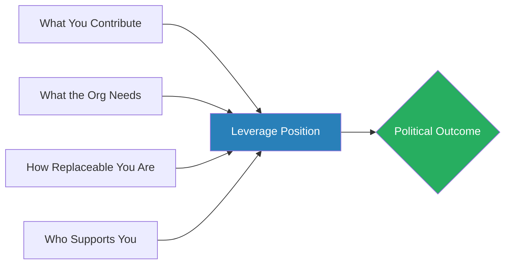
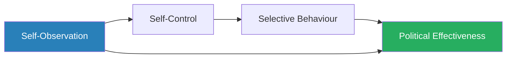
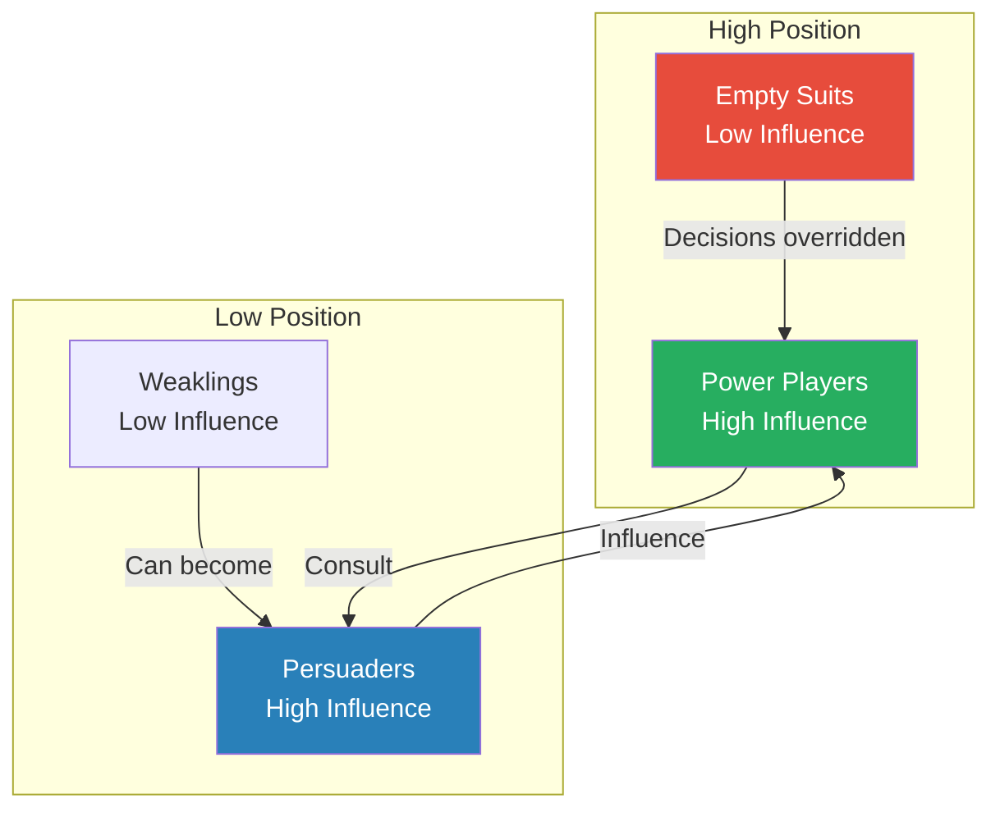
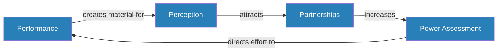
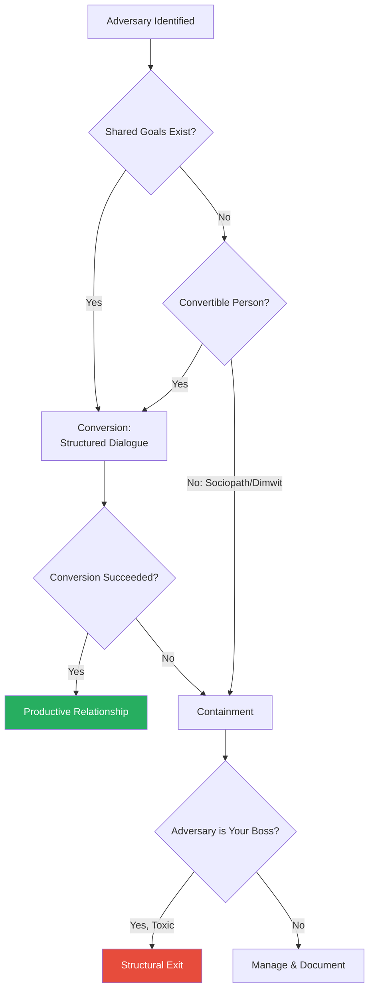

# Secrets to Winning at Office Politics — Marie G. McIntyre

> Marie McIntyre's core argument is that workplace politics is not scheming — it is the predictable result of people with different goals, interests, and personalities sharing an organisation. Political skill is learnable, not innate, and those who refuse to learn it do not escape politics — they simply lose at it. The book maps the political landscape through a series of interlocking frameworks: a taxonomy of political types, a leverage equation that replaces fairness with power as the operating variable, a four-pillar model of political effectiveness, a power grid for reading who actually matters, and a self-management triad that grounds all strategy in behavioural discipline. Drawing on over twenty years of executive coaching across corporate, government, and nonprofit sectors, McIntyre provides the vocabulary to diagnose political situations and the tools to navigate them — a practitioner's manual, not an academic text.

---

## About the Author

Marie G. McIntyre holds a Ph.D. in organisational psychology and spent over twenty years as an executive coach and HR director across corporate, government, and nonprofit sectors, including a Fortune 500 company. Her background gives the book a practitioner's eye rather than an academic's distance — every framework is grounded in decades of real coaching engagements. She is not a theorist constructing elegant models from survey data; she is someone who has sat across the desk from hundreds of people whose careers were in crisis and helped them understand what went wrong. This makes the book unusually concrete — nearly every principle comes with a named case study from her coaching files.

---

## The Big Idea

- Politics is not an optional game — it is the natural operating system of any organisation where people with different interests must cooperate
- The people who thrive are not the most ruthless or the most talented — they are the ones who learn to read the power landscape accurately and manage their own behaviour consciously

- McIntyre argues that most political failures are self-inflicted:
  - Uncontrolled emotions
  - Victim mentality
  - Self-centred goals
  - Foolish reactions to change
- These are not things that happen to people — they are behavioural choices, often made without realising it
- The person who explodes at their boss in a meeting chose emotional relief over strategic positioning
- The person who works eighty-hour weeks and wonders why they did not get promoted confused effort with visibility

---

- The antidote is a combination of three disciplines:
  - <b style="color: #2980b9">Leverage awareness</b> — understanding that political outcomes are determined by power positions, not by fairness
  - <b style="color: #2980b9">Self-management</b> — observing your own behaviour, controlling your impulses, and consciously selecting your actions
  - <b style="color: #2980b9">Strategic influence</b> — choosing the right approach for each person and situation rather than defaulting to whatever feels comfortable

- The book's deepest insight — and its most uncomfortable one — is that <b style="color: #27ae60">leverage, not fairness, determines outcomes</b>
- When you argue that something is unfair, you are making an emotional appeal to people who make structural decisions
- Worse, you are signalling weakness: the subtext of a fairness argument is "I lack the power to get what I want on other grounds"
- <b style="color: #e74c3c">The people who invest energy in building grievances rather than building leverage always lose</b>

---

## Key Concepts at a Glance

| Concept | One-line summary |
|---------|-----------------|
| **Four Political Types** | A 2x2 matrix (Winners, Martyrs, Sociopaths, Dimwits) classifying behaviour by impact on business and personal goals |
| **Leverage Equation** | Political outcomes are a function of contribution, organisational need, replaceability, and support |
| **The Four P's** | Performance, Perception, Partnerships, and Power Assessment as pillars of political power |
| **Power Grid** | Maps people by position level vs actual influence to reveal who really matters |
| **The Power Elite** | The senior-most Power Players whose values impose organisational culture from above |
| **Self-Management Triad** | Self-observation, self-control, and selective behaviour as the foundational political skill |
| **The Tipping Point** | The invisible threshold where a manager shifts from "help this person" to "remove this person" |
| **Influence Continuum** | A spectrum from Observe & Wait to Order & Act, with strategy selection as the key skill |
| **AMISH Model** | Awareness, Motivation, Identification, Substitution, Habit Replacement for behavioural rehabilitation |
| **Four Causes of Political Suicide** | Uncontrolled emotion, victim mentality, self-centred goals, and foolish reactions to change |
| **Work Categories** | Starmakers, Maintenance, Transparent Tasks, and Time Wasters — visibility intersecting with importance |
| **The ROI Mind-set** | Think of yourself as an investment the organisation made, then exceed the expected return |
| **"Act As If"** | Deliberately perform the behaviours of the role you want before you have it |
| **Full Circle Management** | Manage upward, lateral, and downward relationships simultaneously |

---

## Chapter 1: The Political Playing Field — The Four Political Types

*McIntyre demolishes the idea that politics is something a few schemers inflict on an otherwise fair workplace — and replaces it with a taxonomy that turns self-diagnosis into a practical skill.*

- Politics is the natural consequence of putting people with different goals, interests, and personalities into the same organisation and asking them to cooperate
- It is not a disease; it is the weather
- <b style="color: #e74c3c">Complaining about the weather does not make it stop raining</b>

- The centrepiece of the opening chapter is a taxonomy classifying workplace behaviour along two axes:
  - Whether a person's actions advance or damage **business goals**
  - Whether they advance or damage **personal goals**
- This produces four types:

| Type | Business Goals | Personal Goals | Core Pattern |
|------|---------------|----------------|--------------|
| **Winners** | Advance | Advance | Strategically generous — enlightened self-interest |
| **Martyrs** | Advance | Damage | Right results, zero political return |
| **Sociopaths** | Damage | Advance | Personal empires at the company's expense |
| **Dimwits** | Damage | Damage | Emotional reaction overrides strategic thinking |

---

### Winners

- Deliver results **and** ensure the right people know about it
- Build alliances that serve the organisation and themselves simultaneously
- Not altruistic — <b style="color: #27ae60">strategically generous</b>
- Understand that the most durable form of self-interest is enlightened self-interest: helping the organisation succeed in ways that make them visible and valuable

### Martyrs

- McIntyre identifies two varieties:
  - The <b style="color: #2980b9">Crusader</b> — someone who has identified a genuine problem and will not stop talking about it, even when their advocacy style has alienated everyone who might have helped
    - The crusader is often right, which makes their situation particularly tragic
    - Being correct about a problem is worthless if your method of communicating it ensures no one listens
  - The <b style="color: #2980b9">Doormat</b> — someone who works selflessly, never says no, picks up every unwanted task, and wonders why they were passed over
    - Confuses effort with visibility and sacrifice with value

> [!example] The Clean & Beautiful Director
> - A government programme director ran an award-winning programme that beautified his county
> - It won external recognition and demonstrably improved community satisfaction
> - Yet when asked whether the county manager — his ultimate boss — knew about these achievements, he admitted he had never once briefed the county manager on his results
> - His programme was invisible to the person who mattered most
> **The lesson:** Excellent results without visibility produce zero political return — a textbook Martyr.

---

### Sociopaths

- Advance personal goals while damaging the organisation's
- Take credit for others' work, shift blame, hoard information, build personal empires at the company's expense
- <b style="color: #e74c3c">Can thrive under weak oversight, but their position is structurally fragile</b> — when their patron falls or scrutiny arrives, they have no genuine achievements to fall back on

> [!example] Dave the CEO
> - Dave, a CEO, treated his company as a personal fiefdom
> - He hired friends, used company resources for personal projects, and systematically drove out anyone who challenged him
> - Dave succeeded for years because his board was inattentive and his inner circle was loyal
> - When results finally deteriorated enough to attract scrutiny, the collapse was swift
> **The lesson:** Sociopaths build on sand — weak oversight eventually gives way.

### Dimwits

- The name is deliberately provocative — McIntyre does not mean unintelligent
- She means driven by uncontrolled emotion
- They fight losing battles out of principle, alienate potential allies through carelessness, and let ego override strategic thinking

> [!example] Travis and the New Boss
> - Travis had thrived under his previous manager, but when a new one arrived with different expectations, he reacted with open hostility
> - He criticised the new boss's decisions in public, refused to adapt to new processes, and treated every change as a personal affront
> - He was fired within ninety days
> - Travis was not unintelligent — he was emotionally uncontrolled
> **The lesson:** Emotional uncontrol in a political environment is the fastest path to the exit.

> [!tip] Core Insight
> Most people are not pure types — they shift between modes depending on context, stress, and stakes. The taxonomy's real purpose is self-diagnosis: in any given situation, ask which type you are currently being.

---

## Chapter 2: Political Intelligence — Reading the Landscape

*McIntyre makes the case that political intelligence — reading who has power, who wants what, and how decisions actually get made — is a learnable skill, not a personality trait.*

- Many technically brilliant people fail politically not because they are incapable of reading situations, but because they have never been taught to look
- <b style="color: #2980b9">Political intelligence</b> is parallel to emotional intelligence: a form of perception developed through practice
- The politically intelligent person watches what happens after decisions are announced:
  - Who is pleased, who is upset, who was surprised
  - Who speaks first in meetings
  - Who the senior leader looks at when making a point
  - Who gets invited to the meetings that happen after the meeting

> [!example] Kyle the Software Engineer
> - Kyle was technically the strongest performer on his team but was repeatedly passed over for project leadership roles
> - His problem was not capability — he treated every interaction as a technical discussion and never noticed the political subtext
> - When his manager asked "What do you think about the new CTO's strategy?" Kyle offered a technical critique
> - What his manager was actually asking was "Are you aligned with the direction we are going?"
> - Kyle's honest technical answer was interpreted as resistance
> - He was reading the words; everyone else was reading the room
> **The lesson:** Political intelligence means hearing what is being asked, not just what is being said.

---

- Political situations have <b style="color: #2980b9">foreground and background layers</b>:
  - The **foreground** is the stated agenda — the meeting topic, the project plan, the reorganisation announcement
  - The **background** is everything else: who benefits, who loses, who was consulted, who was surprised, what this signals about future direction
- <b style="color: #e74c3c">Most political failures happen because people respond only to the foreground and are blindsided by the background</b>

> [!tip] Core Insight
> Every organisational communication has two layers. The politically intelligent person reads both — and responds to the one that actually matters.

---

## Chapter 3: Leverage — The Currency That Actually Matters

*McIntyre introduces the single most important idea in the book: the leverage equation, which reframes every political situation in terms of mechanics rather than morality.*

- <b style="color: #27ae60">Political power is a function of four variables</b>:
  - **What you contribute** — your skills, knowledge, track record
  - **What the organisation needs** — whether your contribution matches current priorities
  - **How replaceable you are** — the urgency your uniqueness creates
  - **Who supports you** — the institutional weight behind your position
- Every political situation can be analysed through this lens
- When you want something — a promotion, a budget, a project, a seat at a table — the question is not whether you deserve it
- The question is whether your leverage position makes it achievable

---

- The concept is clarifying because it reframes away from morality and toward mechanics:
  - "I deserve this promotion because I have worked harder than anyone" — a fairness argument
  - "I am the only person who can deliver this programme, and two other teams are trying to recruit me" — a leverage argument
  - The first makes an emotional appeal; the second changes the decision-maker's incentive structure

> [!example] Joanne and the Politician's Cousin
> - Joanne worked in a government agency and was furious that a less qualified colleague — a cousin of a local politician — had been hired into a role she wanted
> - She spent months building a case: compiled documentation, wrote formal complaints, lobbied anyone who would listen
> - Her arguments were correct — the hiring was objectively unfair
> - But correctness did not matter — the cousin had leverage (a family connection that made firing him politically expensive)
> - Joanne had fairness — a moral argument that made no structural difference
> - Years later, the cousin was still employed and Joanne had been labelled a troublemaker
> **The lesson:** Leverage, not fairness, determines outcomes.

---

- McIntyre distinguishes between <b style="color: #2980b9">current leverage</b> and <b style="color: #2980b9">potential leverage</b>:
  - **Current leverage** — your skills, relationships, and track record right now
  - **Potential leverage** — what you could build: new capabilities, new alliances, new visibility
- Leverage is dynamic — it shifts with management changes, reorganisations, market conditions, and the arrival or departure of key people
- The person who was irreplaceable last year may be redundant after a merger
- The person who had no leverage six months ago may suddenly have it after a competitor makes them an offer
- <b style="color: #27ae60">The strategic question is always: given your current leverage, what is the highest-return investment you can make to increase it?</b>

The four variables of the leverage equation feed into your overall leverage position, which determines political outcomes — not fairness, not talent, not effort alone.

> [!tip] Core Insight
> Before any political move, calculate your leverage. If it is insufficient, invest in building it before making the attempt.

---

## Chapter 4: The Four Causes of Political Suicide

*McIntyre argues that career destruction follows predictable patterns — and nearly all of them are self-inflicted.*

- She identifies four causes of what she calls <b style="color: #2980b9">political suicide</b> — the process by which talented people systematically destroy their own careers:

| Cause | Pattern | Core Error |
|-------|---------|------------|
| **Uncontrolled emotion** | Yelling, furious emails, visible sulking | Choosing short-term emotional relief over long-term positioning |
| **Victim mentality** | Helplessness narrative, "the system is rigged" | Self-fulfilling prophecy — the belief causes the behaviour |
| **Self-centred goals** | Taking credit, shifting blame, hoarding | Network of allies collapses to zero |
| **Foolish reactions to change** | Open resistance to new leadership or direction | Fighting the leverage equation |

---

### Uncontrolled Emotion

- The most common and most visible cause
- <b style="color: #e74c3c">The person who yells at their boss in a meeting is not unlucky — they are choosing short-term emotional relief over long-term strategic positioning</b>

> [!example] Brandon's Million-Dollar Outburst
> - Brandon, a manager, had periodic angry outbursts that had become legendary in his organisation
> - He was talented and hardworking, but his temper had created a reputation that preceded him into every interaction
> - What Brandon did not know — what he could not know, because no one would tell him — was that a potential business partner had witnessed one of his outbursts
> - The partner subsequently refused to do business with Brandon's division
> - The partnership would have been worth millions
> **The lesson:** Anger does not just damage your career — it destroys opportunities you never even knew existed.

### Victim Mentality

- Subtler than anger but equally destructive
- The victim creates a narrative in which they are helpless, circumstances are against them, and the system is rigged

> [!example] Dorothy's Downward Spiral
> - Dorothy entered a negative spiral after a difficult performance review
> - Her response was not to change her behaviour but to decide that her manager was biased, her colleagues were conspiring, and the organisation was fundamentally unfair
> - The more she told herself this story, the more her behaviour confirmed it — she became withdrawn, passive-aggressive, and openly bitter
> - Her colleagues, who had initially been sympathetic, gradually distanced themselves
> - The victim narrative became self-fulfilling
> **The lesson:** The belief that you are being mistreated causes you to act in ways that genuinely make people want to avoid you.

---

### Self-Centred Goals

- This is the Sociopath pattern — pursuing personal advantage at the organisation's expense
- McIntyre distinguishes between healthy ambition (advancing yourself while delivering value) and toxic self-interest (advancing yourself at others' expense)
- The self-centred person may succeed in the short term, but their network of allies eventually collapses to zero because everyone learns the relationship is one-directional

### Foolish Reactions to Change

- Particularly relevant during reorganisations, leadership transitions, and strategic pivots

> [!example] Debbie's Resistance Coalition
> - Debbie had been a star performer under one CEO
> - When a new CEO arrived with a radically different management style, Debbie decided the new approach was wrong
> - Rather than adapting, she dug in — openly defending the old ways, criticising the new direction, and building a coalition of resistance
> - What Debbie failed to understand was the leverage equation: the new CEO had all the power
> - Debbie's resistance was not courageous opposition — it was career suicide
> - Within a year, everyone in her resistance coalition had either been marginalised or had left
> **The lesson:** When the leverage equation is overwhelmingly against you, resistance is not courage — it is self-destruction.

> [!tip] Core Insight
> The common thread across all four causes is the same: the person substitutes emotional reaction for strategic thinking, sacrificing long-term goals for short-term emotional relief. The politically intelligent person feels the same emotions but channels them into strategic action.

---

## Chapter 5: Self-Management — The Foundation of Everything

*McIntyre argues that influence over others begins with control of your own behaviour — and introduces the foundational skill without which all political knowledge is useless.*

- The <b style="color: #2980b9">self-management triad</b> has three components:

The triad is sequential: you must first see your behaviour clearly, then restrain unhelpful impulses, then consciously choose the most effective action for each situation.

---

### Self-Observation

- The ability to monitor your own behaviour and its impact on others in real time
- Most people have a significant gap between how they think they come across and how they actually come across

> [!example] Carlton's Invisible Arrogance
> - Carlton, a senior manager, had a habit of appearing lost in thought during conversations
> - In his own mind, he was thinking deeply about what the other person was saying
> - To everyone else, he looked arrogant, disengaged, and dismissive
> - Carlton did not have an attitude problem — he had a self-observation problem
> - He had no idea how his behaviour was being read
> **The lesson:** The gap between intention and perception is the central problem self-observation solves.

- <b style="color: #27ae60">"People assess you solely on observable behaviour, not internal states"</b> is one of the book's most important sentences
- Your intentions are invisible
- Your behaviour is the only data other people have

---

### Self-Control

- The ability to restrain unhelpful impulses before they become visible actions

> [!example] Eileen's Cafeteria Confession
> - Eileen was sitting in her company's cafeteria when a colleague asked how things were going
> - Frustrated with her boss, Eileen launched into a detailed critique — naming names, describing specific failures, questioning competence
> - She felt better after venting
> - Three days later, her boss called her into a meeting — every word Eileen had said had been relayed verbatim
> - The organisational grapevine is faster and less accurate than anyone believes
> **The lesson:** A moment of emotional relief can cost months of accumulated goodwill.

### Selective Behaviour

- The ability to consciously choose what to do rather than defaulting to your comfortable pattern
- This is where self-management becomes **strategic** rather than merely defensive
- Most people have a limited behavioural repertoire — a set of responses they use regardless of whether those responses are effective:
  - The naturally aggressive person uses aggression in meetings, emails, hallway conversations, and one-on-ones
  - The naturally accommodating person accommodates in every direction
- <b style="color: #27ae60">The key question before every significant interaction: "What behaviour will be most effective here?" rather than "What behaviour feels most natural?"</b>

---

### The AMISH Behaviour Change Model

*When political damage has already been done, McIntyre prescribes rehabilitation through five steps.*

> [!abstract] The AMISH Model
> 1. **Awareness** — recognise the problem (often the hardest step, because most political damage is invisible to the person causing it)
> 2. **Motivation** — genuinely want to change (not just accept that others find you difficult)
> 3. **Identification** — pinpoint the specific behaviours that need to stop ("I need to stop interrupting people in meetings" not "I need to be less aggressive")
> 4. **Substitution** — choose specific replacement behaviours ("When criticised, I will say 'tell me more about that' instead of explaining why I am right")
> 5. **Habit Replacement** — practise until the new behaviour is automatic (perception change always lags behaviour change)

> [!example] Randall the Micromanager
> - Randall's team was on the verge of mass resignation
> - He believed he was being thorough and detail-oriented
> - His team believed he was controlling and distrustful
> - Until a blunt 360-degree feedback session forced the data into his awareness, Randall genuinely did not know he had a problem
> **The lesson:** Awareness is the first and hardest step — most people cannot see their own political damage.

- McIntyre's critical insight about substitution:
  - <b style="color: #e74c3c">Stopping a behaviour is nearly impossible unless you replace it with something</b>
  - "I will stop being defensive when criticised" fails — it gives the brain nothing to do
  - "When criticised, I will say 'tell me more about that'" succeeds — it provides a specific alternative action
- Perception change always lags behaviour change — even after you have genuinely changed, people will continue seeing the old you for weeks or months
- This is dispiriting but predictable, and the only answer is patience

---

### The Tipping Point

*One of the book's most valuable concepts — the invisible threshold that, once crossed, is nearly impossible to reverse.*

- The <b style="color: #2980b9">tipping point</b> is the specific moment when a manager's thinking shifts from "how do I help this person?" to "how do I get rid of this person?"
- This moment is often invisible to the person experiencing it
- Once crossed, confirmation bias takes over: the manager unconsciously collects evidence supporting the negative conclusion and dismisses evidence that contradicts it

| Level | Manager's State | What They Do | What You See |
|-------|----------------|--------------|--------------|
| **Level 1** | Mild irritation | Notices the problem, compensates, covers for you with higher-ups | Often nothing — the manager absorbs the cost silently |
| **Level 2** | Active frustration | Stopped covering, started documenting, discussing with HR | Increased scrutiny (often misread as micromanagement) |
| **Level 3** | The decision | Engineering an exit — paper trail, restricted opportunities, waiting for restructuring | By the time you see it, recovery is almost impossible |

- <b style="color: #e74c3c">Recovery from Level 3 is almost impossible</b> — the only realistic option is structural change: a new manager, a new team, or a new organisation

> [!tip] Core Insight
> The tipping point is crossed silently. If you sense increased scrutiny from your manager, treat it as a Level 2 danger signal — not micromanagement — and change your behaviour immediately.

---

## Chapter 6: The Leverage Equation in Practice

*Building on Chapter 3's theory, McIntyre walks through extended case studies showing how to apply leverage analysis in concrete situations.*

- Leverage has multiple dimensions, and strengthening any single dimension can shift the overall equation

- <b style="color: #2980b9">What you contribute</b> is the most obvious dimension — skills, knowledge, track record
  - But McIntyre warns against overweighting this
  - Many talented people assume superior contribution automatically creates leverage — it does not
  - <b style="color: #e74c3c">Contribution only creates leverage when it is visible, valued, and difficult to replace</b>

- <b style="color: #2980b9">What the organisation needs</b> is the dimension most people ignore
  - Your contribution matters only insofar as it matches what the organisation currently values

> [!example] Greg the Tax Specialist
> - Greg began his career doing routine tax compliance work — competent but unremarkable, one of several people who could do the same job
> - Then Greg began studying the strategic implications of tax policy for his company's business decisions
> - He repositioned himself from compliance technician to strategic tax advisor
> - His skills had not changed dramatically, but the perceived value of his contribution had
> - He aligned it with something the organisation needed but did not know it needed
> **The lesson:** Repositioning your contribution to match unmet organisational needs multiplies leverage without requiring new skills.

---

- <b style="color: #2980b9">How replaceable you are</b> is the dimension that creates urgency
  - If you are easy to replace, your leverage is low regardless of your contribution
  - Anything that makes you uniquely difficult to replace increases your leverage disproportionately

- <b style="color: #2980b9">Who supports you</b> is the dimension that converts individual leverage into institutional leverage
  - A strong performance record means little if no one in a position of power will advocate for you
  - McIntyre distinguishes between three levels of support:

| Level | Role | What They Do |
|-------|------|--------------|
| **Ally** | Passive supporter | Speaks well of you when asked |
| **Advocate** | Active supporter | Proactively champions you in conversations |
| **Sponsor** | Committed backer | Puts their own reputation on the line for your advancement |

- <b style="color: #27ae60">The progression from ally to advocate to sponsor is the most important relationship-building investment a person can make</b>

> [!tip] Core Insight
> Leverage is dynamic. Continuously recalculate your position and identify the single highest-return investment you can make to shift it in your favour.

---

## Chapter 7: The Power Grid — Mapping Who Actually Matters

*McIntyre reveals that most people navigate by the org chart — which shows formal reporting — when they should be navigating by the power grid, which shows who actually influences decisions.*

- The <b style="color: #2980b9">Power Grid</b> has two dimensions:
  - **Level of Position** — high or low in the hierarchy
  - **Degree of Influence** — high or low over actual outcomes

| Category | Position | Influence | Key Characteristics |
|----------|----------|-----------|-------------------|
| **Power Players** | High | High | Hold formal authority and wield actual influence |
| **Empty Suits** | High | Low | Impressive titles, minimal sway over decisions |
| **Persuaders** | Low | High | Opinion leaders, trusted advisors consulted informally |
| **Weaklings** | Low | Low | Competent but politically invisible |

The Power Grid reveals that position alone is a poor proxy for power — Persuaders with low titles often have more influence than Empty Suits with impressive ones.

---

### The Power Elite

- At the extreme end of Power Players sit the <b style="color: #2980b9">Power Elite</b> — the senior-most executives whose personal values, beliefs, and preferences determine organisational culture
- McIntyre makes a startling claim: <b style="color: #27ae60">"Culture is not democratic — it is imposed from above"</b>
- Culture is the emergent pattern of what the most powerful people reward, tolerate, and punish
- Anyone who wants to succeed must understand and adapt to the culture the Power Elite establish, regardless of whether they agree with it

> [!example] The CEO Transition
> - Under the old CEO, the culture was consensus-driven, collegial, and slow-moving
> - Under the new CEO, it became performance-driven, competitive, and fast
> - The change happened not through gradual cultural evolution but through a single person replacing the reward and punishment structures
> - People who had thrived under the old culture suddenly found themselves struggling — not because their skills had changed but because the definition of success had
> - Those who adapted quickly survived; those who clung to the old ways were gradually marginalised
> **The lesson:** When the Power Elite changes, the definition of success changes with it — adapt or be marginalised.

---

### Empty Suits, Persuaders, and Weaklings

- **Empty Suits** are dangerous to misidentify — investing heavily in a relationship with someone you believe to be a Power Player, only to discover they are an Empty Suit, wastes political capital
- Warning signs of an Empty Suit:
  - Decisions routinely overridden by others
  - Track record of reorganisations that always diminish their scope
  - Tendency to speak confidently about plans that never materialise

- **Persuaders** are the opinion leaders, trusted advisors, and people Power Players consult informally before making decisions
  - Often have expertise, institutional memory, or personal relationships giving them outsized influence despite modest titles
  - <b style="color: #27ae60">Identifying Persuaders is one of the highest-return political activities available</b> — influencing a Persuader often gives indirect access to Power Players you could not reach directly

- **Weaklings** are competent but politically invisible
  - Many could become Persuaders if they invested in visibility and relationships
  - They choose not to — either because they do not understand the game or find it distasteful

---

### Reading the Power Elite's Culture

- The stated values of an organisation — posted on the website, printed on posters — are often different from the actual values, which are revealed by behaviour
- Diagnostic questions:
  - Who gets promoted? What do they have in common?
  - Who gets the best assignments, the most resources, the most airtime with senior leadership?
  - What kind of behaviour is celebrated in meetings, in all-hands, in performance reviews?
  - What kind of behaviour is tolerated that should not be?
  - What kind of behaviour is punished that should not be?

> [!example] Diana the Project Manager
> - Diana was brought in to implement strict scheduling discipline in an engineering organisation
> - She was good at her job — enforced deadlines, tracked progress, held people accountable
> - But the Power Elite valued technical creativity over process discipline
> - Engineers who missed deadlines but produced innovative solutions were celebrated
> - Project managers who enforced deadlines were seen as bureaucratic obstacles
> - Diana's skills were genuine, but misaligned with what the Power Elite valued
> - She fought the culture and lost
> **The lesson:** Being right does not matter when the Power Elite disagrees — alignment with their values is the prerequisite for influence.

> [!tip] Core Insight
> Navigate by the power grid, not the org chart. The real decision-makers are often not the people with the biggest titles.

---

## Chapter 8: The Four P's of Political Power

*McIntyre's most integrated framework — the model she returns to throughout the rest of the book, where weakness in any one component undermines all the others.*

The Four P's form a virtuous cycle — each component feeds the next. McIntyre recommends periodic self-audit across all four, with focused effort directed at whichever P is currently weakest.

---

### Performance

- Performance is the foundation — delivering results that the organisation values
- Without performance, nothing else matters
- But McIntyre is emphatic that <b style="color: #e74c3c">performance alone is never sufficient</b>
- <b style="color: #27ae60">"Invisible contributions have no political value"</b>
- The person who works brilliantly behind the scenes, expecting results to speak for themselves, has misunderstood how organisations work
- Results do not speak — people speak about results, and only if they know those results exist

### Perception

- Perception is the mechanism through which results become leverage
- McIntyre introduces a categorisation of work that explains why some people get promoted despite modest output while others are overlooked despite heroic effort:

| Work Category | Visibility | Importance | Political Value |
|--------------|-----------|------------|-----------------|
| **Starmakers** | High | High | Fastest path to recognition |
| **Maintenance** | Low | High | Most valuable, least rewarded |
| **Transparent Tasks** | High | Low | Busyness without substance |
| **Time Wasters** | Low | Low | Political black holes |

---

> [!example] Gayle — Strong Performance, Catastrophic Perception
> - Gayle was a high-performing employee who was universally disliked
> - Her work was excellent, but her interpersonal style was abrasive — she criticised colleagues publicly, dismissed ideas dismissively, and treated every interaction as a competition
> - Her Four P's were severely imbalanced: strong Performance, catastrophic Perception
> - Her results were genuinely good, but no one wanted to work with her, no one advocated for her, and her reputation preceded her into every meeting
> **The lesson:** Performance without perception is invisible; perception without collegiality is toxic.

> [!example] The Burning-House Metaphor
> - Imagine you rush into a burning building and rescue a child
> - If the fire happens on a deserted street at 3am with no witnesses, your heroism has no political value
> - If the same fire happens on the main street at noon with news cameras rolling, your heroism makes you a local celebrity
> - The act is identical — the visibility is what determines the outcome
> **The lesson:** This is not cynical; it is mechanical. Decision-makers cannot reward what they do not know about.

---

### Partnerships

- Partnerships are the alliance network that converts individual effectiveness into institutional support
- Political power is never a solo enterprise
- The right partnerships provide three things:
  - An **early warning system** — someone tells you about the reorganisation before it is announced
  - An **endorsement network** — someone speaks well of you in rooms you are not in
  - **Collaborative leverage** — your combined capabilities make you more valuable than either would be alone

- McIntyre distinguishes between networking (collecting contacts) and partnership-building (creating genuine mutual value)
- <b style="color: #e74c3c">Collecting business cards and LinkedIn connections is not political power</b>
- Real partnerships are built by helping other people succeed in ways that also serve your interests — the Winner pattern of strategic generosity

### Power Assessment

- The ability to accurately read the leverage landscape — who has power, who wants what, who blocks whom, and where the decision actually gets made
- Without accurate power assessment, you may be performing brilliantly and building partnerships — but in entirely the wrong direction

> [!example] The Wrong Target
> - A manager spent months cultivating a relationship with a senior vice president he believed was the key decision-maker for his promotion
> - He eventually learned the SVP was an Empty Suit — impressive title, minimal actual influence
> - The real decision was being made by a director two levels below the SVP who happened to be the CEO's most trusted advisor
> - Months of political investment had been directed at the wrong target because the power assessment was wrong
> **The lesson:** Accurate power assessment is the compass — without it, effort flows to the wrong targets.

> [!tip] Core Insight
> Periodically audit yourself across all Four P's. Identify which one is currently weakest, and direct your effort there — the weakest P is the bottleneck limiting all the others.

---

## Chapter 9: The Influence Continuum

*McIntyre addresses how to actually influence people — and reveals that most failures come not from choosing the wrong argument but from defaulting to the wrong strategy on the continuum.*

- Her model is a spectrum arranged from most indirect to most direct:

| Strategy | Approach | When to Use |
|----------|----------|-------------|
| **Observe & Wait** | Watch, gather information, time your intervention | When you lack information or the situation is still developing |
| **Ask & Listen** | Understand the other person's perspective before attempting to change it | When you do not yet know their goals and concerns |
| **Persuade & Convince** | Make the case using logic, data, and emotional appeal | When you have enough information and a clear argument |
| **Order & Act** | Use formal authority to make something happen | When you have the authority and the cost of delay outweighs the cost of compliance without commitment |

---

> [!example] Art the Salesman
> - Art's boss consistently rejected his proposals
> - Art's default strategy was direct persuasion — presenting his case with increasing urgency and frustration each time it was rejected
> - McIntyre coached Art to try Ask & Listen: instead of presenting his idea again, ask his boss what he was trying to achieve and what his concerns were
> - Art discovered the resistance was not about his proposal but about a budget constraint he had not known about
> - Once he restructured his proposal to address the budget concern, it was approved immediately
> - The problem had never been Art's idea — it had been Art's influence strategy
> **The lesson:** When persuasion fails, the answer is rarely to persuade harder — it is to shift strategy.

- The chapter's central insight:
  - <b style="color: #e74c3c">Most people default to one position on the continuum and overuse it</b>
  - The naturally aggressive person jumps to Persuade & Convince before gathering enough information
  - The naturally accommodating person stays at Observe & Wait long past the point where action is needed
  - The key skill is not having a favourite strategy but selecting the right one for each situation
- <b style="color: #27ae60">"Repeating a failed influence strategy louder does not make it work"</b>
- When an influence attempt fails, the correct response is to shift along the continuum — not to repeat the same approach with more intensity

---

> [!example] Vivian and the Garage
> - Vivian wanted her husband to clean out the garage
> - She tried asking, then persuading, then demanding — nothing worked
> - Finally she hired someone to clean the garage herself
> - The strategy shift was not along the continuum but off it entirely — solving the problem through a different channel
> **The lesson:** When the frontal approach is not working, flanking is not giving up — it is adapting.

### Goal-Aligned Framing

- <b style="color: #2980b9">Goal-aligned framing</b> is the art of presenting requests in terms of the other person's goals rather than your own
- Decision-makers evaluate requests through the filter of their own pressures and incentives
- A request that maps to their priorities feels like a solution; one that only serves your interests feels like a demand

> [!example] Darren's Germany Transfer
> - Darren wanted a transfer to his company's Germany office
> - His first attempt was self-centred: "I have always wanted to work in Europe, I speak German, this would be great for my career"
> - His boss was unmoved
> - McIntyre coached Darren to reframe in terms of his boss's priorities: "The Germany office is struggling with integration. I have the technical expertise they need, I speak the language, and I could accelerate the timeline by two months"
> - The second version addressed the boss's problem, not Darren's desire — it was approved
> **The lesson:** The substance was the same; the framing was everything.

> [!tip] Core Insight
> Before any influence attempt, ask: "What does this person need?" Frame your request as a solution to their problem, not an expression of your desire.

---

## Chapter 10: Managing Your Boss — The Highest-Leverage Relationship

*McIntyre argues that your direct manager — regardless of their competence, character, or fairness — has disproportionate control over your daily experience, your organisational perception, and your career trajectory.*

- This is not because managers are more important than other people — it is because the structure of organisations gives them outsized influence over:
  - Information flow
  - Meeting access
  - Project assignment
  - Performance evaluation
  - The narrative about you that reaches higher levels

- A **supportive manager** amplifies your contributions:
  - Mentions your work in meetings you are not in
  - Gives you assignments that build skills and visibility
  - Frames your occasional failures as learning experiences
- An **indifferent or hostile manager** buries your contributions:
  - Your work is presented as team output with no individual credit
  - Your assignments are routine and invisible
  - Your occasional failures are catalogued as evidence of inadequacy

---

> [!abstract] McIntyre's Boss Management Principles
> 1. **Study your manager's style, goals, and hot buttons** — communication format preferences, decision timing, information flow expectations
> 2. **Frame requests in terms of what helps them succeed** — your manager is solving their own problems; when your request is also a solution to one of their problems, the decision is easy
> 3. **Never complain about your boss to anyone who could relay it** — within the organisation, every word is potentially public
> 4. **Manage the full circle** — invest deliberately in upward, lateral, and downward relationships simultaneously

### Full Circle Management

- Most people have a natural preference for one direction of influence — upward, lateral, or downward — and underperform in the others

> [!example] Kate — The Full Circle Manager
> - Kate, an HR manager, was respected equally by her boss, her peers, and her team
> - Her secret was not charisma — it was deliberate attention to all three directions
> - She invested time in understanding her boss's priorities (upward), helping her peer managers succeed (lateral), and developing her team members' careers (downward)
> - The result was endorsement from multiple directions — which is what promotion decisions actually require
> **The lesson:** Political power requires endorsement from all directions, not just one.

---

- McIntyre contrasts Kate with three people who each failed in one direction:

| Person | Weak Direction | Pattern | Consequence |
|--------|---------------|---------|-------------|
| **Chris** | Upward | Challenged his boss publicly, resisted directives, treated management requests as impositions | Strong laterally and downward, blocked by rebellious upward relationship |
| **Tonya** | Lateral | Hoarded information, refused to collaborate, treated peer interactions as competition | Strong upward and downward, isolated by uncooperative lateral behaviour |
| **Nell** | Downward | Avoided difficult conversations, let performance problems fester, prioritised being liked | Strong upward and laterally, undermined by weak team management |

- Each was strong in the other two directions
- <b style="color: #e74c3c">Each was held back by the one they neglected</b>

---

### The ROI Mind-set

- <b style="color: #2980b9">The ROI mind-set</b> is a reframing McIntyre returns to throughout the rest of the book:
  - Think of yourself as an investment the organisation made
  - Management created your position and hired you for specific reasons
  - Understanding those reasons — even when never explicitly articulated — reveals hidden expectations
  - Exceeding those expectations generates leverage because you become more valuable than anticipated
- Greg the tax specialist is the example she returns to — he went from basic compliance (the expected return) to strategic tax advisory (an unexpected and highly valued return)
- <b style="color: #27ae60">The shift from "doing my job" to "exceeding the investment" is the shift from Maintenance work to Starmaker work</b>

### "Act As If"

- The idea that you do not need to feel confident, qualified, or comfortable to act that way
- Deliberately performing the behaviours of the role you want shapes others' perception — and eventually shapes your own self-concept

> [!example] McIntyre's Own "Act As If" Moment
> - As a young professional, McIntyre was promoted into a role she felt utterly unqualified for
> - Her coping strategy was to study her former boss — a woman she admired — and deliberately mimic her meeting facilitation style, communication approach, and decision-making cadence
> - She did not feel like a leader; she was acting as if she were one
> - Within months, the gap between the act and the reality had narrowed
> - The behaviour she was performing had become the behaviour she was practising
> **The lesson:** "The mask of competence, worn long enough, becomes competence."

- McIntyre distinguishes "Act As If" from fraud:
  - The principle applies to style, confidence, and communication — not to expertise
  - <b style="color: #e74c3c">Faking knowledge you do not have is transparent and counterproductive</b>
  - But adopting the behavioural posture of the role you are growing into, when genuine underlying competence exists, is not dishonesty — it is deliberate development

> [!tip] Core Insight
> Your direct manager is the highest-leverage relationship in your career. Study them, serve their goals, and manage the full circle — upward, lateral, and downward — simultaneously.

---

## Chapter 11: Adversary Management — Converting, Containing, and Escaping

*McIntyre distinguishes between different kinds of difficult workplace relationships and prescribes different approaches for each — with a key principle: attempt conversion before escalation.*

McIntyre's adversary management follows a clear decision tree: convert first, contain if conversion fails, and exit when the adversary is a toxic boss.

---

### Conversion: Finding Shared Goals

- McIntyre's first move with any adversary is to look for shared objectives
- Most workplace conflicts arise not from genuinely opposed interests but from different approaches to shared goals
- Two people who both want the project to succeed but disagree about methodology are not enemies — they are collaborators who have not yet found their common ground

> [!abstract] Adversary Conversion Format
> 1. **Define shared objectives** — what do we both want?
> 2. **Share perspectives without debating** — each person explains their view while the other listens
> 3. **Identify mutual assistance strategies** — how can we help each other?

> [!example] Warren and Carolyn's Toxic Dynamic
> - Two managers in the same organisation had developed a toxic adversarial dynamic
> - Each believed the other was undermining their department; each had built a narrative of victimhood and hostility
> - McIntyre coached them through the structured conversation format
> - Their conflict was not about opposing goals — both wanted their departments to succeed and their CEO to be satisfied
> - The real issue was perceived resource competition: each believed the other was getting more than their fair share
> - Once shared goals were made explicit and resource perceptions discussed openly, the adversarial dynamic dissolved
> - They did not become friends — but they stopped being enemies, which was enough
> **The lesson:** Most adversarial dynamics dissolve when shared goals are made explicit and perceptions are discussed openly.

---

### Containment: When Conversion Fails

- When conversion fails, the next strategy is containment:
  - Limit your exposure to the adversary
  - Manage interactions structurally rather than personally
  - Document patterns of problematic behaviour
- Containment is not about winning — it is about preventing further damage

- <b style="color: #27ae60">Escalation to management must be framed in business terms, not personal grievance</b>:
  - "I find this person difficult to work with" — a personal complaint
  - "This person's behaviour is affecting project deliverables" — a business case
  - The difference matters enormously because managers evaluate through their own lens: is this a problem I need to solve, or is this two people being immature?

### The Unconvertible

- Some adversaries cannot be converted:
  - **Dimwits and Sociopaths** — their behaviour is not goal-directed in the way the conversion framework assumes
  - **Structurally competitive situations** — two people vying for one promotion, two departments competing for the same budget
- In genuinely competitive situations, interests are structurally opposed
- <b style="color: #2980b9">The adversarial dynamic is a feature of the situation, not a bug in the relationship</b>
- McIntyre advises honest acknowledgment of the competition combined with maintained professionalism — you can compete without becoming enemies if both parties treat the competition as structural rather than personal

---

### When the Problem is Your Boss

- When the adversary is your manager — the person with the most structural power over your daily life — McIntyre's advice is notably pragmatic
- She distinguishes between:
  - A **difficult boss** — challenging but functional, with whom a productive relationship can be built (requires adaptation)
  - A **toxic boss** — someone whose behaviour is damaging regardless of how you respond (requires exit)
- <b style="color: #e74c3c">"Do not confuse managing your boss with tolerating abuse"</b>
- If the boss is genuinely toxic, the correct move is structural change: a new reporting line, a new team, or a new organisation

> [!tip] Core Insight
> Attempt conversion before escalation. But recognise when conversion is impossible — Sociopaths, Dimwits, and structurally competitive adversaries require containment or exit, not dialogue.

---

## Chapter 12: Managing Change and Transitions

*McIntyre addresses the most politically volatile situations — reorganisations, new leadership, strategic pivots — and shows how change creates political opportunity for those who adapt and destruction for those who resist.*

- When an organisation is in flux, the power grid is being redrawn:
  - Old alliances may lose value
  - New ones may become critical
  - People who read the new landscape accurately gain ground
  - People who cling to the old map lose it

> [!example] Jeff's Narrow Escape
> - Jeff's new boss had a dramatically different management style from his previous one
> - Jeff's initial reaction was resistance — he argued the old way was better, dragged his feet on new initiatives, and made it clear through body language and tone that he did not respect the new direction
> - McIntyre coached Jeff to recognise that his resistance was not principled opposition — it was emotional reaction to loss of comfort
> - The new boss's approach was not objectively worse; it was different
> - Jeff's job was not to evaluate whether the change was right but to adapt to the reality that it had happened
> - Once Jeff shifted from resistance to adaptation, his relationship with his new boss improved dramatically
> - The boss, who had been on the verge of labelling Jeff as "The Problem," pulled back
> - Jeff's tipping point was narrowly averted — not by arguing his case but by changing his behaviour
> **The lesson:** Adapting to change is not surrender — it is the only politically viable response when the leverage equation is against you.

---

- McIntyre also discusses the specific dynamics of **mergers and acquisitions**, where two cultures collide:
  - The "winning" culture usually absorbs the "losing" one
  - Her advice for people on the losing side is uncomfortable but clear:
    - Identify the new Power Elite as quickly as possible
    - Understand what they value
    - Demonstrate that you can deliver in their terms
  - <b style="color: #e74c3c">Loyalty to the old culture is admirable but politically futile</b>
  - The new culture is the only reality that matters

> [!tip] Core Insight
> Change creates political opportunity for those who adapt and political destruction for those who resist. When the power grid is being redrawn, read the new landscape immediately.

---

## Key Quotes

- "Leverage, not fairness, determines outcomes."
- "Invisible contributions have no political value."
- "People assess you solely on observable behaviour, not internal states."
- "Stopping a behaviour requires substituting a specific alternative."
- "Repeating a failed influence strategy louder does not make it work."
- "Culture is not democratic — it is imposed from above."
- "Do not confuse managing your boss with tolerating abuse."
- "The mask of competence, worn long enough, becomes competence."

---

## The Verdict

*Secrets to Winning at Office Politics* is a strong foundational text for anyone navigating organisational power dynamics. Its greatest contribution is the <b style="color: #2980b9">leverage equation</b> — the reframing of every political situation in terms of power rather than fairness. This single idea, fully absorbed, inoculates the reader against one of the most common and most costly political mistakes: spending energy on arguments about what they deserve rather than actions that increase what they can command. The <b style="color: #2980b9">Four P's</b> framework (Performance, Perception, Partnerships, Power Assessment) provides an unusually clear audit tool — most people can immediately identify which P is their weakest and where their effort should be directed. And the <b style="color: #2980b9">self-management triad</b> (self-observation, self-control, selective behaviour) grounds all political strategy in the practical discipline of behavioural awareness, which is where most politically naive people need to start.

The book's limitations are real, however, and worth stating plainly. McIntyre provides almost no discussion of structural power — race, gender, class — and treats "adapt to the Power Elite's culture" as universal advice without examining what happens when that culture is built on exclusion. The case studies are exclusively American, and cultural context matters enormously for influence strategies; what works in an individualistic US corporate culture may not transfer to relationship-dense, hierarchical cultures elsewhere. The adversary management advice tends to assume that most adversaries are convertible, underestimating situations where opposition is structural rather than interpersonal — where someone blocks you not because of a communication failure but because the system incentivises them to. And the self-management framework, taken too literally, risks emotional suppression rather than emotional discipline: anger at genuine injustice is a valid signal about the environment, not just a feeling to be managed away.

The book's ceiling is moderate for readers who already understand power dynamics. There is little here that will surprise someone who has read Robert Greene, or who has already learned through painful experience that organisations are not meritocracies. But for readers who have been operating on talent and fairness alone — people who are excellent at their jobs and bewildered by why excellence has not been enough — this book provides the missing political vocabulary and a clear path from naive meritocrat to informed operator. It is a map of the playing field for people who did not realise they were on one.

For those who already see the board, the Four P's audit and the influence continuum are the most durable tools. The rest is foundational material that more advanced readers may absorb quickly but should not dismiss — revisiting fundamentals often reveals gaps that sophistication has papered over.

**Rating:** 7/10 — strong fundamentals, limited ceiling for advanced players.

---

## Related Reading

- [[The 48 Laws of Power - Robert Greene|The 48 Laws of Power]] — the comprehensive tactical manual for power; where McIntyre is a workplace coach, Greene is the grand strategist
- [[Fierce Conversations - Susan Scott|Fierce Conversations]] — complements McIntyre's influence continuum with deeper frameworks for difficult workplace conversations
- [[Never Split the Difference - Chris Voss|Never Split the Difference]] — extends the leverage and influence principles into high-stakes negotiation tactics
- [[cialdini_influence|Influence]] — the psychological science behind why McIntyre's influence strategies work
- [[The First 90 Days - Michael D. Watkins|The First 90 Days]] — applies many of McIntyre's principles specifically to leadership transitions and new roles
