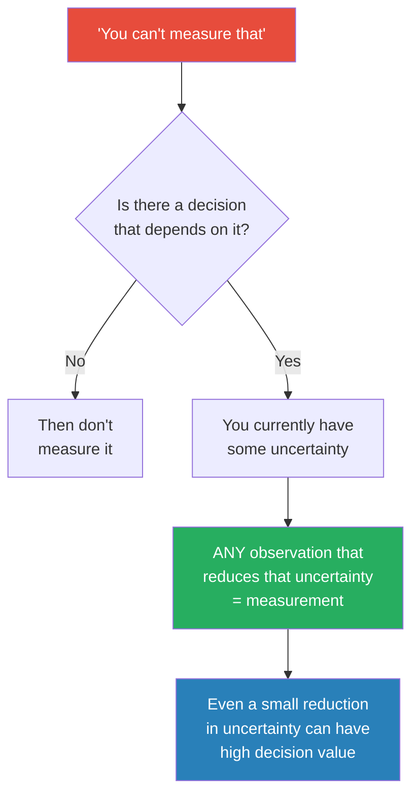

# How to Measure Anything — Douglas W. Hubbard

> Douglas Hubbard's core provocation is this: when someone says "you can't measure that," what they really mean is "I don't know how to measure that."
> Everything is measurable — not in the sense of pinpointing an exact number, but in the sense of reducing your uncertainty about it.
> If you knew absolutely nothing about employee morale and now you know it's somewhere between 3 and 8 on a 10-point scale, you've measured it.
> The book provides a systematic framework — Applied Information Economics — for identifying what to measure, how much measurement is worthwhile, and how to make better decisions even with imperfect data.
> It is the antidote to both gut-feeling management and analysis paralysis.

---

## About the Author

Douglas Hubbard is a management consultant and the inventor of the Applied Information Economics (AIE) framework.
He has consulted for the US Department of Defense, NASA, major banks, and dozens of Fortune 500 companies on how to quantify "intangible" risks and values.
His background is in quantitative decision analysis, and his mission is to destroy the myth that certain important things can't be measured.

---

## The Big Idea

- <b style="color: #2980b9">Measurement = an observation that quantitatively reduces uncertainty</b> — it does not mean "exact number"
- If you care enough about something to make a decision about it, you care enough to measure it
- The things organisations claim are "immeasurable" (morale, brand value, cybersecurity risk) are often the things that matter most
- <b style="color: #27ae60">You don't need perfect precision — you need less uncertainty than you had before</b>
- Most organisations measure the wrong things: they over-invest in easy metrics and ignore the uncertain variables that actually drive decisions

---

## Key Concepts at a Glance

| Concept | One-line summary |
|---------|-----------------|
| **Measurement Redefined** | Not precision — just less uncertainty than before |
| **Calibrated Estimation** | Training yourself to give honest 90% confidence intervals |
| **Rule of Five** | 5 random observations give 93.75% chance of containing the median |
| **Expected Value of Information** | Measure only what would actually change your decision |
| **Applied Information Economics** | Five-step framework from decision to measurement to action |
| **Monte Carlo Simulation** | Run thousands of scenarios with probability distributions instead of single estimates |
| **Measurement Inversion** | The things you think are hardest to measure are usually the most valuable to measure |

---

## The Measurement Problem

Most organisations have it exactly backwards:

- They spend enormous resources measuring things that are easy to count (lines of code, hours worked, widgets produced) even when those metrics don't affect decisions
- They declare the hard-but-important things "intangible" and stop trying (customer trust, innovation pipeline, security posture)
- <b style="color: #e74c3c">The result: decisions about the most important variables are made on gut feeling while reams of irrelevant data pile up</b>

Hubbard's insight: the things you believe are hardest to measure are often the ones where measurement has the highest value — because that's where your uncertainty is greatest and your decisions are most exposed.

---

## Calibrated Estimation

Most people are terrible at estimating uncertainty — they're overconfident. When asked to give a 90% confidence interval, typical managers hit about 50%.

- **Calibration training** fixes this: through repeated practice and feedback, you can learn to give honest confidence ranges
- A calibrated person who says "I'm 90% confident the answer is between X and Y" is right 90% of the time
- <b style="color: #2980b9">This is a trainable skill, not a talent</b> — Hubbard's data shows most people calibrate well within a few hours of practice

| Before Calibration | After Calibration |
|-------------------|-------------------|
| "I'm 90% sure" → actually right ~50% of the time | "I'm 90% sure" → actually right ~90% of the time |
| Confident but inaccurate | Accurate about own accuracy |
| Narrow ranges that miss the truth | Wider but honest ranges that contain the truth |

---

## The Rule of Five

One of the most powerful and underused statistical facts:

- Take a random sample of 5 from any population
- There is a **93.75% chance** that the median of the entire population falls between the smallest and largest values in your sample
- <b style="color: #27ae60">You don't need massive surveys — 5 random observations often give you enough to act on</b>
- This doesn't give you precision. It gives you range. And range is usually all you need.

---

## Applied Information Economics (AIE)

Hubbard's five-step framework:

1. **Define the decision** — What are you trying to decide? What would you do differently if you had perfect information?
2. **Determine what you know** — Model your current uncertainty with calibrated ranges for each variable
3. **Compute the value of additional information** — Use Expected Value of Information (EVI) to figure out which variables are worth measuring further
4. **Measure where it matters most** — Focus measurement effort on the high-EVI variables only
5. **Make the decision** — Run a Monte Carlo simulation with your updated estimates and act

- <b style="color: #2980b9">The key insight of Step 3</b>: most of the time, only one or two variables drive the decision. Measuring everything else is waste.

---

## Monte Carlo Simulation

Instead of arguing over a single "best estimate," model your uncertainty:

- Assign probability distributions to each variable (not single numbers)
- Run 10,000 simulated scenarios
- The output is a distribution of outcomes — showing you the range of what could happen and how likely each outcome is
- <b style="color: #27ae60">This lets you make decisions based on "what's the probability this investment loses money?" instead of "what's my best guess?"</b>

---

## The Measurement Inversion

Hubbard's most counterintuitive finding: the variables people resist measuring the most tend to be the ones where measurement has the highest payoff.

- If you already know something precisely, measuring it further has low value
- If you know almost nothing about something critical, even a crude measurement is enormously valuable
- <b style="color: #e74c3c">Organisations habitually avoid measuring what they most need to measure</b> — because it feels hard, and "you can't measure that" is an easy excuse

---

## The Verdict

*How to Measure Anything* is a book that will change how you think about decisions — if you let it. Hubbard's central insight — that measurement is about reducing uncertainty, not achieving precision — is genuinely liberating. It means you don't need a perfect study, a massive budget, or a statistics PhD. You need five data points, a calibrated sense of your own uncertainty, and a clear picture of what decision you're trying to make.

The book's weakness is that it can feel repetitive — Hubbard hammers the same point from multiple angles, and the middle chapters on Monte Carlo methods can read like a textbook. But the core framework (define the decision, find the high-value variables, measure just enough, decide) is worth the price of admission ten times over.

---

## Related Reading

- [[Noise - Cass R. Sunstein|Noise]] — How inconsistent human judgement undermines measurement and decisions
- [[Storytelling with Data - Cole Nussbaumer Knaflic|Storytelling with Data]] — Once you've measured it, you need to communicate it clearly
- [[Thinking in Bets - Annie Duke|Thinking in Bets]] — Calibrated confidence intervals as a form of thinking in probabilities
