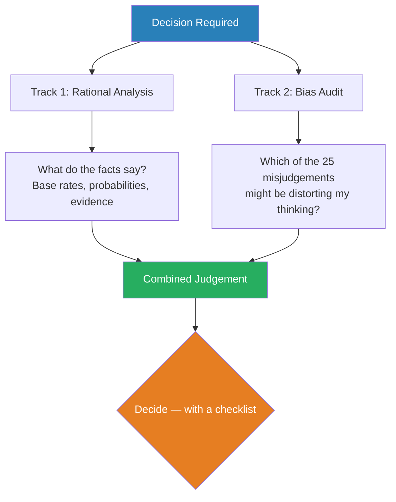

# Seeking Wisdom — Peter Bevelin

> Peter Bevelin set out to answer a single question: why do smart people make terrible decisions?
> His answer, assembled over years of studying Charles Darwin, Charlie Munger, and dozens of scientific disciplines, is that most errors come from a small, predictable set of psychological misjudgements — and that the antidote is building a latticework of mental models drawn from biology, psychology, mathematics, and physics.
> *Seeking Wisdom* is not a book you read cover to cover and shelve. It is a toolkit you return to before every important decision.
> It is the closest thing in print to having Charlie Munger's brain on your desk.

---

## About the Author

Peter Bevelin is a Swedish businessman and independent thinker who spent years studying Warren Buffett and Charlie Munger's decision-making philosophy.
He has no academic title to trade on — his authority comes from the quality of his synthesis.
The book is essentially Munger's "Psychology of Human Misjudgement" speech expanded into a 300-page operating manual.

---

## The Big Idea

- <b style="color: #2980b9">Most bad decisions come from a small number of predictable psychological misjudgements</b>
- Our brains were built for Stone Age survival, not modern complexity — evolution gave us shortcuts that now misfire
- The fix is not willpower or good intentions — it's building a **latticework of mental models** from multiple disciplines
- <b style="color: #27ae60">Think across fields</b> — psychology alone isn't enough; you need biology, mathematics, physics, and engineering too
- Use Munger's Two-Track Analysis: (1) What are the rational factors? (2) What subconscious biases are likely distorting my thinking?

---

## Key Concepts at a Glance

| Concept | One-line summary |
|---------|-----------------|
| **25 Causes of Misjudgement** | Munger's taxonomy of how brains systematically go wrong |
| **Evolutionary Mismatch** | Our hardware is 100,000 years old running modern software |
| **Latticework of Mental Models** | No single discipline is enough — cross-pollinate |
| **Two-Track Analysis** | Always separate rational factors from psychological distortion |
| **Inversion** | Instead of asking "how do I succeed?" ask "how do I avoid failure?" |
| **Checklists** | Pilots use them, surgeons use them, investors should too |
| **Base Rates** | Before trusting your gut, check how often this actually happens |
| **Compounding** | The most powerful force in the universe — in finance, knowledge, and relationships |

---

## Munger's 25 Causes of Human Misjudgement

This is the backbone of the book. Bevelin takes Munger's famous Harvard speech and expands each bias with examples, science, and counter-tactics.

- **Reward and Punishment Super-Response** — Incentives drive almost all behaviour; never ask a barber if you need a haircut
- **Liking/Loving Tendency** — We distort facts to favour people and things we like
- **Disliking/Hating Tendency** — We ignore virtues of things we dislike
- **Doubt-Avoidance** — The brain rushes to eliminate uncertainty, even at the cost of accuracy
- **Inconsistency-Avoidance** — Once we commit to a belief, we resist changing it even when evidence demands it
- **Reciprocation** — We feel compelled to return favours, even unwanted ones
- **Social Proof** — When uncertain, we look at what others are doing — even when they're all wrong
- **Contrast-Misreaction** — A $50 accessory seems cheap after you've agreed to a $50,000 car
- **Authority-Misinfluence** — We obey authority figures even when they're clearly wrong (Milgram)
- **Deprival Super-Reaction** — Losing something hurts roughly twice as much as gaining it feels good
- **Envy/Jealousy** — Drives more bad decisions than greed does
- <b style="color: #e74c3c">When several biases combine (lollapalooza effect), the result is catastrophic misjudgement</b>

---

## The Evolutionary Foundation

- Our brains evolved for a world of immediate physical threats, small tribes, and scarce food
- Modern life presents abstract threats, massive social groups, and overwhelming information — our hardware wasn't designed for this
- <b style="color: #2980b9">We over-react to vivid threats and under-react to statistical ones</b> — a shark attack gets more emotional response than heart disease, which kills 1,000x more people
- Pain avoidance is stronger than pleasure seeking — this is why loss aversion dominates financial decisions
- Status-seeking, tribal loyalty, and short-term thinking are features, not bugs — they kept us alive on the savannah but they sabotage us in boardrooms

---

## Mental Models from Other Disciplines

Bevelin draws from mathematics, physics, and engineering to build what Munger calls the latticework:

| Discipline | Model | Application |
|-----------|-------|-------------|
| **Mathematics** | Probability / Base rates | Don't trust your gut — check the actual frequency |
| **Mathematics** | Compounding | Small improvements accumulate into massive advantages |
| **Mathematics** | Regression to the mean | Extreme results tend to normalise over time |
| **Physics** | Feedback loops | Small inputs can create runaway or stabilising effects |
| **Physics** | Critical mass | Nothing happens for ages, then everything happens at once |
| **Engineering** | Redundancy | Build backup systems; a single point of failure will eventually fail |
| **Engineering** | Margin of safety | Design for worse-than-expected conditions |
| **Biology** | Natural selection | What survives is not what's strongest but what's best adapted |

---

## The Power of Inversion

- Munger's favourite technique: instead of asking "how do I make this succeed?" ask **"how would this fail?"** — then avoid those things
- Darwin deliberately sought out every argument against his own theory — he knew confirmation bias would destroy him if he didn't
- <b style="color: #27ae60">It is easier to avoid stupidity than to achieve brilliance</b>
- Most great investors don't have secret strategies — they just avoid catastrophic mistakes more consistently than everyone else

---

## The Checklist Approach

- Checklists work because they externalise memory and reduce overconfidence
- Pilots use pre-flight checklists not because they're incompetent but because the human brain reliably forgets steps under pressure
- Before any major decision, run through: What are the base rates? What biases might be at play? Am I inverting — thinking about what could go wrong? Is my sample size large enough? Am I confusing correlation with causation?

---

## The Verdict

*Seeking Wisdom* is not a page-turner. It is dense, it is reference-heavy, and it reads like a very well-organised set of lecture notes rather than a narrative. That is its weakness and its strength. You don't read it for entertainment — you read it because the alternative is making the same predictable mistakes that have been documented for centuries.

Bevelin's achievement is compression. He takes Munger's speeches, Darwin's methods, the entire field of behavioural psychology, and a half-dozen hard sciences and distils them into a single volume you can actually use.

The book's greatest insight is also its simplest: **you don't need to be brilliant to make good decisions. You need to be systematically less foolish.**

---

## Related Reading

- [[You Are Not So Smart - David McRaney|You Are Not So Smart]] — Accessible, story-driven treatment of many of the same cognitive biases
- [[Antifragile - Nassim Nicholas Taleb|Antifragile]] — Survival thinking and optionality as a mental model
- [[The Psychology of Money - Morgan Housel|The Psychology of Money]] — Behavioural finance as applied Munger-style thinking
- [[Thinking in Bets - Annie Duke|Thinking in Bets]] — Calibrated decision-making under uncertainty
