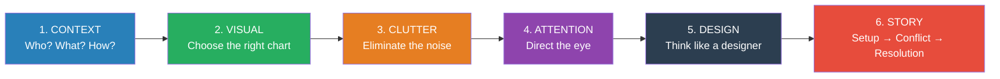
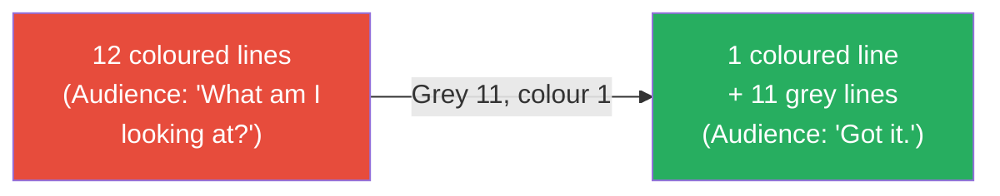

# Storytelling with Data — Cole Nussbaumer Knaflic

> You have done the analysis. You have the data. You have built a slide with six charts, a table, and a title that reads "Q3 Performance Dashboard." You present it to the executive team. They stare at the screen. Someone asks, "So... what's the takeaway?" This is the failure that Cole Nussbaumer Knaflic wrote the book to fix. The problem is almost never the data — it is the communication. **Data does not speak for itself.** Every effective data presentation has a clear point, a thoughtful visual, and a narrative arc that tells the audience what happened, why it matters, and what to do next. Knaflic, a former data analyst at Google's People Analytics team, distills this into six practical lessons that transform cluttered, confusing slides into clear visual arguments. The book is not about statistics or analytics — it is about the last mile: getting someone to understand and act on what the numbers mean.

---

## About the Author

Cole Nussbaumer Knaflic spent years at Google leading the People Analytics team's data communication efforts, where she learned that brilliant analysis is worthless if the audience cannot understand it. She founded storytellingwithdata.com, which became one of the most widely used data visualisation training resources in the world. Her approach draws on Edward Tufte's data-ink ratio, cognitive psychology research on preattentive attributes, and narrative structure. She teaches workshops for organisations ranging from startups to the Gates Foundation.

---

## The Big Idea

- <b style="color: #2980b9">Data visualisation is not about making charts look pretty — it is about making your point impossible to miss</b>
- Most data presentations fail because they ask the audience to do the analyst's job: find the pattern, identify the insight, figure out the implication
- <b style="color: #27ae60">Your job is not to show data — your job is to tell a story with data that compels your audience to act</b>

---

## Key Concepts at a Glance

| Concept | One-line summary |
|---------|-----------------|
| **The Big Idea** | One sentence that captures your point so clearly your audience could repeat it |
| **Context** | Before touching data, answer: who is the audience, what do they need to do, and how will they receive this? |
| **Appropriate visuals** | Bar charts beat pie charts almost always; tables are for looking up values, not for presentations |
| **Clutter** | Every non-data element (gridlines, borders, 3D effects, legends) is clutter until proven useful |
| **Preattentive attributes** | Colour, size, position, and orientation — the visual properties your brain processes before conscious thought |
| **Data-ink ratio** | Tufte's principle: maximise the share of ink devoted to actual data |
| **Gestalt principles** | Proximity, similarity, enclosure, closure, continuity, connection — how we perceive visual groups |
| **Narrative arc** | Setup (here's the context), Conflict (here's the problem the data reveals), Resolution (here's what to do) |
| **Three-Minute Story** | If your audience only has three minutes, can you tell the complete story in that time? |

---

## Lesson 1: Understand the Context

Before opening a spreadsheet, answer three questions:

- **Who** is your audience? Not "the leadership team" — a specific person with specific concerns, knowledge level, and decision authority. What do they already know? What do they care about?
- **What** do you need them to do? Not "understand the data" — a specific action. Approve the budget. Change the strategy. Fund the initiative.
- **How** will they receive this? Live presentation (you control the narrative) or emailed document (the document must be self-explanatory)?

Knaflic introduces the **Big Idea** — a single sentence that captures your entire point:

> "Attrition in the engineering team has increased 30% year-over-year, driven by compensation gaps in senior roles, and we need to adjust the salary bands before Q1 hiring."

If you cannot write the Big Idea in one sentence, you do not yet know what your point is. Do not build a single chart until you can.

---

## Lesson 2: Choose an Appropriate Visual

| Chart Type | Best For | Avoid When |
|-----------|---------|------------|
| **Simple text** | One or two numbers that tell the whole story | You have many data points to compare |
| **Bar chart** (horizontal) | Comparing categories — the workhorse of data viz | You have too many categories to fit |
| **Bar chart** (vertical) | Time series with few periods | Continuous time data (use line) |
| **Line chart** | Trends over continuous time | Comparing unrelated categories |
| **Slope chart** | Showing change between exactly two time points | More than two time points |
| **Scatter plot** | Relationship between two variables | Audience is unfamiliar with the format |
| **Table** | When the audience needs to look up specific values | Presentations (tables are for reading, not presenting) |

<b style="color: #e74c3c">Pie charts are almost never the right choice.</b> Humans are bad at comparing angles and areas. A bar chart communicates the same information more accurately and more quickly. The only defensible use of a pie chart is showing that something is "roughly a quarter" or "roughly half" — and even then, a simple text callout is usually better.

---

## Lesson 3: Eliminate Clutter

Every element in your visual that is not data is clutter — and clutter competes with your message for the audience's limited attention.

Knaflic's clutter audit removes:

- **Chart borders** — the data does not need a box around it
- **Gridlines** — if you need them, make them light grey, not black
- **3D effects** — never, under any circumstances, add 3D to a chart
- **Data labels on every point** — label only the points that matter to your argument
- **Legends** — label the data directly instead of forcing the audience to look back and forth between the chart and a legend
- **Bold axis labels** — they draw attention to the scaffolding instead of the data
- **Unnecessary decimal places** — "$1.2M" is better than "$1,237,482.51" in a presentation

The principle comes from Edward Tufte's **data-ink ratio**: maximise the proportion of ink that represents data, minimise everything else. If you can remove an element and the chart still communicates, remove it.

---

## Lesson 4: Focus Attention

<b style="color: #2980b9">Preattentive attributes</b> are visual properties your brain processes in milliseconds — before conscious thought kicks in. Use them to direct the audience's eye to exactly what matters:

- **Colour** — the most powerful preattentive attribute. Use one bold colour for the data point that matters; grey everything else.
- **Size** — bigger elements draw attention first
- **Position** — top-left draws the eye in left-to-right reading cultures
- **Bold/italic text** — use sparingly and only for the key insight

The technique Knaflic demonstrates repeatedly: take a chart with twelve data series all in different colours, and replace them with one colour (the series that matters) and grey (everything else). The audience's eye goes immediately to the coloured line. No instructions needed. No legend needed.

This is the visual equivalent of Cialdini's "channeled attention" from *[[Pre-Suasion - Robert Cialdini|Pre-Suasion]]* — you do not persuade by showing more; you persuade by directing attention to the one thing that matters.

---

## Lesson 5: Think Like a Designer

Knaflic draws on design principles to improve data communication:

- **Affordances** — visual cues that indicate how something should be read. A bold title signals "read me first." Indentation signals "this is subordinate." Consistent formatting signals "these items are related."
- **Accessibility** — design for the full audience, including the 8% of men who are colour-blind. Use colour-blind-safe palettes. Do not rely on colour alone to convey information — add labels, patterns, or direct annotations.
- **Aesthetics** — clean, aligned, balanced visuals communicate competence and credibility. A sloppy chart undermines the data it presents, regardless of how rigorous the analysis behind it was.
- **White space** — the most underused design tool. Do not fill every pixel. Empty space around a chart gives the eye room to focus.

---

## Lesson 6: Tell a Story

Data without narrative is a spreadsheet. Narrative without data is an opinion. Together, they are persuasion.

Knaflic uses the classic three-act structure:

| Act | Function | Data role |
|-----|----------|-----------|
| **Setup** | Establish the context — what is the situation? | Baseline data, historical context |
| **Conflict** | Reveal the tension — what is the problem or opportunity? | The data insight — the trend, the gap, the anomaly |
| **Resolution** | Recommend action — what should we do? | The evidence that supports your recommendation |

The narrative arc transforms a data presentation from "here are some charts" into "here is what is happening, here is why it matters, and here is what we should do about it."

Knaflic also introduces the **Three-Minute Story** test: if a colleague stopped you in the hallway and you had three minutes to explain your analysis, could you do it? If not, you have not yet distilled your message clearly enough.

---

## Before and After: The Transformation

The book's most powerful teaching tool is the before-and-after makeover. A typical transformation:

**Before:** A slide titled "Customer Satisfaction Scores by Region" with a clustered bar chart showing twelve regions across four quarters, all in different colours, with a legend in the corner, 3D effects, gridlines, and every data point labelled. The audience has to study it for thirty seconds to find anything meaningful.

**After:** The same data, but now the title reads "Southeast region satisfaction dropped 15% — lowest in company history." One region is highlighted in dark blue; all others are light grey. The problematic quarter is annotated directly on the chart. No legend, no gridlines, no 3D. The audience understands the message in three seconds.

The data did not change. The story emerged because the analyst decided what the audience needed to know and designed the visual to communicate it.

---

## The Verdict

*Storytelling with Data* is the single most practical book on data communication available. Its strength is that it teaches a skill almost every knowledge worker needs and almost no one is taught: how to make data understandable to someone who did not do the analysis. The six lessons are simple, memorable, and immediately applicable. Anyone who has ever built a confusing slide deck — which is everyone — will find actionable advice on every page.

The book's limitation is that it focuses on the communication layer and does not address the analysis layer. It assumes you have already done the hard work of finding the insight in the data; it teaches you how to present that insight effectively. It also focuses on static charts (slides, printed reports) more than interactive dashboards or real-time data tools. For the analytical foundations, pair it with books on critical thinking about numbers.

The audience that benefits most is anyone who regularly presents data to decision-makers — analysts, consultants, product managers, researchers, marketers, and anyone who builds slides. The principles also apply to written reports, dashboards, and any medium where data must be communicated clearly.

---

## Related Reading

- [[Pre-Suasion - Robert Cialdini|Pre-Suasion]] — Cialdini's attention management principles underpin Knaflic's preattentive attributes approach
- [[Noise - Cass R. Sunstein|Noise]] — the case for structured decision-making, which clear data presentation supports
- [[Thinking Strategically - Avinash K. Dixit & Barry J. Nalebuff|Thinking Strategically]] — strategic reasoning that benefits from the kind of clear data communication Knaflic teaches
- [[The Effective Executive - Peter Drucker|The Effective Executive]] — Drucker's emphasis on contribution aligns with Knaflic's "what do you need them to do?" framing
