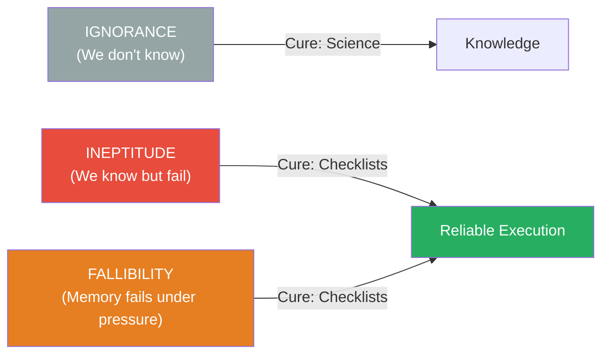
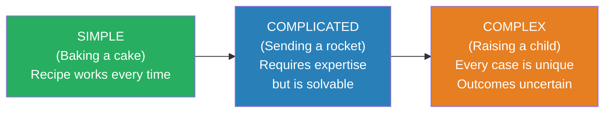

# The Checklist Manifesto — Atul Gawande

> Atul Gawande is a surgeon, and surgeons do not like being told what to do. They train for over a decade, operate on the frontier of human knowledge, and pride themselves on expertise and judgment. So when Gawande proposes that a simple checklist — a piece of paper with a few boxes to tick — can prevent more deaths than the most sophisticated medical technology, the resistance is immediate and visceral. But the evidence is overwhelming. A checklist reduced central-line infections from 11% to zero in Michigan ICUs. The WHO Safe Surgery Checklist reduced surgical deaths by 47% across eight hospitals in eight countries. And these are not isolated results — aviation, construction, and investment management all demonstrate the same pattern. **The failures that kill people are not failures of knowledge. They are failures of application.** We know what to do; we just do not reliably do it. The checklist is the cheapest, simplest, most effective tool ever devised for closing that gap.

---

## About the Author

Atul Gawande is a surgeon at Brigham and Women's Hospital in Boston, a professor at Harvard Medical School and the Harvard T.H. Chan School of Public Health, and a staff writer for *The New Yorker*. He led the World Health Organization's Safe Surgery initiative, which developed and tested the surgical checklist that forms the centrepiece of this book. His previous books, *Complications* and *Better*, explored the human fallibility of medical practice. He is one of the rare authors who combines deep domain expertise (he operates several days a week) with the ability to write clearly for a general audience.

---

## The Big Idea

- <b style="color: #2980b9">There are three reasons we fail: ignorance, ineptitude, and the necessary fallibility of human memory under pressure</b>
- **Ignorance** — we lack the knowledge. Science is the cure. (We cannot treat a disease we do not understand.)
- **Ineptitude** — we have the knowledge but fail to apply it correctly. Checklists are the cure.
- The necessary **fallibility of memory** — under pressure, complexity, and time constraints, even experts skip steps they know by heart
- <b style="color: #27ae60">In the modern world, ineptitude is a far larger source of failure than ignorance</b> — we know more than we can reliably execute

---

## Key Concepts at a Glance

| Concept | One-line summary |
|---------|-----------------|
| **Three types of failure** | Ignorance, ineptitude, and necessary fallibility — checklists fight the last two |
| **DO-CONFIRM checklist** | Do the work from memory, then pause and confirm all steps completed |
| **READ-DO checklist** | Read each step aloud, then execute it — like a recipe |
| **Simple / Complicated / Complex** | Baking a cake / Sending a rocket / Raising a child — different problems need different tools |
| **The pause point** | A deliberate stop in the workflow where the team checks their work |
| **Communication forcing function** | Checklist items that require team members to introduce themselves and voice concerns |
| **Killer items only** | Good checklists are 5-9 items — only the steps experts are most likely to skip |
| **Discipline of higher performance** | Checklists do not replace expertise — they free experts to focus on the hard parts |

---

## The Problem: Complexity Has Defeated the Expert

Gawande opens with a catalogue of how complex modern knowledge has become:

- The International Classification of Diseases lists more than 13,000 diseases
- A doctor may encounter any of them in a given week
- A typical ICU patient requires an average of 178 individual actions per day — each one a potential point of failure
- Even a 99% success rate per action means nearly two errors per patient per day

The volume of what we know has outstripped any individual's ability to reliably deliver on it. The heroic expert — the lone brilliant surgeon, the master engineer, the star pilot — is an outdated model. <b style="color: #e74c3c">Under conditions of genuine complexity, individual expertise is necessary but insufficient.</b>

---

## Aviation: Where Checklists Were Born

On 30 October 1935, a prototype Boeing Model 299 — the plane that would become the B-17 Flying Fortress — crashed on its evaluation flight at Wright Field, Ohio. The pilots, including Major Ployer Peter Hill, were among the most experienced in the Army Air Corps. The investigation found no mechanical failure. The plane was simply "too much airplane for one man to fly" — too many systems to monitor, too many steps to remember.

Rather than demand longer training (the pilots were already the best available), a group of test pilots created something new: a **pilot's checklist**. A short card listing the critical steps for takeoff, flight, landing, and taxiing — steps that every pilot knew but might forget under the cognitive load of managing a four-engine bomber.

The Model 299 went on to fly 1.8 million miles without a serious accident. It became the backbone of Allied strategic bombing in World War II. The checklist had transformed an unmanageably complex machine into a reliable system.

---

## Medicine: The Keystone ICU Study

In 2001, critical care specialist Peter Pronovost at Johns Hopkins created a five-item checklist for inserting central venous lines — a routine ICU procedure with a 4-11% infection rate:

1. Wash hands with soap
2. Clean the patient's skin with chlorhexidine antiseptic
3. Put sterile drapes over the entire patient
4. Wear sterile mask, hat, gown, and gloves
5. Put a sterile dressing over the insertion site after the line is in

Every ICU doctor in the world already knew these steps. None of them were controversial. But when Pronovost tracked compliance, he found that doctors skipped at least one step in more than a third of patients.

He implemented the checklist across Michigan ICUs. Nurses were authorised to stop any doctor who skipped a step. Results after one year:

- Central-line infection rates dropped from 11% to **zero**
- The program prevented an estimated 43 infections and 8 deaths
- Over 18 months, it saved $175 million in costs
- The results held across 103 ICUs statewide

<b style="color: #27ae60">The knowledge did not change. The technology did not change. The people did not change. Only the system changed — a piece of paper with five items on it.</b>

---

## Two Types of Checklists

| | DO-CONFIRM | READ-DO |
|--|-----------|---------|
| **How it works** | Do the work from memory and experience, then pause and confirm all steps were completed | Read each step from the list, then do it before moving on |
| **Analogy** | Like a pilot reviewing instruments before takeoff — work is done, then verified | Like following a recipe — the list guides each action |
| **Best for** | Experienced professionals who know the work but might skip steps under pressure | Unfamiliar or infrequent procedures where the sequence matters |
| **Strength** | Preserves expert flow and judgment | Ensures nothing is missed in complex sequences |
| **Risk** | Skipping the confirmation pause — turning "DO-CONFIRM" into "DO" | Becoming mechanical — following steps without thinking |

Gawande notes that aviation uses both: the pre-takeoff checklist is DO-CONFIRM (pilots complete their setup, then run through the list to verify), while an emergency checklist is READ-DO (read the step, execute it, read the next step — because under extreme stress, memory cannot be trusted at all).

---

## Simple, Complicated, and Complex Problems

Gawande borrows a framework from complexity science:

- **Simple problems** have reliable recipes — follow the steps and the outcome is predictable
- **Complicated problems** require expertise and coordination but are ultimately solvable — the physics is known, the engineering is understood, success is repeatable
- **Complex problems** are fundamentally unpredictable — every instance is unique, expertise helps but does not guarantee outcomes

The insight: checklists work brilliantly for simple and complicated problems. For complex problems, they work differently — not by dictating steps but by **forcing communication**. In surgery, the WHO checklist includes items like "everyone in the room introduce yourself by name and role" and "does the surgeon have any concerns the team should know about?" These are not technical steps; they are communication forcing functions that ensure critical information surfaces before the knife cuts.

---

## Construction: Mastering the Complicated

The construction industry builds skyscrapers — projects involving sixteen or more specialised trades, thousands of workers, millions of components, and zero tolerance for structural failure. How does it manage this complexity?

Not through a master builder who knows everything, but through **structured communication**:

- A **submittal schedule** identifies every point where different trades interact and potential conflicts must be resolved
- At each interaction point, the relevant specialists must communicate, flag problems, and agree on solutions
- The builder does not solve problems — the builder ensures that the right people talk to each other at the right time

Gawande sees this as a model for managing complexity in any domain: <b style="color: #2980b9">when no single expert can hold all the knowledge, the checklist's job is to ensure that the people who hold different pieces of knowledge actually talk to each other.</b>

---

## Designing Good Checklists

Gawande worked with Boeing's checklist specialist Daniel Boorman to understand what separates effective checklists from useless ones:

| Principle | Explanation |
|-----------|-------------|
| **5-9 items** | A checklist that tries to cover everything will be ignored — include only the killer items that even experts forget |
| **Fits one page** | If it does not fit on a single page, it is too long |
| **Tested in simulation** | Run the checklist in realistic conditions before using it live |
| **Revised after use** | No checklist is perfect on the first draft — iterate based on real-world experience |
| **Pause points** | Define exactly when in the workflow the team stops and runs the checklist |
| **Simple language** | Use the exact terminology the team uses — no jargon from another department |
| **Not a manual** | A checklist does not teach you how to do the work — it ensures you do not skip the steps you already know |

> A checklist is not a substitute for thinking. It is a net for catching the failures that thinking alone cannot prevent.

---

## The WHO Safe Surgery Checklist

The book's climax: Gawande leads the development and testing of a surgical safety checklist for the World Health Organization.

Three pause points:
1. **Before anaesthesia** (Sign In) — confirm patient identity, procedure, consent, allergies, airway risk
2. **Before incision** (Time Out) — entire team introduces themselves by name and role, surgeon reviews critical steps, anaesthesiologist reviews concerns, nursing confirms sterility and equipment
3. **Before patient leaves OR** (Sign Out) — confirm procedure completed, instrument and sponge counts, specimen labelling, equipment issues, recovery plan

Results across eight hospitals in eight countries (from rural Tanzania to urban Toronto):

- Major complications dropped **36%**
- Deaths dropped **47%**
- The checklist took less than two minutes to complete
- It cost essentially nothing to implement

---

## The Verdict

*The Checklist Manifesto* is a deceptively powerful book. Its central argument — that a simple piece of paper with a few boxes on it can prevent deaths, reduce errors, and improve performance across wildly different domains — sounds too good to be true, and the evidence that it works is almost embarrassingly strong. The book succeeds because Gawande writes from direct experience (he implemented the checklist in his own operating room and describes his own discomfort with it) and because the stories are vivid and specific.

The limitation is that Gawande focuses on what checklists can do and largely avoids the harder question of why they are so difficult to implement. The resistance he describes — surgeons who refuse to use checklists, administrators who see them as bureaucratic overhead, cultures that equate checklists with distrust of expertise — is real and widespread. The book gestures at this resistance but does not deeply explore it. For that, you need a complementary understanding of organisational politics and human psychology.

The audience that benefits most is anyone working in a high-stakes environment where expertise is necessary but insufficient — medicine, aviation, engineering, finance, and increasingly, any knowledge work where the complexity of the task exceeds the reliability of individual memory.

---

## Related Reading

- [[Noise - Cass R. Sunstein|Noise]] — Kahneman, Sibony & Sunstein's argument for "decision hygiene" — checklists are one of the most effective forms of decision hygiene
- [[The Phoenix Project - Gene Kim|The Phoenix Project]] — process discipline, change management, and reducing unplanned work in IT operations
- [[Thinking in Systems - Donella H. Meadows|Thinking in Systems]] — the structural view of why individual effort fails in complex systems
- [[The Effective Executive - Peter Drucker|The Effective Executive]] — Drucker's systematic approach to knowledge work anticipates Gawande's argument that discipline beats talent
