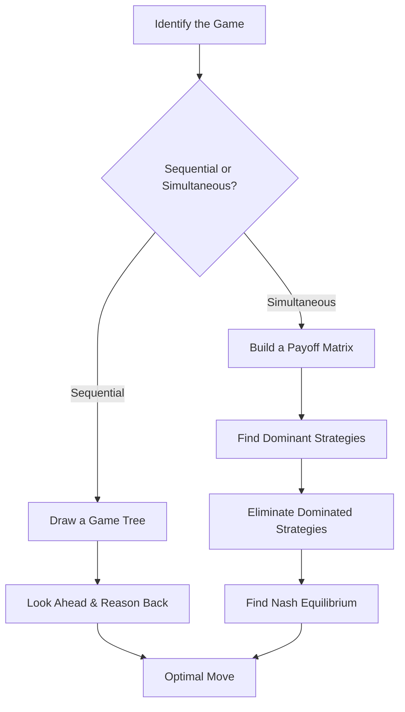
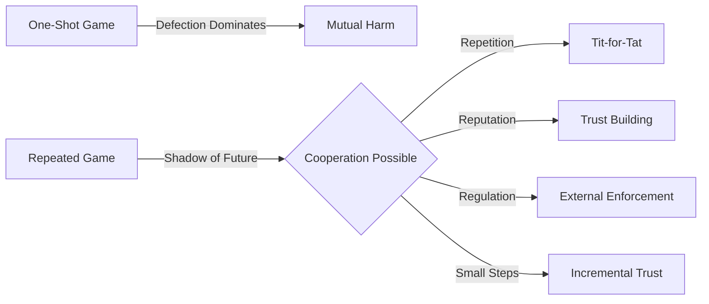
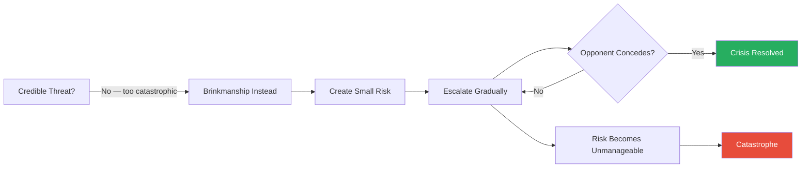
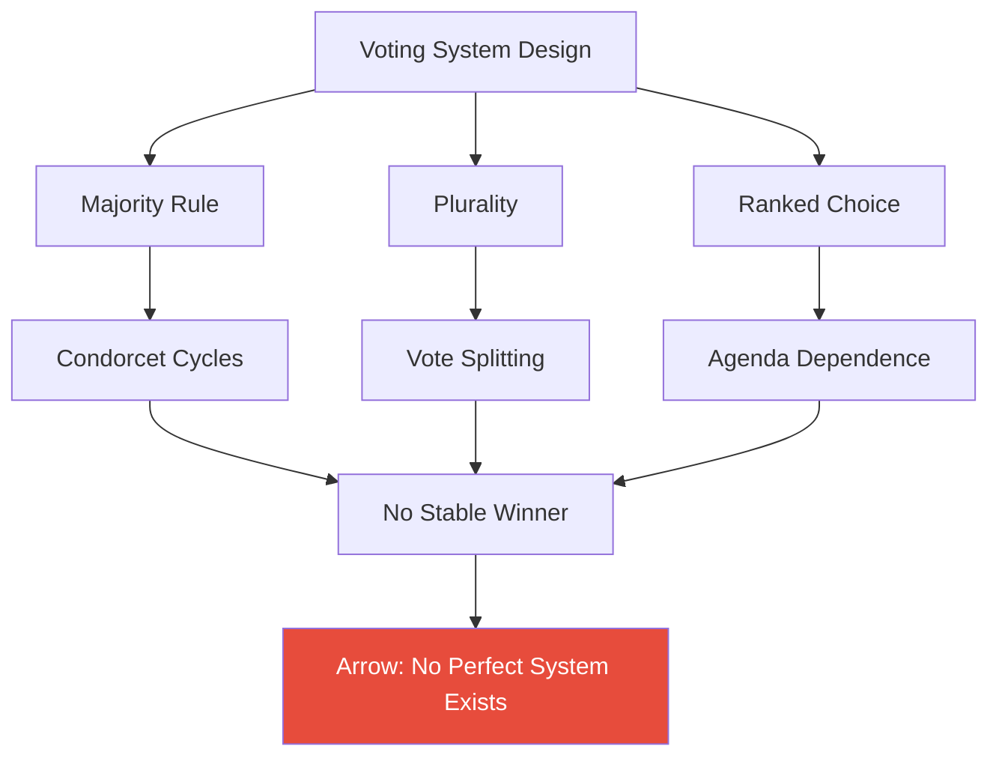
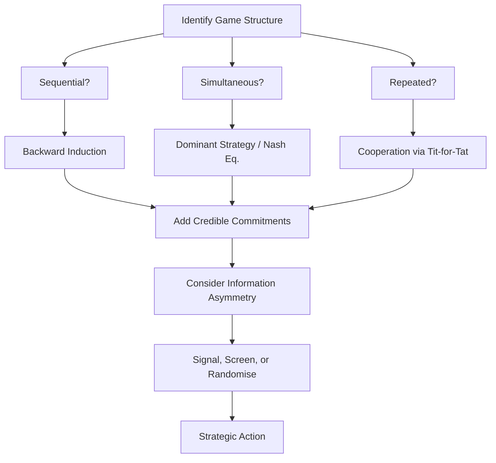

# Thinking Strategically — Avinash K. Dixit & Barry J. Nalebuff

> Two Princeton and Yale economists make the case that every interaction involving other people — negotiations, office politics, competitive bidding, even choosing which side of the pavement to walk on — is a strategic game with an identifiable structure. Once you see the structure, a handful of reasoning principles (look ahead and reason back, find dominant strategies, make credible commitments) give you a systematic edge over anyone operating on intuition alone. Game theory, they argue, is not an academic curiosity. It is the hidden operating system of everyday life. The person who understands it sees the board; everyone else is playing blind. The book translates formal mathematics into plain-language reasoning accessible to anyone willing to think clearly about interdependence.

---

## About the Authors

**Avinash K. Dixit** is a professor of economics at Princeton University specialising in trade policy, industrial organisation, and strategic behaviour. He is one of the most cited economists in the world, known for making abstract theory tangible. **Barry J. Nalebuff** is a professor of economics and management at Yale School of Management who has consulted for McKinsey, Chemical Bank, and various Fortune 500 firms. He later co-authored *Co-opetition* and *The Art of Strategy*, continuing the work of making game theory practical. Both are academic game theorists who set out to make the discipline accessible to a general audience — managers, negotiators, politicians, students — with no mathematics required.

---

## The Big Idea

*Every decision made in the presence of other purposive actors is a strategic game — and recognising the game's structure matters more than any individual tactic.*

- Every interaction with other thinking agents is a <b style="color: #2980b9">strategic game</b> — the person across the negotiation table, the competitor launching a product, the colleague angling for the same resource, the diplomat across the table
- Most people navigate these situations on instinct — pattern-matching from past experience, reading body language, trusting their gut
- Dixit and Nalebuff argue that instinct is not enough

---

- Their central insight: strategic interactions have **structures**, and those structures are more important than the personalities involved
  - The same logic that governs nuclear brinkmanship governs a pricing war between two petrol stations
  - The same reasoning that helps you win at poker helps you negotiate a salary
- Once you identify the structure — is this a sequential game or a simultaneous one? a zero-sum contest or a mixed-motive negotiation? a one-shot interaction or a repeated relationship? — a small set of reasoning principles tells you what to do

> [!tip] Core Insight
> Before asking "what should I do?", ask "what kind of game is this?" Structure determines strategy — get the structure right and the correct strategy often becomes obvious.

- The book divides all interactions into two fundamental structures:
  - <b style="color: #2980b9">Sequential games</b> have a chain of alternating moves where each player observes what came before — chess, salary negotiations, legislative bargaining
  - <b style="color: #2980b9">Simultaneous games</b> have moves made in ignorance of the other side's choice — sealed-bid auctions, rock-paper-scissors, two competing firms setting prices on the same morning
- The analytical method for each is different:
  - Sequential games are solved by looking ahead and reasoning back
  - Simultaneous games are solved by finding dominant strategies and equilibria
- But both are governed by a small set of principles that, once internalised, produce consistently better outcomes than intuition alone

This diagram captures the book's core analytical method — every strategic interaction is classified first, then solved with the appropriate tool.

---

## Key Concepts at a Glance

| Concept | One-line summary |
|---------|-----------------|
| **Sequential vs simultaneous games** | All strategic interactions fall into two categories, each with its own analytical method |
| **Backward induction** | Start from the end of a sequential game and reason backward to find the optimal first move |
| **Dominant strategies** | When one option is best regardless of the opponent's choice, take it |
| **Nash equilibrium** | A pair of strategies where neither player can improve by unilaterally changing |
| **Strategic moves** | Deliberate limitations of your own freedom designed to change the other side's behaviour |
| **Credible commitment** | A threat or promise is only effective if the other side believes you will follow through |
| **Brinkmanship** | The deliberate creation of a risk that neither side fully controls, escalating gradually |
| **Prisoners' dilemma** | Individual rationality producing collective ruin unless repetition, reputation, or regulation intervene |
| **Information asymmetry** | What others reveal or conceal is strategic intelligence; voluntarily shared information is always biased |
| **Mixed strategies** | Deliberate randomness to prevent opponents from exploiting predictable patterns |
| **BATNA** | Your negotiating power is a direct function of what you can achieve without the other party |
| **Voting paradoxes** | Collective decisions through voting can produce incoherent outcomes and manipulation opportunities |
| **Incentive design** | Getting others to act in your interest when you cannot observe their effort directly |

---

## Part I: The Basics of Strategic Thinking

### Chapter 1: Ten Tales of Strategy

*The book opens not with theory but with stories — ten miniature strategic puzzles that plant seeds the subsequent chapters cultivate into full-grown principles.*

- Each tale illustrates a different principle: backward induction, commitment, information asymmetry, mixed strategies, first-mover vs second-mover advantage
- You encounter the problems before you learn the solutions, which makes the solutions stick

> [!example] Larry Bird's Left Hand — The Hot Hand in Basketball
> - Larry Bird was one of the greatest right-handed shooters in basketball history
> - Defences loaded up to stop his dominant right hand
> - When Bird practised and improved his left-handed shot, something counterintuitive happened: the improvement made his right hand *more* effective, not his left
> - The mechanism is strategic interdependence — when the defence had to allocate resources to covering Bird's improved left hand, it freed up his dominant right
> - The insight generalises far beyond basketball: a tennis player who improves a mediocre backhand forces opponents to stop camping on her forehand side
> **The lesson:** Improving a weakness can amplify a strength, because opponents must spread their attention across a wider front.

---

> [!example]- Dennis Conner and the 1983 America's Cup
> - In the 1983 America's Cup finals, Dennis Conner led the Australian boat *Australia II* by 3 races to 1 in a best-of-seven series
> - He needed just one more win
> - The standard strategy for a leading sailboat is simple: copy whatever the trailing boat does
> - If they tack left, you tack left — wind shifts are random, so any shift that helps them also helps you, and your lead is preserved
> - Conner made the catastrophic mistake of ignoring this principle
> - Rather than copying the Australians' tacks, he sailed his own race
> - A wind shift favoured *Australia II*, and Conner lost that race — and then the next two, and the Cup
> **The lesson:** When you are ahead, minimise variance. When you are behind, maximise it — take wild, divergent risks, because the status quo is already losing for you.

- <b style="color: #27ae60">The leader should copy the follower</b> — this sounds paradoxical, but the logic is airtight
  - A leader preserves their lead by ensuring that any random event affects both sides equally
  - A trailer needs divergence — only an unexpected shift can close the gap

---

> [!example] The Taxi Driver in Haifa
> - A tourist lands in Israel and hails a taxi
> - The driver refuses to use the meter and insists on a flat fare
> - The tourist, knowing nothing about local distances, is at a massive information disadvantage
> - The driver knows the true cost; the tourist does not
> - Any flat fare the driver proposes is likely to be inflated — why would the driver refuse the meter unless the metered fare would be lower?
> **The lesson:** Whenever someone offers terms they are too eager to set, their eagerness is intelligence about what they know.

- This is the <b style="color: #2980b9">Sky Masterson principle</b> in action: "If someone offers to bet you that he can make the jack of diamonds jump out of a deck of cards and squirt cider in your ear, don't take that bet"

> [!example] The Accordion Effect — Sequential Pressure
> - A taxi dispatcher extracts bribes from drivers one by one
> - Each driver faces the choice alone: pay the bribe and get dispatched, or refuse and lose fares
> - Collective resistance would defeat the dispatcher instantly, but coordination costs prevent it
> - Each driver, making a rational individual calculation, capitulates
> **The lesson:** Applying pressure to individuals sequentially rather than to a group simultaneously is vastly more powerful, because isolated actors cannot coordinate their resistance.

---

### Chapter 2: Anticipating Your Rival's Response — Sequential Games

*The first analytical tool forces you to abandon forward-looking wishful thinking and instead reason backward from the other party's final decision.*

- The principle of <b style="color: #2980b9">backward induction</b> sounds simple — look ahead and reason back — but human psychology works against it
- People naturally think forward from the present: "If I do this, then hopefully they will do that"
- Forward reasoning is laced with wishful thinking, because it allows you to imagine favourable responses from the other side
- <b style="color: #27ae60">Backward induction is the antidote</b> — it forces you to start from the *other party's* final decision and work backward, asking at every node: "What is the best response here, given everything that follows?"

> [!tip] Core Insight
> In any sequential interaction, start from the end and work backward. Wishful thinking evaporates when you begin from your opponent's last decision rather than your own first move.

> [!example] Charlie Brown and the Football
> - Every autumn, Lucy holds the football for Charlie Brown to kick
> - Every autumn, she pulls it away at the last second, and Charlie Brown ends up flat on his back
> - He reasons forward: "This time she promised not to pull it away, so I will kick"
> - If he reasoned backward — "At the moment of the kick, what is Lucy's best response? To pull the ball away, because she finds it funny" — he would never approach the ball
> - The example is comical, but the reasoning error is universal
> **The lesson:** People in negotiations, relationships, and business deals habitually trust promises when backward induction would tell them the promise will be broken.

---

> [!example] The 1981 Orange Bowl — Nebraska's Two-Point Gamble
> - Clemson led Nebraska 15-3 with time running out
> - Nebraska scored a touchdown to make it 15-9 and faced the choice: kick the extra point or go for a two-point conversion
> - Forward reasoning says: "Score the safe point now, worry about the next score later"
> - Backward reasoning says: "Assume we score again — if we scored two touchdowns with one extra point and one two-point conversion, we get 15-15 and go to overtime"
> - Nebraska's coach, Tom Osborne, reasoned backward and went for two on the first touchdown
> - He failed — but the reasoning was correct: the uncertain future score made the two-point attempt the right first move
> **The lesson:** The correct decision and a successful outcome are not the same thing. Backward induction identifies the right choice even when luck goes against you.

- The authors introduce the <b style="color: #2980b9">game tree</b> — a visual representation of a sequential game:
  - Every decision point (node), every possible action (branch), and the resulting payoffs at every terminal node
  - Once drawn, backward induction becomes mechanical: start at the end, identify the optimal choice at each final node, fold that information back
  - The game tree is not just a tool for analysis — it is a tool for discipline
  - It forces you to make explicit every assumption about what the other side will do, rather than leaving those assumptions vague and hopeful

---

- <b style="color: #e74c3c">The negotiation rollback reveals a structural trap</b> — in any finite negotiation, the party who makes the last offer has structural advantage:
  - In a simple bargaining game, two parties alternate offers
  - Whoever makes the last offer has power, because the other side must accept or get nothing
  - But knowing this, the second-to-last offerer calibrates their offer to be barely acceptable
  - And knowing *that*, the third-to-last offerer adjusts
  - The entire negotiation can be solved by rolling back from the end
- This is why time pressure and deadlines matter so much — they determine who gets the last word

---

### Chapter 3: Seeing Through Your Rival's Strategy — Simultaneous Games

*When players move at the same time — or cannot observe each other's choices before committing — the analytical method shifts from game trees to payoff matrices.*

- A <b style="color: #2980b9">payoff matrix</b> lays out every combination of strategies and the resulting outcomes for both players
- The analysis follows a clear sequence:

> [!abstract] Solving Simultaneous Games — Three-Step Method
> 1. Look for **dominant strategies** — options that are best regardless of what the opponent does. If you have one, play it
> 2. Look for **dominated strategies** — options that are inferior no matter what. Eliminate them. In the reduced game, new dominant strategies may emerge. Repeat (**iterated elimination**)
> 3. Look for a **Nash equilibrium** — a pair of strategies where each is the best response to the other. Neither player can improve by changing unilaterally

- At Nash equilibrium, neither player can improve their outcome by changing their strategy unilaterally
- It is the stable resting point of the game — the outcome that, once reached, persists because no one has an incentive to deviate

---

> [!example] Campeau's Two-Tiered Tender Offer for Federated Stores
> - Robert Campeau launched a two-tiered tender offer for Federated Department Stores
> - He offered $105 per share for the first half of shares tendered and $90 for the rest
> - The pre-bid share price was around $100
> - Each individual shareholder was better off tendering regardless of what others did, because holding out risked ending up in the $90 tier
> - Tendering was the dominant strategy
> - Campeau acquired the company at a blended price below what many shareholders believed the shares were worth
> - The coercion was not personal but structural — the game's design made resistance individually irrational even though collective resistance would have been effective
> **The lesson:** Dominant-strategy reasoning can trap players in outcomes they dislike. The only escape is to change the game's rules.

- <b style="color: #e74c3c">A well-designed game can coerce rational actors into an outcome none of them wants</b> — Campeau's structure exploited the prisoners' dilemma inherent in dispersed share ownership
- Regulators later mandated unconditional offers, changing the game itself

---

> [!example] The US-Soviet Arms Race as Prisoners' Dilemma
> - Each side had to choose between arming and disarming
> - Regardless of what the other side did, arming was the dominant strategy:
>   - If the Soviets disarmed, the US gained military superiority by arming
>   - If the Soviets armed, the US needed to arm to avoid inferiority
> - The same logic applied in reverse
> - Both sides armed, producing a mutually expensive equilibrium that neither wanted but neither could unilaterally escape
> - Arms control treaties attempted to break the dilemma by introducing verification, penalties for cheating, and mechanisms for mutual step-down
> **The lesson:** When both sides have dominant strategies that produce mutual harm, only external mechanisms — regulation, treaties, structural change — can break the trap.

---

### Epilogue to Part I: The Four Rules

*The authors distil the entire analytical framework into four sequential rules — the load-bearing structure of everything that follows.*

| Rule | Principle | When to apply |
|------|-----------|---------------|
| **Rule 1** | Look ahead and reason back | Any sequential interaction — start from the end |
| **Rule 2** | If you have a dominant strategy, use it | When one option is best regardless of what the opponent does |
| **Rule 3** | Eliminate dominated strategies successively | When no dominant strategy exists — remove inferior options iteratively |
| **Rule 4** | Find the Nash equilibrium | When Rules 2 and 3 are insufficient — find the stable resting point |

- <b style="color: #27ae60">These four rules are the foundation</b> — everything that follows — commitment, brinkmanship, cooperation, bargaining — is built on top of them
- Rule 1 governs sequential games; Rules 2-4 govern simultaneous games
- Together, they cover every strategic interaction

---

## Part II: The Toolbox of Strategic Thinking

### Chapter 4: Resolving the Prisoners' Dilemma

*The most famous structure in game theory reveals why cooperation is fragile — and what makes it durable.*

- The <b style="color: #2980b9">prisoners' dilemma</b> is deceptively simple:
  - Two players, each of whom benefits from defecting regardless of what the other does
  - But both are worse off when both defect than when both cooperate
- The original story:
  - Two suspects are arrested and interrogated separately
  - If both stay silent, each gets a light sentence
  - If one confesses and the other stays silent, the confessor goes free and the silent one gets a heavy sentence
  - If both confess, both get a moderate sentence
  - The logic of self-interest drives both to confess — the worst collective outcome
- In a one-shot game, defection is the dominant strategy
- But most real-world dilemmas are not one-shot — they repeat, sometimes indefinitely
- <b style="color: #27ae60">Repetition changes everything</b>

---

> [!example] Robert Axelrod's Tournament and the Triumph of Tit-for-Tat
> - Political scientist Robert Axelrod invited game theorists to submit strategies for a repeated prisoners' dilemma tournament
> - The winner, submitted by Anatol Rapoport, was the simplest entry: **tit-for-tat**
> - Cooperate on the first round; after that, do whatever the other side did last round
> - Tit-for-tat won not by exploiting anyone but by being:
>   - **Nice** — it never defected first
>   - **Retaliatory** — it punished defection immediately
>   - **Forgiving** — it returned to cooperation as soon as the other side did
>   - **Clear** — its pattern was easy for other strategies to read and adjust to
> **The lesson:** The most effective strategy in repeated interactions is not the most cunning — it is the most transparent.

> [!example] OPEC's Cartel Dilemma
> - OPEC's members face a classic prisoners' dilemma: each member benefits from overproducing its quota, but if everyone overproduces, the price collapses
> - Cooperation requires each member to restrain production, trusting that others will do the same
> - In practice, OPEC's history is a cycle of cooperation and defection
> - When the cartel is strong, members cooperate; when enforcement weakens — typically when a member faces fiscal pressure and quietly overproduces — the cartel fractures
> - Saudi Arabia has sometimes played the role of enforcer, flooding the market to punish cheaters, absorbing short-term losses to restore the cooperative equilibrium
> **The lesson:** This is tit-for-tat on a geopolitical scale — punishment must be swift and visible to sustain cooperation.

---

> [!example]- The Live-and-Let-Live System in World War I Trenches
> - In the trenches of World War I, opposing soldiers facing each other for months developed an unspoken cooperation: "live and let live"
> - Both sides refrained from targeting the other's mealtimes, latrines, and rest periods
> - Defection (a surprise attack) would bring immediate retaliation, making cooperation self-enforcing
> - The cooperation was not the product of orders, ideology, or goodwill — it was the rational equilibrium of an indefinitely repeated game
> - The high command on both sides eventually broke it by rotating units frequently
> - This ensured no two units faced each other long enough for the cooperative equilibrium to establish
> **The lesson:** Cooperation emerges naturally from repeated interaction — and can be deliberately destroyed by preventing repetition.

The four mechanisms for sustaining cooperation transform the prisoners' dilemma from a trap into a manageable problem.

- The book identifies <b style="color: #2980b9">four mechanisms for sustaining cooperation</b>:
  - **Repetition** — when the game is played repeatedly with no known end date, the threat of future punishment sustains cooperation; the shadow of the future makes defection costly
  - **Reputation** — a track record of cooperation makes defection more expensive, because the defector loses not just one relationship but their standing in all future interactions
  - **Regulation** — external enforcement (laws, contracts, industry norms) changes the payoffs so that defection is no longer dominant
  - **Small steps** — reducing the temptation at each stage makes cooperation self-enforcing incrementally; drug deals done in small transactions rather than one large exchange are an example

---

- <b style="color: #e74c3c">There must be no known last round</b> — this is the critical condition:
  - If both parties know when the relationship ends, cooperation unravels backward from the end
  - The last round has no future punishment, so defection dominates
  - But then the second-to-last round becomes effectively the last round
  - The logic cascades all the way back to the first move
  - This is why indefinite relationships sustain cooperation far better than finite ones

---

### Chapter 5: Strategic Moves — Threats, Promises, and Commitments

*The book's most counterintuitive insight: reducing your own options can increase your power.*

- A <b style="color: #2980b9">strategic move</b> is a deliberate limitation of your own freedom designed to change the other side's expectations and behaviour
- Dixit and Nalebuff classify all strategic moves into three types:

| Type | Definition | Sub-types | Example |
|------|-----------|-----------|---------|
| **Unconditional moves** | Preemptive commitments to a course of action | — | Building a factory in a new market |
| **Threats** | Conditional punishments: "if you do X, I will do Y" | Deterrent (prevent action) / Compellent (force action) | "If you enter my market, I will cut prices to zero" |
| **Promises** | Conditional rewards: "if you cooperate, I will reward you" | Deterrent / Compellent | "If you stay out of my market, I will stay out of yours" |

- **Unconditional moves** work by changing the other side's calculation — a factory cannot be un-built, so competitors must adjust
- **Deterrent threats** maintain the status quo; **compellent threats** demand change
  - Compellent threats are harder to execute because they require the target to visibly capitulate
- <b style="color: #27ae60">The most powerful strategic move is the combination</b> — punishment for non-cooperation paired with reward for cooperation
  - A threat alone or a promise alone is often insufficient
  - Neither half works in isolation because each, taken alone, makes your response unconditional

---

> [!example] The Democrats vs Republicans Tax Game (1981)
> - The authors construct a payoff matrix for the Reagan tax reform
> - If the Democrats use only a threat ("We will attack you if you don't compromise"), their behaviour becomes unconditional — they attack regardless, giving Republicans no incentive to compromise
> - If the Democrats use only a promise ("We will support you if you compromise"), their behaviour is again unconditional — they always support, giving Republicans no reason to concede
> - Only the combination — "compromise and we support you; refuse and we attack" — creates the conditional structure that changes Republican behaviour
> **The lesson:** Neither threats nor promises work alone because each half, taken in isolation, makes the response unconditional. You need both.

- **Warnings and assurances** are distinct from threats and promises:
  - A <b style="color: #2980b9">warning</b> describes what you would naturally do: "If you raise prices, I will buy from your competitor" — this is simply stating your best response
  - An <b style="color: #2980b9">assurance</b> describes what you will naturally refrain from doing
  - Neither has strategic effect because neither changes your payoffs — they merely communicate what was already true
  - A genuine threat or promise must involve behaviour you would *not* otherwise choose, adopted specifically to change the other side's incentives

---

> [!example] Houghton Mifflin's Author Defence
> - When Western Pacific Industries launched a hostile takeover of the publisher Houghton Mifflin, the company's authors threatened to leave
> - This was effective because the acquirer wanted the authors — they were the company's primary asset
> - Without them, the acquisition was hollow
> - The authors' threat constituted both a deterrent (don't acquire us) and a compellent (if you do, we will make the acquisition worthless)
> **The lesson:** A scorched-earth defence works when you threaten to destroy the specific assets the aggressor values.

> [!example] New York Magazine and Murdoch — The Wrong Assets
> - When Rupert Murdoch acquired New York magazine, the writers made the same threat — they would leave
> - But Murdoch wanted the advertisers and the brand, not the writing staff
> - The writers destroyed what *they* valued, not what the invader valued
> - Murdoch acquired the magazine and replaced the editorial team
> **The lesson:** A scorched-earth defence only works if you burn the right assets — the ones the aggressor actually wants.

---

### Chapter 6: Credible Commitments — The Eightfold Path

*Threats and promises only work if the other side believes you will follow through — and this chapter addresses the harder question of how to make them believe it.*

- The fundamental problem: rational actors will predict whether you will actually follow through
  - If carrying out a threat would hurt you as much as it hurts them, they will call your bluff
  - If honouring a promise requires sacrifice after the other side has already acted, they will doubt you
- "Strategic thinking is the art of outdoing an adversary, knowing that the adversary is trying to do the same to you"
- <b style="color: #27ae60">Credibility requires making reversal costly or impossible</b>

> [!tip] Core Insight
> A commitment is only credible when breaking it is more costly than keeping it. The eight devices below all work by changing the payoff structure so that following through becomes genuinely optimal.

The authors identify <b style="color: #2980b9">eight commitment devices</b>:

| # | Device | Mechanism | Example |
|---|--------|-----------|---------|
| 1 | **Reputation** | Track record makes the next commitment believable | A firm that consistently matches competitors' prices |
| 2 | **Contracts** | External penalties for breaking the agreement | Prenuptial agreements, performance bonds |
| 3 | **Cutting off communication** | Cannot receive or respond to counteroffers | Labour negotiator who goes on holiday after announcing a position |
| 4 | **Burning bridges** | Destroying fallback options | Cortés burning his ships in Mexico, 1519 |
| 5 | **Doomsday devices** | Automating the response to remove human discretion | Nuclear "dead hand" system; standing sell orders at a broker |
| 6 | **Small steps** | Breaking large commitments into verifiable increments | IBM's short-term leases rather than outright sales |
| 7 | **Teamwork & norms** | Peer pressure and culture enforce commitments | Military units where desertion dishonours the entire squad |
| 8 | **Mandated agents** | Delegating to someone with restricted authority | A vending machine cannot haggle; a union leader bound by member vote |

---

- **Reputation** is the cheapest commitment device — it requires no contracts or burned bridges, only consistency over time
  - But it takes years to build and can be destroyed by a single broken commitment

> [!example] Cortés Burns His Ships (1519)
> - Upon landing in Mexico, Cortés burned his ships
> - His soldiers could not retreat — fighting was now their only rational option
> - The Aztecs, seeing this, knew the Spanish commitment was genuine
> - The principle extends far beyond warfare: anyone who deliberately destroys their fallback option is burning bridges to make commitment credible
> - Resigning from a safe job before a risky venture, publicly announcing a position from which retreat would be humiliating — all serve the same function
> **The lesson:** When retreat is impossible, commitment is automatic.

- **Mandated agents** are the purest form of structural commitment:
  - A vending machine cannot haggle, cannot accept a lower price, and cannot be persuaded
  - A union leader who has put a position to a member vote cannot accept less without a new vote
  - The other side, recognising the structural constraint, adjusts expectations accordingly

---

- <b style="color: #e74c3c">The overarching principle: credibility requires cost</b>
  - "The essence of a game of strategy is the interdependence of the players' decisions"
  - If breaking your word is free, rational opponents will assume you will break it
  - Commitment devices work by changing the payoff structure so that following through becomes genuinely optimal

> [!example] Ferdinand de Lesseps — The Danger of Over-Commitment
> - De Lesseps successfully built the Suez Canal by committing irrevocably to a sea-level design — no locks, no detours
> - The commitment was credible precisely because it was inflexible, and it worked because the terrain at Suez allowed it
> - He then applied the same approach to the Panama Canal, committing to a sea-level design through far more difficult terrain
> - The inflexibility that had been his strength at Suez became his fatal flaw at Panama
> - The project failed catastrophically, bankrupting thousands of investors and ending de Lesseps' career
> **The lesson:** Commitment devices are powerful tools, but over-commitment in the wrong conditions can be ruinous. The skill is knowing when flexibility is the greater virtue.

---

### Chapter 7: Unpredictability — The Art of the Mixed Strategy

*In some games, any consistent, predictable pattern of behaviour can be exploited — and the solution is not better prediction but deliberate randomness.*

- In some simultaneous games, any **pure strategy** — any consistent, predictable pattern — can be exploited by an opponent who detects it
- The solution is <b style="color: #2980b9">randomisation</b>: deliberately introducing unpredictability into your choices
- This is not indecision — it is calculated
- The *percentage* of time you should choose each option can be derived from the payoff structure

> [!example] The Penalty Kick in Football
> - A penalty taker who always shoots left will be stopped by a goalkeeper who always dives left
> - A penalty taker who always shoots right will be stopped by a goalkeeper who always dives right
> - But a penalty taker who shoots left 60% of the time and right 40% — with percentages calibrated to the goalkeeper's differential success rates — creates optimal unpredictability
> - The goalkeeper, unable to predict any individual kick, must resort to guessing
> - The penalty taker's scoring rate is maximised not by choosing the "best" direction but by choosing the optimal *mix*
> **The lesson:** The best strategy is not the best single choice but the best distribution of choices.

> [!example] The Tennis Serve
> - A tennis player who always serves to the same spot — even the "best" spot — becomes predictable
> - The optimal strategy is to serve to the opponent's forehand and backhand in proportions determined by relative weakness and ability
> - Studies of professional tennis have confirmed that the best players randomise their serves in proportions remarkably close to game-theoretic predictions
> **The lesson:** Elite competitors intuitively approximate the mathematically optimal mix — predictability is the one pattern that always loses.

---

> [!tip] Core Insight
> Predictability is vulnerability. In any competitive environment, the ability to be genuinely unpredictable is a strategic asset, not a sign of indecision.

- <b style="color: #27ae60">Predictability is vulnerability</b> — any consistent pattern of behaviour can be detected, modelled, and exploited
  - In competitive environments — negotiations, sports, warfare, business — genuine unpredictability is a strategic asset
  - The connection to brinkmanship: brinkmanship itself relies on a kind of randomness — the deliberate creation of a risk that neither side fully controls

> [!example] The IRS Audit Strategy
> - The IRS cannot audit every tax return
> - If it audited in a predictable pattern (e.g., every return over $100,000), taxpayers below the threshold would cheat freely
> - Random audits, even at a low rate, create uncertainty for every taxpayer
> - The mix of audited and unaudited returns is the IRS's mixed strategy
> **The lesson:** Even a low probability of enforcement, if genuinely random, deters far more effectively than predictable enforcement at a higher rate.

---

### Chapter 8: Brinkmanship — The Art of Controlled Risk

*The most dangerous strategic tool in the book: when a guaranteed catastrophic threat is never credible, a small, escalating probability of catastrophe can be.*

- <b style="color: #2980b9">Brinkmanship</b> is the deliberate creation of a risk that neither side fully controls, escalating gradually rather than threatening with certainty
- The key insight:
  - A guaranteed catastrophic threat is never credible — carrying it out would harm the threatener as much as the target
  - If you threaten "Do what I want or I will destroy us both," rational opponents will not believe you
  - But a *small*, *escalating* probability of catastrophe can be entirely credible
  - The threatener does not need to be willing to guarantee destruction — only willing to accept a marginal increase in the risk of it

---

> [!example]- The Cuban Missile Crisis (October 1962)
> - Kennedy discovered Soviet missile installations in Cuba
> - He could not credibly threaten certain nuclear war — no rational leader would carry out that threat, and Khrushchev knew it
> - Instead, Kennedy imposed a naval blockade, which created a situation where:
>   - Every Soviet ship approaching Cuba raised the probability of a confrontation
>   - Which raised the probability of escalation
>   - Which raised the probability of nuclear war
> - No single action guaranteed catastrophe — but each step on the slope increased the probability incrementally
> - Khrushchev backed down not because war was certain but because the *risk* — multiplied by the magnitude of the catastrophe — became intolerable
> **The lesson:** Brinkmanship works by making the cost of inaction (cumulative risk) exceed the cost of concession.

- "Brinkmanship is the strategy of taking your adversary to the brink of mutual disaster"
- The <b style="color: #2980b9">brink</b> is not a cliff edge but a slippery slope:
  - Each step increases the probability of disaster without guaranteeing it
  - The art lies in calibrating how fast and how far you slide
  - <b style="color: #e74c3c">Too slowly, and the pressure is insufficient; too quickly, and you lose control</b>

Brinkmanship walks the line between effective pressure and unmanageable catastrophe — the art is knowing when to stop escalating.

> [!abstract] Three Conditions for Effective Brinkmanship
> 1. The ability to **create risk** that the other side takes seriously
> 2. The ability to **control the degree of risk** within tolerable bounds
> 3. A clear mechanism for the other side to **eliminate the risk by complying**

---

> [!example] Sam Spade's Controlled Bluff in The Maltese Falcon
> - In Dashiell Hammett's *The Maltese Falcon*, the villain Gutman threatens Sam Spade
> - Spade responds by getting angry and storming out — a calculated display of emotion designed to create uncertainty about whether he will cooperate
> - The rage may be real or faked — either way, it introduces a probability that Spade will walk away entirely, which would harm both parties
> - Gutman, unable to determine whether the anger is genuine, adjusts his offer
> **The lesson:** Brinkmanship in miniature — creating risk (potential breakdown) that neither side fully controls forces the other side to concede.

> [!example] Tiananmen Square (1989) — Losing Control of the Risk
> - The student protesters practised a form of brinkmanship against the Chinese government, escalating their protests gradually in the hope that the government would concede
> - But they lost control of the risk
> - The government's response — military force — was the catastrophe that brinkmanship is supposed to make *improbable*, not *inevitable*
> - The students' mistake was escalating past the point where either side could safely back down
> **The lesson:** Brinkmanship fails when the risk mechanism becomes genuinely unmanageable, or when the other side's cost of capitulation exceeds their cost of disaster.

---

> [!example] US-Japan Trade Brinkmanship (1980s)
> - The US government used brinkmanship in trade negotiations with Japan, threatening escalating tariffs that would harm both economies
> - The threat of mutual economic damage was calibrated to be credible — each tariff step was small enough to be bearable but cumulatively significant
> - Japan conceded on several points not because the US threatened total trade war but because the incremental risk of escalation made concession the rational choice at each step
> **The lesson:** Effective brinkmanship uses small, credible increments rather than one massive, incredible threat.

---

## Part III: Applications and Extensions

### Chapter 9: Cooperation and Coordination

*Beyond the prisoners' dilemma, many games involve pure coordination problems — where all players prefer the same outcome but need a way to align on it.*

- <b style="color: #2980b9">Coordination problems</b> arise when all players gain from coordinating but need a mechanism to converge on the same choice
- These are fundamentally different from prisoners' dilemmas — in coordination games, everyone *wants* to align; the challenge is *how*

> [!example] The Battle of the Sexes — The Dating Game
> - A couple wants to go out for the evening
> - He prefers the boxing match; she prefers the ballet
> - But both prefer being together to being apart
> - This is a coordination game where both gain from coordinating but disagree on which outcome to coordinate on
> - There are two Nash equilibria (both go to boxing, both go to ballet), and the challenge is selecting one
> **The lesson:** When multiple equilibria exist, the game's outcome depends on communication, convention, or who moves first — not just strategic logic.

---

- Thomas Schelling showed that in coordination games, players often converge on a <b style="color: #2980b9">focal point</b> — an outcome that stands out as natural, obvious, or culturally expected:
  - If told to meet a stranger somewhere in New York City without further communication, you might choose Grand Central Station at noon
  - Not because it is optimal in any abstract sense but because it is *salient*
  - Focal points work because both sides know that the other side knows that the focal point is salient
  - They are coordination devices built from shared cultural knowledge

> [!example] The QWERTY Keyboard — Coordination Lock-In
> - The standard keyboard layout was designed in the 1870s to prevent typewriter jams, not to maximise typing speed
> - Yet it persists despite the existence of faster layouts (Dvorak)
> - The cost of coordinating a switch across millions of typists is prohibitive
> - This is a **coordination lock-in** — once everyone has coordinated on a standard, even a suboptimal one, the cost of switching exceeds the benefit of the superior alternative
> **The lesson:** The first to establish a coordinating standard wins, regardless of whether the standard is optimal. This extends to technology standards, industry conventions, and institutional norms.

---

### Chapter 10: The Strategy of Voting

*Collective decision-making through voting is itself a strategic game — and a deeply treacherous one, where the person who sets the agenda often holds more power than any voter.*

- Voting systems are not neutral — they shape outcomes, and strategic actors can exploit them

> [!example] Condorcet's Paradox — Cyclical Majorities
> - The Marquis de Condorcet showed in the eighteenth century that majority voting can produce cyclical, incoherent outcomes
> - Suppose three voters rank three options:
>   - Voter 1 prefers A > B > C
>   - Voter 2 prefers B > C > A
>   - Voter 3 prefers C > A > B
> - In pairwise votes: A beats B (voters 1 and 3), B beats C (voters 1 and 2), but C beats A (voters 2 and 3)
> - There is no stable winner — every option is beaten by some other option
> - This is not a pathological edge case; it occurs whenever preferences are sufficiently diverse
> **The lesson:** Majority rule can produce collectively incoherent results even when every individual voter is perfectly rational.

---

- <b style="color: #27ae60">Agenda control is often more powerful than any individual vote</b>:
  - Because voting can produce cycles, the order in which options are voted on determines the outcome
  - The person who sets the agenda — deciding which options are compared first — has enormous power
  - In legislative bodies, the chair's ability to structure the sequence of votes is often more powerful than any individual vote
  - Dixit and Nalebuff show how agenda manipulation can produce virtually any outcome from the same set of preferences

- <b style="color: #2980b9">Strategic voting</b> adds another layer of complexity:
  - Voters who understand the game's structure may vote against their true preferences to achieve a better outcome
  - A voter who truly prefers Candidate A but believes A cannot win may vote for Candidate B to prevent the election of Candidate C
  - This is not irrationality — it is strategic sophistication
  - But it makes election outcomes hard to predict and easy to manipulate

---

- <b style="color: #2980b9">Arrow's Impossibility Theorem</b> seals the case:
  - Kenneth Arrow proved that no voting system can simultaneously satisfy a small set of seemingly reasonable conditions:
    - Transitivity
    - Unanimity
    - Independence of irrelevant alternatives
    - Non-dictatorship
  - <b style="color: #e74c3c">Every voting system is flawed</b>
  - The practical implication: the choice of *which* voting system to use is itself a strategic decision, because different systems produce different winners from the same preferences
  - The person who chooses the system shapes the outcome

Arrow's theorem shows that flawed outcomes are not the fault of any particular system — they are an inherent feature of collective decision-making.

---

### Chapter 11: Bargaining

*All bargaining games share a common structure: dividing a surplus that exists only if the parties agree — and your share depends less on charm than on what you can walk away to.*

- Two or more parties are trying to divide a surplus that exists only if they agree
- If they fail to agree, both get their <b style="color: #2980b9">outside option</b> — what they could achieve without the other party

> [!tip] Core Insight
> Your share of the pie is determined less by your bargaining skill and more by the strength of your outside option. Improving your BATNA shifts the outcome in your favour mechanically, regardless of what happens at the table.

- The <b style="color: #2980b9">split-the-surplus model</b> works as follows:
  - The surplus each party already commands through their outside option is off the table — it belongs to them regardless
  - The remaining *joint surplus* (value created by the agreement minus the sum of outside options) is what they are actually bargaining over
  - In the simplest model, this remaining surplus is split roughly equally
- <b style="color: #27ae60">Improving your best alternative to a negotiated agreement (BATNA) shifts the outcome in your favour</b> — this is mechanical, not a matter of negotiation skill

---

> [!example] The Baseball Strike — Strategic Timing
> - Baseball players historically timed their strikes for mid-season, not the off-season
> - The owners' BATNA — their outside option — was worst during the season:
>   - Replacement players were inferior
>   - Television contracts had delivery obligations
>   - Fans' goodwill was at stake
> - By striking when the owners' cost of disagreement was highest, the players maximised their bargaining power
> - The timing of the dispute was itself a strategic move, chosen to worsen the other side's BATNA
> **The lesson:** When you strike matters as much as whether you strike — timing is a strategic variable that shifts the balance of power.

> [!example] Hotel Wage Bargaining Model
> - The workers' outside option is the income they can earn elsewhere
> - Management's outside option is the profit they can earn with replacement labour
> - The negotiated wage falls between these two points, with the surplus split roughly equally
> - Any move that improves the workers' outside option (better job market) or worsens management's (harder to find replacement workers) shifts the negotiated wage upward
> **The lesson:** Bargaining power is structural — it flows from alternatives, not from rhetoric.

---

- <b style="color: #2980b9">Patience as power</b> — in bargaining, the more patient party wins:
  - If you can afford to wait longer for a deal, the other side bears more of the cost of delay
  - The eventual agreement shifts toward the more patient party's preferred outcome
  - This is why wealthy parties tend to do better in negotiations — not because of charm but because they can absorb the cost of impasse more easily
  - <b style="color: #e74c3c">Time pressure is always strategic intelligence</b>: know who is more impatient, and you know who will concede first

---

### Chapter 12: Incentives and Information

*The final conceptual chapter addresses the challenge of getting other people to act in your interest when their effort is invisible and their knowledge exceeds yours.*

- When you hire someone to act on your behalf — an employee, a lawyer, a real estate agent — their interests may diverge from yours
- The agent knows more about their own effort and circumstances than the principal does
- This <b style="color: #2980b9">information asymmetry</b> creates two distinct problems:

| Problem | Definition | Example |
|---------|-----------|---------|
| **Moral hazard** | The agent shirks because the principal cannot observe their effort | Insured drivers take fewer precautions |
| **Adverse selection** | The worst agents are the most eager to be hired, because good agents have better alternatives | The used car market fills with lemons |

---

> [!example] Insurance and Moral Hazard
> - Auto insurance creates a moral hazard: insured drivers take fewer precautions because the insurance company bears the cost of accidents
> - The solution is partial insurance — deductibles, co-pays, experience-rated premiums
> - Full insurance removes the incentive to take care; partial insurance restores it
> **The lesson:** When you cannot observe effort, you must structure incentives so that the agent bears enough risk to stay motivated.

> [!example] Akerlof's Lemons — How Information Asymmetry Destroys Markets
> - George Akerlof's famous model shows how information asymmetry can destroy an entire market
> - Sellers of used cars know the quality of their car; buyers do not
> - Buyers, aware of their informational disadvantage, offer a price reflecting average quality
> - Owners of good cars, unwilling to accept a below-value price, withdraw from the market
> - The average quality of remaining cars drops, buyers offer even less, and the cycle continues until only "lemons" are left
> - Solutions include warranties (seller signals quality by bearing risk), inspections (independent party reduces asymmetry), and reputation (repeat sellers maintain quality)
> **The lesson:** Information asymmetry alone can unravel an otherwise functional market — solving it requires mechanisms that make quality visible.

---

- <b style="color: #2980b9">Signalling</b> and <b style="color: #2980b9">screening</b> are the two main solutions to information asymmetry:
  - **Signalling** is when the informed party takes a costly action to reveal their type
    - A university degree signals ability not necessarily because the curriculum teaches useful skills but because completing it is harder for low-ability individuals
    - The cost differential makes it a credible signal
  - **Screening** is when the uninformed party designs a menu of options that cause the informed party to self-select
    - An insurance company offering high-deductible/low-premium and low-deductible/high-premium plans lets customers reveal their risk type through their choice

> [!tip] Core Insight
> In any interaction where interests conflict, voluntarily revealed information is biased toward the revealer's interests. Always ask: why is this being shared, now, in this way?

---

### Chapter 13: Case Studies

*The final chapter integrates multiple principles from across the book into extended puzzles that demand simultaneous application of several tools.*

> [!example] The Case of the Stolen Exam
> - A professor discovers that someone has stolen the final exam
> - Rather than cancel the exam (punishing everyone), the professor announces:
>   - Anyone who confesses will receive a failing grade on the exam but will not face academic charges
>   - If no one confesses, the entire class will take a new, harder exam
> - This creates a prisoners' dilemma for the thief and a coordination problem for the class
> - The professor's strategic move is a combination of a threat (harder exam for all) and a promise (lenient treatment for the confessor) — exactly the paired structure from Chapter 5
> **The lesson:** Real strategic situations rarely involve just one principle — they layer prisoners' dilemmas, threats, promises, and coordination problems on top of each other.

---

> [!example] The Rock-Paper-Scissors Tournament
> - The authors analyse competitive rock-paper-scissors as a mixed-strategy game
> - Any pure strategy (always choose rock) is trivially exploitable
> - The Nash equilibrium is to randomise equally across all three choices
> - But human beings are not random number generators — they exhibit subtle patterns:
>   - Tendencies after wins
>   - Aversions after losses
> - Sophisticated opponents can detect and exploit these patterns
> **The lesson:** Mixed-strategy equilibria are theoretically clean but humanly difficult. True randomisation requires discipline.

This diagram maps the complete analytical toolkit — from identifying the game's structure through to choosing the right strategic response.

---

## Key Quotes

- "Strategic thinking is the art of outdoing an adversary, knowing that the adversary is trying to do the same to you."
- "If someone offers to bet you that he can make the jack of diamonds jump out of a deck of cards and squirt cider in your ear, don't take that bet."
- "The essence of a game of strategy is the interdependence of the players' decisions."
- "Brinkmanship is the strategy of taking your adversary to the brink of mutual disaster."
- "A strategic move is designed to alter the beliefs and actions of others in a direction favourable to yourself."
- "To be credible, a commitment must be visible, irreversible, and costly to break."
- "The best way to deter is not just to threaten but also to promise."
- "In a sequential-move game, look ahead and reason back."

---

## The Verdict

*Thinking Strategically* is the single best translation of formal game theory for a general audience. The four rules are immediately actionable, the commitment chapter is intellectually rich, and the brinkmanship analysis remains one of the clearest treatments of escalatory risk ever written for non-specialists. Where most popular strategy books offer vague aphorisms — "think long-term," "consider all angles" — Dixit and Nalebuff provide specific analytical tools: game trees for sequential situations, payoff matrices for simultaneous ones, eight named commitment devices for credibility problems, and a precise model of how probabilistic risk substitutes for incredible threats. The case studies are well-chosen and the analysis is crisp. A reader who has never encountered game theory will finish the book with a genuinely new way of seeing the world.

Its limitations are the typical limitations of economic thinking applied to human behaviour. The entire framework assumes rational actors with consistent preferences and full knowledge of the game's structure. In reality, people are emotional, inconsistent, tribal, and subject to cognitive biases that systematically distort their calculations. The prisoners' dilemma analysis assumes perfect observability — that you always know when the other side defected. The commitment framework assumes a stable environment where commitments are not retroactively rewritten by more powerful actors. The bargaining model assumes both sides can accurately estimate each other's outside options. None of these assumptions holds reliably in complex human organisations. The book acknowledges these limitations only in passing, which leaves the reader with the impression that strategic situations are cleaner and more calculable than they actually are.

The reader who benefits most is one who uses the framework as a *diagnostic lens* rather than a prescription. Asking "Is this a sequential or simultaneous game? Is there a dominant strategy? What is each side's BATNA? What would make this commitment credible?" sharpens thinking even when the formal answers are uncertain. The four rules, the commitment toolkit, and the brinkmanship framework are worth internalising as default analytical reflexes. The assumption that everyone else is playing the same calculated game is worth questioning in every application. Practitioners of negotiation, business strategy, or competitive analysis will find the book indispensable; readers seeking wisdom about the messier, more emotional dimensions of human conflict will need to supplement it with works that take psychology and power asymmetry more seriously.

The book occupies a distinctive niche in the strategy literature. It is more rigorous than popular strategy books (Greene's work, Sun Tzu's *Art of War*) but more accessible than formal game theory textbooks (Myerson, Fudenberg & Tirole). Where Greene assumes emotional and political actors, Dixit and Nalebuff assume rational ones; the two perspectives are powerfully complementary. Where Schelling's *Strategy of Conflict* pioneered many of the same ideas, Dixit and Nalebuff made them accessible to readers without graduate training. Where Porter's *Competitive Strategy* applies game-theoretic logic to industry analysis, *Thinking Strategically* teaches the underlying reasoning itself. It is, in short, the game theory book that non-game-theorists should read first — and probably the only one most will ever need.

---

## Related Reading

- [[The 48 Laws of Power - Robert Greene|The 48 Laws of Power]] — where Dixit and Nalebuff assume rational actors, Greene assumes emotional and political ones; the two perspectives are powerfully complementary
- [[The 33 Strategies of War - Robert Greene|The 33 Strategies of War]] — applies strategic thinking to competitive and adversarial dynamics with historical depth
- [[Power - Jeffrey Pfeffer|Power: Why Some People Have It and Others Don't]] — Jeffrey Pfeffer's empirical treatment of organisational power, a useful corrective to game theory's rationality assumption
- [[So Good They Can't Ignore You - Cal Newport|So Good They Can't Ignore You]] — Cal Newport on building career capital, which strengthens your BATNA in every negotiation
- [[Never Split the Difference - Chris Voss|Never Split the Difference]] — Chris Voss's approach to negotiation through emotional intelligence and tactical empathy, addressing the human dimensions that game theory abstracts away
