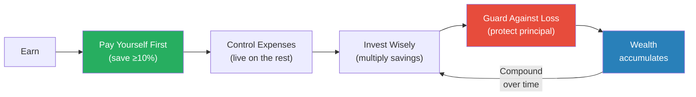

# The Richest Man in Babylon — George S. Clason

> George Clason published these parables in the 1920s as pamphlets distributed by banks and insurance companies. Nearly a century later, the advice hasn't aged a day.
> Set in ancient Babylon, the stories follow ordinary people — chariot builders, clay tablet scribes, camel traders — who learn the same financial truths that apply to anyone with a salary in 2026.
> The core message is aggressively simple: save at least a tenth of everything you earn, invest it wisely, protect it from loss, and let time do the rest.
> It is the oldest personal finance book still in print, and it remains one of the best.

---

## About the Author

George Samuel Clason was an American businessman who founded the Clason Map Company of Denver, Colorado.
He wrote these parables not as a financial advisor but as a storyteller who believed that the principles of wealth-building were so simple they could be taught through tales set 4,000 years ago.
The book has sold millions of copies and is still recommended by financial advisors worldwide.

---

## The Big Idea

- <b style="color: #2980b9">Wealth is not about how much you earn — it's about how much you keep</b>
- A part of all you earn is yours to keep — at least one-tenth, paid to yourself before anything else
- Money that you save must be put to work — savings alone won't build wealth; investment will
- <b style="color: #27ae60">Seek advice only from those who are competent through their own experience</b> — a brickmaker's opinion on jewels is worthless
- Protect what you have before chasing what you don't

---

## Seven Cures for a Lean Purse

Arkad, the richest man in Babylon, teaches these to the citizens at the king's request:

| # | Cure | Principle |
|---|------|-----------|
| 1 | **Start thy purse to fattening** | Save at least 10% of everything you earn — before paying anyone else |
| 2 | **Control thy expenditures** | Budget so that needs and reasonable desires are met without touching the 10% |
| 3 | **Make thy gold multiply** | Invest savings so they earn returns, and reinvest those returns |
| 4 | **Guard thy treasures from loss** | Protect principal above all — the first rule of investing is don't lose money |
| 5 | **Make of thy dwelling a profitable investment** | Own your home — it reduces cost of living and builds equity |
| 6 | **Ensure a future income** | Plan for retirement and the day when you can no longer work |
| 7 | **Increase thy ability to earn** | Invest in yourself — skills, knowledge, and reputation compound too |

---

## The Five Laws of Gold

Arkad's son Nomasir tests these laws through bitter experience — losing his inheritance to bad bets before learning the hard way:

- <b style="color: #27ae60">Gold comes gladly to the one who saves at least one-tenth of earnings</b>
- Gold multiplies for the one who finds it profitable employment
- Gold clings to the one who invests under advice from those wise in its handling
- <b style="color: #e74c3c">Gold slips away from the one who invests in unfamiliar purposes or follows the advice of tricksters and schemers</b>
- Gold flees the one who forces it into impossible earnings or follows the seductive counsel of gamblers

---

## The Camel Trader of Babylon

Dabasir's story is the debt chapter. He was a free man who became a slave through foolishness and debt, escaped, and rebuilt his life using a formula:

- **70%** — To live on (food, clothing, shelter, reasonable needs)
- **20%** — To repay creditors (divided fairly among them)
- **10%** — To save (even when in debt, you save first)

He approached each creditor with this plan. Most accepted, because getting paid slowly is better than not getting paid at all. Within two years, all debts were cleared and his savings had begun to compound.

- <b style="color: #2980b9">The critical insight: even in debt, you must pay yourself first</b> — otherwise you work only for creditors and never escape

---

## The Walls of Babylon

This parable is about defence, not offence. The walls of Babylon withstood a siege — and the lesson is that protecting what you have is as important as earning more.

- Insurance, emergency funds, and conservative investments are the "walls" of personal finance
- <b style="color: #27ae60">It does no good to build wealth if a single disaster can destroy it</b>
- The person who has adequate protection can invest more aggressively with the rest — because they've already secured the base

---

## The Luckiest Man in Babylon

Sharru Nada tells the story of how a slave's attitude toward work determined his fate.

- Two slaves: one resented work and stayed enslaved; the other embraced it, became indispensable, earned his freedom, and eventually became wealthy
- "Where the determination is, the way can be found"
- <b style="color: #2980b9">Work is the best friend you'll ever have</b> — the person who works hard and works smart creates their own "luck"
- Opportunity favours the prepared — but only if you're already in motion

---

## Timeless Principles, Modern Application

| Babylonian Wisdom | Modern Equivalent |
|-------------------|-------------------|
| Pay yourself first (10%) | Automatic payroll deduction to savings/investment account |
| Seek competent advice | Low-cost index funds, fiduciary financial advisors |
| Guard against loss | Emergency fund (3-6 months expenses), insurance |
| Own your dwelling | Mortgage as forced savings — builds equity over rent |
| Increase ability to earn | Continuous learning, certifications, career investment |
| Avoid get-rich-quick | Don't day-trade, don't chase meme stocks, don't speculate with money you can't lose |

---

## The Verdict

*The Richest Man in Babylon* has survived nearly a century for the simplest possible reason: it works. The parables are charmingly written, the language is deliberately archaic (which either delights or irritates — there's no middle ground), and the financial principles are so basic they feel obvious.

But that's exactly the point. The reason most people aren't wealthy isn't that they lack knowledge — it's that they lack discipline. Clason knew that wrapping the discipline in a story makes it stickier than any spreadsheet.

If you read this book and actually follow the 10% rule, it will change your financial life. Most people won't. That's also in the book.

---

## Related Reading

- [[The Psychology of Money - Morgan Housel|The Psychology of Money]] — Modern behavioural take on the same timeless principles
