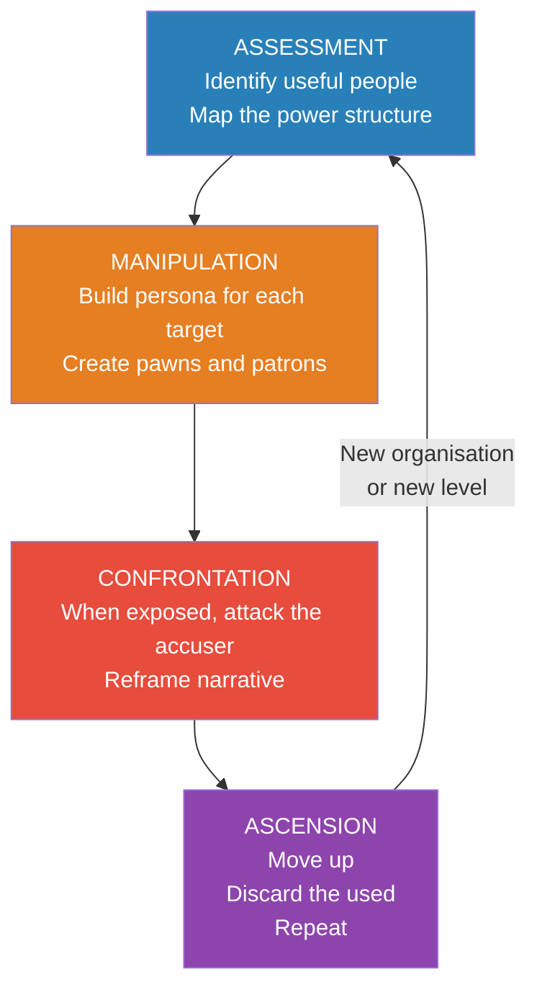

# Snakes in Suits — Paul Babiak & Robert D. Hare

> Paul Babiak and Robert Hare ask an unsettling question: what happens when a psychopath walks into a job interview?
> The answer: they get hired. Often enthusiastically.
> Because the traits of psychopathy — superficial charm, fearless dominance, grandiosity, cool under pressure, willingness to take bold action without hesitation — look remarkably like the traits companies say they want in leaders.
> This book maps the psychopath's corporate playbook from first handshake to corner office, explains why organisations are structurally vulnerable, and teaches you to recognise the pattern before you become a pawn in someone else's game.

---

## About the Authors

Paul Babiak is an industrial and organisational psychologist who advises companies on executive assessment and leadership development. He first noticed the psychopathy-leadership overlap while consulting for a company where the most "dynamic" executive was also the most destructive.

Robert Hare is the world's leading researcher on psychopathy and the creator of the Psychopathy Checklist-Revised (PCL-R), the gold standard for clinical assessment. He has spent decades studying psychopaths in prison — and then realised many of them wear suits instead of jumpsuits.

---

## The Big Idea

- <b style="color: #2980b9">Psychopathy and corporate leadership share surface traits</b> — charm, confidence, decisiveness, risk tolerance, and emotional detachment
- Companies mistake psychopathic traits for leadership potential — especially during times of change, uncertainty, or crisis
- <b style="color: #e74c3c">Corporate psychopaths don't just survive in organisations — they thrive</b>, because the structure rewards exactly what they're good at: impression management, self-promotion, and ruthless political manoeuvring
- They climb by building networks of **pawns** (useful people) and **patrons** (powerful protectors), then discard anyone who sees through them

---

## Psychopathy vs Leadership: The Confusion

| Psychopathy Trait | Mistaken for... |
|-------------------|-----------------|
| Superficial charm | Charisma, executive presence |
| Grandiosity | Vision, confidence, ambition |
| Fearless dominance | Decisiveness under pressure |
| Lack of empathy | "Tough-mindedness," ability to make hard calls |
| Manipulation | Political skill, stakeholder management |
| Pathological lying | Storytelling, strategic communication |
| Shallow emotions | Cool under fire, emotional resilience |
| Impulsivity | Bias for action, entrepreneurial instinct |

- <b style="color: #e74c3c">This overlap is not coincidental — it's the reason psychopaths are disproportionately represented in senior leadership</b>
- Estimates suggest 3-4% of the general population are psychopathic; some studies find rates 3-4x higher among senior executives

---

## The Psychopath's Corporate Playbook

**Phase 1 — Assessment:**
The psychopath enters the organisation and immediately begins mapping the terrain. Who has power? Who has information? Who is vulnerable? Who can be useful? They identify potential patrons (senior leaders who can sponsor them) and pawns (people who can be used for access, information, or cover).

**Phase 2 — Manipulation:**
They construct a different persona for each audience. To the CEO they're a visionary. To peers they're a team player. To subordinates they alternate between charm and intimidation. They build an information network by encouraging people to confide in them — then use that information strategically.

**Phase 3 — Confrontation:**
When someone sees through the mask and challenges them, the psychopath doesn't retreat. They attack. They reframe the accuser as a troublemaker, a poor performer, or a person with a grudge. They leverage their patron network to discredit the whistleblower.

**Phase 4 — Ascension:**
They move up. Those who helped them climb but are no longer useful are discarded — often publicly, to send a signal. The cycle repeats at the next level.

---

## Why Organisations Are Vulnerable

Babiak and Hare identify structural features that make companies easy hunting grounds:

- <b style="color: #2980b9">Rapid change and restructuring</b> — creates confusion and power vacuums that psychopaths exploit
- **Weak HR and vague promotion criteria** — personality and impression management fill the vacuum left by absent metrics
- **Hero culture** — organisations that worship "bold leaders" create a perfect disguise
- **Poor reference checking** — psychopaths move between organisations, leaving destruction behind but bringing a polished narrative forward
- **Emphasis on results over process** — short-term wins hide long-term destruction of teams, trust, and institutional knowledge

---

## Pawns and Patrons

The psychopath's network has two categories of people:

- **Patrons** — Senior figures who sponsor and protect the psychopath. They see only the carefully curated persona. They become invested in the psychopath's success because it validates their own judgement.
- **Pawns** — Useful people deployed for specific purposes: information, access, cover, or as scapegoats. When a pawn is no longer useful, they're abandoned or turned into a target.
- <b style="color: #27ae60">Everyone else is invisible — they don't register as important enough to manipulate</b>

---

## How to Spot the Corporate Psychopath

Red flags to watch for:

- Reputation varies wildly depending on who you ask — adored by some, feared by others
- Takes credit for successes, assigns blame for failures — always
- Colleagues who work closely with them burn out, transfer, or leave at unusual rates
- Charm is deployed selectively — different faces for different audiences
- Promises are forgotten, commitments are rewritten, and history is revised
- <b style="color: #e74c3c">When caught in a lie, they don't apologise — they attack the person who noticed</b>

---

## What You Can Do

- **Document everything** — verbal promises mean nothing; get it in writing
- **Build your own network** — don't rely on the psychopath's reality; cross-check with others
- **Watch actions, not words** — the most reliable data is what they do when they think no one's watching
- **Don't try to reform them** — this is not a coaching problem; it's a character problem
- **Protect your reputation** — if you're identified as a threat, they will try to discredit you before you can expose them
- <b style="color: #27ae60">If you recognise the pattern, the safest strategy is to leave the blast radius</b>

---

## The Verdict

*Snakes in Suits* is the definitive book on psychopathy in the workplace. Babiak brings the organisational psychology; Hare brings decades of clinical research. Together they explain not just what corporate psychopaths do, but why organisations are structurally complicit in their rise.

The book's composite narrative of "Dave" — a psychopath tracked from interview to executive suite — is chillingly plausible. If you've ever worked with someone who was simultaneously charming to leadership and destructive to everyone below them, this book will explain the mechanism.

The uncomfortable implication: the same systems that select for "leadership potential" also select for psychopathy. Until organisations learn to evaluate character as rigorously as they evaluate charisma, the snakes will keep climbing.

---

## Related Reading

- [[The Sociopath Next Door - Martha Stout|The Sociopath Next Door]] — The broader population view of antisocial personality
- [[In Sheep's Clothing - George K. Simon|In Sheep's Clothing]] — The covert-aggression tactics that corporate psychopaths deploy daily
- [[7 Rules of Power - Jeffrey Pfeffer|7 Rules of Power]] — Pfeffer's amoral power framework overlaps uncomfortably with the psychopath's playbook
