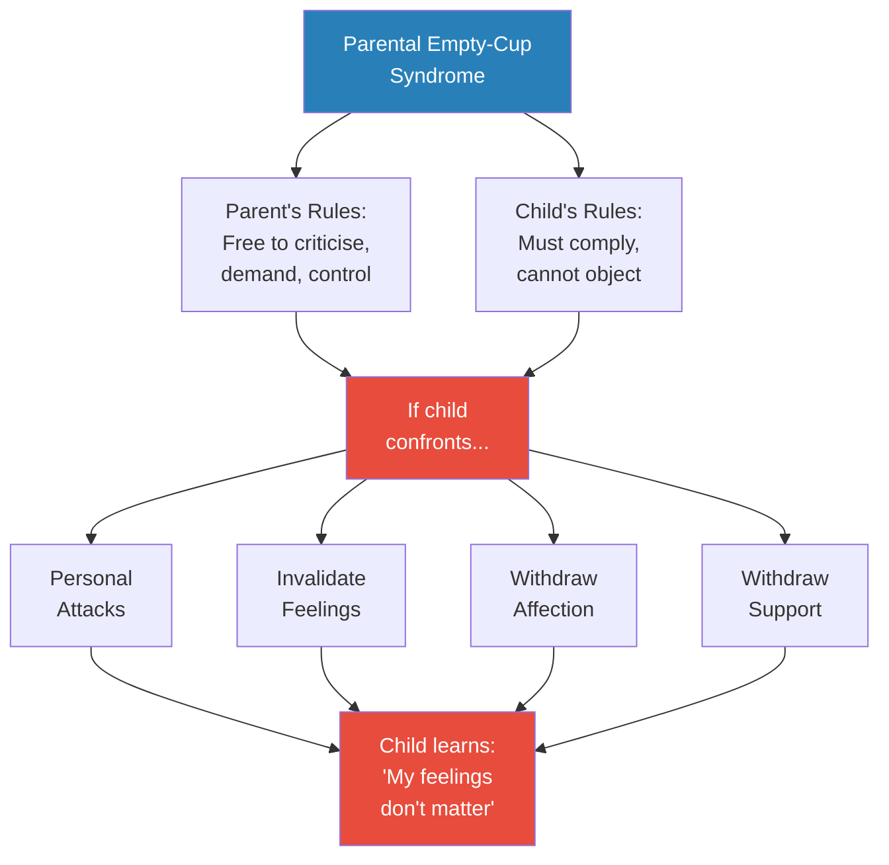
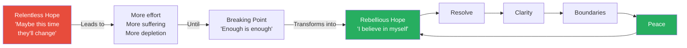
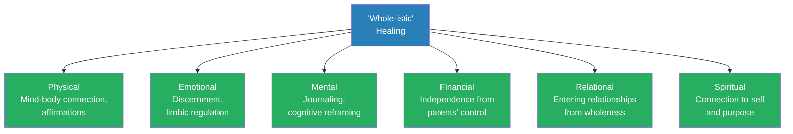

# Adult Survivors of Emotionally Abusive Parents — Sherrie Campbell

> Sherrie Campbell writes as both psychologist and survivor — estranged from both her parents and her sibling after decades of emotional abuse, manipulation, and gaslighting.
> Her thesis is unflinching: not all parents are good parents, society perpetuates a dangerous myth that they are, and adult survivors of emotionally abusive parents have the right — sometimes the obligation — to set hard boundaries, including no contact.
> The book maps the entire system: how emotionally abusive parents operate (emotional debt, conditional kindness, parental empty-cup syndrome), the devastating lifelong impacts on children (depression, anxiety, ADHD-like hyperactivity, eating disorders, avoidance of closeness), and a comprehensive recovery path through what Campbell calls "whole-istic" healing — physical, emotional, mental, financial, relational, and spiritual.
> What distinguishes this book is Campbell's willingness to give explicit, unequivocal permission: you are not a bad person for setting boundaries with your parents. You are not a bad person for choosing yourself. You are not a bad person for walking away.

---

## About the Author

Dr. Sherrie Campbell is a licensed clinical psychologist based in California. She is the author of *Adult Survivors of Toxic Family Members* (2022) and has built a large following of survivors who have estranged from dysfunctional parents. What sets Campbell apart from most clinical writers on this topic is that she is not writing from academic distance — she is herself estranged from both her parents and her sibling. She describes her childhood in vivid, personal detail: the stuffed animals that became her surrogate family, the movie *Annie* that gave her hope, the decades of manipulation she endured before reaching what she calls "resolve." She dedicates the book to her daughter, London — a declaration that the generational cycle stops with her.

---

## The Big Idea

- <b style="color: #e74c3c">Not all parents are good parents</b> — and society's myth that they are silences victims, protects abusers, and forces children to rationalise insanity to survive
- Emotionally abusive parents are **transactional, not relational** — children are objects that must comply, not people to be loved
- These parents operate through <b style="color: #2980b9">emotional debt</b>: subtraction, not addition — everything can be taken away and used against you
- The damage is profound and lifelong: depression, anxiety, ADHD-like symptoms, eating disorders, avoidance of closeness, failure to thrive
- Recovery requires what Campbell calls <b style="color: #27ae60">rebellious hope</b> — hope in yourself, not in your parents changing — and may require full no contact
- Healing is a verb, not a destination — you will always be in the process of healing, and that's okay
- The book's "whole-istic" healing framework covers six dimensions: physical, emotional, mental, financial, relational, and spiritual

---

## Key Concepts at a Glance

| Concept | One-line summary |
|---------|-----------------|
| **The Myth of Good Parents** | Society perpetuates a false monolithic model of perfect parents that silences child victims |
| **Emotional Debt Paradigm** | Toxic parents parent from subtraction — everything loved, desired, or said can be taken away |
| **Conditional Kindness** | Intermittent doses of affection used strategically to gain compliance |
| **Parental Empty-Cup Syndrome** | Campbell's term: parents free to abuse, children forbidden to object |
| **Moments of Truth** | Recurring device: stark truths about parental abuse that cut through denial |
| **No-Man's-Land** | The transitional space between leaving the toxic system and building a new life |
| **Relentless vs Rebellious Hope** | Relentless hope still believes parents will change; rebellious hope turns inward |
| **The Smear Campaign** | When you set boundaries, abusive parents mobilise others against you |
| **The Four A's of Healing** | Acknowledgment, Accountability, Acceptance, Action |
| **"Whole-istic" Healing** | Six-dimensional recovery: physical, emotional, mental, financial, relational, spiritual |
| **The Scapegoat** | Family role: truth-teller punished for exposing dysfunction |
| **Fantasy Parents** | Transitional objects children create to substitute for the love they never received |

---

## The Myth That All Parents Are Good

### Chapter 1 — The Critical Importance of Parents

*Campbell opens by dismantling the cultural assumption that all parents love their children — and showing how this myth protects abusers and silences victims.*

- From the youngest of ages, children are indoctrinated into the idea that all parents are good
- If you google "parents," you get glossy stock photos of perfect families — there is no cultural space for the reality of bad parents
- <b style="color: #e74c3c">The myth is perpetuated socially, religiously, culturally, in family law, and even in psychology</b>
- Children under dysfunctional parents are kept as prisoners to their parents' needs — the only option is loss of freedom and the right to author their own story
- "Children are sacrificed because they are the easiest to sweep under the rug"
- The label "parent" does not erase dysfunction — it gives an already abusive person a new arena to act out

- **Characteristics of healthy parents:**
  - See themselves as your visionaries
  - Are emotionally available
  - Model healthy values
  - Grant you space to develop
  - Choose their words wisely
  - Under healthy parents: emotions are talked through, interests are honoured, conflict is addressed openly

- <b style="color: #e74c3c">**Characteristics of emotionally abusive parents:**</b>
  - Transactional, not relational — you are a "thing" that must adhere to rules
  - Prefer weekly reports rather than connection; your value is measured by performance
  - Run a balance sheet of give-and-take, keeping financial and emotional ledgers
  - Nothing is given for free; everything can be taken away
  - Believe children are responsible for parents' happiness
  - View children as having zero rights in the relationship

> [!tip] Core Insight — Moment of Truth
> "Children should not have to earn love. They should be able to rest in it."

- **Emotionally abusive parents deny your experience of abuse:**
  - They claim to love their children while systematically mistreating them
  - They feign "wanting to know your reasons" while already having ruled against you
  - When you express needs, you receive a disgusted, retaliatory response
  - When you give voice to your pain, you are accused of "throwing your parents under the bus"
  - These dismissals allow abusive parents to <b style="color: #e74c3c">hide in plain sight</b>

- **Reality doesn't matter to emotionally abusive parents:**
  - The narcissism common to these parents is not rooted in insecurity — it's rooted in entitlement and dishonesty
  - If you take the side of reality, you become their enemy
  - They are pathological liars who lie about the ways they abuse you to protect their pride
  - "Repeated mistakes made by highly dysfunctional parents aren't accidents, but a reflection of their poor character"
  - The common excuse — "they were wounded as children" — doesn't hold: "Your parents have wounded you, and you're not abusing your children. There is no excuse for abuse."

- **The cultural problem:**
  - Children are indoctrinated from birth: all parents are good
  - Ads, TV shows, movies feature glossy images of perfect families
  - There is no cultural space for the reality of bad parents
  - When a stranger abuses a child, society intervenes — but when a parent does the same, others say "Your parent means well"
  - "The label of 'parent' doesn't rid an abusive person of their dysfunction and magically change them into someone loving"

---

## How Emotionally Abusive Parents Operate

### Chapter 2 — The Search for Any Feeling of Home

*Campbell maps the psychological warfare of emotionally abusive parents — subtraction, conditional kindness, and the creation of emotional debt.*

- <b style="color: #2980b9">Emotional Debt Paradigm:</b> toxic parents parent from subtraction, not addition
  - Everything you loved, desired, thought, felt, or said could be taken away and used against you
  - This creates a toxic cocktail of fear, uncertainty, instability, frustration, worry, and resentment
  - Parents weaponize sacrifice: "After all I've done for you"
  - The child offers to accept less, be less, do less — hoping to become easier to love
  - When the child offers to take less, parents are offended — it mirrors their selfishness

- <b style="color: #e74c3c">Conditional Kindness:</b>
  - Intermittent doses of kindness used to gain something the parent needs
  - Random affection makes the impact more intense — and the subsequent withdrawal more devastating
  - "Come here, go away" dynamic creates profound abandonment and loneliness
  - Small rations of kindness increase the craving for consistency and predictability

> [!example] Campbell's Fantasy Parents
> - As a child, Campbell's dearest relationships were with her stuffed animals
> - She imagined they loved, comforted, and protected her in ways her parents did not
> - She parented them the way she desired to be parented, and they parented her back
> - She was their favourite person; they kept her safe and cared about her feelings
> - The movie *Annie* served as a pivotal transitional object — Annie had the strength, fearlessness, and independence Campbell didn't have, but they shared the same yearning: parents who loved them
> - "My fantasies and transitional objects were much better parents to me than my actual parents"
> **The lesson:** When children cannot find love with their real parents, they create fantasy substitutes — stuffed animals, fictional characters, imaginary worlds. The need for love is so fundamental that children will manufacture it from whatever materials are available.

- **Devastating lifelong impacts of emotional debt:**
  - Depression — "depths of sadness I was unaware human beings were capable of feeling"
  - Anxiety — no model for how to stand in support of yourself
  - Apathy — "What's the point?"
  - Failure to thrive — how can you thrive without the security of loving parents?
  - Hyperactivity — may be C-PTSD misdiagnosed as ADHD; Campbell had all symptoms
  - Aggression — natural response to emotional abuse; "all most of you wanted was to be heard"
  - Avoidance of emotional closeness
  - Eating disorders
  - Emotional loneliness

---

### Chapter 3 — Love Cannot Be Forced

*Campbell catalogues the manipulative tactics parents use to force compliance that they call "love."*

- Survivors experience "Love thy father and thy mother" as one of the most pervasive and destructive sayings in culture
- <b style="color: #2980b9">Authentic love</b> presents as unrestricted deep feeling of affection — experienced as happiness, enjoyment, safety, freedom
- <b style="color: #e74c3c">Forced "love"</b> masquerades as manipulation, gaslighting, emotional blackmail, financial abuse, guilting, and shaming

- **Manipulative tactics to force "love":**

| Tactic | How It Works |
|--------|-------------|
| **"Because I am your parent"** | Totalitarian obligation; servitude disguised as family duty |
| **Health problems** | Manufactured or exaggerated illnesses to control; provoke fear of "death abandonment" |
| **Silent treatment** | Tyrannical torment that makes child's existence feel meaningless |
| **Financial abuse** | Money as control — threatening to cut off, tracking spending, opening bank statements |
| **Hypocrisy** | Contradictions that place child in no-win situations |

> [!example] The Girl and the Bank Account
> - A fifteen-year-old had a bank account opened with her mother as cosigner to learn money management
> - Over two years, the mother "accidentally" took close to $15,000 from the account
> - When confronted, the mother's response: "Don't talk down to me. Accidents happen"
> - Because the mother paid the money back whenever caught, she believed all was well
> - The daughter closed the joint account and opened a new one her mother couldn't access
> **The lesson:** No parent should access their child's personal money without permission. Financial abuse is about power, not money — and the parent's refusal to validate the child's grievance drives emotional distance.

> [!example] The Heart Emoji Father
> - A young girl had heart emojis next to her mom's name in her phone but not next to her dad's
> - Her invasive father periodically went through her phone to monitor her relationships
> - When he noticed the difference, he added heart emojis next to his own name
> - He told his daughter he did this because "it looked like she loved her mom more than she loved him"
> **The lesson:** Toxic parents perceive love as an image to be managed, not a feeling to be earned. They will literally edit the evidence to create the appearance of love they haven't earned.

- **Healing the wounds of emotional debt:**
  - **Clarify your feelings for yourself:** when you create slideshows to explain reality to your parents, that overexplaining comes from fear — stop pleading for love and get clear on how *you* feel
  - **Express your feelings:** developing healthy relationships requires the risk of expressing yourself — you need to experience how others respond
  - **Soothe yourself:** if you grew up emotionally abused, you never learned self-soothing; babies are best soothed through five senses — this works for adults too:
    - **Touch:** healing touch from loved ones, pets, weighted blankets
    - **Taste:** warm herbal tea
    - **Smell:** aromatherapy, essential oils, bath salts
    - **Sight:** nature, art, favourite movies — "gives your mind a break from survival mode"
    - **Sound:** music, podcasts, white noise, sound-blocking earphones

---

### Chapter 3 — Love Cannot Be Forced

*Campbell catalogues the manipulative tactics parents use to force compliance disguised as "love."*

- **"Because I am your parent":**
  - Used as a calculating lie with deep consequential ramifications
  - Nearly every brutality in cultures worldwide has been enabled by totalitarian mentality of obligations toward authority
  - Campbell cites the Britney Spears conservatorship: her father placed her into "emotional, physical, financial, psychological, and spiritual slavery" because he was her parent
  - When parents lack compassion, they cannot teach the virtue of love — "love" from their perception looks like service (servant) or good behaviour (obedience)

- **Health problems as manipulation:**
  - Toxic parents are "Machiavellian" when it comes to manufacturing afflictions
  - They exaggerate minor illnesses to control you, block your separation, provoke "death abandonment" fear
  - They start GoFundMe accounts for themselves, talk openly and constantly about their illnesses
  - They crave the worried concern in their children's eyes — "wrongly perceiving this as love"

- **The silent treatment:**
  - "A tyrannical form of torment" that makes your existence feel meaningless
  - Powerful enough to produce emotional pain far more excruciating than a physical wound
  - To disrupt it, children tried doing extra to gain approval — "erroneously believing that if they could have been better children, they would have had better parents"
  - Whatever strategy you used to bridge the gap, your parents interpreted your submission as love

- **Financial abuse:**
  - Money is an abusive parent's greatest love — it gives them power over an already dependent person
  - Examples: threatening to cut you off for holding different opinions, tracking every penny, requiring permission for personal spending, sabotaging your ability to seek employment, paying bills then guilting you afterward
  - Effects: feeling you don't deserve support, hyperindependence (refusing all help), fear of money, seeing yourself as helpless

---

### Parental Empty-Cup Syndrome

*Campbell's central framework for understanding how emotionally abusive parents operate.*

- <b style="color: #2980b9">Parental empty-cup syndrome</b> (Campbell's term):
  - **Parents' rules:** free to criticise, voice opinions, ask anything invasive, be rude, cruel, moody, unpredictable, insensitive — child must follow through with no questions asked
  - **Child's rules:** not allowed to point out bad behaviour, disagree, stand up for yourself, or say no
  - If child confronts contradictions, their bad behaviours suddenly become the child's fault
  - Parents retaliate by calling child crazy, difficult, selfish, dishonest, ungrateful

- **Retaliation tactics:**
  - **Personal attacks:** blame you for other family members' problems; ridicule past mistakes; "How could you do this to me after all I've done for you?"
  - **Invalidate feelings and needs:** prevent you from talking, finish your sentences, change subject, push needs off, cross stated boundaries
  - **Withdraw positive interactions:** at any sign of you veering from their image, you lose warmth, praise, connection, acceptance
  - **Withdraw support:** emotional and financial support withdrawn to create instability

*The system is designed to make the child conclude that their feelings, needs, and boundaries are the problem — never the parent's behaviour.*

---

## Transforming Maladaptive Guilt

### Chapter 4 — Guilt as a Weapon

*Campbell addresses the guilt that keeps survivors trapped — and shows how to transform it from a weapon into a signal.*

- Maladaptive guilt is the feeling of being responsible for things you didn't do and situations you didn't create
- Your parents programmed this guilt from childhood: "After all I've done for you" / "You're ungrateful" / "You're the reason I'm unhappy"
- The guilt serves one purpose: keeping you compliant
- <b style="color: #e74c3c">Healthy guilt</b> tells you when you've genuinely wronged someone — it's brief and specific
- <b style="color: #e74c3c">Maladaptive guilt</b> is chronic, vague, and attached to normal human needs (wanting space, saying no, having your own life)
- Transforming guilt requires:
  - Recognising it as programmed, not earned
  - Distinguishing between genuine wrongdoing and healthy self-assertion
  - Practising sitting with discomfort without acting on it
  - Understanding that your parents weaponized a normal human emotion to control you

---

## Respecting Yourself

### Chapters 5-8 — Untwisting Respect, Overcoming Self-Neglect, Learning What Love Feels Like

*Campbell devotes several chapters to dismantling the toxic version of "respect" that abusive parents demand and rebuilding a healthy version.*

- **Abusive parents' version of respect:**
  - Respect means obedience — "Don't question me"
  - Respect means silence — "Don't air our dirty laundry"
  - Respect means compliance — "Do what I say without asking why"
  - This is not respect — it is control

- **Healthy respect:**
  - Respect is mutual — it goes both ways
  - Respect honours boundaries
  - Respect allows disagreement without punishment
  - Respect celebrates independence, not dependence

- **Overcoming self-neglect:**
  - When your parents neglected your emotional needs, you learned to neglect them yourself
  - Self-neglect manifests as: ignoring physical health, not eating properly, not sleeping enough, overworking, staying in harmful relationships, not seeking help
  - <b style="color: #27ae60">Recovery begins with small acts of self-care:</b> eating a proper meal, going to bed on time, making a doctor's appointment, saying no to one thing today

- **What love based in respect feels like:**
  - It feels safe — you don't walk on eggshells
  - It feels free — you can be yourself without punishment
  - It feels consistent — warmth doesn't evaporate without warning
  - It feels mutual — both people's needs matter equally
  - If you've never experienced this, it can initially feel unfamiliar and even uncomfortable — that discomfort is a sign of healing, not a sign that something is wrong

---

## Your Role in the Family System

### Chapters 9-11 — The Scapegoat, the Smear Campaign, and Fighting Back

*Campbell maps the roles in dysfunctional families and what happens when the scapegoat refuses to play along.*

- **Family system roles:**
  - **Scapegoat:** the truth-teller who gets punished for seeing what others refuse to see
  - **Golden child:** receives conditional approval in exchange for compliance — but the approval can be revoked at any moment
  - **Lost child:** withdraws into invisibility to avoid conflict
  - **Mascot:** uses humour to deflect family tension
  - The system requires all roles to remain stable — when one person changes, the system destabilises

- **The smear campaign:**
  - When you set boundaries, abusive parents mobilise everyone against you
  - "Flying monkeys" (relatives, family friends, even therapists) are recruited to deliver messages: "You're breaking your mother's heart" / "Life is short" / "You'll regret this"
  - The smear campaign is designed to isolate you and make you doubt your decision
  - <b style="color: #e74c3c">The smear campaign proves the dysfunction:</b> healthy parents would self-reflect, not mobilise an army

- **When the scapegoat fights back:**
  - You no longer accept the role assigned to you
  - You tell the truth about what happened — and the family punishes you for it
  - Extended family takes the parents' side (because they only know the parents' version)
  - The pain of being rejected by your extended family is real — but it is less painful than continuing to absorb abuse

> [!tip] Core Insight
> The smear campaign is the final proof that you made the right decision. Healthy parents respond to boundaries with self-reflection. Abusive parents respond with retaliation.

---

## The Path to Recovery

### No-Man's-Land and the Scapegoat's Fight

*Campbell describes the transitional space between leaving the toxic system and building a new life — what she calls "no-man's-land."*

- <b style="color: #2980b9">No-man's-land</b> is where you go when you've created distance from your abusive parents
  - A place of recovery and discovery
  - Where anger transmutes into calm, clear resolve
  - Where you are reintroduced to yourself

- **The scapegoat fights back:**
  - The scapegoat is the family's truth-teller — punished for exposing dysfunction
  - When the scapegoat sets boundaries, the family system destabilises
  - The **smear campaign** begins: abusive parents mobilise family and community against the survivor
  - "Flying monkeys" are recruited to shame the survivor back into compliance

> [!example] Campbell's Final Interaction with Her Mother
> - In their last interaction, Campbell's mother and her partner made a meaningless mistake — following the wrong car to a restaurant
> - The mother coercively turned this trivial moment into a dramatic, irreparable abuse of Campbell's character
> - In that moment, Campbell reached the end of what she was ever willing to tolerate
> - "If something so meaningless could turn into something so catastrophic, I knew that if I continued in a relationship with her, this would be how the rest of my life would play out"
> - Looking back from no-man's-land: "My mother has always had the agenda to destroy and humiliate me any chance she could throughout my entire life"
> - "Making me hate her was the drug that satisfied her most"
> **The lesson:** Sometimes the final moment is not dramatic — it's the clarity that even the most trivial interaction will be weaponised. That clarity is the beginning of resolve.

- **Moving from anger to resolve:**
  - In no-man's-land, anger transmutes into calm, clear resolve
  - Campbell's experience: "I knew that if something so meaningless could turn into something so catastrophic, this would be how the rest of my life would play out"
  - "The emotion of hate isn't designed to be chronic. However, chronic abuse leaves you with little other choice to feel any differently"
  - The resolve that came from her last abusive moment made the hate lift — it was replaced by clarity
  - "I would rather be parentless and sibling-less than manipulated, used, and abused"
  - "I can cope far greater with the hurt and pain of not having them in my life than I was ever able to sustain with them in my life"

---

### Choosing Yourself

*Chapter 12 — Campbell gives explicit permission to put yourself first, perhaps for the first time in your life.*

- Choosing yourself means:
  - No longer betraying yourself to maintain a relationship with people who mistreat you
  - No longer performing the role of the dutiful child when there is no love behind the duty
  - Accepting that your parents' opinion of you is not the truth about you
  - Building a life based on your values, not the values your parents imposed

- **Practical steps for choosing yourself:**
  - Identify what you tolerate that you no longer want to tolerate
  - Make a list of non-negotiables — the things you will no longer accept
  - Practice saying: "I am allowed to have a good life"
  - Start small — one act of self-assertion per day
  - Surround yourself with people who celebrate your growth, not people who punish it

- **What choosing yourself looks like in practice:**
  - Saying no to a family event without providing an excuse
  - Not answering a phone call from a toxic parent when you're not in the right headspace
  - Spending money on your own therapy instead of sending it to parents who demand it
  - Telling a family member: "I'm not going to discuss my relationship with my parents with you"
  - Celebrating your own achievements without minimising them to avoid your parents' jealousy
  - Taking a vacation without guilt — even if your parents disapprove of how you spend your time and money
  - Allowing yourself to feel happy without immediately scanning for threats

- **Gray-rocking (mentioned by Campbell):**
  - When you cannot fully separate, become as emotionally uninteresting as a gray rock
  - Give flat, minimal responses: "Okay." "That's fine." "I'll think about it."
  - Don't share exciting news, personal details, or emotional reactions
  - Reduce the emotional supply your parents feed on
  - This is not dishonesty — it is self-preservation

---

### From Relentless Hope to Rebellious Hope

*Campbell's most powerful distinction: the hope that keeps you trapped vs the hope that sets you free.*

- <b style="color: #e74c3c">Relentless hope:</b> you still believe there is something you can do to make your parents happy; you try harder; you never give up
  - This hope is innocent but destructive — it keeps you trapped in the cycle
  - You have tried to love them, but they have never tried to love you

- <b style="color: #27ae60">Rebellious hope:</b> hope in yourself, not in your parents changing
  - "Enough is enough"
  - You're willing to be cast out if it sets you free
  - Rebellious hope is the driving force that keeps you moving forward
  - **The cascade:** rebellious hope → resolve → clarity → boundaries → peace → rebellious hope regenerates

*Relentless hope depletes you; rebellious hope regenerates. The turning point is the recognition that your parents will never change — and that the hope worth having is hope in yourself.*

---

### Connecting with Your Feelings — A Process

*Campbell provides a structured process for survivors to reconnect with the emotions their parents taught them to suppress.*

> [!abstract] Connecting with Negative Emotions
> 1. Make a list of negative emotions you experience most frequently (afraid, angry, unworthy, confused, sad)
> 2. Write each emotion on a separate paper and list the situations that trigger it
> 3. Write how each emotion feels in your body (stomachache, nervousness, trouble breathing)
> 4. Write how this emotion impacts your behaviour (avoiding risks, losing your temper)
> 5. Examine how this emotion may have a loving intention — anger may signal "enough is enough"; sadness may say "you've been hurt"; resentment may say "you're being taken advantage of"
> 6. Remember that "e-motion" is energy in motion — ask what actions your feelings are signalling you to take
> 7. Ask who you would be without this emotion (more confident, fearless, self-assured)
> 8. Imagine placing the emotion in a basket, illuminated with light — thank it for its protective intention, and let it dissolve

- <b style="color: #27ae60">Key principle:</b> hurt feelings don't vanish on their own — if you don't release them, they pile up like debt and eventually come due in nonproductive ways
- Tolerating abuse because they are your parents gets you nowhere
- "Your parents will always blame you. This keeps them safe from having to look at themselves."
- "What you will find is that your emotionally abusive parents do not reinvent the wheel — they just keep telling the same lies over and again"

---

### Spiritual Healing

*Campbell addresses the spiritual dimension of recovery — not as religion, but as connection to something larger than your pain.*

- Spirituality implies connection — to self, the Universe, God, or others, and to the overall process of life
- Choosing to heal yourself is the most self-actualising process you can undertake
- Through this process, you can savor knowing that something magical has been loving, supporting, and protecting you
- For many survivors, the concept of a loving higher power is difficult — because the first "higher power" in their lives (their parents) was cruel
- Recovery may involve redefining what "God" or "spirit" means to you — separate from what your parents used to control you
- The spiritual dimension is about trust: trust that the universe is not as hostile as your childhood made it seem
- It is about meaning: finding purpose in your suffering, not as justification for it, but as fuel for your healing and your commitment to breaking the cycle

---

### Recovering Your Authentic Self

*In no-man's-land, you reclaim the person your parents tried to destroy.*

- Your parents forced you away from being yourself through control
  - You learned what was expected (even when you didn't want it)
  - What the right responses were (even when it wasn't your truth)
  - What was acceptable (even when it wasn't acceptable to you)
- **Trauma research confirms:** when people choose between attachment and authenticity, they choose attachment — you sacrificed who you are to stay connected to your parents
- <b style="color: #27ae60">"Children are born knowing love. When a parent mistreats a child, the child doesn't stop loving their parents. The child stops loving themself."</b>

> [!abstract] Three-Step Self-Actualising Process
> 1. **Make a list of traits you want to embody** — fair, open, emotionally available, disciplined, responsible, humble, confident, happy, loving, carefree
> 2. **Study the definition of each word** — see how it feels inside; envision it being part of every area of your life
> 3. **Live each word** — practice becoming the embodiment of each definition physically, emotionally, mentally, spiritually, relationally, and financially

---

### Healing Is a Verb — The Four A's

*Campbell reframes healing as an ongoing action, not a destination.*

- There is no such thing as being fully healed from parental abuse — you are biologically connected to these people
- <b style="color: #2980b9">Healing is a verb:</b> an action and a direction, not a destination
- The pain you experience today will always be filtered through how you learned to deal with pain over the course of your life
- Boundaries can insulate you from further abuse, but the existing wounds require ongoing attention

> [!abstract] The Four A's of Healing
> 1. **Acknowledgment:** healing hurts and is often tremendously lonely; acknowledge this truth
> 2. **Accountability:** hold your parents accountable internally through the boundaries you set — your parents created the problems, but they are now yours to fix
> 3. **Acceptance:** accept your parents for who they are (not who you wish they were); accept yourself for protecting yourself
> 4. **Action:** create the best and healthiest life you can — healing gives you a new story and a sense of possibility

---

### "Whole-istic" Healing: Six Dimensions

*Campbell's comprehensive recovery framework — not "holistic" (natural, organic) but "whole-istic" (addressing every dimension of the damage).*

- **Physical healing:**
  - Psychoneuroimmunology: thoughts and feelings impact physical well-being
  - Louise Hay framework: physical ailments connected to psychological sources (aches = yearning for love; asthma = smothered; insomnia = fear; hip pain = stubborn anger at parents)
  - Create personalised healing affirmations for each ailment

- **Emotional healing:**
  - Learn to harness emotions before acting them out
  - <b style="color: #2980b9">Discernment:</b> the quality of possessing good judgment
  - Understand the mechanics: emotions enter base of brain → move to limbic system (labelling) → automatic reaction
  - <b style="color: #27ae60">Pause before reacting:</b> let emotions move from limbic system to prefrontal cortex (reasoning, regulation, judgment)
  - When you act without thinking, you are in "limbic overload"

- **Mental healing:**
  - The prefrontal cortex houses rational thought — it tempers actions until emotional regulation is established
  - Journaling as primary tool: prioritise problems, avoid impulsivity, get clear on identity, track moods, develop positive self-talk

- **Financial healing:**
  - Money is emotionally loaded; financial independence eliminates parents' coercive control
  - Read about the spirit of money — how to attract, respect, and appreciate it
  - "Money may not bring happiness, but it does bring freedom"

- **Relational healing:**
  - When you have yourself together, you enter relationships from wholeness rather than need
  - Markers of healthy relationships: feel free, safe, accepted, encouraged, playful, comfortable with silence, accountable

- **Spiritual healing:**
  - Connection to self, universe, God, or the process of life
  - Healing yourself is the most self-actualising process you can undertake

*Campbell's "whole-istic" healing addresses every dimension of the damage done by emotionally abusive parents — not just the emotional wound, but the physical, mental, financial, relational, and spiritual impact.*

---

### Your Happiness Possibility and Making Love Your Default

*Chapters 15-16: Campbell's final chapters address the possibility of genuine happiness — something many survivors have never experienced — and choosing love over fear as your default emotional state.*

- **Understanding resistance to happiness:**
  - When raised in a negativistic environment, happiness ceases to exist as a possibility
  - You were taught that you did not deserve freedom or happiness
  - Your parents made pain your purpose instead of happiness
  - When something good happened, you feared it — you spiraled — you feared losing it before enjoying it
  - "Energy flows where your attention goes" — if your default is fear, you unconsciously shoot down the possibility of love, trust, and joy

- **Pain is not your purpose:**
  - Your parents taught you a worldview that supports drama, terror, separation, and hardship
  - You worked hard in the hope of earning love — but the love didn't exist
  - Suffering had no end date because there was no love to earn
  - <b style="color: #27ae60">In no-man's-land, the new narrative: pain is not your purpose</b>
  - The goal is to assign meaning to your suffering that aligns with who you really are
  - You are here to develop new patterns that manifest love, freedom, and stability

- **Making love your default emotion:**
  - Love is not just a feeling — it is a decision and a practice
  - When your default emotion was fear, every decision was filtered through threat assessment
  - When your default emotion becomes love, decisions are filtered through: "What honours who I am?"
  - This doesn't mean ignoring danger — it means not living as if everything is dangerous
  - Practice: each time you catch yourself in fear, ask: "What would love do here?"

- **Practical steps for building happiness:**
  - Develop a daily practice of gratitude — not performative, but genuine noticing of small goodnesses
  - Celebrate wins — even tiny ones — because your parents never did
  - Surround yourself with people who celebrate you, not people who tolerate you
  - Create routines that bring predictability and safety — things your childhood lacked
  - Allow yourself to enjoy things without waiting for the other shoe to drop
  - <b style="color: #27ae60">"The healthier you become, the healthier your relationships become"</b>

---

## Breaking the Generational Cycle

*A theme woven throughout the book: Campbell's dedication to her daughter signals that this is as much about protecting the next generation as healing the current one.*

- If you have children, you have the power — and the responsibility — to stop the cycle
- You know exactly what not to do because you experienced it
- Your children don't need perfect parents — they need parents who are self-aware, accountable, and willing to grow
- <b style="color: #2980b9">The opposite of what your parents did is not necessarily the right thing</b> — healthy parenting isn't the mirror image of abuse; it's a new model entirely
- Practical principles for breaking the cycle:
  - Validate your children's emotions — even when inconvenient
  - Allow your children to set boundaries with you — even when it's uncomfortable
  - Admit when you're wrong — modelling accountability teaches it better than demanding it
  - Seek therapy proactively, not just when things are falling apart
  - Don't use your children as emotional support — that is what adult relationships and therapists are for
  - "Toxic parents have children to feel power. Healthy parents have children to empower."

---

## Permission for No Contact

*Campbell provides what many survivors desperately need and rarely receive: explicit, unequivocal permission to walk away from abusive parents.*

- "I would rather be parentless and sibling-less than manipulated, used, and abused"
- "I can cope far greater with the hurt and pain of not having them in my life than I was ever able to sustain with them in my life"
- Estrangement is not failure — it is the healthiest choice when the alternative is continued abuse
- The cultural kickback is real: outsiders who haven't experienced parental abuse stand in "fierce opposition toward an abusive dynamic they cannot fathom truly exists"
- <b style="color: #27ae60">No one wants distance from the most foundational people in their life</b> — if you are in no-man's-land, your parents left you with no other healthy choice

> [!tip] Core Insight — Moment of Truth
> "It is time we stop associating strength with the ability to smile through the tears and suffer in silence."

---

## The Physical-Emotional Connection

*Campbell draws on psychoneuroimmunology to show how emotional abuse manifests in the body — and how healing the body contributes to healing the mind.*

- Many survivors carry their trauma in their bodies without realising the connection
- Campbell shares physical ailments she experienced and their psychological counterparts (from Louise Hay's framework):

| Physical Ailment | Psychological Counterpart |
|------------------|--------------------------|
| Accident prone | Inability to speak up for self, defiance of authority |
| Chronic aches | Yearning for love |
| Adrenal problems | Family tension, feeling unwelcome, exhaustion |
| Anxiety | Not trusting the process, need for control |
| Asthma | Feeling smothered, inability to breathe for self |
| Depression | Anger turned inward, guilt for feeling hopeless |
| Headaches | Self-criticism, fear |
| Hip pain | Stubborn anger at parents, nothing to move forward to |
| Insomnia | Fear, anxiety |
| Sore throat | Holding in angry words, fear of conflict |
| Upper-back pain | Lack of emotional support, feeling unloved |

- Campbell personalised healing affirmations for each ailment — she encourages readers to do the same
  - Example for asthma: "I am thankful I now breathe deeply, easily, and effortlessly on my own, knowing my healthy boundaries are in place. I am safe and protected from the parents who harmed me."
- <b style="color: #27ae60">When your physical body is healthy, your moods and reactions are easier to manage</b>
- When thoughts and emotions are more manageable, you are more in touch with the essence of your resilient spirit

---

## Emotional Mechanics: The Limbic System vs the Prefrontal Cortex

*Campbell explains the neuroscience behind why survivors react impulsively — and how to create a pause between emotion and action.*

- Emotions move through the central nervous system to the brain
- In the **limbic system** (midbrain): you become aware of an emotion and label it (mad, sad, glad, afraid, ashamed, hurt)
- Once labelled, there is an automatic reaction or associated behaviour — this is when you're most vulnerable to speaking or acting before reasoning
- When you act without thinking, you are in <b style="color: #e74c3c">"limbic overload"</b> — overemoting and under-reasoning
- To counter knee-jerk reactions: **pause before reacting**
  - This gives emotions time to move to the **prefrontal cortex** (front of brain)
  - The prefrontal cortex handles executive functioning: reasoning, emotional regulation, judgment
  - Once emotions reach here, you can decide how to respond rather than simply reacting
- <b style="color: #2980b9">Discernment</b> = possessing good judgment — and it requires self-control
- One of the most effective tools: **journaling**
  - Engages the prefrontal cortex
  - Helps prioritise problems, avoid impulsivity, get clear on identity
  - Tracks moods and patterns
  - Develops positive self-talk
  - Crafts and maintains a sense of self

---

## Markers of Healthy Relationships

*Campbell provides a checklist of what healthy relationships feel like — because many survivors have never experienced one and don't know what to look for.*

- You feel free to engage in deep and meaningful conversations
- You feel safe to share your vulnerabilities
- You feel safe to show up as who you are in your varying moods
- You feel seen and understood
- You feel accepted
- You feel encouraged and supported to grow
- Your independence is celebrated
- You are comfortable with your flaws
- You can be playful and lighthearted
- You feel at ease with silence and personal space
- You value both nonsexual and sexual intimacy
- You hold yourself and others accountable
- You create space to express emotions freely through highs and lows
- You have deep respect for yourself and others

> [!tip] Core Insight
> "In healthy relationships, things are clear, not confusing." If you are constantly confused by someone's behaviour toward you, that confusion is not a personality flaw — it is data. Healthy relationships do not produce chronic confusion.

---

## Moments of Truth (Selected)

Campbell uses "Moment of Truth" statements throughout the book as anchoring declarations. The most powerful:

- "Children should not have to earn love. They should be able to rest in it."
- "Parents give you either a life to love or a life to hate."
- "Healing is not possible when your reality is not given the proper outlet for validation."
- "Toxic parents don't feel they need to ask children for permission because they feel entitled to forgiveness."
- "Children are born knowing love. When a parent mistreats a child, the child doesn't stop loving their parents. The child stops loving themself."
- "As a child, you are born dependent on your parents, but your potential to feel love for them must be earned."
- "Your parents' job is not to force or control your emotions. It is their job to effectively manage their own."
- "In healthy relationships, things are clear, not confusing."
- "Toxic parents believe it is their right to force you to love them."

---

## The Estrangement Epidemic

*Campbell contextualises the choice to go no-contact within a broader social reality.*

- Since she started writing about toxic family relationships, Campbell has developed an incredible following of "bravehearted people" who have cut off or drastically distanced themselves from their parents
- There is a powerful cultural kickback toward those who make this decision
- Estrangement from family continues as a "silent epidemic" few openly talk about
- Why? "Because those who have not had this experience cannot imagine the depths of pain children of emotionally abusive parents experience"
- Outsiders stand in fierce opposition toward an abusive dynamic they cannot fathom truly exists
- <b style="color: #e74c3c">The double bind:</b> survivors are punished by their parents for existing, then punished by society for protecting themselves
- Campbell's response: "It makes no sense that parents put the burden of change onto their children"
- "It seems odd that as a culture we hold children to a higher standard of maturity than the parents who are raising them"
- The number of adults estranged from parents is growing — not because children are ungrateful, but because information about emotional abuse is becoming more accessible
- Books like this one, and social media communities, are giving survivors language for experiences they couldn't previously articulate

---

## Transforming Maladaptive Guilt — In Depth

*Chapter 4 provides one of the book's most practically important frameworks: distinguishing between healthy guilt and the weaponised guilt your parents installed.*

- **Healthy guilt:**
  - Brief, specific, and attached to a genuine wrongdoing
  - Motivates you to apologise and make amends
  - Resolves once the situation is addressed
  - Examples: "I shouldn't have yelled at my partner" / "I forgot my friend's birthday"

- **Maladaptive guilt:**
  - Chronic, vague, and attached to normal human needs
  - Makes you feel guilty for wanting space, saying no, having your own life, being happy
  - Installed by parents who used guilt as a control mechanism
  - "After all I've done for you" / "You're ungrateful" / "If you loved me, you would..."
  - <b style="color: #e74c3c">The guilt serves one purpose: keeping you compliant</b>

- **How to transform maladaptive guilt:**
  - Recognise it as programmed, not earned — ask: "Did I actually do something wrong?"
  - Distinguish between genuine wrongdoing and healthy self-assertion
  - Practice sitting with discomfort without acting on it — the guilt will pass
  - Understand that setting boundaries is not a betrayal — it is a requirement for healthy relationships
  - Each time you act in your own interest despite the guilt, the guilt weakens slightly
  - Over time, the guilt does not disappear entirely — but it loses its power to control your decisions
  - "The more you stay ahead of your automatic impulse to fix everything, the better able you become at extinguishing it"

- **Overapologising as a guilt symptom:**
  - When the only avenue to peace with your parents was apologising for things you didn't do
  - Fills their empty cup but leaves you feeling everything is your fault
  - Recovery: before apologising, ask yourself — "Am I apologising because I did something wrong, or because I've been programmed to believe I'm always wrong?"

---

## Hypocrisy as a Weapon

*Campbell catalogues the contradictions that emotionally abusive parents use to keep you off-balance — each one designed to frustrate and weaken your resiliency.*

| Contradiction | How It Works | Remedy |
|--------------|-------------|--------|
| **Appear self-confident but are deeply unstable** | Performers, not genuine people — their charm camouflages cruelty | Trust your own experience, even if quietly |
| **Expect special treatment but resent giving back** | Giving has one purpose: scorekeeping | Drop all expectations for genuine generosity |
| **Seek out targets** | Cannot function without someone to pester; pursue disputes for years | Don't challenge them — silence is a superpower |
| **Desperate for attention** | Impatient when listening; their motto: "Enough about me, what do you think about me?" | Cut conversations short; limit access to your emotions |
| **Quick to blame but refuse to own their part** | Pass blame with lightning reflexes — "You caused me to be a bad parent" | Trust that you know when you're being unfairly targeted |
| **Demand loyalty but don't reciprocate** | Test your loyalty constantly but expose you when convenient | Be loyal to yourself |
| **Mock you but don't own it** | Incessant sarcasm and taunting; when confronted, met with rage | Keep important things private |

- <b style="color: #e74c3c">The goal of hypocritical parenting is to weaken your spirit</b> — the weaker you are, the less confidence you have to pursue a separate life
- "Selfish parents do not want you to become your own person, making them someone whom you can live without"

---

## The Overapologise-Overexplain-Overfunction Cycle

*Campbell identifies three patterns that survivors carry into adulthood — each one a direct result of parental conditioning.*

- **Overapologising:**
  - One of the only avenues to peace with your parents was to apologise for things you didn't do
  - This habit persists into adulthood — apologising for existing, for having needs, for taking up space
  - Recovery: before apologising, ask yourself: "Did I actually do something wrong?"
  - If not, the apology is a trauma response, not a genuine expression of remorse

- **Overexplaining:**
  - Creating slideshows and multi-paragraph texts to justify your completely reasonable decisions
  - This impulse comes from a lifetime of having your reality questioned
  - Recovery: state your position once, clearly, and resist the urge to elaborate
  - "No" is a complete sentence

- **Overfunctioning:**
  - Doing everything for everyone because you were conditioned to believe the world would fall apart without you
  - You were given responsibilities far beyond your developmental stage
  - Recovery: let things be imperfect; let other people handle their own problems
  - The world will not collapse if you take a day off

---

## Financial Healing: Independence as Freedom

*Campbell includes financial healing as a critical dimension of recovery — because money is how abusive parents maintain control over adult children.*

- Emotionally abusive parents use money as their greatest weapon:
  - Threatening to cut you off for having a different opinion
  - Giving gifts as a licence to control your behaviour
  - Tracking every penny spent on you and using costs to blackmail you
  - Sabotaging your ability to seek employment
  - Paying bills then guilting you afterward
- <b style="color: #27ae60">Financial independence eliminates their most powerful leverage</b>
- Recovery principles for financial healing:
  - Read about the spirit of money — how to attract, respect, and appreciate it
  - Work toward becoming as financially independent as possible
  - The goal: remove finance as a major stress so you can captain your own ship
  - "Money may not bring happiness, but it does bring freedom"
  - Having enough money to reduce its emotional impact is fundamental to wholeness

- **Negative effects of financial abuse that persist into adulthood:**
  - Feeling you don't deserve support
  - No concept of how to receive without guilt
  - Becoming hyperindependent — refusing all help
  - Developing a fear of money itself
  - Seeing yourself as helpless about financial independence

---

## Relational Healing: Entering Relationships from Wholeness

*When you have done the inner work — physically, emotionally, mentally, financially — you enter relationships as a whole person, not as someone seeking rescue.*

- It is never too late to undertake this process
- The gift of wholeness: it takes the responsibility off others to heal your childhood wounds
- When whole, you are less controlling, less afraid, less needy, less defensive, less unhappy in relationships
- "It feels good to be responsible for your own life"
- You are more likely to attract wholeness back to you in the relationships you choose
- You can tolerate disagreement without catastrophising
- You can experience closeness without losing yourself
- You can set boundaries without guilt

---

## The Four A's in Daily Practice

*Campbell provides guidance on how to apply the Four A's not just as concepts but as daily practices.*

- **Daily Acknowledgment:** start each day by acknowledging where you are in your healing — no judgment, just honest observation
  - "Today I feel sad about my parents. That is okay."
  - "Today I feel angry at what was done to me. That anger is valid."
  - "Today I feel hopeful about my future. I am allowed to feel this."
  - Acknowledgment is not wallowing — it is truth-telling

- **Daily Accountability:** hold your parents accountable through the boundaries you maintain
  - Every time you enforce a boundary, you are holding them accountable
  - Every time you don't allow their behaviour to control your mood, you are holding yourself accountable
  - Accountability is not revenge — it is the foundation of your recovery

- **Daily Acceptance:** practice accepting what is, not what you wish it were
  - Accept that your parents are who they are — and that no amount of love from you will change them
  - Accept that your childhood cannot be redone — but your adulthood can be redesigned
  - Accept that healing hurts — and that the hurting is evidence of progress, not failure

- **Daily Action:** do one thing each day that moves your life in a positive direction
  - This can be as small as a five-minute journal entry, a walk, a healthy meal
  - Or as large as setting a boundary, starting therapy, or ending a toxic relationship
  - "Healing gives you a new story and a sense of possibility"
  - "A part of your life will always be back in the pain of your upbringing, but your life — the one you have agency over — is also right here, right now"

---

## Practice Being Who You Want to Be — The Three Steps Expanded

*Campbell's self-actualising process deserves detailed attention because it is the bridge between knowing who you are and becoming who you want to be.*

- **Step 1: Make a list of traits you want to embody:**
  - Examples: fair, open, emotionally available, disciplined, responsible, humble, composed, discerning, confident, happy, loving, carefree, capable, reasonable, strong
  - These are not traits your parents assigned to you — they are traits you choose for yourself
  - Include traits you admire in others — people who model the kind of person you want to become

- **Step 2: Study the definition of each word:**
  - Look up each word in the dictionary — not just the surface meaning, but the nuances
  - See how each word feels inside you — does it resonate? Does it feel aspirational but achievable?
  - Envision these traits being a consistent part of every area of your life

- **Step 3: Live each word:**
  - Practice one word at a time
  - Consciously practice becoming the embodiment of that word physically, emotionally, mentally, spiritually, relationally, and financially
  - Example: if you choose "composure" (a state of being calm and in control), practice eating, speaking, communicating, dressing, and walking with composure
  - "View each word that you assimilate into your being as a rebirth into the high-value human being you were born to be"
  - This practice is engaging, creative, and deeply personal — it is not about becoming someone else, but about becoming the truest version of yourself

---

## Resistance to Happiness — Understanding Why Joy Feels Dangerous

*One of Campbell's most important contributions: explaining why survivors actively resist the very thing they want most.*

- When raised in a negativistic environment, happiness ceases to exist as a baseline possibility
- Your parents made pain your purpose instead of happiness
- Under their judgment, your default emotion became fear
- <b style="color: #e74c3c">What happens when something good appears:</b>
  - You fear it — "This can't last"
  - You spiral — anxiety increases rather than decreases
  - You fear losing it before enjoying it — "Something bad is sure to happen"
  - You learned that good things were just flukes — not meant for you
  - You habitually lean into fear because fear is all you know
- "Energy flows where your attention goes" — when your attention is on fear, you unconsciously shoot down love, trust, freedom, and joy
- <b style="color: #27ae60">Recovery requires recognising the pattern:</b> each time joy appears and you feel the urge to sabotage it, pause and name what's happening — "This is my trauma telling me I don't deserve this. I do."
- The more you practice allowing good things to stay, the less threatening they become
- This is not about positive thinking — it is about unlearning the equation your parents installed: good things = imminent danger

---

## Campbell's Personal Healing Affirmation Practice

*Rather than using generic affirmations, Campbell creates personalised ones for each wound. She encourages readers to do the same.*

- For asthma (feeling smothered): "I am thankful I now breathe deeply, easily, and effortlessly on my own, knowing my healthy boundaries are in place. I am safe and protected."
- For chronic headaches (self-criticism): "I release the habit of criticising myself. I am allowed to make mistakes and learn from them without punishment."
- For insomnia (fear): "I am safe in my bed. The dangers of my childhood are behind me. I can rest."
- For upper-back pain (feeling unloved): "I carry the love I have for myself. I no longer need to carry the weight of my parents' inability to love me."
- The practice: identify the ailment, identify the psychological counterpart, write an affirmation that directly addresses the root cause, repeat daily
- Campbell emphasises that this is not about magical thinking — it is about creating a daily practice that reinforces the connection between emotional healing and physical health
- When you address the psychological root, the physical symptom often improves — not because you "cured" it with thoughts, but because you reduced the chronic stress that was driving it
- This practice works alongside medical treatment, not as a replacement

---

## Key Remedies from the Book (Collected)

*Throughout the text, Campbell provides "Remedy" sections for each toxic parental behaviour. Here are the most important, collected.*

- **When parents appear self-confident but are unstable:** trust the truth of your own experience; others will eventually catch on
- **When parents expect special treatment but resent giving back:** drop all expectations for genuine generosity — this gives you power to manage your reactions
- **When parents seek out targets:** don't challenge them; silence is a superpower; don't waste your voice on ears that refuse to listen
- **When parents are desperate for attention:** cut conversations short; limit access to your emotions
- **When parents are quick to blame:** trust that you know when you're being unfairly targeted; their blame is their projection
- **When parents demand loyalty but don't reciprocate:** be loyal to yourself
- **When parents mock you:** keep the important things about your life private
- **When you want to fix everything:** you were not put on this planet to take care of parents who do not take care of you; stay in your own lane
- **When you overapologise:** before apologising, ask: "Did I actually do something wrong?"
- **When parents try to force love:** love cannot be forced; if they must manipulate you into it, whatever you feel simply will not be love
- **When outsiders pressure you to reconcile:** they don't understand what you've been through; their opinion is based on incomplete information
- <b style="color: #27ae60">"Let them go, keep healing, and reinvent your own wheel."</b>

---

## Campbell's Core Message

*If one paragraph could capture the entire book, it would be this:*

- Not all parents are good parents
- You are not a bad person for recognising this truth
- You are not a bad person for setting boundaries — even hard ones
- You are not a bad person for choosing yourself
- You are not a bad person for protecting your children from what was done to you
- Your parents' inability to love you is not evidence of your unlovability
- Your healing is your responsibility — but the wounds are not your fault
- Pain is not your purpose
- You deserve to be happy — not conditionally, not intermittently, but consistently
- The generational cycle can end with you — if you choose to end it
- And that choice, however painful, is the most loving thing you will ever do — for yourself, for your children, and for every generation that follows
- "You are not alone."
- "Children are born knowing love. When a parent mistreats a child, the child doesn't stop loving their parents. The child stops loving themself."
- This book exists to help you start loving yourself again.

---

## Verdict

- **Greatest contribution:** Campbell gives adult survivors something they have desperately needed: explicit, repeated, unambiguous permission to set hard boundaries — including no contact — with emotionally abusive parents. She dismantles the cultural myth that all parents are good and that family bonds must be preserved at all costs, arguing that this myth is itself a form of abuse against children. Her concept of "rebellious hope" — hope directed inward rather than toward parents who will never change — is genuinely transformative. The "whole-istic" healing framework is comprehensive and practical, covering dimensions (financial independence, physical health) that most emotional abuse books overlook. Her willingness to share her own story in raw detail — the stuffed animals, the Annie obsession, the final interaction with her mother — creates a powerful sense of solidarity with the reader.

- **Weaknesses:** The book is emotionally intense and somewhat repetitive — Campbell makes the same points (your parents are abusive, you deserve better, set boundaries) from multiple angles across sixteen chapters. Some readers may find the tone more validating than actionable: while the "what to do" sections exist (the three-step process, the four A's, the six dimensions), they are briefer and less detailed than the "what happened to you" sections. The Louise Hay framework for physical healing (asthma = smothered by love, hip pain = anger at parents) is presented without strong empirical support. The book assumes a binary — parents are either healthy or severely character-disordered — and doesn't fully address the large middle ground of well-meaning but imperfect parents.

- **Who benefits most:** Adult survivors of narcissistic, controlling, or emotionally abusive parents who are still struggling with guilt about setting boundaries or going no-contact. The book is most powerful for readers who know their parents are toxic but can't give themselves permission to act on that knowledge. Also valuable for therapists working with estranged adult children, and for anyone trying to break the cycle of generational abuse — Campbell's dedication to her daughter signals that this book is as much about protecting the next generation as it is about healing the current one.

- **How it compares:** This sits alongside [[Toxic Parents - Susan Forward]] as a naming-and-permission text, but Campbell is more personal and more explicitly pro-estrangement. [[Will the Drama Ever End - Karyl McBride]] covers similar ground specifically for daughters of narcissistic mothers. [[Complex PTSD - Pete Walker]] provides the clinical framework (the four F's: fight, flight, freeze, fawn) for understanding the trauma symptoms Campbell describes. [[It Didn't Start with You - Mark Wolynn]] adds the intergenerational transmission dimension — how trauma passes from parent to child to grandchild. [[Running on Empty - Jonice Webb]] distinguishes between abuse (what parents did) and neglect (what they failed to do), which Campbell occasionally conflates. [[Set Boundaries Find Peace - Nedra Glennon Tawwab]] provides the practical, script-level boundary-setting tools that Campbell advocates but doesn't fully develop.
