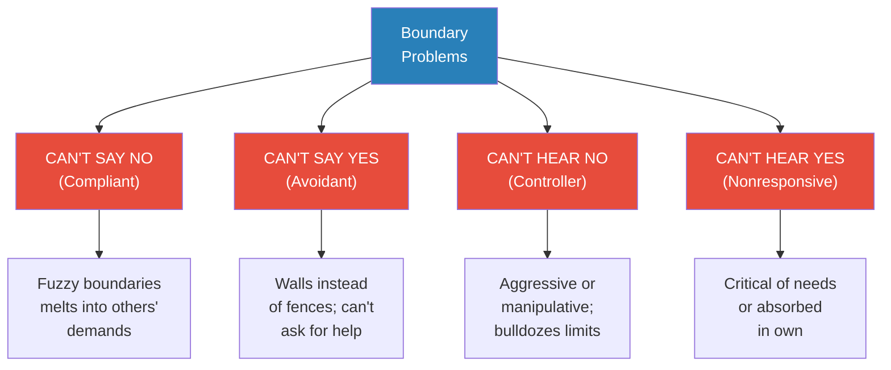
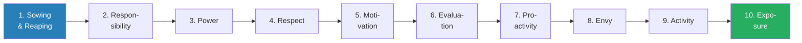
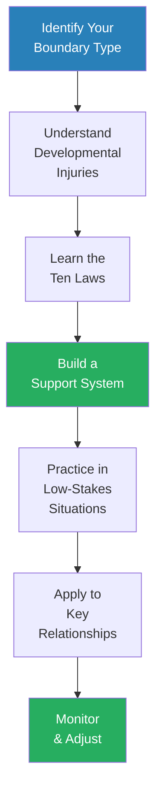

# Boundaries — Henry Cloud & John Townsend

> *We are responsible TO others and FOR ourselves. "Carry each other's burdens," says Galatians 6:2. But verse 5 says that "each one should carry his own load." The Greek word for burden means "excess burdens" — boulders that crush us. The Greek word for load means "cargo" — the everyday things we all need to carry. Problems arise when people act as if their boulders are daily loads and refuse help, or as if their daily loads are boulders they shouldn't have to carry.*

---

## About the Authors

*Dr. Henry Cloud and Dr. John Townsend are clinical psychologists, leadership consultants, and bestselling authors who have spent decades treating adults trapped in boundaryless lives. Together they have authored the Boundaries series — including Boundaries in Marriage, Boundaries with Kids, and Boundaries in Dating — and have run an intensive hospital programme for patients struggling with depression, anxiety, and relationship dysfunction rooted in boundary failures. Their distinctive contribution is translating timeless psychological principles about responsibility, limits, and self-control into a framework anchored in both clinical research and Christian theology. Cloud and Townsend are also the authors of Safe People and How People Grow.*

---

## The Big Idea

Just as homeowners set physical property lines around their land, every human being needs mental, physical, emotional, and spiritual boundaries to distinguish <b style="color: #2980b9">what is my responsibility and what isn't</b>. Boundaries define where you end and someone else begins. When boundaries are absent, people take on problems that were never theirs to carry — and the person who should be solving them never has to. When boundaries are rigid, people wall off love and help. The goal is <b style="color: #27ae60">fences with gates — strong enough to keep out danger, permeable enough to let in love</b>. Learning to say a clear no and a genuine yes is not selfish — it is the foundation of every healthy relationship, including your relationship with God.

> [!tip] Core Insight
> You cannot change other people. You can only change yourself so that their destructive patterns no longer work on you. When you change your way of dealing with them, they may be motivated to change — because their old ways no longer produce the results they want.

**A note on the Christian framework:** This book is heavily grounded in Scripture, with every principle anchored to Bible passages. However, the core ideas — property lines, personal responsibility, natural consequences, the distinction between helping and enabling — are universal. Non-Christian readers can extract enormous value by treating the biblical references as one cultural lens on timeless psychological truths. The most powerful insights — that rescuing people from consequences enables irresponsibility, that giving from fear is not love, that hurt and harm are different things, that you cannot change another person — stand on their own regardless of theological framework. The Bible is one source of these truths; clinical experience is another; the lived experience of anyone who has ever burned out trying to carry someone else's load is a third.

---

## Key Concepts at a Glance

| Concept | One-line summary |
|---------|-----------------|
| **Boundaries** | Personal property lines that define what is me and what is not me |
| **Burdens vs. Loads** | Boulders (crises — need help) vs. knapsacks (daily responsibilities — carry your own) |
| **The Four Boundary Problems** | Compliants (can't say no), Avoidants (can't say yes), Controllers (can't hear no), Nonresponsives (can't hear yes) |
| **Responsible TO vs. FOR** | Help others with boulders; don't carry their knapsacks for them |
| **Fences with Gates** | Boundaries are not walls — let good in, keep bad out |
| **Ten Laws of Boundaries** | Sowing/Reaping, Responsibility, Power, Respect, Motivation, Evaluation, Proactivity, Envy, Activity, Exposure |
| **The Sprinkler Analogy** | When your water falls on someone else's lawn, they have no reason to water their own |
| **Hurt vs. Harm** | Setting boundaries may hurt — like a dentist's drill — but it doesn't harm |
| **Codependency** | Rescuing someone from consequences enables irresponsibility |
| **Separation-Individuation** | Developmental process of becoming a separate self (hatching → practicing → rapprochement) |
| **The Law of Motivation** | Freedom first, service second — if you give from fear, it's not love |

---

## At a Glance

- **The Problem:** Millions of people burn out, resent others, and feel out of control because they cannot distinguish what is theirs to carry from what belongs to someone else
- **The Insight:** Boundary problems are not just about saying no — they also include refusing to hear no, refusing to ask for help, and refusing to respond to legitimate needs
- **The Method:** Identify your boundary type, understand how boundaries develop (and how they get injured), learn the ten laws, then apply them across every domain — family, friends, spouse, children, work, self, and God
- **The Provocation:** <b style="color: #e74c3c">The most loving thing you can do for an irresponsible person is to stop rescuing them from the consequences of their behaviour</b>

---

## The 30-Second Version

Boundaries are personal property lines — they define what you own and are responsible for. When boundaries are missing, you take on other people's problems while neglecting your own, creating burnout, resentment, and failed relationships. Cloud and Townsend identify <b style="color: #2980b9">four boundary problems</b> — compliants who can't say no, avoidants who can't ask for help, controllers who can't hear no, and nonresponsives who can't hear needs. These problems develop in childhood through withdrawal, hostility, overcontrol, or lack of limits from parents. Recovery requires understanding <b style="color: #2980b9">ten laws of boundaries</b> (including sowing and reaping, the distinction between hurt and harm, and freedom before service), then systematically applying them across every life domain. <b style="color: #27ae60">The goal is fences with gates — firm enough to keep out harm, open enough to let in love.</b>

---

## The 5-Minute Version

### A Day in a Boundaryless Life

*Cloud and Townsend open with Sherrie, a composite character whose entire day illustrates what happens when boundaries are absent.*

- 6:00 AM: dreading the day, exhausted from too little sleep
- Her mother dropped by unannounced and hijacked the evening with guilt: "Since your father died, it's been such an empty time"
- Her boss Jeff handed her five hours of work at the end of the day: "I always think of you first when I'm in a jam. You're so dependable"
- Her friend Lois called with another crisis — Sherrie missed half her lunch consoling her
- Her son Todd won't listen to limits — his teacher reports behaviour problems
- Her daughter Amy has retreated into a secret inner world nobody can reach
- Her husband Walt is angry and controlling — but Sherrie blames herself
- 11:50 PM: lying alone in the dark, she asks God for hope — and hears only the sound of her own tears

- <b style="color: #e74c3c">Three things that are NOT working for Sherrie:</b>
  - Trying harder
  - Being nice out of fear
  - Taking responsibility for others
- The core problem: she suffers from severe difficulties in taking ownership of her life — she doesn't know what IS her job and what ISN'T

---

### What Does a Boundary Look Like?

*Boundaries in the physical world are easy to see — fences, walls, property lines. In the spiritual and emotional world, they are invisible but equally real.*

- <b style="color: #2980b9">Boundaries define what is me and what is not me</b> — they show where I end and someone else begins
- A boundary shows me what I own and am responsible for — giving me freedom within my property
- Key principle: **Good in, Bad out** — boundaries keep nurturing things inside and harmful things outside
- But boundaries are NOT walls — they need gates that open to let good in and let bad out
- Victims of abuse often reverse this function: keeping bad in and good out

#### Types of Boundaries

| Boundary Type | How It Works |
|--------------|-------------|
| **Skin** | The most basic boundary — physical self; "he really gets under my skin" |
| **Words** | "No" is the most basic boundary-setting word — lets others know you are in control of you |
| **Truth** | God's truth defines limits; operating outside reality causes injury |
| **Honesty** | "I don't like it when you yell" lets people know the rules of your yard |
| **Geographical Distance** | Sometimes physically removing yourself is the only way to maintain limits |
| **Time** | Taking time off from a person or situation to regain ownership |
| **Emotional Distance** | Temporary — gives your heart space to heal (not a permanent lifestyle) |
| **Other People** | Support systems provide strength to set boundaries you can't set alone |
| **Consequences** | "No Trespassing" signs need enforcement — without consequences, boundaries are meaningless |

#### What's Within My Boundaries?

- **Feelings** — your responsibility to own and express; don't put them in charge, don't ignore them
- **Attitudes and Beliefs** — learned early, often distorted; "people who hold others responsible are mean"
- **Behaviours** — sowing and reaping; don't interrupt natural consequences for others
- **Choices** — "I had to" and "she made me" are lies; you always have a choice
- **Values** — what you love and assign importance to; valuing approval over truth leads to misery
- **Limits** — setting limits on others is really setting limits on your own exposure to bad behaviour
- **Talents** — stewardship of gifts; hiding from fear is punished, not the fear itself
- **Thoughts** — own them, grow them, clarify distortions, communicate them
- **Desires** — own what you truly want; many lusts disguise real needs
- **Love** — both receiving and giving; a trust muscle that needs exercise

---

*Cloud and Townsend identify four distinct boundary problems — many people exhibit more than one, and compliants who are also avoidants (reversed boundaries) are especially common.*

---

## The Four Boundary Problems

### The Sprinkler Analogy — The Book's Central Metaphor

> [!example] Bill's Parents — "Help Him Have Some Problems"
> - The parents of a 25-year-old man came to see Cloud with a common request: "Fix our son"
> - Bill had problems with drugs, couldn't stay in school, kept questionable company
> - His parents had given him everything — money at school so "he wouldn't have to work," new schools when he flunked out
> - Cloud told them: "Your son doesn't have a problem. YOU do. He can do whatever he wants, no problem. You pay, you fret, you worry. He doesn't have a problem because you've taken it from him"
> - Cloud explained: "It's as if he's your neighbour who never waters his lawn. But whenever you turn on your sprinkler, the water falls on HIS lawn. Your grass is dying, but Bill looks at his green lawn and thinks: 'My yard is doing fine'"
> - Solution: "If you fix the sprinkler so water falls on YOUR lawn, and he doesn't water his own, he'll have to live in dirt. He might not like that"
> - "He is irresponsible and happy. You are responsible and miserable. A little boundary clarification would do the trick"
> **The lesson:** When you take on someone else's problems, they have no reason to solve them — and you burn out carrying what was never yours to carry.

---

### Compliants — Saying "Yes" to the Bad

- Can't say no — their boundaries are fuzzy and indistinct
- They "melt" into the demands and needs of others
- <b style="color: #e74c3c">Chameleons — after a while it's hard to distinguish them from their environment</b>
- Root causes: fear of hurting others' feelings, fear of abandonment, fear of anger, fear of being seen as selfish, guilt from an overstrict conscience
- The inability to say no keeps them from even recognising evil — their "radar" is broken

> [!example] Robert — When Fighting Back Is "Bad Manners"
> - Robert, the youngest and only boy among four children, was beaten by his older sisters regularly
> - His parents told him: "Boys don't hit girls. It's bad manners"
> - "Bad manners! I was getting triple-teamed, and fighting back was bad manners?"
> - As an adult, Robert couldn't refuse his wife's constant demands — going broke trying to keep up
> **The lesson:** When parents teach children that saying no is bad, they send them defenceless into a world that contains much evil.

### Avoidants — Saying "No" to the Good

- Can't ask for help, can't recognise their own needs, can't let others in
- Their boundaries are walls, not fences with gates
- They experience their problems and legitimate needs as something bad or shameful
- <b style="color: #2980b9">Compliant-Avoidants (the most common pattern)</b>: say yes to the bad AND no to the good — "reversed boundaries"
  - They have no boundaries where they need them, and boundaries where they shouldn't

### Controllers — Not Respecting Others' Boundaries

- To controllers, no is simply a challenge to change the other person's mind
- Two types:
  - **Aggressive controllers** — bulldoze others' fences like a tank; sometimes verbally or physically abusive
  - **Manipulative controllers** — talk others into yes; use guilt, seduction, or indirect tactics
- Controllers are also injured: undisciplined, can't function independently, and ultimately isolated
  - People stay with them out of fear or guilt — never out of love

### Nonresponsives — Not Hearing the Needs of Others

- Fail in their responsibility TO others
- Two types:
  - Those with a critical spirit toward others' needs (projection of hatred of own neediness)
  - Those so absorbed in their own world they exclude others (narcissism)
- <b style="color: #e74c3c">The classic pairing: compliant-avoidant meets controlling-nonresponsive — and they get married</b>

---

### The Good Samaritan Reimagined

*Cloud and Townsend use a brilliant retelling of the Good Samaritan to show where boundaries should be honoured and where they should be violated.*

- In the original story, the Samaritan takes care of the injured man, brings him to an inn, pays the innkeeper, and leaves for his business
- But imagine if the injured man woke up and said: "You're leaving? Don't you think you're being selfish? How is Jesus going to use you as an example?"
- The Samaritan stays three days — and misses a crucial business deal
- "How could you do this to me?" the Samaritan screams. "Look what you've done! You've caused me to lose those camels!"
- <b style="color: #e74c3c">We may be moved with compassion to give — but when someone manipulates us into giving more than we want, we end up resentful</b>
- The giving is no longer from the heart — it's from compulsion
- Neither person comes out ahead

> [!tip] Core Insight
> The Good Samaritan was good precisely BECAUSE he had boundaries. He gave generously from his resources, then left to attend to his own responsibilities. He didn't let the injured man's needs consume his entire life. Biblical giving has limits — and those limits make the giving genuine.

---

## How Boundaries Develop

*Boundary abilities are built, not inherited — their most crucial stages occur in the first three years of life.*

### Stage 1: Bonding (Birth to ~5 months)
- The foundation — a child must feel safe and loved before boundaries can develop
- **Emotional object constancy**: the child has an internal sense of belonging even away from mother
- Without secure bonding, boundary-setting becomes impossible because the child has nowhere to go in a conflict

### Stage 2: Separation-Individuation (~5 months to 3 years)
- **Hatching** (5-10 months): "Mommy and me aren't the same" — baby begins exploring the world
- **Practicing** (10-18 months): walking creates omnipotence — "I can do anything!" — child leaves mother behind
- **Rapprochement** (18 months-3 years): "I can't do everything" — child returns to connection but as a separate person; anger, ownership ("MINE"), and the word NO emerge

> [!tip] Core Insight
> By age three, a child should have mastered three abilities: (1) being emotionally attached yet maintaining a separate self, (2) saying appropriate no's without fear of losing love, and (3) taking appropriate no's without withdrawing emotionally.

### What Goes Wrong: Five Boundary Injuries

| Injury | What Happens | Result |
|--------|-------------|--------|
| **Withdrawal** | Parent pulls away when child disagrees | Child learns: "I'm loveable when I behave, not when I don't" |
| **Hostility** | Parent punishes child for separating | Child learns: hide disagreement under a compliant smile |
| **Overcontrol** | Loving parents with too-strict rules | Child develops dependency, can't take risks |
| **Lack of limits** | Indulgent parents who never say no | Child becomes controlling, can't hear no |
| **Inconsistency** | Rules shift unpredictably (often in alcoholic families) | Child never feels safe; always waiting for the other shoe to drop |

---

#### The Word "No" — The One-Word Boundary

- Toddlers going through rapprochement frequently perfect the most important word in the human language: NO
- Some become "no addicts" — refusing even Popsicles and favourite toys — because having the no is worth it
- It keeps them from feeling completely helpless and powerless
- Parents have two tasks:
  1. **Help the child feel safe enough to say no** — don't withdraw emotionally when the child resists
  2. **Help the child respect others' boundaries** — set age-appropriate limits and enforce them
- One couple's response to an aunt whose feelings were hurt by their daughter's refusal to hug: "We don't want Casey to feel that her affection is something she owes people. We'd like her to be in charge of her life"
- <b style="color: #27ae60">They wanted her yes to be yes and her no to be no — so that in the future, she would have the ability to say no to evil</b>

> [!warning] The Parent Who Tells Children "It Hurts Us When You're Angry"
> This makes the child responsible for the emotional health of the parent. In effect, the child has just been made the parent of the parent — sometimes at two or three years old. It's far better to say: "I know you're angry, but you still can't have that toy." Then take your hurt feelings to a spouse, friend, or the Lord.

---

## The Ten Laws of Boundaries

### The Alien Analogy

*Cloud and Townsend open the laws chapter with a striking metaphor for growing up in a boundaryless home.*

- Imagine being transported from another planet to Earth — you don't know about gravity, money, or food
- You step out of your spacecraft and fall to the ground ("Ouch!")
- You feel hungry but don't know why — an earthling directs you to a restaurant
- You eat, feel better — but then the man wants "seven dollars" and you have no idea what he's talking about
- You end up in jail, confused and resentful
- <b style="color: #2980b9">This is exactly what happens to people raised in families where God's ways of boundaries are not practised</b>
- They are transported into adult life where spiritual principles they've never been taught govern their relationships and wellbeing
- They hurt, are hungry, and may end up in jail — but they never know the principles that could have helped them

---

### Law 1: Sowing and Reaping
- <b style="color: #27ae60">God's most basic law of cause and effect</b>: you reap what you sow
- The problem: codependent people interrupt this law by rescuing irresponsible people from consequences
- The sprinkler analogy: if your water falls on your neighbour's lawn, they'll never water their own
- <b style="color: #e74c3c">Confronting an irresponsible person is not painful to them — only consequences are</b>

### Law 2: Responsibility
- We are responsible TO others (help with boulders) and FOR ourselves (carry our own knapsacks)
- Being responsible TO means both giving to needs AND setting limits on sin
- "You can't grow for me; only I can" — likewise, you can't grow for anyone else

### Law 3: Power
- You are powerless over your behaviour in your own strength (Paul's Romans 7 confession)
- But you DO have power to: confess, submit to God, seek truth, repent, make amends
- <b style="color: #e74c3c">You cannot change others — more people suffer from trying to change others than from any other sickness</b>
- What you CAN do is change yourself so their destructive patterns no longer work on you

### Law 4: Respect
- Respect others' boundaries to command respect for yours
- If we judge others' no, we expect them to judge ours — creating a fear cycle
- "Freedom begets freedom"

### Law 5: Motivation — The Most Misunderstood Law

*This law goes to the heart of why so many "loving" people are depressed.*
- <b style="color: #27ae60">Freedom first, service second</b>
- If you serve to escape fear (of abandonment, anger, guilt, loneliness), it's not love — it's compliance
- Eight false motives for giving: fear of loss of love, fear of anger, fear of loneliness, guilt, payback, approval-seeking, over-identification with others' pain, fear of losing the "good me"
- True love leads to cheer, not depression — if your giving makes you miserable, examine your motivation

> [!example] Stan — "Loving Too Much"
> - Stan came to Cloud saying he was "loving too much" — doing far more for people than he should, and it was making him depressed
> - Cloud challenged: "How can you love too much? The Bible says true love leads to cheer. If your loving is depressing you, it's probably not love"
> - Investigation revealed: Stan's giving was not motivated by love but by fear
> - His mother had withdrawn love whenever he didn't do what she wanted — so he learned to give reluctantly, out of terror of losing love
> - He was also afraid of other people's anger, because his father frequently yelled at him as a boy
> - Stan said yes out of fear — and called it love
> **The lesson:** If your giving makes you resentful and depressed, examine your motivation. You may be calling fear "love" — and that distinction makes all the difference.

---

### Law 6: Evaluation
- <b style="color: #2980b9">Hurt and harm are different</b>
- The dentist hurts you but doesn't harm you; sugar tastes good but harms you
- Setting boundaries may cause pain — that doesn't mean you shouldn't set them
- Evaluate whether the pain is helping or harming the other person long-term

### Law 7: Proactivity
- Reactive boundaries (anger, rebellion) are necessary but not sufficient
- Move past "what I'm against" to "what I'm for"
- "Power is not something you demand — it is something you express"

### Law 8: Envy
- Envy focuses outside your boundaries, onto what others have
- The antidote: take responsibility for your own lack and do something about it
- "Each one should test his own actions — without comparing himself to somebody else"

### Law 9: Activity
- God is an active God and wants us to be active — "knock and the door will be opened"
- Passivity is never the right response; even when you can't solve the problem, you can take a step

### Law 10: Exposure
- Boundaries need to be communicated directly — passive boundaries are unclear
- If your property lines are invisible, don't be surprised when they're crossed
- Speaking truth in love is the foundation of genuine intimacy

---

## Boundary Conflicts by Domain

### Law 10: Exposure
- Boundaries need to be communicated directly — passive boundaries are unclear
- If your property lines are invisible, don't be surprised when they're crossed
- "Speaking truth in love" (Ephesians 4:25) is the foundation of genuine intimacy
- <b style="color: #27ae60">A boundary that exists only in your head is meaningless — it becomes real when you communicate it</b>
- Many people have "secret boundaries" they've never shared — then feel violated when others cross lines they didn't know existed
- Exposure also means being vulnerable about your own needs, not just your limits
- Hiding our needs is as much a boundary problem as not setting limits

---

## Boundary Conflicts by Domain

### Boundaries and Your Family

- Adult children often struggle most with parents because the original boundary injuries happened there
- <b style="color: #e74c3c">Triangulation</b>: parents pulling you into their conflicts with each other or with siblings
- Key skills: nondefensive communication, position statements, consequences
- Leaving and cleaving (Genesis 2:24) is not just physical — it's emotional and spiritual

#### The Triangle of Boundaries in Marriage

- Three realities form the foundation of healthy marriage: Freedom, Responsibility, and Love
- When all three operate together, a virtuous cycle begins:
  - As love grows, spouses become more free from what enslaves them
  - As they become more free, they gain greater self-control and responsibility
  - As they act more responsibly, they become more loving
  - And the cycle begins again
- This is why couples married 50+ years say it keeps getting better
- <b style="color: #27ae60">Where there is no freedom, there is slavery — and where there is slavery, there will be rebellion</b>
- Where there is no responsibility, there is bondage
- Love can only exist where freedom and responsibility are operating

> [!example] Joe and Caroline — The Blame Ping-Pong
> - Joe complained Caroline was controlling; Caroline said Joe was always angry
> - Cloud asked each why they behaved that way — every answer blamed the other
> - "Why do you get so mad?" / "Because she always tries to control me"
> - "Why do you try to control him?" / "Because he's so into his own things that I can't get his attention"
> - Neither took ownership of their own behaviour — like Adam blaming Eve, and Eve blaming the serpent
> - Resolution came only when each said: "My reactions are MY problem, and I need to take responsibility for changing them"
> **The lesson:** In every relationship conflict, the first question should be: "What is MY part in this?" — not "Why are they doing this to me?"

---

### Boundaries and Your Friends

- Four common friendship conflicts:
  1. **Compliant/Compliant** — both give too much, neither takes; conversation stays shallow
  2. **Compliant/Aggressive Controller** — one feels intimidated, the other irritated at being nagged
  3. **Compliant/Manipulative Controller** — the "emergency" friend who never plans ahead
  4. **Compliant/Nonresponsive** — one does all the work, the other coasts

- For each conflict, the boundary checklist:
  1. What are the symptoms?
  2. What are the roots?
  3. What is the boundary conflict?
  4. Who needs to take ownership?
  5. What is needed? (Support system first)
  6. How do they begin?
  7. How do they set boundaries?
  8. What happens next?

### Boundaries and Your Spouse

*If there were ever a relationship where boundaries could get confused, it is marriage — where by design husband and wife "become one flesh."*

- The confusion: boundaries foster separateness; marriage has as one of its goals the giving up of separateness
- The resolution: even in oneness, each partner retains their own identity and property
- <b style="color: #2980b9">No one would have a problem deciding who wears the dress and who wears the tie — it's trickier with feelings, attitudes, and desires</b>
- The problem arises when one spouse trespasses on the other's personhood — trying to control their feelings, choices, or values

#### Feelings in Marriage

- One of the most important elements for intimacy: each spouse takes responsibility for their own feelings
- "I feel that you..." is NOT a feeling statement — it's an evaluation disguised as a feeling
- "I feel sad/lonely/scared" — THAT is a feeling statement
- Many couples talk past each other for years because neither owns their feelings

> [!example] The Drinking Husband and the Nagging Wife
> - A wife tried to tell her husband how his drinking affected her: "I feel like he doesn't think about what he's doing"
> - Cloud pushed: "That's not a feeling — it's what you think about him. How do you FEEL?"
> - Finally, through tears: "I feel very alone and afraid"
> - The husband reached out: "I never knew you were afraid. I would never want to make you afraid"
> - This was the turning point — years of nagging hadn't worked; one honest feeling statement did
> **The lesson:** Vulnerability is the beginning of intimacy. Saying "I feel alone and scared" opens doors that "You never think about what you're doing" keeps locked.

#### Desires in Marriage

- Susan was angry because Jim worked late — she blamed him for being late
- Cloud pointed out: "If you had plans to go out with friends that night, would you be angry?"
- "No" — because she wouldn't be wanting something from him
- <b style="color: #27ae60">Your disappointed desire is what hurts you, not the other person's behaviour</b>
- Jim wants to work; Susan wants him home — both have legitimate needs
- Neither is selfish — they just have conflicting wants, and marriage is about working conflicting wants out
- Problems arise when we make someone else responsible for our needs and blame them for our disappointments

---

- Marriage is where boundaries get most confused — "the two become one flesh"
- Key principle: <b style="color: #27ae60">each spouse must take ownership of their own feelings, attitudes, behaviours, choices, limits, desires, thoughts, values, talents, and love</b>
- Common traps:
  - Making your spouse responsible for your feelings ("You make me angry")
  - Making your spouse responsible for your desires ("If you loved me, you'd know what I want")
  - Giving past the love point to the resentment point
- "Marriage is not slavery. It is based on a love relationship deeply rooted in freedom"

#### Romantic Friendships and Dating

- Individuals with boundary injuries should NOT try to learn boundaries through dating
  - Dating is high-risk, low-commitment — the opposite of what an injured soul needs
  - Like "sending a three-year-old to the front lines of battle"
  - Better to learn boundary skills in non-romantic settings: support groups, therapy, same-sex friendships
- Once boundaries are established, they are ESSENTIAL in dating:
  - Truth-telling in romance defines the relationship
  - A couple that claims to "never disagree" is a couple that's been lying about something
  - The homework Cloud gives premarital couples: "Find out what you've been lying about to each other"

#### When Family IS Your "Best Friend"

- Some people say "my mother (or father) is my best friend" and think this is healthy
- Cloud challenges this: <b style="color: #e74c3c">no one can become a truly biblical adult without setting some limits, leaving home, and cleaving somewhere else</b>
- The family is an incubator — once it has done its job, the young adult is supposed to leave and build their own life
- If you have no other "best friends" than your family, examine whether you're afraid of separating and individuating
- You cannot know if your values and beliefs are truly your own until you've tested them outside the family system

---

### Boundaries and Your Children

- The purpose of parenting: gradually transfer control from parent to child
- Parents must both protect (set limits) and prepare (allow consequences)
- Key developmental task: teach children that their actions have consequences — not through anger, but through consistent limits
- "Discipline is the art of teaching children self-control by using consequences"

#### Parenting with Consequences, Not Anger

- The "my-way-or-else" approach teaches children to pretend to be obedient when the parent is watching
- The "you-have-a-choice" approach teaches children to be responsible for their own actions:
  - Instead of: "Make your bed or you're grounded for a month"
  - Say: "You have a choice. Make your bed and you can play Nintendo. Don't make it and you lose Nintendo for the day"
  - The child decides how much pain they're willing to endure to be disobedient
- <b style="color: #27ae60">God's discipline teaches, not punishes</b> — "it produces a harvest of righteousness and peace for those who have been trained by it"
- When parents respond to disobedience with hostility, children don't learn that responsibility has benefits — they only learn to avoid someone's wrath
- Ever wonder why some Christians fear an angry God? Often it traces back to parents who disciplined with rage

---

### Boundaries and Work

- Saying no to unreasonable demands (like Sherrie with her boss Jeff)
- Taking responsibility for your own career instead of blaming circumstances
- Setting limits on your own overwork — you are not "Mr. Can Do"

> [!example] Jim — "The Phantom"
> - Jim had never been able to say no to anyone, especially supervisors
> - His kids called him "The Phantom" because he was never home — late nights, business dinners, weekends on the road
> - He justified it: "This is my contribution to the kids, my way of giving them the good life"
> - His wife Alice finally confronted him: "I found someone you CAN say no to — me and the kids!"
> - Jim broke down: "All my life it's been this way. I've always feared letting people down. How did I get like this?"
> - The answer lay in his childhood — he had been trained to believe that saying no would result in loss of love
> **The lesson:** The inability to say no at work almost always traces back to family-of-origin boundary injuries. Fixing it requires addressing the root, not just the symptom.

### Boundaries and Your Self

*This chapter addresses the hardest boundary of all — limits on your own behaviour. When the enemy is inside the gates, the usual defences don't work.*

- Seven areas of self-boundary struggles: food, money, time, task completion, the tongue, sexuality, alcohol/substances
- <b style="color: #e74c3c">Why "just say no" fails:</b>
  - Willpower alone is useless against deep patterns — Paul calls it "will-worship" with no value in restraining indulgence
  - We are our own worst enemies (can't leave ourselves)
  - We withdraw from relationship when we most need it
  - We try to solve relational problems with non-relational solutions
- <b style="color: #27ae60">What works:</b>
  1. Address the real underlying need (not just the symptom)
  2. Allow yourself to fail — failure is how we learn
  3. Listen to empathic feedback from others
  4. Welcome consequences as a teacher
  5. Stay connected to your support system

> [!example] Pete — "I've Got It Solved!"
> - Pete was excited about his newfound victory over overspending: "I made a vow to God and myself that I'll never spend beyond my budget again!"
> - The next week, he'd bought sports equipment and furniture he couldn't afford
> - Pete had been trying to use willpower to solve his boundary problem — the most common and most futile approach
> - The Bible calls this "will-worship" — self-imposed rules that "lack any value in restraining sensual indulgence" (Colossians 2:23)
> - The boundaryless part of the soul simply becomes more resentful under domination of the will — and rebels with a vengeance
> **The lesson:** Willpower alone is useless against self-boundary struggles. If we could solve these problems with sheer determination, we wouldn't need a Saviour — or a support group.

> [!example] Jessica — The Eating Disorder
> - Jessica came for treatment of bingeing since her teenage years
> - Cloud asked: "Who do you talk to about this?"
> - Jessica looked confused: "This is a private problem. Can't I do this without anyone knowing?"
> - Since the Fall, our instinct has been to withdraw from relationship when we're in trouble — when we most need people
> - Jessica's isolation was feeding her disorder — she needed to bring her pain into community before she could heal
> **The lesson:** Evil can take over the empty house of our souls. Only when our house is full of love from God and others can we resist. Plugging in is not optional — it is a life-and-death issue.

> [!abstract] The Self-Boundary Checklist
> 1. What are the symptoms? (depression, anxiety, out-of-control behaviour)
> 2. What are the roots? (lack of training, rewarded destructiveness, distorted need, fear of relationship)
> 3. What is the boundary conflict?
> 4. Who needs to take ownership? (you — it may not be your fault, but it IS your responsibility)
> 5. What do you need? (safe relationships FIRST — you can't do this alone)
> 6. How do you begin? (address real needs, allow failure, seek feedback, accept consequences)

### Boundaries and God

- God respects our boundaries — he knocks at the door but doesn't break it down
- We must respect his — when he says no, that is his right
- An honest no to God is better than a dishonest yes — at least an honest no can lead to repentance
- Anger at God is permitted and necessary for genuine relationship — Job demanded it

---

#### If You Are a Victim

- Establishing self-boundaries is especially difficult if your boundaries were severely violated in childhood
- A victim is a person who was, while in a helpless state, injured by the exploitation of another
- Results of victimisation include: depression, compulsive disorders, inability to trust, poor judgment in relationships, deep sense of pervasive badness, shame, guilt, rage attacks, suicidal feelings
- The most primary damage: <b style="color: #e74c3c">loss of trust — the ability to depend on ourselves and others in times of need</b>
- Victims often feel they are public property — that their resources, body, and time should be available to others just for the asking
- They take on badness that isn't theirs — they begin believing that the way they were treated is the way they should be treated
- Forward emphasises: boundary work can be enormously helpful, but many victims will need professional help to establish and maintain appropriate boundaries

---

## Common Boundary Myths

| Myth | Truth |
|------|-------|
| "Boundaries are selfish" | Boundaries protect love by taking a stand against things that destroy love |
| "Boundaries are a sign of disobedience" | God himself has boundaries — he limits his exposure to evil |
| "Setting boundaries will make people angry" | Some people will be angry — that doesn't mean you're wrong |
| "Boundaries cause guilt" | Guilt comes from an overstrict conscience, not from healthy limits |
| "Boundaries are permanent" | Boundaries change as relationships grow and circumstances shift |
| "If I begin setting boundaries, I will be hurt" | You may be hurt — but you'll also find out who truly loves you |
| "Boundaries mean I'm angry" | Boundaries are proactive, not reactive — they're about what you love, not what you hate |

---

### The Six Common Boundary Myths (Expanded)

**Myth 1: "If I set boundaries, I'm being selfish"**
- Truth: boundaries protect love by taking a stand against what destroys it
- God himself sets boundaries — he limits his exposure to evil
- The question isn't whether boundaries are selfish, but whether your lack of boundaries is helping anyone

**Myth 2: "Boundaries are a sign of disobedience"**
- Truth: even Jesus set boundaries — he withdrew from crowds, said no to requests, and confronted the Pharisees
- Obedience without freedom is compliance, not love
- "God desires compassion, not sacrifice" — giving from resentment isn't giving at all

**Myth 3: "If I set boundaries, people will leave me"**
- Truth: the people who get angry at your boundaries are the people who benefited from your lack of them
- People who truly love you will respect your limits — and love you MORE for having them
- Some relationships are held together only by your compliance — those are not relationships worth keeping

**Myth 4: "If I set boundaries, I will feel guilty"**
- Truth: guilt comes from an overstrict conscience, not from healthy limits
- The feeling of guilt does not mean you are guilty
- Many people confuse guilt with the discomfort of doing something new

**Myth 5: "If I set boundaries, I will hurt people"**
- Truth: hurt and harm are different — the dentist hurts you but doesn't harm you
- Sometimes the most loving thing you can do is allow someone to experience the consequences of their behaviour
- "Confronting an irresponsible person is not painful to them — only consequences are"

**Myth 6: "Boundaries are permanent and rigid"**
- Truth: boundaries change as relationships grow and as trust is earned
- Forgive, but guard your heart until you see sustained change
- "To continue to open yourself emotionally to an abusive person without seeing true change is foolish"

---

## Resistance to Boundaries

*When you begin setting boundaries, expect resistance — from others and from within yourself.*

- **External resistance:** anger, guilt trips, consequences, threats of abandonment
- **Internal resistance:** guilt, fear of being alone, fear of others' anger, self-doubt
- Key truth: <b style="color: #27ae60">you need a strong support system BEFORE you start setting boundaries — don't try this alone</b>
- The people who get angry at your boundaries are the people who benefited from your lack of them
- "The people who really love you will support you as you do what's best for yourself"

### Common Resistance Tactics

| Tactic | What It Sounds Like | Why It Works |
|--------|-------------------|-------------|
| **Guilt** | "After everything I've done for you..." | Activates childhood programming |
| **Anger** | "How dare you!" / rage / threats | Triggers fear of abandonment |
| **Pity** | "I'm just a lonely old lady..." | Activates caretaking instincts |
| **Religious manipulation** | "Honour thy father and mother" | Weaponises genuine beliefs |
| **The silent treatment** | Withdrawal of all contact | Threatens the very connection you fear losing |
| **Triangulation** | Enlisting others to pressure you | Creates the feeling of being "wrong" against consensus |

- All of these are predictable — and knowing they're coming gives you the power to prepare
- Use nondefensive responses for every tactic: "I understand you're upset" / "I'm sure you see it that way" / "This is not negotiable"
- <b style="color: #e74c3c">Remember: someone who would rather lose YOU than lose control of you does not love you — they love what you do for them</b>

### How to Measure Success with Boundaries

- Don't measure success by the other person's response — that's outside your control
- Measure success by whether YOU followed through
- Signs that boundaries are working:
  - You feel less resentful
  - You have more energy
  - You attract healthier people
  - You feel more authentic
  - You can say no without guilt (or with guilt that doesn't control you)
  - You can be close to people without losing yourself

---

*The boundary-building process — always start with support, always start small.*

---

---

## The Roots of Boundary Problems — Detailed

Cloud and Townsend trace boundary problems to specific family-of-origin patterns:

### Withdrawal from Boundaries
- The most common and hardest to spot
- When a child disagrees or separates, the parent emotionally withdraws — hurt silence, disappointed looks, cold shoulder
- The child learns: "I'm loveable when I behave. I'm not loveable when I don't"
- Result: adults who are terrified that setting boundaries will cause abandonment
- The withdrawal can be subtle (a hurt tone) or overt (crying spells, yelling, illness)

### Hostility Against Boundaries
- The parent becomes angry when the child tries to separate
- "You'll do what I say AND you'll like it" — this makes a child crazy because it denies the separate soul of the child
- "My-way-or-else" teaches pretend obedience when the parent is watching — not genuine responsibility
- <b style="color: #e74c3c">Results in either depression (compliant collapse) or rage (modelling the hostile parent)</b>
- "Fathers, do not embitter your children, or they will become discouraged" — some respond with compliance and depression
- "Fathers, do not exasperate your children" — others respond with rage and become hostile themselves

### Overcontrol
- Well-meaning parents who protect so much that children never learn to make mistakes
- No play with other kids (might get hurt), galoshes on cloudy days (might rain)
- The child never develops risk tolerance or creative independence
- Result: adults who are dependent, enmeshed, and afraid of initiative

### Lack of Limits
- Indulgent parents who never discipline
- When Eileen wrecked the family car three times, her dad got her her own car
- When she overdrew her checking account, her parents quietly added more money
- Result: an adult who is loveable but undisciplined — costing everyone around her
- <b style="color: #e74c3c">Without consequences in childhood, a four-year-old's tantrum becomes a forty-year-old's tantrum — with much higher stakes</b>

### Inconsistent Limits
- Some parents combine strict and lax limits, sending conflicting messages
- Common in alcoholic families: loving one day, unreasonably harsh the next
- Children never feel safe — always waiting for the other shoe to drop
- "Like a wave of the sea, blown and tossed by the wind" — the double-minded person
- Result: adults who are uncertain about what they are and aren't responsible for

### Trauma
- Specific intensely painful experiences rather than patterns
- Emotional, physical, sexual abuse; accidents; death of a parent; divorce; extreme poverty
- Shakes the two foundations children need: the world is reasonably safe, and they have control over their lives
- The earlier and more severe the trauma, the deeper the boundary injury

> [!example] Jerry — The Man Who Married His Abusers
> - Jerry had been physically abused by both parents
> - He joined the Marines, had several bad marriages, and always ended up with controlling women
> - Under his tough exterior, he longed for women who could "handle" him
> - He recalled his mother striking him across the face — and his pleading: "Please, Mom — I'm sorry. I'll do anything you say"
> - When he promised unquestioning obedience, the hitting would stop
> - As an adult, any woman's anger triggered instant compliance — the same survival strategy that saved him as a child
> **The lesson:** Boundary injuries from childhood don't disappear — they become invisible scripts that run your adult relationships. Only by seeing the script can you rewrite it.

---

## A Day in a Life with Boundaries

*The book ends where it began — with Sherrie — but now she has boundaries.*

- She tells her mother: "I enjoy talking with you. I just can't spend the whole evening visiting. I need to get some things done"
- She tells her boss Jeff: "I can help you — after I finish my current project. And I'll need more lead time next time"
- She tells her friend Lois: "Lois, I care about you, but I've noticed that our friendship seems very one-sided. Can we talk about that?"
- She tells her son Todd: "You have a choice. You can do your homework now and play after, or you can skip homework and lose your privileges"
- She initiates a conversation with Walt about their marriage — and he listens, because she's no longer a pushover

The transformation is not magic. It took time, support, confrontation, and many failures. But Sherrie's life is no longer out of control — because she finally knows what is hers to carry and what is not.

---

## Boundaries and God — Key Insights

*The final chapter addresses the most intimate boundary relationship of all.*

- God respects our boundaries: he knocks at the door but doesn't break it down (Revelation 3:20)
- He allows us to say no and go our own way — like the prodigal son, the rich young ruler
- When people say no, God allows it and keeps on loving them
- <b style="color: #27ae60">God prefers an honest no to a dishonest yes</b> — an honest no can lead to repentance
- Jerry, a member of Cloud's support group, kept saying he wanted to stop cheating on his wife — but didn't change
- Cloud challenged him: "Tell God and the group the truth. You don't really want to change. You enjoy your affairs"
- When Jerry finally owned his honest no to God, something broke open — he developed genuine godly sorrow, and real change began
- Anger at God is permitted and even necessary for genuine relationship — Job demanded the right to express his anger at God
- But we must also respect God's no: when he doesn't give us what we want, that is his right
- "We cannot reject God for setting a boundary. Freedom allows him to love. And freedom allows us to love him back — or not"

---

## The Boundary Development Checklist (Universal)

> [!abstract] The Eight-Step Boundary Checklist
> 1. **What are the symptoms?** — What's not working in your life?
> 2. **What are the roots?** — What family patterns or injuries created this?
> 3. **What is the boundary conflict?** — Which type are you exhibiting?
> 4. **Who needs to take ownership?** — Almost always: you
> 5. **What do you need?** — A support system FIRST
> 6. **How do you begin?** — Start with small, low-stakes situations
> 7. **How do you set boundaries?** — Clear communication, consequences, follow-through
> 8. **What happens next?** — Monitor, adjust, and don't be surprised by resistance

This checklist appears throughout the book, applied to family, friends, spouse, children, work, self, and God. The consistent message: start with support, start small, and stay consistent.

---

## Verdict

Cloud and Townsend wrote the foundational text on boundaries — and despite being published in 1992, it remains the single most comprehensive framework for understanding where you end and someone else begins. The property-line metaphor is brilliantly simple. The four boundary types (compliant, avoidant, controller, nonresponsive) give precise language for problems that most people feel but cannot name. The ten laws provide a philosophical foundation that holds up across cultures and contexts.

The book's primary weakness is its heavy reliance on Christian Scripture, which may alienate secular readers or those from other faith traditions. Some examples feel dated, and the writing can be repetitive. But the core ideas — natural consequences, the distinction between burden and load, hurt versus harm, freedom before service — are timeless and universal.

This is the book to read first if you struggle with saying no, enabling others, or feeling responsible for everyone's happiness. It pairs naturally with [[Recovering From Emotionally Immature Parents - Lindsay C. Gibson]] for understanding the family dynamics that created your boundary injuries, [[When I Say No I Feel Guilty - Manuel J. Smith]] for specific assertiveness techniques, [[Emotional Blackmail - Susan Forward]] for understanding how others exploit your weak boundaries, and [[Not Nice - Aziz Gazipura]] for permission to prioritise yourself without guilt.

---

## Functional vs. Relational Boundaries

Cloud and Townsend draw an important distinction between two kinds of boundary competence:

- **Functional boundaries** refer to a person's ability to complete tasks, projects, and jobs — performance, discipline, initiative, planning
- **Relational boundaries** refer to the ability to speak truth to others in relationship — honesty, confrontation, limit-setting

Many people have good functional boundaries but poor relational ones:
- They can perform at high levels at work but cannot tell a friend they don't like their chronic lateness
- They can run a business but cannot say no to their mother

The reverse is also true:
- Some people are absolutely honest about complaints but can't get up for work in the morning
- They can confront anyone but can't manage their own time or finances

> [!tip] Core Insight
> You may need to develop different boundary skills for different domains. Being competent at work does not mean you're competent at setting limits in relationships — and vice versa. Both types require practice.

---

## Boundary Building Is Relational, Not Solo

Cloud and Townsend emphasise this point repeatedly throughout the book: <b style="color: #27ae60">you cannot develop boundaries in a vacuum</b>.

- You need others who will be loving and supportive but who will NOT rescue
- The two errors friends commonly make:
  1. **Becoming critical and parental** — "I told you so" / "What did you learn?" — this pushes the person away
  2. **Becoming rescuers** — bailing out the irresponsible person, which enables the problem
- The right approach: empathy plus limits — "I'm sorry you lost another job. I won't lend you more money. But I'm available to talk"
- This is love that allows consequences — the model God uses with us
- Biblically based support groups, where members give honest feedback, are the most effective environment for boundary development
- "When one member tells another, 'Your uncontrolled behaviour makes me want to stay away from you,' the out-of-control person isn't being parented — he's hearing truth in love from a peer"

---

## The Serenity Prayer — The Best Boundary Prayer

Cloud and Townsend call this "probably the best boundary prayer ever written":

> God, grant me the serenity to accept the things I cannot change, the courage to change the things I can, and the wisdom to know the difference.

- "In other words: God, clarify my boundaries!"
- What you CAN change: your own attitudes, behaviours, choices, and responses
- What you CANNOT change: the weather, the past, the economy — and especially other people
- The wisdom to know the difference is the essence of boundary work
- <b style="color: #27ae60">One more thing: when you let go of trying to change others, you begin to get healthy yourself — and they may notice and envy your health. They may want some of what you have</b>

---

## Boundaries and Self-Control — Not Selfishness

A client once said: "I set some boundaries ON my husband. I told him he could not talk to me that way anymore. And it didn't work."

Cloud's response: "What you did is not boundaries at all. It was your feeble attempt at controlling your husband, and that never works."

The distinction:
- You CANNOT say: "You can't speak to me that way" — this is unenforceable
- You CAN say: "If you speak to me that way, I will walk out of the room" — this is totally enforceable because it has to do with YOU
- <b style="color: #2980b9">Personal boundaries are about controlling YOURSELF, not others</b>
- When you build a fence around your yard, you don't build it to dictate to your neighbour — you build it to maintain control of YOUR property
- Ultimately, self-control serves love, not selfishness
- The goal: love better, more purposefully, more intentionally — so that you and the people around you can have the intimacy you desire

---

## The Complete Property Line — What's Mine and What's Not

| Within My Boundaries (Mine to Own) | Outside My Boundaries (Not Mine to Fix) |
|-----------------------------------|-----------------------------------------|
| My feelings | Other people's feelings |
| My attitudes and beliefs | Other people's attitudes and beliefs |
| My behaviours | Other people's behaviours |
| My choices and their consequences | Other people's choices and their consequences |
| My values and priorities | Other people's values and priorities |
| My limits and how I enforce them | Whether others accept my limits |
| My desires and how I pursue them | Whether others fulfil my desires |
| My thoughts and how I express them | What others think of me |
| My talents and how I steward them | How others use their talents |
| My love and how I give it | Whether others love me back |

---

---

## Summary: The Core Principles of Boundaries

> [!abstract] The Ten Essential Truths About Boundaries
> 1. **Boundaries define what is me and what is not me** — they are personal property lines for the soul
> 2. **You are responsible TO others and FOR yourself** — help with boulders, don't carry knapsacks
> 3. **Boundaries are fences with gates, not walls** — let good in, keep bad out
> 4. **The word "no" is the most basic boundary** — if you can't say it, you can't own your life
> 5. **You cannot change others** — but you can change yourself so their patterns no longer work on you
> 6. **Hurt and harm are different** — the dentist hurts but doesn't harm; enabling feels good but destroys
> 7. **Freedom first, service second** — giving from fear is not love, it's compliance
> 8. **Consequences are the best teacher** — don't rescue people from the results of their choices
> 9. **Boundaries require support** — you cannot develop or maintain them alone
> 10. **Boundaries serve love** — they are not selfish; they are the foundation of every healthy relationship

---

## Regina and Lee — The Book's Most Powerful Story

> [!example] Regina — When Boundaries Save a Marriage
> - Regina had been married to Lee for nineteen years
> - Lee had long-standing problems with alcohol and anger — sometimes combining into unbearable behaviour
> - He picked at her with devastating sarcasm: "Nice dress — didn't they have it in your size?"
> - Regina was an adapting, loving person who tried to avoid conflict and win people over with love
> - For years, her love only gave Lee more permission to be unloving — his drinking and behaviour worsened
> - She finally discovered that silent suffering was not love — it was enabling
> - She learned assertiveness, confronted Lee, but he wouldn't listen — ignoring, apologising without changing, or growing defensive
> - Finally, Regina gave Lee a choice: own the problem or move out
> - Lee didn't believe her at first, but she stood her ground
> - He moved out, and for the first time saw that his behaviour had consequences
> - He obtained help, turned his life around, and they reconciled a year and a half later
> **The lesson:** Boundaries don't destroy marriages — lack of boundaries destroys marriages. Regina's protective stance ultimately saved what her enabling had been slowly killing.

---

---

## Boundaries and Forgiveness

A common objection to boundaries comes from the Christian teaching on forgiveness. Cloud and Townsend address this directly:

- Forgiveness does NOT mean letting someone continue to hurt you
- Forgiveness does NOT mean trusting someone who hasn't earned trust
- Forgiveness does NOT mean eliminating consequences
- <b style="color: #27ae60">Forgiveness means letting go of the desire for revenge — it does NOT mean letting go of boundaries</b>
- "Forgive, but guard your heart until you see sustained change"
- "To continue to open yourself emotionally to an abusive or addicted person without seeing true change is foolish"
- You can forgive someone completely AND maintain firm boundaries with them simultaneously
- In fact, the two work together: forgiveness frees your heart; boundaries protect it

### The Difference Between Forgiveness and Trust

| Forgiveness | Trust |
|------------|-------|
| Given freely | Earned over time |
| Based on grace | Based on evidence |
| One-time decision | Ongoing process |
| About the past | About the future |
| Frees your heart | Protects your heart |
| Doesn't require change in the other | Requires demonstrated change |

---

## Key Scriptures for Boundary-Setters

Cloud and Townsend anchor every principle in Scripture. Here are the most cited passages:

- **Galatians 6:2, 5** — "Carry each other's burdens... each one should carry his own load" (burdens vs. loads)
- **Galatians 6:7** — "A man reaps what he sows" (natural consequences)
- **Matthew 5:37** — "Let your yes be yes and your no be no" (clarity)
- **Proverbs 4:23** — "Guard your heart, for it is the wellspring of life" (protection)
- **Matthew 18:15-17** — The pattern for confrontation (speak truth, bring witnesses, separate)
- **2 Corinthians 9:7** — "Not reluctantly or under compulsion, for God loves a cheerful giver" (motivation)
- **Proverbs 27:17** — "As iron sharpens iron, so one man sharpens another" (truth in relationship)
- **1 John 4:18** — "Perfect love drives out fear" (love vs. control)
- **Revelation 3:20** — "I stand at the door and knock" (God respects boundaries)

---

---

## Three Questions to Ask Before Every Decision

Cloud and Townsend suggest a simple framework for daily boundary decisions:

1. **Is this my responsibility?** — Am I carrying a knapsack (mine) or a boulder (help needed) or someone else's knapsack (enabling)?
2. **Am I saying yes from love or from fear?** — If fear is the motive, the yes is a lie
3. **What will happen if I say no?** — Will it hurt them (healthy) or harm them (unhealthy)? And what will it do for ME?

These three questions, applied consistently, will catch most boundary violations before they happen.

If you find yourself consistently answering "this is not my responsibility" and "I'm saying yes from fear" and "I will resent this tomorrow" — then you have a clear boundary problem, and it is time to take action. The good news is that every "no" you practise makes the next one easier. Every boundary you set makes you stronger. And every consequence you allow to unfold naturally brings you — and the people around you — one step closer to genuine freedom and genuine love.

---

Cloud and Townsend's ultimate message: boundaries are not walls that keep people out — they are fences with gates that protect your most precious resource: yourself. And a self that is protected is a self that is finally free to love.

As Sherrie discovered, and as every reader of this book will discover: the life you want is waiting on the other side of the word you've been afraid to say. That word is no.

And paradoxically, it is the gateway to the most powerful yes you will ever give.
