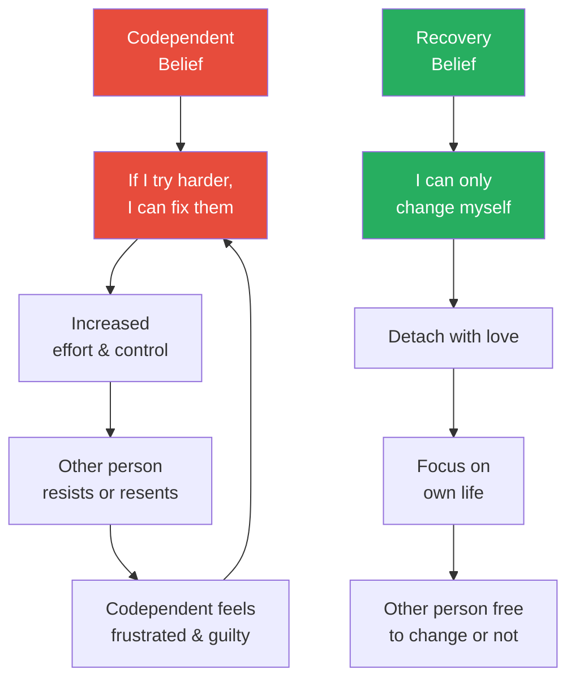
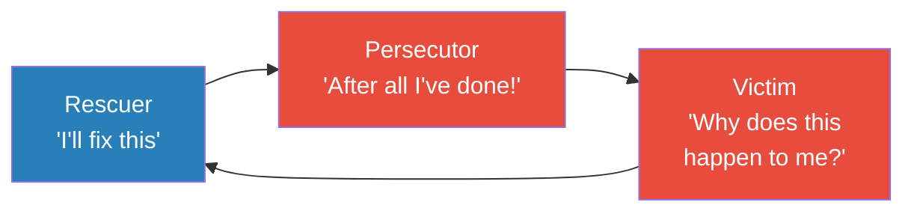
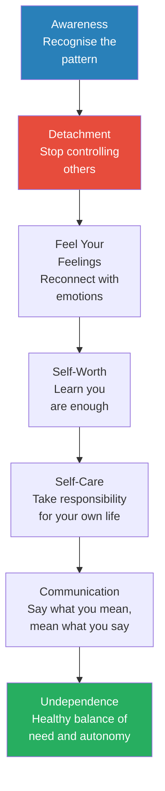

# Codependent No More — Melody Beattie

> Melody Beattie wrote the book that named something millions of people were living but couldn't articulate: codependency — the progressive, self-destructive pattern of losing yourself in the caretaking of others.
> Originally framed around partners of alcoholics, the concept expanded to describe anyone who has let another person's behaviour affect them so deeply that they become obsessed with controlling it.
> Beattie maps the entire codependent system: the characteristics (caretaking, low self-worth, obsession, controlling, denial), the rescue triangle (rescuer → persecutor → victim), the illusion of control, the terror of independence, and the path out through detachment, self-care, and learning to live your own life.
> The book has sold over five million copies since 1986 and remains the foundational text on codependency recovery.
> This summary is based on an adapted/abridged version of the original text.

---

## About the Author

Melody Beattie is a recovering alcoholic, former drug user, and adult child of an alcoholic who experienced codependency from both sides — as the person with the addiction and as the partner of one. Her personal experience infuses the book with an authenticity that clinical texts rarely achieve. Before writing *Codependent No More*, she worked as a chemical dependency counsellor in Minnesota, where the term "codependency" was originally coined in the late 1970s. She went on to write several follow-up books including *Beyond Codependency* and *The Language of Letting Go*. Her writing is direct, compassionate, and grounded in the twelve-step tradition.

---

## The Big Idea

- <b style="color: #2980b9">Codependency</b> is a pattern where you let another person's behaviour affect you so profoundly that you become obsessed with controlling that person's behaviour — while your own life falls apart
- It was originally identified in partners of alcoholics but applies to anyone enmeshed in the problems of others — partners of addicts, adult children of alcoholics, caregivers, helpers, people-pleasers
- The codependent's core belief: <b style="color: #e74c3c">"If I can just fix this person, everything will be fine"</b> — but you cannot fix, control, or change another person
- Codependency is progressive: it starts with concern, escalates to obsession, and can end in depression, physical illness, substance abuse, or complete loss of self
- <b style="color: #27ae60">Recovery begins with detachment</b> — not cold withdrawal, but the recognition that each person is responsible for themselves, and worrying doesn't help
- The only person you can change is yourself; the only person whose business you can control is yourself

---

## Key Concepts at a Glance

| Concept | One-line summary |
|---------|-----------------|
| **Codependency** | Losing yourself in the caretaking of others; obsessing over controlling their behaviour |
| **The Rescue Triangle** | Rescuer → Persecutor → Victim: the cycle that traps codependents |
| **Detachment** | Healthy separation based on the premise that each person is responsible for themselves |
| **HOW Formula** | Honesty + Openness + Willingness to try — the foundation for detachment |
| **The Illusion of Control** | You cannot control anyone's addiction, emotions, choices, or destiny |
| **Undependence** | The healthy balance between acknowledging your needs for people and not becoming harmfully dependent |
| **Caregiver vs Caretaker** | Caregiving is healthy; caretaking (doing for others what they should do for themselves) is codependent |
| **Low Self-Worth** | The codependent's core affliction — "I am not good enough" |
| **Reactionary Pattern** | Codependents react instead of act; they let others' behaviour dictate their emotional state |
| **Love vs Addiction** | Love allows growth, trust, and separateness; addiction demands control, jealousy, and total involvement |
| **Feeling Your Feelings** | Codependents lose touch with their emotions; recovery requires reconnecting with Mad, Sad, Glad, Scared |
| **Twelve Steps** | Spiritual self-care programme adapted for codependency recovery |

---

## Other Codependent Stories

*Beyond Zainab, Beattie presents several portraits that show codependency operating across different contexts.*

> [!example] Amjad: The Counsellor Who Couldn't Stop Helping
> - Amjad was a chemical dependency counsellor and recovering alcoholic with years of sobriety
> - His father and three brothers were all alcoholics — he grew up in a system saturated with addiction
> - His problem wasn't his work (he was intelligent and skilled) — it was his leisure time
> - He spent most of it worrying about and obsessing over other people's problems
> - Sometimes he tried to untangle messes alcoholics created; other times he felt angry with them for creating the messes he felt obligated to clean up
> - He ranted, felt guilty, felt sorry, felt used — but rarely felt close to anyone, and rarely had fun
> - For years, he called his behaviour "kindness" and "concern" and "love" — now he calls it codependency
> **The lesson:** Codependency can disguise itself as virtue — the more noble your caretaking appears, the harder it is to recognise as a problem.

> [!example] Rubina: Scheduling Her Day by Guilt
> - Rubina, in her forties, devoted her life to her five children and recovering alcoholic husband
> - She spent too much of the family budget on toys and clothing — whatever the children wanted — and they never said "Thank you"
> - She resented her constant giving, resented how her family's needs controlled her life, and even resented her profession (nursing)
> - "I feel guilty when I don't do what's asked of me. I feel guilty when I don't live up to my standards. I just plain feel guilty. In fact, I schedule my day, my priorities, according to guilt."
> **The lesson:** When guilt becomes the organising principle of your life, every decision is made for someone else — and you disappear from your own story.

---

## What Is Codependency?

*Beattie opens with a raw, unflinching portrait of codependency from the inside — the exhaustion, the rage, the loss of self.*

> [!example] Zainab's Story: The Opening Portrait
> - Zainab sat in her kitchen, unable to do housework she once managed effortlessly
> - Naps had become a necessity; she couldn't even muster the energy to comb her hair
> - Her marriage was over in all but name — the love was gone, replaced by ache and bitter rage
> - She never intended to marry an alcoholic, yet her father had been one — the pattern repeated
> - Her husband Frank's drinking became apparent on their honeymoon when he left the hotel and didn't return until 6:30 the next morning
> - She had left him before but "all I did was feel depressed, think about him, and worry about money"
> - When her neighbour invited her to a counselling group, Zainab felt furious: "Make him better, and I will feel better"
> - Frank attended Alcoholics Anonymous for six months and started getting better — but Zainab wasn't: "Something dreadful had happened to me... I had been affected by his drinking, and the ways I had been affected had become my problems"
> **The lesson:** Codependency is what happens when someone else's problem becomes your identity — and fixing them becomes your sole purpose.

- <b style="color: #2980b9">Beattie's definition:</b> "A codependent person is one who has let another person's behavior affect him or her, and who is obsessed with controlling that person's behavior"
- The word emerged in the late 1970s in Minnesota treatment centres to describe people whose lives became unmanageable from living with a chemically dependent person
- The definition expanded: when codependents left one troubled person, they frequently sought another — the behaviours persisted regardless of the relationship

---

## The Codependent Characteristics

*Beattie presents a comprehensive checklist — recognising yourself in these patterns is the first step toward recovery.*

- **Caretaking:**
  - Feel responsible for other people's feelings, thoughts, actions, and destiny
  - Feel compelled to help solve problems — giving rapid-fire suggestions, unwanted advice
  - Feel anxiety, pity, and guilt when other people have problems

- **Low self-worth:**
  - Reject compliments or praise
  - Think they're not quite good enough
  - Take things personally
  - Think their lives aren't worth living

- **Repression:**
  - Push thoughts and feelings out of awareness from fear and guilt
  - Become afraid to let themselves be who they are
  - Appear rigid and controlled

- <b style="color: #e74c3c">**Obsession:**</b>
  - Feel terribly anxious about problems and people
  - Worry about the silliest things
  - Lose sleep over other people's behaviour
  - Focus all energy on other people and problems

- **Controlling:**
  - Think they know best how things should turn out
  - Try to control events and people through threats, advice, manipulation, or domination

- **Denial:**
  - Ignore problems or pretend they aren't happening
  - Tell themselves things will be better tomorrow
  - Stay busy so they don't have to think

- **Dependency:**
  - Don't feel happy, content, or peaceful with themselves
  - Look for happiness outside themselves
  - Tolerate abuse to keep people loving them
  - Lose interest in their own lives when they love

- **Poor communication:**
  - Don't say what they mean
  - Gauge words carefully to achieve a desired effect
  - Try to say what they think will please people

- **Weak boundaries:**
  - Let others hurt them
  - Keep letting people hurt them

> [!tip] Core Insight
> The codependent's tragedy is that they sacrifice everything — their time, energy, identity, happiness — to help someone who hasn't asked for help, doesn't want to change, and wouldn't be able to receive the help even if it worked. The codependent ends up as the sickest person in the room.

- **Progressive characteristics (late-stage codependency):**
  - Feel lethargic, depressed, hopeless, even suicidal
  - Experience complete loss of daily routine and structure
  - Abuse or neglect their children and other responsibilities
  - Develop eating disorders
  - Become addicted to alcohol or other drugs
  - <b style="color: #e74c3c">Codependency is progressive</b> — it escalates over time if not interrupted

- **Sex problems in codependent relationships:**
  - Caretaking extends to the bedroom — having sex when you don't want to
  - Don't talk about sexual needs or dissatisfaction
  - Consider or have extramarital affairs to escape the emptiness
  - Reduce sex to a technical act — disconnected from emotion
  - Lose interest in sex entirely
  - Sexual intimacy requires vulnerability — and codependents have learned that vulnerability is dangerous

---

## The History of Codependency

*Understanding where the term came from helps explain why it applies far beyond addiction.*

- The word "codependency" appeared on the treatment scene in the late 1970s in Minnesota
- Originally described the person whose life was affected by being involved with someone chemically dependent
- In the 1940s, after the birth of Alcoholics Anonymous, wives of alcoholics formed self-help groups to deal with how their spouses' alcoholism affected *them*
- The basic thought: codependents were people whose lives had become unmanageable as a result of living in a committed relationship with an alcoholic
- But the definition expanded: professionals began to see the same patterns in people involved with anyone with a compulsive disorder — gambling, eating, workaholism
- When codependents left one troubled relationship, they frequently sought another troubled person — <b style="color: #2980b9">the behaviours persisted regardless of the partner</b>
- Eventually, codependency was recognised as a pattern in its own right — not just a reaction to someone else's problem

- **Who "has" codependency?**
  - Partners and spouses of alcoholics and drug addicts
  - Adult children of alcoholics
  - Parents of children with substance use issues
  - People in relationships with chronically ill or mentally ill people
  - Professionals in helping fields (nurses, social workers, therapists, counsellors)
  - People raised in families where feelings were not allowed
  - People-pleasers and chronic helpers who can't say no
  - Anyone who has lost themselves in the caretaking of another person
  - <b style="color: #e74c3c">Beattie's provocative observation:</b> "Some therapists have proclaimed: codependency is anything and everyone is codependent" — she doesn't go that far, but the patterns are far more widespread than people realise

- **The difference between codependency and caring:**
  - Caring says: "I love you, and I want you to get help"
  - Codependency says: "I love you, so I'll handle everything for you"
  - Caring allows natural consequences to teach
  - Codependency shields the person from consequences — preventing growth
  - Caring respects the other person's autonomy
  - Codependency denies it — "I know what's best for you"

---

## Detachment: The Foundation of Recovery

*Detachment is not abandonment — it is the recognition that you cannot solve problems that aren't yours to solve.*

- <b style="color: #27ae60">Detachment</b> is based on the premise that each person is responsible for themselves, that we can't solve problems that aren't ours, and that worrying doesn't help
- It involves "present moment living" — allowing life to happen instead of forcing and controlling it
- Sometimes detachment even motivates and frees people around us to begin solving their own problems
- Forms of unhealthy attachment:
  - Excessive worry about a problem or person
  - Emotional energy directed at the object of obsession
  - Becoming reactionaries instead of acting authentically
  - Becoming emotionally dependent on people around us
  - Becoming caretakers, firmly attaching ourselves to others' need for us

> [!abstract] The HOW Formula for Detachment
> 1. **Honesty:** accept that you are human with limitations; you can't be perfect at solving other people's problems
> 2. **Openness:** welcome other people's thoughts and opinions; be open to express your own true feelings
> 3. **Willingness to try:** accept your strengths and weaknesses; strive for finding your own potential rather than finding happiness in others

---

## Stop Reacting: Don't Be Blown About by Every Wind

*Codependents are reactionaries — they let other people's behaviour dictate their emotional state. Recovery requires learning to respond rather than react.*

- Codependents react with anger, guilt, shame, self-hate, worry, hurt, controlling gestures, caretaking, desperation
- <b style="color: #e74c3c">The destructive reactionary pattern:</b> "If someone does something, we must do something back. If someone says something, we must say something back. If someone feels a certain way, we must feel a certain way."

> [!abstract] Four Steps to Stop Reacting
> 1. **Recognise when you're reacting:** anxiety, fear, outrage, rejection, shame — something has snagged you
> 2. **Make yourself comfortable:** deep breaths, walk, clean the kitchen, go to a friend's house
> 3. **Examine what happened:** talk to a trusted friend; take responsibility for your feelings
> 4. **Figure out what you need to take care of yourself:** make decisions from a peaceful state, not a reactive one

---

## The Illusion of Control

*Beattie dismantles the codependent's central belief: that if they just try hard enough, they can make the other person change.*

- You cannot control alcoholism, compulsive behaviours, anyone's emotions, minds, or choices
- You cannot control the outcome of events
- <b style="color: #27ae60">"The only person you can ever change is yourself. The only person whose business you can control is yourself."</b>
- People ultimately do what they want to do — they will resist our efforts or temporarily adapt, then return to their natural state the moment we turn our backs
- People will punish us for making them do something they don't want to do
- When you've done all you can do, it's time to detach

*The codependent cycle is self-reinforcing: more effort leads to more resistance, which leads to more effort. Recovery breaks the cycle by redirecting energy inward.*

---

## The Rescue Triangle

*Beattie exposes the destructive pattern at the heart of codependency: rescue → persecution → victimhood.*

- **Rescuing** = taking responsibility for another person's thoughts, feelings, decisions, behaviours, well-being, or destiny
- Rescuing behaviours:
  - Doing something for someone capable of doing it for themselves
  - Meeting people's needs without being asked
  - Consistently giving more than you receive
  - Speaking for another person
  - Suffering people's problems for them
- <b style="color: #e74c3c">Caretaking breeds anger</b> — caretakers become angry parents, angry friends, angry lovers
- **The distinction that matters:** caregiver (healthy giving) vs caretaker (codependent enabling)
  - Caregiving: helping people learn to help themselves
  - Caretaking: doing things for people so they never have to learn

*The codependent cycles through all three roles: they rescue (do everything for the other person), then persecute (resent them for it), then feel victimised (wonder why no one helps them).*

---

## Undependence: The Healthy Balance

*Beattie introduces the concept of "undependence" — neither toxic dependency nor cold isolation, but a healthy balance.*

- <b style="color: #2980b9">Undependence</b> (term from Penelope Russianoff): the balance where you acknowledge and meet healthy needs for people and love without becoming harmfully dependent
- Many codependents are frightened, needy, vulnerable children aching to be loved
- The child inside believes they are unlovable and will never find comfort
- Needing people so much, yet believing you are unlovable, leads to settling for too little — becoming dependent on troubled people, tolerating abuse
- <b style="color: #e74c3c">Unfinished business from childhood:</b> when needs weren't met as children, we keep trying to get them met from similar unavailable people — the cycle repeats until interrupted

- **Six steps toward undependence:**
  - Finish childhood business: grieve, get perspective, understand how the past affects the present
  - Nurture the vulnerable child inside — stress may cause this child to cry out unexpectedly
  - Stop looking for happiness in other people — the source is inside you
  - Learn to depend on yourself — start being there for you
  - Depend on a higher power
  - Strive for undependence: examine the ways you are dependent, emotionally and financially

> [!tip] Core Insight
> "We don't have to feel strong all the time to be undependent. We can and probably will have feelings of fear, weakness, and even hopelessness. That is normal and even healthy. Real power comes from feeling our feelings, not from ignoring them."

---

## Live Your Own Life

*Beattie's most passionate chapter: the call to stop living through others and start living for yourself.*

- "The surest way to make ourselves crazy is to get involved in other people's business, and the quickest way to become sane and happy is to attend to our own affairs"
- <b style="color: #27ae60">Self-care is not selfish</b> — it is taking responsibility for your own life
- Beattie's self-care manifesto: "I am responsible for myself. I am responsible for living or not living my life. I am responsible for tending to my spiritual, emotional, physical, and financial well-being. I am responsible for identifying and meeting my needs. I am responsible for solving my problems. I am responsible for my choices."
- Self-care means becoming your own counsellor, confidant, spiritual advisor, partner, best friend, and caretaker
- It means asking people for what you need — because that is what responsible people do

---

## Have a Love Affair with Yourself

*Beattie addresses the codependent's deepest wound: the conviction that they are fundamentally unworthy of love. This is perhaps the most emotionally powerful chapter in the book.*

> [!example] The Disguised Self-Hatred
> - Some codependents disguise their self-hatred by dressing right, living in the right home, working the right job
> - They may boast of accomplishments — but underneath lies "a dungeon where we secretly and incessantly punish and torture ourselves"
> - Sometimes they punish themselves openly, saying demeaning things about themselves
> - Sometimes they invite others to help: allowing certain people or religious customs to help them feel guilty, or allowing people to hurt them
> - "But our worst beatings go on privately, inside our minds"
> **The lesson:** The codependent's outer competence often masks inner devastation — the person who appears to "have it together" may be the one suffering most.

- Most codependents suffer from low self-worth — some don't merely dislike themselves, they *hate* themselves
- They don't like the way they look, can't stand their bodies, think they're stupid, believe their feelings are wrong
- They may disguise it well — dressing right, living in the right home, working the right job — but underneath lies a dungeon of self-punishment
- <b style="color: #27ae60">"We are okay. We are exactly as we are meant to be."</b>
- Codependents are often some of the most loving, generous, good-hearted, and concerned people — the problem is not who they are but how they treat themselves
- Recovery: stop the "shoulds," become aware of self-punishment, tell yourself positive messages, give yourself a hug, then go about living as you choose
- "We aren't second-class citizens. We don't deserve to lead second-hand lives. And we don't deserve second-best relationships!"
- "The people who look the most beautiful are the same as us. The only difference is they're telling themselves they look good, and they're letting themselves shine through."
- "We are good. We are good enough. We are appropriate to life."
- "Stop the 'shoulds'. Become aware of when we're punishing ourselves, and make a concerted effort to tell ourselves positive messages."
- "Shame and guilt serve no long-term purpose. They are only useful to momentarily indicate when we may have violated our own moral codes. Guilt and shame are not useful as a way of life."
- "We can be gentle, loving, listening, attentive and kind to ourselves — our feelings, thoughts, needs, wants, desires, and everything we're made of"
- <b style="color: #27ae60">"Out of high self-esteem will come true acts of kindness and charity, not selfishness"</b> — when you love yourself, you love others better, not worse

---

## Feel Your Own Feelings

*Codependents often lose touch with the emotional part of themselves — recovery requires reconnecting.*

- Codependents withdraw emotionally to avoid being hurt; their feelings may provoke anger or even physical danger
- Families with no history of addiction can still reject feelings: "Don't feel that way" or "That feeling is inappropriate"
- <b style="color: #2980b9">Four primary feelings:</b> Mad, Sad, Glad, Scared — all others are shades and variations
- **The process:** feel the feeling → acknowledge it → evaluate the situation (not the feeling) → choose a response
- Repressed feelings:
  - Block energy and creativity
  - Cause physical ailments
  - Make you lose the ability to feel positive emotions along with negative ones
  - Lead to depression, illness, and self-destruction
- <b style="color: #e74c3c">Intense happy feelings can be as scary as sad ones</b> for codependents — they believe happy feelings must be followed by sad ones, because that's how it always was

---

## Asking for What You Need

*One of the hardest things for codependents — because asking was never allowed.*

- Most codependents don't ask for what they need — many don't even know what they need
- They have falsely believed their needs aren't important, that they shouldn't mention them
- Some began to believe their needs are wrong, so they repress them entirely
- They haven't learned to identify what they need or listen to what they need — because it never mattered anyway
- <b style="color: #27ae60">Recovery involves learning to ask:</b>
  - Start by identifying one small need each day
  - Practice stating it out loud, even if only to yourself
  - Then practice stating it to someone safe
  - Expect that some people will say no — and that is okay
  - Asking for what you need is not selfish; it is what responsible people do
- "We need to listen to ourselves and our higher power. Respect what we hear. This insane business of punishing ourselves for what we think, feel, and want — this nonsense of not listening to who we are and what ourselves are struggling to tell us — must stop."
- "How do you think God works with us? No wonder we think God has abandoned us; we've abandoned ourselves."
- Give yourself what you need: sometimes that's fun (a treat, a trip); sometimes it's work (developing a characteristic, tending to responsibilities)
- "Giving ourselves what we need means we become our personal counsellor, confidant, spiritual advisor, partner, best friend, and caretaker in this exciting new venture — living our own lives"

---

## Anger: The Codependent's Hidden Fire

*Beattie addresses the enormous reservoir of repressed anger that every codependent carries.*

- For codependents, anger covers a large part of their life — hostility lurks just beneath the surface
- The codependent feels angry about everything the addict does, then feels guilty *about being angry*
- Common false beliefs about anger:
  - It's not okay to feel angry
  - Anger is sinful
  - People will leave if anger enters the picture
  - If someone feels angry at you, they don't love you anymore
- The anger-guilt cycle: codependent gets angry → addict says "how dare you" → codependent wonders if addict is right → guilt compounds the anger → nothing gets resolved
- **Dealing with anger:**
  - Give yourself permission to feel angry
  - Feel the emotion without acting it out destructively
  - Examine the thinking behind the anger
  - Watch for patterns
  - Make a responsible decision about what action to take
  - Don't let anger control you — but don't repress it either
  - Talk to trusted people; physically discharge the energy (exercise, walk)

---

## The Art of Acceptance

*Beattie argues that acceptance — not resignation — is the turning point for change.*

- Acceptance brings peace — it is frequently the turning point for change
- We have many things to accept daily: who we are, where we live, who we live with, our responsibilities, any problems that arise
- Some days acceptance is easy — the hair behaves, the kids behave, the boss is reasonable
- Other days: the brakes go out, the roof leaks, the spouse says they don't love you anymore
- <b style="color: #2980b9">Codependents never know what to expect</b> — especially if living with an alcoholic, drug addict, or anyone with a serious compulsive disorder
  - Bombarded by problems, losses, and change
  - Shattered windows, missed appointments, broken promises, outright lies
  - Lose financial security, emotional security, faith in people, faith in themselves
- Perhaps the most painful loss: <b style="color: #e74c3c">the loss of dreams</b>
  - The hopeful expectations for the future that most people carry
  - "On our wedding day, we had dreams. The future was full of wonder and promise."
  - Those dreams may never breathe again — and accepting that is devastating but necessary
- Acceptance doesn't mean approving of what happened — it means acknowledging what is, so you can move forward

---

## Yes, You Can Think

*Beattie addresses the codependent's paralysing indecision — the result of years of having their thinking invalidated.*

- Codependents don't trust their minds — the smallest choice (what to order at a restaurant) can paralyse them
- Larger decisions (how to solve problems, what to do with their lives) can overwhelm them entirely
- Many simply give up and let other people or circumstances make choices for them
- Root causes:
  - Chaos, stress, and repressed emotions cloud thinking
  - Worrying about what other people think
  - Believing they must be perfect — "the whole world waits on this decision"
  - Parents who criticised their choices — directly or indirectly told them they can't think
  - Years of being told they're stupid, incompetent, or wrong
- <b style="color: #27ae60">Recovery: decisions don't have to be made perfectly</b>
  - You're not so fragile you can't handle a mistake
  - Changing your mind is healthy — change is constant
  - Treat your mind to peace; quit abusing it with worry and obsession
  - Feed your mind healthy information; give it reasonable data and let it sort through complications
  - Stop saying bad things about your mind: "I'm stupid," "I can't make good decisions"
  - "We don't have to let anyone make a decision for us. Letting people make decisions for us means we've been rescued — and we aren't victims."

---

## Set Your Own Goals

*Beattie introduces the transformative power of goal-setting — something codependents rarely do because they're too busy reacting.*

- "There is a magic in setting goals. Things actually happen. Things change."
- Many codependents know the joy of others' accomplishments but not their own — they are too busy reacting to act
- Goals give direction and purpose — they cure boredom and sometimes chronic ailments
- <b style="color: #27ae60">Goal-setting principles:</b>
  - Turn everything into a goal — including finding solutions and making decisions
  - Eliminate the "shoulds" — make it a goal to get rid of 75% of them
  - Don't limit yourself — go for everything you want and need
  - Write goals on paper — there is extraordinary power in written goals vs. loosely stored mental ones
  - Do what you can, one day at a time — within the framework of each day, do what seems fitting
  - Check off goals you reach — congratulate yourself and thank your higher power
  - Be patient — "I've started to realise that waiting is an art, that waiting achieves things"
- "You probably won't start living happily ever after, but you may start living happily."

---

## Love vs Addiction

*Beattie provides a sharp contrast between love (open system) and addiction (closed system).*

| Love (Open System) | Addiction (Closed System) |
|---------------------|--------------------------|
| Room to grow; desire for other to grow | Dependent; based on security and comfort |
| Separate interests; maintain other meaningful relationships | Total involvement; neglect old friends |
| Encouragement of each other's expanding | Preoccupation with other's behaviour; dependent on approval |
| Trust and openness | Jealousy and possessiveness |
| Mutual integrity preserved | One partner's needs suspended |
| Willingness to risk | Search for perfect invulnerability |
| Ability to enjoy being alone | Intolerance of being alone |

- **Healthy ways to deal with anger:**
  - Give yourself permission to feel angry — anger at mistreatment is healthy and appropriate
  - Feel the emotion without acting it out destructively
  - Acknowledge the thoughts that accompany the feeling — say them aloud
  - Examine the thinking: is there a genuine problem to solve, or is this recycled resentment?
  - Watch for patterns — anger in codependents often follows a predictable cycle
  - Make a responsible decision about what action to take
  - Don't let anger control you — but don't repress it either
  - Talk to trusted people — "Talking about anger and being listened to and accepted really helps clear the air"
  - Burn off the energy physically — exercise, dance, walk
  - Don't beat yourself or others when angry
  - Write letters you don't intend to send — this allows expression without consequence
  - Deal with the guilt — separate earned guilt from unearned guilt

> [!tip] Core Insight
> "Anger and unpleasant feelings are weeds. They don't go away when we ignore them; they grow wild and take over." Repressed anger doesn't disappear — it transforms into bitterness, hatred, contempt, or resentment. The only way out is through.

---

## Communication

*Codependents have poor communication skills — not because they lack intelligence but because they don't trust themselves enough to speak truthfully.*

- Codependents carefully choose words to manipulate, people-please, control, cover up, and alleviate guilt
- They don't trust their thoughts, feelings, or right to say no
- <b style="color: #27ae60">Ten principles for healthy communication:</b>
  1. Talk clearly and openly — start by knowing who you are is okay
  2. Say what you mean, and mean what you say
  3. Talk about your problems with trusted people
  4. Express your feelings
  5. Say what you think — "This is what I think"
  6. Say what you expect without demanding others change
  7. Ignore nonsense — "I don't want to discuss this"
  8. Be assertive without being aggressive — "This is as far as I go"
  9. Show compassion without rescuing — "I'm sorry you're having that problem"
  10. Express your wants and needs — "This is what I need from you"

---

## The Codependent's Path to Self-Trust

*Throughout the book, Beattie returns to a central theme: codependents have lost faith in their own ability to think, decide, feel, and act. Recovery is about reclaiming each of these.*

- **Reclaiming your thinking:**
  - Codependents have been told — directly or indirectly — that they can't make good decisions
  - Parents criticised choices; schools labelled them; partners overrode them
  - The antidote: start making small decisions and living with the results
  - "Decisions don't have to be made perfectly. We're not so fragile that we can't handle making a mistake."
  - Trust the process: "When you deeply entrench your goals, your subconscious mind works on them even when you're not consciously thinking about them"

- **Reclaiming your feelings:**
  - The four primary feelings — Mad, Sad, Glad, Scared — are all valid
  - No feeling is wrong or inappropriate
  - Process: feel it → acknowledge it → examine the thinking behind it → choose a response
  - <b style="color: #27ae60">"Feelings are energy. Repressed feelings block our energy."</b>
  - A big reason not to repress: emotional withdrawal causes you to lose positive feelings along with negative ones
  - When you shut down sadness and anger, you also shut down joy and love

- **Reclaiming your voice:**
  - Communication is not mystical — the words you speak reflect who you are
  - If you think you're inappropriate to life, your communication will reflect this
  - Start with: "It's okay to be who I am. My feelings and thoughts are okay."
  - Practice the assertiveness formula: "I feel ____ when you ____ because ____"
  - Take responsibility for your communication — let your words reflect high self-esteem

- **Reclaiming your life:**
  - Codependents have been so wrapped up in other people that they've forgotten how to live
  - "Maybe we've been in so much emotional distress we think we have no life; all we are is our pain. That's not true."
  - Setting goals is the bridge from reacting to acting
  - Write your goals on paper — "there is extraordinary power in jotting down goals rather than storing them loosely in minds"
  - Turn problems into goals: "You will stop worrying about your problems when you turn your problems into goals"

---

## The Twelve Steps (Adapted for Codependency)

*Beattie closes with the spiritual framework that undergirds recovery.*

> [!abstract] The Twelve Steps for Codependents
> 1. Admit powerlessness over the addiction/problem — life has become unmanageable
> 2. Believe a Power greater than ourselves could restore sanity
> 3. Turn will and life over to the care of God as understood
> 4. Make a searching and fearless moral inventory of ourselves
> 5. Admit to God, ourselves, and another person the exact nature of our wrongs
> 6. Become entirely ready to have God remove defects of character
> 7. Humbly ask God to remove shortcomings
> 8. Make a list of all persons harmed and become willing to make amends
> 9. Make direct amends where possible except when doing so would injure them or others
> 10. Continue to take personal inventory and promptly admit when wrong
> 11. Seek through prayer and meditation to improve conscious contact with God
> 12. Carry the message to others and practice these principles in all affairs

---

## The Driving-in-Fog Metaphor

*Beattie's most memorable image — a metaphor for navigating recovery when you can't see the way ahead.*

> [!example] Driving in the Dark
> - Beattie was driving one night in terrible weather — fog so thick she could barely see
> - Stiff and frightened at the wheel, she could only see a few feet ahead through her headlights
> - She started to panic: "Anything could happen!"
> - Then a calming thought entered her mind: the path was only lit for a few feet, but each time she progressed those few feet, a new section was lit
> - It didn't matter that she couldn't see far ahead — she could see as far as she needed for the present moment
> - The situation was not ideal, but she could get through it if she stayed calm and worked with what was available
> **The lesson:** "You can get through dark situations, too. You can take care of yourself and trust yourself. Go as far as you can see, and by the time you get there, you'll be able to see farther. It's called One Day at a Time."

---

## What Self-Care Is Not

*Beattie warns against the misuse of "self-care" as a weapon or excuse.*

- Some people use "taking care of myself" to control, impose upon, or force their will on others
  - "I dropped in uninvited with my five kids and cat. We're going to spend the week. I'm just taking care of myself!"
  - "I'm going to holler and scream at you all day because you didn't do what I wanted. I'm just taking care of myself!"
  - "I know my son is shooting heroin in his bedroom, but that's his problem. I'm going to the store and charge $500. I'm just taking care of myself!"
- These are not self-care — they are manipulation, avoidance, and irresponsibility disguised as self-care
- <b style="color: #27ae60">Real self-care</b> is taking responsibility for your own life — not using it as an excuse to avoid responsibility
- It means: tending to your spiritual, emotional, physical, and financial well-being
- It means: identifying and meeting your needs, solving your problems, being responsible for your choices
- It means: giving yourself what you need *and* asking others for what you need — because that's what responsible people do
- Self-care includes both the pleasant (a new hairdo, an evening at the theatre) and the work (eliminating a destructive characteristic, tending to responsibilities)
- "Giving ourselves what we need means we become our own personal counsellor, confidant, spiritual advisor, partner, best friend, and caretaker"

---

## The Self-Care Manifesto

*Beattie's central declaration, repeated throughout the book — what it means to truly take care of yourself.*

- "I am responsible for myself"
- "I am responsible for living or not living my life"
- "I am responsible for tending to my spiritual, emotional, physical, and financial well-being"
- "I am responsible for identifying and meeting my needs"
- "I am responsible for solving my problems or learning to live with those I cannot solve"
- "I am responsible for my choices"
- "I am responsible for what I give and receive"
- "I am responsible for setting and achieving my goals"
- "I am responsible for how much I enjoy life"
- "I am responsible for whom I love and how I choose to express this love"
- "I am responsible for what I do to others and for what I allow others to do to me"
- <b style="color: #27ae60">"All of me, every aspect of my being, is important. I count for something. I matter."</b>
- "My feelings can be trusted. My thinking is appropriate. I value my wants and needs."
- "I do not deserve and will not tolerate abuse or constant mistreatment."
- "The decisions I make and the way I conduct myself will reflect my high self-esteem."

---

## The Serenity Prayer as Recovery Tool

*Central to the twelve-step framework, the Serenity Prayer encapsulates the entire codependency recovery philosophy.*

- "God, grant me the serenity to accept the things I cannot change, the courage to change the things I can, and the wisdom to know the difference."
- **What you cannot change:** other people's addictions, behaviours, emotions, choices, or destiny; the past; what has already happened
- **What you can change:** your own behaviour; how you respond; what you tolerate; who you spend time with; how you treat yourself; your goals and priorities
- **The wisdom to know the difference:** this is the hardest part — codependents chronically confuse what they can and cannot change
  - They spend enormous energy on what they cannot change (fixing the addict)
  - They neglect what they can change (their own self-care, boundaries, recovery)
- Beattie recommends this prayer not just as a spiritual practice but as a daily decision-making tool: before taking any action, ask yourself which category it falls into
- If it's something you cannot change — detach
- If it's something you can change — act
- If you're not sure — wait until you are

---

## Codependent Attachment vs Healthy Attachment

*Beattie clarifies what "attachment" means in codependency — and why detachment is not abandonment.*

- <b style="color: #e74c3c">Codependent attachment</b> is not normal liking, concern, or connection — it is becoming overly involved, sometimes hopelessly entangled
- Forms of unhealthy attachment:
  - Excessively worrying about a problem or person
  - Directing all emotional energy at the object of obsession
  - Becoming reactionaries instead of acting authentically
  - Becoming emotionally dependent on the people around you
  - Becoming a caretaker, firmly attaching yourself to others' need for you
- <b style="color: #27ae60">"Whenever we become attached in these ways to someone or something, we become detached from ourselves"</b>
  - We lose touch with ourselves
  - We forfeit our power to think, feel, act, and take care of ourselves
  - We lose control
- Over-involvement keeps us in chaos; it keeps the people around us in chaos
- "If we are focusing all our energies on people and problems, we have little left for the business of living our own lives"
- The wasted energy we focus on other people is energy stolen from our own lives
- "We cannot begin to work on ourselves until we have detached from the object of our obsession"

---

## The Codependency Recovery Path

*Recovery is sequential: you must first see the pattern, then stop trying to control others, reconnect with your own emotions, rebuild self-worth, learn self-care, communicate honestly, and finally achieve "undependence."*

---

## Key Principles for Codependency Recovery

*Distilled from across the book — the principles that Beattie returns to again and again.*

1. **Each person is responsible for themselves** — you cannot fix, rescue, or control another person
2. **Worrying doesn't help** — it is wasted energy that could be directed toward your own life
3. **The only person you can change is yourself** — and that is enough
4. **Detachment is not abandonment** — it is recognising where your responsibility ends and another's begins
5. **Self-care is not selfish** — it is the foundation of all healthy relationships
6. **Feelings are never wrong** — they are information; repressing them causes more damage than feeling them
7. **You are enough** — low self-worth is a symptom of codependency, not a fact about your value
8. **Acceptance brings peace** — facing reality, however painful, is the turning point for change
9. **Goals give purpose** — turning problems into goals transforms you from a reactionary into an actor
10. **Communication must be honest** — say what you mean, mean what you say, don't apologise for having needs
11. **Recovery is an ongoing process** — there is no finish line; there is only steady, imperfect progress
12. **One Day at a Time** — go as far as you can see; by the time you get there, you'll be able to see farther

---

## Key Beattie Quotes to Remember

*Lines from the book that distil its core philosophy.*

- "A codependent person is one who has let another person's behavior affect him or her, and who is obsessed with controlling that person's behavior."
- "The only person you can ever change is yourself. The only person whose business you can control is yourself."
- "The surest way to make ourselves crazy is to get involved in other people's business, and the quickest way to become sane and happy is to attend to our own affairs."
- "We are okay. We are exactly as we are meant to be."
- "Detachment is not a cold hostile withdrawal. It is based on the premise that each person is responsible for themselves."
- "Real power comes from feeling our feelings, not from ignoring them."
- "We don't have to feel strong all the time to be undependent."
- "Go as far as you can see, and by the time you get there, you'll be able to see farther."
- "You probably won't start living happily ever after, but you may start living happily."
- "Feelings are never wrong. They're not inappropriate."
- "Caretaking breeds anger."
- "Controlling is an illusion. It doesn't work."
- "People ultimately do what they want to do."
- "I am responsible for myself. All of me, every aspect of my being, is important. I count for something. I matter."

---

## The Codependency Self-Check

*Am I being codependent right now? Beattie teaches readers to recognise the pattern in real time.*

- Am I trying to fix someone who hasn't asked for my help?
- Am I worrying about someone else's problem more than they are?
- Am I neglecting my own needs to attend to someone else's?
- Am I feeling resentful about something I volunteered to do?
- Am I making excuses for someone's poor behaviour?
- Am I afraid to say what I really think because of how the other person might react?
- Am I taking responsibility for someone else's feelings?
- Have I done something I didn't want to do because I felt guilty?
- Am I hoping someone will change without any evidence that they will?
- Am I basing my mood on how someone else is feeling?
- Am I suffering in silence, hoping someone will notice?
- Am I telling myself "things will get better tomorrow" without taking any action?

- If you answer yes to several of these questions, you are in a codependent pattern
- The response is not self-blame — it is awareness, followed by detachment, followed by self-care
- "Be gentle with yourself. You are doing the best you can with what you know."
- Use this checklist regularly — codependent patterns can re-emerge during stress, relationship changes, or contact with addicts/toxic people
- The goal is not perfection but awareness: catching the pattern earlier each time

---

## The Codependent's Paradox

*A final reflection on the central paradox that makes codependency so difficult to recognise and escape.*

- The codependent's greatest strength is their ability to care deeply for others — and this is also their greatest vulnerability
- They are drawn to people who need help precisely because helping gives them purpose
- The tragedy: the more they help, the worse things get — for both parties
- The addict never learns to help themselves; the codependent never learns to help themselves
- <b style="color: #27ae60">Recovery does not mean becoming uncaring</b> — it means redirecting that extraordinary capacity for care toward yourself, first
- When you learn to care for yourself, you become genuinely available to others — not from desperation and need, but from wholeness and choice
- "Codependents are some of the most loving, generous, good-hearted, and concerned people I know" — the problem was never who they are, but how they treated themselves
- The path forward is not to become less caring — it is to become equally caring toward yourself
- "We can cherish ourselves and our lives. We can nurture ourselves and love ourselves. We can accept our wonderful selves, with all our faults, strong points, weak points, feelings, thoughts, and everything else."
- "It's the best thing we've got going for us."
- The love you give and receive will be enhanced — not diminished — by the love you give yourself
- Recovery is not a destination — it is a daily practice
- Some days you will fall back into old patterns — and that is okay
- The difference is that now you can see the pattern, name it, and choose differently
- "We don't have to feel strong all the time. Real power comes from feeling our feelings, not from ignoring them."

---

## Verdict

- **Greatest contribution:** Beattie named something that millions of people were living but couldn't articulate. Before this book, the suffering of people living with addicts was invisible — attributed to bad luck, weakness, or personal failing. By giving it a name, a checklist of characteristics, and a recovery path, she made codependency visible and treatable. The rescue triangle (rescuer → persecutor → victim) remains one of the most useful frameworks for understanding dysfunctional relationship dynamics. Her personal honesty — she is not writing from a clinical distance but from the depths of her own recovery — gives the book an authenticity that clinical texts lack.

- **Weaknesses:** This summary is based on an adapted/abridged version of the original text, which shows signs of being translated and may not fully represent Beattie's original prose. The twelve-step framework is deeply embedded in the book, which may feel exclusionary to secular readers. The original 1986 context (wives of alcoholics) can feel dated, though the underlying patterns are timeless. The book is heavier on identification of the problem than on step-by-step solutions — it tells you what's wrong more powerfully than it tells you exactly what to do about it.

- **Who benefits most:** Anyone who recognises themselves in the opening portrait — exhausted, resentful, unable to stop worrying about someone else's problems, unable to enjoy their own life. Partners and adult children of addicts will find the most direct mirror, but the patterns apply far beyond addiction: to people-pleasers, chronic helpers, parentified children, and anyone who has lost themselves in the caretaking of others. This is a starting point — the book that names what's happening — and most readers will want to pair it with more action-oriented texts.

- **How it compares:** This is the foundational text — everything else in the codependency space references it. [[Fawning - Ingrid Clayton]] extends the concept by connecting codependency to the fawn trauma response. [[Who's Pulling Your Strings - Harriet B. Braiker]] examines the manipulation dynamics that codependents become trapped in. [[Not Nice - Aziz Gazipura]] provides the assertiveness training that Beattie gestures toward but doesn't fully develop. [[Running on Empty - Jonice Webb]] explains the childhood emotional neglect that created the codependent in the first place. [[Set Boundaries Find Peace - Nedra Glennon Tawwab]] provides the practical, script-ready boundary-setting tools that are the logical next step after Beattie's identification of the problem.
