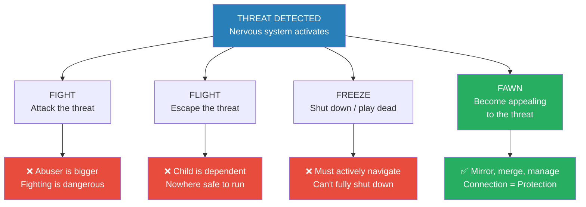
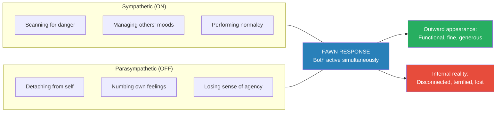
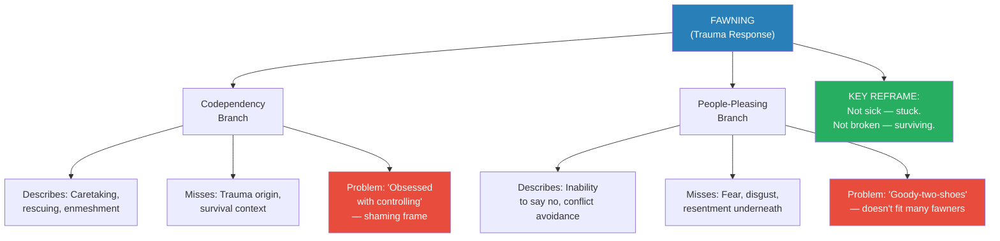
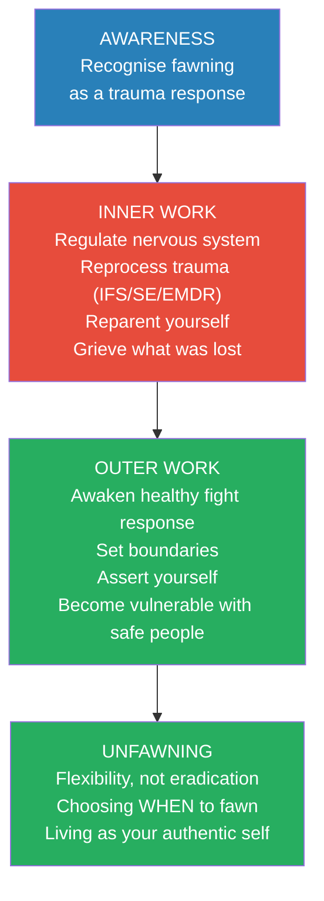
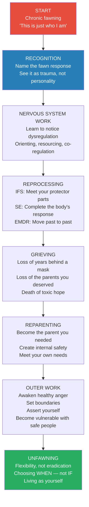

# Fawning — Dr. Ingrid Clayton

> *You were never broken. You had a body with hardwired operating instructions, designed to keep you safe. What you called low self-esteem was actually a trauma response so brilliant it kept you alive — and so invisible that you confused it for your personality. Fawning is the fourth trauma response: not fight, not flight, not freeze, but the act of seeking safety by merging with the wishes, needs, and demands of others. It is connection as protection, self-abandonment as survival. And understanding it — finally having a name for the thing that has been running your life — is where healing begins.*

---

## About the Author

*Dr. Ingrid Clayton is a licensed clinical psychologist in private practice who writes from the rare dual perspective of clinician and lifelong trauma survivor. Her stepfather Randy was a predatory narcissist who groomed and emotionally abused her throughout her adolescence; her mother was collusive and absent. Clayton got sober at twenty-one, earned a bachelor's, master's, and PhD in clinical psychology, and built a thriving practice — all while still unknowingly fawning in every relationship she entered. It was only after Randy's death and the discovery of Pete Walker's work on the fawn response that the dominoes fell. She wrote her memoir Believing Me to reclaim her narrative, and Fawning is the result of years of excavation — of herself and of seven long-term clients whose stories form the emotional spine of this book. Clayton is also the author of Recovering Spirituality.*

---

## The Big Idea

Fawning is the fourth trauma response — after fight, flight, and freeze — and it is the one that hides in plain sight. When a child cannot fight (the abuser is bigger), cannot flee (they depend on their caregiver to survive), and cannot freeze (they need to actively navigate the situation), the body finds a fourth option: <b style="color: #2980b9">become more appealing to the threat</b>. Mirror the abuser's mood. Manage their emotions. Shapeshift into whatever they need you to be. Connection becomes protection. The child survives — but at the cost of losing themselves entirely.

- Clayton's central argument is that fawning is <b style="color: #27ae60">not a character flaw, not low self-esteem, and not a choice</b> — it is a neurobiological survival mechanism as involuntary as the flinch reflex
- What makes it uniquely devastating is that it works. Fawners often appear high-functioning, successful, generous, empathic — and they have no idea their personality has been hijacked by a trauma response
- The book reframes the entire conversation around codependency and people-pleasing by placing them as <b style="color: #2980b9">branches of the fawning family tree</b> — incomplete labels that describe WHAT fawners do but miss the WHY
- Part One maps the anatomy of fawning: its neuroscience (a hybrid nervous system response), its origins in complex trauma, the double bind that sustains it, and the signs that reveal it
- Part Two provides the <b style="color: #27ae60">unfawning</b> recovery path: rebuilding self-trust, trauma reprocessing through IFS, Somatic Experiencing, and EMDR, reparenting, grieving, and the terrifying but necessary work of asserting yourself in relationships
- <b style="color: #e74c3c">"We choose safety over self"</b> — this is the fawner's forced choice, the one that explains everything

---

## Key Concepts at a Glance

| Concept | One-line summary |
|---------|-----------------|
| **Fawning** | The fourth trauma response: seeking safety by merging with the wishes, needs, and demands of others |
| **Hybrid nervous system response** | Fawning activates sympathetic (hyperarousal) AND parasympathetic (hypoarousal) simultaneously |
| **Safety over self** | The forced choice: maintain connection to the threat or maintain connection to yourself — children always choose external safety |
| **The Fawning Family Tree** | Codependency and people-pleasing are branches of fawning — they describe the behaviour but miss the trauma-informed WHY |
| **The double bind** | Real consequences for NOT fawning create a damned-if-you-do, damned-if-you-don't trap |
| **Complex trauma** | Ongoing pervasive threats to safety, often interpersonal, that never go away — the air you breathe |
| **Trauma bonding** | Hormonal attachment created by repeated abuse alternated with relief from the abuser |
| **Self-gaslighting** | Internalising the abuser's narrative until you believe you are the problem |
| **Unfawning** | The journey of self-reclamation — not eradicating the fawn response but choosing WHEN to use it |
| **Reparenting** | Becoming the safe, loving caregiver you never had — for yourself |
| **Boundary-setting** | Taking personal responsibility while holding others accountable — the outer work of unfawning |

---

## At a Glance

- **The Problem:** Millions of people live in chronic self-abandonment — accommodating, shapeshifting, erasing themselves in every relationship — and they don't know why. They've been told they have low self-esteem, codependency, or a people-pleasing problem. None of these labels get to the root.
- **The Insight:** Fawning is a <b style="color: #2980b9">neurobiological trauma response</b> born of powerlessness. It activates when fight, flight, and freeze are all impossible. It was keeping you alive. The problem is that it persists long after the danger has passed.
- **The Recovery:** Unfawning is not about willpower or positive thinking. It requires body-based trauma processing (IFS, Somatic Experiencing, EMDR), reparenting, grieving, and the brave outer work of setting boundaries and awakening your healthy fight response.
- **The Reframe:** You are not sick. You have been stuck. Fawning was the solution, not the problem. Healing begins when you honour the protection it provided before asking it to step aside.

---

*When a child faces an abuser they depend on, fight, flight, and freeze are all impossible. Fawning is the body's genius fourth option — the only one that keeps the child alive while maintaining the relationship they need to survive.*

---

## Chapter 1: The Fourth F — What Is Fawning?

*Clayton opens with the scene that changed everything — a thirteen-year-old girl in a hot tub with a predatory stepfather, and the moment her body found a fourth option nobody had taught her about.*

### The Origin Story

> [!example] The Hot Tub Scene (Clayton, age 13)
> - Thirteen-year-old Ingrid is sitting in the hot tub at night in Aspen, stargazing, when her stepfather Randy steps in
> - Randy's mood seems pleasant — a relief after months of arbitrary rules, silent treatment, and grounding
> - He says something disarming: "I bet you wish you could live up there with the stars, huh?" — acknowledging her discomfort in a way that feels almost caring
> - He invites her to sit on his lap to look at the stars; she drifts over, craving the feeling of being seen and tethered
> - Then: "I like being this close to you. I'm so glad you don't seem to mind." His hands squeeze her hips.
> - Her body tenses. She wants to run. But fighting is impossible (he's twice her size, and he isn't being overtly hostile). Fleeing is impossible (she's a child in a remote mountain town with nowhere to go). Freezing won't work (she needs to navigate this situation actively).
> - So her body finds a fourth option: act normal, play it cool, appear agreeable. She lingers just long enough, then says she's ready to get out. She forces herself to walk casually instead of running — "a half-naked, soaking wet, slow-motion parade"
> - It would be thirty years before she understood what happened. Her body had chosen fawning.
> **The lesson:** Fawning is not a choice. It is the body's involuntary survival mechanism when fight, flight, and freeze are all unavailable. It was keeping her alive.

### What Fawning Actually Is

- <b style="color: #2980b9">Pete Walker's definition</b>: "a response to a threat by becoming more appealing to the threat"
- Clayton expands this: fawning is "seeking safety by merging with the wishes, needs, and demands of others"
- It is not brownnosing for a promotion or sucking up to power — it is a trauma response that puts behaviour in the context of disempowerment or maltreatment
- Clayton compares fawning to the Japanese martial art of <b style="color: #2980b9">aikido</b> ("way of harmonising") — rather than attack or retreat, the practitioner moves WITH the opponent, mirroring their energy, sensing their next move
- With fawning, connection means protection: we sync with our aggressors because we are dependent on them — for care, for income, for status, for the ability to see our children
- The invisible downside: merging with others' desires means surrendering your own
  - We forgo assertiveness and become overly accommodating
  - We shapeshift to stay safe
  - We submit to the very people who harm us
  - <b style="color: #e74c3c">We abandon ourselves — our needs, values, and opinions — and this reinforces our vulnerability</b>

### The Neuroscience: A Hybrid Response

- Fight and flight are <b style="color: #2980b9">sympathetic nervous system</b> responses — hyperarousal, the "on switch" that floods the body with hormones (elevated heart rate, rapid breathing)
- Freeze is a <b style="color: #2980b9">parasympathetic</b> response — hypoarousal, the "off switch" (heart rate decreases, breathing slows, body braces or goes limp)
- Fawning is different from all three: it is a <b style="color: #27ae60">hybrid response</b>, activating BOTH branches simultaneously
  - The **hyper**arousal aspect: instinctively managing the moods of those "in charge," scanning for danger, performing safety
  - The **hypo**arousal aspect: detaching from ourselves, numbing our connection to our own feelings, our own agency
- "We are threading a fine needle when we fawn, neither risking greater harm through fight or flight, nor shutting down completely"
- This is why fawners seem fine on the outside while dying inside — they are simultaneously hypervigilant toward others and disconnected from themselves
- <b style="color: #27ae60">"We are playing pretend, and we don't even know it"</b>

*Fawning is a hybrid nervous system response — the only trauma response that activates both sympathetic hyperarousal and parasympathetic hypoarousal at the same time. This is why fawners appear perfectly fine while losing themselves entirely.*

---

> [!tip] Core Insight
> Fawning is not a conscious choice. In a nanosecond, the reptilian brain selects the response that offers the greatest chance for survival. Afterward, the body remembers what worked and repeats it — automatically, unconsciously, in every relationship, long after the danger has passed.

---

### The Memorised Bar Phone Number

> [!example] The Children's Early Warning System
> - As children in Aspen, Clayton and her siblings memorised the local tavern's phone number
> - They would call the bartenders to confirm their parents' whereabouts
> - This allowed them to "prepare for the unpredictability that often erupted when they returned home"
> - The rules of Randy's household were arbitrary, based on his mood, and ever-changing — no matter how hard the children tried to follow them, it was impossible
> **The lesson:** Children in abusive homes develop hypervigilant early warning systems. This is fawning in action — constantly scanning, tracking, preparing — and it becomes the template for every relationship that follows.

### Fawning as a Response to Complex Trauma

- <b style="color: #2980b9">Complex trauma</b> is different from single-incident PTSD — it refers to ongoing pervasive threats to safety, often interpersonal in nature
- It is not a diagnosis, not an event — it is "the air that we breathe"
- Complex trauma can stem from abusive family systems, systems of oppression, controlling workplaces, or any community where you must disavow aspects of yourself to secure vital membership
- Judith Herman, the Harvard psychiatrist who coined "complex trauma" in 1988, argued that the standard PTSD definition was insufficient for the accumulation of everyday relational trauma — her proposal to add Complex PTSD to the DSM was denied, and it still isn't diagnostically recognised in the United States
- Clayton points out that most of her clients didn't come to her because they had complex trauma — they came with "low self-esteem, depression, anxiety, addiction, relational difficulties"
- These are how complex trauma MANIFESTS: "negative self-talk, substance use, disordered eating, and lack of boundaries are some of the imperfect ways we try to cope"
- Without the lens of complex trauma, therapy becomes "a whack-a-mole game of perpetual symptom management rather than accomplishing any real healing"

### Animals Shake It Off — Humans Swallow It Down

- When an animal faces a threat and survives, they literally shake it off — releasing pent-up survival energy
- Humans have learned to override this vital instinct — we swallow the tension down, embed it inside
- With complex trauma, the threat never goes away — "we are essentially still living in the war zone"
- Survivors of complex trauma live in perpetual emotional dysregulation — "the past feels present, our senses are heightened, our reactions are intensified"
- As [[The Body Keeps the Score - Bessel van der Kolk]] explains: the traumatised body is "stuck in a state of anticipating — sensing potential danger even when no real danger can be found"
- The arc of trauma responses is meant to resolve — danger to safety — but with complex trauma, we hover at the midpoint of the roller coaster, living in suspended alarm
- This is why so many people confuse their trauma responses for personality: <b style="color: #e74c3c">"We literally don't know where we end and where unconscious trauma response begins"</b>

### "We Don't Even Know It"

- The most heartbreaking aspect of fawning: we lose connection to ourselves
- These coping mechanisms become so ingrained that we don't know we're using them
- We ARE the fawner and yet we appear happy, going along to get along
- We see ourselves as generous, empathic, compassionate — and these often ARE intrinsic qualities — but we don't know the extent to which they've been hijacked by a trauma response
- Clayton calls fawning her "stunt double" — "it was acting as me, shielding me from the bad and from the good. From the good that was inside of me."
- Countless messages ask us to disconnect from our authentic selves:
  - "Give your uncle a kiss"
  - "Say you love the gift when you don't"
  - "Don't talk about Dad's drinking"
  - "Don't make others uncomfortable"
  - "Be the 'better' person"
  - "But she's your MOTHER"
  - "Present more white/affluent/sexy to stay relationally safe"
  - "Be a team player"
  - "Just go with it. Repress it. Ignore it. Smile."
- "Until we don't know where we end and fawning begins"

### Clayton's Path to Naming It

- After moving out at seventeen, Clayton didn't look back — got sober at twenty-one, earned three degrees, built a thriving practice
- "It looked on the outside like I'd prevailed over the horrors of my childhood. But on the inside, I was still the same. Still fawning. Still trapped."
- She joked she must be wearing a sandwich board: "Users and abusers, please apply here"
- From bad boyfriends to mooching roommates to exploitative friendships — the same poison, hoping she'd build antibodies
- She never even unsubscribed from mailing lists if she thought the sender would find out
- Mountains of analysis and being a good girl were simply bypassing her unresolved wounds, "colluding with the idea that I was broken"
- Then someone asked if she'd heard of Pete Walker's work — and when she discovered his definition of fawning, "it set off a cascade of dominoes over my history, liberating one after the other until the entire sequence made sense to me. Fawning made sense to me. I made sense to me."
- <b style="color: #27ae60">"I didn't have a low self-esteem problem. I had a body with hardwired operating instructions, designed to keep me safe"</b>

---

## The Fawning Family Tree

*Clayton makes her most original contribution here: the argument that codependency and people-pleasing are incomplete labels for what is actually a trauma response — and that the shame baked into those terms has been keeping fawners stuck.*

### Why Codependency Falls Short

- <b style="color: #2980b9">Melody Beattie's definition</b> (from Codependent No More): "A codependent person is one who has let another person's behavior affect him or her, and who is obsessed with controlling that person's behavior"
- Clayton's objection: the word "controlling" frames adaptive survival as pathology
  - Fawning did not develop with the intent to control — it developed to find personal safety
  - The idea that a codependent person "lets" another person affect them implies conscious choice and immunity from relating — "as though we aren't literally hardwired for relationship"
- Caregivers have been especially shamed: anticipating others' needs IS the job of raising children who can't anticipate their own
- "We are not sick — we have been stuck"
- <b style="color: #e74c3c">"Don't be a doormat" and "Put yourself first!" are shaming advice</b> that miss the point entirely
  - "How do children put themselves first?"
  - "How do marginalised people prioritise themselves over systemic oppression?"
  - Many fawners don't FEEL like doormats — "We know we deserve better, it's just that better wasn't available at critical points in our life"

### Why People-Pleasing Falls Short

- People-pleasing equates to an inability to say no — and Clayton nods along with that
- But where the term falls short: fawning behaviours might APPEAR to be people-pleasing, but they aren't about pleasing at all
  - The chronic fawner just wants to exist, as safely as possible, while experiencing fear, disgust, or resentment
  - The label evokes a "goody-two-shoes" persona — excessively virtuous, overly generous
  - As Clayton's friend Alyson says: "Ingrid, people were NOT pleased!"
- People-pleasing connotes satisfaction on the other end — fawning is about survival, not satisfaction

### The Reframe

- Codependency and people-pleasing are <b style="color: #2980b9">branches of the overall fawning tree</b> — our best attempts to name something important with the information we had at the time
- They were conceived alongside our understanding of relational trauma — but until now they weren't in conversation with it, weren't trauma-informed
- The problem: they've been framed as personal problems originating out of thin air, requiring strictly personal solutions
- <b style="color: #27ae60">Fawning provides the missing context</b>: these are adaptive coping mechanisms in dysfunctional environments — not reflections of character, values, or self-esteem
- "Fawning wasn't a problem that needed fixing. It was in fact the solution. Fawning was WORKING — taming monsters, moving mountains, maintaining vital structures of my life"
- Healing requires honouring the protection fawning provided BEFORE asking it to step aside: "Healing happens when we honour the ways we learned to protect ourselves"

*Codependency and people-pleasing describe WHAT fawners do but miss WHY. Fawning provides the trauma-informed root that reframes adaptive survival as something to honour rather than pathologise.*

---

## Anthony: Fawning in a Powerful Man

*Clayton's portrait of Anthony is essential reading for anyone who thinks fawning is only about meekness — because Anthony is one of the most powerful men in any room he enters, and he's still performing for the pat on the head.*

> [!example] Anthony the Lawyer — "I Think I'm Trying to Win Therapy"
> - Anthony is a Harvard grad, law school graduate, partner at a global powerhouse firm — details that could intimidate anyone
> - But Clayton is never intimidated by Anthony, partly because he is a genuinely nice guy, and partly because he is a fawner who wants to be liked
> - Early in their sessions, Anthony remarks: "I think I'm trying to win therapy." He explains: "It's like I'm implementing insights from our work so you can tell me all the progress I'm making. It's all about the pat on the head."
> - His entire career was built on fawning — being the perfect employee, the perfect partner, the perfect father
> - A law firm is the perfect environment for a compulsive fawner: assistants fawn to lawyers, associates fawn to partners, partners fawn over clients — "a very clear hierarchy, and self-abandonment is expected"
> - Anthony was living life in six-minute billing increments, "plugging himself in like a machine"
> - His parents never told him to go to an Ivy League school or become a lawyer — it was their LACK of interest, their pervasive invalidation, that drove his endless quest for validation
> - "How can my parents deny me approval now?" — and yet they always did
> **The lesson:** Fawning in men often looks like relentless achievement and professional excellence. Success becomes the shield — it brings titles and money, but it doesn't heal trauma, doesn't mean you know who you are.

### Anthony's Awakening

- Anthony's parents had a running joke: "You're pretty dumb for a smart person"
- When he tried to express himself as a child, he was called "obnoxious" or "a know-it-all"
- When he cried, he heard: "Don't be a crybaby"
- His mother ran the show while appearing deferential to his father — she recognised no boundaries, wanted to control all information
- Anthony's musical recitals were always about HER: "My son got his talent from ME!"
- Anytime Clayton brought up his parents, Anthony defended them; anytime he began speaking about how they hurt him, he backpedalled: "I can't speak badly about my parents. I'm making them sound like monsters"
- Then came the voicemail that changed everything:

> [!example] The Accidental Voicemail
> - Anthony had been trying to communicate honestly with his parents about his son's recovery from addiction and his concerns about an upcoming family wedding
> - His parents dismissed his concerns — they didn't want to hear about anything that might disrupt the "perfect family event"
> - Two hours after hanging up, his mother called back; he let it go to voicemail
> - It was a butt dial — a vicious two-minute snippet of his parents' private conversation about him
> - "Does he think he has to protect his son forever? He just needs to suck it up and get in line!"
> - "How do we even believe him, when he's always exaggerated everything?"
> - Decades of truth Anthony had always known but never wanted to see washed over him
> - "Deep down I knew all of this was true. But maybe I needed to hear it. Now I know I wasn't making it all up."
> **The lesson:** Sometimes unfawning begins with an involuntary glimpse behind the curtain — hearing the truth you always knew but never let yourself see.

### Anthony's Unfawning

- After the voicemail, Anthony made a conscious choice to stop living for his parents' approval — he saw that he could never fawn enough to get it
- Grief unlocked necessary anger about how long he'd lived with a diminished sense of self — and that anger led to change
- He started leaning into the "weird stuff" his family had made fun of: a men's wellness retreat, yoga, Pilates, a session with a shaman
- The shaman invited him to journey to a safe place — he saw himself with bear cubs, playful and vulnerable: "Be yourself. Drop the mask. You can be soft. Expose your underbelly. That IS the safe place."
- He got a bear cub tattooed on his arm — and the next day, a live bear sat in his front yard
- He watched a mother bear with her cubs in his backyard — "Her whole job was to get her cubs to be successful bears out in the world, to prepare them to go off on their own. She had no intention of keeping the young bears around for her own pleasure"
- One of the cubs now naps in his yard with her bear belly exposed

> [!tip] Core Insight
> Fawning in men is often invisible because it looks like success. Anthony was one of the most powerful lawyers in his firm, and he was still the little boy performing for a pat on the head. Unfawning for him meant discovering that he'd never done a single thing in fifty years that reflected his true self — and deciding that was going to change.

- Today, Anthony has many tattoos, collects whimsical art — "drawn to fantastical, whimsical otherworldly creatures, all with big eyes" — and is painting an underwater scene for his grandson
- He used to be bored and depressed on weekends, at a loss for what to do. Now his home and life are full of activity and colour.
- "I know my grandson is going to know the real me, not the role I think a grandfather should play"
- His son is doing well. Anthony shares: "I'm here to support him when he needs it, but I'm not a monitor anymore. They both get to be THEMSELVES."
- While Anthony never intended to pass down his need to perform, he is consciously sharing his healing now — and he knows all three generations are going to be just fine
- Clayton: "I love so much about Anthony's story, but especially that he didn't need to have an obvious childhood of horror. The threshold for accessing this healing was that he identified with the symptoms. Being fifty and feeling like you've never done anything that reflects your true self is a pretty big sign."

---

## Chapter 2: Why Fawning Flourishes

*Clayton maps the structural forces that create, reinforce, and reward fawning — making it clear this is not a personal problem but a systemic one.*

### The Systems That Demand Fawning

- <b style="color: #2980b9">Patriarchy</b>: the traits of a fawner have historically been labelled "feminine" — to defer, acquiesce, caretake, speak softly, appease, and please
  - Every woman Clayton knows can identify a need for fawning in their lifetime
  - But men fawn too — bell hooks writes in The Will to Change: "Learning to wear a mask is the first lesson in patriarchal masculinity that a boy learns. He learns that his core feelings cannot be expressed if they do not conform to the acceptable behaviours sexism defines as male"
  - Dax Shepard on his podcast Armchair Expert describes fawning with a stepfather: "If it's a stepdad, there is a game we play where we downplay what happened and we blame it on another thing, and we really hunker down on that other plausible explanation to get him out of the shame, because if shame takes off, then we are really in trouble"
  - Crucially, Dax grew to be six-foot-two and literally outgrew the need to fawn — "If you're five feet tall and 112 pounds, that option is not going to be on the table for you"

- <b style="color: #2980b9">Anna Kendrick's film Woman of the Hour</b>: Clayton cites this as a masterclass in depicting fawning
  - Based on the true story of a serial killer from the seventies — but the film isn't about HIS madness
  - It's about the women: "How we are abandoned at our most vulnerable, ridiculed when we ask for help, shamed when we take care of ourselves"
  - Every single woman in the film, no matter her personality type, age, or intellect, experienced fawning
  - The film's most devastating scene: a fifteen-year-old runaway, tied up and brutally beaten, turns to see her rapist crying. She can't run, can't fight — so she asks if he's okay, smiles, says "Please don't tell anyone about this. I would be so embarrassed." This is how she escapes — by fawning, cozying up to the man who tried to kill her
  - Clayton: "I almost couldn't see [the subtext] at first because it felt so normal. But that was the point."

- <b style="color: #2980b9">Cultural norms</b>: "Respect your elders" can mean endowing people who are older or of higher status with allegiance no matter what
  - Corporate culture, academia, religious organisations, politics — anywhere hierarchies are present, fawning is necessitated
  - USA Gymnastics: athletes pushed past their pain for decades, told to trust coaches more than their own finely tuned bodies, then placed in the hands of a serial paedophile without oversight

- <b style="color: #2980b9">Family systems</b>: children are hardwired for relationship and dependent on caregivers longer than any other species
  - In a context of abuse and neglect, the child cannot survive unless they devote significant emotional resources to appeasing their parents
  - "Like a fish who can't conceive of life outside its bowl, fawning becomes a condition of living in a toxic system"
  - Many parents with dysregulated nervous systems can't tolerate their child's full range of emotion — under the guise of "good parenting," they teach children to suppress feelings to be more palatable
  - "The fact is, children can't learn to regulate emotions they aren't allowed to have. It is our job as parents to learn to regulate ourselves so we can tolerate our own feelings, teaching our children to do the same."
  - Many caregivers were experiencing their own legacy of trauma, handing it down "perhaps with some awareness, but often unknowingly"
  - Common family-system patterns that breed fawning:
    - Parentified children: kids feeling responsible for a parent's pain and problems
    - Children "raising" their parents — hearing them complain about each other, giving them advice
    - Children learning to pretend nothing is wrong because everyone else in the family does the same
    - "Learning to shake their heads yes, when their body is screaming no"
  - "Give your uncle a kiss. Say you love the gift when you don't. Don't talk about Dad's drinking. But she's your MOTHER." — these messages aren't innocuous; they are the socialisation of fawning

- <b style="color: #2980b9">Racism</b>: fawning has been essential for people of colour coping with systems of white supremacy
  - Clayton's client Davis describes fawning as code-switching — adjusting his entire presentation to make others feel comfortable, at the expense of his own comfort
  - In Black neighbourhoods: "Don't smile. Smiley is weird." In white spaces: matching speed and tone, getting on their small-talk frequency. Both are fawning.
  - Dr. Resmaa Menakem: "white body supremacy and our adaptations to it is in our blood"

- <b style="color: #2980b9">Narcissism and emotional immaturity</b>: Pete Walker states that fawners "are usually the children of at least one narcissistic parent who uses contempt to press them into service"
  - Emotionally immature parents overshare, require sympathy and soothing from their children, and offer the bare minimum when their child tries to share their own life
  - See: [[Adult Children of Emotionally Immature Parents - Lindsay C. Gibson]]

- <b style="color: #e74c3c">Toxic positivity and spiritual bypassing</b>: "Just forgive and let it go" is manipulation wrapped in a fuzzy blanket
  - Fawners have BEEN quick to forgive — "We practically invented forgiving at any cost"
  - The Secret, positive affirmations, and vision boards did not heal Clayton's trauma — "Letting go of everything that hurt me only kept me stuck"
  - There is a difference between processing negative experiences and THEN choosing to authentically forgive, versus jumping to artificial forgiveness — "The latter isn't forgiveness at all; it's denial"
  - <b style="color: #2980b9">Spiritual bypassing</b> (defined by Dr. John Welwood): using "spiritual ideas and practices to sidestep personal, emotional unfinished business, to shore up a shaky sense of self, or to belittle basic needs"
  - "Just turn it over to God" and "The universe has your back" aren't inherently wrong — but they can be destructive when they encourage fawners to orient away from their feelings
  - "Spiritual bypassing can be a bolster for fawners, supporting self-abandonment for supposed altruistic and spiritual aims"
  - Resilience itself can be weaponised: "You're so strong — you've been through so much" or "You'll bounce back; you always do" — this reinforces the cycle of "Keep giving. Keep surviving. Keep pushing through."

- <b style="color: #e74c3c">Gaslighting and self-gaslighting</b>: gaslighting actively encourages someone to see harmful situations as harmless
  - It works by robbing someone of their truth and their ability to trust themselves
  - Gaslighting sounds like: "You're overreacting." "Stop being so selfish." "You know I would never do anything like that."
  - For fawners: gaslighting "solidifies a fawner's avoidance. It endorses self-abandonment and appeasement, propping these coping strategies up"
  - <b style="color: #2980b9">Self-gaslighting</b> is when we internalise these manipulations and begin to gaslight ourselves:
    - "Maybe it wasn't that bad"
    - "I didn't experience 'real' trauma"
    - "He didn't mean what I thought he meant"
    - "I should be over this by now"
  - Clayton was a psychologist who specialised in trauma but STILL couldn't believe or reconcile her own traumatic past — "It was like a ghost that haunted me"
  - The first social worker she told as a child said: "Emotional abuse isn't a reportable situation" — and in her developing brain, she learned the problem wasn't going to be resolved "out there," so it must reside in her
  - "One of the insidious things about gaslighting and self-gaslighting is their invisible nature" — Clayton remembers wishing she had bruises as a child: "Maybe the social worker would have listened then"
  - The result: fragmentation — "as though I were two different people sandwiched together: the one who knew what happened — who knew it was wrong and that I wasn't to blame — and the one who had to take responsibility just to survive it"

---

### The Double Bind

*The fawner's dilemma is that we can't satisfy two contradictory requirements at the same time. Will we be our true selves? Or establish safety? We often can't have both.*

- People say, "Don't be such a people pleaser!" — but then they peg you as rude, selfish, dramatic
- People say, "Learn to set boundaries!" — but when you speak up, you're told to let things go
- People say, "Stop being so controlling!" — but they expect you to do the emotional labour
- People say, "Just be yourself!" — but then you lose jobs and opportunities
- <b style="color: #e74c3c">Fawners are damned if they do, damned if they don't</b> — this is the essence of the double bind
- "There is always a sacrifice when we're in a double bind, and fawners have instinctively sacrificed themselves. Not in a 'prioritising a higher good' kind of way, but out of necessity"

> [!example] Clayton's Double Bind — Randy's Death and the Request
> - When Randy is dying of cancer, Clayton's mother calls sobbing: "I'm terrified of being alone with him in that house"
> - Underneath her words is a request: she wants Clayton's help
> - Clayton promises to come visit AFTER Randy dies — she has no intention of seeing him
> - But Randy hears about the visit and thinks she's rushing to his bedside: "Tell her I'm so happy they are coming"
> - Clayton is caught: she promised her mother support, but being perceived as visiting Randy — as though he's her son's grandfather — makes her physically shake
> - She calls a friend: "How can I be such a coldhearted daughter and not help my mom?"
> - Her friend asks the simple question: "What would you do if you were putting yourself first in your own life?"
> - The answer is obvious. She would never see that man again. Two days later, he dies.
> **The lesson:** The double bind IS the fawner's life. Choosing yourself feels like cruelty because you've been trained to believe your needs don't count. But the question "What would you do if you put yourself first?" can crack the bind open.

---

### Clayton's Mother: Two Types of Fawning

- Clayton learned two distinct forms of fawning from her family:
  - **Toward the active threat (Randy)**: flattery, performance, trying to be perfect to maintain distance — "performing for protection while hoping to keep him at arm's length"
  - **Toward the absent caretaker (Mom)**: caretaking, rescuing, absorbing the shock, lending parts of herself — "I had to abandon my own centre and lean ALL THE WAY over to her just to have contact"
- "My mom's small frame had slipped into his shadow. Her limbs moved only when his did, her words formed only when she'd heard him say them before"
- Clayton waited for her mother to get sober or leave Randy — "I was living for the day she'd become free"
- The fawn response dulled her ability to feel the impact of her mother's neglect: "I saw her as powerless, so I needed to pick up the pieces, to absorb the entire shock"

---

### The Las Vegas Trip

> [!example] The Secret Trip to Las Vegas (Clayton, age 16)
> - Three years after the hot tub, with things "progressively worse," Randy takes Clayton on a secret trip to Las Vegas while her mother is away with her dying father
> - He makes her hold his hand through the casinos, parades her around as his "girlfriend," says they'll get in trouble if anyone knows she's underage
> - He checks them into a suite with a king-size bed and a mirrored ceiling; they sleep in the same bed, him half naked
> - Clayton is terrified but tells herself "nothing technically happened" — he didn't sexually abuse her
> - Months later, he leaves a sticky note on her pillow that feels concrete enough to take to her school counsellor
> - The counsellor arranges for social services to sit down with Clayton and her mother — Clayton expects to be rescued
> - Instead, her mother stays silent, then demands Randy be called to the school — "not to get in trouble, but to manage the narrative"
> - Randy bursts in, calls Clayton a liar, blames her for all the family's troubles
> - "What ultimately hurt me the most was that my mom took his side — pursuing her own version of 'nothing to see here'"
> **The lesson:** Many fawners have a moment that teaches them they can never wholly rely on anyone but themselves. After this, Clayton learned that interpersonal safety nets are "for other people" and unconditional love is "either a myth or our job to uphold."

---

## Chapter 3: The Signs of Fawning

*Clayton maps the signposts of fawning — the everyday manifestations that most people mistake for personality traits.*

### Fawning Is...

- Apologising to someone when they've hurt you
- Befriending your bullies in order to keep the job, the relationship, the rent
- <b style="color: #e74c3c">Painting the red flags white</b> — consciously or otherwise
- Trusting others more than yourself
- Holding out hope that people will change if you try hard enough to help them
- Making excuses for people who have hurt you, privileging their pain over your own
- Not having a voice because speaking up makes things worse

### Fawning as MORE or LESS

- For some people, fawning is about being MORE of who they are: smart, generous, successful, funny, beautiful — so they will be further adored and accepted
  - Anthony's version: excelling at everything — Harvard, law partnership, perfect employee, perfect father — "How can my parents deny me approval now?"
  - Sadie: being the one who always figured things out, solved everyone's problems, never needed help
- For others, it's about being LESS: vocal, ethnic, creative, self-assured, or able to set boundaries
  - Lily: making herself smaller, thinner, lighter-skinned — "adelantar la raza"
  - Davis: suppressing his smiles, his curiosity, his warmth — performing toughness
- Fawning can be visible or invisible; it can take the shape of sex, money, or the perpetual emotional regulation of others
- "One thing remains constant: It is about finding safety in an unsafe world, often at our own expense"
- Clayton notes that fawning can feel POWERFUL when it's working: "We can feel capable, smart, flexible, generous, empathic, kind — no wonder fawners don't always resonate with language steeped in shame and weakness. We are freaking acrobats!"

### Sexual Fawning

- Clayton addresses how fawning manifests sexually — this is distinct from desire
- Sexual fawning means using sex as a way to maintain connection, avoid conflict, or feel safe
- It can look like: agreeing to sex you don't want, performing desire you don't feel, using attractiveness as currency
- Francis was raised to believe her currency was how she looked — her father's comments ("Look at that face. If I were a teenage boy...") linked her value to male desire
- Lily's assault on the boat: her fawning response said yes when her body said no — "She was pumping the brakes. He wasn't listening."
- "We don't understand why we do what we do — why we appease our abuser, why we butter up our jerk of a boss, why we placate a difficult parent — but it feels impossible to stop"

### Hyper-Independence

- Many fawners develop extreme self-reliance as a compensation: if you can't trust anyone to help you, you'll handle everything yourself
- This looks like strength from the outside — but it's actually another face of fawning
- "Many fawners have an experience like [Clayton's failed intervention at school] that shows us we can never wholly rely on anyone but ourselves"
- "We've learned that interpersonal safety nets are for OTHER people, that unconditional love is either a myth or our job to uphold"
- "Consequently, we often become hyper-independent. Unable to lean into healthy relational support, we have to figure it out for ourselves. It's common that we don't even tell others when bad stuff happens."

### Self-Minimisation

- Getting smaller through fawning is like solving a maths problem — it's proportional
  - The relationship is a cup, and if someone else is taking up 80 percent, you figure out how to live in the 20 percent that's left
- Strategies to maintain those ratios:
  - Hope the situation is temporary and practice patience
  - Believe their taking up space is best for you both
  - Stuff the anger and move on
  - Magical thinking: "If THIS, then THAT"
  - Lower expectations in the name of being "realistic"
- "When we minimise ourselves and our needs for weeks, for months, for years, we ultimately don't recognise that we're operating at a portion of our capacity. It becomes normal, who we ARE"

### Conflict Avoidance, Shapeshifting, and Anxiety

- Fawners avoid conflict like the plague — Clayton jokes she couldn't even unsubscribe from mailing lists if she thought the sender would find out
- Shapeshifting: we become different people in different rooms — adjusting personality, opinions, even values based on who we're with
- <b style="color: #2980b9">De-escalation</b> is the fawner's superpower and curse: we can read a room faster than anyone, sense danger before it arrives, diffuse tension with a joke, a compliment, or a strategic retreat
- Anxiety becomes the constant companion — the body is in perpetual threat assessment mode, scanning for the next micro-expression of displeasure
- <b style="color: #e74c3c">Resentment builds beneath the surface</b>: we give and give and give, then wonder why we feel hollow
- Clayton's self-minimisation story captures this perfectly:

> [!example] Clayton and the Joint Savings Account
> - Before her first marriage, Clayton's boyfriend Mark moved in and stopped contributing to bills — she made up the difference with student loans
> - They opened a joint savings account for a trip to Italy, but she discovered he'd been withdrawing funds as fast as she deposited them
> - She reviewed every transaction a hundred times, building her case before confronting him
> - When she finally said, "Can you tell me about these withdrawals?" — his tone was more inquisitive than angry
> - He claimed he'd done nothing wrong and was angry at HER for bringing it up
> - Disoriented by his response, she immediately adopted his viewpoint: "Of course, paying his union dues takes priority over Italy. Why am I so upset?"
> - She minimised her feelings until it was no longer a big deal — "Problem solved. We could be a 'happy couple' again"
> - This happened so quickly and seamlessly she almost didn't know she was doing it
> **The lesson:** Getting smaller through fawning is solving a maths problem. The relationship is a cup, and if someone else is taking up 80 percent, you figure out how to live in the 20 percent that's left. "It's amazing what we learn to live with."

---

### What Fawning Is and What It Is Not

| Fawning IS | Fawning is NOT |
|-----------|---------------|
| A neurobiological trauma response | A character flaw |
| Involuntary — the reptilian brain selects it in a nanosecond | A conscious choice to manipulate |
| Born of powerlessness | Born of weakness |
| Connection as protection — syncing with the threat to survive | Brownnosing for advantage |
| A hybrid nervous system response (both hyper AND hypo) | Simple passivity (freeze) |
| Adaptive — it kept you alive | Pathological — "something wrong with you" |
| Common in children who depend on their abusers | Limited to any one gender, race, or class |
| Reinforced by patriarchy, culture, family systems, and racism | A personal problem requiring a personal solution |
| Often invisible — fawners appear functional and successful | Always obvious — many fawners don't know they're doing it |
| Lifesaving when genuinely needed | Something to eradicate entirely |

---

### The Merry-Go-Round: Repetition Compulsion

- Fawners don't just survive one abusive dynamic — they recreate it
- <b style="color: #2980b9">Repetition compulsion</b>: the unconscious drive to recreate familiar dynamics, seeking mastery over the original wound
- The brain latches on to the positive experience of relief rather than the negative impact of the abuser — and this is often mistaken for love
- "The highs feel magical only because of the inconsistency, because they are such a contrast to the lows"
- <b style="color: #2980b9">Intermittent reinforcement</b>: like a slot machine, the unpredictable payouts create obsession — never knowing when the reward comes is what hooks you
- Clayton on her own pattern: "From bad boyfriends to mooching roommates to exploitative friendships, it's like I was trying to break a spell by drinking the same poison, hoping I'd eventually build up the necessary antibodies"
- She describes dating a sociopathic lawyer after leaving home — a man who was charming, intelligent, and ultimately dangerous: another relationship where her fawning could "save" her
- "After I left home, my fawn response created a feeling where I knew safety only in the context of exploitative, abusive relationships. It's where my skills were honed, where my patterns of relating were initially developed. So I found myself in repeated dynamics where my fawning could 'save' me once again."
- This highlights the "storied partnership between beauty and beast, empath and narcissist" — see: [[In Sheep's Clothing - George K. Simon]] for how the covert-aggressive specifically targets the fawner's vulnerabilities

---

## Francis: The Trauma Bond

> [!example] Francis and Colin — The Dinner Party
> - Francis checks with her boyfriend Colin about having a new friend over for dinner — she's always respectful of his deadlines
> - On her way home, Colin texts asking for tea from Starbucks; she stops despite running late
> - She arrives home, starts cooking; doesn't realise Colin is in his basement studio
> - Twenty minutes later, he erupts: "You've been home for TWENTY MINUTES and you're just bringing this down now?!"
> - He's throwing things, sending "I NEED HELP" texts while her friend is arriving
> - Francis fawns: outwardly calm, she asks "How can I help?" and gets on her knees picking up brushes
> - She has to ask her friend to leave after barely thirty minutes — apologising over and over
> - When she returns to the studio, Colin seems confused she sent her friend away: "Why would you do that?!"
> - Francis tips around him, "reminding herself that when things were good, they were amazing"
> **The lesson:** The trauma bond — intermittent reinforcement of abuse and relief — keeps fawners locked in. The highs feel magical only because they contrast so sharply with the lows.

### Francis's Childhood: The Origin of the Bond

- Francis's mother had untreated borderline personality disorder and active alcoholism — she was chaotic, unpredictable, and physically abusive
- Her father was a successful lawyer who expected perfection — Francis was the golden child
- Her father called her the "total package," reflecting her beauty and intellect: "Look at that face. If I were a teenage boy..."
- This led Francis to believe her currency in the world was how she looked — how she could appeal to boys, become smaller or prettier
- "Every time my mother beat me, she would return with a dramatic apology accompanied with a childish 'sad face,' and I would then be the one who had to comfort HER"
- "The pity I felt for my mother always trumped the distress I felt at her hands"
- The twelve-step programme she joined reinforced fawning through its language: encouraged her to take responsibility for her "wrongs," "shortcomings," and "defects of character," to "get out of yourself and be of service"
- All the overintellectualising and shame never pulled Francis out of complex trauma — "those so-called solutions were overriding her deeper wounds"

### Francis's Unfawning Moment

- After years of therapy, Francis takes a small risk: "You know, I'm so sorry, but that doesn't feel good for me today"
- Colin loses it — "Of course you'd say that. I do so much for you..."
- But something has shifted: Francis can SEE the pattern for the first time
  - "This is disproportionate, this is mean, this is anger-fuelled, this is not about me doing something wrong"
- The veil lifts. She connects with the part of herself she'd been building in therapy. The two become one — she is becoming integrated
- She walks out knowing it's over, devastated but clear: "NOBODY IS COMING. There was no rescue mission."
- The aftermath is brutal: panic attacks lasting hours to days, disability, twenty-five pounds lost
- "Coming out of a chronic trauma response can feel like you don't have any skin, where every nerve ending is exposed"
- But she holds on to herself: "She WASN'T broken. And she wouldn't go back to her previous life"
- Today, Francis is training to become a couples therapist
- Her testimony on what changed: "Being in therapy with someone who was talking about their own experience with similar issues, putting it in the context of the nervous system, set in motion a complete rewiring of my insides. She never understood these things before. Could never make sense of the literal pain in her body. But she was finally accessing emotional processes that were trapped."
- "It took a couple of years of hearing 'His behaviour is not okay' until she could truly register it, then see it, and finally feel it herself"
- Clayton's role was not to interpret Francis's experience but to name what she saw: "I told their couples therapist point-blank: 'I have no qualms saying this relationship is abusive; they are in a trauma bond. Please don't mistake Francis's fawning for a healthy and loving connection.'"

---

> [!tip] Core Insight
> The fawn response makes abusive relationships look functional — even loving — from the outside. Couples therapists, friends, and family members regularly mistake a fawner's accommodation for genuine harmony. This is why Clayton insists that understanding fawning isn't just for fawners — it's for everyone who interacts with them.

---

## Chapter 4: The Merry-Go-Round — Cycles and Reenactment

*Clayton explains how fawning creates repetition compulsion — the unconscious drive to recreate the dynamics we know.*

### Why We Repeat

- We recreate the dynamics we know, seeking mastery over the original wound
- The brain associates the abuser with safety because they're also the source of relief
- <b style="color: #2980b9">Intermittent reinforcement</b>: like a slot machine, the never-knowing-when-the-reward-comes creates obsession
- "The relief when it happens feels like a jackpot. Like heaven."
- This is why fawners enter the same relationship with "a different face" over and over
- Clayton on her own pattern: "I joked I must be wearing a sandwich board that read: 'Users and abusers, please apply here'"

### Dax Shepard: The Man Who Outgrew Fawning

> [!example] Dax Shepard on Armchair Expert — "I Got to Escape It"
> - Dax tells a story from age twelve: a grown man got out of a muscle car, grabbed Dax, and slammed his head against a telephone pole
> - Anna Kendrick asks: "Was the strategy then, just flee?"
> - Dax replies: "In an ideal world, it's flattery. 'No, dude, I'd never fuck with you, you're a fucking badass.'"
> - On fawning with a stepfather: "There is a game we play where we downplay what happened and we blame it on another thing, and we really hunker down on that other plausible explanation to get him out of the shame, because if shame takes off, then we are really in trouble"
> - But Dax grew to be six-foot-two: "I got to an age and a size where any dude that rolls up to put my head into a telephone pole, they are gonna have their hands full. I got to escape it to some degree."
> - He acknowledges the privilege: "If you're five feet tall and 112 pounds, that option is not going to be on the table for you"
> - "If I couldn't have outgrown that [fawning], that would have been so paralyzing to me. Because I hated that... it killed me. The feeling of shame after fawning to stay safe hurt more than any of the interactions did."
> **The lesson:** Many people — women, children, smaller men, people of colour — can never outgrow fawning because they can never become physically dominant. The fight response is simply never available to them. Fawning isn't a character flaw — it's what your body does when fight is not an option.

---

### Toxic Hope

- Fawners hold on to "If THIS, then THAT" thinking:
  - "If he would get a job, then our relationship would be fine"
  - "When she leaves Randy, THEN she'll be able to show up for me"
  - "If I try harder, they'll finally see my worth"
- This toxic hope is the fuel that keeps the merry-go-round spinning
- <b style="color: #e74c3c">The hope itself becomes the obstacle to healing</b> — because as long as we're waiting for the external change, we're not changing ourselves
- Clayton held toxic hope for her mother for DECADES: "Maybe one day she'll face the truth" — carried like a time capsule for years after each conversation
- Anthony held toxic hope that enough achievement would finally earn his parents' approval — Harvard, law school, global partnership — "How can my parents deny me approval now?" And yet they always did.
- Francis held toxic hope that Colin's good days proved the relationship was worth saving — "When things were good, they were so good"
- The merry-go-round stops only when hope dies — and that death, paradoxically, is the beginning of healing

### What Keeps Us on the Merry-Go-Round

- <b style="color: #2980b9">Trauma bonding</b>: hormonal attachment created by repeated abuse alternated with being "saved" by the person harming us
  - Picture a slot machine: varying payouts keep you hooked, promising even bigger wins if you hand over your savings
  - "The excitement and elation come from the unpredictability, the never knowing if you'll be cherished again or when it might happen. The relief when it happens feels like a jackpot. Like heaven."
- <b style="color: #2980b9">"If I broke it, I can fix it"</b>: children instinctively place blame on themselves to avoid the terror of being truly powerless
  - "This is how the body seeks power in powerless situations"
  - It sets up the rescuer dynamic as a proxy for secure attachment: safety and connection happen only when we prioritise someone else's needs
- <b style="color: #2980b9">The narrative we cling to</b>: fawners are "very good storytellers — we cling to narratives we want to be true, blocking out any information that might contradict them"
  - Anthony: "We are a close and happy family"
  - Francis: "He's the love of my life"
  - Clayton: "When my mom gets sober, THEN she'll be able to show up"
- Breaking these narratives is the first step off the ride — but it requires seeing something you've spent your whole life avoiding

---

### The Glossary Clayton Provides

Clayton includes a careful glossary to distinguish terms that are often confused:

| Term | Clayton's Definition |
|------|---------------------|
| **Traumatic events** | Shocking, scary, or life-threatening experiences — these may or may not lead to trauma |
| **Trauma** | The imprint left by traumatic events — what happens when experiences overwhelm the nervous system. Events can remain in the past; trauma lives in the present. |
| **Trauma trigger** | A felt reminder of a traumatic event — external (loud noise, tone of voice) or internal (feeling of powerlessness) |
| **Trauma responses** | The body's spontaneous, instinctual reaction to threat — fight, flight, freeze, fawn |
| **Complex trauma** | Exposure to repeated interpersonal threats over time — often from childhood, but not necessarily |
| **PTSD vs. C-PTSD** | Both involve reexperiencing, avoidance, and reactivity; C-PTSD adds affect dysregulation, negative self-concept, and disturbed relationships |
| **Emotional dysregulation** | The inability to regulate emotions — the downstream consequence of unresolved trauma responses |

---

### Fawning in Context: Why "Just Stop" Doesn't Work

- Clayton's most important structural argument: fawning is not just an individual response — it is "ignited in us, then, through a feedback loop, becomes amplified and rewarded in the world"
- "Our sense of self becomes distorted not just through personal adaptation, but because systems of oppression accelerate this process of change, moving us further away from our inherent state"
- This is why individual solutions (affirmations, boundary-setting workshops, self-esteem exercises) fail when applied in isolation — they address the symptom while leaving the system intact
- <b style="color: #e74c3c">"We can't just say, 'Stop doing that!' when we continue to live in contexts that encourage, and actually necessitate fawning"</b>
- The systems that demand fawning are everywhere: patriarchy, corporate hierarchy, cultural deference norms, family obligation, racial dynamics, religious authority
- This means unfawning requires BOTH internal work (healing the nervous system) AND external work (changing relationships, setting boundaries, sometimes leaving)
- For many fawners, the first step is simply to "turn off the comments" — to step out of the feedback loops that prefer our deference and encourage self-doubt — "so we can discern, and truly hear, our own voice"

---

### "Lowering the Bar"

- Clayton draws an analogy from twelve-step recovery: she found acceptance in church basements, not sitting with the congregation above — "This is a place that might accept me"
- She wants to do the same with this book: lower the bar, remove the judgment and shame around fawning
- "For too long, people have talked about the behaviours associated with fawning like something is wrong with us, like we should just get over it, grow up already, stand up for ourselves"
- Those phrases have kept our defences UP — "We must lower the bar to lower our defences. That's the only hope for real change."
- Clayton is honest about what unfawning actually looks like: "Get in touch with all your pain, your wounds, the shameful ways you feel like you've coped with them, and then you will get BETTER, but you'll never attain the best-case scenario, at least not 100 percent of the time"
- There is no perfect place of rest and wholeness. As long as we are alive, there is no finish line.
- <b style="color: #27ae60">"We are not meant to eradicate our trauma responses. We couldn't if we tried!"</b> — we need these lifesaving instincts
- The goal is flexibility: "not healed or broken, safe or unsafe — but moving out of binary responses to threat"

### Generational Trauma and Cycle-Breaking

- Many parents with dysregulated nervous systems can't tolerate their child's full range of emotion — under the guise of "good parenting" and "fostering respect," they introduce children to survival mode
- "Children can't learn to regulate emotions they aren't allowed to have"
- Generational trauma passes down: "Our parents carry the coping of their parents, and generation after generation, we are handing down our wounds"
- This has led to a movement of <b style="color: #2980b9">cycle breakers</b> — parents who want to do their own work so they might spare their children
- Clayton on her son Henry: "He does not have a fawning bone in his body. He speaks his mind. He's clear and deliberate. He doesn't do what he doesn't want to do."
- "While my history can make it hard as a parent to honour such a strong commitment to himself, what's also true is that I couldn't be prouder of him. He teaches me — shows me what it's like not to have to appease in order to be loved."

---

## Part Two: The Journey of Unfawning

---

## Chapter 5: The Magic of Trusting Yourself

*Clayton turns from mapping the problem to building the solution — and it begins with the most radical act a fawner can undertake: trusting their own body.*

### "Safety Over Self" — Reversing the Equation

- The forced choice at the heart of fawning: maintain connection to the threat OR maintain connection to yourself
- Children always choose external safety because they need the caregiver to survive
- The cost: loss of authentic self, loss of internal guidance system, deep shame
- <b style="color: #27ae60">Unfawning reverses this equation</b>: learning to orient toward yourself instead of toward others' opinions of you
- Clayton asked Anthony: "I wonder how it feels to orient to you, rather than my opinion of you?"
- Anthony replied with an exhale: "It's a relief" — dropping into his body for the first time

### Triggers and Emotional Flashbacks

- Pete Walker defines <b style="color: #2980b9">emotional flashbacks</b> as "sudden and often prolonged regressions" to the overwhelming feeling-states of childhood (see: [[Complex PTSD - Pete Walker]])
- For fawners, triggers activate the old programming: the body snaps back to "manage, appease, survive" mode before the conscious mind can intervene
- Triggers can be external (a tone of voice, an anniversary, a scene from a movie) or internal (feelings of powerlessness, loneliness, physical tension)
- Clayton describes her own flashback experience: a phone call from her mother praising her brother's sobriety triggered rage from a 1991 family therapy session where her mother publicly chose Randy's side
- The key: learning to notice when you've been triggered — "I didn't know I'd been triggered, only that I was annoyed"
- Most fawners don't recognise triggers because the fawn response kicks in so fast — by the time they notice, they've already apologised, minimised, or shapeshifted
- "When we are triggered, the body feels only I NEED SAFETY AND I NEED IT NOW"

### Orienting and Resourcing

- <b style="color: #2980b9">Orienting</b>: Dr. Peter Levine's tool of bringing attention back to the present moment through the senses — looking around the room, noticing what you see, hear, feel
  - In a session with Sadie, Clayton suggested she try opening her eyes and orienting to the room during EMDR — Sadie gazed at the bookshelf, and within minutes burst into tears as deeper processing unlocked
  - Orienting breaks the flashback loop by anchoring you in the present — you are not back in that hot tub, that basement studio, that childhood kitchen
- <b style="color: #2980b9">Resourcing</b>: identifying what makes you feel safe and grounded — a place, a person, a memory, a physical sensation
  - These are the building blocks of internal safety — the thing fawners never had
  - Anthony's resource: the bear cubs from his shaman session, the feeling of exposed vulnerability being SAFE
  - Clayton's resource: Rocky Mountain National Park — the place her thirteen-year-old part wanted to run to
- <b style="color: #2980b9">Co-regulation</b>: borrowing someone else's regulated nervous system to calm your own
  - This is what parents do when they bounce a baby — the child literally cannot self-soothe
  - Many adults who grew up with dysregulated parents never learned to regulate themselves — this is part of why therapy works: the therapist's regulated presence provides the co-regulation the parent never did
- "For fawners, internal safety is always reliant on the condition of external safety, so it remains at arm's length: in someone else's body or ideology, in their perception or story"
- The work: making internal safety your OWN — not borrowed, not performed, not contingent on someone else's mood
- Clayton distinguishes this from the popular advice to "just set boundaries" or "learn to say no":
  - These instructions skip the foundational work — you cannot set boundaries if your nervous system is screaming that boundaries equal death
  - First you must build internal safety. Then you can take it into the world.
  - "We tried as hard as anyone to solve our trauma 100 percent on our own, taking responsibility for our part in it. But sadly, eventually, some things had to change in our outer world if we were going to stay true to ourselves."

### Fawning and the Body: Where Healing Lives

- Clayton is emphatic: insight alone does not heal trauma. Analysis, affirmations, and understanding WHY you fawn are necessary but insufficient.
- "All the self-care I loaded onto one side of the scale was counterbalanced by engaging with the same people in the same ways"
- "Seeing our part in something is compelling, but it is not a panacea, and it does not heal trauma"
- The body holds the truth that the mind has been trained to override:
  - Clayton's body tensed in the hot tub even as her mind rationalised Randy's behaviour
  - Francis's body knew she was in danger even as her mind said "He's the love of my life"
  - Lily's body dissociated during the assault even as her mind said "I said yes to going downstairs"
- <b style="color: #27ae60">Healing trauma requires body-based solutions</b>: not just talking about what happened, but allowing the body to complete its interrupted response
- "We don't need to analyse what's happening or receive a therapist's interpretation. Instead we need to trust the truth in our bodies so we can begin to reclaim it. We need to let the feelings come. Discover that we can feel them. Allow natural processes to finally resolve."
- "Choosing to be happy, for people with unresolved trauma, never works. CHOOSING means overriding something else. It turns out what we've been trying to override is pretty important."
- <b style="color: #27ae60">"Unfawning is a process of being with whatever is there."</b> We can't advocate for ourselves or find our centre without it.

---

### Noticing the Nudges

- Unfawning begins with the smallest acts of self-awareness: noticing when the fawn response activates
- It is not "Oops, I did it again!" followed by shame — it's "Oops, I did it again!" followed by curiosity
- "Eventually we'll get to the point where we say, 'Oops, I ALMOST did it.' That doesn't mean we won't ever fawn, but we begin to notice the instinct as it arises, allowing for greater consciousness and flexibility"
- Clayton's practical tool: ask yourself "Am I doing this only so they will like me more? If the answer is yes, then it's a no for me"
- This is not about perfection — it's about building the muscle of self-awareness, one micro-moment at a time

---

## Chapter 6: Blinders Off — The Inner Work of Unfawning

*This is the clinical heart of the book — the specific trauma modalities that move healing from insight to embodiment.*

### Internal Family Systems (IFS)

- <b style="color: #2980b9">IFS (parts work)</b>, developed by Dr. Richard C. Schwartz, is based on the idea that our psyche is made up of different parts developed in childhood to help us survive
- There are no bad parts — each serves a purpose
- At the centre is a Self — the real you — that should be calling the shots
- But we become "blended" with parts: we think we ARE the good girl, the scholar, the peacekeeper
- Fawning is a protector part — it rushed to our aid, and when we see it as such, shame diminishes
- Key question: "What is this part afraid will happen if we don't fawn?"

> [!example] Clayton's Thirteen-Year-Old on the Deck
> - In a session with her therapist Holly, Clayton closes her eyes and is brought back to the hot tub night
> - She sees her thirteen-year-old self still standing on the deck — wet, shivering, alone outside the sliding glass door
> - That part was still trapped in that moment — Clayton had written her story but never let the girl connect with HER
> - She invites the thirteen-year-old to see her grown-up self: her agency, her safety, that they are now a "certifiable adult"
> - She asks: "What do you need from me now?"
> - The girl wants to leave that house. She wants to go to Rocky Mountain National Park — to run with the elk
> - "And I let her go, running through the fall colours of my favourite place up to the highest peaks and beyond"
> - At last, that thirteen-year-old part was free
> **The lesson:** Reprocessing through IFS means going back to the past and changing the ending. Neuroscience shows the brain lights up the same way for imagined and actual experiences — so as it happens in imagination, the body processes it as real.

### Somatic Experiencing (SE)

- <b style="color: #2980b9">Somatic Experiencing</b>, developed by Dr. Peter Levine, focuses on body memory and physical sensation to resolve chronic stress
- The goal: complete the body's natural response to trauma — "get off the roller coaster"
- Animals in the wild literally shake off trauma after a threat passes; humans have learned to override this instinct
- SE works with whatever actions the body wants/needs to take that it wasn't able to in the moment

> [!example] Clayton's Somatic Experiencing Session — The Punch
> - Clayton tells her SE therapist Kristi about a phone call where her mother praised her brother's sobriety while barely acknowledging Clayton's twenty years of recovery
> - As she describes the rage, Kristi asks her to stay with the feeling in her body — the heat on her shoulders, the fire in her belly
> - With eyes closed, Clayton sees her fist punching a metal wall — the wall shatters into millions of pieces
> - She worries the shards represent repercussions of letting her anger out, but her body doesn't want to stop
> - Kristi asks: "Is there anything that can protect you from the shards?" — Clayton sees ancient armour covering her body
> - The metal shards rain down on the armour, pounding like a tribal dance on her chest, "reanimating" her
> - She chants: "I am here, I am here, I am here"
> - She throws a beanbag across the room — the action her body wanted to take on the phone call
> - Sobbing follows: "A lifetime's worth of anger, sadness, feelings of abandonment — they were starting to release"
> - Only later does she realise the phone call triggered a 1991 family therapy session where her mother said, "You've always been MY favourite child" — to her brother — and told Clayton: "I believe that you BELIEVE those things happened, but I don't believe they did"
> **The lesson:** Twenty-seven years of held rage, released through a fist, a suit of armour, and a beanbag. The healing was right there under the surface, waiting. We don't need to analyse what's happening — we need to trust the truth in our bodies.

### EMDR

- <b style="color: #2980b9">Eye Movement Desensitisation and Reprocessing (EMDR)</b>: bilateral stimulation (left-right eye movements or tapping) helps the body process traumatic memories
- Originated by Dr. Francine Shapiro — the most well-known concept is bilateral stimulation, the left-right rhythmic pattern of moving your eyes back and forth
- Now includes any rhythmic left-right pattern such as the "butterfly hug" — crossing arms over chest and tapping shoulders alternately
- One theory: it mimics REM sleep, helping consolidate memories and emotions. Another: it encourages better communication between brain hemispheres
- Prince Harry famously used EMDR to process trauma surrounding his mother's death, allowing a camera to film one of his sessions
  - In the session, he works with the feeling of tension every time he flies into London
  - His belief: "I'm the hunted. I'm helpless and there is no escape"
  - After bilateral stimulation: "I feel calm. Calm and therefore strong"
  - The traumatic charge of the memory — descending into Heathrow as a grieving boy — was processed and released
- Clayton uses EMDR extensively, particularly with Sadie:

> [!example] Sadie's EMDR Session — The Eating Disorder That Held Everything
> - Sadie tells Clayton her body is "holding a secret" about why she's still bingeing and purging despite knowing everything about eating disorders
> - Instead of searching for a specific memory, they begin from a place Sadie previously couldn't tolerate: NOT KNOWING
> - Sadie starts the butterfly hug (bilateral tapping), and within minutes bursts into tears
> - A Rolodex of EVERYTHING that had happened in her life plays before her eyes — every unwanted touch, every time she fawned when she wanted to exert power
> - She sees that her eating disorder had been holding everything she couldn't: "Anytime something happened in her life she couldn't handle, she would turn to bingeing and purging"
> - The bingeing numbed her feelings; the purging knocked her out — "the closest thing she felt in childhood to being held and protected"
> - "Like a final, enormous purge, everything her eating disorder had been holding was released"
> - After the session, Sadie says: "Liberated. Free."
> - She has not binged or purged since. She hasn't even felt the urge.
> **The lesson:** Some protective mechanisms can only release their hold when the body feels safe enough to take back what they've been carrying. Insight alone could never have done this — it required the body-based processing that EMDR provides.

### Grieving: Dropping into Reality

*This is one of the most painful sections of the book — because grieving is where fawners finally stop waiting for the cavalry and face what was lost.*

- <b style="color: #27ae60">Grieving is where fawners finally enter reality</b> — and reality, after a lifetime of magical thinking, is brutal
- What we grieve:
  - The loss of years lived behind a mask
  - The loss of self, in service to others
  - Time spent on toxic hope — waiting for someone to change, to see us, to choose us
  - Inadequate and painful relationships we mistook for love
  - Feeling truly abandoned by the people who were supposed to protect us
  - The lack of success, freedom, and joy from staying small to make others comfortable
  - So many unmet needs — perpetually trying to be better when we were never guided to the source of our pain
- "Grieving drops us into reality. This can be painful, but it's also where we have real choices"
- When Anthony saw the origins of his trauma clearly, he had to grieve who his parents actually were — not the loving family he'd been performing for, but parents who never showed genuine interest in his life
- When Francis left Colin, she felt "for the first time the debilitating pain that NO ONE WAS COMING TO SAVE HER" — the hope she'd been carrying for years shattered
- Sadie, leaving her partner Margaret, "felt like my dad was leaving us all over again. I felt like I was dying."
- Resmaa Menakem's distinction between <b style="color: #2980b9">clean pain</b> (pain that mends and builds capacity for growth — doing the hard thing from the best parts of yourself) and <b style="color: #e74c3c">dirty pain</b> (the pain of avoidance, blame, or denial — responding from your most wounded parts)
- "Healing can hurt worse than the original wounding" — Clayton confirms this from personal experience: "In my experience, as we'll see in the pages to come, this was abundantly true"
- But clean pain transforms. As we grieve, we stop making things pretty, stop insisting on silver linings — "Because we realise that THIS is what we've been fighting for. To live in reality. Not the magical thinking of a child's mind, but the full expanse of what it means to be human."
- <b style="color: #27ae60">Grieving restores the healthy fight response</b>: "It opens the door to where we build our capacity for anger and asserting ourselves. It holds the seeds of reciprocal relationships."

> [!tip] Core Insight
> Fawners spend their lives looking outside themselves for answers and for the love they're lacking. When we wake up to how fawning is no longer working — when the person or situation we thought would save us is gone or will never do what we hoped — we feel a complete loss of hope. Unbelievable despair. But somewhere in that despair is the new beginning. A part of us IS dying: the part that was fiercely protecting others, fighting for them, and abandoning us. In facing what feels like disloyalty, we become more honest than we've ever been — and this begins our rebirth.

### Reparenting

*Clayton grounds the concept with a children's book: Are You My Mother? by P. D. Eastman, about a baby bird who asks every creature she meets whether they're her mother — "So many of us are like this bird, constantly searching in places and faces that can never give us what we need."*

- <b style="color: #2980b9">Reparenting</b>: becoming the parent you always needed, for yourself — parenting yourself NOW the way you should have been parented THEN
- This starts with taking the blinders off: recognising where your parents failed you, putting down the family narrative, and admitting what your childhood was really like
  - "This doesn't have to be about blame — it's about clarity"
- Clayton carries a preschool photo of herself in her wallet since she was twenty-one and newly sober — "She is why I'm taking good care of myself now"
- People often become aware of their difficult childhood only when they become parents themselves — Anthony held the party line ("we are a happy, loving family") but found he was parenting his son in radically different ways
- "I had to choose me even though no one else ever did. I had to love myself unconditionally, stop waiting for other people to see my worth first"

> [!abstract] Reparenting Journal Prompts (from Clayton)
> 1. What do I continually seek in others but find lacking/impossible? Worth, an invitation, validation?
> 2. What fantasies have I been striving for to set me free? An achievement, someone's apology, being chosen?
> 3. Fill in the blank: If ___ could happen, I would finally be okay. What does that represent? Is there a way to grant myself that now?
> 4. What negative beliefs do I hold about myself? Where did those come from? If I saw a photo of myself as a child, would I say that directly to them?
> 5. If people finally saw my worth, what would they see? How does it feel to see my own worth now?
> 6. Are my basic needs — rest, nourishing food, connection, movement — being met? How can I take small steps toward meeting them?
> 7. Where can I add more playfulness, creativity, music, and nature? These embody the opposite of survival mode.

- Inner child work can mean whatever you need it to mean: bathing your inner child in white light, writing letters to your young self, checking out trauma-informed parenting content to see what you were missing
- Grace learned reparenting by loving herself the way she naturally loved her daughter — "She never saw her daughter as a problem to solve. She never wanted her to hide her humanity."
- Francis connected with a part of herself stuck in her old bedroom with Colin, took her own face in her hands: "I've got you. I've got you. I've got you."
- "The part of Francis who was still stuck in the house with Colin was the same little girl who was stuck in her mother's house, years ago. As long as I've known Francis, she has used that exact language: 'I feel STUCK.'"

---

## Chapter 7: Opening Up — The Relational (Outer) Work

*The inner work is necessary but not sufficient. Unfawning inevitably changes your relationships — and that is where the real courage lives.*

*The unfawning journey moves from awareness through inner work to outer work — and the destination is not the elimination of fawning but the freedom to choose.*

---

### Awakening the Healthy Fight Response

- Many fawners have lost all access to anger — fighting back was never safe, so they disconnected from everything related to it
- <b style="color: #27ae60">Healthy anger is not violent or controlling — it is about respect</b>
  - It lets us know "I'm not okay"
  - It gives us a voice
  - It is a bridge connecting deeper feelings of hurt with the ability to assert ourselves
- Clayton describes her fire being extinguished at twelve when a social worker said "Emotional abuse isn't reportable" and her parents called her "a selfish liar"
- Unfawning means "cultivating a new relationship with fire — learning to tend to it safely"
- "Most of us are lucky to light a birthday candle" — fawners fear their anger will burn the forest down, but in reality they can barely produce a flame
- Clayton and her husband Yancey practice "big stomping" — cartoon-character huffing, big knees in the air — as a way to move dysregulation through the body before returning to a conversation
- "Like a cartoon character, huffing and puffing, big knees in the air, hearing the sound of your feet as they land. I often have a bit of a scowl on my face. I'm sure I look rather hilarious in my flip-flops, big stomping down our block."
- But fifteen minutes later, she's regulated enough to communicate compassionately
- The image Clayton offers: "Imagine being a boulder in a river. Watching the currents make their way around you while you remain, unwavering. Not being a pushover. Holding your own. The boulder isn't stopping the river. Every element, including the boulder, gets to be exactly what it is."

### Assertiveness: "When We Stop People-Pleasing, People Will Not Be Pleased"

- For many fawners, being assertive feels aggressive. Standing up for yourself feels mean.
- "I use the word TOLERATE on purpose. For fawners, asserting ourselves doesn't initially feel like a victory. It feels exhausting and it feels like CRAP."
- But this is where real change lives: "This is where we find our voice, our joy, our creativity. There is so much we gain access to when we aren't cut off from who we truly are."
- Practical approaches to building assertiveness:
  - Notice what you feel AFTER the fawning moment — catch it in retrospect before catching it in real time
  - Go back and say: "I wish I would have handled that differently" or "I realize now I wasn't completely honest. Can we talk about it again?"
  - Lower the stakes: imagine being assertive in low-risk situations — returning an item to a store, telling a waiter they brought the wrong order
  - Write a script of what you'd say if it felt possible — find your voice privately first
  - <b style="color: #2980b9">Bookend your actions</b>: take care of yourself both BEFORE and AFTER you lean into "new spicy territory" — a walk before the hard conversation, a warm bath after
- Lily on assertiveness: it always meant being rude or entitled. "Being assertive wasn't POLITE; it made you stand out, which meant potential danger."
  - When Lily feels the need to assert herself, her body responds: "My heart starts beating faster. I feel an intense heat and an uncomfortable tingle on the back of my neck and in my ears. I feel a heaviness in my chest. Like I'm being weighed down, but also like I'm gonna float away."
  - This is the moment where she used to lie or backpedal — but now the heat on her neck doesn't go away when she takes the blame. "Taking the blame STOPPED WORKING."
  - <b style="color: #27ae60">"Our bodies will tell us what they need"</b> — Lily didn't shame herself into having a voice. As she came into her body, she could hear and feel its feedback: "This does not feel right for me."

### Setting Boundaries

- Before a fawner can set boundaries, they need compassion for the parts of themselves that never saw boundaries as an option
- Two directions of fawning, two types of boundary:
  - **Caretaking (leaning in)**: boundaries mean discovering where you end and someone else begins — "Just because you think you can help doesn't mean you should"
  - **Appeasement (leaning away)**: boundaries mean deciding what you will and won't accommodate — building a wall around yourself with a door only YOU can open
- <b style="color: #e74c3c">Boundaries don't guarantee outcomes</b> — they are not about changing the other person
  - "You can assert yourself ('These late nights aren't working for me'), but you can't make your boss agree with you"
  - The step is about speaking up. All the different responses give you more information and the ability to make decisions from there.
- "When we stop people-pleasing... people will not be pleased"
- Clayton's practical boundary suggestions:
  - Start small — when someone asks what you'd like to do, answer honestly instead of "whatever you want"
  - Write a list of your values — hard to set boundaries if you don't know what matters to you
  - Create safety in advance — tell safe people you're going to start setting boundaries
  - Unsubscribe from email lists — "When I started giving myself permission to hit that little button, it felt like FREEDOM!"
  - Keep a boundaries journal — write your hard lines down so you can't move them when they're crossed. Example: "If they drink at the party, I will take an Uber home" or "If they criticise my body, I will tell them 'This is not okay. If you do it again, I will end the conversation.'"
  - Look at boundaries from a parts perspective: "Part of me wants A, and another part wants B" — this opens up nuance
  - Imagine an actual boundary around yourself — a bubble, a fence, a wall with a door. Is it strong enough? Permeable enough? "Notice what containers allow you to see and to be seen without feeling steamrolled"
  - Remember: "We aren't looking for people to cosign, understand, or give us permission to set boundaries. We are allowed to take care of ourselves, just because."
  - Be curious about a modified yes or no: "I would love to go on a hike, but can it be shorter?" — there is often a middle ground

> [!abstract] Boundary-Setting Principles for Fawners
> 1. **Boundaries are not about changing the other person** — they are about how YOU take care of yourself, whether the other person changes or not
> 2. **You cannot control outcomes** — you can assert yourself, but you can't make anyone agree. All responses give you more information.
> 3. **Start small** — answer honestly when asked "What do you want to do?" instead of defaulting to "Whatever you want"
> 4. **Tolerate the discomfort** — "When we stop people-pleasing, people will not be pleased." This is part of the package.
> 5. **Bookend your actions** — take care of yourself before AND after hard conversations (walk before, bath after)
> 6. **Hard boundaries can become flexible** — only YOU get to decide if and when to soften them
> 7. **The inner work is necessary but not sufficient** — eventually, something must change in the outer world

### Clayton's Boundary with Her Mother

> [!example] The Final Break — "I Would Rather Have Me in My Life Than Her"
> - Two years after Randy's death, Clayton tries to talk to her mother about the past — she's been writing her memoir
> - Her mother responds: "My psyche is pretty fragile right now. This is stuff that happened twenty-five years ago. I can't go there."
> - Clayton carries hope for three more years: "Maybe one day she'll face the truth"
> - Then her mother's friend Kathy reads the manuscript and messages Clayton: "I wish I never read your book, because I have no respect for your mom now"
> - Kathy reveals that whenever she brings it up, Clayton's mother "screams that you are a liar"
> - Clayton realises: "My mother had abandoned me. She did it back then, and she was still doing it now"
> - She sends a text: "I can no longer have you in my life while you hold Randy in such esteem and continue to view me as delusional"
> - Her mother's response: "I am so sorry. I cannot change the past. Everyone makes mistakes. I pray for you every night."
> - Clayton asks herself the questions she'd ask a client: "Do I feel seen, heard, or respected? No. Do I feel overridden, blamed, shamed? Yes."
> - "If I HAD to choose (and I did), I would rather have me in my life than her in my life"
> - It's Mother's Day week. She says "Happy Mother's Day" to herself.
> **The lesson:** Choosing yourself over the most important relationship in your life is the hardest boundary a fawner will ever set. It doesn't feel like a victory. It feels like dying. But it is the work of becoming real.

- Over two years later, Clayton still hasn't spoken to her mother — and feels sturdier than ever
- Kathy reports that her mother read the memoir and was heard crying: "I believe her"
- But she hasn't told Clayton. And Clayton has realised: "I don't need her to"

---

### Lily: The Pie, the Clothespin, and Finding Your No

> [!example] Lily and the Clothespin (Age 5)
> - Five-year-old Lily is watching Care Bears when her mother places a clothespin on her nose
> - "Mommy, that hurts!" — "I know it does, honey. But it will help thin your nose. You'll thank me later."
> - Lily is told not to be "too dark, too ethnic" — she should "adelantar la raza" (advance the race) by marrying a lighter-skinned man
> - She internalises: "Something is wrong with me" and "I have value only based on my proximity to whiteness"
> - She eventually gets a nose job in her twenties: "A good girl has to make good"
> **The lesson:** Fawning doesn't require overt abuse. Lily's mother never intended to shame her. But the message — YOU as you are is not enough — installed the fawn response as firmly as any predator could.

### Lily's Hidden Trauma

- Lily had always believed something was wrong with her — "I felt the need to prove that I was a good person because something inside me felt like I was bad"
- Clayton asked her to connect with that belief: "I wonder if we might connect with this part of you, the one who believes she is bad?"
- Lily shared a memory she'd never fully told anyone:

> [!example] Lily on the Boat — Memorial Day Weekend
> - Lily is nineteen, partying at a sandbar in the Florida Keys, when she passes out on someone's boat
> - She's nudged awake by a good-looking guy; they start dancing; he asks "You want to go downstairs?"
> - She's attracted to him and wants him to like her, so she says "Sure"
> - He opens a bathroom door and tells her to go inside
> - Her first thought: "You SAID yes to going downstairs, you MADE him think this would happen, and if you say no now, you'll make him mad"
> - She doesn't remember much of what happens next — she comes to when he starts screaming: "Are you a fucking virgin?!"
> - She panics, trying to figure out the right answer. She says yes.
> - He looks at her with disgust while washing blood off his body: "What the FUCK?!"
> - She thinks: "I gave the wrong answer. What did I do?" — not "What did HE just do?"
> - He storms out. Lily sits on the toilet as blood runs from her body.
> - A friend eventually wraps her in a towel. The next day, a doctor at the hospital says: "This was rape."
> - Lily's response: "No, my parents will be ashamed of me. They'll be upset, or people will just see me as a rape victim, as weak."
> - Her friend on the boat had said: "Well, you were lying down with your butt in the air, what did you expect?"
> **The lesson:** Lily's fawning — saying yes to going downstairs, the inability to say no once she was there, the instant self-blame — was not consent. It was a trauma response. "She was pumping the brakes that day. He wasn't listening. He kept going. And she left her body."

- Clayton named what happened: "Lily, you were raped."
- Lily's eyes glossed over: "The doctor said it was rape. But I couldn't have that label too — I was already struggling with not being good enough"
- The blackout story always came first, forcing her to take the blame — either it was her fault, or she told herself she wanted it, or she forgot it happened entirely
- Only after working through this trauma could Lily understand why "no" felt impossible in dating: "Her no was taken from her years ago, and seeing this experience for what it was for the first time allowed her to get it back"
- Now Lily says: "THIS IS MY STORY, there is nothing wrong with me. There was nothing wrong with me then."

---

- Lily comes to Clayton petrified of dating: "If I don't end up liking the dude, I won't be able to break up with him. And then I'll probably just marry him"
- She'd previously been given Codependent No More by another therapist — and concluded her BOYFRIEND was the codependent one
- As she heals, she catches herself in real time:
  - A man on a date mentions wanting chocolate banana cream pie — Lily immediately plans to bake one
  - She calls every bakery in town, buys a slice, then sees it in the passenger seat and realises: "This man hasn't bothered to text, and who eats a whole damn pie?"
  - She eats the pie herself. "Progress!"
- Lily now asks herself: "Am I doing this only so they will like me more? If the answer is yes, then it's a no for me"
- On the last day of shooting an acting job, Lily thought: "I should get everyone a present!" — she even had the perfect gift in mind before she caught herself: "What am I doing?" The work she did, the way she already showed up, was enough.

### Lily's Friendship Breakup

> [!example] Lily and Ava — When Boundaries Cost a Friendship
> - Lily's best friend Ava finished her sentences — a "she knows me better than I know myself" relationship
> - As Lily starts dating for the first time in years, she doesn't want to share every detail with Ava — she's learning to keep parts of her new life for herself
> - She makes a plan with her crush Michael and doesn't tell Ava in advance
> - When Ava notices the awkwardness, she presses until Lily caves: "Okay, don't be mad, Michael and I are going to a concert tonight"
> - Ava explodes: "You are lying by omission! You need to fire this new therapist; she is encouraging you to LIE!"
> - Lily shakes, terrified. She backpedals, apologises, pledges adoration — "She wasn't trying to exclude Ava as much as she was trying to include herself"
> - Nothing works. After another painful two-hour conversation with no resolution, Lily sees the truth:
> - "The only way to maintain a relationship with Ava is by being totally submissive. I had to abandon myself to make sure she didn't feel abandoned."
> **The lesson:** "When we stop people-pleasing, people will not be pleased." Unfawning changes relationships — and some of them will not survive the change. Lily's growth was too much for her closest friendship to tolerate.

---

### Grace: Sixteen Years of Therapy

> [!example] Grace's Father — The Final Will
> - Grace's father, a wealthy narcissist, controlled her with money, rage, and approval withdrawal her entire life
> - She made herself financially independent as fast as possible — but her independence was offensive to him
> - On Hanukkah, she drove ninety minutes with an infant and a full holiday meal to his house, where his new girlfriend (with an arrest record, meth history, and violent tendencies) got two inches from Grace's face
> - Grace's response to the insanity: "I'm so sorry that happened. Should we have the appetizer now?"
> - Upon his death, her father's will: his new wife received half a million dollars, her brother a quarter million, and Grace received $15,000 — a final declaration: "You aren't worthy"
> - She didn't care about the inheritance as much as its message
> - Grace was haunted: "Did my dad never really love me?"
> **The lesson:** Some fawners spend their entire lives trying to regulate a narcissistic parent's moods and demands, only to receive the ultimate invalidation in death. The grief is devastating — but it forces the question that drives all unfawning: "Am I going to keep waiting for someone else to see my worth, or am I going to see it myself?"

- Grace's healing: she began practising saying her full name out loud, with love and compassion
- She started witnessing herself without judgment: instead of "I'm so fucked up" when eating M&Ms in bed, simply "Hey, look, I'm eating M&Ms"
- Clayton has worked with Grace for sixteen years — "We basically grew up together"
- Grace's healing milestones:
  - Practising saying her full name out loud, with love — changing the association from "you're in trouble" to "you are worthy"
  - Witnessing herself without judgment: instead of "I'm so fucked up," simply "Hey, look, I'm eating M&Ms"
  - Cultivating curiosity and empathy toward herself — "creating internal safety"
  - Learning to hold boundaries in co-parenting with a partner who continued to use drugs
  - Saying to herself the words she wished she'd heard: "You are smart. You are fierce. You are worthy."

---

### Learning to Trust: Vulnerability with Safe People

- After a lifetime of relationships where you had to become smaller to feel safe, trust feels impossible
- Fawners can feel like self-love is a consolation prize: "If WE love ourselves, we'll be sacrificing the opportunity to experience it from the outside"
- Clayton's experience with her husband Yancey shows what safe relationship looks like:
  - When they first started dating, Yancey was newly sober — a red flag for Clayton
  - But Yancey was the one who pointed it out: "I know that you're good for me. But I understand if you don't feel the same"
  - "He knew what was his, and he was working on it. The overall feeling I got from him was: I'm responsible for my own shit"
  - This self-awareness was radically different from Clayton's past relationships — space, mutual respect, honest acknowledgment of flaws
  - Over twelve years later: "I have never felt unsafe with him, and I have never felt more loved"
- <b style="color: #27ae60">Safe relationships are a process, not a destination</b> — you wade in a little at a time, testing the waters
- Vulnerability doesn't mean radical transparency with everyone — "We don't owe everyone 100 percent of ourselves. Withholding isn't always avoiding."
- Sometimes the fawn response feels "conscious-ish" — you intuitively know "This is not a safe person" and you smile, say "Thank you," and move on. This is not going backwards.
- Sadie's testimony: "For years in our relationship, anytime you were soft or showed me a loving gesture, it made me want to vomit. It was scary. But I kept coming back. Whatever little bit of receiving I was able to take in, I wanted more. It felt like needles in my skin and yet, 'I want that, I need that!'"
- Over time, safety happened in degrees: "I could be a true mess, and you still showed me so much love. So I learned that version of me could be lovable."

---

### Being Authentic: Taking Up Space

- For fawners, being assertive feels aggressive. Standing up for yourself feels mean. Clayton has additionally felt selfish — "the one word consistently thrown at me when I tried asserting myself as a child"
- "So often the answer isn't stopping our fawning behaviour altogether. It is about noticing when we fawn."
- <b style="color: #27ae60">Unfawning is about coming home to ourselves</b>: our true nature, our delights, our desires
- "When we allow ourselves to be truly seen, we can allow others the opportunity to show up for us when we need it"
- "We don't just lose some relationships, we gain new ones. As our capacity grows, we are drawn to different types of people, and they are drawn to us"
- Clayton's evolution as a therapist mirrors this: in her early years, she was "over-attuned" — her clients' therapy was all about them, but "all up to me. In my absence as a whole person, I was robbing them of their ability to become whole themselves"
- She was terrified when she outed herself as a trauma survivor in her memoir — "wondering who would want to work with me now"
- She didn't lose a single client: "They felt seen and validated because I've been through this process, too"
- Clayton on what she thinks during sessions: "So many clients over the years have said, 'It must be hard listening to people's problems all day.' I've really never experienced it like that. It feels like I'm watching people fall in love with themselves. It feels like we are doing magic together."
- "I have so much love for my clients. I'm probably not supposed to say that. It's not professional. It doesn't have enough therapeutic distance. But I don't know how I could encourage them to be this brave, watch it happen, and witness them step into themselves and love themselves, without loving them myself."
- "Each of my clients has opened up something new in me. By witnessing what has become possible in their lives, I see more of what is possible in mine."
- Her clients have seen her change her last name, get pregnant, bring a yoga ball to the office — real personhood, not therapeutic performance
- This is itself an unfawning: the therapist dropping the mask of professional distance to be a whole person in the room

### The Goal: Flexibility, Not Eradication

- Clayton is emphatic: the goal of unfawning is NOT to never fawn again
- "We will always live in systems of power, and we will always live in bodies designed to keep us safe"
- The goal is <b style="color: #27ae60">flexibility and discernment</b> — choosing when to fawn rather than living in full-time fawning survival mode
- "We don't want to have fixed and rigid rules about safety. We want to bring flexibility and discernment to our relationships"
- Sometimes the fawn response is genuinely needed — in a dangerous situation, it is still lifesaving
- "Vulnerability lies in the grey areas, in the messy middle where there are millions of choices in between"
- Clayton's final image: "Unfawning is about coming home to ourselves. Our true nature, our delights, our desires. Ultimately, this will feel better than anything in the world."
- "When we allow ourselves to be truly seen, we can allow others the opportunity to show up for us when we need it. We can experience vulnerability not solely as danger and fragility, but as openhearted bravery."
- "As our capacity grows, we are drawn to different types of people, and they are drawn to us."
- The deepest promise of unfawning: "We don't just lose some relationships — we gain new ones. We find the people who can hold all of who we are. And we discover that being all of who we are is not the risk we always feared — it is the whole point."

---

### The Seven Clients at a Glance

| Client | Chapter | Core issue | Key fawning pattern | Unfawning breakthrough |
|--------|---------|-----------|--------------------|-----------------------|
| **Anthony** | 1 | Pervasive parental invalidation | Achievement as shield; performing success | Accidental voicemail revealed parents' contempt; embraced "weird" interests |
| **Francis** | 2 | Abusive boyfriend; childhood physical abuse | Trauma-bonded to Colin; "when it's good, it's SO good" | Said "That doesn't feel good for me" and SAW the disproportionate rage |
| **Sadie** | 3 | Eating disorder; father's invasiveness | Bingeing/purging as holder of all unprocessed pain | EMDR released the "Rolodex of everything"; hasn't binged since |
| **Mia** | 4 | Golden child; turned anger inward | Self-harm instead of external expression | Channels anger through art journaling; learned to scream into a pillow |
| **Davis** | 5 | Racial code-switching; childhood sexual abuse | Performing "cool" in every environment | Reconnecting with childlike parts; daring to smile |
| **Lily** | 6 | Rape she couldn't name; cultural body shame | Inability to say no; paying others' rent | Named her rape; ate the pie herself; practises saying no in dating |
| **Grace** | 7 | Narcissistic father; husband's addiction | Regulating others' moods for sixteen years | Said her own name with love; learned self-love is not a consolation prize |

---

## Davis: Fawning, Race, and the Mask of Cool

*Davis's story illustrates how fawning intersects with race, masculinity, and cultural expectation — and how the mask of "cool" is just another form of self-abandonment.*

> [!example] Davis and the Basketball Game
> - Davis, a Black man in his early forties, has been working on "bringing his more childlike parts online" — reconnecting with vulnerability and playfulness
> - At his daughter's basketball game, he finds himself doing the "cool speak" with other Black parents — performing a lack of interest, toughness, minding his own business
> - He'd told himself: "I said I wasn't going to do this anymore" — but the compulsion to play it cool was too strong to override
> - In white spaces, he closes off differently — matching their speed and tone, getting on their small-talk frequency, "when he doesn't really care"
> - "Underneath all of it, he feels anxiety. He knows he's playing a game and can't wait until he gets to go home and take off the mask"
> **The lesson:** Fawning doesn't always look like pleasing. For Davis, it looks like performing toughness, suppressing joy, code-switching between two worlds — and never being himself in either.

- Davis describes fawning as <b style="color: #2980b9">code-switching</b> — adjusting his entire presentation depending on the environment, at the expense of his own comfort
- His socialisation: "Don't smile. Smiley is weird." He needs to perform a lack of interest, toughness — but this was never who he actually is
- "I know I am full of smiles, but I don't give them to people"
- Questlove describes the same experience in a New York Times article about an unreleased Prince documentary: "A certain level of shield — we could call it masculinity, or coolness: the idea of cool — was invented by Black people to protect themselves in this country"
- Dr. Resmaa Menakem writes in My Grandmother's Hands: "white body supremacy and our adaptations to it is in our blood"
- The New York Times published an article about an unreleased Prince documentary; Questlove's reaction used the exact same language as Davis — they'd both been living with perpetual masks of "cool"
- "Watching the film forced [Questlove] to confront the consequences of putting on a mask of invincibility — a burden that he feels has been imposed on Black people for generations"
- This is fawning at the cultural level: an entire population forced to suppress authentic expression to survive in a hostile system
- Davis's childhood involved sexual abuse and pervasive invalidation — his fawning developed in the family but was reinforced by every social structure he moved through
- He uses compartmentalisation as a coping strategy: keeping different parts of his life in separate boxes, never letting anyone see the full picture
- In therapy, he's been learning to bridge those compartments — "bringing his more childlike parts online," reconnecting with vulnerability, and daring to smile when he feels like smiling

---

## Mia: The Golden Child on the Merry-Go-Round

*Mia's story (Chapter 4) illustrates the cycles of trauma bonding and reenactment — and how being the "chosen" child is its own form of captivity.*

- Mia was the golden child — her father's favourite — and she fawned to maintain that position
- But being the golden child meant overlooking the parts of her father she didn't want to see — his controlling behaviour, his narcissism, the ways he used her as a mirror for his own needs
- "Fawners are very good storytellers. We cling to narratives we want to be true, blocking out any information that might contradict them."
- Mia's narrative: "My dad loves me the most. If I stay special to him, I'll be safe."
- The cost: she couldn't see her father clearly, couldn't grieve the reality of who he was, couldn't stop orbiting his needs
- Mia had to grieve "who she wanted her dad to be, the parts of him she overlooked to feel close, to remain his golden child"
- This grief was compounded by the loss of who SHE could have been without the merry-go-round — years spent performing golden-child perfection instead of discovering her own preferences, desires, and identity

### Mia and Anger

- Mia turned her anger on herself from a very young age — punching and scratching herself, pulling her own hair — because expressing anger to others was never safe
- "Then, I was not only angry, I was angry that I got angry" — shame compounding shame in an endless loop
- As though anger itself was the problem, she became flooded with shame every time she felt it
- Today, after years of therapy, Mia recognises the buildup in her body when anger wants to be acknowledged
- Her self-talk has changed: "You don't have to do that anymore. You can scream if you want, but we aren't going to hurt ourselves"
- She's taken martial arts — actually kicking and punching in safe ways
- She channels anger through art journaling: "She uses a chunky graphite pencil, and then she scribbles, REALLY hard. Sometimes she makes noises as she goes, and it feels like taking the anger out of her body and transferring it onto the page"
- "Being with her anger in this way allows her to see it in a healthy way. It removes the blinders and the shame."
- Mia creates art to mark her transformation — visual evidence of the self she's reclaiming

---

## Sadie: The Eating Disorder That Was Holding Everything

*Sadie's story spans multiple chapters and illustrates perhaps the most dramatic unfawning transformation in the book.*

- Sadie came to Clayton struggling with an eating disorder — bingeing and purging — that no amount of knowledge could arrest
- "I know everything there is to know about eating disorders, and yet here I am, still bingeing and purging. I'm SO ready to release it!"
- Her eating disorder had been her longest-known experience of protection from pain:
  - Bingeing numbed feelings — created a chemical buffer against intolerable emotions
  - Purging knocked her out — a physical reset that mimicked the relief she never got from her family
  - It was holding everything she couldn't: "Anytime something happened in her life she couldn't handle, she would turn to bingeing and purging"
- Sadie's father had been physically invasive — his hands on her body "as though they belonged there more than her own"
- She had always felt like her body wasn't hers, "like she wasn't the only one inhabiting it"
- In therapy, Sadie refers to her various fawning patterns as "little fawners" — a constellation of parts developed at different points in time
- Previous EMDR sessions had addressed specific memories, but the breakthrough came when they began from a place Sadie had never been able to tolerate: NOT KNOWING
- The EMDR session (detailed in Chapter 6 section above) released everything the eating disorder had been carrying
- After the session: "Liberated. Free." Sadie felt more embodied than she'd ever felt.
- She has not binged or purged since — and hasn't even felt the urge
- Her relationship with Clayton evolved over years: "For years, anytime you showed me physical hugging or a loving gesture, it made me want to vomit... But I kept coming back. Whatever little bit of receiving I was able to take in, I wanted more"
- The safety of their therapeutic relationship became the container for her deepest healing: "I could be a true mess, and you still showed me so much love. So I learned that version of me could be lovable"

---

## Additional Healing Modalities

### Medicine and Psychedelic-Assisted Therapy

- Clayton acknowledges that several clients use or have used medication as "a helpful bridge to more regulation and freedom from trauma symptoms"
- <b style="color: #2980b9">Psychedelic-assisted psychotherapy</b> is gaining prominence — substances like psilocybin, MDMA, and ketamine allow people to access difficult memories without the same emotional charge
- One study on MDMA for women who suffered sexual assault: 83 percent who received treatment no longer met PTSD criteria, versus 25 percent of the placebo group
- Francis used ketamine-assisted psychotherapy to quell the constant activation in her nervous system after leaving Colin
- Clayton cautions: these substances should be used in therapeutic settings with trained practitioners — "Without protections, such therapies can do more harm than good"

### Rituals for Transition

- Clayton encourages rituals to mark the transitions of unfawning — making grief and growth visible while building a new sense of self
  - Write out everything you're letting go of and set the list on fire — watch it slowly burn
  - Go to the ocean and watch the waves roll in and out
  - Light a candle symbolising the new you, the new hope
  - Create art that represents the transformation
  - Get a tattoo that marks a breakthrough
- Anthony marks his big moments with tattoos — his first at fifty, after a lifetime of never doing anything for himself
- Mia creates art. Davis experiments with smiling.
- Grace practises saying her own name with love — "changing the association from 'you're in trouble' to 'you are worthy'"
- "Allow yourself to lean into these containers, visible markers of all that is passing and what it's awakening in you"

### The Ongoing Nature of Unfawning

- Clayton is the "buzzkill therapist with a very unsexy message" — there is no finish line
- "All of us have defences. We all have coping mechanisms. Fawning may not be everyone's variety, but we all have one, if not a combination platter."
- "While I want us to have more freedom and flexibility and believe that it's possible, I also don't want to portray unfawning like some fantasyland"
- "There is no perfect place of rest and wholeness. As long as we are alive, there is no finish line. As long as we have a body that lives with other people on this planet, we will have coping."
- But Clayton also reports what her clients consistently say: "No matter what they've had to face, grieve, and process, having more choices — being more of themselves — is absolutely worth it"
- The goal: "come back to the body's natural inclination of flexibility and repair. One grounded in regulation, a whole and true self"
- "We cannot eliminate all threat, but we can move out of binary responses to it: healed or broken, safe or unsafe"
- "I believe there is more room for us to learn how to tolerate discomfort and to enlarge our capacity to BE ourselves"
- <b style="color: #27ae60">"Healing requires only that we shed what doesn't serve us. We retain the inherent gifts and skill sets that we honed along the way while reclaiming many of our goals, values, skills — the parts of ourselves that were left behind."</b>

---

## The Unfawning Journey — A Map

*Unfawning is not a destination — it is a lifelong process of reclaiming yourself. "Two steps forward, one step back" is the rhythm, not the failure.*

---

> [!tip] Core Insight
> "The goal in our healing is to come back to the body's natural inclination of flexibility and repair. We cannot eliminate all threat, but we can move out of binary responses to it: healed or broken, safe or unsafe. Unfawning is a journey of self-reclamation — a journey of finding our voices, stepping into our authority, and finally living life on more of our own terms."

---

## The Superpowers of Fawning

*Clayton is careful never to frame fawning as purely negative. There are genuine strengths born of the fawn response — and honouring them is part of the healing.*

- Fawners develop extraordinary emotional intelligence: the ability to read a room, sense danger before it arrives, and navigate complex interpersonal dynamics with precision
- They are often highly empathic, genuinely compassionate, and deeply attuned to others' needs — these are real qualities, not just performances
- Many fawners excel professionally: their ability to manage up, anticipate needs, and diffuse tension makes them invaluable in hierarchical environments
- "When it's working, it feels powerful. We can feel capable, smart, flexible, generous, empathic, kind"
- Clayton writes in her dedication to clients: "There are strengths simultaneously born of fawning, how it draws out and magnifies some of our best attributes. How it made us safe enough, saved our lives, but also shaped superpowers along the way."
- The goal of unfawning is not to lose these strengths but to <b style="color: #27ae60">separate the genuine gifts from the trauma-driven compulsions</b>
- "Healing requires only that we shed what doesn't serve us. We retain the inherent gifts and skill sets that we honed along the way while reclaiming many of our goals, values, skills — the parts of ourselves that were left behind."
- The question shifts from "How do I stop being this way?" to "Which parts of this are genuinely me, and which parts are my trauma response acting as me?"

---

## What Clayton Gets Right That Others Don't

- **The trauma-informed reframe**: Codependency literature (Beattie) and people-pleasing discourse describe WHAT fawners do but frame it as personal pathology. Clayton is the first to systematically place these patterns in the context of trauma responses, removing the shame that keeps people stuck. See: [[Not Nice - Aziz Gazipura]] for the "Nice Training" version of this same insight, minus the neuroscience.

- **The hybrid nervous system model**: No other author has described fawning as a SIMULTANEOUS activation of both sympathetic and parasympathetic systems. This is why fawners don't fit neatly into any category — they're not frozen (parasympathetic), not fighting (sympathetic), but doing both at once. This neuroscience distinguishes Clayton's work from the purely psychological frameworks.

- **Fawning in men**: Pete Walker mentions the fawn type but doesn't specifically address how fawning presents in men, where it often looks like achievement, success, and reliability — the opposite of what people imagine when they hear "people-pleaser." Anthony's story fills this gap.

- **The double bind as structural, not personal**: Clayton doesn't just say "you're in a double bind" — she maps the cultural, gendered, racial, and familial systems that CREATE the bind. This turns what looks like individual pathology into a systemic analysis. See: [[Who's Pulling Your Strings - Harriet B. Braiker]] for the manipulator's side of this equation.

- **Seven real clients over 1-16 years**: Unlike books that use anonymous vignettes or composite cases, Clayton's clients are real people she has known for years, who consented to share their stories. The depth and specificity of these portraits — Anthony's voicemail, Francis's moment on the couch, Lily's pie, Grace's sixteen years — give the theory flesh that most self-help books lack.

---

## Cross-References

| Book in vault | Connection to Fawning |
|---------------|----------------------|
| [[Complex PTSD - Pete Walker]] | Walker coined "fawning" as the fourth F; Clayton gives it a full-length treatment — the neuroscience, the family systems, the cultural context, the recovery path |
| [[Not Nice - Aziz Gazipura]] | Gazipura's "Nice Training" IS the socialisation of fawning; Clayton provides the trauma-informed WHY behind everything Gazipura describes |
| [[Who's Pulling Your Strings - Harriet B. Braiker]] | Braiker's seven "soft-target vulnerabilities" are fawning characteristics by another name |
| [[In Sheep's Clothing - George K. Simon]] | Simon's ideal victim profile = Clayton's fawner profile; the covert-aggressive exploits exactly what fawning produces |
| [[Emotional Blackmail - Susan Forward]] | FOG (Fear, Obligation, Guilt) is the mechanism that ACTIVATES fawning in adult relationships |
| [[The Body Keeps the Score - Bessel van der Kolk]] | Explicitly cited; Clayton's hybrid nervous system activation aligns with van der Kolk's polyvagal theory |
| [[Toxic Parents - Susan Forward]] | Forward's controlling parents are precisely the environment that creates fawners |
| [[Adult Children of Emotionally Immature Parents - Lindsay C. Gibson]] | Gibson's "internaliser" IS the fawn type — a child who absorbs all blame to maintain the attachment |
| [[Running on Empty - Jonice Webb]] | Webb's emotionally neglected children develop fawning as a way to maintain connection with absent parents |

---

## The Verdict

Clayton has done something genuinely new. Pete Walker coined the term "fawning" in [[Complex PTSD - Pete Walker]], but he treated it as one of four types in a broader framework. Clayton gives the fawn response a full-length, full-depth treatment: the neuroscience of the hybrid nervous system activation, the family systems and cultural structures that create and reinforce it, the devastating cost of "safety over self," and the specific clinical path out. The Fawning Family Tree section alone — reframing codependency and people-pleasing as incomplete branches of a trauma response rather than personal pathologies — is a contribution that will change how therapists and survivors talk about these patterns. The seven client stories, drawn from one-to-sixteen-year therapeutic relationships, give the theory flesh and heartbeat. Anthony's portrait, in particular, makes visible what is almost always invisible: fawning in men, fawning in the powerful, fawning that looks like success.

The book is not without limitations. Part Two (the unfawning chapters) is thinner on practical technique than Part One is on recognition and naming. The trauma modalities — IFS, Somatic Experiencing, EMDR — are introduced through vivid anecdote but without the kind of step-by-step treatment that would allow a reader to use them independently. Clayton would argue (and does) that this is by design: these are therapist-facilitated processes, not DIY exercises. But readers coming from the more prescriptive style of Walker or Gazipura may find themselves wanting more concrete tools for the moments between sessions. The reparenting section, while emotionally powerful, is also relatively brief for something that represents perhaps the most important phase of recovery.

The reader who will benefit most from this book is the one who has already read the codependency and people-pleasing literature and found it didn't quite fit — who bristled at being called a "doormat" when they knew perfectly well they deserved better but better wasn't available. Anyone who has spent decades in therapy, twelve-step programmes, self-help, and spiritual practice while remaining stuck in the same patterns will find Clayton's reframe liberating: the problem was never low self-esteem, and the solution was never trying harder. The problem was a body doing exactly what it was designed to do. And the solution is learning to hear what it needs now.

In the landscape of trauma-informed self-help, Fawning sits between Walker's clinical precision and Gabor Mate's systemic empathy. It is less structured than Walker, less scientific than van der Kolk, and less prescriptive than Gazipura — but it is the most human, the most personal, and the most compassionate treatment of why we lose ourselves in relationships and how we might find our way back. For anyone raised in a culture where compliance was duty, where fighting back was forbidden, where fleeing was impossible, and where the only option was to become whatever the people around you needed you to be — this book names the thing that has been running your life. And naming it, Clayton argues, is where freedom begins.

For anyone who has ever chosen safety over self and wondered why they couldn't stop: this book is the explanation. And the seven client stories — each one an act of courage by a real person who wanted their struggle to help others — are the proof that the way out exists. It is painful. It is slow. There is no finish line. But being more of yourself, Clayton promises, is absolutely worth it.

---

---

## Key Quotes

These are the lines that crystallise the book's argument — each under fifteen words, each worth memorising:

- "I didn't have a low self-esteem problem. I had a body with hardwired operating instructions."
- "We choose safety over self."
- "We are not sick — we have been stuck."
- "Fawning was WORKING — taming monsters, moving mountains."
- "We are playing pretend, and we don't even know it."
- "Fawning was my stunt double, and I had no idea it was acting as me."
- "Unfawning is a journey of self-reclamation."
- "Healing happens when we honour the ways we learned to protect ourselves."

And the dedication: "To everyone who sees themselves reflected here: You were never broken. You make perfect sense. This book is for you."

---

## How to Read This Book

Clayton designed the book with a specific architecture worth noting:

- **Part One (Chapters 1-4)** maps the territory: what fawning is, why it flourishes, how to recognise it, and how it keeps you stuck in cycles
- **Part Two (Chapters 5-7)** provides the recovery path: rebuilding self-trust, doing the inner work (trauma processing), and doing the outer work (relationships and boundaries)
- **Each chapter has two components**: Clayton's theoretical/clinical material AND a long-form client story that illustrates the chapter's themes
- **The seven client stories** are not anonymous composites — they are real people Clayton has seen for one to sixteen years, who consented to share their experiences
- The weaving of memoir (Clayton's own story), clinical insight, and client narrative creates a book that reads like three books in one — and that is its strength
- For readers who recognise themselves: start with Chapter 1 for the naming, then skip to Chapter 3 ("The Signs of Fawning") for the recognition. The client stories (especially Anthony and Francis) are where the real understanding lives.
- For therapists and supporters: Chapter 2 ("Why Fawning Flourishes") and the Francis section provide the framework for recognising fawning in clients who present with "relationship issues" or "low self-esteem"
- For anyone in a cultural context where compliance is expected and boundaries are forbidden: the double bind section (Chapter 2) and Anthony's story (Chapter 1) show that fawning is not weakness — it is the intelligent response of a body that has correctly assessed that fighting back is too dangerous
- Clayton's final message to the reader: "I am lowering the bar. Taking away the judgment and shame around fawning. Allowing us to connect and be real with one another so we can finally access the tools that are most helpful. So we can finally access ourselves."

---

## A Note on the Client Stories

Clayton addresses this in her preface and it bears repeating: the seven clients in this book are real people who consented to share their stories. They each said yes "before I could finish the ask." They wanted their experiences to help others.

- The mining of their fawning experiences brought "another layer of insight and healing" — for the clients themselves
- "Their desire to be helpful gave them the will to go further into their own experience, all in the service of collective wisdom and insight for the reader"
- "Read that again," Clayton writes. Fawners using their fawning superpower — the desire to help others — as a vehicle for their own deeper healing. That is the alchemy of this book.

---

*Summary cross-references: [[Complex PTSD - Pete Walker]], [[Not Nice - Aziz Gazipura]], [[Who's Pulling Your Strings - Harriet B. Braiker]], [[In Sheep's Clothing - George K. Simon]], [[Emotional Blackmail - Susan Forward]], [[The Body Keeps the Score - Bessel van der Kolk]], [[Toxic Parents - Susan Forward]], [[Adult Children of Emotionally Immature Parents - Lindsay C. Gibson]], [[Running on Empty - Jonice Webb]]*
