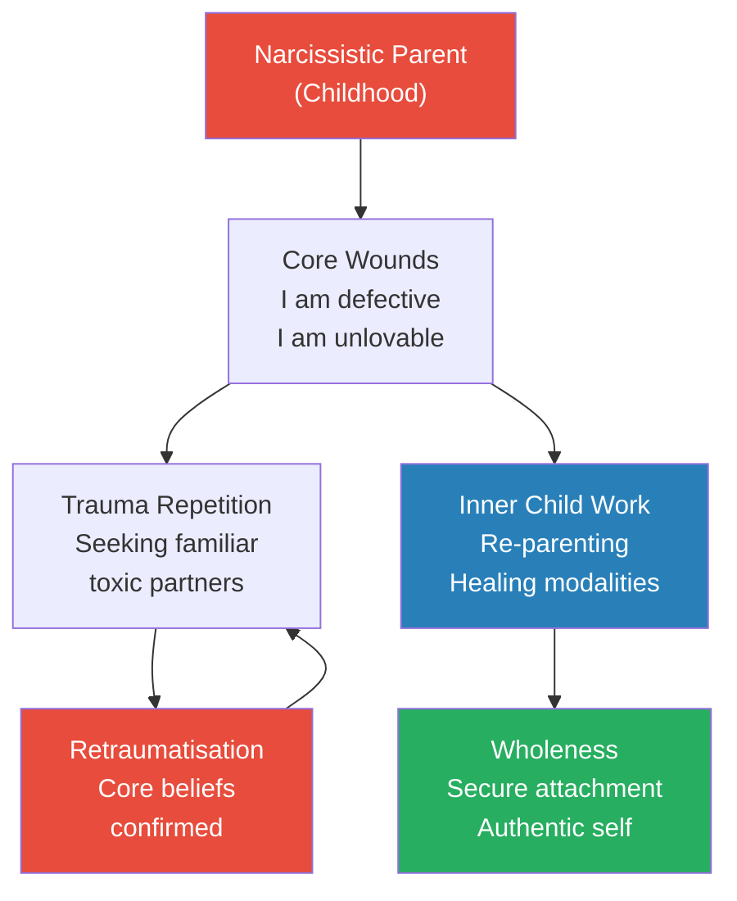
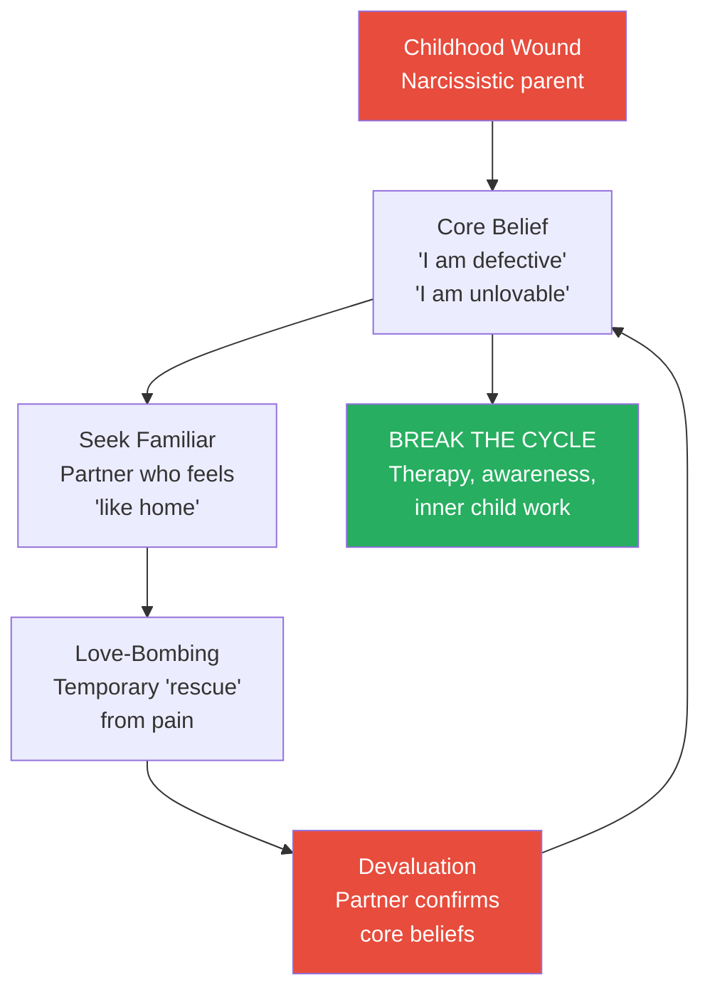
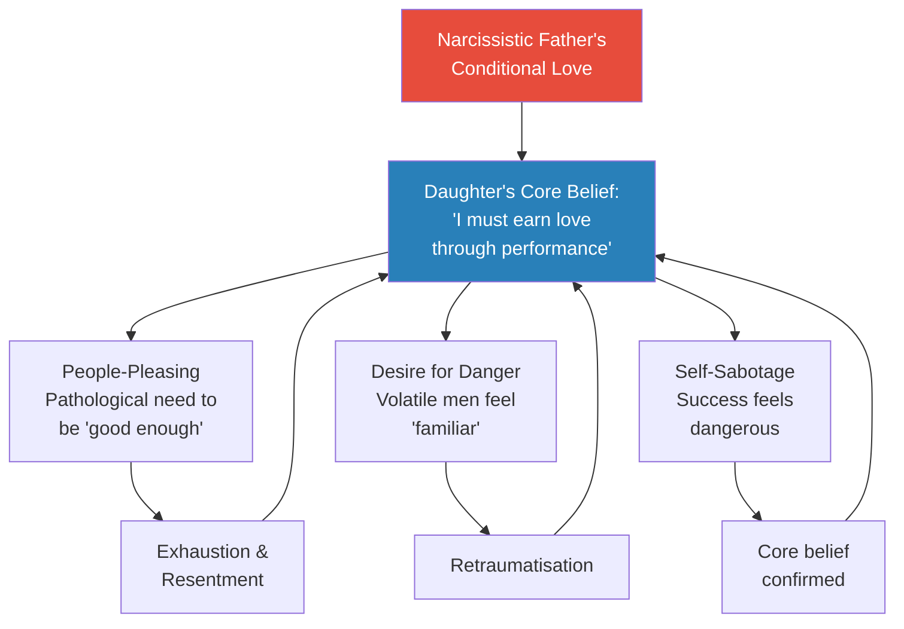

# Healing the Adult Children of Narcissists — Shahida Arabi

> Shahida Arabi surveyed 733 adult children of narcissists and found that 91% had experienced emotional neglect, 86% struggled with people-pleasing, 83% had entered toxic relationships that mirrored their childhood, and 53% had dealt with suicidal ideation. These numbers describe an invisible epidemic — millions of adults walking through life with wounds they cannot name, trapped in patterns they cannot explain, drawn to partners who hurt them in familiar ways. This book maps the territory of that invisible war zone: how narcissistic parents rewire their children's brains for fear, how those children grow up to repeat their trauma in adult relationships, and how — through inner child work, trauma therapy, and deliberate re-parenting — they can finally break free. It is equal parts research synthesis, survivor testimony, and practical workbook.

---

## About the Author

Shahida Arabi holds a Master's degree from Columbia University and is the author of several widely-read books on narcissistic abuse, including *Becoming the Narcissist's Nightmare* and *Power: Surviving and Thriving After Narcissistic Abuse*. Her essays on Thought Catalog and PsychCentral have reached millions of readers. She blends academic research (citing van der Kolk, Pete Walker, Bowlby, Ainsworth, John Bradshaw, Richard Schwartz, and others) with survey data from 733 adult children of narcissists and real survivor stories. Unlike purely clinical writers, Arabi writes with the urgency of someone who knows this terrain personally and the rigour of someone trained to study it.

---

## The Big Idea

- Childhood narcissistic abuse rewires the brain for fear — it affects impulse control, heightens hypervigilance, and destroys self-esteem
- <b style="color: #2980b9">The effects of verbal and emotional abuse are as devastating as physical abuse</b> — parental verbal aggression impacts brain areas related to learning, memory, decision-making, and emotional regulation
- Adult children of narcissists grow up feeling like they do not belong anywhere — they internalise the belief that something is fundamentally wrong with them
- This makes them vulnerable to <b style="color: #e74c3c">trauma repetition</b> — unconsciously seeking out partners, friends, and situations that replicate their childhood abuse
- The identities of adult children become fragmented; much of the healing journey is finding a way back to wholeness
- <b style="color: #27ae60">Recovery requires re-parenting the inner child with kindness, validation, and space for grief — and using a combination of traditional and alternative healing modalities to rewire the brain's trauma responses</b>

The trauma repetition cycle: childhood wounds create core beliefs that drive you into the arms of new abusers, whose abuse confirms the beliefs — until deliberate healing breaks the loop.

---

## Key Concepts at a Glance

| Concept | One-line summary |
|---------|-----------------|
| **Trauma Repetition** | Unconsciously seeking partners who replicate childhood abuse |
| **The 4F Responses** | Fight, Flight, Freeze, Fawn — maladaptive defensive modes from childhood trauma |
| **Inner Critic** | The internalized voice of your abusers, disguised as self-protection |
| **Attachment Styles** | How childhood caregiving shapes your ability to trust and love as an adult |
| **Golden Child vs. Scapegoat** | The narcissistic family assigns roles — one child is idealised, another is abused |
| **Emotional Flashbacks** | Regressions to the helpless feelings of childhood, triggered without visual memory |
| **Narcissistic Fleas** | Temporary defensive traits absorbed from abusers — not evidence of your own narcissism |
| **Parentification** | When children are forced to parent their parents — losing childhood entirely |
| **Toxic Shame** | The false belief that you are inherently defective, planted by childhood abuse |
| **No Contact / Low Contact** | Cutting or minimising the emotional umbilical cord to toxic parents |
| **IFS (Internal Family Systems)** | Understanding your wounded parts: Exiles, Managers, and Firefighters |
| **BREAK THE CYCLE** | Arabi's acronym for interrupting trauma repetition patterns |

---

## Introduction: The Invisible War Zone

### What Is Childhood Narcissistic Abuse?

*Childhood abuse is one of the most devastating health issues affecting us today — yet very few acknowledge its widespread impact.*

- Early traumas at crucial developmental stages shape identities, belief systems, and life trajectories
- <b style="color: #2980b9">Research shows that the brains of abused children are literally rewired</b> — even physical growth is stunted
- The Adverse Childhood Experiences (ACEs) Study confirms that emotional abuse, emotional neglect, and witnessing domestic violence are associated with a wide range of psychological and chronic health problems throughout a person's lifespan
- Dr. Martin Teicher has pointed out growing evidence that verbal abuse in childhood shapes the brain, increasing risk for anxiety, suicidal ideation, and dissociative symptoms
- As Bessel van der Kolk notes in *The Body Keeps the Score*: childhood trauma rewires the brain for fear
- <b style="color: #e74c3c">Childhood abuse is lethal — yet it is overlooked and minimised</b>
- Narcissistic abuse is psychological abuse by a parent who meets NPD criteria or has strong narcissistic traits
- These traits disable narcissistic parents from seeing their children as anything other than extensions of themselves

---

### Traits of Narcissistic Parents (Survey of 733 Adult Children)

*Arabi's survey provides statistical grounding for what survivors have always known.*

| Trait | % Experienced |
|-------|:------------:|
| Lack of empathy | 86% |
| Self-centeredness | 84% |
| Covert put-downs | 84% |
| Excessive entitlement | 76% |
| Chronic and excessive rage | 74% |
| Hostility toward anyone who threatens entitlement | 70% |
| Constant need for attention | 70% |
| Haughty, condescending attitude | 69% |
| Grandiose sense of superiority | 69% |
| Vanity and self-absorption | 67% |
| Superficial and glib charm | 64% |
| Superficial relationships | 63% |
| Exploiting others for own gain | 59% |
| Shallow, fleeting emotions | 58% |

- <b style="color: #e74c3c">Lack of empathy (86%)</b> is the most commonly reported trait — it is the core deficit that enables all other abuse
  - The narcissistic father who tells his son to "man up" after beating him teaches that pain does not matter
  - The narcissistic mother who scolds her daughter for crying over insults teaches her to be numb to verbal assaults
- Self-centeredness (84%) means children are not asked about their inner world — if they are, it is done for an agenda
  - Children of narcissists develop a sense of "perceived burdensomeness" — feeling like they are burdens to everyone
- Covert put-downs (84%) — the "insult with a smile"
  - A narcissistic mother: "You're wearing THAT? Well, you sure have creative taste" [mocking voice]
  - A narcissistic father at a family event: "John's never been the athletic type. He likes to play with his BOOKS."

---

### Abusive Tactics (Survey Data)

| Tactic | % Experienced |
|--------|:------------:|
| Emotional neglect | 91% |
| Rage attacks and emotional abuse | 85% |
| Gaslighting | 81% |
| Verbal abuse | 78% |
| Sabotage and pathological envy | 73% |
| Stonewalling and silent treatment | 73% |
| Triangulation | 71% |
| Hot-and-cold behaviour (love-bombing → punishment) | 70% |
| Malignant projections | 70% |
| Scapegoating | 70% |
| Micromanaging | 62% |
| Physical deprivation | 61% |
| Smear campaigns | 59% |
| Physical abuse | 53% |
| Covert emotional incest / Parentification | 36% |
| Sexual abuse | 14% |

- <b style="color: #e74c3c">Emotional neglect (91%)</b> is the most pervasive tactic — teaching children that their feelings simply do not matter
- Gaslighting (81%) causes children to question their own reality and sanity
  - Chronic gaslighting in childhood leads to perpetual self-doubt in adulthood
  - When you do not trust your own instincts, you are far more likely to accept an abuser's falsehoods
- Stonewalling (73%) activates the same part of the brain that detects physical injury — being ignored literally hurts
- Licensed counsellor Richard Zwolinski asserts: "The silent treatment is an abusive method of control, punishment, avoidance, or disempowerment that is a favorite tactic of narcissists"
- Hot-and-cold behaviour (70%) teaches children to associate unpredictable danger with intimacy
- <b style="color: #2980b9">Malignant projections (70%)</b> — the narcissistic parent projects their negative qualities onto you
  - They may call YOU selfish, abusive, or narcissistic — even when these qualities better describe them
  - This creates chronic uncertainty in the victim about their own identity
  - Since setting boundaries is punished, children learn that standing up for themselves is an inherently selfish act
- Scapegoating (70%) makes you the black sheep — the family's designated dumping ground for blame
  - "Flying monkeys" (recruited family members) further isolate and terrorise
- Physical abuse (53%) — not all narcissists are physical, but escalation to violence is not uncommon
- Covert emotional incest (36%) — the parent treats you as a partner rather than a child
  - May discuss sexual subjects inappropriately or rely on you as emotional caretaker

> [!example] Vicky's Silent Treatment
> - "My mom was the queen of the silent treatment"
> - "If we had a disagreement, she wouldn't talk to me for days"
> - "Then suddenly, one day she would talk to me again as if nothing happened"
> - "It was so confusing"
> **The lesson:** The silent treatment teaches children that their feelings can make people disappear — creating a lifelong terror of conflict and authentic self-expression.

> [!example] The Gypsy Blanchard Case — Extreme Exploitation
> - Gypsy's mother faked her daughter's illnesses and made her believe she needed a wheelchair — even though she could walk
> - She made Gypsy completely dependent and abused her violently behind closed doors
> - It was only after Gypsy murdered her mother that the truth about her being healthy came out
> - Experts say those with tendencies like Gypsy's mother are fully aware of what they are doing
> **The lesson:** Narcissistic exploitation of children can reach monstrous extremes — from emotional parentification to medical fraud to violence.

> [!example] Cealie's Shopkeeper Moment
> - A shopkeeper told Cealie's mother: "What a beautiful little girl! She has your eyes."
> - Cealie was thrilled, thinking her mother would be pleased
> - She looked at her mother: "She was scowling like a beast!"
> - The shopkeeper made a shocked groan when he saw the mother's face
> - "Even though I didn't understand it completely, I knew there was something wrong with how my mother treated me"
> **The lesson:** Children KNOW something is wrong — even when they lack the vocabulary to name it. That knowledge gets buried under years of gaslighting.

> [!example] Angela's Bedroom Door
> - Angela was not allowed to close her bedroom door, even when changing clothes
> - "For a tiny sliver of privacy, I had to huddle down in the corner out of direct view"
> - If she dared to close the door even partially, "there was hell on earth to pay"
> - Her parents even enlisted her brothers to abuse her further for perceived "defiance"
> **The lesson:** Narcissistic parents view boundaries as acts of war — and they train the entire family to enforce compliance.

---

### Effects of Childhood Narcissistic Abuse (Survey Data)

*The statistics paint a devastating picture of lifelong impact.*

**Self-Image and Mental Health:**
- 93% struggled with self-esteem
- 77% struggled with anxiety
- 65% struggled with depression
- 62% suffered from self-sabotage
- 53% dealt with suicidal ideation
- 47% had Complex PTSD; 38% had PTSD
- 44% developed eating disorders
- 37% engaged in substance abuse

**Relationships and Boundaries:**
- <b style="color: #e74c3c">86% struggled with people-pleasing habits</b>
- 83% had problems setting boundaries
- 83% had toxic relationships with people similar to their parents
- 77% tended to self-isolate due to fear or mistrust
- 77% had trouble standing up for themselves when violated
- 73% had toxic friendships with people similar to their parents
- 56% had been taken advantage of multiple times in adulthood
- 51% had been in constant search for a "rescuer"

**Career:**
- 65% suffered from perfectionism and overachieving
- 53% had engaged in career self-sabotage
- 39% became overachievers in their careers

> [!tip] Core Insight
> The numbers reveal the full spectrum of damage: from internal self-destruction (suicidal ideation, eating disorders, self-harm) to external pattern repetition (toxic relationships, people-pleasing, inability to set boundaries). The childhood wound does not stay in childhood — it colonises every domain of adult life.

---

### The Spectrum of Narcissism — From NPD to Psychopathy

*Not all narcissistic parents are the same — but all cause devastating harm.*

- Under the umbrella of Antisocial Personality Disorder are "sociopaths" and "psychopaths"
  - Sociopaths are considered "made" by environment; psychopaths are born without conscience
- The <b style="color: #2980b9">Dark Tetrad</b> combines narcissism, sadism, psychopathy, and Machiavellianism
- <b style="color: #2980b9">Malignant narcissists</b> (Otto Kernberg's term) combine narcissism, antisocial tendencies, aggression, sadism, AND paranoia
- There are actual brain differences: structural abnormalities related to compassion and empathy have been found in narcissistic brains
- <b style="color: #e74c3c">However, these brain differences do not remove accountability</b> — narcissists have cognitive empathy (can TARGET vulnerabilities) but lack affective empathy (cannot CARE about harm)
- Additional antisocial traits reported by respondents:
  - Pathological lying and deceit (56%)
  - Callousness and sadism (45%)
  - Impulsivity and irresponsibility (43%)
  - Leading double lives (36%)
  - Propensity for violence (36%)
  - Infidelity and numerous affairs (32%)

---

### Narcissistic Family Structures

- 36% had only a narcissistic mother
- 22% had only a narcissistic father
- 14% had BOTH parents as narcissists
- 17% had one narcissistic parent + one parent with a different disorder
- 11% had a whole family of narcissists, including siblings
- Many families have an "enabler" parent who looks the other way

> [!example] Anastasia's Father — The Enabler
> - "My father would not take active measures to protect me from the psychological abuse of my mother"
> - When forcibly hospitalised, her father — a prominent businessman — told her he could not have her mother arrested because it would reflect poorly "in the public eye"
> - Her mother once beat her until she had a concussion and contusions on her face
> - Her father would not take her to the hospital "because of his desire to protect her"
> **The lesson:** Enabler parents sacrifice their children to maintain the narcissist's image — doubling the betrayal.

---

### The Golden Child and the Scapegoat

- The <b style="color: #2980b9">Golden Child</b> is favoured, idealised, and used as comparison against the scapegoat
  - This role can shift if the golden child stands up to the narcissistic parent
  - Golden children may develop narcissistic traits — taught that they are entitled to everything
- The <b style="color: #e74c3c">Scapegoat</b> is the primary target for blame, projections, and abuse
  - Other family members are recruited as "flying monkeys" to further bully and terrorise
- Both roles are destructive:
  - The golden child loses authenticity under layers of performance
  - The scapegoat loses self-worth under layers of shame
- Empathic, scapegoated children often fall to the opposite extreme of entitlement — their sense of "deservingness" is severely skewed toward self-deprivation

---

### Narcissistic Parents as Cult Leaders

*The narcissistic family operates like a miniature cult.*

- Isolation, fear-mongering, and narcissistic personality create a dangerous mix
- The narcissistic parent instills rigid belief systems and an "us versus them" mentality
- Creating an atmosphere of fearing "the other" keeps the family insulated from outside influences

> [!example] Jim Jones and Jonestown
> - Infamous cult leader Jim Jones convinced 900 followers to participate in mass-murder suicide
> - His biological son Stephan describes: "Dad, like any good demagogue, would conjure up fear"
> - "His message was incredibly violent. If we weren't having an open meeting to bring in new members, we were having closed meetings to control the members"
> **The lesson:** The narcissistic family operates like a miniature cult — isolation from outsiders, rigid belief systems, and total obedience demanded.

### Superficial Charm as a Weapon

- 64% of respondents had a parent with superficial and glib charm
- Narcissistic parents use charm to fool the public — appearing as perfect parents
- When they seem like model parents in public, their children's testimony seems unbelievable

---

### Extreme Examples of Narcissistic Parenting

> [!example] Kim's Bathtub — Silencing a Molested Child
> - As a young child, Kim told her mother in the bathtub that her grandfather was molesting her
> - Her mother held her underwater by the throat and nearly drowned her to shut her up
> - Kim did not remember anything until she was 36 years old
> **The lesson:** Narcissistic parents will go to extreme and violent lengths to protect the family image — even at the cost of their child's safety and life.

> [!example] Bambi's Father — The Peter Pan
> - "My father was a self-indulgent Peter Pan type living close to danger his entire adult life"
> - "He hid money and assets, forgot about me when he was lost in the desert for 10 days"
> - "Then expected me to care for him when he became disabled from diabetes"
> **The lesson:** Narcissistic parents demand care from the very children they abandoned.

> [!example] Melissa's Parentification at Age 6
> - "I developed the disease to please at an extremely young age"
> - "My mom was an enabler and a victim herself — she parentified me from around age 6"
> - "So I parented her and tried to meet her emotional needs while experiencing sexual abuse from my father"
> - "I hated conflict and did everything in my power to keep the peace in my house"
> **The lesson:** Parentification forces children to sacrifice their childhood to manage adult problems they should never have been exposed to.

---

## Part One: The Trauma of Adult Children of Narcissists

### Five Damaging Lies We Learn from Narcissistic Parents

*The core false beliefs that drive adult dysfunction.*

- These lies are not explicitly stated — they are absorbed through years of treatment
- They become the inner voice that keeps survivors trapped in patterns of self-destruction
- Each lie serves the narcissistic parent's need for control and the child's need to make sense of incomprehensible treatment
- <b style="color: #27ae60">Identifying and naming these lies is the first step to dismantling them</b>
- Common lies include:
  - "My feelings do not matter" — from years of emotional neglect and invalidation
  - "I must earn love through performance" — from conditional, achievement-based approval
  - "Conflict means abandonment" — from being punished for any disagreement
  - "I am responsible for other people's emotions" — from being made the family's emotional caretaker
  - "If I am perfect enough, I will finally be loved" — the lie that drives perfectionism and overachieving

---

### Trauma Reenactment — The Repetition Cycle

*Why adult children of narcissists keep ending up in the same kind of relationships.*

- <b style="color: #2980b9">Trauma repetition</b> is the phenomenon where earlier trauma is repeated in adulthood, usually with the subconscious hope for resolution
- The logic (unconscious): "If I can make THIS person love me, it will heal the wound my parent left"
- But the person chosen is always someone who cannot love — because THAT is what feels familiar
- The cycle: childhood wound → core belief ("I am defective") → seek familiar partner → partner confirms belief → core belief strengthened

The trauma repetition cycle continues until conscious intervention breaks it.

---

### The 4F Responses — Fight, Flight, Freeze, Fawn

*How childhood trauma creates maladaptive defensive modes that persist into adulthood.*

- Based on Pete Walker's work — children of narcissists survive by depending on one or two defensive modes to the exclusion of others
- These defensive modes can be launched even in situations that do not warrant them

| Type | Childhood Strategy | Adult Manifestation |
|------|-------------------|-------------------|
| **Fight** | Aggression to gain safety | Power and control; sometimes narcissistic traits |
| **Flight** | Avoidance of trauma | Perfectionism, workaholism, overachieving, running away |
| **Freeze** | Hiding to circumvent pain | Dissociation, self-isolation, withdrawal from life |
| **Fawn** | Catering to abuser's needs | People-pleasing, codependency, walking on eggshells |

- <b style="color: #2980b9">Fawn types</b> (86% of survey respondents struggled with people-pleasing) learned in early childhood that catering to others was the only way to stay safe
  - In adulthood, they walk on eggshells trying to meet everyone else's needs while abandoning their own
- <b style="color: #2980b9">Flight types</b> channel fear of abandonment into perfectionism and overachieving
  - The adult daughter who works 80-hour weeks is not driven by ambition — she is running from the terror of not being "good enough"
- Some survivors demonstrate hybrid types — Fight-Fawn, Flight-Freeze — that shift depending on context

---

### Attachment Styles — How Childhood Shapes Adult Love

*Based on Bowlby's theory and Ainsworth's "Strange Situation" study.*

- Attachment theorist John Bowlby believed that early childhood experiences deeply affect development and social behaviour in adulthood
- Mary Ainsworth's 1970s "Strange Situation" study tested what happened when a mother and child entered a new room, and the mother then left

**Childhood Attachment Styles:**

1. <b style="color: #27ae60">Secure Attachment</b> — child confident that parent is a safe base; seeks parent in distress; easily soothed
   - Results from: caregiver who is responsive and sensitive to needs
2. **Avoidant-Insecure** — child independent of parent; does not seek parent in distress
   - Results from: parents who punish or reject the child when they seek comfort
3. **Insecure-Ambivalent** — child clings to caregiver but then rejects them; cannot be soothed
   - Results from: inconsistent responsiveness from caregiver
4. <b style="color: #e74c3c">Disorganized-Insecure</b> — "fright without a solution" — the parent who should be the source of comfort IS the source of distress
   - Results from: abusive, confusing, or unpredictable caregivers

**Adult Attachment Styles:**

| Style | Core Pattern | Origin |
|-------|-------------|--------|
| **Secure** | Autonomous, trusting, comfortable with intimacy | Responsive childhood caregiving |
| **Anxious-Preoccupied** | Desperate for intimacy, insecure, fears abandonment, seeks a "rescuer" | Inconsistent childhood responsiveness |
| **Dismissive-Avoidant** | Emotionally distant, avoids intimacy, prioritises independence | Punishing/rejecting childhood caregiving |
| **Fearful-Avoidant** | Wants intimacy but associates it with pain; ambivalent, trapped | Abusive/frightening childhood caregiving |

- <b style="color: #e74c3c">Most adult children of narcissists develop one of the insecure styles</b>
- Anxious-preoccupied adults (51% searched for a "rescuer") long for intimacy but are terrified of abandonment
- Dismissive-avoidant adults (49% reported being emotionally unavailable) equate intimacy with loss of independence
- Fearful-avoidant adults know they need others but associate relationships with pain
- Understanding your attachment style is the first step to changing it — secure attachment CAN be earned through therapy and healthy relationships

---

### Complex Trauma and Complex PTSD

*When trauma is prolonged, ongoing, and repeated.*

- Complex trauma creates perceived inability to escape — unlike single-event PTSD (car accident, assault)
- 47% of respondents had Complex PTSD; 38% had PTSD
- Complex PTSD causes disruptions in:
  - Emotional regulation
  - Consciousness (dissociation)
  - Self-perception
  - Distorted perceptions of perpetrators
  - Dysfunction in relationships
  - Distorted worldview
- <b style="color: #2980b9">Emotional flashbacks</b> — a symptom of Complex PTSD — occur without visual memory
  - You do not "see" the childhood event; you FEEL the same terror, helplessness, and shame
  - Pete Walker calls these "amygdala hijackings"
  - They can cause you to freeze when you need to act, or lash out when the situation does not warrant it
  - Learning to recognise emotional flashbacks is essential for managing them

---

## Part Two: Love and Relationships

### How Children of Narcissists Love Differently

*The childhood template for love is distorted — and it shapes every adult relationship.*

- Adult children of narcissists crave the highs of excessive attention because it represents the only positive regard they received
  - Love-bombing by a new partner feels like rescue — "Finally, someone sees me"
  - But they also learn to tolerate the harsh blows that inevitably follow
- <b style="color: #e74c3c">This twisted form of "love" is internalised as the norm</b>
  - Unpredictable danger becomes associated with "chemistry" and "passion"
  - Stability feels boring — because it does not trigger the familiar adrenaline
- Common patterns:
  - Seeking emotionally unavailable partners who replicate parental coldness
  - Becoming the "fixer" — trying to love someone into health
  - Confusing intensity with intimacy
  - Accepting breadcrumbs of affection as sufficient
  - Self-sabotaging when a genuinely healthy partner appears

### The Power of Love-Bombing and Intermittent Reinforcement

- Narcissistic parents use the same intermittent reinforcement that makes gambling addictive
- <b style="color: #2980b9">Unpredictable reward is MORE addictive than consistent reward</b>
- The child never knows when the parent will be loving vs. cruel — so they are always on alert, always performing, always hoping
- In adulthood, this translates to tolerance for chaotic relationships and mistrust of stable ones
- 70% experienced hot-and-cold behaviour (love-bombing followed by punishment)
  - The "good days" are just enough to keep the child bonded
  - The "bad days" are devastating but intermittent enough to be rationalised
- The adult child who craves the "highs" of a new relationship is not romance-addicted — they are trauma-bonded to a pattern of intermittent reinforcement from childhood
- <b style="color: #27ae60">Breaking this pattern requires recognising that stability, not intensity, is the hallmark of genuine love</b>

> [!example] Leslie's Blood Clotting Disorder
> - Leslie had rheumatoid arthritis and factor V Leiden blood clotting disorder
> - She was told she could die from it
> - "He could not have cared less — the same as my family of origin"
> - Her children came to visit but not her mother or siblings
> - "I had a tough time seeing the very things that I was in denial about"
> **The lesson:** Life-threatening illness is the ultimate test of who genuinely cares — and narcissists fail it every time.

### 5 Powerful Healing Benefits of Being Single After an Abusive Childhood

- Arabi makes a counter-cultural argument: being single after narcissistic abuse is not loneliness — it is recovery
- Benefits include:
  1. Freedom to rediscover your authentic self without a partner's influence
  2. Space to process grief and trauma without relationship triggers
  3. Time to develop secure self-attachment before seeking it from others
  4. Opportunity to build friendships on healthy terms
  5. Chance to break the pattern of seeking "rescuers"
- <b style="color: #27ae60">Being single is not a waiting room for your next relationship — it is a healing sanctuary</b>

---

## Part Three: Narcissistic Mothers and Fathers

### 8 Traits of the Narcissistic Mother

- Narcissistic mothers compete with their daughters — for attention, appearance, and the affections of the father
- They may enmesh themselves with their children, micromanaging every aspect of their lives
- They use their children as emotional supply — demanding adoration while providing no genuine warmth
- The daughter of a narcissistic mother often learns that she is an object to be "seen" rather than heard

> [!example] Maggie from Maryland
> - "I remember feeling like my mom competed against me for my father's attention when I was a teenager"
> - "I also felt like when my mother and I fought, it was like fighting with a sibling"
> **The lesson:** Narcissistic mothers do not parent — they compete. The daughter becomes a rival rather than a child to be nurtured.

---

### The "Daddy Issues" Series — Daughters of Narcissistic Fathers

*Arabi's most original contribution: a five-part exploration of an underexplored topic.*

**Part 1: Our Desire for Danger**
- Daughters of narcissistic fathers are drawn to dangerous, emotionally unavailable men
- The father's intermittent attention — charming one moment, cruel the next — becomes the template for "passion"
- In adulthood, stable men feel boring; volatile men feel exciting

**Part 2: The Perpetual Childhood**
- The narcissistic father infantilises his daughter — keeping her dependent and unable to function as an autonomous adult
- She may struggle with independence, decision-making, and self-trust well into adulthood

**Part 3: Trauma Repetition and Toxic Men**
- The daughter unconsciously seeks men who replicate her father's pattern
- She is trying to earn from a partner the love her father never gave
- <b style="color: #e74c3c">The partner she chooses is always incapable of providing it — because incapability is what feels familiar</b>

**Part 4: People-Pleasing and Validation Seeking**
- The father's conditional love teaches the daughter that she must EARN affection through performance
- In adulthood, she becomes pathologically people-pleasing — unable to say no, unable to prioritise herself

**Part 5: Self-Sabotage**
- The narcissistic father's message: "You will never succeed without me"
- The daughter internalises this as a fear of success — sabotaging herself to prove the father "right"
- Achievement feels dangerous — because in childhood, achievement was punished or stolen
- 62% of respondents suffered from self-sabotage; 53% had sabotaged their careers specifically
- The self-sabotage loop: achieve → feel anxiety ("I don't deserve this") → undermine achievement → feel relief and shame simultaneously
- <b style="color: #27ae60">Breaking self-sabotage requires recognising that the fear of success is a LEARNED response, not a character flaw</b>

The narcissistic father creates a web of interconnected wounds in his daughter — people-pleasing, attraction to danger, and self-sabotage all trace back to the same conditional love.

---

## Part Four: Healing and Re-Parenting the Inner Child

### Going No Contact or Low Contact

*Cutting the emotional umbilical cord to toxic parents.*

- No Contact means completely severing all communication with the narcissistic parent
- Low Contact means maintaining minimal, boundary-enforced communication
- The decision depends on your specific circumstances — safety, financial dependency, children
- <b style="color: #27ae60">Narcissistic parents will escalate when you establish boundaries — expect love-bombing, guilt-tripping, and rage</b>
- Flying monkeys (family members recruited to pressure you) will be deployed
- Common reactions from narcissistic parents when you go No Contact:
  - **Love-bombing:** Sudden gifts, apologies, declarations of love — designed to pull you back
  - **Rage:** Furious messages, threats, showing up unannounced
  - **Smear campaigns:** Telling family and friends that YOU are the abuser
  - **Health crises:** Sudden illnesses or emergencies (real or fabricated) timed to coincide with your boundaries
  - **Financial pressure:** Withdrawing support, threatening inheritance, creating dependency
- <b style="color: #e74c3c">None of these reactions prove that your decision was wrong — they prove that it was necessary</b>
- The escalation is itself evidence of the control dynamic you are escaping
- Going No Contact is not a punishment inflicted on the parent — it is a boundary you set for your own survival
- Guilt is the predictable response to establishing the first boundary you have ever set with this person
  - It does NOT mean you are doing something wrong
  - It means your conditioning is working as designed — the narcissist trained you to feel guilty for self-care
- Arabi provides detailed guidance on:
  - How to communicate the boundary (or whether to communicate it at all)
  - Scripts for responding to hoovering attempts
  - How to handle holidays, weddings, and family events
  - Building a support network to replace the one the narcissistic parent controlled

### The Survey on Recovery Recommendations

*What adult children of narcissists themselves recommend.*

- Arabi includes a survey of what ACONs found most helpful in their recovery
- Top recommendations from survivors:
  - Professional therapy (especially with a trauma-informed therapist)
  - Education about narcissism and personality disorders
  - Journaling and creative expression
  - Going No Contact or establishing firm boundaries
  - Building relationships with safe, empathic people
  - Self-compassion practices
  - Body-based practices (yoga, exercise, somatic work)
  - Reading survivor communities for validation
- The recurring theme: <b style="color: #27ae60">validation from others who understand is transformative — it breaks the isolation that narcissistic parents worked so hard to maintain</b>
- Many survivors note that simply NAMING the abuse — calling it what it is — was the single most powerful step in their recovery

### 6 Manipulation Tactics and How to Respond

- Narcissistic parents use guilt, obligation, fear, love-bombing, gaslighting, and triangulation to maintain control
- For each tactic, Arabi provides specific response strategies
- The key principle: you cannot reason with someone who lacks empathy — disengage rather than debate
- Susan Forward's FOG triad (Fear, Obligation, Guilt) describes the emotional cocktail narcissists use to maintain control:
  - **Fear:** "If you leave, terrible things will happen"
  - **Obligation:** "After everything I've done for you, this is how you repay me?"
  - **Guilt:** "You're destroying this family"
- <b style="color: #27ae60">The antidote to FOG is recognising that the fear is manufactured, the obligation is one-sided, and the guilt belongs to the abuser</b>

---

### Communication Tips for Those Who Must Maintain Contact

- Not everyone can go fully No Contact — some have financial dependence, shared custody, or safety concerns
- For those who must maintain Low Contact:
  - Keep communication factual and brief — like a business transaction
  - Do not JADE (Justify, Argue, Defend, Explain)
  - Use the "grey rock" method — be as boring and unresponsive as possible
  - Set specific boundaries about communication frequency and topics
  - Have a therapist or trusted person you can debrief with after each interaction
- <b style="color: #e74c3c">Every interaction with a narcissistic parent is a potential trigger — preparation is essential</b>

---

### Healing Modalities for Adult Children of Narcissists

**Traditional Modalities:**
- **CBT (Cognitive Behavioural Therapy)** — identifying and challenging distorted thought patterns
- **EMDR (Eye Movement Desensitisation Reprocessing)** — processing traumatic memories through guided eye movements
- **IFS (Internal Family Systems)** — understanding and integrating your wounded inner parts
  - <b style="color: #2980b9">Exiles</b>: the wounded parts carrying childhood memories and pain
  - <b style="color: #2980b9">Managers</b>: the hypercritical, controlling parts that try to prevent exile parts from being triggered
  - <b style="color: #2980b9">Firefighters</b>: parts that douse emotional "fires" through addiction, compulsion, or self-harm
- **DBT (Dialectical Behaviour Therapy)** — emotional regulation skills, distress tolerance, interpersonal effectiveness
- **Somatic Experiencing** — releasing trauma stored in the body (aligned with van der Kolk's work)

**Nontraditional Supplementary Modalities:**
- Arabi explores additional approaches including mindfulness, yoga, creative expression, and body-based practices
- These supplement but do not replace professional therapy
- The principle: healing narcissistic childhood abuse requires work on BOTH the psyche and the body
  - Traditional therapy addresses thoughts and emotions
  - Body-based practices address the physical imprint of trauma (chronic tension, hypervigilance, dissociation)
  - Creative practices address the authentic self that was suppressed
- <b style="color: #27ae60">No single modality is sufficient — the most effective approach combines multiple methods tailored to your specific wounds</b>

### The Inner Parts Model (IFS) — In Depth

*Richard Schwartz's Internal Family Systems offers a compassionate framework for understanding your fragmented self.*

- Trauma creates disparate inner parts — each serving a protective function
- Understanding these parts is key to self-compassion rather than self-blame:

**Exiles** — the wounded inner parts carrying childhood memories and pain
- These are the parts of you that feel the original shame, terror, and abandonment
- They are "exiled" because the other parts work to keep them hidden — the pain is too intense
- When an exile is triggered, you feel the full force of childhood helplessness

**Managers** — the hypercritical, controlling parts
- These parts try to prevent the exiles from being triggered
- The Inner Critic is a Manager — it criticises you harshly to keep you "safe" from situations that might activate exile pain
- The Perfectionist is a Manager — it demands flawless performance to prevent the shame of failure
- Managers operate proactively — they try to control your environment BEFORE pain occurs

**Firefighters** — the emergency responders
- When an exile IS triggered despite the managers' efforts, firefighters activate
- They "douse the fire" of emotional pain through:
  - Addiction (alcohol, drugs, food, sex, shopping)
  - Dissociation (spacing out, numbing, depersonalisation)
  - Self-harm
  - Compulsive behaviours
- Firefighters operate reactively — they respond to pain that has already surfaced
- <b style="color: #e74c3c">All of these parts are trying to protect you — even the destructive ones</b>
- The goal of IFS is not to eliminate parts but to understand them, appreciate their protective intent, and help them find healthier ways to serve you
- This requires accessing the "Self" — the core of who you are beneath all the parts — which is characterised by curiosity, compassion, clarity, and calm

---

### The Codependency Question

*Are adult children of narcissists codependent? It is more nuanced than that.*

- Some ACONs develop codependent tendencies — but not all
- Many would better be described as traumatised and trauma-bonded rather than codependent
- Codependency was historically a term for enablers living with addicts
- It has been expanded to describe anyone with an unhealthy dependence on relationships for self-esteem
- Codependents in narcissistic families typically:
  - Sacrifice their own needs to "rescue" the narcissist
  - Engage in compulsive caretaking that prevents the narcissist from facing consequences
  - Have difficulty distinguishing their own needs from the narcissist's needs
- <b style="color: #2980b9">However, trauma bonding is NOT the same as codependency</b> — a trauma-bonded person is not choosing to stay; they are neurologically wired to do so
- Arabi is careful to distinguish: "Not all adult children of narcissists are codependent. Some would better be described as traumatized."

---

## Part Five: Exercises for Recovery

### Naming Your Inner Parts

*Based on the IFS model — identifying the different parts that protect your wounded core.*

- Each inner part serves a protective function — even the destructive ones
- The Inner Critic, for example, is trying to keep you safe from failure — but its methods are abusive
- By naming and understanding these parts, you can work WITH them instead of against them
- Arabi provides structured exercises for identifying and dialoguing with your parts

### Combat People-Pleasing

- 86% of respondents struggled with people-pleasing — making this a universal issue
- Exercises focus on: recognising when you are people-pleasing, practising "no" in low-stakes situations, identifying the fear behind the fawn response
- The goal is not to stop being kind — it is to stop being kind AT YOUR OWN EXPENSE

### Tapping Into Your Inner Child

- The inner child carries the wounds of abandonment and shame
- <b style="color: #27ae60">Re-parenting means giving your inner child the kindness, compassion, validation, and space for grief that your actual parents never provided</b>
- Exercises include: writing letters to your younger self, visualising comfort for the child within you, identifying what your inner child needed and never received

### Connecting with Rage

- Many adult children of narcissists have been taught that anger is forbidden
- The narcissistic parent punished anger so consistently that the child dissociated from it entirely
- Reconnecting with healthy anger is essential — it is the emotion that powers boundary-setting
- Exercises focus on: safely experiencing anger, distinguishing healthy anger from destructive rage, understanding that anger at injustice is appropriate

### Connecting with Grief and Loss

- Grief for what you never had — the parent who should have loved you, the childhood you deserved
- This grief is often the deepest and most avoided emotion
- Exercises provide structured ways to sit with grief without drowning in it

### Battling Imposter Syndrome

- Adult children of narcissists who became overachievers (65%) often suffer from imposter syndrome
- Despite external accomplishments, they feel like frauds — waiting to be "found out"
- This stems from the narcissistic parent's message: "Your accomplishments are mine; your failures are yours"
- Exercises focus on:
  - Documenting your achievements and the genuine effort behind them
  - Recognising that the inner voice calling you a fraud IS the narcissistic parent's voice
  - Separating your actual abilities from the distorted feedback you received

---

### Role-Self, Role Reversal, and True Self

- Adult children of narcissists develop a "role-self" — the version of them that was safe enough to show the narcissistic parent
  - The good student, the caretaker, the invisible child, the performer
- The "true self" — spontaneous, creative, playful, authentic — was buried to survive
- Recovery means:
  - Identifying which parts of your personality are authentic and which are survival roles
  - Giving yourself permission to express the parts that were suppressed
  - Mourning the years spent performing rather than living

---

### Dating with Detachment

- After narcissistic abuse, dating triggers every wound simultaneously
- "Dating with detachment" means: observing a potential partner's behaviour without projecting your hopes onto them
- Red flags are evaluated without the fog of desperate longing for rescue
- The goal is to choose from abundance and self-knowledge, not from scarcity and fear
- Practical strategies:
  - Wait longer before committing — allow character to reveal itself over time
  - Notice how you FEEL around this person, not how they make you feel in peak moments
  - Ask: "Would my therapist/trusted friend see red flags here?"
  - If the relationship feels intensely passionate from day one, that is a warning — intensity is not intimacy

### Overcoming Self-Isolation

- 77% of respondents self-isolated due to fear or mistrust
- Self-isolation is a freeze response — a way of hiding from further pain
- Exercises focus on: gradual exposure to safe social situations, distinguishing healthy solitude from trauma-driven avoidance
- Arabi distinguishes between:
  - **Healthy solitude** — chosen, restorative, energising
  - **Trauma-driven isolation** — compulsive, fear-based, depleting
- The question is not "Do I spend time alone?" but "Why am I spending time alone?"
- If isolation is driven by fear of being hurt, it needs to be gently challenged
- If solitude is chosen for recharging, it is healthy and should be honoured

---

### Connecting with Rage

*Many adult children of narcissists have been taught that anger is forbidden.*

- The narcissistic parent punished anger so consistently that the child dissociated from it entirely
- Some ACONs cannot feel anger at all — they go straight to shame, self-blame, or depression
- Others feel anger but cannot express it — it turns inward as self-harm or eating disorders
- Reconnecting with healthy anger is essential for recovery because anger powers boundary-setting
- <b style="color: #27ae60">Healthy anger says: "What happened to me was wrong, and I have the right to protect myself from it happening again"</b>
- Exercises focus on:
  - Safely accessing anger through writing, physical activity, or guided visualisation
  - Distinguishing healthy anger (protective) from destructive rage (dysregulated)
  - Understanding that anger at injustice is not only appropriate — it is necessary
  - Directing anger at the source (the abusive parent) rather than inward (self-punishment)

### Connecting with Grief and Loss

*The deepest grief is not for what you lost — it is for what you never had.*

- Adult children of narcissists must grieve:
  - The parent who should have loved them unconditionally
  - The childhood they deserved but did not receive
  - The innocence that was stolen
  - The years spent in survival mode rather than living
  - The relationships damaged by unhealed wounds
- This grief is often the most avoided emotion — because facing it means accepting the irreversibility of the loss
  - You will never have the childhood you deserved
  - Your parent will never become the person you needed them to be
- <b style="color: #e74c3c">But grief, fully processed, creates space for something new</b>
  - When you stop waiting for the parent who will never change, you free yourself to build the life that IS possible
  - When you mourn the childhood you lost, you can begin to give yourself the kindness that was withheld

---

### Emotional Regulation Skills

*Practical tools for managing overwhelming feelings.*

- Adult children of narcissists often have poor emotional regulation — their parents never modelled it
- They may swing between emotional numbness and overwhelming floods of feeling
- Arabi provides coping and regulation skills including:
  - Grounding techniques (5-4-3-2-1 sensory exercise)
  - Breathing exercises for acute distress
  - Journaling for processing daily emotions
  - Physical movement to release stored tension
  - Mindfulness practices for staying present rather than dissociating

---

### 11 Self-Directed Activities for Nourishing the True Self

- Arabi provides a practical list of activities for reconnecting with the authentic self that was buried in childhood
- These are not therapy — they are daily practices for cultivating self-connection:
  - Creative expression (art, writing, music)
  - Physical activities that bring joy (not performance)
  - Time in nature
  - Exploring curiosity without judgment
  - Building new skills for pleasure, not achievement
- The principle: <b style="color: #27ae60">the true self has been starved for decades — it needs regular nourishment to come back to life</b>

---

### The Inner Critic

*The most insidious legacy of narcissistic parents — an internal voice that continues the abuse.*

- 83% of respondents had a heightened inner critic
- This inner critic often sounds exactly like the abusive parent — same tone, same words, same contempt
- It originated as a survival mechanism: "If I criticise myself before they do, maybe the punishment will be less severe"
- In adulthood, it prevents you from reaching your full potential
- <b style="color: #e74c3c">The inner critic is not YOU — it is the internalized voice of your abusers</b>
- Pete Walker calls emotional flashbacks triggered by the inner critic "amygdala hijackings"
- These can cause you to feel the same helplessness, rage, and humiliation you felt in childhood
- Strategies for managing the inner critic:
  - Recognise when the critic is speaking — "That sounds like my mother/father, not like me"
  - Challenge the critic's statements with evidence — "Is this actually true?"
  - Develop a compassionate counter-voice — "What would I say to a friend in this situation?"
  - Practice self-compassion when the critic activates — not self-punishment

---

### Trauma Bonding — Why You Cannot Just Leave

*The bond formed with abusers is not love — it is a survival mechanism.*

- Also called a "betrayal bond" (Dr. Patrick Carnes)
- A helpless child cannot survive without food, shelter, and physical touch from a parent
- The child bonds with the narcissistic parent, becomes obedient and compliant — just to survive
- This is very much like Stockholm Syndrome — loyalty, love, and devotion to captors
- <b style="color: #2980b9">Trauma bonding explains why adult children of narcissists maintain contact with parents who abuse them</b>
  - It is not weakness — it is a survival mechanism formed when they had no other choice
  - Breaking a trauma bond requires the same deliberate effort as breaking an addiction
- 40% of respondents reported still having a trauma bond with their abusive parent despite continued abuse

---

### Toxic Shame vs. Healthy Shame

*John Bradshaw's critical distinction.*

- Healthy shame is simply an emotion of limits — it gives us permission to be human and imperfect
- <b style="color: #2980b9">Toxic shame</b> is spawned from an abusive childhood — it instills the core belief that you are fundamentally defective
- Toxic shame carries the misguided belief that you are at fault for the abuse
- This is a maladaptive way of regaining control: "If I caused it, I can also change it"
- But the truth is that an innocent child was never at fault — the blame belongs entirely with the abusive parent
- <b style="color: #27ae60">Dissolving toxic shame requires placing the blame where it belongs — not on your five-year-old self, but on the adult who should have known better</b>

---

### Narcissistic Fleas — You Are Not the Narcissist

*A critical reassurance for survivors who fear they are becoming their abusers.*

- When raised by narcissists, it is common to pick up some narcissistic behaviours — called "narcissistic fleas"
- You might become hypersensitive to criticism, overly rageful, or attempt to manipulate
- <b style="color: #27ae60">These are TEMPORARY defense mechanisms — not evidence of a personality disorder</b>
- Many survivors turn inward in self-blame, questioning: "Am I the narcissist?"
- This self-doubt is itself a product of gaslighting — genuine narcissists do not worry about being narcissistic
- Narcissistic fleas dissolve with inner work, healing, and a healthier environment
- They dissipate once you have left the toxic environment and are free to work on yourself

---

### Superpowers All Children of Narcissists Have

*Arabi ends with a powerful reframe — the strengths that emerged from survival.*

- **Heightened empathy** — having suffered, you can feel others' pain deeply
- **Pattern recognition** — you learned to read emotional cues for survival; this becomes a superpower in adulthood
- **Emotional intelligence** — you developed sophisticated emotional awareness out of necessity
- **Resilience** — you survived what should have destroyed you
- **Creativity** — many adult children of narcissists channel their pain into art, writing, music
- **Ability to detect danger** — your hypervigilance, once a survival tool, becomes discernment
- **Deep capacity for love** — having been denied love, you know its value and give it generously
- **Moral compass** — raised without a model of integrity, you forged one yourself
- **Truth-seeking** — having been gaslit since childhood, you developed an unshakeable commitment to honesty
- **Independence** — having been forced to parent yourself, you developed extraordinary self-reliance

> [!tip] Core Insight
> These traits often get used by toxic people AGAINST you. But they are the same strengths you can use to break free, lead lives of freedom and peace, and become the parent your children need. Your narcissistic parent sought to destroy the world — you emerged from that destruction seeking to heal it.

---

---

### What Therapists Say About Childhood Narcissistic Abuse

*Arabi includes insights from therapists she surveyed.*

- Therapists consistently report that childhood narcissistic abuse is one of the most difficult forms of trauma to treat
- The primary challenge: the abuse was inflicted by the very people who were supposed to provide safety
- This creates a foundational distrust of all authority figures — including therapists
- Therapists note that ACONs often:
  - Minimise their own abuse ("It wasn't that bad" / "Others had it worse")
  - Blame themselves for the abuse ("I must have provoked it")
  - Have difficulty identifying their own emotions ("I don't know what I feel")
  - Resist self-compassion ("I don't deserve kindness")
- <b style="color: #27ae60">The therapeutic alliance — a trusting relationship with the therapist — is itself a corrective experience for someone whose primary attachment figure was unsafe</b>
- Recovery timelines vary enormously — but therapists agree that Complex PTSD from childhood narcissistic abuse requires long-term treatment, not quick fixes

---

### Subconscious Wounding

*The wounds you do not know you carry are the hardest to heal.*

- Unlike conscious wounds (memories of specific abusive events), subconscious wounds are buried below awareness
- They drive belief systems and behaviour without your knowledge
- They surface when triggered — by a partner's tone of voice, a boss's criticism, a friend's seeming rejection
- <b style="color: #2980b9">These triggers are not overreactions — they are the subconscious wound rising to the surface for processing</b>
- The healing process involves:
  - Recognising that a disproportionate reaction signals a deeper wound
  - Exploring what the trigger connects to in childhood
  - Processing the original wound with professional support
  - Gradually reducing the trigger's power through repeated exposure and reprocessing

---

### Arabi's Closing Vision

*"Do narcissistic parents ever do good in this world? Sure. They give birth to children who seek to heal the world they sought to destroy."*

- Adult children of narcissists possess an enormous amount of strength and resilience
- The very qualities that made them targets — empathy, sensitivity, creativity, capacity for love — are the qualities the world needs most
- The healing journey is not just personal — it is generational
- When you heal, you break the cycle not just for yourself but for every relationship you will ever have
- <b style="color: #27ae60">You are not defined by what was done to you — you are defined by what you choose to become</b>

---

## Vocabulary Reference

*The Introduction contains one of the most comprehensive glossaries on narcissistic abuse available.*

| Term | Definition |
|------|-----------|
| **Abandonment Trauma** | Chronic emotional abandonment in childhood leading to self-abandonment in adulthood |
| **ACEs** | Adverse Childhood Experiences — stressful or traumatic events that predict lifelong health problems |
| **Emotional Flashbacks** | Regressions to childhood feelings without visual memory — "amygdala hijackings" |
| **Golden Child** | The favoured child who is idealised and used as comparison against the scapegoat |
| **Flying Monkeys** | People recruited by the narcissist to further gaslight, exploit, and abuse the target |
| **FOG** | Fear, Obligation, Guilt — the triad used by narcissists to maintain control |
| **Parentification** | When children are forced to parent their parents — losing childhood |
| **Trauma Bonding** | Strong bond formed with abusers during intense emotional experiences — like Stockholm Syndrome |
| **Subconscious Wounding** | Core wounds we are not aware of that drive belief systems and behaviour |

---

## Verdict

- **Greatest contribution:** The survey data from 733 adult children of narcissists provides statistical validation that moves this topic from anecdote to evidence. The numbers — 91% emotional neglect, 86% people-pleasing, 83% toxic relationships — are devastating and irrefutable. The "Daddy Issues" series on narcissistic fathers fills a genuine gap in the literature, which has overwhelmingly focused on narcissistic mothers. The vocabulary glossary alone is worth the price of the book for anyone new to these concepts.

- **Weaknesses:** The essay-collection format means some ideas are repeated across chapters, and the book lacks the narrative through-line of a single-authored guide like MacKenzie's *Psychopath Free*. Some essays were originally published on Thought Catalog and PsychCentral, which means the depth varies — some are comprehensive analyses, others are listicles expanded into chapters. The healing modalities section covers many approaches but goes deep on none of them. Readers seeking a thorough treatment of specific therapies would be better served by [[Complex PTSD - Pete Walker]] for the 4F model or van der Kolk's *The Body Keeps the Score* for somatic approaches.

- **Who benefits most:** Adult children of narcissistic parents who are beginning to understand that their childhood was not normal — especially those who find themselves in toxic adult relationships and cannot understand why. The book is particularly powerful for survivors who have never named what happened to them. The survey data provides external validation that many survivors have never received. The practical exercises make it actionable, not just informative. For readers who come from narcissistic families AND are now in narcissistic relationships, this book connects the dots that [[Toxic Parents - Susan Forward]] and [[Adult Children of Emotionally Immature Parents - Lindsay C. Gibson]] discuss separately.

- **How it compares:** Where Pete Walker's [[Complex PTSD - Pete Walker]] provides the deepest clinical framework for understanding the 4F responses, Arabi provides the broader picture of how childhood narcissistic abuse specifically sets up trauma repetition in adult relationships. Where McBride's *Will I Ever Be Good Enough?* focuses on daughters of narcissistic mothers, Arabi covers both genders of parent and child. Where Mark Wolynn's [[It Didn't Start with You - Mark Wolynn]] explores intergenerational trauma transmission through an epigenetic lens, Arabi focuses on the psychological and relational mechanisms. This book is best read alongside Walker for clinical depth and Forward for practical boundary-setting.
