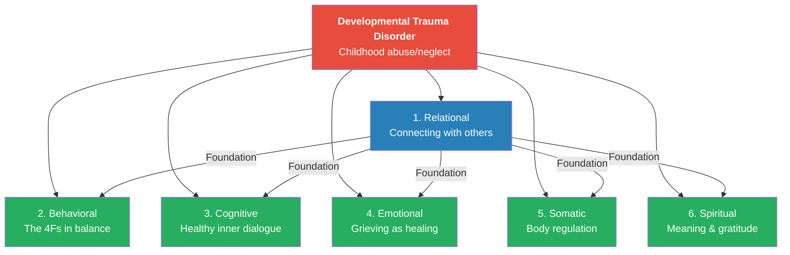
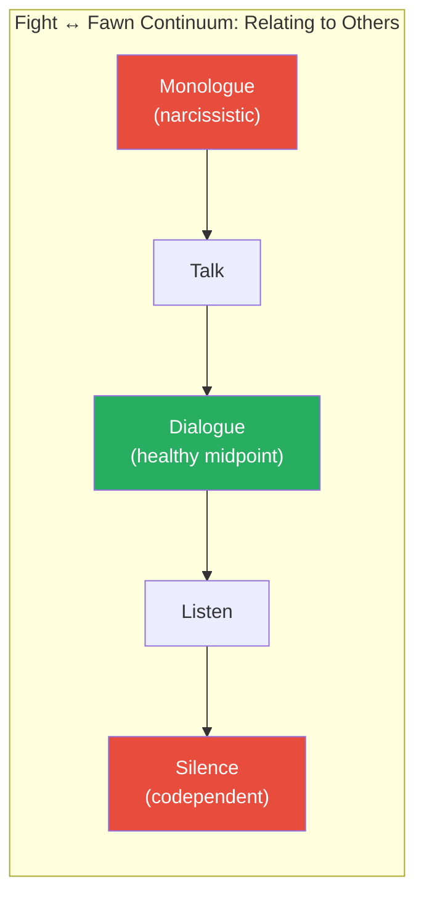
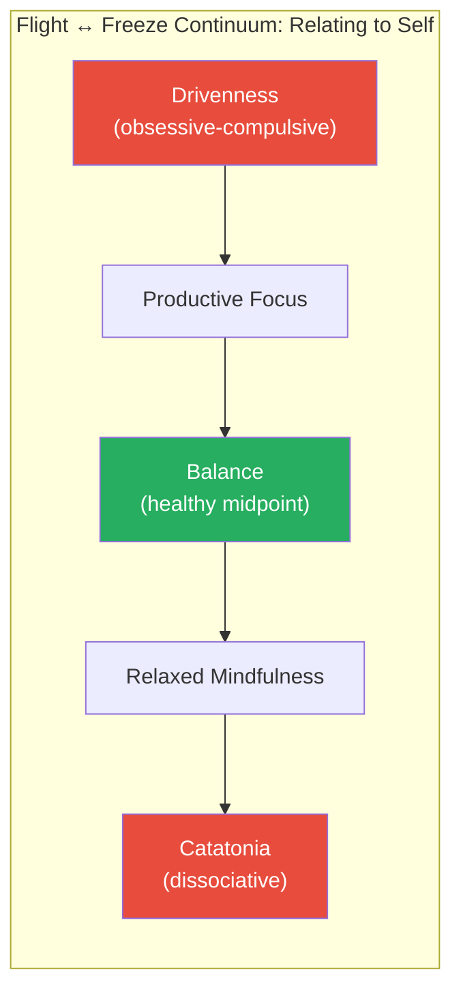
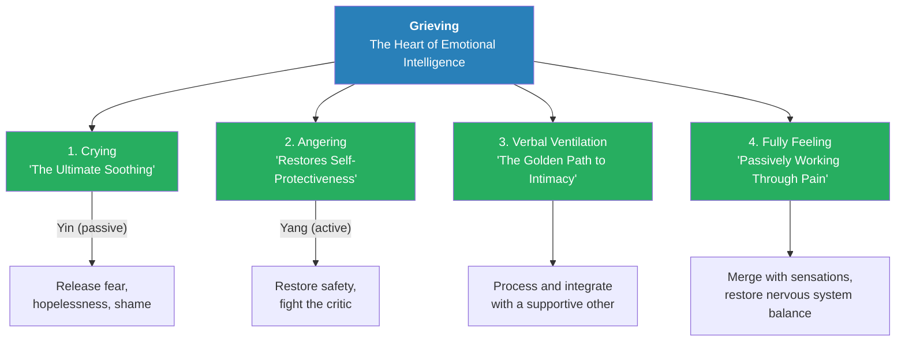
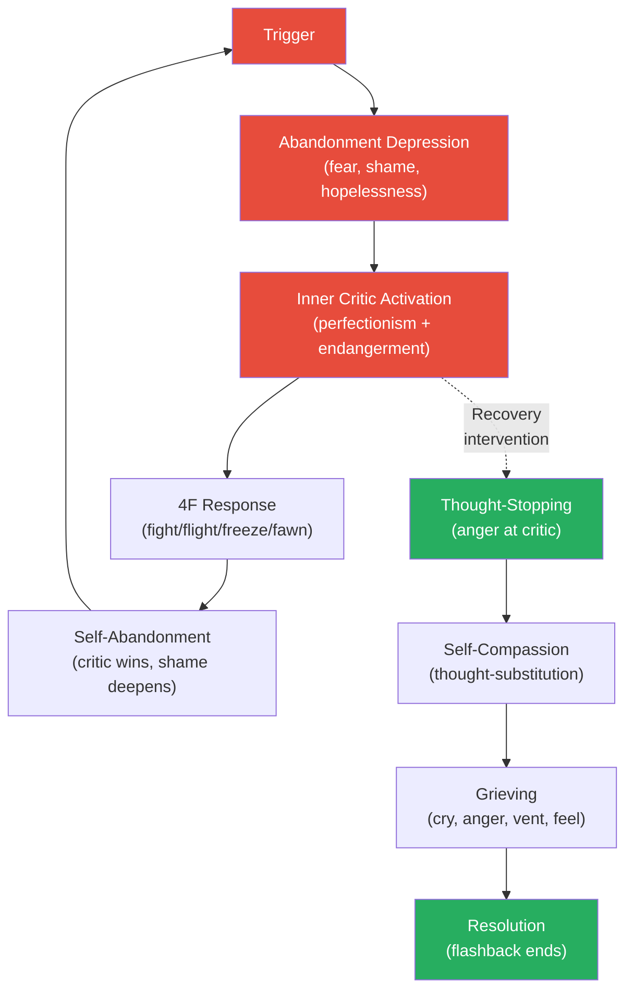

# Holistically Treating Complex PTSD — Pete Walker

> *This is the clinical companion and expanded sequel to [[Complex PTSD - Pete Walker|Complex PTSD: From Surviving to Thriving]]. Where the first book asked "What happened to you?", this one asks "How do we systematically repair the damage across every dimension of your development?" Walker introduces a six-dimensional model of developmental arrest — Relational, Behavioral, Cognitive, Emotional, Somatic, and Spiritual — and argues that effective treatment must address all six, not just one or two. The book expands every major framework from the original: the 4F types now include detailed hybrid profiles, the inner critic attacks are catalogued into 14 named patterns, a revolutionary technique called Vulnerable Self-Disclosure transforms the therapeutic relationship, and a sharp critique of "Therapy-Lite" approaches makes the case that brief CBT-only therapy actively harms CPTSD survivors. If the first book was the map, this is the therapist's field manual — and a self-helper's deeper guide to understanding why recovery demands patience, grief, and the courage to feel everything.*

---

## About the Author

*Pete Walker, MA, MFT, is a licensed psychotherapist in California with over forty years of clinical experience treating Complex PTSD survivors. He writes from a rare dual perspective — as both a clinician and a lifelong CPTSD survivor who was emotionally, verbally, and physically abused by both parents. His first book, Complex PTSD: From Surviving to Thriving, has sold over 300,000 copies in twenty-three languages solely through word of mouth, with over 10,000 five-star reviews on Amazon. Walker has received feedback from survivors in sixty-plus countries, and hundreds of therapists now use his work as a de facto clinical textbook. He is also the author of The Tao of Fully Feeling: Harvesting Forgiveness Out of Blame. Walker explicitly credits his own recovery journey, including thousands of hours of individual and group therapy, as the source of his model's depth and authenticity.*

---

## The Big Idea

Complex PTSD — which Walker now also calls <b style="color: #2980b9">Developmental Trauma Disorder (DTD)</b> — causes developmental arrests across <b style="color: #2980b9">six dimensions of innate human intelligence</b>: Relational, Behavioral, Cognitive, Emotional, Somatic, and Spiritual. The first book covered these dimensions implicitly; this sequel names them explicitly and insists that <b style="color: #27ae60">effective treatment must address all six holistically</b>. The foundation of all healing is relational — providing the survivor with their first <b style="color: #2980b9">earned secure attachment</b> through a safe therapeutic relationship. From that foundation, therapists can systematically awaken and develop each arrested intelligence. Walker's sharpest new argument: <b style="color: #e74c3c">most modern psychotherapy is "Therapy-Lite" — brief, CBT-only approaches that bypass childhood trauma, pathologise grief, and render treatment ineffective for CPTSD survivors</b>. Recovery is not an eight-session programme. It is a lifelong journey of progressively developing the six intelligences that were never allowed to grow.

---

## Key Concepts at a Glance

| Concept | Definition |
|---------|-----------|
| **Six-Dimensional Model** | CPTSD arrests development across six intelligences: Relational, Behavioral, Cognitive, Emotional, Somatic, Spiritual — all must be treated |
| **Developmental Trauma Disorder (DTD)** | Van der Kolk's proposed diagnostic name emphasising CPTSD's childhood developmental origins |
| **Earned Secure Attachment** | The survivor's first safe, consistent, caring relationship — often with a therapist — that becomes the template for all self-support |
| **Vulnerable Self-Disclosure (VSD)** | Therapist shares own vulnerability to model healthy relating and awaken repressed instincts in the survivor |
| **4F Trauma Hybrids** | Most survivors are not pure types but hybrids — Fight-Fawn, Freeze-Fawn, Flight-Freeze — each with distinct patterns |
| **Fight ↔ Fawn Continuum** | Healthy relating exists on a spectrum between assertiveness (fight) and cooperation (fawn) — not at either extreme |
| **Flight ↔ Freeze Continuum** | Healthy self-relating exists on a spectrum between productivity (flight) and rest (freeze) — balance is the goal |
| **14 Inner Critic Attacks** | Named patterns of self-destructive thinking that the traumagenic Superego uses to destroy self-esteem |
| **Four Processes of Grieving** | Crying, angering, verbal ventilation, and fully feeling — all four must be recovered for emotional intelligence |
| **Therapy-Lite** | Walker's term for brief, CBT-only approaches that bypass childhood trauma and harm CPTSD survivors |
| **Commiseration** | The instinctive attachment process of supportively sharing suffering — the foundation of real intimacy |
| **Emotional Perfectionism** | The toxic cultural mandate to be happy all the time — the enemy of authentic relating and grief work |
| **Emergency Step** | Step 8(a) of the 13 Steps — using anger to combat the inner critic as a rapid flashback intervention |
| **Therapeutic Narrative** | The co-created story of a survivor's trauma and recovery that evolves to become self-compassionate and coherent |

---

## At a Glance

- **What's New:** The six-dimensional model, expanded 4F hybrids (especially fawn hybrids), 14 named inner critic attacks, Vulnerable Self-Disclosure (VSD), critique of Therapy-Lite, four grieving processes, and the Emergency Step
- **The Framework:** CPTSD = developmental arrests across six intelligences, all caused by the absence of secure attachment in childhood
- **The Foundation:** Recovery begins with earned secure attachment — a safe relationship that proves not all humans are dangerous
- **The Method:** Holistic repair across all six dimensions, anchored in relational psychotherapy that models authentic vulnerability
- **The Target Audience:** Written for therapists but accessible to informed self-helpers — a clinical companion to the first book

---

## What's New Compared to the First Book

*Before diving into the full summary, here is a clear map of what this sequel adds to [[Complex PTSD - Pete Walker|the original]]. If you have read the first book, these are the sections that justify reading the second.*

- The first book named five recovery dimensions informally — this one **formalises six** and insists they are all equally necessary
- The 4F types were sketched in the first book — here they are **expanded with detailed hybrid profiles**, especially the fawn hybrids that the first book barely mentioned
- The inner critic had a chapter in the first book — here it gets **14 named attack patterns** with specific counter-responses for each
- The first book briefly mentioned self-disclosure — this one devotes an entire chapter to **Vulnerable Self-Disclosure (VSD)** as a revolutionary clinical technique
- The first book was a self-help guide — this one is a **therapist's manual** that also critiques the mental health establishment's failure to treat CPTSD effectively
- The 13 Steps are refined and now include the **Emergency Step**
- Grieving is expanded from a general recommendation to **four specific, named processes** with clinical guidance for each
- The concept of **"Developmental Trauma Disorder"** is formally adopted as an alternative diagnostic label

---

## The Six-Dimensional Model

*Walker's central innovation in this sequel is giving structure and name to what the first book only implied — that CPTSD damages six distinct dimensions of human intelligence, and that treating fewer than all six leaves recovery incomplete.*

*The relational dimension is the foundation — without a safe relationship, the other five intelligences cannot be awakened. Every arrow flows from relational repair outward.*

### The Six Intelligences Defined

- <b style="color: #2980b9">Relational Intelligence</b> naturally desires comforting social interactions and evolves toward intimacy with safe others
  - Untraumatized children develop empathy, dialogicality, reciprocal support, and authentic vulnerability
  - In CPTSD, this intelligence is the most profoundly arrested — survivors distrust all humans and relate from a distant, defensive position
  - Repairing relational intelligence is the foundation for all other recovery
- <b style="color: #2980b9">Behavioral Intelligence</b> naturally desires balance on two levels:
  - Socialising in ways that balance one's own needs with those of others (the Fight ↔ Fawn continuum)
  - Engaging life in ways that balance productivity with rest (the Flight ↔ Freeze continuum)
  - In CPTSD, survivors are locked into one narrow 4F response — their behavioral repertoire shrinks to a single defensive strategy
- <b style="color: #2980b9">Cognitive Intelligence</b> naturally supports, protects, and cares for the individual's well-being
  - Promotes development of a healthy Ego — the user-friendly manager of the psyche
  - In CPTSD, the Ego is hijacked by the virulent inner critic, which generates 14 patterns of self-attack
  - Recovery requires shrinking the critic and building a self-supportive executive function
- <b style="color: #2980b9">Emotional Intelligence</b> naturally unfolds as finding value in all emotional experiences
  - Releases pain through four instinctive grieving processes: crying, angering, verbal ventilation, fully feeling
  - In CPTSD, one or more of these processes is blocked — survivors cannot release accumulated childhood pain
  - Recovery restores the full grieving capacity and with it, self-compassion and self-protectiveness
- <b style="color: #2980b9">Somatic Intelligence</b> develops into maintaining physical health and balancing the autonomic nervous system
  - The sympathetic system handles danger (hypervigilance, armouring, adrenaline)
  - The parasympathetic system handles recovery (rest, relaxation, sleep)
  - In CPTSD, survivors are stuck in chronic sympathetic hyperarousal with no access to parasympathetic rest
- <b style="color: #2980b9">Spiritual Intelligence</b> increasingly manifests gratitude for the gift of being alive
  - Naturally evolves toward meaning, wonder, and a sense that life is a treasure
  - In CPTSD, spiritual intelligence is crushed by depression, pessimism, and the critic's message that life is pointless

> [!tip] Core Insight
> The relational dimension is the foundation of all the others. Until a survivor experiences a reparative relationship — with a therapist, a partner, or another helper — they cannot develop self-compassion, and without self-compassion, none of the other five intelligences can awaken.

### Developmental Trauma Disorder — The Name CPTSD Deserves

- Walker formally adopts Bessel van der Kolk's proposed diagnostic label: <b style="color: #2980b9">Developmental Trauma Disorder (DTD)</b>
- The name emphasises what "CPTSD" obscures — that this condition is rooted in childhood developmental arrests, not in a single traumatic event
- Van der Kolk attempted to get DTD accepted into the DSM but was rejected by "powerful special interests" — the pharmaceutical and insurance industries that benefit from brief therapy plus medication
- CPTSD is listed as F43.10 in ICD-11, the global diagnostic standard — accepted in every country except the United States
- Walker uses "DTD/CPTSD" throughout the book to highlight the developmental nature of the wound
- The practical implication: treatment must address developmental arrests, not just symptom management
- Brief therapy that targets anxiety or depression without addressing the underlying developmental damage is treating the fever while ignoring the infection

### The Etiology of DTD/CPTSD

Walker identifies the specific parenting behaviours that create developmental trauma when they occur regularly over time:

- Scapegoating, intimidating, and toxically shaming children to make them easier to control
- **Only noticing children in negative ways** — perhaps the most insidious form of abuse because it is invisible to outsiders
- Combining negative-noticing with humiliating and painful punishments
- Using abuse to vent parental life frustrations onto defenseless targets
- Hoarding all time and energy for themselves through narcissistic entitlement, grossly neglecting duties of care
- Reserving affection for pets, other people's children, or the one "Golden Child" — who often becomes narcissistic themselves
- Creating double-binds and no-win situations: "Do as I say, not as I do"
- <b style="color: #e74c3c">Ongoing neglect alone is a common cause of DTD/CPTSD</b> — whether relational, verbal, emotional, or spiritual neglect
- Children victimised in these ways become highly anxious, shame-bound, and despairingly depressed
- They unconsciously embrace a <b style="color: #2980b9">salvation fantasy</b> — the belief that becoming perfect will make them safe and lovable
- When perfection proves impossible (as it always does), they increasingly adopt a self-punishing relationship with themselves

> [!example] The Mealtime Courtroom
> - One of Walker's clients described family mealtimes as "a courtroom, where anything I said could and would be used against me"
> - This perfectly captures how verbal abuse mutes children — every word becomes potential evidence for the prosecution
> - The result: "Which is why I find it difficult to express myself" — decades later, the courtroom still operates inside the survivor's psyche
> **The lesson:** Verbal abuse does not just hurt in the moment. It installs a permanent surveillance system in the child's mind — the inner critic — that continues the prosecution long after the parents are gone.

### The Eight Key Impairments of DTD/CPTSD

Walker identifies eight defining handicaps that distinguish CPTSD from simple PTSD and explain why it requires longer, more comprehensive treatment:

| # | Impairment | What It Means |
|---|-----------|--------------|
| 1 | Developmental arrests in six dimensions | Relational, Behavioral, Cognitive, Emotional, Somatic, Spiritual intelligence all stalled |
| 2 | Emotional flashbacks | Sudden regressions to childhood terror, shame, and helplessness — without visual component |
| 3 | Attachment disorder | No model for safe connection; lifelong distrust of others and self |
| 4 | Toxic shame | Obliterating sense of being worthless, ugly, and fatally flawed |
| 5 | Virulent inner critic | Internalised voice of abusive parents using 14 attack programmes |
| 6 | Destroyed self-esteem | Self-compassion and self-protectiveness punished out of existence in childhood |
| 7 | 4F confinement | Trapped in a single narrow behavioral defence — narcissistic, obsessive-compulsive, dissociative, or codependent |
| 8 | Grave somatic imbalances | Chronic sympathetic hyperarousal, somatisation, and physiological deterioration |

### The Abandonment Melange — Revisited

- Walker expands on the concept from the first book: the <b style="color: #2980b9">abandonment melange</b> is the agonising mixture of fear, toxic shame, and depression that characterises the core emotional flashback
- It is the emotional residue of the child's original abandonment — not a single memory, but a condensed state of all the times the child felt utterly alone and unsafe
- The melange has three interlocking components:
  - **Fear** — the hyperarousal of the sympathetic nervous system, manifesting as anxiety, panic, and hypervigilance
  - **Toxic shame** — the obliterating sense of being worthless and defective, manifesting as self-hate and social withdrawal
  - **Depression** — the abandonment depression itself, manifesting as helplessness, hopelessness, and despair
- These three components create sub-cycles of reactivity:
  - External ↔ Internal: survivors oscillate between blaming the world and blaming themselves
  - Perfectionism ↔ Endangerment: the critic alternates between "you're not good enough" and "something terrible will happen"
  - Helplessness ↔ Hopelessness: feeling unable to act alternates with feeling that action is pointless
- <b style="color: #e74c3c">Dissociation layers over the entire cycle</b> — survivors may not even be aware they are in a flashback because dissociation numbs the pain into background noise

---

## Earned Secure Attachment — The Foundation of All Recovery

*Walker's most emphatic argument in this book is that relational repair must come first — before cognitive techniques, before body work, before spiritual practices. Without a safe relationship, nothing else takes root.*

- <b style="color: #27ae60">"Not having a secure attachment as a child is one of the worst things, if not the worst, that can happen to a human being"</b>
- Children raised without unconditional love never develop a supportive relationship with anyone — especially themselves
- They navigate all relating from a distant, defensive position, shutting down vulnerability whenever they most need connection
- The automatic response to hide becomes so ingrained that untreated survivors close up and isolate precisely when they need empathy, support, and comfort
- <b style="color: #e74c3c">This wound is rarely healed alone</b> — the defensive shutdown of vulnerability in relationship is too deeply ingrained for solitary cognitive work to overcome
- The first step in recovery is experiencing an "earned secure attachment" — a relationship where the survivor is consistently welcomed in all states: afraid or confident, happy or depressed, succeeding or failing

### What Earned Secure Attachment Looks Like in Therapy

Walker identifies five key relational goals that build the essential ambience of trust:

**First — Provide the First Safe Relationship:**
- The therapist aspires to provide what is often the survivor's first experience of consistently safe, supportive, and comforting connection
- This requires genuine warmth, not clinical neutrality — survivors can detect inauthenticity instantly
- The therapist must welcome the survivor in all states of their experience: afraid or confident, happy or depressed, succeeding or failing
- They are not attacked, shamed, or abandoned for being less than perfect

**Second — Shrink the Critic and Toxic Shame:**
- The therapeutic work identifies, shrinks, and deconstructs the virulent inner critic and the toxic shame that block true intimacy
- This requires the therapist to actively notice when the client is trapped in a critic attack — silence is complicity
- <b style="color: #e74c3c">Therapists who fail to contest clients' self-diatribes, or worse, laugh along with defensive self-deprecating jokes, are complicit with keeping the internalised abuser alive</b>

**Third — Awaken Self-Compassion and Self-Protectiveness:**
- The therapist guides survivors to develop their arrested healthy Ego
- This means frequently modelling and encouraging self-compassion, self-protectiveness, and holistic self-caring
- Inner self-protection must be practiced frequently inside and outside of sessions
- The survivor gradually develops an internal "good parent" voice to counter the critic

**Fourth — Model Intimacy-Building Processes:**
- The therapist practises with the client: empathy, authentic vulnerability, dialogicality, commiseration, mutuality, compassion, protectiveness, and collaborative rapport-repair
- These are not just therapeutic techniques — they are the building blocks of all healthy relationships
- Collaborative rapport-repair is especially important: when ruptures occur in the therapeutic relationship, they are repaired together, modelling that conflict need not end in abandonment

**Fifth — Break Repetition Compulsion:**
- The therapist helps the survivor become aware of their unconscious attraction to relationships that duplicate childhood abuse
- Freud first identified this as "repetition compulsion" — the drive to recreate the dynamics of the original trauma
- Once survivors see this pattern, they can begin to identify abusive and neglectful behaviours in current relationships
- This often means reducing or ending contact with still-abusive family members — a terrifying but necessary step

### Therapist Heal Thyself

*One of Walker's most provocative arguments in this book is directed at therapists themselves.*

- Therapists with unresolved attachment disorders cannot effectively treat CPTSD
- <b style="color: #e74c3c">Few training programmes require therapists to undergo their own therapy</b> — Walker states this fact knowing it astonishes lay people
- Many programmes contain little or no emphasis on understanding the influence of childhood on behaviour
- Untreated therapist-survivors are prone to "reparenting" clients with the same dysfunctional style they experienced
- Walker has heard too many accounts of therapists shaming, manipulating, and controlling clients in ways typical of dysfunctional parents
- He recommends that survivors choose therapists who have worked extensively on their own childhood issues
- Therapised therapists are usually willing to attest to their own recovery work — it is fair and wise for potential clients to ask
- Walker believes a high percentage of therapists entered the profession because of an unconscious desire to work through the fact that they had no one as children to go to for support
- Many were parentified — forced into a role-reversal of giving support to a parent without receiving any in return
- This pattern then repeats in therapy: the therapist provides empathy but cannot model authentic vulnerability because they have never experienced it themselves

> [!example] Walker's Own Flashback (Vignette)
> - Walker describes the first emotional flashback he could identify, though he could not name it until years later
> - He was living with his first serious partner when she unexpectedly started screaming at him
> - Her yelling felt like "a fierce hot wind" — his life force being extinguished, "like a candle flame being blown out"
> - He felt disoriented, unable to speak or think, terrified, shaky, and very small
> - He managed to stagger to the door and slowly pulled himself together outside
> - It took him ten years to understand this as an emotional flashback to the hundreds of times his mother blasted him with homicidal rage
> **The lesson:** Emotional flashbacks are invisible to the untrained eye — they have no visual component, which makes them agonisingly difficult to identify and name without psychoeducation.

---

## Vulnerable Self-Disclosure (VSD)

*This is Walker's most revolutionary new contribution — a technique that challenges traditional therapeutic boundaries by having the therapist share their own vulnerability to model healthy relating.*

- Traditional therapy maintains strict emotional distance between therapist and client
- Walker argues this is counterproductive for CPTSD survivors who need to see vulnerability modelled — not just discussed
- <b style="color: #2980b9">Vulnerable Self-Disclosure (VSD)</b> = the therapist shares their own emotional experiences, recovery struggles, and human imperfections to demonstrate that vulnerability is safe
- VSD awakens four repressed instincts in survivors:
  1. **Self-compassion** — seeing the therapist's self-compassion teaches survivors that being kind to oneself is possible
  2. **Self-protectiveness** — seeing the therapist set boundaries models healthy self-protection
  3. **Openness to empathy** — experiencing the therapist's authentic emotion teaches survivors that empathy is real and safe
  4. **Mutuality and commiseration** — seeing the therapist as a fellow human, not an authority figure, opens the door to reciprocal support

### How VSD Works in Practice

- The therapist shares a relevant personal experience — a time they felt afraid, ashamed, or helpless — and how they worked through it
- This is not unboundaried sharing: it is carefully chosen, brief, and always in service of the client's recovery
- The survivor watches the therapist be vulnerable and survive — this challenges their core belief that vulnerability is always punished
- Over time, the survivor begins to experiment with their own vulnerability in the safety of the session
- VSD is especially powerful for fawn types, who have spent their lives being the listener — seeing the therapist be vulnerable reverses the role and gives them permission to be seen

### Guidelines for Ethical VSD

- VSD is not the therapist dumping their problems on the client
- Disclosure must serve the client's recovery — never the therapist's emotional needs
- Sharing should be brief, relevant, and modelling a specific skill (self-compassion, boundary-setting, grief)
- The therapist must have done their own recovery work — <b style="color: #e74c3c">untreated therapist-survivors cannot model what they have not experienced</b>
- VSD works because it de-shames the survivor — they see that even their helper has struggled, and that struggling does not make someone defective
- It must not be used narcissistically — some therapists use self-disclosure to make sessions about themselves
- Safeguards are listed in Chapter 3 to ensure ethical use

### Commiseration — The Lost Art of Shared Suffering

- <b style="color: #2980b9">Commiseration</b> is Walker's term for the age-old, instinctive attachment process by which human beings supportively cry and kvetch together to digest their suffering
- It is not complaining or wallowing — it is the mutual sharing of pain that deepens connection
- Walker argues commiseration is being systematically destroyed by toxic positivity and emotional perfectionism
- In a healthy relationship, commiseration looks like: "I had a terrible day too. Tell me about yours. Let's sit with this together."
- For CPTSD survivors, experiencing commiseration for the first time — having someone say "That is terrible, and I feel for you" — can be the most healing moment of their lives
- VSD operationalises commiseration in the therapeutic relationship
- It then becomes the template for commiseration in the survivor's other relationships

> [!tip] Core Insight
> Commiseration — the age-old instinctive process of supportively crying and complaining together to digest suffering — is the foundation of the most profound intimacy. Western culture is systematically destroying it by demanding that everyone be happy all the time.

> [!example] Walker's Airport Crying Strategy
> - In early recovery, Walker spent long frustrating periods aching for the relief he knew crying would bring, but his tears would not come
> - He discovered that visiting the airport helped — watching other people's joyfully tearful reunions often moved him to tears
> - A therapist friend who shared this longing for tears became so desperate that he squeezed onion juice into his eyes — he tried this once and "heartily warned" Walker against it
> - Walker shares these anecdotes with clients as an example of VSD — normalising the frustration of reclaiming the ability to cry
> **The lesson:** VSD in action: by sharing his own humbling, imperfect struggle to cry, Walker de-shames clients who face the same frustration. They see that even their therapist once stood at airport terminals hoping for vicarious tears.

---

## The Critique of Therapy-Lite

*Walker's sharpest and most provocative argument. He charges the modern mental health establishment with systematically failing CPTSD survivors.*

- <b style="color: #e74c3c">"The Therapy-Lite Mental Health Cartel Eviscerates Modern Psychotherapy"</b> — Walker's actual section heading
- The dominant paradigm is brief CBT-only therapy: "cured in 8 sessions or get medicated"
- This approach is catastrophically wrong for CPTSD because:
  - It ignores childhood origins of symptoms
  - It pathologises grief and painful emotions rather than facilitating their healthy expression
  - It pushes emotional perfectionism — the toxic mandate to "choose happiness"
  - It treats symptoms (anxiety, depression) without addressing the six developmental arrests that cause them
  - It forces therapists to bypass the relational trust-building that CPTSD survivors desperately need
- When the eight-session course expires without results, survivors are referred to psychiatrists for lifelong medication
- Their inner critics then blame them for failing to benefit from therapy — toxic shame skyrockets
- Many survivors permanently give up on therapy, believing themselves to be unfixable

### The Scarcity of Good-Enough Therapists

- Walker laments that the mental health system produces few therapists capable of treating CPTSD effectively
- Training programmes rarely teach about childhood trauma, attachment theory, or the developmental origins of adult pathology
- The dominant paradigm is "an over-simplistic, cognitive-behavioral approach that is only helpful in a limited way"
- This perspective "over-focuses on the present and future, and often actively spurns the notion that an examination of the past can have any value"
- The result: a generation of therapists who treat the symptoms of CPTSD (anxiety, depression) without addressing its cause (childhood developmental trauma)
- Walker also identifies a specific subset: therapists who bypass childhood trauma work because they have not done their own
  - These therapists unconsciously replicate the emotional neglect of the survivor's childhood
  - They provide technical interventions without the relational warmth that is the actual medicine

### The Salvation Fantasy in Therapy

- Walker warns against <b style="color: #2980b9">the Salvation Fantasy</b> — the false hope that a quick fix, a single technique, or a perfect therapist will heal complex developmental trauma
- Common salvation fantasies include:
  - "If I just find the right medication, I'll be cured"
  - "EMDR / Mindfulness / CBT will fix me in a few sessions"
  - "If I just forgive my parents, the pain will stop"
  - "If I just find the right partner, I'll finally feel loved"
- Each of these bypasses the reality that CPTSD is a developmental disorder requiring long-term, multi-dimensional treatment
- Recovery is not an event — it is a lifelong process of progressively developing arrested intelligences
- "Two steps forward, one step back" is the realistic pace of genuine recovery
- Therapists who promise fast results are feeding the survivor's salvation fantasy rather than treating their actual condition
- Walker insists this is not pessimism — it is honesty that ultimately serves survivors better than false hope

### Cultural Emotional Ignorance

- Walker argues that Daniel Goleman's 1995 book Emotional Intelligence has been catastrophically misused
- It has been weaponised to conflate emotional health with mandatory happiness and perpetual loving-kindness
- Many employers now require service industry workers to "constantly radiate happy and loving feelings" — what Walker calls "emotional slavery"
  - This is the same emotional slavery that narcissistic parents and partners require of codependent children and mates
  - Merve Emre's 2021 New Yorker article "The Politics of Feeling" further critiques this dynamic
- "Don't worry, be happy" has become a cultural mandate that destroys authentic vulnerability
- Many CBT approaches enshrine forgiveness, gratitude, and indefatigable love as salvation fantasies
  - These are wonderful virtues when genuine — but not when used to force survivors into forgiving people who are still abusive
  - The advice to "just choose your feelings" makes a mockery of Mindfulness, which is an ancient meditation approach of accepting ALL inner experience
- This <b style="color: #2980b9">toxic positivity</b> blocks CPTSD recovery by urging survivors to forget the past and blindly forgive abuse
- True emotional intelligence means accepting all feelings — including sadness, anger, fear, depression, and blame
- <b style="color: #e74c3c">Feigning inauthentic love and joy creates anxiety and destroys real intimacy</b>
- Walker coined the term <b style="color: #2980b9">ambivilating</b> to describe the normal experience of vacillating between opposing emotional polarities
  - Ambivalence has been wrongly conflated with dislike — it actually means shifting between liking and disliking
  - It is emotionally intelligent to accept that we sometimes vacillate between liking and disliking a relationship, a job, an activity
  - Therapists empower survivors by normalising ambivalence rather than pathologising it
  - The cultural demand for emotional certainty ("Do you love your partner or not?") is another form of emotional perfectionism
- Walker's deepest concern: "Compassion for self and others is becoming an endangered affect. Healthy grieving is increasingly treated as a weakness, and being happy all the time is typically conflated with emotional intelligence"

> [!example] "Why Won't I Just Choose to Be Happy?"
> - Walker recounts a pattern he sees with new clients arriving after failed brief therapy
> - They tell him some version of: "Why won't I just simply choose to be happy like my last therapist insisted I could? How F'ed up is that?!"
> - Their previous therapists applied CBT techniques without addressing childhood trauma
> - When the techniques failed, the survivors blamed themselves — their inner critics weaponised the failure
> - Many had been referred for medication and given up on therapy entirely
> **The lesson:** Telling a CPTSD survivor to "choose happiness" is like telling a person with a broken leg to choose walking. The developmental damage must be treated first.

---

## The 4F Types — Expanded

*The 4F framework from the first book is preserved but significantly expanded. The most important additions are the hybrid types and the two continuums that define healthy functioning.*

### The Four Defences

| Type | Defence | Core Belief | Behavioural Pattern | Attachment Strategy |
|------|---------|-------------|--------------------|--------------------|
| **Fight** | Narcissistic-Offensive | Power creates safety | Contempt, control, intimidation, entitlement | Alienates others via anger and domination |
| **Flight** | Obsessive-Compulsive | Busyness creates safety | Workaholism, drivenness, perpetual planning | Avoids intimacy by being too busy for it |
| **Freeze** | Dissociative | Solitude creates safety | Withdrawal, numbing, fantasy, screen addiction | Hides from all social interaction |
| **Fawn** | Codependent | Usefulness creates safety | People-pleasing, listening defence, self-erasure | Hides behind helpful persona, never asks for anything |

---

### The Fight Type — Expanded

*Origins and mechanics:*

- Fight types are driven by the belief that power and control can create safety, assuage abandonment, and secure love
- Two common childhood origins:
  - Children of checked-out, passive parents who never set limits — the child learns that tantrums and intimidation get results
  - Children who model themselves on a bullying parent and discover that intimidating siblings makes them easy to control
- They respond to abandonment feelings with anger and contempt — transmuting vulnerability into aggression
- They intimidate and shame others into obeying them and mirroring them as extensions of themselves
- Especially devolved fight types may become sociopathic — including "conscienceless and compassionless CEOs, corrupt politicians, and exploitive religious leaders"
- Walker compares certain narcissists to "spoiled, temper-tantruming toddlers" — Donald Trump is named as an example

*Treatment challenges:*

- Fight types are the least likely to collaborate and own their side in a mis-attunement
- Many cannot bear the idea of losing the power that bullying gives them
- Sociopaths and most Narcissistic Personality Disorders are widely considered untreatable
- Less extreme fight types can sometimes be reached by psychoeducating them about the price of subjugation: <b style="color: #e74c3c">intimacy-starvation</b>
- The downward spiral: excessive power → fearful withdrawal in the other → more abandonment → more rage → more distance → destroyed intimacy
- Unlike other 4F types, fight types seem to bypass their inner critic entirely — they project perfectionist judgments outward through an **outer critic** that harshly judges everyone else
- Recovery requires them to notice and renounce the habit of instantly morphing abandonment feelings into rage

> [!example] The Narcissist Who Destroyed His Marriage (Vignette)
> - Early in Walker's career, he worked with a fight-type man
> - Walker provided fifty minutes of uninterrupted listening — standard therapeutic practice
> - This uninterrupted listening became the client's new norm — his expectation in all relationships
> - His minimal capacity to listen to his wife evaporated entirely
> - Walker received a devastating recorded message from the wife: therapy was making her husband even more insufferable
> - Years later, Walker learned the wife eventually used his increased self-centeredness as the final straw to leave him
> - The lesson for Walker: therapists who are fawn types themselves may hide in a listening defence, failing to nudge fight-type clients toward dialogicality
> **The lesson:** Therapy can actually worsen narcissistic traits if the therapist provides unlimited listening without requiring reciprocal dialogue. Fight types need to be challenged, not just heard.

---

### The Flight Type — Expanded

- Flight types are "adreno-philiac" — feeling energetic is their preferred mode of being
- They relentlessly flee inner pain via the distorted flight of constant busyness
- As children, they may range from the driven "A" student to the ADHD dropout running amok
- As adults, they are either doing or worrying and planning about what to do next
- Driven by the unconscious belief that busyness will perfect them and make them safe and lovable
- Many become addicted to adrenalisation — recklessly pursuing dangerous activities to keep their adrenaline high
- Susceptible to stimulating substance addictions and active process addictions: workaholism, busyholism, sex and love addiction
- Walker identifies <b style="color: #2980b9">Pseudo-Cyclothymia</b> — flight types who appear bipolar but are actually cycling between critic-driven exhaustion and collapse:
  - Drive themselves to extreme exhaustion → collapse into abandonment depression → recoup energy → launch back into drivenness → repeat
  - This is not bipolar disorder — it is an inner-critic-induced cycle

*Treatment focus:*

- Flight types particularly benefit from psychoeducation about perfectionism and the inner critic
- They need to develop a "mental and physical gearbox" — the ability to engage life at various speeds, including neutral
- One-to-five-minute timeout meditations help identify and deconstruct habitual "running"
- Guided self-inquiry: "What hurt am I running from right now? What type of self-soothing can I give myself?"
- Crying is an unparalleled tool for diminishing the fear and anxiety that drives their obsessive critic

---

### The Freeze Type — Expanded

- Even more than other types, freeze types equate people with danger
- Often the most profoundly abandoned child — "the lost child" — who received no or minimal interaction
- Their transmission is stuck in "park" — retreat, hide, isolate
- Unable to successfully employ fight, flight, or fawn responses, their defences developed around right-brain dissociation
- They seek refuge in prolonged sleep, daydreaming, wishing, TV, computer-surfing, and video games
- Many master the art of changing the internal channel whenever experience becomes uncomfortable
- The freeze response is on a continuum that can devolve into the <b style="color: #2980b9">collapse response</b> — extreme abandonment of consciousness, like prey animals about to be killed
  - The collapse response may release endorphins — internal opioids that numb the pain
  - This opioid production makes freeze types prone to sedating-substance addictions
- When especially isolated and untreated, freeze types can devolve into extreme depression and decompensation

*Treatment challenges — three reasons freeze types are difficult to treat:*

1. Their non-traumatising relational experiences are few or none — they are extremely reluctant to participate in therapy and may spook easily and terminate
2. Like fight types, they are unconscious of their fear and resist the notion of having a virulent inner critic — they turn its judgments into an outer critic that justifies avoiding the world (unlike fight types, who use it to justify controlling others)
3. Like workaholic flight types with drivenness, freeze types display stubborn denial about the life-spoiling consequences of their reclusiveness

---

### The Fawn Type — Expanded

- Fawn types seek safety and belonging by merging with the wishes, needs, and demands of others
- They act as if the price of admission to any relationship is to be ever-helpful and never need anything
- Often born with genuine gifts of empathy and caring — tragically, these gifts make them prime targets for exploitation
- The individual chosen for the fawn role is often the family's "Golden Goose" — all their energy is consumed by narcissistic caretakers with nothing left for their own growth
- They develop a <b style="color: #2980b9">listening defence</b> as a life raft: by becoming the listener, they avoid the danger of expressing themselves
- They fail to develop an egoic centre of self-protectiveness, self-caring, and self-compassion
- Fawn types are usually the children of at least one narcissistic parent who pressed them into service
- They have the most social skills of the four types — but their relating is entirely selfless and undiscriminating
- Narcissistic fight types "salivate when they meet them, intuitively knowing that they can turn them into slavish extensions of themselves"

*Treatment focus:*

- Fawn types respond especially well to the 6D model and psychoeducation
- They need continuous encouragement to talk about themselves — they easily devolve into guilt and fear when expressing opinions
- Therapists must notice and resist fawn clients' attempts to reverse the therapeutic roles by over-listening and eliciting the therapist's story
- Key goals: nurturing self-expression, psychoeducating about needs and rights, guiding assertion and boundary-setting
- Theodore Rubin's The Angry Book is recommended to help fawn types create a narrative of how anger was trained out of them
- Role plays of fighting off the bullying critic help fawn types practise standing up for themselves — first in their inner world, then in the outer world

### The Four Continuums from Healthy to Harmful

Walker presents each 4F response as existing on a continuum — the healthy version on the left, the traumatic distortion on the right:

- **Fight:** Assertiveness ←→ Bullying
- **Flight:** Relaxed Productivity ←→ Drivenness
- **Freeze:** Peacefulness ←→ Catatonia
- **Fawn:** Mutuality ←→ Servitude

> [!tip] Core Insight
> Recovery does not mean eliminating any of the 4F responses. It means developing fluid access to the healthy side of ALL four, and learning to move appropriately along each continuum depending on the situation.

---

### The 4F Hybrids (NEW)

*This is a major expansion from the first book. Walker now recognises that most survivors are hybrids — they have a primary 4F response supplemented by a secondary one, while the other two remain inaccessible.*

#### Fawn Hybrids

Walker identifies three fawn hybrid subtypes:

| Hybrid | Pattern | Example |
|--------|---------|---------|
| **Fawn-Fight** | Coercive caretaking; "smothering mother" | Manipulatively takes care of others, smothers them into conformity with how she thinks they should be |
| **Fawn-Flight** | Workaholically making oneself useful | The "model" secretary, the super-nurse — always in service, exhausting themselves for others |
| **Fawn-Freeze** | Numbing surrender to exploitation | The "classic" domestic violence victim who freezes and submits to a narcissist's scapegoating |

#### Other Key Hybrids

**The Fight-Fawn Hybrid:**
- Perhaps the most relational hybrid and most susceptible to sex and/or love addiction
- Combines two opposite polarities: narcissism and codependence
- In flashback, experiences panicky abandonment that generates desperation for love
- Dramatically splits between fighting/clawing for love (fight) and cunningly grovelling for it (fawn)
- Seen in some borderline types and many "charming narcissists"
- Differs from fawn-fight: in fight-fawn, the narcissistic defence is more dominant
- Also seen as the charismatically sweet person at work who bullies their spouse and children at home
- Walker invokes Richard Burton and Elizabeth Taylor in Who's Afraid of Virginia Woolf as a cinematic example

**The Fawn-Fight Hybrid:**
- Distinct from the fight-fawn: here, the codependent defence is typically in ascendancy
- This is the "super-nice" person who intermittently blows up from accumulated frustration of being too giving
- The explosion mortifies them, driving them guiltily back into extended periods of over-accommodating fawning
- The fawning accumulates more frustration, which eventually erupts again — ad infinitum
- The cycle: fawn → accumulate resentment → explode → guilt → more fawning → repeat
- This differs from the fight-fawn borderlines who more regularly and dramatically vacillate between narcissism and codependence

**The Flight-Freeze Hybrid:**
- <b style="color: #e74c3c">The least relational and most schizoid hybrid</b>
- These types may go entire days without speaking to anyone
- Avoid relating via an obsessive-compulsive/dissociative two-step:
  - Hyper-focus on work for long, super-productive hours (flight mode)
  - Flip the dissociative switch into vegging out on the couch in front of a screen (freeze mode)
  - The switch often requires a substance — a joint, a drink, a sedative
- More common among men traumatised for being vulnerable in childhood
- Also installed or exacerbated by "slave-like conditions of the modern white-collar workplace"
- A less narrow version: "intimacy-lite" relationships marked by minimal conversation and interaction
- Computer addicts who vacillate between workaholic IT work and marathon dissociative game-playing are classic examples
- Many sex addicts combine flight and freeze: obsessively pursuing sex (flight) then drifting into pornographic fantasy (freeze)
- Sadly, many of these hybrids are more engaged with internal images of idealised fantasy partners than with their actual partners during real-time interaction

### Dialogicality and the 4Fs

*Each 4F type has a different arrested capacity for dialogue — therapists must understand these differences to be effective.*

- <b style="color: #2980b9">Dialogicality</b> = the ability to communicate in a balanced, reciprocal, mutually responsive way
- Arrested dialogicality typically stems from severe childhood abandonment — many survivors are "dying to be heard"
- Each type presents differently:
  - **Fight types** enter therapy habituated to holding court — their "talking defence" dodges dialogical intimacy endlessly with monologue
    - Therapy is counter-productive if therapists provide unlimited listening without challenging this pattern
    - Fight types must learn that authenticity does not mean lacerating others with their outer critic
  - **Flight types** seem dialogical at first but flounder in obsessive perseverations about superficial worries
    - Therapists must steer them into deeper, feeling-based concerns
    - Without such guidance, their talking is a left-brain dissociation from repressed pain
  - **Freeze types** learned early to seek safety in the camouflage of silence
    - They need a long period of patient encouragement to discover and verbalise inner concerns
    - They can easily get lost in superficial free associations — welcomed at first, but eventually redirected
  - **Fawn types** use their "listening defence" as a life raft — they may lure therapists into doing all the talking
    - Their "eliciting defence" may invoke careless therapists into narcissistically monologuing
    - Therapists must resist being fawned and redirect the conversation back to the client

> [!example] The Fawn Type's Epiphany
> - Walker describes a pattern he has witnessed numerous times with fawn-type clients
> - As therapy progresses, the client attempts to say "No" to someone for the first time
> - They are shocked to discover that even the thought of saying "No" triggers an intense emotional flashback
> - Walker asks: "Is there any part of you that is mad about being programmed in this way?"
> - Many respond with versions of: "I'm so mad! My parents had no right to intimidate me like that! I'm ready now to do those exercises of angering at my critic — and at my inner parents!"
> - This moment — the first spark of healthy anger — is often the breakthrough that unlocks fawn-type recovery
> **The lesson:** For fawn types, the discovery that their inability to set boundaries is a trauma response (not a character flaw) is often the most liberating moment in their recovery.

---

### The Two Continuums of Healthy Functioning

*This is Walker's most elegant new framework — two spectrums that define what balanced, recovered functioning actually looks like.*

*Healthy relating occurs at the midpoint — dialogue. Fight types are stuck at the monologue end; fawn types are stuck at the silence end. Recovery means learning to move fluidly along the entire spectrum.*

*Healthy self-relating means fluid movement between doing and being, persisting and letting go, sympathetic and parasympathetic activation. Flight types are stuck in drivenness; freeze types are stuck in catatonia.*

- <b style="color: #27ae60">Recovery means learning to move fluidly along BOTH continuums</b> instead of being stuck at one extreme
- The Fight ↔ Fawn continuum governs how you relate to others:
  - Balance between assertiveness and cooperation
  - Between talking and listening
  - Between leading and following
  - Between helping and being helped
- The Flight ↔ Freeze continuum governs how you relate to yourself:
  - Balance between doing and being
  - Between intense focus and relaxed mindfulness
  - Between sympathetic and parasympathetic nervous system activation
  - Between persistence and letting go

---

## The 14 Inner Critic Attacks

*The first book introduced the inner critic and its two programmes — perfectionism and endangerment. This sequel names 14 specific attack patterns and provides counter-responses for each.*

- The critic runs two master programmes:
  1. <b style="color: #e74c3c">Perfectionism</b> — "You're not good enough" — relentless negative self-noticing that finds fault with everything
  2. <b style="color: #e74c3c">Endangerment</b> — "Something terrible will happen" — catastrophising about dire consequences of imperfection
- These two programmes interlock in a vicious cycle: perfectionism triggers shame, which triggers endangerment, which triggers more perfectionism
- The critic was installed by traumatising parents who used negative-noticing, punishment, and abandonment to scare children into compliance
- It is the distorted Superego — the healthy conscience perverted into a tyrannical punisher

### The 14 Attack Patterns

#### Perfectionism Attacks (1-9)

| # | Attack | What the Critic Says | The Counter-Response |
|---|--------|---------------------|---------------------|
| 1 | **Perfectionism** | "If I just stop screwing up, maybe they'll love me" | Perfection is not humanly possible. Mistakes do not make me a mistake. Every mishap is an opportunity to love myself where I have never been loved |
| 2 | **All-or-None Thinking** | "I always screw up / Nothing ever works" | I reject extreme descriptions. One negative event is not a never-ending pattern. "Always" and "never" are grossly inaccurate |
| 3 | **Self-Hate & Toxic Shame** | "I am worthless and disgusting" | I am on my side. I turn shame back into blame and redirect it at the critic and anyone who shames my normal feelings |
| 4 | **Micromanagement / Worrying / Obsessing** | "What if... what if... what if..." | I will not repetitively examine details. I cannot make the future perfectly safe. I accept that my efforts sometimes bring results and sometimes do not |
| 5 | **Unfair Comparisons** | "Everyone else has it together" | I refuse to compare my insides to their outsides. In a society that pressures happiness, I accept the normalcy of sometimes feeling bad |
| 6 | **Guilt** | "I should feel terrible about this" | Feeling guilty does not mean I am guilty. I refuse to make decisions from guilt. Guilt is sometimes camouflaged fear |
| 7 | **"Shoulding"** | "I should be doing more / I should be better" | I substitute "want to" for "should" and only follow if it genuinely feels like I want to |
| 8 | **Over-Productivity** | "I haven't done enough today" | I am a human being, not a human doing. I am more productive when I balance work with play and relaxation |
| 9 | **Harsh Self-Judgement** | "I'm an idiot / I'm pathetic" | I refuse to let the bullies of my early life win by joining them. I will not displace blame onto myself or non-bullying others |

#### Endangerment Attacks (10-14)

| # | Attack | What the Critic Says | The Counter-Response |
|---|--------|---------------------|---------------------|
| 10 | **Catastrophising** | "This pain means I'm dying / Everything is falling apart" | I feel afraid but I am not in danger. No more home-made horror movies. I am increasingly experiencing safety |
| 11 | **Negative Focus** | "Something is wrong with me / Something is wrong with everything" | I renounce dwelling on what might be wrong. Right now I notice my accomplishments, talents, and life's gifts |
| 12 | **Time Urgency** | "I must rush / There's no time" | I am not in danger. I do not need to rush. I am learning to enjoy activities at a relaxed pace |
| 13 | **Disabling Performance Anxiety** | "I can't do this / Everyone will judge me" | I will not accept unfair criticism. Even when afraid, I will defend myself. I won't let fear make my decisions |
| 14 | **Perseverating About Attack** | "Everyone is judging me / Someone will hurt me" | Unless there are clear signs of danger, I thought-stop projection of past bullies onto others. Most humans are peaceful |

### The Two-Step Counter-Attack Process

Walker's method for fighting the critic combines two complementary strategies:

1. <b style="color: #27ae60">Thought-Stopping (anger-based)</b> — using healthy anger to interrupt the critic mid-attack
   - "NO! I refuse to listen to this!"
   - Channel the energy of self-attack into saying NO to unfair inner-critic attacks
   - This is the active, aggressive defence — the "fight" response deployed inward
2. <b style="color: #27ae60">Thought-Substitution (compassion-based)</b> — replacing the critic's messages with memorised positive truths
   - Use the counter-responses from the table above
   - Practice positive self-noticing: "I am good enough. I have these qualities and accomplishments..."
   - This is the nurturing, soothing defence — the "fawn" response deployed toward oneself

> [!example] The Therapist Who Denied Her Critic (Vignette)
> - One survivor-therapist Walker worked with repeatedly denied the existence of her inner critic for more than two years
> - Then she visited home and was shown a video of herself as a toddler
> - In the video, she toddled around touching various things, and each time slapped the back of her own hand very hard and angrily quipped: "Bad Girl, Don't Touch!"
> - Months of liberating work followed as she increasingly noticed how often she still metaphorically slapped and scolded herself
> - The breakthrough came when she felt outraged that all her relatives had laughed uproariously at the video when first showing it to her
> - She angrily and triumphantly exclaimed: "Damn them! They should have been crying for me, not laughing like it was a great joke!"
> **The lesson:** The inner critic can be so deeply internalised that survivors — even therapist-survivors — cannot see it. The first step is always recognition.

---

## The 13 Steps for Managing Emotional Flashbacks (Refined)

*These are refined from the first book and remain Walker's single most practically useful contribution. Thousands of survivors have reported immediate relief from using them.*

| Step | Bold Instruction (use during active flashback) | Expanded Guidance |
|------|-----------------------------------------------|------------------|
| 1 | **"I am having a flashback"** | Name it. Flashbacks take you into a timeless part of your psyche. The feelings are past memories that cannot hurt you now |
| 2 | **"I feel afraid but I am not in danger"** | You are in the safety of the present, far from the danger of the past |
| 3 | **Own your right to have boundaries** | You do not have to allow anyone to mistreat you. You are free to leave dangerous situations |
| 4 | **Speak reassuringly to the inner child** | Tell them you love them unconditionally and they can come to you for comfort and protection |
| 5 | **Deconstruct eternity thinking** | In childhood, fear felt endless. Remember the flashback will pass as it has many times before |
| 6 | **Remind yourself you are in an adult body** | You have allies, skills, and resources you never had as a child. Feeling small is a sign of flashback |
| 7 | **Ease back into your body** | (a) Relax major muscle groups (b) Breathe deeply and slowly (c) Slow down (d) Find a safe place to soothe yourself (e) Feel the fear without reacting |
| 8 | **Resist the inner critic** | **(a) Thought-stopping:** Channel anger into saying NO to critic attacks **(b) Thought-substitution:** Replace negative thinking with memorised qualities and accomplishments |
| 9 | **Allow yourself to grieve** | Flashbacks are opportunities to release old feelings. Healthy grieving turns tears into self-compassion and anger into self-protectiveness |
| 10 | **Cultivate safe relationships and seek support** | Don't let shame isolate you. Educate intimates about flashbacks and ask for help talking through them |
| 11 | **Identify your triggers** | Avoid unsafe people, places, activities. Practice preventive maintenance when triggers are unavoidable |
| 12 | **Figure out what you're flashing back to** | Flashbacks are opportunities to discover, validate, and heal past wounds. They point to unmet developmental needs |
| 13 | **Be patient with slow recovery** | It takes time to become un-adrenalised. Real recovery is gradual — two steps forward, one step back. Refuse to beat yourself up for having a flashback |

### The Emergency Step (NEW)

- As survivors become proficient at angering at the critic, they can often **jump straight to Step 8(a)** whenever they recognise a flashback
- Many survivors report that <b style="color: #27ae60">the more intensely they use anger to rescue themselves from the critic, the more quickly the flashback abates</b>
- Step 8(a) is one of the few tools that can offer a relatively quick intervention when lost in the abandonment melange
- This works because the inner critic is usually the key trigger sustaining the flashback — cut the critic, and the flashback loses its fuel supply
- Walker emphasises this is not a "fast fix" salvation fantasy — it only works after extensive practice with all 13 steps

---

## The Four Processes of Grieving

*The first book mentioned grieving generally. This sequel devotes an entire chapter to four specific, named processes and provides clinical guidance for developing each one.*

*All four processes must be recovered for full emotional intelligence. Most survivors have one or more blocked. Crying and angering are complementary — the yin and yang of grieving.*

### 1. Crying: The Ultimate Soothing

- Crying is the yin (passive) complement to the yang (active) of angering
- Together they are our ultimate means of releasing emotional and somatic pain
- When hurt, we instinctively feel sad AND mad — seen in the newborn's angry howling at birth
- <b style="color: #27ae60">Crying is an irreplaceable tool for cutting off the inner critic's fuel supply of fear</b>
  - The critic poisons the psyche with fear-driven messages
  - Crying releases fear before it devolves into frightened thinking
  - Sometimes crying is the only process that will resolve a flashback
- Crying stimulates the parasympathetic nervous system's relaxation response
  - Releases the hyperarousal that overwhelms survivors in flashbacks
  - Physical relief accompanies emotional release
- Crying awakens self-compassion — when the first person in your life welcomes your tears, your instinct for self-kindness begins to reawaken
- Many cultures shame crying, especially in men — "Boys don't cry" is a devastating piece of emotional neglect

> [!example] The Cancer Patient's Tears
> - A former client wrote to Walker about an experience during cancer hospitalisation
> - She was consumed with fear and felt on the verge of a nervous breakdown
> - At her most hopeless moment, Walker's words about crying came back to her
> - "A deluge of tears teemed out of me. It scared me at first, but I soon started feeling this amazing sense of relief"
> - Three years later: "Many tears later, not to mention a fair bit of barking at my loser-parents and at God for assigning them to me — I seem to be well and truly in the clear"
> **The lesson:** Crying is not weakness. It is the body's most powerful mechanism for discharging fear and restoring a sense of safety.

### 2. Angering: Restoring Self-Protectiveness

- Angering is the active, yang complement to the passive yin of crying
- Walker uses the gerund "angering" to describe the process of actively expressing anger in safe and healthy ways
- <b style="color: #e74c3c">The taboo against anger is the most destructive emotional suppression in Western culture</b>
- Alice Miller described how anger is killed in childhood: "If clients had been able as children to express their disappointment with their parents — to experience their rage — they could have stayed alive. But that would have led to the loss of their love, and that, for a child, is the same as death."
- Angering in CPTSD recovery serves three functions:
  1. **Releases accumulated childhood pain** — the stored, unexpressed protests about parental injustices
  2. **Fights the inner critic** — anger is the primary weapon for thought-stopping critic attacks
  3. **Rescues from helplessness** — transforms the childlike feeling of powerlessness into adult self-protectiveness
- Many survivors are unconscious of their buried anger despite a simmering furnace inside
  - Denied direct release, stored anger smoulders as chronic anxiety, irritability, cynicism, and self-hatred
  - Periodically it flares as hostile words and actions that destroy potential intimacy
  - Without recovered anger, survivors remain stuck in the misery of letting the inner critic's venomous blame trigger toxic shame

*The destructive Not-So-Merry-Go-Round:*

- When anger is blocked, it builds up in a cycle Walker calls the <b style="color: #2980b9">Repression/Accumulation/Explosion/Guilt</b> cycle
- Anger is repressed → it accumulates silently → it eventually explodes inappropriately → guilt drives more repression → the cycle repeats
- This is especially common in fawn types who never learned to express anger at all
- Breaking this cycle requires learning to express anger in small, healthy doses rather than storing it until it detonates

*Gender socialisation damages angering capacity:*

- Boys are shamed for crying, so men use anger to carry ALL emotional expression
  - Their unexpressed sadness morphs into a morose mood or "the aggravated whining that Donald Trump seems addicted to"
- Girls are shamed for angering, so women use tears to carry ALL emotional expression
  - Their unexpressed anger morphs into a petulant mood or sulky lamenting
- Both patterns provide minimal release because half of fully emoting is blocked
- There are reverse examples in all genders, and many survivors in whom BOTH angering and crying are blocked

*How to anger safely:*

- <b style="color: #27ae60">Angering can be expressed therapeutically in ways that hurt no one</b>
  - Safely alone: punching pillows, vocalising anger, writing angry letters never sent
  - With a validating witness: the therapist or trusted friend
  - Silently in the psyche: thought-stopping the critic 24/7
- Once angering becomes egosyntonic, most angering is best done silently — critic attacks come at any time, and frequent practice is needed to build effective thought-stopping shields
- Angering also empowers the myriad thought-corrections and perspective-substitutions needed to establish internal safety and worthiness

> [!example] Walker's Son and Healthy Grieving (Vignette)
> - Walker's six-year-old son was learning to accept healthy rules and limits
> - He periodically grieved the necessary loss of the narcissistic entitlement that was his normal right in early childhood
> - Never having been shamed for emoting, he effectively mourned the end of what Freud called "His Majesty the Baby"
> - One day, climbing the stairs after being told to do homework before playing, he bawled a flurry of angry condemnations: "I don't like you, Daddy! You're not fair. I'm not going to be your friend"
> - Walker was amazed to feel gratitude for his son's healthy grieving — his own restored ability to welcome grief allowed him to hold the anger calmly
> - By the top of the stairs, the boy opened the door and genuinely laughed: "Daddy, look! Pikachu fell off the table! Daddy can we play Pokemon after I practice writing my letters?"
> - Walker was delighted: "Yes! Of course! I love Pokemon!"
> - Grieving had almost instantly delivered the child from painful loss into eager anticipation of what is fun about life
> **The lesson:** This is what healthy grieving looks like — anger and tears freely expressed, fully witnessed, and quickly metabolised. CPTSD survivors were denied this process in childhood. Recovery means learning it now.

### 3. Verbal Ventilation: The Golden Path to Intimacy

- Verbal ventilation = speaking from your feelings in a way that releases and resolves emotional pain
- Walker calls it "the golden path to intimacy" because it simultaneously heals the speaker and deepens the relationship with the listener
- Combines thinking and feeling simultaneously — words coloured with the emotional spectrum
- Theoretical basis: verbal ventilation activates both left-brain (cognitive) and right-brain (emotional) processing simultaneously, integrating what has been dissociated
- Survivors need to learn to verbally vent about difficulties and disappointments — a skill their families never taught
- <b style="color: #e74c3c">Dissociation deadens verbal ventilation</b> — survivors who are numb or intellectualising are not truly ventilating
  - Left-brain dissociation: the survivor talks about feelings without feeling them — intellectualising the pain
  - Right-brain dissociation: the survivor zones out during conversation, present in body but absent in mind
  - Both forms prevent verbal ventilation from doing its healing work
- Best practiced with a supportive other, but can also be done alone through journaling or speaking aloud

*How verbal ventilation heals abandonment:*

- Feeling safe enough to express anything and everything eventually feels natural and healing
- Survivors begin to seek such experiences with others outside therapy
- Therapy often comes to a natural conclusion when authentic self-expression becomes available in at least one other intimate relationship
- The depth of one's ability to be there for an intimate generally depends on the depth of their capacity for unwavering self-allegiance
- Verbal ventilation is the bridge between emotional recovery and relational recovery — it is where the inner and outer work converge

*The "No-Talk" rule and verbal neglect:*

- Many survivors were raised with an implicit rule: "Children should be seen and not heard"
- Emotionally neglecting parents model silence, avoid conversation, and discourage questions
- This silence installs the inner critic's censorship: "You're boring! Who cares what you think! When you talk, you sound stupid!"
- Over time, the "you" in those phrases shifts to "I" — "I'm boring... I'm stupid... I should just keep my mouth shut!"
- Recovery requires resuscitating the verbal self-expression that was crushed in childhood
- Many survivors require long-term therapy before they achieve uncensored, authentic speech — the time required reflects the degree to which early self-expression was thwarted

### 4. Fully Feeling: Passively Working Through Pain

- The fourth grieving process: merging with the sensations of emotional pain and simply feeling them through
- No crying, no angering, no talking — just sitting with the pain and allowing the body to process it
- Often overlaps with somatic mindfulness (Chapter 9)
- The sensation is allowed to intensify, be fully experienced, and then gradually dissolve
- This process restores autonomic nervous system balance
- It is the most passive and contemplative of the four processes — the "being" counterpart to the "doing" of the other three
- Walker provides guided mindfulness scripts for this process:
  - "Focus your full attention on any sensations in the area of your belly or heart..."
  - "Breathe slowly, deeply... bring all your attention to your visceral sensations..."
  - "Visceral sensations are often physical links to feelings... hold your attention on them and increasingly feel them..."
  - "As you hold your awareness on a sensation, it may intensify and well up strongly enough to be emoted... or it may gradually dissolve and fade as you feel through it..."
- The emotional-somatic connection is key: unworked-through psychological pain often morphs into physical pain through somatisation
- When physical pain is consciously sensed and fully felt, survivors can merge with it and grieve it out
- This process is especially helpful for survivors whose other grieving channels are blocked — it requires no words, no tears, and no anger, just the willingness to be present with sensation

### Balancing Feeling and Emoting

- Walker identifies a crucial balance between the active processes (crying, angering, verbal venting) and the passive process (fully feeling)
- Too much active emoting without grounding in sensation leads to emotional flooding
- Too much passive feeling without active release leads to stagnation and numbness
- The goal is fluidity — the ability to shift between all four processes as the moment requires
- Some flashbacks call for tears; others call for anger; others call for talking it out; others call for simply sitting with the sensation until it passes
- <b style="color: #27ae60">Survivors who develop all four capacities have a complete toolkit for managing any emotional state</b>

> [!tip] Core Insight
> Most survivors have at least one of these four processes blocked. Full emotional intelligence requires all four. The goal is not to choose one — it is to develop the capacity to cry, anger, verbally vent, AND fully feel, and to shift between them as the moment requires.

### The Five Barriers to Emotional Recovery

Walker identifies five childhood-installed dynamics that still impair survivors' emotional development. Therapists must help survivors comprehend, recognise, challenge, and deconstruct each one:

| # | Barrier | How It Blocks Recovery |
|---|---------|----------------------|
| 1 | **Chronic Anxiety** | CPTSD is fundamentally an anxiety disorder — survivors are stuck in perpetual fear and social anxiety/phobia, relating from an unconscious belief that everyone is dangerous |
| 2 | **Virulent Inner Critic** | Continuously persecutes with contempt (anger + disgust), using perfectionism and endangerment to disable with fear and toxic shame |
| 3 | **Toxic Shame** | The tiniest miscue triggers feelings of being worthless, ugly, pitiful, and abhorrent — even when alone. The critic can generate shame without any external trigger |
| 4 | **Emotional Perfectionism** | The culturally reinforced mandate to be happy all the time — every less-than-happy feeling becomes evidence of being fatally flawed |
| 5 | **Repetition Compulsion** | The unconscious drive to gravitate toward people who emotionally punish, abandon, and manipulate — accepting toxic shaming because they believe abuse is the price of belonging |

- Helping survivors grieve the pain these five barriers created — and still create — is key to remedying them
- The process: anger and cry and verbally vent about these travesties installed in childhood
- <b style="color: #27ae60">"When human beings are hurt, part of them feels mad and part of them feels sad. Allowing them to cry and be mad releases the terrible anxiety that comes from suppressing their pain."</b>

### Emotional Abuse and Emotional Neglect — The Twin Destroyers

*Walker distinguishes between emotional abuse (active destruction) and emotional neglect (passive destruction). Both create DTD/CPTSD, and both require treatment.*

**Emotional Abuse includes:**

- Rageaholic behaviour — terrorising and toxically shaming children with contempt (rage + disgust)
- Contempt is spewed through: highly charged tone of voice, demeaning verbalisations, intimidating facial expressions and body language
- Emotional incest — parentifying children to meet caretakers' needs for love, comforting, empathy, mirroring, emotional dumping, and in worst cases, sex
  - Prolonged emotional incest locks survivors into concretised codependence and repetition compulsion
  - It sets them up to accept severe exploitation, including domestic violence
- Contemptuous shaming of emotional expression: "Boys don't cry," "Nice girls don't get mad," "Stop feeling sorry for yourself," "God never gives you more than you can handle," "Turn the other cheek"
  - The last of these is used to lock domestic violence survivors into accepting ongoing abuse

**Emotional Neglect includes:**

- <b style="color: #e74c3c">Emotional neglect alone often causes DTD/CPTSD</b> — no active abuse is required
- Parents who show no interest in understanding their children or hearing about their experiences
- Zero receptivity to feelings, no validation of healthy anger, no empathy for hurts, no apology for injustices
- No shared humour or joy — some parents cannot bear it when their children are happier than they are
- Failing to radiate warmth, caring, and acceptance — the basic ingredients of secure attachment
- Ignoring infants' angry crying — their only means of communicating needs — extinguishing emotional expression before conscious memory even forms
- The result: children whose emotional expression was killed so early that adult survivors have no memory of ever being able to feel freely

---

## Healing the Relationship with Yourself

*Chapters 4 and 5 of the book address the most intimate relationship a CPTSD survivor must repair — the one with themselves. This is where the relational work of Chapters 2-3 turns inward.*

### Trauma-Blocked Self-Compassion and Self-Protectiveness

- Children are born with two crucial instincts: the instinct to feel compassion for themselves when hurt, and the instinct to protest unfair treatment
- "No!" and "That's not fair!" are favourite words in childhood — until these self-protective instincts are punished and shamed out of existence
- Traumatising parents extinguish self-compassion by punishing children for crying when hurt: "Shut up or I'll give you something to really cry about!"
- They extinguish self-protectiveness by punishing children for protesting unfairness: rage, contempt, or abandonment follow any expression of anger
- When these essential instincts are destroyed, children lose the ability to both comfort and defend themselves
- <b style="color: #e74c3c">They are set up by repetition compulsion to accept exploitation in every subsequent relationship</b>
- Without self-compassion: they cannot soothe themselves in pain, so they rely on substances, dissociation, or codependent caretaking
- Without self-protectiveness: they cannot set boundaries, so they attract and accept narcissistic exploitation
- Reviving these two instincts is the central therapeutic task — everything else depends on it

### Therapeutic Angering — Fighting the Critic from Within

- Walker's central technique for healing self-relationship is using healthy anger against the inner critic
- The critic is the internalised voice of abusive parents — fighting it is fighting them
- Survivors must learn to redirect toxic shame back to its source: "This shame belongs to my parents, not to me"
- The process has two phases:
  1. **Awaken anger** — recognise that the critic's attacks are unjust, and feel mad about it
  2. **Use anger protectively** — channel that anger into thought-stopping critic attacks, 24/7
- This gradually builds the "self-protective function of the developmentally arrested Ego"
- Over time, the Ego grows strong enough to be a reliable self-supportive ally

*Differentiating healthy angering from abusive angering:*

- Healthy anger is directed at the critic, at past abusers (in imagination), or at current boundary violations
- It does not involve screaming at, intimidating, or controlling other people
- It is a private, internal act of defiance: "NO. I refuse to treat myself this way."
- The goal is not to become aggressive but to become protected — to build an internal shield against self-attack
- Many survivors are terrified of their own anger because they associate it with the explosive rage of their abusive parents
- Walker carefully distinguishes: the parents' rage was offensive — aimed at controlling others. The survivor's anger is defensive — aimed at protecting the self

*Adamant resistance to fighting the critic:*

- Some survivors are so identified with their critic that fighting it feels like fighting themselves
- They have internalised the abuser so completely that the critic IS their identity
- These survivors may need years of relational repair before they can even conceive of the critic as an enemy rather than the truth
- Therapists must be patient and persistent — challenging the critic prematurely can feel like another attack

> [!example] Catching the Critic More Quickly (Vignette)
> - Walker describes working with a client who initially could not recognise any inner critic activity
> - Over months of psychoeducation, the client began to notice critic attacks — but only hours or days after they occurred
> - Gradually, the recognition lag shortened: from days to hours, from hours to minutes
> - Eventually the client could catch the critic in real-time and respond with anger: "That's not true. I am not worthless. I refuse to accept that."
> - The frequency, intensity, and duration of emotional flashbacks decreased in direct proportion to the client's speed at recognising and fighting the critic
> **The lesson:** Fighting the critic is a skill that improves with practice. The first thousand repetitions are the hardest. Each one builds the neural pathway of self-protection.

### The Healthy Ego vs. the Virulent Critic

- Walker reframes Freud's Id/Ego/Superego model for CPTSD:
  - The <b style="color: #2980b9">Healthy Ego</b> is the user-friendly manager of the psyche — it guides pursuit of hopes, dreams, and goals
  - The <b style="color: #e74c3c">Virulent Critic</b> is the pathological distortion of the Superego — created by traumatising parents to control children
  - The critic develops earlier than the Ego and steals its "real estate" — leaving survivors rudderless
  - The <b style="color: #2980b9">Healthy Superego</b> is the conscience — it helps children learn fair, just relating
  - In CPTSD, the Superego becomes a tyrannical punisher rather than a fair guide
  - The <b style="color: #2980b9">Pathological Id</b> develops when neglectful parents fail to rein in selfish impulses — this creates clinical narcissism
- Walker cites the Australian band Skyhooks: "Ego is not a dirty word" — the term "egotistical" has wrongly come to mean narcissistic
- Narcissism is an Id problem, not an Ego problem — the narcissist has an overdeveloped Id and an underdeveloped Ego
- CPTSD survivors typically have the opposite problem: an overdeveloped critic (pathological Superego) and a starved, hibernating Ego
- Recovery = shrinking the critic to make room for the Ego to develop
- A fully restored Ego:
  - Kindly tames the Id's excessively selfish impulses
  - Progressively shrinks the toxic critic
  - Guides discovery of who the survivor truly is: talents, interests, opinions, needs, boundaries, goals
  - Becomes the balanced, user-friendly manager of the psyche
  - Is the core of every thriving person's fully individuated self

---

## Co-Creating a Therapeutic Narrative

*Walker argues that a survivor's level of recovery is directly reflected in the story they tell about their lives. A fragmented, shame-soaked narrative is a sign of ongoing trauma. A coherent, self-compassionate one is a sign of recovery.*

- A healthy therapeutic narrative is: complete, coherent, emotionally congruent, and told from a self-compassionate perspective
- The narrative typically evolves through stages:
  1. **Denial and minimisation** — "My childhood wasn't that bad. Lots of people had it worse."
  2. **Emerging awareness** — "Actually, some things were really wrong. I never felt safe."
  3. **Grief and anger** — "What they did to me was terrible. I have a right to be furious about it."
  4. **Self-compassion** — "I feel genuine sorrow for the child I was. None of it was my fault."
  5. **Integration** — "I understand my story. It is painful but coherent. I know who I am and where I am going."

*How therapists help build the narrative:*

- "Colouring in" the picture of how derelict parents truly were — providing the language survivors do not have
- Interpreting emotional flashbacks as direct messages from child-selves: "This flashback is your child-self telling you how terribly your parents rejected you"
- Connecting present symptoms to specific childhood traumas — "Your panic at being criticised at work is a flashback to your mother's rage"
- Challenging denial and minimisation gently and gradually — deconstructing the defence slowly to avoid retraumatisation
- The narrative becomes therapeutic when survivors genuinely feel compassion for the children they were
- This compassion then fuels their recovery work — they want to fight for that child
- Whenever toxic self-criticism appears in the narrative, the two-step process is invoked:
  - Step One: anger to contradict the critic
  - Step Two: positive self-noticing affirmations of worth

*Therapeutic flashbacks as growing pains:*

- Walker reframes flashbacks as potential silver linings — opportunities to practice flashback management
- A flashback becomes therapeutic when processing it enhances overall recovery
- Flashbacks in session often occur when therapists encourage survivors to name and practise their fundamental human rights
- As survivors work to develop their arrested self-expression, their attempts to be more vulnerable can trigger flashbacks — these are re-experiences of family attacks on their expressiveness
- With enough practice, these "growing pain" flashbacks diminish in intensity and eventually stop occurring

### Additional Resources for Recovery

Walker recommends several adjuncts to individual therapy:

- **Co-Counselling** — a structured practice where two people take turns being therapist and client for each other
  - Provides additional relational experience outside the therapy hour
  - Especially effective for survivors who need more practice with verbal ventilation
- **Self-Help Groups** — trauma-focused groups proliferating online
  - Sharing stories in a safe, supportive environment powerfully ameliorates toxic shame
  - Hearing others' recovery successes rekindles hopefulness
  - Being seen and heard by peers, not just a professional, deepens the experience of belonging
- **Self-Treatment** — Walker provides extensive tools for solo recovery work
  - The 13 Steps, the 14 counter-responses, the grieving processes, and the reparenting affirmations can all be practised alone
  - However, <b style="color: #e74c3c">self-treatment alone is rarely sufficient for attachment disorders</b> — the relational wound requires a relational cure
- **Bibliotherapy** — using books as therapeutic tools
  - Walker provides a reading list (List 7 in Chapter 12) of recommended books for each dimension of recovery
  - Many survivors report that reading Walker's first book was itself a form of therapy — feeling understood for the first time

---

## Somatic and Spiritual Repair

*These two dimensions receive their own chapters in the book. While less revolutionary than the relational and behavioral chapters, they complete the six-dimensional model.*

### Somatic Intelligence (Chapter 9)

*The body keeps score of childhood trauma in ways the conscious mind often cannot access.*

- CPTSD creates chronic sympathetic hyperarousal: hypervigilance, armouring, adrenalisation, insomnia, heightened cortisol levels, and relentless anxiety
- Survivors have almost no access to parasympathetic functions: rest, relaxation, bodily repair, restorative sleep
- Without treatment, many survivors are constantly aroused with no ability to "switch off"
- This causes <b style="color: #2980b9">somatisation</b> — the process by which unworked-through psychological and emotional pain morphs into painful physical symptoms
  - Chronic headaches, gastrointestinal problems, muscle tension, and autoimmune conditions are common
  - When this pain is consciously sensed and fully felt, survivors can merge with it and grieve it out

*Somatic Mindfulness:*

- <b style="color: #2980b9">Somatic Mindfulness</b> = guided awareness of bodily sensations that releases chronic tension
  - Softens the abandonment melange by releasing the physical component of emotional flashbacks
  - Can metabolise depression without cognitive intervention — sometimes the body needs to process what the mind cannot
  - Aids digestive issues — Walker identifies that hunger is often camouflaged depression
  - The practice: sit comfortably, breathe deeply, bring attention to visceral sensations, hold awareness on them, and allow feelings to surface or dissolve
- Self-support techniques for increasing somatic awareness:
  - Progressive muscle relaxation
  - Diaphragmatic breathing
  - Body scanning for tension
  - Sensate focusing — bringing attention to specific bodily sensations without judgment

*Key somatic insights:*

- Walker distinguishes between **depressed thinking** (cognitive) and **feeling depressed** (somatic)
  - Depressed thinking is the critic's domain — it can be fought cognitively
  - Feeling depressed is a bodily state — it requires somatic mindfulness to process
  - Somatic mindfulness can metabolise depression that cognitive techniques cannot reach
- Walker identifies <b style="color: #2980b9">Pseudo-Cyclothymia</b> — a pattern in flight types that mimics bipolar disorder:
  - Drive themselves to extreme exhaustion → collapse into abandonment depression → recoup energy → launch back into drivenness → repeat
  - This is inner-critic-driven, not a mood disorder
  - Recognising this pattern prevents misdiagnosis and inappropriate medication

---

### Spiritual Intelligence (Chapter 10)

*Walker takes a non-religious approach to spiritual development — this is about meaning, gratitude, and wonder, not dogma.*

- <b style="color: #2980b9">Spiritual Intelligence</b> = gratitude for being alive, meaning-making, enthusiasm for life, and a sense that life is a treasure
- Untraumatised children naturally develop spiritual intelligence — they experience wonder, awe, and a sense that life is good
- CPTSD crushes spiritual development through:
  - Chronic depression and the critic's message that life is pointless and will never improve
  - Pessimism installed by years of parental rejection — "life is suffering" becomes the default worldview
  - Spiritual abuse from fundamentalist religion — God as punitive parent, guilt as spiritual currency

*Spiritual abuse and neglect:*

- Spiritual abuse occurs when caretakers weaponise religion to control children
  - Walker offers specific reflections for survivors of fundamentalist Catholicism
  - Religion becomes another vehicle for toxic shame: "God knows how bad you are"
  - Some survivors need to grieve the loss of a spiritual life that was poisoned by abusive religion
- Spiritual neglect occurs when children are never taught wonder, gratitude, or meaning
  - They grow up in an emotional desert with no framework for understanding beauty, love, or purpose
  - Recovery includes reconnecting with the innate sense that life has value

*Recovery approach:*

- Grieving as spiritual practice — processing pain restores faith in life's worth
  - Each successful grieving experience proves that suffering is not permanent
  - Over time, survivors develop a lived understanding that pain passes and life continues to offer gifts
- Love as the foundation of spirituality — not dogma, but genuine caring connection
  - Real spirituality grows from intimacy with self and others
  - It cannot be forced or faked — it emerges naturally from relational repair
- <b style="color: #27ae60">Accepting the full spectrum of human experience as meaningful</b> — not just the pleasant parts
  - This is the spiritual dimension of emotional intelligence: finding value even in suffering
  - It is the opposite of toxic positivity, which demands that only positive experiences have worth
  - Walker identifies this acceptance as the ultimate destination of spiritual recovery

---

## The Journey of Recovery

*Chapter 11 provides a map of what recovery actually looks like over time.*

### Parental Abandonment Creates Self-Abandonment

- Walker traces a direct line from parental abandonment to the self-abandonment that plagues adult survivors:
  - Parents who chronically neglect and abuse → children who learn to neglect and abuse themselves
  - Parents who never notice children positively → adults who only notice themselves negatively
  - Parents who punish self-compassion → adults incapable of self-soothing
  - Parents who punish self-protectiveness → adults incapable of setting boundaries
- <b style="color: #27ae60">Recovery reverses this chain</b>: earned secure attachment teaches self-compassion → self-compassion enables self-protectiveness → self-protectiveness builds self-esteem → self-esteem enables intimate relationships → intimate relationships deepen self-compassion → the virtuous cycle continues

### Signs of Recovering

- Walker distinguishes between "surviving" and "thriving":
  - Surviving = managing symptoms, getting through the day, avoiding the worst flashbacks
  - Thriving = experiencing genuine intimacy, self-compassion, meaning, joy, and a sense of safety
- Recovery is accepted as a lifelong process — the goal is not to "arrive" but to keep developing
- <b style="color: #27ae60">"Two steps forward, one step back"</b> is the realistic pace — refuse to beat yourself up for setbacks
- Signs of progress include:
  - Flashbacks decrease in frequency, intensity, and duration
  - The inner critic shrinks and is more quickly identified and resisted
  - Self-compassion becomes habitual rather than effortful
  - Healthy anger becomes accessible for self-protection
  - Crying becomes available as a release mechanism
  - Relationships deepen — authentic vulnerability replaces defensive posturing
  - The four grieving processes become natural and egosyntonic
  - The survivor develops fluid access to all four 4F responses
  - The therapeutic narrative becomes coherent and self-compassionate
  - Life begins to feel like a gift rather than an ordeal

### Silver Linings and Optimal Stress

- Walker acknowledges that recovery brings unexpected gifts:
  - Survivors who do the work often develop emotional intelligence that exceeds that of people from healthy families
  - The skills they build — self-awareness, empathy, resilience, ability to sit with pain — become genuine strengths
  - Many become extraordinarily effective therapists, helpers, and friends because of their hard-won understanding of suffering
- He introduces the concept of <b style="color: #2980b9">optimal stress</b> — a level of challenge that promotes growth without overwhelming the survivor
  - Too little stress: stagnation, comfort zone, no development
  - Too much stress: retraumatisation, flashback spirals, collapse
  - Optimal stress: just enough challenge to practise new skills without triggering full regression
  - Therapists help by calibrating the pace of recovery to keep survivors in the optimal stress zone

### The Self-Abandoning Stages and Cycles of Reactivity

Walker provides a detailed map of how emotional flashbacks unfold as a cycle, and how recovery interrupts that cycle at progressively earlier stages.

**The Vicious Cycle (without recovery skills):**

1. **Trigger** — an external event or internal thought activates the abandonment melange
2. **Abandonment Depression** — fear, shame, and hopelessness flood the psyche
3. **Inner Critic Activation** — the critic weaponises the depression with perfectionism ("this is your fault") and endangerment ("something terrible will happen")
4. **4F Response** — the survivor retreats into their habitual defence (fight/flight/freeze/fawn)
5. **Self-Abandonment** — the critic wins, shame deepens, and the survivor further abandons themselves
6. **Return to Trigger** — the self-abandonment itself becomes a new trigger, and the cycle repeats

*The vicious cycle of reactivity (red path) can be interrupted at the inner critic stage by the recovery intervention (green path). With practice, the recovery path becomes more automatic and the vicious cycle weakens.*

**The Layers of Dissociation:**

- Dissociation overlays every stage of the cycle — survivors may not even know they are in a flashback
- Left-brain dissociation: intellectualising, obsessing, worrying (common in flight types)
- Right-brain dissociation: spacing out, numbing, fantasy (common in freeze types)
- Both forms prevent the survivor from accessing the emotional content that needs to be grieved
- Therapists must help survivors recognise when they are dissociating and gently bring them back to their feelings

**Sub-Cycles within the main cycle:**

- **External ↔ Internal:** oscillating between blaming the world (outer critic) and blaming self (inner critic)
- **Perfectionism ↔ Endangerment:** alternating between "I'm not good enough" and "Something terrible will happen"
- **Helplessness ↔ Hopelessness:** feeling unable to act vs. feeling that action is pointless
- Each sub-cycle amplifies the others, creating a multi-layered trap of suffering
- Recovery works by interrupting any one of these sub-cycles — each interruption weakens the entire system

---

## Practical Recovery Lists

*Chapter 12 compiles seven handout lists that therapists can print and give to clients. These are the tools that survivors take home and use between sessions. Walker notes that many therapists routinely distribute these lists and subsequently see increased progress.*

### List 1: Suggested Intentions for Recovery

- These intentions frame the mindset survivors need to cultivate:
  - I intend to develop a supportive, compassionate, and protective relationship with myself
  - I intend to identify and resist the inner critic whenever it attacks me
  - I intend to grieve the losses of my childhood without shaming myself for having feelings
  - I intend to develop my capacity for authentic, vulnerable, mutually caring relationships
  - I intend to honour my own needs, rights, and boundaries
  - I intend to accept that recovery is a lifelong journey and refuse to beat myself up for setbacks

### List 2: The Human Bill of Rights (Expanded)

Walker's Human Bill of Rights is a set of fundamental entitlements that CPTSD survivors were never taught they possessed. Therapists can use these to help survivors identify which rights they were denied in childhood and begin to claim them now.

- The right to say no to anything when feeling unsafe or not ready
- The right to not be responsible for others' behaviour, feelings, or problems
- The right to be angry and protest unfair treatment or criticism
- The right to feel all feelings, including being sad, scared, lonely, or depressed
- The right to make mistakes without being shamed
- The right to set boundaries and expect them to be respected
- The right to determine and pursue one's own priorities
- The right to not be perfect
- The right to expect relationships based on mutual respect and caring
- The right to withdraw from unhealthy relationships without guilt
- The right to change and grow at one's own pace
- The right to feel safe in one's own body and one's own home

> [!abstract] Using the Bill of Rights in Recovery
> 1. Read through the entire list and notice which rights trigger an emotional response
> 2. The rights that trigger the strongest reaction are likely the ones most denied in childhood
> 3. Practice claiming one right at a time — start with the easiest and work toward the hardest
> 4. Use the two-step process (anger + compassion) when the critic attacks you for claiming a right
> 5. Notice that claiming rights in the inner world (against the critic) is practice for claiming them in the outer world (in relationships)

### List 3: Protection from Inner-Critic Attacks

- This is the 14-attack table from Chapter 7, formatted as a printable handout
- Walker recommends survivors carry it with them and read it whenever they recognise a critic attack
- Many survivors report that reading the list during a flashback brings significant relief
- A stylised version in larger, bolder print is available for free download at pete-walker.com

### List 4: Tools for Lovingly Resolving Conflicts

- Guidelines for healthy conflict resolution in intimate relationships
- Emphasis on collaborative rapport-repair rather than winning arguments
- Key principles: take turns listening, acknowledge the other's feelings before presenting your own, take timeouts when flooded, and always repair ruptures

### List 5: The 13 Steps (Handout Format)

- Same as the 13 Steps detailed in Chapter 5, formatted for easy reading during flashbacks
- Bold print on the key phrases for each step — survivors can focus on just the bold text when a flashback is active

### List 6: Reparenting Affirmations for Inner-Child Work

- These affirmations are designed to be spoken to the inner child during flashbacks
- They address the specific developmental needs that were never met:
  - "You are welcome here. You are safe with me."
  - "You can come to me whenever you are scared or hurting."
  - "I will protect you from the critic. You do not have to be perfect."
  - "Your feelings are welcome — all of them, pleasant and unpleasant."
  - "You did nothing wrong. None of this was your fault."
  - "I love you exactly as you are. You do not need to earn my love."
  - "I am here for you when you are happy AND when you are sad."
  - "You have a right to exist, to take up space, to be seen and heard."
- These affirmations address the missing nurturance that [[Running on Empty - Jonice Webb]] describes — the emotional validation that was never provided
- With enough practice, the affirmations become an internalised "good parent" voice that automatically counters the critic

### List 7: Suggestions for Bibliotherapy

- Walker provides a curated reading list for each dimension of recovery
- Key recommendations include:
  - John Bradshaw's work (Healing the Shame That Binds, Homecoming)
  - Alice Miller (The Drama of the Gifted Child)
  - Pat Love (The Emotional Incest Syndrome)
  - Theodore Rubin (The Angry Book, Compassion and Self-Hate)
  - Gay Hendricks (Learning to Love Yourself)
  - Byron Brown (Soul Without Shame) for perfectionism recovery
  - Brene Brown (The Gifts of Imperfection) for shame resilience

---

## Finding and Choosing a Therapist

*Walker's advice on this is pointed and specific — not all therapists are created equal, and choosing the wrong one can be actively harmful.*

- Look for therapists who have worked extensively on their own childhood issues
  - Therapised therapists are usually willing to acknowledge their own recovery work
  - It is fair and wise for potential clients to inquire: "Have you done your own work?"
  - Therapists who are defensive about this question may not have done the work
- Avoid therapists who:
  - Promise fast results or claim CPTSD can be cured in a fixed number of sessions
  - Refuse to discuss childhood origins of symptoms
  - Pathologise anger or discourage grieving
  - Push forgiveness of still-abusive family members
  - Use the session to monologue about their own theories rather than listening
  - Show no emotional warmth or vulnerability
- Prefer therapists who:
  - Understand CPTSD as distinct from simple PTSD
  - Are willing to build trust slowly over extended therapy
  - Model authentic vulnerability and emotional warmth
  - Validate that childhood trauma is the cause of current symptoms
  - Encourage healthy anger as part of the recovery process
  - Support the survivor's pace rather than imposing their own agenda
- <b style="color: #27ae60">The single most important quality: the ability to provide an earned secure attachment</b>
  - If the therapist cannot make you feel consistently safe, supported, and cared about, the other techniques will not work
  - Trust your gut: if you do not feel safer after several sessions, this may not be the right therapist
  - It is also normal for trust to take many sessions to develop — do not abandon therapy too quickly

### Challenges and Rewards for the Therapist

- Walker acknowledges that treating CPTSD is demanding and can be draining
- Therapists working with trauma survivors face:
  - Vicarious traumatisation from hearing repeated accounts of childhood abuse
  - The frustration of slow progress and frequent setbacks
  - The challenge of maintaining their own emotional health while providing empathy to deeply wounded clients
  - The risk of being "fawned" by codependent clients who try to reverse the therapeutic roles
- The rewards, however, are profound:
  - Witnessing survivors discover self-compassion for the first time
  - Seeing decades of toxic shame dissolve through grieving
  - Watching survivors build their first genuinely intimate relationships
  - The validation of knowing that your work changes and sometimes saves lives

---

## Cross-References in the Vault

This book exists in direct dialogue with several other summaries:

- [[Complex PTSD - Pete Walker]] — the first book, which this sequel expands in every dimension
- [[Fawning - Ingrid Clayton]] — Clayton gives fawning the full book treatment that Walker introduced; her work builds directly on the 4F framework
- [[The Body Keeps the Score - Bessel van der Kolk]] — Walker's somatic dimension maps onto van der Kolk's work; Walker adopts van der Kolk's term "Developmental Trauma Disorder"
- [[Toxic Parents - Susan Forward]] — Forward's toxic parents are the caretakers who create Walker's developmental arrests; Forward identifies the wound, Walker maps the damage
- [[Not Nice - Aziz Gazipura]] — Gazipura's "Nice Training" creates what Walker calls the fawn defence; the solution (healthy anger and boundary-setting) is identical
- [[Running on Empty - Jonice Webb]] — Webb's emotional neglect is the missing nurturance that causes Walker's developmental arrests across all six dimensions

---

## The Perfectionism/Endangerment Spin-Cycle

*Walker devotes extensive attention to how the two master programmes of the inner critic interlock to create a devastating self-reinforcing loop.*

- The critic operates two programmes simultaneously:
  1. **Perfectionism** — relentless negative self-noticing: "You're not good enough, you screwed up, you're a failure"
  2. **Endangerment** — catastrophising about consequences: "Everyone can see you're a fraud, you'll be abandoned, something terrible will happen"
- These two programmes create a spin-cycle where each amplifies the other:
  - Perfectionism triggers shame → shame triggers endangerment → endangerment triggers more perfectionism
  - Walker provides this devastating example of the inner rant: "I screwed up again! No wonder no one likes me. Why can't I get it right! Losers like me always blow it. I'm going to be alone all my life. Everyone can see I'm a klutz. I'll never last at a job... Maybe I'll get a quick growing cancer and just be done with this torture!"
- Because perfection is impossible, the critic never runs out of material
- The tiniest flaw is weaponised: "DTD/CPTSD perfectionism dismisses 99 percent on a test as unforgivable. It perseverates ad nauseam on the missed 1 percent."
- It ignores good-enough looks by over-focusing on a pimple
- It denigrates a bravura performance by obsessing over one mispronounced word
- Walker calls this "cruel, merciless self-assessment on steroids — judge and executioner of survivors' sense of worth"
- <b style="color: #e74c3c">Survivors are prone to suicidal ideation when they are not inexhaustibly high-spirited or productive, or when they gain a pound or sprout a wrinkle</b>
- Breaking the spin-cycle requires both thought-stopping (anger) and thought-substitution (compassion) — neither alone is sufficient
- The anger stops the critic mid-attack; the compassion fills the space with positive self-noticing
- Over time, the spin-cycle weakens as the neural pathways of self-attack are replaced by neural pathways of self-support

---

## The Verdict

**What this book adds to the first:** The six-dimensional model gives structure and diagnostic clarity to what [[Complex PTSD - Pete Walker|the first book]] presented intuitively. Where the original said "recovery is multimodal," this one says "here are the six modes, here is how each one was damaged, and here is how to repair each one specifically." The expanded 4F hybrids — especially the fawn hybrids and the Fight ↔ Fawn / Flight ↔ Freeze continuums — are the most clinically useful additions. They move the 4F framework from a typology (which type are you?) to a dynamic model (where are you on each continuum, and how do you develop fluidity?). The 14 inner critic attacks with their named counter-responses transform the critic-fighting chapter from general advice into a specific, actionable toolkit.

**Where it falls short:** The book is noticeably more clinical in tone than the first. Walker's warmth is still present, but it is diluted by passages aimed squarely at therapists — sections on treatment planning, session management, and supervision that self-helpers may find less immediately useful. The somatic and spiritual chapters (9 and 10) remain the thinnest, offering less original contribution than the relational and behavioral material. Walker also repeats himself significantly — the same core ideas (earned secure attachment, the critic, self-compassion) are restated across multiple chapters, which inflates the page count without proportionally deepening understanding. Readers who have internalised the first book may find stretches where the ground is very familiar.

**Who benefits most:** Therapists treating CPTSD will find this indispensable — it fills the gap between Walker's self-help first book and the clinical reality of treating survivors long-term. Informed self-helpers who found the first book life-changing will discover the six-dimensional model, the 4F hybrids, and the 14 critic attacks to be genuinely new tools. Fawn types in particular will find the expanded coverage of fawn hybrids revelatory. Survivors who have been failed by brief therapy will feel deeply validated by the Therapy-Lite critique.

**How it compares:** Together with [[Complex PTSD - Pete Walker|the first book]], this forms the most comprehensive clinical framework for CPTSD recovery available in a single author's work. [[The Body Keeps the Score - Bessel van der Kolk]] is broader in its scientific scope but thinner on practical self-help tools. [[Fawning - Ingrid Clayton]] goes deeper on one specific 4F type but lacks the holistic model. Walker's unique authority — forty years of clinical practice combined with his own survivor status — gives this work a credibility and compassion that no purely academic text can match. The six-dimensional model deserves to become the standard framework for CPTSD treatment planning.

---

*Summary based on Holistically Treating Complex PTSD: A Six-Dimensional Approach by Pete Walker (2024). All quotes under 15 words. Stories paraphrased. Cross-references to vault summaries use [[wikilinks]].*
