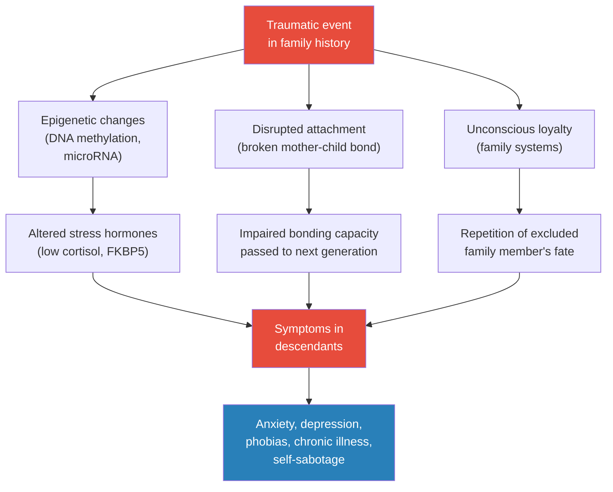
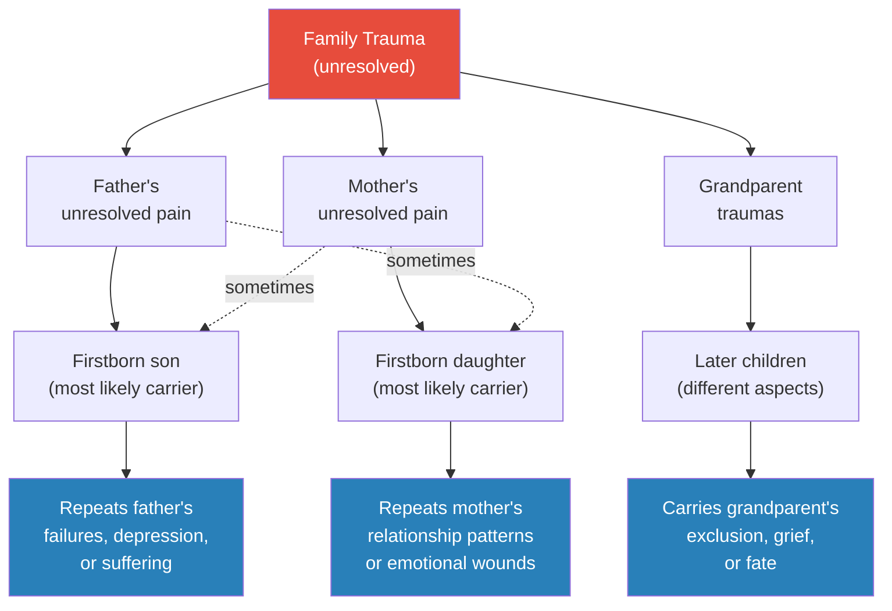
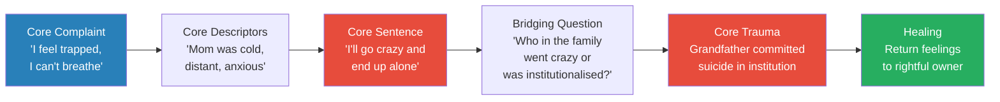
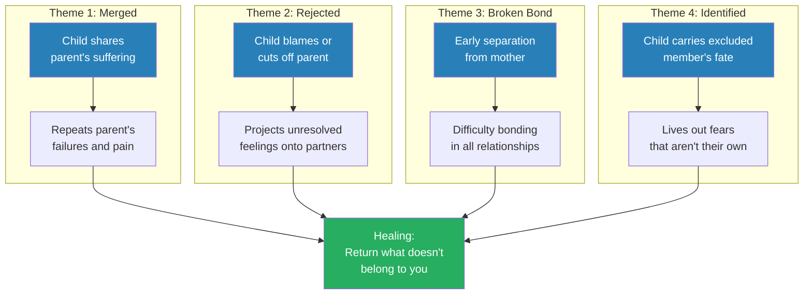
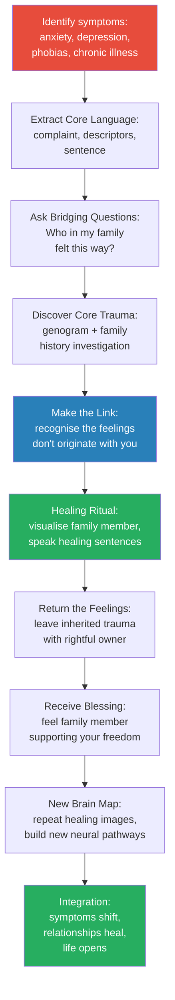

# It Didn't Start with You — Mark Wolynn

> *The fears, anxieties, depression, and physical symptoms you carry may not originate in your own life experience. They may be inherited from your parents, grandparents, or even great-grandparents through epigenetic mechanisms, unconscious loyalty, and attachment disruptions. Your "secret language of fear" — the specific words that dominate your worst nightmares — contains encoded information about family traumas you may never have been told about. By decoding this language and tracing it back to its source, you can finally break the cycle.*

---

## About the Author

Mark Wolynn is the director of the Family Constellation Institute in San Francisco and a leading expert on inherited family trauma. He trained with Bert Hellinger, the renowned German psychotherapist who pioneered family constellation work, and has spent more than twenty years working with individuals suffering from depression, anxiety, chronic illness, phobias, obsessive thoughts, and PTSD that resisted conventional treatment. His own healing journey — losing his vision at thirty-four, travelling the world seeking answers, and ultimately being told by two separate spiritual teachers to "go home and call your parents" — became the foundation for his clinical method. Wolynn combines insights from epigenetics, neuroscience, family systems therapy, and the therapeutic power of language into what he calls the Core Language Approach.

---

## The Big Idea

The depression, anxiety, phobias, and chronic symptoms that dominate your life may not belong to you at all. Cutting-edge research in <b style="color: #2980b9">epigenetics</b> now demonstrates that the effects of trauma can pass from one generation to the next — biologically, through chemical tags on DNA that alter gene expression; psychologically, through disrupted attachment bonds; and systemically, through what Bert Hellinger calls <b style="color: #2980b9">unconscious loyalty</b> to excluded or suffering family members. Your body carries the residue of traumas your parents and grandparents endured, and these residues express as fears, physical symptoms, and self-sabotaging patterns that seem to have no explanation in your own life story. The key to breaking free lies in <b style="color: #27ae60">your "secret language of fear" — the specific, emotionally charged words that recur in your worst fears</b> — because these words encode inherited trauma and, when decoded, can lead you back to the original wound. Once the link is made between your suffering and a family member's unresolved trauma, <b style="color: #e74c3c">symptoms that have persisted for years can shift in a single session</b>. Healing is not about blaming your parents — it is about ending the internal war by receiving their love as they could give it, not as you wished they would.

---

## Key Concepts at a Glance

| Concept | One-line summary |
|---------|-----------------|
| **Inherited family trauma** | Fears, symptoms, and behaviours you carry may originate from traumas experienced by parents, grandparents, or great-grandparents |
| **Epigenetic inheritance** | Chemical tags on DNA (methylation, microRNA) transmit stress responses across at least three generations |
| **Core Language Approach** | Wolynn's therapeutic method: decode the "secret language of fear" in your words to trace symptoms back to their family origin |
| **Core complaint** | The deepest worry or struggle you bring to therapy — contains encoded clues to inherited trauma |
| **Core descriptors** | The adjectives you use to describe your parents — they reveal your inner world more than your parents' character |
| **Core sentence** | Your worst fear stated in a single sentence — often belongs to someone in a previous generation |
| **Core trauma** | The unresolved traumatic event in your family history that sits behind your core sentence |
| **Bridging question** | A question that converts your core sentence into a family history inquiry, connecting present suffering to past trauma |
| **The four unconscious themes** | Four patterns of inherited disruption: merging with a parent, rejecting a parent, broken mother-child bond, identification with another family member |
| **Unconscious loyalty** | Hellinger's insight that we unconsciously repeat the fates of excluded or rejected family members |
| **Healing sentences** | Consciously constructed phrases spoken to visualised family members that release inherited trauma |
| **Neuroplasticity and healing images** | New neural pathways can be created through visualisation and repetition, overwriting old trauma patterns |

---

## At a Glance

- **The Problem:** Persistent anxiety, depression, phobias, and physical symptoms that do not respond to conventional therapy — because the root cause lies not in your own life, but in the unresolved traumas of your parents, grandparents, or great-grandparents
- **The Science:** Epigenetics research (Yehuda, Dias, Mansuy) demonstrates that trauma alters gene expression through DNA methylation and microRNA changes, and these alterations are transmitted across at least three generations
- **The Method:** The <b style="color: #2980b9">Core Language Approach</b> — a four-step process (core complaint, core descriptors, core sentence, core trauma) that uses the specific words of your deepest fears to trace suffering back to its family origin
- **The Healing:** Once the link is made, symptoms shift through visualisation exercises, healing sentences, and restored connection with parents and ancestors

---

## The 30-Second Version

The fears and symptoms that dominate your life may be inherited. Research in epigenetics now shows that trauma alters gene expression and that these changes pass through at least three generations — Holocaust survivors and their children share epigenetic tags on the same stress gene; mice trained to fear a scent produce grandchildren who fear it without ever encountering it. <b style="color: #e74c3c">Your body carries the biological residue of traumas your grandparents endured.</b> Wolynn's Core Language Approach works by decoding the specific words of your worst fears — "I'll be destroyed," "I can't breathe," "I'll go crazy" — and tracing them back to a family member who experienced the original trauma. <b style="color: #27ae60">Once the link is made and you return the feelings to their rightful owner through visualisation and healing sentences, symptoms that resisted years of therapy can resolve rapidly.</b>

---

*Three distinct pathways — biological (epigenetic), relational (attachment), and systemic (unconscious loyalty) — transmit trauma from one generation to the next, producing symptoms the descendant experiences as their own.*

---

# Part I: The Web of Family Trauma

## Chapter 1: Traumas Lost and Found — The Science of Inherited Trauma

*The latest scientific research tells us that the effects of trauma can pass from one generation to the next — and the implications reach far deeper than anyone imagined.*

### Trauma Does Not Dissolve with Time

- A well-documented feature of trauma is our inability to articulate what happens to us — not only do we lose our words, but something happens with our memory as well
- During a traumatic incident, thought processes become scattered and disorganised so that we no longer recognise the memories as belonging to the original event
  - Fragments of memory — images, body sensations, words — are stored in the unconscious
  - These fragments can be triggered later by anything even remotely reminiscent of the original experience
  - Once triggered, it is as if an invisible rewind button has been pressed, causing us to reenact aspects of the original trauma
- Freud identified <b style="color: #2980b9">traumatic reenactment</b> ("repetition compulsion") more than a century ago — the unconscious drive to replay what is unresolved so we can "get it right"
  - This unconscious drive to relive past events could be one of the mechanisms at work when families repeat unresolved traumas across generations
- Jung believed that whatever remains unconscious does not dissolve but resurfaces as fate: "Whatever is not conscious will be experienced as fate"
  - We keep repeating our unconscious patterns until we bring them into the light of awareness
- Both observed how fragments of suppressed experience show up in words, gestures, slips of the tongue, accident patterns, and dream images
- Bessel van der Kolk's research explains the mechanism: during trauma, the speech centre shuts down and the medial prefrontal cortex (responsible for experiencing the present moment) goes offline
  - He describes the "speechless terror" of trauma — the experience of being at a loss for words when brain pathways of remembering are hindered
  - "When people relive their traumatic experiences, the frontal lobes become impaired and they have trouble thinking and speaking"
  - Without language, experiences go "undeclared" — stored as fragments of memory, bodily sensations, images, and emotions rather than as retrievable narratives
- <b style="color: #27ae60">The language of trauma is never lost — it roams the unconscious, waiting to be rediscovered</b>
- The words, images, and impulses that fragment following a traumatic event reemerge to form a "secret language of suffering" we carry with us
- Emerging trends in psychotherapy now point beyond the traumas of the individual to include traumatic events in family and social history
  - Tragedies varying in type and intensity — abandonment, suicide, war, early death of a child or parent — can send shock waves of distress cascading from one generation to the next
  - Developments in cellular biology, neurobiology, epigenetics, and developmental psychology underscore the importance of exploring at least three generations of family history

> [!tip] Core Insight
> The fears, words, and body sensations you carry may not originate in your own experience. They may be fragments of a family member's trauma, transmitted across generations and waiting to be traced back to their source.

---

### The Epigenetics Revolution: Rachel Yehuda's Research

- <b style="color: #2980b9">Rachel Yehuda</b>, professor of psychiatry and neuroscience at Mount Sinai School of Medicine, is one of the world's leading experts on PTSD and a true pioneer in the field of transgenerational trauma
- Her research on cortisol (the stress hormone that helps our body return to normal after trauma) has revolutionised the understanding and treatment of PTSD worldwide
- Her discovery of <b style="color: #e74c3c">low cortisol levels</b> in PTSD patients was revolutionary and controversial — it overturned the long-held assumption that stress is associated with high cortisol
  - In chronic PTSD, cortisol production becomes suppressed, contributing to the low levels measured in both survivors and their children
  - When cortisol levels are compromised, so is our ability to regulate emotions and manage stress
  - Several stress-related psychiatric disorders — PTSD, chronic pain syndrome, chronic fatigue syndrome — are associated with low blood levels of cortisol
- Children of Holocaust survivors with PTSD were born with low cortisol levels similar to their parents, predisposing them to relive the PTSD symptoms of the previous generation
- You are <b style="color: #e74c3c">three times more likely to experience PTSD symptoms</b> if one of your parents had PTSD
- Children of survivors are three to four times more likely to struggle with depression and anxiety, or engage in substance abuse, when either parent suffered from PTSD
- Interestingly, 50 to 70 percent of PTSD patients also meet the diagnostic criteria for major depression or another mood or anxiety disorder
- Yehuda believes this generational PTSD is inherited epigenetically, not acquired from hearing parents' stories — she was one of the first researchers to show how descendants of trauma survivors carry the physical and emotional symptoms of traumas they have not directly experienced

### The 9/11 Study

- Pregnant women (second or third trimester) who were at or near the World Trade Center during the 9/11 attacks and developed PTSD delivered children with:
  - Low cortisol levels
  - Increased distress in response to new stimuli
  - Smaller size for gestational age
- Yehuda's team identified <b style="color: #2980b9">sixteen genes that expressed differently</b> in those who developed PTSD after 9/11 compared with those who did not
- A 2015 study in *Biological Psychiatry* found epigenetic tags on the very same part of a stress-regulation gene in both Holocaust survivors and their children
  - When compared with Jewish families living outside Europe during the war, the gene changes could only be attributed to the parents' trauma experience

### Paternal vs. Maternal PTSD: Different Transmission, Different Symptoms

- Yehuda's team distinguished critical differences based on which parent carries the PTSD:

| Parent with PTSD | Transmission timing | Child's symptoms |
|-----------------|-------------------|-----------------|
| **Father** | Before conception (in sperm) | More prone to depression, dissociation, feeling "disconnected from memories" |
| **Mother** | Before conception or during gestation | Difficulty calming down, heightened reactivity, overattachment |

- Mothers who survived the Holocaust feared separation from their children — Holocaust offspring often complained their mothers were "overattached"
- A mother's age during trauma matters: children inherited different cortisol-converting enzyme variances depending on whether their mother was a child or adult during the Holocaust

### The Global Scope of Transgenerational Trauma

- Addiction psychiatrist Dr. David Sack writes: "Trauma has the power to reach out from the past and claim new victims"
  - Children of a parent struggling with PTSD can develop their own "secondary PTSD"
  - About 30 percent of children with a parent who served in Iraq or Afghanistan and developed PTSD struggle with similar symptoms
  - "The parent's trauma becomes the child's own and the child's behavioural and emotional issues can mirror those of the parent"
- Children of Cambodian genocide survivors tend to suffer from depression and anxiety
- Children of Australian Vietnam War veterans have higher suicide rates than the general population
- <b style="color: #e74c3c">Native American youths on reservations have the highest suicide rate in the Western Hemisphere</b> — in some areas, ten to nineteen times higher than other American youth
  - Cherokee historian Albert Bender attributes this to intergenerational trauma from "endless massacres, forced removals, and military campaigns culminating in the Wounded Knee Massacre"
  - He believes generational grief is fuelling these suicides: "All of these memories resonate in the minds of our young people in one form or another"
  - "A week without a suicide is now considered a blessing on many reservations"
  - LeManuel "Lee" Bitsoi, a Navajo PhD genetics researcher at Harvard, corroborates that epigenetics research is providing substantial evidence that intergenerational trauma is a real phenomenon
- Young Rwandans born after the 1994 genocide (too young to have witnessed the killing of approximately 800,000 people) experience the same PTSD symptoms as those who survived it: intense anxiety and obsessive visions of horrors they never witnessed
  - Psychiatrist Naasson Munyandamutsa: "It is a phenomenon that was expected. All that is not said, is transmitted"
  - Even children whose families were unscathed by the violence are affected by what psychiatrist Rutakayile Bizoza calls "a contagion in the collective subconscious"
- Violence, war, and oppression continue to sow the seeds of generational reliving as survivors unknowingly transmit what they have experienced to successive generations — the list keeps expanding: the Armenian genocide, the Cambodian Killing Fields, the Ukrainian famine imposed by Stalin, the mass killings in Rwanda, Nigeria, El Salvador, the former Yugoslavia

---

> [!example] Jesse's Insomnia: Inheriting an Uncle's Death (Age 19)
> - Jesse, a star athlete and straight-A student, had not slept through the night in over a year
> - At nineteen, he woke at 3:30 a.m. freezing cold, shivering, seized by a strange fear: "If I go to sleep, I'll never wake up"
> - No doctor, psychologist, or sleep clinic could help
> - Wolynn noticed the unusual detail — extreme cold — and asked if anyone in the family had suffered a trauma involving cold, sleep, or the age of nineteen
> - Jesse's uncle Colin was nineteen when he froze to death checking power lines in a blizzard north of Yellowknife, Canada
> - Colin lost consciousness from hypothermia; his death was so painful the family never spoke his name again
> - Jesse was reliving his uncle's terror of letting go into unconsciousness — for Colin, letting go meant death
> - Once Jesse understood the connection, the insomnia began to lift
> **The lesson:** The specific details of your symptoms — the age of onset, the physical sensations, the exact nature of the fear — are not random. They are encoded clues pointing to a specific trauma in your family history.

---

> [!example] Gretchen's Suicidal Urge: A Holocaust Inheritance
> - Gretchen, diagnosed bipolar with severe anxiety, told Wolynn she planned to commit suicide before her next birthday
> - Her method: she would "vaporize" herself by leaping into a vat of molten steel — "My body will incinerate in seconds"
> - The words "vaporize" and "incinerate" alerted Wolynn — these are Holocaust words
> - Her grandmother, born Jewish in Poland, had converted to Catholicism upon arriving in the US in 1946
> - Two years earlier, her grandmother's entire family had been gassed — "engulfed in poisonous vapors" — and incinerated at Auschwitz
> - The family never spoke of it
> - Gretchen had never connected her grandmother's history to her own symptoms
> - When the link was made, colour rose in her cheeks for the first time — she had an explanation that finally made sense
> **The lesson:** The words you use to describe your suffering may not be metaphorical. They may be literal descriptions of what happened to a family member whose trauma you carry.

---

## Chapter 2: Three Generations of Shared Family History — The Family Body

*Before you were even born, you shared a cellular environment with your mother and grandmother — three generations in one body.*

### The Biological Basis: Three Generations, One Body

- The history you share with your family begins before you are even conceived
- When your grandmother was five months pregnant with your mother, the precursor cell of the egg you developed from was already present in your mother's ovaries
- <b style="color: #27ae60">Before your mother was even born, your mother, your grandmother, and the earliest traces of you were all in the same body — three generations sharing the same biological environment</b>
- This is not a new idea — embryology textbooks have described this for over a century
- Your inception can also be traced through the paternal line: the precursor cells of the sperm you developed from were present in your father when he was a fetus in his mother's womb
- There is a significant biological difference: your mother was born with her lifetime supply of eggs (the cell line stopped dividing), while your father's sperm continued to multiply after puberty
  - This means your father's sperm remained susceptible to traumatic imprints almost up until the point when you were conceived
  - Both precursor egg and sperm cells can be imprinted by events with the potential to affect subsequent generations
- Pioneering cell biologist <b style="color: #2980b9">Bruce Lipton</b> demonstrated that signals from the environment operate through the cell membrane, controlling gene expression
  - "The mother's emotions, such as fear, anger, love, hope, can biochemically alter the genetic expression of her offspring"
  - During pregnancy, nutrients in the mother's blood nourish the fetus through the placenta — but with the nutrients, she also releases hormones and information signals generated by her emotions
  - These chemical signals activate specific receptor proteins in cells, triggering cascades of physiologic, metabolic, and behavioural changes in both mother and fetus
  - "When stress hormones cross the placenta, they cause fetal blood vessels to be more constricted in the viscera, sending more blood to the periphery, preparing the fetus for a fight/flight response"
  - Chronic emotions like anger and fear essentially "preprogramme" the child for a hostile world
- Psychiatrist Thomas Verny: "If a pregnant mother experiences acute or chronic stress, her body will manufacture stress hormones that travel through her bloodstream to the womb, inducing the same stressful state in the unborn child"
  - Mothers under extreme and constant stress are more likely to have babies who are premature, lower than average in weight, hyperactive, irritable, and colicky
  - In extreme instances, these babies may be born with thumbs sucked raw or even with ulcers
- A 2010 study in *Biological Psychiatry* found that babies exposed to increased cortisol in utero, as early as seventeen weeks after conception, exhibited impaired cognitive development when evaluated at seventeen months old
- Lipton stresses the importance of <b style="color: #2980b9">conscious parenting</b> — parenting with the awareness that from preconception through postnatal development, a child's health can be profoundly influenced by the parent's thoughts, attitudes, and behaviours

### The Mechanisms of Epigenetic Inheritance

- Originally, scientists believed that our genetic inheritance was transmitted only through chromosomal DNA — the blueprint our parents gave us
- With greater understanding of the human genome, scientists discovered that chromosomal DNA (responsible for physical traits like hair, eye, and skin colour) makes up less than 2 percent of our total DNA
- The other 98 percent — once dismissed as "junk DNA" — is <b style="color: #2980b9">noncoding DNA (ncDNA)</b>, responsible for many of the emotional, behavioural, and personality traits we inherit
  - The percentage of noncoding DNA increases with the complexity of the organism, with humans having the highest percentage
  - Noncoding DNA is affected by environmental stressors: toxins, inadequate nutrition, and stressful emotions
  - The affected DNA transmits information that helps prepare us for life by ensuring we have the traits we need to adapt to our environment
- According to Yehuda, epigenetic changes biologically prepare us to cope with the traumas our parents experienced — we are born with a specific set of tools to help us survive
  - On one hand, this is good news: we have an intrinsic "environmental resilience" that allows us to adapt to stressful situations
  - On the other hand, these adaptations can be detrimental — a child of a war-zone parent may inherit a heightened startle response that keeps them reactive even when no danger is present
  - <b style="color: #e74c3c">When an incongruity exists between epigenetic preparedness and the actual environment, it can predispose someone to stress disorders and disease</b>

---

- The two primary mechanisms of epigenetic transmission:

- <b style="color: #2980b9">DNA methylation</b>: the most common epigenetic tag
  - A process that blocks proteins from attaching to a gene, suppressing its expression
  - Can lock "helpful" or "unhelpful" genes in the "off" position
  - Can positively or adversely affect health depending on which genes are silenced
  - Scientists used to believe these tags were erased in precursor cells before any information could affect the next generation — like data erased from a hard drive
  - Scientists have now demonstrated that certain epigenetic tags escape this reprogramming process and are transmitted to the cells that will become us
  - Irregularities in DNA methylation caused by stress can be transmitted, along with a predisposition for physical or emotional health challenges, to subsequent generations

- <b style="color: #2980b9">MicroRNA</b>: small noncoding RNA molecules that regulate gene expression
  - Stress-induced irregularities in microRNA levels affect how genes are expressed across multiple generations
  - Among the genes affected by stress are the CRF1 and CRF2 genes — increased levels have been observed in people with depression and anxiety
  - CRF1 and CRF2 genes can be inherited from stressed mothers who share similar increased amounts
  - MicroRNA changes have been found in the sperm, blood, and hippocampi of traumatised mice

- Dr. Jamie Hackett, University of Cambridge: <b style="color: #27ae60">"Our research demonstrates that genes retain some memory of their past experiences"</b>

- Dr. Eric Nestler, in *JAMA Psychiatry* (2014): "Indeed, stressful life events have been shown to alter stress susceptibility in subsequent generations"

### The Mouse Studies: Hard Evidence for Inherited Trauma

- Because humans and mice share 99 percent of their genes, mouse studies provide a powerful lens for understanding inherited stress in human lives
- A generation in mice is approximately twelve weeks, allowing multigenerational studies to produce results that would take sixty years in humans

> [!example] Cherry Blossom Fear Study (Dias, Emory University, 2013)
> - Mice were trained to fear a cherry blossom-like scent (acetophenone) by pairing it with electric shocks
> - After conditioning, the shocked mice had a greater amount of smell receptors for that particular scent, enabling them to detect it at lower concentrations
> - They also developed enlarged brain areas devoted to those receptors
> - Researchers identified changes in the mice's sperm
> - The most intriguing finding: both pups and grandpups, exposed to the scent for the first time, became jumpy and avoided it — despite never having been shocked
> - The offspring exhibited the same brain changes as their traumatised fathers
> - Researchers found abnormally low DNA methylation in the sperm of both the father mice and their offspring
> - Brian Dias: "There's something in the sperm that is informing or allowing that information to be inherited"
> - He notes: "It behooves ancestors to inform their offspring that a particular environment was a negative environment for them"
> **The lesson:** Traumatic memories can be passed down through epigenetic changes in DNA — the mice inherited not just sensitivity to the scent, but the fear response associated with it. This provides compelling evidence for "transgenerational epigenetic inheritance."

---

> [!example] Maternal Separation Studies (University of Zurich, 2014)
> - Male mice were subjected to repeated, prolonged separations from their mothers during their first two weeks of life
> - The traumatised mice exhibited depression-like symptoms that seemed to worsen as they aged
> - Surprisingly, some males did not express the behaviours themselves but appeared to epigenetically transmit the changes to their female offspring
> - Their pups and grandpups (second and third generation) showed the same trauma symptoms despite never experiencing separation
> - Researchers found abnormally high levels of microRNA in the sperm, blood, and hippocampi of the traumatised mice
> - Abnormal microRNA was also found in the blood and hippocampi of the second generation
> - Among the genes affected was the CRF2 gene, which regulates anxiety in both mice and humans
> - Researchers also found that the germ cells (precursor egg and sperm cells) as well as the brains of offspring were affected by maternal separation stress
> - Third-generation mice expressed the same behavioural symptoms, but elevated microRNA was not detected — suggesting that the behavioural effects express for three generations but perhaps not beyond
> - Isabelle Mansuy: "With the imbalance in microRNAs in sperm, we have discovered a key factor through which trauma can be passed on"
> **The lesson:** Trauma from maternal separation creates measurable biological changes that transmit for at least three generations through microRNA in sperm — even when the offspring were never separated from their own mothers.

---

### Additional Animal Studies

- In another experiment with rats, offspring that received low levels of maternal care were more anxious and more reactive to stress in adulthood — this stress pattern was observed across multiple generations
- A 2013 University of Haifa study found that even relatively mild stress (such as temperature changes) experienced by female rats during adolescence was significant enough to affect offspring
  - The researchers detected increased amounts of a stress-related molecular product (CRF1 gene) in both the eggs of the stressed females and the brains of their offspring
  - This demonstrates that information about the stress experience was transferred in the eggs
  - Crucially, the altered behaviour in newborn rats was unrelated to the type of parenting the pups received — the inheritance was epigenetic, not behavioural
- <b style="color: #27ae60">This suggests that even if humans receive supportive parenting as infants, we are still the recipients of the stress our parents experienced before we were conceived</b>
- A 2014 University of Lethbridge study examined stress in pregnant mothers and its influence on preterm births
  - Stressed mothers delivered preterm babies, and their daughters also had shortened pregnancies
  - Granddaughters experienced even shorter pregnancies — even when their own mothers had not been stressed
  - "The effects of stress grew larger with each generation" (Gerlinde Metz)
  - Metz believes the epigenetic changes are due to noncoding microRNA molecules

---

> [!tip] Core Insight
> Epigenetic changes are not only destructive — they are adaptive. Yehuda argues that they expand our range of stress responses, which is a positive thing: "Who would you rather be in a war zone with? Somebody that's had previous adversity and knows how to defend themselves?" The traumas we inherit can forge a legacy of both distress and resilience.

### The Compounding Effect

- A 2014 University of Lethbridge study found that stress in pregnant mothers led to preterm births — and the effect compounded across generations
  - Granddaughters had shorter pregnancies than their mothers, even when the mothers had not been stressed
  - "The effects of stress grew larger with each generation" (Gerlinde Metz)
- A stressed mother can epigenetically prepare her child for a hostile world — but if the child's actual environment is safe, this mismatch predisposes them to stress disorders and disease

---

## Chapter 3: The Family Mind — Unconscious Loyalty and the Family System

*We share a family consciousness with our biological family members who come before us. When someone is excluded from the family system, a later member may unconsciously repeat their fate.*

### Bert Hellinger's Family Consciousness

- <b style="color: #2980b9">Bert Hellinger</b>, the German psychotherapist, spent over fifty years studying families — first as a Catholic priest, then as a family therapist and philosopher
- He teaches that we share a <b style="color: #2980b9">family consciousness</b> with our biological family members who come before us
- He observed that traumatic events — the premature death of a parent, sibling, or child; an abandonment, crime, or suicide — exert a powerful influence across generations, leaving imprints on the entire family system
- These imprints become the family blueprint as members unconsciously repeat the sufferings of the past
- The repetition is not always an exact replica of the original event — a grandson might atone for a grandfather's crime without realising it

**The Law of Belonging:**
- <b style="color: #27ae60">Everyone has the same right to belong in a family system — no one can be excluded for any reason whatsoever</b>
- This includes:
  - The alcoholic grandfather who left the grandmother impoverished
  - The stillborn brother whose death broke the mother's heart
  - The neighbour child the father accidentally killed backing out of the driveway
  - The criminal uncle, the mother's older half-sister, the baby who was aborted
  - Even people who harmed family members, and victims of family members' actions — they all belong
  - Earlier partners of parents and grandparents also belong — by their leaving or dying, an opening was created that allowed for the next partner to enter and ultimately for you to be born

**Entanglement:**
- When someone is rejected or excluded, a later family member may unconsciously represent them by repeating their fate or sharing their suffering
- Hellinger uses the word <b style="color: #2980b9">"entanglement"</b> to describe this kind of suffering
- When entangled, you unconsciously carry the feelings, symptoms, behaviours, or hardships of an earlier family member as if they were your own
- Hellinger stresses that each of us must carry our own fate regardless of its severity
- <b style="color: #e74c3c">No one can attempt to take on the fate of a parent, grandparent, or sibling without some type of suffering ensuing</b>
- If we avoid or circumvent our fate, another member of the system could attempt to pay the price — often with their life

> [!example] John's False Conviction: Paying for His Father's Murder
> - John came to see Wolynn shortly after being released from prison — three years served for embezzlement he claimed he did not commit
> - He had been framed by a former business associate and advised to accept a plea bargain
> - His jaw was clenched; he was obsessed with thoughts of revenge
> - When they discussed family history, it emerged that in the 1960s, John's father had been accused of murdering his business partner — but was acquitted on a technicality
> - Everyone in the family knew the father was guilty, but they never spoke about it
> - John was the same age his father was when he went to trial
> - Justice was finally served — but the wrong person paid the price
> - When John made the link between his father's experience and his own, the obsessive thoughts of revenge released and he could move on
> **The lesson:** When someone in the family circumvents the consequences of their actions, a later member of the system may unconsciously step in to pay the price — often without any awareness of the original event.

---

### The Firstborn Son and Unresolved Paternal Trauma

- <b style="color: #e74c3c">The firstborn son is likely to carry what remains unresolved with the father</b>
- The firstborn daughter is likely to carry what remains unresolved with the mother (though this can reverse)
- Later children in the family often carry grandparent traumas or different aspects of parental trauma
- Each sibling carries different fragments — same family trauma, different expressions

*Hellinger's observation: trauma distributes itself across siblings, with the firstborn of each gender typically carrying the parent's unresolved pain, and later children carrying grandparent or systemic traumas.*

---

> [!example] The Lebanese Family: Two Grandmothers, Two Granddaughters
> - Both grandmothers in this Lebanese family were given away by their parents as child brides — one at age nine, the other at twelve
> - Of their granddaughters, one married a much older man (repeating the pattern)
> - The other never married at all, complaining that men were "disgusting and controlling" — similar to how her unhappy grandmother must have felt trapped in a loveless marriage
> - Same family trauma, opposite expressions: one repeated the fate, the other rejected it
> **The lesson:** Siblings don't all carry the same aspect of family trauma. Connected to their grandmothers' experience of forced childhood marriage, each granddaughter expressed a different fragment of that wound.

---

### The Mother-Child Bond Is the Foundation

- How our mother bonds with us in the womb is instrumental in neural circuit development
- Thomas Verny: "From the moment of conception, the experience in the womb shapes the brain and lays the groundwork for personality, emotional temperament, and the power of higher thought"
- When a mother carries inherited trauma or experienced a break in her own mother-child bond, she is more likely to disrupt the bond with her infant
- The impact of an early break — an extended hospital stay, illness, a long separation — can be devastating
  - "Mother and offspring live in a biological state that has much in common with addiction" (Winifred Gallagher)
  - Separation is experienced as "life threatening" by the infant (Dr. Raylene Phillips)
  - If separation continues, "the response is despair. The baby gives up"

> [!example] Wolynn Burying His Face in His Mother's Clothes
> - As a small child, Wolynn was so terrified his mother would never return that he would enter her bedroom, open her drawer of scarves, and bury his face in them to breathe in her scent
> - He remembers the feeling vividly: "I would never see her again. Her smell would be all I would have left"
> - When he shared this as an adult, his mother revealed she had done the exact same thing — buried her face in her own mother's clothes when her mother left the house
> - Same body memory, same terror of abandonment, transmitted across generations
> - Three of Wolynn's four grandparents had lost their mothers at an early age; the fourth lost a father as an infant
> - The mother-child bond had been severed for at least three generations in his family
> **The lesson:** Early interruptions to the mother-child bond create somatic memories that transmit across generations as body-level responses — not through stories or conscious memory, but through the body itself.

---

### The Body Knows Before the Mind

- Wolynn draws on the same somatic awareness research as van der Kolk and other body-oriented therapists
- The Iowa card game experiment: participants' sweat glands responded to danger patterns seventy cards before conscious awareness kicked in — the body knew before the mind did
- Family trauma lives in the body as somatic memory: chest tightening, breathing difficulties, chronic pain, numbness
- Wolynn's own experience illustrates this: being held by his mother felt like "being squeezed in a bear trap" — his body turned to steel involuntarily
  - This was not a cognitive decision to reject her — it was a body-level response to a separation that occurred before the age of two, before language or conscious memory existed
- <b style="color: #27ae60">Healing requires body-level work, not just cognitive understanding</b> — the awareness needs to be accompanied by a deeply felt visceral experience for lasting change

---

### Healing Images and the Brain

- Psychiatrist Norman Doidge, in *The Brain That Changes Itself*: "Psychotherapy is often about turning our ghosts into ancestors"
- <b style="color: #2980b9">Neuroplasticity</b> demonstrates that new experiences create new neural pathways — and these pathways strengthen through repetition
- Donald Hebb (1949): "Neurons that fire together, wire together"
- Brain scans show that many of the same neurons activate whether we are imagining an event or actually living it
  - Visualising a healing scene activates the same circuits as experiencing it
- Dr. Dawson Church: "Filling our minds with positive images of wellbeing can produce an epigenetic environment that reinforces the healing process"
- Meditation can change gene expression — after only eight hours of meditation, researchers observed decreased levels of pro-inflammatory genes
- <b style="color: #27ae60">Rachel Yehuda: "You can't change your DNA, but if you can change the way your DNA functions, that's sort of the same thing"</b>

---

# Part II: The Core Language Map

## Chapter 4: The Core Language Approach — Decoding the Secret Language of Fear

*When fragments of past trauma play out inside us, they leave clues behind — emotionally charged words and sentences that link us back to unresolved traumas.*

### What Is Core Language?

- <b style="color: #2980b9">Core language</b> consists of the emotionally charged words and sentences expressing our deepest fears that link back to unresolved traumas
- These words have an unusual quality — they feel "out of context" from what we know or have experienced
- They can feel as though they come from outside us while being experienced inside us
- Like Hansel and Gretel's breadcrumbs, these words form a trail we can follow to find our way home — but instead of breadcrumbs, we leave a trail of words that have the power to lead us back on course
- Core language also expresses nonverbally: physical sensations, behaviours, emotions, impulses, and illness symptoms
- Jesse's core language: being jolted awake at 3:30 a.m., shivering, terrified of falling asleep
- Gretchen's core language: "vaporize," "incinerate," depression, despair, suicidal urge
- Gretchen herself reported: "Those feelings lived in me, but they weren't from me"
- Once this idiosyncratic language is exposed, its intensity and its influence begins to lose its charge

### Declarative vs. Nondeclarative Memory

- Long-term memory divides into two categories:
  - <b style="color: #2980b9">Declarative (explicit) memory</b>: the ability to consciously recall facts or events — like a book we can pull off the shelf
  - <b style="color: #2980b9">Nondeclarative (implicit) memory</b>: operates without conscious recall — like riding a bicycle without thinking about the steps
- Traumatic experiences are often stored as nondeclarative memory
  - When an event becomes so overwhelming that we lose our words, we cannot accurately record the memory in story form
  - It is as though a flash flood streams through all doors and windows at once — in the danger, we don't stop to put our experience into words
  - Without words, we no longer have full access to the memory — fragments go unnamed and submerge out of sight
- The vast reservoir of the unconscious appears to hold not only our traumatic memories, but also the unresolved traumatic experiences of our ancestors
  - In this shared unconscious, we seem to reexperience fragments of an ancestor's memory and declare them as our own
- Two important times when words go missing:
  1. Before the age of two or three, when language centres have not yet reached full maturity
  2. During a traumatic episode, when memory functions become suppressed
- Psychologist Annie Rogers: "The unconscious insists, repeats, and practically breaks down the door, to be heard"

### The Core Language Map

- A map of the unconscious that can be charted on paper
- Four tools, each extracting new information:
  1. **The Core Complaint** — the deepest issue you want to heal
  2. **The Core Descriptors** — how you describe your parents
  3. **The Core Sentence** — your worst fear stated as a sentence
  4. **The Core Trauma** — the unresolved event in your family history

*The Core Language Map: a four-step process from present-day complaint to inherited family trauma, culminating in healing through visualisation and healing sentences.*

- The map probably existed before you were born — it may have belonged to your father or grandmother
- You have merely been carrying it for them
- Once you follow it back to its origin, both you and the original owner can be set free

### How to Recognise Core Language

- Listen for words with <b style="color: #27ae60">unusual energy</b> — words that seem to jump out, that have an urgent quality
- Hellinger's approach: "I don't listen so carefully that I have to concentrate, but rather just enough so that I can keep my eyes on the greater picture. Then suddenly he says a word and this alerts me. This word has energy"
- The complaint you bring to therapy contains encoded information — listen "beneath the story line"
- Undeclared language — words that went missing during trauma — surfaces in our complaints, symptoms, and repetitive struggles

---

## Chapter 5: The Four Unconscious Themes

*Four patterns of inherited disruption that interrupt the flow of life from parents to children.*

### The Flow of Life

- We came here through our parents — as children of our parents, we are connected to something vast that extends backward in time, literally to the beginning of humanity itself
- Through our parents, we are plugged into the very current of life — our life force — though we are not the source of that current
- The spark has merely been forwarded to us, transmitted biologically along with our family history
- Visualise the life force as the main wire that feeds electricity into your home — all other wires depend on it for power
  - No matter how successfully we wire our house, if our connection to the main wire is compromised, the flow will be impacted
- When the connection to parents flows freely, we experience ourselves as open to receiving what life brings
- When it is impaired, we feel blocked and constricted, or feel outside the flow of life, as if swimming upstream against the current
- Wolynn suggests a diagnostic exercise: visualise your biological parents standing in front of you and ask:
  - Do I welcome them or shut them out?
  - Do I sense them welcoming me?
  - Do I experience one differently from the other?
  - Is my body relaxed or tight as I visualise them?
  - If a life-giving force were flowing from them to me, how much would be getting through: 5%? 25%? 50%? 75%? 100%?
- Four unconscious themes interrupt this flow:

| Theme | Description | How it manifests |
|-------|------------|-----------------|
| **1. Merged with a parent** | Unconsciously sharing a parent's negative experience | Repeating their failures, depression, financial ruin, relationship patterns |
| **2. Rejected a parent** | Judging, blaming, or cutting off from a parent | Inner conflict, self-loathing, projecting onto partners |
| **3. Break in early bond with mother** | Interrupted attachment in first years of life | Difficulty bonding in relationships, fear of intimacy, not wanting children |
| **4. Identified with another family member** | Living out the fate of an excluded or suffering relative | Carrying symptoms, behaviours, or fears that have no explanation in your own life |

---

### Theme 1: Merged with a Parent

- As small children, we develop our sense of self gradually — we have not yet learned how to be separate from our parents and connected to them at the same time
- In this innocent place, we may imagine we can alleviate their unhappiness by fixing or sharing it: "If I carry it too, they won't have to carry it alone"
- This is fantasised thinking — it only leads to more unhappiness
- Shared patterns of unhappiness are everywhere: sad mother, sad daughter; disrespected father, disrespected son; the relationship difficulties of parents mirrored by the children
- When we merge with a parent, we unconsciously share an aspect — often a negative aspect — of that parent's life experience
- We repeat or relive certain situations without making the link that can set us free
- <b style="color: #e74c3c">It is arrogant and inflated to think that we, as children, are better equipped to handle our parents' suffering than they are — it is out of tune with the order of life</b>
- When a child takes on a parent's burden — consciously or unconsciously — they miss out on the experience of being given to, and have difficulty receiving from relationships later in life
- A child who takes care of a parent forges a lifelong pattern of overextension and creates a blueprint for habitually feeling overwhelmed

> [!example] Gavin's Financial Ruin: Merging with His Father (Age 34)
> - Gavin, at thirty-four, made rash financial decisions that cost his family their entire savings
> - He lost his job as a project manager for failing to meet deadlines; his marriage strained
> - His father, also in his mid-thirties at the time, had lost the family savings at the racetrack
> - After that, Gavin's mother took the kids and left; she referred to his father as "a selfish man, a compulsive gambler, and a loser"
> - Gavin hadn't spoken to his father in a decade
> - By not sharing a conscious connection with his father, Gavin had forged an unconscious one — repeating his father's failures
> - When Gavin reached out, his father said: "I didn't think you ever loved me"
> - Within weeks of reconnecting, Gavin's depression began to lift and he stabilised things at home
> **The lesson:** When we cannot connect with a parent consciously, we often connect unconsciously — by repeating their worst experiences. Restoring the relationship can break the repetition.

---

### Theme 2: Rejected a Parent

- If we truly want to embrace life and experience joy — deep relationships, vibrant health, full potential — we must first repair our broken relationships with our parents
- "When we pit one parent against the other, we go against the source of our own existence"
- <b style="color: #27ae60">"We forget that half of us comes from our mother and half from our father"</b>
- The emotions, traits, and behaviours we reject in our parents will likely live on in us — it is our unconscious way of loving them, a way to bring them back into our lives
- We attract friends, romantic partners, or business associates who display the very behaviours we reject — giving us myriad opportunities to recognise and heal the dynamic
- On a physical level, a rejection of our parents can be felt as pain, tightness, or numbness in the body — our bodies will feel unrest until the rejected parent is experienced inside us in a loving way
- Much conventional talk therapy focuses on blaming parents — "Like rats endlessly navigating the same maze, many people spend decades rehashing old stories of how their parents failed them"
- Wolynn's counter-position: our old stories entrap us, but once we uncover the deeper stories behind them, they have the power to set us free
- "The problem is not what our parents have done to us; the problem is how we're still holding on to it"
- Generally, when our parents caused us harm, it was unintentional
- All of us feel there are things we didn't get from our parents — but being at peace means being at peace with what we DID receive as well as what we did not
- When we hold what was given in this light, we can gain strength from our parents, who, even if they couldn't always show it, wanted only the best for us
- It is essential that we make peace with our parents — doing so not only brings inner peace, it allows harmony to spread into the generations that follow
- By softening toward our parents and dropping the story that stands in the way, we halt the senseless repetition of generational suffering
- A Harvard longitudinal study (35 years) found:
  - 91% of those with "tolerant" or "strained" relationships with their mothers developed significant health issues by midlife (vs. 45% with warm relationships)
  - 82% with strained paternal relationships developed health issues (vs. 50% with warm ones)
  - <b style="color: #e74c3c">100% of those with strained relationships with BOTH parents had significant health issues</b> (vs. 47% with warm relationships)

> [!example] Tricia's Relationship Failures: Three Generations of Rejected Mothers
> - Tricia's relationships all lasted less than two years — she complained that partners were "cold and insensitive, never there when I need him"
> - She described her mother identically: "distant, emotionally unavailable, she never loved me the way I needed"
> - Her grandmother had been sent to live with an aunt as a toddler after her mother died — she felt like an outsider and remained resentful for life
> - Three generations of daughters who didn't get what they needed from their mothers
> - Once Tricia understood the pattern, she felt compassion for her mother for the first time
> - She became less defensive with her partner and could remain present during rough patches
> **The lesson:** What is unresolved with our parents does not disappear — it serves as a template that forges our later relationships.

---

### Theme 3: Break in the Early Bond with Mother

- Not everyone who experiences a break will reject their mother — but most will experience some degree of anxiety when attempting to bond with a partner in an intimate relationship
- That anxiety could translate into difficulty maintaining a relationship, not wanting a relationship at all, or deciding not to have children
  - On the surface, you might say raising a child involves too much time and energy
  - On the deeper level, you might feel ill-equipped to supply a child with what you yourself have missed
- <b style="color: #e74c3c">The break doesn't have to happen to you directly — your grandmother's broken bond affects your mother's ability to bond, which affects yours</b>
- The break can be physical (hospitalisation, separation) or energetic (the mother is physically present but emotionally distant or inconsistent)
- Psychoanalyst Heinz Kohut described how "the gleam in the mother's eye" when gazing at her infant is the vehicle by which the child feels validated and can develop in a healthy way — when this gleam is absent, something fundamental is disrupted

### Questions to Identify an Interrupted Bond

| Area | Questions to ask |
|------|-----------------|
| **Pregnancy** | Was your mother highly anxious, depressed, or stressed during pregnancy? Were your parents having difficulties in their relationship? |
| **Birth** | Did you experience a difficult birth? Were you born premature? Did your mother experience postpartum depression? |
| **First three years** | Were you separated from your mother? Were you or your mother hospitalised? Did your mother experience a trauma or emotional turmoil? |
| **Family loss** | Did your mother lose a child or pregnancy before you were born? Was her attention pulled to a trauma involving a sibling? |
| **Generational** | Did your mother or grandmother experience a break in the bond with her own mother? |

- Even brief separations can create lasting effects because the hippocampus is not fully developed until after age two
  - The trauma is stored as fragments of physical sensations, images, and emotions rather than as clear memories that can be pieced into a story
  - Without the story, the emotions and sensations are difficult to understand
  - Body memories of the separation can be triggered when bonding or distancing is experienced in later relationships
  - Without ever understanding why, we can feel overwhelmed by feelings of terror, dissociation, numbness, disconnection, defeat, and annihilation
- Psychologist David Chamberlain: a failure to reestablish the bond creates "an unexplainable lack of closeness [that] casts a shadow over daily relationships. Intimacy and genuine friendship seem beyond reach"
- As infants, we perceive our mother as our world — a separation from her is felt as a separation from life itself

> [!example] Suzanne's Repulsion: Two Weeks in Hospital at Nine Months Old
> - Suzanne, thirty, cringed at the thought of being physically close to her mother — "Hugging takes your energy away"
> - She and her husband were not physically affectionate
> - At nine months old, Suzanne spent two weeks alone in hospital with pneumonia while her mother stayed home to care of other siblings
> - At that point, Suzanne unconsciously began to withdraw — by rejecting her mother's affection, she was protecting herself from being hurt and left again
> - Simply identifying the root of her repulsion was crucial
> - After that, Suzanne was able to restore the bond
> **The lesson:** An early break that happens before conscious memory forms can create a lifelong aversion to physical closeness — not because you don't want love, but because your body learned to protect itself from the pain of losing it.

### The Negative Memories of Childhood

- Many of us cannot see beyond the painful images of our childhood — the comforting memories are blocked from surfacing
- When our safety was threatened as children, our bodies erected defences that became our default
  - These defences orient our attention toward what is difficult or unsettling, instead of registering what is comforting
  - Our positive memories live on the other side of a wall just out of reach
- Evolutionary biologists describe how the amygdala uses about two-thirds of its neurons scanning for threats
  - Painful and frightening events are more easily stored in long-term memory than pleasant events
  - Neuropsychologist Rick Hanson: "The mind is like Velcro for negative experiences and Teflon for positive ones"
- <b style="color: #27ae60">Beneath the unconscious barricade lies a deep desire to be loved by our parents — but to recall the loving moments would make us vulnerable to being hurt again</b>
- The very memories that could bring healing are the ones we unconsciously block

### Theme 4: Identified with Another Family Member

- You may be feeling like, behaving like, suffering like, or atoning for someone who came before you — without any conscious awareness
- These identifications are why some people carry symptoms and fears that have no explanation in their own life experience

### How a Single Tragedy Activates All Four Themes

- Wolynn illustrates with a hypothetical: an older brother of a two-year-old dies suddenly, leaving behind grieving parents and a child too young to make sense of what happened
- **The child could reject a parent:** Either parent might lose the will to live, start drinking, or spend time away from home. The rages, self-incriminations, and shutdowns would feel like the world has collapsed. At two years old, the child wouldn't understand the scale of the tragedy — later, he might blame his parents for the hurt he felt
- **The child could experience a broken bond with the mother:** The shock would shatter the mother's heart. Forlorn and despairing, she might disappear into grief for weeks, fragmenting the tender bond with the two-year-old. The child would become mistrustful, wary that she could "disappear" again at any time
- **The child could merge with a parent's pain:** The living child might experience the weight of his parents' pain as if it were his own. In a blind attempt to ease it, he might try to carry his mother's depression or his father's grief — as if saying, "If I carry the pain with you, it will make you feel better"
- **The child could become identified with the dead brother:** When a small child dies, a blanket of grief shrouds the family. The dead child may be excluded — the family resists speaking his name. A later child may express what the family has suppressed: feeling depressed, lifeless, split off from his essence as if he doesn't exist — as if saying, "Since you couldn't live, I won't live fully"

---

> [!example] Todd's Violence: Three Generations of Killing (Age 9)
> - At nine, Todd began stabbing the couch with a pen and assaulted a neighbour boy, causing a gash requiring forty stitches
> - Years of medication and therapy had no effect
> - His grandfather was a violent man who stabbed a man to death in a bar brawl — charges were never brought
> - His great-grandfather had also killed a man, and the generation before that, a great-great-grandfather was slain along with family members by a land baron's gang
> - When Todd's father shared this family history with Todd, the boy listened intently
> - Five months later, Todd was off all medication and no longer behaving violently
> **The lesson:** Children can unconsciously identify with family members they have never met. When the hidden history is brought to light, the identification can dissolve.

---

> [!example] Megan's Vanishing Love: Her Grandmother's Drowned Husband (Age 25)
> - Megan married at nineteen, then at twenty-five suddenly felt herself go numb — her feelings for her husband vanished overnight
> - She filed for divorce within weeks
> - Her grandmother was twenty-five when her husband, the love of her life, drowned while fishing at sea
> - Her grandmother never remarried, raising Megan's mother alone
> - Once Megan realised she was reliving her grandmother's sudden aloneness and deep loss, her feelings for her husband began to return
> **The lesson:** Identifications can cause sudden, inexplicable shifts in feeling. When the family connection surfaces, the identification loosens its grip.

---

## Chapter 6: The Core Complaint — Your First Clue

*The words we use to describe our worries and struggles say more than we realise. Your core complaint is a treasure chest of unexamined wealth.*

### Listening Beneath the Story Line

- The core complaint is the deepest thread of emotion in the fabric of your spoken words
- Listen for words with the strongest emotional resonance — words that seem to have a life of their own
- <b style="color: #27ae60">Trust the words implicitly; don't always trust the context</b> — the words are generally true for someone, not necessarily you
- Discovering who that "someone" is requires a peek into family history

> [!example] Sandy and the Gas Chamber: "I Can't Breathe" (Age 19)
> - Sandy, the child of a Holocaust survivor, suffered from debilitating claustrophobia and an overwhelming fear of death
> - Her core complaint: "I can't breathe. I can't get out. I'm going to die"
> - The fear was not of death itself but "knowing that I'm going to die and I can't do anything to stop it"
> - Whenever a mass of people stood "between me and the exit," deep panic set in
> - Her father was nineteen when both his parents and his younger sister were asphyxiated in the gas chamber at Auschwitz
> - Sandy's symptoms began at nineteen — the same age
> - Her grandparents and aunt would have felt exactly these words: knowing they were going to die, unable to stop it, a mass of people between them and the exit, unable to breathe
> - When Sandy visualised her grandparents and aunt and told them, "I will leave these anxious feelings with you," she felt the weight of her fears dissipate
> **The lesson:** The age of onset and the specific language of your symptoms are not coincidental. They encode precise details of the original trauma.

---

> [!example] Lorena and the Suicide Chain: "I'll Be a Loser" (Age 19)
> - Lorena, nineteen, suffered from anxiety, panic attacks, and a stubborn bladder infection
> - When pushed to describe her worst fear, she uncovered her core sentence: "I'll be a loser. I'll go crazy and end up in a mental institution and eventually commit suicide"
> - The bridging question: "Was there anyone in your family who was perceived as a loser, ended up in a mental institution, and committed suicide?"
> - Bull's-eye: her grandfather was in and out of mental institutions and eventually committed suicide while institutionalised
> - Her aunt, the next generation, was also rejected as "the crazy loser" — in and out of institutions, with the family expecting her to follow the same path
> - Lorena was in line to make it a "loser trifecta" and extend the pain into a third generation
> - Once she visualised her grandfather and aunt, expressed love for them, and breathed the anxiety out of her body, the panic that had consumed her disappeared after one session
> **The lesson:** A suicide in the family creates a cascade of rejection and guilt that can repeat for generations. The family member most at risk is the one who carries the same "loser" language without knowing its origin.

---

> [!example] Carson's Panic Attacks: His Father's Lost Legacy (Age 26)
> - After a near-miss car accident, Carson developed daily panic attacks and the feeling that his life would amount to nothing
> - Core complaint: "If I die, I'll leave no legacy. No one will remember me. I'll be completely gone as if I never existed"
> - These regrets belonged to a twenty-six-year-old man whose life had barely begun — something was clearly off
> - Carson's father had been forced to give up parental rights when Carson was four
> - Carson was adopted by his mother's new husband and given the new man's name — his father was literally erased from the family
> - "I'll leave no legacy. No one will remember me. I'll be completely gone" — these were his father's feelings, not his own
> - When Carson located his father, the man was ecstatic — the emptiness of losing his son had "bored a hole in his heart"
> - During camping and fishing trips together, Carson's panic attacks completely disappeared
> **The lesson:** The negative stories one parent tells about the other can shroud early memories of love. Reconnecting with the rejected parent — following the trail of core language — can dissolve symptoms that seemed permanent.

---

> [!example] Joanne and the "Abject Disappointment": Three Generations of Shame
> - Joanne's mother always referred to her as the "abject disappointment" in the family
> - Her core complaint: the distance and harsh words between them had been the source of great pain and emptiness
> - When she peeled back the layers, she discovered the words didn't originate with her mother
> - Her grandmother, at fifteen, became pregnant by a married man in their small Irish village
> - The man refused to take responsibility; the grandmother was kicked out of her home
> - She lived with shame for the rest of her life, cleaning houses and raising her daughter as a single parent
> - Though the words "abject disappointment" were never spoken by the grandmother, they resonated for all three women
> - The grandmother lived them when banished by her family; her daughter lived them feeling she had ruined her mother's life by being born out of wedlock; the granddaughter shared the emotions
> - Once Joanne understood, the words evoked compassion rather than pain
> **The lesson:** The words your parent uses to wound you may not be aimed at you at all — they may be echoes of a shame that predates you by generations.

---

## Chapters 7-8: Core Descriptors and the Core Sentence

*The adjectives you use for your parents reveal your inner world. The sentence of your worst fear may not be yours at all.*

### Core Descriptors: The Doorway Into Yourself

- The spontaneous adjectives you use to describe your parents bypass adult rationalisation and reveal unconscious attitudes
- Writing down an impromptu list gives us the opportunity to bypass the adult-refined version of our childhood story — our true attitudes emerge devoid of the usual filters
- These descriptors expose:
  - Resentments you still harbour
  - Unconscious loyalties and alliances
  - How you have adopted the very behaviours you judge as negative
- When we were small, our bodies functioned as recorders, chronicling information and storing it as feeling states
  - The adjectives take us back into these feeling states and the images that accompany them
  - They highlight old images that prevent us from moving forward
- <b style="color: #e74c3c">"What is unresolved with our parents does not automatically disappear. It serves as a template that forges our later relationships"</b>
- The stronger the negative emotional charge in your descriptors, the deeper the unresolved pain
  - Anger and numbness are only the top layers — they are easier to feel than sadness and pain
  - Underneath words like "drunk" and "useless" and "idiot," you can feel the hurt
- The emotional charge functions like a barometer to gauge the healing that still needs to take place — the stronger the negative charge, the clearer the direction for healing
- Common core descriptors from an early break in the bond:
  - "Mom was cold and distant. She never held me. I didn't trust her at all"
  - "My mother was too busy for me. She never had any time for me"
  - "I don't ever want to be a burden to my mom"
  - "We really don't have a relationship"
  - "I felt much closer to my grandmother — she was the one who mothered me"
  - "She can be very calculating and manipulative. I didn't feel safe with her"
  - "I've never wanted children. I've never had that maternal feeling inside me"
- The image you have of your parents can affect the quality of life you live — the good news is that this inner image, once revealed, can change
- <b style="color: #27ae60">You can't change your parents, but you can change the way you hold them inside you</b>

### The Core Sentence: Your Worst Fear

- If you struggle with fear, phobia, panic attacks, or obsessive thoughts, you know what it feels like to be held captive in the prison of your inner life
- The constant worry, overwhelming emotions, and unnerving body sensations can feel like a life sentence — yet no trial or conviction has ever taken place
- Finding a way out is simpler than you think: you need to "do time" with a different kind of "life sentence" — the sentence your worst fear creates
- <b style="color: #2980b9">The core sentence</b> is your worst fear stated as a single sentence — frequently an "I" or "They" sentence, stated in present or future tense
- It has very few words but dramatic emotional charge — it has probably been with you since you were a small child
- When spoken aloud, it creates a physical reaction in your body — more like a "ping" on crystal than a "thud" on wood
- If the core language map is a tool for locating buried treasure, the core sentence is the diamond you find when you get there
- Common core sentences:
  - "I'm all alone" / "They abandon me" / "I'll lose everything"
  - "I'll go crazy" / "I'll be destroyed" / "They'll lock me up"
  - "I'll hurt my child" / "It'll never end" / "I won't deserve to live"
  - "They humiliate me" / "I'll fall apart" / "It's all my fault"
  - "They betray me" / "I'll lose control" / "I'll do something terrible"
- Fine-tuning your core sentence: check the exact wording the way an optician checks your prescription
  - Is it "I'm all alone" or "They leave me"? Is it "They leave me" or "They abandon me"?
  - Your body will know which words are best by the vibration created inside you
- The core sentence often originates with someone in a previous generation — someone who actually experienced the trauma that the sentence describes
- These sentences affect the way you know yourself, the choices you make, and how your mind and body respond to the world
- Imagine the effect of "He'll leave me" playing in the back of your awareness when the man of your dreams proposes
- Or consider the impact of "I'll hurt my child" on a young mother-to-be

### The Bridging Question: Connecting Present to Past

- A <b style="color: #2980b9">bridging question</b> converts your core sentence into a family history inquiry
- It connects the present to the past by asking: who in my family had cause to feel this way?
- Simply put, excavating the feelings of your greatest fear can lead you to the person in your family system who had cause to feel the same way
- Example: Core sentence "I could harm a child" becomes:
  - "Who blamed themselves for hurting a child?"
  - "Who held themselves responsible for a child's death?"
  - "Who felt guilty for actions or decisions that harmed a child?"
  - "What child in your family was harmed, neglected, or given away?"
- Core sentences are like travelling sentences — like travelling salesmen who knock on door after door until someone lets them in
  - But the doors they solicit are the psyches of those who follow in the family system
  - The invitation to enter is without conscious permission
- We appear to share an unconscious obligation to resolve the tragedies of our families' past

### Ten Key Attributes of the Core Sentence

| Attribute | Description |
|-----------|------------|
| **Links to family history** | Often connects to a traumatic event in your family or childhood |
| **Few words, dramatic impact** | Very short, but emotionally powerful |
| **Present or future tense** | Stated as though happening now or about to happen |
| **Physical reaction** | Causes a bodily response when spoken — more "ping" than "thud" |
| **Retrieves lost language** | Can recover the "lost language" of a trauma and locate where it originated |
| **Recovers memories** | Can retrieve trauma memories that could not be integrated |
| **Provides context** | Gives you a framework for understanding your emotions and symptoms |
| **Targets cause, not symptoms** | Goes to the root, not the surface |
| **Begins with "I" or "They"** | Most commonly, though other forms exist |
| **Power to release** | When spoken with awareness of its origin, it can release you from the past |

### Ages, Language, and Emotions That Repeat

- Wolynn identifies three types of repetition that signal inherited trauma:

- <b style="color: #2980b9">Language that repeats</b>:
  - Words that don't fit in the context of your life experience — they may belong to someone in your family
  - Sandy's "I can't breathe, I can't get out" — the literal experience of her grandparents in the gas chamber
  - Gretchen's "vaporize" and "incinerate" — the literal fate of her grandmother's family at Auschwitz
  - Carole's "smothered and suffocated" — the literal experience of her uncles in the birth canal

- <b style="color: #2980b9">Ages that repeat</b>:
  - Your symptom may appear at the same age a family member struggled or died
  - Jesse's insomnia began at nineteen — the age his uncle froze to death
  - Sandy's claustrophobia began at nineteen — the age her father was when his parents were murdered
  - Gavin's financial ruin occurred in his mid-thirties — the age his father lost everything at the racetrack
  - You may unconsciously find it difficult to live fully or be happy beyond the age a parent died
  - Your problem can even occur when your child reaches the age you were when a parent's trauma happened

- <b style="color: #2980b9">Emotions and symptoms that repeat</b>:
  - Your issue may mimic or recreate an event from your early childhood or family history
  - Did someone leave you? Did you feel slighted, rejected, or abandoned?
  - Does your symptom resemble anything that happened to your mother, father, grandmother, or grandfather?
  - The answers to these questions can reveal the most significant clues to a family connection

### The Core Language Map as Compass

- Sometimes core language is so compelling it forces us to excavate the family burial grounds for answers
- But often the family history is masked in shame, pushed away in pain, or protected as a family secret
- This information is unlikely to be discussed at the dinner table
- Sometimes we know the traumatic history — we just don't always make the link to our present experience
- The core language map can guide us like a compass through generations of unexplained family angst
- There, a traumatic event may be waiting to be remembered and explored, so that it can finally be laid to rest
- Complaints, symptoms, and problems function as signposts pointing toward something still unresolved
  - They can help bring something to light that we cannot see
  - They can connect us with someone we, or our family, have rejected
  - When we stop and explore them, what is unresolved rises to the surface
  - We emerge feeling more whole and complete

---

## Chapter 9: The Core Trauma — Finding the Source

*Once you follow your core language map to its origin, you stand face-to-face with the unresolved tragedy in your family history.*

### Two Paths to the Core Trauma

1. **The Bridging Question** — converts your core sentence into a family history inquiry
2. **The Genogram** — a visual family tree mapping traumatic events across three or four generations

### When a News Story Becomes Your Family Story

- Of the myriad painful images around us, those that strike a familiar chord — or more precisely, a familial chord — tend to resonate with us
- The tragedy of a stranger that devastates you more than it "should" often links to something in your own family system

> [!example] Pam's Fear of Intruders: A Dead Uncle She Never Knew
> - For as long as she could remember, Pam feared strangers would break into her home and harm her
> - Then she read a newspaper story about a Somalian boy beaten to death by a gang — and her background fear cranked up to overwhelming panic
> - "He was just a child. He was innocent. He just happened to be in the wrong place at the wrong time. They took away his life, his dignity"
> - Unbeknownst to Pam, she was also describing her mother's older brother, Walter, who died at eleven
> - The family suspected foul play — Walter was lured out by neighbourhood kids who teased him, and was found dead at the bottom of an abandoned mine shaft
> - He had been "in the wrong place at the wrong time"
> - The family rarely spoke of it
> **The lesson:** When a stranger's tragedy rattles you disproportionately, it may be because it resonates with an unspoken trauma in your own family — a back door into the family psyche.

---

### The Genogram Method

- A genogram is a two-dimensional visual representation of a family tree — a map that can reveal what has been hidden
- Map family members across three to four generations using squares (males) and circles (females)
- Beside each person, write down significant traumas and difficult fates:
  - Who died early? Who left? Who was abandoned or excluded?
  - Who committed suicide? Who committed a crime?
  - Who died in war or genocide? Who was murdered?
  - Who profited from another's loss? Who was jailed or institutionalised?
  - Which parent had a significant prior relationship?
  - Who had a physical, emotional, or mental disability?
  - Who was deeply hurt by someone, or deeply hurt another?
- Important: if someone in your family harmed or murdered someone, list the victim in your family tree — victims harmed by your family become members of your family system with whom you could be identified
- Write your core sentence at the top — then look at who in the family would have echoed a similar feeling
- <b style="color: #27ae60">Often, it is someone who isn't talked about much — the person no one names</b>
- The genogram can reveal cascading patterns across generations that are invisible when looking at any single generation in isolation

### A Complete Core Language Map: Mary's Stillborn Brother

- Wolynn provides Mary's case as a complete worked example of the four-step process:

| Step | Content |
|------|---------|
| **Core Complaint** | "I don't fit in. I feel like I don't belong. I feel like I'm invisible. Nobody sees me. I feel like I'm observing life, but not in it" |
| **Core Descriptors (Mother)** | "Mom was kind, fragile, caring, depressed, preoccupied, and vacant. I blame her for not being there for me. I felt like I had to take care of her" |
| **Core Descriptors (Father)** | "Dad was funny, lonely, distant, away a lot, and hardworking. I blame him for not being around" |
| **Core Sentence** | "I'll always feel alone and left out" |
| **Core Trauma** | Mary's older brother died stillborn and was never named or talked about — the family claimed only Mary and her younger sister |

- Mary had never considered that she was carrying her dead brother's experience of being excluded from the family
- The feeling of "not belonging" and being "invisible" — of "observing life but not in it" — was the existential experience of the brother who was never given a name or a place
- Her mother's vacancy and preoccupation made sense once the stillbirth was visible: the mother's attention had been consumed by a grief she never processed
- With the genogram laid out, Mary could see that her core language had been telling the whole story all along

> [!example] Ellie's Fear of Going Crazy: A Great-Aunt Nobody Named
> - Ellie struggled with a fear of going crazy that began at eighteen
> - Until she constructed her maternal genogram, she believed she was the source of that fear
> - Her great-aunt had been institutionalised at eighteen and died alone and forgotten — no one in the family ever spoke her name
> - The great-aunt was committed at the same age the great-grandmother started a fire that killed her newborn child
> - Ellie's own mother experienced postpartum depression for the first year of Ellie's life — terrified she would inadvertently do something that would cause Ellie to die
> - Three generations of women, each carrying the great-grandmother's original catastrophe without knowing it
> - With the genogram laid out, the fogged history became clear
> **The lesson:** The genogram reveals cascading patterns that are invisible when examining any single generation. Three generations of "going crazy" all traced back to one terrible night.

> [!example] Zach's Suicide Attempts: Atoning for His Grandfather's War Crimes
> - Zach had felt since childhood that he was "born to die" — his core sentence: "I need to die"
> - He enlisted as an infantryman hoping to be killed on the front line
> - When his unit wasn't deployed, he went AWOL and attempted suicide three more times — each attempt designed to result in being shot by someone defending their country
> - A state trooper on the highway (no trooper appeared), leaping the White House fence (too much security), brandishing a toy gun at a political rally (he feared only being wrestled to the ground)
> - Bridging question: "Who in your family committed a crime and was never punished for it?"
> - His maternal grandfather was a high official in Mussolini's cabinet responsible for decisions that led to many deaths
> - When the war ended, he forged documents, changed his identity, and escaped to America
> - Those who remained in his cabinet were rounded up and shot by a firing squad
> - Zach was unconsciously attempting to pay for his grandfather's crimes — atoning with his own life
> - "You mean it's not me who needs to die?" Zach was stunned
> - He visualised his grandfather taking back the feelings and making amends in the afterlife
> **The lesson:** When someone circumvents their fate, the consequences can pass to a later generation — often the firstborn grandson. The urge to die may not be depression; it may be unconscious atonement for crimes committed before you were born.

---

> [!example] Carole's 300-Pound Body: Her Grandmother's Betrayal
> - Carole, thirty-eight, had weighed around three hundred pounds since age eleven
> - Core complaint: "I feel smothered and suffocated by all this weight. I feel betrayed by my body"
> - The weight began when she got her period and her body became capable of creating life
> - Core sentence: "I'll be all alone without anybody"
> - Bridging questions: "Who felt betrayed by her body? Who was smothered? What terrible thing happened to a woman who got pregnant?"
> - Her grandmother had three children — both boys suffocated in the birth canal during delivery and became mentally handicapped from oxygen deprivation
> - The boys lived in the grandmother's basement for nearly fifty years
> - The grandmother lived brokenhearted and empty: "My body betrayed me"
> - Carole's unconscious solution: put on enough weight to ensure she would never become pregnant and risk what happened to her grandmother
> - Once Carole understood the link, her body began to shake — an emotional weight was lifting
> **The lesson:** The body can encode family trauma in physical form. Carole's weight was not a personal failing — it was her body's attempt to protect her from her grandmother's tragedy.

---

*The four unconscious themes all converge on the same healing pathway: identify which theme is operating, trace it to its family origin, and return the feelings to their rightful owner.*

---

# Part III: Pathways to Reconnection

## Chapter 10: From Insight to Integration

*Sometimes the simple act of linking your experience to an unresolved family trauma is enough. Other times, you need sentences, rituals, and practices to forge a new inner image.*

### The Shift from Knowing to Healing

- The "optical delusion" Einstein refers to is the idea that we are separate from those around us and from those who came before us
- We are connected to people in our family history whose unresolved traumas have become our legacy
- When the connection remains unconscious, we live imprisoned in feelings that belong to the past
- With our family history in view, the pathways that set us free become illuminated
- For some, awareness alone initiates a visceral release (as with Carole, whose body began to tremble as if shaking off what belonged to the past)
- For others, awareness must be accompanied by exercises that create greater ease in the body
- Healing from trauma is akin to creating a poem — both require the right timing, the right words, and the right image
  - If we arrive at an image too quickly, it might not take root
  - If the words that comfort us arrive too early, we might not be ready to take them in
  - If the words aren't precise, we might not hear them or resonate with them at all
- <b style="color: #27ae60">Brain research shows that visualising a healing conversation activates the same neurons and regions of the brain as having it in person</b>
- Although Jesse was only imagining a conversation with his uncle, he was actually activating the same circuits that would fire if he were having the experience in person
- Following his session, Jesse reported sleeping through the night without interruption

### Healing Sentences

- Consciously constructed phrases spoken to visualised family members that release inherited trauma
- Jesse's healing sentence to his uncle Colin: "From now on, Uncle Colin, you'll live on in my heart — not in my sleeplessness"
- Sandy's to her grandparents: "I will leave these anxious feelings with you. I know this is not what you want for me"
- Structure of a healing sentence:
  1. Acknowledge the connection ("I have been suffering just like you")
  2. Recognise the origin ("I can see this doesn't belong to me")
  3. Return the feelings ("I leave these feelings with you")
  4. Receive their blessing ("I feel you blessing me to be happy")
  5. Commit to living fully ("I will live my life fully to honour you")

> [!abstract] Healing Sentence Template
> 1. "I have been [suffering/feeling] just like you"
> 2. "I can see that this [fear/pain/symptom] doesn't even belong to me"
> 3. "I know this is not what you want for me, and it burdens you to see me suffer"
> 4. "I will leave these [feelings/fears] with you, where they belong"
> 5. "I feel you blessing me to live a full and happy life"
> 6. "I will honour you by [specific commitment to living fully]"

---

## Chapter 11: The Core Language of Separation — Healing the Mother-Child Bond

*Early separation from mother is the root of much inherited trauma. Healing it requires receiving love not as you expected it, but as it could be given.*

### Wolynn's Personal Healing Journey

- This chapter is the emotional centrepiece of the book — Wolynn's own story of repairing the bond with both parents

> [!example] Wolynn's Vision Quest and Return Home
> - At thirty-four, Wolynn lost vision in his left eye (central serous retinopathy) — a condition without a cure
> - He left everything — relationship, family, business, city — and travelled to Southeast Asia seeking healing
> - He meditated for hours, fasted for days, studied with gurus — his eyesight continued to worsen
> - Two separate spiritual teachers, independently, said the same thing: "Go home. Call your parents"
> - He was livid — he had "outgrown" his parents, traded them for divine parents, spiritual teachers
> - The second teacher said the same words: "Call your parents. Go home and make peace with them"
> - This time, he listened
> - Flying home to Pittsburgh, his chest tightened as he walked up the driveway
> - His mother's embrace felt like "being squeezed in a bear trap" — his body turned to steel
> - He asked her to keep holding him — after many minutes, something gave; his chest and belly began to quake and he began to soften
> - His mother revealed she had been hospitalised for three weeks when he was under two — the separation had created the break
> - She also revealed a difficult forceps delivery that left him bruised with a partially collapsed skull — she couldn't hold him at first
> - With his father: "I told him I loved him and that he was a good father" — for weeks, his father shrugged and changed the subject
> - Then, during lunch: "I didn't think you ever loved me" — both men's hearts broke open
> - "For the first time, I was able to receive my parents' love — not in the way I had expected it, but in the way they could give it"
> - His vision returned to 20/20 despite permanent retinal scarring
> - His ophthalmologist: "With the amount of scarring on your retina, you shouldn't be able to see"
> **The lesson:** The greatest resources for healing are not in distant temples but in the relationships we have fled from. Receiving your parents' love as they can give it — not as you wish they would — is the pivot point of healing.

---

### The Chain of Broken Bonds: Wolynn's Family Tree

- Wolynn's personal story is the emotional spine of the entire book — his family's multigenerational pattern of severed mother-child bonds illustrates every principle he teaches

**Maternal grandmother Ida:**
- Orphaned at two when her mother, Sora, died of pneumonia in 1904
- The family lore: Sora contracted pneumonia from leaning out the window in the middle of winter, begging for her husband Andrew to come home
- The family blamed Andrew, described as a "ne'er-do-well and a gambler" — "he gambled away the rent money," a phrase that echoed through four generations
- After Sora's death, Andrew was banished from the family and never heard from again
- Ida was raised by elderly grandparents who earned a living peddling rags from a pushcart in Pittsburgh's Hill District
- She adored her grandparents and would light up sharing memories of their love — but that was only part of the story, the part she could consciously remember
- A deeper story lay beneath: before Ida was a toddler, perhaps even in the womb, she would have absorbed the sensations of her mother's distress — the arguing, the tears, the disappointments
- Then losing her mother at two would leave her emotionally shattered
- Wolynn could sense his grandmother's bitterness when she told the story — which she did repeatedly

**Maternal grandfather Harry:**
- His mother Rachel died in childbirth when Harry was five
- Harry's father Samuel, believing he was responsible for her death by making her pregnant, carried a heavy burden of guilt
- Samuel quickly remarried a woman who cared more for her biological child than for Harry, treating him with indifference bordering on cruelty
- Harry rarely spoke about his childhood — what Wolynn knows came from his mother
- Harry nearly starved as a child: picking scraps from garbage cans, eating dandelion leaves just to survive
- As a boy, Wolynn imagined his grandfather also as a boy, sitting on a curb alone, biting into a chunk of stale bread

**The Inheritance:**
- <b style="color: #e74c3c">Both grandparents lost their mothers as young children — the mother-child bond had been severed for at least three generations before Wolynn was born</b>
- Having both lost their mothers, his grandparents unknowingly passed the legacy of trauma forward
- It is not only that Wolynn's mother was raised by an orphan who couldn't give the nurturing she never got — his mother also inherited the visceral trauma of Ida's separation at age two
- Although Ida was physically present, she was unable to express the depth of emotion that would support her daughter's development
- Wolynn's mother inherited her mother's stress patterns — she would clutch her chest and complain of agitation, unconsciously reliving the terror of being separated from the one she needed most
- In order to end the cycle, Wolynn realised he needed to heal his relationship with his mother — he couldn't change the past, but he could change the relationship they had now

---

## Chapter 12: The Core Language of Relationships

*How inherited trauma shows up in partner selection and relationship patterns.*

### The Template Effect

- <b style="color: #27ae60">The image you carry of your parents shapes every relationship you have</b>
- The adjectives you use for your parents (core descriptors) become templates for partner selection
- If your mother was "cold and distant," you will either:
  - Choose a partner who is cold and distant (repeating the pattern)
  - Become cold and distant yourself (merging with the pattern)
  - Or push away warmth when it is offered (protecting against the pattern)
- When we reject a parent, the same complaints we hold against them surface in our intimate relationships
- The projection operates unconsciously — we don't realise we are recreating the parental dynamic until we trace it back
- Kim, who preferred her father to her mother, complained that her mother was "infantile, like a little girl" — but her resentment toward her mother only fuelled self-loathing and inner unrest
  - Kim's description of her father was glowing: "Dad was wonderful. He should've left my mother"
  - When we pit one parent against the other, we unconsciously create a rift inside ourselves
- One man described his alcoholic father as "totally useless, an idiot, a complete loser" — underneath these words was the son's hurt
  - The son drank like his father and raged at his girlfriend until she kicked him out, just as his mother had kicked his father out
  - He made sure he wouldn't have more in life than his father had — an unconscious loyalty expressed through shared suffering
  - With his father back in his life, he was freer to make healthier choices

### When a Child Takes Sides

- Often, a child will be openly loyal to one parent but secretly loyal to the other
- The child may form a covert bond with the rejected or denigrated parent by adopting or emulating what is judged as negative in that parent
- <b style="color: #e74c3c">When a parent is rejected or disrespected, one of the children will often represent that parent by sharing the rejected behaviours</b>
- It is as though the child is saying: "I'll go through it too, so that you don't have to go through it alone"
- Loyal in this way, the child continues the suffering into the next generation — and it often doesn't stop there

### The Healing Pathway for Relationships

- Step one: recognise that what sits unresolved with your parents is being projected onto your partner
- Step two: shift your inner image of the parent — not by changing them, but by changing how you hold them inside you
- Step three: receive the parent's love as it is — not as you wished it would be
- When the inner image shifts, the projection onto the partner dissolves and genuine intimacy becomes possible
- "You can't change your parents, but you can change the way you hold them inside you"
- It is not about recklessly throwing yourself in front of a moving train — it is about choosing the best route to make the journey

---

## Chapter 13: The Core Language of Success

*How inherited trauma blocks professional achievement and financial success.*

### Unconscious Loyalty to Failure

- If a parent or grandparent suffered financial ruin, shame, or professional failure, you may unconsciously limit your own success out of loyalty
- Succeeding beyond what your parents achieved can feel like a betrayal — as though you are outshining the people who gave you life
- The mechanism is the same as other themes: you share the suffering so they don't have to bear it alone
- Financial self-sabotage, procrastination, inability to complete projects, and career paralysis can all be expressions of inherited family trauma
- The bridging question: "Who in my family lost everything? Who was ruined? Who was a failure?"
- Guilt can also freeze up the life force: perhaps we made a decision that hurt someone, left a relationship cruelly, took something that didn't belong to us, or purposely or accidentally took a life
  - Guilt, when not owned or resolved, can extend to our children and even to their children
  - It is one of the most potent transmission mechanisms for intergenerational suffering
- Wolynn's own family illustrates this: his great-grandmother Sora died of pneumonia in 1904, and the family said her husband had "gambled away the rent money" — a phrase that echoed through four generations
  - The great-grandfather Andrew was banished from the family and never heard from again
  - The association between risk-taking and catastrophic loss became embedded in the family system
- <b style="color: #27ae60">Healing the relationship with the parent who "failed" is often the key to unlocking professional success</b> — as long as you are at war with the part of your parent that failed, you are at war with that same part of yourself

### War Trauma and Its Descendants

> [!example] Prak's Coat Hanger: Reenacting a Grandfather's Murder (Age 8)
> - Prak, an eight-year-old Cambodian boy, had suffered numerous concussions from running headfirst into walls and metal poles
> - He "played" daily with a coat hanger, whacking it against the floor and yelling "Kill! Kill!"
> - His parents, Rith and Sita, were first-generation survivors of the Killing Fields who had left Cambodia as teenagers
> - Prak's paternal grandfather had been accused of being a CIA spy and bludgeoned to death with a scythe
> - The boy's behaviours eerily echoed the murder: by whacking the coat hanger, he reenacted the deathblows; by injuring his own head, he reenacted the grandfather's head injury
> - Prak knew nothing about the Killing Fields, nothing about the murder, and nothing about his real grandfather — he was told his grandmother's second husband was his grandfather
> - Wolynn told Rith: "Go home and tell Prak about your father. Place a photo of your father over his bed and tell him that your dad protects him and blesses his head at night"
> - As practising Buddhists, the family lit incense for both the grandfather and his killer at the pagoda
> - Three weeks later, Prak handed the coat hanger to his mother: "Mommy, I don't need to play with this anymore"
> **The lesson:** Remaining silent about the past does little to immunise the next generation. What's hidden from sight and mind seldom disappears — it reappears in the behaviours and symptoms of our children.

---

> [!example] Steve's Prison of Panic: 74 Holocaust Victims (Adult)
> - Steve would dissociate whenever he visited a new place — new buildings, restaurants, towns triggered dizziness, racing heart, and the feeling of "passing out"
> - He described sensations of "going black inside" and feeling like the "sky was closing in on him"
> - Core language: "I'll disappear. I'll be wiped out"
> - His wife and children remained imprisoned with him in familiar territory — no vacations, no new restaurants, no surprises
> - Family history: seventy-four members of his family had perished in the Holocaust — literally taken from familiar surroundings and moved to "a new place" (a concentration camp) where they were systematically murdered
> - Once Steve realised the connection, the fear lifted after one session
> - Embracing a new inner image of his relatives at peace, blessing him to be free, Steve "opened the barbed-wire gates of his old life and walked into a new life filled with exploration and adventure"
> **The lesson:** The specific nature of a phobia often encodes the specific nature of the family trauma. Steve's fear of "new places" was his body's reenactment of his family being taken from their homes to be killed.

---

> [!example] Linda's Nightmares: A Great-Aunt Hidden and Shot
> - Linda had nightmares of being kidnapped by strangers for as long as she could remember
> - Core language: "The world isn't a safe place. You have to hide who you are. If people find out too much about you, they can hurt you"
> - In her forties, she rarely went anywhere — living in a prison gated by fears she couldn't attach to any childhood event
> - Researching her family history, she discovered that her grandmother's sister had lived hidden in a neighbour's home during the Holocaust
> - When someone outside the home found out she was a Jew, the sister was "kidnapped by strangers" — Nazi soldiers — and shot dead in a ditch
> - Linda's core language was a literal description of her great-aunt's fate: hide who you are, because if people find out, they can hurt you
> - She visualised her aunt offering to protect her and help her feel safe, and she felt she could leave the anxious feelings back with her aunt
> **The lesson:** The fears we carry as "personality traits" — being secretive, hiding our true selves, never feeling safe — may be survival strategies inherited from ancestors who literally had to hide to survive.

---

## Chapter 14: Core Language Medicine — Integration and Ongoing Practice

*The practices that sustain healing after the initial insight.*

### The Map Home: Bringing All Pieces Together

- Review your complete Core Language Map:
  1. Your Core Complaint — the language of your deepest worry
  2. Your Core Descriptors — the language describing your parents
  3. Your Core Sentence — the language of your worst fear
  4. Your Core Trauma — the event behind your core language
- Identify the family members whose lives were touched by the trauma
- Describe what happened — what images come to mind? What is happening in your body as you think about this?
- Visualise the family members involved and tell them: "You are important. I will do something meaningful to honour you. I will live my life as fully as I can, knowing that this is what you want for me"
- Create personal healing language that acknowledges the unique connection

### The Power of Visualisation and Healing Images

- Whether imagining a scene of forgiveness, comfort, or letting go, images can profoundly settle into our bodies and sink into our minds
- Carl Jung coined the term <b style="color: #2980b9">active imagination</b> in 1913 — a technique that uses images to enter into dialogue with the unconscious mind
- Science supports this: Norman Doidge demonstrated that new experiences create new neural pathways that strengthen through repetition and focused attention
  - "Practicing a new skill, under the right conditions, can change hundreds of millions of the connections between the nerve cells in our brain maps" (Merzenich)
  - Once a new brain map is established, new thoughts, feelings, and behaviours can emerge organically
- Brain scans show that the primary visual cortex lights up when we imagine an activity, just as it would if we were performing it
  - Many of the same neurons and brain regions activate whether we are imagining a healing event or actually living it
- <b style="color: #27ae60">Dawson Church: "Filling our minds with positive images of wellbeing can produce an epigenetic environment that reinforces the healing process"</b>
- A University of Wisconsin-Madison study (2013) found that after only eight hours of meditation, meditators experienced decreased levels of pro-inflammatory genes, enabling faster recovery from stress
- George Bernard Shaw (1921): "Imagination is the beginning of creation. What we imagine, we make possible"

### Creating Personal Healing Sentences

- Unconscious reliving can go on for generations — once we recognise that we have been carrying thoughts, emotions, or symptoms that do not originate with us, we can break the cycle
- We start by taking a conscious action that acknowledges the tragic event and the people involved
- Often this begins with a conversation — internally, or with a family member, either in person or through visualisation
- The right words can release us from unconscious family ties and end the cycle of inherited trauma

> [!abstract] Examples of Healing Sentences
> **For sharing a parent's isolation:** "I have been isolated and alone just like you. I can see that this doesn't even belong to me. I know this is not what you want for me. From now on, I will live my life connected to the people around me. In this way, I'll honour you."
>
> **For sharing a mother's relationship failures:** "Mom, please bless me to be happy with my husband, even when you couldn't be happy with Dad. To honour you and Dad, I will relish my love with my husband so that both of you can see that things go well for me."
>
> **For a mother who died in childbirth:** "Every time I feel anxious, I will feel you smiling at me, supporting me, blessing me to be well. Whenever I feel my breath moving inside me, I will feel you there with me and know that you are happy for me."
>
> **For Jesse's uncle:** "From now on, Uncle Colin, you'll live on in my heart — not in my sleeplessness."

### Ongoing Practices

- <b style="color: #2980b9">Healing images</b>: visualise the family member at peace, blessing you to live fully — repeat daily
- When old feelings arise, have a conscious plan:
  - See the family member in your mind's eye
  - Bow your head respectfully
  - Hear them telling you that these feelings belong with them, and that they will deal with them
  - Breathe in peace; breathe out the inherited fear
  - Feel the intensity dial turning all the way down to zero
- <b style="color: #27ae60">The more you travel the neural pathways of your new brain map, the more familiar the good feelings become</b>
- Over time, the good feelings start to become familiar and you begin to trust your ability to return to solid ground even when your foundation has been temporarily shaken
- The new feelings begin to compete with and eventually outweigh the old trauma reactions and their power to lead you astray
- As Doidge tells us: "We can change our brains simply by imagining"
- A life completely devoid of trauma is highly unlikely — traumas do not sleep, even with death, but continue to look for the fertile ground of resolution in the children of the following generations
- Fortunately, human beings are resilient and capable of healing most types of trauma
- This can happen at any time during our lives — we just need the right insights and tools
- <b style="color: #27ae60">Rachel Yehuda: "You can't change your DNA, but if you can change the way your DNA functions, that's sort of the same thing"</b>
- Viewed this way, the traumas we inherit or experience firsthand can not only create a legacy of distress, but also forge a legacy of strength and resilience that can be felt for generations to come
- Healing is, ultimately, an inside job — the greatest resources are already inside us, waiting to be excavated

---

*The complete healing pathway: from symptom identification through Core Language decoding, family history investigation, healing ritual, and neural integration.*

---

## Making Peace with Your Parents: The Non-Negotiable Step

*This approach may run counter to what you have been taught. Much conventional talk therapy focuses on blaming the parents. But being at peace with your parents means being at peace with yourself.*

### Why This Step Cannot Be Bypassed

- "Even if you have the sense that you'd rather chew a handful of thumbtacks than warm to your parents, this step cannot be bypassed"
- Wolynn spent thirty-six weekly lunches with his marine sergeant father before the man finally said: "I didn't think you ever loved me"
- Making peace does NOT mean excusing abuse — it means ending the war inside yourself
- You cannot change your parents — but you can change the way you hold them inside you
- The change occurs in you, not in them
- <b style="color: #e74c3c">When we reject our parents, we cannot see the ways in which we are similar — the behaviours become disowned in us and are projected onto everyone around us</b>

### What "Making Peace" Looks Like

> [!abstract] The Mother Visualisation Exercise
> 1. Imagine your mother stands a few steps away from you — check inside: what sensations do you notice?
> 2. Now imagine she takes three large steps and stands very close, within inches of your body — does your body open or contract?
> 3. If it contracts or wants to pull away, recognise that the work of opening is now YOUR responsibility, not your mother's
> 4. Widen the lens: visualise her surrounded by all the traumatic events she experienced
> 5. Even if you don't know exactly what happened, you have a sense of her family history and how she struggled
> 6. Visualise her as a young woman, a small child, or even a baby — tightening against waves of loss, trying to protect herself
> 7. Feel what it must have been like for her
> 8. Tell her in your heart: "Mom, I understand. Mom, I'll try to take in your love just as it is, without judging it or expecting it to be different"
> 9. Notice what happens in your body — is there any place that lets go, opens, or feels softer?

- This exercise can be done for your father as well
- Not only does having a close relationship with parents add comfort and support — it correlates with good health
- A Johns Hopkins study followed 1,100 male medical students for fifty years and found that cancer rates correlated closely with the degree of distance a participant felt toward a parent
- <b style="color: #27ae60">The change occurs in you, not in them — your parents may remain exactly the same, but your perspective will be different</b>

> [!tip] Core Insight
> Your parents are not the obstacle to your healing — they are the gateway. The image you carry of them shapes every relationship you have. Once that image shifts, the projections that have distorted your relationships dissolve, and genuine intimacy becomes possible.

---

## Cross-References

This book occupies a unique position in the trauma literature. Here is how it connects to other books in the vault:

| Book | Relationship to Wolynn |
|------|----------------------|
| [[Complex PTSD - Pete Walker]] | Walker explains trauma from YOUR childhood; Wolynn explains trauma from BEFORE your childhood — together they cover the full spectrum |
| [[The Body Keeps the Score - Bessel van der Kolk]] | Van der Kolk provides the neuroscience of how trauma lives in the body; Wolynn extends this to inherited body memories across generations |
| [[Toxic Parents - Susan Forward]] | Forward says "What you don't hand back, you pass on" — Wolynn provides the biological mechanism for HOW it passes on through epigenetics |
| [[Running on Empty - Jonice Webb]] | Webb's "Well-Meaning-but-Neglected-Themselves" parents are exactly what Wolynn describes — parents who can't give what they never received because of inherited trauma |
| [[Adult Children of Emotionally Immature Parents - Lindsay C. Gibson]] | Gibson's emotionally immature parents may be carrying inherited trauma that explains their inability to connect — Wolynn provides the "why behind the why" |
| [[Will the Drama Ever End - Karyl McBride]] | McBride's recovery endpoint — "the drama ends when someone decides it does" — is precisely what Wolynn points to: conscious action to end the cycle |

---

> [!example] Lisa's Overprotective Mothering: Grandparents Who Lost Children on the Journey
> - Lisa, a mother of three, was terrified that something terrible would happen to her children — she never let them out of her sight
> - Nothing significant had ever happened to any of her children, yet she was haunted by her core sentence: "My child will die"
> - She knew very little about her family history — her grandparents came to America from the Carpathian Mountains of Ukraine, fleeing famine and starvation
> - They never spoke about the hardships they endured; the children knew never to ask
> - Lisa's mother suspected that some of the children didn't survive the journey
> - Bridging questions: "Who in the family had a child who died? Who could not keep their child safe?"
> - Making this link immediately reduced the intensity of her fear — she recognised that "My child will die" most likely belonged to her grandparents
> - Lisa was able to worry less and enjoy her children more
> **The lesson:** You don't need to know the exact details of your family history for the Core Language Approach to work. Even partial information — "some of the children didn't survive" — can be enough to shift a fear that has consumed your life.

---

## The Verdict

Wolynn's *It Didn't Start with You* occupies a unique and essential position in the trauma literature. Where [[Complex PTSD - Pete Walker]] explains how trauma from your own childhood shapes your adult suffering, and [[The Body Keeps the Score - Bessel van der Kolk]] maps the neuroscience of how trauma lives in the body, Wolynn extends the story backwards in time — asking what happened before your childhood, before your birth, before your parents' births. The epigenetics research he synthesises (Yehuda's Holocaust and 9/11 studies, the Emory cherry blossom experiment, the Zurich microRNA findings) provides genuinely compelling biological evidence that trauma is inherited across at least three generations. This is the book's greatest contribution: it gives scientific legitimacy to the intuition that your suffering may be deeper and older than your own life story.

The book's weakness is the unevenness between its scientific argument and its therapeutic claims. The epigenetics research is rigorous and well-documented, but the case studies — while emotionally powerful — describe symptom resolution that sounds almost miraculous: panic attacks vanishing after a single session, insomnia dissolving once the family link is made, a boy handing over his "weapon" after one visit to a temple. Wolynn presents these as representative outcomes, but offers no controlled studies, no relapse data, and no discussion of the many cases where the approach presumably did not work. The Hellinger-derived family constellation work also carries baggage — Hellinger himself made controversial statements about perpetrators and victims that have been criticised as morally confused. Wolynn wisely avoids the most contentious aspects, but the philosophical foundation is worth scrutinising.

The reader who benefits most from this book is someone who has been in therapy for years, tried medications, and still cannot explain why they feel the way they do — especially if their suffering seems disproportionate to anything in their own life experience. It is also essential reading for anyone who recognises patterns repeating across generations in their family (the alcoholic grandfather whose grandson self-destructs, the grandmother who lost everything whose granddaughter fears the same fate). For these readers, the Core Language Approach provides a structured, accessible method for investigation that goes far beyond simply "talking about your childhood." This book pairs exceptionally well with [[Toxic Parents - Susan Forward]] (which provides the mechanism for how unresolved parental trauma is passed on behaviourally), [[Running on Empty - Jonice Webb]] (whose "Well-Meaning-but-Neglected-Themselves" parents are exactly what Wolynn describes), [[Adult Children of Emotionally Immature Parents - Lindsay C. Gibson]] (whose emotionally immature parents may be carrying inherited trauma), and [[Will the Drama Ever End - Karyl McBride]] (whose recovery endpoint — "the drama ends when someone decides it does" — matches Wolynn's conclusion precisely).

Where this book ultimately lands is less as a definitive clinical manual and more as a paradigm-shifting lens. Once you understand that your genes retain memory of your ancestors' experiences, that your "secret language of fear" encodes someone else's trauma, and that your firstborn son may carry what remains unresolved with you — you cannot unsee it. The lens changes everything: how you understand your own symptoms, how you parent your children, and how you regard the family members you have spent a lifetime rejecting.

As Wolynn puts it: "Regardless of the story we have about them, our parents cannot be expunged or ejected from us. They are in us and we are part of them — even if we've never met them. Rejecting them only distances us further from ourselves and creates more suffering."

The invitation is not to forgive blindly, but to see clearly — and in seeing clearly, to finally set down what was never yours to carry.

---

## Key Principles: Quick Reference

1. **Trauma is inherited through at least three generations** — epigenetics research demonstrates that DNA methylation and microRNA changes transmit stress patterns from parent to child to grandchild
2. **Your "secret language of fear" encodes inherited trauma** — the specific words that recur in your worst fears often do not originate in your own experience but in a family member's trauma
3. **Unconscious loyalty drives repetition** — we unconsciously repeat the fates of rejected or excluded family members, as though saying "I'll go through it too, so you don't have to go through it alone"
4. **The firstborn son carries what remains unresolved with the father** — later children often carry grandparent traumas or different aspects of parental trauma
5. **The mother-child bond is the foundation** — early separations from mother create attachment wounds that transmit across generations, even when the break happened to your grandmother, not to you
6. **The body knows before the mind** — family trauma lives in the body as somatic memory; healing requires body-level work, not just cognitive understanding
7. **Making peace with your parents is essential** — not excusing abuse, but ending the internal war; the image you carry of your parents shapes every relationship you have
8. **What is unresolved with our parents serves as a template for later relationships** — the adjectives you use for your parents predict the complaints you will have about your partners
9. **Healing images create new neural pathways** — visualisation activates the same brain circuits as lived experience; with repetition, new patterns overwrite old trauma responses
10. **Your core sentence is the key** — your worst fear, stated in a single sentence, is the most direct path to uncovering unresolved family trauma; when traced to its origin, it can release you from the past

---

*Summary generated from analysis and extracted text of It Didn't Start with You by Mark Wolynn (2016). All quotes under 15 words; all stories paraphrased.*
