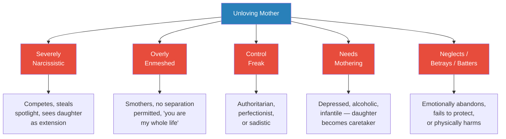
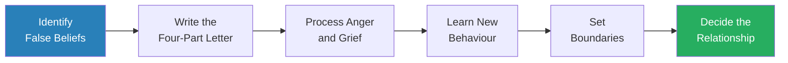
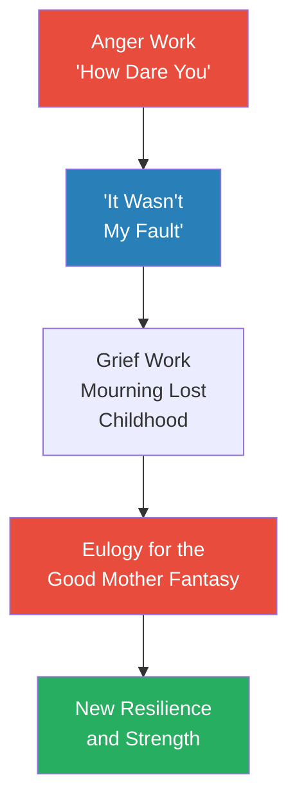
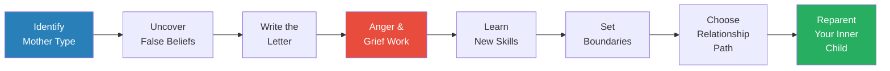
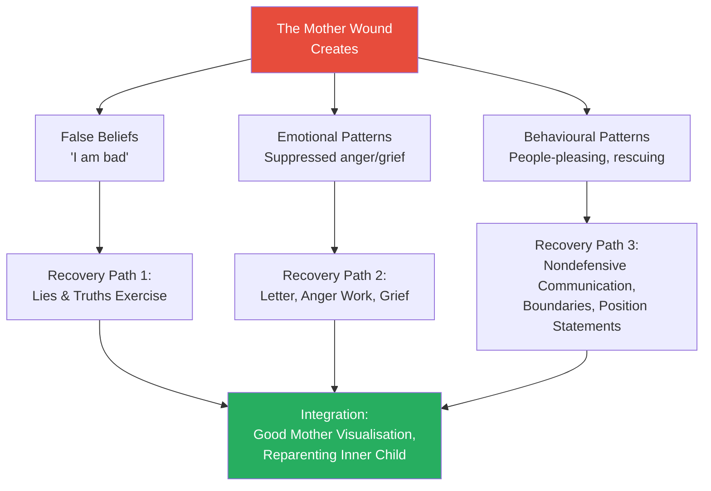

# Mothers Who Can't Love — Susan Forward

> *If you were that little girl, the daughter of a mother who couldn't give you the love you needed so much, it's likely that you now go through your days with a cavernous gap in your confidence, a sense of emptiness and sadness. You're never truly comfortable in your own skin. You may not trust your ability to love. And you can't step fully into your life until you heal that gaping mother wound.*

---

## About the Author

*Susan Forward, PhD, is a therapist, lecturer, and bestselling author who spent over thirty-five years treating women damaged by unloving mothers. After writing [[Toxic Parents - Susan Forward]], she believed she had said everything she needed to about destructive parenting — until an unrelenting stream of wounded daughters convinced her that the mother wound demanded its own focused treatment. Forward is also the author of [[Emotional Blackmail - Susan Forward]] and Men Who Hate Women and the Women Who Love Them. Her clinical style is distinctive for its blend of unflinching directness, genuine warmth, and concrete behavioural strategies — she doesn't merely explain the wound, she teaches you how to heal it. Forward herself resolved a painful relationship with her own mother, and could not give herself permission to write this book until after her mother died.*

---

## The Big Idea

Girls define their emerging womanhood by identifying and bonding with their mothers. When that vital process is distorted — because the mother is narcissistic, smothering, controlling, depressed, neglectful, or abusive — the daughter is left to struggle alone to find a solid sense of herself. She makes sense of her mother's hurtful behaviour by turning it into <b style="color: #e74c3c">self-blame and feelings of inadequacy that persist into adulthood no matter how accomplished she is</b>. Recovery requires identifying which of the <b style="color: #2980b9">five types of unloving mothers</b> shaped you, confronting the false beliefs your mother implanted, processing the anger and grief you've buried, and learning specific behavioural tools — nondefensive communication, position statements, and boundary-setting — to <b style="color: #27ae60">reclaim the power that is rightfully yours</b>.

> [!tip] Core Insight
> A little girl who was criticised, ignored, or abused by an unloving mother becomes an adult who tells herself she'll never be good enough. Because if you really were worthy of love, a voice inside whispers, your mother would have given it to you. That voice is lying.

**A note on gender:** Forward wrote this book primarily for daughters, but she acknowledges explicitly that sons carry the same wounds. The principles, exercises, and healing strategies apply across gender. The mother-daughter bond simply has a unique developmental significance because girls define their womanhood through that relationship.

---

## Key Concepts at a Glance

| Concept | One-line summary |
|---------|-----------------|
| **The Mother Wound** | Specific damage from inadequate maternal love that distorts self-worth, relationships, and identity |
| **Five Types of Unloving Mothers** | Narcissistic, enmeshed, controlling, needing mothering, neglecting/betraying/battering |
| **False Beliefs / Unconscious Programming** | Three categories of lies mothers implant about who you are, what you owe, and your role |
| **Lies and Truths Exercise** | Externalize false messages, burn them, release truths — reprogram the unconscious |
| **The Four-Part Letter** | Structured letter: what you did, how I felt, how it affected my life, what I want now |
| **"How Dare You" Exercise** | Empty-chair anger work to access suppressed rage at mother |
| **Eulogy for the Good Mother Fantasy** | Symbolic burial of the hope that mother will transform |
| **Nondefensive Communication** | Specific phrases that break the attack-defend cycle |
| **Position Statements** | "I am no longer willing to..." boundary declarations |
| **Adult Daughter's Bill of Rights** | Ten rights including anger, saying no, making mistakes, and being treated with respect |
| **Four Relationship Options** | Continue asserting, negotiate, tea party relationship, or cut off entirely |
| **Good Mother Visualisation** | Reparenting exercise connecting with the nurturing energy inside you |

---

## At a Glance

- **The Problem:** Millions of women carry crippling self-doubt, broken relationships, and emotional dysfunction rooted in how their mothers treated them — yet most cannot see the connection because questioning a mother's love is the deepest taboo
- **The Insight:** Children blame themselves for their mother's failure to love because it feels safer than accepting the protector cannot be trusted — that self-blame persists for decades
- **The Method:** A two-part journey — identify which of the five types of unloving mother shaped you, then heal through truth-telling, emotional processing, and new behavioural skills
- **The Provocation:** <b style="color: #e74c3c">You don't need your mother to change in order to heal — you need to stop waiting for her and start changing yourself</b>

---

## The 30-Second Version

Your mother planted mental and emotional seeds in you. In healthy families, those are seeds of love, respect, and independence. In families with an unloving mother, they are seeds of <b style="color: #e74c3c">self-blame, inadequacy, and the belief that love must be earned</b>. As you grew, those seeds became invisible weeds that invaded your relationships, your career, and your self-worth. Forward identifies five types of unloving mothers — severely narcissistic, overly enmeshed, control freak, mothers who need mothering, and mothers who neglect, betray, and batter — and shows how each produces specific wounds. Recovery requires <b style="color: #2980b9">identifying the false beliefs your mother implanted</b>, confronting the anger and grief you've suppressed, learning nondefensive communication and boundary-setting, and deciding what kind of relationship — if any — you want going forward. The pivotal realisation is simple but life-changing: <b style="color: #27ae60">"It wasn't my fault."</b>

---

## The 5-Minute Version

### The Taboo of Questioning Your Mother's Love

*Forward opens by explaining why the mother wound is so difficult to address — and why most daughters spend decades defending the very person who harmed them.*

- Motherhood occupies a sacred place in every culture — <b style="color: #e74c3c">"Don't you dare say anything bad about your mother" is among the most powerful commands a child absorbs</b>
- Children cannot face the terrifying fact that the all-powerful protector is actually the source of pain, so they develop two doctrines:
  - "I am bad and my parents are good"
  - "I am weak and my parents are strong"
- These beliefs persist long after physical dependence ends — even after the mother dies
- The result: adult daughters who are accomplished professionals, good partners, and loving parents still feel fundamentally defective because a voice inside whispers that if they were worthy of love, their mother would have given it to them

> [!example] Heather — The Sun with No Warmth
> - Heather, 34, a pharmaceutical sales rep, was pregnant with her first child and terrified she would become her mother
> - She described her mother with a striking metaphor: on a business trip, she found the sunniest spot — "it sure looked like the sun and it was bright like the sun, but there was absolutely no warmth coming from it"
> - Her mother gave birthday parties and sometimes attended school events, but behind closed doors offered only criticism and cold indifference
> - Heather had found a partner who truly loved her, yet she still felt like a fraud — at 34, still waiting for a mother's acknowledgment that would probably never come
> **The lesson:** The mother wound is not about dramatic abuse — it's about the consistent absence of warmth that leaves a daughter starving.

---

### What Makes a Good Mother (And What Doesn't)

- A good mother is not expected to be perfect — she has her own scars, her own needs, she may lose her temper
- <b style="color: #27ae60">The test is whether her dominant behaviour engenders in her daughter a belief in her own value and nourishes her self-respect, confidence, and safety</b>
- If it does, that mother is doing a good job — whether she is wonderful or just "good enough"
- What Forward's clients experienced was the opposite: mothers whose dominant pattern was criticism, competition, smothering, neglect, or cruelty

---

*Forward identifies five types of unloving mothers — most real mothers exhibit traits of more than one type, and daughters of any type carry many of the same scars.*

---

## Part One: Identifying the Mother Wound

### The High Cost of Missing a Mother's Love

*Before introducing the five types, Forward explains why the mother wound cuts deeper than any other.*

- The effects of growing up without a mother's love are painful and wounding in a way that no other relationship injury can match
- Girls define their emerging womanhood by identifying and bonding with their mothers — when that process is distorted, the daughter's very identity is undermined
- It rarely occurs to daughters that their mothers were not loving — admitting that possibility produces acute anxiety because the child's survival is so closely tied to the vital caretaker
- <b style="color: #e74c3c">It's far safer for a child to believe: "If there's something wrong between us, it's because there's something wrong with ME"</b>
- She makes sense of her mother's hurtful behaviour by turning it into self-blame — feelings that persist into adulthood no matter how accomplished she is
- A strong mother bond is the foundation for confidence, faith in oneself as a woman, partner, and mother
- When it is missing, women often struggle for a lifetime with a bewildering sense of loss

#### The Checklist — You Can't Call It Love

Forward provides diagnostic checklists. Does your mother regularly:

- Demean or criticise you?
- Make you a scapegoat?
- Take credit when things go well and blame you when they go wrong?
- Treat you as if you're incapable of making your own decisions?
- Turn on the charm for other people but turn cold when alone with you?
- Try to upstage you or flirt with your significant other?
- Tell you that you are the reason for her depression or unfulfilled life?
- Use money to manipulate you?
- Threaten to make your life difficult if you don't comply?

And as a result, do you:

- Wonder if your mother loves you — and feel ashamed that she may not?
- Feel responsible for the happiness of everyone but yourself?
- Believe that love is something you have to earn?
- Hide details of your life because she'll use your truths against you?
- Feel scared, guilty, and small no matter how much you accomplish?

---

### Type 1 — The Severely Narcissistic Mother

*The narcissistic mother treats her daughter as an extension of herself — a mirror to reflect her glory, a competitor to be vanquished, or an inconvenience to be dismissed.*

- These mothers are <b style="color: #2980b9">consumed by their own needs for attention, admiration, and control</b>
- The daughter exists only as a supporting character in the mother's story
- Key behaviours include:
  - Competing with her daughter — for attention, for men, for accomplishments
  - Taking credit for the daughter's successes and blaming her for failures
  - Flirting with the daughter's partner or undermining her relationships
  - Turning on the charm for outsiders but becoming cold or cruel in private
  - Treating the daughter's achievements as threats rather than celebrations

> [!example] Sharon — "My Little Failure"
> - Sharon, an MBA working as a doctor's receptionist, developed panic attacks after conflicts with her narcissistic mother
> - At Aunt Mona's birthday lunch, her mother announced: "She's working in a doctor's office. As a receptionist. All that education down the drain. She's my little failure"
> - Sharon tried to defend herself ("I am not a failure!") but her defensive responses only fed the cycle
> - Forward taught her nondefensive communication: "I don't accept your definition of me" — and Sharon reported the panic attacks significantly lessened
> **The lesson:** The narcissistic mother defines you in her terms. Recovery begins when you stop accepting her definition.

- Daughters of narcissistic mothers carry specific wounds:
  - Belief they cannot outshine their mother or be happier than she is
  - Tendency to sabotage success, relationships, and desires
  - Deep-seated feeling of being a fraud despite accomplishments
  - Choosing incompatible partners or rescuing broken people

---

#### What Drives the Narcissistic Mother?

- Narcissistic mothers are deeply insecure beneath the bravado
- They may have been deprived of attention and validation in their own childhoods
- They compensate by demanding that their daughters provide what they never received
- The daughter becomes a narcissistic supply — existing to reflect the mother's worth
- When the daughter develops her own identity, the narcissistic mother experiences it as abandonment or competition
- <b style="color: #e74c3c">Key wound for daughters: the belief that their own success and happiness threaten the most important person in their world</b>

#### Unconscious Beliefs Implanted by the Narcissistic Mother

- **Conscious belief:** I really want to find a good partner
- **Unconscious beliefs:** I'm not entitled to love. I can't compete. Who would want me? I can't bring home a successful, loving partner — Mom will flirt with him or rip him to shreds. I can't be happier than she is
- **Self-defeating actions:** Mistrust overtures from good candidates, choose incompatible partners, become a rescuer for people who won't take responsibility

- **Conscious belief:** I really want to be successful
- **Unconscious beliefs:** I'm not allowed to outshine my mother. She knows who I really am. I'll never measure up
- **Self-defeating actions:** Show up late, leave work undone, miss deadlines, sabotage opportunities

---

### Type 2 — The Overly Enmeshed Mother

*The enmeshed mother doesn't know where she ends and her daughter begins — she treats the relationship as a symbiotic unit from which separation is betrayal.*

- <b style="color: #2980b9">Enmeshment masquerades as love</b> — "I love you so much I need to know everything about your life"
- Key behaviours include:
  - Demanding daily (or multiple daily) phone calls and check-ins
  - Scheduling herself into every aspect of the daughter's life
  - Treating the daughter's independence as personal abandonment
  - Using guilt and pity to maintain the bond: "I'm just a lonely old lady"
  - Making the daughter responsible for her emotional wellbeing
- The daughter grows up unable to separate her own feelings from her mother's
- She may fear abandonment, be overly clingy with partners, or lack confidence in her own abilities

> [!example] Lauren — The Daily Check-In
> - Lauren, a stockbroker, was required to call her enmeshed mother every single night
> - When Lauren missed one call, her mother said: "I was sitting here, wondering if something terrible had happened to you. I didn't get a bit of sleep"
> - Forward helped Lauren set a boundary: calls would decrease to two or three times a week
> - Lauren's mother cried, guilted, and asked "Don't you love me anymore?" — but Lauren held firm
> - Two weeks later: "I'm really starting to feel a lot less smothered, and a lot less guilty. And I like her a lot better when I don't resent her so much"
> **The lesson:** Enmeshment is not love — it is ownership. Pulling away feels like betrayal but is actually the beginning of a real relationship.

---

#### The Tentacles of Enmeshment

- Enmeshed mothers often use directives that masquerade as affection:
  - "We're so close we have to share everything; no secrets"
  - "You're my best friend" / "I need you so much"
  - "I love you so much more than I care about your father"
  - "You'll always be my little girl"
- These messages feel seductive on the surface but have a desperation and smothering quality
- They place the burden for the mother's wellbeing squarely on the daughter's shoulders
- The daughter never develops true independence because separation feels like murder — she is, in her mind, the only thing keeping her mother alive
- <b style="color: #e74c3c">If you marry, change jobs, move cities, or develop any relationship that doesn't include her, the enmeshed mother experiences it as betrayal</b>
- As a result, daughters of enmeshed mothers:
  - Have a great fear of abandonment or separation
  - May be overly clingy with partners or their own children
  - Know precisely how to make their mother happy but struggle to satisfy their own souls
  - Cannot tell where their feelings end and their mother's begin

---

### Type 3 — The Control Freak Mother

*The controlling mother keeps a heavy hand clamped down on her daughter — sometimes through criticism, sometimes through perfectionism, sometimes through outright sadism.*

- Control is appropriate when a child is small, but an important part of parenting is <b style="color: #e74c3c">gradually stepping back to let a daughter learn for herself</b>
- Control freak mothers never step back — they continue demanding obedience deep into adulthood
- Three subtypes:
  - **Overt controllers** — threats, ultimatums, "If you marry that man, you're no longer part of this family"
  - **Perfectionists** — impossible standards, every B-plus a failure, military-style discipline
  - **Sadistic controllers** — derive warped pleasure from humiliation and deprivation

> [!example] Karen — Trapped Between Mother and Fiancé
> - Karen, 27, became engaged to Daniel, a Latino Catholic schoolteacher
> - Her mother Charlene called him "your little gym teacher friend" and threatened: "If you go through with this, you're not my daughter anymore"
> - Karen was at her place until 2 AM, haranguing her about the engagement
> - Karen froze, said "I'm sorry, Mom" — and Daniel said "That's unbelievable. You have nothing to be sorry for"
> - Through therapy, Karen learned to set firm boundaries: "It's no longer acceptable for you to berate Daniel. The subject of the wedding is off-limits"
> **The lesson:** Controlled daughters become doormats because their healthy instincts to disagree and say no were stunted in childhood.

> [!example] Samantha — The Rebel Route
> - Samantha, 29, was raised by a sadistically controlling mother who withheld her from a basketball tournament for getting one C on a quiz
> - "I remember sitting in my room watching the clock, hoping until the last minute she would change her mind"
> - As a teenager, Samantha discovered that her body was the one thing even her mother couldn't control — she began using sex, drugs, and bulimia as escape routes
> - Self-destructive rebellion isn't freedom — the mother is still controlling through the rebellion
> **The lesson:** Many daughters of controllers destroy their first taste of freedom by acting out self-destructively.

---

#### What's Driving the Controlling Mother?

- These mothers seem to be very displeased with their lives
- They may have come from homes where they were themselves controlled and belittled
- They may be controlled and put down by husbands or bosses
- <b style="color: #2980b9">Without some sense of empowerment, they feel lost — their daughter becomes the one person they CAN control</b>
- The control that has the most far-reaching impact comes not from individual incidents but from the patterns, reactions, and expectations she has implanted so successfully in you
- Even if you think you've pushed her away, her programming runs beneath consciousness

> [!example] Michelle — How Criticism Creates a Critic
> - Michelle, 34, a graphic artist, was losing her boyfriend Luke because of her relentless criticism of him — socks on the floor, dishes in the sink, T-shirts he wore
> - Luke: "God, you sound just like your mother"
> - Michelle broke down: "To hear you say that... That's my MOM. Picky. So critical. I've always sworn I would never, ever be like her. And here I am"
> - Her mother was a tyrant — all about perfection. If Michelle brought home all As and one B-plus, she lost privileges for the B
> - "I was the only girl in school who wasn't even allowed to wear pants. The kids made fun of me. And Mom never stood up for me — she said I had to learn to be tough"
> - One of the most common and distressing offshoots of a mother's control is that the daughter becomes the bully she swore she'd never be
> **The lesson:** Our mothers' imprinting is so pervasive that we often behave like them without even realising it. But patterns can be broken once we're aware of them.

- If you're struggling with people-pleasing, perfectionism, a tendency to bully or be bullied, Forward assures you: these are learned behaviours, and you can unlearn them

---

### Type 4 — Mothers Who Need Mothering

*When a mother is depressed, alcoholic, or infantile, the daughter finds herself taking on the role of parent, protector, and confidante — a role reversal that robs her of childhood.*

- These daughters were called "so grown-up" and "wise beyond your years" — praise that masked exploitation
- <b style="color: #2980b9">Repetition compulsion</b> — the drive to repeat old behavioural patterns hoping to get different results
  - As children, they couldn't fix their mothers and felt inadequate
  - As adults, they do too much, give too much, help too much — trying to "get it right this time"
- They become experts in other people's needs but cannot identify their own

> [!example] Allison — Falling for Fixer-Uppers
> - Allison, 44, a yoga instructor, had a history of choosing men who needed rescuing
> - Her current partner Tom was a part-time waiter and aspiring photographer — she bought him expensive equipment, but he lost interest
> - "I feel like I married my mother. He's just like her. I always get involved with men I want to nurture and save"
> - Allison's mother was depressed, helpless, used Allison as counsellor from childhood: "When is somebody going to take care of me?"
> **The lesson:** When your entire value as a child came from being a caretaker, you never learned to let yourself be cared for.

> [!example] Jody — The Daughter Who Mothered an Alcoholic
> - Jody, 38, had been her alcoholic mother's caretaker since childhood — cooking dinner, putting out lit cigarettes, dumping scotch bottles
> - At Thanksgiving, her mother pointed at Jody and yelled: "This is why I drink!"
> - Now with a new baby, Jody was torn: "I feel like she's my child. How do I abandon my child?"
> - Forward reminded her: "You have a big responsibility — to yourself. Your mother will not do anything for herself"
> **The lesson:** Depression and addiction don't erase a mother's responsibility to you — and your responsibility to yourself must come first.

---

#### Telltale Signs You Grew Up as a "Little Adult"

When you were a child, did you:

- Believe your most important job was to solve your mother's problems — no matter the cost to you?
- Ignore your own feelings and pay attention only to what she wanted?
- Protect her from the consequences of her behaviour?
- Lie or cover up for her?
- Think your good feelings about yourself depended on her approval?
- Have to keep her behaviour secret from friends?

As an adult, do these statements ring true:

- I will do anything to avoid upsetting my mother and other adults in my life
- I am a perfectionist, and I blame myself for everything that goes wrong
- People like me not for myself but for what I can do for them
- I feel angry, unappreciated, and used much of the time, but I push these feelings deep inside

- The cost of growing up as a "little adult" is high: you got cheated out of a childhood
- <b style="color: #27ae60">There is a cruel twist: the caretaking role is always a setup for failure because a young child doesn't have the power to solve her mother's problems</b>
- When her efforts fall short, she feels inadequate and ashamed
- She resolves: when I'm grown, I'll "get it right" — and the repetition compulsion begins
- Allison described it perfectly: "I feel so tired of doing everything. When is somebody going to take care of ME?"

---

### Type 5 — Mothers Who Neglect, Betray, and Batter

*These mothers are mothers in name only — so incapable of caring that they put the lie to the assumption that bonding is intrinsic to motherhood.*

- Like sea turtles who deposit their eggs in the sand and go back to the sea, some mothers disappear emotionally almost as soon as they've given birth
- They may be physically present, but they look right through their little girls — preoccupied with their own needs
- So incapable of caring are they that they put the lie to the assumption that bonding is intrinsic to motherhood
- These mothers treat daughters like objects — resenting, blaming, withholding even the smallest kindness
- In the worst cases, they fail to protect from predators and abusers — or become abusers themselves
- They leave in their wake daughters who are fearful, angry, ravenous for affection, and forever struggling

#### The Scars of Feeling Unwanted

- Daughters who were emotionally abandoned develop a specific wound: the conviction that they are fundamentally unwanted
- "I didn't get to feel safe or be a child. I was so ill-equipped to handle life"
- They decide early that negative attention is better than no attention — getting in trouble at school just to feel seen
- As adults, they give up money, success, plans — anything — to get someone to love them
- They never learned they could be loved for themselves
- <b style="color: #e74c3c">Trust becomes a casualty — they either trust nobody or trust everybody indiscriminately</b>
  - Some assume everyone will hurt them, becoming fearful and suspicious
  - Others swing to the opposite extreme, ignoring warning signs because their desperation for love overrides their judgment

> [!example] Emily — The Invisible Daughter
> - Emily, 36, grew up with a mother who never hugged her or said she loved her
> - Her mother once said: "I wish you'd never been born"
> - Emily learned that negative attention was better than none — got in trouble at school just to feel seen
> - As an adult, she chose withdrawn, emotionally unavailable partners: "It feels so familiar it's almost comfortable"
> **The lesson:** The word "invisible" appears again and again from daughters of neglectful mothers. Emotional abandonment is as devastating as overt abuse.

> [!example] Kim — The Mother Who Failed to Protect
> - Kim, 42, was physically beaten by her father regularly — and her mother stood by as a silent witness
> - "I know she heard me scream, heard the belt hitting my skin. And she never once protected me"
> - Kim counted the extra beds at her grandmother's house and begged to escape — but her mother refused
> - As an adult, Kim became an overprotective disciplinarian with her own daughter, swinging to the opposite extreme
> **The lesson:** A mother who knowingly fails to protect her daughter from harm is guilty of aiding the perpetrator. The betrayal of the silent witness cuts as deep as the violence itself.

---

## Part Two: Healing the Mother Wound

*Forward's healing path moves from insight through emotional processing to concrete behavioural change — you cannot skip steps, but you can go at your own pace.*

---

### Chapter 7 — The Beginnings of Truth

*Forward introduces the concept of unconscious programming — the false beliefs your mother installed like a virus in your operating system.*

- Three categories of false messages:
  1. **Messages that demean you** — "You're selfish," "You'll never amount to anything," "You're nothing but a burden"
  2. **Messages that unfairly burden you** — "You are my whole life," "I can't survive without you," "You're the only one who cares about me"
  3. **Messages about your role** — "It's your job to make me happy," "Honor thy mother means never get upset with me," "It's your job to keep peace in the family"
- These beliefs operate unconsciously — you may think you've moved past them, but they still run the show

#### The Lies and Truths Exercise

- <b style="color: #2980b9">Draw a line down a sheet of paper — LIES on the left, TRUTHS on the right</b>
- Write the lies your mother told you about yourself in her words
- Next to each lie, write the contradicting truth with specific evidence
- Then: cut out the lies, crumble them, and burn them (symbolically destroying their power)
- Attach the truths to a helium balloon and release it — a symbolic act of claiming who you really are

| Lie | Truth |
|-----|-------|
| "You're selfish" | "I'm generous, giving, and considerate of others" |
| "You can't survive without me" | "Just watch me" |
| "It's your job to make me happy" | "I tried my damnedest but nothing is ever enough, so I'm quitting this lousy job" |
| "No one will ever love you the way I do" | "I sure hope not" |

---

#### How Self-Defeating Patterns Play Out

Forward maps the connection between unconscious beliefs and self-defeating actions across three life areas:

**You may sabotage your relationships:**
- Conscious belief: I really want to find love
- Unconscious beliefs: I'm not entitled to love. Love must be earned. I'll choose someone I need to rescue because that's the only dynamic I know
- Self-defeating actions: Choose incompatible partners, rescue broken people, rule out the best candidates

**You may sabotage your career:**
- Conscious belief: I really want to be successful
- Unconscious beliefs: I'm not allowed to outshine my mother. I'll find ways to sabotage myself to fulfil her negative expectations
- Self-defeating actions: Show up late, pick fights, procrastinate, miss deadlines

**You may sabotage your deepest desires:**
- Conscious belief: I love making other people happy
- Unconscious beliefs: If I give up what I want and do things for others, I'll win their love. If I can get enough love, it will make up for how bad I feel about myself
- Self-defeating actions: Paste on a smile, stuff resentment, say "I don't know" when asked preferences, forget you have dreams of your own

> [!tip] Core Insight
> Watch out for the "if only" beliefs: "If only my mother would change, I would feel better." "If only she'd realise how much she hurts me, she'd be nicer." These keep you passive and waiting instead of doing the tough work of changing yourself.

---

### Chapter 8 — The Four-Part Letter

*The most direct and effective tool Forward uses in therapy is a structured letter that allows daughters to tell their full story without interruption.*

- The letter is written by hand (if possible) and <b style="color: #27ae60">read aloud to a trusted witness — writing is 50% of the work, reading aloud is the other 50%</b>
- The letter has four parts:
  1. **This is what you did to me** — spell it out, don't minimise, include the "small things"
  2. **This is how I felt about it at the time** — use feelings words (sad, furious, terrified), not thoughts ("I felt that...")
  3. **This is how it affected my life** — the most important section, connecting childhood to adult patterns
  4. **This is what I want from you now** — stepping into adult power, stating preferences

> [!tip] Core Insight
> Watch out for language that gives your power away. "I want you to let me live my life" makes your mother the warden. A far better phrasing: "I'm going to live my life my way. Without asking for your permission."

---

#### Real Examples from the Letters

Forward shares excerpts from her clients' letters that demonstrate the power of this exercise:

**Emily's "This Is What You Did to Me":**
- "You were so critical, there was no real bond of kindness. You would never let me hold your hand or tell me you loved me"
- "You told me the only reason you had me was because abortions weren't legal when you found out you were pregnant"
- "You never asked me how I felt, if I was okay, what I was interested in"

**Samantha's revelation during writing:**
- "I just remembered how you slapped me across the face on vacation, for no plausible reason. I think you didn't approve of the way I was eating my spaghetti"
- "Now I remember spitting blood after you punched me another time. I think I even lost a tooth — and the fact that it was a baby tooth shows how young I must've been"
- The act of writing gave Samantha access to memories so painful they had been buried in the unconscious

**Emily's "This Is How It Affected My Life":**
- "I have always lived on the fringe, like a girl looking into a playground but never feeling she can participate"
- "I was starved for physical contact. I confused sex for love. I attracted weak men, emotional boys, perennial adolescents who refused to grow up"
- "I'm constantly thinking: What do others want? What do they think? What do I have to do to make sure they are happy?"

**Letters about "What I Want From You Now":**
- To an alcoholic mother: "What I want from you now is for you to LET ME LIVE MY LIFE. Get out of my life and let me live it however I see fit"
- To a controlling mother: "I want you to understand that I will do nothing more to gain your approval. I will do things my way whether you like it or not"
- To a cold mother: "What do I want from you now? Nothing. Nothing at all"

---

### Chapter 9 — Tapping Anger and Grief

*Anger and grief are two sides of the same coin — one often hides the other. Healing requires both.*

#### The "How Dare You" Exercise

- Place an empty chair in front of you and imagine your mother sitting there
- Start sentences with "How dare you..." and finish with whatever she did
- Let the anger build and flow — it is not dangerous, it is information

> [!example] Allison's "How Dare You" Moment
> - Starting tentatively, Allison's voice gained force: "How DARE you suck me into your sick and twisted game! How DARE you make me your counsellor! How DARE you take away my happiness!"
> - Afterward: "Less like a victim. I actually feel stronger"
> - The anger gave her clarity about what she would no longer accept
> **The lesson:** Anger is not a dangerous force to be feared — it is a signal that something is wrong and needs to change.

#### "It Wasn't My Fault" — The Pivotal Realisation

- <b style="color: #27ae60">The single most important sentence in recovery</b>
- Forward guides Samantha to comfort her inner child: "You were a precious, sweet little girl and you didn't do anything bad"
- Samantha breaks through: "Why couldn't my mother have loved me like that? She couldn't have loved me and done those things to me"
- Then, with increasing power: "It wasn't my fault!" — repeated until believed

#### Eulogy for the Good Mother Fantasy

- Using dried flowers and a symbolic coffin, Forward guides a ritual burial
- "I hereby lay to rest my fantasy of the good mother. It wasn't in the cards for me. It didn't happen, and I know it never will. It wasn't my fault"
- <b style="color: #e74c3c">This ends the "if onlys"</b> — "If only I do this she'll be nice," "If only I try hard enough, she'll finally love me"

*Healing requires navigating both anger and grief — daughters swing between the two as they adjust to the truth. Neither can be skipped.*

---

#### Samantha's Inner Child Work

- Forward guided Samantha to comfort the hurt little girl inside her
- "Imagine that little girl sitting on your lap. She's hurting and she really needs your comfort"
- Samantha began: "Honey, I'm so sorry those bad things happened to you. I'm so sorry Mom was so mean to you"
- Then she stopped: "This is really hard — I feel so uncomfortable"
- Forward prompted her: "Say what you would say to a little girl who had been mistreated"
- Samantha continued: "You were a precious sweet little girl and you didn't do anything bad... I won't let anybody hurt you or scare you or punish you in really mean ways for no reason at all... You're safe now. You have a good mommy now"
- Then, the breakthrough: "Why couldn't my mother have said those things to me? She couldn't have loved me and done those things to me — that's not how someone who loves you behaves"
- Forward confirmed the painful truth: "Love doesn't make you feel terrified or lost or alone. What you've been describing isn't love"
- <b style="color: #27ae60">When that truth penetrates — "My mother couldn't love me and it wasn't my fault" — a great deal of emotion surfaces. Everyone who comes to this point must grieve the enormous losses they have had</b>

#### What You Lost

Forward enumerates the losses that daughters must grieve:

- The right to be playful and silly
- The joy of being a carefree kid — you were four, or fourteen, going on forty
- Predictability, consistency, and nurturing that could give you inner security
- Freedom to feel free and trusting
- Validation of your worth
- The truth that you are a unique and wonderful person whose job in life is to be herself

---

### Chapter 10 — Nondefensive Communication

*The most powerful behavioural tool Forward teaches is nondefensive communication — specific phrases that break the attack-defend cycle.*

- Defensive language is your enemy — every time you defend, you signal weakness and create an opening for more attack
- Common defensive phrases that fail:
  - "I am NOT." / "No I didn't."
  - "How can you say that about me?"
  - "Why do you always...?"
  - "I only did it because..."
- <b style="color: #27ae60">Nondefensive phrases that work:</b>
  - "Really?"
  - "I see."
  - "I'm sure you see it that way."
  - "You're entitled to your opinion."
  - "I don't accept your definition of me."
  - "Let's talk about this when you're calmer."
  - "This subject is off-limits."
  - "Guilt peddling and playing the pity card are not going to work anymore."

> [!example] Sharon's Breakthrough with Nondefensive Communication
> - Forward role-played as Sharon's mother: "She's my little failure"
> - Forward (as Sharon): "I'm sure you see it that way"
> - Sharon was stunned: "Really? That's it? I don't know what to say to that"
> - Forward: "Exactly. Neither will your mother. When you take the defensiveness away, there's not a lot for her to hold on to"
> - Sharon later reported: "With this script, I feel like I have a moat around me and she can't get to me the way she used to"
> **The lesson:** Change your behaviour and the feelings will catch up. You don't need to feel confident to act confident.

#### An Adult Daughter's Responsibilities

Before the rights come the responsibilities — a compass that leads back to self-nurturing choices:

- **Claiming your own self-worth** — no one else can do this for you
- **Having the life you want** — not the life your mother prescribed
- **Acknowledging and changing your own hurtful behaviour** — when you catch yourself replicating your mother's patterns
- **Finding your own adult power** — stepping out of the child role
- **Changing the behaviour that replicates your mother's programming** — the buck stops here

> [!warning] The Defensiveness Trap
> Every time you explain yourself, deny wrongdoing, rationalise, give excuses, or apologise to your mother, you think you're defending yourself — but you've actually been forced ONTO the defensive. There's a huge difference. To defend is to protect. Defensiveness signals weakness. It never positions you as an equal.

#### The Adult Daughter's Bill of Rights

1. You have the right to be treated with respect
2. You have the right to not take responsibility for anyone else's problems or bad behaviour
3. You have the right to get angry
4. You have the right to say no
5. You have the right to make mistakes
6. You have the right to have your own feelings, opinions, and convictions
7. You have the right to change your mind
8. You have the right to negotiate for change
9. You have the right to ask for emotional support or help
10. You have the right to protest unfair treatment or criticism

---

#### Lauren's Role-Play Victory

Forward used role-playing extensively to help daughters practice nondefensive communication:

- Forward played Lauren's enmeshed mother: "I've been so worried since you didn't call! I was sitting here wondering if something terrible happened. How could you make me worry like that? Don't you care about me?"
- Lauren's old response: "Of course I care! I've been calling every night for years. I just missed one night!"
- Forward modelled the new response: "I'm sorry you're upset. I certainly didn't intend to worry you"
- Lauren practised until the response felt natural — and reported back: "Mom was just flummoxed when I didn't take her bait. I feel like I have a moat around me and she can't get to me the way she used to"

- <b style="color: #27ae60">Key principle: change your behaviour and the feelings will catch up</b>
- You don't need to feel confident to act confident
- The pain and humiliation you felt when your mother had the upper hand will dramatically ease
- If you slip into old defensive patterns, it's okay — you'll get it right next time
- The anticipation is always worse than the doing

---

### Chapter 11 — Setting Boundaries

*Boundaries are the doors, windows, and fences of your emotional home — without them, you're exposed and vulnerable.*

- <b style="color: #2980b9">Four-step boundary process:</b>
  1. **Decide what you want** — what is and isn't okay
  2. **Use position statements** — "I am no longer willing to..." / "It is no longer acceptable for you to..."
  3. **Plan your responses** — anticipate pushback, practice nondefensive replies
  4. **Decide on consequences** — what you'll do (leave, hang up, limit contact) if boundaries aren't honoured

> [!abstract] Position Statement Examples
> - "Mom, I'm no longer willing to listen to your complaints about Dad. Have those conversations with someone other than me."
> - "It's not okay that you criticise my husband."
> - "It's no longer acceptable for you to drink in my house or around my children."
> - "I'm no longer willing to continue spending every Sunday with you. I am willing to make a monthly date."

- Key principle: <b style="color: #27ae60">you cannot change your mother's behaviour — only she can do that — but you can change the relationship by changing your own actions</b>
- Anticipate her casting herself as victim: "What have I done to deserve this?"
- Effective response: "Just calm down. There are some new ground rules in place and you need to hear them"

---

#### Karen's Boundary-Setting with a Volatile Mother

- Karen prepared a five-sentence script: "Mom, it's no longer acceptable for you to berate and insult Daniel, and it's no longer acceptable for you to insult me either. From here on out, the subject of the wedding and Daniel is off-limits. It's not okay for you to tell me who I can marry. If the subject comes up, I'll end the conversation. If you insult me, I'll end the conversation or leave"
- Forward advised: use the phone for volatile mothers — it lets you say what you need to from a safe space with your script in front of you
- Karen's report: "My stomach was totally in knots. She just roared at me. I held the phone away from my ear, then said, 'Stop right there. Screaming and berating me isn't going to work anymore.' She went silent. I said, 'Your choice is to have a civil conversation or no conversation at all. Those are the only options, Mother'"
- Her mother's response: "Fine. Go ahead and ruin your life." She slammed the phone
- Karen: "It didn't feel like a total victory, and I was churning inside. But I could look Daniel in the eye and not feel ashamed. I could really feel my integrity"

> [!tip] Core Insight
> Taking steps to put distance between yourself and verbal abuse will leave you upset and shaky. But along with the inner turmoil, you'll feel pride too — a sense of "Oh my God — look what I just did!" You CAN take care of yourself. You've tapped the warrior woman inside. She's always been there, waiting for you to find her.

---

### Chapter 12 — Four Relationship Options

*Once boundaries are set, you discover whether your mother is willing to change — and you choose your path forward.*

| Option | When to Use | What It Looks Like |
|--------|------------|-------------------|
| **Continue asserting** | Mother responds to limits over time | Keep using nondefensive communication and position statements |
| **Negotiate** | Complex situations needing mutual agreement | Spell out what both parties will do; monitor for backsliding |
| **Tea party relationship** | Mother won't change but you want some contact | Maintain superficial contact; protect vulnerabilities |
| **Cut off entirely** | Mother's behaviour is consistently destructive | End contact to protect your emotional health |

- Cutting off is the last resort but sometimes the only healthy choice
- <b style="color: #e74c3c">The old status quo is NOT one of the options</b>

---

#### Negotiating a Better Relationship

- Sometimes, after you've set boundaries and your mother has begun to honour them, a more structured negotiation is needed
- This involves sitting down and spelling out what both of you will do going forward
- Key principles:
  - Be specific — "I need you to stop criticising my parenting" not "I need you to be nicer"
  - Include consequences — "If you criticise me in front of the children, I will leave"
  - Monitor for backsliding — old patterns are tenacious
  - Don't expect perfection — but do expect consistent effort

#### The Tea Party Relationship

- For mothers who won't change but whom you don't want to cut off entirely
- Maintain contact but keep it superficial
- Protect your vulnerabilities — don't share anything she can use against you
- Think of it as being friendly acquaintances rather than intimate family
- This can work indefinitely for many daughters

---

### Chapter 13 — The Most Difficult Decision (Cutting Off)

- If your boundaries are repeatedly violated and your mother shows no willingness to change, cutting off may be necessary
- Forward recommends mailing the four-part letter as a formal statement of your position
- Anticipate family backlash — relatives may call as advocates, invoke "Honor thy mother," blame you
- Nondefensive responses for family: "This is between my mother and me" / "This is my decision and it's not negotiable"
- Key truth: <b style="color: #27ae60">family isn't determined solely by blood — you are discovering your family of choice</b>

#### Handling Family Backlash

- When you cut off from your mother, she will almost certainly sound the alarm to the extended family
- Expect: angry phone calls demanding apologies, accusations of "breaking up the family," religious guilt ("Honor thy mother")
- Relatives may blast you with criticism or invoke their tradition's version of duty
- Forward advises using the same nondefensive skills:
  - "This is between my mother and me"
  - "I don't choose to have this conversation"
  - "This is my decision and it's not negotiable"
  - "I know you're concerned, but I don't want to discuss this"
- Speak individually to immediate family members — father, siblings — to let them know you've taken this step for your emotional health
- Urge them not to take sides
- <b style="color: #27ae60">The people who really love you will support you. The ones who don't were never safe people to begin with</b>

> [!example] Karen's Aunt Meg
> - Karen's greatest fear was losing her beloved aunt and cousins
> - But when she told Aunt Meg what she was doing, Meg put her arm around her and said: "I understand perfectly, honey. Your mother's always been a bitch"
> - "I had to laugh, and I hadn't laughed in a while. Meg even offered to stand up with me at the wedding"
> **The lesson:** You don't know who will do what until you take the step. Many daughters are surprised by unexpected support from quarters they feared.

#### There Is No Sudden "Happily Ever After"

- After cutting off, many daughters bounce between highs and lows
- Relief and pride alternate with self-doubt and guilt
- This is normal — time is your best friend
- Family isn't determined solely by blood — Daniel's family had "adopted" Karen and made her feel truly welcome
- The roots of a new, healthier life are spreading beneath you even when you can't see them

---

### Chapter 14 — The Suddenly Dependent Mother

*What happens to your careful boundaries when your mother gets cancer, breaks a hip, or calls to say "Your father is dying"?*

- A crisis can reopen old wounds, unravel self-protective decisions, and reactivate longings for the love that never came
- Forward advises: temper hope with caution, but leave open the possibility of a new connection

> [!example] Deborah — "Mom's Got Cancer"
> - Deborah had established a superficial relationship with her formerly abusive mother — occasional dinners, conversation only about the grandchildren
> - When her mother was diagnosed with breast cancer, Deborah dropped everything to become full-time caregiver
> - Her mother said "I love you" for the first time — and Deborah nearly sacrificed her business, marriage, and health chasing that crumb
> - Forward's intervention: "You're allowed to have a life. You can't be the full-time caregiver for anyone and still have the energy to keep going"
> - Deborah found meal services, volunteer drivers, and student helpers — and accepted that she couldn't fix everything
> **The lesson:** Your mother's illness doesn't obligate you to destroy yourself. Taking care of yourself isn't turning your back on her.

---

### Coda — Connecting with the Good Mother

*The desire for good mothering never goes away — but you can find it in unexpected places.*

- Three sources of healing:
  1. **Observe good mothers** — watch how they praise, protect, and let go; absorb what healthy nurturing looks like
  2. **Remember people who genuinely loved you** — a teacher, aunt, grandmother; close your eyes and feel that love again
  3. **The Good Mother Visualisation** — imagine a beach, a good mother figure running toward you, wrapping you in her arms; then become that good mother yourself, holding the child you were

> [!abstract] The Good Mother Visualisation
> 1. Sit in a quiet, comfortable place
> 2. Bring to mind someone who treated you with kindness and respect
> 3. Imagine you're a little girl on a sandy beach with gentle waves
> 4. Picture your good mother coming toward you, thrilled to see you, wrapping you in her arms
> 5. Stay in that place as long as you like
> 6. Now become that good mother yourself — hold that little girl and say: "I love you, sweetie. I treasure you. You're a wonderful child"

- The unconscious is a sponge — the more Good Mother Exercises you send it, the less room there is for the old hurtful messages
- You are capable of giving and receiving the love your mother couldn't offer
- <b style="color: #27ae60">You have changed and grown. You can love.</b>

---

*The complete healing journey — from identification through emotional processing to behavioural change and self-nurturing.*

---

## The Aftermath — How Much Is Enough?

*Forward addresses the most agonising question daughters face when their mother becomes ill, infirm, or alone.*

- How does any daughter determine where her responsibilities begin and end?
- You may be surrounded by people who are certain they know what's right for you — but you are the only one who knows what you can handle
- <b style="color: #e74c3c">Your mother's illness or widowhood is not an excuse for her to behave badly</b>
- It doesn't obligate you to tolerate having your life turned upside down
- Possible levels of involvement:
  - Talk to doctors and help with treatment decisions, but not day-to-day care
  - Spend significant time for a defined period, then help find other support
  - Maintain the tea-party relationship you established, with compassionate modifications
  - Provide financial support but protect emotional boundaries
- Whatever you decide, you must attend to your own needs and boundaries FIRST
- <b style="color: #27ae60">Hold onto your new empowerment — remember how much of your life you spent as the one whose needs never mattered. The neglected side of yourself is still there inside, healing now because at last it sees you honouring it</b>

---

## Connecting with the Good Mother — Expanded Exercises

### Learn by Observing Good Mothers

- Forward gave Emily the assignment of spending time at playgrounds watching mothers with their children
- Emily reported: "There were a couple of moms who seemed to be enjoying their kids as much as I was. Their kids could run over and get a hug before running off for their next adventure. That's the kind of mom I'm going to be"
- Good mothers aren't perfect — they don't hover constantly
- They are "home base" — available, warm, present when needed
- Watch for the mix of connection and freedom, attention and affirmation
- <b style="color: #27ae60">If you can recognise loving behaviour, you can emulate it</b>
- If you're considering becoming a parent, test the waters by being a loving "aunt" to a neighbour's child or helping chaperone a school trip
- If you're already a mother, plug into a mothers' network — don't isolate yourself

### Write a Letter to Your Inner Child

- Tell that child all the things you would have wanted your mother to say
- Tell her she is safe now, loved, and that you will always be there for her

> [!example] Emily's Letter to Little Emily
> - "I am so sorry that you were not treated very well when you were little. I am so sorry that your mom was not affectionate with you"
> - "If I could be your mom, I would start by tucking you in every night, giving you a kiss, and telling you how much I love you"
> - "I wish I could have been a soft chest for you to cry on and warm arms to rock you and to whisper, 'There, there, I know you're so sad and angry. It's okay, my darling — cry it out'"
> **The lesson:** The more you give that inner little girl the love she has always longed for, the more you free up to give to your partner, friends, family, and children. Love is like a homing pigeon — we send it out, but it always returns.

---

## Summary of Forward's Healing Tools

| Tool | Purpose | When to Use |
|------|---------|-------------|
| **Lies and Truths Exercise** | Identify and challenge false beliefs | First step — before emotional work |
| **Four-Part Letter** | Tell your full story without interruption | After identifying beliefs; write by hand |
| **"How Dare You" Exercise** | Access suppressed anger | When grief dominates and anger is hidden |
| **Inner Child Comfort** | Compassion for the child you were | When self-blame surfaces |
| **"It Wasn't My Fault"** | Break the core false belief | Pivotal moment; repeat until believed |
| **Eulogy for Good Mother** | End the "if only" cycle | When still hoping mother will change |
| **Nondefensive Phrases** | Break attack-defend cycle | Every interaction with mother |
| **Position Statements** | Declare boundaries clearly | When ready to set specific limits |
| **Bill of Rights** | Anchor your entitlements | When wavering or feeling guilty |
| **Good Mother Visualisation** | Reparent yourself | Ongoing — as needed for comfort |
| **Letter to Inner Child** | Give yourself the words you deserved | After processing anger and grief |

---

## A Toolbox for Handling Anger and Grief

Forward provides a comprehensive set of techniques for managing the intense emotions that surface during recovery:

**For Anger:**
1. Feel your anger without judging it — approach it with curiosity
2. Acknowledge your right to be angry — anger doesn't make you a bad person
3. Get a realistic idea of what anger looks like — watch women who express it with strength and firmness
4. Release the energy physically — run, swim, exercise
5. Use visualisation for calm — imagine your most beautiful, serene place

**For Grief:**
- There is no grief-erasing exercise — you must go THROUGH grief, not around it
- It will diminish gradually if you let yourself feel it
- Use physical activity and visualisation when it feels overwhelming
- If grief feels like a deep, black river — remember: you're not going crazy, you're grieving

**For Self-Blame ("How could I have let this happen?"):**
- You were dependent, helpless, and programmed to obey
- You did the best you could with the information you had
- You were so disempowered that you didn't have the tools to change
- Self-recrimination resolves nothing — choose self-forgiveness instead

---

## The "If Only" Trap — And How to Escape It

Forward identifies a particularly destructive set of beliefs that keep daughters stuck:

- **"If only my mother would change, I would feel better about myself"**
  - This keeps you waiting indefinitely for a transformation that is overwhelmingly unlikely
  - It hands your mother the keys to your happiness
  - As long as you're waiting for HER to change, you're not doing the work of changing YOURSELF

- **"If only she'd realise how much she hurts me, she would be nicer to me"**
  - This assumes your mother lacks awareness — but most unloving mothers know exactly what they're doing
  - They choose their behaviour because it works for them
  - More information will not produce more empathy in someone who lacks it

- **"Even though she can be pretty mean, I know she has my best interests at heart. I'm overreacting"**
  - This is the voice of the deified parent — the child's need to believe the protector is good
  - If you consistently feel hurt after interactions with your mother, you are not overreacting
  - Your feelings are valid data about the relationship

> [!warning] The Danger of "If Only"
> "If only" beliefs keep you in an alternative reality of yearning and longing. They keep you passive and reactive instead of proactive. You are waiting for your mother to change instead of doing the tough work of changing yourself. It's time to stop waiting. It's time to reclaim your own power.

---

## The Stages of Recovery — What to Expect

Forward maps the emotional territory of recovery:

### Early Days
- Writing the letter brings memories and feelings to the surface
- You may feel raw, teary, volatile
- Old triggers may feel more intense because you're no longer numbing yourself
- This is NORMAL — it means the process is working

### The Anger Phase
- You may swing between grief and fury
- Irritations that were easy to dismiss may now trigger unusual anger
- You may find yourself angry at yourself: "How could I have let this happen?"
- <b style="color: #27ae60">Self-recrimination is an exercise in futility</b> — replace it with:
  - "I did the best I could with the information I had"
  - "I was programmed early to defer to my mother"
  - "Not confronting our fear denies the grace of growth"
  - "I forgive myself"

### The Grief Phase
- Grief is like a river — you must go THROUGH it, not around it
- You may feel like you're at the bottom of a deep, black river and will never come up for air
- You are not going crazy — you are grieving
- The grief will diminish gradually if you let yourself feel it
- Over time, it will feel more like a twinge than a stab

### The Behavioural Change Phase
- Nondefensive communication and position statements feel awkward at first
- Like new shoes that pinch — comfort comes with practice
- You will slip into old defensive patterns — this is expected
- The anticipation is always worse than the doing

### The Ongoing Phase
- Recovery is a process, not a destination
- Regrets about the love you missed may resurface even years later
- But the pain will be manageable
- And you can be soothed to an amazing degree by the mothering energy of others
- <b style="color: #27ae60">There are many people who can fill the role of good mother — grandparents, relatives, friends, anyone who values and respects you</b>

---

## Verdict

*Forward's healing framework addresses all three dimensions of the mother wound — false beliefs, suppressed emotions, and self-defeating behaviours — converging in reparenting and self-nurturing.*

---

Forward's greatest contribution is making the invisible visible. The mother wound is perhaps the most protected form of emotional damage in our culture — surrounded by taboos, defended by guilt, and reinforced by every Mother's Day card. By naming the five types, showing real therapy sessions, and providing concrete tools, Forward gives daughters permission to see clearly what happened to them and, more importantly, to do something about it.

The book's weakness is its occasional datedness — the balloon-releasing exercise may feel whimsical to some, and Forward's therapeutic style reflects an earlier era of psychology. The exercises are powerful but best done with professional support, especially for daughters of the more severe types (neglecting, betraying, battering mothers). Forward herself repeatedly recommends therapy throughout the book.

This is the book for any woman (or man) who has spent years trying to earn a mother's love and is finally ready to stop. It pairs naturally with [[Toxic Parents - Susan Forward]] for the broader picture of family dysfunction, [[Will I Ever Be Good Enough - Karyl McBride]] for a deeper dive into narcissistic mothers specifically, and [[Emotional Blackmail - Susan Forward]] for understanding the manipulation tactics that keep daughters trapped. Readers seeking the perspective of adult children of narcissistic family systems should also explore [[Will the Drama Ever End - Karyl McBride]] and [[Children of the Self-Absorbed - Nina W. Brown]].

Forward ends with a promise grounded in thirty-five years of clinical evidence: the mother wound is deep, but it is not permanent. Real love — the kind that values you, respects you, and makes your life better — is available to you now. It comes from others who have earned your trust, from the good mother energy inside yourself, and from the simple but revolutionary act of treating yourself with the care that you deserved all along.

"You have changed and grown. You can love."

---

## Quick Reference: The Five Types and Their Signatures

| Type | Her Signature Move | Your Signature Wound | Your Recovery Focus |
|------|-------------------|---------------------|-------------------|
| **Narcissistic** | Competes, steals spotlight, makes everything about her | "I can't outshine anyone; I'm a fraud" | Separate your worth from her approval |
| **Enmeshed** | Smothers, guilts, treats your independence as betrayal | "I can't be separate; separation = death" | Build autonomous identity and relationships |
| **Controlling** | Criticises, threatens, dictates every choice | "I'm a doormat; I can't stand up for myself" | Learn assertiveness and nondefensive communication |
| **Needs Mothering** | Depressed, alcoholic, makes you the parent | "I exist to rescue others; who rescues me?" | Stop the repetition compulsion; learn to receive |
| **Neglects/Betrays** | Ignores, abandons, fails to protect | "I'm invisible; I don't deserve love" | Build trust slowly; learn you are worthy of being seen |
