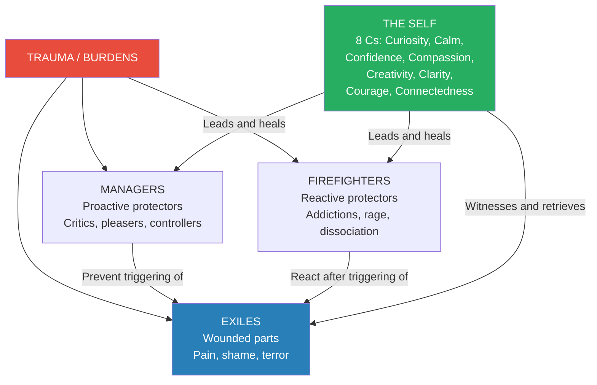
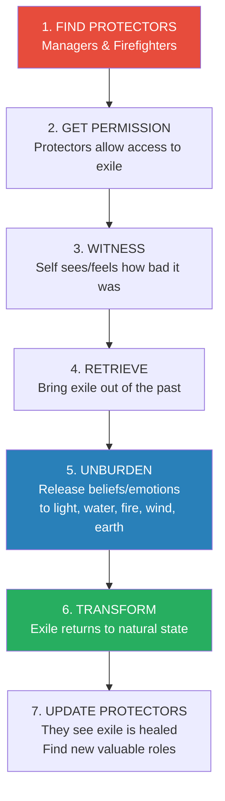
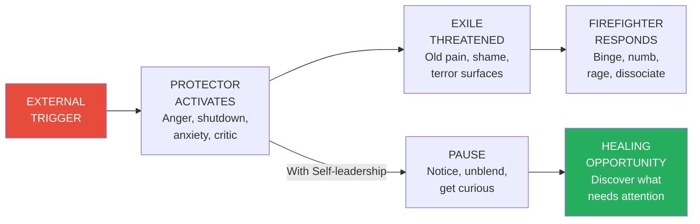
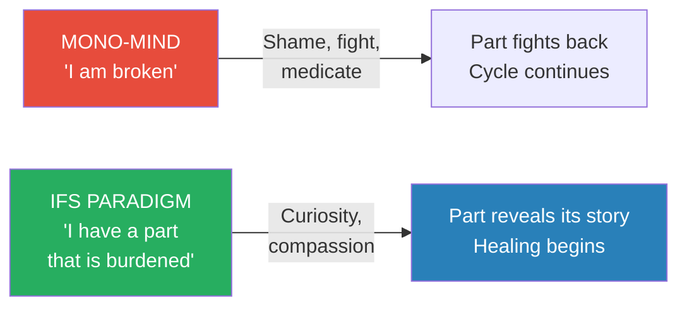
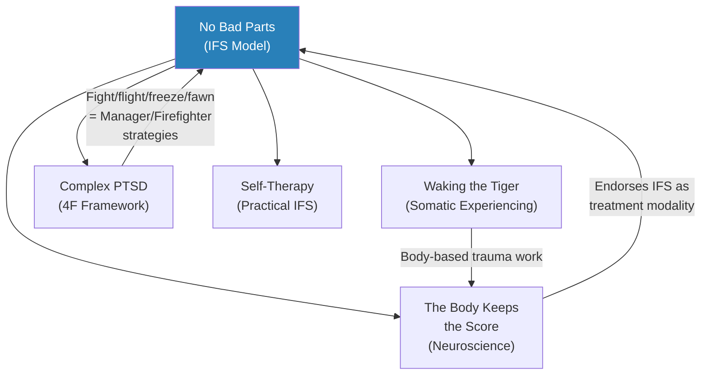

# No Bad Parts — Richard Schwartz

> Richard Schwartz stumbled onto one of the most radical ideas in modern psychotherapy: that the human mind is naturally multiple, and that every single part of us — even the parts that binge, rage, criticize, or self-harm — is fundamentally good. They are not defects. They are not diseases. They are young, burdened protectors forced into extreme roles by what happened to us, and they are waiting to be released. Beneath all the noise of these protective parts lies the Self — an undamaged essence of calm, curiosity, compassion, and connectedness that every person possesses and that cannot be destroyed by any amount of trauma. The Self does not need to be built up through years of practice. It merely needs to be uncovered by asking the parts that obscure it to step aside. When they do, healing happens — not through willpower, not through medication, not through cognitive correction, but through the simple, radical act of turning toward your own inner suffering with love.
> This is the book that makes Internal Family Systems accessible to everyone — not just therapists, but anyone willing to look inside and discover that the voices in their head are not enemies to be conquered but a family to be led.

---

## About the Author

- Richard C. Schwartz holds a PhD in family therapy and developed Internal Family Systems (IFS) beginning in the early 1980s while working with bulimic clients at the University of Illinois at Chicago
- He did not set out to create a new therapy model — his clients taught him about parts by describing their inner experience with startling consistency and detail
- He was deeply trained in systems thinking from family therapy, which gave him the framework to recognize that inner parts interacted in patterns identical to the dysfunctional families he treated externally
- He founded the IFS Institute, which has trained thousands of therapists worldwide, and IFS is now listed as an evidence-based practice by SAMHSA
- His personal journey mirrors the model's trajectory: he began as a scientific atheist influenced by his father (a prominent endocrinology researcher), practiced Transcendental Meditation for its calming effects while rejecting its spiritual framework, and was gradually drawn into spiritual inquiry by the consistent, undamaged Self he kept discovering in even his most severely traumatized clients
- He teaches annually at Esalen and has consulted to residential treatment centres for sex offenders, people with dissociative identity disorder, and complex trauma survivors

---

## The Big Idea

- <b style="color: #e74c3c">We have been wrong about the mind for centuries</b> — the "mono-mind" belief system tells us we have one mind that produces random thoughts and emotions, and that our job is to control, suppress, or medicate the ones we don't like
- This paradigm produces a devastating cycle: we shame ourselves for having "bad" impulses, recruit an inner drill sergeant to suppress them, the suppressed parts fight back harder, and we conclude we are fundamentally defective
- <b style="color: #2980b9">IFS proposes a radically different paradigm: the mind is naturally multiple</b>
  - We are all born with many sub-minds (parts) that interact as a system
  - These parts have full-range personalities — different ages, desires, opinions, talents, and resources
  - Parts are not the product of trauma — they are innate; trauma merely distorts their roles
- There are three categories of parts:
  - **Managers:** Proactive protectors that run daily life — inner critics, perfectionists, people-pleasers, controllers — all working to prevent the triggering of vulnerable parts
  - **Firefighters:** Reactive protectors that activate after a vulnerable part has been triggered — addictions, rage, dissociation, self-harm, bingeing — anything to extinguish the emotional fire
  - **Exiles:** Young, wounded parts carrying the pain, shame, terror, and worthlessness from past traumas — locked away by protectors because their pain feels too dangerous
- <b style="color: #27ae60">Beneath all these parts lies the Self — an undamaged core essence</b> that possesses eight qualities (the 8 Cs): Curiosity, Calm, Confidence, Compassion, Creativity, Clarity, Courage, and Connectedness
- The Self cannot be destroyed by trauma, does not need to develop, and spontaneously knows how to heal internal relationships when given space to lead
- <b style="color: #27ae60">There are no bad parts — only parts forced into extreme roles by trauma</b>
  - Even parts that drive people to self-harm, substance abuse, or violence toward others carry protective intentions
  - When approached with curiosity rather than hostility, every part reveals a secret history of how it was forced into its role
  - When unburdened, parts immediately transform into their natural, valuable states

The IFS model proposes a three-tier internal system — protective Managers and Firefighters guard vulnerable Exiles, while the undamaged Self, when given leadership, can heal all three categories by approaching them with the 8 Cs.

---

## Key Concepts at a Glance

| Concept | One-line summary |
|---------|-----------------|
| **Mono-mind paradigm** | The false belief that we have one mind, making us fear and pathologise our inner multiplicity |
| **Parts** | Innate sub-personalities with full-range personalities, forced into extreme roles by trauma |
| **Managers** | Proactive protectors — critics, controllers, pleasers — preventing exile activation |
| **Firefighters** | Reactive protectors — addictions, rage, dissociation — dousing emotional fires after exiles trigger |
| **Exiles** | Young wounded parts carrying pain, shame, and terror from past traumas |
| **The Self** | Undamaged core essence — calm, curious, compassionate — the ideal internal leader |
| **The 8 Cs** | Curiosity, Calm, Confidence, Compassion, Creativity, Clarity, Courage, Connectedness |
| **Burdens** | Foreign beliefs and emotions lodged in parts' bodies during trauma — personal or legacy |
| **Legacy burdens** | Burdens inherited from parents, ethnic groups, or culture — not from direct experience |
| **Blending** | When a part merges its perspective with Self — you temporarily become the part |
| **Unblending** | Separating from a part to create space for Self — the essential first step |
| **Unburdening** | The release of extreme beliefs/emotions from a part, leading to immediate transformation |
| **Trailheads** | Thoughts, emotions, sensations, or impulses that serve as entry points to parts |
| **Self-like parts** | Managers that mimic Self — nice, polite, caring — but have protective agendas |
| **Direct access** | Speaking directly to a protector part (rather than through the client's Self) |
| **Self energy** | A vibrating, flowing energy experienced when parts open space — chi, kundalini, prana |

---

## The Mono-Mind Paradigm and Its Damage

*Before understanding what IFS offers, it is essential to understand what it replaces — the deeply embedded cultural assumption that we have one mind, and that our darker impulses represent defects in that mind.*

- The idea that you have a single, unified mind is not a scientific finding — it is a cultural belief:
  - It was never tested or proven; it was simply assumed
  - Every tradition that shapes Western psychology — Christianity, Enlightenment rationalism, Freudian psychoanalysis, cognitive behavioural therapy — assumes a unitary mind
  - The consequences of this assumption are immense: if you have one mind and it produces destructive impulses, then YOU are destructive
- The cultural infrastructure built on this assumption:
  - **Religious doctrine:** Calvin's total depravity — "the whole man, from the crown of the head to the sole of the foot, is so deluged that no part remains exempt from sin"
  - **Philosophical tradition:** Hobbes, Machiavelli, Freud — "beneath the civilized veneer lies selfish, aggressive, pleasure-seeking instinctual forces"
  - **Economic ideology:** Neoliberalism assumes people are basically selfish — therefore everyone for themselves, survival of the fittest
  - **Psychiatric practice:** Diagnose the defective mind, medicate the symptoms, manage the disease
  - **Self-help culture:** Boost your willpower, develop more discipline, overcome your weaknesses
- <b style="color: #e74c3c">The willpower trap</b>:
  - We recruit an inner drill sergeant to whip our unruly parts into submission
  - If the drill sergeant succeeds, we become disciplined but rigid, joyless, and always on guard
  - If it fails, we feel like moral failures and redouble the punishment
  - Either way, the exiled parts seize any momentary weakness to break out again
  - Jonathan Van Ness: "Growing up around so much 12-Step, and seeing so much abstinence preached... I started to take on an idea that healing had to be all or nothing"
- The spiritual bypassing problem:
  - Many meditation traditions treat thoughts and emotions as pests — the ego as a hindrance
  - Buddhist "monkey mind" metaphor treats the thinking mind as "a dirty, primitive, lower life form of no real value"
  - When the mind quiets during meditation and buried parts surface, most traditions view these as temporary disturbances rather than wounded beings that need attention
  - From the IFS point of view, the quiet mind of meditation happens when protectors relax — which allows exiles to ascend, bringing their pain
  - "Why would you want to converse with thoughts and emotions? They can't talk back, can they? Well, it turns out that they can."

---

## Part One: Internal Family Systems — The Model

### Chapter 1: We're All Multiple

*Schwartz dismantles the mono-mind paradigm and introduces the radical idea that multiplicity is not pathology but the natural state of the human mind.*

- <b style="color: #2980b9">The mono-mind belief system</b> is so pervasive that we never question it:
  - We believe we have one mind that produces conflicting thoughts
  - We treat "bad" impulses as defects to be controlled through willpower
  - When willpower fails, we recruit an inner drill sergeant (critic) to shame us into compliance
  - When that fails too, we get diagnosed with a disorder — reinforcing the sense of being broken
- The willpower ethic has deep cultural roots:
  - Calvin's doctrine of total depravity — humans are "utterly devoid of goodness"
  - Freud's drive theory — selfish, aggressive instincts lurking beneath the civilized veneer
  - American worship of self-control — "people are poor because they lack discipline"
  - The self-help industry's endless parade of willpower-boosting books
- <b style="color: #e74c3c">This approach doesn't work</b> — the harder we try to suppress parts, the stronger they become
  - Parts are like people — they fight back against being shamed or exiled
  - Even if we dominate them temporarily, we become rigid and joyless, tyrannised by the inner drill sergeant
  - The exiled parts seize any momentary weakness to break out again

> [!example] The Client Who Cut Her Wrists — Schwartz's Turning Point
> - Early in developing IFS, Schwartz had a client with a part that made her cut her wrists
> - He and the client spent two hours badgering the part until it agreed to stop
> - At the next session, his client walked in with a large gash across her face
> - Schwartz collapsed emotionally and spontaneously said, "I give up, I can't beat you at this"
> - The part shifted immediately: "I don't really want to beat you"
> - When he got curious instead of controlling — "Why do you do this to her?" — the part told its story
> - It had needed to get the client out of her body during childhood abuse and control rage that would have provoked more abuse
> - When appreciated for its heroic protective role, the part broke into tears — no one had ever listened to its story
> **The lesson:** The moment Schwartz stopped fighting the part and got curious, healing began. This was the birth of IFS.

- Three key discoveries about parts:
  - Even the most destructive parts have protective intentions
  - Parts are often frozen in past traumas when their extreme roles were needed
  - When they trust it's safe to step out of their roles, they become highly valuable to the system
- <b style="color: #2980b9">Burdens</b> are the extreme beliefs and emotions that drive parts:
  - Parts describe carrying foreign feelings "in or on their bodies" — "tar on my arms," "a fireball in my gut," "a huge weight on my shoulders"
  - **Personal burdens:** Come from direct experience — the worthlessness a child absorbs during abuse, the terror from a car accident, the belief that no one can be trusted after betrayal
  - **Legacy burdens:** Inherited from parents, ethnic groups, or culture — not from your own experience
  - Legacy burdens can be even more powerful than personal ones because they are so deeply marinated in that we cannot see them — "as prominent and unnoticed as water to a fish"

> [!tip] Core Insight
> Parts are not their burdens. The part that makes someone binge is not "an addiction" — it is a protector carrying a burden of responsibility for keeping the person from emotional pain. Mistaking the burden for the part is the error that most paradigms make, and it leads to fighting rather than healing.

- <b style="color: #27ae60">When burdens are released (unburdening), parts immediately transform</b>:
  - "It's as if a curse was lifted from an inner Sleeping Beauty, or ogre, or addict"
  - The newly unburdened part almost universally says it feels much lighter
  - Former addict parts want to help connect with people
  - Hypervigilant parts become advisors on boundaries
  - Inner critics become inner cheerleaders

- How Schwartz first discovered parts:
  - He was a family therapist who thought mucking around in the inner world was a waste of time
  - He did an outcome study with bulimic clients and discovered they kept bingeing and purging despite being "cured"
  - When he asked why, they started talking about "these different parts of them" — as if the parts had autonomy, could take over, and make them do things they didn't want to do
  - At first, he feared he was seeing an outbreak of Multiple Personality Disorder
  - Then he listened inside himself: "I was shocked to find that I had parts too. In fact, some of mine were fairly extreme"
- The bulimic cycle as a parts system:
  - An inner critic attacks the client for a mistake
  - The attack triggers a part that feels totally bereft, lonely, empty, and worthless
  - Experiencing the worthless part is so distressing that a binge part swoops in to take the client out of their body
  - Then the critic attacks for the binge, retriggering the worthlessness
  - The client is caught in this terrible circle for days
- Schwartz's early mistake — and what it taught him:
  - He initially tried to get clients to shut out or fight their problematic parts
  - He suggested ignoring the critical part or arguing with it
  - This just made things worse — parts, like people, fight back against being shamed or exiled
  - It was only when he collapsed into curiosity ("Why do you do this to her?") that the parts opened up
- What inner critics actually want:
  - When asked what they'd rather do if they trusted they didn't have to protect, critics wanted to become cheerleaders or sage advisors
  - Extreme caretakers wanted to help set boundaries
  - Rageful parts wanted to help with discerning who was safe
  - Every part has a natural, valuable state that is the opposite of its extreme role

---

### Chapter 2: Why Parts Blend

*Schwartz explains the mechanism by which parts take over — blending — and how unblending is the essential first step toward Self-leadership.*

- <b style="color: #2980b9">Blending</b> occurs when a part merges its perspective, emotions, beliefs, and impulses with Self:
  - Self's qualities are obscured and replaced by the part's
  - You feel overwhelmed with fear, anger, apathy, or craving
  - Temporarily, you become the part — the fearful young girl, the rageful protector, the numbed-out firefighter
- Parts blend because they don't trust Self to handle situations:
  - If your father hit you as a child and you couldn't stop him, your parts lost trust in Self's ability to protect
  - They become "parentified inner children" — carrying responsibility for protection despite being ill-equipped
  - They are often frozen in the past, believing you are still young and powerless
- Some blending is chronic — background beliefs we never examine:
  - A constant sense of being a fraud
  - A belief that no one can be fully trusted
  - A feeling that we must work constantly to avoid impoverishment
- Other blending is triggered — sudden floods of shame, rage, or panic:
  - Someone rejects us → awash in shame
  - A driver cuts us off → flooded with rage
  - A presentation looms → panic attack
- <b style="color: #27ae60">The Self is always there — it can be temporarily obscured but never disappears</b>:
  - Like the sun during an eclipse — when the moon passes, the sun shines as brightly as ever
  - When parts unblend, Self's nourishing energy is immediately available again
- Blended parts create projections and transferences:
  - Your protectors only see the protectors of others
  - Self's view is unfiltered — it sees the pain behind people's protective masks
  - This "X-ray vision" opens the heart to compassion even for difficult people
- Self also senses the Self in everyone:
  - It carries a deep sense of connectedness and desire to connect to the Self of others
  - This connectedness has a spiritual element — connection to Spirit, the Tao, God, Brahman, the Big Self (SELF)
  - When blended with burdened parts, we lose this sense and feel alone and lonely

---

### Chapter 3: This Changes Everything

*Schwartz reveals the spiritual implications of IFS — the parallel between inner and outer healing, the discovery that parts have their own parts and their own Self, and the connection between personal unburdening and divine reconnection.*

- When parts unburden, they don't just stop being extreme — they reconnect with Self:
  - The connection had been severed by burdens, like sin disconnects from God in Christian theology
  - Unburdening restores inner harmony AND fosters connection to something larger
- <b style="color: #2980b9">The fractal nature of the psyche</b>:
  - Working with people with Dissociative Identity Disorder, Schwartz discovered that parts have parts
  - And those parts have a Self
  - Like Russian nesting dolls or fractals — similar systems at every level
  - "There's something beautiful about this nested, parallel systems phenomenon"
- The parallel between IFS and Christianity:
  - Professor Bill Richardson of Reformed Theological Seminary: "You're asking us to do inside ourselves what Jesus did in the outside world"
  - Jesus went with compassion to the exiles and enemies in the outer world and healed them — the lepers, the poor, the outcasts
  - IFS asks us to do the same with our inner exiles and enemies

> [!tip] Core Insight
> "It's as if there's a piece of God — for lack of a better word — in all of us and, as it turns out, in all of our parts." Healing is not just symptom relief — it is an act of reconnection at every level, from the parts within us to the divine field that connects us all.

- The broader implications:
  - How we relate in the inner world will be how we relate in the outer world
  - If we can have compassion for our inner enemies, we can do the same for people who resemble them
  - If we hate our parts, we'll hate anyone who reminds us of them
  - IFS can be a bridge between psychotherapy and spiritual practice
- Schwartz's experience presenting to the Dalai Lama:
  - At a Mind & Life Europe conference, Schwartz asked: "Your Holiness, you ask us to offer compassion to people who are our enemies, or at least to think of them with compassion. What would it be like if we did that with our inner enemies too?"
  - This captures the essence of the spiritual dimension of IFS
  - Henry Wadsworth Longfellow: "If we could read the secret history of our enemies, we should find in each man's life sorrow and suffering enough to disarm all hostility"
  - The same is true of inner enemies — listening to their secret histories dissolves the hostility of other parts toward them
  - "They're all good parts forced into roles they don't like, they don't deserve, and they're eager to leave"
- The integration with various religious traditions:
  - **Christianity:** IFS parallels Jesus going to the outcasts with compassion; sin maps to burdens; grace maps to unburdening
  - **Buddhism:** Mindfulness as unblending; Buddha Nature as Self; monkey mind as protector activity; IFS addresses the bypass risk
  - **Hinduism:** Self maps to atman; parts as veils of Maya; Self energy as kundalini or prana
  - **Judaism:** Tikkun olam (repair of the world) as healing at all system levels; the spark of the divine in every being
  - **Secular humanism:** Self as emergent property of a well-integrated system; parts as evolved survival strategies; no metaphysical claims required

---

### Chapters 4-5: Systems Thinking and Mapping

*Schwartz applies the principles of systems thinking to the internal world and shows how parts form subsystems ("cloves of the garlic") that can be mapped and understood.*

- <b style="color: #2980b9">Systems thinking</b> was the key that unlocked IFS:
  - Biologists in the 1920s discovered that the behaviour of a whole system couldn't be understood from studying each part in isolation
  - "The whole is greater than the sum of the parts"
  - Applied to families: a child's symptoms often make sense in the context of family structure
  - Applied internally: a part's extreme behaviour makes sense in the context of the inner system
- Parts form subsystems — "cloves of the garlic":
  - Not like peeling an onion (layers revealing a core, then done)
  - More like a garlic bulb — multiple cloves, each containing a handful of related parts
  - Working with one clove brings relief but may not touch other cloves revolving around other traumas
- The power of context:
  - Giving someone a psychiatric diagnosis and ignoring the larger system in which their symptoms make sense is "unnecessarily limiting, pathologizing, and self-reinforcing"
  - Most DSM diagnoses are simply descriptions of different clusters of protectors that dominate people after trauma
  - When you see diagnoses this way, you feel less defective and more empowered
- <b style="color: #e74c3c">Negative views of human nature</b> are the most powerful burdens a society carries:
  - These unstated assumptions — humans are selfish, growth must be unlimited, competition is natural — organise institutions just as burdens organise parts
  - IFS challenges this by demonstrating empirically that human nature, at its core (Self), is compassionate, connected, and wise

---

## Part Two: Self-Leadership — Healing and the Self

### Chapter 6: Healing and Transformation

*Schwartz lays out the full healing process: how Self retrieves exiles from where they are stuck in the past, unburdens them, and liberates protectors from their extreme roles.*

- The four goals of IFS:
  1. Liberate parts from their forced roles → return to natural states
  2. Restore trust in Self and Self-leadership
  3. Reharmonise the inner system
  4. Become more Self-led in outer interactions
- <b style="color: #27ae60">The healing process in sequence</b>:
  - Find protectors and understand their roles
  - Get protectors' permission to access the exile they protect
  - Approach the exile with Self energy (curiosity, compassion)
  - **Witness:** Let the exile show Self how bad it was — see, feel, and know what happened
  - **Retrieve:** Go back to where the exile is stuck in the past and bring it to safety
  - **Unburden:** The exile releases its extreme beliefs and emotions (to light, water, fire, wind, earth, or anything else)
  - **Transform:** The exile immediately shifts to its natural valuable state
  - **Update protectors:** Show protectors the healed exile → they realise they no longer need their extreme roles → they find new, valuable roles

> [!example] Cheryl's Terror About Marriage
> - Cheryl's boyfriend proposed and her immediate reaction was terror — she couldn't understand why, since she loved him
> - Focusing on the terror, she found it in her gut — a protector that had made a "never again" decision during childhood
> - It had vowed never to let the little girl (exile) get trapped again after being physically abused by her alcoholic father
> - With the protector's permission, Cheryl approached the little girl with compassion
> - The girl showed her scenes of the abuse and had Cheryl feel the intense anxiety and betrayal
> - Cheryl then entered that time period and told the father to never touch the girl again
> - She took the girl out of that time to her current home, assuring her she never had to go back
> - The girl unloaded all the anxiety, powerlessness, and trapped feelings into light
> - She invited a sense of safety and being lovable into her body
> - The terror-based protector was impressed but not quite ready to unburden its own terror — it still protected other exiles
> - Eventually all were healed; Cheryl married her boyfriend and they're doing fine
> **The lesson:** Exiles need three things from Self: to be witnessed, to be retrieved, and to unburden. When all three happen, transformation is immediate.

- What protectors need:
  - They panic when exiles are healed — "You're going to downsize me! I've been at this job for decades!"
  - Simply ask: "What do you want to do now?"
  - They all have a natural desire to do something productive
  - Managers often become advisors; critics become cheerleaders; the part that kept you invisible wants to help you shine

The IFS healing sequence follows a precise path from protector work through exile witnessing, retrieval, and unburdening to transformation and protector role-change.

---

### Chapter 7: The Self in Action

*Schwartz explores how Self-leadership transforms both internal and external relationships — including parenting, intimacy, and therapy.*

- <b style="color: #2980b9">IFS as attachment theory taken inside</b>:
  - The client's Self becomes the good attachment figure to their insecure or avoidant parts
  - Even people who never had good parenting spontaneously relate to their parts in the loving way that attachment theory prescribes
  - They listen with loving attention, hold crying exiles patiently, and firmly but lovingly discipline distractors
- The primary vs. secondary caretaker distinction:
  - If you become the primary caretaker of your own parts, you free intimate partners from that impossible role
  - Partners, therapists, and friends become secondary caretakers — a much more enjoyable and feasible role
  - Most of us have this reversed: our exiles look outside for rescue, creating infatuation, positive transference, and inevitable disappointment
- <b style="color: #27ae60">Self-led parenting</b>:
  - When parents are Self-led, they relate to external children the same way they relate to internal ones
  - With patience, calm, clarity, love, firmness, and reassurance
  - Multiple IFS practitioners now lead workshops on Self-led parenting
- Self-led relationships:
  - Couples work in IFS involves each partner getting into Self and then speaking for (not from) their parts
  - "I have a part that gets really angry when you do that" is fundamentally different from "You make me so angry"
  - Speaking for parts rather than from parts creates immediate de-escalation
  - The distinction between positive and negative transference:
    - When our exiles encounter someone who resembles their ideal protector/redeemer/lover, they feel elated and infatuated (positive transference)
    - The person is placed on a pedestal — they cannot help but disappoint those extreme expectations
    - Then comes the negative transference from angry protectors: "You failed us"
    - When Self becomes the primary caretaker of exiles, this pattern breaks — partners are freed from the impossible role of exile-redeemer
- Self-led leadership and organisations:
  - The same principles that apply to inner leadership apply to outer leadership
  - A Self-led leader listens to all parts of an organisation — not just the loud voices
  - They approach conflict with curiosity rather than dominance
  - They understand that extreme behaviour in team members is protective, not malicious
  - This does not mean permissiveness — Self is firm, but firm from love, not fear

> [!example] Ethan and Sarah — The Destroyer of Injustice
> - Ethan had a part he called "the destroyer of injustice" — a fierce protector that would take over and overwhelm Sarah with its intensity
> - Sarah would shut down when it emerged, which made Ethan feel his fire had no space
> - In session, Ethan's Self approached the destroyer with gratitude rather than shame
> - The destroyer initially didn't trust Ethan — "I've shut him down so many times"
> - It revealed it was protecting a deeply sad exile curled in a ball, crying all day
> - The destroyer said the last time Ethan got close to that exile, he cried for a month — "there is no room for me crying when everything is dying"
> - With permission, Ethan's Self approached the curled-up exile: "I'm so sorry he has to come into a world like this"
> - The exile looked up: "He can't go on without his dad"
> - Ethan offered to be a dad to the exile — the exile stopped crying and hugged him tight
> **The lesson:** Even the fiercest protector is usually guarding a devastated child part. When the child is healed, the protector can finally rest.

---

### Chapter 8: Vision, Purpose, and Spirituality

*Schwartz explores the spiritual dimensions of IFS — the Self as particle and wave, the connection to SELF (the divine), and how unburdening creates not just symptom relief but spiritual awakening.*

- <b style="color: #2980b9">The 8 Cs of Self energy and Self-leadership</b>:
  - **Curiosity** — often the first quality to appear; a new kind of interest in parts
  - **Calm** — ability to be with intense emotion without being overwhelmed
  - **Confidence** — the sense that Self can handle what comes
  - **Compassion** — spontaneous, not built up through practice; the ability to be with suffering without merging with it
  - **Creativity** — out-of-the-box solutions emerge naturally in Self
  - **Clarity** — seeing what's really going on, in yourself and others
  - **Courage** — willingness to enter inner caves and external challenges
  - **Connectedness** — feeling connected to humanity, to something larger, to SELF
- Additional qualities that emerge: joy, equanimity, forgiveness, perspective, playfulness
- What Self is NOT:
  - Not the ego (a cluster of managers trying to run your life)
  - Not the "observing ego" or witness consciousness — Self doesn't just passively watch; it actively helps
  - Not ineffable or indescribable — it has specific, recognisable qualities
  - Not something you build through practice — it merely needs to be released, not strengthened
- <b style="color: #2980b9">Self-like parts</b> (important distinction):
  - Managers that mimic Self — nice, polite, caring — but have protective agendas
  - Unlike Self, they aren't fully authentic; their caring serves to get people to like them
  - Often responsible for keeping certain parts exiled
  - They deserve love rather than disdain — they carry huge burdens of responsibility
  - What some people derogatorily refer to as "the ego" — but in IFS, even the ego deserves compassion
  - How to tell the difference from genuine Self:
    - Self-like parts have an agenda (to be liked, to look good, to maintain control)
    - Self has no agenda — it is simply present, open, and curious
    - Self-like parts monitor how they're perceived; Self is too absorbed in the present to care
    - In the Path exercise, if you see yourself walking on the path, that's a Self-like part watching — genuine Self sees directly, without an observer
- The Self as particle and wave:
  - Most of the time we experience Self in particle state — separate, bounded, individual
  - Through meditation or psychedelics, we can enter wave state — merging with the larger field of SELF
  - "Quantum physics tells us that a photon is both a particle and a wave. I believe the same is true for the Self"
  - Our parts, especially when burdened, forget our wave state of connectedness

> [!tip] Core Insight
> Awakening, in IFS terms, is not becoming a guru on a mountain. It is a simple shift in the sense of who you actually are — from identifying with your burdened parts to identifying as your Self. This shift pervades your life with groundedness, well-being, and a sense of having a right to be here.

- MDMA and psychedelics:
  - MDMA produces the same inner peace, joy, well-being, and compassion that Schwartz had been discovering about the Self
  - In Phase III PTSD trials led by IFS therapists Michael and Annie Mithoefer, 70% of subjects spontaneously began working with their parts in a loving way without any prompting
  - This suggests IFS reflects a natural healing process that emerges when protectors relax
- Schwartz's spiritual dawning:
  - Raised by a scientific atheist father, considered himself an atheist for decades
  - TM gave him the experience of Self energy (vibrating warmth in the body) but he rejected the spiritual framework
  - When he kept finding the same undamaged Self in severely traumatised clients — people who'd been tortured daily as children — he couldn't explain it with attachment theory
  - Began exploring spiritual traditions and found analogues to Self everywhere: atman, Buddha Nature, the soul, the divine spark
  - "It seemed I had inadvertently come across a simple way to achieve what many traditions called becoming awakened"

---

## The Onarga Academy Work — Healing Perpetrators

*One of the most challenging applications of IFS: working with sex offenders to understand and transform the parts that drove their offending behaviour.*

- For seven years, Schwartz consulted to Onarga Academy, a treatment centre in Illinois for sex offenders
- He also worked with murderers and other perpetrators with similar findings
- The consistent discovery:
  - While being abused as a child, one of the offender's protector parts became desperate
  - It took on the rageful or sexually violent energy of the perpetrator — absorbing the abuser's burden
  - From that point on, this protector carried the perpetrator's hatred, desire to dominate, and need to punish vulnerability
  - The part was frozen in time during the abuse — it wasn't living in the present
- <b style="color: #2980b9">This is one mechanism of intergenerational trauma transmission</b>:
  - Protectors in one generation absorb the perpetrator burdens of their parents during the abuse
  - These legacy burdens then drive the next generation's behaviour
  - The cycle repeats unless the burdens are identified and released
- When the early abuse was healed and the perpetrator parts unloaded the violent energy:
  - They quickly transformed, just like any other unburdened part
  - They took on valuable roles
  - "I remembered that famous Will Rogers saying, 'I never met a man I didn't like,' and I realized that I could say that about parts"
- This is not about excusing violence — it is about understanding the mechanism so it can be interrupted:
  - Healing one perpetrator can potentially save many future victims
  - The IFS approach does not require the perpetrator to minimise or deny what they did
  - Instead, it requires them to listen to the part that offended and understand what drove it
  - Only then can the part unburden and the cycle break

---

## IFS and Other Therapeutic Approaches — Key Distinctions

| Approach | View of "problems" | IFS perspective |
|----------|-------------------|-----------------|
| CBT | Irrational thoughts to be corrected | Thoughts come from parts with valid reasons — correction without understanding doesn't work |
| Psychodynamic | Unconscious conflicts to be interpreted | Parts are not unconscious — they are willing to speak if approached with curiosity |
| Mindfulness/meditation | Thoughts as clouds to observe without attachment | Observing is a good first step, but parts need more than observation — they need relationship |
| 12-Step | Addiction as disease requiring surrender | The addictive part is a firefighter trying to protect exiles — healing the exiles reduces the need for the addiction |
| Psychiatric medication | Chemical imbalances to be corrected | Medication can calm protectors enough to allow Self to lead — but it doesn't heal exiles or unburden parts |
| Psychedelic therapy | Altered states enabling breakthroughs | Psychedelics help protectors relax, giving access to Self — 70% of MDMA subjects spontaneously do parts work |

---

## Part Three: Self in the Body, Self in the World

### Chapters 9-10: Triggers, Tor-Mentors, and the Laws of Inner Physics

*Schwartz explores how external triggers activate internal systems, how difficult people serve as "tor-mentors" (simultaneously tormenting and mentoring us), and the governing principles of the inner world.*

- <b style="color: #2980b9">Triggers as trailheads</b>:
  - When you're triggered by someone, the intensity of your reaction tells you about your own inner system
  - The person who triggers you is a "tor-mentor" — they torment you AND mentor you by showing you which parts need healing
  - Every trigger is an opportunity to discover and heal an exile
- The laws of inner physics:
  - **Polarisation:** When one part gets extreme, opposing parts must get equally extreme — just like international conflicts
  - **Balance:** The system seeks equilibrium — exiling one part forces another into an extreme compensating role
  - **Protection:** Parts will do whatever it takes to prevent overwhelming emotional pain — including destroying relationships, careers, and bodies
  - **Harmony:** When burdens are released and Self leads, the system naturally reharmonises — no force required
- Working with triggers (practical):
  - Notice the trigger → find the activated protector in your body → ask it to separate slightly
  - Get curious: "What are you afraid would happen if you let me handle this?"
  - If it can separate, notice what it's protecting — the exile beneath
  - You don't have to heal the exile on the spot — just acknowledging the protector builds trust

Every external trigger activates an internal chain reaction — but with Self-leadership, the same trigger becomes a doorway to healing rather than a cycle of reactivity.

---

### Chapter 10: The Laws of Inner Physics

*Schwartz reveals the governing principles that determine how parts interact — principles as reliable as physical laws, once you learn to see them.*

- <b style="color: #2980b9">The Law of Polarisation</b>:
  - When one part gets extreme, another part must get equally extreme in the opposite direction
  - A perfectionist manager that demands flawless performance will polarise with a firefighter that binges or procrastinates
  - The more the perfectionist pushes, the more the firefighter rebels — and vice versa
  - This is identical to what happens in international conflicts: the more extreme one side gets, the more extreme the other must become
  - The solution is never to help one side "win" — it is to understand both sides and help them depolarise
- <b style="color: #2980b9">The Law of Balance</b>:
  - The system always seeks equilibrium — exiling one part creates a vacuum that forces another into a compensating role
  - If you exile your neediness, another part must overfunction to ensure needs are met (perhaps through people-pleasing)
  - If you exile your anger, another part must find covert ways to express it (perhaps through passive-aggression or somatisation)
  - Parts that seem like "opposites" are often locked in a polarisation that serves the system's attempt to balance
- <b style="color: #2980b9">The Law of Protection</b>:
  - Parts will do whatever it takes to prevent overwhelming emotional pain
  - They will sacrifice relationships, careers, physical health, and the person's stated goals
  - This is not sabotage — it is desperate protection by parts that believe the alternative (feeling the exile's pain) is worse than any external consequence
  - A part that makes you fail job interviews may be protecting an exile that was humiliated for succeeding
- <b style="color: #27ae60">The Law of Harmony</b>:
  - When burdens are released and Self leads, the system naturally reharmonises
  - No force, no willpower, no discipline required
  - Parts that were locked in decades-long polarisation spontaneously cooperate
  - The inner family finds a balance that feels — to the person — like "coming home"
- These laws have profound implications for how we approach change:
  - Trying to eliminate a symptom (addiction, anxiety, rage) without understanding the system that produces it is like removing a steam valve from a pressure cooker
  - The pressure doesn't go away — it finds another outlet
  - True healing addresses the system, not the symptom

---

### Chapter 11: Embodiment — Self in the Body

*Schwartz explores how trauma disconnects us from our bodies and how inviting Self energy to flow through the body is both a healing and a spiritual practice.*

- Trauma creates a split between body and psyche:
  - Protective parts numb, constrict, or abandon the body to avoid pain
  - Many people live "in their heads" — disconnected from bodily sensation
  - This disconnection prevents healing because the body holds both the trauma and the resources for resolution
- <b style="color: #27ae60">Self embodiment</b> as a daily practice:
  - Check markers throughout the day: How open is my heart? Am I in my head? Is there pressure in my shoulders (where my managers hang out)?
  - Any departure from the 8 C qualities indicates a part is blended
  - Gently ask the part to relax and trust you to handle the situation
  - Over time, parts increase their trust that it's safe for Self to embody
- Self energy as a tangible, directable force:
  - When parts open space, many people feel a vibrating energy running through the body — fingers and toes tingling
  - Called chi, kundalini, prana in various traditions; in IFS, simply "Self energy"
  - This energy can be directed to parts (who love receiving it) and to other people
  - It has a healing effect similar to what some call Reiki or therapeutic touch
- The daily practice of embodiment checking:
  - Schwartz describes his own markers that he checks throughout the day:
    - How open or closed is my heart?
    - How much am I in my head thinking versus present in my body?
    - Is there physical tension in my forehead or weight on my shoulders (where his managers hang out)?
    - What is the resonance of my voice when I talk?
    - Is the vibrating Self energy flowing?
  - Any departure from these markers indicates a part has blended
  - The practice: notice the departure → identify the part → ask it to relax and trust Self to handle the situation
  - "After practicing many years, I can check those markers quickly... Because my parts trust me now, most of the time I'll quickly notice changes"
  - This is not suppression — it is leadership; parts are not told to shut up but to trust
- The relationship between embodiment and trauma resolution:
  - Many traumatised people have been "out of their bodies" for years or decades
  - Parts pulled them out of embodiment to survive — dissociation, numbing, hypervigilance in the head
  - Inviting Self back into the body is not just a nice meditation practice — it is a direct challenge to the exile's belief that the body is unsafe
  - As parts gradually experience that embodiment is safe and even pleasant, they relax their grip
  - This creates a virtuous cycle: more embodiment → more Self energy → more parts trust → more embodiment

---

## Common Protector Patterns — A Field Guide

*While every person's inner system is unique, certain protector configurations appear with remarkable consistency across clients.*

- **The Inner Critic:**
  - One of the most universal managers
  - Tries to motivate through shame — believes that if you just try harder, look better, perform more perfectly, you'll be safe
  - Often carries the voice of a parent or authority figure who shamed the person as a child
  - When unburdened: becomes an inner cheerleader, advisor, or discerning guide
  - Key question to ask it: "What are you afraid would happen if you stopped criticising?"

- **The People-Pleaser / Caretaker:**
  - A manager that keeps you safe by making everyone around you happy
  - If no one is upset with you, you're safe from rejection or abandonment
  - Often exhausting — the person gives endlessly while neglecting their own needs
  - When unburdened: helps set healthy boundaries and supports genuine (not compulsive) generosity

- **The Controller:**
  - A manager that needs to run every aspect of life — plans, schedules, outcomes
  - The illusion: if I can control everything, nothing bad will happen
  - Often triggered by uncertainty or situations where others have power
  - When unburdened: becomes a thoughtful planner who can tolerate uncertainty

- **The Addicted Part (Firefighter):**
  - Activates when an exile is triggered and emotional pain becomes unbearable
  - Takes the person "out of their body" through substances, food, screens, sex, shopping
  - Not an "addict" — a desperate protector using the only tool it has
  - When unburdened: often wants to help the person connect with others or experience pleasure in healthier ways

- **The Dissociator (Firefighter):**
  - Pulls the person out of present-moment awareness — numbing, spacing out, depersonalisation
  - Originally developed to survive situations where escape was impossible (abuse, medical trauma)
  - The person feels "foggy," "not really here," or "watching from outside"
  - When unburdened: may become the part that helps with healthy detachment or creative daydreaming

- **The Perfectionist (Manager):**
  - Believes that if you can just get everything exactly right, no one will criticise you, abandon you, or hurt you
  - Closely allied with the inner critic — they often work together in a relentless cycle
  - Makes the person exhausted, rigid, and unable to enjoy achievements
  - When unburdened: becomes a part that takes pride in quality work without the desperate need for flawlessness

- **The Shame Part (Exile):**
  - One of the most common exiles — carries the belief "I am fundamentally defective"
  - Often installed during childhood by parents who shamed the child for normal needs and emotions
  - Radiates a toxic sense of unworthiness that protectors work overtime to contain
  - When unburdened: the sense of defectiveness dissolves and is replaced by a sense of inherent worthiness
  - This is often the exile that drives the most extreme protective configurations

- **The Rageful Part (Firefighter):**
  - Explodes to create distance or power when the person feels small, trapped, or threatened
  - Often terrifies the person as much as it terrifies others
  - May carry a parent's or abuser's energy (legacy burden)
  - When unburdened: becomes a source of healthy assertiveness, boundary-setting, and protective strength

- **The Suicidal Part (Firefighter):**
  - The nuclear option — threatens or attempts to end the life of the whole system
  - Paradoxically protective: "If I can't stop the pain any other way, I'll stop everything"
  - Often the most misunderstood and feared part — but when listened to with curiosity, it reveals enormous pain
  - When unburdened: often transforms into a source of deep peace and acceptance

---

## Practical Guidelines for Beginning IFS Work

> [!abstract] Getting Started with Parts Work
> 1. **Start small** — pick a mild protector, not your most extreme part
> 2. **Notice, don't analyse** — focus on body sensations, not interpretations
> 3. **Check how you feel toward the part** — if you feel anything other than curiosity or openness, ask those reacting parts to step back
> 4. **Don't try to fix or change the part** — just get to know it
> 5. **Ask simple questions:** "What do you want me to know?" "What are you afraid would happen if you didn't do this?" "How old do you think I am?"
> 6. **Thank parts for whatever they allowed** — even if the session was short or difficult
> 7. **Don't go to exiles alone** — work with a trained IFS therapist for deep exile work
> 8. **Make it a practice** — brief daily check-ins with parts build trust over time

- Signs you're in Self (your markers):
  - Heart feels open
  - Breath is deep and relaxed
  - Genuine curiosity about what's happening inside
  - Compassion toward yourself and others
  - Clarity about what needs attention
  - Absence of agenda or pressure
  - Feeling of spaciousness in the mind and body
- Signs a part is blended:
  - Strong emotion that feels all-consuming
  - Rigid thoughts ("I always" / "I never" / "Everyone is...")
  - Physical tension, pressure, or numbness
  - Feeling younger than your actual age
  - Reactivity that seems disproportionate to the situation
  - Loss of curiosity — replaced by urgency, judgment, or shutdown

---

## The Session Transcripts

*Schwartz includes five full clinical transcripts throughout the book, showing IFS in real time.*

> [!example] Sam at Esalen — A First IFS Session (Session One)
> - Sam, a podcast host at Esalen, gamely agreed to a demonstration — his first experience of IFS
> - His trailhead: being bullied in 8th grade, which "shut down pieces of me"
> - A "tough guy" protector stood between Sam and the wounded part
> - When the tough guy stepped aside, Sam found a 13-year-old boy — dressed in awkward clothes, feeling brittle-boned, unable to defend himself
> - Then an even younger exile appeared — a two-year-old
> - Sam's Self felt tenderness and love — "My heart is opening"
> - The 13-year-old showed how the bullying smashed down his desire to be popular
> - Schwartz guided Sam to go back in time and be with the boy as the protector he needed
> - The boy wanted to be taken to Burning Man (a little shy at first)
> - When told he never had to go back to the bullying time — "tears of joy"
> - The boy unburdened to light — feelings and beliefs released from head, hips, and heart
> - New qualities entered: "pride and kindness to others — like a good superhero feel"
> - The tough-guy protector was "totally confused that he's not me" — began considering a new role
> - Six months later, Sam reported: "It was an extraordinary breakthrough for me"
> **The lesson:** Even a single IFS session can produce profound shifts by following the natural sequence: unblend → witness → retrieve → unburden → transform.

> [!example] Mona — The Firefighter Backlash (Session Two)
> - After deep exile work with her therapist Bob, Mona's firefighters backlashed
> - A suicidal part activated: "Don't you come any closer to these parts"
> - Instead of fighting, Schwartz got curious with the suicidal part
> - It revealed it carried responsibility for keeping Mona from vulnerability
> - When it was stuck in the past during her twenties, it had been terrified that showing weakness meant destruction
> - When understood, it felt "relief... she's crying and exhausted... feeling embarrassed for her outburst"
> - Mona held the part with maternal warmth
> **The lesson:** No matter how carefully we proceed, firefighters may backlash. The solution is never to fight them but to get curious — they just need to be understood, reassured, and loved.

---

## The Parallel Between IFS and Parenting

*One of the most illuminating aspects of IFS is how precisely it mirrors the dynamics of healthy parenting — and reveals why unhealthy parenting creates the problems it does.*

- Parts are like inner children — because most of them literally are:
  - The majority of protective parts are young — when asked "How old do you think I am?" about 70% give a number in single digits
  - They are frozen at the age when they were forced into their extreme roles
  - They haven't noticed that you grew up — they think they're still protecting a small child
  - "So many of our parts believe they are still protecting you as a young child"
- The parallel to parentified children:
  - In external families, when parents can't function, children take on adult responsibilities
  - These parentified children are carrying burdens they are not equipped to carry
  - Parts that took over after trauma are parentified inner children — carrying impossible responsibility, terrified and alone
  - The solution in both cases: the actual adult (Self) takes back the leadership role
- <b style="color: #27ae60">Self-led parenting follows naturally from IFS</b>:
  - When parents are Self-led, they relate to their external children the same way they relate to internal ones
  - Patience instead of reactivity
  - Curiosity instead of judgment
  - Firm boundaries with love instead of punishment with shame
  - The critical difference: Self says "no" from a place of love and patience, not from a drill sergeant's need to control
- The gift of "part attacks" in parenting:
  - When your child triggers you, it is your own exiles being activated
  - The intensity of your reaction tells you about YOUR parts, not your child's behaviour
  - This is not blame — it is information
  - Healing the exiles that your children trigger is one of the greatest gifts you can give them — you stop passing down the legacy burdens

---

## The Exercises

Schwartz includes practical exercises throughout, each building on the previous:

- **Getting to Know a Protector:** Focus on a thought/emotion/sensation → notice where it lives in the body → ask how you feel toward it → get other parts to step back → ask what it wants you to know
- **Mapping Your Parts:** Follow the shifts between parts → draw them on paper → notice their relationships → identify one "clove of the garlic"
- **Unblending and Embodying:** Daily meditation — check in with parts, help them get to know you, invite them to open space, notice Self energy
- **Dilemma Meditation:** Work with two polarised parts — put one in a waiting room, get to know each, bring them together, mediate, offer yourself as the decision-maker
- **Working with a Challenging Protector:** Place the feared part in a contained room → get to a place of curiosity → communicate through the window → learn what it's protecting → ask what it would do if freed from its role
- **The Path:** Imagine a path, ask all parts to wait at the base, walk alone → progressively notice and release any remaining parts → experience pure Self → invite messages → return and share with parts
- **Accessing Self through Unblending:** Check in with parts → ask all to open space → notice the shift → try opening your eyes while holding Self-state → gradually extend Self-leadership to daily life
- **Body Meditation:** Focus on body sensations region by region → notice where Self energy flows freely and where it's blocked → ask blocking parts to relax → feel the expanding sense of embodiment
- **Fire Drill:** Imagine a triggering scenario → notice which parts activate → practice unblending in the imagined scenario → build capacity for Self-leadership during real triggers
- **Advanced Protector Work:** Place a feared protector in a contained room → communicate through a window → ask what it would do if freed from its role → begin building a new relationship

### The Exercises as a Graduated Path

> [!abstract] The Exercise Progression
> 1. **Foundation:** Learn to notice parts and where they live in the body (Getting to Know a Protector)
> 2. **Mapping:** See the relationships between parts — who protects whom, who fights whom (Mapping Your Parts)
> 3. **Separation:** Practice unblending — creating space between Self and parts (Unblending and Embodying)
> 4. **Relationship:** Turn toward challenging protectors with curiosity, not hostility (Working with a Challenging Protector)
> 5. **Mediation:** Help polarised parts depolarise by bringing them together under Self's facilitation (Dilemma Meditation)
> 6. **Embodiment:** Experience Self energy flowing through the body as parts open space (The Path, Body Meditation)
> 7. **Daily practice:** Check Self-markers throughout the day — heart openness, body tension, mental clarity — and ask activated parts to relax

- What to do when parts won't cooperate:
  - This is not failure — it is information
  - Parts that won't step back have good reasons not to trust you
  - Spend time getting to know their fears rather than pushing past them
  - Sometimes what you learn from resistant parts is more valuable than what you'd learn from the exercise
  - "If you have been able to do the exercises, it simply means that for whatever reason your parts have a certain amount of trust in you already... Unfortunately, some of us have had plenty of terrible experiences, but that just means it might take more time"

---

## Five Things to Know About Parts

| Number | Principle | Explanation |
|--------|-----------|-------------|
| 1 | Parts are innate | Infant researchers report babies rotating through 5-6 states — parts come online at proper developmental stages |
| 2 | There aren't any bad ones | After unburdening, they manifest true nature — delight, joy, empathy, clear discernment, passion for service |
| 3 | You often have to earn their trust | You didn't protect them in the past — like feral children, they need love but don't trust it at first |
| 4 | They can cause a lot of damage | Frozen in the past, they will punish you, sabotage your plans, give you physical symptoms and diseases |
| 5 | They deserve to be taken seriously | When healed, they become wonderful companions, advisors, and playmates — you want to spend time with them |

---

## The Perpetrator Parts — No Bad Parts, Even Here

*Perhaps the most provocative claim in the book: even parts that drive people to commit violence, sexual abuse, or murder are not inherently bad.*

- For seven years, Schwartz consulted to Onarga Academy, a treatment centre for sex offenders
- He helped clients listen to the parts that had molested children
- Over and over, the same story emerged:
  - While being abused as a child, one protector part became desperate to protect the system
  - It took on the rageful or sexually violent energy of the perpetrator (a legacy burden)
  - From that point on, it carried the perpetrator's hatred and desire to dominate vulnerability
  - "The kick in molesting a child came from being able to hurt and have power over someone weak and innocent"
- <b style="color: #27ae60">This is one way legacy burdens transfer across generations</b>:
  - Protectors in one generation take on the perpetrator burdens of their parents during the abuse
  - They then carry those burdens into their own actions
  - This is not an excuse — it is a mechanism that can be interrupted through healing
- When the exiles were healed and the perpetrator parts unloaded their parents' violent energies:
  - They quickly transformed and took on valuable roles
  - "I ultimately liked all of them — even the ones that had done heinous things"

> [!tip] Core Insight
> "Spiritual traditions encourage us to have compassion for everyone. This aspect of IFS actually helps make that possible." Every part has a secret, painful history of how it was forced into its role. Understanding this doesn't excuse harmful behaviour — it reveals the pathway to preventing it.

---

## Legacy Burdens and Cultural Healing

*Perhaps the most far-reaching implication of IFS: the burdens that organise our inner worlds are the same burdens that organise our societies.*

- <b style="color: #2980b9">Legacy burdens</b> are not from your direct experience:
  - Inherited from parents, who got them from their parents, and so on
  - Absorbed from your ethnic group or culture
  - Examples: racial trauma passed through generations, the belief that vulnerability is weakness passed from father to son, the cultural burden that women must be self-sacrificing
  - "Because we've had them so long we marinate in them, so it's often harder to notice them than personal burdens"
- The parallel between inner and outer systems:
  - Families carry burdens that organise how members relate to each other
  - Corporations carry burdens that create dysfunctional cultures
  - Nations carry burdens that drive policies and perpetuate inequality
  - "In the US, we'd much rather rearrange the deck chairs on our national Titanic than reevaluate the underlying beliefs that drive us all"
- <b style="color: #27ae60">The vision: healing at every level</b>:
  - If we can help individuals unburden, they relate differently to their families
  - Unburdened families create different communities
  - Communities create different societies
  - "Such a change won't be easy. Too many of our basic institutions are based on the dark view [of human nature]"
- IFS offers what Schwartz calls "a new paradigm that convincingly shows that humanity is inherently good and thoroughly interconnected":
  - Not through argument but through direct experience — when you access Self, you know it
  - Not a utopian fantasy but a practical method with thousands of documented transformations
  - The shift from "ego-, family-, and ethno-centric to species-, bio-, and planet-centric" is not idealism — it is what happens naturally when burdens are released

---

## The IFS Community and Evidence Base

- IFS has grown from Schwartz's solo practice to a global movement:
  - Thousands of trained therapists worldwide
  - Listed as an evidence-based practice by SAMHSA (Substance Abuse and Mental Health Services Administration)
  - Randomised controlled trials demonstrating efficacy for depression, PTSD, and rheumatoid arthritis
  - Integration with MDMA-assisted psychotherapy in Phase III trials
  - Growing adoption in schools, corporations, and conflict resolution
- Limitations of the evidence:
  - The research base is smaller than CBT or other established therapies
  - Much of the published evidence is from IFS-affiliated researchers
  - More independent replication is needed
  - The spiritual claims (Self as universal, parts as sacred beings) are not testable empirically — they are experiential assertions
- Despite these limitations, the clinical results are consistently striking:
  - Rapid resolution of symptoms that had persisted for decades
  - Transformation of parts that seemed permanently "stuck"
  - Self-reported experiences of Self that are remarkably consistent across cultures, ages, and backgrounds

---

## What IFS Means for Self-Understanding

*The shift from the mono-mind paradigm to the IFS paradigm changes everything about how you relate to yourself — from moment to moment, day to day.*

- **Before IFS:** "I am an anxious person" / "I have anger issues" / "I'm an addict" / "I'm a failure"
  - You identify with the part — it IS you
  - You feel defective, hopeless, ashamed
  - You fight it with willpower or numb it with medication
  - It always comes back
- **After IFS:** "I have a part that carries anxiety" / "A part of me gets angry when I feel small" / "A firefighter part uses substances to protect me from pain"
  - You separate from the part — it is not you; it is a part of you
  - You feel curious, compassionate, hopeful
  - You turn toward it with interest rather than fighting it
  - When it trusts you, it transforms
- This is not a semantic trick — it is an experiential shift:
  - The moment you say "a part of me feels..." instead of "I feel..." something changes in the body
  - There is space where before there was fusion
  - The 8 Cs begin to flow into that space
  - The part, feeling seen rather than attacked, begins to relax
- <b style="color: #27ae60">The implications for daily life</b>:
  - When triggered by a coworker, spouse, or child: "That's a part — what's it protecting?"
  - When caught in a spiral of self-criticism: "That's the critic part — what is it afraid of?"
  - When reaching for a substance or distraction: "That's a firefighter — what exile just got triggered?"
  - When feeling numb, foggy, or disconnected: "That's a dissociator part — it's trying to keep me safe"
  - In each case, the very act of noticing creates enough unblending for Self to begin leading

The paradigm shift from mono-mind ("I am the problem") to IFS ("I have a part carrying a burden") transforms the relationship with inner experience from adversarial to collaborative.

---

## Verdict

- **The book's greatest contribution:** Schwartz gives us a map of the inner world that is simultaneously simple enough to use immediately and deep enough to sustain a lifetime of practice. The insight that there are no bad parts — only parts forced into extreme roles — is genuinely paradigm-shifting. It replaces shame with curiosity, pathology with compassion, and willpower with leadership. The fact that the Self is already there, undamaged, requiring only release rather than construction, makes IFS uniquely accessible and hopeful among therapeutic models.

- **The book's weaknesses:** Schwartz can be repetitive — the same core points are restated many times, and the exercises, while valuable, begin to feel formulaic. The spiritual material in the later chapters, while clearly heartfelt, may push away readers who came for the psychology. The book also lacks rigorous discussion of the evidence base for IFS — Schwartz relies heavily on clinical anecdote and personal authority. And for a model that emphasises not pathologising, IFS has developed its own jargon that can feel like a new diagnostic system (managers, firefighters, exiles, blending, unburdening).

- **Who benefits most:** Anyone who has been through therapy and still feels stuck; anyone carrying self-hatred or shame about their "worst" impulses; trauma survivors who find talk therapy insufficient; therapists seeking a model that integrates systems thinking, somatic awareness, and spirituality; meditators who want to complement their practice with concrete inner work; parents who want to understand their own reactivity. Also: readers of [[The Body Keeps the Score - Bessel van der Kolk]] who want to understand the IFS model van der Kolk endorses, and users of [[Self-Therapy - Jay Earley]] who want to hear the model directly from its creator.

- **What stays with you:** The single most powerful idea in this book is not a technique or a framework — it is the moment when you genuinely turn toward your most hated inner experience with curiosity instead of hostility, and it responds. When the part that has been attacking you for decades tells you why it had to, and you feel your heart break open with compassion for it — that is not therapy. That is meeting yourself for the first time. Schwartz has given us language and method for something that spiritual traditions have pointed toward for millennia: the path home runs through the parts of yourself you have been running from.

- **How it compares:** Where [[The Body Keeps the Score - Bessel van der Kolk]] provides the neuroscience of trauma, this book provides the internal map for navigating it. Where [[Complex PTSD - Pete Walker]] identifies the four survival responses (fight, flight, freeze, fawn), IFS provides a framework for understanding WHY those responses persist and HOW to transform them. Where [[Self-Therapy - Jay Earley]] is a step-by-step clinical manual for practicing IFS on yourself, Schwartz's book is the philosophical and experiential foundation — broader, more spiritual, more personal, and less procedural. Together, these books form a comprehensive trauma-healing library.

---

## Frequently Asked Questions the Book Addresses

*Throughout the book, Schwartz anticipates and answers the questions that both sceptics and newcomers raise.*

- **"Are you saying I have Multiple Personality Disorder?"**
  - No. What is called "alters" in DID are the same as parts in IFS — the difference is degree, not kind
  - People with DID suffered horrible abuse that blew their system apart more than most
  - Their parts stand out in bolder relief and are more polarised and disconnected
  - But the basic structure — parts, Self, burdens — is the same in everyone

- **"If parts are all good, then isn't this just excusing bad behaviour?"**
  - No. Understanding why a part does what it does does not condone the behaviour
  - A firefighter that makes someone rage at their partner is understandable — but the rage still causes harm
  - The difference: instead of shaming the person (which strengthens the part), you heal the exile that drives the firefighter
  - Accountability and compassion are not opposites — in IFS, they work together

- **"What about parts that make people hurt others — sexually abuse children, commit murder?"**
  - Even these parts, when approached with curiosity, reveal how they were forced into their roles
  - They carry legacy burdens from the person's own abuser
  - Healing them breaks the intergenerational cycle
  - "I ultimately liked all of them — even the ones that had done heinous things"

- **"Is this a spiritual practice or a therapy?"**
  - Both. IFS started as psychotherapy and evolved to include a spiritual dimension
  - You do not need to be spiritual to practice IFS — it works purely as psychology
  - But many practitioners find that accessing Self leads them naturally toward spiritual inquiry
  - "IFS transcends any particular religion and doesn't even require that you believe in something spiritual"

- **"Can I do this by myself or do I need a therapist?"**
  - You can begin parts work on your own using the exercises in the book
  - Getting to know protectors and building relationships with them is safe solo work
  - Deep exile work — particularly with severe trauma — should be done with a trained IFS therapist
  - "Working with exiles directly can be delicate when you are by yourself"

- **"What if my parts won't cooperate with the exercises?"**
  - This is not failure — it is information about your parts' level of trust
  - Parts that won't step back have good reasons: they've been burned before
  - Spend time getting to know their fears and building trust
  - "Some of us have had plenty of terrible experiences, but that just means it might take more time"

- **"How long does IFS take to work?"**
  - Some shifts happen in a single session (as with Sam at Esalen)
  - Most healing is gradual — parts need time to build trust
  - The drive to complete the healing process remains active indefinitely — "it will always be there to give us another chance"
  - IFS is designed to be a life practice, not a time-limited treatment

---

## Connections

**Companion works in this vault:**
- [[Self-Therapy - Jay Earley]] — The practical, step-by-step IFS self-help manual
- [[The Body Keeps the Score - Bessel van der Kolk]] — Van der Kolk endorses IFS and uses it in his practice
- [[Complex PTSD - Pete Walker]] — The 4F framework maps cleanly onto IFS: fight/flight = managers/firefighters, freeze/fawn = exile-driven protector strategies
- [[Waking the Tiger - Peter Levine]] — Somatic Experiencing and IFS share the insight that trauma lives in the body, not just the story

These four books form a comprehensive trauma-healing library — IFS provides the internal map, Somatic Experiencing the body-based method, van der Kolk the neuroscience, and Walker the survival-response framework.

---

## Key Quotes

- "There are no bad parts — only parts forced into extreme roles by trauma"
- "The Self cannot be damaged. The Self doesn't have to develop. The Self possesses its own wisdom about how to heal"
- "Love is the answer in the inner world, just as it is in the outer world"
- "It's as if there's a piece of God — for lack of a better word — in all of us and, as it turns out, in all of our parts"
- "Like the sun, the Self can be temporarily obscured, but it never disappears"
- "Your protectors only see the protectors of others. The clarity of Self gives you a kind of X-ray vision"
- "Parts are not afflictions and they're not the ego. They're little inner beings who are trying their best to keep you safe"
- "If we could read the secret history of our enemies, we should find in each man's life sorrow and suffering enough to disarm all hostility" — Longfellow, quoted by Schwartz as the principle that governs inner work
- "When you realize that you're not the insecure selfish parts that you've identified with for so long, but instead that you're this Self that's curious, calm, confident, compassionate, creative, clear, courageous, joyful, generous, and playful — and that your essence is connected to some kind of larger universal principle — you feel happy"
- "IFS helps people become bodhisattvas of their psyches"
