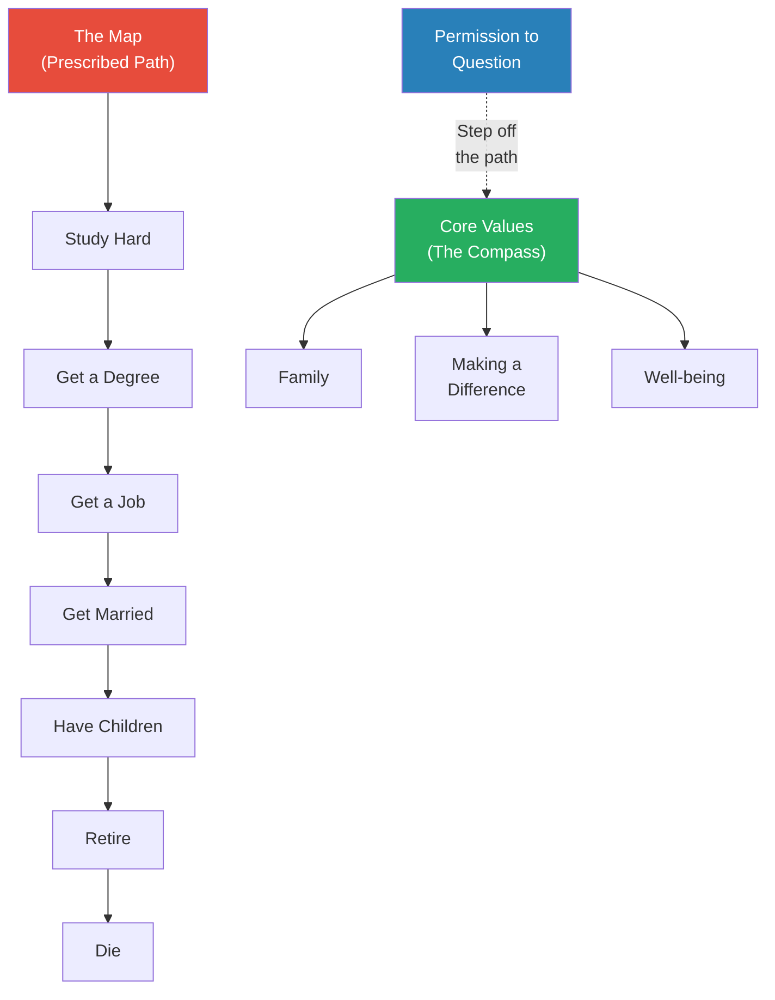
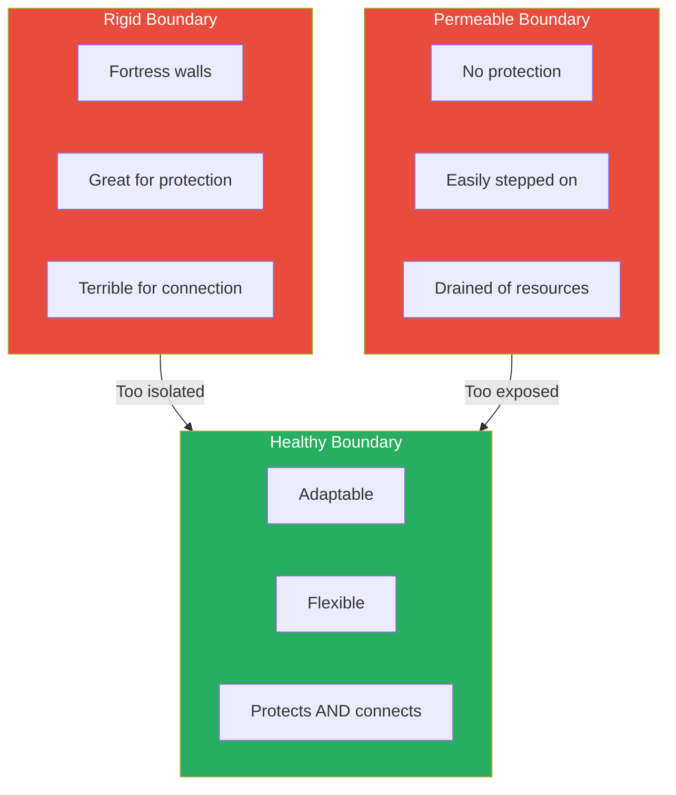
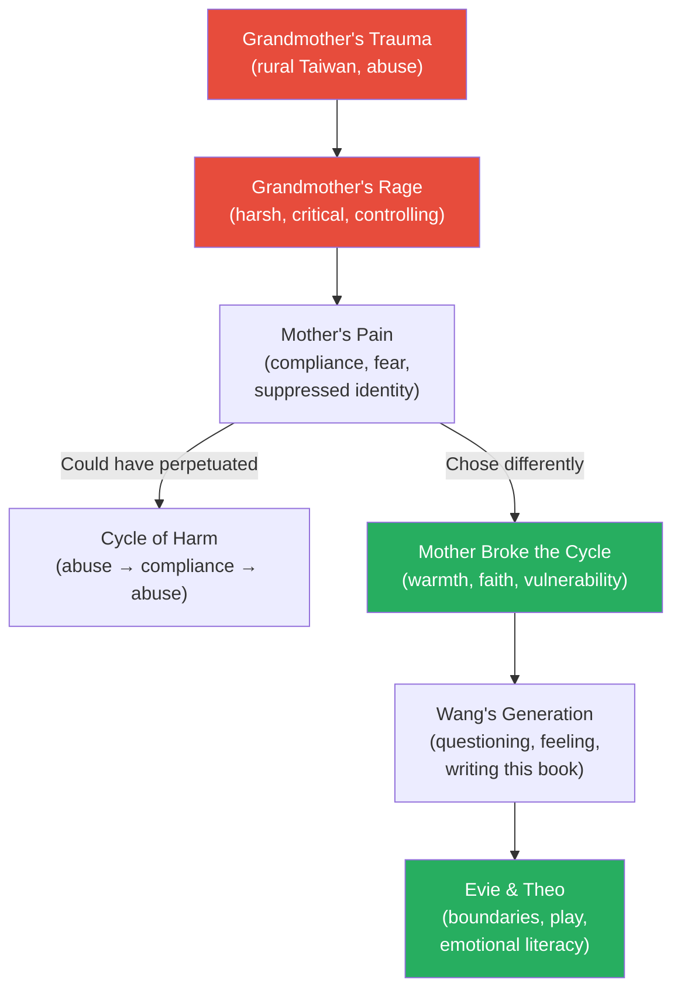
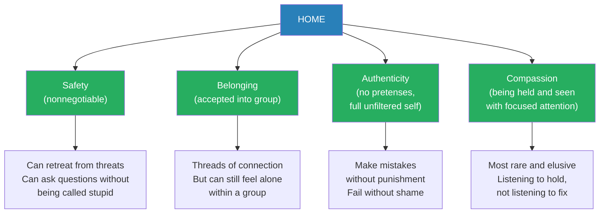

# Permission to Come Home — Jenny T. Wang

> *You were handed a map at birth. Study hard. Get a degree. Get a job. Get married. Have children. Retire. Die. No detours. No unmarked trails. The map promised safety, and you followed it without question -- because questioning meant betrayal, and betrayal meant being on your own. But somewhere along the way, in the quiet moments between mile markers, you noticed a stirring. A wondering. Is this all there is? Dr. Jenny T. Wang -- a Taiwanese American clinical psychologist who spent decades silencing that same stirring -- wants to tell you that the stirring is not weakness. It is your compass. And the only way home is through.*

---

## At a Glance

## About the Author

**Dr. Jenny T. Wang** is a Taiwanese American licensed clinical psychologist, national speaker, and the founder of the Instagram community Asians for Mental Health (@asiansformentalhealth). She received her doctorate from the University of Texas Southwestern Medical Center and completed her postdoctoral training at Duke University Medical Center. Her professional mission is to destigmatize mental health within the Asian community and empower Asian Americans to prioritize their own well-being. She started the Asians for Mental Health therapist directory (asiansformentalhealth.com) to connect individuals with culturally sensitive care. She lives in Houston, Texas, with her husband Jason, and their two children, Evie and Theo. She wrote this book during one of the hardest seasons of her life -- her partner's serious illness coinciding with the COVID-19 pandemic.

## The Big Idea

<b style="color: #2980b9">Asian cultural values -- hierarchy, filial piety, emotional restraint, scarcity mindset, self-sacrifice, and perfectionism -- were survival tools for immigrant parents, but they become invisible prisons for their children.</b> Mental health requires questioning these inherited frameworks, giving yourself permission to feel, rage, say no, take up space, choose, fail, play, grieve, and ultimately come home to yourself. This is <b style="color: #27ae60">NOT about rejecting your culture -- it is about choosing which elements to keep and which to release</b>. Through ten chapters, each granting a specific "permission" that Asian cultural expectations typically forbid, Wang blends memoir, clinical case composites, cultural analysis, and exercises to guide readers from the prescribed path toward an authentic life. <b style="color: #e74c3c">The cost of not questioning is the loss of agency and freedom of choice over your own life.</b>

## Key Concepts at a Glance

| Concept | One-line summary |
|---------|-----------------|
| **The Map** | The prescribed life path immigrant parents hand you -- study, degree, job, marriage, children, retire, die -- no detours allowed |
| **Permission to Question** | Examining the hierarchy, scarcity mindset, and "good child" script that keep you on the map |
| **Permission to Feel** | Reclaiming your emotional life from cultures that taught you to "swallow your bitterness" |
| **Permission to Rage** | Anger as wisdom -- a red X marking the spot for deeper exploration, not a dangerous emotion to suppress |
| **Permission to Say No** | Boundaries as acts of love, not betrayal of family or culture |
| **Permission to Take Up Space** | Rejecting the model minority invisibility and claiming your right to exist in full form |
| **Permission to Choose** | Authentic choice in the face of guilt, filial piety, and transactional family relationships |
| **Permission to Fail** | Disentangling failure from shame and the "not good enough" narrative |
| **Permission to Play** | Rest and joy as fuel for life, not rewards to be earned through suffering |
| **Permission to Grieve** | Mourning what you lost -- language, lineage, belonging, the parent you wish you had |
| **Permission to Come Home** | Finding home through safety, belonging, authenticity, and compassion -- within yourself |
| **Core Values** | The internal compass (family, well-being, making a difference) that replaces the map |
| **The Fishbowl** | A technique for relating to emotions with acceptance rather than being consumed by them |
| **Clean Energy vs. Fossil Fuels** | Motivation from curiosity and passion versus fear-based motivation that burns your identity |

---

## The 30-Second Version

- <b style="color: #2980b9">The Map</b> is the prescribed life path that immigrant parents hand their children -- study hard, get a degree, get a job, get married, have children, retire, die -- no detours, no unmarked trails
- Asian cultural values (hierarchy, emotional restraint, scarcity, sacrifice, perfectionism) were survival tools for immigrant parents but become <b style="color: #e74c3c">invisible prisons for their children</b>
- Wang grants ten permissions across ten chapters: to question, feel, rage, say no, take up space, choose, fail, play, grieve, and come home
- <b style="color: #27ae60">This is not about rejecting culture -- it is about evaluating inherited frameworks and consciously deciding which to keep and which to release</b>
- "Home" is not a place but a condition: safety, belonging, authenticity, and compassion -- a space you must build for yourself

---

> [!note] Cross-Cultural Applicability
> While Wang writes from a Taiwanese American perspective, her frameworks map with striking precision onto **Bengali Muslim culture** and virtually any collectivist immigrant culture. The hierarchy-as-virtue-and-prison dynamic, emotional suppression as masculinity ("Bengali men don't cry"), the prescribed eldest-son path, "respect your elders" weaponised into silence, scarcity mindset driving financial control, guilt as the primary tool of compliance, and family enmeshment disguised as love -- all of these patterns will be immediately recognisable to anyone raised in a South Asian, Middle Eastern, or East Asian immigrant household.
>
> Specific parallels to Bengali Muslim culture:
> - **"Respect your elders"** = birrul walidayn (honouring parents) weaponised into total compliance, where any pushback is framed as sin
> - **The Map** = the eldest son's prescribed path -- engineering, medicine, or law, followed by arranged marriage, providing for parents
> - **Scarcity mindset** = financial control through family land, property, or inheritance used as leverage
> - **Emotional suppression** = "Bengali men don't cry" / emotions as weakness in a culture that prizes stoicism
> - **Permission to rage** = anger as the forbidden emotion for the family peacekeeper or fawn type
> - **Saving face** = izzat (family honour) functioning identically to the Asian concept of "face"
>
> If you grew up hearing that questioning your parents' wishes was tantamount to disrespect, that your emotions were a sign of weakness, or that your purpose in life was to repay your parents' sacrifice through obedience -- this book was written for you, even if its examples are Taiwanese rather than Bengali or Pakistani or Lebanese.

---

## The 5-Minute Version

### The Map and the Compass

*Wang opens with the central metaphor that structures the entire book: the map versus the compass.*

- Immigrant parents hand their children a <b style="color: #2980b9">map</b> with specific stopping points: study hard, get a degree, get a job, get married, have children, raise them, retire, die
- No detours. No shortcuts. No unmarked trails. Staying on the map = safety. Questioning the map = betrayal
- The map comes with a warning: "Stay on this path and it will keep you safe. But if you dare to veer off, we may not be there to save you"
- Wang followed the map obediently for decades -- adding her own restrictions whenever a scary opportunity appeared
  - Each time she avoided risk: "Whew. Catastrophe averted! Good job staying safe, Jenny"
- But in quiet moments, a stirring: *Is this all there is? Is this what I want?*
- The alternative to the map is not chaos -- it is a <b style="color: #27ae60">compass built from core values</b>
  - Values-based living (who you want to be) replaces goals-based living (what you want to achieve)
  - When her husband became seriously ill during COVID-19, Wang stripped back to three core values: family, making a difference, well-being
  - These kept her afloat when the future had no identifiable benchmarks

### The Cultural Cage

- <b style="color: #2980b9">Hierarchy</b>: "respect your elders" twisted into "never question anyone above you" -- Wang was silenced by a sexually harassing supervisor for years because of this framework
- <b style="color: #2980b9">Scarcity mindset</b>: immigrant parents' survival-driven focus on financial security creates children who cannot rest, play, or take risks
- <b style="color: #e74c3c">Emotional suppression</b>: "be safe, stay safe" becomes "don't feel" -- in Mandarin, the expression for coping is literally "swallowing your bitterness"
- <b style="color: #2980b9">Filial piety</b>: duty and guilt as the currencies of the parent-child relationship -- making any choice for yourself feels like betrayal
- <b style="color: #2980b9">Saving face</b>: maintaining the positive impression of yourself and family through your actions, which means hiding emotions, family conflicts, and the messiness of life
- <b style="color: #e74c3c">Model minority myth</b>: the stereotype of Asians as compliant, quiet, high-achieving -- which silences you externally and traps you internally

### The Ten Permissions

- Each chapter grants a specific permission that Asian cultural expectations typically forbid
- The permissions build on each other: questioning leads to feeling, feeling unlocks rage, rage reveals the need for boundaries, boundaries enable choice, choice requires tolerating failure, failure opens space for play, play reveals what you grieve, and grief leads you home
- Wang weaves memoir, clinical composites, cultural analysis, and "Rest Stop" exercises throughout
- The critical message: <b style="color: #27ae60">"I am not asking you to discard all elements of your upbringing and culture. I am encouraging you to evaluate the frameworks that are important to you and consciously decide if and how you want to apply them to your life."</b>

---

## Full Summary

## Chapter 1: Permission to Question

*Wang invites readers to do the most dangerous thing a child of immigrants can do: question whether the map they were handed is actually the right path.*

### The Map

- Wang was raised in a Taiwanese immigrant family where safety was the highest value
  - Parents arrived in the US alone with tenuous English, terrified to answer the phone
  - Every decision filtered through: will this keep us safe?
- The map had clearly marked stopping points: study, degree, job, marriage, children, retire, die
  - Constant rewards for obedience -- pats on the back that fueled the next leg
  - Staying on the path meant less conflict, clear rules, visible goalposts
- But once in a while, in quiet moments: *"Is this all there is?"*
- <b style="color: #27ae60">The cost of not questioning: "Without awareness, we lack agency and freedom of choice over our lives"</b>
- When we lack awareness, we react from impulse, replay old dynamics, maintain patterns that keep us stuck

> [!tip] Core Insight
> Questioning is not rejecting. Wang draws a crucial distinction: she is not asking you to throw out your culture. She is asking you to evaluate which frameworks serve you and which imprison you. "Questioning actually means being curious long enough to wonder whether this way of thinking or living is ultimately working for us."

### Questioning Hierarchy

- In Confucian-influenced cultures, elder respect is among the highest virtues
  - From a young age, Wang was expected to defer to anyone older -- not out of respect for that person, but out of honour for her own parents
  - Her parents could be judged within their community by how well she followed these rules
- <b style="color: #e74c3c">The hierarchy mindset kept Wang silent for years when a male supervisor repeatedly made her uncomfortable with suggestive looks and comments about her appearance</b>
  - She was taught to allow those higher in hierarchy (older, male, white, higher status) to dictate how they interact with her -- without protest
  - It took years of questioning to realize that respecting elders did not have to be absolute

> [!example] Wang's Harassing Supervisor
> - A male supervisor repeatedly made suggestive looks and comments about Wang's appearance
> - For several years she bit her tongue and showed up to work with dread
> - The hierarchy framework she internalized told her: those above you in status get to dictate how they treat you
> - It was not a lack of awareness that kept her silent -- it was deeply trained compliance
> - It took years of questioning to finally say: "I owed it to myself to decide when elders deserve my respect"
> **The lesson:** Hierarchy without evaluation is not respect -- it is submission.

### Teaching Her Children Differently

- Wang has promised herself she will not teach her children to comply with adults simply because they are older
  - She will teach them to evaluate whether an individual deserves their respect regardless of age
  - She will not allow them to silence themselves simply because of seniority
  - She will teach them boundaries and encourage them to protect themselves
- <b style="color: #27ae60">This is the generational break: raising children who can discern rather than simply obey</b>

### Questioning Success and Scarcity Mindset

- "Doctor, lawyer, or engineer" -- the joke reflects a real value: financial stability as the only measure of success
- Immigrant parents arrived in a state of scarcity -- it makes sense they adopted a scarcity mindset
  - But this mindset restricted what they believed possible for their children
  - If financial stability is the only goal, money and wealth are the only measures that count
- <b style="color: #e74c3c">Questioning parents' definitions of success may be the hardest space for children of immigrants</b>
  - It triggers anxiety and fear in parents
  - We may feel we have wasted their hard work
  - We may believe success is linear -- any failure is catastrophic

### Questioning Indebtedness and Hyper-Independence

- Wang describes watching her parents play an "infuriating yet comical" game: any act of kindness prompted a sense of indebtedness
  - If someone gave a gift worth $100, her family had to "repay" with a gift of at least $100 or greater
  - Relationships were transactional instead of abundant and generous
- Hyper-independence became a badge of honour: it meant being capable, strong, ready for anything
  - Until she became a mother

> [!example] The Baby Wipes in the Airport
> - When her daughter was an infant, Wang took a trip alone and ran out of baby wipes in the airport
> - No stores in the terminal sold a single pack
> - She frantically walked the entire terminal with her daughter in a soiled diaper
> - It took everything in her to finally ask another mother for some wipes -- she even offered to pay
> - The woman graciously offered the entire package
> - Wang walked away feeling a mixture of gratitude and shame
> **The lesson:** Hyper-independence is not strength -- it is a defence mechanism against judgment and against the vulnerability of receiving help.

- Over the years, Wang realised she used hyper-independence to protect herself from judgment and to save face
  - It also allowed her to feel superior to others who "didn't have their stuff together"
  - But her inability to ask for and receive help kept her from deeper, more authentic relationships

### Questioning Family Duty and Guilt

- One of the strongest narratives: the story of parents' sacrifice and suffering
  - Many children believe they must repay this sacrifice by sacrificing parts of their own lives
  - Wang, as the eldest daughter, was used to stepping into parental roles -- negotiating bills, translating at the doctor
- The tension between self and others is ongoing: raised in two cultures -- one valuing independence, the other demanding sacrifice for family
- <b style="color: #2980b9">Guilt is the currency</b> -- it can make us bypass ourselves for the "greater" good, prevent us from establishing boundaries
- Wang admits she has often chosen others over herself simply to avoid complexity, believing she was acting out of love, only to become resentful
- She induced so much internal guilt that she ignored her inner voice just to please others and be liked
  - "It is easier to live in the binary space that is prioritising others and denying the self than to negotiate the messiness of communicating my own needs"

### Values-Based Living: The Compass

- The alternative to the map is not chaos but a compass built from core values
- <b style="color: #2980b9">Values-based living</b> means living from a set of core principles focused on who you are and who you want to become
  - Much less concerned about outcomes than about alignment
  - Without core values, we are adrift and easily influenced by outside forces

> [!example] A Season of Illness (2019-2021)
> - Wang's partner became seriously ill just as the COVID-19 pandemic hit
> - Suddenly talking about backup plans, single-income survival, children asking to go back to "normal days"
> - Wang stripped back to three core values: family, making a difference, well-being
> - Daily meditation on core values kept her afloat when the future had no benchmarks
> - During this time she started @asiansformentalhealth -- few followers knew she was going through the hardest season of her life
> - She called her best friend and cried; the friend said, "I don't know that you have ever been so vulnerable like this before" -- in twenty-five years of friendship
> **The lesson:** Core values keep us centered when everything in life claims to be important. They also reveal that our rules about how we should show up actually keep us stuck and very alone.

---

*The Map offers safety through predictability. The Compass offers alignment through self-knowledge. Wang's argument is that you must trade one for the other -- there is no map to an authentic life.*

---

## Chapter 2: Permission to Feel

*Wang dismantles the idea that emotions are threats to be extinguished, revealing them as the internal guidance system we have been taught to distrust.*

### The Emotional Education of an Immigrant Daughter

- Wang's mother was emotionally expressive -- tears of homesickness, anger, generational conflict -- but always brushed her emotions aside as "too sensitive"
- Wang's father was silent and stoic; his occasional anger spilled out as disappointment
  - They fought relentlessly during her teenage years
  - His silence after conflict cemented the belief that emotions were useless
- Between these two models, Wang pieced together what she was "allowed" to feel:
  - Women expressing emotion = weak, lacking control
  - Men suppressing emotion = strong, rational, mature
- In Mandarin: <b style="color: #2980b9">ren (swallowing your bitterness)</b> -- emotional suppression as a sign of mastery

### Why Emotions Matter

- Emotions are an alert system -- they provide information about ourselves and our environment
  - Like a text message warning of a hurricane: the message isn't the problem, the hurricane is
  - Negative emotions return if we fail to understand what's causing them
- <b style="color: #27ae60">Emotions impact how we see our world, what we pay attention to, what we learn and remember, and how we make decisions</b>
  - Research shows people with damage to emotional brain centres have worse decision-making, not better
- Two primary functions:
  - Alert and create self-awareness ("Something is wrong -- pay attention")
  - Help communicate with others (facial expressions, empathy, connection)

### Barriers to Emotional Acceptance

- **Saving face**: revealing emotions = showing vulnerability = losing face = shaming your family
  - The "face" is a public persona ascribed with positive and negative properties
  - Maintaining your "face" looks like: well-paying job, perfect-seeming life -- enhancing the face of the entire family
  - The code of privacy around family life makes seeking help feel like betraying family secrets
  - If one of your cultural values is saving face, then revealing intimate emotions becomes deeply uncomfortable, even with trusted people
- **Comparing suffering**: "My parents worked in laundromats; how can I complain about my office job?"
  - Wang names this directly: "How does denying your own experience change your parents' history? How does ignoring your own feelings somehow repay them for their suffering? The reality is that it cannot."
  - Our denial has no tangible impact on our parents' past -- but focusing on comparative suffering negatively impacts our own lives
  - <b style="color: #27ae60">Both/and: it can be true that parents struggled AND that we can struggle in our own unique ways</b>
  - "Perhaps our unhappiness is the very privilege that our parents worked so hard for us to experience -- the privilege of acknowledging our emotions and prioritising our mental health"
- **Relational harmony and peacekeeping**: we learn to silence emotions to keep the peace
  - "How many times have you been encouraged to give up on your wants simply because relationship harmony was prioritised over conflict?"
  - Sacrifice for the common good: "Our choices should not incite conflict because peace matters more than individual happiness"
  - <b style="color: #e74c3c">"We cannot control, change, or be responsible for the emotions of others"</b> -- a lesson Wang says many never learn
  - When people don't know how to own their emotions, they project them onto you and make you believe their negative emotions are your fault to fix

> [!example] Wang's Mother Holding Her Through Heartbreak
> - Wang's first heartache was a college breakup; she drove three hours from Austin to Houston in tears
> - One night, packing away pictures and mementos, her mother simply held her as she sobbed
> - Her mother did not curse the ex, did not offer quick fixes, did not dismiss the pain
> - She held her and sat with her for what felt like hours -- letting her feel every sensation of heartbreak
> - This is "containment" -- a therapeutic concept Wang's mother practiced without knowing its name
> - It was the first step of emotional literacy: just creating space to be WITH the emotion
> **The lesson:** Sometimes the most powerful thing someone can do is hold you in your pain without trying to fix it.

### Building Emotional Literacy

- Wang asked her social media followers: "What do you wish your parents had taught you about emotions?"
  - Hundreds responded with variations of five themes:
    1. That it is okay to cry
    2. That emotions are normal and valid
    3. How to listen to and process emotions rather than repressing
    4. How to express and discuss emotions
    5. That emotions are not a sign of weakness
- Wang herself did not understand emotions until graduate school: "I thought emotions were disruptive, damaging, distracting, and bad. Weren't they meant to be ignored and swallowed?"
- Even as a psychologist, she still sometimes distracts from emotions with busyness
  - Her therapist jokes: "If only awareness was enough to create lasting change"

### The Emotional Literacy Framework

| Step | What It Involves |
|------|-----------------|
| **Pause and Listen** | Create space for the emotion to exist without pushing it away -- a moment in time for it to be, without distraction or dismissal |
| **Tolerate and Hold** | The "fishbowl" technique -- imagine placing the emotion in a glass fishbowl, observe its colours, textures, and movement. This creates acceptance without fusion |
| **Notice and Understand** | Calm the nervous system through deep breathing, then ask: what is this emotion trying to tell me? What is it protecting me from? |
| **Express and Take Action** | Use "I" statements and intention vs. impact to communicate; create concrete action plans with three tangible steps |

> [!abstract] The Fishbowl Technique
> 1. When you notice a strong emotion, pause and imagine holding a round glass fishbowl
> 2. Envision placing the intense emotion into the fishbowl
> 3. Observe the colours, textures, and movement of the emotion as it swirls inside
> 4. The goal: relate to your emotion with acceptance and awareness -- without being fused with it
> 5. You are not inside the fishbowl; you are holding it. The emotion is real, but it is not all you are
> 6. All emotions eventually pass -- the surge comes like a wave but eventually dies down

> [!example] The Nanny Comment
> - Wang's father said: "You shouldn't let your nanny watch your kids so much. They are like cows grazing in the pasture"
> - Wang felt her stomach seize and heart rate spike -- she worked hard to breathe through the anger
> - Once calm, she could see: he was not trying to hurt her; he was concerned about her children and her overworking
> - His communication skills were lacking, but his intention was not malicious
> - Without taking time to notice, she never would have seen this nuance
> **The lesson:** Emotional literacy is not about eliminating emotions -- it is about decoding their messages before reacting.

---

## Chapter 3: Permission to Rage

*Of all the emotions Wang addresses, anger is the one her audience fears most -- and the one that holds the most wisdom.*

### Intergenerational Anger

- Wang opens with a devastating story from her mother's childhood in rural Taiwan:
  - A little girl bouncing a plastic ball in a dusty courtyard -- her only toy, her most treasured possession
  - Her mother emerged from the house with metal shears, screaming, cut up the ball, and forced the pieces into the child's mouth
  - <b style="color: #e74c3c">That girl was Wang's mother</b>
- Wang's grandmother was born into a farming family, youngest of seven, no more than a third-grade education, likely abuse and trauma
- The intergenerational roots of anger run deep: "How do we heal so we can break cycles of intergenerational trauma across generations?"

### Messages That Silence Anger

- **Be nice**: "We were never taught that you can be respectful AND angry"
  - Wang no longer teaches her kids to be "nice" -- she teaches them to be kind
  - Nice = smiling through your teeth while screaming inside; kind = genuine care from strength
- **Be mentally strong**: being labeled "too emotional" or "crazy" gives people justification to disregard your feelings
- **Be silent**: the model minority myth creates expectations of compliance and passivity
  - When society views you as someone who won't rock the boat, speaking up triggers harsher retaliation

### Anger as Wisdom

- <b style="color: #27ae60">Anger is a red X marking the spot for deeper exploration</b>
  - Anger is a secondary emotion -- it sits on the surface protecting more vulnerable feelings underneath
  - The "anger iceberg": beneath anger lie hurt, inadequacy, fear, betrayal, abandonment
- Three functions of anger:
  - **Protection**: alerts you when boundaries have been crossed
  - **Preservation of self-worth**: "a reminder of the parts of me that love me"
  - **Marks the spot**: X on the treasure map -- start digging here

> [!example] The Sock Wars
> - In the early years of her marriage, Wang's husband would discard socks throughout the house -- between couch cushions, under beds, in random corners
> - Wang felt disproportionate burning rage and cold sweats over this seemingly trivial habit
> - After years of arguing, she finally wondered why socks triggered such a response
> - She realized: she interpreted his carelessness as deliberate disrespect -- a sign she was being taken for granted and unseen
> - Beneath the anger: feelings of being disregarded, overlooked, alone -- echoing her mother feeling taken advantage of by her father
> - Once she uncovered the root, the socks no longer triggered her
> **The lesson:** Anger is rarely about the surface event. It is always about what that event means to you.

### Anger Pitfalls

- Wang identifies common maladaptive anger patterns, all connected to trauma responses:
  - **Direct aggression** (fight response): come out swinging, focused on winning rather than understanding
  - **Passive-aggressiveness**: indirect expression -- screening calls, dropping land mines in the relationship
  - **Relentless pursuit**: pushing to resolve conflict immediately, which causes the other person to shut down
  - **Rage**: when anger is silenced and pushed underground, it grows roots and becomes explosive and disproportionate
- <b style="color: #2980b9">Rage is the recycling of anger that happens over and over because there is unresolved anger living there</b>
  - Have you ever reacted with intense anger to a situation and completely surprised yourself? You likely tapped into a deeper rage demanding your attention
- Wang connects these to the five trauma responses: fight, flight, freeze, fawn, and feign
  - The key insight: "There is nothing wrong with you if you engage in these pitfalls. They are strategies you had to adopt in order to survive."

### Teaching Children About Anger

- Wang's two rules for her children's anger expression: you cannot hurt other people or yourself, and you cannot damage property
  - Beyond those two rules, they are free to express anger however they need to
  - Sometimes her kids cry, yell, scream, punch pillows, run around outside, or just pout
  - <b style="color: #27ae60">The same rules apply to adults</b>: these strategies process anger through the body and calm the nervous system

### From Anger to Assertiveness

| Step | Purpose |
|------|---------|
| **Name Your Anger** | "You cannot tame what you cannot name" -- say it out loud or journal it; we can be angry at every person who touches our lives, even those we love |
| **Calm the Body** | Sensory grounding, progressive muscle relaxation, physical activity -- a calm body gives the mind stable ground for exploration |
| **Dig and Explore** | Sink beneath the anger to more tender emotions -- hurt, fear, betrayal. Use the iceberg: "Do I feel hurt? Slighted? Insulted? Betrayed?" |
| **Accept or Act** | Change nothing, reframe the situation, or communicate assertively -- the goal of healthy anger expression is assertive communication |

---

## Chapter 4: Permission to Say No

*Wang argues that boundaries are not betrayal -- they are the only way to love people well over the long term.*

### The Fortune-Teller Story

- Wang was born in Tai-nan, Taiwan, in 1983; a fortune-teller calculated her birth timing was a bad omen for her parents
- Wang's paternal grandmother pressured her parents to send baby Jenny away for adoption
- <b style="color: #27ae60">It was Wang's mother's forceful "no" -- in a culture where "no" was not a valid response -- that saved her from being given away</b>
- Despite voices pushing compliance, her mother found strength in her faith to refuse

### Cultural Barriers to Boundaries

- In cultures valuing interconnectedness and self-sacrifice, boundaries are labeled as:
  - **Selfish**: saying no = disobedience, defiance, disrespect
  - **Rejecting family**: "you're too American, too individualistic"
  - **Unloving**: "if you loved us, you wouldn't need boundaries"
- <b style="color: #e74c3c">The result: unrestricted access to your time, energy, emotions, and life -- with no mechanism to say "enough"</b>

### What Boundaries Actually Do

| Function | How It Works |
|----------|-------------|
| **Safety and protection** | Alert you when someone crosses a line; prompt you to act |
| **Conserve emotional energy** | Prevent the stress buildup of repeated violations |
| **Communicate self-worth** | "Yes, you matter, but I matter too" |
| **Preserve relationships** | Clear expectations reduce resentment and death-by-a-thousand-cuts |

### The Well Metaphor

- Wang asks you to imagine that within you there is a well of resources: time, energy, attention, focus
  - Boundaries protect that well from thirsty travellers who might drain you
  - Without boundaries, you leave the well unguarded -- allowing opportunistic people to drain you dry
  - If you do not realise your well is valuable, you will not realise you need to protect it
  - <b style="color: #2980b9">You might not say no when you are down to your last cup, because you feel guilty putting yourself first</b>

### Types of Boundaries

| Type | What It Protects |
|------|-----------------|
| **Physical** | Borders of physical space between you and others |
| **Emotional** | Your feelings and the limits of others' impact on them |
| **Intellectual** | Your thoughts, ideas, and how others respond to them |
| **Sexual** | Emotional, physical, and intellectual aspects of sexuality |
| **Material** | Financial and material resources you share or keep |
| **Time** | How you use your time in alignment with your values |

### Boundary Setting Framework

- **Define**: identify the most rigid and most permeable boundary, then find the workable middle
  - The workable boundary is the border you can tolerate, live with, and accept
- **Communicate**: use "I" statements, expect counterreactions, decide to hold regardless of response
  - Three principles: (1) expect counterreactions, (2) decide to hold it regardless, (3) humans prefer predictability over discomfort -- breaking old patterns will feel wrong
- **Enforce**: a boundary is only as real as the consequence that follows when it is crossed
  - If you tell parents to stop asking when you will marry but sit quietly when they do, your silence communicates you are not prepared to hold the boundary
  - Enforcement focuses on YOUR behaviour, not theirs: "What will I do now?"
- **Reevaluate**: boundaries can change as people and relationships evolve
  - Wang and her mother-in-law struggled intensely for fourteen years -- through repeated boundary setting, they have grown and developed deeper appreciation

> [!example] The Critical Auntie
> - An "auntie" (a common term for elder women in Asian communities) loved to comment on Wang's child-rearing practices
> - When Wang nursed her daughter, auntie claimed formula was more filling; when she used cloth diapers, auntie said it was filthy
> - She basically had a comment for every decision Wang made
> - Wang's options: permeable (let her keep commenting), rigid (cut her out), or workable (engage her as long as she keeps child-rearing comments to herself)
> - She chose the workable boundary but initially communicated it reactively -- snapping back, which triggered a conflict cycle
> - Neither the boundary nor the underlying hurt was ever communicated clearly
> - Effective version: "Auntie, I know you do not intend to hurt me, but when you criticise how I take care of my daughter, it hurts my feelings. I would appreciate it if you no longer made comments about my parenting choices when you visit us."
> **The lesson:** A boundary communicated reactively is a boundary that was never actually communicated.

> [!tip] Core Insight
> "Boundary setting is actually an act of love for yourself AND for others that helps us figure out how to love each other well. We would not set boundaries with people we have no intention of staying connected with."

---

*Healthy boundaries are neither fortresses nor open fields. They are adaptable borders that can expand and contract based on context -- allowing connection while protecting your well.*

---

## Chapter 5: Permission to Take Up Space

*Wang confronts the programming that taught her -- and millions of other Asian Americans -- to succeed but stay invisible.*

### The Invisibility Training

- "Succeed, but don't become too visible. Excel, but don't take up space. Blend in and assimilate. All of this will keep you safe."
- It took Wang thirty-eight years to say "thank you" after receiving a compliment
  - Being visible makes her skin crawl -- the source of recurring imposter syndrome
- Her parents never spoke of her accomplishments in public; sometimes they minimized them as an act of humility
  - Wang internalized this as: perhaps they were not proud, perhaps she was not good enough

### The Forces Against You

- **Cultural upbringing**: obedience and conformity reduce opportunities to practice speaking up
  - If your parent became angry when you had an opinion, you learned opinions were "bad"
  - If a teacher scolded you for stating your needs directly, you learned that directness was dangerous
  - A culture of conformity is not always harmful -- but when it inhibits self-advocacy, it becomes a prison
- **Limited representation**: few Asian role models in leadership, media, politics
  - The lack of representation means imposter syndrome is nearly universal
  - When you do reach higher levels of influence, there may be no support network to help you stay there
  - Wang describes her first Asian American psychology professor -- a sharp-witted Cantonese woman who self-diagnosed her own brain aneurysm as it was happening and saved her own life
  - That professor showed Wang what was possible: "Her presence, confidence, and formidable knowledge showed me what was possible as an Asian American woman"
- **Model minority myth**: the expectation that you will be quiet, compliant, hardworking
  - When you deviate, the retaliation is harsher because you broke the expected script
  - "You can be a part of the team but not strive to lead it. You are only welcome here if you know your place"
  - <b style="color: #e74c3c">The double bind: the myth silences you internally (through internalized compliance) and constrains you externally (through others' expectations of your passivity)</b>

### Taking Up Space as Practice

- Wang started small: making eye contact with neighbours during her runs, waving hello
  - The first few times were uncomfortable and unnerving
  - But teaching her brain that taking up space was not a threat rewired her fear signals
  - Through this seemingly small practice, she was able to expand into taking space in other areas
- <b style="color: #27ae60">Taking up space is not about overtaking others -- it is about rejecting the scarcity framework that says there is not enough room for everyone</b>
- The dominant culture frames space-taking as consuming, taking, reducing -- a colonialist model
  - But there IS enough space for everyone; we have been conditioned to believe otherwise
  - "Can we consider that our celebration is an act of protest against systemic forces that want to keep us feeling small?"

### Finding Your Hype Team

- When Wang started her private practice after being a stay-at-home mother, she was terrified
  - Negative self-talk kept her up at night; she was scared she had forgotten how to be a psychologist
  - A few important friends would not allow her dream to fade -- they checked in, followed up, encouraged one small step at a time
  - One friend even sat with her during a meeting to negotiate her rental space
- <b style="color: #2980b9">Facing fear in community does not diminish the fear, but it creates kindling and fuel for courage</b>
  - Wang's "hype team" consists of a few close friends from different life stages who remind her of who she is when imposter syndrome hits
  - When constructive feedback on her manuscript triggered all her imposter buttons, they helped her pick herself back up

> [!example] Writing This Book
> - When the thought of writing a book felt too scary and exposing, Wang's hype team reminded her of her purpose
> - When the first round of publisher feedback triggered imposter syndrome, they were right there
> - Wang struggled through the entire "Permission to Take Up Space" chapter -- each paragraph required wrestling internal dragons
> - She questioned how she could write about taking up space when it was still such a source of struggle for herself
> - But she realized: it was not a lack of courage that struck fear -- it was "the insidious training I unintentionally received my entire life, training that taught me to remain small"
> **The lesson:** You do not need to have mastered something to teach it. The struggle IS the qualification.

---

## Chapter 6: Permission to Choose

*Wang addresses the paralysis that comes from having been trained your entire life to choose for others rather than for yourself.*

### The War Between Two Selves

- Throughout her life, Wang felt torn between the life she hoped for and the life her parents visualized
  - Their expectations came with good intentions -- rooted in hope she would not suffer as they did
  - But the weight of their hopes and the pain of their losses made every personal choice feel like betrayal
- <b style="color: #2980b9">For many immigrant families, relationships are transactional</b>: financial support creates debt, and debt can always be cashed in against your life choices
  - Many clients only gained freedom to make their own decisions once they became financially independent

### The Costs and Rewards of Choosing

- Claiming permission to choose comes with real costs:
  - Recognising that others may not always know what is best for you
  - Potentially losing support from people you love
  - The grief of choosing authenticity when loved ones cannot accept it
- <b style="color: #2980b9">Many clients only gained freedom to make their own decisions once they became financially independent</b>
  - Being financially tied to parents meant they still owed something -- and the debt could always be cashed in against their life choices
  - This transactional relationship is common in Asian families: duty, debt, repayment of gifts
- But the rewards are equally real:
  - Purposeful values-based living instead of drifting
  - Identity and self-worth based on internal character rather than external judgment
  - Ownership over your life that sustains you when the road gets rough
  - Less regret: "When the decision mattered most, you chose based on the person you knew yourself to be"

### Obstacles to Authentic Choosing

- **Guilt and indebtedness**: the overwhelming emotion triggered when choices go against parental wishes
  - If our lives are "too good," we may feel guilt because our parents did not get to enjoy these privileges
  - "The least we can do" is comply with their wishes
- **Filial piety**: dutiful respect that can be weaponised into compliance and coercion
  - In Mandarin: xiao; in Korean: hyo do; in Vietnamese: co hieu
  - Wang has had clients share that immigrant parents pull the filial piety "card" to pressure compliance
  - Some carry this responsibility proudly; for others it prompts resentment and obligation
- **Choosing with rigidity**: "it is too late" or "I have invested so much" -- locking yourself into a life that no longer serves you
  - Parents modeled endurance: stay in marriages that bring no joy, remain in depleting jobs
  - <b style="color: #e74c3c">"What you are not changing, you are choosing"</b>
- **Lack of authentic knowing**: having spent your life listening to others, you have no idea what you actually want
  - Wang felt this in college: "I had never considered what I wanted for myself. I had never explored my life with openness to possibilities"
  - If you were often told what to do and that choosing for yourself was selfish, you may struggle to trust your inner voice

### Riding the Wave of Guilt

- Wang uses a powerful visual: "ride the wave of guilt"
  - Guilt rises within us -- but it can also fall and diminish
  - Experiencing guilt does not always mean your decision is wrong; it may be a natural response to a relationship dynamic
- The key question: <b style="color: #27ae60">is this guilt "workable"?</b>
  - Workable guilt moves you toward your values (you hurt someone and need to apologize)
  - Unworkable guilt moves you away from your values (you feel guilty for choosing yourself, even though no one was harmed)
- When we have committed no actual wrongdoing, we can fixate on guilt and add fuel through self-criticism
  - This creates a "shame spiral" -- guilt feeding shame feeding more guilt
  - Creating space between the trigger and your response gives you freedom to evaluate

### Wang's Mental Checkpoints

| Checkpoint | Question It Asks |
|-----------|-----------------|
| **Inner Knowing** | What does my body tell me? What does my gut say? Am I living in my thoughts or also listening to my body? |
| **Long-Range Perspective** | Will this matter in one year? Five? Ten? What is the cost of NOT changing? "What you are not changing, you are choosing." |
| **Sustainability** | Can I sustain this for the long haul? Am I pushing through because of a higher purpose or because of fear? |
| **Chosen Family** | Who receives me as I am? Who can I lean on when birth family cannot accept my choices? |

### Choosing with Chosen Family

- When we make choices that others cannot support, the possibility of losing important relationships is real
  - This can mean coming out regarding gender identity or sexual orientation and being disowned
  - Marrying outside your race or ethnicity against family wishes
  - Pursuing activism instead of joining the family business
- <b style="color: #2980b9">Chosen family</b>: people who receive you as you are and can sit within your pain
  - They might be friends, teachers, mentors, therapists, or others the universe brings into your life
  - They say: "I know you are scared, but I see potential in you. I believe you are capable of this even when you do not believe in it yourself"
  - They will not expect you to shape-shift or perform for them

> [!example] Leaving Accounting for Psychology
> - Wang was accepted into a prestigious five-year master's in accounting program
> - She was miserable -- sleepless nights, exhaustion, boredom, no spark or passion
> - But she had internalized the idea that she needed to secure a well-paying job to take care of her parents in old age
> - Pursuing psychology triggered intense guilt: "What if I can't make enough money to support them?"
> - The turning point: "I will not be able to sustain a lifelong career in something I hate. So how will that help me support my parents in the long term?"
> - When she finally dropped the accounting program, she felt relief, thrill, and exhilaration -- quickly followed by fear, doubt, and panic
> **The lesson:** The map promised safety, but staying on it does not guarantee the financial stability it promises -- and it guarantees misery.

---

## Chapter 7: Permission to Fail

*Wang traces her terror of failure back to a single third-grade parent-teacher conference and shows how shame wraps itself around failure to make it feel like identity.*

### Mrs. Burke

> [!example] The Third-Grade Parent-Teacher Conference
> - In third grade, Wang's teacher Mrs. Burke called a parent-teacher conference
> - Her parents had no local support network, so Wang and her sister sat in the corner while Mrs. Burke talked
> - Mrs. Burke said Wang was struggling with writing and language arts and suggested she repeat the grade
> - Wang's face flushed, her stomach cramped; a wave of embarrassment and shame made her nauseous
> - At eight years old, she concluded: "I was somehow broken"
> - Her parents drove home in silence. The failure was never discussed -- not that day, not ever
> - Wang believes if her parents had said, "I don't believe Mrs. Burke. You are smart. Let's work together," her interpretation would have been entirely different
> - Instead, the silence seemed to confirm the assessment: she was the "stupid kind of Asian"
> - More than thirty years later, this harsh critical voice rears its head every time she tries something new
> **The lesson:** Failure in childhood becomes identity when no one challenges the narrative. The silence was louder than the verdict.

### Myths and Roadblocks of Failure

- **"Failure is not an option"**: for immigrants, failure meant unstable housing, inability to feed family
  - The stakes hit differently in their generation -- failure was not abstract; it was survival
  - The burden of fearing failure crept into scarcity mentality, choosing stability over passion, avoiding all risks
  - Wang's bold claim: what if our generation puts failure back on the table?
  - "By keeping the possibility of failure on the table, we acknowledge that it is necessary for growth"
- **The Perfection Roadblock**: perfectionism is only interested in outcomes, not inner growth
  - Even after a "flawless performance," the high is temporary -- then back on the treadmill of self-doubt
  - "As long as we hold on to perfection as a value, we will struggle to give ourselves permission to fail, because perfection becomes one of the only ways we find value in ourselves"
  - <b style="color: #e74c3c">Perfectionism can also be a false motivator -- cycles of self-punishment disguised as excellence</b>
- **The "Not Good Enough" Roadblock**: failure adds fertiliser to seeds of doubt planted by parents, teachers, coaches
  - Children of immigrants joke about being punished for anything less than an A grade
  - They find commonality in the verbal abuse, shame, or punishment -- and find humour in it
  - But unprocessed anger from these encounters drives inward, manifesting as self-sabotage
  - "It doesn't hurt as much if they don't expect much from you in the first place"
- **The "I Don't Deserve It" Roadblock**: believing you deserve to fail, so you unknowingly make choices that cause suffering
  - Success was rarely celebrated; it was only acknowledged by asking "Why didn't you try harder?"
  - Some children of immigrants never witnessed their parents celebrate their own accomplishments
  - "We're more likely to punish ourselves for our failures than to recognise all of our gains and growth"

### A Failure for My People

- The model minority myth adds a collective dimension to personal failure
  - "Does failing mean I have failed myself, my parents, AND my people?"
  - Wang recalls being told she could prove her right to be in certain spaces by being better and smarter than her white counterparts
  - "If we could simply be better, the dominant culture couldn't find fault with us"
  - <b style="color: #e74c3c">So what happens when you make a mistake? You feel the collective shame of failing not just yourself but your entire community</b>

### Disentangling Failure from Shame

- <b style="color: #27ae60">Shame is created in relationships</b> -- if we lived in isolation, we would rarely experience shame
  - When we share our shame with safe people, we discover that what we believed was so broken about us is actually not as bad as we thought
  - Speaking our shame is how we purge its toxicity -- "I've never told anyone this before" -- followed by relief
  - Compassion from others, combined with self-compassion, can reduce or extinguish the flames of shame before they set our identity on fire
- **Reframing failure**: Carol Dweck's growth mindset vs. fixed mindset
  - Fixed mindset: we possess specific skills and talents that cannot change; failure proves incapacity
  - Growth mindset: we possess unbounded potential; failure is a pitstop where you refuel and redirect
  - The way you interpret failure determines whether you keep showing up or shut down
- <b style="color: #2980b9">Clean energy vs. fossil fuels</b>: a client's brilliant metaphor for two types of motivation
  - Fossil fuels (fear-based): gets the engine running but burns dirty -- makes you doubt yourself, powers the voice of self-doubt
  - Clean energy (curiosity, passion, meaning, purpose): moves you toward goals while leaving identity and self-esteem intact
  - "When I finally could no longer silence myself, I had a recurring thought: I will not be able to sustain a lifelong career in something I hate"

> [!abstract] The Five Steps of Moving Through Failure
> 1. Get comfortable with discomfort and negative emotion
> 2. Name the shame that has been wrapped around the failure
> 3. Consider what the failure is bringing to you instead of what it is taking away
> 4. Consider what next step you can take with the information failure offers you
> 5. Try again through action -- start with one small, achievable, tangible step

---

## Chapter 8: Permission to Play

*Wang reveals how deeply immigrant survival mentality has poisoned our relationship with joy, rest, and leisure.*

### The Fun Meter

- Wang's childhood home had an imaginary "fun meter" -- a dial showing how much play was allowed each week
  - If she asked for a playdate on Monday, by Friday the dial would be turned to zero
  - "If I had time to play, then I didn't have enough work to do"
  - Past age nine, play was discouraged, indulgent, irresponsible, a waste of time

### Untrue Stories About Play

- **"Play is a waste"**: from a survival mentality, play is time and energy that should be devoted to a higher goal
- **"Play is selfish and childlike"**: many children of immigrants were parentified -- mediating between fighting parents, negotiating electric bills, translating at doctors
- **"Play interrupts productivity"**: the to-do list will always exist; "When do you actually get to the living part of life instead of doing?"

### Play as Medicine

- During burnout from writing this book, Wang booked a trip to visit college friends in San Diego
  - Forced herself to leave her laptop at home
  - At dinner, fully present for the first time in months, she burst into tears: "This might be the first time I am enjoying food in a really long time"
  - Friends held her in love and reminded her of her purpose

> [!tip] Core Insight
> "Rest is not something we earn. Rest serves as the fuel for future work, goals, and dreams." Play is the fuel for your productivity, not a detractor from it. When we put off play until we have "more time," the consequences of neglect catch up -- physical breakdowns, broken relationships, career disappointments.

### Wang's Revelation as a Mother

- When her daughter was in second grade, Wang found her children playing and laughing hysterically
  - Her first instinct: "Have you finished your homework yet?"
  - Her partner gently said: "It was almost like they were having too much fun, and you were not okay with it"
  - <b style="color: #e74c3c">Wang was crushed -- and reminded how instinctual it is to stamp out play</b>
- She also realized: when she hugs her children randomly during the day, they have not had to do a single thing to earn it
  - This is the generational break: unconditional warmth, not tit-for-tat affection
  - Many clients shared they received very little spontaneous parental affection as children
  - The lack of warmth reinforced the transactional nature of the earliest relationships: one A+ gains a brief reprieve from having to produce

### The Gifts of Play

- **Creativity and exploration**: play creates a space that suspends reality, rules, and expectations
  - In this space, our parasympathetic nervous system calms us, helping us connect more authentically
  - It generates the spark -- kindling for new passions and interests
- **Presence**: play depends on your ability to stay in the here and now
  - Wang distinguishes between rest and dissociation: "Rest is restorative and replenishing while we remain fully present. Dissociation disconnects us from the present moment"
  - Binge-watching Netflix and doomscrolling are dissociation, not rest
- **Affirming inherent worth**: when we give ourselves permission to play, we are expressing that we deserve that right as a human being -- we do not need to earn it
  - <b style="color: #27ae60">"Play presents the opportunity to fill in gaps our parents or caregivers may have left, and it lets us feel loved without any strings attached"</b>

### Cultivating Play

- **Follow the body**: the body does not lie; tune into how it feels at the end of a long day
  - Instead of numbing with scrolling, be still; listen to what the body is craving
  - Start with turning on music in the privacy of your room and letting the body react
- **Play as the end goal**: do not convert your play into a side hustle
  - Research shows that when motivation shifts from intrinsic (curiosity, passion) to extrinsic (money, status), subjective enjoyment declines
- **Plan your play**: schedule it like preventative medicine
  - Play should be proactive, not reactive -- not a last-minute vacation because you are burned out
  - "We can't wait for things to get bad for us to play"

---

## Chapter 9: Permission to Grieve

*The most raw and personal chapter: Wang names the layered, unnamed grief that all children of diasporas carry -- and demonstrates through her own story that the only way through grief is to speak it.*

### The Third Space

- Children of immigrants live in a <b style="color: #2980b9">"third space"</b> -- between worlds and within margins
  - Not fully at home in parents' culture, not fully accepted in the country of migration
  - Losses go unnamed and unacknowledged: grief over language, lineage, belonging, identity, the life that could have been
- <b style="color: #e74c3c">Grief that is not acknowledged does not disappear -- it becomes frozen, compartmentalized, and drives a wedge within us</b>

### Pathways of Loss

| Loss | What It Looks Like |
|------|-------------------|
| **Departure and separation** | Tearful goodbyes with extended family; being too far to attend funerals |
| **Intergenerational trauma** | Parents' unprocessed pain manifesting as abuse, emotional coercion, or emotional absence |
| **Assimilation and mimicry** | Shedding cultural customs to fit in; code-switching; fractured identity |
| **History and lineage** | Not knowing your great-grandparents' names; children further removed with each generation |
| **Identity and name** | Wang was given the name Wang Tzu-Mei at birth; replaced with "Jenny" in kindergarten to stop teasing |
| **Language and stories** | Inability to communicate deepest feelings with parents across a language barrier |
| **Belonging and legacy** | Perpetual foreigner; conditionally accepted; fearing what your children will face |

### The Loss of the Parent You Wished For

- Wang describes her father as a man who lacked the warmth and encouragement she desired
  - She lashed out, stonewalled, distanced -- tried to protect herself from constant criticism and disappointment
  - His own childhood was cold, strict, and highly critical
  - <b style="color: #27ae60">"I mourn the loss of the lighthearted, emotionally attuned, and compassionate father figure that I wish I had. I hold this in tension with the father that he is and the love that he shows in the ways he knows how."</b>

> [!example] The Trip to Taiwan That Never Happened (2017)
> - Wang planned to take her three children to Taiwan to meet their great-grandfather for the first time
> - When her mother informed her grandmother, the grandmother had an episode of intense anxiety and paranoia
> - She adamantly refused to allow them to visit -- demanded absolute obedience, just as she had since Wang's mother was a child
> - Wang and her family spent twelve days in Taipei anyway -- but could not visit her grandfather, despite being less than an hour's train ride away
> - Wang's mother was too afraid of her own mother's retaliation to defy the order
> - Wang's grandfather passed away eight months later, having never met his great-grandchildren
> - Wang describes this as "my greatest regret" -- and lists the layers of grief: anger at her mother's inability to fight, betrayal by her grandmother, loss of her grandfather, being too far for the funeral, lack of closure
> **The lesson:** The grief of diasporic people is not a single loss but a multilayered, compound grief that compounds across generations.

### Naming the Losses

- Wang identifies several specific losses that children of diasporas carry:
  - **Loss of history and lineage**: "It feels as though I come from a people that I can trace only as far back as my grandparents. I don't even know the names of my great-grandparents."
    - This sadness grows as she realizes her own children will be even further removed
  - **Loss of identity and name**: Wang was given the name Wang Tzu-Mei at birth; it was replaced with "Jenny" in kindergarten to stop teasing
    - She was grateful at the time -- the American name protected her from shame about her Asian-ness
    - But it also reinforced the narrative that her Asian-ness was not palatable enough for America
  - **Loss of language and stories**: many followers expressed deep sadness over never being taught to speak their ancestors' languages
    - The primary loss is not the inability to speak -- it is the struggle to connect deeply with parents
    - "The lack of language silences us and keeps us from deeply knowing our history, our culture, and our parents"
  - **Loss of belonging and legacy**: the perpetual foreigner syndrome
    - Even with unaccented English and an American education, Wang still feels the gaze of assumptions
    - "There is grief in belonging just enough to be at the table, but not enough to be invited to share an opinion"

### The Gift of Grief

- Grief, paradoxically, can help us see life through a new lens
  - It challenges our status quo and forces us to recognise what we truly value
  - It challenges us to intentionally consider how we want to live moving forward
- <b style="color: #27ae60">Wang's framework: grief is the other side of the coin of love -- only with deep love are we capable of deep grief</b>
  - On days when the grief does not feel as hard, she looks at the other side of the coin: what existed before the loss that can be brought more intentionally into life?

### Speaking Your Grief

- Wang avoided discussing her grandfather's death with her mother for three years
  - Writing the grief chapter forced her to confront it -- she delayed the entire chapter for months
  - The thought of having to speak of her grief with her mother caused so much dread it made her nauseous
  - After a particularly convicting therapy session, she finally mustered the courage
  - She called and said: "I am writing a chapter on grief, and I just cannot move on. I miss Ah Gong so much"
  - Her mother cried with her; they shared anger, pain, regrets, and struggles from three years of grieving alone
  - "While the grief lingers still, speaking about my grief with the one person who would understand has allowed me to breathe a bit easier"
  - It opened the door for them to bring up her grandfather in conversation more easily
- <b style="color: #27ae60">"Speaking about our grief allows us to keep our lost ones, lost parts, and lost seasons with us. It breaks down the walls of compartmentalization and avoidance."</b>
- Wang's mother revealed: she broke the intergenerational cycle by choosing to raise her daughters with warmth despite her own abusive mother
  - When asked how she knew how to love, she said: "Because I knew that your grandfather was a part of me too. He taught me that."
  - She fully recognised that she could have ended up like her own mother if she let the trauma consume her
  - She stepped into her grief and stepped out knowing she had to live differently for her daughters

---

*Wang traces the intergenerational chain: her grandmother's trauma became her mother's prison, but her mother chose to break the cycle through love -- and Wang is extending that break to her own children through the very permissions this book grants.*

---

## Chapter 10: Permission to Come Home

*The final chapter is both the destination and the beginning -- Wang defines what "home" actually means for people who may never have a geographical homeland to return to.*

### Home Is Not a Place

- Wang titled the book long before she was certain of its contents -- she knew the journey had to end in homecoming
- Taiwan is not her home: "It is a place I long for and grieve over in my heart, but it is not a home that knows me with intimacy"
- The United States is not fully her home either: "It neither knows me nor accepts me as I am"
- <b style="color: #27ae60">Home is a space we must cultivate deliberately -- a psychological and physical state of being, not a location</b>
- James Baldwin: "Perhaps home is not a place, but simply an irrevocable condition"

### The Four Cardinal Directions of Home

*Not all spaces will fulfil all four cardinal points. Wang's own parents offer safety, belonging, and space for authenticity -- but still struggle to hold her in compassion. The grief of this partial home is itself worth naming.*

### The Way Home Is Through

- Wang borrows from the children's book *We're Going on a Bear Hunt*: "We can't go over it. We can't go under it. We have to go through it."
- Four spaces to wade through on the way home:

**1. Systems and structures**
- Wang gave herself permission to name systemic forces: racism, patriarchy, misogyny, xenophobia
  - "Instead of bending, molding, and deferring, I have the freedom to choose when I will fight, self-advocate, question injustice, and decide that spaces are too toxic to remain in"
  - When you name the harm directed at you, you can shield against it without allowing it to damage your sense of self
  - This meant leaving spaces that did not honour her dignity, ethics, and values
  - <b style="color: #e74c3c">The default mode does not have to be to bend -- you have the freedom to fight or leave</b>

**2. Culture**
- Wang came to understand that the push/pull of bicultural identity is not a detriment but adds optionality
  - "Instead of being completely bound to one framework, I am able to pick and choose cultural elements from my multicultural background"
  - She can simultaneously relish interconnectedness within Asian cultural values while also setting boundaries
  - She can pass along cultural customs to her children while not transmitting intergenerational trauma
  - <b style="color: #27ae60">"I will no longer allow myself to move into a place of self-imposed or externally imposed shame. Shame is antithetical to my sense of home."</b>

**3. Relationships**
- Wang describes her relationship with her father: he lacked warmth and encouragement
  - She lashed out, stonewalled, distanced herself -- all protective measures
  - Over time, she came to see him as more than a two-dimensional stoic Asian father
  - When she relates to him from a more grounded, confident space, he has actually learned to shift too
  - "This doesn't entirely free us of conflict, but when he does wound me, I can name, explain, and understand it well enough that it no longer consumes me"
- For some relationships, distance is vital to mental health
  - But for those you can stay connected with: access the pain first, then show up differently

**4. The self**
- The final piece: seeing how all the previous layers have contributed to your self-concept
  - "Without breaking down how all of these influences contributed to my identity, I never would have arrived at a season of my life in which I feel at home in my own mind, body, and skin"
  - <b style="color: #27ae60">When we can visualise the frameworks restricting us, we can access the freedom to choose something different</b>
  - Home in a self that is more whole and integrated -- with freedom to acknowledge all hurtful experiences without fear of being destroyed by them

### The Final Promise

- Wang closes with words many children of immigrants have never heard from their own parents:
  - "I am so proud of you"
  - "I am incredibly proud of you for opening yourself up to these pages and for being willing to do the hard work of facing yourself and your pain"
- She frames the reader as part of a movement to destigmatise mental health for future generations
- "Your personal, intimate journey is part of that greater collective shift"
- She hopes the reader will return to chapters of this book in different seasons of life
- <b style="color: #27ae60">"All you need to do is to choose to step off the well-marked path"</b>

> [!tip] Core Insight
> "Finding our way home means learning new stories about who we are, what we are capable of, the people that matter to us, and where we are headed. By living in these new stories, we unlock the unimaginable potential for ourselves to build a life we get to live."

---

*The ten permissions form a progressive journey: each permission builds on the previous ones. You cannot set boundaries (Say No) until you have accessed your anger (Rage). You cannot choose authentically until you can tolerate failure. And you cannot come home until you have grieved what you lost along the way.*

---

## Verdict

Wang has written something that did not previously exist in the mental health literature: a comprehensive permission-granting guide specifically for children of immigrants from collectivist cultures. The book's greatest contribution is its relentless insistence that questioning your inherited cultural frameworks is not betrayal -- it is the prerequisite for mental health. Wang does not position herself as someone who has figured it all out; she writes from the middle of her own struggle, which makes the book feel like a companion rather than a lecture. The memoir elements -- the harassing supervisor, the fortune-teller story, the failed trip to Taiwan, the sock wars, the Mrs. Burke incident -- are what give the framework its emotional weight. Theory without story is forgettable; Wang's stories are not.

The book's weakness is its clinical gentleness. Wang is so careful not to blame parents, culture, or anyone that the book sometimes pulls its punches. Readers who are in the thick of abusive family dynamics may need a harder-edged companion text like [[Not Nice - Aziz Gazipura]] (for boundaries and assertiveness), [[Fawning - Ingrid Clayton]] (for understanding the fawn response that cultural obedience creates), or [[Recovering From Emotionally Immature Parents - Lindsay C. Gibson]] (for understanding parents who weaponize guilt, shame, and emotional coercion). Wang acknowledges that some relationships may need to be severed, but she devotes more space to reconciliation than to the mechanics of distancing.

The reader who benefits most is anyone from a collectivist immigrant culture -- Asian, South Asian, Middle Eastern, or otherwise -- who carries an unnamed weight of guilt, obligation, and self-suppression and cannot figure out why they feel so stuck despite having "made it." If you were raised to believe that your emotions are threats, your boundaries are betrayals, your failures are catastrophes, and your rest must be earned, this book will name every prison you have been living in and hand you the key. It pairs powerfully with [[12 Rules for Life - Jordan Peterson]] on the theme of voluntary responsibility as meaning-maker: Wang's "permission to choose" is the cultural-specific articulation of Peterson's principle that meaning comes from shouldering responsibility you have chosen rather than obligation imposed upon you.

For anyone from a Bengali Muslim, South Asian, or similar collectivist background: this book is not just applicable -- it is uncannily precise. The hierarchy-as-virtue, the prescribed path, the emotional suppression, the weaponised guilt, the transactional relationships, the impossibility of saying "no" to elders -- Wang's Taiwanese American lens maps perfectly onto these patterns. Read it as if she were writing about your family, because she might as well be.

The book pairs most naturally with [[Not Nice - Aziz Gazipura]] (Wang's "permission to say no" is Gazipura's "not nice is not cruel" -- both address people-pleasing that cultural conditioning creates), [[Fawning - Ingrid Clayton]] (Wang's "good child script" IS cultural fawning -- obedience as survival), and [[Recovering From Emotionally Immature Parents - Lindsay C. Gibson]] (Gibson's emotional coercions -- guilt, shame, fear, self-doubt -- are the TOOLS of the cultural hierarchy Wang describes). Read Wang for the cultural-specific naming of the problem. Read the others for the mechanics of escaping it.
