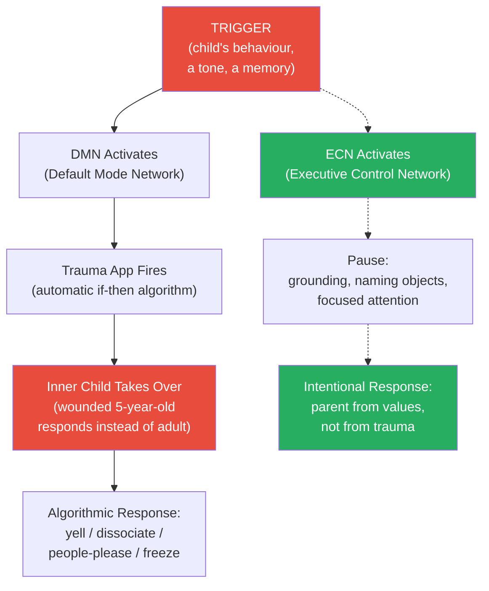
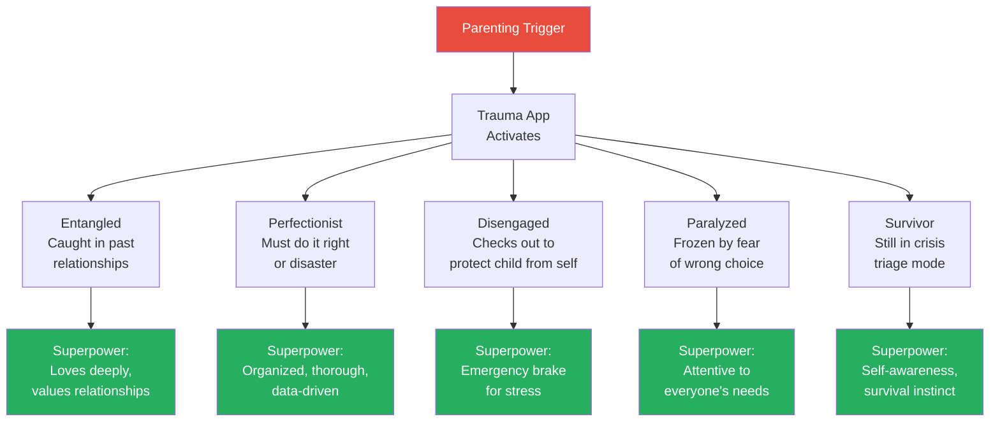
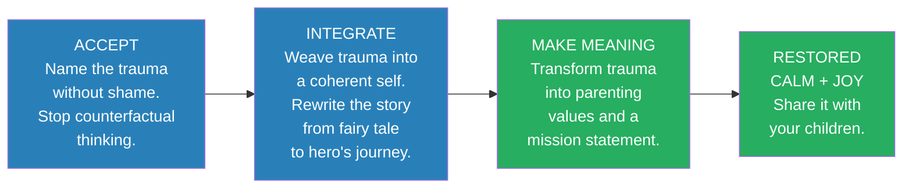
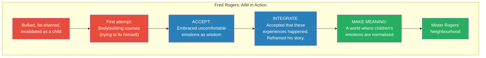
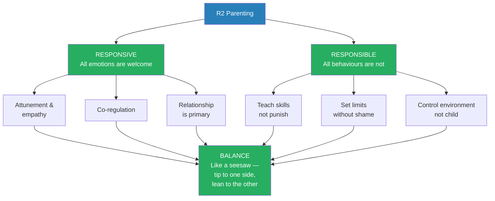

# Post-Traumatic Parenting — Dr. Robyn Koslowitz

> What if your worst parenting moments have nothing to do with your skills as a parent — and everything to do with an invisible algorithm running in your brain? Dr. Robyn Koslowitz, a child psychologist who is herself a PTSD survivor, delivers the first parenting book written specifically for parents whose childhood trauma hijacks their parenting. She calls it the "trauma app" — an automatic if-then algorithm your brain created to survive your childhood that now fires every time your child triggers you. When your toddler melts down in Target, it is not you screaming — it is your wounded five-year-old inner child responding to a threat that no longer exists. Koslowitz identifies five post-traumatic parenting types, each with its own superpower and its own shadow, and then provides the AIM model — Accept, Integrate, Make Meaning — to transform trauma from the thing that controls your parenting into the thing that fuels it. The result is R2 Parenting: a framework that is both Responsive (emotionally attuned) and Responsible (structurally sound). This is the tactical manual for any parent who has ever thought, "I swore I would never parent like my parents — and then I heard their words coming out of my mouth."

---

## About the Author

Dr. Robyn Koslowitz is a clinical child psychologist based in New Jersey who specialises in trauma-informed parenting. Her own trauma story spans four acts: the trauma of absence (growing up with a chronically ill father whose heart condition shaped every family decision), the acute trauma (performing CPR on her dying father at age sixteen — and failing), PTSD (years of flashbacks, dissociation, and a belief that she was losing her mind), and the professional quest that followed (studying psychology to answer the question: "How do you give kids a normal childhood if you did not have one?"). She describes herself as a "duck" — serene on the surface, legs paddling madly underneath.

Koslowitz's clinical work led her to create the post-traumatic parenting framework after abandoning a court-mandated parenting curriculum mid-class when every parent in the room raised their hand in response to: "How many of you feel your trauma is affecting your parenting?" She has since treated thousands of post-traumatic parents and built a community around the idea that trauma is not a defect but a superpower waiting to be reclaimed.

This is the only book in the vault that directly addresses how trauma affects **parenting** — not the wound itself (Walker, van der Kolk), not the generational transmission (Wolynn), but the specific mechanics of what happens in your brain when your child triggers you, and what to do about it in real time.

---

## The Big Idea

- <b style="color: #2980b9">Your brain created a "trauma app"</b> — an algorithmic if-then response based on past trauma that fires automatically when you are triggered, hijacking your parenting by putting your wounded inner child in the driver's seat instead of your adult self
- <b style="color: #e74c3c">Your inner child cannot raise a child</b> — when the trauma app fires, you are not responding to your child's current situation; you are responding to your own childhood pain, and the result is screaming, dissociating, people-pleasing, or freezing when your child needs a calm, present parent
- <b style="color: #27ae60">Your trauma is also your superpower</b> — the same heightened empathy, pattern recognition, and emotional depth that came from surviving trauma can become your greatest parenting asset, once you learn to use it consciously rather than letting it run on autopilot
- The path forward is not eliminating trauma but integrating it: **Accept** what happened, **Integrate** it into a coherent self-narrative, and **Make Meaning** from it by transforming it into parenting values and a mission statement
- Triggers cannot be controlled — they are automatic, like gravity — but you can retrain your brain's default response by switching from the <b style="color: #2980b9">Default Mode Network (DMN)</b> to the <b style="color: #2980b9">Executive Control Network (ECN)</b>
- Good parenting requires both emotional attunement AND structure: <b style="color: #27ae60">R2 Parenting (Responsive + Responsible)</b> combines gentle, connection-first parenting with the willingness to teach skills, set boundaries, and say no

---

## Key Concepts at a Glance

| Concept | One-line summary |
|---------|-----------------|
| **The trauma app** | An automatic algorithm in your brain: "if triggered, do this" — created by past trauma, now hijacking your parenting |
| **Inner child envy** | The normal, hidden jealousy you feel toward your child having what you never had — a roadmap to your values |
| **DMN vs. ECN** | Default Mode Network (automatic trauma response) vs. Executive Control Network (present-moment focus that turns off the DMN) |
| **Five PTP types** | Entangled, Perfectionist, Disengaged, Paralyzed, Survivor — your default parenting mode when triggered |
| **AIM Model** | Accept → Integrate → Make Meaning: the three-step framework for transforming trauma into parenting values |
| **R2 Parenting** | Responsive (emotionally attuned) AND Responsible (teaching skills, setting limits) — permission to parent |
| **Counterfactual thinking** | The "if only" loop that wastes psychological resources trying to undo what already happened |
| **Rupture and repair** | Disconnections are inevitable; repair is what teaches children that relationships survive conflict |
| **Mission statement** | A declaration of parenting values derived FROM your trauma — what your suffering taught you to provide |
| **Kintsugi** | The Japanese art of repairing broken pottery with gold — Koslowitz's metaphor for post-traumatic growth |

---

*When triggered, your brain defaults to the DMN — the automatic trauma response. But activating the ECN (by grounding, naming objects, or focusing attention) shuts off the DMN and puts your adult self back in the driver's seat. The solid arrows show the automatic path; the dashed arrows show the intentional path.*

---

## Part I: It's Not You — It's Your Trauma

### Chapter 1: Understanding Trauma

*Koslowitz dismantles the hierarchy of trauma and shows that what did not happen to you can be just as damaging as what did.*

- <b style="color: #2980b9">Trauma</b> is any experience that was too big for your brain to metabolise — that rocked your sense of security in the world
- There are four types:
  - **Acute trauma** — a single, discrete incident ("the day my life changed")
  - **Chronic trauma** — ongoing, invisible, cumulative (what Koslowitz calls **s-ACEs**: the *secret* adverse childhood experiences — harsh parenting, bullying, invalidation, living with chronic illness)
  - **Trauma of absence** — what did not happen *for* you as a result of what happened *to* you (no playdates, no childhood exploration, no age-appropriate freedom)
  - **Intergenerational trauma** — patterns passed down without awareness
- <b style="color: #e74c3c">"Trauma is not only what happened to you. It is also what did not happen for you."</b>
- The cause of your trauma matters less than its effect — being verbally bullied can be as damaging as being physically assaulted
- A persistent feeling of **aloneness** is the hallmark of trauma — something you felt alone in coping with, without the necessary support
- **Trauma Poker** is a worthless game: comparing your trauma to others' invalidates your experience and blocks healing
  - "I see your bullying, and I raise you having a sister with disabilities"
  - The trauma of absence never makes it onto the poker table — it is an invisible card you cannot play because the things you missed cannot be categorised as one discrete event
  - The words we choose to describe our traumas are often inadequate — what "I was bullied" means for one person (relentless lunchroom teasing) is completely different from another (daily beatings while other kids watched)

#### The Trauma Controversy

- People think trauma is overdiagnosed nowadays — Koslowitz disagrees
- She believes we are just scraping the surface of what people experience and are now willing to talk about
- Not all challenges are traumatic — the test is: "Would you go to any lengths to make sure it does not happen to your child?"
- Being traumatised does not mean you are not resilient — it does not mean you are broken or that you have not been doing the best you can
- But there may be a better way to handle some situations — and that is what this book provides

> [!example] Koslowitz's Father and the Refrigerator (Age 5)
> - Robyn's father had a severe heart condition she knew about for as long as she could remember
> - He used to swing her to the top of the refrigerator in their kitchen — one day, mid-swing, he clutched his chest
> - That was the beginning: race to the hospital, diagnosis, years of watchful waiting
> - For years, five-year-old Robyn believed it was her fault
> - Her family restructured around keeping her father alive — her mother became anxious and protective, normal childhood experiences simply did not happen
> - Robyn brought a book to school for recess instead of playing — tolerated in elementary school, a target on your back by middle school
> **The lesson:** The trauma of absence is invisible on the poker table — you cannot play a card for what never happened — but it counts in your own psyche.

- Trauma also occurs in adulthood — a narcissistic partner, a toxic boss, a near-death experience, the COVID-19 pandemic
- <b style="color: #e74c3c">"Childhood is written in pencil and adulthood is written in pen"</b> — adult traumas are harder to recover from because other people (often little humans) depend on you
- If you typically have a disproportionate reaction to stressors, your reaction may point to a hidden traumatic event — your brain translated the incident into a more globalised fear that surfaces around parenting

#### PTSD and Its Effect on Parenting

- PTSD symptoms include flashbacks, hypervigilance, dissociation, exaggerated startle response, persistent negative beliefs, inability to experience positive emotions, and reckless or self-destructive behaviours
- Koslowitz translates each symptom into parenting language:
  - "I start every day with good parenting intentions and go to bed filled with shame" → irritability and exaggerated startle response
  - "I am blocked as a parent. I feel disconnected from my daughter" → persistent inability to feel positive emotions
  - "I am good at everything else but parenting makes me feel like an idiot" → persistent negative beliefs about self
  - "I am always forgetting the dentist appointment, starting homework too late" → problems concentrating, dissociation
  - "I need to provide everything I did not have — no matter how much I earn, it never feels like enough" → hypervigilance
- Your PTS symptoms may never go away — but you can learn to manage them, recognise when they are coming, and create a toolbox for what to do
- Bessel van der Kolk's insight (*The Body Keeps the Score*): trauma does not always come back as a memory — it often comes back as a physical reaction
- Lisa Feldman Barrett's refinement: "The body does not keep the score. The body IS the scorecard" — embodied memories create physical symptoms that become problematic in themselves
- **Complex PTSD** (cPTSD) often stems from chronic traumas or the trauma of absence — personality disorders like borderline traits may actually be misdiagnosed cPTSD
  - If you grew up in an invalidating environment and never experienced someone truly understanding you, any sign of acceptance becomes a lifeline
  - You cling to that relationship with overwhelming attachment — not because you are manipulative, but because you are addicted to the sensation of being seen
  - This is the logic of the **trauma bond**: the relationship feels essential because it provides what was always missing
- Trauma teaches us to draw conclusions about ourselves and the world — those conclusions become self-fulfilling prophecies
  - "The world is not safe" → hypervigilance → children absorb the parent's anxiety
  - "I cannot do anything right" → every parenting mistake confirms the belief → guilt on steroids
- **Gisele's story**: an attorney and entrepreneur who put herself through law school at night — yet she still calls herself "lazy" because her teachers called her lazy when she could not read English as a child immigrant
  - The shaming voices left her with a core belief that decades of overachievement cannot dislodge
  - Trauma creates core beliefs that no amount of external evidence can automatically overwrite

> [!tip] Core Insight
> If you would go to any lengths to make sure what happened to you does not happen to your child — congratulations, you are traumatised. That does not mean you are broken. It means certain psychological functions have been rewired, and you need to reclaim them for parenting.

---

#### Koslowitz's Introduction: The Four-Part Trauma Story

*Koslowitz opens the book by sharing her own story in four parts — modelling the vulnerability she asks of her readers.*

> [!example] Koslowitz's Acute Trauma — CPR at Sixteen
> - At sixteen, Robyn woke at 2 AM to her mother screaming
> - Her father was half-sitting on the bed, not conscious, not breathing — holding his nitroglycerin pills in one hand and the telephone in the other
> - As a certified lifeguard, Robyn knew CPR — but she hesitated because giving her father mouth-to-mouth felt intimate and strange
> - She remembered the taste of his mouth, the rubbery sensation of his skin — which now she knows meant he had been dead for a while
> - The paramedics literally dragged her off his body to administer defibrillation — eventually, they gave up
> - At the funeral, an uncle called her a hero — she wanted to scream "You are lying!" because she knew she had failed
> **The lesson:** Koslowitz carried two decades of flashbacks — auditory and tactile, not just visual — that she believed were schizophrenia. She hid them from everyone, including her mother, whom she feared burdening. The duck metaphor was born: serene on the surface, legs paddling madly underneath.

- After her father's death, Koslowitz developed flashbacks, dissociation, and a belief she was "crazy"
- A school counsellor suggested she could "pray away the demons" — positive thinking as a treatment for PTSD
- She was treated with an early form of EMDR in college — even that therapist hesitated to diagnose PTSD because "you are too functional"
- <b style="color: #27ae60">"All research is me-search"</b> — her entire academic career was driven by the question: how do you give kids a normal childhood if you did not have one?
- Koslowitz's central metaphor for the healing journey: **parenting is a mirror, a map, and a motivator**
  - The way she interacted with her children was a **mirror** that let her see how trauma was affecting her
  - Learning how to be a better parent provided the **map** to health for both herself and her children
  - Parenting provided the **motivation** to embrace the discomfort of trauma and learn new skills
- The kintsugi metaphor: an ancient Japanese art of repairing broken vessels by joining the pieces with gold — the finished product is more beautiful and more valuable for having been shattered and repaired
  - Legend says a kintsugi vessel cannot be re-broken on the original seams because it is stronger now
  - "We are shattered. But when we pull ourselves together, we become something infinitely more precious."
- The first sign her PTSD was affecting parenting: her daughter's first day of kindergarten
  - She called out "Have a good day. God willing, I will see you later." Then thought: "And if God does not want, I will not see her later."
  - She sat at the kitchen table in a dissociated state for the entire day — frozen, unable to move
- Years later, her ten-year-old son told her he did not like it when she "goes away behind her eyes" — echoing what a high school friend had said decades earlier
- That was the moment she knew she had to undo her dissociation to be present for her family

---

### Chapter 2: Your Inner Child Cannot Raise a Child

*Koslowitz introduces the central metaphor of the book — the "trauma app" — and shows how your wounded inner child hijacks your parenting in real time.*

- Your brain created an algorithm based on past trauma: **"if this, do that"**
  - If someone is loud → danger → shut down
  - If child is late → I am incompetent → rage
  - If someone is angry → I must people-please → give in
- When triggered, <b style="color: #e74c3c">your wounded inner child takes over parenting</b> — reacting to THEIR childhood, not your child's current situation
- The trauma app operates automatically, below conscious awareness — you do not choose to activate it
- The app co-opts your sense of self, your interoception, your ability to be present, and your internal voice
- It cannot distinguish between a genuine threat to your child and a situation that merely *resembles* your childhood pain
- The challenge is **uncoupling emotional flashbacks from parenting decisions** — keeping the trauma app out of the driver's seat while still using its data
- Parenting means intentionally acting in consonance with your values — the trauma app offers only algorithmic responses: "When someone upsets me, I snap. When I am intolerably stressed, I dissociate. When someone is mad at me, I people-please."
- <b style="color: #27ae60">Parenting is teaching children the ultimate skill — How to Human — in zillions of tiny little steps</b>

> [!example] Sarah and Penny — The Morning Rush
> - Sarah was humiliated for dyslexia as a child — her teacher called her names in front of the class
> - When daughter Penny is late for school, Sarah's trauma app fires: "Penny MUST make the school bus, or I am a bad mom. I cannot be a bad mom because I cannot be incompetent."
> - Sarah screams at Penny, calls her names — her wounded inner child is responding to the childhood teacher, not to Penny
> - When Sarah can recognise the pattern, she updates the narrative: "Maybe I was feeling so bad about myself because Penny was not prepared, and it reminded me of when I was being bullied by my teacher. Not everyone was rejecting me. It was that one teacher."
> - When Penny is late and Sarah can talk to her without panicking, Adult Sarah is in charge — not Little Sarah
> **The lesson:** The trauma app is algorithmic; it cannot distinguish between a childhood threat and a Tuesday morning. When you recognise the pattern, you can parent from values instead of from the algorithm.

#### Finding Your Parenting Values Through the Inner Child

- Sarah's healing shows the path: once you recognise the trauma app, you can parent from the opposite of the algorithm
  - Sarah's value: **supportive kindness** — the thing she desperately wanted from her own teachers
  - She can now provide it to Penny, even when it costs her time or criticism from Penny's teachers
  - "I can talk to Penny compassionately through her morning. Even if she misses the bus, I can tolerate being judged by her teacher. That does not mean I am incompetent."
- Your parenting values already exist — you just do not know you have them
- The first place to look: **your envy**

---

#### Inner Child Envy — The Hidden Roadmap

- It is normal to be envious of your own child having what you never had
- The old refrain "I walked uphill both ways in the snow to get to school" is really your inner child's envy of your current kid having it easier
- We try to dismiss or deny the envy because it feels unbecoming — how can we be envious of our own child? Does that mean we love them less?
- <b style="color: #e74c3c">The problem: anything that is unaccepted is unexaminable</b> — when you deny envy, it controls you
- <b style="color: #27ae60">"If you are envious of it, you value it. If you value it, you can have it, even if you have it only by giving it."</b>
- As you give it, your inner child gets to experience it — that is how you keep your inner child intact without letting it parent your children
- The envy points directly to your parenting values — the things you most want to provide
- Unexamined envy gets weaponised by the trauma app: "He is already spoiled enough. I never got any toys when I was growing up."
- Examined envy becomes a compass: "I value my children feeling safe enough to come to me with big emotions."
- One parent shared: "Sometimes when I watch my husband be a healthy father with my kids, I am so jealous. In the past, I would withdraw completely. Today, when I have those feelings, I know I need a minute to acknowledge them — and when I can stay, I can join in and revel in the play."

> [!example] The Toy Aisle at Target
> - Five-year-old Aaron demands toys while shopping for his cousin's birthday present
> - When Aaron melts down, the parent's inner child fires: "I am not getting him anything. He needs to learn. I never got any toys."
> - The envy masquerades as discipline — but the lack of empathy during the meltdown is the wounded inner child talking
> - A values-based response: "I know you REALLY want that truck. It is so hard. Right now, Aaron, I need you to say yes to no. Today, we are buying a small treat for you and a present for Daniel."
> - The parent who can recognise the envy can parent from values instead
> **The lesson:** Getting angry at the child for their meltdown or labelling them as spoiled is your wounded inner child talking. Understanding the envy is a sign you are on the road to healing.

> [!abstract] Exercise: Self-Parenting
> Before seeing your child for the first time each day, read aloud:
> 1. "Today, I am going to be present with my child."
> 2. "Today, I am going to make my child feel seen, felt, and heard."
> 3. "And, as I do that, Inner Child, I want you to pay attention to this message from me to you."
> 4. "Dear Little Me: As you watch me parent [Name], you are going to see me making them feel seen, felt, and heard. You are going to think, I wish I had had that. There is going to be some sadness. That is okay."
> 5. "As I soothe that child, Inner Child — I want you to feel hugged. As I soothe, you can tap into the sensation of soothing."

---

### Chapter 3: How Trauma Shows Up in Parenting — Triggers and Responses

*Koslowitz introduces the neuroscience of triggering and demonstrates that you cannot control your triggers — but you CAN retrain the network that responds to them.*

- <b style="color: #e74c3c">"You cannot blame yourself for your reactions to your triggers. It is like blaming yourself for gravity."</b>
- Triggers are automatic associations — any thought or event that elicits a reaction
- For PTPs, **anything a child does can be triggering** — and any thought you have about yourself as a parent can be triggering
- Trauma interferes with **interoception** — the ability to accurately read your own body's signals — so you miss your stress levels rising and then suddenly snap

#### The DMN vs. ECN — The Neuroscience of Being Triggered

- <b style="color: #2980b9">Default Mode Network (DMN)</b> — your brain's automatic default when not actively engaged in a task
  - Created by your trauma: "loud = danger," "unexpected touch = threat"
  - Processes traumatic memories as if they are **currently happening** — not recalling but reliving
  - The posterior cingulate cortex (PCC), part of the DMN, processes the sensation of "What just happened? Who am I? What does this mean for me?"
  - During DMN activation, **no new learning occurs** — the brain just returns to its default
- <b style="color: #2980b9">Executive Control Network (ECN)</b> — your brain maintaining focus on the task at hand
  - When the ECN is active, the DMN is **automatically shut off**
  - Executive functioning = present-moment focus, controlled attention, intentional thought
  - Activating the ECN is the key to retraining the DMN

> [!abstract] Experiment: The Straw Exercise
> 1. Run in place as fast as you can with hands over your head while breathing through a straw
> 2. This restricts oxygen and raises heart rate — creating the physiological sensation of acute danger
> 3. When you feel panicky, stop — notice the panic, the racing heart, the breathlessness
> 4. Can you remember the first time in your life you felt this exact way? The worst time? The most recent?
> 5. Now: look around your room. Say out loud three items that are red, two that are blue, one that is yellow
> 6. Notice your heart rate slow down. The sharpness of the memory fading.
> 7. Your DMN was activated when you started running. When you activated your ECN by focusing your attention, you automatically shut off the DMN.

#### Trigger Table by Child's Age

| Age Range | Triggers from Child's Behaviour | Triggers from Your Thoughts |
|-----------|-------------------------------|---------------------------|
| **Infant-Toddler (0-2)** | Dangerous situations, sudden loud noises, meltdowns, feeling "touched out" | Feeling incompetent, being shamed for parenting by others |
| **Preschool (2-5)** | Stubbornness, separation anxiety, bullying behaviour, emotional turmoil | Your separation anxiety, sadness about how young you were during trauma, fear of being unable to play joyfully |
| **Early School (5-10)** | Acting immature, poor social skills, obstinate behaviours, intense emotional reactions | Distress watching children face the social world, impostor syndrome as parents compare you |
| **Middle School (10-14)** | Not talking to you, behaviour that reminds you of your wounded inner child at that age | Processing traumas of absence, fear of loss as peer group takes over, fear as child displays your traits |
| **High School (14-18)** | Attempts at separation coupled with anger, interpersonal trauma coping | Awareness the child is leaving the nest, fear for their future |

---

#### Parenting While Flashbacking

- The stress children inadvertently create does not just trigger a traumatic memory — it triggers a reaction to the actual traumatic experience
- Example: your teenager is mad at you and you are a people-pleaser
  - DMN recognises anger as a threat → trauma app provides algorithmic response: "Someone is mad at me, I must people-please"
  - You meant to say no about the car keys — but yes came out of your mouth
  - Afterwards: "What the heck did I just do? I was going to hold firm."
- The circuitry involved in the original trauma activates — you respond automatically, with even less choice than usual
- <b style="color: #e74c3c">The challenge of post-traumatic parenting is uncoupling emotional flashbacks from parenting decisions</b>
- We need to be guided but not controlled by our stress response — able to remain present in a stressful moment rather than treating it as a situation that must be escaped

---

> [!example] Koslowitz's Mother and the Rosebushes
> - After Robyn's father died, her mother would come home from work each day and drink her coffee while looking out at his rosebushes — his pride and joy, the ones he had lavished attention on after his heart diagnosis
> - One day, the neighbour's gardener — who had always resented the petals falling on their property — went into the yard while the family was away and uprooted every rosebush
> - When Robyn came home from school, her mother was sitting at the kitchen table, sobbing as if she would never stop
> - She was not responding to a memory. She was not having a flashback. She was **re-experiencing** her trauma as if it were happening in that moment — the enormity of loss, the feeling of being out of control
> - The gardener had killed the rosebushes, and for her mother's brain, her husband had died all over again
> **The lesson:** The DMN does not distinguish between past and present. Traumatic memories are not experienced as memories — they are fragments of prior events subjugating the present moment.

---

## Part II: The Five Post-Traumatic Parenting Types

*Koslowitz identifies five distinct default modes that trauma creates in parents — algorithmic responses the trauma app uses to restore a sense of safety. Most parents are hybrids.*

*Each PTP type has both a shadow side (the automatic trauma response) and a superpower (the same capacity used consciously). The goal is not to eliminate the type but to recruit the superpower while retiring the algorithm.*

---

### The Five Types Compared

| Type | Core Fear | Biggest Mistake | Dream Vision | Dread Hearing | Superpower |
|------|-----------|----------------|--------------|---------------|------------|
| **Entangled** | I will emotionally damage my kids, just like me | Focusing on family-of-origin drama instead of my kids | My past relationships are peripheral to being there for my kids | "You didn't protect me. You were there for everyone else but me." | Loves deeply, values and maintains relationships |
| **Perfectionist** | I am not good enough. What if we go "off script"? | Giving kids what I would have needed instead of what THEY need | Feeling like I am doing a good-enough job — and that is good enough | "You failed me, and now I am damaged." | Values data, procedures, organisation; gets things done correctly |
| **Disengaged** | I have no idea how to build a relationship with my kids | Wanting to protect kids from their greatest danger — me | My kids and I could have a real relationship; I could relax into it | "Where were you when I was growing up? I don't even know you." | Has an emergency brake for the stress response |
| **Paralyzed** | I will do the wrong thing and damage them | Focusing on doing it all instead of focusing on THEM | Feeling like a secure base; the awful fear of messing up is gone | "You messed up and now I have to live with the consequences." | Attentive to other people's wants and needs; notices all tasks |
| **Survivor** | My kids will not come to me when they need help | Only focusing on getting through each day | That I would actually parent instead of survive | "You were such a mess. I needed a grown-up and you were just another child." | Self-awareness enough to know where they are |

- Most parents are **hybrids** — different types activate with different triggers, different children, different times of day
- Moving out of one default can slide you into another — that is a normal part of healing
- When you can say "Hi, perfectionist parent default" as the stress begins, you can stop the trauma app from taking over

---

### Chapter 4: The Entangled Parent

*The parent whose past relationships — family of origin, toxic ex, frenemy — are still entangled in their sense of self, pulling focus away from their children.*

- <b style="color: #2980b9">Entanglement</b> means someone from your past is still the arbiter of your reality — they determine whether you are good enough, lazy, selfish, worthy
- These parents instinctively know something is wrong but cannot break free because the entanglements feel too intrinsic to their sense of self
- **Object relations theory**: if your primary caregiver was neglectful or abusive, your sense of self is compromised — you become desperate to hold onto relationships, even toxic ones, to bolster your identity
- **IFS perspective**: the trauma app acts as a "manager" part, keeping you stuck in old patterns that made sense during trauma but are no longer useful
- Entanglement and women: being selfless is socially reinforced for women — saying no when your entire identity was built around saying yes is terrifying

> [!example] Esme's Entanglement
> - Esme, an entrepreneur with three children, plays the role of sensitive peacemaker in her family of origin
> - Her father was seriously injured when she was eleven; her mother became bitter and started drinking; her father's temper spilled over
> - She was labelled "the selfish one" despite being the one who constantly pitched in
> - As an adult, she never feels good about herself unless her family is actively acknowledging her for being helpful
> - She is constantly torn: her sister's kids must be picked up, her dad needs a ride, her mother demands her time
> - When the stress boils over, she snaps at her eleven-year-old daughter: "Can you not see I am having a bad day? Are you so selfish that you do not care?"
> - Esme's mother says talking about boundaries is "ridiculous — people nowadays act selfishly and call that boundaries"
> **The lesson:** As long as your family of origin is the arbiter of your reality, you will never be free to parent from your values. Esme did not create the mess; she does not have to fix it.

#### The Power and Purpose of Anger

- Entangled parents often carry simmering anger that erupts as **mom rage** (or dad rage)
- Anger has two jobs in the psyche: it identifies a problem, and it identifies a boundary
- <b style="color: #2980b9">When anger is disproportionate to the event</b> — especially with phrases like "You always..." or "You never..." — you are experiencing a boundary impingement
- Mom/dad rage is almost always **displaced anger**: you are mad at your kids when you should be angry about some other part of your life entirely
- Anger is not a primary emotion — it covers up grief, sadness, or fear
  - Esme is carrying grief over her own lost childhood AND mourning her daughters' childhoods even while they are living them
  - She is sad that she is valued by her family only for what she can do, not for being herself
  - She fears she is losing touch with her true self
- The problem: anger distracts from these awarenesses and creates new problems — lashing out becomes the next transgression she has to make up for, entering a new cycle of guilt and shame
- Unlike many therapists, Koslowitz is not against guilt — justified guilt points toward repair; when you repair, the guilt resolves
- **Unjustified guilt**: when others tell you that you violated THEIR values, not your own

---

#### Boundaries: Where You End and I Begin

- Boundaries are not walls — they are about closeness, not distance: how close is too close?
- Boundaries are at their simplest: **where you end and I begin** — "This is who I am. This is what I value. This is what I care about."
- A **preference** is not a **boundary**: wanting a quiet evening is a preference; needing it to avoid snapping at your kids is a boundary
- A **bid** is neutral ("Can I visit?"); an **order** is psychologically coercive ("You must drop everything")
  - Sometimes the bid is neutral but your inner child interprets it as an order: "If I say no, I am a bad person"
- **Objectification** from infants is healthy — babies cannot understand boundaries — but from anyone else, it is unhealthy
- You are a **container** for your child's emotions — a full container cannot hold your family of origin's emotions AND your child's
- Boundaries are not estrangement — in fact, boundaries **prevent** estrangement; ignoring boundaries creates it
- We can hold several contradictory truths at the same time:
  - "I have the right to protect my time. AND it is okay for others to ask for my time."
  - "I have the right to my emotional reactions. AND I have the right to keep my emotional life private."

> [!abstract] Exercise: Practice the Art of Saying No
> Use positive language and pair the ask with an incentive — make the boundary sweeter, not softer:
> - "I love it when you come over. I need you to call first. This way, when you do come over, we can have an enjoyable visit."
> - "We would love to enjoy the party with you for three hours. This is what works for our family."
> - "I want to be the best employee I can be. I need to leave on time so I can arrive refreshed tomorrow."
> - "I would like to help you when possible, and I need you to take no for an answer when it is not possible."
> If they argue, repeat the boundary. Do not debate.

- When Esme began setting boundaries, her daughter internalised: "I know who I am. I am a person worth focusing on. Seeing mom have boundaries means I can have them too."

#### The Container Metaphor

- Healthy infant attachment begins with **objectification** — the parent's role is solely to meet the baby's needs
  - A baby does not understand that their mother is a discrete entity — "Mommy needs sleep at 2 AM? I need food, so I will cry"
  - This objectification from infants is healthy and expected
- As children grow, the parent transitions from being an "object" to being a **container** — holding the child's emotions, making them more manageable
  - Toddlers are tiny bodies holding giant emotions — our job is to contain, reflect, and soothe
- <b style="color: #e74c3c">A full container does not have room for more</b> — you cannot hold your family of origin's emotions, your ex-spouse's aggression, AND your boss's stress and still be the container for your children
- Something has to give — and what gives must be the adult entanglements, not the children
- When Esme starts setting boundaries, her family of origin will increase their bids — doubling down on criticism because it worked before
  - Like flicking a flashlight switch that will not turn on — eventually they stop because the strategy no longer works
  - The "broken object" was never really broken: you were never an object — you are and always were a complete, authentic, whole human

> [!tip] Core Insight
> "My container belongs to my children and myself. I am not responsible for holding any other adult's emotions." When you can say this with conviction, you are disentangling.

---

### Chapter 5: The Perfectionist Parent

*The parent who must do everything right, driven by the intolerable fear that any mistake will damage their child the way they were damaged.*

- The difference between wanting to be a good parent and being a perfectionist: **"I want" vs. "what-if"**
  - "I want my kids to have friends" = reasonable expectation
  - "What if my child does not make friends?" = trauma-app-driven imperative to head every mistake off at the pass
- <b style="color: #e74c3c">Experiential avoidance by proxy</b> — it is not "I want to avoid big emotions" but "I want to prevent my kids from feeling big emotions"
  - The paradox: kids NEED tolerable discomfort to build psychological immunity
  - The perfectionist parent never lets their kids get to the hard times — and that is a profound loss
- Perfectionist parents know what they should be doing, but their behaviour does not reflect their knowledge
  - If attention is on "Don't yell," attention is focused on yelling — making you more likely to yell
  - **Carol Dweck's fixed mindset**: "I cannot afford to mess up" instead of "I cannot do it — yet"
- Often burned out, depressed, exhausted — lost any sense of joy in parenting
  - Research: the higher the parenting perfectionist standards, the greater the chance of parental burnout
  - Think about a job where the standards are always too high, you are always on call, and always subject to both internal shaming and external blaming — that is the perfectionist parent's daily life

#### Where Perfectionist Parents Come From

- When a child cannot control their environment, they will try to control themselves — perfectionism is the ultimate effort at internal control
- Perfectionist parents often grew up in **chronically invalidating environments** (Marsha Linehan): homes where your emotions are met by erratic, inappropriate, or extreme responses
  - You cry because you fell down and dad yells "Stop crying, or I will give you something to cry about"
  - Or one day dad is super concerned — and the next day he rages for the same situation
  - The lesson learned: <b style="color: #e74c3c">love is conditional — I need to be perfect to experience it</b>
- **IFS view**: perfectionism arises from "manager" parts whose role is to maintain control and protect vulnerable "exile" parts
  - The root: if things are not perfect, something deeply bad about the self will be exposed
  - The strategy: prevent shame, criticism, or rejection at all costs

#### Perfectionist Subtypes

- **Self-focused perfectionists**: incredibly high standards on their own behaviour — "I must do everything perfectly" — less focused on specific outcomes for kids, more on being the perfect parent
- **Goal-oriented strivers**: the ones labelled "resilient," "mature," "wise beyond their years" — their trauma app creates "perceived control" (if I am responsible for everything, I feel safer)
  - Even when hyperfocused (a typical trauma app superpower), they are not really present — they see only the problem, not all the solutions or the emotions
  - "Our child is not a task we can cross off on a checklist"
- **Hypervigilant protectors**: their trauma pierced the illusion of safety — they cannot find the point where it is simply too much vigilance
  - Koslowitz's own version: for the first month of each child's life, nobody but her was allowed to touch the baby
  - The one time her baby was in the NICU was great for her — she could sleep because he was being monitored
- **Helicopter parents driven by regret avoidance**: "What if my kid misses out?" → hover in the playground, fight with the teacher, cushion every blow

> [!example] Katie and Emily — When Your Child Wants to Quit
> - Katie's thirteen-year-old daughter Emily wants to stop gymnastics, even though she is very good and has done it for three years
> - Katie's what-ifs come hard and fast: "What if she regrets it? What else might she give up? Am I not teaching her grit?"
> - Koslowitz explains: gymnastics is a GOAL, but grit is a VALUE
> - Angela Duckworth defines grit as passion plus perseverance — if Emily has lost her passion, forcing her to stay is not teaching grit but reinforcing perseverance without passion (a path to burnout)
> - Koslowitz's rule for children and activities: no one quits on a low — mark the date, pick another day 3.5 weeks later; if they still want to quit, it is okay
> - Exception: if they are integral to a team counting on them, they finish the season
> **The lesson:** The trauma app turns values into inflexible goals — and that becomes counterproductive. When the "what we do" becomes too rigid, it blocks the original "why."

---

#### Goals vs. Values

- A **goal** is inflexible: either you hit your mark or you do not — "My kids must learn gymnastics"
- A **value** is about the journey and the "why" — "Athletics teach life lessons"
- The trauma app loves goals because they are distinct tasks that can be checked off — but there will always be another goal
- When the "what we do" becomes too inflexible, it loses the original "why"
- <b style="color: #27ae60">Test: "Tell Me Why"</b> — keep asking "why" until you find the value underneath the goal

> [!abstract] Exercise: What's the Worst Thing?
> A Socratic questioning game for identifying the real fear underneath perfectionism:
> 1. "What is the worst thing that could happen?" → "If I yell at her, she will be upset."
> 2. "Then what?" → "She will see I am out of control."
> 3. "Then what?" → "She will think I do not really love her."
> 4. "Then what?" → "She will be all alone, thinking her mom does not love her."
> 5. That is the real fear. Can you actually control that outcome? More likely not. All you can do is welcome the fear, thank it for the information, and focus on what you can control.

---

### Chapter 6: The Disengaged Parent

*The parent who appears unmotivated but is actually protecting their children from the biggest danger they believe exists — a relationship with themselves.*

- Disengaged parents are not always neglectful — they shut down and do not engage, physically present but psychologically gone
- Their trauma app's logic: "I am dangerous to my children. The safest thing I can do is keep my distance."
- They may be hypercompetent at work, socially adept in other settings — but emotionally absent at home
- Many use workaholism as the socially acceptable barrier to avoid emotional proximity with their children

> [!example] Amy the Workaholic
> - Amy was very wealthy and hired people to do everything with her kids
> - She told Koslowitz: "My staff is better at parenting than me. The tutor is better at doing homework with my kids than I am."
> - When they unpacked her responses, Amy saw that her workaholism was the barrier she created because of her ingrained fear that she was going to harm her kids
> - The disengagement was not laziness — it was protection
> **The lesson:** Disengaged parents are not absent because they do not care. They are absent because they care too much and believe proximity is the threat.

- **Superpower**: an emergency brake for the stress response — the ability to dissociate means they can stay calm in genuine crises
- **Shadow**: dissociation is by definition the opposite of presence — children feel unseen and unheard
  - One child said: "I don't like it when you go away behind your eyes" — devastating feedback that the parent cannot argue with
- **Better use of the superpower**: use adaptive dissociation strategically — schedule when you can afford to "tune out" (solo time, after bedtime) so you can be fully present the rest of the time
  - Create rules that limit phone use when with your kids
  - Narrating life for a baby (RIE approach) can actually help treat dissociation by forcing presence
- **Integration motto**: "It is safe for me to be present."
- **Acceptance affirmation**: "I am allowed to feel stressed; stress is not an emergency. Discomfort is not danger."

---

### Chapter 7: The Paralyzed Parent

*The parent who has a strong sense of what they do NOT want to do but no idea what they SHOULD do — frozen at the crossroads of every parenting decision.*

- These parents feel like they are operating on the edge of disaster all the time but have no idea how to fix it
- Highly susceptible to criticism and the whims of parenting influencers — they frequently switch to the latest new approach, only to find none of them work the way they seemed to on social media
- The trauma app's logic: "Any choice could be the wrong choice. Wrong choices caused my trauma. Therefore, no choice is the safest choice."
- The paralyzed parent's home is often a literal mess — things strewn everywhere, because prioritisation requires decisional energy they do not have
- They tend to focus on the loudest voice in the room, which means quieter, more important needs get ignored
- Life feels like they are trying to do everything simultaneously, never able to finish anything
- **Superpower**: attentive to other people's wants and needs — they notice ALL the tasks that should get done
- **Shadow**: this attention is scattered rather than focused — creativity and divergent thinking without a rudder
- The paralyzed parent is particularly vulnerable to the **ACT sportscaster technique**: narrating your experience from an observer's perspective rather than being consumed by it
  - Koslowitz teaches them to use an "observing self" — the "I" who tells your story instead of the "I" who drowns in it
- **Better use of the superpower**: stack tasks instead of doing everything simultaneously; figure out what you value so you can accept that some things just will not happen — and that is okay; create your own "if-then" rules to combat the trauma app's algorithms
- **Integration motto**: "My children are allowed to experience their emotions without me having to manage them."

---

### Chapter 8: The Survivor Parent

*The parent who can focus only on getting through the day — aware they are not providing what their kids need but lacking the emotional resources to change it.*

- Survivor parents are the most likely to have had a **recent** trauma as opposed to, or in addition to, a childhood trauma
- They are in triage mode — all resources going to basic survival, not growth
- The trauma app's logic: "Stay alive first. Everything else is a luxury."
- They often feel that their kids entered an already-stressed system — and the guilt of that is crushing
- When upsetting events happen, their children often end up comforting THEM — a role reversal that compounds the guilt
- They may pick fights with their children to shut down conversations that feel too emotionally demanding
- **Superpower**: if they are reading this book, they have enough self-awareness to know where they are — and that is the first step
- **Shadow**: surviving is not thriving, and parenting is all about thriving
  - A parent who is only surviving cannot provide the calm and joy that attachment requires
- **Better use of the superpower**: recruit as much support as possible — this is NOT the time for hyperindependence
  - "Even if you could do it yourself, you do not have the luxury of DIYing it while your kids need more from you"
- **Integration motto**: "My trauma narrative is still happening. I will work toward integration when I can."
- **Acceptance affirmation**: "I am in survival mode right now. It will pass."

#### Recognising Your Default and Naming It

- If you are reading this and thinking there are times you are all these things — part of you is paralyzed, then another part is disengaged or entangled — your reaction is entirely accurate
  - It is okay if you do not fit neatly into any one category all the time
  - One category is likely the one you resonate with most — start there, then learn about the others
  - Sometimes, moving out of one default slides you into another — that is a normal part of the healing process
- Most parenting books focus on the "what I did wrong" — Koslowitz focuses on the "why"
  - The whats of parenting (play more, hit less, talk more, yell less) are meaningless without understanding the whys
  - "In therapy, we do not treat problems — we treat solutions. Your defaults are pointing you to unpack what your behaviour is a solution for."
- Once you learn about your specific whys, it becomes crystal clear what you can do instead
- Triggers can also be a good sign: you are triggered because you care, because a particular situation is deeply important to you
  - If you are triggered by your own sense of incompetence at parenting, that means you VALUE parenting with competence
  - Whatever the trigger, there is a way to create a plan to manage it AND learn from it

> [!tip] Core Insight
> The brain does not always heal itself — it often substitutes one not-so-great coping skill for another. If you were an entangled parent and started setting boundaries, you could transition into a paralyzed parent. If you were perfectionist and let go of control, you might become disengaged. This is normal. Name the new default, and keep going.

---

#### Common Triggers by PTP Type

| Trigger Pattern | Associated Default | Superpower Being Hijacked | Integration Motto |
|----------------|-------------------|--------------------------|------------------|
| Overly critical of child | Disengaged / Perfectionist | Finds problems | "Children are not problems; they are people. People cannot be solved." |
| Conflict avoidant | Paralyzed / Entangled | Values relationships | "We can learn to have a good, productive fight." |
| People-pleasing child | Entangled / Perfectionist / Paralyzed | Attentive to social cues | "I am the adult. I am allowed to set boundaries, even if my child is upset." |
| Worrier / frequently anxious | Paralyzed / Perfectionist | Spots danger easily | "My child needs roots to feel secure and wings to explore. I will not clip their wings." |
| Control freak | Perfectionist / Paralyzed | Decisive | "Good enough is really good enough, for myself and my child." |
| Reactive / easily angered | Entangled / Survivor / all types | Finds problems with passion | "Anger identifies a problem. I can solve problems without blowing up." |
| Shut down | Survivor | Survival | "A state is not a trait. This feeling is temporary. I can reengage." |

---

## Part III: From Cycle Breaking to Cycle Making

### Chapter 9: Becoming the Parent You Want to Be — The AIM Model

*Koslowitz's three-step recovery framework for transforming trauma into parenting values: Accept, Integrate, Make Meaning.*

*The AIM model restores the two capacities that trauma steals: calm (through acceptance) and joy (through meaning). Once restored, you can share them with your children — and that IS attachment.*

---

#### Step 1: Accept

- Acceptance means seeing your traumas for what they are — the awful things that happened AND the parts of a normal life that you missed
- The enemy of acceptance is <b style="color: #e74c3c">counterfactual thinking</b> — the "if only" loop that wastes psychological resources trying to undo what already happened
  - "If only my father had stopped smoking..."
  - "If only I had turned left instead of right..."
  - Your limbic system cannot tell time — it thinks you can still change the outcome
  - Research: survivors who engage in more counterfactual thinking have significantly more PTSD symptoms
- **Radical acceptance** (Marsha Linehan / DBT): "It is as it should be" — not that traumatic events were acceptable, but that we acknowledge they happened and remain in the present
- **Experiential avoidance** (ACT): we try not to feel distress — but the only thing we control is our attention; we either make "away moves" (avoiding pain) or "toward moves" (moving toward values)
- **Welcoming the exiles in** (IFS): the parts of self we wish to disavow still deserve a voice — exiling them wastes resources

> [!tip] Core Insight
> The most important benefit of acceptance is that it restores your calm. When you are not wasting brain space on counterfactuals or trying to avoid uncomfortable emotions, you have resources to self-regulate and co-regulate. If you are calm, your children can access your calm when they need it.

- Each PTP type has a **superpower** that acceptance helps reclaim:

| PTP Type | Superpower | Better Use |
|----------|-----------|------------|
| Entangled | Loves deeply, maintains relationships | Decide where to put loving energy — current family, not past relationships |
| Perfectionist | Values data, procedures, organisation | Use structure and routine without demanding perfection; embrace rupture and repair |
| Disengaged | Emergency brake for stress response | Schedule "tune out" time so you can be present the rest of the time |
| Paralyzed | Attentive to everyone's needs | Stack tasks instead of doing everything simultaneously; prioritise by values |
| Survivor | Self-awareness | Recruit support — this is not the time for hyper-independence |

> [!abstract] Acceptance Affirmations
> - "My trauma really happened; it was not okay; there is nothing I can do to change it."
> - "My trauma changed me, and that is okay."
> - "I am allowed to be uncomfortable."
> - "I am entitled to live my life according to my values."
> - "I own my psychological energy, so I get to decide where to put it."

---

#### Step 2: Integrate

- Integration means your trauma becomes just one aspect of your life — one extra-strong superpower that does not have to do all the heavy lifting in your psyche
- Builds on acceptance: allows conversation with all your parts without letting any one of them run the show
- The goal: move the trauma app from the driver's seat to the back seat

##### Integration Means Understanding Your Triggers

- Your child does not trigger you — your child **reveals** your triggers
- <b style="color: #e74c3c">Making your child the caretaker of your triggers reverses the parent-child relationship</b> — "Don't trigger me" is the beginning of emotional incest (Alice Miller, *The Drama of the Gifted Child*)
- The minute you are triggered and do NOT act on your trigger — or act differently — is the minute you know integration is beginning
- Integration can sneak up on you: "It has been three years since we had THAT fight"

##### Integration Means Creating Work-Arounds

- Not every fear has to be overcome — sometimes, even when you achieve integration, you are still afraid of wolves, so you do not get a puppy
- Koslowitz was not a light sleeper before her father died in the middle of the night — now she is, and she always will be
  - Her work-around: a very specific bedtime ritual including a white noise machine and a bath
  - When very triggered, she needs an ice bath followed by a hot bath
  - Acceptance means not struggling with that reality; integration means using the work-around mindfully
- A work-around is not a crutch — it is part of you because you have integrated your true self
- You know who you are and what has to happen for your life to run smoothly

##### Viktor Frankl and the Space Between Stimulus and Response

- The famous quotation (often attributed to Frankl): "Between stimulus and response, there is a space. In that space is our power to choose our response."
- Hypervigilance, emotional reactivity, and dissociation all show that the trauma is not yet integrated — they are reactionary responses with no space
- As you learn to widen the pause between trigger and response, you are moving the trauma app from the driver's seat to the back seat
- **Judith Herman** (*Trauma and Recovery*): integration means the old procedural tendencies of safety through extreme reactions have receded
- **Daniel Siegel** (IPNB): integration means linking disparate parts — the trauma narrative, the trauma app, the survival behaviours — with a new capacity to tolerate uncomfortable emotions

##### Rewrite Your Story

- Your sense of self is based on the story you tell about yourself — trauma changes that story and often makes it impossible to understand or learn from
- **Exercise**: Write your story as a fairy tale (victim narrative — things just happen to you, agency is outside the self) → then update the narrator with information you did not have at the time → rewrite it as a hero's journey (agent narrative — you have choices and courage)

> [!example] Dana's Story — From Fairy Tale to Hero's Journey
> - **Fairy tale version**: "Dana, the little girl who had nothing, whose family lived out of their minivan. She wore the same shirt all week. Her teacher shamed her in front of the class: 'Dana, you are so lazy, why can you not put on clean clothes?' The other kids started bullying her. Dana was so ashamed."
> - **Hero's journey version**: "Dana did not know that teachers are not supposed to shame their students. She did not know that even if some girls were mean, there were other girls who would value her for herself. Dana was brave — she kept going to school, kept trying to make friends. One day, she met girls who liked her for who she was. They suggested she talk to the counsellor. Slowly, things got better. Dana is someone who keeps on trying, even when it is hard."
> **The lesson:** When we turn a fairy tale into a hero's journey, we reclaim agency — the power to make choices, reframe experiences, and reprocess the trauma narrative into something useful.

- Koslowitz's own story: from "Robyn, the girl whose mistakes can kill people" → to "Robyn, the girl who was willing to try" → to "Robyn, the woman who has the courage to take uncomfortable action"
- Teach your children the power of the word **"yet"**: from "my son who cannot catch a football" to "my son who cannot catch a football **yet**"
- If you cannot rewrite your story, get help — a therapist, a spouse, a supportive friend — but never your child
  - Your children can motivate you to reinterpret your story, but they cannot be your observing self — that would create a new cycle of emotional incest

> [!abstract] Integration Affirmations
> - "My superpower has both negative and positive traits that are part of my coherent sense of self."
> - "I know who I am, I know why I am the way I am, and I know what to do about it."
> - "I can let uncomfortable emotions in and give them a voice."
> - For the entangled parent: "I have the right to my boundaries — my anger helps me protect them."
> - For the perfectionist parent: "I can value doing things well without having to do them perfectly."
> - For the disengaged parent: "It is safe for me to be present."
> - For the paralyzed parent: "My children are allowed to experience their emotions without me having to manage them."
> - For the survivor parent: "My trauma narrative is still happening. I will work toward integration when I can."

---

#### Step 3: Make Meaning

- Finding meaning does not focus on the "why" of your trauma but on what you can learn from it — <b style="color: #27ae60">"This terrible thing taught me a precious and hard-won lesson, and that lesson is valuable."</b>
- Viktor Frankl: "He who has a why can endure almost any how" — Frankl directly lived this philosophy, founding logotherapy
- His student Edith Eger, also a Holocaust survivor, expanded on the philosophy in *The Gift* and *The Choice*
- Meaning does not imply forgiveness, gratitude, or acceptance that what happened was okay — and it is certainly not determinism
- <b style="color: #27ae60">"I am as I should be"</b> — Koslowitz's reframing of the DBT mantra "It is as it should be" — not that the trauma should have happened, but that SHE is as she should be now
- Your meaning is the positive lessons, the deeply held convictions you take and grow from
- The trauma app is algorithmic — small, meant to keep you contained
- Wisdom is big and deep — it takes in all the information, all the emotions, all the conscious values, and allows you to truly decide what to do

#### The Meaning of Sadness

- PTPs often tell Koslowitz that as their parenting improves, they become conscious of an intense sadness
- She is not surprised: <b style="color: #27ae60">sadness tells us what we value</b>
- The focus of the sadness points directly to the parenting values they want to develop
- When they can transform sadness into meaning, real change happens

> [!example] Sandy's Son Turns Six
> - Sandy was six when his parents divorced — there was profound neglect in his parents' home
> - When his son Jacob turned six, Sandy was overcome with intense, persistent sadness — he had known this particular year would be difficult
> - He always envied childhood friends who had tight-knit families
> - Koslowitz explained that Sandy's sadness was pointing him toward meaning: "Family closeness is something I value and want"
> - Sandy created a mission statement: "I am raising a family who feels a sense of closeness and connection"
> - Policy: "In this family, we prioritise together time"
> - Procedure: Family dinner, weekly game night, no phones after 6 PM for kids AND parents
> - His sadness began to lift — it had done its job
> **The lesson:** Sadness tells us what we value. When you transform sadness into meaning, real change happens.

##### Create a Parenting Mission Statement

- Start with one question: **What is the overall sensation I want my child to associate with growing up in my home?** (safe, heard, valued, competent, capable)
- Koslowitz's mission statement: *"I am raising capable future adults, who are both independent humans living in a reality of their own and interconnected beings who support and value one another."*
- The mission statement is hierarchical — saying yes to one value often means saying no to another
  - If you value creativity, you cannot also value a perfectly neat house
  - You can do one or two values reasonably well — make the mindful choice
- A mission can try to fill the gap of the experience you did not have:
  - Starting point: "My kids will get to take piano lessons"
  - Deeper: "Not getting to take piano lessons made me feel like my world was small and I could not follow my passions"
  - Mission: "If my kids want to explore something, they can, and I am going to support that interest. I want them to feel a sense of abundance."
- Koslowitz also has **micromissions** — small practices and truths she wants to emphasise
  - Example: "Even when I do not want to take the time for my bedtime ritual, I am going to, because I cannot show up as a present parent without enough sleep"
- **Policies** support the mission statement: "In this family, we value each other; in this family, we communicate respectfully"
- **Procedures** operationalise the policies: "During dinner, no screens. We follow steps for a productive disagreement. We are all citizens of this home, which means we all chip in."
- Procedures offer shorthand for intervening when children struggle: "We follow steps for a productive disagreement in this family. How can we have a productive disagreement about this?"
  - This puts the onus on the entire family and gives children an opportunity to think things through
- The mission statement also gives children permission to give feedback: "In this family, we value one another" means they can tell you when they do not feel valued
  - Koslowitz has received feedback about phone use during family time — she needs that feedback to stay honest to her mission

> [!abstract] Exercise: Draft a Mission Statement
> 1. Ask yourself: What is the overall sensation I want my child to associate with growing up in my home? (safe, heard, valued, competent, capable)
> 2. Write down those sensation words
> 3. Think of a statement that supports your thematic sensation words AND your superpower
> 4. Discuss it with your partner, a friend, a therapist
> 5. Create 2-3 policies that support the mission
> 6. Create 2-3 procedures that operationalise those policies
> 7. Share with your children — they get a vote (not full responsibility)

---

> [!example] Fred Rogers — The Ultimate Post-Traumatic Transformation
> - Fred Rogers was bullied, fat-shamed, and invalidated as a child
> - He first internalised a sense of himself as deficient — he wrote away for bodybuilding courses, trying to "fix" himself
> - He discovered a lifelong love for swimming during his bodybuilding phase, but more importantly, he learned to accept himself as he was
> - He **accepted** his uncomfortable emotions — learned to embrace them and use them to build wisdom
> - He **integrated** — did not deny the experience, reframed his story from victim to agent
> - He **made meaning** — created *Mister Rogers' Neighbourhood*, a world where children's emotions are talked about and normalised
> - "He hacked his trauma into his mission: to get into the mind and the heart of a child"
> **The lesson:** Rather than seeing yourself as damaged, can you accept, integrate, and find meaning? Whatever your mission is — macro like Mr. Rogers or micro affecting only your family — you have the unique insight to make it possible.

*Fred Rogers's life maps perfectly onto the AIM model — from trauma to attempted self-repair to acceptance to integration to a mission that changed millions of children's lives.*

---

### Chapter 10: R2 Parenting — Responsive AND Responsible

*Koslowitz's practical parenting framework that synthesises gentle parenting (responsiveness) with authoritative parenting (responsibility) — specifically designed for PTPs.*

#### The Attachment Foundation: Calm and Joy

- Psychologists Tina Payne Bryson and Daniel Siegel break attachment into the **four S's**: safe, seen, soothed, and secure
- These can be further sorted into two categories:
  - **Safe + soothed + secure** = find your calm, expand it outward, share it (co-regulation)
  - **Seen** = share your joy — mutual delight between parent and child
- <b style="color: #e74c3c">The two emotional capacities that trauma steals from us are calm and joy</b>
  - If you have PTSD, you do not have calm and you do not have joy
  - You cannot share your calm if you do not have any
  - You cannot share your joy if you do not have any
- The AIM model restores calm (through acceptance) and joy (through meaning) — and the R2 framework provides the practical structure for sharing both with your children
- **Earned security**: you can repair attachment in adulthood by providing good attachment to your children — as Koslowitz says, "In parenting, we are parented"

---

#### Why PTPs Struggle with Responsive Parenting

- Many gentle parenting proponents on social media are **judgmental** — shaming parents who use sticker charts, don't co-sleep, or use day care
- This feeds into PTP shame and guilt, making them less emotionally available — the opposite of the intended effect
- PTPs who try to be responsive often err toward **overly permissive** — "no-demand, only responsive" parenting
  - When your child is distressed about wearing shoes, empathising can easily become removing the shoes
  - That is not responsive — it is permissive
- <b style="color: #e74c3c">Perfect parenting is a myth. You are not always the problem.</b>

#### Why PTPs Struggle with Responsible Parenting

- PTPs do not want to be the authoritarian "my way or the highway" parent they grew up with
- They do not want their kids to feel coerced or to feel love is conditional on behaviour
- They do not want their kids to feel alone with their emotions — if parenting is too strict, children can shut down or dissociate, and your inner child remembers what that feels like
- Result: they avoid setting any limits, creating permissive chaos
- Sometimes they unconsciously reinforce their children's fear — this is called <b style="color: #2980b9">reification</b>
  - When a child is afraid and looks to you for guidance, if you are afraid of the same thing, you reinforce it
  - Example: your toddler has a sleep issue AND you have your own phobias about sleep → you transfer the fear
- The "to-don't" list is as overwhelming as the to-do list: don't yell, don't get mad, don't make them insecure, don't mess them up, don't get into power struggles, don't make them responsible for your triggers — basically, don't traumatise them

#### Introducing R2

- Diana Baumrind's research: good parenting is a balance between **responsiveness** (warmth, attunement) and **demandingness** (helping children navigate a world that has real demands)
  - Permissive = all responsiveness, no demands (paralyzed and survivor defaults)
  - Authoritarian = all demands, no warmth (perfectionist and entangled defaults)
  - **Authoritative** = balanced — and this is what R2 targets
- <b style="color: #27ae60">R2 Parenting: Responsive + Responsible</b>
  - Responsive = "All emotions are welcome" — emotionally attuned, validating, empathetic
  - Responsible = "All behaviours are not" — teaching skills, setting limits, saying no without shaming
  - When a child's behaviour is unwelcome, it is your job to teach them what to do instead
  - **R2 Parenting equals permission to parent**

*R2 Parenting is a seesaw — no parent can keep it perfectly level. The trick is to use both approaches and lean toward the other side when you tip too far.*

#### R2 in Practice: Skills Over Behaviour

- If your kid has a problem — meltdowns, inability to take no for an answer, chronic lateness — there is likely an underlying **skill they do not have**
- Either teach the skill or, if the brain is not ready, **control the environment, not the child**
- **Scaffold**: break down the skill into smaller, manageable steps until the child can use it independently
- **Rubber banding** (not pretzeling): gently stretch the child toward learning, not convoluted accommodations that avoid the challenge altogether

> [!example] R2 in Action: Patricia and Sophie's Fight
> - Ten-year-old Patricia was being cruel to seven-year-old Sophie — yelling, shoving, calling her a brat
> - Mother Anita put R2 Parenting into action:
> - **Step 1 (Responsive first)**: focused on Sophie first — hugged her until she stopped crying, validated her feelings: "Sounds like the past few minutes have been challenging. Let's get to the bottom of this together."
> - **Step 2 (Responsive to the instigator)**: sat next to Patricia, co-regulated, expressed empathy: "I understand how you could feel frustrated with your little sister. It is okay to feel angry."
> - **Step 3 (Transition to Responsible)**: "Your anger is identifying a problem. Since people cannot be problems, Sophie is not the problem. What is really going on?" Patricia blurted: "Sophie is always ruining my stuff!"
> - **Step 4 (Problem-solve together)**: "What do you think we should do?" Patricia chose a lock on her closet door
> - **Step 5 (Accountability without shame)**: "Do you think you followed our family value of communicating with respect?" Patricia admitted she did not — and agreed to restore peace with her sister
> - No punishment was needed — but multiple social and emotional competencies were taught
> **The lesson:** R2 is labour-intensive in the moment but builds capacities for life. Anita modelled co-regulation, emotional fluency, dialogue skills, and repair — all without blaming or shaming.

#### The R2 Parenting Goals

- It is not the child's **behaviour** that tells you if you are a good parent — it is the **relationship**
- Signs you are doing it right:
  - Your child comes to you with their problems (they see you as a solution, not a problem)
  - You do not walk on eggshells addressing their concerns
  - The relationship feels reciprocal
  - They feel your love and you feel theirs
- <b style="color: #2980b9">Mentalization</b>: the process by which a relationship becomes an inner voice and an inner voice becomes a capacity
  - Your child is rejected by a friend → comes to you → you validate the sadness, affirm their worth → this feedback becomes their inner voice → over time, that inner voice becomes a capacity for resilience
  - One of Koslowitz's cherished memories: when her son left for college, he recorded a cover of the Daniel Tiger song "Grown-Ups Come Back" but changed the words to "Children Come Back" — full circle from the song she sang to prepare him for kindergarten

#### Truth #1: Rupture and Repair

- Ruptures (misunderstandings, conflicts, emotional outbursts) are inevitable and not typically devastating
- <b style="color: #27ae60">REPAIR: Ruptures Eventually Provide Adaptations In Relationships</b>
- The R2 repair process:
  1. Prepare yourself mentally — mute the trauma app
  2. Acknowledge the challenge: "Wow, that was hard"
  3. Acknowledge what you did wrong: "Even if it was frustrating, I should not have yelled"
  4. Problem-solve for the future: "How should we handle it next time?"
- Parents CAN apologise to children — it does not undermine hierarchy; it models that relationships can survive mistakes
- Do not dramatise: "How could I have yelled? I am the worst parent ever" — you do not need your child to absolve you
- When children see that their parents respect the relationship enough to repair it, they feel valued

> [!abstract] The REPAIR Process
> 1. **Prepare**: mentally mute the trauma app — tell it its alarms are not helpful right now (Koslowitz literally visualises pressing a mute button)
> 2. **Acknowledge the challenge**: "Wow, that was hard getting out the door this morning"
> 3. **Acknowledge how they felt**: "You must have felt really tired and scared when I yelled"
> 4. **Validate any feelings they express**: "You were not only scared; you were also mad. I get that."
> 5. **Acknowledge what you did wrong**: "Even if it was a frustrating morning, I should not have yelled at you to hurry up"
> 6. **Problem-solve for the future**: "How should we handle it next time? Is there a special code word we can agree on?"

> [!example] Exercise: Repair Strengthens Relationships
> - Take a clean piece of paper and draw two circles (you and your child) connected by a single line
> - Crumple the paper into a tiny ball — think of all the ruptures you have had
> - Now open the paper, smooth it flat, and trace all the wrinkles
> - People think the best relationship is smooth and conflict-free — but now there are dozens of paths between you and your child
> - Every rupture creates a new path, forming a stronger relationship
> **The lesson:** The wrinkled paper has more connections than the smooth one ever did.

#### Temperament and R2 Parenting

- Every child is born with their own temperament — biologically based, hardwired, predictable stress response
- If your child has a very different temperament from yours, parenting is harder because your expectations will be challenged
- If they have the same temperament as yours, it can also be challenging — a reactive parent and a reactive child get very loud together
- <b style="color: #2980b9">Key temperament dimensions</b> (from Dr. Sandee McClowry's INSIGHTS research):
  - **Reactivity**: startled easily → scream; or more mellow?
  - **Cautiousness**: happy to meet new people, or slow to warm up?
  - **Task persistence**: can they complete tasks, or does interruption cause distress?
  - **Activity level**: constantly moving, or comfortable with stillness?
  - **Rhythmic**: need highly scheduled predictability, or flexible?
  - **Effortful control** (school-age): how good at self-control vs. how impulsive?
- For each temperament, there are **good fit** and **poor fit** situations — your job is to find the good fit, avoid unimportant bad fits, and teach self-regulation for unavoidable bad fits
- If your trauma superpower is a poor fit for your child's temperament, find a work-around
  - Koslowitz's example: her trauma app cannot handle extremely loud noises, but she has naturally exuberant children — she found earbuds that block the loudest frequencies so she can interact without freezing

#### Co-Regulation to Self-Regulation

- **Pretzeling** = making convoluted accommodations so your child never has to face their challenge — disabling
- **Rubber banding** = gently stretching the child toward learning the skill, gradually increasing exposure
  - Rubber bands can snap if pulled too quickly — the stretch must be gentle and playful
  - Example: a boy with a noise phobia → taught deep breathing → played the fire drill sound at increasing volumes → eventually handled a real fire drill → the fire chief sent him a medal of bravery

#### Truth #2: We Have Time

- The trauma app creates a false sense of urgency — "fix the child NOW"
- Your child's temperament is set — they will behave according to it in the same way forever
- Instead of "drill and kill," use curiosity and responsiveness to find approaches that match the child's brain
- If five-year-old Michael is too active and impulsive and struggling to read, forcing him to sit still with phonics flashcards will be counterproductive — make reading fun, give frequent breaks, gamify the practice

#### Truth #3: Punishments vs. Consequences vs. Rewards

- **Punishment** = intentional infliction of pain to deter behaviour
  - Takes away the phone for bad grades — teaches "Mom will be mad" not "time management matters"
  - Koslowitz is not a believer in punishments, silent treatments, or harsh punishments — research is clear that spanking does not work and is associated with negative adult outcomes
  - Punishments shut the situation down without teaching a skill — they erode trust
- **Consequence** = a policy/procedure put in place so a behaviour does not happen again
  - Can evoke distress, but that is not the POINT of the consequence
  - Example: trampoline time is over because play became dangerous — stated calmly, no shaming — the children learn that unsafe play has natural consequences
  - "We spent a long time leaving the playground and now we do not have time for the sprinkler area — so we have to go home"
- **Reward** = reinforcement AFTER a behaviour — not a bribe (which comes BEFORE)
  - "If you get on the bus right now, I will give you extra ice cream" = bribe
  - A family movie on Sunday night after a week of making the bus on time = reward
- R2 framing for rewards: "Every time you play with this Lego, think about how hard you worked. Think about how proud you feel right now."
- Rewards create a linear connection to "future me" — model this by thanking "past me" and talking about "future me"
  - "Thank you, Past Me, for preparing breakfast last night so this morning would be hassle-free"
  - When children bring home a grade they are proud of: "Thank your past self for the hard work"
- **The sticker chart controversy**: responsive parenting sees sticker charts as coercive — Koslowitz disagrees
  - A sticker chart managed in a responsive AND responsible fashion can teach a child skills
  - You are not buying a specific behaviour — you are instilling a capacity and helping the child learn to tolerate discomfort in service of a goal
  - Throwing the baby out with the bathwater is a trauma response

#### Truth #4: Whenever There Is a "Power Struggle," It Is a Missing Skill

- Whenever parents talk about power struggles with their children, Koslowitz senses the trauma app
- R2 Parenting avoids the power struggle altogether: it is not the parent demanding the behaviour — it is the reality of the world
  - "I am not the one who demands you wear shoes — germs, gravity, and heat are"
  - Libraries demand quiet, bodies demand rest, school demands focus, lines demand waiting, social situations demand basic etiquette
  - It is our job to help children learn to navigate those demands — not to be the enforcer
- Setting expectations so they are not just about the reward or the consequence is a major R2 objective
- The measure of good R2 parenting is not your child's behaviour — it is the relationship
  - Children do come back when they have a wonderful relationship with you
  - The fact that your adult children love to spend time with the family is the ultimate sign of good parenting

---

#### The Capacities of Healthy Parents

There are fundamental truths about parenting that PTPs may intellectually know but do not quite believe. These are the implicit assumptions that people with healthy childhoods just understand:

- **Rupture and repair** are normal and healthy — the relationship is not fragile
- **We have time** — the trauma app creates false urgency; children develop over years, not days
- **Punishments are not the answer** — consequences teach skills; punishments teach fear
- **There are no power struggles** — just missing skills waiting to be taught
- **Self-care is child care** — restoring yourself makes you a better parent
- **Discernment** is a learnable skill — the ability to react appropriately to parenting dilemmas, understanding that challenges are normal and mistakes are survivable

---

### Chapter 11: Post-Traumatic Parenting Hacks

*Practical, in-the-moment strategies that make the day-to-day mechanics of parenting more manageable — freeing psychological energy for the real work of connection.*

#### Hacks for Parents

##### Hack #1: Reduce the Load

- Before you can add anything to your to-do list, remove or systematise what is already there
- Koslowitz's batch-cooking strategy: always double recipes and freeze one; in August (a quiet month in her practice), she cooks huge batches of staple meals for the entire year
- Parents in her classes have shared hacks like buying two pairs of identical sneakers so the "Where are the sneakers?" morning panic is eliminated
- One dad discovered that his child's Catholic school uniform had an identical no-iron version online
- The mental load of parenting is gendered — Koslowitz recommends Eve Rodsky's *Fair Play* for redistributing responsibilities

##### Hack #2: The Pomodoro Technique

- 25 minutes of focused work → 5-10 minute break → repeat for 4 rounds → longer break
- Works for any task that makes you feel incompetent, bored, or panicky (bills, home organising, writing on a deadline)
- Combats both perfectionist overwhelm and paralyzed avoidance

##### Hack #3: Review and Refine Values with Your Partner

- Create "if-then" rules within your mission statement:
  - "If there is a snow day, then our screen time rules will be relaxed"
  - "If one parent feels more strongly about a value, then it is that parent's job to ensure it happens"
  - "If one of the children is having a meltdown, we pause what we are doing to co-regulate, even if that means changing our schedule"
- For PTPs, conflict with a partner about parenting is a trigger — having pre-agreed operating principles means you do not have to debate in the moment

##### Hack #4: POD System (Parent On Duty)

- Whoever is "on duty" is in charge; their rules apply
- Children can absolutely switch from one parent's rules to another as long as expectations are stated
- The key: do not keep secrets — "When Grandma is taking care of you, I am okay with her rule about TV at dinner, but when I am around, we eat at the table as a family"

##### Hack #5: Self-Care Is Child Care

- Distinguish between three categories:
  - **Self-maintenance**: gym, sleep, healthy food — giving your body what it needs to function
  - **Anesthesia**: scrolling, wine, shopping, phone games — ways of escaping, not restoring
  - **True self-care**: activities that restore your sense of self — a night out with friends, a paint class, anything that makes you feel like a person, not just a parent
- When your two-year-old protests as you leave for book club, your inner child will guilt you into staying — but going restores your sense of self so you come to parenting tomorrow from a place of joy
- <b style="color: #27ae60">Self-care IS child care</b> because you are making yourself a better parent by restoring yourself

---

#### Hacks for Children (by age)

##### Babies (0-1)

- Provide the four S's: safe, seen, soothed, secure
- Narrate their world — even if they do not understand the words, they respond to intonation and musicality
- Babies enjoy "serve and return" interactions: when they smile, smile back; when they coo, coo back
- Attachment is not fragile — the one time you slept through a diaper blowout will not harm attachment
- Disengaged parents have an especially hard time talking to babies because of habitual dissociation — narrating life for a baby is actually a treatment for dissociation

##### Toddlers and Preschoolers (1-5)

- Give choices within limits: "You must wear shoes — you can pick which ones"
- Use **time-INS** not time-outs: sit together on the floor, soothe them, figure out what to do next — they learn that grown-ups are sturdy enough to handle big emotions
- Read stories that mirror their struggles — *Llama Llama Misses Mama*, *The Pigeon HAS to Go to School*, *Maisy Goes to Preschool*
  - One three-year-old told his mother: "I was like the llama, I was 'shy-ing' today. I wanted you to come get me."
- Toddlers like hearing the same story over and over — predictability comforts their developing brain
- No such thing as a power struggle with a toddler — they are just figuring out autonomy

##### School-Age Children (5-12)

- Use games and play to teach skills — the brain learns through play, joy, connection, and delight
- Use rewards that create a connection to "future me": "Every time you play with this Lego, I want you to think about how hard you worked"
- Model "thanking past me" and "talking to future me": "Thank you, Past Me, for making sure this morning would be hassle-free"
- <b style="color: #2980b9">Making a decision is Step One</b> — Emily Oster's insight: it matters less WHAT you decide than THAT you decide and how you decide
- When it comes to power struggles: there is no such thing — the child is just lacking a skill; teach the skill

---

### Chapter 12: Bringing Our Whole Selves to Parenting

*The final integration — letting go of the trauma app and trusting yourself to parent as your full, authentic, imperfect self.*

- <b style="color: #27ae60">"You are the best parent your child can have."</b> Their brain and attachment system are primed to want YOU — not some perfect Mary Poppins figure, not some Instagram influencer, not some idealised version of you
- They do not want to be parented by a script or an algorithm — they just want you
- The fact that you are reading this book and putting in the work means you are already doing far better than you think

#### Letting Go of the Algorithm

- Breaking out of the trauma app is hard — Koslowitz had to be willing to occasionally yell because when she let go of dissociation, she did not yet have another stress management tool
  - She learned that her lack of presence was harming her children more than a momentary lapse into yelling
  - There was always the possibility of repair
  - She had to be willing to learn on the job — and being okay with occasionally messing up is actually the best kind of modelling for kids
- At first, giving up the trauma app feels like sacrifice — it kept you alive, and anything that effective is hard to relinquish
- **"My trauma app is about surviving. Parenting is about thriving."**
- When she feels tempted to dissociate, she can instead take a mindful break and then reengage
- When she feels tempted to rely on a perfect parenting default, she can acknowledge the instinct and act with intention
- Self-regulation does not mean faking calm — it means purposefully working on making the body feel better to make the brain smarter in the moment
  - When children see you working on yourself, they learn that emotions are not an enemy, that stress is not permanent, and that self-regulation is possible
  - Most importantly: they realise that you are the adult in the room

#### Body-Up Techniques for Self-Regulation

The goal is a biology hack: calm down the stress response (adrenaline and cortisol) by flooding the brain with serotonin, endorphins, oxytocin, and dopamine. Based on DBT's TIPP protocol (Temperature, Intense exercise, Paced breathing, Progressive muscle relaxation), expanded by Koslowitz:

- **Cold water plunges**: hold your breath and submerge your face into a bowl of ice water for about 30 seconds — or hold a cold pack on your eyes and cheeks
  - Cooling decreases heart rate, which is usually faster when emotionally overwhelmed
  - Koslowitz uses a cold face plunge as her go-to technique
- **Warming techniques**: hot bath or shower, weighted blanket, warm decaffeinated beverages
  - Warming increases heart rate, which is usually lower when you feel depressed, sad, or ashamed
- **Intense exercise**: raise your heart rate and then mindfully allow it to slow — floods the body with endorphins and burns off excess adrenaline
  - Pair with parenting: go for a walk or dance with your children to lower the stress response together
- **Paced breathing**: breathe in through your nose for a count of 4, hold for 4, blow out through your mouth as long as possible — repeat until calm
  - Works especially well during hyperventilation or panic attacks
- **Progressive muscle relaxation**: sit in a firm chair, push your entire body weight down (as if trying to push the chair through the floor), then pull up (as if trying to pull the chair through your body), then go completely boneless like a rag doll — repeat 10 times
- **Co-regulation with kids**: any of these practices done WITH your child reminds you that they are the reason you need to feel calmer
  - Koslowitz's **ABC breathing** game: breathe in for 4, hold for 4, blow out while mentally reciting the alphabet — see how far you get before taking another breath
  - Normalise and communicate about your emotional state: "I am feeling some big emotions right now, so I am going to take a break. Who wants to join me?"
- **Laughter therapy**: the "Laffy Taffy ceremony" — whenever stress becomes contagious in the family, open the candy bag and read the terrible jokes on the wrappers to each other
  - Laughter quickly releases tension and floods the body with feel-good chemicals

#### Top-Down: Daily Mindfulness Journaling

A three-column daily practice:

| What Went Right Today? | What Went Wrong Today? | Dump the Mental Load |
|----------------------|----------------------|---------------------|
| Even the smallest victories — "everyone ate supper" | Not to reinforce shame — to glean data and create work-arounds | Off-load task lists from brain to paper — makes life feel more doable |

- The journaling separates the **shaming voice** from the **observing self** — the shaming voice becomes just one voice inside you, not your identity
- Over time, you notice how the internal critic pops up: when you write "Everyone ate supper," you hear "Big deal" — and by noticing it, you create distance between the shame and your sense of self

#### When to Seek More Help

- If you are struggling with the acceptance or integration stages, or if your trauma feels too big, too overwhelming, or too painful — seek professional help
- Your trauma app often tells you to be self-sufficient, but there is no shame in asking for help
- Koslowitz's analogy: therapy is like going to the dentist with a toothache
  - The toothache hurts constantly at a level 4 — not terrible but persistent
  - The drilling will raise the pain to a level 10 — but once the cavity is filled, you feel much better all the time
  - Therapy opens the door to upsetting memories — discomfort will rise — but it is in service of addressing the source
- Look for a therapist who is **licensed** by a board in your jurisdiction AND has specific **trauma-informed training**
  - A license covers general competence; accreditation in a specific approach (EMDR, IFS, DBT, CPT) covers specialised training
  - For trauma work, a therapist needs both
- It is okay to interview multiple therapists — pay attention to whether you feel trust and alliance
- You cannot "trauma dump" on your therapist — that is what they signed up for

#### Core Parenting Competencies You Now Have

By the end of this book, you either have these capacities or have a clear path toward developing them:

1. **Accurate understanding of your emotional states** — reading each emotion accurately, understanding that emotions are messengers, interpreting those messages correctly
2. **Being comfortable with discomfort** — breaking trauma responses like people-pleasing or dissociating will feel uncomfortable, but discomfort is not an emergency, even if the trauma app says it is intolerable
3. **The ability to regulate** — being able to lower adrenaline levels, or to raise them, in accurate response to the situation at hand
4. **A strong and continuous sense of self** — knowing who you are, what your values are, and the ability to narrate the story of yourself in a cohesive manner

> [!tip] Core Insight
> "Protecting our hearts is often a trauma response. Opening ourselves up to love and vulnerability through parenting — that is an act of supreme courage." You have learned to restore and share your calm. Now find and share your joy — and in doing so, create a new foundation for your children.

---

#### The Kintsugi Promise

- Koslowitz returns to the kintsugi metaphor in her final pages
- You have learned to restore and share your calm — now find and share your joy
- Joy is different from happiness or pleasure — joy is the sensation we get when we are flourishing, living in accordance with our values
- Joy is meant to be fleeting and momentary — but the AIM model creates the conditions for it to appear
- Koslowitz remembers the first time she handled a parenting situation from a fully integrated place:
  - A family meeting where her daughter brought up being bullied and wanted support and ideas from her siblings
  - Her trauma app tried to fire: "She is being bullied! Danger! Solve it!"
  - Integrated Koslowitz was able to shut off the alarm and watch with pride as the family came up with solutions together
  - She realised: "I am good at parenting. I have created a family that values one another and is capable of handling challenges."
- The ultimate measure: her adult children love spending time with the family, include her in their lives, and maintain close relationships
  - "When I resisted using 'good behaviour' as a measure of good parenting and instead focused on the relationship, I had made the right choice."
- **The book's closing challenge**: "You have got this. It is time to allow your children to meet your full, authentic, integrated self and for you to enjoy the experience of truly connecting with them."

---

## Connections to the Vault

- **[[Complex PTSD - Pete Walker]]** — Walker explains the wound (the four F responses: fight, flight, freeze, fawn); Koslowitz shows how those same responses hijack parenting specifically
- **[[It Didn't Start with You - Mark Wolynn]]** — Wolynn explains HOW trauma transmits across generations through inherited family language and body memory; Koslowitz provides the HOW of stopping the transmission in real time
- **[[Toxic Parents - Susan Forward]]** — Forward's principle "What you do not hand back, you pass on"; Koslowitz provides the tactical manual for not passing it on
- **[[The Body Keeps the Score - Bessel van der Kolk]]** — Van der Kolk provides the neuroscience of the DMN and trauma's somatic imprint; Koslowitz applies that neuroscience specifically to the parent-child dynamic
- **[[Running on Empty - Jonice Webb]]** — Webb's Childhood Emotional Neglect maps directly to Koslowitz's "trauma of absence" — the things that did not happen for you
- **[[Parenting from the Inside Out - Daniel J. Siegel]]** — Siegel explored how your childhood affects your parenting and introduced earned security; Koslowitz builds the tactical layer on top of Siegel's theoretical framework
- **[[The Whole-Brain Child - Daniel J. Siegel]]** — Siegel explains child brain development; Koslowitz explains how the PARENT's brain interferes with those same processes

---

## The Verdict

Koslowitz's greatest contribution is the **"trauma app" metaphor** — the idea that your brain is running an invisible algorithm created by past trauma, and that this algorithm fires automatically during parenting, putting your wounded five-year-old inner child in the driver's seat. This single concept does more to de-shame reactive parenting than any amount of "just breathe" advice. It is not that you are a bad parent. It is that your brain is running outdated software. The five PTP types (Entangled, Perfectionist, Disengaged, Paralyzed, Survivor) provide immediate recognition — the "oh, that is me" moment that is the first step toward change. And the AIM model (Accept, Integrate, Make Meaning) provides a coherent framework for the entire recovery arc, from naming the trauma to building a parenting mission statement that uses the trauma as fuel.

The book's weakness is structural. Parts I and III are excellent — the neuroscience is accessible, the exercises are practical, the case studies are vivid. Part II (the five types) feels rushed. Each type gets a single chapter, and only the Entangled and Perfectionist parents receive the depth they deserve — the Disengaged, Paralyzed, and Survivor chapters are thinner. The book also leans heavily on Koslowitz's own clinical examples, which creates warmth but occasionally feels anecdotal where research citations would strengthen the argument. The DMN/ECN neuroscience section is powerful but could have been expanded — it is the scientific backbone of the entire book and deserves more space.

The parent who benefits most from this book is the one who has already read the "understand your wound" books — Walker's *Complex PTSD*, van der Kolk's *The Body Keeps the Score*, Webb's *Running on Empty* — and is now asking: "I understand my trauma, but how do I stop it from leaking into my parenting?" This is the bridge book between understanding yourself and raising your children. It is also essential for any parent whose childhood was shaped by the trauma of absence — the invisible deprivations that never make it onto the trauma poker table but silently drive reactive parenting every single day.

Compared to Siegel's *Parenting from the Inside Out*, which provides the theoretical foundation (earned security, implicit memory, coherent life narrative), Koslowitz provides the tactical manual — the specific exercises, the five types, the AIM model, the R2 Parenting framework. The two books are direct complements: Siegel explains why self-understanding changes parenting; Koslowitz shows you how to do the self-understanding while parenting. For the parent who carries trauma, this is the book that says: your damage does not have to damage your children. You are not a broken vessel — you are kintsugi. And the gold that holds you together is the same gold you are now giving to your children.

---

*Summary by Claude. All quotes under 15 words. All stories paraphrased. Cross-references use wikilinks to vault entries.*
