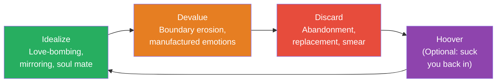
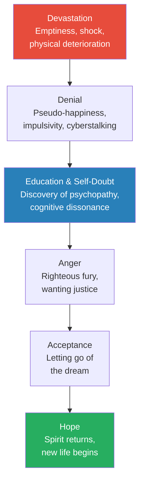
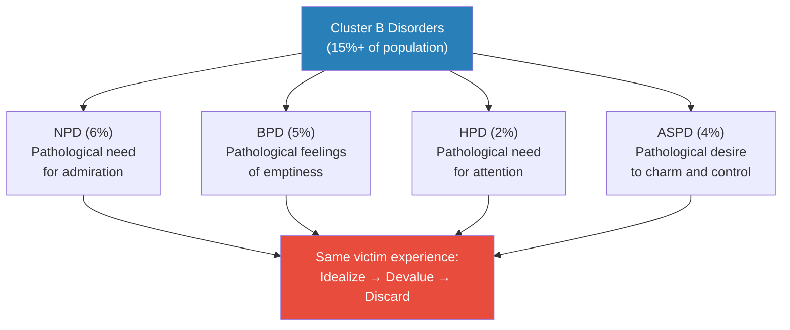
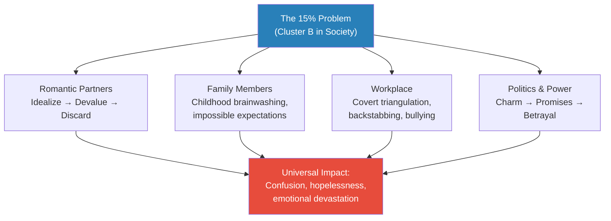

# Psychopath Free — Jackson MacKenzie

> Jackson MacKenzie was a twenty-one-year-old closeted gay virgin when a psychopath dismantled his entire sense of self. What he built from the wreckage — a tiny online recovery community that now reaches millions — became the foundation for this book. His argument is disarmingly simple: the most reliable diagnostic tool for identifying a psychopath is not a clinical checklist but your own feelings. If you went from confident and happy to anxious, jealous, and constantly apologising in someone's presence, that tells you everything you need to know. The label is secondary. *Psychopath Free* walks you from the moment you realise something is horribly wrong, through the agonising withdrawal of No Contact, and out the other side into a life defined not by what was done to you but by the strengths you always had.

---

## About the Author

Jackson MacKenzie is a survivor of psychopathic abuse who cofounded PsychopathFree.com, an online recovery community that now reaches millions of visitors monthly. He is not a clinician or academic — he writes from lived experience and the collective wisdom of over 30,000 survivors. The book grew from the community's shared patterns: every new member arrived with a "seemingly hopeless and all-too-familiar tale," and one year later, a transformed stranger stood in their place. MacKenzie followed *Psychopath Free* with *Whole Again* (2019), which explores the deeper emotional healing that comes after the initial recovery.

---

## The Big Idea

- MacKenzie uses "psychopath" as shorthand for all <b style="color: #2980b9">Cluster B personality disorders</b> — narcissistic, borderline, histrionic, and antisocial — because the relationship cycle they produce is identical: <b style="color: #e74c3c">Idealize, Devalue, Discard</b>
- The conventional wisdom says that if someone treats you badly, they must be hurting inside — MacKenzie rejects this for Cluster B individuals, who manipulate not from pain but from an inability to feel empathy
- Your greatest vulnerability is also your greatest strength: empathy, idealism, forgiveness, and loyalty are the qualities psychopaths target — but they are not weaknesses to be purged
- <b style="color: #27ae60">Recovery is not about becoming harder — it is about adding awareness and self-respect to the compassion you already possess</b>
- The book's unique contribution is its focus on the survivor's internal experience — half the red flags are about how YOU feel, not what THEY do
- Built from the patterns of 30,000+ survivors, the book identifies a universal cycle that applies to romantic partners, family members, coworkers, and friends

The Idealize-Devalue-Discard cycle is the universal pattern across all Cluster B relationships — and it repeats until the survivor breaks free through No Contact.

---

## Key Concepts at a Glance

| Concept | One-line summary |
|---------|-----------------|
| **The 30 Red Flags** | Behavioural and emotional warning signs — half about their actions, half about your feelings |
| **The Constant** | An emotional anchor — a person or being who never makes you feel unhinged |
| **Personalized Grooming** | The 6-point system psychopaths use to manufacture a "soul mate" |
| **Manufactured Emotions** | Your jealousy, neediness, and rage were deliberately provoked — they were not yours |
| **Identity Erosion** | Systematic destruction of your self-worth through the "mean and sweet" cycle |
| **The Serial Provoker** | Creates impossible situations, judges your reaction, plays "good cop" for forgiving you |
| **Indirect Persuasion** | Disguising expectations as compliments about exes — "My ex always did X; you never do" |
| **Cognitive Dissonance** | The war between what you saw (abuse) and what you were told (love) |
| **No Contact** | The only path to safety — absolute severing of all communication channels |
| **The 15% Problem** | Cluster B disorders affect over 1 in 7 people; the public knows almost nothing about them |
| **The Stages of Grief** | Devastation → Denial → Education → Anger → Acceptance → Hope |
| **30 Signs of Strength** | Reframing survivor qualities as extraordinary strengths, not exploitable weaknesses |

---

## Part One: Spotting Toxic People

### The 30 Red Flags

*MacKenzie's red flags are not just a list of what psychopaths do — they are a mirror for what happens inside you.*

- <b style="color: #2980b9">Gaslighting and crazy-making</b> — they blatantly deny their own manipulative behaviour and ignore evidence when confronted
  - Instead of addressing their inappropriate behaviour, it somehow becomes YOUR fault for being "sensitive" and "crazy"
  - They condition you to believe the problem is not the abuse itself but your reactions to their abuse
- Cannot put themselves in your shoes — you find yourself desperately trying to explain basic human empathy to a full-grown adult
- The ultimate hypocrite — "Do as I say, not as I do"
  - They have extremely high expectations for fidelity, respect, and adoration
  - After the idealization phase, they give none of this back to you
- <b style="color: #e74c3c">Pathological lying and excuses</b> — there is always an excuse for everything, even things that do not require excusing
  - They make up lies faster than you can question them
  - Even when caught, they express no remorse — sometimes it seems like they WANTED you to catch them
- Focuses on your mistakes and ignores their own — if they are two hours late, do not forget that you were once five minutes late
- You find yourself explaining the basic elements of human respect to a full-grown adult
- Selfishness and a crippling thirst for attention — you thought you were the only one who could make them happy, but now you feel that anyone with a pulse could fit the role

> [!tip] Core Insight
> The red flags are not just about their behaviour — they are about YOUR transformation. If you went from easygoing to constantly anxious, from confident to endlessly apologising, from trusting to playing detective — that is itself the evidence.

- <b style="color: #2980b9">Triangulation</b> — they surround themselves with former lovers, potential mates, and anyone who provides added attention
  - This creates the perception that they are in high demand at all times
  - People they previously denounced are suddenly back in the picture
- Provokes jealousy and rivalries while maintaining innocence — they do things that constantly make you doubt your place in their heart
- <b style="color: #2980b9">Love-bombing and flattery</b> — when you first meet, things move extremely fast
  - They mirror your hopes, dreams, and insecurities to form an immediate bond
  - Looking back, you will see how insane the whole thing was
- The "mean and sweet" cycle — sometimes they shower you with attention, sometimes they ignore you, sometimes they criticize you
  - You never know where you stand with them
- Covert abuse — you likely will not even understand that you were in an abusive relationship until long after it is over
- <b style="color: #2980b9">Accuses you of feeling emotions that THEY are intentionally provoking</b>
  - They call you jealous after blatantly flirting with an ex — often over social media for the entire world to see
  - They call you needy after intentionally ignoring you for days
  - They use your manufactured reactions to garner sympathy from other targets
  - You probably once considered yourself an exceptionally easygoing person — but the encounter with a psychopath will temporarily turn that upside down
- You find yourself playing detective — you have never done this in any other relationship, but suddenly you are investigating the person you once trusted unconditionally
- You are the only one who sees their true colours — they always seem to have a fan club cheering for them
  - The psychopath uses these people for money, resources, and attention
  - They strategically distract their admirers with shallow praise
  - They can maintain superficial friendships far longer than intimate relationships
- You fear that any fight could be your last — they make it clear that negative conversations will jeopardise the relationship
  - Any attempt to improve communication results in the silent treatment
  - You apologise and forgive quickly, otherwise they will lose interest
- <b style="color: #e74c3c">Slowly and steadily erodes your boundaries</b>
  - They criticise you with a condescending, joking attitude
  - They smirk when you try to express yourself
  - Teasing becomes the primary mode of communication
  - If you point this out, they call you sensitive and crazy
- They withhold attention and undermine your self-esteem — after showering you with nonstop attention, they suddenly seem completely bored
  - You begin to feel like a chore to them
- They expect you to read their mind — if they stop communicating for days, it is YOUR fault for not knowing about plans they never told you about
- You feel on edge around this person but still want them to like you — you are in constant competition with others for their attention
- An unusual number of "crazy" people in their past — make no mistake, they will speak about you the same way to their next target
- Pity plays and sympathy stories — their bad behaviour always has sob-story roots
  - They claim to behave this way because of an abusive ex, an abusive parent, or an abusive cat
  - They say they hate drama — and yet there is more drama surrounding them than anyone you have ever known
- <b style="color: #2980b9">This person becomes your entire life</b>
  - You spend more time with them and their friends, less time with your own support network
  - You isolate yourself to make sure you are available for them
  - You cancel plans and eagerly wait by the phone
  - The relationship involves many sacrifices on your end, but very few on theirs
- Arrogance — despite the humble, sweet image they presented early on, you start to notice unmistakable superiority
  - They talk down to you as if you are intellectually deficient
  - They have no shame flaunting new targets after the breakup
- <b style="color: #e74c3c">Backstabbing gossip that changes on a whim</b> — they plant little seeds of poison, whispering about everyone
  - They idealise people to their face and complain behind their backs
  - You may feel special for being the one they confide in — until the relationship sours, and they run back to everyone they once insulted, lamenting about how crazy YOU have become
- Your feelings — your natural love and compassion has transformed into overwhelming panic and anxiety
  - You apologise and cry more than you ever have in your life
  - You barely sleep, waking up every morning feeling anxious and unhinged
  - You tear apart your entire life searching for some sort of reason behind it all

> [!example] The "What Is Normal?" Test
> - If your "soul mate" went from fascinated to bored in the blink of an eye — this is not normal
> - If you were called jealous and crazy by someone who actively cheated on you — this is not normal
> - If you were desperately waiting by your phone for texts they once initiated on a minute-by-minute basis — this is not normal
> - If all of their exes were "bipolar" or "madly in love" with them — this is not normal
> **The lesson:** Once this individual is gone from your life, everything begins to make sense again. The chaos dissipates and your sanity returns.

---

### Beware the Vultures

*After psychopathic abuse, you are extremely raw and vulnerable — and secondary predators circle.*

- Vultures are people who seem exceptionally kind and warm at first — they want to "fix" you and absorb your problems
- They are fascinated by your struggles, but sooner or later you find yourself in another nightmare
- <b style="color: #e74c3c">They lash out as you become happier</b> — your progress threatens their control
- They want to keep you in a perpetual state of dependency
- MacKenzie's rule: "In the writing world, there's a universal rule called 'show — don't tell.' This rule also applies to people"
  - Decent, humble people do not constantly TELL you how nice, generous, or honest they are
  - They simply SHOW it through consistent love and kindness

---

### The Constant

*Your emotional anchor — a private reminder that you are not crazy.*

- Think of someone you love who consistently inspires and never disappoints — your mom, a close friend, your children, your cat, a deceased relative
- <b style="color: #27ae60">Ask yourself: Does your Constant make you feel unhinged? Anxious? Jealous? Do you spend hours analyzing their behaviour?</b>
  - Of course not
  - So why does one dismissive person make you doubt everything good in your life?
- The Constant is a private reminder that you are not crazy, even when it feels like you are taking on the entire world
- The most important question: "Shouldn't I feel this same kind of peace with everyone in my life?"
- Good people make you feel good. Bad people make you feel bad. Everything else falls into place from there.

---

## Part Two: The Manufactured Soul Mate

### Personalized Grooming

*The psychopath does not fall in love with you — they study you, mirror you, and create a chemical addiction.*

- There are three key components to the grooming process: <b style="color: #2980b9">idealization, indirect persuasion, and testing the waters</b>

**The 6-Point Idealization Playbook:**

1. **"We have so much in common"** — they mirror your entire personality, creating a "better" version of you
   - It is flat-out impossible and creepy for two people to be identical in every way
   - Normal people have differences — psychopaths do not have an identity, so they steal yours
2. **"We have the same hopes and dreams"** — they quickly discuss marriage, moving in, starting a business
   - These plans always involve sacrifice on YOUR end, never theirs
3. **"We share the same insecurities"** — they mirror your vulnerabilities to drive up sympathy
   - As an empathetic person, you are naturally drawn to comfort people who are hurting
4. **"You are beautiful"** — obsessive commentary on your appearance
   - By showering you with compliments, they know the adoration will rebound
   - You begin to place your self-esteem entirely in their words
5. **"I've never felt this way in my life"** — sweeping declarations that position you above all others
   - What you might not realise: they really HAVE "never felt this way" — psychopaths do not actually feel love
6. **"We are soul mates"** — implies higher powers at work, creates a psychic bond that outlasts the relationship

> [!tip] Core Insight
> If you believe in soul mates, you will find a real one. Love will blossom on its own, without all of the manufactured intensity. To be your soul mate, the psychopath would — of course — need to have a soul.

---

### Indirect Persuasion

*Disguising expectations as compliments about exes.*

- "My ex always used to do this, but you never do that" — this is NOT a compliment, it is a WARNING
  - "My ex and I always fought. We never fight" → You are now forbidden to fight
  - "My ex would always nag me about getting a job" → You cannot mention their unemployment
  - "My ex was so needy" → You cannot express needs
- <b style="color: #e74c3c">Any deviation from this plan triggers the silent treatment or a sharp comment — a reminder that the idealization could end at any time</b>
- This is why survivors feel so much anger afterwards — they spent the entire relationship shoving aside their own intuition and needs to avoid becoming "the crazy ex"

---

### Identity Erosion

*The psychopath strips you of your dignity by taking back everything they once pretended to feel.*

- Emotional abusers condition victims to feel ashamed, inadequate, and unstable
- <b style="color: #2980b9">Like sandpaper, they wear away at your self-esteem through the "mean and sweet" cycle</b>
  - Like a frog in boiling water, you will not realise what happened until it is too late
- You spend hours waiting by the phone, hoping for that morning text
- You invent romantic stories and exaggerate their positive aspects to anyone who will listen
- Their opinions about your appearance become critical — you may develop an eating disorder
- They humiliate you in front of friends — always under a guise of "humorous intention"
  - Others seem to take your partner's side and laugh
  - A psychopath does not care when they take a joke too far
  - You begin to play the role of a crazy, unintelligent partner whose only purpose is to entertain
- All the while, they sprinkle intermittent reminders of the idealization phase
  - If you reach a breaking point, they swoop back in with promises of unlimited love
  - They never take blame, but these superficial distractions convince you they are still the person you fell in love with

**The Serial Provoker:**
- Serial provokers are experts at seeking out flexible, easygoing people
- They exploit this quality by constantly provoking with covert jabs, minimisation, veiled humour, and patronising
- The target will attempt to avoid conflict by remaining pleasant and forgiving
- <b style="color: #e74c3c">But the serial provoker will continue to aggravate until the target finally snaps</b>
  - Once this occurs, the provoker sits back, feigns surprise, and marvels at how "volatile" the target is
  - The target immediately feels bad and absorbs the blame
  - The target is expected to remain calm no matter what, while the provoker feels entitled to do whatever they please

**Manufactured Neediness:**
- You did not consider yourself a needy person before you met the psychopath
- Who initiated constant conversation and attention in the first place? It was THEM
- Once bored, they lash out at you for trying to continue practices THEY started
- The case study format makes the distinction vivid:

> [!example] Manufactured Neediness — Case Study
> - **Case 1 (genuine neediness):** Girlfriend says she will be at dinner with her grandmother. Boyfriend says "You better text me the entire time." — This IS genuine neediness from the boyfriend.
> - **Case 2 (manufactured neediness):** Boyfriend texts girlfriend nonstop for months, calling and messaging every few minutes. Then suddenly stops. Girlfriend sends a text after 3 days of silence. Boyfriend replies: "Why are you so needy? We don't need to talk every single day." Girlfriend apologises profusely and promises to give him more space.
> **The lesson:** The psychopath CREATED the expectation of constant contact, then punished you for maintaining it. Your "neediness" was manufactured.

> [!example] Manufactured Jealousy — Case Study
> - **Boyfriend:** My ex is coming into town. The crazy abusive one who's still completely obsessed with me. We're probably going to meet up for drinks. She always hits on me when she drinks.
> - **Girlfriend:** I'm confused. Could we talk about this in person?
> - **Boyfriend:** You have a problem with it?
> - **Girlfriend:** Nope! No problem. I hope things go well!
> - **Boyfriend:** Wow, you're so jealous sometimes.
> - **Girlfriend:** I'm sorry. I'm not trying to be jealous.
> - **Boyfriend:** Your jealousy is ruining our relationship.
> - **Girlfriend:** I'm sorry! We don't have to talk about it.
> - **Boyfriend:** It's fine, I forgive you. We'll just have to work through your jealousy issues.
> **The lesson:** The psychopath (1) created an impossible situation, (2) accused her of jealousy despite her reasonable response, and (3) played "good cop" by offering to forgive a problem HE created.

---

### Testing the Waters

*Once the grooming is complete, the psychopath begins experimenting with their newfound control.*

- They test how far they can push you — a useful victim will not talk back or defend themselves
- If the idealization phase worked as planned, you should be more invested in maintaining the passion than standing up for yourself
- During this period, you will see tiny glimpses of their darker side:
  - They may teasingly call you a name in the bedroom to see how you react
  - They will begin making subtle digs about your intelligence, abilities, and dreams
- <b style="color: #e74c3c">These are all tests — and if you are reading this book, it means you passed them</b>
  - If you react negatively, they assure you they were "obviously joking"
  - You begin to feel more and more oversensitive
  - You stop mentioning your concerns to keep things "perfect"
- They use subtle digs in combination with flattery — ensuring addictive brain chemicals continue to fire even when you are upset
  - This trains your mind to ignore your intuition in favour of the high you feel with them
- If you look back at the early stages, you will remember small warning signs you tried to ignore:
  - Maybe they bragged too much about how much their ex still wants them
  - Perhaps they "forgot" to call when they promised
  - They probably stopped paying for dates, letting you pick up the tab
- What did you do? You brushed it all aside. You forgave quickly because you were determined to be "different"
- <b style="color: #27ae60">And that is when the grooming is complete</b>

---

### No Support

*The psychopath provides flattery but never genuine emotional support.*

- They provide shallow praise and flattery only to gain trust
- When you actually need emotional support — during tragedy or illness — they offer an empty response or completely ignore you
- This conditions you not to bother them with your feelings
- You will begin to notice that you are never allowed to express anything but positive praise for them
- Unable to empathise with pain and suffering, their "support" will always feel hollow and mechanical

---

### The "Crazy" Ex

*Every label the psychopath applies to their ex is a strategic tool — and soon it will be applied to you.*

- **"My ex is bipolar"** — a crippling illness weaponised as an insult
  - If you are naturally cheerful (= "mania") and then react to abuse (= "depression"), congratulations — you are "bipolar"
  - It takes 1-2 years for moods to fully restabilise after psychopathic abuse
- **"My ex is crazy and hysterical"** — implies their reactions were over-the-top
  - This characterisation INFORMS you about what is "acceptable" behaviour — you will be wary of acting this way too
- **"My ex is bitter"** — like punching someone in the face and calling them bitter
- **"My ex is jealous of us"** — bragging about this while manufacturing the exact conditions that produce jealousy
- <b style="color: #e74c3c">Bottom line: anyone who speaks regularly and negatively about their ex is — at best — not ready for a relationship, and at worst — manipulating your every thought</b>

---

## Part Three: The Path to Recovery

### Why Does It Take So Long?

*The aftermath of psychopathic abuse is not a normal breakup — it is withdrawal from a manufactured chemical addiction.*

- **You were addicted** — the idealization phase triggered brain chemicals that created genuine addiction
  - Love-bombing activates the same pleasure centres as cocaine
  - Withdrawal is physiological, not just emotional
- **You were brainwashed** — your identity was systematically eroded and replaced with the psychopath's version of reality
- **Your emotions were manufactured** — the jealousy, neediness, and rage you felt were deliberately engineered
- **Your spirit was wounded** — survivors describe a kind of emptiness beyond depression, as if their spirit has completely gone away
  - This is what takes the longest to recover from
  - But your spirit is always with you — wounded, never gone

---

### The Stages of Grief — Part I

Each stage has unique symptoms and its own specific dangers.

**Devastation:**
- The stage immediately following the breakup — all-consuming
- Your body deteriorates — before and after pictures of psychopathic abuse survivors are shocking
- You genuinely believe you deserve this — that you are jealous, crazy, needy
- <b style="color: #e74c3c">If you are considering suicide, put this book down and seek professional counselling immediately</b>

**Denial:**
- You see the psychopath running off with another partner and feel the need to prove you are fine too
- You change jobs, spend money, redefine your entire life
- You go out drinking, partying, and dating recklessly
- The "If Only" moments consume you:
  - "If only I hadn't confronted them about their ex"
  - "If only I'd bought them a nice gift"
  - "If only I'd pretended nothing was wrong during the silent treatment"
- <b style="color: #27ae60">If your entire relationship was hanging on a few "if only" moments going differently, it was a terrible relationship</b>

**Education & Self-Doubt:**
- Somehow you come across the topic of psychopathy — this is the missing puzzle piece
- <b style="color: #2980b9">Cognitive dissonance</b> tears you apart — oscillating between "they are a total monster" and "they were not the worst person in the world"
- As long as you are experiencing cognitive dissonance, they will be able to trick you again

---

### No Contact

*The only way to stay safe from their manipulation and abuse. There are no exceptions.*

- No Contact means ZERO contact:
  - No phone calls, text messages, emails
  - No Facebook friendship or messages
  - No cyberstalking
  - No seeing them in person
- Every bit of communication only serves to hurt you
- They are always interested in triangulating you — but this can be easily mistaken for genuine care
- <b style="color: #e74c3c">All it takes is one sweet word to send you right back to the idealization phase</b>
- When your thoughts start to race and you are itching to make contact, find distractions:
  - A new hobby, meditation, writing, work, a pet — anything to redirect your mind
  - The brain learns habits, so teach it healthier ones
  - When you notice your mind going back to the psychopath, take a deep breath and force yourself to think about other things
- The same goes for cyberstalking — even though you are not directly communicating, you are still indulging the addiction
  - The only way to break the addiction is to cut off every channel, cold turkey
  - Block them on Facebook, Twitter, and your cell phone — do it now
- You may think you will feel better if you stick around to see their next target get dumped — you will not
  - Nothing will change the pain you feel except time and personal growth
  - You will reach a period when you could not care less about what they are doing

### Why No Contact Is Non-Negotiable

- Any form of contact resets your recovery clock:
  - If they charm you, you are pulled back into the idealization phase
  - If they hurt you, you are pulled back into the identity erosion
  - If they ignore you, you are pulled back into the desperate pursuit
- There is no "neutral" contact with a psychopath — every interaction serves their agenda, not yours
- Even "closure" conversations are a trap — they will use your need for resolution to manipulate you one more time
- <b style="color: #27ae60">The only closure you will ever get comes from within — and it comes after sustained No Contact, not from one final conversation</b>

### Dealing with Necessary Contact

- If you have children or other lasting connections, engage in the minimal amount of contact possible
- Keep it factual, brief, and emotionless — treat it like a business transaction
- Do not share your healing process, your new relationships, or your emotional state with them
- Everything you share will be used as ammunition

> [!abstract] Closure Without Contact — HealingJourney's Framework
> 1. **Let go of the illusion** — the person you loved never existed; it was a mirror image of everything you wanted
> 2. **Search for answers safely** — investigate without making contact with the psychopath or anyone connected to them
> 3. **Research psychopathy** — by learning how their mind works, you realise the abuse was never your fault
> 4. **Allow yourself to feel and think** — step into the pain instead of running from it
> 5. **Accept what you can and cannot control** — you cannot stop them from hurting others; focus on your own healing
> 6. **Trust in your own unique truth** — you are your own best guide

---

### The Stages of Grief — Part II

*The discovery of psychopathy changes everything — suddenly you have words for what happened.*

**Anger:**
- This is the first truly empowering stage — you finally direct your frustration at the right person
- You stop blaming yourself and start seeing the manipulation for what it was
- The danger: anger can become addictive, keeping you focused on the psychopath rather than on healing

**Acceptance:**
- You accept that this person never loved you — not because you were unlovable, but because they cannot love
- You accept that nothing you could have done would have changed the outcome
- The dream of the "soul mate" finally dies

**Hope:**
- Your spirit starts to find its voice again — it peeks out sporadically to say hello
- You find yourself grateful to be crying again — happy that your emotions seem to be returning
- This newfound strength is the greatest gift of the psychopathic experience
- You may encounter toxic people throughout your life, but you will not let them stay long
- You do not have time for mind games and manipulation
- You seek out kind, honest, and compassionate individuals — you know you deserve nothing less
- <b style="color: #27ae60">This strength will serve you for the rest of your life</b>

---

### Why Your Spirit Was Wounded

*MacKenzie explains what makes this different from an ordinary breakup.*

- After the inevitable abandonment, most survivors feel an emptiness that cannot even be described as depression
  - It is like your spirit has completely gone away
  - You feel numb to everything and everyone around you
  - The things that once made you happy now leave you cold
- You worry that the encounter has destroyed your ability to empathise, feel, and care
- This takes the longest time to recover from — but your spirit is always with you
  - Wounded, for sure, but never gone
  - As you discover self-respect and boundaries, it slowly starts to find its voice again
  - It feels safe opening up, peeking out sporadically to say hello
- You will find yourself grateful to be crying again — happy that your emotions seem to be returning
- Ultimately, you will leave this experience with an unexpected wisdom about the people around you

---

### Your Mind Was Brainwashed

*Understanding validation and why it matters.*

- You were told things by the psychopath that directly contradicted your experience
  - You were told it was love when it felt like abuse
  - You were told you were crazy when you were seeing clearly
  - You were told the problem was you when it was always them
- When you come together with others who have experienced the same thing, you discover you are not crazy — you are not alone
- It takes a great deal of time to come to terms with this personality disorder
- You end up having to let go of your past understanding of human nature, building it back up from scratch
- <b style="color: #e74c3c">You realise that people are not always inherently good</b>
- The healing process is about learning to balance this new awareness with your once-trusting spirit

---

### The Chemical Addiction

*The reason No Contact feels like going cold turkey — because it literally is.*

- The idealization phase triggered genuine chemical addiction in your brain
  - The excessive flattery and attention activated pleasure centres
  - Your brain adapted to this constant stream of stimulation
- When the psychopath withdrew attention (devaluation), you went through physical withdrawal
  - The desperate texting, the obsessive checking of their social media — these are addiction behaviours
  - You were not "pathetic" — you were in physiological withdrawal
- The "mean and sweet" cycle maintained the addiction through intermittent reinforcement
  - This is the same mechanism that makes gambling addictive — unpredictable rewards are more addictive than consistent ones
  - Every time they gave you a crumb of the old idealization, your brain lit up
- <b style="color: #27ae60">No Contact is the only way to break the chemical cycle — like going cold turkey from any other addiction</b>

---

### Self-Respect and Boundaries

*Recovery is not about changing who you are — it is about valuing who you always were.*

> [!abstract] The Self-Respect Pledge
> 1. I will never beg or plead for someone else — if they walk away from me, I will let them go
> 2. I will never tolerate infidelity — it is the ultimate form of disrespect
> 3. I will stop making excuses for other people's bad behaviour
> 4. I will not be spoken to in a condescending or sarcastic way
> 5. I will not allow my partner to call me jealous, crazy, or any other dismissive accusation
> 6. My relationships will be mutual and equal at all times — love is not about control and power
> 7. If I ever feel unsure, I will seek help from a friend, support forum, or therapist

- After the relationship, you probably felt yourself "cheerleading" a lot — handing out compliments as a way to receive them back
- With time, your compliments become more personal and sincere
- You develop strong friendships with people you truly care about, instead of throwing yourself at every survivor you meet

---

### The 30 Signs of Strength

*What psychopaths targeted in you were not weaknesses — they were extraordinary qualities.*

- **Actions over words** — healthy people prove their goodness through behaviour, not declarations
- **Strong moral compass** — survivors have always paid strong attention to rules and ethics
- **Take responsibility** — instead of blaming others, they take full responsibility for their actions
- **Gentle and compassionate** — always willing to compromise and make things better
- **Idealistic, romantic, and imaginative** — often creators — artists, writers, musicians
- **Optimism** — they want to see the best in everyone; their optimism is contagious
- **Forgiving** — they do not judge and do not hold grudges
- **Flexible and easygoing** — can adapt to any situation, especially for someone they care about
- **Justice-driven** — truth seekers who cannot relax until they understand every experience that shapes them
- **Hidden strength** — surprising contrast between apparent submissiveness and actual resilience
- **Good listening skills** — they spend hours listening to others without relating everything back to themselves
- **Able to enjoy time alone** — they appreciate consistency and reliability, not constant external stimulation
- **Polite to complete strangers** — the "waiter test" applies; you can gauge character by how people treat those who can do nothing for them
- **Connected with nature** — enjoy time outside; uplifted by sunshine, awestruck by thunderstorms
- **Lifelong quest for harmony, peace, and love** — every survivor is on their own path to freedom; this is the most magical of all human qualities

> [!tip] Core Insight
> The psychopath tried to trick you into believing there is something wrong with your compassion, your idealism, your loyalty. They tried to turn your beautiful strengths into unattractive flaws. But they did not destroy those qualities — you still have them. And now that you recognise their value, you can go back to being your true, authentic self.

- MacKenzie reframes the 30 Signs of Strength as a guide for recognising empathetic people — the kind of people you WANT in your life
  - You want someone who seeks peace and harmony instead of drama
  - You want someone who is kind, compassionate, and loyal
  - You want someone who listens to you, values you, and sees the best in you
  - There are many other dreamers out there, just like you — and once you find them, you will never look back

---

### Cognitive Dissonance — The Internal War

*The psychological state that keeps survivors trapped long after they should have left.*

- <b style="color: #2980b9">Cognitive dissonance</b> is a state where your intuition is telling you two competing things simultaneously
  - You constantly heard sweeping declarations of love — but never actually FELT them
  - You fondly remember the dreams you shared — but obviously those things did not happen
- During the relationship, you probably spent a lot of time with their WORDS — cherishing, idolising, analysing, and ultimately distrusting them
- Despite your intuition telling you something was wrong, you desperately wanted to believe in the manufactured soul mate
- The cycle of cognitive dissonance looks like this:
  - First: they are a total monster who cheated and lied throughout the relationship
  - Then: they are not the worst person in the world; they were just insensitive
  - Then: some of those things they said were really cruel
  - Then: everyone deserves a second chance; it would be pleasant to remain friends
  - Then: you remember the "I love you" and the beautiful memories
- <b style="color: #e74c3c">As long as cognitive dissonance persists, they can trick you again — all it takes is one sweet word</b>

**The Two Masks:**
- Psychopaths display "delayed arrogance" — when you first meet, they seem unusually innocent, humble, childlike
- As time passes, they transform into a manipulative, arrogant, neglectful monster
- Targets go through great lengths to reconcile this monster with the childish sweetheart they remember
- This is why victims are often accused of "being attracted to jerks" — but it does not take two to tango when one person uses a completely manufactured identity

---

### Un-Brainwashing — SearchingForSunshine's Guide

*A practical framework for breaking the cognitive dissonance cycle.*

- In the early days of No Contact, you discover psychopathy — you experience rapid "aha" moments
- But then: "What if they aren't? Maybe it's me..."
- You read the material again — more "aha" moments — "Yes, it's them!"
- Then you fall back into self-doubt: "Is it me? Am I absolutely sure it's not me?"
- <b style="color: #27ae60">The solution: each time cognitive dissonance strikes, go back to the material describing psychopathic behaviours</b>
  - The truth resonates in your gut even when your confused mind cannot override it
  - The percentage of truth in your mind is in direct proportion to the psychopathic brainwashing you push out
  - As truth grows larger, the lies grow smaller
- Stay away from triggers in the early days — places, music, and people that remind you of the relationship
- Eventually, the truth filters up from your gut to replace all the lies the psychopath planted
- "There is inner peace, at last."

---

### Closure Without Contact — HealingJourney's Path

*You CAN find closure — but it will NOT come from the psychopath. It must come from within.*

> [!example] The Ugly Duckling Reframe — HealingJourney
> - "He felt quite glad of all the misery and tribulation he had gone through, for he was the better able to appreciate his good fortune now" — Hans Christian Andersen
> - HealingJourney writes: "This horrible trauma has given me the opportunity to transform into a beautiful swan"
> - "That beauty is inside every survivor — a beauty we have possessed all along and never knew we had"
> - **You were not stupid; you were innocent** — you cannot protect yourself from something you never knew existed
> - **Your weaknesses AND strengths were exploited** — the ability to love, trust, cooperate, and be kind are strengths, not weaknesses
> - **Facing the pain sets you free** — you cannot circle around the pain; you must travel through it
> **The lesson:** The ugly duckling found his way home, and you will too.

---

### Practical Self-Care During Recovery

*MacKenzie provides specific guidance for treating your body well while your mind recovers.*

- Practice meditation — even ten deep breaths at a time, anytime, anywhere
- Take a multivitamin with B complex — B6 and B12 help combat depression
- Fish oil — good for skin, hair, and has antidepressant qualities
- Exercise daily — even rolling around on exercise balls counts
- Eat three meals per day, even when not hungry — you cannot starve your body
- Wake up at a reasonable hour — do not get stuck rolling out of bed in the afternoon
- Get 7-9 hours of sleep — rest is essential to mental health
- Go outside and get some sun — absorb natural light and vitamin D
- Maintain basic hygiene — do not skip brushing teeth or showering
- Get away from the mirror — the psychopath conditioned you to be self-conscious; no one is judging you like they did
- <b style="color: #e74c3c">Stop drinking</b> — in the early months, this might seem like the easiest way to cope, but alcohol delays healing
  - Spend a few months completely dry
  - Your mind is the most valuable tool in recovery — treasure it

---

### Making Big Decisions During Recovery

*During the denial phase, avoid life-changing decisions.*

- You will invest your happiness in many different things, unable to realise that happiness must come from within
- There is nothing wrong with your job, your salary, your home, your phone, your profile picture, or your single status
- <b style="color: #27ae60">For now, you should NOT trust your gut instincts</b> — everything is out of balance; your intuition is skewed by the abuse
- If you are suspicious of toxic friends, simply distance yourself — it does not need to be personal
- Your old friends will not understand what you have been through — they will simply suggest that you "move on"
- If, in one year, you still want that new job or want to send a nasty letter to a longtime friend, then go ahead
- Your future self might be very grateful for your present self's patience

---

### The MorningAfter Testimony — Slowly but Surely

*One of the most touching recovery milestones documented on the forum.*

> [!example] Slowly but Surely — MorningAfter
> - "I used to get into a panic if my phone didn't ring on weekends. Now I get into panic if it does."
> - "I used to wear uncomfortable shoes with high heels to go to work. Today I went to the office wearing flats and I felt good."
> - "I used to wear makeup always, every day. Now it is not necessary."
> - "I appreciate people smiling more than before. I feel more connected with people now."
> - "Sometimes it appears to be lonely here where I am, but that conclusion is based upon my old type of thinking. I am not lonely, I just cleared out the miserable and mean people from my life, and I have space left for new good people."
> **The lesson:** Recovery is not a dramatic transformation — it is a gradual rediscovery of all the things that once brought you peace, one quiet milestone at a time.

---

### Gratitude and Forgiveness

*MacKenzie's nightly practice for cultivating gratitude.*

- Before going to sleep each night, think of someone you are grateful for — your mom, a close friend
- Imagine their face, their smile, their genuine goodness
- Repeat this for another trusted spirit, and another, and another
- MacKenzie has never reached "the end" before falling asleep — there is no end to all the good people in this world
- Forgiveness of the psychopath is a personal choice — some survivors find it essential; others find it an insult to their soul
- <b style="color: #27ae60">True forgiveness comes from within — not from another person validating your compassion</b>
- Do NOT mistake forgiveness for contact — just because you forgive the psychopath does not mean they should ever have a place in your life again

---

## Part Four: Freedom

### Spirituality and the Inner Spirit

*MacKenzie describes a transformative encounter with his own protective inner being through imagination therapy.*

- After years of recovery, MacKenzie noticed a constant aching in his chest — a "demon" that would not leave
- Through imagination therapy, he discovered this "demon" was actually a young boy — his own spirit — who had been "hugging his heart" to keep him safe
- The spirit had been with him since birth — it was his energy, creativity, living spirit
- During the abusive relationship, it was the spirit who kept pointing out the lies and manipulation, even when MacKenzie tried to ignore them
- <b style="color: #27ae60">During the darkest moment — when MacKenzie considered leaving this world — the spirit gave him a reason to stay</b>

---

### The Conversation with the Inner Spirit — Full Account

*MacKenzie's transformative imagination therapy session.*

- He was instructed to welcome the dark feeling instead of wishing it away — and then introduce himself
- He expected a nasty response from his ex telling him he deserved to suffer
- Instead, a young boy gently responded: "I'm here to make sure you're okay"
- The boy had been "hugging his heart" to keep him safe — he never meant for it to harm him
- The spirit had been with MacKenzie since the day he was born — his energy, creativity, living spirit
- During the abusive relationship, the spirit had refused to watch MacKenzie submit
  - He was the one who kept pointing out the lies, hypocrisy, and manipulation
  - He did not care if MacKenzie was called crazy or hypersensitive
  - He wanted MacKenzie far away from the black hole
- MacKenzie asked the spirit to loosen his grip — the spirit agreed to try, but said it would take time
- Since that night, MacKenzie has had conversations with his spirit every single day
  - "He is my friend, and he has been with me since the very beginning — expecting nothing in return"
- <b style="color: #27ae60">This inner being — the very core of our true selves — cannot be destroyed, no matter how hard someone might try</b>
- "Love is where the pitiful psychopathic games come to an end, and our journey only just begins"

---

### Finding Love Again

- Love and intimacy after recovery are better than ever before
- You were conditioned to feel addicted to desperation and intense passion — something you once mistook for love
- <b style="color: #27ae60">Real love is gentle, patient, and consistent</b> — you do not doubt your partner's intentions
- There is something truly amazing about meeting the right person and finally realising, "They are never going to harm me"

---

### The 15% Problem

*Cluster B personality disorders are far more prevalent than the public realises.*

- According to available statistics:
  - Narcissistic Personality Disorder: 6% of the population
  - Borderline Personality Disorder: 5%
  - Histrionic Personality Disorder: 2%
  - Antisocial Personality Disorder: 4%
- <b style="color: #e74c3c">That is more than 1 in 7 people — over 15% of the population</b>
- Most are highly functional, nonincarcerated, active members of society
- All four disorders share one thing in common: unhealthy, inappropriate, shallow, or completely nonexistent human emotions
- For their victims, the experience is universal: idealization and devaluation

All four disorders funnel into the same devastating experience for victims — the label matters less than the pattern.

---

### The Four Disorders — What Differs, What Stays the Same

**Narcissistic Personality Disorder (NPD):**
- Driven by a pathological need for admiration
- The idealization serves to secure a constant source of positive energy
- Because they are jealous and arrogant, there is no room for YOUR happiness
- When you fail to meet their shifting standards, you are devalued until you have nothing left

**Borderline Personality Disorder (BPD):**
- Driven by pathological feelings of emptiness
- The idealization temporarily fills the void
- Because they are angry and impulsive, the relationship becomes chaotic
- The identical devaluation follows — worthless, broken, confused

**Histrionic Personality Disorder (HPD):**
- Driven by a pathological need for attention
- The idealization secures a captive audience
- Because they are provocative and exaggerated, your needs are invisible
- Same devaluation, same confusion, same devastation

**Antisocial Personality Disorder (ASPD):**
- Driven by a pathological desire to charm and control
- The idealization is about power and manipulation
- Because they are remorseless and deceitful, nothing they said was true
- Same result for the victim — every single time

> [!tip] Core Insight
> MacKenzie repeats the same victim-experience paragraph for each disorder deliberately — to drive home the point that from YOUR side of the relationship, the diagnosis is irrelevant. The experience is always identical: "The stark contrast between the idealization and devaluation leaves you feeling worthless, broken, and confused."

---

### The Scale of the Problem

- Seven billion people in the world
- One in seven has a Cluster B disorder
- That is approximately one billion people worldwide who are hardwired to idealize, exploit, and devalue others
- These one billion people are serial daters, chronic job hoppers, nonincarcerated criminals, and ruthless power seekers
- They are in constant search of new victims, jumping from one source to the next
- <b style="color: #e74c3c">The minority of the population is causing a hugely disproportionate number of problems</b>

---

- The general public knows virtually nothing about these disorders
- MacKenzie's four-step solution:
  1. **Education** — getting the word out; most psychopaths are not serial killers
  2. **Validation** — helping victims through the darkness; showing them they are not alone
  3. **Healing** — shifting focus from abuser to abused; finding self-respect
  4. **Freedom** — once you can identify toxic people, nothing can be gained from interacting with them

---

### The Fool & the World

*MacKenzie's personal story — and the metaphor for every survivor's journey.*

- He was a twenty-one-year-old closeted gay virgin who had never been seen as attractive
- His insecurities were a small part of who he was — mostly he liked to run around, be hyper, make friends, and build cat houses
- After the psychopathic relationship, his insecurities took over and became his entire identity
- He tossed his whole personality away and tried to be someone new — spent his savings, moved into a fancy apartment, tried being a "tough guy"
- <b style="color: #27ae60">The strangest thing: most of his recovery was spent working his way BACK to the person he used to be, with a few small tweaks</b>
- The Tarot metaphor: The Fool ends his journey right where he started — the same person, just with wisdom picked up along the way

> [!example] MacKenzie's Journey
> - Point A: compassionate, trusting, slightly insecure 21-year-old
> - The long path: devastation, denial, education, anger, acceptance, trying to be someone new, failing at being someone new
> - Point B: compassionate, trusting, self-aware person — almost identical to Point A
> - The shortcut between A and B was always there — but you cannot see it until you have walked the long path
> **The lesson:** You do not need to become a different person. You just need to understand the person you already are.

---

## A Bigger Picture

*The battle between psychopaths and dreamers is not confined to personal relationships — it plays out across all of human society.*

- In your family: a parent who used you as a tool, punished you with silence, brainwashed you from childhood
- In the workplace: a manipulative coworker who charmed their way in, then triangulated the entire office against you
- In politics: leaders who charm their way into power with rosy promises, then accomplish the polar opposite
- <b style="color: #e74c3c">This is not political theatre. This is the Cluster B disorders in action.</b>
- MacKenzie's optimism: "There is a battle on the horizon. Not the kind with guns and bombs — but a battle of the human conscience."

---

## Verdict

- **Greatest contribution:** The radical reframe that your feelings are your most reliable diagnostic tool — not clinical criteria, not the abuser's explanations, not other people's perceptions. If you feel crazy around someone who once made you feel perfect, that IS the evidence. This simple insight has freed millions of survivors from the paralysis of trying to "prove" they were abused.

- **Weaknesses:** MacKenzie's use of "psychopath" as a blanket term for all Cluster B disorders is clinically imprecise — it collapses important distinctions between NPD, BPD, HPD, and ASPD. His estimate that 15%+ of the population has Cluster B disorders is on the high end of clinical estimates, though his broader point about prevalence stands. The book is also lighter on the deeper emotional healing that comes after initial recovery — MacKenzie addressed this gap with his follow-up, [[Whole Again - Jackson MacKenzie]].

- **Who benefits most:** Anyone who has recently left (or is still in) an emotionally abusive relationship and needs urgent validation that they are not crazy. Survivors who have never heard the terms "love-bombing," "gaslighting," or "triangulation" will find this book life-changing. It is an essential first read in the Awareness & Protection category — the entry point before deeper works like [[In Sheep's Clothing - George K. Simon]] or [[The Gaslight Effect - Robin Stern]].

- **How it compares:** Where Simon provides a clinical taxonomy of manipulation tactics, MacKenzie provides the emotional roadmap of what it FEELS like to be on the receiving end. Where Bancroft ([[Why Does He Do That - Lundy Bancroft]]) focuses on male abusers in heterosexual relationships, MacKenzie's framework is gender-neutral and applies to all relationship types. The community-sourced approach — validated by a survey of over 1,000 survivors — gives the book a statistical grounding that purely anecdotal recovery guides lack.

---

## Authenticity — The Recovery Process as Rebirth

*The recovery process is the beginning of your new life.*

- You will look back at old dynamics, wondering how you ever tolerated such toxicity
- You might feel embarrassed about your past behaviour — this regret is your self-respect kicking in
- After the relationship, you probably felt yourself "cheerleading" a lot — handing out compliments as a way to receive them back
  - With time, your compliments become more personal and sincere
  - You develop strong friendships with people you truly care about
- The world is a big place — it is far better to have a few good friends than a million acquaintances with whom you exchange shallow formalities
- As you become your most genuine self, the people around you will transform as well
  - Enjoy this, and credit yourself for the hard work

### Discovering the Beauty We've Always Had

*HealingJourney's meditation on Hans Christian Andersen's Ugly Duckling.*

- "I never dreamt of so much happiness when I was the Ugly Duckling!"
- HealingJourney writes that the fairy tale always made her inexplicably sad — she never explored why
- After going through such a dark time, she knows: she saw herself as the ugly duckling for so long, she never imagined she could transform into a beautiful swan
- Five truths for survivors:
  1. **You were not stupid; you were innocent** — you cannot protect yourself from something you never knew existed
  2. **It is okay to have insecurities and vulnerabilities** — they are part of being human; even the most confident people doubt themselves
  3. **Your weaknesses AND strengths were exploited** — love, trust, cooperation, kindness are strengths, not targets
  4. **Facing the pain sets you free** — you cannot circle around it; you must travel through it
  5. **The beauty within you has ALWAYS been there** — the psychopath's attempt to destroy your identity only gave you the opportunity to connect more deeply with your spirit

---

### The Psychopath Test — What It Reveals

- MacKenzie provides a 13-question relationship assessment in the Appendix
- Questions cover: does this person keep promises, understand your feelings, behave hypocritically, lie, withdraw affection
- Also covers: your feelings in the relationship, fear of losing them, trust, drama levels, boredom, the ex, relationship beginnings, treatment
- Each question has four possible responses scored 1-4
- Score ranges:
  - **13-20:** You know a genuinely good person — empathetic, warm, caring
  - **21-30:** Not a psychopath — normal ups and downs
  - **31-41:** You might know a psychopath — some red flags; you deserve better
  - **42-52:** You definitely know a psychopath — constant edge, manufactured emotions, lost sense of self
- The test is not a clinical instrument but a validation tool — a way for survivors to confirm what their gut already knows

> [!tip] Core Insight
> The test's genius is not diagnostic precision — it is permission. Many survivors need someone to say "Yes, what you experienced was real." The test provides that permission through structured self-reflection rather than external judgment.

---

## Appendix: The Psychopath Test & Survey Validation

### The 13-Question Test
- MacKenzie provides a relationship assessment with questions covering: promise-keeping, empathy, hypocrisy, lying, withdrawal of affection, your feelings, fear of loss, trust, drama, boredom tolerance, the ex, relationship beginnings, and how they treat you
- Scoring ranges from 13-20 (genuinely good person) to 42-52 (you definitely know a psychopath)
- The test is designed not as a clinical instrument but as a validation tool — a way for survivors to confirm what their gut already knows

### The Survivor Survey
- Over 1,000 survivors rated each of the 30 Red Flags on a scale of 1-5
- **All 30 red flags had a majority response of "Strongly Agree"**
- Overall distribution: Strongly Agree 59%, Agree 22%, Neutral 11%, Disagree 5%, Strongly Disagree 3%
- Most commonly extracted phrases from free responses:
  - "Eroded my boundaries"
  - "Chameleon could fit into any situation"
  - "Abuse was subtle and covert"
  - "Seemed amused at my worst"
  - "My life becomes complete chaos and confusion"
  - "No closure, sudden end"
  - "Word salad arguments made no sense"
  - "They became my entire life and I was isolated"
- This survey data validates that the red flags are not one person's experience but a universal pattern across thousands of survivors worldwide

---

## Families, the Workplace, and Society

*The psychopathic cycle extends far beyond romantic relationships.*

### In the Family
- A narcissistic parent who abused you since childhood, using you as a tool for their needs
  - Impossible expectations combined with intermittent praise
  - You walked on eggshells, your foundation completely unstable
  - It takes years of therapy to overcome such persistent brainwashing

### In the Workplace
- A manipulative coworker who charmed their way in, then backstabbed you
  - Whispering poison into everyone's ears; covert triangulation turning the entire office against you
  - If you spoke up, you sounded crazy — because you were insulting everyone's favourite employee
- The psychopath as boss:
  - Charismatic qualities allow them to rise quickly
  - They abuse you because they know you cannot do anything about it
  - They spend the company's money irresponsibly and take down anyone who stands in their way
- <b style="color: #e74c3c">The idea that psychopaths can be "useful" in the workplace is dismissed by anyone who has actually worked with one</b>

### In Politics and Society
- Politicians charm their way into power with charisma and rosy promises
  - Then use their position to accomplish the polar opposite
  - This behaviour has become so commonplace that political promises are material for comedians
- Psychopaths are pathologically attracted to power, money, and crime
- They make up an unusually high percentage of the prison population — but the vast majority are nonincarcerated
- MacKenzie asks: "At 1 in 7 people, exactly how much damage has the 15 percent caused?"

The 15% problem extends across every domain of human life — the cycle of idealisation and devaluation is the same whether the setting is a marriage, a family, an office, or a government.

---

## What Happens Next?

*The psychopathic encounter eventually settles into a quiet place in your heart — and then it becomes something good.*

- Somewhere down the road, the encounter will not enter your mind anymore
- You will look back on it as a strange time that almost seems unreal in retrospect
- Instead of being intense and overwhelming, it settles into a safe place and quietly becomes something good
- Some survivors want to move on and never hear about personality disorders again
- Some choose to stick around and help other survivors
- And some transform their personal encounter into a broader understanding of how empathy and conscience impact our world
- <b style="color: #27ae60">MacKenzie's final message: "There is so much beauty and magic in this world worth fighting for. What happens next is up to us."</b>

---

## The Constant: Revisited

*MacKenzie's closing meditation — full circle from the concept that anchored the book.*

- Sitting with three cats and a hot cup of coffee, MacKenzie reflects on his journey
- Sometimes his cats are his Constant. Sometimes his mom. Sometimes the members of PsychopathFree.com.
- "It would seem that everyone in my life has become a Constant."
- And then the final realisation: "I am my own Constant"
- He loves his quiet time alone, loves existing in this mysterious world, loves being part of something bigger than himself
- "Above all, I love that adversity has introduced me to some of the most incredible human beings this world has to offer"
- "Our adventure is only just beginning — and now that our hearts have healed, it's time to make some trouble."
- The book ends where it began — with the concept of the Constant
- But where the Constant once needed to be external (a person, a memory, a cat), it has become internal
- <b style="color: #27ae60">You are your own Constant — and that is the destination of the entire journey</b>
- The psychopath tried to convince you that your identity was whatever they said it was
- Recovery proved them wrong — your identity was always there, waiting for you to come home to it
- The three cats, the hot cup of coffee, the morning walk in the snow — these are the textures of a life that belongs entirely to you
- And that is something no psychopath can ever take away
- As MacKenzie writes: "Empathetic people — dreamers and idealists — have this sort of accidental power"
- Their journey is inevitably derailed by darkness, but ultimately it sets them on a quest for something more — for love, justice, and wisdom
- "And when dreamers unite? Well, that's how we start to change the world."
