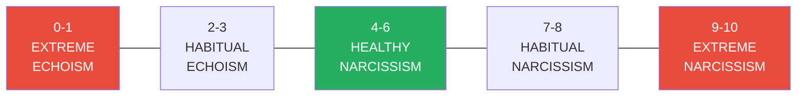
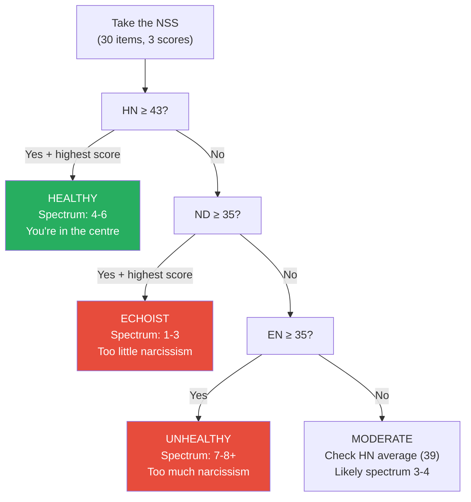
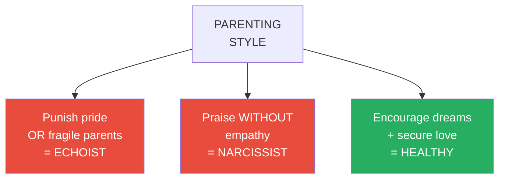
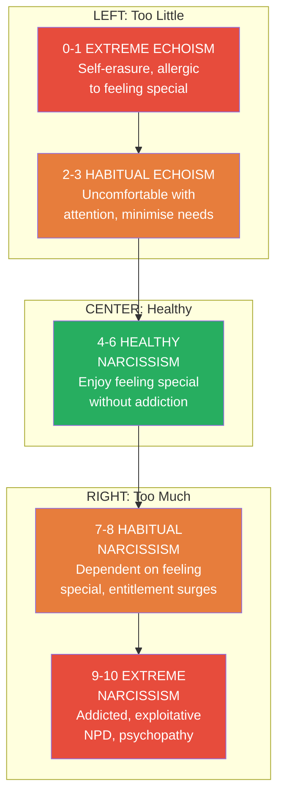
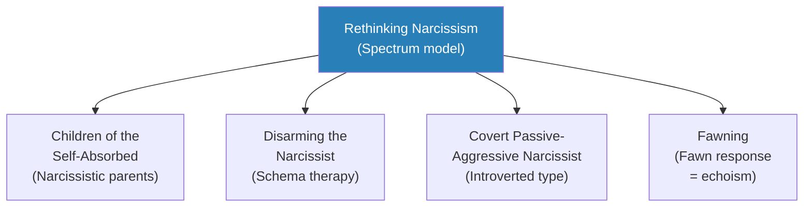

# Rethinking Narcissism — Craig Malkin

> Craig Malkin grew up watching his mother — warm, funny, outgoing, and devoted — slowly transform as she aged into someone who bragged about past accomplishments, name-dropped, obsessed over her looks, and interrupted people mid-sentence about their pain to reminisce about her own romantic success. What had happened? College gave him the word "narcissism." But it took decades of research and clinical practice before he understood what it truly meant — and discovered that almost everything the public believes about narcissism is incomplete or wrong. Narcissism is not a disease. It is not a character flaw. It is a universal human drive to feel special that exists on a spectrum from 0 to 10. In moderation (the centre of the spectrum), it fuels creativity, leadership, love, and resilience. At the extremes — both too much AND too little — it destroys relationships, health, and happiness. The concept of the "echoist," the person at the far left of the spectrum who has been so thoroughly suppressed by narcissistic environments that they cannot acknowledge their own needs at all, is as clinically important as the concept of the narcissist — and it is the half of the story that our culture has entirely missed.
> This is not another book about how to spot and flee narcissists. It is a book about understanding the full range of human self-regard — from self-erasure to self-obsession — and learning to live in the healthy centre.

---

## About the Author

- Craig Malkin is a clinical psychologist and instructor at Harvard Medical School
- His interest in narcissism began with his own mother, whose narcissism waxed dramatically as she aged and her looks — the source of much of her confidence — faded
- He interned with one of the foremost experts on narcissism and took a postdoctoral fellowship focused on personality-disordered clients
- With colleagues Stuart Quirk and Shannon Martin, he developed the Narcissism Spectrum Scale (NSS) — the first assessment tool designed to measure both too much and too little narcissism
- He is a firm believer that growth is possible for everyone, whether they harbour too little narcissism or too much
- His mother passed away during the writing of the book; by then, his new understanding had allowed him to say goodbye with love

---

## The Big Idea

- <b style="color: #e74c3c">Almost everything we believe about narcissism is wrong — or at best, dangerously incomplete</b>
- The popular understanding treats narcissism as purely destructive — a character flaw, a personality disorder, an epidemic among millennials
- This view is wrong in three critical ways:
  - It ignores the fact that <b style="color: #27ae60">moderate narcissism is healthy and even vital</b> — it fuels confidence, creativity, leadership, resilience, and the capacity to love
  - It ignores the other end of the spectrum — <b style="color: #2980b9">echoism</b>, the equally damaging condition of having too little narcissism
  - It assumes narcissism is fixed — "once a narcissist, always a narcissist" — when research shows that narcissists CAN change under the right conditions
- <b style="color: #2980b9">Narcissism is a spectrum from 0 to 10</b>:
  - **0-1:** Extreme echoism — allergic to feeling special in any way; self-erasure
  - **2-3:** Habitual echoism — uncomfortable with attention, minimise own needs
  - **4-6:** Healthy narcissism — enjoy feeling special without addiction; flexible, adaptive
  - **7-8:** Habitual narcissism — dependent on feeling special; subtle narcissists
  - **9-10:** Extreme narcissism — addicted to feeling special; NPD at 9, psychopathy at 10
- The spectrum is not fixed — narcissism waxes and wanes with circumstances, age, and life events
- The key to understanding narcissism is that it is a habit people use to comfort themselves — feeling special as a substitute for feeling loved and securely attached

Danger lies at both extremes of the narcissism spectrum — too little is as harmful as too much. Only the centre, where the drive to feel special is present but not compulsive, is healthy.

---

## Key Concepts at a Glance

| Concept | One-line summary |
|---------|-----------------|
| **Narcissism spectrum** | A 0-10 scale measuring the drive to feel special — healthy in the middle, dangerous at extremes |
| **Echoism** | The condition of having too little narcissism — inability to acknowledge one's own needs |
| **Healthy narcissism** | The ability to enjoy feeling special without becoming addicted to it |
| **Extroverted narcissist** | Loud, flashy, attention-seeking — the classic image of narcissism |
| **Introverted narcissist** | Shy, hypersensitive, seething with unrecognised brilliance — easily mistaken for echoists |
| **Communal narcissist** | Sees themselves as the most caring, giving, empathic person — narcissism through sainthood |
| **Narcissism Spectrum Scale** | Malkin's assessment tool measuring narcissism deficits, healthy narcissism, and extreme narcissism |
| **Insecure love** | The childhood experience that pushes children to either end of the spectrum |
| **Entitlement surge** | The hallmark of subtle narcissism — sudden demand that the world revolve around them |
| **Exploitation** | Doing anything necessary to feel special, including hurting others — the move from habit to addiction |
| **Emotion phobia** | Narcissists' deep avoidance of vulnerability — the first warning sign |
| **Emotional hot potato** | Coercing others into feeling the emotions the narcissist refuses to acknowledge |
| **Empathy prompts** | The technique for testing and encouraging change — voice relationship importance + reveal vulnerability |
| **Connection contract** | Clear boundaries for managing narcissists who cannot change |
| **Need-panic** | Echoists' chaotic response when their suppressed needs surge to the surface |

---

## Part I: What Is Narcissism?

### Old Assumptions, New Ideas

*Malkin demolishes the popular view of narcissism as purely destructive and introduces the radical idea that some narcissism is not just normal but essential.*

- The "better than average effect":
  - In study after study, the vast majority of people report having more admirable qualities and fewer repugnant ones than their peers
  - University of Washington psychologist Jonathan Brown: "Instead of viewing themselves as average and common, most people think of themselves as exceptional and unique"
  - This is not evidence of a global epidemic — a slightly outsized ego has real benefits
- <b style="color: #27ae60">The benefits of healthy narcissism</b>:
  - People who see themselves as better than average are happier, more sociable, and often more physically healthy
  - Bosnian War survivors who felt special were in better psychological shape than those with realistic self-views
  - 9/11 survivors with healthy narcissism faced the future with less fear and greater hope
  - The "sadder but wiser effect": people without healthy narcissism have more accurate views but sacrifice happiness for that realism
- The forgotten half — Echo:
  - In the myth of Narcissus, we always focus on Narcissus and forget Echo — the nymph who had no voice of her own
  - People with too little narcissism become self-abnegating, nearly invisible
  - They suffer higher rates of depression and anxiety
  - <b style="color: #e74c3c">Danger lurks at BOTH ends of the spectrum</b>

> [!tip] Core Insight
> "It's ironic — the reverse of what we've been taught. It's not bad, but good to feel a little better than our fellow human beings, to feel special. In fact, we may need to. Where the trouble lies depends entirely on the degree to which we feel special."

---

### How Narcissism Became a Dirty Word

*The intellectual history that turned narcissism from a developmental necessity into a cultural bogeyman.*

- Freud's dual view (1914):
  - Primary narcissism in infancy is healthy and crucial
  - But adult narcissism? Freud couldn't decide if it was good or bad
  - This ambiguity set the stage for the great debate
- <b style="color: #2980b9">Kohut vs. Kernberg</b> — the defining battle:
  - **Heinz Kohut** (born 1913, Vienna before Hitler): Founded Self Psychology — we NEED narcissism throughout life; children need "mirroring" from parents; even grandiosity is valuable for creativity; narcissism only becomes dangerous when we cling to it
  - **Otto Kernberg** (born 1928, Vienna under Nazism): Agreed on healthy narcissism but saw unhealthy narcissism as inherently dangerous; narcissists are "masses of seething resentment"; empathy toward them is naive; they must be confronted
  - After Kohut died of cancer in 1981, Kernberg's dark view dominated
  - Christopher Lasch's "The Culture of Narcissism" (1979) spread the terrifying image to the public
  - Narcissism became synonymous with malignant narcissism
- The "narcissism epidemic" myth:
  - Jean Twenge (2009) claimed millennials' NPI scores had risen dramatically
  - But the NPI is deeply flawed — agreeing with "I am assertive" counts as narcissistic
  - Numerous large-scale studies found little difference between millennials and previous generations
  - <b style="color: #e74c3c">No study has ever followed NPI "narcissists" to see if they remain narcissistic as adults</b>

---

### The Spectrum — From 0 to 10

*Malkin introduces the full spectrum through vivid clinical portraits at each point.*

> [!example] Sandy — Life at 2 (Echoist)
> - Sandy, 28, worked as an administrative assistant; her boss planned a surprise party for her outstanding work
> - She got it cancelled: "I can't stand compliments. They make my skin crawl"
> - Her boyfriend Joe was exhausted: "You never let me DO anything for you!"
> - She couldn't accept help, birthday dinners, or special attention of any kind
> - Yet she had no trouble lending friends unlimited support
> **The lesson:** Echoists at 2 aren't unfamiliar with feeling special — they're afraid of it. Their vigilance against selfishness comes at a steep price: one-sided relationships and chronic depletion.

> [!example] Gary — Life at 9 (Extreme Narcissist)
> - Gary, 24, a business student, arrived ten minutes late without apology
> - "They have to keep me in school. I might be the best thing that's happened to them"
> - He was convinced his talent would save him despite near-failing grades and two prior firings from jobs
> - His mother was in tears; his dean was exhausted — Gary was oblivious to both
> - "I can talk my parents into anything. I can talk pretty much anyone into anything"
> **The lesson:** At 9, the addiction to feeling special blinds people to reality. Gary honestly believed the university needed him more than he needed it.

> [!example] Lisa — Life at 5 (Healthy Narcissism)
> - Lisa, 41, was executive director of a nonprofit, loved making speeches and being on camera
> - When her husband Doug said she'd been too self-involved, she responded immediately: "I told him I'd been selfish and would make it up to him"
> - She had enough self-awareness to notice when grandiosity was getting the better of her
> - She never used her dreams to make people feel beneath her
> - In the waiting room, she made a normally silent stranger smile and open up
> **The lesson:** People at the centre of the spectrum bring out the best in everyone. They know when their grandiosity is getting the better of them, and they course-correct.

---

### The Narcissism Test (NSS)

*Malkin's own assessment tool — the first to measure both too little and too much narcissism.*

- Three subscales:
  - **Narcissism Deficits (ND):** Echoism markers — average 28, high 35+
  - **Healthy Narcissism (HN):** Centre markers — average 39, high 43+
  - **Extreme Narcissism (EN):** Right markers — average 27, high 35+
- Key defining statements:
  - ND: "I'm not sure what I want or need in relationships" / "When people ask me my preferences, I'm often at a loss"
  - HN: "I like to dream big but not at the expense of my relationships" / "I can rein myself in when people tell me I'm getting a big head"
  - EN: "I secretly believe I'm better than most people" / "I'll never be satisfied until I get all that I deserve"
- <b style="color: #27ae60">People high in HN see not just themselves but their PARTNERS as special</b> — they view their partners as smarter, more talented, more beautiful than they objectively are
- This "feeling special by association" is the most powerful predictor of relationship success according to research by Le and Dove (reviewing 100+ studies involving nearly 40,000 people)
- Rare pattern: high on BOTH ND and EN = introverted narcissism — self-doubt combined with entitlement
- What each factor predicts:
  - High ND: low self-esteem, subjugation to partner's wishes, feeling undeserving, difficulty giving/receiving emotional support, pessimism, anxiety and depression
  - High HN: calm, optimistic, high self-esteem, strong at giving/receiving support, sense of purpose, self-discipline, enjoying emotional intimacy, feeling deserving but not overentitled
  - High EN: fluctuating self-esteem, difficulty with emotional support, entitlement, manipulation, argumentativeness, unemotional (except anger), workplace conflicts
- Important design note: narcissists tend to paint themselves in the best light on all self-report measures
  - This means they score high on BOTH HN and EN
  - A good rule of thumb: if EN is 35+, you are at least 7-8 on the spectrum regardless of other scores
  - The EN scale was designed with this inflation effect in mind

---

### Understanding Your Score — A Decision Tree

The NSS decision tree helps locate your position on the spectrum based on your three subscale scores — with the caveat that self-report can be misleading for high-spectrum narcissists.

---

### Malkin's Mother — The Personal Story That Drives the Book

*Malkin's mother is the thread running through the entire book — from its opening to its emotional close.*

- The mother of Malkin's childhood:
  - "The incandescent figure of my childhood, irrepressibly outgoing, infectiously funny, and wonderfully caring"
  - A striking six-foot-tall blonde with a thick English accent from her upbringing in Great Britain
  - She made connections everywhere — the grocery store, the coffee shop, the hair salon
  - She was devoted to friends, active in her community, generous with love and counsel
  - She made others feel special: a despairing shop owner she talked into keeping his doors open, beaming at him until "his face went from crestfallen to triumphant"
- The mother who emerged as she aged:
  - She bragged about accomplishments, name-dropped, obsessed over wrinkles
  - She interrupted people sharing their pain to talk about herself
  - When Malkin tried to tell her about a breakup, she muttered: "I never had any trouble finding dates"
  - After her husband died and she was moved to a small apartment, she spent exorbitant sums on "decorations" and appeared in four-inch Manolo Blahniks: "There. At least my shoes are better than this place"
- <b style="color: #27ae60">The insight that changed everything</b>:
  - Malkin realised his mother used feeling special as a crutch — to prop herself up when scared, sad, or lonely
  - Instead of turning to people, she relied on feeling better than them
  - When she was younger, others provided the special feeling with their attention and compliments
  - As she aged and her looks faded, she had to manufacture it herself
  - "Thinking of narcissism this way — as a habit people use to comfort themselves — showed me a much clearer, simpler path to coping with my mother"
- The ending:
  - "Years after I started researching this book, my mother passed away. My brother and I were at her side"
  - "By that time, I had come to see her narcissism in a different, more nuanced light"
  - "Without that new perspective, I'm certain I wouldn't have been able to say goodbye to her with love in my heart"

---

### Demographics of Narcissism — Who, When, and Where

*Narcissism varies by age, gender, profession, and culture — understanding these patterns helps calibrate expectations.*

- **Age:** Under 25 are the most narcissistic; narcissism declines sharply with age
  - Adolescent narcissism is normal — it helps the young survive the turmoil of identity formation
  - Moderate teenage narcissists are less anxious and depressed than their low and high peers
  - By the thirties, most people come back to earth
- **Gender:**
  - Mildly unhealthy range (7-8): slightly more men than women
  - Extreme right (9-10): men double the number of women
  - This is partly attributable to gender roles — assertiveness is encouraged in men, punished in women
  - Introverted and communal narcissism: equal gender split
- **Profession:**
  - US presidents are more narcissistic than average citizens — even the quiet ones
  - Politicians rank higher than any other profession (librarians the lowest — "flirting with echoism")
  - Reality TV stars are the most narcissistic performers; musicians the least
  - MBA students score high but still below celebrities
- **Culture:**
  - Individualist cultures (US, UK) produce extroverted narcissists
  - Collectivist cultures (Japan, many Asian nations) produce communal narcissists who pride themselves on being the most patient, loyal, and polite

---

### Narcissistic Personality Disorder — The Clinical Extreme

*Malkin distinguishes between narcissism as a spectrum and NPD as a clinical disorder.*

- NPD is rare — estimated 1-3% of the US population
- It is the point where narcissism becomes a full-blown addiction:
  - People with NPD need to be treated as special in EVERY area of life
  - They are entitled, exploitative, and unempathic
  - They can be arrogant or shy, but they vacillate between feeling special and feeling worthless
  - "People are simply mirrors, useful only insofar as they reflect back the special view of themselves they so desperately long to see"
- NPD requires professional help to shift at all — and if they refuse help, there's little chance of change
- <b style="color: #e74c3c">Think of NPD exactly as you would any full-blown addiction</b> — recovery is possible but demands the person acknowledge the problem
- Beyond NPD — psychopathy (level 10):
  - The most coldly unemotional narcissists may also be psychopaths
  - Not all narcissists are psychopaths, but all psychopaths are narcissists
  - At 10, people no longer matter; ordinary feelings and rules no longer apply
  - "Coming back from this level of narcissistic addiction is nearly impossible"

---

### The Sibling Effect — Carol and Jay

> [!example] Carol and Jay — Same Home, Opposite Extremes
> - Jay, burly and blond, was admitted to a residential centre after threatening to kill himself on his landlord's doorstep over a rent dispute
> - He was obstreperous and demanding, barking orders at staff — "the most infuriating narcissist I've ever met," said the nurse
> - Carol, his sibling, was petite with timid eyes, on disability after a suicide attempt
> - She followed every rule, never asked for anything, barely spoke
> - They were raised by the same narcissistic father who raged whenever his nightly routine was disturbed
> - Carol, naturally timid, learned to tiptoe around her dad — echoism
> - Jay, naturally rambunctious, learned the only way to be noticed was to shout and dominate — narcissism
> - Both displayed unhealthy levels, but opposite coping mechanisms
> **The lesson:** Nature (temperament) determines which direction a child goes on the spectrum; nurture (insecure love) determines how far they go. The same toxic home can produce an echoist AND a narcissist.

---

## Part II: Origins — How Echoists and Narcissists Are Made

### Root Causes — Insecure Love

*The single most important factor: insecure love. Nature sets predispositions; nurture determines final position.*

- How echoists are made:
  - Parents who punish pride or dreams: "Never get a big head — it's a sure path to trouble"
  - Parents who are chronically emotionally fragile — anxious, angry, depressed — teaching children that the only way to earn love is to make as little impact as possible
  - Parents who need their children to praise, flatter, or comfort THEM (parentification) — the child learns to echo the parent's needs, burying their own completely
  - Siblings who attack success — the "special child" becomes a pariah, learns that achievement invites cruelty, and resorts to self-sabotage ("fear of success")
  - Highly narcissistic parents who leave children afraid that asking for anything — care, love, empathy — might make mom or dad crumble or explode
  - <b style="color: #e74c3c">Any environment that punishes children for striving to be more will push them toward echoism</b>
  - The key emotion: shame — not shame about WHO you are, but shame about WANTING anything at all
  - This is why echoism maps so directly to the fawn response in trauma literature — both involve the suppression of self to maintain safety in relationship

> [!example] Jean — "Never Get a Big Head" (Echoist at 3)
> - Jean, 62, came to therapy after her youngest left for college
> - Her Irish Catholic father warned: "Never get a big head — it's a sure path to trouble"
> - Her shy mother would get quietly sad whenever Jean talked about her dreams of dancing
> - Jean stopped dreaming altogether; the thought of wanting more filled her with shame
> - Her husband had multiple affairs; she "got past it" and focused on the kids
> - Now the kids were gone and she was the only one left to focus on — "I honestly don't know what to do with myself"
> **The lesson:** "We all need dreams. They lift us up when life becomes hard. They remind us of our potential when we fail." Jean's were killed before they could take root.

- How narcissists are made:
  - NOT by excessive praise alone — the self-esteem-movement theory is incomplete
  - The key: parents who provide praise WITHOUT empathy
  - The child learns: "No one can be trusted with my feelings. The only way to feel good is to feel special"
  - <b style="color: #e74c3c">Praise was the ONLY gift the parents gave</b>

> [!example] Chad — Praise Without Empathy (Narcissist at 7-8)
> - Chad, 27, was certain he'd become a great lawyer despite being fired twice for angry outbursts
> - His father: "Son, you're sure to do amazing things. You've got an incredible mind"
> - But when Chad was upset? "My dad says, 'Great men don't complain. They act.'"
> - He never learned that people could be trusted with his feelings
> - He felt deep shame over ordinary human frailties and turned to feeling special as a substitute
> **The lesson:** Chad's narcissism was not caused by too much praise. It was caused by praise REPLACING empathy. He was inflated but never held.

- How narcissists are made (continued):
  - Introverted or extroverted narcissism depends on temperament meeting parenting
  - Extroverts with narcissism-breeding parents: fight for their freedom by turning up the volume — charming but deaf to others
  - Introverts with narcissism-breeding parents: withdraw into secret superiority — "I'm better than all of you, I just don't show it"
  - Culture determines TYPE: individualist cultures (US, UK) produce extroverted narcissists; collectivist cultures (Japan) produce communal narcissists
- The recipe for healthy narcissism:
  - A family that encourages dreams AND provides secure love — neither alone is sufficient
  - Parents who model emotional expression and repair — making mistakes, owning them, reconnecting
  - Parents who make the child feel they matter regardless of success or failure
  - Parents who can tolerate their child's emotions — sadness, anger, fear — without crumbling or retaliating
  - The result: children who know they can fail and still be loved, who can need things and still be accepted
  - "Secure love provides protection against many of the world's psychological dangers"
  - This is the critical formula: DREAMS (the drive to feel special) + SECURE LOVE (the knowledge that you matter regardless) = HEALTHY NARCISSISM

The parenting style determines where children land on the spectrum: punishment of pride breeds echoism, praise without empathy breeds narcissism, and encouragement combined with secure love breeds health.

---

### Gina — The Portrait of Healthy Narcissism

> [!example] Gina — What Secure Love Produces
> - Gina, 23, an art student, came for career counselling after her parents encouraged her to seek guidance
> - "I want a job I'm really going to love. I'd like it to involve lots of people, a brainstorming environment. I'm not sure how to make all this happen, but I'm here to figure that out"
> - She rattled off the story of her life "with the flourish of an accomplished storyteller"
> - Her parents loved her "little schemes" — as a child, she had jars of pebbles everywhere for science experiments
> - She told them she'd be the next Madame Curie; her father said, "Great, we could use one!"
> - "I always knew that if I fell down, my mother would be there to pick me up. I could tell her anything"
> - At 17, she entered an art competition expecting to win but got third place
> - "I know I'm talented. I know I have something important to say — it's just a matter of getting it across. That's what my parents taught me"
> - When her mother forgot a promised talk after a breakup, Gina was hurt — but what stayed was seeing her mother cry during her apology
> - "It didn't feel like an excuse. If anything I felt better seeing that even my mother could let me down sometimes and it wasn't the end of the world"
> **The lesson:** Gina learned to feel special without needing to prove it. Her parents taught her to accept disappointment without letting it destroy her faith in love. She knew they'd be there for her — flaws and all. That is the recipe for healthy narcissism.

---

### Bill — When Echoism Destroys Careers

> [!example] Bill — The Artist Forced Into Accounting (Echoist at 2)
> - Bill, 30, came to therapy for chronic depression — he hated his job as an accountant
> - He loved art; his mother did not: "I don't know why you spend so much time doodling!"
> - When he showed artistic promise, she forced him to take math lessons: "You need something practical, unless you want to end up like your father"
> - His father, a freelance artist, had left the family when Bill was two
> - Bill learned: an artistic career wasn't just silly but DESTRUCTIVE — he'd lost his father to it and stood to lose his mother too if he pursued it
> - At his mother's urging, he became an accountant
> - "People like Bill often feel guilty for having any needs at all. They HATE their needs, viewing them as a potentially devastating force"
> **The lesson:** When success means rejection by our loved ones, any dream of greatness feels dangerous. Bill didn't lack talent — he lacked permission to use it.

---

### Terrel — The Introverted Narcissist at 9

> [!example] Terrel — Invisible Demands
> - Terrel, 55, left most of his friends feeling exhausted
> - He didn't demand accolades; he insisted people pay unwavering attention whenever he spoke
> - If his wife sighed or looked away during a story, he exploded: "I listened to YOUR drama! Why can't you let me finish?"
> - He complained bitterly that no one understood him: "I'm just different from other people — I see the world for what it is"
> - His father had trampled over his stories: "Adult speaking." His mother praised him for being "a sensitive child" but fell into strange silences
> - He never learned that he could get the same high from being cared about — because he'd never experienced it
> - "He didn't trust anyone to be there for him, so he demanded support and recognition... as if he didn't exist at all unless he was the focus of everyone's attention"
> **The lesson:** Introverted narcissists at 9 don't brag or boast — they demand perfect attunement. Their entitlement is quieter but no less absolute. They leave you feeling not like a lowly creature but like an extension of their body — you exist solely to support their self-esteem.

---

### The Move From Dependence to Addiction — Roger's Story

> [!example] Roger — When Entitlement Becomes Exploitation
> - Roger, 48, recently divorced, had violated the restraining order his wife Susan obtained
> - He forced her to accept a "letter of explanation" at her office
> - In therapy (court-ordered), his first question: "You think this'll help my custody case?"
> - When the therapist took notes: "You gonna pay attention or scribble in your little pad?"
> - Roger had borrowed from the family retirement fund to invest without telling his wife — despite her explicit warning that lying about money would end the marriage
> - His wife's pain: "She said I broke her heart, that she could have recovered from an affair more easily"
> - Roger's response: "I deserved the shot, and I took it. No one can take that away from me"
> - He had daily panic attacks but refused to connect them to his behaviour
> - "I'm not her father, for Christ's sake," he spat when confronted with his wife's trauma around money
> **The lesson:** Exploitation is the hallmark of the move from habit to addiction. Roger didn't just feel entitled — he felt entitled to override his wife's most painful boundary, because his need to prove himself special outweighed any consideration of her feelings.

---

### Subtle Echoism and Narcissism — The Habit Range

*The narcissists and echoists you are most likely to encounter are not at the extremes — they are in the "habit" range, where their patterns are intermittent and easy to miss.*

- <b style="color: #2980b9">Subtle echoists</b> (life at 3):
  - They're the "listeners" — focused on others, never asking for anything
  - They can maintain relationships as long as their own needs stay low
  - The crisis comes when their needs surge — "need-panic"
  - Need-panic: they either withdraw completely or become chaotically clingy
  - "Their guilt and turmoil over their sudden demands can be palpable"
- <b style="color: #2980b9">Subtle narcissists</b> (life at 7-8):
  - Not arrogant or obviously selfish — they are bad listeners, preoccupied with their ranking
  - Charming and warm — until the drive to feel special takes over
  - "When you're speaking to them, you get the feeling they're simply waiting for you to stop talking"
- <b style="color: #e74c3c">The entitlement surge</b>:
  - The hallmark of subtle narcissism — when a normally understanding person suddenly demands the world revolve around them
  - Triggered by threats to their special status
  - After the crisis passes, many slide back — but frequent surges indicate the move from habit to addiction
- <b style="color: #e74c3c">When entitlement becomes exploitation</b>:
  - The move from habit (7-8) to addiction (9):
  - Exploitation: doing anything necessary to feel special, including hurting others
  - Roger stole from the family retirement fund: "It's my money. I can burn it if I want to"
  - When empathy vanishes and ethics crumble, you are at 9 — NPD territory
  - At 10, psychopathy: "People no longer matter. Ordinary human feelings and rules no longer apply"

---

## Part III: Recognizing and Coping

### The Five Warning Signs

*The behavioural patterns that reveal narcissism before the damage becomes severe.*

- <b style="color: #2980b9">1. Emotion phobia</b>: Dodging vulnerability — anger as cover, condescension, topic-changing
- <b style="color: #2980b9">2. Emotional hot potato</b>: Coercing you into feeling their emotions — "I don't want this feeling. Here, you take it"
- <b style="color: #2980b9">3. Stealth control</b>: Arranging events without asking — buying tickets, cancelling plans, dictating routines
- <b style="color: #2980b9">4. Placing people on pedestals</b>: Idol worship — "If someone this special wants me, I must be special too"
- <b style="color: #2980b9">5. Twin fantasy</b>: Insisting on being identical — eliminating all differences to avoid disappointment

- How the warning signs interact:
  - Narcissists rarely display just one sign — they typically deploy multiple strategies simultaneously
  - Emotion phobia provides the motivation (avoid vulnerability)
  - Hot potato gets rid of uncomfortable feelings
  - Stealth control maintains the narcissist's preferred reality
  - Pedestals and twinning create an illusion of perfect, risk-free love
  - When the illusion cracks, all five signs intensify as the narcissist scrambles to restore their sense of being special
- What makes these signs different from normal human behaviour:
  - Everyone occasionally avoids emotions, projects feelings, or tries to control situations
  - The difference: narcissists use these strategies ALL THE TIME
  - Even subtle narcissists will employ them whenever their special status feels threatened
  - The frequency and combination of these behaviours is the tell — not any single instance
  - "They're 'tells,' hinting at trouble long before more damaging behaviour comes along"

> [!example] Mark and Mia — All Five Warning Signs
> - **Pedestal:** Mia called Mark "Mr. Right" within two weeks
> - **Twin fantasy:** Insisted they liked all the same bands — Mark secretly disagreed but held back
> - **Stealth control:** She bought concert tickets unilaterally, arrived hours late, dismissed objections
> - **Emotion phobia:** Changed the subject whenever Mark tried to discuss his fears about school
> - **Hot potato:** Grilled him about "aiming too high" with school applications — transferring her own career insecurity
> - Result: Mark went from feeling like he walked on water to "a needy mess"
> **The lesson:** "The burning question is not how to help Mark feel less insecure but how to help Mia feel less insecure — she pushes him down so she can feel bigger."

---

### Change and Recovery — Empathy Prompts

*Research-backed techniques for testing and facilitating change in narcissists.*

- The breakthrough research:
  - "Metamorphosis of Narcissus" study: narcissists shown subliminal nurturing images felt more committed
  - Narcissists who felt "loved and cared about" became more committed than those told they were competent
  - When instructed to imagine an abuse survivor's perspective, narcissists showed genuine empathy — heart rate increased
  - <b style="color: #27ae60">Encouraging narcissists to feel caring and compassionate REDUCES their narcissism</b>

> [!abstract] Empathy Prompt Technique
> Two components: **voice the importance of the relationship** + **reveal your own vulnerable feelings**
>
> - To a partner: "You mean the world to me. When you show up hours late, I feel sad, like I'm not important to you"
> - To a friend: "You're my best friend. When you call me selfish, I feel ashamed, like I'm a bad person in your eyes"
> - To a parent: "Mom, you're one of the most important people in my life. So when you question my every move, I feel devastated, like I'm a failure"
>
> **Success signs:** Affirming, clarifying, apologising, validating
> **Failure signs:** Feeling attacked, becoming defensive, hijacking, blaming

- Connection contracts — when change isn't possible:
  - For narcissists who can't or won't change
  - Clearly state what behaviour ends the conversation
  - "I'm not comfortable with yelling. If I hear it, I'll leave"
  - Management, not closeness — your presence is as much as you should promise

---

### Escaping Self-Blame and the Excitement Trap

*Two powerful barriers to leaving narcissistic relationships.*

- Self-blame:
  - "If I'm the problem, then the happiness of the relationship is in MY hands — there's still hope"
  - Self-blame preserves hope at the expense of self-esteem
  - The antidote: reconnect with healthy disappointment
  - "You have a right to your disappointment"
- The excitement trap:
  - Partners of narcissists find "nice" people boring after the intensity
  - Romantic uncertainty turns us on — fear, anger, jealousy enhance attraction through arousal
  - The solution: create your OWN excitement — be direct about needs, own desires, experiment with novelty
  - "The allure of bad boys and girls lies partly in the room they provide us to be dirty while still believing we're pure"
  - You were not attracted to the narcissism — you were attracted to the permission

---

### The Science of Change — Research in Detail

*Malkin reviews the most important studies showing that narcissists can become more caring and committed.*

- **Study 1: The Metamorphosis of Narcissus (Finkel, Campbell, Buffardi)**
  - 76 undergraduates in relationships of 1.5 years average, measured for narcissism
  - Half shown subliminal images of nurturing scenes (teacher helping student, woman holding baby, man helping elderly woman)
  - Half shown neutral images (car, tree, soccer player)
  - Narcissists shown nurturing images tapped "me" on words like "committed, devoted, faithful, loving, loyal" — nearly matching non-narcissists
  - Narcissists shown neutral images gave the usual "not me" response
  - <b style="color: #27ae60">Simple nurturing images caused narcissists to feel more loving and committed</b>

- **Study 2: Long-term couples (same team)**
  - 78 couples married an average of six years
  - Narcissists whose spouse was adept at drawing out loving qualities became MORE committed over four months
  - The change exceeded that of non-narcissists
  - Key finding: it's not ego-stroking that works — it's making the narcissist feel "loved and cared about"

- **Study 3: New couples (same team)**
  - 115 couples recently living together, engaged, or newly married
  - Discussed important life goals for six minutes each
  - Narcissists who felt "loved and cared about" during the discussion felt more committed
  - Those whose partner only made them feel "capable and competent" showed no change
  - <b style="color: #e74c3c">Stroking their ego is NOT the way to reach narcissists — loving them is</b>

- **Study 4: Empathy induction (Hepper, Hart, Sedikides)**
  - Narcissists watched a video of a domestic abuse survivor
  - Half were told to "imagine what she's going through; try to take her perspective"
  - The prompted narcissists showed genuine empathy — their heart rate increased (unfakeable)
  - The unprompted narcissists showed no elevation
  - Narcissists are not incapable of empathy — they just don't access it spontaneously

- **Study 5: Communal priming**
  - Narcissists who read passages filled with "we," "our," and "us" pronouns became more willing to help strangers
  - They also became LESS obsessed with becoming famous
  - "The mere reference to relationships reawakens the part of a narcissist's brain devoted to caring and consideration"

---

### Anna and Neil — When Empathy Prompts Fail

> [!example] Anna's Journey — From Hope to Clarity
> - Anna, 32, had been dating Neil for two years — "infuriatingly self-centred"
> - She'd tried empathy prompts beautifully: "I really loved him, but I felt utterly worthless when he raised his voice"
> - Neil's response: "Anna, I think we're just different people. You're just more fragile than I am. I don't blame you for it. It's just how things are."
> - Despite gentle approaches, Neil could not acknowledge any insecurity — he deflected, minimised, and reframed her pain as her problem
> - Anna's barrier to leaving: self-blame — "What if I haven't been kind enough? I can lose my temper"
> - The therapeutic breakthrough: "Maybe the only way you can feel any hope now is by blaming yourself. If Neil CAN'T change despite your efforts, then it truly is over."
> - After leaving Neil, Anna fell into the excitement trap — new boyfriend Tod was sweet but lacked the intensity
> - The solution: creating her own excitement — sending sexy texts, initiating more, reclaiming the desires she'd outsourced to Neil
> **The lesson:** Empathy prompts don't just test capacity for change — they provide clarity. If you've repeatedly tried and seen no softening, consider their response a sign that they can't or won't leave their addiction behind.

---

### The Echoist's Journey — A Mirror of the Narcissist's

*Echoism is not simply "being a nice person" — it is a specific, painful condition that requires its own healing path.*

- The echoist's core fear: becoming narcissistic in any way
  - They are constantly on guard for selfishness or arrogance in themselves
  - They can't enjoy being doted upon — compliments make their skin crawl
  - They don't feel inferior (unlike people with low self-esteem) — they feel that having needs is dangerous
  - "The most common feature of echoists is a deep dread of becoming narcissistic"
- Why echoists and narcissists pair up:
  - Echoists are drawn to narcissists because they'd rather focus on someone else
  - Narcissists are drawn to echoists because echoists confirm that being the only voice in the relationship is how love works
  - The pairing is toxic for both: the echoist disappears, the narcissist's addiction strengthens
- The echoist's healing path:
  - Learn to recognise and name your own needs — they exist even if you've buried them
  - Practice tolerating the discomfort of asking for something
  - Let people see you struggle — vulnerability is not weakness
  - Allow yourself to feel disappointed when needs aren't met — disappointment is information, not selfishness
  - "Being clear about when your relationship leaves you feeling neglected, alone, unworthy, or small puts you back in touch with your own needs"
- <b style="color: #27ae60">The echoist's greatest challenge</b>: accepting that having needs is not the same as being a narcissist
  - There is an enormous space between self-erasure and self-obsession
  - Healthy narcissism lives in that space
  - Moving toward the centre does not mean becoming the thing you fear

---

### Workplace Narcissism — Six Strategies

*Three self-protective, three nudging.*

- **Self-protective:**
  1. Document everything — records of exchanges, ideas, insults with dates and witnesses
  2. Remain task-focused — "Can you help me understand how this brings us closer to a solution?"
  3. Block the pass — "You seem more anxious about the project today. What's got you on edge?"

- **Nudging:**
  4. Catch good behaviour — "I appreciate your asking me! When you do that, I feel like a more valuable team member"
  5. Contrast good and bad — "Last week when we checked in, I felt great. Today we didn't and it sapped my energy"
  6. Become assertive (ABC) — A = Affect ("I feel"), B = Behaviour ("When you"), C = Correction ("Can you")

- Critical language principle: use "we," "our," and "us" — communal language activates caring circuits
- Simply reading passages filled with "we" pronouns made narcissists more generous and LESS obsessed with fame

---

### Social Media and Narcissism (SoWe)

*Malkin addresses the widespread fear that social media is creating a generation of narcissists.*

- The assumption: social media breeds narcissism by rewarding self-promotion
  - Selfies, likes, followers — all seem to feed the drive to feel special
  - Many commentators blame Facebook, Instagram, and Twitter for the alleged narcissism epidemic
- Malkin's counter:
  - Social media is a tool — it amplifies whatever tendencies are already present
  - People in the healthy centre use social media for connection, sharing, and mutual support
  - People on the right use it for attention-seeking, boasting, and image management
  - People on the left may avoid it entirely or use it passively — never posting, only watching
  - The research is mixed: some studies show social media increases narcissism; others show no effect; some show it increases empathy
- <b style="color: #27ae60">SoWe — the healthy approach</b>:
  - "Social" + "We" = SoWe — using social media to strengthen relationships rather than inflate the self
  - Share genuinely (not just curated highlight reels)
  - Engage with others' posts (not just broadcast your own)
  - Use social media to maintain connections that geography has separated
  - Limit comparison-based browsing — it feeds both narcissism (competitive) and echoism (defeatist)
  - Ask yourself: Am I using this platform to connect, or to compare? To share, or to perform?
  - The healthiest social media users are those who can enjoy the likes without needing them — who can post and forget, rather than post and obsessively check

---

### The Myth of the Fixed Personality

*One of Malkin's most important arguments: narcissism is not a fixed trait — it is a fluid habit.*

- The old view: personality is formed by age 25 and remains largely unchanged
  - Under this view, a narcissist at 30 will be a narcissist at 60
  - Therapy can only teach coping skills, not fundamental change
  - This belief leads to despair for both narcissists and their partners
- The new view, supported by research:
  - Narcissism rises and falls throughout life — with age, illness, achievement, loss, relationships
  - Adolescents are more narcissistic (developmentally appropriate) and settle down by their thirties
  - Narcissism spikes during illness, divorce, job loss — and returns to baseline when the crisis passes
  - Even habitual narcissists (7-8) can learn to rely on secure love instead of feeling special
  - "Stripped down to its basic action, narcissism is a learned response, that is, a habit — and, like any habit, it gets stronger or weaker depending on circumstances"
- What makes change possible:
  - The narcissist must learn to tolerate sharing vulnerable emotions — fear, sadness, loneliness, shame
  - Their loved ones must be willing to share their own vulnerability first (modelling)
  - The environment must provide secure love — acceptance of the whole person, not just the impressive parts
  - Professional help is essential for people at 9+ — the addiction is too strong for self-help alone
- What makes change impossible:
  - Refusal to acknowledge any problem: "If they can't push past their denial to some version of 'I think I'm in trouble,' then move on"
  - Full-blown NPD without professional intervention
  - Psychopathic narcissism (level 10) — recovery is nearly impossible
  - Repeated failure to respond to empathy prompts over weeks or months
- <b style="color: #27ae60">The hopeful conclusion</b>:
  - Most narcissists are NOT at 9 or 10 — they are in the habit range (7-8)
  - Habitual narcissism, like any habit, can be weakened by consistently replacing it with secure love
  - The same is true for echoism — habitual echoists (2-3) can learn to tolerate feeling special
  - Change is slow, often painful, and never complete — but it is real

---

### A Passionate Life — The Ultimate Gift of Healthy Narcissism

*Malkin closes with a vision of what life looks like when you live in the centre of the spectrum.*

- The passionate life requires both halves:
  - The ability to feel special — to dream, to dare, to take centre stage
  - The ability to set aside the spotlight — to listen, to defer, to support
  - Neither alone produces a full life; together, they create passion
- What healthy narcissism looks like in practice:
  - You enjoy compliments without needing them
  - You dream big without being devastated when dreams don't come true
  - You take pride in achievement without defining yourself by it
  - You can ask for help without shame and accept it without guilt
  - You see your partner as wonderful without needing them to be perfect
  - You can be the centre of attention and enjoy it — and then step aside for someone else
- The meta-lesson of the book:
  - We all sail between the Scylla of self-denial and the Charybdis of self-importance
  - The healthy centre is not a fixed point but a range — 4 to 6 — within which we move
  - The key is flexibility: the ability to slide up when circumstances demand (illness, ambition) and slide back down when they pass
  - Rigidity at either end is the problem; fluid movement through the centre is the goal
  - Hillel the Elder said it best: "If I am not for myself, who am I? And if I am only for myself, then what am I?"

---

## The Three Types of Narcissists

| Type | Presentation | How They Feel Special | Gender Split |
|------|-------------|----------------------|-------------|
| **Extroverted** | Loud, flashy, boastful | Through visibility and acclaim | More men at extremes |
| **Introverted** | Shy, bitter, hypersensitive | Through unrecognised depth | Equal |
| **Communal** | Nurturing, self-sacrificing | Through superior caring | Equal |

- All three share the same core: clinging to feeling special — just in different ways
- Introverted narcissists are hardest to spot — they look fragile but believe they harbour unrecognised genius
- Communal narcissists trap you with their "generosity" — "I am the most helpful person I know"

---

### Jane and Drew — Workplace Narcissism in Full

> [!example] Jane and Drew — The Full Toolkit Applied
> - Jane, 43, a designer at a software company, had been calling in sick more and more
> - Drew, the new project manager, had been recruited for his brilliant design breakthroughs
> - But he automatically dismissed every idea from the team, grilling them about profitability
> - He took Jane's ad layout to upper management and claimed credit for it
> - He called her "incompetent" after one meeting — crossing into bullying
> - Jane's approach: first document (re-sent original email with gentle reminder), then task-focus ("Can you help me understand how this helps us?"), then block the pass ("You seem more on edge today — what's the pressure from?")
> - Drew responded well to blocking the pass — he admitted to feeling pressured by upper management
> - For nudging: Jane caught good behaviour ("I appreciate when you ask my opinion — it makes me work harder") and contrasted ("Last week was great because we checked in. Today we didn't and I lost energy")
> - When Drew kept her late, she became assertive: "Drew, I feel uncomfortable when I say I need to leave and you keep asking questions. Can we agree that when I've said I need to go, we end the conversation?"
> **The lesson:** The six strategies work in concert — protection creates safety, nudging creates change. But bullying demands systemic intervention, not individual heroism.

---

### Workplace Bullying — When Individual Strategies Aren't Enough

- The most common bullying behaviours (Namie research):
  - Blaming mistakes on others
  - Making unreasonable demands
  - Criticising a worker's ability
  - Inconsistently applying rules
  - Threats to fire
  - Insults and put-downs
  - Discounting accomplishments
  - Excluding or "icing out"
  - Yelling, screaming
  - Stealing credit
- When to go higher:
  - Any single behaviour might show up occasionally — but a pattern of MANY, frequently and repeatedly, requires escalation
  - Document everything first
  - Present facts, not interpretations, to HR or management
  - <b style="color: #e74c3c">Bullying demands systemic and legal intervention — it is not your responsibility to stop it; it's your employer's</b>

---

## Raising a Confident, Caring Child

- The <b style="color: #2980b9">SoFt approach</b>: See the Feelings, Tune in
  - Model emotional expression — let children see you having and handling emotions
  - Practice repair — when you make a mistake, apologise and reconnect
  - Mirror your child's inner world — hopes, dreams, fears, sadness
  - Encourage dreams without requiring them
  - Be available for comfort without rescuing
- What to avoid:
  - Celebrating ONLY achievement (breeds narcissism)
  - Punishing self-expression or pride (breeds echoism)
  - Being emotionally unavailable except when the child performs
  - Being so fragile that the child suppresses their own needs
- Practical guidelines:
  - Allow children to feel special AND to fail gracefully
  - Talk about emotions openly — name them, share them, normalise them
  - When you make a mistake as a parent, apologise sincerely — repair models how to handle imperfection
  - Don't rescue children from every difficulty — let them build resilience through managed challenge
  - Don't need your children to be special for YOUR sake — let them be ordinary sometimes
  - Support their dreams without making those dreams a condition of your love
  - "Secure love provides protection against many of the world's psychological dangers. It makes people more likely to admit their mistakes and apologize for them, and feel freer to share who they are"
- The key insight for parents:
  - If you find yourself on the far right or left of the spectrum, your children are at risk of landing at one extreme too
  - The best gift you can give your children is to work on your OWN position on the spectrum
  - Moving toward the centre of the spectrum as a parent automatically creates a healthier environment for your children
  - This is not about being a perfect parent — it is about being a parent who can tolerate imperfection

---

## The Narcissism Spectrum — A Visual Summary

The full narcissism spectrum — from self-erasure through healthy self-regard to narcissistic addiction — with danger at both extremes and health in the centre.

---

## Frequently Asked Questions

- **"Can narcissists really change?"**
  - Multiple studies show that narcissists CAN become more caring, committed, and empathic — if approached with secure love rather than ego-stroking
  - Change is most possible in the habit range (7-8); at 9-10, professional help is essential and change is uncertain
  - Change requires the narcissist to learn to share vulnerable emotions instead of hiding them
  - Their loved ones can help by sharing their own vulnerability first (empathy prompts)

- **"Am I an echoist?"**
  - If compliments make you uncomfortable, if you can't identify your own needs, if you reflexively focus on others, if you feel guilty for wanting anything — you may be echoist
  - The NSS can help clarify: a high ND score (35+) confirms echoist territory
  - Echoism is not "being a good person" — it is a painful condition that prevents genuine intimacy

- **"Is there really a narcissism epidemic?"**
  - No. The evidence for a generational rise in narcissism is weak and based on a flawed instrument (NPI)
  - The young are temporarily more narcissistic — this is developmentally normal
  - A growing body of research suggests millennials are actually MORE altruistic than previous generations

- **"What if both my ND and EN scores are high?"**
  - This unusual pattern indicates introverted narcissism — you vacillate between feeling worthless and feeling superior
  - You look like someone who lacks narcissism but secretly cling to feeling special
  - People close to you see the entitlement; colleagues see the anxiety
  - You are at least 7 on the spectrum; higher if EN exceeds 42

- **"What's the difference between an echoist and someone with low self-esteem?"**
  - Low self-esteem people feel bad about themselves — they believe they're not good enough
  - Echoists don't necessarily feel bad about themselves — they feel that HAVING needs is dangerous
  - An echoist might be perfectly capable and competent — they just can't tolerate the spotlight
  - The defining feature: dread of becoming narcissistic, not dread of inadequacy
  - There is overlap — some echoists do have low self-esteem — but the conditions are distinct

- **"Is healthy narcissism the same as healthy self-esteem?"**
  - They overlap but are not identical
  - Self-esteem is how you feel about yourself overall
  - Healthy narcissism specifically involves the drive to feel SPECIAL — to stand out, to be noticed, to matter more than average
  - You can have reasonable self-esteem and still lack healthy narcissism (unable to enjoy the spotlight)
  - You can have narcissistic grandiosity and unstable self-esteem (the pattern at 7-10)

- **"Should I confront a narcissist about their narcissism?"**
  - Generally no — labelling someone as a "narcissist" tends to make them defensive and hostile
  - Instead, describe the IMPACT of their behaviour on you using empathy prompts
  - Focus on the feelings you experience, not the diagnosis you assign
  - The goal is not to be right about what's wrong with them — it's to test whether they can respond to your vulnerability

---

## Verdict

- **The book's greatest contribution:** Malkin reframes narcissism from a binary (you are or you aren't) to a spectrum, and in doing so opens an entirely new way of thinking about the people around us and about ourselves. The concept of echoism — naming the condition of too-little narcissism and linking it to the same childhood origins as too-much narcissism — is this book's most original and clinically important contribution. The echoist and the narcissist are two sides of the same coin: both products of insecure love, both running from vulnerability, both capable of healing. The research on narcissists' capacity to change provides genuine hope without naivety.

- **The book's weaknesses:** The writing occasionally leans toward self-help generic, with clinical examples that feel smoothly composited. The NSS, while a genuine advance, has not yet been independently validated at the scale of more established instruments. Malkin's optimism about narcissistic change, while research-supported, is based on short-term studies with mild narcissists — not the severe narcissists readers are most likely dealing with. The workplace chapter is thinner than the chapters on romantic relationships.

- **Who benefits most:** Anyone shaped by a narcissistic parent, partner, or environment. Anyone who recognises themselves in the echoist description — people who cannot acknowledge their own needs, who feel ashamed of wanting anything, who reflexively focus on others. Partners of narcissists seeking a framework more nuanced than "leave immediately." Therapists wanting research-grounded understanding of narcissism as spectrum. And anyone who suspects they may be higher on the spectrum than they'd like and wants to understand why.

- **How it compares:** Where [[Children of the Self-Absorbed - Nina W. Brown]] focuses on surviving narcissistic parents, Malkin addresses the full spectrum including echoism. Where [[Disarming the Narcissist - Wendy Behary]] uses schema therapy, Malkin draws on attachment research and experimental studies. Where [[The Covert Passive-Aggressive Narcissist - Debbie Mirza]] describes the introverted narcissist in detail, Malkin places all three types within a unified framework. And where [[Fawning - Ingrid Clayton]] explores the fawn response, Malkin's echoism is the personality-level equivalent — chronic, character-level fawning as a way of life.

---

## Connections

**Companion works in this vault:**
- [[Children of the Self-Absorbed - Nina W. Brown]] — Impact of narcissistic parents on children
- [[Disarming the Narcissist - Wendy Behary]] — Schema therapy approach to narcissists
- [[The Covert Passive-Aggressive Narcissist - Debbie Mirza]] — Deep dive into the introverted/covert type
- [[Fawning - Ingrid Clayton]] — The fawn response as trauma-driven self-erasure — the behavioural equivalent of echoism

Malkin's spectrum model provides the unifying framework — echoism to healthy narcissism to extreme narcissism — while companion texts explore specific facets in greater depth.

---

## The Echoist-Narcissist Pairing — Why They Find Each Other

*One of the most insidious patterns in human relationships: the echoist and the narcissist as a self-reinforcing dyad.*

- Why they attract:
  - The echoist is drawn to the narcissist's confidence — "I admire their ability to take up space, something I can't do"
  - The narcissist is drawn to the echoist's willingness to defer — "Finally, someone who understands that I should lead"
  - The echoist provides a mirror that never challenges; the narcissist provides direction that the echoist craves
  - In the early stages, it feels like a perfect fit — each fills the other's void
- Why it's toxic:
  - The echoist disappears further — their needs are never acknowledged, so they suppress them more
  - The narcissist's addiction strengthens — their partner's compliance confirms that being the only voice is how love works
  - The echoist becomes increasingly depleted and depressed but cannot identify why (because they cannot identify their own needs)
  - The narcissist becomes increasingly entitled and demanding (because no boundary has ever been set)
  - If the echoist finally reaches need-panic and asks for something, the narcissist is blindsided — "You've never needed anything before!"
- How to break the pattern:
  - For the echoist: begin the slow work of identifying and expressing needs — start small, build up
  - For the narcissist: begin the slow work of responding to the partner's needs instead of dismissing them
  - For both: couples therapy with a therapist who understands the narcissism spectrum
  - The echoist's biggest challenge: accepting that having needs will NOT destroy the relationship (or if it does, the relationship was already destroying them)
  - The narcissist's biggest challenge: accepting that their partner's needs are as valid as their own
- <b style="color: #27ae60">The healthy alternative</b>:
  - Two people in the centre of the spectrum — both can feel special and both can defer
  - They take turns in the spotlight — neither person's dreams consistently eclipse the other's
  - They can share vulnerability — fear, sadness, loneliness — without either person fleeing or exploiting
  - This is what Malkin calls "secure passion" — the excitement that comes from genuine emotional risk-taking within a safe relationship

---

## The Book's Central Message — In Three Sentences

1. Narcissism is not a disease but a spectrum — from self-erasure to self-obsession — and health lives in the centre.
2. Both extremes are products of insecure love in childhood — echoists were punished for having needs; narcissists were praised but never understood.
3. Change is possible for both — echoists can learn to feel special; narcissists can learn to feel loved — if they are willing to share vulnerability instead of hiding it.

---

## Practical Summary: What To Do

| If you are... | Do this |
|---------------|---------|
| **An echoist** | Name your needs. Practice asking for small things. Let people see you struggle. Allow disappointment. |
| **A healthy narcissist** | Keep dreaming. Stay flexible. Course-correct when grandiosity grows. Love generously. |
| **A subtle narcissist** | Notice entitlement surges. Share the vulnerability beneath the bravado. Listen to empathy prompts. |
| **Living with a narcissist** | Use empathy prompts. If they soften, keep going. If they don't, consider your options. |
| **Living with an echoist** | Gently insist they express preferences. Celebrate when they take up space. Don't rescue them from their needs. |
| **A parent** | Encourage dreams + provide secure love. Model emotional expression and repair. Don't need your child to be special for your sake. |
| **A colleague of a narcissist** | Document. Stay task-focused. Block the pass. Catch good behaviour. Use communal language. |

---

## Key Quotes

- "Narcissism is more than a stubborn character flaw or a severe mental illness or a rapidly spreading cultural disease. It makes no more sense to assume it's a problem than it would if we were speaking of heart rate, body temperature, or blood pressure. Because what it is, in fact, is a normal, pervasive human tendency: the drive to feel special."
- "The converse appears to be true as well: people who don't feel special often suffer higher rates of depression and anxiety"
- "The most powerful predictor of success in romantic relationships is our tendency to view our partners as better than they actually are"
- "Narcissists bury normal emotions like fear, sadness, loneliness, and shame because they're afraid they'll be rejected for having them"
- "If I am not for myself, who am I? And if I am only for myself, then what am I?" — Hillel the Elder, quoted by Malkin
- "In rage, narcissism makes narcissists of us all"
- "The recipe for healthy narcissism: a family that encourages dreams of greatness and a healthy model for love and closeness"
- "Self-blame comes in handy when a relationship no longer works and leaving feels too painful"
- "Disappointment, far from being a threat to intimacy, often deepens it"
- "Narcissism can either be an obnoxious yet common personality trait or a rare and dangerous mental health disorder. Take your pick. But do it soon, because there's a strong sentiment among mental health researchers that it shouldn't be considered an illness at all"
- "The difference between narcissists and the rest of us is one of degree, not kind"
- "We've all had it drummed into our heads that anything approaching the desire for special treatment is bad. Our distaste is epitomized by the question: What makes you so special?"
- "Even as adults, we need to depend on others from time to time — to look up to them, to enjoy their admiration, to turn to them for comfort and satisfaction" — Kohut, summarised by Malkin
- "Narcissists bury normal emotions like fear, sadness, loneliness, and shame because they're afraid they'll be rejected for having them; the greater their fear, the more they shield themselves with the belief that they're special"
- "The only way to find out if someone can give you more care or attention or empathy is to invite them to. And you can't do that if you blame yourself for what's missing"
- "Healthy entitlement might even help us say 'no' to unreasonable demands and assert ourselves when we're feeling mistreated"
- "When success means rejection by our loved ones, any dream of greatness feels dangerous"
- "Subtle narcissists are often merely bad listeners, endlessly preoccupied with how they measure up"
- "Some narcissists won't even admit to their anger, claiming 'I'm not yelling,' while they're in the midst of a terrifying tirade"
- "Healthy narcissism is all about moving seamlessly between self-absorption and caring attentiveness — visiting Narcissus's shimmering pool, but never diving to the bottom in pursuit of our own reflection"
- "Like most things in life, healthy narcissism boils down to striking the right balance"

---

## The Myth of Narcissus and Echo — Retold

*Malkin opens the book with the full myth, which contains both halves of the narcissism spectrum.*

- Narcissus, blessed with divine beauty, spurned every lover — he thought himself above everyone
- Echo, cursed to repeat only others' words, followed him through the forest
- When she threw her arms around him, he rejected her: "I'll die before I love you!"
- Humiliated, Echo disappeared into the woods, refused to eat or drink, and withered away until only her voice remained
- Meanwhile, Nemesis cursed Narcissus to know unrequited love
- He gazed into a pool and fell in love with his own reflection — not knowing it was himself
- Unable to reach the beautiful face, he dove into the pool and disappeared forever
- At the edge of the pool, a flower sprang up — forever gazing into the water

> [!tip] Core Insight
> The myth contains the entire spectrum. Echo, who has no voice of her own, represents echoism — the erasure of self in devotion to another. Narcissus, who can see only his own reflection, represents narcissistic addiction — the erasure of others in devotion to the self. Both are destroyed by the extreme. Health lies between them — the capacity to both love yourself and love another, to both feel special and make others feel special, to both gaze in the pool and walk away from it.

---

## Final Note

Craig Malkin ends his book with a return to his mother — the woman whose narcissism launched his career-long investigation. By the time she died, he had come to understand her narcissism not as a flaw to condemn but as a coping strategy born of insecure love — a habit she used to prop herself up when her confidence in her own lovability faltered. That understanding did not erase the pain she had caused. But it allowed him to hold both truths at once: she was difficult, and she was suffering. She was narcissistic, and she was scared. And in the end, that double vision — the refusal to reduce any person to a single label — is what the spectrum model demands of all of us.

May this book help you overcome the bad — and embrace the good — about feeling special.

---

*"We all sail between the Scylla of enervating self-denial and the Charybdis of soul-killing self-importance. That's what narcissism is really all about."* — Craig Malkin
