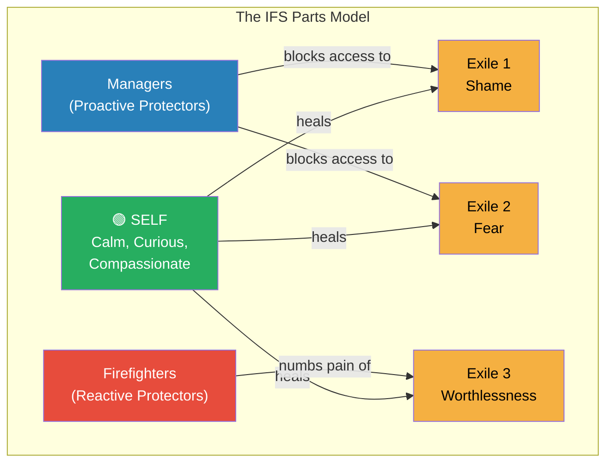
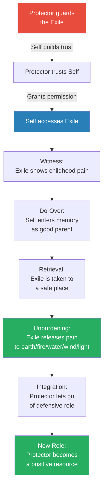
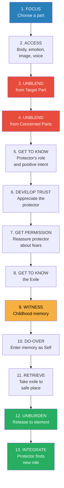
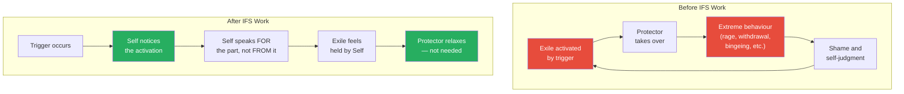

# Self-Therapy — Jay Earley

> *You are not a single personality that sometimes has irrational feelings. You are a complex system of interacting parts — each with a mind of its own — and beneath every one of them is a core Self that is calm, curious, compassionate, and capable of healing every wounded part you carry. IFS gives you a structured, repeatable process to access that Self, befriend your protectors, reach the exiles hiding behind them, and unburden the pain they have carried since childhood.*

---

## About the Author

Jay Earley, PhD, was a psychologist who practised psychotherapy for over thirty-five years before discovering Internal Family Systems Therapy and switching to practising it almost exclusively. He studied under Richard Schwartz (the creator of IFS) and became an IFS trainer, teaching thousands of people the model through teleconference classes and workshops. Earley wrote this book specifically to bring IFS to a lay audience — people who want to do deep psychological work on themselves without necessarily being in therapy. He also authored *Self-Therapy Vol. 2*, *Self-Therapy Vol. 3*, *Resolving Inner Conflict*, and *Freedom from Your Inner Critic* (with Bonnie Weiss). The third edition of Self-Therapy has sold nearly 100,000 copies and been translated into many languages.

---

## The Big Idea

- Your psyche is not a single unified personality — it is an <b style="color: #2980b9">internal family of parts</b>, each with its own feelings, beliefs, motivations, and memories
- When you were hurt as a child, some parts became <b style="color: #e74c3c">exiles</b> — carrying the pain, shame, fear, and negative beliefs from those experiences — and others became <b style="color: #e74c3c">protectors</b>, defending you from ever feeling that pain again through control, avoidance, people-pleasing, perfectionism, rage, numbness, or self-sabotage
- Beneath all these parts is the <b style="color: #27ae60">Self</b> — your core essence, which cannot be destroyed by trauma, only buried under protectors
- The Self is calm, curious, compassionate, confident, creative, connected, courageous, and clear — and it is always there, in every person, no matter how much pain they carry
- IFS provides a structured, step-by-step process to access Self, build trust with protectors, reach the exiles underneath, witness their pain, and <b style="color: #27ae60">unburden them</b> — transforming the entire internal system
- <b style="color: #27ae60">You can do this alone</b> — IFS is uniquely designed for self-therapy, though a partner or therapist can help
- The promise of IFS is not just coping with your extreme emotions and beliefs but actually TRANSFORMING them:
  - "Rather than just coping with them, you welcome them and transform them into valuable resources"
  - This is what Schwartz calls the difference between first-order change (managing symptoms) and second-order change (restructuring the system)

---

## Key Concepts at a Glance

| Concept | One-line summary |
|---------|-----------------|
| **Parts** | Sub-personalities with their own feelings, beliefs, motivations, and memories |
| **Self** | Your core essence — calm, curious, compassionate — the natural healer of every part |
| **Protectors** | Parts that shield you from feeling exiles' pain through control, avoidance, or distraction |
| **Managers** | Proactive protectors that control your behaviour to prevent pain from arising |
| **Firefighters** | Reactive protectors that impulsively numb or distract when exile pain breaks through |
| **Exiles** | Young child parts carrying pain, shame, fear, and negative beliefs from the past |
| **Blending** | When a part takes over your consciousness so completely that you become it |
| **Unblending** | Separating from a blended part so Self can observe and work with it |
| **Seat of consciousness** | The place in your psyche occupied by whoever is "in charge" — ideally, Self |
| **Trailhead** | A problem, reaction, or pattern in your life that leads to parts worth exploring |
| **Concerned part** | A protector that has negative feelings toward your target part and blocks Self |
| **Burdens** | Painful emotions or negative beliefs a part took on from childhood experiences |
| **Unburdening** | The ritual of releasing a part's burdens to an element of nature — the core healing act |
| **Do-Over** | Entering a childhood memory as Self and giving the exile what it needed but never got |
| **Retrieval** | Taking an exile out of its childhood situation to a safe place where it can be with you |

---

## At a Glance

- **The Model:** Your psyche is a family of parts — exiles carry childhood pain, protectors guard against that pain, and Self (always present, never damaged) can heal them all
- **The Method:** A 12-step process: Focus on a part, Access it, Unblend from it, Get to Know it, Develop Trust, Get Permission, Access the Exile, Witness its pain, Do-Over, Retrieve, Unburden, and Integrate
- **The Key Insight:** Every part has a positive intent — even the most destructive protectors are trying to help you — and they will cooperate once they trust that Self is present
- **The Promise:** Not just coping with extreme emotions and beliefs but actually transforming them, so protectors can drop their defensive roles and exiles can release their burdens permanently

---

*Your psyche is organized around avoiding pain. Managers proactively control your behaviour to keep exiles buried. Firefighters react impulsively when exile pain breaks through. Self — always present beneath all protectors — is the only one who can actually heal the exiles.*

---

## Part I: The IFS Model

### The Parts Model

*Earley opens by demolishing the myth that you are a single unified personality that sometimes has irrational feelings.*

- We are all "multiples" — not in the extreme sense of Dissociative Identity Disorder, but in the completely normal sense that the human psyche naturally contains many sub-personalities
- Each <b style="color: #2980b9">part</b> has its own feelings, motivations, beliefs, memories, and even body sensations
  - A part can feel like a tightness in your chest, look like a little girl in a grey dress, sound like a voice saying "you're not good enough," or show up as an impulse to withdraw from a conversation
- The concept isn't new — Carl Jung saw it a century ago — but IFS is the most sophisticated system for working with parts because it provides a complete map of the psyche and a step-by-step healing process
- Understanding this model changes everything about how you approach your own psychology:
  - You stop fighting with your impulses — because you see that each one comes from a part that is trying to help you
  - You stop judging your emotions — because you see that they come from wounded parts who deserve compassion, not contempt
  - You stop trying to suppress or eliminate aspects of yourself — because you see that parts cannot be destroyed, only transformed
  - You stop treating yourself as a single entity that is "broken" — and start seeing yourself as a family of parts that needs compassionate leadership from Self
  - Most profoundly: you discover that the leader your parts need — the calm, wise, loving presence they have been waiting for — is already inside you, has always been there, and cannot be taken away

> [!example] Joe's Angry Part and Meg's Overeater
> - Joe frequently blows up at his wife Maureen over little things — yelling, escalating fights, leaving her frightened and crying
> - He feels terrible afterward: "How could I have done such a thing? I wasn't myself"
> - In IFS terms: when Maureen taunts him in a shaming way, it triggers a child part that holds childhood humiliation, and his Angry Part rushes in to protect him from feeling that shame
> - Meg has a different pattern — when her boss criticises her, she sits down and eats an entire cake without thinking
> - The boss's criticism triggers a Frightened Child Part holding childhood fear, and Meg's Overeater Part stuffs her with food to keep her from feeling the child's fear
> **The lesson:** Joe's Angry Part and Meg's Overeater are both doing the same thing — protecting them from the pain of their child parts. Fighting or suppressing these parts makes them fight back harder. Befriending them opens the door to real change.

---

### Earley's Own Parts Work

- Earley shares a personal example that powerfully illustrates the model in action
- He used to get very sad and lonely whenever his wife Bonnie was away for more than a day
- Using IFS, he discovered this came from a <b style="color: #2980b9">Deprived Child Part</b> who was left alone in an incubator for weeks after being born prematurely and then didn't get enough nurturing from his mother
- By doing IFS work with this part, he learned to comfort it when Bonnie was gone, helped it get in touch with its body and aliveness
- After a while, the child part felt held, soothed, and connected — and the debilitating loneliness completely resolved
- "I no longer have those debilitating feelings when I am alone"
- This personal testimony from the author himself — a PhD psychologist with decades of experience in other modalities — speaks to the unique power of the IFS approach

---

### The Three Types of Parts

#### Exiles

- Young child parts that carry <b style="color: #e74c3c">pain, shame, fear, and negative beliefs</b> from childhood experiences that were never metabolized
- They are called "exiles" because the psyche pushes them out of consciousness — the pain they carry is too much to feel on a daily basis
- They desperately want to be heard and healed, but the only strategy they know is to flood you with their emotions (blending)
- When triggered by current-life situations that resemble the original wound, exiles activate — bringing up intense emotions that seem disproportionate to the present moment

#### Protectors (Managers)

- Proactive parts that try to prevent exile pain from arising in the first place
- They control your behaviour, your relationships, and your self-image to keep you "safe"
- Common manager strategies:
  - Perfectionism — "If I do everything right, no one can criticize me"
  - People-pleasing — "If I keep everyone happy, no one will abandon me"
  - Control — "If I manage every detail, nothing bad can happen"
  - Inner Critic — "If I beat you up first, the world can't hurt you worse"
  - Intellectualising — "If I stay in my head, I won't feel the pain"
  - Withdrawal — "If I stay away from people, I can't be rejected"

#### Protectors (Firefighters)

- Reactive parts that jump in when an exile's pain starts to break through despite the managers
- Their job is to numb, distract, or drown out the pain — by any means necessary
- Common firefighter strategies:
  - Binge eating, drinking, or drug use
  - Rage outbursts
  - Dissociation or spacing out
  - Self-harm
  - Compulsive shopping, sex, or screen time

> [!tip] Core Insight
> Every part has a positive intent — even the most destructive ones. The inner critic is TRYING to protect you from the shame of failure. The people-pleaser is TRYING to keep you safe from rejection. The binge eater is TRYING to numb unbearable pain. Understanding this changes everything about how you relate to yourself.

---

### The Self

*This is the most revolutionary idea in IFS — and the one that separates it from almost every other form of therapy.*

- Beneath all your parts is a <b style="color: #27ae60">core essence called the Self</b>
- The Self cannot be destroyed by trauma — only buried under protectors
- It is not something you need to build or develop — it is who you already are
- When you are in Self, you naturally manifest what Schwartz calls the "Eight C's":

| Quality | What it feels like |
|---------|-------------------|
| **Calm** | Grounded, centred, not reactive |
| **Curious** | Genuinely interested in understanding parts without agenda |
| **Compassionate** | Feeling caring and warmth toward parts in pain |
| **Confident** | Trusting that you can handle whatever comes up |
| **Creative** | Finding solutions and new perspectives naturally |
| **Connected** | Feeling close to your parts and to other people |
| **Courageous** | Willing to face pain and difficult truths |
| **Clear** | Seeing situations and parts without distortion |

- <b style="color: #27ae60">Self is the natural occupant of the seat of consciousness</b> — it is who you truly are
- Parts can take over the seat of consciousness (blending), but when they step aside, Self automatically returns
- Most spiritual traditions have a parallel concept: Essence, Buddha Nature, Atman, Inner Light, Christ Consciousness
- The practical implication: you don't need a therapist to supply Self qualities you lack — you need to unblend from the parts that are covering your Self

---

*Blending happens when a part takes over the seat of consciousness so completely that you lose access to Self. Unblending restores Self to the seat — creating the "dual consciousness" that makes IFS healing possible: you feel the part's emotions while remaining grounded in Self.*

---

### Blending and the Seat of Consciousness

- The <b style="color: #2980b9">seat of consciousness</b> determines your identity, feelings, perceptions, and actions at any given moment
- Whoever occupies the seat is "in charge" — and you take that occupant to be yourself
- When Self occupies the seat: you see clearly, feel grounded, relate to others with wisdom and compassion
- When a part occupies the seat (blending): you see the world through that part's distorted lens, feel its emotions as if they are the whole truth, and act on its impulses

> [!example] Sheila's Temper Tantrum (Earley's illustration)
> - Sheila's husband forgot her birthday after being wrapped up in work
> - Her Temper Tantrum Part took over the seat of consciousness
> - She yelled: "You don't love me anymore! All you care about is your work!"
> - She couldn't see his perspective, couldn't be reasonable, couldn't even talk about being angry — she could only act out the rage
> - An hour later, a different part took over — one that judged her: "I hate it when I get that way"
> - Neither state was Self — the first was blending with the Temper Tantrum Part, the second was blending with a Judgmental Part
> **The lesson:** The two most common ways we relate to our difficult parts — being taken over by them OR judging them — are both forms of blending. Neither leads to healing.

- Blending is not black-and-white — it has degrees
  - A part can be "a little blended" (you feel its emotions but have some perspective)
  - Or fully blended (you ARE the part with no Self available)
  - You need a "critical mass" of Self — not 100% — to work effectively with a part

---

### How IFS Differs from Other Approaches

*A crucial distinction that explains why IFS produces deeper change than traditional talk therapy.*

- **Intellectual analysis** (traditional talk therapy): You figure out your reactions by relating them to your psychological makeup — "My father was judgmental, so I probably react to evaluation because of that"
  - Good first step, but it's based on guesswork and doesn't create direct contact with the part
  - You can have perfect insight and still be triggered in exactly the same way
- **Emotional immersion** (cathartic therapy): You fully become the part, feeling all its emotions
  - Risk: you get lost in the part (blending), buy into its beliefs, and can be retraumatised
  - You lose contact with the healing presence of Self
- **The IFS approach**: Inhabit Self, then get to know the part by asking it questions and listening
  - "We don't dive into the lake; we sit at the edge with our feet in the water, looking into its depths"
  - You aren't just spinning intellectual ideas (photographing the lake from an airplane)
  - You are right there, truly listening, without falling into the deep water and getting lost
  - This creates what Earley calls <b style="color: #27ae60">"dual consciousness"</b> — you feel the part's emotions to some extent while remaining centred in Self
  - "You can feel both the part and the Self" — and this combination provides extraordinary healing power

---

## Part II: Working with Protectors (Steps 1-6)

*The first half of the IFS process is about building a relationship with your protectors — not breaking through them. "We don't break through doors and rush toward the exiles. We respect our protectors' need for defences."*

### Step 1: Focusing on a Part

*You begin every IFS session by choosing one part to work with — your "target part."*

- Three ways to find your target part:
  1. **Start with a trailhead** — a problem, pattern, or reaction in your life that involves extreme emotions or behaviour
  2. **Start with a part you already know** — one that has been causing trouble or asking for attention
  3. **Start with your current experience** — notice what parts are activated right now and choose one
- A <b style="color: #2980b9">trailhead</b> is any experience in your life that will lead to interesting parts if you follow it:
  - A person who triggers you
  - A pattern of behaviour you can't stop (procrastination, people-pleasing, rage)
  - An emotional reaction that seems disproportionate to the situation
  - A body sensation that shows up in response to stress
- When you examine a trailhead, look for parts in three categories:
  - A part that **misperceives** the situation (e.g., sees your boss as judging you when he's trying to help)
  - A part that **overreacts emotionally** (e.g., becomes extremely upset at moderate criticism)
  - A part that **takes extreme action** (e.g., becomes rebellious or aggressive in response to perceived judgment)
- When identifying parts at a trailhead, scan for:
  - **Feelings** — each distinct emotion indicates a different part (anger, sadness, fear, shame)
  - **Body sensations** — tension, heat, cold, heaviness, emptiness, nausea, rigidity
  - **Thoughts** — judgmental patterns, obsessive thinking, mental blanks ("She is certainly intrusive," "That was a stupid thing to say")
  - **Behaviour** — withdrawal, avoidance, taking control, people-pleasing
  - **Desires** — wanting closeness, wanting to be left alone, wanting approval
- Even the absence of feeling, thought, or desire can indicate a part:
  - Mind goes blank? A part is probably blocking a dangerous train of thought
  - No desire for anything? A part doesn't think it's safe to want things
  - Cut off from all feelings? A Numb Part is protecting you from overwhelm

> [!example] Betty's Many Parts at One Trailhead
> - Betty was considering talking to her grown son about how he treated his child — but kept hesitating
> - When she examined this trailhead, she found SIX parts:
> - 1. A part that wants to avoid talking (with a strangling feeling in her throat to stop her from speaking)
> - 2. A Loving Part that cares about him and her grandson
> - 3. A part that is sad and regretful about past failures to communicate well
> - 4. A part that is disappointed and embarrassed about how he treats her grandson
> - 5. An Angry/Protective Part that wants to say "How dare you?!" and push her son away
> - 6. A Disturbed Stomach Part that is afraid of the Angry Part and blocked Betty's awareness of it
> **The lesson:** A single trailhead can activate many parts that interact with each other. One part blocks awareness of another. Two parts may seem similar but turn out to be different. You can only discover the full picture by exploring experientially, not intellectually.

> [!example] Sandy's Procrastination
> - Sandy wanted to take on a creative video project but couldn't start
> - First she cleaned her office, then exercised, then cooked a three-course meal
> - She had a "Busy Part" that kept her occupied with other activities to avoid the project
> - The Busy Part was unconscious — and its power came precisely from being unconscious
> - Once she identified and named it, she could begin working with it
> **The lesson:** Hidden parts have extra influence because they can't be addressed — like someone spreading rumours behind your back.

- When identifying parts at a trailhead, look for:
  - **Feelings** — each emotion or attitude indicates a part
  - **Body sensations** — tension, heat, cold, heaviness, emptiness
  - **Thoughts** — judgmental patterns, obsessive thinking, mental blanks
  - **Behaviour** — withdrawal, avoidance, taking control, people-pleasing
  - **Desires** — wanting closeness, wanting to be left alone, wanting approval

---

### Step 2: Accessing a Part

- Once you have chosen your target part, you make contact with it experientially — not intellectually
- Close your eyes, go inside, and contact the part through four channels:
  1. **Feelings** — sense the emotion or attitude that characterises the part
  2. **Body sensations** — feel where the part lives in your body
  3. **Images** — see an internal picture of the part (a person, animal, object, symbol)
  4. **Internal voice** — hear what the part says silently inside you
- You don't need all four channels — one is enough
- Different people are stronger in different channels — use whatever works for you

> [!example] Julie's Tin Man
> - Julie was ending a relationship because her boyfriend seemed "too needy"
> - She accessed her "control freak" part through her body: a hardness, no feelings, closed off, rigid, nothing below her head
> - Then an image arose: the Tin Man from The Wizard of Oz
> - Three channels confirmed: body (hardness), emotion (closed off), image (Tin Man)
> **The lesson:** The Tin Man was protecting Julie from being swallowed up by her boyfriend's neediness — it closed off her heart to keep her safe.

- If a part isn't currently activated, remember a recent time when it was and imagine you are in that situation
  - This activates it enough to work with without triggering it fully
  - Sometimes it is actually EASIER to work with a part this way because its emotions won't be so intense

> [!example] Georgia's Three Parts and Walter's Three Parts
> - Georgia noticed three parts in a moment: a Scared Part (a four- or five-year-old child, "quite frightened"), a dark Attacker ("male, huge, totally dark, strong"), and a comforting light opening in her forehead
> - Walter noticed three parts: an Irritated Part ("someone smashing things"), a Fat Buddha Part ("a sense of allowing, acceptance of what's so"), and a Striving Part ("an accountant at his desk, frantically working on his papers")
> - Walter's reaction to his Striving Part was telling: "I don't like this part. It doesn't fit my self-image, which is more easygoing" — which itself was a concerned part speaking
> **The lesson:** When you check in with your current experience and catalogue the parts present, you get a "map of the inner territory" that reveals surprising dynamics — parts you didn't know existed, parts that oppose each other, and parts you don't like (which means a concerned part is activated too).

---

### Step 3: Unblending from a Protector

*This is the step most people struggle with — and it is the key to everything that follows.*

- Before you can get to know a part, you must be in Self with respect to it
- If the part is blended with you, there aren't "two entities" — and it takes two to have a relationship
- How to check for blending:
  - How strongly are you feeling the part's emotions? (Flooded = blended)
  - How much do you buy into its beliefs? (Fully convinced = blended)
  - Can you find a place inside that is separate from the part? (No = blended)
  - What do you feel TOWARD the part? (Can't answer = blended)

> [!abstract] Five Methods for Unblending
> 1. **Ask the part to make space** — "Would you be willing to separate from me just for a few minutes so I can get to know you?" Reassure it you're not asking it to go away or give up its role
> 2. **Move into Self** — Step back into curiosity, caring, or respect for the part. Experience yourself as separate from it
> 3. **Visualise the part at a distance** — Get an image of the part sitting across from you, or behind a window
> 4. **Do a centering meditation** — Focus on body sensations, belly, heart. Return to a grounded, present state
> 5. **Find an opposed part** — Locate a part that has the opposite perspective. Then find the place that is neither — that's likely Self

- If a part won't separate, ask: <b style="color: #2980b9">"What are you afraid would happen if you made space for me?"</b>
  - Most parts are afraid that separation means being pushed away or ignored again
  - Explain that you want separation precisely so you CAN relate to it — it takes two
  - Reassure: "This is just for a few minutes during this session. You can blend again after if you want."
- Earley uses the metaphor of a clear cup of water (Self) and a teaspoon of instant coffee (part) — when the coffee blends with the water, the water is still there but completely obscured
- Another way to recognise blending: when you start speaking AS the part rather than reporting what the part says
  - Reporting (unblended): "The part feels upset with my sister"
  - Being the part (blended): "My sister is a bitch"
  - The shift from third person to first person is a reliable signal that blending has occurred
- Getting lost in a detailed story about a person or event — going off on a riff, losing awareness that you're hearing from a part — is another classic sign
  - "You have gotten emotionally pulled into the story and can't view it objectively"
  - As soon as you notice this, stop and use one of the unblending methods

---

### Step 4: Unblending from a Concerned Part

*Even when you're not blended with your target part, another part may be blocking Self.*

- After unblending from the target part, ask: <b style="color: #27ae60">"How do I feel TOWARD this part right now?"</b>
- If you feel curious, compassionate, open, accepting — you are in Self. Proceed.
- If you feel judgmental, angry, scared, disgusted, or wanting to get rid of it — a <b style="color: #e74c3c">concerned part</b> is blended with you
  - A concerned part is a protector that has negative feelings toward your target part
  - It is worried about the trouble the target part causes in your life
- How to unblend from a concerned part:
  1. Ask it what its concerns are — listen respectfully
  2. Let it know you understand and sympathise
  3. Ask if it would step aside so you can get to know the target part from an open place
  4. If it won't: explain that if you heal the target part, the problem the concerned part worries about will be resolved
  5. If it still won't: ask what it is afraid would happen if it stepped aside, and reassure it
  6. If it still won't: make the concerned part the new target part and work with it

> [!example] Lisa's Sooty Demon and the Watcher
> - Lisa wanted to work with a part that hated her little sister — "a little black demon covered with chimney soot"
> - When asked how she felt toward it: "Somewhat frightened"
> - The frightened part (the Watcher) wouldn't step back — it was fixated on the Demon, muttering out of the side of its mouth, "quite sure its job is very, very important"
> - Jay explained: "If you get to know this Demon, you can heal it so it won't be dangerous"
> - The Watcher's reaction: it turned and looked at her for the first time, "an incredulous look on its face," then plopped in a chair saying "Okay" — amazed that she would even think of getting to know the Demon
> - Once the Watcher stepped aside, a second concerned part appeared — a wide-eyed Little Girl in a pretty dress, scared the world would come apart
> - After both stepped aside, Lisa's feeling toward the Demon shifted: she admired it — it looked like a Tasmanian devil instead of a demon
> **The lesson:** When you see a part through the eyes of fear and judgment, it looks evil. When you see it through Self — curiosity and compassion — it reveals itself as it truly is.

> [!example] Ben's Doubting Part Won't Separate
> - Ben, a 45-year-old Canadian teacher with a history of addiction, wanted to work on a part critical of his sister
> - A Self-Doubting Part immediately appeared: "You probably need to try harder. You're kidding yourself"
> - Ben chose to focus on the Doubting Part — but when asked if he was separate, he felt "unsteady"
> - Then a key recognition: "I just realised I am doubting my ability to do this process, so I think I'm blended with that part"
> - He asked the Doubting Part to separate — but it refused: "This part doesn't trust that I would be safe if it separated. If I stop self-doubting, it thinks I will get into some kind of trouble"
> - Jay clarified: "We aren't asking it to stop doubting you. We are just asking it to separate from you enough that you can get to know it"
> - The part relaxed: "Okay. That is easier." It separated.
> - Ben's feeling toward the part after separation: "Neutral. Somewhat curious. A little bit guarded"
> **The lesson:** Parts often misunderstand what unblending means — they think you're asking them to give up their role permanently. Clarifying that you only need a few minutes of space, and that their role is not under threat, usually dissolves the resistance.

---

### Step 5: Getting to Know a Protector

- Now that you are in Self, you can truly get to know the protector
- IFS does something different from other therapies:
  - It doesn't just analyse the part intellectually (guesswork from a distance)
  - It doesn't ask you to become the part and feel all its emotions (risk of blending)
  - It sits at the edge of the lake with your feet in the water, looking into the depths — you are right there, truly listening, without falling in

- Key questions to ask a protector:
  - "What do you hope to accomplish by playing this role?"
  - "What are you afraid would happen if you didn't do this?"
  - "What emotions are you afraid of if you didn't perform your role?"
- Parts can answer through words, images, body sensations, emotions, or "direct knowing"
- <b style="color: #27ae60">Every protector has a positive intent</b> — it is genuinely trying to help you, even if its strategy is causing problems
  - The Overeater is trying to comfort you
  - The Inner Critic is trying to prevent you from failing
  - The Withdrawer is trying to shield you from rejection
  - The Perfectionist is trying to make sure no one can attack you

- Names for parts: let the part name itself rather than imposing a name
  - A part you see as "the Monster" might see itself as "the Warrior" — calling it the Monster makes it feel judged and it will close down
  - Names can change over time as the part transforms — the Sooty Demon became Zappy, the Resigned Part became Jazzy Girl
- When a part is vague at first: don't push for clarity
  - "The practice of Focusing is an excellent method for allowing parts to gradually come into view"
  - What started as an empty place might become unsatisfied, then a sensation in your belly, then an empty sack, then a child who needs nurturing
  - "Like the development of a photographic image in a darkroom"

---

### A Protector's Positive Intent — In Detail

*This is the concept that changes everything about how you relate to yourself.*

- Every protector believes it MUST perform its role to prevent you from being harmed or feeling pain
- Even when the role is causing terrible problems, the protector is genuinely trying to help
- Common protector roles and their hidden logic:

| Protector | What it does | What it's protecting you from |
|-----------|-------------|------------------------------|
| Inner Critic | Attacks you with judgment | Shame of failure (if I beat you up first, the world can't hurt you worse) |
| People-Pleaser | Abandons your needs to serve others | Rejection and abandonment |
| Controller | Manages every detail obsessively | Chaos and the feeling of helplessness |
| Perfectionist | Sets impossible standards | Being criticised or attacked |
| Procrastinator | Keeps you busy with distractions | Fear of failure or exposure |
| Numb Part | Cuts off all feelings | Being overwhelmed by exile pain |
| Rage Part | Explodes at perceived threats | Shame, vulnerability, helplessness |
| Intellectual Part | Stays in the head, avoids feelings | Being overwhelmed by emotion |
| Withdrawer | Pulls away from people | Rejection, betrayal, engulfment |

- When you discover a protector's positive intent, your attitude toward it naturally shifts from hatred or frustration to appreciation
- This shift IS the shift from a concerned part to Self

---

### Step 6: Developing Trust with a Protector

- Trust is built by saying to the protector (if genuinely felt):
  - "I understand why you do your role"
  - "I appreciate your efforts on my behalf"
  - "I appreciate this capacity that you have"
- Many protectors have never been acknowledged or appreciated — they have just been fought, judged, or suppressed
- When a protector feels truly seen and appreciated by Self, it begins to soften — it may reveal more about itself or about the exile it is protecting
- The protector doesn't have to give up its role yet — it just needs to trust Self enough to allow access to the exile

---

> [!tip] Core Insight
> In IFS, we never fight with protectors, suppress them, judge them, or try to get rid of them. We respect their need for defences, and we take our time getting to know them and gaining their trust. Only then will these gatekeepers relax and give us permission to work with the exiles. Paradoxically, this respectful approach is far more efficient than strong-arm tactics.

---

## Part III: Working with Exiles (Steps 7-12)

*This is where the deep healing happens — and it is the part of the book that most readers find life-changing.*

### Step 7: Getting Permission to Work with an Exile

- Before you can work with an exile, you need explicit permission from the protector guarding it
- The protector won't step aside until it trusts that Self can handle the exile's pain
- Common protector fears:
  1. **The exile's pain will overwhelm you** — reassure that you will stay in Self, not dive into the pain
  2. **There is no point — nothing can change** — explain that IFS can heal the exile
  3. **The protector will be eliminated if it gives up its role** — explain that it can choose a new, healthier role
- The most powerful persuasion: <b style="color: #27ae60">"If we healed the exile you are protecting, would you still need to do your job?"</b>
  - Secretly, this is what all protectors want — to be relieved of their burdensome, thankless roles

> [!example] Christine's Confuser Gives Permission
> - The Confuser was terrified of letting Christine see what it was hiding: "What would happen is just unthinkable, unspeakable"
> - It was afraid the exile would "come rushing up and swamp" Christine
> - Jay suggested inviting the Confuser to signal them if the exile started to overwhelm her — giving it a helpful role in the process
> - Christine reassured it: "We've tried things like this before, and I have shown myself to be helpful"
> - She suggested the Confuser could "find new territory where it can relax and not have to work so hard"
> - The Confuser's response: "It sort of sat back in a lawn chair and crossed its legs to watch what happens next"
> **The lesson:** Protectors will cooperate when they understand that they have something to gain — freedom from an exhausting, thankless job.

> [!example] Fran's Line of Angry Protectors
> - Fran wanted to work with a big exile she'd been afraid to approach
> - When asked if any protectors objected: "Oh gosh, I can sense these angry parts marching up and down. 'You think you're going to get past this line and talk to this exile. You've got to be kidding.' They're making faces and trying to scare me"
> - After a centering meditation, Fran felt calmer and curious — but the protectors had a fear: "You're not going to be able to handle it, so don't even start. You started this before and then you abandoned us"
> - The fear was real: Fran had a pattern of starting to work with exiles, getting flooded, then shutting them out again
> - Jay explained that the flooding was the problem — if she learned to stay unblended, she could stay consistent
> - The protectors accepted this, but a second fear emerged: a parental protector that saw Fran "as a punishing god" — afraid she'd be harsh, have unrealistic expectations, want the exile to be "more grown up than it can be"
> - Fran checked: "No, I don't feel that way at the moment. I feel warmly toward this child"
> - The parental protector opened a space: "It is bowing out of the way and opening a space for me to walk in"
> **The lesson:** Protectors often have multiple layers of fear that must be addressed one by one. Each fear is legitimate — and each can be reassured. The key question is always: "Are you feeling that way RIGHT NOW?" — because it's the present-moment state that matters.

---

### Step 8: Getting to Know an Exile

- Once you have permission, contact the exile experientially — body, emotion, image, voice
- <b style="color: #e74c3c">The critical moment: unblending from the exile</b>
  - Exiles want to be heard so desperately that they try to flood you with their feelings
  - If they succeed, protectors will slam the door shut — because keeping you from this suffering has been their job for years
  - You may find yourself going numb, spacing out, getting distracted, or becoming angry — all protectors jumping in to block the exile's pain
  - The innovation of IFS: ask the exile to agree not to overwhelm you so you can help it
  - "Would you be willing to not flood me with your emotions so I can hear your story and heal you?"
  - Exiles have the capacity to cooperate — Schwartz discovered that they can contain the intensity of what you experience, if they choose to
  - If the exile says no: ask what it's afraid would happen. Usually: "If I don't flood you, you'll ignore me — you'll exile me again." Explain that because you are using IFS, this time will be different — you really do want to witness its story

- <b style="color: #2980b9">Conscious blending</b> — the exception to unblending:
  - Sometimes it is appropriate to feel an exile's pain — if it's not overwhelming and you remain grounded
  - The exile may want you to experience its pain directly because this helps it feel fully witnessed
  - The key: you are simultaneously in Self AND consciously blended — you know you are blended and can unblend easily
  - This is very different from being overwhelmed without realising it

- Once unblended, check how you feel toward the exile
  - <b style="color: #27ae60">Compassion is essential — not just curiosity</b>
  - With protectors, curiosity is sufficient. With exiles, compassion is the healing force
  - Communicate your caring directly — through words, but even more through your heart
  - Feel the actual body sensations of compassion (warmth, softness in your heart) and let them radiate to the exile
  - Check: can the exile sense you? Is it taking in your caring?
  - If it can't sense you: ask it to notice you — some exiles have been so isolated they don't know anyone else exists

> [!example] Fran Connects with an Exile in a Cavern
> - Fran accessed her exile: "It looks like a child with leprosy. It is in a cavern, and light is slanting in. The exile has sores and wounds, very skinny"
> - She asked the exile not to overwhelm her: "I'm asking that you not overwhelm me so I can feel enough of the pain to know and validate it, yet not so much that I go away myself"
> - The exile agreed: "Okay, we'll see." Fran felt sadness in her belly — tolerable pain, conscious blending
> - Fran approached gradually: "I'm moving closer to it, though it's not turned to me. I'm synchronizing my breathing with it. It doesn't feel right to touch it, but I'm within a foot or so"
> - The exile turned its face: "I see a tear going down its cheek... Some of the pain is like moving in waves through my body. And I feel like I'm still in Self"
> - Fran found a way to dissipate the waves of pain while remaining solidly in Self, "having a smoothing-out effect on the exile"
> **The lesson:** Approaching an exile requires patience, respect, and the willingness to sit with pain without being consumed by it. You don't rush in — you synchronise your breathing, you move closer gradually, you let the exile turn to you in its own time.

---

*The IFS healing arc: Self builds trust with the protector, gets permission, accesses the exile, witnesses its childhood pain, provides what was missing, and guides the exile through an unburdening ritual. The protector — no longer needed in its old role — transforms into a positive resource.*

---

### Step 9: Witnessing Childhood Memories

*One of the most powerful and emotionally moving steps in the entire process.*

- Ask the exile: "Please show me an image or memory of what happened to make you feel this way when you were a child"
- Let the memory come from the exile — don't try to figure it out intellectually
- Four types of memories can emerge:
  - **Explicit** — a clear, specific recollection of a particular incident
  - **Implicit** — vague body sensations, fragments of images from early childhood
  - **Generic** — a memory that represents a kind of incident that happened many times
  - **Symbolic** — an image that represents the experience in symbolic form (like a dream)
- All types are equally valid for healing — you don't need crystal-clear explicit memories

- Two aspects of every memory must be witnessed:
  1. What happened
  2. How it made the exile feel
- Stay with the exile as it gradually reveals more — don't rush
- The crucial check: <b style="color: #27ae60">"Does the exile feel that you understand how bad it was?"</b>
  - The exile must not only tell its story but take in the fact that its pain has been truly seen and heard
  - If it doesn't feel understood, ask whether it needs to show more or whether it doesn't believe you really got it emotionally

- Why witnessing heals:
  - It opens hidden memories so they can be metabolized under the guidance of Self
  - The exile is no longer alone — and this is the crucial difference between the original experience and what is happening now
  - "The original incident was especially difficult because the exile had to deal with it all by itself with no help or understanding from another living soul"
  - The exile learns that its burden came from the past — it is not intrinsic to who it is
  - A child part who feels worthless learns she was made to feel that way in her family — the worthlessness is a burden she took on, not the truth about herself

> [!example] Melanie's Shame Exile — "A Piece of Dirt"
> - Melanie had accessed a Shame Exile that appeared as "a sunflower with its face looking down at the ground"
> - The exile showed a memory: her parents yelling at her for spilling something, making her feel scared and bad about herself
> - Then a worse memory surfaced: her father telling visitors the story of her spilling, making fun of her while everyone laughed
> - "And they keep doing this, over and over again, telling this same story to different people, as if it is really funny for them to keep humiliating her like this"
> - How it made the exile feel: "Like she was a piece of dirt"
> - The exile also needed to express anger: she started "screaming and yelling at them" — anger that had never been allowed to surface when she was a child
> - After witnessing: "She knows that I've heard her. She's glad that I've heard her finally"
> **The lesson:** Exiles often carry anger alongside their pain — and that anger is not a defence (like a protector's anger). It is a legitimate feeling that was never allowed expression. It must be witnessed just like the pain.

---

### Step 10: Do-Over

*This is where the IFS process crosses from witnessing into active healing — and it is the step that actually lays down new neural pathways.*

- In your imagination, enter the original childhood situation as Self — with all your adult knowledge and the capacities of Self
- Ask the exile: <b style="color: #2980b9">"What do you need from me in this situation?"</b>
- Whatever it needs, provide it:
  - If it wasn't held: hold it to your heart and tell it you love it
  - If it was blamed: explain it wasn't its fault
  - If it was hit: protect it from the abuser — with the Strength capacity, you can be as large and powerful as needed to stop even the most powerful parent
  - If it was ignored: take the time to hear the intimate details of its life
  - If it was shamed for its feelings: tell it those feelings are completely natural
  - If it was forced to perform for love: tell it you love it exactly as it is, it doesn't need to do anything for you
  - If it was made responsible for a parent's feelings: tell it that wasn't its job — they were the adults, it was only a child
  - If it was alone: be its companion and playmate
- This is not "pretending the past was different" — it is creating a new, genuine relationship with the exile in the present
  - The exile doesn't really live in the past — it just thinks it does
  - When it has a new experience with Self, new neural pathways are laid down in the brain
  - The old memory doesn't disappear, but the new experience becomes the primary influence on how you feel and behave
- Sometimes the exile needs you to <b style="color: #2980b9">rework the situation</b> — change what happened:
  - Talk to the parent images and explain how the child needs to be treated
  - If the parent image can't respond positively (because you have no experience of them ever being that way), evoke a healthy version of the parent — or an ideal parent who has exactly the qualities needed
  - If the exile wants you to physically remove or even destroy an abusive parent in the imagery — do it. Internal imagery can be as dramatic as needed
- Check: is the exile taking in what you're giving? Can it feel your caring?
  - If not: the exile may be so caught up in the past that it doesn't know you exist — tap it on the shoulder, move closer, ask it to notice you
  - Some exiles have never had an adult who could be trusted — give it time to learn to trust you

> [!example] Christine Reparents the Baby and the Little Girl
> - Christine entered the scene where her baby exile was alone in the dark, flailing her arms
> - "She wants me to pick her up." Christine picked her up, nuzzled her around the ears
> - "She's clinging to me. I see her bald head. She's quite young and doesn't have much hair — just soft down"
> - "Softening, and now she's not crying. She's feeling into me and resting into me. And now there's a little burp. You know when a baby has been crying and there's a little aftershock going through her. I can feel it in her back"
> - Then something unexpected: "The Little Girl, with the little body and the heavy heart, wants to hold the Baby"
> - Christine let her: "It's so sweet! The whole thing has now just shifted to this beautiful playtime. I just feel so much love. Not just from me to these little ones, but both of them are bathed in love"
> **The lesson:** Do-Over can't be faked — you must genuinely feel love for the exile. But when you do, the response is immediate and profound. Parts who have been alone in the dark for decades light up when they finally feel someone is truly there.

---

### Step 11: Retrieval

- Sometimes the exile needs to be physically taken out of the childhood situation
- Ask: "Where would you like to be taken?"
  - Options: somewhere in your current life, your heart, a nature scene, or any place where it feels safe and can be with you
- This step symbolically removes the exile from the "time loop" of the past and brings it into the present
- Not always needed — some exiles are ready to move directly to unburdening after the Do-Over
- But for exiles who are "stuck" in a particularly frightening or bleak environment, retrieval can be a powerful relief

---

### Understanding Burdens

*Before we reach the unburdening step, it is important to understand exactly what a burden is — because this concept is central to why IFS healing is permanent.*

- A <b style="color: #2980b9">burden</b> is a painful emotion or negative belief that a part took on as a result of a harmful childhood experience
- Burdens are NOT intrinsic to the part — they are acquired, like mud on a child who fell in a ditch
- Common emotional burdens: shame, worthlessness, fear, panic, hopelessness, grief, loneliness, rage
- Common belief burdens: "I am bad," "Nobody loves me," "I am stupid," "The world is dangerous," "I don't deserve good things," "If I show my feelings, I will be punished"
- Burdens are held in the body — as heaviness, tightness, coldness, numbness, pressure, or constriction
- A burden that isn't metabolized in childhood stays frozen in time — the exile continues to feel the pain as though the original event is still happening
- <b style="color: #27ae60">This is the key insight</b>: you cannot change what happened in childhood, but you CAN change the way the past is codified in your psyche — and that is what unburdening does

---

### Step 12: Unburdening

*The culmination of the IFS healing process — and the step that produces lasting, often dramatic change.*

- After witnessing, Do-Over, and retrieval, the exile is ready to release the burdens it has carried since childhood
- Ask the exile: "What burdens — painful feelings or beliefs — would you like to release?"
- Notice where and how the exile carries the burdens in its body:
  - A weight in the chest, a heaviness on the shoulders, a dark cloud around the head, a tightness in the throat, a knot in the stomach
- Ask: "What would you like to release the burdens to?"
  - <b style="color: #2980b9">Five elements</b>: earth, fire, wind, water, or light
  - The element symbolises that the burden won't come back — it has been carried away or transformed by something elemental and powerful
  - The exile chooses the element — don't impose your preference
- Feel the burdens leaving the exile's body as they are released — take as much time as needed
- Allow the unburdening to proceed at its own pace — some burdens release quickly, others need time
- Then notice what positive qualities emerge now that the burdens are gone
  - Joy, playfulness, openness, confidence, lightness, freedom, gratitude, curiosity
  - These qualities are not new — they are the part's intrinsic nature, which was buried under the burden
- After unburdening: <b style="color: #27ae60">follow up with the exile over the next few weeks</b>
  - Continue your relationship with it
  - If the old feelings get triggered, investigate — it may mean the unburdening wasn't complete, or there is a related memory that needs witnessing

> [!example] Christine's Little Girl Burns Her Dress (Full Session Transcript)
> - Christine's Little Girl exile carried a "heavy heart" — hopelessness that nothing would ever change
> - The heaviness was "like a heavy mantle over her head and back and shoulders"
> - When asked how she wanted to release it, the Little Girl said: "Burning — she wants to burn her little dress, as if that IS the burden"
> - The Little Girl felt "quite disoriented and scared in the moment it was changing, but then I held her hand, and now she's got a new dress"
> - After the burning: "The two of them are looking up at the smoke from the burning dress as it blows away"
> - Positive qualities emerged: gratitude, playfulness — "They're playing footsy with each other"
> - The Confuser protector was checked: "gobsmacked" (shocked). Did it still need to create confusion? "No. She seems to feel that isn't necessary anymore"
> - The Confuser chose a new role: "a kind of guide or mentor for the Little Girl so she won't feel alone"
> **The lesson:** When an exile is unburdened, the protector that was guarding it can finally let go of its exhausting role and become something positive.

---

### What to Do When Protectors Keep Jumping In

- Sometimes, even after getting permission, a protector reactivates during exile work because the pain feels too intense
- If it's the same protector that already gave permission: ask what happened to change its mind — usually the exile's pain emerged more intensely than expected
- If it's a new protector: spend time getting to know it and its concerns before proceeding
- If an exile's pain is threatening to overwhelm you and no amount of reassurance to the protector works: negotiate with the exile first to contain its feelings, then the protector will relax
- <b style="color: #e74c3c">If you cannot get permission despite following all these steps</b> — this may indicate that you need to work with an IFS therapist for this particular exile
  - Some exiles carry trauma that is genuinely too intense for self-work
  - Knowing your limits is a sign of Self-leadership, not failure

---

> [!example] Peter's Concerned Parts Block Access to a Toddler Exile
> - Peter had accessed a toddler exile who was very upset. The original protector gave easy permission.
> - But when Peter checked how he felt toward the toddler: "There is quite a bit of judgment. I really don't like it"
> - A concerned part felt contempt for the toddler's weakness — "This part is invested in my being strong and together"
> - Jay reassured: "The toddler is very young, so it can't help being emotional. You can be strong and still have a young part that feels intense emotions"
> - That part receded — but immediately a second concerned part appeared: it hated the way the toddler "screams and yells and gets out of control"
> - This one was rooted in real history: "I lost it many times as a child, and I really got punished for it. And this has happened a few times as an adult — I alienated a bunch of people"
> - Jay reassured: "What we are aiming to do is help this toddler unburden its pain. Once it releases that, it will be much less likely to spin out of control"
> - Both concerned parts stepped aside, and Peter felt "warmth, like I want to help it feel better"
> **The lesson:** Multiple layers of concerned parts can block access to an exile — each with a legitimate reason for its attitude. The process is always the same: hear the concern, validate it, explain how the IFS process addresses exactly what it's worried about.

---

## Part IV: Integration and Beyond

### Integration

- After unburdening an exile, check back with the original protector
- Does it realise the exile has been healed?
- If necessary, introduce the transformed exile to the protector
- Ask: "Can you now let go of your protective role?"
- If yes: ask what new role it would like to play in your psyche
  - "Protectors aren't defined by the negative beliefs and emotions they took on in childhood. They have their own potential that is intrinsic to them."
- If no: check what else needs to be done
  - Often, a protector guards more than one exile — all must be healed before it can fully let go

> [!example] The Sooty Demon Becomes Zappy
> - After Lisa healed the Heart Part exile that the Sooty Demon was protecting, she checked back with it
> - It no longer felt the need to attack her sister or other harsh people
> - It chose a new role: "It says it would like to just be playful"
> - It renamed itself "Zappy" — buzzing around with high energy, freedom, and electric vibrance
> - When Lisa imagined her sister making a harsh crack about her appearance: "I don't notice the usual resentment. I'm just not that affected. It just seems like her stuff."
> **The lesson:** When the exile's wound is healed, the protector's extreme behaviour dissolves naturally — because there is nothing left to protect against.

---

### When a Protector Isn't Ready to Let Go

- Sometimes, even after an exile is healed, the protector still can't let go
- This usually means the protector guards more than one exile — and the others haven't been healed yet

> [!example] Art's Stay-Away Part Guards Multiple Exiles
> - Art had unburdened a Teenage Exile afraid of social rejection
> - He then checked with the Stay-Away Part — a protector that prevented him from going to parties and retreats
> - The protector appreciated the healing but said: "He'd like to see the transformation in action. He's not sure if it's safe"
> - During the session, Art was shown a memory from a much younger exile — being pushed into a party by his mother
> - The Stay-Away Part couldn't let go because this younger exile hadn't been healed yet
> - "Nothing more needs to be done in this session with the Stay-Away Part. When the younger exile is also healed, it will probably relax and let Art go to social events"
> **The lesson:** Behaviour change sometimes requires healing multiple exiles guarded by the same protector. An Overeating Protector might guard one exile starving from being schedule-fed, another abandoned when mother got depressed, and a third who gets upset when lied to. All three may need healing before the overeating fully resolves.

---

### What to Expect Over Time

- IFS healing is cumulative — each session builds on the last
- Over time:
  - You gain easier, more consistent access to Self
  - Protectors increasingly trust Self to lead
  - You become less reactive to difficult people and situations
  - You feel more at ease inside yourself
  - Relationships deepen because you can be more open and loving
  - The deeper purpose of your life becomes clearer
- Some changes happen in a single session; others take many sessions
- <b style="color: #e74c3c">This is not a quick fix</b> — but it is a process that produces genuine, lasting transformation

---

## Christine's Complete Session: A Walkthrough of the Entire Process

*This is the most important demonstration in the book — a single session that illustrates every major step of IFS, from accessing a protector through unburdening an exile.*

Christine, a 50-year-old British-American college teacher, wanted to work on how she "gets confused and distracted sometimes — fuzzy and confused — often in situations where I need mental acuity."

**Step 1-2: Focusing and Accessing** — She identified the Confuser Part: "a slight dizziness and blankness in my head." When asked if she was separate from it: "What question did you just ask me?" — a clear sign of blending. She asked the part to separate and it did, appearing as "a cloud of smoke."

**Step 3-4: Unblending** — When asked how she felt toward the Confuser: "I wish it would go away. I hate being confused." A Hateful Part was blended. It stepped aside. Now: "Kind of curious about it."

**Step 5: Getting to Know** — The Confuser revealed: "I don't want to see something. I don't want to know something." It creates confusion to protect Christine from seeing something too threatening. It "internally changes the subject, takes my attention away, looks or acts agitated." The image changed: "a person making magic signs in the air."

**Step 6: Developing Trust** — When asked how it felt about its job: "A completely impossible job, overwhelming. Yet unable to stop." It wanted Christine's "love and respect and gratitude." Christine was deeply moved: "I can't even express in words how much I appreciate the degree of dedication." The Confuser softened: "When I said it didn't know how to stop, that was because it had no connection with Self. There was nothing for it to release into."

**Step 7: Getting Permission** — The Confuser was asked what it was hiding: "What would happen is just unthinkable, unspeakable." At a survival level. But after Christine reassured it (staying in Self, inviting it to help monitor for flooding), the Confuser "sat back in a lawn chair and crossed its legs to watch what happens next."

**Step 8: Getting to Know the Exile** — The Little Girl appeared: "very little and skinny, quite frail, in a little dress, quite vulnerable, all knotted up in her throat, on the edge of panic." Her fear: "She is going to be left alone in the dark and nobody will be there."

**Step 9: Witnessing** — The Little Girl showed memories: "It is dark, and the lights are out. And nobody loves her." A heaviness in her heart from years of hopelessness. Then a younger memory surfaced — the Baby, flailing in a crib, reaching to be picked up, "but no one is there."

**Step 10: Do-Over** — Christine picked up the Baby, nuzzled her, held her. The Baby clung, then softened, stopped crying, rested into her. Then the Little Girl wanted to hold the Baby: "The whole thing shifted to this beautiful playtime. I just feel so much love."

**Step 12: Unburdening** — The Baby had a spontaneous unburdening — "a rush of sadness and pain... she wanted to grow up so she could be with the Little Girl." The Little Girl still needed the ritual. Her burdens: "the heavy heart, the despair, the sense that things will never change." She chose fire — wanted to burn her little dress, "as if that IS the burden." After: "She's got a new dress." Then: "They're playing footsy with each other."

**Step 13: Integration** — The Confuser was checked: "gobsmacked." Did it still need to create confusion? "No." New role: "a kind of guide or mentor for the Little Girl so she won't feel alone." A previously unknown part appeared: "in awe of the process and what's possible when the other parts don't interfere."

> [!tip] Core Insight
> Christine's session demonstrates the most important principle of IFS: when you approach even your most confusing, frustrating parts with genuine curiosity and compassion, they reveal themselves as protectors doing an impossible job — and they are profoundly relieved when Self finally shows up. The Confuser didn't need to be defeated. It needed to be appreciated. And once it was, the entire system reorganised itself.

---

## The Complete IFS Process: A Practical Guide

> [!abstract] Help Sheet: The Full IFS Process (from Appendix A)
> **PROTECTOR WORK**
> 1. **Focusing** — Choose a target part (from a trailhead, known part, or current experience)
> 2. **Accessing** — Close your eyes, go inside, sense the part through body, emotion, image, or voice
> 3. **Unblending from the protector** — Check: are you flooded with its feelings? Caught up in its beliefs? Ask it to make space, or move into Self
> 4. **Unblending from concerned parts** — Check: how do you feel TOWARD the target part? If not curious/compassionate, ask the concerned part to step aside
> 5. **Getting to Know** — Ask: What do you hope to accomplish? What are you afraid would happen if you didn't do your role? What emotions are you protecting against?
> 6. **Developing Trust** — Tell the protector: I understand why you do this. I appreciate your efforts. I appreciate this capacity you have.
>
> **EXILE WORK**
> 7. **Getting Permission** — Ask the protector to show you the exile. Ask permission to get to know it. Reassure about fears.
> 8. **Getting to Know the Exile** — Access it. Ask it not to flood you. Check how you feel toward it (need compassion, not just curiosity). Communicate your caring.
> 9. **Witnessing** — Ask the exile to show you a childhood memory. Witness both what happened and how it felt. Check: does it feel you understand how bad it was?
> 10. **Do-Over** — Enter the childhood situation as Self. Ask the exile what it needs. Give it through imagination. Check: is it taking in what you're giving?
> 11. **Retrieval** — If needed, take the exile out of the childhood situation to a safe place.
> 12. **Unburdening** — Identify burdens. Notice where they are carried in the body. Release to earth, fire, wind, water, or light. Notice positive qualities emerging.
>
> **INTEGRATION**
> 13. **Protector release** — Show the protector the healed exile. Ask if it can let go of its role. Help it choose a new role. Test against real-life scenarios.
> 14. **Follow-up** — Check in with the exile over the next few weeks. Monitor whether protectors get triggered again.

---

*The complete IFS process in 13 steps — from choosing a part to work with, through protector trust-building, to exile healing and system integration. Each step has specific techniques for handling the inevitable obstacles that arise.*

---

## The Eight Qualities of Self vs. Common Protector Patterns

| Self Quality | What it feels like | Common protector that blocks it |
|-------------|-------------------|-------------------------------|
| **Calm** | Grounded, centred, peaceful | Anxious Manager, Hypervigilant Part |
| **Curious** | Open interest without agenda | Judgmental Part, Know-It-All |
| **Compassionate** | Warmth and caring toward pain | Inner Critic, Contemptuous Part |
| **Confident** | Trust in your ability to handle things | Self-Doubter, Imposter Part |
| **Creative** | Finding new solutions naturally | Rigid Controller, Rule-Follower |
| **Connected** | Feeling close to parts and people | Withdrawer, Wall Builder |
| **Courageous** | Willingness to face pain | Avoider, Dissociator |
| **Clear** | Seeing without distortion | Confuser, Denier, Intellectualiser |

---

## Client Capacities

*Earley distinguishes between the eight C's of Self and what he calls "client capacities" — specific aspects of Self that help with the IFS process itself.*

| Capacity | What it does | When it's needed |
|----------|-------------|-----------------|
| **Inner Curiosity** | Genuinely wanting to know a part from its own perspective | Getting to Know steps |
| **Inner Attunement** | Emotionally resonating with a part's experience | Witnessing |
| **Respect for Parts** | Welcoming all parts, even problematic ones | Throughout |
| **Inner Caring** | Feeling compassion for parts in pain | Exile work |
| **Strength** | Feeling powerful enough to tolerate exile pain and protect exiles | Do-Over |
| **Trust in Process** | Trusting IFS and your ability to heal | When stuck |
| **Focus** | Staying with the target part despite distractions | Throughout |
| **Awareness** | Noticing body sensations, emotions, and parts as they arise | Throughout |
| **Agency** | Taking responsibility for your own growth | Between sessions |
| **Courage** | Readiness to face serious pain or trauma | Exile work |
| **Grounding** | Deep inner support, centred and solid | Exile work |
| **Ceding Control** | Letting protectors be in charge until they trust you | Protector work |

---

## IFS and Other Frameworks

### Walker's 4F Types as IFS Protectors

| Walker's 4F Type | IFS Part Category | Example |
|------------------|-------------------|---------|
| **Fight** | Manager protector | Rage Part, Controlling Part |
| **Flight** | Manager protector | Perfectionist, Workaholic, Busy Part |
| **Freeze** | Firefighter protector | Dissociator, Numb Part, Spacer |
| **Fawn** | Manager protector | People-Pleaser, Caretaker Part |

- In [[Complex PTSD - Pete Walker]], the 4F types are described as survival responses installed by abusive families
- In IFS language, each 4F type is a protector that took on its role to shield exiles from childhood pain
- Walker's <b style="color: #2980b9">inner critic</b> maps directly to IFS protector parts — Earley later wrote an entire book on this (*Freedom from Your Inner Critic*)
- Walker's <b style="color: #2980b9">emotional flashbacks</b> can be understood as an exile becoming activated and flooding the person with childhood feelings — exactly what IFS protectors are designed to prevent

### Connections to Other Books in the Vault

- [[Fawning - Ingrid Clayton]]: Clayton's fawn response is a protector part in IFS language — one that learned to abandon self in order to appease threatening attachment figures. IFS provides the method for healing the exile the fawn response is protecting
- [[Whole Again - Jackson MacKenzie]]: MacKenzie's "protective self" maps to IFS protectors, and his "core wound" maps to IFS exiles — the inner child carrying original pain that all defensive behaviour is designed to shield. MacKenzie's healing arc (recognising the wound, feeling the pain, letting go) closely parallels the IFS process (witnessing, Do-Over, unburdening)
- The IFS model also connects to attachment theory: insecure attachment styles can be understood as protector configurations that formed in response to early relational wounds. Healing the exiles that hold those wounds allows the attachment system to reorganise toward security

---

## Practising IFS Between Sessions

*Earley emphasises that IFS is not just something you do in formal sessions — it is a way of relating to yourself throughout the day. The goal is not just to heal specific parts but to develop Self-leadership: a state in which your parts trust Self to make decisions and take action in your life, rather than protectors running the show on autopilot.*

### Noticing Parts in Real Time

- At any point in the day when you notice a part is activated, briefly access it
- Your boss calls you into his office — your palms are sweaty, you feel anxious: a Nervous Part has been activated
- You need to make an important phone call but an hour goes by doing other things: an Avoidant Part is running the show
- Real-time noticing gives you information about how often each part is triggered, under what circumstances, and how it affects your life
- Over time, this builds a detailed map of your inner landscape

### Daily Parts Check-In

- Take a few minutes each day to check in with your parts
- Notice which ones are activated at that moment
- For each: name it, note what it feels, what it looks like, where it is in your body, what it says, how it makes you behave
- This daily practice builds familiarity with your internal family and makes formal sessions much easier

### Speaking FOR a Part vs. FROM a Part

- One of the most practically useful IFS skills for daily life
- Speaking FROM a part: "You never listen to me!" (the Angry Part has taken over)
- Speaking FOR a part: "A part of me is angry because it feels unheard right now"
  - This is the <b style="color: #2980b9">Restraint capacity</b> — you take responsibility for your part's reaction without dumping it on another person
  - It doesn't inflame the other person's protectors because you aren't attacking them
  - It allows you to stay in Self while still honouring the part's feelings

---

## Common Obstacles and How IFS Handles Them

| Obstacle | What's happening | What to do |
|----------|-----------------|------------|
| **Can't access Self** | One or more parts have taken over | Try centering meditation, ask blended parts to step aside, use the "how do you feel toward the part?" check |
| **Part won't talk to you** | It doesn't trust you yet, or you aren't fully in Self | Spend more time building trust. Check for concerned parts. Communicate genuine curiosity |
| **Exile floods you with pain** | The exile is blending — its only known strategy for being heard | Ask it to contain its feelings so you can stay in Self and help it. Explain this isn't dismissal |
| **Protector keeps interrupting** | It's afraid of the exile's pain emerging | Find out its specific fear and reassure it. Invite it to stand guard and monitor |
| **You can't find an image** | Some people are poor visualisers | Use body sensations, emotions, or internal voice instead. One channel is enough |
| **Part seems vague** | Access is still forming | Be patient. Stay with the vague sensation. "Like the development of a photographic image in a darkroom" |
| **You get distracted or sleepy** | A protector is pulling you away from the work | Name the distraction as a part. Ask it what it's afraid of |
| **Work doesn't seem to "stick"** | The protector may guard multiple exiles | Check if other exiles need healing. Follow up with the part over the coming weeks |
| **Intense trauma surfaces** | This may be beyond self-work | Seek an IFS therapist. Knowing your limits is Self-leadership |

---

## Working Alone, with a Partner, or with a Therapist

### Working with a Partner

- Earley strongly recommends working with a partner — someone who takes turns being "explorer" and "witness"
- Benefits:
  - A witnessing presence makes it easier to go deep — "We human beings are social creatures. Even when we are doing deep inner work, we yearn to be seen and understood"
  - Protectors that avoid inner work are less likely to derail you when someone is watching
  - Scheduled sessions create accountability — you can't easily put them off
  - Your partner may notice blending or subtle protectors that you miss
- The explorer is always in charge — the partner offers suggestions but doesn't direct
- This is explicitly different from therapy: the partner has no more expertise than you, so the explorer takes responsibility for the process
- After each session: give feedback on how the IFS process was used, not just the psychological content
- Watch for parts that get triggered by your partner — a part that doesn't feel seen, feels judged, or perceives the partner as cold or controlling
  - Bring these up from Self: "A part of me doesn't trust that you are really interested in me"
  - This is itself good IFS practice — applying the model in a real relationship

### Working Alone

- The biggest challenges: staying focused and facilitating your own work
- Earley's tips:
  - Work out loud, as if speaking to someone — this creates a witnessing presence
  - Record your sessions for playback and learning — the tape recorder itself serves as a witness
  - Write out each step as it happens — forces focus, creates a complete record of dialogues with parts (the possible downside: writing can make it harder to go deep because opening your eyes takes you away from your experience)
  - Use the Help Sheet to keep track of where you are in the process — open your eyes briefly after each step to check what to do next
  - Develop a "therapist part" — a burden-free aspect of Self that monitors the steps, looks for blending, watches for unexpected parts, and keeps track of the thread of your work
- The key advantage of IFS for solo work: since sessions are conducted from Self, the Self can be both the curious, compassionate healer for your parts AND the facilitator who keeps track of the process
- The main risk: protectors that don't want you to do the work can derail you without your noticing — there's no partner to catch this happening

### When to See a Therapist

- If you can't access Self consistently
- If you encounter extreme, chaotic, or trauma-related parts
- If you have a history of serious trauma — <b style="color: #e74c3c">do not attempt to work with trauma exiles on your own</b>
- Even without these issues, occasional sessions with a professional can help you get unstuck
- Important: even when working with a therapist, it is still YOUR work and YOUR psyche
  - Tell the therapist whenever a suggestion isn't right for you
  - Don't give over too much power — maintain the Agency capacity
  - Watch for parts that get triggered by the therapist (wanting approval, feeling judged, etc.) — these are opportunities for healing, not problems to hide
  - "The best approach is for us to work together in a partnership or dance"

### Pacing and Expectations

- Some people complete the full IFS arc (from accessing a protector to unburdening an exile) in a single session
- Most people need multiple sessions — sometimes many
- <b style="color: #e74c3c">Don't be discouraged if your work doesn't go as smoothly as the Christine transcript</b> — Earley chose that session specifically because it was exceptionally smooth
- "Often, more resistances and sidetracks must be handled to achieve this level of access and healing"
- The key is consistent practice — not perfect sessions
- Earley recommends doing sessions with a partner weekly if possible, supplemented by solo check-ins and real-time noticing throughout the day
- Keep a parts journal — track each part you discover, what it feels, its image, its role, what exile it guards, how it transforms over time
- Over time, your skill and your inner system both develop:
  - Parts learn to trust the process
  - Protectors become more willing to step aside
  - Self becomes more easily accessible
  - You develop an intuitive sense for what needs to happen next

---

## The Inner Critic in IFS

*Earley devotes significant attention to the inner critic — and later wrote an entire book on it with Bonnie Weiss.*

- The Inner Critic is not one part — most people have several self-judging protectors that operate in different ways
- Each Inner Critic part is a protector with a positive intent — as surprising as that sounds:
  - The Perfectionist Critic pushes you to excel so no one can attack you
  - The Taskmaster Critic drives you to work hard so you'll be financially secure
  - The Underminer Critic tells you not to try so you won't risk failure and humiliation
  - The Guilt-Tripper Critic punishes you for behaviour that might alienate people
- In IFS, you don't fight the Inner Critic — you connect with it from Self, understand what it's protecting, and help it let go of its judgments
- Earley and Weiss also discovered the <b style="color: #27ae60">Inner Champion</b> — an aspect of Self that supports and encourages you, serving as a direct counterweight to the Inner Critic
- See Walker's treatment of the inner critic as the "internalised voice of the abusive parent" in [[Complex PTSD - Pete Walker]] — IFS provides the method for actually transforming that voice rather than just shrinking it through thought-stopping

---

## Polarization

*A brief but important topic that Earley acknowledges cannot be fully covered in this book.*

- Polarization occurs when two parts are in conflict — feeling and acting in opposite ways
  - A Dieting Part becomes rigid to counter the Eating Part, which rebels against the control
  - A Reaching-Out Part wants connection while a Withdrawing Part wants safety
  - A Risk-Taking Part wants adventure while a Safety Part wants to avoid all danger
- Each polarized part is convinced it must take an extreme stand to counter the other
- They are often both protectors guarding the same exile using opposite strategies
- The IFS approach:
  1. Get to know each polarized part and develop trust — realise that you don't want to get rid of either side because each has something to offer
  2. Help each see that the other has something to offer — and is not actually the enemy
  3. Guide them in dialogue instead of warfare — from Self, you can mediate
  4. Sometimes, heal the exiles they are protecting — once both exiles are unburdened, the polarization dissolves naturally because neither protector needs its extreme position anymore
- For detailed guidance on working with polarized parts, Earley points readers to his book *Resolving Inner Conflict*

---

## IFS and Couples: Protector Wars

*A brief but illuminating section on how IFS explains relationship conflict.*

- When a couple gets into difficulty, it is because a cycle of "protector wars" has started
- One partner's protector triggers the other partner's exile, which activates their protector, which triggers the first partner's exile — and around and around they go
- Neither partner can see that the conflict is being driven by their exiles — all they can see is the hurtful behaviour of the other person

> [!example] Henry and Elaine's Protector War
> - Henry says something slightly judgmental
> - This triggers Elaine's exile who is sensitive to criticism
> - Elaine's controlling protector activates: "Let me tell you exactly how to talk to me"
> - This triggers Henry's exile who is sensitive to being controlled
> - Henry's withdrawing protector activates: he pulls away
> - This triggers Elaine's exile who is sensitive to abandonment
> - Elaine's controlling protector doubles down: "How dare you pull away from me!"
> - Henry withdraws further — and around they go
> **The lesson:** The goal is to relate from Self — and when a part gets triggered, to speak FOR it rather than FROM it. Instead of yelling "YOU CONTROLLING BITCH!" you say: "A part of me is angry because it feels controlled by you."

---

## IFS and Spirituality

*The spiritual dimension of IFS is not an add-on — it is woven into the model's very foundation.*

- The Self is connected to what spiritual traditions call God, Essence, Buddha Nature, Atman, or Inner Light
- Most schools of psychotherapy deal primarily on the ego level and assume that many clients LACK a Self — they must internalise Self qualities from their therapists
- IFS takes the radically different stance that <b style="color: #27ae60">every person already has a Self</b> — it cannot be destroyed, only obscured by parts
- This is consistent with the world's spiritual traditions, which teach that this spiritual ground is who we truly are
- The practice of welcoming all parts with acceptance and compassion is itself a spiritual practice:
  - To open our hearts to every aspect of ourselves — including our most destructive parts — and discover that they want the best for us
  - To see that the basis of all inner activity is love — even when it is distorted into rage, withdrawal, or self-destruction
  - This extends to other people: understanding that everyone's parts are just doing their best to protect against pain, even those who cause terrible suffering
- IFS can directly enhance spiritual development by transforming the protectors that block specific spiritual qualities:
  - Loving-kindness may be blocked by a judgmental protector
  - Interconnectedness may be blocked by a protector that keeps you distant from people
  - You may cultivate loving-kindness through meditation, but if a judgmental protector is triggered when someone dismisses you, the meditation alone won't be enough
  - To fully liberate a spiritual quality, you must help the protector let go of its role — which usually means unburdening the exile it is guarding
  - "Once this has happened, you can fully reap the fruits of your meditation practice"

---

*Before IFS: triggers activate exiles, protectors take over with extreme behaviour, shame follows, and the cycle repeats. After IFS: the same triggers occur, but Self is present to hold the exile, and the protector doesn't need to take over — breaking the cycle.*

---

## IFS and Trauma

- IFS is highly effective with trauma — it was developed at a time when a large percentage of Schwartz's clients had experienced significant trauma
- The key innovation: <b style="color: #27ae60">the client stays in Self and develops a relationship with the traumatised exile without becoming it</b>
  - If the exile begins to flood the client with terror, shame, or other trauma-related emotions, the therapist helps negotiate with the exile to stay separate
  - Schwartz discovered that exiles have the capacity to contain their feelings and not overwhelm the client — if they choose to
- Even clients who COULD retrieve trauma memories without being in Self SHOULDN'T — because healing requires the capacities of Self (Compassion, Strength, Grounding)
- Dissociation in IFS is understood as a protector doing its job — not just a physiological reaction
- <b style="color: #e74c3c">Important warning</b>: Earley is clear that working with serious trauma should be done with an IFS therapist, not alone
  - "If you're having a very difficult time accessing Self or you encounter trouble with extreme or chaotic parts, seeing a professional may be the only viable option"
  - For a detailed discussion, Earley recommends Frank Anderson's *Transcending Trauma*

---

## Verdict

**What this book contributes.** Self-Therapy is the most practical, accessible guide to doing Internal Family Systems work on your own. While Richard Schwartz's books explain the theory beautifully, Earley's book is the one that actually teaches you how to sit down, close your eyes, and DO the work — step by step, with transcripts showing exactly what each step looks like in practice. The concept that every part has a positive intent, that Self is always there beneath the protectors, and that you can heal your own exiles through a structured, repeatable process is genuinely revolutionary. It changes the entire frame from "what is wrong with me" to "what happened to the parts of me that are in pain, and how can I help them."

**Where it falls short.** The book is deliberately focused on the "basic" IFS process and explicitly excludes some important topics — polarization (when two parts are in conflict with each other), advanced firefighter work, and the full complexity of trauma processing. Earley acknowledges this and points readers to his other books, but it means that someone with severe trauma may find this book insufficient and potentially frustrating. The session transcripts, while excellent for learning, mostly show relatively smooth sessions — the complications and multi-session struggles that most people experience are underrepresented. And the writing, while clear, can be repetitive — each concept is explained multiple times in slightly different ways, which is helpful for a beginner but can test the patience of a more experienced reader.

**Who benefits most.** Anyone who has tried talk therapy and found it insufficient for deep emotional change. Anyone who recognises the patterns described in [[Complex PTSD - Pete Walker]] and wants a concrete method for healing them — not just understanding them, but actually transforming the inner structures that produce them. Therapists who want a clear, accessible resource to give clients between sessions. People who cannot afford long-term therapy but are willing to do disciplined self-work.

**How it compares.** Walker's *Complex PTSD* is the diagnostic manual — it names what is wrong and why with extraordinary precision. Earley's *Self-Therapy* is the treatment protocol — it tells you exactly what to do about it, step by step. The two books complement each other perfectly. Walker identifies the inner critic, the emotional flashbacks, the 4F survival types, and the abandonment depression; Earley provides the method for actually transforming every one of these structures at their root. Clayton's [[Fawning - Ingrid Clayton]] and MacKenzie's [[Whole Again - Jackson MacKenzie]] both describe the wound; Earley provides the most structured and repeatable method for actually healing it. If you read only one therapeutic method book in your life, this should be it — not because it is the only good one, but because the IFS process it teaches is the most complete, most respectful of your inner world, and most consistently effective approach to self-directed psychological healing currently available.

---

## Appendix: IFS Glossary

| Term | Definition |
|------|-----------|
| **Accessing** | Tuning in to a part experientially through image, emotion, body sensation, or dialogue |
| **Activation** | A part is triggered by a situation such that it influences your feelings and actions |
| **Blending** | A part takes over consciousness — you feel its feelings, believe its attitudes, act on its impulses |
| **Burden** | A painful emotion or negative belief taken on from a past harmful experience |
| **Conscious blending** | Choosing to feel a part's emotions because it will help the process — while remaining aware |
| **Concerned part** | A protector that has negative feelings toward the target part |
| **Do-Over** | Self enters a childhood memory and gives the exile what it needed |
| **Exile** | A young child part carrying pain from the past |
| **Firefighter** | A reactive protector that impulsively numbs or distracts when exile pain breaks through |
| **Manager** | A proactive protector that controls behaviour to prevent pain from arising |
| **Part** | A sub-personality with its own feelings, perceptions, beliefs, motivations, and memories |
| **Polarization** | Two parts in conflict about how you should act or feel |
| **Positive intent** | Every part is playing its role in an attempt to help or protect you |
| **Retrieval** | Self takes an exile out of a harmful childhood situation to a safe place |
| **Seat of consciousness** | The place in the psyche occupied by whoever is "in charge" — ideally, Self |
| **Self** | Your core essence — relaxed, open, accepting, curious, compassionate, calm |
| **Self-leadership** | When parts trust Self to make decisions and take action in your life |
| **Target part** | The part you are currently focusing on |
| **Trailhead** | A psychological issue involving one or more parts — following it leads to healing |
| **Unblending** | Separating from a blended part so Self is available |
| **Unburdening** | Self helps an exile release its burdens through an internal ritual |
| **Witnessing** | Self witnesses the childhood origin of a part's burdens |

---

*Summary based on the third edition (2022), with foreword by Richard C. Schwartz, PhD, creator of IFS.*
